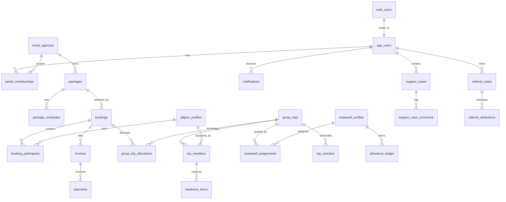

# UmrahHaji.com Database Schema

Status: Draft implementation schema  
Target DB: PostgreSQL / Supabase  
Date: 1 July 2026  
Scope: Admin Panel, Travel Agency Portal, Jamaah/User View, Mutawwif View  
Companion SQL: `outputs/umrahhaji_database_schema.sql`

---

## 1. Objective

This document defines the shared database schema for UmrahHaji.com across all roles and connected features.

It covers:

1. Account and role access.
2. Travel Agency operations.
3. Jamaah/pilgrim profile, booking, payment, trip, document, and support flows.
4. Mutawwif profile, assignment, schedule, guidance, allowance, payout, and support flows.
5. Admin-owned master data, policy, moderation, finance, reports, announcements, and audit.

The schema follows the PRD rule:

```text
Admin owns global control.
Travel Agency owns agency-scoped operations.
Jamaah owns customer-facing profile/booking view.
Mutawwif owns assigned-work and own account view.
```

---

## 2. Core Design Decisions

### 2.1 Supabase Auth Boundary

Use Supabase `auth.users` for login identity.

Application-specific tables should reference:

```sql
auth.users(id)
```

Primary user profile data lives in:

```text
app_users
```

Role-specific operational profiles live separately:

1. `pilgrim_profiles`
2. `mutawwif_profiles`
3. `travel_agency_staff`
4. `admin_staff_profiles`

One person can have more than one operational profile.

### 2.2 Role and Permission Model

Access is controlled through:

```text
app_users
-> portal_memberships
-> permission_groups
-> permission_group_rules
```

Supported portals:

1. `admin`
2. `travel_agency`
3. `jamaah`
4. `mutawwif`

Sensitive permissions are separate from basic view permission.

Examples:

1. View pilgrim list.
2. View passport data.
3. Download payment proof.
4. Export finance records.
5. Approve refund.
6. Update assignment.

### 2.3 Agency Scope

All Travel Agency-owned operational tables include:

```text
agency_id
```

Examples:

1. Packages.
2. Bookings.
3. Group trips.
4. Pilgrim records linked to agency.
5. Invoices.
6. Documents/readiness records.
7. Support cases.

Travel Agency users can only access rows where `agency_id` matches their membership.

### 2.4 Snapshot Rule

Operational records must preserve historical context.

Snapshot fields use `jsonb`:

1. Booking package snapshot.
2. Booking price snapshot.
3. Group trip package snapshot.
4. Group trip hotel/flight/itinerary snapshot.
5. Invoice item snapshot.
6. Referral attribution snapshot.
7. Assignment snapshot.

Do not silently rewrite snapshots after confirmation.

### 2.5 Status Naming

Backend statuses use lowercase snake_case.

Examples:

```text
draft
pending_review
need_revision
confirmed
partially_paid
verified
blocked
archived
```

UI labels can be human-readable English.

---

## 3. Role Relationship Summary

| Role | Main Tables | Scope |
| --- | --- | --- |
| Admin | `admin_staff_profiles`, master data, platform settings, audit, all operational tables | Platform-wide |
| Travel Agency | `travel_agencies`, `travel_agency_staff`, packages, bookings, group trips, finance, reports | Own agency |
| Jamaah/User | `pilgrim_profiles`, bookings, transactions, trip views, documents, referrals, reports | Own profile/linked records |
| Mutawwif | `mutawwif_profiles`, assignments, calendar/activity, allowance, payout, reports | Own profile/assigned trips |

---

## 4. High-Level ERD



---

## 5. Domain Schema

### 5.1 Account, Portal, and Permission

| Table | Purpose | Important Relations |
| --- | --- | --- |
| `app_users` | Application user profile linked to Supabase auth | `auth_user_id -> auth.users.id` |
| `portal_memberships` | User access to admin/TA/jamaah/mutawwif portal | `user_id`, optional `agency_id` |
| `permission_groups` | Role/permission group per portal/agency | optional `agency_id` |
| `permission_group_rules` | Module/action/sensitive permissions | `permission_group_id` |
| `admin_staff_profiles` | Admin staff metadata | `user_id` |
| `user_sessions` | Session visibility and revoke support | `user_id` |

Role relation:

1. Admin users have `portal_memberships.portal = admin`.
2. Travel Agency users have `portal = travel_agency` and `agency_id`.
3. Jamaah users have `portal = jamaah` and `pilgrim_profiles.user_id`.
4. Mutawwif users have `portal = mutawwif` and `mutawwif_profiles.user_id`.

### 5.2 Travel Agency

| Table | Purpose |
| --- | --- |
| `travel_agencies` | Agency identity and verification status |
| `travel_agency_documents` | Legal/license documents |
| `travel_agency_bank_accounts` | Bank/settlement info, masked |
| `travel_agency_staff` | Staff records inside an agency |
| `agency_activity_logs` | Agency-scoped operational logs |

Key relation:

```text
travel_agencies -> packages, bookings, group_trips, invoices, reports, announcements
```

### 5.3 Pilgrim / Jamaah

| Table | Purpose |
| --- | --- |
| `pilgrim_profiles` | Pilgrim/customer operational profile |
| `pilgrim_agency_links` | Which agency can access which pilgrim |
| `pilgrim_family_groups` | Family/group relationship container |
| `pilgrim_family_members` | Family/group membership |
| `pilgrim_documents` | Passport/IC/visa/vaccination/ticket files/status |
| `pilgrim_payment_methods` | Customer payment preferences if enabled |

Privacy rule:

Travel Agency and Mutawwif access is based on linked booking/trip/assignment, not global access to all pilgrims.

### 5.4 Mutawwif

| Table | Purpose |
| --- | --- |
| `mutawwif_profiles` | Mutawwif profile, verification, readiness |
| `mutawwif_documents` | License/certification/support documents |
| `mutawwif_languages` | Language/proficiency |
| `mutawwif_specializations` | Assignment specialization tags |
| `mutawwif_availability` | Availability/unavailable date ranges |
| `mutawwif_assignment_preferences` | Preferred role/group/language/destination |
| `mutawwif_payout_destinations` | Bank/e-wallet destination, masked |

### 5.5 Master Data

| Table | Owner | Used By |
| --- | --- | --- |
| `countries` | Admin | Profile, agency, package, trip |
| `cities` | Admin | Package, hotel, trip |
| `airlines` | Admin | Package and trip flights |
| `flights` | Admin | Package and trip flight snapshots |
| `hotels` | Admin | Package and trip hotel snapshots |
| `seasons` | Admin | Package schedules |
| `itinerary_templates` | Admin/TA if enabled | Package and trip schedule |
| `itinerary_template_items` | Admin/TA if enabled | Trip activity snapshot |
| `document_types` | Admin | Documents/readiness |
| `service_types` | Admin | Services/readiness |

### 5.6 Package

| Table | Purpose |
| --- | --- |
| `packages` | Agency-owned sellable package |
| `package_schedules` | Departure schedules |
| `package_prices` | Room/category/deposit pricing |
| `package_hotels` | Package hotel references/snapshot |
| `package_flights` | Package flight references/snapshot |
| `package_itinerary_items` | Package itinerary reference/snapshot |
| `package_media` | Gallery/brochure/thumbnail |
| `package_versions` | Published package version history |
| `package_readiness_items` | Publish readiness checklist |

Relation:

```text
travel_agencies -> packages -> package_schedules -> bookings
```

### 5.7 Booking

| Table | Purpose |
| --- | --- |
| `bookings` | Reservation record |
| `booking_participants` | Pilgrims inside booking |
| `booking_price_items` | Per participant/room/add-on price snapshot |
| `booking_documents_summary` | Booking-level document status projection |
| `booking_cancellations` | Cancellation/refund request trigger |
| `group_trip_allocations` | Confirmed booking participant allocation to group trip |

Booking owns commercial reservation state. Group Trip owns operational departure state.

### 5.8 Group Trip and Itinerary

| Table | Purpose |
| --- | --- |
| `group_trips` | Operational departure group |
| `trip_members` | Pilgrims assigned to group trip |
| `trip_family_groups` | Trip-level family/group containers |
| `trip_activities` | Dated itinerary/activity snapshot |
| `trip_hotels` | Trip hotel assignment snapshot |
| `trip_flights` | Trip flight assignment snapshot |
| `trip_transport_segments` | Transport information |
| `trip_room_assignments` | Rooming configuration |
| `trip_change_acknowledgements` | Mutawwif/pilgrim acknowledgement of changes |

### 5.9 Mutawwif Assignment and Handover

| Table | Purpose |
| --- | --- |
| `mutawwif_assignments` | Mutawwif assigned to group trip/activity |
| `mutawwif_assignment_requests` | Offer/accept/decline/acknowledge workflow |
| `mutawwif_assignment_handover_notes` | Replacement/handover note |
| `mutawwif_activity_signals` | Optional ready/started/completed/unable signal |

Relation:

```text
mutawwif_profiles -> mutawwif_assignments -> group_trips -> trip_activities
```

### 5.10 Documents and Services Readiness

| Table | Purpose |
| --- | --- |
| `document_requirements` | Required document rule per package/trip/context |
| `service_requirements` | Required service rule per package/trip/context |
| `readiness_items` | Member/trip document/service readiness item |
| `readiness_item_events` | Readiness status history |

Visibility:

1. TA/Admin can manage.
2. Jamaah can submit/view own where allowed.
3. Mutawwif can view safe summary only for assigned trip.

### 5.11 Finance, Payment, Allowance, Tip

| Table | Purpose |
| --- | --- |
| `invoices` | Customer/booking invoice |
| `invoice_items` | Itemized invoice lines |
| `payments` | Payment records and proof status |
| `refunds` | Refund request/status |
| `finance_ledger_entries` | Canonical money ledger |
| `commission_records` | Platform/agency commission snapshots |
| `settlement_batches` | Settlement preparation |
| `settlement_items` | Settlement lines |
| `allowance_records` | Mutawwif allowance/tip/reward source lines |
| `withdrawal_requests` | Mutawwif payout/withdrawal request |
| `payout_destinations` | Generic user payout destination |

Finance owner:

1. Admin/Finance and TA/Finance own approval/verification.
2. Jamaah and Mutawwif see released/safe projections.

### 5.12 Referral

| Table | Purpose |
| --- | --- |
| `referral_programs` | Program/rule definition |
| `referral_codes` | Code/link owner |
| `referral_clicks` | Click attribution |
| `referral_attributions` | Booking/referral attribution snapshot |
| `referral_rewards` | Reward eligibility/review/finance handoff |

Reward cannot become available balance until Finance approval/release.

### 5.13 Reports / Support

| Table | Purpose |
| --- | --- |
| `support_cases` | Shared report/case record |
| `support_case_comments` | Public/internal comments |
| `support_case_attachments` | Evidence files |
| `support_case_links` | Related booking/trip/activity/payment/profile context |

Visibility:

1. Admin sees platform cases based on permission.
2. TA sees agency-related cases.
3. Jamaah sees own cases.
4. Mutawwif sees own/assigned-context cases.

### 5.14 Notifications and Announcements

| Table | Purpose |
| --- | --- |
| `announcements` | Admin/TA created announcement |
| `announcement_audiences` | Target audience |
| `notifications` | User notification inbox |
| `notification_deliveries` | Email/WhatsApp/in-app delivery attempt |
| `notification_preferences` | Optional user channel preference |

In-app notification is the user-facing source of record.

### 5.15 Content, Guidance, Testimonials

| Table | Purpose |
| --- | --- |
| `article_categories` | Content category |
| `articles` | Guide/knowledge content |
| `article_context_links` | Article linked to package/trip/activity/document/payment/support context |
| `testimonials` | Feedback/testimonial record |
| `ratings` | Mutawwif/agency/package/trip rating record |

### 5.16 Platform Settings and Audit

| Table | Purpose |
| --- | --- |
| `platform_settings` | Platform-controlled settings/policies |
| `agency_settings` | Agency-controlled settings |
| `audit_logs` | Actor/action/entity/reason/IP/device |
| `stored_files` | File metadata and access policy |
| `file_access_logs` | Sensitive file view/download audit |
| `event_outbox` | Async event/notification/analytics outbox |

---

## 6. Role-Based Access Matrix

| Domain | Admin | Travel Agency | Jamaah/User | Mutawwif |
| --- | --- | --- | --- | --- |
| Users/accounts | Manage platform users | Manage agency staff | Own account | Own account |
| Agency profile | Review/approve | View/update own, submit review | Public view only | Related agency summary |
| Packages | Platform monitor/master assist | Own package CRUD | Browse/compare/book | Assigned trip snapshot only |
| Booking | Platform monitor/support | Own booking CRUD | Own booking/request | No booking management |
| Pilgrim profile | Platform/permission | Linked agency pilgrims | Own profile | Safe assigned trip context only |
| Group trip | Platform monitor | Own trip CRUD | Own trip view | Assigned trip view |
| Itinerary/activity | Master/template/supervision | Own trip schedule | Own trip itinerary | Assigned activity guidance |
| Documents/services | Policy/supervision | Manage linked readiness | Submit/view own | Safe summary only |
| Payment/invoice | Platform finance | Own agency finance | Own transactions | Own allowance/withdrawal view |
| Mutawwif assignment | Platform monitor | Assign/manage | View assigned mutawwif if released | Accept/acknowledge own assignment |
| Reports/support | Triage/manage | Agency cases | Own cases | Own/assigned-context cases |
| Notifications | Create/manage platform | Create agency announcements | Own inbox | Own inbox |
| Referral | Program/reward owner | Delegated review if enabled | Own referral | Own referral |
| Audit | Platform audit | Own agency audit subset | Own security history | Own security/history subset |

---

## 7. Supabase RLS Direction

Use Row Level Security for all application tables.

Recommended helper functions:

1. `current_app_user_id()`
2. `current_user_has_portal(portal_name)`
3. `current_user_agency_ids()`
4. `current_user_is_admin()`
5. `current_user_has_permission(module, action, sensitive_key)`

Policy examples:

1. Admin can read platform-wide rows if permission exists.
2. TA staff can read/write rows where `agency_id` belongs to their membership.
3. Jamaah can read/write own profile and own booking/payment/report rows.
4. Mutawwif can read assigned group trips through `mutawwif_assignments`.
5. Sensitive files require explicit file permission and logged access.

---

## 8. Implementation Sequence

Recommended migration order:

1. Extensions, enums/check conventions, utility functions.
2. Account/user/portal/permission tables.
3. Travel agencies and staff.
4. Pilgrim and mutawwif profiles.
5. Master catalogs.
6. Packages and package schedules.
7. Bookings and participants.
8. Invoices/payments/refunds/ledger.
9. Group trips, members, activities, assignments.
10. Documents/services readiness.
11. Notifications/announcements.
12. Reports/support.
13. Referral and rewards.
14. Allowance/withdrawal/payout destination.
15. Content/guidance/testimonials.
16. Settings/audit/event outbox.
17. RLS policies and indexes.

---

## 9. Open Engineering Decisions

Before final migration, decide:

1. Whether `app_users` mirrors Supabase auth metadata or stores only app-specific fields.
2. Whether statuses remain `text` with taxonomy validation or PostgreSQL enums.
3. Whether all files use one `stored_files` table or module-specific file references only.
4. Whether finance ledger is single-entry operational ledger or double-entry accounting.
5. Whether user payment methods and mutawwif payout destinations share a table.
6. Whether public package search uses normalized tables, materialized view, or search index.
7. Whether notifications are generated directly or through `event_outbox`.
8. Whether agency multi-branch support is deferred or modeled from day one.

---

## 10. Deliverables

This schema package includes:

1. `UmrahHaji_Database_Schema.md` - readable relational schema and role mapping.
2. `umrahhaji_database_schema.sql` - PostgreSQL/Supabase draft DDL.

