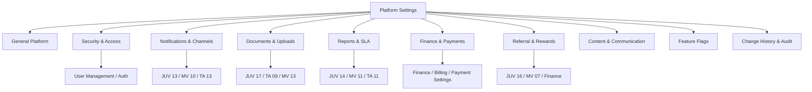
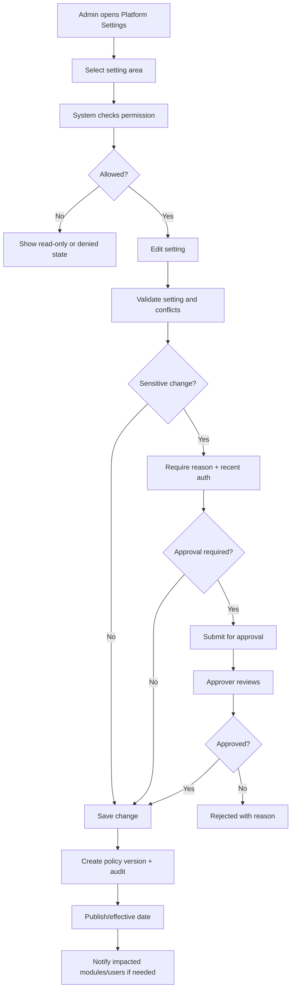

# Admin PRD - Platform Settings & Policy Configuration

Product: UmrahHaji.com Admin Panel  
Module: Platform Settings & Policy Configuration  
Scope: Admin Panel / Global Settings, Policy Registry, Cross-Role Configuration, Governance & Audit  
Platform: Responsive Web Platform  
Status: Draft  
Last Updated: 21 June 2026  

---

## 1. Objective

Platform Settings & Policy Configuration is the Admin-owned control center for global settings and cross-role policy rules that affect Admin Panel, Travel Agency Portal, Jamaah/User View, and Mutawwif View.

This module must help Admin answer:

1. Which settings are platform-controlled, agency-controlled, module-controlled, or user-controlled?
2. Which policies apply globally across all portals?
3. Which settings can Travel Agency configure, and which can only be viewed as read-only platform policy?
4. Which settings affect booking, documents, reports, notifications, referral attribution, finance, security, audit, and content?
5. Which changes require approval, reason, versioning, audit, or rollback?
6. Which policy changes should notify Travel Agency, Jamaah, Mutawwif, or internal Admin users?
7. Which settings are safe for Phase 1 and which must remain locked for future governance?

This module is not a replacement for each module's operational management screen. It defines global policy and platform-controlled defaults. Detailed workflows remain inside their owning modules, such as Finance Management, Announcement Management, Report Management, User Management, Package Management, Documents & Services, and Testimonials.

---

## 2. Relationship With Master PRD

This module follows the Admin Panel Master PRD:

1. Admin Panel includes Settings as a core system administration area.
2. Super Admin can manage system settings according to permission.
3. Admin roles and permissions are handled through User Management / Access Management.
4. Finance settings, report settings, announcement settings, and module-specific settings may be linked from Settings but remain governed by their module PRDs.
5. Settings changes are audit-sensitive because they can affect bookings, payment, notification, document upload, referral attribution, report SLA, privacy, and security.
6. Platform settings must respect data scope across Admin, Travel Agency, Jamaah, and Mutawwif surfaces.
7. Settings must use the Cross-Role Status & Event Taxonomy Appendix for canonical status, event, severity, and audit terminology.

---

## 3. Relationship With Admin, Travel Agency, Jamaah, and Mutawwif PRDs

| Source / Related Module | Relationship |
| --- | --- |
| Admin User Management | Owns roles, permissions, account status, session policy, password reset, security controls |
| Admin Finance / Billing | Owns invoice, payment, refund, commission, payout, gateway, tax, and finance settings |
| Admin Announcement Management | Owns announcement workflow, templates, delivery rules, and audience targeting |
| Admin Report Management | Owns report categories, severity, SLA, routing, escalation, and support settings |
| Admin Testimonial Management | Owns moderation, public display, feedback request, and testimonial settings |
| Admin Articles Management | Owns content categories, publish rules, language, and visibility settings |
| Admin Package / Booking / Group Trip | Own package, booking, cancellation, group trip, itinerary, and operational defaults |
| Admin Travel Agency Management | Owns agency application, verification, status, compliance, and platform-agency rules |
| Admin Jamaah / Mutawwif Management | Own profile, verification, readiness, status, and sensitive data visibility policy |
| TA PRD 15 - Settings | Agency can configure agency-controlled settings and view platform-controlled settings |
| JUV PRD 13/18 | Consumes notification/channel/security/account policy |
| JUV PRD 17 | Consumes upload limits, document rules, file policy, readiness taxonomy |
| MV PRD 10/16 | Consumes notification/channel/security/account policy |
| Cross-Role Taxonomy Appendix | Source of canonical status, event, report severity, audit action, and snapshot rules |

### 3.1 Key Sync Rule

Platform Settings owns global policy and default constraints. Module PRDs own operational workflows.

Platform Settings -> Module Policy Projection -> Admin/TA/JUV/MV Runtime Behavior -> Audit / Notification / Snapshot.

If a setting affects historical records, the owning module must store a snapshot/version used at the time of transaction or action.

### 3.2 Cross-Role Boundary

| Surface | Can Edit Platform Settings? | Can View Platform Settings? | Rule |
| --- | ---: | ---: | --- |
| Super Admin | Yes | Yes | Full access if permission granted |
| Admin | Permission-based | Permission-based | Sensitive settings require explicit permission |
| Finance Admin | Finance policy only | Relevant policy | No security/report override unless permission granted |
| Compliance Officer | Compliance/privacy/audit policy if granted | Relevant policy | Cannot edit finance/security unless granted |
| Support Staff | No by default | Limited | Can view support policy/SLA summary |
| Travel Agency Portal | No for platform settings | Read-only where relevant | TA can edit agency-controlled settings only |
| Jamaah/User View | No | Safe policy labels only | Account/document/payment/trip policies displayed as needed |
| Mutawwif View | No | Safe policy labels only | Account/assignment/payment/readiness policy displayed as needed |

---

## 4. Product Principles

1. Settings must not become an uncontrolled catch-all module.
2. Every setting must have an owner, scope, edit permission, audit requirement, and effective date behavior.
3. Platform-controlled settings are read-only outside Admin.
4. Module-controlled settings should deep-link to the owning module rather than be duplicated.
5. Sensitive changes require confirmation, reason, and audit.
6. Some policy changes require approval or scheduled activation.
7. User-facing modules should display policy effects in plain language, not internal configuration names.
8. Settings should support versioning so historical bookings, invoices, referrals, documents, and notifications remain explainable.
9. Default settings should be conservative and safe.
10. Settings should use the canonical taxonomy appendix for statuses, event keys, severity, and audit actions.

---

## 5. Scope

### 5.1 In Scope for Phase 1

1. Platform Settings overview.
2. Settings ownership registry.
3. Platform identity and localization settings.
4. Security and authentication policy summary/configuration.
5. Notification channel and mandatory category policy.
6. Document upload and file handling policy.
7. Report category, severity, SLA, and routing policy.
8. Audit retention and sensitive action policy.
9. Payment gateway/provider and finance policy summary with deep link to Finance.
10. Referral attribution and reward policy placeholder/registry.
11. Content and announcement policy summary.
12. Travel Agency platform-controlled settings view.
13. Feature flags and module enablement registry.
14. Policy versioning and effective date.
15. Approval workflow for sensitive setting changes where required.
16. Change history and audit log.
17. Role-based access and permission checks.
18. Empty/loading/error/locked states.
19. Mobile/tablet/desktop responsive layout.

### 5.2 In Scope for Phase 2

1. Full policy approval workflow with maker-checker.
2. Advanced feature flag rollout by agency/role/region.
3. System configuration export/import.
4. Multi-environment settings promotion.
5. Notification template localization management.
6. Advanced data retention and legal hold dashboard.
7. Referral and reward campaign management if not separated into a dedicated Admin PRD.
8. API/developer settings if platform opens public/partner APIs.
9. Settings impact simulation before activation.
10. Automated policy conflict detection.

### 5.3 Out of Scope

1. Daily operational booking management.
2. Document review/verification workspace.
3. Payment verification/refund execution.
4. Travel Agency team management detail.
5. User profile editing.
6. Content article editor.
7. Announcement creation workflow.
8. Report case handling workflow.
9. Direct database administration.
10. Developer/API credential management in Phase 1.

---

## 6. Users and Permissions

| Role | Access Behavior |
| --- | --- |
| Super Admin | Full settings access and sensitive policy management |
| Admin | Manage permitted settings only |
| Finance Admin | Finance/payment/refund/payout settings if granted |
| Operations Staff | View operational policy; edit limited operational defaults if granted |
| Compliance Officer | Manage privacy/audit/compliance policy if granted |
| Support Staff | View support/report SLA settings; cannot edit by default |
| Content Admin | Manage content/announcement/testimonial policy if granted |
| Auditor | Read-only access to settings and change history |
| Travel Agency Admin | Read-only platform policy; edit agency-controlled settings in TA Portal |

### 6.1 Permission Keys

| Permission Key | Description |
| --- | --- |
| admin.platform_settings.view | View settings overview |
| admin.platform_settings.manage_general | Manage general platform defaults |
| admin.platform_settings.manage_security | Manage auth/security/session policy |
| admin.platform_settings.manage_notifications | Manage notification/channel policy |
| admin.platform_settings.manage_documents | Manage upload/file/document policy |
| admin.platform_settings.manage_reports | Manage report category/SLA/routing policy |
| admin.platform_settings.manage_finance_policy | Manage finance/payment policy summary or deep-link settings |
| admin.platform_settings.manage_referral_policy | Manage referral attribution/reward policy if enabled |
| admin.platform_settings.manage_content_policy | Manage content/announcement/testimonial policy defaults |
| admin.platform_settings.manage_feature_flags | Manage module enablement/feature flags |
| admin.platform_settings.approve_sensitive_change | Approve sensitive settings change |
| admin.platform_settings.view_audit | View settings audit/change history |
| admin.platform_settings.export | Export settings/audit where allowed |

### 6.2 Sensitive Action Rules

Sensitive settings changes require:

1. Recent authentication or step-up verification.
2. Explicit permission.
3. Change reason.
4. Confirmation.
5. Audit event.
6. Effective date or immediate activation decision.
7. Notification if impacted users or agencies must know.

---

## 7. Setting Ownership Model

| Ownership Type | Editable in Admin Platform Settings | Example | Rule |
| --- | ---: | --- | --- |
| Platform-Controlled | Yes | Required MFA, upload limits, taxonomy, global report severity | Admin-only |
| Module-Controlled | Link/summary | Finance gateway, report routing, announcement templates | Owning module is source |
| Agency-Controlled | No, view defaults | Agency support contact, agency notification recipient | Edited in TA Settings |
| Permission-Controlled | Yes, if granted | Security, finance, referral, audit retention | Requires explicit permission |
| Verification-Controlled | Limited | Agency legal data, license fields | Changes may trigger review |
| User-Controlled | No, policy only | User language, optional notifications | Edited in JUV/MV Account Settings |
| System-Controlled | No direct edit | System-generated status, audit event IDs | Internal only |

### 7.1 Settings Ownership Registry

| Setting Area | Owner | Editable Here | Related PRD | Rule |
| --- | --- | ---: | --- | --- |
| Password/session/MFA policy | Admin User Management / Platform Settings | Yes | User Management, JUV 18, MV 16 | Sensitive, audit required |
| Portal access and permissions | User Management | Link | Module PRD User Management | Do not duplicate permission matrix |
| Notification channels | Announcement/Notification + Platform Settings | Yes | JUV 13, MV 10, TA 13 | Mandatory channels locked |
| Notification templates | Announcement Management | Link/Phase 2 | Announcement PRD | Template changes require preview |
| Document upload limits | Platform Settings | Yes | JUV 17, TA 09, MV 13 | Platform-controlled |
| Document type rules | Admin/TA Docs configuration | Summary/link | TA 09, JUV 17 | Snapshot required |
| Report categories/SLA | Report Management + Platform Settings | Yes/link | Admin Report, JUV 14, MV 11, TA 11 | Shared taxonomy |
| Audit retention | Platform Settings / Compliance | Yes | All PRDs | Sensitive |
| Payment gateway provider | Finance Management | Link/summary | Finance/Billing, TA 10 | Finance owner |
| Refund/payout threshold | Finance Management | Link/summary | JUV 08, MV 09/14 | Finance owner |
| Referral attribution priority | Platform Settings / Referral policy | Yes if no dedicated Referral Admin | JUV 16, MV 07 | Snapshot at booking |
| Referral reward rules | Finance / Referral Management | Link/placeholder | JUV 16, MV 07 | Needs dedicated owner if rewards launch |
| Content categories | Articles Management | Link/summary | JUV 09, MV 12, TA 14 | Content owner |
| Testimonial moderation rules | Testimonial Management | Link/summary | JUV 15, MV 15, TA 12 | Consent required |
| Feature flags | Platform Settings | Yes | All modules | Audit and rollout required |

---

## 8. Information Architecture

```text
Platform Settings
+-- Overview
|   +-- Settings Health
|   +-- Locked / Pending Approval
|   +-- Recent Changes
+-- General Platform
|   +-- Localization
|   +-- Supported Countries / Currencies
|   +-- Public Contact / Support Defaults
+-- Security & Access Policy
|   +-- Password Policy
|   +-- MFA / Step-Up
|   +-- Session Timeout
|   +-- Login Alerts
+-- Notifications & Channels
|   +-- Channel Availability
|   +-- Mandatory Categories
|   +-- Rate Limits
|   +-- Quiet Hours Policy
+-- Documents & Uploads
|   +-- File Types
|   +-- Upload Limits
|   +-- Retention
|   +-- Secure File Access
+-- Reports & SLA
|   +-- Categories
|   +-- Severity
|   +-- SLA
|   +-- Routing Defaults
+-- Finance & Payments
|   +-- Payment Policy Summary
|   +-- Refund / Payout Policy Summary
|   +-- Finance Deep Links
+-- Referral & Rewards
|   +-- Attribution Priority
|   +-- Disclosure Policy
|   +-- Reward Policy Placeholder
+-- Content & Communication
|   +-- Announcement Policy
|   +-- Article Policy
|   +-- Testimonial Policy
+-- Feature Flags
|   +-- Module Enablement
|   +-- Role / Agency Rollout
+-- Change History & Audit
    +-- Policy Versions
    +-- Approvals
    +-- Exports
```



---

## 9. Main Settings Change Flow



---

## 10. Screens and Functional Areas

### 10.1 Settings Overview

| Element | Requirement |
| --- | --- |
| Settings health | Shows configured, missing, locked, pending approval |
| Search | Search setting name, owner, module, policy key |
| Category cards | Security, Notification, Documents, Reports, Finance, Referral, Content, Feature Flags |
| Recent changes | Last changed by, date, setting area |
| Pending approvals | Sensitive changes awaiting approval |
| Platform-controlled label | Clearly marks locked/global settings |
| Module link | Opens owning module when setting is module-controlled |

### 10.2 General Platform Settings

| Setting | Owner | Phase | Notes |
| --- | --- | --- | --- |
| Default timezone | Platform Settings | P1 | Used as fallback only |
| Supported languages | Platform Settings | P1 | User-facing language availability |
| Supported currencies | Finance/Platform | P1 | Finance-controlled options |
| Supported country codes | Platform Settings | P1 | Phone/address defaults |
| Public support defaults | Support/Platform | P1 | Fallback contact routes |
| Maintenance banner | Announcement/Platform | P2 | If enabled |

### 10.3 Security & Access Policy

| Setting | Phase | Rule |
| --- | --- | --- |
| Password minimum length | P1 | Must support long passphrases |
| Block common/breached password | P1 | Recommended |
| OTP expiry | P1 | Applies to auth/verification |
| OTP resend limit | P1 | Rate-limited |
| Session idle timeout | P1 | Portal-specific if needed |
| Session absolute timeout | P1 | Security policy |
| Require recent auth window | P1 | For sensitive actions |
| MFA requirement | P1/P2 | Required if policy decides |
| Login alert policy | P1 | Security notifications mandatory |
| Account lock threshold | P1 | Admin/Auth-controlled |

Rules:

1. Security policy applies across Admin, TA, JUV, and MV based on portal sensitivity.
2. User-facing account settings can display safe policy labels but cannot override them.
3. Security changes require audit.

### 10.4 Notifications & Channels

| Setting | Phase | Rule |
| --- | --- | --- |
| Channel availability | P1 | In-app, email, WhatsApp/SMS if provider enabled |
| Mandatory notification categories | P1 | Security, safety, account, critical payment/document/trip/support |
| Optional categories | P1 | Marketing, guidance, referral digest, feedback reminders |
| Rate limits | P1 | Prevent spam |
| Quiet hours policy | P2 | Must not block emergency/critical |
| Template localization | P2 | Content owner/template owner |
| Delivery retry policy | P1/P2 | Provider-dependent |

Mandatory categories must align with JUV PRD 18, MV PRD 16, JUV PRD 13, and MV PRD 10.

### 10.5 Documents & Uploads

| Setting | Phase | Rule |
| --- | --- | --- |
| Allowed file types | P1 | Platform-controlled |
| Max file size | P1 | Platform-controlled |
| Malware scanning requirement | P1 | Required for sensitive docs |
| Signed URL expiry | P1 | Secure file access |
| File retention policy | P1 | Compliance-controlled |
| Document type registry | P1/P2 | May link to module owner |
| Expiry reminder thresholds | P1 | Used by JUV 17 / TA 09 |
| Upload metadata stripping | P1/P2 | Privacy policy |

Rules:

1. TA can view platform upload limits but cannot override them unless future policy allows agency-specific stricter limits.
2. JUV and MV must never expose raw storage paths.
3. Sensitive file access must be audited.

### 10.6 Reports & SLA

| Setting | Phase | Rule |
| --- | --- | --- |
| Report categories | P1 | Use taxonomy appendix |
| Severity levels | P1 | s1_emergency to s5_low |
| Default SLA | P1 | Per category/severity |
| Auto-routing | P1/P2 | Owner module determines detail |
| Escalation rules | P1 | Emergency and critical support |
| Reopen window | P1/P2 | Policy-controlled |
| Attachment limits | P1 | Use upload policy |
| Internal/public reply rules | P1 | Privacy-safe |

Rules:

1. Emergency severity must bypass optional notification preferences.
2. Report previews must mask sensitive fields.
3. Category/severity changes should be versioned.

### 10.7 Finance & Payments

Finance settings are mostly module-controlled by Finance/Billing. Platform Settings provides summary, global constraints, and links.

| Setting | Owner | Editable Here | Rule |
| --- | --- | ---: | --- |
| Payment gateway provider | Finance | No/link | Finance owns |
| Supported payment methods | Finance | Summary/link | Snapshot by invoice/booking |
| Refund policy defaults | Finance | Summary/link | Finance owns |
| Payout/withdrawal threshold | Finance | Summary/link | Finance owns |
| Receipt/invoice numbering | Finance | No/link | Finance owns |
| Finance notification categories | Finance/Notification | Limited | Mandatory critical events |
| Tax/currency defaults | Finance | Limited/link | Finance-controlled |

Rules:

1. Finance-sensitive settings require Finance permission.
2. Platform Settings must not execute payment/refund/payout.
3. Historical invoices and transactions must retain snapshot.

### 10.8 Referral & Rewards

This section exists because JUV and MV Referral now depend on shared back-office policy.

| Setting | Phase | Rule |
| --- | --- | --- |
| Referral enabled | P1 if referral launches | Global or role-specific |
| Referrer roles allowed | P1 | Jamaah, Mutawwif, or both |
| Attribution priority | P1 | first_click, last_click, manual_code, campaign_priority |
| Attribution lock point | P1 | Recommended: booking submitted |
| Self-referral rule | P1 | Block/review |
| Duplicate referral rule | P1 | Configurable |
| Disclosure text template | P1 | Mandatory if benefit may apply |
| Reward type | P1/P2 | none, voucher, wallet, cash, donation |
| Reward approval owner | P1/P2 | Finance/Admin |
| Reversal rule | P1/P2 | Cancellation/refund/fraud/correction |

Rules:

1. If referral reward launches, a dedicated Admin Referral & Reward Management PRD is recommended.
2. Referral status shown in JUV/MV must be conservative until Finance/Admin releases approval.
3. Attribution changes after lock require reason and audit.

### 10.9 Content & Communication Policy

| Setting | Owner | Rule |
| --- | --- | --- |
| Article categories | Articles Management | Content owner |
| Guidance taxonomy | Articles/Guidance | Cross-role content taxonomy |
| Announcement approval rule | Announcement Management | Workflow owner |
| Testimonial moderation default | Testimonial Management | Consent/moderation owner |
| Public display consent | Testimonial Management | Required |
| Marketing consent default | Account/Notification policy | Off unless consent allows |

### 10.10 Feature Flags

| Field | Required | Notes |
| --- | --- | --- |
| feature_key | Yes | Stable key |
| feature_name | Yes | Human-readable |
| module | Yes | Owning module |
| target_role | Yes | Admin, TA, Jamaah, Mutawwif |
| rollout_scope | Yes | Global, agency, role, user segment |
| status | Yes | disabled, internal, beta, enabled, deprecated |
| effective_at | Optional | Scheduled activation |
| expires_at | Optional | Temporary flags |
| owner | Yes | Business/technical owner |
| audit_required | Yes | Usually yes |

Rules:

1. Feature flags must not bypass permission checks.
2. Disabling a feature must define fallback behavior.
3. Sensitive features need approval before rollout.

---

## 11. Data and Field Requirements

### 11.1 PlatformSetting

| Field | Required | Notes |
| --- | --- | --- |
| setting_id | Yes | Unique setting |
| setting_key | Yes | Stable key |
| setting_group | Yes | security, notification, documents, reports, finance, referral, content, feature |
| owner_module | Yes | Source/owner |
| ownership_type | Yes | platform, module, agency, user, system |
| value_type | Yes | boolean, enum, string, number, json, reference |
| current_value | Conditional | Stored value if owned here |
| effective_value | Yes | Resolved runtime value |
| editable_here | Yes | Boolean |
| sensitivity | Yes | low, medium, high, restricted |
| status | Yes | active, draft, pending_approval, archived |
| version | Yes | Policy version |
| effective_at | Optional | Activation timestamp |
| updated_by | Optional | Last actor |
| updated_at | Yes | Timestamp |

### 11.2 SettingChangeRequest

| Field | Required | Notes |
| --- | --- | --- |
| change_request_id | Yes | Unique request |
| setting_key | Yes | Target setting |
| old_value | Yes | Previous value |
| new_value | Yes | Proposed value |
| change_reason | Yes | Required for sensitive |
| requested_by | Yes | Actor |
| approval_required | Yes | Boolean |
| approval_status | Yes | not_required, pending, approved, rejected |
| approved_by | Conditional | Approver |
| effective_at | Optional | Scheduled |
| created_at | Yes | Timestamp |

### 11.3 PlatformPolicyVersion

| Field | Required | Notes |
| --- | --- | --- |
| policy_version_id | Yes | Unique version |
| policy_area | Yes | security, reports, documents, etc. |
| version_label | Yes | Example v1.0 |
| effective_from | Yes | Start timestamp |
| effective_until | Optional | End timestamp |
| status | Yes | draft, active, retired |
| summary | Yes | Human-readable |
| created_by | Yes | Actor |
| created_at | Yes | Timestamp |

### 11.4 SettingsAuditEvent

| Field | Required | Notes |
| --- | --- | --- |
| audit_id | Yes | Unique audit event |
| actor_id | Yes | Actor |
| actor_role | Yes | Super Admin, Finance Admin, etc. |
| action | Yes | view, update, approve, reject, export, override |
| setting_key | Conditional | Related setting |
| target_type | Yes | setting, policy_version, feature_flag, change_request |
| target_id | Yes | Related record |
| result | Yes | success, failed, blocked |
| reason_code | Conditional | Required for override/reject |
| occurred_at | Yes | Timestamp |
| metadata_visibility | Yes | internal, audit_only |

---

## 12. API and Event Requirements

### 12.1 API Endpoints

| Method | Endpoint | Purpose |
| --- | --- | --- |
| GET | /admin/platform-settings | Load settings overview |
| GET | /admin/platform-settings/{group} | Load setting group |
| PATCH | /admin/platform-settings/{setting_key} | Update editable setting |
| POST | /admin/platform-settings/change-requests | Submit sensitive setting change |
| POST | /admin/platform-settings/change-requests/{id}/approve | Approve change |
| POST | /admin/platform-settings/change-requests/{id}/reject | Reject change |
| GET | /admin/platform-settings/policy-versions | List policy versions |
| GET | /admin/platform-settings/feature-flags | List feature flags |
| PATCH | /admin/platform-settings/feature-flags/{feature_key} | Update feature flag |
| GET | /admin/platform-settings/audit | View settings audit |

### 12.2 Event Triggers

| Event | Trigger | Recipient |
| --- | --- | --- |
| platform_setting.updated | Setting changed | Audit, impacted module |
| platform_setting.pending_approval | Sensitive change submitted | Approver |
| platform_setting.approved | Change approved | Requester, impacted module |
| platform_setting.rejected | Change rejected | Requester |
| platform_policy.version_activated | Policy version becomes active | Impacted modules |
| feature_flag.updated | Feature rollout changed | Audit, impacted module |
| security_policy.changed | Security setting changed | Admin/Auth, optional affected roles |
| notification_policy.changed | Channel/mandatory category changed | Notification system |
| document_policy.changed | Upload/file policy changed | Docs modules |
| report_policy.changed | Category/SLA changed | Report modules |
| referral_policy.changed | Attribution/reward policy changed | Referral modules |

---

## 13. Functional Requirements

| ID | Requirement | Priority |
| --- | --- | --- |
| ADM-PSET-001 | System shall provide Platform Settings overview | P1 |
| ADM-PSET-002 | System shall classify settings by ownership type | P1 |
| ADM-PSET-003 | System shall show whether setting is editable, linked, or read-only | P1 |
| ADM-PSET-004 | System shall support security/auth policy management | P1 |
| ADM-PSET-005 | System shall support notification/channel policy management | P1 |
| ADM-PSET-006 | System shall support document/upload policy management | P1 |
| ADM-PSET-007 | System shall support report category/severity/SLA policy management | P1 |
| ADM-PSET-008 | System shall show finance/payment policy summary and deep links | P1 |
| ADM-PSET-009 | System shall support referral attribution policy placeholder/management | P1 |
| ADM-PSET-010 | System shall support feature flag/module enablement registry | P1 |
| ADM-PSET-011 | System shall require permission for each setting group | P1 |
| ADM-PSET-012 | System shall require reason for sensitive setting changes | P1 |
| ADM-PSET-013 | System shall create policy version for applicable changes | P1 |
| ADM-PSET-014 | System shall create audit log for view/change/approve/export actions | P1 |
| ADM-PSET-015 | System shall deep-link module-controlled settings to owner modules | P1 |
| ADM-PSET-016 | System shall show pending approval workflow for sensitive changes if enabled | P1/P2 |
| ADM-PSET-017 | System shall expose read-only platform policy to TA settings where relevant | P1 |
| ADM-PSET-018 | System shall use canonical taxonomy appendix for status/event/severity names | P1 |
| ADM-PSET-019 | System shall support empty/loading/error/locked states | P1 |
| ADM-PSET-020 | System shall support export of settings/audit where permission allows | P2 |

---

## 14. Acceptance Criteria

1. Super Admin can open Platform Settings from Admin Settings navigation.
2. Settings overview shows categories, ownership type, editability, last updated, and status.
3. A setting owned by another module is shown as linked/summary and opens the owning module.
4. Travel Agency settings can display platform-controlled settings as read-only where relevant.
5. Security policy changes require explicit permission and audit.
6. Notification mandatory categories cannot be disabled by non-authorized users.
7. Document upload limits can be configured only by authorized Admin.
8. Report severity/SLA settings use canonical taxonomy values.
9. Referral attribution priority can be configured or shown as placeholder based on feature state.
10. Finance settings summary does not execute payment/refund/payout actions.
11. Sensitive changes require reason and create SettingsAuditEvent.
12. Policy version is created when a setting affects historical or future transactional behavior.
13. Feature flags cannot bypass permission checks.
14. All deep links re-check permission.
15. Mobile/tablet/desktop layouts remain readable.

---

## 15. Security, Privacy, and Compliance

1. Platform Settings requires Admin authentication.
2. Sensitive settings require recent authentication or step-up verification.
3. Changes to security, finance, document, report, referral, and audit policies require audit.
4. Settings values must not expose secrets such as gateway keys, API tokens, password hashes, or provider credentials.
5. Secret management is out of scope for Phase 1 unless handled through secure vault integration.
6. Exporting settings or audit requires explicit permission.
7. Policy changes affecting users should trigger safe notification where required.
8. Audit records should be append-only.
9. Settings must not expose other agencies' private configuration unless Admin permission allows platform oversight.
10. Rollback must preserve previous policy versions and audit trail.

---

## 16. UI States

| State | Behavior |
| --- | --- |
| Loading | Show skeleton cards/list |
| Empty | Show no settings configured for group |
| Read-only | Show lock and ownership reason |
| Permission denied | Show safe access denied |
| Pending approval | Show requested change and approver status |
| Save success | Show saved/versioned status |
| Save failed | Show error and retry |
| Conflict detected | Show conflicting policy/module owner |
| Effective later | Show scheduled activation date |
| Locked by platform | Show platform-controlled label |
| Module-controlled | Show summary and deep link |

---

## 17. Risks and Mitigations

| Risk | Impact | Mitigation |
| --- | --- | --- |
| Settings becomes catch-all | Confusing ownership | Use ownership registry and module links |
| Wrong setting changes live records | Operational/finance risk | Versioning and snapshots |
| TA overrides platform policy | Compliance/security risk | Read-only platform-controlled settings |
| Sensitive change without audit | Governance risk | Mandatory audit/reason |
| Feature flag bypasses permission | Security risk | Permission checks remain authoritative |
| Finance settings duplicated | Data inconsistency | Link to Finance owner |
| Referral reward policy unclear | Disputes | Create dedicated Referral/Reward PRD if rewards launch |
| Notification policy disables safety alerts | Safety risk | Mandatory categories locked |

---

## 18. Release Plan

### Phase 1

1. Platform Settings overview.
2. Ownership registry.
3. Security/auth policy.
4. Notification/channel policy.
5. Document/upload policy.
6. Report/SLA policy.
7. Finance summary and links.
8. Referral attribution placeholder/policy.
9. Feature flag registry.
10. Policy versioning.
11. Settings audit log.

### Phase 2

1. Maker-checker approval workflow.
2. Settings import/export.
3. Advanced rollout targeting.
4. Policy simulation.
5. Conflict detection.
6. Secret vault integration.
7. Referral/reward campaign management if not split out.

---

## 19. Open Questions

1. Should Settings use maker-checker approval in Phase 1 for security/finance/referral policies?
2. Which settings must have scheduled effective dates?
3. Should referral reward policy live here, in Finance, or in a dedicated Admin Referral PRD?
4. Which settings can Travel Agency override with stricter agency-level values?
5. What is the audit retention period for settings changes?
6. Should feature flags support per-agency rollout in Phase 1?
7. How should policy changes notify affected Travel Agencies or users?
8. Should platform settings expose a read-only API for portals to fetch policy labels?

---

## 20. Final Product Decision

Platform Settings & Policy Configuration should be implemented as the Admin-owned global policy and configuration registry for UmrahHaji.com.

Phase 1 should include ownership registry, security policy, notification policy, document/upload policy, report/SLA taxonomy, finance policy summary links, referral attribution policy placeholder, feature flags, policy versioning, and settings audit logs.

The module must clearly separate platform-controlled, module-controlled, agency-controlled, user-controlled, and system-controlled settings. It should stabilize cross-role behavior without replacing the detailed operational workflows owned by Finance, Reports, Announcements, Documents, Booking, Package, User Management, or Travel Agency Portal modules.
