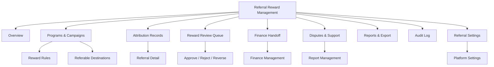
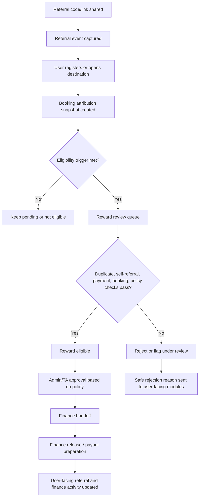

# Admin/TA PRD - Referral Reward Management

Product: UmrahHaji.com Admin Panel and Travel Agency Portal  
Module: Referral Reward Management  
Scope: Admin Panel / Travel Agency Portal / Referral Campaign, Attribution Review, Reward Approval, Finance Handoff  
Platform: Responsive Web Platform  
Status: Draft  
Last Updated: 21 June 2026  

---

## 1. Objective

Referral Reward Management is the back-office module for configuring referral programs, reviewing referral attribution, validating reward eligibility, approving or rejecting rewards, managing reversals, and handing approved rewards to Finance.

This module must help Admin and Travel Agency teams answer:

1. Which referral programs are active for jamaah and mutawwif?
2. Which packages, agencies, campaigns, or user roles are eligible for referral?
3. What reward rule applies to each referral record?
4. Which referral events converted into registration, booking, payment, or completed trip?
5. Which referrals are eligible, pending review, rejected, expired, reversed, or ready for finance release?
6. Which reward amounts are estimates, approved amounts, paid/released amounts, or reversed amounts?
7. Which referrals need fraud, duplicate, self-referral, payment, booking, or compliance review?
8. Which rewards should be sent to Finance, payout preparation, user-facing transaction history, or mutawwif finance activity?
9. Which corrections were made, by whom, for what reason, and with what user-facing impact?

This module is not a public referral dashboard, not a booking editor, not a payment collection flow, not a payout execution engine, and not a multi-level marketing compensation system. Jamaah/User View and Mutawwif View display own referral status. Admin/TA Referral Reward Management owns policy, review, reward decision, audit, and finance handoff.

---

## 2. Relationship With Master PRD

This module closes the cross-role gap identified in the all-role synchronization audit:

1. JUV PRD 16 and MV PRD 07 already define referral sharing, link/code display, masked referral history, and user-safe eligibility status.
2. Admin Finance Management owns payout, reversal, settlement, receipts, and finance audit.
3. TA Finance Management owns agency-scoped invoice, payment, refund, settlement, and finance reporting where delegated.
4. Platform Settings owns global referral policy defaults and feature flag / policy registry.
5. Referral Reward Management is needed as the operational back-office owner between referral attribution and finance release.

The module must use the Cross-Role Status & Event Taxonomy Appendix for canonical status, event, audit, reason code, and visibility naming.

---

## 3. Relationship With Admin, Travel Agency, Jamaah, and Mutawwif PRDs

| Source / Related Module | Relationship |
| --- | --- |
| Admin Platform Settings | Defines global referral feature flag, policy ownership, disclosure, and platform-controlled defaults |
| Admin User Management | Controls staff access, role permission, sensitive action access, account lock/suspend |
| Admin Travel Agency Management | Controls agency eligibility, agency status, verification, and platform-agency policy |
| Admin Package Management | Source of referable package, package status, public snapshot, and campaign eligibility |
| Admin Booking Management | Source of booking attribution snapshot, booking status, duplicate booking, cancellation, completion |
| Admin Billing & Payment | Source of invoice/payment status used for reward eligibility |
| Admin Finance Management | Owns approved reward release, payout preparation, reversal, settlement, statement, and finance audit |
| Admin Report Management | Receives referral dispute, abuse, missing attribution, or fraud review support cases |
| TA Settings | Shows platform-controlled referral defaults and allows agency-controlled campaign settings where delegated |
| TA Package Management | Agency controls package participation if referral program is agency-scoped |
| TA Booking Management | Provides agency booking conversion and cancellation state |
| TA Finance Management | Receives agency-scoped reward/settlement records if agency handles rewards |
| JUV PRD 16 - Referral | Consumes own referral code, referral list, eligibility status, safe reward status |
| MV PRD 07 - Referral | Consumes own mutawwif referral code, referral records, eligibility, and safe reward status |
| JUV Transaction History | Shows released referral reward records after finance release |
| MV PRD 14 - Finance Activity | Shows released referral reward activity for mutawwif after Finance release |
| JUV/MV Payment Settings | Owns payout destination readiness only when reward withdrawal is enabled |
| JUV/MV Notifications | Receives referral status, policy update, expiry, rejection, approval, reversal notifications |
| Cross-Role Taxonomy Appendix | Source of canonical statuses, event names, reason codes, audit actions, and snapshot rules |

### 3.1 Key Sync Rule

Referral Reward Management reads immutable referral attribution snapshots and booking/payment eligibility snapshots, then writes reward decisions and finance handoff records.

Referral Code/Link -> Referral Event -> Booking Attribution Snapshot -> Payment Eligibility Snapshot -> Reward Review -> Reward Decision -> Finance Handoff -> User-Facing Referral / Finance Activity Status.

Historical attribution must not be silently rewritten. Any correction requires permission, reason code, old value, new value, effective timestamp, audit event, and user-facing notification when status or reward expectation changes.

### 3.2 Cross-Role Boundary

| Surface | Owns | Can Edit Reward Decision? | Can View Reward Status? | Rule |
| --- | --- | ---: | ---: | --- |
| Super Admin | Global policy, override, audit, final approval | Yes | Yes | Full permission required |
| Admin Referral Ops | Campaign, attribution review, non-finance decision | Permission-based | Yes | Cannot execute payout |
| Admin Finance | Finance approval, release, payout, reversal | Yes, finance stage | Yes | Finance remains source for paid/released |
| Travel Agency Owner/Admin | Agency campaign and agency-scoped review if delegated | Permission-based | Own agency only | Cannot override platform/global rules |
| TA Finance Staff | Agency-scoped reward settlement if delegated | Permission-based | Own agency only | No platform-wide access |
| Jamaah/User View | Own referral sharing and status | No | Own safe status only | No internal notes/fraud/payment detail |
| Mutawwif View | Own referral sharing and status | No | Own safe status only | No internal notes/fraud/payment detail |
| Support Staff | Support/dispute review | No by default | Limited | Safe context only |
| Auditor | Read-only audit | No | Yes | Cannot mutate |

---

## 4. Product Principles

1. Referral reward must be auditable from click/code use through finance release.
2. A referral code/link does not guarantee reward, discount, commission, booking approval, or package availability.
3. Reward amount shown before approval must be labeled as estimated, potential, pending, or eligible.
4. Approved reward is not the same as paid or released reward.
5. Payout destination setup belongs to Payment Settings; payout execution belongs to Finance.
6. Travel Agency can manage only agency-scoped referral settings and records if platform delegates that control.
7. Platform-controlled rules cannot be overridden by Travel Agency.
8. User-facing modules must receive safe statuses and safe reason labels only.
9. Internal fraud signals, finance notes, risk scores, payment proof, IC/passport, and payout credentials must not be exposed to JUV/MV.
10. Every rejection, reversal, override, manual correction, export, and finance handoff must be logged.

---

## 5. Scope

### 5.1 In Scope for Phase 1

1. Referral Reward Management overview dashboard.
2. Referral program and campaign registry.
3. Global/platform-controlled referral rule summary.
4. Agency-scoped referral campaign configuration where delegated.
5. Referrer eligibility rules for jamaah and mutawwif.
6. Referable destination management: package, agency profile, campaign page, registration, or booking flow.
7. Reward rule configuration: fixed amount, percentage, voucher/credit label, no-reward attribution-only.
8. Referral attribution list with filters and search.
9. Referral detail with attribution timeline.
10. Booking/payment eligibility snapshot display.
11. Duplicate, self-referral, suspicious, cancelled, refunded, unpaid, expired, and policy mismatch review states.
12. Reward eligibility review.
13. Approve/reject/reverse reward.
14. Manual correction with reason and audit.
15. Finance handoff for approved/released rewards.
16. User-facing status projection for JUV/MV.
17. Notification triggers for approved, rejected, expired, reversed, and policy updated.
18. Referral dispute/support handoff.
19. Export for permitted Admin/Finance users.
20. Role-based access and agency scoping.
21. Empty/loading/error/permission/locked states.

### 5.2 In Scope for Phase 2

1. Multi-level approval / maker-checker.
2. Fraud scoring dashboard.
3. Advanced campaign segmentation by role, agency, region, season, package type, and date.
4. Referral dispute evidence upload and decision workflow.
5. Multi-currency reward rules.
6. Bulk approval and bulk reversal with strict controls.
7. Automated reward release after configurable hold period.
8. Campaign performance analytics.
9. UTM/source analytics.
10. Social asset management.
11. API partner referral attribution.
12. Tax/withholding reporting if legally required.

### 5.3 Out of Scope

1. Public referral dashboard.
2. Jamaah/mutawwif code/link sharing UI.
3. Booking creation or booking editing.
4. Payment collection or payment verification.
5. Payout destination setup.
6. Automated payout execution.
7. Full accounting ledger.
8. Payroll.
9. Tax filing.
10. Multi-level marketing compensation tree.
11. Contact scraping or automated invitation blasting.
12. Exposing internal fraud/risk score to users.

---

## 6. Users and Permissions

| Role | Access Behavior |
| --- | --- |
| Super Admin | Full referral policy, campaign, review, approval, reversal, export, and audit access |
| Admin Referral Manager | Manage programs/campaigns, review attribution, approve non-finance reward decisions if granted |
| Admin Finance | Approve finance release, create finance handoff, reverse released rewards, export finance records |
| Admin Operations | View referral impact on booking/trip readiness; cannot approve reward by default |
| Admin Support | View safe referral context and create/update support cases |
| Compliance Officer | View and manage compliance/fraud review if granted |
| Auditor | Read-only referral and reward audit |
| Travel Agency Owner | Manage agency-scoped campaign if delegated; view own agency records |
| Travel Agency Admin | Permission-based campaign and review access for own agency |
| Travel Agency Finance Staff | Agency-scoped reward/settlement view if delegated |
| Travel Agency Sales/Marketing | View campaign performance if permitted; no reward approval by default |

### 6.1 Permission Keys

| Permission Key | Description |
| --- | --- |
| admin.referral.view | View global referral dashboard and records |
| admin.referral.program.manage | Create/update referral program and campaign |
| admin.referral.policy.manage | Manage platform referral rules |
| admin.referral.attribution.view | View referral attribution list/detail |
| admin.referral.attribution.correct | Correct attribution with reason |
| admin.referral.reward.review | Review reward eligibility |
| admin.referral.reward.approve | Approve reward before finance handoff |
| admin.referral.reward.reject | Reject reward with reason |
| admin.referral.reward.reverse | Reverse reward with reason |
| admin.referral.finance_handoff.create | Send approved reward to Finance |
| admin.referral.audit.view | View referral audit trail |
| admin.referral.export | Export referral/reward records |
| ta.referral.view | View agency-scoped referral dashboard |
| ta.referral.campaign.manage | Manage agency-scoped campaign if delegated |
| ta.referral.attribution.view | View own agency referral records |
| ta.referral.reward.review | Review own agency reward eligibility if delegated |
| ta.referral.reward.recommend | Recommend approval/rejection where platform retains final approval |
| ta.referral.export | Export own agency referral records if permitted |

### 6.2 Sensitive Action Rules

Sensitive actions require explicit permission, reason, confirmation, and audit:

1. Campaign launch.
2. Reward rule change.
3. Attribution correction.
4. Reward approval.
5. Reward rejection.
6. Reward reversal.
7. Finance handoff.
8. Bulk export.
9. Manual override.
10. User-facing status correction.

---

## 7. Ownership Model

| Object / Rule | Owner | TA Editable? | User-Facing Visibility |
| --- | --- | ---: | --- |
| Global referral enablement | Admin Platform Settings | No | Safe enabled/disabled label |
| Referral program | Admin Referral | If delegated for agency program | Program terms summary |
| Agency participation | Admin + TA | Yes, own agency if eligible | Agency/package campaign label |
| Referable package list | Package owner + Referral policy | Agency packages only | Public package card |
| Referral code/link generation | Referral service | No | Own code/link only |
| Attribution priority | Admin Referral policy | No | Applied/invalid status only |
| Reward rule | Admin Referral / Finance | Agency-specific if delegated | Estimated/potential label |
| Reward approval | Admin Referral / Finance | Recommend or approve if delegated | Approved/pending/rejected status |
| Payout destination | JUV/MV Payment Settings | No | Masked own destination only |
| Payout execution | Finance/Admin/provider | No | Paid/processing/failed status after release |
| Fraud/internal notes | Admin/Compliance | No | Hidden |
| Audit log | Admin Audit | No | Hidden except support-safe status |

---

## 8. Information Architecture

### 8.1 Navigation Entry Points

| Entry Point | Behavior |
| --- | --- |
| Admin sidebar - Referral Reward | Opens global referral reward dashboard |
| Admin Finance - Reward queue | Opens rewards pending finance handoff |
| Admin Booking detail | Opens referral attribution snapshot where present |
| Admin Package detail | Opens referral campaign participation |
| Admin Travel Agency detail | Opens agency referral participation |
| TA sidebar - Referral Campaigns | Opens agency-scoped campaign and records |
| TA Package detail | Opens agency package referral participation |
| TA Finance | Opens agency-scoped reward/settlement records if delegated |
| JUV/MV referral dispute | Opens support/referral record context in Admin/TA |

---

## 9. Main Reward Lifecycle

### 9.1 Lifecycle Rules

1. Referral event can exist without reward.
2. Registration can exist without booking.
3. Booking can be attributed but not reward-eligible.
4. Payment pending must not produce approved reward.
5. Cancelled, refunded, duplicate, self-referral, or policy mismatch records must not be approved unless an authorized override is recorded.
6. Finance release must create a finance activity record before user-facing finance modules show paid/released status.

---

## 10. Status Model

### 10.1 Referral Attribution Status

| Canonical Status | UI Label | Owner | User-Facing? |
| --- | --- | --- | --- |
| active | Active | Referral | Yes |
| clicked | Clicked | Referral Tracking | Optional summary |
| registered | Registered | Referral/Auth | Yes, masked |
| booking_started | Booking Started | Booking/Referral | Yes |
| booking_submitted | Booking Submitted | Booking | Yes |
| payment_pending | Payment Pending | Billing/Finance | Yes, no payment detail |
| eligible | Eligible | Referral Review | Yes |
| pending_review | Pending Review | Referral/Admin/TA | Yes |
| approved | Approved | Referral/Admin/Finance | Yes |
| rejected | Rejected | Referral/Admin/TA | Yes, safe reason |
| expired | Expired | Referral Policy | Yes |
| reversed | Reversed | Finance/Referral | Yes, safe reason |
| under_review | Under Review | Compliance/Admin | Yes, safe generic label |

### 10.2 Reward Status

| Canonical Status | UI Label | Meaning |
| --- | --- | --- |
| not_applicable | Not Applicable | No reward configured or user not eligible |
| estimated | Estimated | Potential reward before validation |
| pending_review | Pending Review | Waiting review |
| eligible | Eligible | Rules passed but not approved/released |
| approved | Approved | Approved for finance handoff |
| release_pending | Release Pending | Waiting finance release or payout preparation |
| released | Released | Finance activity created and visible where permitted |
| paid | Paid | Payout/settlement marked paid by Finance/provider |
| rejected | Rejected | Reward rejected with safe reason |
| expired | Expired | Reward window ended |
| reversed | Reversed | Previously eligible/approved/released reward reversed |

### 10.3 User-Facing Reason Mapping

| Internal Reason Code | User-Safe Label |
| --- | --- |
| duplicate_record | Referral already attributed to another source |
| self_referral | Self-referral is not eligible |
| booking_cancelled | Booking was cancelled |
| payment_unverified | Payment is not verified yet |
| payment_reversed | Payment was reversed or refunded |
| policy_mismatch | Referral does not meet program terms |
| expired | Referral or campaign has expired |
| fraud_review | Referral is under review |
| manual_correction | Referral record was corrected |
| admin_override | Referral status was updated after review |

Fraud and compliance details must stay internal.

---

## 11. Screen 1 - Referral Reward Overview

Purpose: Give Admin/TA a controlled operational view of referral program health and review workload.

### 11.1 Overview Components

| Component | Behavior |
| --- | --- |
| Summary cards | Active programs, referral events, eligible rewards, pending review, rejected, reversed, finance handoff pending |
| Role tabs | Jamaah referral, Mutawwif referral, All if permission allows |
| Agency filter | Admin can filter by agency; TA locked to own agency |
| Date range | Default current month |
| Review queue link | Opens filtered pending review records |
| Finance handoff link | Opens approved but unreleased reward records |
| Policy warning | Shows if platform referral policy disabled, expired, or partially configured |
| Export button | Visible only with export permission |

### 11.2 Dashboard Metrics

| Metric | Rule |
| --- | --- |
| Total referral events | Count referral tracking events by period |
| Converted registration | Count referral events linked to registered users |
| Booking attributed | Count bookings with referral attribution snapshot |
| Eligible reward | Count reward records that passed eligibility |
| Pending review | Count records waiting approval/rejection |
| Approved reward amount | Sum approved rewards before finance release |
| Released reward amount | Sum finance-released reward amount |
| Reversed reward amount | Sum reversed rewards |

---

## 12. Screen 2 - Programs & Campaigns

Purpose: Configure referral program availability and rules without duplicating Finance or Package Management ownership.

### 12.1 Program Fields

| Field | Type | Required | Notes |
| --- | --- | ---: | --- |
| program_id | UUID | Yes | System generated |
| program_name | Text | Yes | Internal/admin name |
| program_type | Enum | Yes | jamaah, mutawwif, mixed |
| owner_scope | Enum | Yes | platform, agency |
| agency_id | UUID | Conditional | Required for agency-scoped program |
| status | Enum | Yes | draft, active, paused, expired, archived |
| start_at | DateTime | Yes | Campaign/program start |
| end_at | DateTime | Optional | Required for time-limited campaign |
| destination_type | Enum | Yes | package, agency_profile, campaign_page, registration, booking_flow |
| destination_id | UUID | Conditional | Package/campaign/agency reference |
| referrer_eligibility | JSON | Yes | Account role/status/verification rules |
| referred_user_eligibility | JSON | Yes | New/returning user, booking constraints |
| disclosure_template_id | UUID | Yes | Approved share disclosure |
| terms_summary | Text | Yes | User-facing summary |
| internal_notes | Text | Optional | Internal only |
| created_by | User ID | Yes | Audit |
| updated_by | User ID | Yes | Audit |

### 12.2 Reward Rule Fields

| Field | Type | Required | Notes |
| --- | --- | ---: | --- |
| reward_rule_id | UUID | Yes | System generated |
| program_id | UUID | Yes | Parent program |
| reward_type | Enum | Yes | none, fixed_amount, percentage, voucher_credit, wallet_credit, manual_review |
| currency | Enum | Conditional | MYR/SAR/etc. when monetary |
| estimated_amount | Money | Optional | User-facing estimate |
| fixed_amount | Money | Conditional | For fixed amount |
| percentage_rate | Decimal | Conditional | For percentage |
| calculation_basis | Enum | Conditional | package_price, paid_amount, net_amount, manual |
| min_booking_status | Enum | Yes | e.g. confirmed/completed |
| min_payment_status | Enum | Yes | e.g. paid/settled |
| hold_period_days | Integer | Optional | Delay before release |
| max_reward_per_booking | Money | Optional | Cap |
| max_reward_per_referrer | Money | Optional | Cap per period |
| reversal_window_days | Integer | Optional | Reversal allowed if refund/cancel occurs |
| finance_release_required | Boolean | Yes | Default true |
| approval_required | Boolean | Yes | Default true |

### 12.3 Program Rules

1. A program cannot be activated without destination, eligibility, disclosure, terms, and reward rule.
2. Monetary reward rules require Finance permission and audit.
3. Changing active reward rules creates a new version; existing attribution uses prior snapshot.
4. Agency-scoped programs inherit platform rules and cannot weaken mandatory disclosure, fraud checks, privacy, or finance controls.
5. If reward type is `none`, JUV/MV can still show referral tracking without reward expectation.

---

## 13. Screen 3 - Attribution Records

Purpose: Review referral events and their conversion path from click/link/code to registration, booking, and payment eligibility.

### 13.1 List Columns

| Column | Description |
| --- | --- |
| Referral ID | Stable reference |
| Referrer | Masked user/mutawwif label; Admin can open permitted profile |
| Referrer Role | jamaah, mutawwif |
| Agency | Agency linked to package/campaign/booking |
| Destination | Package/profile/campaign/booking flow |
| Referred User | Masked label |
| Attribution Status | Canonical referral attribution status |
| Reward Status | Canonical reward status |
| Booking Status | Snapshot summary |
| Payment Status | Snapshot summary |
| Estimated Reward | If configured |
| Approved Reward | If approved |
| Created At | Event timestamp |
| Last Updated | Status timestamp |
| Flags | Duplicate/self-referral/manual review/etc. |
| Actions | View, review, correct, approve/reject, handoff |

### 13.2 Filters

1. Date range.
2. Program/campaign.
3. Agency.
4. Referrer role.
5. Attribution status.
6. Reward status.
7. Booking status.
8. Payment status.
9. Flag type.
10. Destination type.
11. Finance handoff status.
12. Support/dispute status.

### 13.3 Detail Timeline

Referral Detail must show:

1. Referral event created.
2. Link/code source.
3. Destination opened.
4. Registration captured.
5. Booking started/submitted.
6. Payment status milestone.
7. Eligibility evaluated.
8. Review decision.
9. Finance handoff.
10. Finance release or reversal.
11. User notification event.
12. Manual correction event.

---

## 14. Screen 4 - Reward Review Queue

Purpose: Let authorized Admin/TA users decide whether a reward should be approved, rejected, held, or reversed.

### 14.1 Review Checklist

| Check | Rule |
| --- | --- |
| Referrer eligibility | Account active, role eligible, not suspended |
| Referred user eligibility | Meets program rules |
| Self-referral | Block or flag same identity/payer/account |
| Duplicate attribution | Only one reward per booking unless policy allows |
| Campaign validity | Event and booking must fall within allowed window |
| Destination validity | Package/campaign must be eligible at snapshot time |
| Booking status | Must meet minimum status |
| Payment status | Must meet minimum status |
| Refund/cancellation | Blocks or reverses if policy requires |
| Fraud/compliance hold | Requires authorized review |
| Reward cap | Enforce per-booking/per-referrer caps |
| Disclosure policy | Share template/version must be approved |

### 14.2 Review Actions

| Action | Permission | Result |
| --- | --- | --- |
| Mark eligible | reward.review | Sets reward status to eligible |
| Approve reward | reward.approve | Creates approved reward record |
| Reject reward | reward.reject | Requires reason; sends safe status |
| Hold for review | reward.review | Keeps pending/under_review |
| Reverse reward | reward.reverse | Requires reason; may notify user |
| Correct attribution | attribution.correct | Updates attribution with audit |
| Send to Finance | finance_handoff.create | Creates finance handoff record |
| Create support case | support permission | Opens referral dispute/support record |

### 14.3 Approval Rules

1. Reward approval must use the reward rule version snapshotted at attribution or booking submission.
2. Approval must include amount, currency, reward type, source booking/referral, actor, timestamp, and reason if manual.
3. Rejection must include reason code and safe user-facing reason.
4. Reversal after Finance release must coordinate with Finance activity/reversal record.
5. Travel Agency approval can be final only if platform policy delegates final approval to TA; otherwise TA approval is a recommendation.

---

## 15. Screen 5 - Finance Handoff

Purpose: Convert approved reward decisions into Finance-owned records for release, payout preparation, or statement visibility.

### 15.1 Handoff States

| Status | Meaning |
| --- | --- |
| not_required | Reward is non-monetary or attribution-only |
| pending_handoff | Approved but not sent to Finance |
| handed_off | Sent to Finance |
| release_pending | Finance accepted but not released |
| released | Finance released to user-facing ledger/activity |
| paid | Payout/settlement marked paid |
| failed | Finance/provider failed payout |
| reversed | Finance reversed reward |

### 15.2 Finance Handoff Payload

| Field | Type | Required | Notes |
| --- | --- | ---: | --- |
| handoff_id | UUID | Yes | System generated |
| referral_id | UUID | Yes | Source referral |
| reward_id | UUID | Yes | Approved reward record |
| referrer_user_id | UUID | Yes | Reward owner |
| referrer_role | Enum | Yes | jamaah, mutawwif |
| agency_id | UUID | Conditional | If agency-scoped |
| booking_id | UUID | Conditional | If booking-linked |
| reward_amount | Money | Conditional | Monetary reward |
| currency | Enum | Conditional | Required for monetary reward |
| reward_type | Enum | Yes | fixed_amount, percentage, voucher_credit, wallet_credit, etc. |
| destination_requirement | Enum | Yes | none, payout_destination_required, wallet_only, voucher_only |
| payout_destination_status | Enum | Optional | ready, missing, pending_review, rejected |
| finance_status | Enum | Yes | pending_handoff, handed_off, release_pending, released, paid, failed, reversed |
| source_snapshot | JSON | Yes | Reward/booking/payment policy snapshot |
| audit_reference | String | Yes | Audit log reference |

### 15.3 Finance Rules

1. Referral Reward Management may create finance handoff but must not mark paid unless Finance returns that state.
2. Finance activity records must be created before JUV transaction history or MV finance activity displays released/paid status.
3. If payout destination is missing, user-facing modules may show setup prompt only after reward is approved/released enough to require destination.
4. Payment credentials must never be included in referral handoff payload.
5. Finance reversal must update referral reward status and user-facing status projection.

---

## 16. Data and Field Requirements

### 16.1 Referral Record

| Field | Type | Required | Notes |
| --- | --- | ---: | --- |
| referral_id | UUID | Yes | Stable record |
| program_id | UUID | Yes | Program/campaign |
| referral_code | String | Yes | Public-safe code |
| referral_link_id | UUID | Optional | Link tracking |
| referrer_user_id | UUID | Yes | Owner |
| referrer_role | Enum | Yes | jamaah, mutawwif |
| referred_user_id | UUID | Optional | If registered |
| agency_id | UUID | Optional | Agency context |
| package_id | UUID | Optional | Package context |
| booking_id | UUID | Optional | Booking context |
| attribution_status | Enum | Yes | Canonical status |
| attribution_source | Enum | Yes | link, code, manual, support_correction |
| attribution_priority_snapshot | JSON | Yes | Applied priority rule |
| created_at | DateTime | Yes | Event time |
| expires_at | DateTime | Optional | Expiry |
| flags | Array | Optional | duplicate/self/refund/etc. |
| visibility_level | Enum | Yes | user_safe/internal/restricted |

### 16.2 Reward Record

| Field | Type | Required | Notes |
| --- | --- | ---: | --- |
| reward_id | UUID | Yes | Stable reward |
| referral_id | UUID | Yes | Source referral |
| reward_rule_version_id | UUID | Yes | Snapshot rule |
| reward_status | Enum | Yes | Canonical status |
| estimated_amount | Money | Optional | Potential reward |
| approved_amount | Money | Optional | Approved reward |
| released_amount | Money | Optional | Finance-released amount |
| currency | Enum | Conditional | Required if monetary |
| reward_type | Enum | Yes | none/fixed/percentage/etc. |
| eligibility_result | JSON | Yes | Checklist results |
| rejection_reason_code | Enum | Optional | Mandatory if rejected |
| reversal_reason_code | Enum | Optional | Mandatory if reversed |
| approved_by | User ID | Optional | Approval actor |
| approved_at | DateTime | Optional | Approval timestamp |
| finance_handoff_id | UUID | Optional | Finance handoff |
| user_safe_reason | Text | Optional | Localized display reason |

### 16.3 Audit Record

| Field | Type | Required | Notes |
| --- | --- | ---: | --- |
| audit_id | UUID | Yes | Stable audit |
| entity_type | Enum | Yes | program, referral, reward, finance_handoff |
| entity_id | UUID | Yes | Source entity |
| action | Enum | Yes | create, update, approve, reject, reverse, override, export, status_change |
| actor_user_id | UUID | Yes | Actor |
| actor_role | String | Yes | Role at action time |
| agency_id | UUID | Optional | Scope |
| old_value | JSON | Conditional | For changes |
| new_value | JSON | Conditional | For changes |
| reason_code | Enum | Conditional | Sensitive actions |
| reason_note | Text | Conditional | Sensitive actions |
| user_notified | Boolean | Yes | Whether status notification was emitted |
| created_at | DateTime | Yes | Audit timestamp |

---

## 17. API and Event Requirements

### 17.1 API Groups

| API | Purpose |
| --- | --- |
| Referral Program API | Create/update/read programs, campaigns, reward rules |
| Referral Attribution API | List/detail/referral timeline and snapshots |
| Reward Review API | Evaluate, approve, reject, hold, reverse rewards |
| Finance Handoff API | Send approved rewards to Finance and receive finance status |
| User Projection API | Provide safe status to JUV/MV |
| Audit API | Log and retrieve sensitive action history |
| Export API | Export permitted referral/reward data |

### 17.2 Event Keys

| Event Key | Trigger | Consumers |
| --- | --- | --- |
| referral.program.created | Program created | Audit/Admin |
| referral.program.activated | Program activated | Admin/TA/JUV/MV policy sync |
| referral.program.paused | Program paused | Admin/TA/JUV/MV notification if relevant |
| referral.event.clicked | Referral link opened | Referral analytics |
| referral.event.registered | Referred user registered | Referral review/JUV/MV |
| referral.booking.attributed | Booking attribution snapshot created | Booking/Referral |
| referral.reward.eligible | Reward eligibility passed | Admin/TA/JUV/MV |
| referral.reward.approved | Reward approved | Finance/JUV/MV |
| referral.reward.rejected | Reward rejected | JUV/MV/support |
| referral.reward.reversed | Reward reversed | Finance/JUV/MV/support |
| referral.reward.handed_off_to_finance | Finance handoff created | Finance |
| referral.reward.released | Finance released reward | JUV Transaction / MV Finance Activity |
| referral.attribution.corrected | Manual correction saved | Audit/JUV/MV if impacted |
| referral.dispute.created | Referral dispute opened | Report/Support |

### 17.3 Notification Rules

1. Referral approval, rejection, reversal, expiry, and policy changes can notify affected referrer.
2. Mandatory finance/compliance notifications cannot be disabled by user preference.
3. Notification payload must not include internal fraud score, internal notes, payment proof, full referred user identity, or payout credentials.
4. Deep links must re-check permission before opening JUV/MV referral detail or finance activity.

---

## 18. Functional Requirements

| ID | Requirement | Priority |
| --- | --- | --- |
| ARR-001 | System must provide Admin Referral Reward Management dashboard | P1 |
| ARR-002 | System must support referral program and campaign registry | P1 |
| ARR-003 | System must support platform and agency-scoped program ownership | P1 |
| ARR-004 | System must support reward rule versioning and snapshots | P1 |
| ARR-005 | System must list referral attribution records with filters | P1 |
| ARR-006 | System must show referral detail timeline | P1 |
| ARR-007 | System must evaluate self-referral, duplicate, payment, booking, expiry, cancellation, refund, and policy mismatch checks | P1 |
| ARR-008 | System must support reward approval, rejection, hold, reversal, and correction with permission checks | P1 |
| ARR-009 | System must require reason and audit for sensitive reward actions | P1 |
| ARR-010 | System must create Finance handoff for approved monetary rewards | P1 |
| ARR-011 | System must not execute payout directly from Referral Reward Management | P1 |
| ARR-012 | System must project safe referral/reward statuses to JUV and MV | P1 |
| ARR-013 | System must hide internal notes, fraud scores, payment proof, and payout credentials from user-facing modules | P1 |
| ARR-014 | System must enforce agency scope for TA users | P1 |
| ARR-015 | System must support export only with explicit permission | P1 |
| ARR-016 | System must emit canonical event keys and audit actions | P1 |
| ARR-017 | System should support maker-checker approval | P2 |
| ARR-018 | System should support campaign analytics and UTM/source reporting | P2 |
| ARR-019 | System should support automated release after hold period | P2 |
| ARR-020 | System should support advanced fraud scoring | P2 |

---

## 19. Acceptance Criteria

### 19.1 Program and Rule Management

1. Given Admin creates a referral program, when required fields are missing, then system blocks activation.
2. Given reward rule is changed after program activation, when new rule is saved, then system creates a new rule version.
3. Given old attribution exists, when reward is reviewed, then system uses the snapshotted reward rule version.
4. Given TA manages an agency campaign, when platform rule is stricter, then TA cannot weaken it.

### 19.2 Attribution Review

1. Given a booking has referral attribution, when Admin opens referral detail, then system shows attribution timeline and booking/payment snapshots.
2. Given multiple referral signals exist, when attribution is applied, then system uses configured attribution priority and stores snapshot.
3. Given staff corrects attribution, then system requires permission, reason, old value, new value, audit, and notification decision.

### 19.3 Reward Decision

1. Given referral passes eligibility checks, when reviewer approves reward, then status becomes approved and finance handoff becomes available.
2. Given referral is self-referral, when reviewer tries to approve without override, then system blocks or requires elevated override based on policy.
3. Given booking is cancelled/refunded, when reward is pending or approved, then system marks not eligible or reversed based on policy.
4. Given reward is rejected, then user-facing modules receive only safe reason text.

### 19.4 Finance Handoff

1. Given reward is approved and monetary, when Finance handoff is created, then Finance receives reward source, amount, owner, snapshot, and audit reference.
2. Given Finance releases reward, when user-facing modules refresh, then JUV transaction or MV finance activity can show released reward.
3. Given payout destination is missing, then user-facing module links to Payment Settings only when payout setup is relevant.
4. Given Finance reverses reward, then referral reward status becomes reversed and safe notification is emitted if required.

### 19.5 Security and Scope

1. Given TA user opens referral records, then only records where `agency_id` matches their agency are visible.
2. Given user-facing module requests referral status, then API returns safe status and masked data only.
3. Given unauthorized staff attempts export, then system denies access and logs the attempt if policy requires.
4. Given referral record contains internal fraud note, then JUV/MV response excludes it.

---

## 20. Security, Privacy, and Compliance

1. Referral code must not expose internal user ID.
2. Referral links should use signed or non-guessable tracking parameters.
3. Manual code entry must be rate-limited.
4. Referral records must use minimum necessary personal data.
5. Referred user identity must be masked in user-facing modules.
6. Payment proof, invoice detail, bank/e-wallet data, IC/passport, documents, and internal notes must remain hidden outside authorized Admin/TA context.
7. Export requires explicit permission and should be logged.
8. Fraud review labels must be generic in user-facing UI.
9. Disclosure text must be available for referral sharing where reward or benefit may apply.
10. Reward approval/reversal must be retained in audit history.
11. Data retention must follow platform audit, finance, privacy, and legal retention rules.

---

## 21. UI States

| State | Behavior |
| --- | --- |
| Loading | Show dashboard/list skeleton |
| Empty | No referral records/programs yet |
| No permission | Show safe access denied |
| Agency locked | TA sees own agency scope only |
| Program inactive | Show paused/expired/disabled state |
| Missing rule | Block campaign activation and show missing setup |
| Pending review | Show checklist and required action |
| Approved | Show finance handoff readiness |
| Rejected | Show reason and audit reference |
| Reversed | Show reversal reason and finance link |
| Finance pending | Show sent/waiting finance status |
| Export processing | Show export status and audit note |
| Error | Show retry and support-safe message |

---

## 22. Risks and Mitigations

| Risk | Impact | Mitigation |
| --- | --- | --- |
| Reward expectation mismatch | User trust issue | Use estimated/pending labels before approval |
| TA overrides platform policy | Compliance/finance risk | Platform-controlled settings remain locked |
| Duplicate/self-referral abuse | Reward leakage | Eligibility checks and review flags |
| Silent attribution correction | Dispute/audit risk | Require reason, audit, and notification decision |
| Referral module executes payout | Finance control risk | Finance handoff only; payout remains Finance-owned |
| Internal fraud detail exposed | Privacy/trust risk | Safe reason mapping and visibility levels |
| Rule change affects old referrals | Dispute risk | Versioned reward rule snapshots |
| Export leaks personal/finance data | Privacy risk | Explicit export permission and audit |

---

## 23. Release Plan

### Phase 1

1. Referral Reward dashboard.
2. Program/campaign registry.
3. Reward rule versioning.
4. Attribution record list and detail.
5. Eligibility checklist.
6. Approve/reject/reverse reward.
7. Finance handoff.
8. User-facing safe status projection.
9. TA agency-scoped access if delegated.
10. Audit log and export permission.

### Phase 2

1. Maker-checker approval.
2. Advanced fraud scoring.
3. Automated release after hold period.
4. Campaign analytics and UTM reporting.
5. Dispute evidence workflow.
6. Multi-currency reward.
7. Tax/withholding reporting if needed.
8. Bulk review with strict controls.

---

## 24. Open Questions

1. Should Travel Agency approval be final or only a recommendation for Phase 1?
2. Which reward types launch first: none, fixed amount, percentage, voucher, wallet credit, or manual review only?
3. Should referral reward be released after payment paid, trip completed, or post-trip hold period?
4. What is the reversal window after cancellation/refund?
5. Should jamaah and mutawwif referral programs share one rule engine or separate rule engines?
6. Should Finance require a second approval before release?
7. Which support cases must automatically attach referral detail?
8. What retention period applies to referral event tracking and reward audit logs?

---

## 25. Final Product Decision

Admin/TA Referral Reward Management should be implemented as the back-office source of truth for referral programs, attribution review, reward eligibility, reward decisions, and finance handoff.

Phase 1 should prioritize safe and auditable operations: campaign/rule registry, attribution review, reward approval/rejection/reversal, agency-scoped access, finance handoff, safe user-facing status projection, and audit logs.

JUV PRD 16 and MV PRD 07 should remain user-facing referral sharing and status modules. Finance Management remains the owner of release, payout, settlement, reversal, and statements. Platform Settings remains the owner of global referral policy defaults and feature flags.
