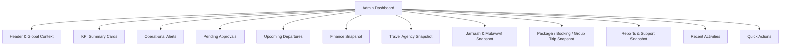
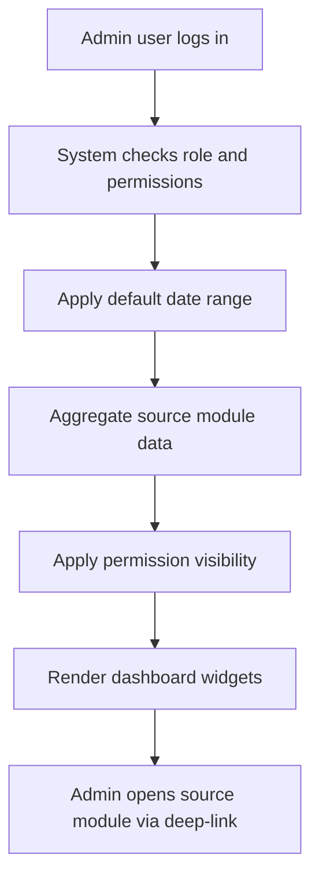

# Module PRD - Admin Dashboard

Product: UmrahHaji.com Admin Panel  
Module: Admin Dashboard  
Scope: Admin Panel / Back Office  
Platform: Responsive Web Platform  
Status: Draft  
Last Updated: 5 June 2026  

---

## 1. Objective

Admin Dashboard is the main operational landing page for UmrahHaji.com internal users after login. It provides a platform-wide overview of business health, operational readiness, pending approvals, payment risks, upcoming departures, support issues, and recent system activity.

The dashboard is designed to help Admin users quickly answer:

1. What needs attention today?
2. Which Travel Agency applications or documents require review?
3. Which payments, refunds, or finance items are pending?
4. Which group trips are departing soon and not ready?
5. Which reports/issues are urgent?
6. What quick actions should Admin take next?

---

## 2. Relationship With Master PRD

This module follows the Master PRD Admin Panel principles:

1. Admin Panel is the platform-wide back-office.
2. Dashboard shows high-level platform metrics and operational summary.
3. Dashboard quick actions may deep-link into key workflows such as review application, add travel agency, add jamaah, create package, create group trip, verify payment, or open urgent reports.
4. Dashboard data follows role and permission scope.
5. Financial widgets are visible only to authorized roles.
6. Dashboard summary should use caching or pre-aggregation if data grows large.

Dashboard does not own source data. It aggregates records from other modules and links users into the relevant module for detailed action.

---

## 3. Scope

### 3.1 In Scope for Phase 1

1. Platform-wide KPI summary cards.
2. Operational alert panel.
3. Upcoming departures.
4. Pending approvals.
5. Pending payments and payment verification summary.
6. Travel Agency application summary.
7. Package and group trip summary.
8. Jamaah and mutawwif summary.
9. Finance summary for authorized roles.
10. Report/support issue summary.
11. Recent activities.
12. Quick actions.
13. Role-based widget visibility.
14. Responsive dashboard layout.

### 3.2 In Scope for Phase 2

1. Advanced dashboard analytics.
2. Custom dashboard widgets by role.
3. Saved dashboard views.
4. Trend charts for revenue, bookings, departures, reports, and document readiness.
5. SLA and performance analytics.
6. Export dashboard summary.
7. Cross-module drill-down analytics.
8. Real-time notification center integration.

### 3.3 Out of Scope

1. Editing source records directly inside dashboard widgets.
2. Full finance reporting workspace.
3. Full report analytics workspace.
4. Full booking analytics.
5. AI-based insight generation.
6. Cross-system external BI integration.

---

## 4. Product Positioning

Admin Dashboard is a read-first, action-oriented command center.

It should show the most important platform conditions without becoming a duplicate of every module. Detailed review, editing, approval, verification, or export must happen inside the source module.

| Data Area | Source Module | Dashboard Behavior |
|---|---|---|
| Travel Agency applications | Travel Agency Management | Pending review count and quick link |
| Active travel agencies | Travel Agency Management | KPI and trend |
| Jamaah | Jamaah Management | Total count and document readiness summary |
| Mutawwif | Mutawwif Management | Total count, pending verification, assignment readiness |
| Packages | Package Management | Active/draft/pending approval summary |
| Bookings | Booking Management / Phase 2 | Booking status summary when enabled |
| Group trips | Group Trip Management | Upcoming departure and readiness summary |
| Flights | Flight / Airline Management | Catalog readiness and trip usage alerts |
| Hotels | Hotel Management | Catalog readiness and trip usage alerts |
| Itinerary | Itinerary Management | Template readiness and trip usage alerts |
| Season | Season Management | Active season and package usage summary |
| Finance | Finance Management | Revenue, collection, outstanding, refund, commission, allowance, payout preparation |
| Reports | Report Management | Open, urgent, unassigned, in-progress, resolved |
| Articles | Articles Management | Draft/published summary if content permission exists |
| Testimonials | Testimonial Management | Pending moderation and review score summary |
| Activity | Audit Logs / All Modules | Recent platform activity |

---

## 5. User Roles & Widget Visibility

| Widget / Section | Super Admin | Admin | Finance Admin | Operations Staff | Compliance Officer | Support Staff | Auditor |
|---|---|---|---|---|---|---|---|
| Platform KPI Summary | Full | View | Finance-limited | Ops-limited | Compliance-limited | Support-limited | View |
| Travel Agency Applications | Full | View/Manage | View | View | Manage | View | View |
| Jamaah Summary | Full | View/Manage | View limited | Manage | View | View | View |
| Mutawwif Summary | Full | View/Manage | View | Manage | Verify if permitted | View | View |
| Package Summary | Full | View/Manage | View | View/Manage | View | View | View |
| Booking Summary | Full | View/Manage | View | View/Manage | View | View | View |
| Group Trip Summary | Full | View/Manage | View | Manage | View | View | View |
| Finance Summary | Full | Hidden by default | Manage | Hidden by default | Hidden by default | Hidden by default | View limited |
| Reports Summary | Full | View | Finance reports only | Ops reports | Compliance reports | Manage | View |
| Recent Activities | Full | View | Finance scope | Ops scope | Compliance scope | Support scope | View |
| Quick Actions | Permission-based | Permission-based | Permission-based | Permission-based | Permission-based | Permission-based | No create action |

Rules:

1. Widgets must not reveal sensitive financial, document, or personal data to unauthorized roles.
2. Widget deep-links must enforce the same permission as direct module access.
3. View-only roles should not see create, approve, verify, delete, archive, or payout actions.

---

## 6. Information Architecture

```text
Admin Dashboard
├── Header & Global Context
├── KPI Summary Cards
├── Operational Alerts
├── Pending Approvals
├── Upcoming Departures
├── Finance Snapshot
├── Travel Agency Snapshot
├── Jamaah & Mutawwif Snapshot
├── Package / Booking / Group Trip Snapshot
├── Reports & Support Snapshot
├── Recent Activities
└── Quick Actions
```

### 6.1 Dashboard IA Diagram



---

## 7. Dashboard Data Flow



Data rules:

1. Dashboard must only show data the user is allowed to access.
2. Dashboard can use cached aggregate data for heavy counts.
3. Finance data should show last updated timestamp if not real time.
4. Widget failure must not block the entire dashboard.
5. Dashboard must not double-count payment, booking, jamaah, or commission records.

---

## 8. Default Dashboard Layout

### 8.1 Header & Global Context

Content:

1. Greeting and admin user name.
2. Current date.
3. Selected dashboard period.
4. Platform status indicator.
5. Last updated timestamp.
6. Notification icon.
7. Optional global search in Phase 2.

Default date range:

| Metric Type | Default Range |
|---|---|
| Operational alerts | Today + next 30 days |
| Upcoming departures | Next 60 days |
| Finance summary | Current month |
| Applications and approvals | Last 30 days |
| Recent activities | Last 7 days |
| Reports | Open and last 30 days |

### 8.2 KPI Summary Cards

Recommended Phase 1 cards:

| Card | Definition | Click Behavior |
|---|---|---|
| Total Jamaah | Total registered jamaah in platform | Jamaah list |
| Total Travel Agencies | Total registered agencies | Travel Agency list |
| Pending Applications | Applications waiting review | Travel Agency Applications filtered by Pending |
| Total Mutawwif | Total mutawwif profiles | Mutawwif list |
| Active Packages | Published/active packages | Package list filtered by Active/Published |
| Upcoming Departures | Group trips departing soon | Group Trip list filtered by upcoming |
| Pending Payments | Payment proofs or invoices waiting verification/action | Finance / Billing filtered by pending |
| Open Reports | Open or in-progress reports | Report list |

Rules:

1. KPI cards must be clickable.
2. KPI cards must respect user permissions.
3. Finance cards are hidden from users without finance permission.
4. Counts must not include archived/deleted records unless explicitly needed.

### 8.3 Operational Alerts

Objective: Put the most urgent cross-module tasks at the top of the dashboard.

Recommended alert types:

| Alert Type | Example | Source Module |
|---|---|---|
| Payment Verification | 8 payment proofs pending verification | Finance / Billing |
| Overdue Invoice | 12 invoices overdue | Finance / Billing |
| Travel Agency Application | 5 agency applications waiting review | Travel Agency Applications |
| Document Review | 18 jamaah documents pending verification | Jamaah / Group Trip |
| Departure Readiness | 3 trips departing within 14 days with missing items | Group Trip |
| Missing Mutawwif | 2 active trips have no assigned mutawwif | Group Trip / Mutawwif |
| Urgent Report | 4 urgent reports unresolved | Report Management |
| Refund Pending | 3 refund requests need action | Finance |
| Allowance Pending | 2 allowance requests need approval/settlement | Finance / Allowance |

Priority order:

1. Critical reports and compliance issues.
2. Trips departing soon with missing required items.
3. Payment/refund/finance items requiring verification or approval.
4. Travel Agency applications waiting review.
5. Document verification pending.
6. Mutawwif assignment missing.
7. Draft or pending package approval.

### 8.4 Pending Approvals

Approval items:

| Approval Type | Source |
|---|---|
| Travel Agency application | Travel Agency Applications |
| Agency document review | Travel Agency Management |
| Mutawwif verification | Mutawwif Management |
| Jamaah document verification | Jamaah / Documents |
| Package edit approval | Package Management |
| Admin-created package/trip approval reference | Package / Group Trip |
| Payment verification | Finance / Billing |
| Refund approval | Finance |
| Allowance approval | Finance / Allowance |
| Report escalation | Report Management |

Rules:

1. Approval list must show owner, module, status, priority, age, and action link.
2. Users only see approval items matching their permission.
3. Critical or overdue approvals should appear in Operational Alerts.

### 8.5 Upcoming Departures

Fields:

| Field | Description |
|---|---|
| Group Trip | Trip name and code |
| Travel Agency | Owner agency |
| Schedule | Departure and return date |
| Jamaah Count | Confirmed members / capacity |
| Mutawwif | Assigned mutawwif |
| Hotel | Makkah/Madinah hotel summary |
| Flight | Airline/flight summary |
| Readiness | Ready, Attention Needed, Critical |
| Action | Open group trip details |

Readiness rules:

| Readiness | Condition |
|---|---|
| Ready | Required documents, hotel, flight, itinerary, mutawwif, and service status are complete |
| Attention Needed | Non-critical items pending or departure within 30 days |
| Critical | Required item missing within 14 days before departure |

### 8.6 Finance Snapshot

Visible only for authorized users.

Recommended metrics:

| Metric | Definition |
|---|---|
| Total Revenue | Total invoice amount or recognized revenue based on selected period |
| Collected Revenue | Verified paid amount |
| Outstanding | Total unpaid invoice balance |
| Collection Rate | Collected / total invoiced |
| Pending Verification | Payment records requiring verification |
| Pending Refunds | Refund requests waiting action |
| Platform Commission | Platform earning calculation |
| Payout Preparation | Amount/status awaiting payout or settlement preparation |
| Pending Allowances | Allowance requests waiting approval/disbursement/settlement |

Rules:

1. Finance metrics must use verified payment status.
2. Refunded/voided amounts must not be counted as collected revenue.
3. Commission status must not be mixed with payout status.
4. Finance card click opens Finance Management with relevant filter.

### 8.7 Travel Agency Snapshot

Content:

1. Total active agencies.
2. Pending applications.
3. Need revision applications.
4. Suspended agencies.
5. Agencies with incomplete documents.
6. Recently approved agencies.

### 8.8 Jamaah & Mutawwif Snapshot

Jamaah content:

1. Total jamaah.
2. New jamaah this period.
3. Pending invitation.
4. Pending document.
5. Ready for departure.

Mutawwif content:

1. Total mutawwif.
2. Active mutawwif.
3. Pending verification.
4. Assigned upcoming trips.
5. Missing assignment alerts.

### 8.9 Package / Booking / Group Trip Snapshot

Package metrics:

1. Active packages.
2. Draft packages.
3. Pending approval packages.
4. Archived packages.

Booking metrics:

1. Booking summary is Phase 2 full scope.
2. Phase 1 can show manual reservation or direct group trip assignment summary where available.

Group trip metrics:

1. Active group trips.
2. Draft group trips.
3. Upcoming group trips.
4. Completed group trips.
5. Trips with readiness issue.

### 8.10 Reports & Support Snapshot

Metrics:

1. Open reports.
2. In-progress reports.
3. Urgent reports.
4. Unassigned reports.
5. Reports waiting user response.
6. Resolved reports this period.

Rules:

1. Support Staff can manage report widgets.
2. Non-support roles may only see report summary according to permission.
3. Urgent unresolved reports must appear in Operational Alerts.

### 8.11 Recent Activities

Activity sources:

1. Travel Agency application submitted/approved/rejected/need revision.
2. Agency profile updated.
3. Jamaah added/invited/document updated.
4. Mutawwif invited/verified/rejected.
5. Package created/published/archived.
6. Booking created/confirmed/cancelled if enabled.
7. Group trip created/updated/activated/completed.
8. Payment recorded/verified/refunded.
9. Report submitted/assigned/resolved/reopened.
10. Role or permission changed.

Rules:

1. Activity feed must show timestamp, actor, action, target module, and target record.
2. Sensitive action details must be masked if the viewer lacks permission.
3. Activity feed is read-only.

### 8.12 Quick Actions

Recommended quick actions:

| Action | Permission Required |
|---|---|
| Review Travel Agency Application | Travel Agency Application Review |
| Add Travel Agency | Travel Agency Create |
| Add Jamaah | Jamaah Create |
| Add Mutawwif | Mutawwif Create |
| Create Package | Package Create |
| Create Group Trip | Group Trip Create |
| Verify Payment | Payment Verify |
| Create Invoice | Finance Invoice Create |
| Create Announcement | Announcement Create |
| Create Article | Article Create |
| Open Urgent Report | Report View/Manage |

Rules:

1. Quick actions must only show if user has permission.
2. Quick actions should open the relevant create page, review workspace, or filtered list.
3. View-only users should not see create/verify/approve actions.

---

## 9. Status & Color Rules

| Status Type | Example | Display Rule |
|---|---|---|
| Positive | Active, Paid, Ready, Verified, Completed | Green chip |
| Warning | Pending, Draft, Attention Needed, Need Revision | Yellow/blue chip depending context |
| Critical | Overdue, Urgent, Rejected, Suspended, Critical | Red chip |
| Neutral | Archived, Inactive, View Only | Gray chip |

Rules:

1. Dashboard statuses must match source module status labels.
2. Do not create dashboard-only statuses unless mapped to source status.
3. Red should be reserved for immediate attention or risk.

---

## 10. Empty, Loading, and Error States

### Empty State

| Section | Empty Message |
|---|---|
| KPI Cards | No data available for selected period |
| Operational Alerts | No urgent actions |
| Pending Approvals | No pending approvals |
| Upcoming Departures | No upcoming departures |
| Finance Snapshot | No finance data available |
| Reports | No open reports |
| Recent Activities | No recent activities |

### Loading State

1. Show skeleton cards for KPI summary.
2. Load operational alerts early.
3. Load heavier charts after critical widgets.
4. Use widget-level loading states.

### Error State

1. If one widget fails, show widget-level error.
2. Dashboard page must still render other available widgets.
3. Authentication, authorization, or role-scope failure should block dashboard and show access message.

---

## 11. Responsive Behavior

| Device | Behavior |
|---|---|
| Desktop | Multi-column KPI cards, side-by-side widgets, dense admin layout |
| Tablet | Two-column KPI cards, collapsible sidebar, compact widgets |
| Mobile | Single-column cards, operational alerts first, simplified lists |

Mobile priority order:

1. Operational Alerts.
2. Pending Approvals.
3. Upcoming Departures.
4. KPI Summary.
5. Finance Snapshot if permitted.
6. Reports Snapshot.
7. Recent Activities.
8. Quick Actions.

---

## 12. Deep-Link Behavior

Dashboard widgets must link to source modules with relevant filters applied.

| Widget / Alert | Deep-Link |
|---|---|
| Pending Applications | Travel Agency Applications filtered by Pending Verification |
| Pending Payments | Finance / Billing filtered by Pending Verification |
| Overdue Invoices | Finance / Billing filtered by Overdue |
| Pending Refunds | Finance / Refund Requests |
| Upcoming Departures | Group Trip list filtered by upcoming |
| Missing Mutawwif | Group Trip details -> Mutawwif Assignment |
| Pending Documents | Jamaah or Group Trip Documents filtered by Pending |
| Urgent Reports | Report Management filtered by Urgent/Open |
| Draft Packages | Package list filtered by Draft |

Rules:

1. Deep-links must preserve filters.
2. If user lacks permission, show access denied message.
3. Dashboard must not bypass permission checks.

---

## 13. Metrics and Formulas

| Metric | Formula / Source |
|---|---|
| Total Jamaah | Count jamaah records excluding archived/deleted |
| Total Travel Agencies | Count travel agency records excluding archived/deleted |
| Active Travel Agencies | Count agencies where status = Active |
| Pending Applications | Count applications where status = Pending Verification |
| Total Mutawwif | Count mutawwif records excluding archived/deleted |
| Active Packages | Count packages where status = Published/Active |
| Upcoming Departures | Count group trips where departure date >= today and status not Cancelled/Archived |
| Pending Payments | Count payments/proofs where verification status = Pending |
| Outstanding Amount | Sum unpaid invoice balance |
| Collection Rate | Collected verified amount / total invoiced amount |
| Open Reports | Count reports where status = Open or In Progress |
| Critical Trip Readiness | Count upcoming trips with missing required item within critical threshold |

Rules:

1. Payment metrics must use verified payment records only.
2. Cancelled/refunded records must be excluded from collected revenue unless reporting specifically requires them.
3. Date range must be displayed clearly.
4. Metrics should avoid double counting family/group members where count definition requires unique jamaah.

---

## 14. Functional Requirements

| ID | Requirement | Priority |
|---|---|---|
| AD-DASH-001 | System must display dashboard after successful admin login | P0 |
| AD-DASH-002 | System must show platform KPI summary based on user permission | P0 |
| AD-DASH-003 | System must show operational alerts ordered by urgency | P0 |
| AD-DASH-004 | System must show pending approvals based on role permission | P0 |
| AD-DASH-005 | System must show upcoming departures and readiness status | P0 |
| AD-DASH-006 | System must show finance snapshot only for authorized roles | P0 |
| AD-DASH-007 | System must show travel agency application summary | P0 |
| AD-DASH-008 | System must show jamaah, mutawwif, package, and group trip summary | P0 |
| AD-DASH-009 | System must show report/support summary | P0 |
| AD-DASH-010 | System must provide permission-based quick actions | P0 |
| AD-DASH-011 | System must deep-link dashboard widgets to filtered source modules | P0 |
| AD-DASH-012 | System must support desktop, tablet, and mobile web layouts | P0 |
| AD-DASH-013 | System should show recent activities | P1 |
| AD-DASH-014 | System should support date range filtering | P1 |
| AD-DASH-015 | System should support widget-level error state | P1 |
| AD-DASH-016 | System may support customizable dashboard widgets by role | P2 |
| AD-DASH-017 | System may support advanced trend analytics | P2 |

---

## 15. Non-Functional Requirements

| Area | Requirement |
|---|---|
| Performance | Dashboard summary should use optimized queries, cache, or pre-aggregation for large data |
| Reliability | Widget failure must not break the full dashboard |
| Security | All widgets must respect role-based access control |
| Privacy | Sensitive finance, document, passport, and identity data must be masked or hidden |
| Audit | Actions launched from dashboard must be audited in source modules |
| Scalability | Aggregation model should support growth in agencies, bookings, jamaah, trips, and payments |

---

## 16. Acceptance Criteria

1. Admin Dashboard displays only widgets permitted for the logged-in role.
2. Finance summary is hidden from non-finance-authorized users.
3. KPI cards show correct counts and link to filtered source modules.
4. Operational Alerts show urgent cross-module items first.
5. Upcoming Departures displays trips within default date range and readiness status.
6. Pending Approvals only show items the user can review or view.
7. Recent Activities do not expose sensitive details to unauthorized roles.
8. Quick Actions follow permission rules.
9. Widget-level errors do not block the entire dashboard.
10. Mobile layout prioritizes operational alerts, pending approvals, and upcoming departures.

---

## 17. Open Questions

1. Should Super Admin be able to customize dashboard widget order in Phase 2?
2. Should Finance Admin have a finance-first dashboard variant?
3. Should Operations Staff have a trip-readiness-first dashboard variant?
4. Should dashboard metrics use real-time aggregation or scheduled pre-aggregation?
5. Should Admin Dashboard include global search in Phase 1 or Phase 2?

