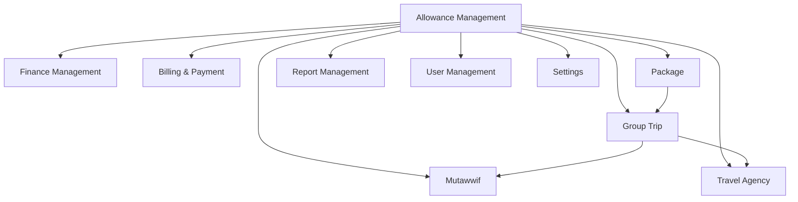
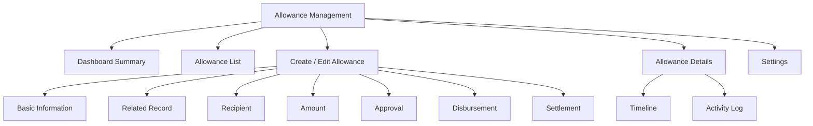
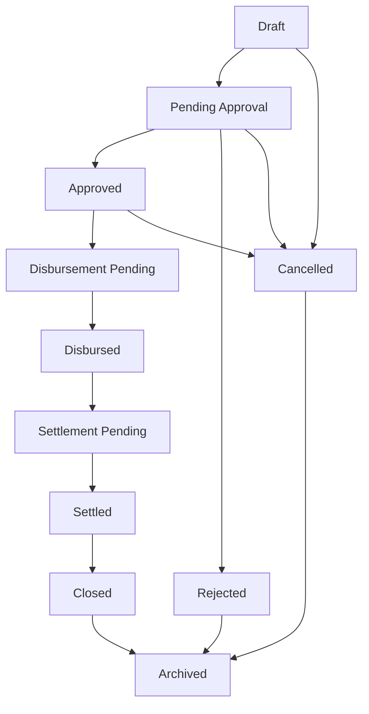
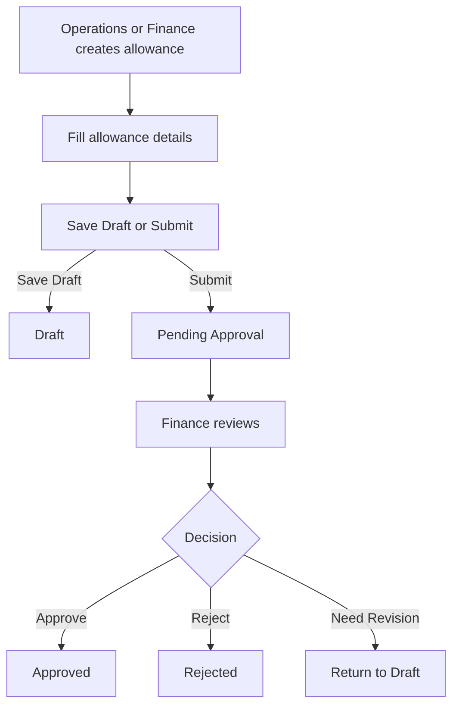
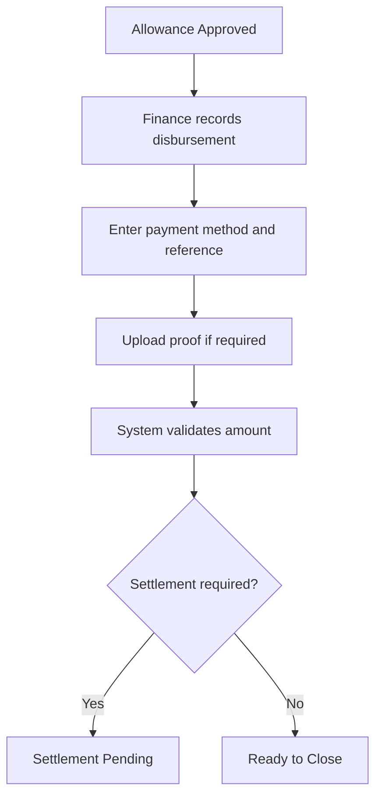
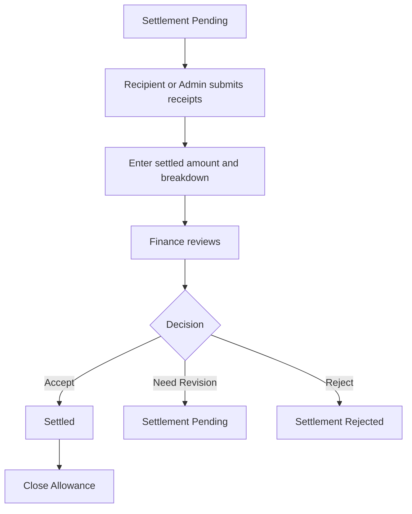

# Module PRD - Allowance Management

Product: UmrahHaji.com Admin Panel
Module: Allowance Management
Parent Module: Finance Management
Platform: Responsive Web Admin Panel
Document Type: Module Product Requirements Document
Status: Draft
Last Updated: 4 June 2026

---

## 1. Objective

Allowance Management allows Admin and Finance to record, approve, disburse, settle, and monitor operational allowances related to group trips, Travel Agencies, mutawwif assignments, and trip operations.

The module is designed for financial control of operational funds, not customer invoice collection. It helps Admin track where operational money is allocated, who receives it, what trip or assignment it belongs to, whether it has been paid, and whether supporting receipts or settlement proof have been submitted.

---

## 2. Product Positioning

Allowance Management should live under **Finance Management** because it is a finance-owned workflow.

It should not be mixed with customer payment tracking because the money direction is different.

| Area | Money Direction | Purpose | Owner |
|---|---|---|---|
| Invoice / Payment | Jamaah or customer pays platform/Travel Agency | Revenue collection | Billing & Payment |
| Refund | Platform/Travel Agency returns money to customer | Customer refund | Billing & Payment |
| Commission | Platform/agent earns commission | Revenue sharing | Finance / Commission |
| Allowance | Platform/Travel Agency gives operational funds to assigned party | Trip operations and expense control | Finance |
| Payout | Platform/Travel Agency pays earned amount to service provider | Compensation settlement | Finance / Future Payout |

### Key Principle

Allowance is **operational fund tracking**. It may include money given before or during a trip, such as meal budget, transport cash, mutawwif trip allowance, emergency fund, or operational advance.

Payout is **earned compensation settlement**. If Phase 2 introduces mutawwif payout automation, payout should be a separate workflow that can reference allowance records where needed.

---

## 3. Scope

### In Scope for Phase 1

1. Allowance list across Travel Agencies and group trips.
2. Create manual allowance record.
3. Link allowance to Travel Agency, Group Trip, Mutawwif, Package, or operational category.
4. Allowance type and expense category.
5. Requested amount, approved amount, disbursed amount, settled amount, and remaining balance.
6. Approval status.
7. Disbursement tracking.
8. Settlement/receipt upload.
9. Finance remarks and internal notes.
10. Basic export.
11. Activity log.
12. Attachment limits to avoid server load.

### In Scope for Phase 2

1. Travel Agency allowance request from portal.
2. Mutawwif allowance request or claim submission.
3. Multi-step approval workflow.
4. Budget allocation per group trip.
5. Reimbursement workflow.
6. Allowance settlement reminders.
7. Payout integration.
8. Bank transfer batch export.
9. Expense category analytics.
10. Advanced finance reports.

### Out of Scope Unless Added to Finance Roadmap

1. Full accounting ledger.
2. Payroll.
3. Automated bank transfer execution.
4. Bank reconciliation automation.
5. Tax filing.
6. Supplier payment automation.
7. Corporate card management.

---

## 4. Recommended Navigation

```text
Admin Panel
└── Finance Management
    ├── Overview
    ├── Payments
    ├── Invoices
    ├── Refund Requests
    ├── Commission Summary
    ├── Allowance Management
    ├── Payout Preparation
    ├── Finance Reports
    └── Finance Settings
```

Allowance Management should be documented as **PRD 11.4 — Allowance Management**, a sub-PRD under **PRD 11 — Finance Management**.

---

## 5. Relationship With Other Modules

| Module | Relationship |
|---|---|
| Finance Management | Parent finance workspace and shared settings/export pattern |
| Billing & Payment Management | Related finance submodule for invoices, customer payment tracking, and refund context |
| Group Trip Management | Allowance can be linked to a specific trip for operational budget tracking |
| Travel Agency Management | Allowance belongs to or is requested for a Travel Agency context |
| Mutawwif Management | Allowance can be linked to mutawwif assignment or trip support |
| Package Management | Package can provide budget assumptions or trip financial context |
| Booking Management | Phase 2 booking revenue may feed available operational budget |
| Report Management | Finance-related reports can reference allowance records |
| User Management | Provides Finance Admin, Operations, Approver, and Auditor permissions |
| Settings | Provides allowance categories, approval rules, currency, and attachment limits |



---

## 6. User Roles & Permissions

| Role | Access |
|---|---|
| Super Admin | Full access to create, approve, disburse, settle, reject, archive, and configure allowance settings |
| Finance Admin | Manage allowance records, approvals, disbursements, settlement, export, and finance notes |
| Operations Admin | Create allowance request/record and view trip-related allowance status |
| Travel Agency Admin | Phase 2: request/view own agency allowance if portal access is enabled |
| Mutawwif | Phase 2: view assigned allowance or submit claim if enabled |
| Auditor | Read-only access to allowance records and activity logs |

### Permission Keys

| Permission Key | Description |
|---|---|
| allowance.view | View allowance list and details |
| allowance.create | Create allowance record |
| allowance.edit | Edit draft or permitted records |
| allowance.submit | Submit allowance for approval |
| allowance.approve | Approve or reject allowance |
| allowance.disburse | Record disbursement/payment |
| allowance.settle | Record settlement and receipt |
| allowance.archive | Archive allowance record |
| allowance.export | Export allowance data |
| allowance.settings.manage | Manage allowance settings |

### Permission Rules

1. Only Finance Admin and Super Admin can approve, reject, disburse, or settle allowance.
2. Operations Admin can create allowance request but cannot approve own request unless permission allows.
3. A user should not approve their own allowance request if maker-checker control is enabled.
4. Paid/disbursed allowance cannot be deleted; it can only be cancelled with reversal note or archived after closure.
5. Every status change must create an activity log.

---

## 7. Information Architecture

```text
Allowance Management
├── Dashboard Summary
│   ├── Total Allowance
│   ├── Pending Approval
│   ├── Approved
│   ├── Disbursed
│   ├── Settlement Pending
│   └── Overdue Settlement
├── Allowance List
│   ├── Search
│   ├── Filters
│   ├── Table
│   ├── Bulk Export
│   └── Row Actions
├── Create / Edit Allowance
│   ├── Basic Information
│   ├── Related Record
│   ├── Recipient
│   ├── Amount & Currency
│   ├── Approval
│   ├── Disbursement
│   ├── Settlement
│   └── Attachments
├── Allowance Details
│   ├── Summary
│   ├── Timeline
│   ├── Approval History
│   ├── Disbursement Proof
│   ├── Settlement Receipts
│   └── Activity Log
└── Settings
    ├── Allowance Types
    ├── Expense Categories
    ├── Approval Rules
    ├── Settlement Rules
    └── Upload Limits
```



---

## 8. Allowance Types

Recommended initial allowance types:

| Type | Description | Settlement Required |
|---|---|---|
| Trip Operational Advance | Cash/fund given for general trip operations | Yes |
| Meal Allowance | Meal budget for jamaah, staff, or mutawwif | Yes |
| Transport Allowance | Local transport or transfer cost support | Yes |
| Mutawwif Trip Allowance | Operational allowance for mutawwif during assignment | Optional |
| Emergency Fund | Emergency trip support fund | Yes |
| Document Processing Allowance | Operational cost for document/visa handling | Optional |
| Reimbursement | Repayment for already-paid approved expense | Yes |
| Other | Custom finance-approved category | Based on configuration |

### Type Rules

1. Each allowance type can define whether settlement receipt is required.
2. Each type can define default approval requirement.
3. Finance can deactivate unused allowance types.
4. Existing records should keep historical type snapshot even if type is later renamed.

---

## 9. Status Model

### Statuses

| Status | Meaning |
|---|---|
| Draft | Record created but not submitted |
| Pending Approval | Waiting for Finance/Super Admin approval |
| Approved | Approved but not yet disbursed |
| Rejected | Request rejected |
| Disbursement Pending | Approved and waiting for payment/transfer |
| Disbursed | Money has been given/transferred |
| Settlement Pending | Receipt/settlement proof is required |
| Settled | Settlement proof submitted and accepted |
| Closed | Finance closed the record |
| Cancelled | Record cancelled before completion |
| Archived | Hidden from active list but retained |

### Status Flow



### Status Rules

1. Draft can be edited by creator or Finance Admin.
2. Pending Approval can only be approved/rejected by authorized approver.
3. Approved amount can differ from requested amount.
4. Disbursed amount cannot exceed approved amount unless override permission is granted.
5. Settlement Pending is required if allowance type requires receipt/settlement.
6. Settled amount can be less than, equal to, or greater than disbursed amount, but variance must be explained.
7. Closed records cannot be edited except by correction workflow.

---

## 10. Dashboard Summary

| Card | Description |
|---|---|
| Total Allowance | Total approved/disbursed allowance value in selected period |
| Pending Approval | Count and amount waiting approval |
| Approved | Approved amount not yet disbursed |
| Disbursed | Total disbursed amount |
| Settlement Pending | Count and amount waiting settlement |
| Overdue Settlement | Settlement records past due date |

### Recommended Filters

1. Date range.
2. Travel Agency.
3. Group Trip.
4. Allowance type.
5. Status.
6. Recipient type.

---

## 11. Allowance List

### Search

Search should support:

1. Allowance number.
2. Travel Agency name.
3. Group Trip name.
4. Mutawwif name.
5. Recipient name.
6. Requester name.
7. Notes.

### Filters

| Filter | Options |
|---|---|
| Status | Draft, Pending Approval, Approved, Disbursed, Settlement Pending, Settled, Closed, Rejected |
| Type | Allowance type list |
| Expense Category | Meal, Transport, Accommodation, Emergency, Document, Mutawwif, Other |
| Travel Agency | All active agencies |
| Group Trip | Upcoming/active/completed trips |
| Recipient Type | Travel Agency, Mutawwif, Staff, Vendor, Other |
| Date Created | All Time, Today, This Week, This Month, Custom Range |
| Disbursement Date | All Time, Today, This Week, This Month, Custom Range |
| Settlement Due Date | All, Due Soon, Overdue |

### Table Columns

| Column | Description |
|---|---|
| Checkbox | Bulk select |
| Allowance No. | Generated allowance number |
| Type | Allowance type |
| Related Record | Travel Agency, group trip, package, or mutawwif assignment |
| Recipient | Receiver name and type |
| Requested Amount | Amount requested |
| Approved Amount | Amount approved |
| Disbursed Amount | Amount disbursed |
| Settlement Status | Not Required, Pending, Submitted, Accepted, Rejected |
| Status | Current allowance status |
| Created Date | Record creation date |
| Actions | View, Edit, Approve, Reject, Record Disbursement, Settle, Archive |

### Row Actions

| Action | Availability |
|---|---|
| View Details | All statuses |
| Edit | Draft, Pending Approval with permission |
| Submit for Approval | Draft |
| Approve | Pending Approval, approver permission |
| Reject | Pending Approval, approver permission |
| Record Disbursement | Approved or Disbursement Pending |
| Upload Settlement | Disbursed or Settlement Pending |
| Accept Settlement | Settlement Submitted |
| Reopen | Closed with permission |
| Archive | Closed, Rejected, Cancelled |

---

## 12. Create Allowance Form

### Basic Information

| Field | Type | Required | Validation | Notes |
|---|---|---:|---|---|
| Allowance Number | System | Yes | Auto-generated | Format configurable |
| Allowance Type | Dropdown | Yes | Active allowance type | Determines settlement rule |
| Expense Category | Dropdown | Yes | Active category | Meal, Transport, Emergency, etc. |
| Request Title | Text input | Yes | Max 120 chars | Short description |
| Description | Textarea | No | Max 1,000 chars | Operational context |
| Priority | Dropdown | No | Normal, Important, Urgent | Urgent may notify Finance |
| Currency | Dropdown | Yes | MYR default | Can support SAR if needed |

### Related Record

| Field | Type | Required | Validation | Notes |
|---|---|---:|---|---|
| Travel Agency | Search/dropdown | Conditional | Existing active agency | Required if related to agency/trip |
| Group Trip | Search/dropdown | Conditional | Existing group trip | Required for trip allowance |
| Package | Search/dropdown | No | Existing package | Auto-filled from group trip where possible |
| Mutawwif Assignment | Search/dropdown | No | Existing assignment | Useful for mutawwif allowance |
| Related Report | Search/dropdown | No | Existing report | If allowance is created from report case |

### Recipient

| Field | Type | Required | Validation | Notes |
|---|---|---:|---|---|
| Recipient Type | Dropdown | Yes | Travel Agency, Mutawwif, Staff, Vendor, Other | Determines recipient fields |
| Recipient | Search/dropdown | Conditional | Existing record | Required for known recipient |
| Recipient Name | Text input | Conditional | Max 120 chars | For Other/Vendor |
| Recipient Email | Email input | No | Valid email | Optional notification |
| Recipient Phone | Phone input | No | Valid phone | Optional WhatsApp/SMS |
| Bank Account Snapshot | Read-only/select | No | Existing bank detail | Sensitive permission required |

### Amount

| Field | Type | Required | Validation | Notes |
|---|---|---:|---|---|
| Requested Amount | Currency input | Yes | More than 0 | Amount requested |
| Approved Amount | Currency input | Conditional | More than 0, not greater than request unless override | Filled during approval |
| Disbursed Amount | Currency input | Conditional | More than 0, not greater than approved unless override | Filled during disbursement |
| Settlement Required | Toggle | Yes | Default from type | Can be overridden by Finance |
| Settlement Due Date | Date picker | Conditional | Future date | Required if settlement required |
| Budget Source | Dropdown | No | Platform, Travel Agency, Trip Budget, Other | Useful for reporting |

### Request Attachments

| Field | Type | Required | Validation | Notes |
|---|---|---:|---|---|
| Supporting Document | Upload | No | PDF/image limits | Quotation, request letter, prior approval |
| Internal Note | Textarea | No | Max 1,000 chars | Finance-only |

---

## 13. Approval Form

### Fields

| Field | Type | Required | Validation | Notes |
|---|---|---:|---|---|
| Decision | Radio | Yes | Approve, Reject, Need Revision | Approval outcome |
| Approved Amount | Currency input | Conditional | Required if Approve | Can differ from requested |
| Approval Note | Textarea | Conditional | Required for Reject/Need Revision | Internal or visible depending setting |
| Settlement Required | Toggle | Yes | Boolean | Defaults from type |
| Settlement Due Date | Date picker | Conditional | Required if settlement required | Used for overdue tracking |
| Notify Requester | Checkbox | No | Boolean | Send status notification |

### Approval Rules

1. Approval action requires `allowance.approve`.
2. Rejection must include a reason.
3. Approved amount must be stored as a snapshot.
4. Approval should record approver, timestamp, and note.
5. If amount exceeds configured threshold, Phase 2 can require second approval.

---

## 14. Disbursement Form

### Fields

| Field | Type | Required | Validation | Notes |
|---|---|---:|---|---|
| Disbursement Date | Date picker | Yes | Cannot be future unless scheduled disbursement is enabled | Actual payment date |
| Disbursement Amount | Currency input | Yes | More than 0 | Usually equal to approved amount |
| Payment Method | Dropdown | Yes | Bank Transfer, Cash, E-wallet, Cheque, Other | Manual record in Phase 1 |
| Payment Reference | Text input | Conditional | Max 100 chars | Bank ref/receipt no. |
| Paid From Account | Dropdown | No | Active finance account | Sensitive permission |
| Disbursement Proof | Upload | Conditional | PDF/image limits | Required for non-cash if configured |
| Finance Note | Textarea | No | Max 1,000 chars | Internal note |

### Disbursement Rules

1. Disbursement can only happen after approval.
2. Disbursement proof should be required for bank transfer.
3. Disbursed amount cannot exceed approved amount unless override permission is granted.
4. Once disbursed, record cannot be deleted.
5. If settlement is required, status becomes Settlement Pending.
6. If settlement is not required, status can become Closed after Finance confirmation.

---

## 15. Settlement Form

Settlement records actual spending and receipt submission.

### Fields

| Field | Type | Required | Validation | Notes |
|---|---|---:|---|---|
| Settlement Date | Date picker | Yes | Cannot be before disbursement date | Actual settlement date |
| Settled Amount | Currency input | Yes | More than or equal 0 | Actual used amount |
| Receipt / Proof | Upload | Conditional | PDF/image limits | Required if settlement required |
| Expense Breakdown | Repeating rows | No | At least one row if detailed settlement enabled | Category, amount, note |
| Variance Reason | Textarea | Conditional | Required if settled amount differs from disbursed amount | Explains remaining/excess |
| Return Amount | Currency input | Conditional | Auto-calculated if settled < disbursed | Money to return |
| Additional Claim Amount | Currency input | Conditional | Auto-calculated if settled > disbursed | May create reimbursement |
| Finance Review Decision | Radio | Yes | Accept, Reject, Need Revision | Finance settlement review |
| Finance Note | Textarea | Conditional | Required for Reject/Need Revision | Internal or visible |

### Expense Breakdown Row

| Field | Type | Required | Validation |
|---|---|---:|---|
| Expense Category | Dropdown | Yes | Active category |
| Date | Date picker | No | Within trip/allowance period if linked |
| Description | Text input | Yes | Max 150 chars |
| Amount | Currency input | Yes | More than 0 |
| Receipt | Upload | No | PDF/image limits |

### Settlement Rules

1. Settlement must be reviewed by Finance.
2. If settlement is accepted, status becomes Settled.
3. If no further action is needed, Finance can close the record.
4. If settled amount is lower than disbursed amount, system shows return amount.
5. If settled amount is higher than disbursed amount, system shows additional claim amount.
6. Additional claim should not automatically pay; Finance must approve separately.

---

## 16. Attachment & Upload Rules

Allowance attachments may contain sensitive finance documents, receipts, bank references, or personal data.

| Attachment Type | Allowed Format | Max Size | Max Count | Notes |
|---|---|---:|---:|---|
| Request support image | JPG, JPEG, PNG, WEBP | 3 MB/file | 5 | Compress and thumbnail |
| Request support PDF | PDF | 5 MB/file | 5 | Store in object storage |
| Disbursement proof image | JPG, JPEG, PNG, WEBP | 3 MB/file | 3 | Bank transfer screenshot/receipt |
| Disbursement proof PDF | PDF | 5 MB/file | 3 | Payment proof |
| Settlement receipt image | JPG, JPEG, PNG, WEBP | 3 MB/file | 10 | Compress and thumbnail |
| Settlement receipt PDF | PDF | 5 MB/file | 10 | Expense receipt bundle |

### Server Load Rules

1. Files must be stored in object storage or equivalent private file storage.
2. Files must not be stored directly in application server filesystem.
3. Image compression is required.
4. Thumbnails should be generated for images.
5. Original files should be lazy-loaded.
6. MIME type and file extension must be validated.
7. Upload should support progress and retry.
8. Malware scanning should be enabled if service is available.
9. Access must be permission-based because allowance files are finance-sensitive.

---

## 17. Main Workflows

### Create and Approve Allowance



### Disbursement Flow



### Settlement Flow



---

## 18. Details Page

### Sections

1. Allowance summary.
2. Related Travel Agency / Group Trip / Package / Mutawwif.
3. Recipient information.
4. Requested, approved, disbursed, settled, and variance amount.
5. Approval history.
6. Disbursement record.
7. Settlement and receipt list.
8. Finance notes.
9. Activity log.

### Detail Actions

| Action | Rule |
|---|---|
| Edit Draft | Draft only or Finance permission |
| Submit | Draft |
| Approve / Reject | Pending Approval |
| Record Disbursement | Approved |
| Submit Settlement | Disbursed / Settlement Pending |
| Accept Settlement | Settlement submitted |
| Close | Settled or no-settlement required |
| Reopen | Closed with elevated permission |
| Archive | Closed, Rejected, Cancelled |

---

## 19. Notifications

| Event | Recipient | Channel | Phase |
|---|---|---|---|
| Allowance submitted | Finance Admin | In-app / Email | Phase 1 |
| Allowance approved | Requester / Operations | In-app / Email | Phase 1 |
| Allowance rejected | Requester / Operations | In-app / Email | Phase 1 |
| Allowance disbursed | Requester / Recipient | In-app / Email | Phase 1 |
| Settlement due soon | Requester / Recipient / Finance | In-app / Email | Phase 2 |
| Settlement overdue | Finance Admin / Operations | In-app / Email | Phase 2 |
| Settlement accepted | Requester / Recipient | In-app / Email | Phase 1 |

WhatsApp notifications can be Phase 2 unless the platform notification module already supports it.

---

## 20. Analytics & Reports

### Phase 1 Metrics

1. Total allowance requested.
2. Total allowance approved.
3. Total allowance disbursed.
4. Total allowance settled.
5. Pending approval count.
6. Settlement pending count.
7. Overdue settlement count.
8. Allowance by Travel Agency.
9. Allowance by Group Trip.
10. Allowance by type/category.

### Phase 2 Metrics

1. Budget vs actual by group trip.
2. Average settlement delay.
3. Top expense categories.
4. Allowance variance trend.
5. Allowance by mutawwif assignment.
6. Reimbursement trend.
7. Outstanding unreturned amount.

---

## 21. Settings

### Allowance Type Settings

| Field | Type | Required | Validation |
|---|---|---:|---|
| Type Name | Text input | Yes | Unique, max 80 chars |
| Description | Textarea | No | Max 300 chars |
| Settlement Required Default | Toggle | Yes | Boolean |
| Approval Required | Toggle | Yes | Boolean |
| Status | Radio | Yes | Active, Inactive |

### Expense Category Settings

| Field | Type | Required | Validation |
|---|---|---:|---|
| Category Name | Text input | Yes | Unique, max 80 chars |
| Category Code | Text input | No | Unique if used |
| Description | Textarea | No | Max 300 chars |
| Status | Radio | Yes | Active, Inactive |

### Approval Rule Settings

| Field | Type | Required | Validation |
|---|---|---:|---|
| Approval Threshold | Currency input | No | More than 0 | Amount requiring approval |
| Multi-level Approval Threshold | Currency input | No | More than Approval Threshold | Phase 2 |
| Prevent Self Approval | Toggle | Yes | Boolean | Recommended enabled |
| Default Settlement Days | Number input | Yes | 1-90 days | Due date default |

### Numbering Settings

| Field | Type | Required | Validation |
|---|---|---:|---|
| Prefix | Text input | Yes | Max 10 chars | Example: ALW |
| Next Number | Number input | Yes | Positive integer |
| Reset Frequency | Dropdown | No | Never, Yearly, Monthly | Optional |

---

## 22. Empty States

### No Allowance Records

```text
No allowance records have been created yet.
Create an allowance record to track trip operational funds, mutawwif allowance, or reimbursement.
```

Primary action:

```text
Create Allowance
```

### No Settlement Pending

```text
No allowance settlement is pending.
All disbursed allowances are settled or do not require settlement.
```

### No Results After Filter

```text
No allowance records match your filters.
Try changing status, type, agency, trip, or date range.
```

---

## 23. Error States

| Error | Expected Behavior |
|---|---|
| Approved amount exceeds requested amount | Require override permission and reason |
| Disbursed amount exceeds approved amount | Block unless override permission and reason |
| Settlement due date missing | Show field-level error if settlement required |
| Receipt file too large | Reject and show max file size |
| Invalid file type | Reject and show supported formats |
| Missing rejection reason | Block reject action |
| Self approval blocked | Show maker-checker policy message |
| Record already closed | Disable edit and show closed state |
| Related group trip archived | Allow view but warn before new allowance creation |

---

## 24. Security & Privacy

1. Allowance data is finance-sensitive.
2. Bank account details must require sensitive finance permission.
3. Attachment access must be permission-based.
4. Every create, approve, reject, disburse, settle, close, reopen, and archive action must be logged.
5. Paid/disbursed records must be immutable except through correction workflow.
6. Finance notes must not be visible to Jamaah.
7. Travel Agency visibility must be limited to its own records if portal access is enabled.
8. Mutawwif visibility must be limited to records where they are the recipient or assigned party.

---

## 25. Responsive Web Behavior

### Desktop

1. List uses table view with horizontal scroll for finance columns.
2. Create/edit form can use stacked sections.
3. Amount summary should stay visible near top of details page.

### Tablet

1. Filters wrap to multiple rows.
2. Table supports horizontal scroll.
3. Detail sections remain collapsible.

### Mobile

1. List becomes stacked cards.
2. Finance amounts should be grouped in a compact summary.
3. Approval/disbursement actions should use bottom sticky action bar.
4. Upload controls must show file size and progress clearly.

---

## 26. Data Model Reference

### Allowance

| Field | Description |
|---|---|
| allowance_id | Unique allowance ID |
| allowance_no | Human-readable number |
| allowance_type_id | Allowance type |
| expense_category_id | Expense category |
| title | Request title |
| description | Description |
| priority | Normal, Important, Urgent |
| status | Current status |
| currency | Currency code |
| requested_amount | Amount requested |
| approved_amount | Amount approved |
| disbursed_amount | Amount disbursed |
| settled_amount | Actual settled amount |
| variance_amount | Difference between disbursed and settled |
| settlement_required | Boolean |
| settlement_due_date | Due date |
| travel_agency_id | Related agency |
| group_trip_id | Related trip |
| package_id | Related package |
| mutawwif_id | Related mutawwif |
| recipient_type | Agency, Mutawwif, Staff, Vendor, Other |
| recipient_id | Related recipient ID if system entity |
| recipient_name | Snapshot name |
| budget_source | Platform, Travel Agency, Trip Budget, Other |
| created_by | Creator |
| approved_by | Approver |
| disbursed_by | Finance user |
| settled_by | Finance user |
| created_at | Created timestamp |
| updated_at | Updated timestamp |

### Allowance Disbursement

| Field | Description |
|---|---|
| disbursement_id | Unique disbursement ID |
| allowance_id | Related allowance |
| disbursement_date | Payment date |
| amount | Disbursement amount |
| payment_method | Bank Transfer, Cash, E-wallet, Cheque, Other |
| payment_reference | Transfer/reference number |
| paid_from_account_id | Finance account reference |
| proof_file_id | Proof attachment |
| note | Finance note |
| created_by | Finance user |
| created_at | Timestamp |

### Allowance Settlement

| Field | Description |
|---|---|
| settlement_id | Unique settlement ID |
| allowance_id | Related allowance |
| settlement_date | Settlement date |
| settled_amount | Total actual amount |
| return_amount | Amount to return if underused |
| additional_claim_amount | Additional amount requested if overspent |
| status | Submitted, Accepted, Rejected, Need Revision |
| finance_note | Review note |
| reviewed_by | Finance reviewer |
| reviewed_at | Review timestamp |

### Settlement Item

| Field | Description |
|---|---|
| item_id | Unique item ID |
| settlement_id | Related settlement |
| expense_category_id | Expense category |
| expense_date | Expense date |
| description | Expense description |
| amount | Expense amount |
| receipt_file_id | Optional receipt |

---

## 27. Acceptance Criteria

1. Admin can view allowance list.
2. Admin can search and filter allowance records.
3. Operations Admin or Finance Admin can create allowance request.
4. Draft allowance can be saved with incomplete approval/disbursement data.
5. Submitted allowance becomes Pending Approval.
6. Finance Admin can approve or reject allowance.
7. Rejection requires reason.
8. Approved allowance can be disbursed.
9. Disbursement cannot exceed approved amount without override permission and reason.
10. Disbursed allowance requiring settlement becomes Settlement Pending.
11. Admin can upload settlement receipts within allowed file limits.
12. Finance can accept, reject, or request revision for settlement.
13. System calculates variance between disbursed and settled amount.
14. Closed records cannot be edited without reopen/correction permission.
15. All finance-sensitive actions are logged.
16. Attachment access follows permission.
17. Allowance can be linked to Travel Agency, Group Trip, Package, and Mutawwif where applicable.
18. Allowance dashboard shows pending approval, disbursed, settlement pending, and overdue settlement summary.
19. Export includes key allowance, status, amount, and related record fields.
20. UI is usable on desktop, tablet, and mobile web.

---

## 28. Open Questions

1. Should Phase 1 allow Travel Agency to request allowance from TA Portal, or only Admin can create records?
2. Should mutawwif allowance be treated as operational allowance or future payout item?
3. Should allowance support SAR in addition to MYR from Phase 1?
4. What approval threshold requires Super Admin approval?
5. Should settlement receipt be mandatory for all allowance types or only selected types?
6. Should unspent allowance create a receivable/return record in Phase 2?
7. Should overspent allowance create a reimbursement request automatically in Phase 2?

---

## 29. Future Enhancements

1. Multi-level finance approval.
2. Travel Agency Portal allowance request.
3. Mutawwif claim submission.
4. Reimbursement workflow.
5. Budget vs actual by group trip.
6. Bank transfer batch file export.
7. Payout integration.
8. Settlement reminders.
9. Receipt OCR.
10. Expense policy validation.
11. Finance dashboard by agency/trip/category.
12. Accounting integration.
