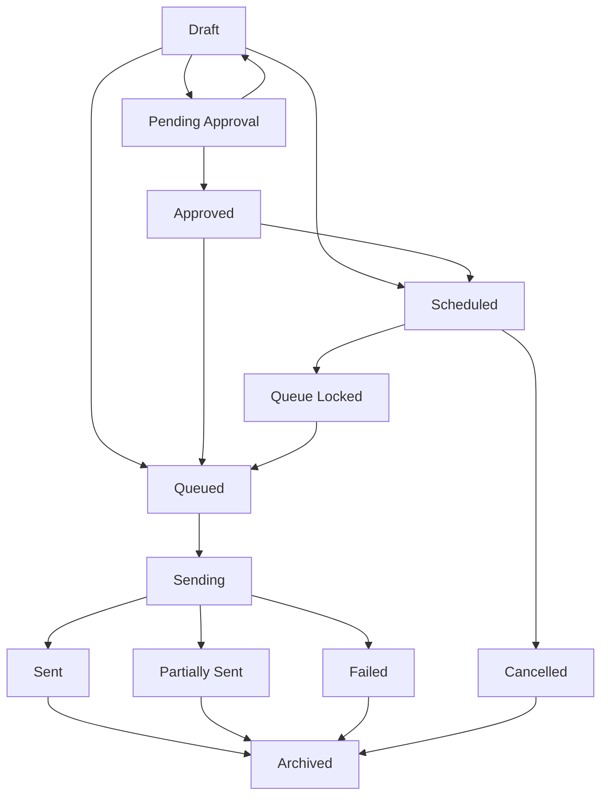
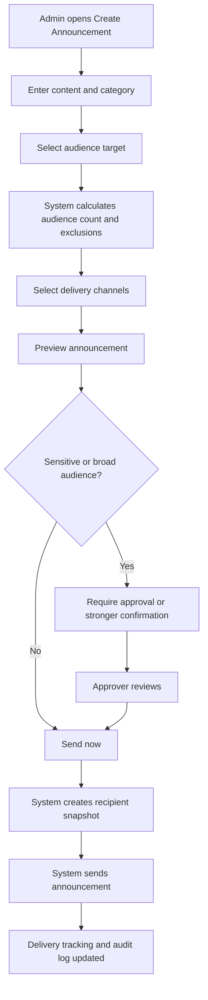
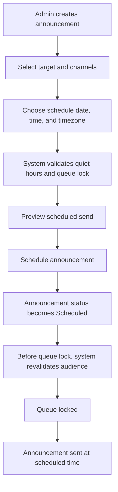
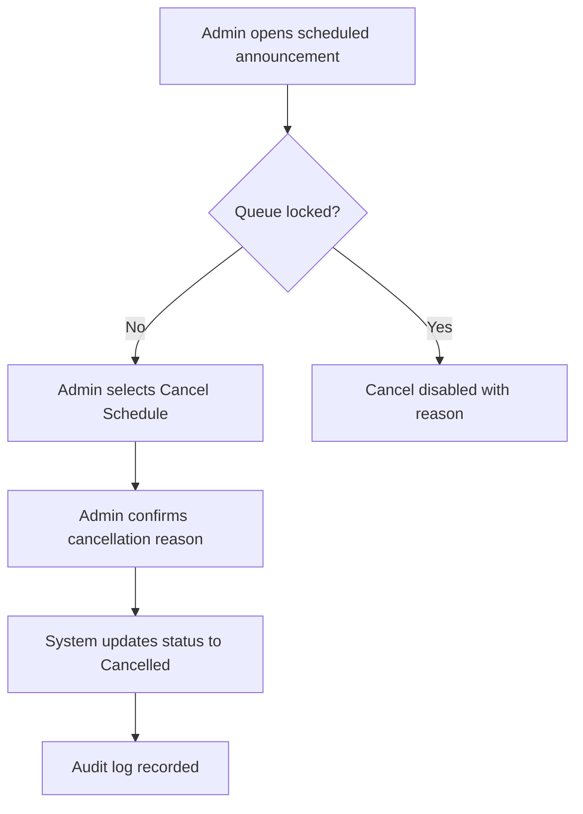
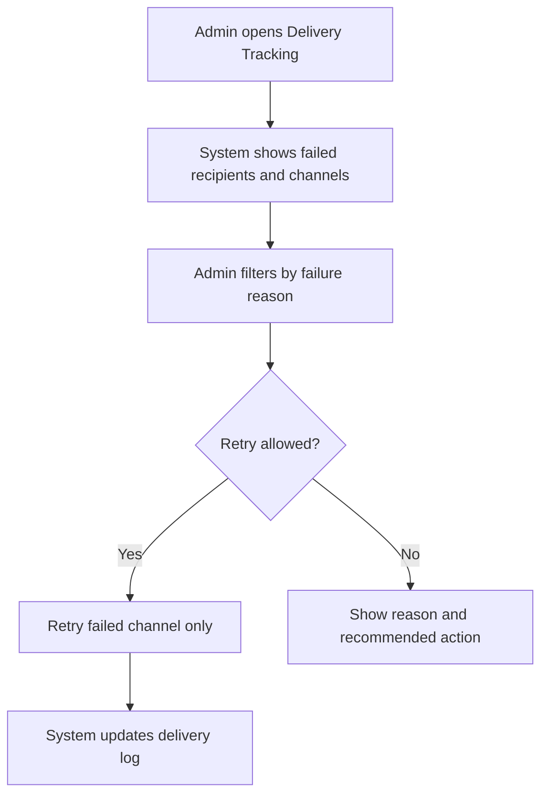
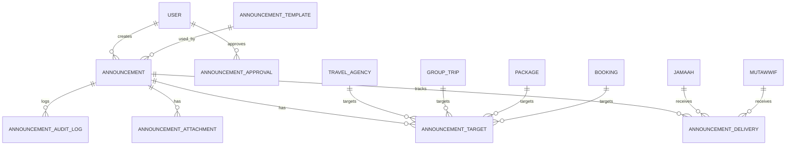

# Module PRD - Announcement Management

| Field | Value |
|---|---|
| Product | UmrahHaji.com Admin Panel - Announcement Management |
| Version | v1.0 |
| Platform | Responsive Web Platform |
| Scope | Admin Panel / Platform Communication Workspace |
| Status | Draft |
| Prepared by | Product / UI/UX Team |
| Last Updated | 10 June 2026 |

---

## 1. Product Summary

Announcement Management is the platform-level communication workspace for UmrahHaji.com Admins to create, schedule, publish, monitor, and archive official announcements for selected audiences across the platform.

This module is used for operational notices, platform policy updates, system maintenance messages, safety alerts, document reminders, payment reminders, verification notices, trip-related updates, article sharing, and important communication that must be traceable.

This module is different from chat, support reports, and transactional notifications.

| Module | Purpose | User Impact |
|---|---|---|
| Announcement Management | Broadcast official platform or operational messages to targeted audiences | User receives targeted message |
| Notification System | Sends transactional event updates such as invoice paid, report updated, or document rejected | User receives event-triggered notification |
| Report Management | Handles issues, complaints, disputes, and support cases | User submits or tracks a case |
| Articles Management | Publishes educational or knowledge content | User reads browsable content |

Announcements should be short, direct, action-oriented, auditable, and permission-controlled.

## 2. Relationship With Existing PRDs

| Module | Relationship |
|---|---|
| Master PRD - Admin Panel | Defines Announcement as a core communication module |
| Admin Dashboard | Shows urgent announcements, scheduled announcements, and quick action to create announcement |
| Travel Agency Management | Platform announcements can target all agencies, selected agencies, agency status groups, or agency roles |
| User Management | Uses user roles, permissions, and account status for audience targeting |
| Jamaah Management | Announcements can target specific jamaah, all jamaah, or jamaah by group trip/package/booking context |
| Mutawwif Management | Announcements can target mutawwif by assignment, country, status, or verification state |
| Package Management | Announcements can link to package updates or package-related campaign notices |
| Booking Management | Booking participants can receive booking, document, payment, or departure announcements |
| Group Trip Management | Group trip is a primary audience target for operational announcements |
| Billing / Finance Management | Payment reminders and billing notices can be sent as controlled announcements |
| Testimonial Management | Feedback request reminders may be triggered or linked to announcement campaigns |
| Report Management | Delivery issues, abuse, complaints, or disputes can be escalated to reports |
| Articles Management | Admin may attach article links inside announcement content |
| Travel Agency PRD 13 - Announcements | Travel Agency receives platform announcements and can create agency-scoped announcements |

## 3. Objective

Allow Platform Admins to send controlled, targeted, and auditable announcements to the right users without exposing unnecessary data, duplicating transactional notifications, or allowing unrestricted mass messaging.

## 4. Goals

1. Allow Admin to create, schedule, publish, archive, and monitor announcements.
2. Support targeted audiences across travel agencies, jamaah, mutawwif, admins, bookings, packages, and group trips.
3. Support in-app announcement as the default delivery channel.
4. Support optional email and WhatsApp delivery when enabled by settings and permission.
5. Show audience count and delivery estimate before sending.
6. Support delivery tracking, read tracking, acknowledgement, and failed delivery review.
7. Support approval or review for sensitive platform-wide messages.
8. Prevent duplicate or accidental mass announcements.
9. Keep full audit logs for compliance and support.
10. Keep Travel Agency Portal behavior synchronized: platform announcements are read-only for Travel Agencies.

## 5. Non-Goals

1. This module does not replace real-time chat.
2. This module does not replace transactional notifications.
3. This module does not replace Report Management for complaint handling.
4. This module does not provide marketing automation or recurring campaigns in Phase 1.
5. This module does not guarantee email or WhatsApp delivery when external providers fail.
6. This module does not allow Travel Agencies to edit platform announcements.
7. This module does not expose full personal data inside audience preview unless user has permission.
8. This module does not provide native mobile push notification in Phase 1 unless mobile apps are introduced later.

## 6. Users and Roles

| Role | Access Level |
|---|---|
| Super Admin | Full access to create, approve, publish, schedule, archive, export, configure settings |
| Platform Admin | Create, edit draft, schedule, publish if permission is granted |
| Operations Admin | Create operational announcements for travel agency, group trip, jamaah, and mutawwif audiences |
| Finance Admin | Create billing, invoice, payment, refund, or commission notices |
| Content Admin | Create article-linked or educational announcements |
| Support Admin | Create announcement for support follow-up or service interruption notice |
| Compliance Admin | Create or approve sensitive safety, policy, or compliance announcements |
| View Only / Auditor | View announcement list, detail, delivery logs, and audit trail only |
| Travel Agency User | Can receive and view platform announcements in Travel Agency Portal, cannot edit |
| Jamaah / Mutawwif | Can receive announcement if targeted through supported channel |

## 7. Permission Rules

| Permission | Description |
|---|---|
| View Announcements | View announcement list and details |
| Create Announcement | Create announcement draft |
| Edit Draft Announcement | Edit announcement before queued/sent |
| Schedule Announcement | Schedule future send |
| Publish Announcement | Send immediately or publish in-app |
| Approve Sensitive Announcement | Approve platform-wide, compliance, safety, or finance-sensitive messages |
| Cancel Scheduled Announcement | Cancel before delivery queue lock |
| Archive Announcement | Archive announcement from active list |
| Duplicate Announcement | Copy existing announcement as a new draft |
| View Delivery Tracking | View per-channel delivery, read, acknowledgement, and failure status |
| Export Announcements | Export list, delivery summary, or audit log |
| Manage Announcement Settings | Configure default channels, quiet hours, approval rules, and limits |

Rules:

1. Sent announcements cannot be edited.
2. A correction must be sent as a new announcement.
3. Scheduled announcements can be edited only before queue lock.
4. Platform-wide announcements require higher permission than targeted operational announcements.
5. Sensitive announcements require reason, preview, and confirmation before send.
6. All create, edit, schedule, publish, cancel, archive, export, and status actions must be logged.
7. Audience targeting must respect user role, status, data scope, and opt-out/channel settings.
8. Admin can view masked recipient data unless they have permission to reveal sensitive data.
9. Publish/Unpublish language must be interpreted carefully: after an announcement has been sent, Admin cannot edit or delete the content. "Unpublish" means archive, hide from active inbox, or expire visibility while keeping the original content, delivery log, and audit trail.

## 8. Key Definitions

| Term | Definition |
|---|---|
| Platform Announcement | Official announcement created by UmrahHaji.com Admin |
| Operational Announcement | Message related to package, booking, group trip, document, payment, or service workflow |
| Audience Target | Selected recipient group or entity context |
| Recipient Snapshot | Frozen recipient list captured when announcement is queued/sent |
| Delivery Channel | In-app, email, WhatsApp |
| Delivery Status | Technical delivery status per recipient and channel |
| Read Status | Whether recipient opened the announcement detail |
| Acknowledgement | Recipient confirms they have read/understood the announcement |
| Queue Lock | Time before scheduled send when content/audience becomes locked |
| Sensitive Announcement | Safety, compliance, finance, policy, or platform-wide message requiring stronger control |

## 9. Information Architecture

```mermaid
flowchart TD
    ANN["Announcement Management"]
    ANN --> DASH["Announcement Dashboard"]
    ANN --> LIST["Announcement List"]
    ANN --> CREATE["Create Announcement"]
    ANN --> DETAIL["Announcement Detail"]
    ANN --> TRACK["Delivery Tracking"]
    ANN --> TPL["Templates"]
    ANN --> SETTINGS["Announcement Settings"]

    LIST --> DRAFT["Draft"]
    LIST --> SCHED["Scheduled"]
    LIST --> QUEUED["Queued"]
    LIST --> SENT["Sent / Partially Sent"]
    LIST --> FAIL["Failed"]
    LIST --> ARCH["Archived"]

    CREATE --> CONTENT["Content"]
    CREATE --> AUD["Audience Targeting"]
    CREATE --> CHANNEL["Channel Selection"]
    CREATE --> SCHEDULE["Send Now / Schedule"]
    CREATE --> PREVIEW["Preview & Confirm"]

    DETAIL --> SUMMARY["Message Summary"]
    DETAIL --> RECIP["Recipient Snapshot"]
    DETAIL --> DELIV["Delivery Status"]
    DETAIL --> ACK["Read / Acknowledgement"]
    DETAIL --> AUDIT["Audit Log"]
```



## 10. Navigation and Entry Points

### 10.1 Sidebar Navigation

```text
Admin Panel
└── Announcement
    ├── Dashboard
    ├── All Announcements
    ├── Create Announcement
    ├── Templates (Phase 2 / hidden in Phase 1 unless Basic Templates are enabled)
    └── Settings
```

### 10.2 Related Entry Points

| Entry Point | Behavior |
|---|---|
| Admin Dashboard | Quick action to create announcement and view scheduled/urgent announcements |
| Travel Agency Details | Create announcement targeting selected agency |
| Group Trip Details | Create announcement targeting selected group trip members |
| Package Details | Create announcement targeting package bookings |
| Booking Details | Create announcement targeting booking participants |
| Jamaah Details | Create announcement targeting selected jamaah or family/group |
| Mutawwif Details | Create announcement targeting selected mutawwif |
| Billing / Invoice Detail | Create payment reminder announcement |
| Articles Detail | Create announcement with article link |
| Report Detail | Send follow-up announcement if report resolution requires communication |

## 11. Announcement Types

| Type | Example | Default Audience | Approval Rule |
|---|---|---|---|
| Platform Notice | System maintenance, feature release, policy update | Travel Agency users, admins, or all platform users | Optional for non-sensitive |
| Agency Verification Notice | Reminder to complete documents or license update | Travel Agency owners/admins | Optional |
| Group Trip Update | Schedule change, briefing reminder, departure notice | Group trip members, PIC, assigned mutawwif | Optional |
| Booking Reminder | Booking confirmation, missing participant info | Booking participants or PIC | Optional |
| Document Reminder | Passport, visa, vaccination, photo submission | Jamaah with missing document status | Optional |
| Finance Reminder | Invoice due, overdue, refund status | Jamaah, PIC, or agency finance user | Finance permission required |
| Safety / Compliance Notice | Safety protocol, travel advisory, compliance warning | Specific target or broad audience | Approval required |
| Article / Education Notice | Link to educational article or guide | Selected users or agencies | Optional |
| Feedback Request | Daily/end-of-trip testimonial reminder | Trip members | Optional, must avoid duplicate testimonial reminder |

## 12. Audience Targeting

| Audience | Description | Notes |
|---|---|---|
| All Platform Admins | Internal admin users | Role-based target |
| Specific Admin Roles | Admin roles such as Finance, Operations, Support | Uses User Management roles |
| All Travel Agencies | All active agencies | High-impact, approval recommended |
| Specific Travel Agency | One or more selected agencies | Common for verification/policy notices |
| Agency by Status | Pending, active, suspended, need revision | Useful for compliance reminders |
| Agency Roles | Agency Owner, Agency Admin, Finance Staff, Operations Staff | Uses Travel Agency Portal roles |
| All Jamaah | All platform jamaah | Restricted and approval required |
| Specific Jamaah | Selected jamaah | Sensitive data masked in preview |
| Jamaah by Booking | Participants under selected booking | Booking-scoped |
| Jamaah by Package | Bookings under selected package | Package-scoped |
| Jamaah by Group Trip | Members under selected group trip | Primary operational target |
| Jamaah by Document Status | Missing/expired passport, visa, vaccination, photo | Uses Group Trip/Jamaah document status |
| Jamaah by Payment Status | Pending, partial, overdue, paid | Finance permission required |
| Family / Group PIC | PIC of family/group booking | Recommended for family/group messages |
| All Mutawwif | All active mutawwif | Restricted and approval required |
| Specific Mutawwif | Selected mutawwif | Common for assignment coordination |
| Mutawwif by Assignment | Mutawwif assigned to selected group trip | Trip-scoped |

Targeting rules:

1. Audience count must be shown before send.
2. Audience preview must show recipient type, channel eligibility, and excluded count.
3. The system must show why recipients are excluded, for example inactive account, invalid email, opted out, no WhatsApp number, or permission restriction.
4. Audience snapshot must be captured at queue/send time.
5. Scheduled announcement must revalidate audience before queue lock.
6. Sensitive announcements must not default to broad audiences.
7. The same recipient must not receive duplicate in-app announcements for the same announcement.
8. If recipient belongs to multiple selected targets, system deduplicates recipient automatically.
9. Broad audience targets, including All Jamaah, All Travel Agencies, All Mutawwif, or All Platform Users, require Super Admin approval by default in Phase 1.

## 13. Announcement Lifecycle



### 13.1 Status Definitions

| Status | Description | Editable |
|---|---|---|
| Draft | Created but not scheduled/sent | Yes |
| Pending Approval | Waiting for authorized approval | No, except withdraw to draft |
| Approved | Approved but not yet sent/scheduled | Yes by permitted user |
| Scheduled | Planned for future delivery | Yes before queue lock |
| Queue Locked | Delivery preparation started | No |
| Queued | Waiting for delivery processor | No |
| Sending | Delivery in progress | No |
| Sent | Delivered to at least one recipient or published in-app | No |
| Partially Sent | Some recipient/channel delivery failed | No |
| Failed | No successful delivery | No, duplicate as new draft |
| Cancelled | Scheduled announcement cancelled before send | No |
| Archived | Hidden from active list but retained | No |

### 13.2 Status Mapping With Master PRD

The Master PRD may use the simpler term `Published` for high-level navigation and stakeholder discussion. In this module PRD, `Published` maps to the operational delivery state below:

| Master PRD Term | Module PRD Status | Meaning |
|---|---|---|
| Published | Sent | Announcement has been published in-app and/or sent to at least one recipient |
| Published with issues | Partially Sent | Announcement is visible/sent for some recipients, but one or more external channel deliveries failed |
| Unpublished | Archived or Expired | Announcement is hidden from active recipient views while retained for history and audit |

Rules:

1. `Published` should not be implemented as a separate database status if `Sent` already exists.
2. `Unpublished` should not delete content or delivery records.
3. Expired announcements are hidden from active recipient inboxes but remain visible in history if the recipient has permission.
4. Critical, safety, compliance, and policy announcements should remain accessible from history even after expiry.

## 14. Main Admin User Flows

### 14.1 Create and Send Now Flow



### 14.2 Schedule Announcement Flow



### 14.3 Cancel Scheduled Announcement Flow



### 14.4 Delivery Failure Review Flow



## 15. Page Requirements

### 15.1 Announcement Dashboard

Purpose: Provide operational overview of announcement activity and issues.

Components:

1. KPI cards.
2. Scheduled announcements.
3. Failed delivery alerts.
4. Pending approval list.
5. Recent sent announcements.
6. Channel delivery summary.
7. Quick actions.

KPI examples:

| KPI | Description |
|---|---|
| Total Announcements | Total announcements in selected period |
| Drafts | Draft announcements |
| Scheduled | Future scheduled announcements |
| Pending Approval | Announcements requiring approval |
| Sent | Successfully sent announcements |
| Failed / Partial | Announcements with delivery issues |
| Read Rate | Percentage of in-app opened announcements |
| Acknowledgement Rate | Percentage of required acknowledgement completed |

### 15.2 Announcement List

Purpose: Allow Admin to search, filter, review, and manage all platform announcements.

Table columns:

| Column | Description |
|---|---|
| Checkbox | Bulk selection |
| Announcement | Title, category, short excerpt |
| Type | Platform Notice, Finance Reminder, Safety, etc. |
| Audience | Target summary and recipient count |
| Channels | In-app, email, WhatsApp |
| Status | Draft, Scheduled, Sent, Partially Sent, Failed, Archived |
| Schedule / Sent At | Scheduled or actual send time |
| Created By | Admin identity |
| Delivery | Delivered, failed, read, acknowledgement summary |
| Date Created | Created date |
| Actions | View, edit draft, duplicate, cancel scheduled, archive, export |

Search:

1. Announcement title.
2. Announcement ID.
3. Created by.
4. Audience target name.
5. Related package, group trip, booking, travel agency, or article.

Filters:

1. Status.
2. Type / category.
3. Audience type.
4. Channel.
5. Date created.
6. Scheduled date.
7. Created by.
8. Approval status.
9. Delivery status.
10. Acknowledgement required.

Bulk actions:

1. Archive selected draft/sent announcements.
2. Export selected announcements.
3. Cancel selected scheduled announcements if not queue locked.

Rules:

1. Bulk send is not allowed from list without preview.
2. Sent announcements cannot be deleted.
3. Archive keeps audit log and delivery records.

### 15.3 Create / Edit Announcement

Purpose: Allow Admin to create a controlled announcement.

Recommended sections:

1. Basic Information.
2. Content.
3. Audience Targeting.
4. Delivery Channels.
5. Schedule.
6. Attachments.
7. Preview.
8. Approval / Confirmation.

Actions:

1. Save Draft.
2. Preview.
3. Request Approval.
4. Schedule.
5. Send Now.
6. Cancel.

Rules:

1. Draft can be saved with incomplete audience/channel.
2. Send Now requires title, content, category, audience, channel, and confirmation.
3. Schedule requires valid future date/time/timezone.
4. Sensitive or broad audience announcement may require approval.
5. Preview must show content, audience count, channel selection, schedule, and excluded recipient summary.
6. If attached article is unpublished or archived, sending is blocked.

### 15.4 Announcement Detail

Purpose: Show full announcement content, targeting, delivery, and audit.

Detail tabs:

1. Overview.
2. Content Preview.
3. Audience Snapshot.
4. Delivery Tracking.
5. Read & Acknowledgement.
6. Attachments.
7. Audit Log.

Overview fields:

| Field | Description |
|---|---|
| Announcement ID | Unique ID |
| Title | Announcement title |
| Type / Category | Announcement category |
| Status | Lifecycle status |
| Priority | Normal, Important, Urgent |
| Created By | Admin who created |
| Approved By | Approver if required |
| Scheduled At | Scheduled time if any |
| Sent At | Actual sent time |
| Audience Summary | Target and recipient count |
| Channels | In-app, email, WhatsApp |
| Related Context | Package, booking, group trip, agency, report, article, if linked |

### 15.5 Delivery Tracking

Purpose: Track technical and user engagement status.

Columns:

| Column | Description |
|---|---|
| Recipient | User identity with role/type |
| Target Source | Audience target that included recipient |
| Channel | In-app, email, WhatsApp |
| Delivery Status | Pending, sent, delivered, failed, skipped |
| Read Status | Unread, read, acknowledged |
| Failure Reason | Invalid email, invalid phone, opted out, provider failed |
| Last Attempt | Timestamp |
| Actions | Retry failed channel, view recipient, export row |

Rules:

1. Retry must only retry failed channels, not resend the whole announcement to everyone.
2. In-app announcement record must remain even when email/WhatsApp fails.
3. Failed delivery does not delete the announcement.
4. Admin must be able to export delivery summary.

### 15.6 Templates

Purpose: Speed up recurring operational messages without full campaign automation.

Phase rule:

1. Advanced template management is Phase 2.
2. In Phase 1, the Templates submenu should be hidden unless the team enables a small set of Basic Templates.
3. Basic Templates, if enabled in Phase 1, are system-provided and editable only by Super Admin or authorized Content/Operations Admin.

Template types:

1. System maintenance.
2. Agency verification reminder.
3. Document reminder.
4. Payment reminder.
5. Departure reminder.
6. Group trip briefing.
7. Safety notice.
8. Feedback request.

Rules:

1. Templates are editable only by authorized users.
2. Templates should not store private recipient data.
3. Template variables must be safe and validated before send.
4. Unsupported variables are blocked.

Allowed variables:

| Variable | Description |
|---|---|
| `{recipient_name}` | Recipient display name |
| `{agency_name}` | Travel agency name |
| `{package_name}` | Package name |
| `{group_trip_name}` | Group trip name |
| `{departure_date}` | Departure date |
| `{due_date}` | Payment/document due date |
| `{invoice_number}` | Invoice number |
| `{support_contact}` | Support contact |

### 15.7 Announcement Settings

Purpose: Configure platform announcement defaults.

Settings:

| Setting | Description |
|---|---|
| Default Channels | In-app always on, email/WhatsApp optional |
| Quiet Hours | Prevent non-urgent email/WhatsApp during selected hours |
| Queue Lock Time | Time before scheduled send when content/audience locks |
| Approval Rules | Require approval for broad, urgent, finance, safety, or compliance messages |
| Max Recipients per Send | Prevent accidental mass send |
| Attachment Limits | Max file size/count |
| Retry Policy | Max retry attempts for failed external channels |
| Retention Period | How long announcement logs are retained |
| Templates | Manage default templates |

## 16. Form Field Specification

### 16.1 Create Announcement Form

| Field | Type | Required | Validation | Notes |
|---|---|---:|---|---|
| Announcement Title | Text Input | Yes | Max 120 chars | Short and specific |
| Announcement Type | Select | Yes | Must select active type | Platform Notice, Group Trip Update, Finance Reminder, etc. |
| Priority | Select | Yes | Normal, Important, Urgent | Urgent may bypass quiet hours with permission |
| Category | Select | Yes | Active category | Platform, Service, Document, Payment, Safety, Compliance, Trip, Article |
| Short Summary | Textarea | No | Max 240 chars | Used in list preview |
| Content | Rich Text Editor | Yes | Max 5,000 chars | Avoid sensitive data by default |
| Related Context Type | Select | No | Package, Booking, Group Trip, Travel Agency, Article, Report | Enables contextual targeting |
| Related Context | Combobox | Conditional | Required if context type selected | Searchable |
| Audience Type | Select | Yes for send | Must choose target type | Supports multiple audience models |
| Audience Selection | Picker | Yes for send | Must have at least 1 eligible recipient | Shows count and exclusions |
| Require Acknowledgement | Switch | No | Default off | Recommended for safety/policy notices |
| Channels | Checkbox Group | Yes for send | In-app required | Email/WhatsApp optional |
| Schedule Mode | Radio | Yes for send/schedule | Send Now or Schedule |
| Schedule Date & Time | Date Time Picker | Conditional | Future date/time | Required for scheduled send |
| Timezone | Select | Conditional | Valid timezone | Default platform timezone |
| Expiry Date | Date Picker | No | After send date | Optional visibility expiry |
| Attachments | File Uploader | No | See upload rules | Optional |
| Article Link | Article Picker | No | Article must be published | Optional |
| Internal Notes | Textarea | No | Max 1,000 chars | Not visible to recipients |

### 16.2 Template Form

| Field | Type | Required | Validation | Notes |
|---|---|---:|---|---|
| Template Name | Text Input | Yes | Max 100 chars | Unique name recommended |
| Template Type | Select | Yes | Active type | Payment, Document, Trip, Safety |
| Subject / Title | Text Input | Yes | Max 120 chars | Can use allowed variables |
| Content | Rich Text Editor | Yes | Max 5,000 chars | Variables validated |
| Default Priority | Select | Yes | Normal, Important, Urgent | Default Normal |
| Default Channels | Checkbox Group | Yes | In-app required | Email/WhatsApp optional |
| Status | Radio | Yes | Active/Inactive | Inactive templates hidden from create |

### 16.3 Approval Form

| Field | Type | Required | Validation | Notes |
|---|---|---:|---|---|
| Decision | Radio | Yes | Approve / Request Revision / Reject | |
| Reason | Textarea | Conditional | Required for revision/reject | Internal and optionally creator-visible |
| Approval Notes | Textarea | No | Max 1,000 chars | Internal |
| Confirm Audience Count | Checkbox | Yes for approve | Must acknowledge count | Broad audience control |

## 17. Upload and Attachment Rules

Attachments are optional and must be optimized to avoid unnecessary server load.

| File Type | Allowed Formats | Max Size | Max Count | Handling |
|---|---|---:|---:|---|
| Image | JPG, JPEG, PNG, WEBP | 2 MB/file | 3 | Compress, strip metadata, generate thumbnail |
| Document | PDF | 5 MB/file | 3 | Virus scan, store in object storage |
| Video | MP4 | 15 MB/file | 1 | Phase 2 recommended; avoid autoplay |

Rules:

1. Upload validation must happen before upload when possible.
2. Unsupported format is rejected before upload.
3. Images should be compressed client-side when possible.
4. File previews must use thumbnails, not original large files.
5. Attachments must not contain executable files.
6. Sensitive attachments require permission to view/download.
7. Failed upload must show retry and remove options.

## 18. Channel Rules

| Channel | Phase 1 Rule |
|---|---|
| In-App | Required default channel for every announcement |
| Email | Optional if email service is enabled and recipient has valid email |
| WhatsApp | Optional if WhatsApp provider is enabled and recipient has valid phone number |
| SMS | Not included in Phase 1 unless configured later |
| Push Notification | Not included in Phase 1 because mobile apps are not Phase 1 |

Rules:

1. In-app record is always created for eligible recipients.
2. Email and WhatsApp delivery are supplemental channels.
3. WhatsApp must respect provider limits, templates, opt-out, and quiet hours.
4. Failed external channel delivery does not remove in-app announcement.
5. Urgent safety announcements may bypass quiet hours with proper permission.

## 19. Notification and Duplication Rules

1. Announcement must not duplicate transactional notification for the same event unless Admin explicitly sends both.
2. If a module-specific notification already exists, announcement should be used only for broader context or manual follow-up.
3. The system should warn Admin when an announcement appears similar to one recently sent to the same audience.
4. Duplicate recipients must be deduplicated across selected audience targets.
5. Recipient should receive one in-app announcement per announcement ID.

## 20. Data Privacy and Safety

1. Audience preview must mask sensitive personal data by default.
2. Content editor should warn when sensitive data patterns are detected, such as passport number, IC number, bank account number, or full card number.
3. Payment reminders should link to invoice/payment detail instead of exposing full sensitive payment data.
4. Admin must confirm broad announcements before send.
5. Exported delivery logs must follow permission rules.
6. Archived announcement remains in audit log.
7. Sent announcement content remains immutable for compliance.

## 21. Responsive Behavior

| Device | Behavior |
|---|---|
| Desktop | Full table layout, side-by-side create preview, drawer detail supported |
| Tablet | Table can horizontally scroll; create form remains section-based |
| Mobile Web | Announcement list uses cards; filters in bottom sheet; create form uses full-screen stepper |

Mobile rules:

1. Avoid wide delivery matrix on mobile; use recipient cards.
2. Sticky footer actions are required for create/edit.
3. Audience preview should be collapsible.
4. Delivery tracking filters should be accessible from bottom sheet.

## 22. Empty, Loading, and Error States

| State | Message / Behavior |
|---|---|
| No announcements | Show empty state with Create Announcement action if permitted |
| No filtered result | Show reset filters action |
| Loading list | Show skeleton table/card layout |
| Delivery data loading | Show recipient skeleton rows |
| Failed to load | Show retry action and support reference |
| No eligible recipients | Block send and show why |
| External channel unavailable | Disable channel and show configuration reason |
| Queue locked | Disable edit/cancel with reason |

## 23. Analytics and Reporting

Metrics:

1. Total announcements by period.
2. Sent vs scheduled vs draft vs failed.
3. Delivery success by channel.
4. Read rate.
5. Acknowledgement rate.
6. Failed delivery reasons.
7. Top target audience types.
8. Announcements by category.
9. Creator activity.
10. Export count and audit events.

Reports:

1. Announcement delivery summary.
2. Failed delivery report.
3. Acknowledgement report.
4. Announcement audit log.
5. Platform announcement history.

## 24. Integration Logic

| Module | Integration |
|---|---|
| User Management | Role, permission, account status, recipient identity |
| Travel Agency Management | Agency targeting, verification status targeting, agency role targeting |
| Jamaah Management | Jamaah identity, family/group, document/payment filters |
| Mutawwif Management | Mutawwif targeting, assignment targeting |
| Package Management | Package context and booking audience |
| Booking Management | Booking participants and payment/document reminders |
| Group Trip Management | Trip members, PIC, mutawwif, document/service status |
| Billing / Finance | Invoice/payment context, payment reminder, overdue notice |
| Articles Management | Attach article link |
| Report Management | Escalation if delivery dispute or abuse report |
| Settings | Channel provider settings, quiet hours, template defaults |
| Audit Logs | Immutable activity records |

## 25. Data Model Concept



Entity notes:

| Entity | Description |
|---|---|
| Announcement | Main message record |
| Announcement Target | Audience rule and target snapshot |
| Announcement Delivery | Recipient and channel delivery record |
| Announcement Attachment | Uploaded attachment linked to announcement |
| Announcement Approval | Approval request and decision record |
| Announcement Template | Reusable message template |
| Announcement Audit Log | Immutable activity trail |

## 26. Functional Requirements

| ID | Requirement | Priority |
|---|---|---|
| ADM-ANN-001 | System shall allow authorized Admin to view announcement dashboard | P1 |
| ADM-ANN-002 | System shall allow authorized Admin to view announcement list | P0 |
| ADM-ANN-003 | System shall allow authorized Admin to create announcement draft | P0 |
| ADM-ANN-004 | System shall allow Admin to edit draft announcement | P0 |
| ADM-ANN-005 | System shall support audience targeting by user role, travel agency, jamaah, mutawwif, package, booking, and group trip | P0 |
| ADM-ANN-006 | System shall calculate audience count before send | P0 |
| ADM-ANN-007 | System shall show excluded recipient count and reasons before send | P0 |
| ADM-ANN-008 | System shall require in-app delivery for all announcements | P0 |
| ADM-ANN-009 | System shall support optional email delivery if enabled | P1 |
| ADM-ANN-010 | System shall support optional WhatsApp delivery if enabled | P1 |
| ADM-ANN-011 | System shall allow Admin to preview announcement before send | P0 |
| ADM-ANN-012 | System shall allow Admin to send announcement immediately | P0 |
| ADM-ANN-013 | System shall allow Admin to schedule announcement | P1 |
| ADM-ANN-014 | System shall support queue lock before scheduled delivery | P1 |
| ADM-ANN-015 | System shall allow cancellation of scheduled announcement before queue lock | P1 |
| ADM-ANN-016 | System shall prevent editing sent announcements | P0 |
| ADM-ANN-017 | System shall allow duplicate/copy as new draft | P2 |
| ADM-ANN-018 | System shall support approval for sensitive or broad announcements | P1 |
| ADM-ANN-019 | System shall support read and acknowledgement tracking | P1 |
| ADM-ANN-020 | System shall track delivery status per recipient and channel | P1 |
| ADM-ANN-021 | System shall allow retry of failed external channel delivery | P2 |
| ADM-ANN-022 | System shall support attachment upload with file limits | P1 |
| ADM-ANN-023 | System shall support article link attachment | P2 |
| ADM-ANN-024 | System shall archive announcement without deleting audit trail | P0 |
| ADM-ANN-025 | System shall export announcement list and delivery summary based on permission | P1 |
| ADM-ANN-026 | System shall record audit log for all critical actions | P0 |
| ADM-ANN-027 | System shall prevent duplicate recipient delivery within same announcement | P0 |
| ADM-ANN-028 | System shall warn when similar announcement was recently sent to same audience | P2 |
| ADM-ANN-029 | System shall support announcement templates | P2 |
| ADM-ANN-030 | System shall support announcement settings for channels, quiet hours, queue lock, approval rules, and limits | P1 |

## 27. Business Rules

1. Sent announcements are immutable.
2. Scheduled announcements are editable only before queue lock.
3. In-app channel is mandatory.
4. Broad audience messages require confirmation and may require approval.
5. Sensitive categories require stronger permission and audit.
6. Delivery failures must not remove announcement record.
7. Retry action retries failed channels only.
8. Archive does not delete announcement, delivery, or audit data.
9. Correction must be sent as a new announcement.
10. Recipient eligibility is revalidated before scheduled send.
11. Platform announcements are read-only in Travel Agency Portal.
12. Announcement content must not expose sensitive personal data unnecessarily.
13. Duplicated target memberships must not duplicate recipient delivery.
14. Urgent announcements can bypass quiet hours only with permission.
15. Attachments must follow upload, scanning, and storage rules.
16. All broad audience messages require Super Admin approval by default in Phase 1.
17. Archived or expired announcements remain retained for audit and recipient history.

## 28. Acceptance Criteria

1. Admin can create announcement draft.
2. Admin can select target audience and see eligible/excluded recipient count.
3. Admin cannot send announcement without title, content, audience, and in-app channel.
4. Admin can preview announcement before send.
5. Admin can send announcement immediately if permission allows.
6. Admin can schedule future announcement.
7. Scheduled announcement can be cancelled before queue lock.
8. Sent announcement cannot be edited.
9. Admin can duplicate sent announcement as a new draft.
10. Delivery tracking shows recipient, channel, status, failure reason, and read/acknowledgement status.
11. External channel failure does not remove in-app announcement.
12. Broad or sensitive announcement requires approval or strong confirmation.
13. Platform announcement appears read-only in Travel Agency Portal.
14. Upload controls show supported formats and max size.
15. Audit log records create, edit, approve, send, schedule, cancel, archive, retry, and export actions.
16. Mobile layout remains usable for list, create, and delivery tracking.

## 29. Phase 1 Scope

Included in Phase 1:

1. Announcement list.
2. Create draft.
3. Audience targeting.
4. In-app announcement delivery.
5. Optional email/WhatsApp delivery if provider setting is available.
6. Send now.
7. Schedule and cancel scheduled announcement.
8. Delivery tracking.
9. Read and acknowledgement tracking.
10. Attachment upload with limits.
11. Audit log.
12. Basic settings.
13. Broad audience approval rules.
14. Expiry/archive visibility behavior.

Deferred to Phase 2:

1. Marketing automation campaign builder.
2. Recurring announcements.
3. Advanced A/B testing.
4. Multi-language auto-translation.
5. Native mobile push notification.
6. Advanced template variable editor.
7. AI content suggestions.
8. Bulk import recipient list outside platform data.
9. Advanced template management UI.

## 30. Open Questions

1. Should WhatsApp delivery be available for all categories or only urgent/operational categories?
2. What is the default queue lock time for scheduled announcements?
3. Should acknowledgement be mandatory for safety and compliance announcements?
4. Should platform allow Travel Agency to reply or acknowledge platform announcements from their portal?
5. What is the retention policy for delivery logs and attachments?
6. Should promotional announcements be allowed in Phase 1?
