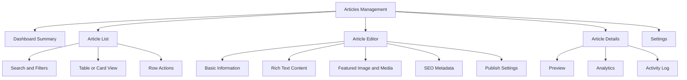
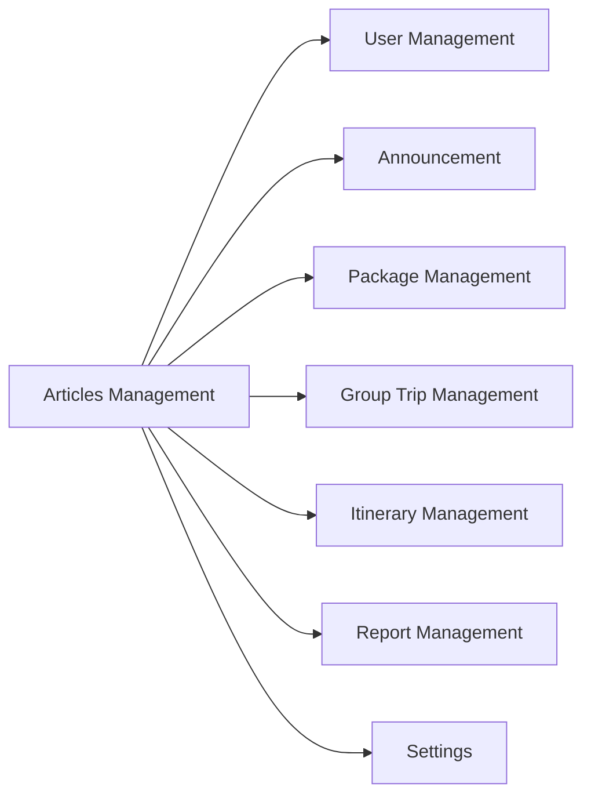
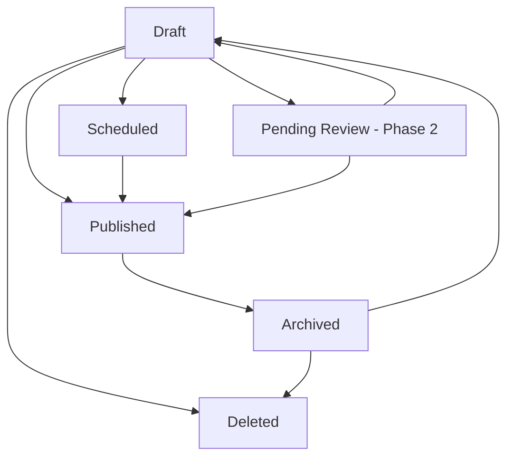
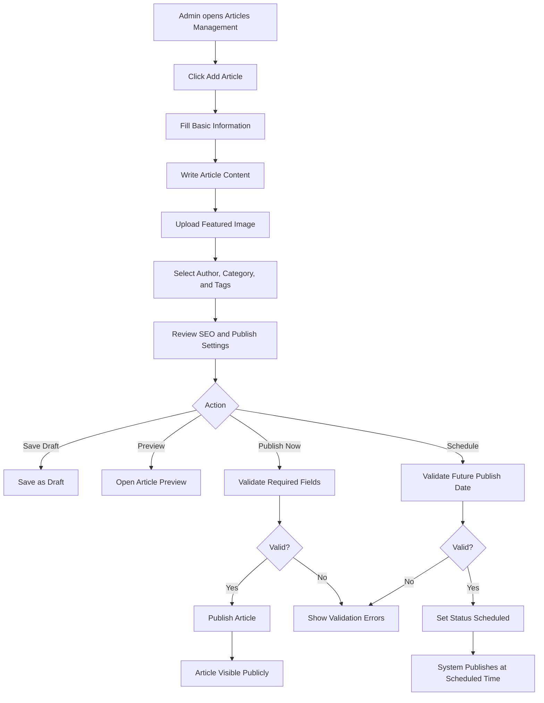
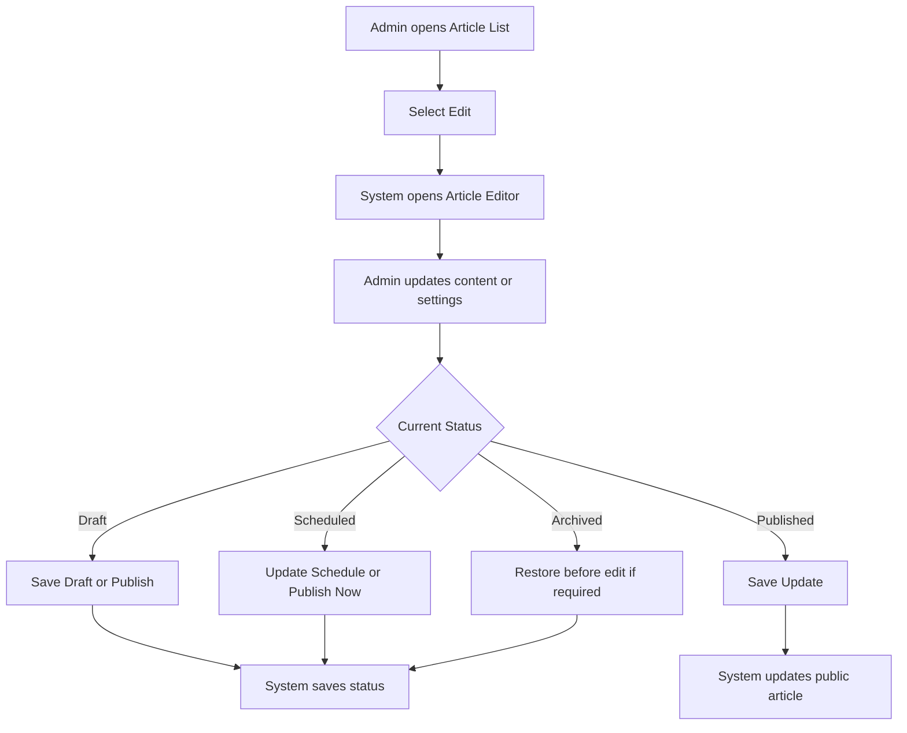
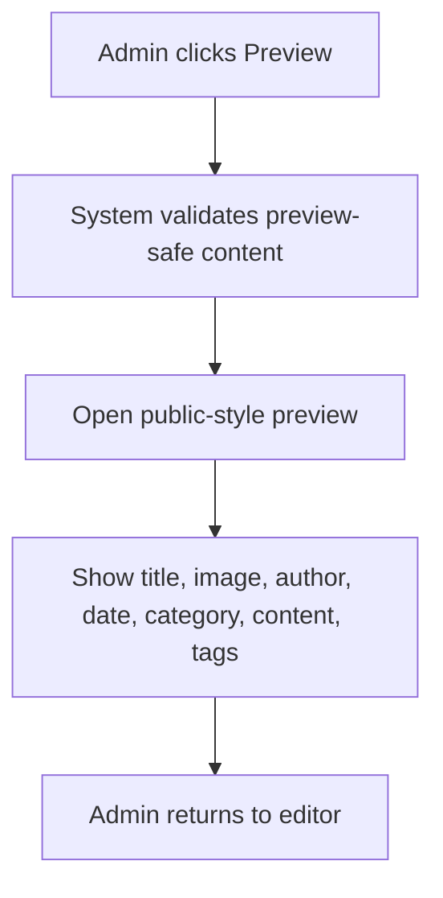
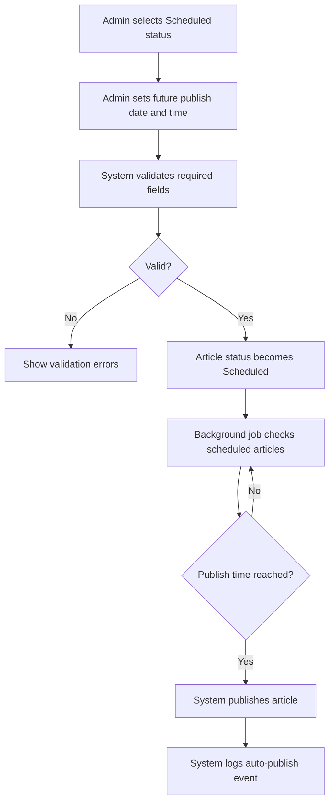
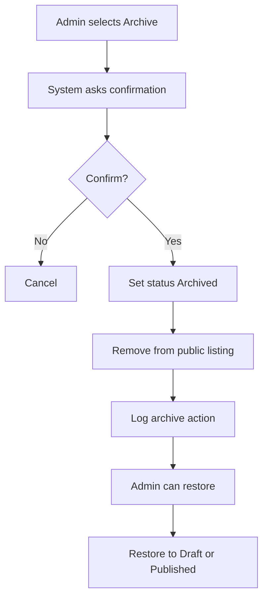

# Module PRD - Articles Management

Product: UmrahHaji.com Admin Panel
Module: Articles Management
Platform: Responsive Web Admin Panel
Document Type: Module Product Requirements Document
Status: Draft

---

## 1. Objective

Articles Management allows Admin to create, edit, schedule, publish, archive, and monitor educational articles for UmrahHaji.com.

The module is intended to support public-facing content such as Umrah/Hajj guidance, fiqh education, travel preparation, practical tips, Haram/Madinah information, visa/document guidance, health tips, and platform knowledge content.

The module should work like a lightweight CMS. It should be powerful enough for content operations, but not overly complex for Phase 1.

---

## 2. Scope

### In Scope for Phase 1

1. Article list.
2. Search and filters.
3. Table and card/list view toggle.
4. Create article.
5. Edit article.
6. Preview article.
7. Save as Draft.
8. Publish now.
9. Schedule publish.
10. Archive article.
11. Restore archived article.
12. Featured article toggle.
13. Category and tags.
14. Author selection.
15. Featured image upload or image URL.
16. Basic rich text editor.
17. Basic SEO metadata.
18. Read time, word count, and view count.
19. Article status and audit log.
20. Upload limit rules to avoid server load.

### Out of Scope for Phase 1

1. Full editorial approval workflow with multi-level reviewer.
2. Comment section moderation.
3. Paid article subscription.
4. AI content generation.
5. Multilingual article translation workflow.
6. Advanced SEO scoring.
7. Google Search Console integration.
8. External CMS integration.
9. Public article recommendation engine.
10. Article A/B testing.

### Phase 2 Enhancements

1. Submit for Review and approval workflow.
2. Article revision comparison.
3. Multilingual article variants.
4. Author contributor portal.
5. Advanced article analytics.
6. Related article automation.
7. Content campaign planning.
8. Public comments and moderation.
9. Article feedback from readers.
10. SEO indexing and sitemap management integration.

---

## 3. Product Positioning

Articles Management is different from Announcement.

| Module | Purpose | Audience Behavior |
|---|---|---|
| Articles Management | Educational and informational content library | User reads content voluntarily |
| Announcement | Broadcast updates, operational notices, alerts, or important messages | User is notified or targeted |
| Testimonial Management | Feedback, reviews, and experience content from jamaah/mutawwif | Admin moderates submitted feedback |
| Report Management | Complaints, issues, and operational cases | Admin investigates and resolves |

Articles should be treated as curated platform content. Announcement should remain short and action-oriented.

---

## 4. Reference Considerations

The Articles module follows common CMS patterns:

1. Content should support `Draft`, `Scheduled`, `Published`, `Archived`, and optionally `Pending Review` in Phase 2.
2. Each article should have a clear title, summary/excerpt, author, category, tags, content body, featured image, publication date, and status.
3. Public articles should have unique, concise SEO title and meta description.
4. Rich media upload must be controlled through file type, size limit, compression, and object storage.
5. Article content should be saved as structured content blocks or sanitized HTML, not arbitrary unsafe HTML.

---

## 5. User Roles & Permissions

| Role | Permission |
|---|---|
| Super Admin | Full access to create, edit, publish, archive, delete, and manage settings |
| Content Admin | Create, edit, publish, schedule, archive, and manage article content |
| Content Editor | Create, edit, preview, and save drafts; publish only if permission is granted |
| Reviewer | View, comment, and approve/reject in Phase 2 |
| Read-only Admin | View article list, details, and analytics only |

### Permission Keys

| Permission Key | Description |
|---|---|
| article.view | View article list and detail |
| article.create | Create article |
| article.edit | Edit article |
| article.publish | Publish article now or scheduled |
| article.archive | Archive article |
| article.delete | Hard delete article if allowed |
| article.feature | Mark article as featured |
| article.analytics.view | View views and performance metrics |
| article.settings.manage | Manage categories, tags, and content settings |

---

## 6. Navigation & Entry Point

```text
Admin Panel
└── Articles
    ├── Article List
    ├── Create Article
    ├── Article Details / Edit Article
    ├── Categories
    ├── Tags
    └── Settings
```

### Recommended Placement

Articles should be placed under a top-level menu named `Articles` or under a broader menu named `Communications`.

Recommended Phase 1 structure:

```text
Communications
├── Articles
├── Announcement
├── Testimonial
└── Reports
```

If the sidebar must stay simple, Articles can be a top-level item because content creation is a frequent admin task.

---

## 7. Information Architecture

```text
Articles Management
├── Dashboard Summary
│   ├── Total Articles
│   ├── Published
│   ├── Drafts
│   ├── Scheduled
│   └── Total Views
├── Article List
│   ├── Search
│   ├── Filters
│   ├── Table View
│   ├── Card View
│   └── Row Actions
├── Article Editor
│   ├── Basic Information
│   ├── Article Content
│   ├── Featured Image
│   ├── SEO Metadata
│   ├── Author & Category
│   ├── Tags
│   ├── Publish Settings
│   └── Metrics Preview
├── Article Details
│   ├── Content Preview
│   ├── Metadata
│   ├── Analytics
│   ├── Revision History
│   └── Activity Log
└── Settings
    ├── Categories
    ├── Tags
    ├── Authors
    └── Upload Rules
```



---

## 8. Relationship With Other Modules

| Module | Relationship |
|---|---|
| User Management | Provides admin, editor, reviewer, and author users |
| Announcement | Admin may link an article inside announcement content |
| Package Management | Future phase may link articles to package tips or preparation content |
| Group Trip Management | Future phase may recommend articles to trip members before departure |
| Itinerary Management | Future phase may attach educational articles to activities or rituals |
| Testimonial Management | Public testimonials may link to related articles in Phase 2 |
| Report Management | Articles may be referenced in support responses or FAQ-style resolutions |
| Settings | Provides master data for categories, tags, languages, and upload rules |



---

## 9. Article Status Model

### Statuses

| Status | Meaning |
|---|---|
| Draft | Article is being prepared and not visible publicly |
| Scheduled | Article is approved to be published at a future date/time |
| Published | Article is visible to public users |
| Archived | Article is hidden from public listing but retained for records |
| Deleted | Soft-deleted record, visible only to authorized Admin if supported |
| Pending Review | Phase 2 only, waiting for reviewer approval |

### Status Flow



### Rules

1. Draft articles are not visible publicly.
2. Published articles must have title, excerpt, content, category, author, featured image, and publish date.
3. Scheduled articles must have a future publish date/time.
4. Archived articles should not appear in public article listing.
5. Archived articles can be restored to Draft or Published based on permission.
6. Deleted should be soft-delete by default.
7. Hard delete should be restricted to Super Admin and disabled if article has compliance or audit requirements.

---

## 10. Dashboard Summary

The dashboard summary helps Admin understand article volume and content performance.

### Cards

| Card | Description |
|---|---|
| Total Articles | Count of all non-deleted articles |
| Published | Count of published articles |
| Drafts | Count of draft articles |
| Scheduled | Count of scheduled articles |
| Total Views | Sum of public article views |
| Featured Articles | Count of featured articles |

### Recommended Improvement From Screenshot

The screenshot shows Total Articles, Published, Drafts, and Total Views. Add `Scheduled` if scheduled publishing is supported.

If the layout is too crowded, keep 4 cards:

1. Total Articles.
2. Published.
3. Drafts + Scheduled combined.
4. Total Views.

---

## 11. Article List

### Objective

Article List allows Admin to search, filter, review, and manage content records.

### Search

Search should support:

1. Article title.
2. Slug.
3. Excerpt.
4. Author name.
5. Category.
6. Tag.

### Filters

| Filter | Options |
|---|---|
| Status | All, Draft, Scheduled, Published, Archived |
| Category | All categories |
| Author | All authors |
| Featured | All, Featured, Not Featured |
| Published Date | All Time, Today, This Week, This Month, This Year, Custom Range |
| Updated Date | All Time, Today, This Week, This Month, This Year, Custom Range |
| Language | Phase 2 if multilingual is supported |

### Sort Options

1. Newest.
2. Oldest.
3. Most viewed.
4. Least viewed.
5. Title A-Z.
6. Title Z-A.
7. Recently updated.
8. Featured first.

### Table Columns

| Column | Description |
|---|---|
| Checkbox | Bulk select |
| Article | Thumbnail, featured indicator, title, and excerpt |
| Author | Author name |
| Category | Primary category |
| Status | Draft, Scheduled, Published, Archived |
| Published Date | Date/time published or scheduled |
| Updated Date | Last updated date |
| Views | Total views |
| Actions | View, Edit, Preview, Duplicate, Archive, Delete |

### Row Actions

| Action | Rule |
|---|---|
| View Details | Opens article detail |
| Edit | Opens article editor |
| Preview | Opens public-style preview |
| Duplicate | Creates a Draft copy |
| Publish | Only shown for Draft if article passes validation |
| Unpublish | Moves Published article to Draft or Archived |
| Archive | Hides from public listing |
| Restore | Restores Archived article |
| Delete | Soft delete, permission-based |

### Bulk Actions

1. Publish selected.
2. Archive selected.
3. Restore selected.
4. Delete selected.
5. Change category.
6. Add tags.
7. Remove tags.

Bulk publish must validate each selected article. Invalid articles should be skipped and shown in an error summary.

---

## 12. Article Editor

### Objective

The Article Editor allows Admin to create or update content using a structured form and rich text editor.

### Recommended Editor Structure

```text
Create / Edit Article
├── Top Actions
│   ├── Preview
│   ├── Save Draft
│   └── Publish / Schedule
├── Main Column
│   ├── Basic Information
│   ├── Article Content
│   ├── Featured Image
│   ├── Inline Media
│   └── Tags
└── Side Panel
    ├── Publish Settings
    ├── Author & Category
    ├── SEO Settings
    └── Article Metrics
```

### Main Column vs Side Panel

| Area | Should Contain |
|---|---|
| Main Column | Title, slug, excerpt, rich text content, featured image, tags |
| Side Panel | Status, publish date, featured toggle, author, category, SEO title, meta description, read time |

This keeps the editor scannable and avoids making the form feel too long.

---

## 13. Article Form Fields

### Basic Information

| Field | Type | Required | Validation | Notes |
|---|---|---:|---|---|
| Article Title | Text input | Yes | Max 120 chars | Main visible title |
| Slug | Text input | Yes | Lowercase, URL-safe, unique | Auto-generated from title, editable |
| Excerpt | Textarea | Yes | Max 300 chars | Used in list, cards, and metadata fallback |
| Content Language | Dropdown | No | Existing language | Phase 2 if multilingual is added |
| Content Type | Dropdown | No | Article, Guide, FAQ, News, Practical Tips | Useful for display grouping |

### Article Content

| Field | Type | Required | Validation | Notes |
|---|---|---:|---|---|
| Article Content | Rich text editor | Yes | Min 300 chars for publish | Draft may save shorter content |
| Headings | Editor control | No | H2/H3 recommended | H1 should be reserved for title |
| Inline Image | Upload or URL | No | See upload rules | Inserted into body |
| Quote / Callout | Editor block | No | Text only | Useful for religious notes or reminders |
| Related Link | Link field | No | Valid URL or internal article | Used for references |

### Author & Category

| Field | Type | Required | Validation | Notes |
|---|---|---:|---|---|
| Author | Search/dropdown | Yes | Existing Admin/Author user | Can display name and title |
| Author Title | Text input | No | Max 80 chars | Example: Ustaz, Dr., Travel Expert |
| Primary Category | Dropdown | Yes | Existing active category | One primary category |
| Secondary Categories | Multi-select | No | Existing active categories | Max 3 |
| Tags | Multi-select / chip input | No | Max 10 tags | Existing or new tags based on permission |

### Publish Settings

| Field | Type | Required | Validation | Notes |
|---|---|---:|---|---|
| Status | Dropdown | Yes | Draft, Scheduled, Published, Archived | Based on permission |
| Publish Date | Date/time picker | Conditional | Required for Scheduled/Published | Future date required for Scheduled |
| Featured Article | Toggle | No | Boolean | Featured in public page |
| Visibility | Dropdown | Yes | Public, Private, Internal Only | Phase 1 default Public |
| Allow Indexing | Toggle | No | Boolean | Controls SEO index flag if implemented |

### SEO Settings

| Field | Type | Required | Validation | Notes |
|---|---|---:|---|---|
| SEO Title | Text input | No | Recommended 40-70 chars | Defaults from article title |
| Meta Description | Textarea | No | Recommended 120-160 chars | Defaults from excerpt |
| Canonical URL | Text input | No | Valid URL | Phase 2 or advanced setting |
| Open Graph Title | Text input | No | Max 120 chars | Defaults from title |
| Open Graph Description | Textarea | No | Max 300 chars | Defaults from excerpt |
| Open Graph Image | Upload or URL | No | See upload rules | Defaults from featured image |

### Metrics Fields

These fields are mostly system-generated.

| Field | Source | Editable |
|---|---|---|
| Word Count | System calculated | No |
| Character Count | System calculated | No |
| Estimated Read Time | System calculated or manually overridden | Optional |
| Total Views | System tracked | No |
| Last Viewed At | System tracked | No |
| Created By | System | No |
| Updated By | System | No |

---

## 14. Featured Image & Media Rules

### Featured Image

| Field | Requirement |
|---|---|
| Required for Publish | Yes |
| Allowed Formats | JPG, JPEG, PNG, WEBP |
| Max File Size | 3 MB |
| Recommended Dimension | 1200 x 630 px for article hero and social preview |
| Minimum Dimension | 800 x 450 px |
| Compression | Required before storage |
| Thumbnail | System generates small thumbnail |
| Storage | Object storage or equivalent private/public media storage |

### Inline Images

| Field | Requirement |
|---|---|
| Allowed Formats | JPG, JPEG, PNG, WEBP |
| Max File Size | 2 MB per image |
| Max Count | 10 images per article |
| Compression | Required |
| Alt Text | Required for published inline images |

### Video

Video upload should not be included in Phase 1 article editor unless there is a strong content requirement.

Recommended Phase 1 approach:

1. Allow embedded video URL from approved providers only.
2. Do not upload videos directly to application server.
3. Validate URL and provider.

### Attachment / Document

PDF attachment is optional and should be limited.

| Field | Requirement |
|---|---|
| Allowed Formats | PDF |
| Max File Size | 5 MB per file |
| Max Count | 3 files per article |
| Use Case | Downloadable guide, checklist, regulation reference |

### Server Load Rules

1. Uploads must not be stored directly inside the app server filesystem.
2. Images must be compressed before permanent storage.
3. The system must generate thumbnails for article list and preview.
4. Original media should be lazy-loaded on public pages.
5. Server must validate MIME type and file extension.
6. Uploads should be malware-scanned if scanning service is available.
7. Admin should see upload progress, error message, and file size warning.

---

## 15. Content Categories

Recommended initial categories:

| Category | Example Topics |
|---|---|
| Umrah Fiqh | Ihram, tawaf, sai, tahallul, miqat, umrah rules |
| Hajj Fiqh | Hajj types, manasik, wukuf, mina, muzdalifah, jamrah |
| Haramain Info | Makkah, Madinah, mosque etiquette, ziyarah locations |
| Practical Tips | Packing, health, travel readiness, safety |
| Documents & Visa | Passport, visa, vaccination, travel documents |
| Travel Guide | Flights, hotels, transportation, travel flow |
| Platform Guide | How to use UmrahHaji.com features |
| News & Updates | Policy updates, travel alerts, operational news |

### Category Rules

1. Category name must be unique.
2. Category can be active or inactive.
3. Inactive category cannot be selected for new articles.
4. Existing published articles may retain inactive category until reassigned.
5. Category slug must be unique.

---

## 16. Tags

Tags help users find related content.

Example tags:

```text
Umrah
Hajj
Ihram
Tawaf
Sai
Makkah
Madinah
Ziyarah
Health
Visa
Passport
Travel Tips
First Timer
Family
Elderly
Women
```

### Tag Rules

1. Max 10 tags per article.
2. Tag name must be unique.
3. Tags should be normalized to avoid duplicates such as `Umrah`, `umrah`, and `UMRAH`.
4. Tag creation may be restricted to Content Admin.

---

## 17. Create Article Flow



### Flow Rules

1. Save Draft should allow incomplete content.
2. Publish Now must validate all required fields.
3. Schedule must validate future date/time.
4. Preview should work for draft and scheduled article.
5. All save, publish, schedule, archive, restore, and delete actions must be logged.

---

## 18. Edit Article Flow



### Published Article Edit Rules

1. Editing a Published article should update the public content after save.
2. If approval workflow is enabled in Phase 2, editing a Published article may create an unpublished revision.
3. Phase 1 can use direct update with audit log.
4. Admin should be warned before changing slug of a Published article.

---

## 19. Preview Flow



### Preview Requirements

1. Preview should not require article to be published.
2. Preview URL should be protected and expire if shared.
3. Preview must show desktop and mobile responsive layout.
4. Preview must show how title, excerpt, featured image, and content will appear.

---

## 20. Scheduled Publish Flow



### Scheduled Publish Rules

1. Publish date must be future date/time.
2. Timezone should follow platform timezone setting.
3. Scheduled articles should be editable before publish time.
4. If scheduled job fails, article should remain Scheduled and show error log.

---

## 21. Archive & Restore Flow



### Archive Rules

1. Archive is preferred over hard delete.
2. Archived article should preserve views, audit log, and publish history.
3. Restoring to Published requires validation of required fields.
4. Hard delete should be restricted and optional.

---

## 22. SEO & Public Display Requirements

### SEO Requirements

1. SEO title should be unique, descriptive, and concise.
2. Meta description should summarize the article clearly.
3. Slug should be readable, lowercase, and stable after publish.
4. Each article should have one primary H1 from the article title.
5. Article body should use H2/H3 headings.
6. Featured image should have alt text.
7. System should generate Open Graph metadata from title, excerpt, and featured image.
8. Public article page should expose published date and updated date.
9. If article is archived, public page should return a proper unavailable state or redirect based on product decision.

### SEO Field Defaults

| Field | Default |
|---|---|
| SEO Title | Article Title |
| Meta Description | Excerpt |
| Open Graph Title | Article Title |
| Open Graph Description | Excerpt |
| Open Graph Image | Featured Image |
| Canonical URL | Generated public article URL |

---

## 23. Article Details

Article Details provides read-only summary and operational history.

### Sections

1. Article preview.
2. Metadata summary.
3. Publication status.
4. Author and category.
5. Tags.
6. SEO metadata.
7. Media summary.
8. Analytics.
9. Revision history.
10. Activity log.

### Detail Actions

1. Edit article.
2. Preview.
3. Duplicate.
4. Publish.
5. Schedule.
6. Archive.
7. Restore.
8. Delete.

---

## 24. Article Analytics

### Phase 1 Metrics

| Metric | Description |
|---|---|
| Total Views | Number of article page views |
| Unique Views | Optional if analytics supports visitor/session tracking |
| Published Articles | Count of published articles |
| Draft Articles | Count of drafts |
| Top Articles | Most viewed articles |
| Category Performance | Views grouped by category |
| Recent Views | Last 7/30/90 days if available |

### Phase 2 Metrics

1. Average read time.
2. Scroll depth.
3. Click-through to packages.
4. Search ranking data.
5. Article conversion to inquiry or booking.
6. Reader feedback rating.
7. Related article engagement.

---

## 25. Settings

### Category Settings

| Field | Type | Required | Validation |
|---|---|---:|---|
| Category Name | Text input | Yes | Unique, max 80 chars |
| Category Slug | Text input | Yes | URL-safe, unique |
| Description | Textarea | No | Max 300 chars |
| Status | Radio | Yes | Active, Inactive |

### Tag Settings

| Field | Type | Required | Validation |
|---|---|---:|---|
| Tag Name | Text input | Yes | Unique, max 50 chars |
| Tag Slug | Text input | Yes | URL-safe, unique |
| Status | Radio | Yes | Active, Inactive |

### Upload Settings

| Setting | Default |
|---|---|
| Featured image max size | 3 MB |
| Inline image max size | 2 MB |
| Max inline images per article | 10 |
| PDF attachment max size | 5 MB |
| Max PDF attachments per article | 3 |
| Allowed image formats | JPG, JPEG, PNG, WEBP |
| Image compression | Enabled |

### Publish Settings

| Setting | Default |
|---|---|
| Allow scheduled publishing | Enabled |
| Require featured image before publish | Enabled |
| Require excerpt before publish | Enabled |
| Require category before publish | Enabled |
| Allow editor to publish | Permission-based |
| Allow slug change after publish | Super Admin only or warning required |

---

## 26. Validation Rules

### Draft Save

Draft save requires:

1. Article Title, or system may save as `Untitled Draft`.
2. No required image.
3. No required category.
4. No required excerpt.

### Publish

Publish requires:

1. Article Title.
2. Unique slug.
3. Excerpt.
4. Article Content.
5. Featured Image.
6. Author.
7. Primary Category.
8. Publish date.

### Schedule

Schedule requires all publish requirements plus:

1. Future publish date/time.
2. Valid timezone.

---

## 27. Empty States

### No Articles

Message:

```text
No articles have been created yet.
Create your first article to publish guidance, tips, or educational content.
```

Primary action:

```text
Add Article
```

### No Search Results

Message:

```text
No articles match your search or filters.
Try changing the keyword, status, category, or date range.
```

### No Categories

Message:

```text
No active categories are available.
Create at least one category before publishing articles.
```

---

## 28. Error States

| Error | Expected Behavior |
|---|---|
| Duplicate slug | Show inline error and suggest available slug |
| Missing publish field | Show field-level errors |
| Invalid image format | Reject upload and show allowed formats |
| File too large | Reject upload and show max size |
| Schedule date in past | Show validation error |
| Publish job failed | Keep status Scheduled and show system error log |
| Permission denied | Disable action or show permission error |
| Unsafe HTML detected | Sanitize content and show warning |

---

## 29. Security & Compliance

1. Rich text content must be sanitized before saving or rendering.
2. Unsafe HTML, script tags, iframe from unapproved sources, and inline event handlers must be blocked.
3. Image upload must validate MIME type, extension, and file size.
4. Uploaded media should be stored in object storage.
5. Public article URL should not expose internal IDs if avoidable.
6. Admin actions must be logged.
7. Only authorized users can publish, archive, or delete articles.
8. Private/internal articles must not be accessible from public routes.

---

## 30. Responsive Web Behavior

### Desktop

1. Article list uses table view by default.
2. Editor uses two-column layout: main editor and right settings panel.
3. Filters appear inline above table.

### Tablet

1. Table can scroll horizontally.
2. Editor side panel may stack below content or become sticky drawer.
3. Filters can wrap to multiple rows.

### Mobile

1. Article list should become cards.
2. Filters should collapse into filter drawer.
3. Editor should use single-column layout.
4. Top action buttons should stay accessible at bottom sticky bar.
5. Rich text toolbar should be compact and scrollable horizontally.

---

## 31. Data Model Reference

### Article

| Field | Description |
|---|---|
| article_id | Unique article ID |
| title | Article title |
| slug | Unique URL slug |
| excerpt | Short summary |
| content | Sanitized HTML or structured content JSON |
| status | Draft, Scheduled, Published, Archived, Deleted |
| visibility | Public, Private, Internal Only |
| author_id | Linked author user |
| primary_category_id | Primary category |
| secondary_category_ids | Optional categories |
| featured_image_id | Featured image media |
| is_featured | Featured toggle |
| publish_at | Scheduled or published date/time |
| published_at | Actual publish date/time |
| archived_at | Archive date/time |
| view_count | Total views |
| read_time_minutes | Estimated read time |
| seo_title | SEO title |
| meta_description | Meta description |
| og_title | Open Graph title |
| og_description | Open Graph description |
| og_image_id | Open Graph image |
| canonical_url | Optional canonical URL |
| created_by | Admin user |
| updated_by | Admin user |
| created_at | Created timestamp |
| updated_at | Updated timestamp |

### Article Category

| Field | Description |
|---|---|
| category_id | Unique category ID |
| name | Category name |
| slug | Category slug |
| description | Category description |
| status | Active or Inactive |
| sort_order | Display order |

### Article Tag

| Field | Description |
|---|---|
| tag_id | Unique tag ID |
| name | Tag name |
| slug | Tag slug |
| status | Active or Inactive |

### Article Media

| Field | Description |
|---|---|
| media_id | Unique media ID |
| article_id | Related article |
| file_url | Stored file URL |
| file_type | Image, PDF, Embed |
| mime_type | MIME type |
| file_size | File size |
| alt_text | Required for images |
| caption | Optional caption |
| uploaded_by | Admin user |
| uploaded_at | Upload timestamp |

### Article Activity Log

| Field | Description |
|---|---|
| log_id | Unique log ID |
| article_id | Related article |
| action | Created, Updated, Published, Scheduled, Archived, Restored, Deleted |
| actor_id | Admin user |
| old_value | Optional before value |
| new_value | Optional after value |
| created_at | Log timestamp |

---

## 32. Acceptance Criteria

1. Admin can view article summary cards.
2. Admin can search articles by title, slug, excerpt, author, category, or tag.
3. Admin can filter articles by status, category, author, featured flag, and date.
4. Admin can create a draft article with minimal data.
5. Admin can publish an article only when all publish-required fields are valid.
6. Admin can schedule an article with future publish date/time.
7. System automatically publishes scheduled articles when time is reached.
8. Admin can upload featured image within allowed format and size.
9. System rejects oversized or invalid media uploads.
10. System stores media outside the application server filesystem.
11. Admin can preview draft, scheduled, and published articles.
12. Admin can archive and restore articles.
13. Admin can duplicate an article as Draft.
14. Admin can manage article category and tags based on permission.
15. System tracks article views.
16. System calculates word count and estimated read time.
17. System records activity logs for create, update, publish, schedule, archive, restore, and delete.
18. Article editor is usable on desktop, tablet, and mobile web.
19. Published article has SEO title, meta description fallback, Open Graph metadata, and featured image.
20. Unauthorized users cannot publish, archive, delete, or manage settings.

---

## 33. Suggested UI Improvements From Screenshot

1. Rename `All Categori` to `All Category` or `All Categories`.
2. Add `Scheduled` count card if scheduled publishing is supported.
3. Add `Updated Date` column because content may be revised after publish.
4. Show `Featured` indicator as a small star near title.
5. Show short excerpt under title, but limit to 1-2 lines.
6. Add `Preview` action in row menu.
7. Add `Duplicate` action for faster content creation.
8. Keep table view as default for Admin, card view optional.
9. Show upload guidelines under image field.
10. Move SEO metadata into a collapsible side panel so the main editor remains focused.

---

## 34. Open Questions

1. Should public users be able to view Articles in Phase 1, or should Phase 1 only prepare content from Admin?
2. Should authors be selected only from Admin users, or can external scholars/contributors be stored as author profiles?
3. Should religious/fiqh articles require reviewer approval before publish?
4. Should Article Management support Malay, Indonesian, English, and Arabic variants in Phase 2?
5. Should published article URL use `/articles/{slug}` or category-based URL such as `/articles/umrah-fiqh/{slug}`?
6. Should archived public articles redirect to category page, show unavailable page, or remain accessible by direct link?

---

## 35. Future Enhancements

1. Editorial review workflow.
2. Version comparison.
3. Multilingual content variants.
4. Contributor author profiles.
5. Related article recommendation.
6. Reader feedback.
7. Article comments.
8. SEO sitemap integration.
9. Content calendar.
10. Article-to-package conversion tracking.
11. AI-assisted summary and excerpt.
12. Rich structured content blocks.

