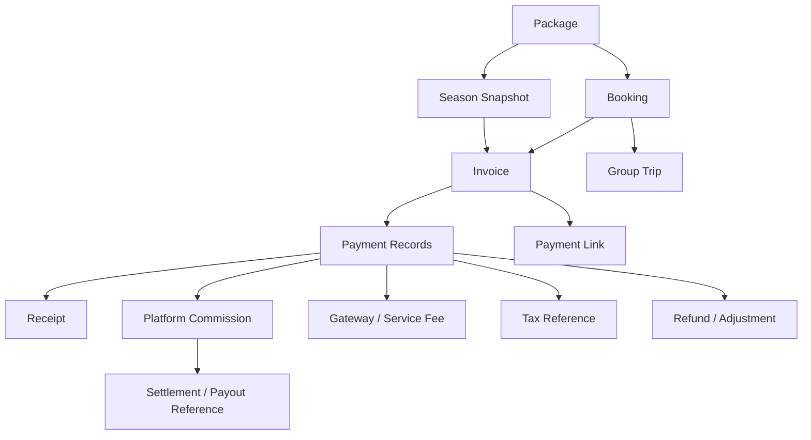
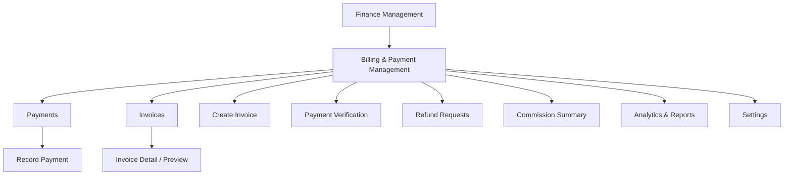
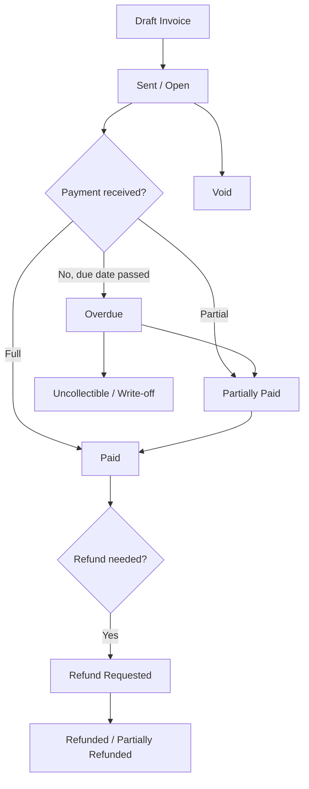
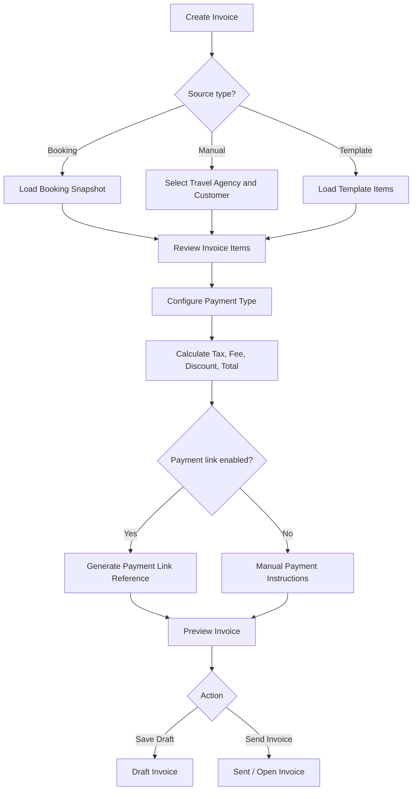
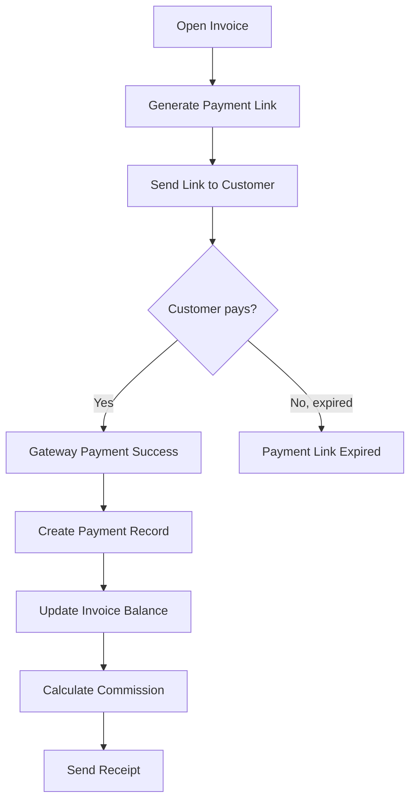
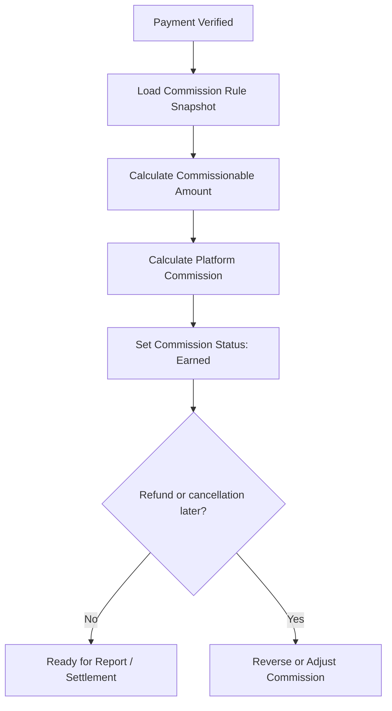
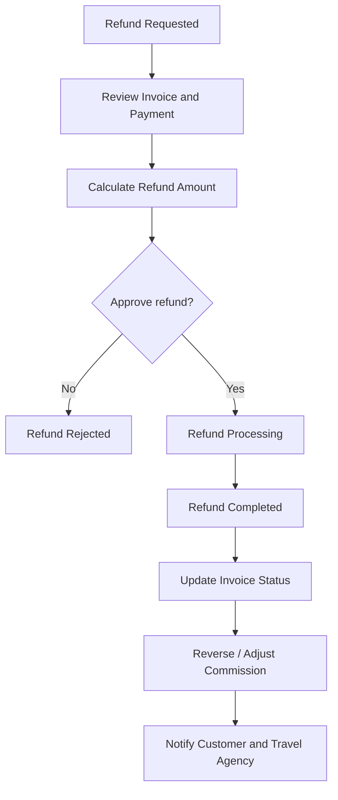

# Module PRD - Billing & Payment Management

Product: UmrahHaji.com Admin Panel
Module: Billing & Payment Management
Parent Module: Finance Management
Scope: Admin Panel, Travel Agency billing view, and customer/Jamaah payment records
Platform: Responsive Web Platform
Status: Draft
Last Updated: 4 June 2026

---

## 1. Objective

Billing & Payment Management allows Admin to monitor invoices, payment progress, outstanding balances, overdue installments, refunds, and platform commission across all Travel Agencies, customers, bookings, packages, and group trips.

Admin can create invoices manually, generate payment links, record manual payments, verify payment proof, print/download invoices, send invoice emails, monitor collection performance, and review platform commission per payment.

This module is the financial control layer for UmrahHaji.com. Booking Management owns the customer reservation. Billing & Payment Management owns invoice, payment, collection, refund, tax, receipt, and commission calculation records.

Billing & Payment Management should be treated as PRD 11.1 under Finance Management. It is a finance submodule focused on invoice and payment operations. Finance Management is the broader umbrella that also covers refund monitoring, commission summary, allowance, payout preparation, and finance reports.

---

## 2. Phase Position

Billing & Payment Management exists in Phase 1 as manual payment tracking and verification.

Phase 2 expands the module into a fuller billing workspace with payment gateway integration, payment links, automated receipts, reminder automation, invoice templates, refund workflow, commission calculation, payout preparation, and analytics.

---

## 3. Scope

### In Scope for Phase 1

1. Payment List across Travel Agencies.
2. Manual invoice creation.
3. Manual payment record.
4. Payment proof upload and verification.
5. Invoice status tracking.
6. Payment progress tracking.
7. Outstanding and overdue visibility.
8. Basic revenue summary.
9. Basic platform commission display.
10. Export invoice/payment list.
11. Print/download invoice PDF.
12. Activity logs.

### In Scope for Phase 2 Full Scope

1. Payment gateway integration.
2. Payment link generation.
3. Invoice email sending.
4. Automated payment reminders.
5. Installment schedule.
6. Subscription or recurring invoice support where needed.
7. Refund request and refund status workflow.
8. Credit note / invoice adjustment workflow.
9. Advanced commission calculation per invoice/payment.
10. Platform fee, gateway fee, tax, and net settlement calculation.
11. Travel Agency settlement and payout preparation.
12. Analytics & Reports dashboard.
13. Payment Settings.
14. Invoice template management.
15. Notification configuration.
16. Audit-ready finance logs.

### Out of Scope Unless Added to Finance Roadmap

1. Full accounting ledger.
2. Payroll.
3. Bank reconciliation automation.
4. Tax filing submission.
5. Supplier payment automation.
6. Automated Travel Agency payout execution without finance approval.

---

## 4. Product Positioning

### Booking vs Invoice vs Payment vs Commission

| Area | Booking | Invoice | Payment | Commission |
| --- | --- | --- | --- | --- |
| Purpose | Reservation and participant record | Amount requested from customer/Jamaah | Money received or attempted | Platform/agent revenue calculation |
| Owner Module | Booking Management | Finance / Billing & Payment | Finance / Billing & Payment | Finance / Commission |
| Created From | Package schedule, season, and participants | Booking, manual admin input, add-on/service | Invoice or manual payment record | Package/booking/payment rules |
| Editable Before Final | Yes, based on booking status | Draft invoice can be edited | Payment record can be corrected with permission | Rule can be configured before payout |
| Key Status | Pending Payment, Confirmed, Cancelled | Draft, Sent/Open, Paid, Void, Overdue | Pending, Processing, Verified, Failed, Refunded | Pending, Earned, Reversed, Settled |
| Financial Impact | Creates invoice reference | Creates receivable | Reduces outstanding balance | Creates platform earning / payable |

### Key Principle

Invoice and payment records must preserve an auditable financial trail. Once an invoice is sent/finalized or paid, major changes should be handled through revision, adjustment, credit note, void, or refund workflow instead of silently editing historical amounts.

---

## 5. Relationship With Other Modules

```text
Package
├── Season Snapshot
↓
Booking
↓
Invoice
├── Payment Records
├── Payment Link
├── Receipt
├── Refund / Adjustment
├── Platform Commission
└── Settlement / Payout Reference
```

### Relationship Diagram



### Integration Table

| Module | Relationship |
| --- | --- |
| Booking Management | Booking can generate invoice and payment schedule |
| Package Management | Package price, deposit, payment terms, and commission become invoice defaults |
| Season Management | Season snapshot can be stored for invoice audit and reporting |
| Jamaah Management | Customer/Jamaah profile is used as bill-to contact |
| Travel Agency Management | Invoice belongs to a Travel Agency context |
| Group Trip Management | Payment readiness can affect operational readiness |
| Finance Management | Parent workspace that consolidates billing, commission, refunds, allowance, payout preparation, and finance reporting |
| Commission | Platform and agent commission are calculated from invoice/payment |
| Settings | Payment terms, tax, invoice prefix, reminder schedule, and notification settings |
| Announcement / Notification | Invoice, reminder, receipt, overdue, and refund notifications |

---

## 6. User Roles & Permissions

| Role | Access |
| --- | --- |
| Super Admin | Full access to all billing records |
| Finance Admin | Manage invoices, payments, refunds, commission, exports, settings |
| Admin / Operations | View invoice/payment status and create manual invoice if permitted |
| Travel Agency Admin | View own agency invoices/payments and create invoices in TA Portal if enabled |
| Travel Agency Staff | Limited own-agency billing access based on role |
| Support Staff | View invoice/payment status and add support remarks |
| Auditor | Read-only access to billing records and activity logs |

### Permission Rules

1. Only Finance Admin and Super Admin can verify payment, approve refund, edit paid invoice metadata, or adjust commission.
2. Admin can create manual invoice only if permission is granted.
3. Travel Agency can only view and manage billing records under its own agency.
4. Platform commission and gateway fee must be hidden from customer/Jamaah-facing invoice.
5. Paid, voided, refunded, and settled records require elevated permission for correction.
6. Every finance correction requires reason and audit log.

---

## 7. Navigation & Entry Point

```text
Admin Panel
└── Finance Management
    ├── Overview
    ├── Payments
    ├── Invoices
    ├── Create Invoice
    ├── Payment Verification
    ├── Refund Requests
    ├── Commission Summary
    ├── Finance Reports
    └── Finance Settings
```

### Module IA Diagram



---

## 8. Main User Flow

### Invoice and Payment Flow

```text
Booking or Admin manual action creates invoice
↓
Invoice is saved as draft
↓
Admin reviews invoice items, tax, discount, and payment terms
↓
Invoice is sent/finalized
↓
Customer/Jamaah pays full, deposit, installment, or subscription amount
↓
System records payment or Admin records manual payment
↓
Finance verifies payment
↓
Invoice balance and booking payment status are updated
↓
Platform commission is calculated
↓
Receipt and notification are generated
```

### Invoice Lifecycle Diagram



---

## 9. Payments List Requirements

### Page Purpose

Payments List allows Admin to monitor all customer/Jamaah payment obligations, payment progress, overdue installments, invoice status, and platform commission across Travel Agencies.

### Summary Cards

| Card | Description |
| --- | --- |
| Total Revenue | Total invoiced amount within selected scope |
| Collected | Verified paid amount |
| Outstanding | Remaining unpaid amount |
| Collection Rate | Collected / total invoiced |
| Overdue Installments | Count of due unpaid installments |
| Platform Commission | Earned platform commission from verified payments |

### Recommended Columns

| Column | Description |
| --- | --- |
| Invoice | Invoice number with link to invoice preview/detail |
| Jamaah / Customer | Primary customer, email, participant count |
| Travel Agency | Agency owner |
| Booking | Booking reference if invoice came from booking |
| Package Name | Package name and duration |
| Season | Season type/period snapshot if invoice comes from package schedule |
| Amount & Payment Type | Invoice total, paid amount, full/deposit/installment/subscription |
| Payment Progress | Paid percentage, outstanding amount |
| Platform Commission | Platform fee/commission from this payment |
| Due Date | Invoice or installment due date |
| Status | Draft, Sent, Partially Paid, Paid, Overdue, Void, Refunded |
| Actions | View invoice, record payment, print/download, send reminder |

### Filters

| Filter | Options |
| --- | --- |
| Status | Draft, Sent/Open, Paid, Partially Paid, Overdue, Void, Refunded, Uncollectible |
| Payment Type | Full Payment, Deposit, Installment, Subscription, Manual |
| Travel Agency | Active agency list |
| Package | Package search |
| Season | Low Season, Medium Season, High / Peak Season, Custom, Unclassified |
| Payment Method | Bank Transfer, FPX, E-wallet, Card, Cash, Cheque, Manual |
| Date Range | All Time, Today, This Week, This Month, Last 12 Months, Custom Range |
| Commission Status | Pending, Earned, Reversed, Settled |

### Row Actions

1. View Invoice.
2. Record Payment.
3. Print Invoice.
4. Download PDF.
5. Send Invoice.
6. Send Reminder.
7. Void Invoice.
8. Create Refund Request.
9. View Activity Log.

---

## 10. Invoice Details / Preview Requirements

### Page Purpose

Invoice Preview allows Admin to review invoice content exactly as it will be sent to the customer/Jamaah.

### Invoice Header

| Field | Description |
| --- | --- |
| Invoice ID | Unique invoice number |
| Travel Agency | From / seller context |
| Issue Date | Invoice creation or issue date |
| Due Date | Payment due date |
| Currency | Default MYR unless configured otherwise |
| Status | Draft, Sent/Open, Paid, Overdue, Void, Refunded |

### Bill To Section

1. Customer/Jamaah name.
2. Email.
3. Phone number.
4. Billing address.
5. Booking reference.
6. Group/family name if applicable.

### Invoice Items

| Item Type | Example |
| --- | --- |
| Package | Umrah Standard |
| Add-on | Visa Processing Fee |
| Service | Emergency Support |
| Custom | Baby Seat / Manual Entry |
| Adjustment | Discount, penalty, correction |

### Invoice Summary

1. Subtotal.
2. Discount.
3. Tax / SST if enabled.
4. Service fee.
5. Gateway fee if passed to customer.
6. Invoice total.
7. Amount paid.
8. Amount due now.
9. Remaining balance.
10. Payment terms.

---

## 11. Create Invoice Requirements

### Entry Modes

| Mode | Description |
| --- | --- |
| From Booking | Generate invoice from booking price, participants, and payment terms |
| Manual Invoice | Admin creates invoice without booking source |
| From Template | Load saved invoice template |
| Add-on Invoice | Invoice extra services after booking |
| Adjustment Invoice | Invoice correction, penalty, or extra charge |

### Create Invoice Sections

```text
Invoice Details
Jamaah / Customer Information
Invoice Items
Payment Options
Invoice Summary
Template Management
Payment Link
Additional Notes
Reminders
Attachment
Quick Actions
```

### Create Invoice Flow Diagram



---

## 12. Manual Payment Record

### Purpose

Record Payment is used when customer/Jamaah pays outside the gateway, such as bank transfer, cash, cheque, or admin-confirmed payment.

### Record Payment Fields

| Field | Type | Required | Validation | Notes |
| --- | --- | ---: | --- | --- |
| Invoice | System reference | Yes | Existing invoice | Read-only from row action |
| Payment Date | Date/time picker | Yes | Cannot be future unless scheduled | Required |
| Payment Amount | Currency | Yes | > 0 and <= outstanding unless overpayment allowed | Required |
| Payment Method | Select | Yes | Bank Transfer, FPX, E-wallet, Card, Cash, Cheque, Manual | Required |
| Payment Reference | Text input | Conditional | Max 100 chars | Required for bank/gateway |
| Upload Proof | File upload | Conditional | PDF/JPG/PNG/WEBP, max 5 MB | Required if proof policy enabled |
| Notes | Textarea | No | Max 500 chars | Internal |
| Verification Status | Select | Yes | Pending, Verified, Rejected | Finance-owned |

### Payment Proof Upload Policy

| Upload Type | Allowed Format | Max Size | Optimization Rule |
| --- | --- | ---: | --- |
| Payment proof image | JPG, JPEG, PNG, WEBP | 5 MB | Generate thumbnail, compress preview |
| Payment proof PDF | PDF | 5 MB | Store original, generate preview if possible |
| Invoice attachment | PDF, JPG, JPEG, PNG, WEBP | 5 MB/file | Limit attachment count by setting |

---

## 13. Payment Link Requirements

### Purpose

Payment link allows Admin or Travel Agency to share a secure payment page with customer/Jamaah.

### Rules

1. Payment link should reference invoice ID and payment reference.
2. Payment link should have expiry time, recommended 24 to 72 hours by configuration.
3. Link can be regenerated only for draft/open invoices.
4. Paid, voided, or refunded invoices cannot generate new payment link unless adjustment invoice is created.
5. Payment link status must be tracked: Not Generated, Generated, Sent, Opened, Paid, Expired, Cancelled.
6. Gateway response must update payment status through webhook or manual sync.
7. Payment link should support amount due now, not necessarily full invoice total, for deposit/installment flow.
8. For platform commission, gateway integration should support platform fee or post-payment commission calculation.

### Payment Link Flow Diagram



---

## 14. Payment Types

| Payment Type | Description | Billing Behavior |
| --- | --- | --- |
| Full Payment | Customer pays full invoice amount | Invoice can be paid in one payment |
| Deposit | Customer pays deposit first, remaining balance later | Creates amount due now and remaining balance |
| Installment | Customer pays according to installment schedule | Creates due dates per installment |
| Subscription | Recurring monthly invoice/payment plan if enabled | Creates recurring invoice schedule |
| Manual | Admin records outside-system payment | Requires proof/reference and verification |

### Installment Rules

1. Installment schedule must sum to invoice total.
2. Each installment has due date, amount, paid amount, and status.
3. Overdue installment triggers alert and reminder.
4. Payment can be applied to oldest outstanding installment by default.
5. Admin can manually allocate payment to specific installment with permission.

---

## 15. Platform Commission Logic

### Purpose

Platform commission shows how much UmrahHaji.com earns from each verified payment.

### Commission Sources

| Source | Description |
| --- | --- |
| Package Commission | Commission rule configured in Package Management |
| Season Snapshot | Season context stored from package schedule for reporting; does not affect commission unless package rules define it |
| Booking Commission | Commission snapshot stored when booking is created |
| Manual Invoice Commission | Commission manually set on invoice |
| Platform Fee | Fixed or percentage fee charged by platform |
| Service Fee | Additional service charge if enabled |

### Commission Calculation

```text
Gross Payment
- Refund Amount
- Gateway Fee if absorbed by platform
- Tax if commission is calculated excluding tax
= Commissionable Amount

Commissionable Amount x Commission Rate
or Fixed Commission Amount
= Platform Commission
```

### Commission Status

| Status | Meaning |
| --- | --- |
| Pending | Invoice/payment not verified yet |
| Earned | Payment verified and commission recognized |
| Reversed | Payment refunded, voided, or cancelled |
| Adjusted | Manual correction with reason |
| Settled | Included in settlement/payout report |

### Commission Flow Diagram



---

## 16. Refund, Void, and Adjustment

### Refund Rules

1. Refund is linked to invoice, payment, booking, and customer/Jamaah.
2. Refund cannot exceed paid amount.
3. Partial refund is supported.
4. Refund should reverse or adjust platform commission.
5. Refund approval requires Finance Admin or Super Admin permission.
6. Refund does not automatically delete booking or group trip member.
7. Booking and Group Trip should receive refund/cancellation impact status.

### Void Rules

1. Draft invoice can be deleted if no payment exists.
2. Sent/Open invoice should be voided, not deleted.
3. Paid invoice cannot be voided; use refund or credit note/adjustment.
4. Voided invoice remains searchable for audit.

### Adjustment Rules

1. Adjustment can add discount, penalty, correction, or additional charge.
2. Adjustment must preserve old amount, new amount, actor, reason, and timestamp.
3. Major adjustments after invoice is sent should create revised invoice or adjustment invoice.

### Refund Flow Diagram



---

## 17. Analytics & Reports

### Page Purpose

Analytics & Reports helps Admin and Finance understand billing performance, collection performance, outstanding risk, package revenue, customer type distribution, payment method distribution, and commission trends.

### Recommended Metrics

| Metric | Description |
| --- | --- |
| Total Revenue | Total invoiced amount |
| Collected Revenue | Verified paid amount |
| Monthly Revenue | Invoiced or collected revenue in selected month |
| Outstanding | Remaining balance |
| Overdue Amount | Past-due unpaid amount |
| Collection Rate | Collected / total invoiced |
| Average Transaction Value | Collected amount / paid invoice count |
| Period Transactions | Count of invoices/payments |
| Platform Commission | Earned commission |
| Refund Amount | Total refunded amount |
| Net Revenue | Collected - refunds - gateway fees if applicable |

### Recommended Charts

1. Revenue Trend.
2. Collection Trend.
3. Package Performance Analysis.
4. Customer Type Distribution.
5. Payment Method Distribution.
6. Outstanding Aging.
7. Platform Commission Trend.
8. Refund Trend.

---

## 18. Settings Requirements

### Payment Configuration

| Field | Type | Required | Notes |
| --- | --- | ---: | --- |
| Default Payment Terms | Number | Yes | Example: 30 or 60 days |
| Deposit Type | Select | Yes | Amount or Percentage |
| Default Deposit Amount | Currency/number | Conditional | Required if deposit enabled |
| Reminder Schedule | Text/list | No | Example: 7, 3, 1 days before due |
| Overdue Grace Period | Number | No | Days after due before overdue alert |

### Invoice Configuration

| Field | Type | Required | Notes |
| --- | --- | ---: | --- |
| Invoice Prefix | Text input | Yes | Example: INV |
| Next Invoice Number | System/read-only or editable | Yes | Permission required |
| Show Item Codes | Toggle | No | Optional |
| Default Notes | Textarea | No | Customer-facing |
| Default Terms & Conditions | Textarea | No | Customer-facing |

### Tax & Currency Settings

| Field | Type | Required | Notes |
| --- | --- | ---: | --- |
| Default Currency | Select | Yes | MYR by default |
| Default Tax Rate | Number | Conditional | Depends on applicable service tax setting |
| Tax Registration Number | Text input | Conditional | Required if registered |
| Include Tax in Displayed Prices | Toggle | No | Display behavior |

### Notification Settings

| Setting | Description |
| --- | --- |
| Send Invoice Emails | Automatically email invoices to customers |
| Send Payment Reminders | Send reminder before due date |
| Send Receipt Emails | Send receipt after payment received |
| CC Email Addresses | Finance/Admin recipients |

---

## 19. Field Specification

### Invoice Details

| Field | Type | Required | Validation | Notes |
| --- | --- | ---: | --- | --- |
| Invoice Number | System generated | Yes | Unique | Uses prefix/sequence |
| Travel Agency | Search select | Yes | Active agency | From/seller context |
| Currency | Select | Yes | Supported currency | MYR default |
| Invoice Status | Select | Yes | Draft, Sent/Open, Paid, Overdue, Void | System-managed after send |
| Issue Date | Date picker | Yes | Valid date | Required |
| Due Date | Date picker | Yes | >= issue date | Required |
| Payment Terms | Select | Yes | Manual, 7/14/30/60 days | Required |
| Booking Reference | Search select | Conditional | Existing booking | If generated from booking |

### Customer / Jamaah Information

| Field | Type | Required | Validation | Notes |
| --- | --- | ---: | --- | --- |
| Customer/Jamaah | Search select | Yes | Existing or manual entry | Primary bill-to |
| Customer Name | Text input | Yes | Max 100 chars | Required |
| Email | Email input | Yes | Valid email | Required for sending |
| Phone Number | Phone input | No | Country code + number | Optional |
| Address | Textarea | No | Max 300 chars | Invoice address |
| Participant Count | System | No | Numeric | From booking if available |

### Invoice Item

| Field | Type | Required | Validation | Notes |
| --- | --- | ---: | --- | --- |
| Type | Select | Yes | Package, Add-on, Service, Custom, Adjustment | Required |
| Source | Select/search | Conditional | Existing item or manual | Required except custom |
| Description | Text input | Yes | Max 150 chars | Customer-visible |
| Quantity | Number | Yes | > 0 | Required |
| Unit Price | Currency | Yes | >= 0 | Required |
| Taxable | Toggle | No | Boolean | Default from settings |
| Total | System calculated | Yes | Qty x unit price | Read-only |

### Invoice Summary

| Field | Type | Required | Validation | Notes |
| --- | --- | ---: | --- | --- |
| Subtotal | System calculated | Yes | Sum items | Read-only |
| Discount Type | Select | No | Amount or Percentage | Optional |
| Discount Amount | Currency/number | No | >= 0 | Optional |
| Tax Rate | Number | Conditional | >= 0 | Based on settings |
| Service Fee | Currency | No | >= 0 | Optional |
| Gateway Fee | Currency | No | >= 0 | Hidden from customer unless enabled |
| Invoice Total | System calculated | Yes | >= 0 | Read-only |
| Amount Due Now | System calculated | Yes | Based on payment type | Read-only |

---

## 20. Status Management

### Invoice Status

| Status | Meaning |
| --- | --- |
| Draft | Invoice editable and not sent |
| Sent / Open | Invoice finalized and awaiting payment |
| Partially Paid | Partial amount received |
| Paid | Fully paid |
| Overdue | Due date passed with outstanding balance |
| Void | Invoice cancelled and no longer payable |
| Uncollectible | Finance marks invoice as unlikely to be collected |
| Refunded | Fully refunded |
| Partially Refunded | Partially refunded |

### Payment Status

| Status | Meaning |
| --- | --- |
| Pending | Payment initiated or proof uploaded |
| Processing | Gateway/manual verification in progress |
| Verified | Payment accepted and applied |
| Rejected | Payment proof or gateway response rejected |
| Failed | Gateway payment failed |
| Refunded | Payment refunded |
| Reversed | Payment reversed/chargeback |

### Status Sync Rules

1. Verified payment reduces invoice outstanding balance.
2. Invoice becomes Paid only when remaining balance is zero.
3. Booking payment status updates from invoice/payment state.
4. Booking can become Confirmed when payment rule is satisfied.
5. Refund updates payment, invoice, booking, and commission status.
6. Overdue invoice triggers alert and optional reminder notification.

---

## 21. Error and Edge Cases

| Case | Expected Behavior |
| --- | --- |
| Duplicate payment reference | Block or warn before saving |
| Overpayment | Allow only with permission and mark excess as credit/refund-needed |
| Underpayment | Mark invoice as Partially Paid |
| Payment proof rejected | Payment remains unpaid and customer/TA can be notified |
| Payment gateway success but webhook delayed | Show Processing until verified by webhook/manual sync |
| Booking cancelled after payment | Start refund review and commission reversal |
| Invoice sent with wrong amount | Create adjustment/revision; do not silently overwrite |
| Paid invoice edited | Restrict edits to metadata or require adjustment workflow |
| Payment link expired | Allow regeneration only if invoice is still open |
| Currency mismatch | Block payment or require conversion rule |
| Tax disabled after invoice issued | Existing invoice keeps original tax snapshot |
| Commission rule changed after payment | Existing payment keeps commission snapshot |

---

## 22. Notification Rules

| Event | Recipient | Channel | Notes |
| --- | --- | --- | --- |
| Invoice sent | Customer/Jamaah, Travel Agency | Email / in-app | Include payment link if generated |
| Payment reminder | Customer/Jamaah | Email / WhatsApp if enabled | Based on reminder schedule |
| Payment received | Customer/Jamaah, Travel Agency | Email / in-app | Receipt |
| Payment proof rejected | Customer/Jamaah, Travel Agency | Email / in-app | Include reason |
| Invoice overdue | Customer/Jamaah, Travel Agency, Finance Admin | Email / in-app | Escalation optional |
| Refund requested | Finance Admin | In-app / email | Requires approval |
| Refund completed | Customer/Jamaah, Travel Agency | Email / in-app | Receipt/notice |
| Commission adjusted | Finance Admin, Super Admin | In-app | Audit-sensitive |

---

## 23. Activity Log Requirements

System must log:

1. Invoice created.
2. Invoice item added, edited, or deleted.
3. Invoice sent/finalized.
4. Payment link generated or regenerated.
5. Payment recorded.
6. Payment verified or rejected.
7. Invoice status changed.
8. Reminder sent.
9. Refund requested, approved, rejected, or completed.
10. Commission calculated, adjusted, reversed, or settled.
11. Settings changed.
12. Invoice exported, printed, or downloaded.

Each log must include timestamp, actor, role, old value, new value, reason, and source channel where applicable.

---

## 24. Responsive Web Behavior

### Desktop

1. Payments page uses table layout with summary cards.
2. Create Invoice can use two-column layout: main form and right-side action panels.
3. Analytics dashboard uses grid charts.

### Tablet

1. Filters wrap into multiple rows.
2. Create Invoice right-side panels stack below main form if space is limited.
3. Charts use two-column or single-column layout depending on width.

### Mobile

1. Payment List should become stacked cards.
2. Filters should open in drawer.
3. Invoice preview should use full-screen modal.
4. Create Invoice should become single-column stepper.
5. Tables should use horizontal scroll only where unavoidable.

---

## 25. Acceptance Criteria

1. Admin can view payment and invoice records across Travel Agencies based on permission.
2. Admin can create manual invoice.
3. Admin can create invoice from booking.
4. Admin can add package, add-on, service, custom, and adjustment invoice items.
5. System calculates subtotal, discount, tax, fee, total, paid amount, and outstanding amount.
6. Admin can generate or store payment link reference in Phase 2.
7. Admin can record manual payment and upload proof with file size limits.
8. Finance Admin can verify or reject payment.
9. Invoice status updates based on payment progress.
10. Booking payment status updates based on verified invoice/payment.
11. Platform commission is calculated from verified payment using stored rule snapshot.
12. Refund reverses or adjusts commission.
13. Analytics dashboard shows revenue, collection, outstanding, payment method, package performance, and commission metrics.
14. Payment settings control terms, invoice numbering, tax, reminders, and notification behavior.
15. Critical billing actions are logged for audit.
