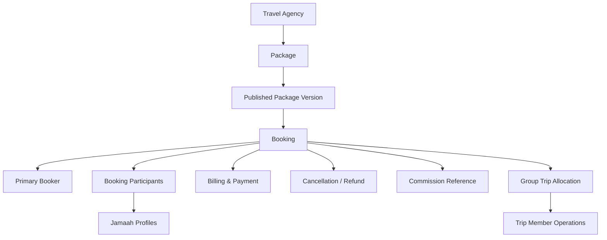
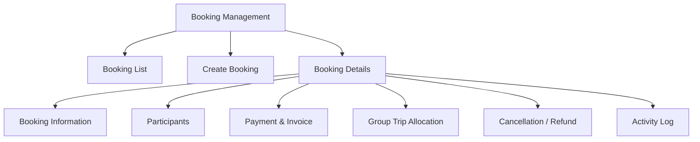
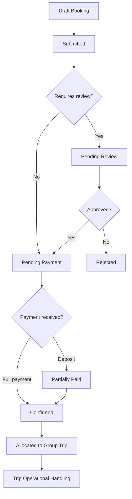
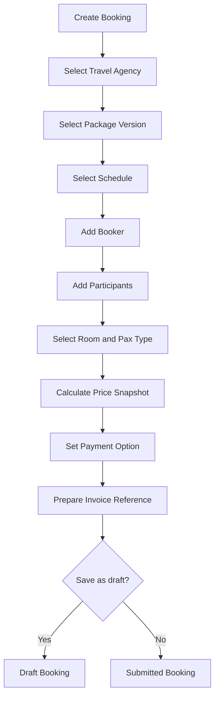
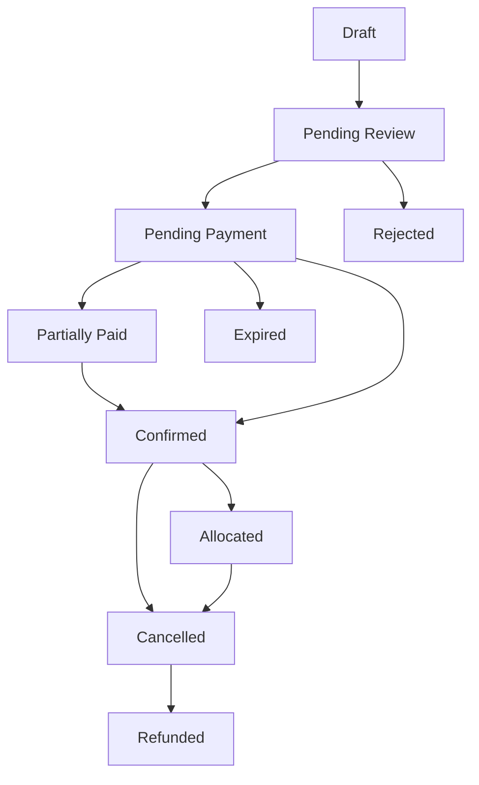
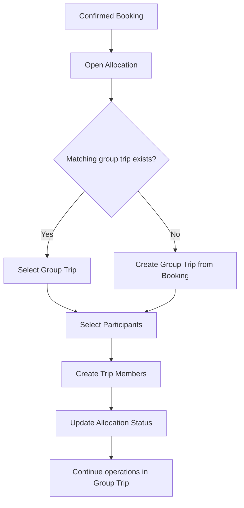
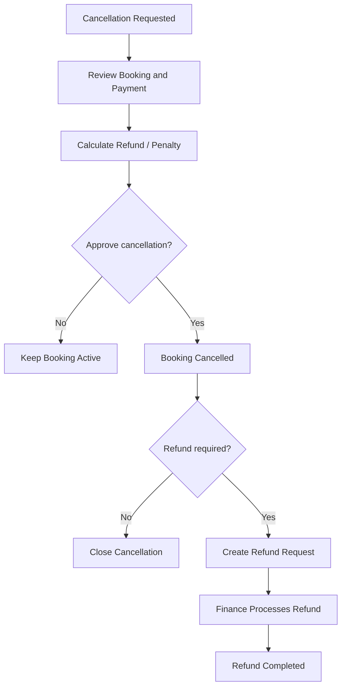

# Module PRD - Booking Management

Product: UmrahHaji.com Admin Panel
Module: Booking Management
Scope: Admin Panel and Travel Agency booking operations
Platform: Responsive Web Platform
Status: Draft
Last Updated: 4 June 2026

---

## 1. Objective

Booking Management allows Admin to monitor, create, review, confirm, cancel, refund, and allocate package bookings across Travel Agencies.

Booking is the reservation and commercial record created when a customer, Jamaah, Travel Agency, or Admin selects a package schedule and registers one or more participants. It sits between Package Management, Billing & Payment Management, and Group Trip Management.

Package is the sellable offer. Booking is the customer reservation. Group Trip is the confirmed operational departure group.

---

## 2. Phase Position

Booking Management is part of Phase 2 full scope.

Phase 1 can still support direct Jamaah assignment into Group Trip for manual operations. However, once Phase 2 is implemented, booking should become the preferred entry point for package sales, customer registration, payment tracking, and allocation into group trips.

---

## 3. Scope

### In Scope for Phase 2

1. Booking List across Travel Agencies.
2. Booking Details.
3. Create booking manually by Admin on behalf of a selected Travel Agency.
4. Create booking manually by Travel Agency in Travel Agency Portal.
5. Receive booking from customer/public package flow when enabled.
6. Select package and package version.
7. Select package schedule.
8. Add existing Jamaah as booking participant.
9. Invite or create new Jamaah as booking participant.
10. Support individual booking.
11. Support family/group booking.
12. Store primary booker and participant relationships.
13. Store room type, pax type, and package price snapshot.
14. Track deposit, full payment, remaining balance, invoices, and payment status.
15. Track booking approval/review status.
16. Track cancellation and refund request.
17. Allocate confirmed booking participants into Group Trip.
18. Preserve booking snapshot even when package data changes later.
19. Notification to Travel Agency, Jamaah, Admin, and Finance roles.
20. Activity log and audit history.

### Out of Scope for Phase 2 Unless Integrated Separately

1. Live external airline booking.
2. Live external hotel room booking.
3. Real-time supplier inventory guarantee.
4. Automated government visa submission.
5. Full accounting ledger.
6. Automated commission payout unless Commission and Payout modules are enabled.

---

## 4. Product Positioning

### Package vs Booking vs Group Trip

| Area | Package | Booking | Group Trip |
| --- | --- | --- | --- |
| Purpose | Sellable offer | Customer reservation and payment record | Operational departure group |
| Owner | Travel Agency | Travel Agency, customer/Jamaah, or Admin-assisted | Travel Agency operations |
| Main Data | Package info, schedule options, pricing, inclusions | Booker, participants, selected package version, payment, cancellation | Mutawwif, hotel, flight, itinerary, room, documents, services |
| Timing | Before customer registers | When customer reserves package | After departure operation is prepared |
| Price | Offer price and rules | Price snapshot per participant | Reference only |
| Members | Not managed here | Booking participants | Trip members |
| Documents | Marketing/media terms only | Optional intake documents | Operational document readiness |
| Status | Draft, Published, Archived | Draft, Pending Payment, Confirmed, Cancelled, Refunded | Draft, Active, Completed, Cancelled |

### Key Principle

Booking should preserve the exact package version, price, room selection, schedule, terms, and participant list agreed at reservation time. Later edits to a package must not silently change existing bookings.

---

## 5. Relationship With Other Modules

```text
Travel Agency
↓
Package
↓
Booking
├── Primary Booker
├── Participants / Jamaah
├── Payment / Invoice
├── Cancellation / Refund
├── Commission Reference
└── Group Trip Allocation
```

### Relationship Diagram



### Integration Table

| Module | Relationship |
| --- | --- |
| Travel Agency Management | Booking belongs to one Travel Agency |
| Package Management | Booking references selected package version and schedule |
| Jamaah Management | Booking participants reference Jamaah profiles |
| User Management | New invited booker/Jamaah may create user account |
| Billing & Payment Management | Booking creates invoice, payment schedule, payment status, refund, and commission references |
| Commission | Booking can become commission calculation source |
| Group Trip Management | Confirmed booking participants can be allocated as trip members |
| Announcement / Notification | Booking status changes can trigger notifications |
| Reports | Booking metrics support conversion, cancellation, and revenue reports |

---

## 6. User Roles & Permissions

| Role | Access |
| --- | --- |
| Super Admin | Full booking access across all Travel Agencies |
| Admin / Operations | Create, review, edit, allocate, and cancel bookings based on permission |
| Finance Admin | Manage payment status, invoice, refund, and financial review |
| Travel Agency Admin | Manage own agency bookings in Travel Agency Portal |
| Travel Agency Staff | Limited own-agency booking access based on role |
| Support Staff | View booking and add support remarks if permitted |
| Auditor | Read-only booking and activity log access |

### Permission Rules

1. Admin can create booking for a Travel Agency only with selected agency context.
2. Admin edit on confirmed booking requires permission and activity log.
3. Travel Agency can only manage bookings under its own agency.
4. Finance fields are visible only to roles with payment permission.
5. Refund approval requires Finance Admin or Super Admin permission.
6. Allocation to Group Trip requires Operations permission.
7. Sensitive participant documents follow Jamaah and Group Trip document permission rules.

---

## 7. Navigation & Entry Point

```text
Admin Panel
└── Booking
    ├── Booking List
    ├── Create Booking
    ├── Booking Details
    ├── Payment & Invoice
    ├── Cancellation / Refund
    └── Allocation to Group Trip
```

### Module IA Diagram



---

## 8. Main User Flow

### Admin-Assisted Booking Flow

```text
Admin opens Booking List
↓
Admin clicks Create Booking
↓
Admin selects Travel Agency
↓
Admin selects package version and schedule
↓
Admin adds existing Jamaah or invites new Jamaah
↓
Admin configures room type, pax type, and payment option
↓
System calculates booking total and deposit requirement
↓
System creates or prepares invoice reference in Billing & Payment Management
↓
Admin saves booking as draft or submits booking
↓
System creates booking record and activity log
```

### Booking Lifecycle Diagram



---

## 9. Booking List Requirements

### Page Purpose

Booking List gives Admin a searchable and filterable view of all package bookings across Travel Agencies.

### Recommended Columns

| Column | Description |
| --- | --- |
| Booking ID | Unique booking reference |
| Primary Booker | Booker name, email, phone |
| Travel Agency | Agency owner |
| Package | Package name and category |
| Schedule | Departure and return date |
| Participants | Total pax and family/group count |
| Payment | Paid amount and remaining balance |
| Booking Status | Current booking lifecycle status |
| Allocation | Not allocated, partially allocated, allocated |
| Date Created | Booking creation date |
| Actions | View, edit, cancel, allocate, archive |

### Filters

| Filter | Options |
| --- | --- |
| Status | Draft, Pending Review, Pending Payment, Partially Paid, Confirmed, Allocated, Cancelled, Refunded, Expired, Rejected |
| Travel Agency | Active agency list |
| Package | Active and archived package search |
| Schedule | Date range |
| Payment Status | Unpaid, Deposit Paid, Partial, Paid, Overdue, Refunded |
| Allocation Status | Not Allocated, Partially Allocated, Allocated |
| Date Created | All Time, Today, This Week, This Month, Custom Range |

### List Actions

1. View Booking Details.
2. Edit Draft Booking.
3. Request or approve cancellation.
4. Create invoice/payment record.
5. Allocate to Group Trip.
6. Export selected bookings.
7. Archive closed booking.

---

## 10. Create Booking Requirements

### Entry Modes

| Mode | Description |
| --- | --- |
| New Booking from Package | Select Travel Agency, package, package version, and schedule |
| Existing Jamaah | Search existing Jamaah and add as participant |
| Invite New Jamaah | Enter name, email, and phone, then send invitation |
| Family/Group Booking | Create a group wrapper and assign members |
| Admin-Assisted Booking | Admin creates booking for a Travel Agency with approval log |

### Step Structure

```text
Step 1: Package & Schedule
Step 2: Booker & Participants
Step 3: Room & Pricing
Step 4: Payment & Invoice
Step 5: Review & Submit
```

### Create Booking Flow Diagram



---

## 11. Booking Details Requirements

### Recommended Tabs

| Tab | Purpose |
| --- | --- |
| Overview | Booking summary, status, agency, package, schedule |
| Participants | Booker, individual Jamaah, family/group members |
| Pricing | Room type, pax type, price snapshot, discounts |
| Payment & Invoice | Invoice, paid amount, remaining balance, proof, verification |
| Group Trip Allocation | Allocate participants to a group trip |
| Cancellation / Refund | Cancellation request, refund calculation, refund status |
| Remarks & History | Internal remarks, customer-facing notes, activity log |

### Booking Overview Data

| Field | Description |
| --- | --- |
| Booking ID | System-generated reference |
| Travel Agency | Owner agency |
| Source | Public website, Travel Agency Portal, Admin Panel |
| Package | Selected package name |
| Package Version | Published package version at booking time |
| Schedule | Departure and return date |
| Primary Booker | Booker profile |
| Total Participants | Adult, child, infant count |
| Booking Status | Current booking status |
| Payment Status | Current payment status |
| Allocation Status | Group trip allocation status |

---

## 12. Status Management

### Booking Statuses

| Status | Meaning |
| --- | --- |
| Draft | Booking created but not submitted |
| Pending Review | Booking needs Travel Agency/Admin review |
| Pending Payment | Booking approved but waiting for payment |
| Partially Paid | Deposit or partial payment received |
| Confirmed | Booking payment/approval is sufficient to confirm |
| Allocated | Booking participants allocated to Group Trip |
| Cancelled | Booking cancelled before trip completion |
| Refunded | Refund completed |
| Expired | Booking not paid before deadline |
| Rejected | Booking rejected by Travel Agency/Admin |

### Status Flow Diagram



---

## 13. Group Trip Allocation

### Purpose

Allocation converts confirmed booking participants into operational trip members. This is where booking participants become part of a specific Group Trip.

### Allocation Rules

1. Only confirmed or approved bookings can be allocated.
2. Admin must select an existing Group Trip under the same Travel Agency or create a new Group Trip from booking/package data.
3. Package version, schedule, hotel, flight, itinerary, and pricing snapshot should be visible during allocation.
4. Participant list can be allocated fully or partially.
5. Allocation creates trip member records in Group Trip Management.
6. Booking remains the commercial record, while Group Trip owns operational readiness.
7. Removing a member from Group Trip should not delete the original booking participant.

### Allocation Flow Diagram



---

## 14. Cancellation & Refund

### Cancellation Rules

1. Cancellation must capture requester, reason, date, and approval status.
2. Cancellation policy should reference the package version active at booking time.
3. Refund calculation must separate refundable amount, penalty, admin fee, and already-paid amount.
4. Refund status should be handled by Finance Admin.
5. Cancelled booking should not automatically remove trip members without confirmation.
6. If booking is already allocated, Group Trip must show cancellation impact.

### Cancellation Flow Diagram



---

## 15. Field Specification

### Booking Information

| Field | Type | Required | Validation | Notes |
| --- | --- | ---: | --- | --- |
| Booking ID | System generated | Yes | Unique | Read-only |
| Source | Select | Yes | Public, TA Portal, Admin Panel | Auto-filled where possible |
| Travel Agency | Search select | Yes | Active agency only | Required for Admin-assisted booking |
| Package | Search select | Yes | Published package only | Selectable by agency |
| Package Version | System reference | Yes | Published version | Locked after submission |
| Schedule | Select | Yes | Open booking availability | Departure-return pair |
| Primary Booker | User/Jamaah selector | Yes | Existing or invited user | Main contact |
| Booking Notes | Textarea | No | Max 1,000 chars | Internal or customer note based on visibility |

### Participant Fields

| Field | Type | Required | Validation | Notes |
| --- | --- | ---: | --- | --- |
| Participant Type | Select | Yes | Adult, Child, Infant | Impacts pricing |
| Jamaah Profile | Search select | Conditional | Existing active profile | Required for existing user |
| Full Name | Text input | Conditional | Max 100 chars | Required for invited/new user |
| Email | Email input | Conditional | Valid email | Required for invitation |
| Phone Number | Phone input | Conditional | Country code + number | Required for contact |
| Family/Group Name | Text input | No | Max 100 chars | For group wrapper |
| Relationship | Select | No | PIC, spouse, parent, child, sibling, friend, other | Useful for family/group |
| Room Group | Select/Input | No | Existing room group | Used for room planning |

### Pricing & Payment Fields

| Field | Type | Required | Validation | Notes |
| --- | --- | ---: | --- | --- |
| Room Type | Select | Yes | Enabled package room type | Single, double, triple, quad, quint |
| Pax Price | Currency | Yes | From package snapshot | Locked after confirmation unless permission |
| Discount | Currency/Percent | No | >= 0 | Requires permission |
| Total Amount | System calculated | Yes | Sum participant prices | Read-only |
| Payment Option | Select | Yes | Full payment, deposit payment | Based on package rule |
| Deposit Amount | Currency | Conditional | >= configured minimum | Required if deposit selected |
| Paid Amount | Currency | No | >= 0 | Usually from payment module |
| Remaining Balance | System calculated | Yes | Total - paid | Read-only |
| Payment Due Date | Date picker | No | Before departure | Used for expiry/overdue |

### Allocation Fields

| Field | Type | Required | Validation | Notes |
| --- | --- | ---: | --- | --- |
| Allocation Status | Select | Yes | Not Allocated, Partial, Allocated | System managed |
| Target Group Trip | Search select | Conditional | Same Travel Agency | Required for allocation |
| Participants to Allocate | Multi-select | Conditional | Confirmed participants only | Can be partial |
| Allocation Notes | Textarea | No | Max 500 chars | Internal |

### Cancellation & Refund Fields

| Field | Type | Required | Validation | Notes |
| --- | --- | ---: | --- | --- |
| Cancellation Requester | Select | Yes | Admin, TA, Jamaah, Customer | Required |
| Cancellation Reason | Select/Text | Yes | Max 500 chars | Required |
| Cancellation Date | Date picker | Yes | Cannot be future | Required |
| Refund Eligibility | Select | Yes | Eligible, Partial, Not Eligible | Based on policy |
| Refund Amount | Currency | Conditional | <= paid amount | Required if refund eligible |
| Penalty Amount | Currency | No | >= 0 | Optional |
| Refund Status | Select | Conditional | Pending, Processing, Paid, Rejected | Finance-owned |

---

## 16. Validation Rules

1. Booking cannot be submitted without Travel Agency, package version, schedule, primary booker, and at least one participant.
2. Booking cannot use archived package version for new reservation.
3. Booking cannot use closed, sold out, or expired schedule unless override permission is granted.
4. Confirmed booking must have valid payment approval or manual confirmation reason.
5. Allocation to Group Trip must match Travel Agency.
6. Allocation to Group Trip should match schedule unless Admin override is granted.
7. Participant cannot be duplicated in the same booking.
8. Participant can exist in multiple bookings only if schedules do not conflict or override is granted.
9. Price changes after booking confirmation require a new adjustment record.
10. Refund amount cannot exceed paid amount.

---

## 17. Edge Cases

| Case | Expected Behavior |
| --- | --- |
| Package edited after booking | Booking keeps original package version snapshot |
| Package archived after booking | Existing booking remains valid; new booking cannot select archived package |
| Schedule sold out during booking | System blocks submit and asks user to select another schedule |
| Payment deadline passed | Booking becomes Expired or Overdue based on policy |
| Booking partially paid | Booking can remain Partially Paid until confirmation policy is satisfied |
| Family/group partially cancelled | Only selected participants are cancelled; booking total recalculates with audit |
| Allocated participant cancelled | Group Trip shows cancellation impact and member status update |
| Group Trip cancelled | Related bookings are flagged for reallocation or cancellation/refund review |
| Duplicate participant detected | System warns based on email, phone, ID, or passport |
| Admin edits TA booking | System requires reason and logs action |

---

## 18. Notification Rules

| Event | Recipient | Channel | Notes |
| --- | --- | --- | --- |
| Booking created | Travel Agency Admin, primary booker | Email / in-app | Phase 2 |
| Payment due reminder | Primary booker | Email / WhatsApp if enabled | Optional automation |
| Payment verified | Primary booker, Travel Agency | Email / in-app | Finance event |
| Booking confirmed | Primary booker, Travel Agency | Email / in-app | Confirmation |
| Booking allocated to Group Trip | Travel Agency, participants | Email / in-app | Include trip reference |
| Cancellation requested | Travel Agency, Admin/Finance | In-app / email | Requires review |
| Refund completed | Primary booker, Finance | Email / in-app | Finance event |

---

## 19. Activity Log Requirements

System must log:

1. Booking created.
2. Booking submitted.
3. Package version selected.
4. Participant added or removed.
5. Price adjusted.
6. Payment status changed.
7. Booking status changed.
8. Cancellation requested, approved, rejected, or completed.
9. Refund status changed.
10. Booking allocated to Group Trip.
11. Admin override performed.

Each log should include timestamp, actor, role, old value, new value, and reason where applicable.

---

## 20. Responsive Web Behavior

### Desktop

1. Booking List uses table layout.
2. Booking Details uses tabs with summary cards.
3. Participant and payment data can use wide table with horizontal scroll.

### Tablet

1. Filters can wrap into multiple rows.
2. Booking details remain tab-based.
3. Participant table can use condensed columns.

### Mobile

1. Booking List should become stacked cards.
2. Filters should collapse into filter drawer.
3. Participant actions should use bottom sheet or full-screen modal.
4. Financial summary should remain visible before confirmation.

---

## 21. Acceptance Criteria

1. Admin can view bookings across Travel Agencies based on permission.
2. Admin can create booking for selected Travel Agency.
3. Admin can select package version and schedule.
4. Admin can add existing Jamaah or invite new Jamaah.
5. System preserves package version and price snapshot.
6. System can track booking, payment, cancellation, refund, and allocation status.
7. Confirmed booking participants can be allocated into Group Trip.
8. Group Trip can show members imported from booking.
9. Booking activity logs are created for critical actions.
10. Finance-only fields are protected by permission.
