# Module PRD - Group Trip Management

Product: UmrahHaji.com Admin Panel
Module: Group Trip Management
Scope: Admin Panel and Travel Agency operational data
Platform: Responsive Web Platform
Status: Draft
Last Updated: 3 June 2026

---

## 1. Objective

Group Trip Management allows Admin to view, monitor, create, and manage departure groups from multiple Travel Agencies.

The module is the operational workspace where confirmed booking allocation or package planning becomes a real departure group. It synchronizes Travel Agency, Booking, Jamaah, Mutawwif, Season, Hotel, Flight, Itinerary, transport, documents, services, room allocation, and departure readiness.

Admin can also create a group trip manually for a specific Travel Agency when the Travel Agency requests operational assistance or approves Admin to create the trip on its behalf.

---

## 2. Scope

### In Scope

1. Group Trip List across Travel Agencies.
2. Group Trip Details.
3. Create Group Trip manually by Admin.
4. Create Group Trip from package reference if package data exists.
5. Create Group Trip from confirmed booking allocation if booking data exists.
6. Assign Travel Agency.
7. Assign Mutawwif.
8. Assign departure schedule.
9. Store season snapshot from package schedule or trip departure date.
10. Assign hotel from Hotel Management catalog.
11. Assign flight from Flight / Airline Management catalog.
12. Assign itinerary from Itinerary Management template.
13. Customize itinerary schedule for actual trip dates.
14. Manage transport information.
15. Manage trip members.
16. Import members from confirmed bookings.
17. Add individual Jamaah manually.
18. Add family/group members manually.
19. Track member documents by document type.
20. Track member services by operational service type.
21. Track visa application data.
22. Track e-ticket flight data.
23. Track e-ticket train data.
24. Track room configuration.
25. Manage WhatsApp group link.
26. Export group trip summary to PDF.
27. Status management.
28. Archive and audit history.

### Out of Scope for Phase 1

1. Live airline booking.
2. Live hotel booking.
3. Real-time seat inventory.
4. Real-time room inventory.
5. Automated visa submission to government systems.
6. Automated train ticket booking.
7. Automated WhatsApp group creation.
8. In-app chat.
9. Advanced operation task board.
10. Accounting settlement between Admin and Travel Agency.

---

## 3. Product Positioning

Group Trip Management is not only a master data module. It is an operational module.

Hotel Management, Flight Management, and Itinerary Management provide reusable catalogs/templates. Group Trip Management consumes those records and converts them into trip-specific assignments.

### Key Principle

Catalog data can change over time. A group trip should preserve a snapshot of the assigned hotel, flight, and itinerary at the time of assignment.

This prevents an existing trip from changing unexpectedly when Admin updates a hotel, flight, or itinerary template later.

---

## 4. Relationship With Other Modules

```text
Travel Agency
↓
Package
↓
Booking
↓
Group Trip
├── Jamaah / Trip Members
├── Mutawwif
├── Season Snapshot
├── Hotel Assignment
├── Flight Assignment
├── Itinerary Schedule
├── Transport Information
├── Documents
├── Services
├── Payment / Reporting references
└── Allowance / Payout references
```

### Module Relationship Diagram

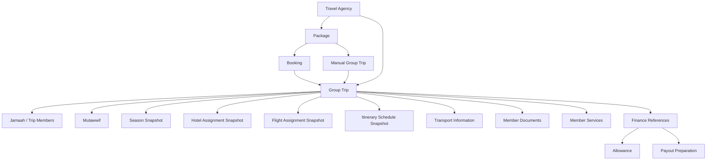

### Integration Table

| Module | Relationship |
| --- | --- |
| Travel Agency Management | Group trip belongs to one Travel Agency |
| Package Management | Group trip may be created from package |
| Booking Management | Confirmed booking participants can be allocated into group trip members |
| Season Management | Group trip can inherit or resolve season snapshot from selected package schedule or trip departure date |
| Jamaah Management | Jamaah can be added as trip members |
| Mutawwif Management | Mutawwif can be assigned as trip guide |
| Hotel Management | Active hotels can be selected and snapshotted |
| Flight / Airline Management | Active flights can be selected and snapshotted |
| Itinerary Management | Itinerary template can be selected and converted into dated schedule |
| User Management | Permissions control access, editing, export, and impersonation |
| Finance Management | Payment, allowance, payout preparation, and finance report references may be shown, but finance logic is not owned by this module |
| Billing & Payment | Payment references may be shown as a Finance submodule, but payment logic is not owned by this module |
| Announcement / Notification | Future notifications may be sent to members or Travel Agency |
| Testimonial Management | End-of-trip testimonial request is triggered after trip completion; daily feedback references itinerary snapshots |

---

## 5. Core Data Behavior

### Source vs Snapshot

| Data Type | Source Module | Group Trip Behavior |
| --- | --- | --- |
| Travel Agency | Travel Agency Management | Reference only |
| Booking | Booking Management | Reference booking source and allocation status |
| Jamaah | Jamaah Management | Reference member profile with trip-specific status |
| Mutawwif | Mutawwif Management | Reference with trip-specific assignment |
| Season | Season Management / Package Schedule | Copy season type and period snapshot |
| Hotel | Hotel Management | Copy into hotel assignment snapshot |
| Flight | Flight / Airline Management | Copy into flight assignment snapshot |
| Itinerary | Itinerary Management | Copy template into trip schedule snapshot |
| Documents | Jamaah profile or trip upload | Stored as trip-specific document status |
| Services | Trip operations | Stored per member per trip |
| Room | Group Trip | Stored per member or family/group |
| Testimonials | Testimonial Management | Stored as daily feedback or end-of-trip testimonial linked to trip snapshot |

### Snapshot Rules

1. Group trip should store selected catalog record ID, booking reference when available, and copied snapshot data.
2. Snapshot should include human-readable display fields needed for export and customer/travel agency review.
3. Editing catalog data after assignment should not automatically update existing group trips.
4. Admin may manually refresh snapshot from latest catalog only with confirmation.
5. Completed group trip snapshots should be read-only except for audit correction permission.

---

## 6. User Roles & Permissions

### Roles

| Role | Access |
| --- | --- |
| Super Admin | Full access to all group trips across all Travel Agencies |
| Admin / Operations | Manage group trips based on assigned permission |
| Travel Agency Admin | Manage own agency group trips in Travel Agency Portal |
| Travel Agency Staff | Limited access to own agency group trips |
| Finance Admin | View payment-related summary only if enabled |
| Auditor | Read-only access and activity logs |

### Permission Rules

1. Admin can view group trips across Travel Agencies if permission allows global scope.
2. Travel Agency users can only view group trips belonging to their agency.
3. Create manual group trip on behalf of Travel Agency requires `Group Trip Create For Agency` permission.
4. Assign or change hotel requires `Group Trip Hotel Update` permission.
5. Assign or change flight requires `Group Trip Flight Update` permission.
6. Assign or edit itinerary requires `Group Trip Itinerary Update` permission.
7. Add or remove trip members requires `Group Trip Member Manage` permission.
8. Upload or verify member documents requires `Trip Document Manage` permission.
9. Update services such as visa, ticket, and room requires `Trip Service Manage` permission.
10. Export PDF requires `Group Trip Export` permission.
11. Delete should be restricted to Super Admin and should be blocked once trip has members or operational records.
12. Archive is preferred over delete.

---

## 7. Navigation Entry Point

Admin Panel navigation:

```text
Group Trip Management
├── Group Trip List
├── Create Group Trip
├── Group Trip Details
├── Trip Members
├── Documents
├── Services
└── Activity Logs
```

Related entry points:

1. Travel Agency Details -> Group Trips.
2. Package Details -> Create Group Trip.
3. Jamaah Details -> Booking / Trip History.
4. Mutawwif Details -> Assigned Trips.
5. Hotel Details -> Usage in Group Trips.
6. Flight Details -> Usage in Group Trips.
7. Itinerary Details -> Usage in Group Trips.

---

## 8. Information Architecture

```text
Group Trip Management
- Group Trip List
  - Search
  - Filter
  - Export to PDF
  - Create Group Trip
  - Bulk actions
- Create / Edit Group Trip
  - Group Trip Details
  - Flight Details
  - Hotel Details
  - Transport Information
  - Itinerary
  - Trip Members
- Group Trip Details
  - Overview
  - Members
  - Documents
  - Services
  - Flight
  - Hotel
  - Itinerary
  - Transport
  - Activity Logs
```

### IA Diagram

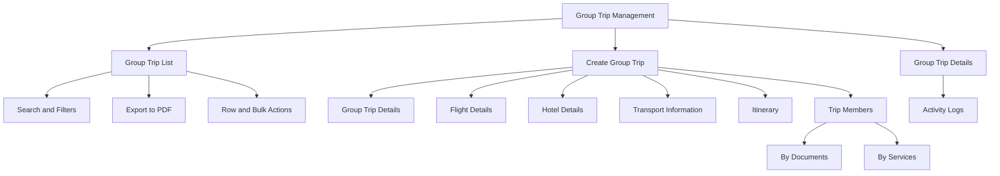

---

## 9. Design Review and Recommended Improvements

The provided design direction is strong because it shows the real operational density of group trip management. However, several improvements are recommended before implementation.

### Keep

1. Group Trip List with agency, mutawwif, schedule, hotel, flight, status, WhatsApp group link, date created, and actions.
2. Export to PDF action.
3. Create Group Trip primary button.
4. Filters by status, agency, mutawwif, schedule, airport, hotel, and search.
5. Collapsible create/edit sections.
6. Itinerary template selector.
7. Trip Members with two tabs: By Documents and By Services.
8. Family/group grouping in Trip Members.

### Improve

1. Rename `Company` field to `Travel Agency`.
2. Rename duplicated `Flight Details` section for hotel selection to `Hotel Details`.
3. Add `Package Reference` field when group trip is created from a package.
4. Add `Creation Source`: From Package, Manual by Travel Agency, Manual by Admin Request.
5. Add `Travel Agency Approval Reference` for Admin-created manual trips.
6. Add `Capacity` and `Member Count` fields.
7. Add `Trip Code` for unique operational reference.
8. Add `Trip Type`: Umrah, Hajj, Custom, Ziyarah, Other.
9. Add `Departure City` and `Destination City`.
10. Add `Data Completeness` or `Readiness Score`.
11. Add `Document Completion` summary.
12. Add `Service Completion` summary.
13. Add validation if trip schedule does not match itinerary duration.
14. Add warnings when hotel nights do not match trip schedule.
15. Add warnings when departure and return flight dates do not match trip schedule.
16. Add `Locked After Departure` behavior.
17. Add audit log for every member, document, service, hotel, flight, and itinerary update.

### Reduce or Avoid

1. Avoid creating live inventory assumptions for hotel rooms or flight seats in Phase 1.
2. Avoid hard delete for trips with members.
3. Avoid editing completed trip data without explicit correction permission.
4. Avoid placing all member document and service fields in one giant unstructured form.
5. Avoid auto-notifying Jamaah before notification rules are finalized.

---

## 10. Group Trip List

Group Trip List allows Admin to monitor all departure groups across Travel Agencies.

### Goals

1. Provide cross-agency operational visibility.
2. Show key departure readiness information.
3. Help Admin find trips quickly by agency, schedule, mutawwif, hotel, flight, or status.
4. Allow export to PDF for operational review.
5. Provide safe action controls.

### Recommended Columns

| Column | Description |
| --- | --- |
| Checkbox | Bulk selection |
| Group Trip | Trip name, trip code, member count |
| Travel Agency | Agency name and verification indicator |
| Package | Package name if linked |
| Mutawwif | Assigned mutawwif name and contact |
| Schedule | Departure and return date, duration |
| Season | Season type and period snapshot |
| Hotel | Makkah and Madinah hotel summary |
| Flight | Airline and main outbound/return flight summary |
| Document Progress | Completion percentage or status |
| Service Progress | Completion percentage or status |
| Status | Draft, Pending Approval, Active, Departed, Completed, Cancelled, Archived |
| WAG Link | WhatsApp group link |
| Date Created | Created date |
| Actions | View, edit, export, archive |

### Search

Search should support:

1. Group trip name.
2. Trip code.
3. Travel Agency name.
4. Package name.
5. Mutawwif name.
6. Hotel name.
7. Airline name.
8. Flight number.
9. Airport code.
10. WhatsApp group link.

### Filters

| Filter | Values |
| --- | --- |
| Status | Draft, Pending Approval, Active, Departed, Completed, Cancelled, Archived |
| Travel Agency | Active agency list |
| Mutawwif | Assigned mutawwif list |
| Schedule | All Time, Today, This Week, This Month, This Year, Custom Range |
| Airport | Departure, Arrival, transit airport |
| Hotel | Makkah hotel, Madinah hotel, other |
| Trip Type | Umrah, Hajj, Custom, Ziyarah, Other |
| Creation Source | Package, Travel Agency Manual, Admin Manual |
| Document Status | Complete, Partial, Pending, Issue |
| Service Status | Complete, Partial, Pending, Issue |

### Row Actions

| Action | Rule |
| --- | --- |
| View Details | Opens group trip details |
| Edit | Allowed until trip is locked |
| Export PDF | Exports trip summary |
| Archive | Allowed if not active/departed unless Super Admin |
| Delete | Only for empty draft trips |
| Open WAG Link | Opens external WhatsApp group link |

### Bulk Actions

| Action | Rule |
| --- | --- |
| Export Selected | Allowed if user has export permission |
| Archive Selected | Only draft/inactive trips |
| Assign Mutawwif | Optional future enhancement |
| Update Status | Restricted, requires confirmation |

---

## 11. Create Group Trip

Create Group Trip allows Admin to create a departure group either from an existing package or manually on behalf of a Travel Agency.

### Creation Types

| Type | Description |
| --- | --- |
| From Package | Trip is created using package inclusions and default settings |
| Manual by Travel Agency | Created by Travel Agency in Travel Agency Portal |
| Manual by Admin Request | Created by Admin after Travel Agency requests/approves assistance |

### Admin Manual Creation Rule

Admin should be allowed to create group trip manually for a Travel Agency only when:

1. Admin selects a target Travel Agency.
2. Admin records request source.
3. Admin records approval evidence or approval note.
4. Admin records responsible Travel Agency PIC if available.
5. System logs that the group trip was created by Admin on behalf of the Travel Agency.

### Create Flow

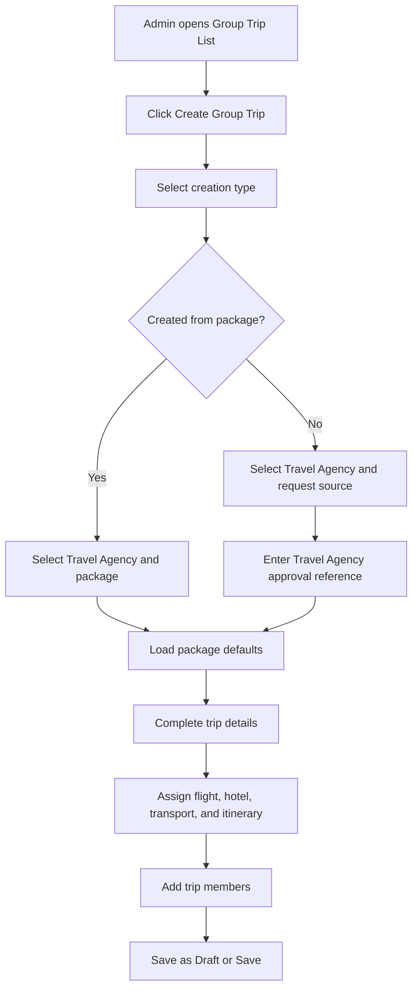

### Recommended Create Sections

1. Group Trip Details.
2. Flight Details.
3. Hotel Details.
4. Transport Information.
5. Itinerary.
6. Trip Members.
7. Approval and Internal Notes.

---

## 12. Group Trip Details Section

### Purpose

Stores the core identity, ownership, schedule, and operational context of the group trip.

### Fields

| Field | Type | Required | Validation | Notes |
| --- | --- | --- | --- | --- |
| Group Trip Image | Image upload | Optional | JPG, JPEG, PNG, WebP, max 2 MB | Use optimized image |
| Trip Code | Auto-generated/text | Yes | Unique | Example: GT-UMR-2025-001 |
| Group Trip Name | Text input | Yes | Max 150 chars | Customer/operation visible |
| Trip Type | Select | Yes | Umrah, Hajj, Custom, Ziyarah, Other | Replaces ambiguous category |
| Travel Agency | Select | Yes | Active agency only | Previously shown as Company |
| Package Reference | Select | Conditional | Required if created from package | Optional for manual trip |
| Season Type | Auto/select | Optional | Active season or snapshot | From package schedule or departure date |
| Season Period | Auto/select | Optional | Active season period or snapshot | Snapshot stored on save |
| Season Override Reason | Textarea | Conditional | Max 300 chars | Required if manually changed |
| Creation Source | Select | Yes | Package, Travel Agency Manual, Admin Manual | Audit field |
| Request Source | Select/text | Conditional | Required for Admin Manual | Email, WhatsApp, call, ticket, internal note |
| Travel Agency PIC | Select/text | Conditional | Required for Admin Manual if available | Person approving request |
| Approval Reference | Text/file | Conditional | Required for Admin Manual | Approval note or attachment |
| Trip Schedule | Date range | Yes | Start date <= end date | Defines departure and return |
| Duration | Auto-calculated | Yes | Days and nights | Derived from date range |
| Departure City | Select | Recommended | Master city | Example: Kuala Lumpur |
| Destination Type | Select | Yes | Makkah, Madinah, Makkah + Madinah, Other | Operational context |
| Mutawwif | Select | Optional | Active mutawwif | Can be assigned later |
| Capacity | Number | Recommended | Min 1 | Used for member allocation |
| Status | Select | Yes | Valid status flow | Default Draft |
| WhatsApp Group Link | URL input | Optional | Valid URL | Label as WAG Link in list |
| Internal Notes | Textarea | Optional | Max 1,000 chars | Admin-only |

### Approval Evidence Upload

| File Type | Max Size | Max Files | Notes |
| --- | --- | --- | --- |
| PDF | 2 MB | 3 | Recommended for email/request proof |
| JPG, JPEG, PNG | 2 MB | 3 | Use compressed images |
| DOCX | 2 MB | 1 | Optional if request document exists |

Server load rule:

1. Compress images before upload.
2. Reject files above max size.
3. Store file metadata and optimized preview separately if needed.
4. Do not allow video upload for approval evidence.

---

## 13. Flight Details Section

### Purpose

Assigns outbound, return, and optional transit/connecting flight information for the group trip.

Flight data should be selected from Flight / Airline Management catalog when possible.

### Flight Assignment Behavior

1. Admin selects active and available flight records.
2. System copies selected flight into trip flight snapshot.
3. Admin enters actual flight date and trip-specific notes.
4. Return flight can be assigned separately.
5. Transit flight or transit airport can be added when applicable.
6. Flight assignment does not confirm seat inventory in Phase 1.

### Flight Assignment Flow

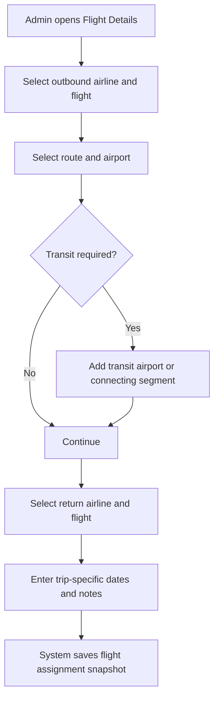

### Fields

| Field | Type | Required | Validation | Notes |
| --- | --- | --- | --- | --- |
| Outbound Airline | Select | Yes | Active airline | From Flight Management |
| Outbound Flight Number | Select/text | Recommended | Active flight catalog | Select from airline flights |
| Outbound Flight Class | Select | Optional | Economy, Business, First, Mixed | Trip-level default |
| Departure Airport | Select | Yes | Airport master data | Example: KUL |
| Arrival Airport | Select | Yes | Airport master data | Example: JED |
| Departure Date | Date picker | Yes | Within trip schedule | Trip-specific |
| Departure Time | Time picker | Recommended | Local timezone | Snapshot |
| Arrival Date | Date picker | Recommended | >= departure date | Snapshot |
| Arrival Time | Time picker | Recommended | Local timezone | Snapshot |
| Add Transit | Toggle | Optional | Boolean | Shows transit fields |
| Transit Airport | Select | Conditional | Required if transit enabled | Example: DXB |
| Transit Duration | Duration select | Conditional | Required if transit enabled | Example: 1h 50m |
| Return Airline | Select | Recommended | Active airline | Optional if not yet confirmed |
| Return Flight Number | Select/text | Recommended | Active flight catalog | Optional |
| Return Flight Class | Select | Optional | Economy, Business, First, Mixed | Trip-level default |
| Return Departure Airport | Select | Recommended | Airport master data | Example: JED |
| Return Arrival Airport | Select | Recommended | Airport master data | Example: KUL |
| Flight Notes | Textarea | Optional | Max 500 chars | Customer/operation visible |

---

## 14. Hotel Details Section

### Purpose

Assigns accommodation for Makkah, Madinah, and optional other city segments.

This section should be named `Hotel Details`, not `Flight Details`.

### Hotel Assignment Behavior

1. Admin selects active and available hotels from Hotel Management catalog.
2. System copies selected hotel into trip hotel snapshot.
3. Admin defines city segment, check-in/check-out, room type, meal plan, and notes.
4. Room allocation is handled in Trip Members by services.
5. Hotel assignment does not confirm live room inventory in Phase 1.

### Hotel Assignment Flow

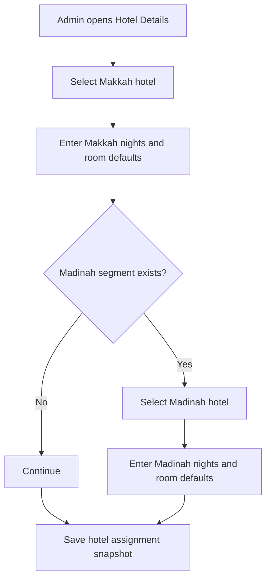

### Fields

| Field | Type | Required | Validation | Notes |
| --- | --- | --- | --- | --- |
| Makkah Hotel | Select | Conditional | Active hotel | Required if Makkah stay exists |
| Makkah Check-in Date | Date picker | Conditional | Within trip schedule | Optional for draft |
| Makkah Check-out Date | Date picker | Conditional | After check-in | Determines nights |
| Makkah Room Type Default | Select | Optional | From hotel room reference | Quad, Triple, Double |
| Makkah Meal Plan | Select | Optional | None, Breakfast, Half Board, Full Board | Trip-specific |
| Madinah Hotel | Select | Conditional | Active hotel | Required if Madinah stay exists |
| Madinah Check-in Date | Date picker | Conditional | Within trip schedule | Optional for draft |
| Madinah Check-out Date | Date picker | Conditional | After check-in | Determines nights |
| Madinah Room Type Default | Select | Optional | From hotel room reference | Quad, Triple, Double |
| Madinah Meal Plan | Select | Optional | None, Breakfast, Half Board, Full Board | Trip-specific |
| Other Hotel | Select | Optional | Active hotel | Transit/other city |
| Hotel Notes | Textarea | Optional | Max 500 chars | Customer/operation visible |

---

## 15. Transport Information Section

### Purpose

Stores ground transportation plan for the group trip.

### Fields

| Field | Type | Required | Validation | Notes |
| --- | --- | --- | --- | --- |
| Makkah Transport | Select | Optional | Bus, Van, Private Coach, Train, Other | Segment default |
| Madinah Transport | Select | Optional | Bus, Van, Private Coach, Train, Other | Segment default |
| Inter-city Transport | Select | Optional | Bus, Haramain Train, Private Coach, Other | Makkah-Madinah |
| Airport Transfer | Select | Optional | Included, Not Included, To Be Confirmed | Operational note |
| Transport Vendor | Text/select | Optional | Max 150 chars | Future vendor module |
| Transport Notes | Textarea | Optional | Max 500 chars | Internal or customer-visible |

### Recommended Improvement

Separate transport data from itinerary activities. Itinerary describes schedule and activities, while Transport Information stores operational service defaults.

---

## 16. Itinerary Section

### Purpose

Allows Admin to select an itinerary template and convert it into the actual group trip schedule.

### Itinerary Behavior

1. Admin selects an active itinerary template.
2. System generates trip itinerary days based on trip start date.
3. Template day titles, locations, activities, icons, and descriptions are copied into group trip snapshot.
4. Admin can edit actual date, time, location, and activity description for this group trip.
5. Editing a group trip itinerary does not modify the original template.
6. If trip duration and template duration do not match, system should warn Admin.

### Itinerary Template Selection Flow

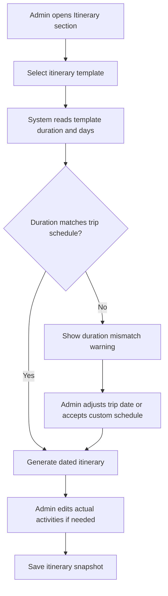

### Template Selection Fields

| Field | Type | Required | Validation | Notes |
| --- | --- | --- | --- | --- |
| Itinerary Template | Select | Recommended | Active template | From Itinerary Management |
| Apply Template | Button/action | Conditional | Requires selected template | Copies template |
| Auto-generate Dates | Toggle | Recommended | Boolean | Based on trip start date |
| Local Timezone | Select | Yes | Timezone master data | Usually departure country |
| Destination Timezone | Select | Yes | Timezone master data | Saudi Arabia for Umrah/Hajj |

### Itinerary Day Fields

| Field | Type | Required | Validation | Notes |
| --- | --- | --- | --- | --- |
| Day Number | Auto | Yes | Sequential | Day 1, Day 2 |
| Date | Date picker | Yes | Within trip schedule | Generated from start date |
| Day Title / Focus | Select/text | Yes | Max 100 chars | Departure, Arrival, Umrah, Ziyarah |
| Location | Select/text | Recommended | Master location | Kuala Lumpur, Makkah, Madinah |
| Activities | Repeater | Optional | At least one recommended | See activity fields |

### Activity Fields

| Field | Type | Required | Validation | Notes |
| --- | --- | --- | --- | --- |
| Activity Name | Text input | Yes | Max 150 chars | Example: Departure from KLIA |
| Date | Date picker | Yes | Same as day or within trip | Can be auto-filled |
| Time | Time picker | Recommended | Local timezone | Should show timezone label |
| Icon | Select | Optional | Icon master data | Departure, Arrival, Bus, Umrah, Prayer |
| Short Description | Textarea | Optional | Max 500 chars | Customer visible |
| Internal Notes | Textarea | Optional | Max 500 chars | Admin only |

---

## 17. Trip Members Section

Trip Members manages the people assigned to the group trip and their departure readiness.

The section should support two primary tabs:

1. By Documents.
2. By Services.

### Member Structure

Members can be grouped as:

1. Family / Group.
2. Individual Jamaah.

Each family/group can have one PIC and multiple members.

### Member Actions

| Action | Description |
| --- | --- |
| Add Jamaah | Add existing or new Jamaah as trip member |
| Add Family / Group | Create a member group and add Jamaah under it |
| Remove Member | Remove member from trip if allowed |
| Set PIC | Mark one member as family/group PIC |
| Update Allocation Status | Track whether member is confirmed, waitlisted, cancelled, or removed |
| Bulk Update Documents | Update status for selected members |
| Bulk Update Services | Update service fields for selected members |

### Add Jamaah Modal Behavior

The Add Jamaah action opens a modal that supports two modes:

1. Search Existing Users.
2. Invite New User.

The modal should preserve selected users when Admin switches between modes, so Admin can select existing Jamaah and invite a new Jamaah in one workflow before confirming.

### Add Jamaah Modal Layout

| Area | Requirement |
| --- | --- |
| Modal Title | `Add Jamaah` |
| Mode Switcher | Segmented control with `Search Existing Users` and `Invite New User` |
| Close Action | X button closes modal after confirmation if selected users exist |
| Footer Actions | Cancel and Add Selected Users |
| Selected Users Summary | Shows selected users as removable chips |
| Primary CTA | Shows count, for example `Add Selected Users (3)` |

### Search Existing Users Mode

| Element | Requirement |
| --- | --- |
| Search Input | Search by Jamaah name, email, or phone number |
| Result Count | Shows total matching users, for example `Found 100 users` |
| Result List | Shows avatar, full name, email, phone, user status |
| Selection Control | Checkbox per user |
| Selected State | Selected rows should be visually highlighted |
| Status Badge | Active, Pending, Inactive, Suspended, Banned |
| Selected Chips | Shows selected names at bottom of modal |
| Remove Selected | Chip remove icon unselects the user |

### Invite New User Mode

| Element | Requirement |
| --- | --- |
| Jamaah Name | Required text field |
| Email | Required if invitation is sent |
| Phone Country Code | Required |
| Phone Number | Recommended |
| Send Invitation Button | Sends invitation and adds invited user to selected users |
| Selected Chips | Shows existing selected users and newly invited user |
| Footer CTA | Adds selected users to trip |

### Modal State Rules

1. Selected users must remain selected when Admin switches tabs.
2. User already assigned to the current group trip should be disabled or marked `Already Added`.
3. User selected more than once should be prevented.
4. Inactive, suspended, or banned users should not be selectable unless permission allows override.
5. If search returns no results, show empty state and suggest `Invite New User`.
6. `Add Selected Users` is disabled when selected user count is zero.
7. `Send Invitation & Add to Selected Users` is disabled until required invitation fields are valid.
8. Invited user should be created with pending/invited account status and pending trip allocation status.
9. Closing modal with selected users should show confirmation to prevent accidental loss.
10. Search result should be paginated or lazy-loaded if result count is large.

### Trip Member Flow

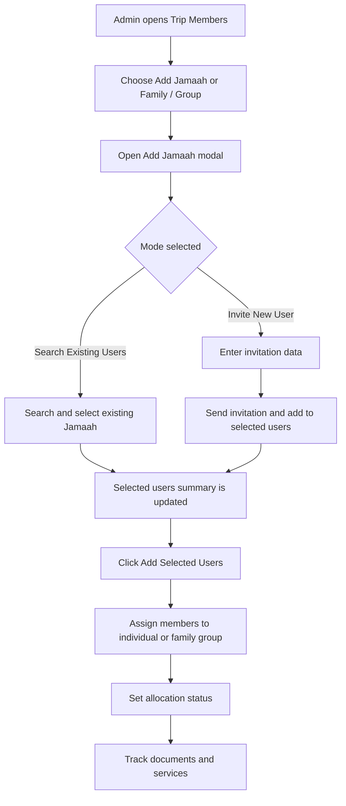

---

## 18. Trip Members - By Documents Tab

### Purpose

The By Documents tab tracks member document readiness for the group trip.

This tab should focus only on document collection and verification, not operational service values.

### Recommended Columns

| Column | Description |
| --- | --- |
| Member | Name, email, phone, avatar, PIC badge |
| IC / ID | Status and view/upload action |
| Passport | Status and view/upload action |
| Photo | Status and view/upload action |
| Vaccination | Status and view/upload action |
| Visa Supporting Docs | Optional future/conditional |
| Notes | Document issue or remark |

### Document Status Values

| Status | Meaning |
| --- | --- |
| Not Required | Document is not required for this member/trip |
| Missing | No document uploaded |
| Pending Review | Uploaded but not verified |
| Confirmed | Verified and accepted |
| Rejected | Rejected and needs replacement |
| Expired | Document expired |

### Document Upload Specification

| Document | Allowed Formats | Max Size | Max Files | Notes |
| --- | --- | --- | --- | --- |
| IC / ID | JPG, JPEG, PNG, PDF | 2 MB | 2 | Front/back or one PDF |
| Passport | JPG, JPEG, PNG, PDF | 2 MB | 2 | Bio page preferred |
| Photo | JPG, JPEG, PNG, WebP | 1 MB | 1 | Compress and crop preview |
| Vaccination | JPG, JPEG, PNG, PDF | 2 MB | 3 | Certificate/proof |
| Visa Supporting Docs | JPG, JPEG, PNG, PDF | 2 MB | 5 | Conditional |
| Other Document | PDF, JPG, JPEG, PNG | 2 MB | 5 | Admin-defined |

Server load rules:

1. Do not allow video uploads in trip documents.
2. Compress image uploads where possible.
3. Generate thumbnails for image preview.
4. Store original file only when needed for verification.
5. Reject files exceeding max size.
6. Virus/malware scan should be applied before file becomes downloadable.

### By Documents Flow

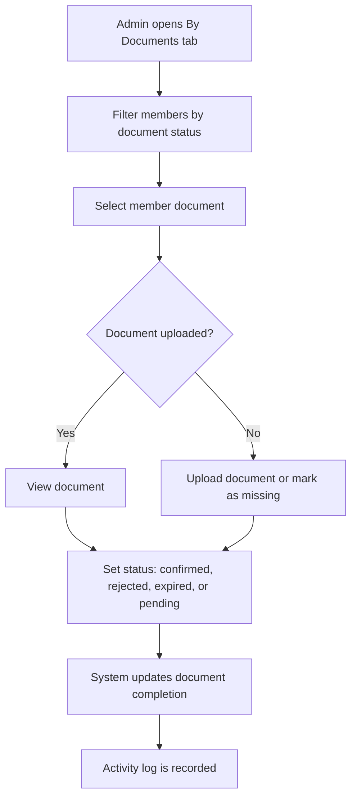

---

## 19. Trip Members - By Services Tab

### Purpose

The By Services tab tracks trip-specific services and operational assignments for each member.

This tab should not replace document management. It should track service execution such as visa, e-ticket, train ticket, room assignment, and optional services.

### Recommended Columns

| Column | Description |
| --- | --- |
| Member | Name, email, phone, avatar, PIC badge |
| Visa Application | Application ID and status |
| E-ticket Flight | Flight class, ticket number, upload/view ticket |
| E-ticket Train | Train ticket number, upload/view ticket |
| Room Configuration | Room type and room number |
| Optional Services | Add-on services if needed |
| Notes | Operational notes |

### Service Status Values

| Status | Meaning |
| --- | --- |
| Not Required | Service not needed |
| Pending | Service has not been completed |
| In Progress | Service is being processed |
| Confirmed | Service is completed/confirmed |
| Issue | Service has a problem |
| Cancelled | Service cancelled for member |

### By Services Flow

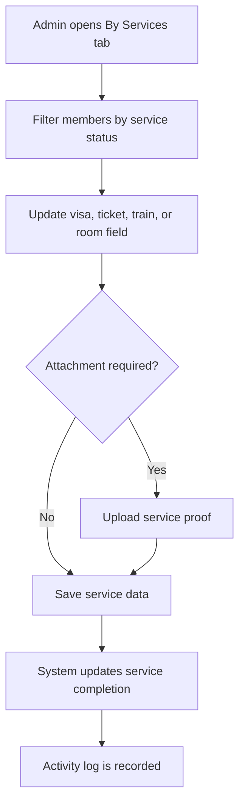

---

## 20. Visa Application Service

### Fields

| Field | Type | Required | Validation | Notes |
| --- | --- | --- | --- | --- |
| Visa Required | Toggle | Yes | Boolean | Default based on trip type/nationality if available |
| Application ID | Text input | Optional | Max 50 chars | Example: SA001003 |
| Visa Status | Select | Yes | Service status values | Pending by default |
| Submission Date | Date picker | Optional | Valid date | Optional |
| Approval Date | Date picker | Optional | >= submission date | Optional |
| Expiry Date | Date picker | Optional | Future date if confirmed | Optional |
| Visa File | Upload | Optional | PDF/JPG/PNG max 2 MB | Per member |
| Remarks | Textarea | Optional | Max 500 chars | Admin note |

### Upload Rules

| File Type | Max Size | Max Files |
| --- | --- | --- |
| PDF | 2 MB | 1 |
| JPG, JPEG, PNG | 2 MB | 2 |

---

## 21. E-ticket Flight Service

### Fields

| Field | Type | Required | Validation | Notes |
| --- | --- | --- | --- | --- |
| Flight Ticket Required | Toggle | Yes | Boolean | Usually required |
| Flight Class | Select | Optional | Economy, Business, First, Mixed | Can inherit trip default |
| Outbound Ticket Number | Text input | Optional | Max 80 chars | Per member |
| Return Ticket Number | Text input | Optional | Max 80 chars | Per member |
| PNR / Booking Reference | Text input | Optional | Max 50 chars | If available |
| Ticket Status | Select | Yes | Service status values | Pending by default |
| Ticket File | Upload | Optional | PDF/JPG/PNG max 2 MB | E-ticket attachment |
| Remarks | Textarea | Optional | Max 500 chars | Admin note |

### Upload Rules

| File Type | Max Size | Max Files |
| --- | --- | --- |
| PDF | 2 MB | 2 |
| JPG, JPEG, PNG | 2 MB | 2 |

---

## 22. E-ticket Train Service

### Fields

| Field | Type | Required | Validation | Notes |
| --- | --- | --- | --- | --- |
| Train Ticket Required | Toggle | Optional | Boolean | Depends on transport selection |
| Train Provider | Select/text | Optional | Max 100 chars | Example: Haramain |
| Train Ticket Number | Text input | Optional | Max 80 chars | Per member |
| Train Route | Text/select | Optional | Max 100 chars | Example: Makkah to Madinah |
| Train Date | Date picker | Optional | Within trip schedule | Optional |
| Train Time | Time picker | Optional | Valid time | Optional |
| Train Status | Select | Yes | Service status values | Pending if required |
| Train Ticket File | Upload | Optional | PDF/JPG/PNG max 2 MB | Per member |
| Remarks | Textarea | Optional | Max 500 chars | Admin note |

### Upload Rules

| File Type | Max Size | Max Files |
| --- | --- | --- |
| PDF | 2 MB | 2 |
| JPG, JPEG, PNG | 2 MB | 2 |

---

## 23. Room Configuration Service

### Purpose

Room Configuration assigns members into room types and room numbers.

Room assignment is trip-specific and should not modify the Hotel Management catalog.

### Fields

| Field | Type | Required | Validation | Notes |
| --- | --- | --- | --- | --- |
| Room Required | Toggle | Yes | Boolean | Usually required |
| City Segment | Select | Recommended | Makkah, Madinah, Other | If multiple hotels |
| Hotel | Select/read-only | Recommended | From trip hotel assignment | Snapshot reference |
| Room Type | Select | Optional | Quad, Triple, Double, Twin, Single, Other | From hotel default or manual |
| Room Number | Text input | Optional | Max 30 chars | Example: 1205 |
| Room Group Name | Text input | Optional | Max 100 chars | Optional for family/group |
| Gender Rule | Select | Optional | Male, Female, Family, Mixed Allowed | Optional |
| Room Status | Select | Yes | Service status values | Pending by default |
| Remarks | Textarea | Optional | Max 500 chars | Admin note |

### Room Assignment Rules

1. One member can have one room assignment per city segment.
2. Family/group rooming should allow members to share same room number.
3. Room type capacity should warn if number of assigned members exceeds capacity.
4. Room allocation can be incomplete in Draft or Active status.
5. Completed trips should lock room assignment unless correction permission is granted.

### Room Assignment Flow

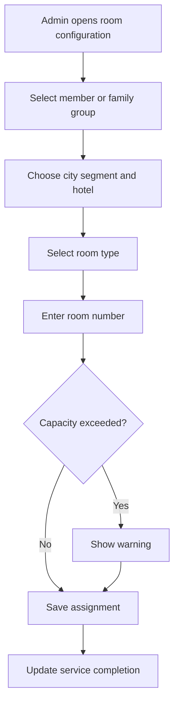

---

## 24. Add Jamaah to Trip

### Purpose

Admin can add Jamaah into a group trip using existing Jamaah records or by creating a minimal new Jamaah profile.

The Add Jamaah popup should follow the same pattern as Jamaah Management invitation flow, but with trip-specific behavior: selected users are added as Trip Members after Admin confirms the modal footer action.

### Add Jamaah Options

| Option | Description |
| --- | --- |
| Existing Jamaah | Search and select a registered Jamaah |
| New Jamaah | Create minimal profile and invite/complete later |
| From Family / Group | Add multiple members under a group |
| From Package Booking | If package booking exists, import selected booking members |

### Add Jamaah Popup Flow

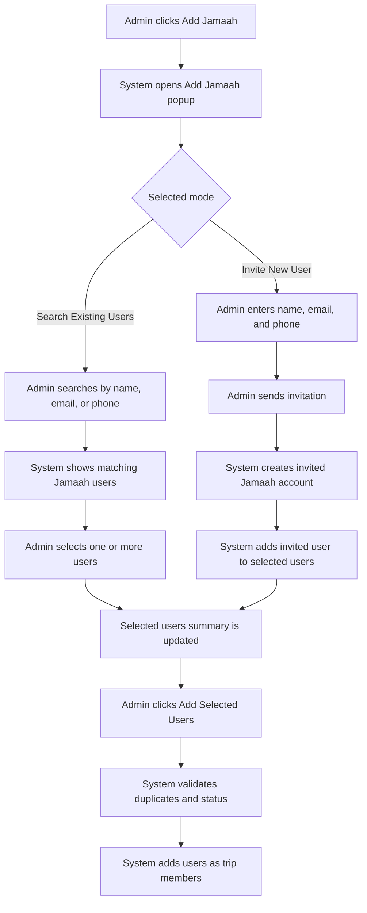

### Search Existing Users Requirements

| Requirement | Description |
| --- | --- |
| Search input | Supports name, email, and phone number |
| Result list | Displays avatar, name, email, phone, and status |
| Multi-select | Admin can select multiple users before adding |
| Selected count | Footer CTA reflects selected user count |
| Selected chips | Selected users are displayed as removable chips |
| Scrollable results | Result list should scroll inside modal |
| Status handling | Only eligible users can be selected |
| Already added handling | Users already in the trip should be disabled |

### Invite New User Requirements

| Requirement | Description |
| --- | --- |
| Required fields | Jamaah name and email are required for invitation |
| Phone fields | Country code and phone number should be supported |
| Invitation action | `Send Invitation & Add to Selected Users` creates or invites the user |
| Selected summary | Invited user appears in selected users after successful invitation |
| Duplicate email check | System prevents inviting email that already exists unless Admin selects existing user |
| Duplicate phone check | System warns if phone number already exists |
| Account status | New user status becomes Invited or Pending Activation |
| Trip allocation status | New trip member starts as Pending unless Admin changes it |

### Add Jamaah Popup States

| State | System Behavior |
| --- | --- |
| No selected users | Disable `Add Selected Users` |
| Search loading | Show loading state in result list |
| Search empty | Show empty result and CTA/suggestion to invite new user |
| User selected | Highlight row and show chip |
| User unselected | Remove highlight and chip |
| Duplicate user | Prevent selection and show warning |
| Invalid invitation form | Disable send invitation button |
| Invitation sent | Add invited user to selected users |
| Invitation failed | Show error and keep form values |
| Modal cancel with selections | Ask confirmation before closing |

### Minimal Add Jamaah Fields

| Field | Type | Required | Validation | Notes |
| --- | --- | --- | --- | --- |
| Full Name | Text input | Yes | Max 150 chars | Required |
| Email | Email input | Conditional | Valid email | Required if invitation is sent |
| Phone Number | Phone input | Recommended | Country code + number | Operational contact |
| Gender | Select | Optional | Male, Female | Helps room allocation |
| Date of Birth | Date picker | Optional | Valid date | Helps document validation |
| Nationality | Select | Optional | Country master | Helps visa requirement |
| Passport Number | Text input | Optional | Max 50 chars | Can be completed later |
| Allocation Status | Select | Yes | Confirmed, Pending, Waitlisted | Default Pending |
| Family / Group | Select | Optional | Existing group | Optional |
| Send Invitation | Toggle | Optional | Boolean | Uses Jamaah invitation flow |

### Add Selected Users Validation

1. At least one selected user is required.
2. Selected user must not already be an active member of the same group trip.
3. Selected user should not have overlapping active trip schedule unless Admin confirms override.
4. Selected user must be eligible by status.
5. New invited user must have a valid email.
6. If capacity is set, adding selected users should not exceed capacity unless override is allowed.
7. System should create trip member records only after final `Add Selected Users` confirmation.
8. System should log each added user individually.

---

## 25. Add Family / Group

### Purpose

Allows Admin to group members as family, friends, organization, or other group.

The Family / Group flow should support creating the group and assigning members in one modal. Admin can select existing Jamaah or add new Jamaah into the group before saving the family/group record.

### Create Family / Group With Members Modal

| Area | Requirement |
| --- | --- |
| Modal Title | `Create Family with Members` or `Create Group with Members` |
| Group Image | Optional image upload/change image |
| Group Identity | Group name and group type |
| Mode Switcher | `Search Existing Members` and `Add New Member` |
| Member List | Shows selected group members |
| Footer Actions | Cancel and Create Family / Group |
| Close Action | X button with confirmation if form has unsaved changes |

### Modal Modes

| Mode | Purpose |
| --- | --- |
| Search Existing Members | Search and select existing Jamaah users into the family/group |
| Add New Member | Create a minimal new Jamaah and add the new user into the family/group |

### Family / Group Flow

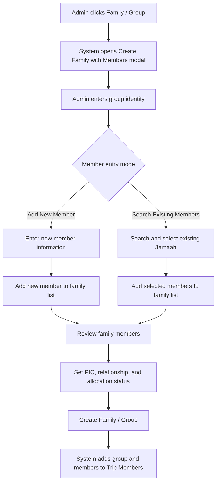

### Search Existing Members Mode

| Element | Requirement |
| --- | --- |
| Search Input | Search by name, email, phone number, or ID/passport if available |
| Search Result | Shows avatar, name, email, phone, status, and add/select action |
| Multi-select | Admin can select multiple existing Jamaah |
| Selected State | Selected rows should be highlighted |
| Add to Family | Adds selected users into Family Members list |
| Already Added Handling | Existing family members should be disabled or marked as already added |
| Eligibility Status | Active users are selectable; inactive/suspended/banned users follow permission rule |

### Add New Member Mode

| Field | Type | Required | Validation | Notes |
| --- | --- | --- | --- | --- |
| Full Name | Text input | Yes | Max 150 chars | Required |
| Email | Email input | Conditional | Valid email | Required if invitation is sent |
| Phone Country Code | Select | Recommended | Country code | Example: +60 |
| Phone Number | Phone input | Recommended | Valid phone | Operational contact |
| Gender | Select | Optional | Male, Female | Useful for room allocation |
| Relationship | Select | Optional | Father, Mother, Spouse, Child, Friend, Relative, Other | Group context |
| Allocation Status | Select | Yes | Pending, Confirmed, Waitlisted | Default Pending |
| Send Invitation | Toggle | Optional | Boolean | Creates invited account if enabled |

### Family Members List

The Family Members list appears inside the modal and shows all members that will be added to the group.

| Column / Field | Requirement |
| --- | --- |
| Member | Avatar, name, email, phone |
| PIC | One member can be marked as PIC |
| Relationship | Relationship to group/family PIC |
| Allocation Status | Pending, Confirmed, Waitlisted, Cancelled |
| User Source | Existing User or Invited New User |
| Remove | Remove member from pending family/group list |

### Group Identity Fields

| Field | Type | Required | Validation | Notes |
| --- | --- | --- | --- | --- |
| Group Image | Upload | Optional | JPG, JPEG, PNG, WebP max 2 MB | Optimized image |
| Group Name | Text input | Yes | Max 120 chars | Example: Happy Friends |
| Group Type | Select | Optional | Family, Friends, Organization, Other | Optional |
| Default Rooming Preference | Select | Optional | Together, Separate by Gender, No Preference | Optional |
| Notes | Textarea | Optional | Max 500 chars | Internal |

### Upload Rules

| Upload Type | Allowed Format | Max Size | Max Files | Notes |
| --- | --- | --- | --- | --- |
| Group Image | JPG, JPEG, PNG, WebP | 2 MB | 1 | Compress image and create thumbnail |

Server load rules:

1. Do not allow video upload for group image.
2. Compress and resize group image before storage.
3. Generate thumbnail for list and modal preview.
4. Reject unsupported file types and files above max size.

### Validation Rules

1. Group name is required.
2. At least one member is required to create family/group.
3. A member cannot be added twice to the same family/group.
4. A member cannot belong to multiple active family/groups within the same group trip unless Admin confirms transfer.
5. Exactly one PIC is recommended, but the system may allow no PIC in Draft.
6. Only one PIC should be marked as primary PIC.
7. If group type is Family, relationship should be recommended.
8. If capacity is set at group trip level, creating family/group should respect capacity rules.
9. New member email must be unique if invitation is sent.
10. Removing a member from the modal should not delete their Jamaah profile.

### Empty and Error States

| State | System Behavior |
| --- | --- |
| No search result | Show empty state and suggest Add New Member |
| No family members | Disable Create Family / Group button |
| Duplicate member | Prevent adding and show warning |
| Invalid new member form | Disable Add New Member button |
| Group name missing | Show required field error |
| PIC removed | Ask Admin to select another PIC or continue without PIC in Draft |
| Invitation failed | Keep member form values and show error |
| Unsaved changes on close | Ask confirmation before closing modal |

### Fields

| Field | Type | Required | Validation | Notes |
| --- | --- | --- | --- | --- |
| Group Name | Text input | Yes | Max 120 chars | Example: Happy Friends |
| Group Type | Select | Optional | Family, Friends, Organization, Other | Optional |
| PIC Member | Select | Optional | Must be member in group | Can be set later |
| Default Rooming Preference | Select | Optional | Together, Separate by Gender, No Preference | Optional |
| Notes | Textarea | Optional | Max 500 chars | Internal |

---

## 26. Group Trip Details Page

Group Trip Details should provide a complete operational view after creation.

### Recommended Tabs

| Tab | Purpose |
| --- | --- |
| Overview | Trip identity, agency, schedule, readiness summary |
| Members | Trip members by documents and services |
| Flight | Flight assignment snapshot |
| Hotel | Hotel assignment snapshot |
| Itinerary | Trip schedule snapshot |
| Transport | Transport information |
| Documents | Aggregated document readiness |
| Services | Aggregated service readiness |
| Notes / Remarks | Internal remarks |
| Activity Logs | Audit trail |

### Overview Data

1. Trip name.
2. Trip code.
3. Travel Agency.
4. Package reference.
5. Creation source.
6. Approval reference if Admin manual creation.
7. Schedule.
8. Duration.
9. Member count.
10. Capacity.
11. Mutawwif.
12. Hotel summary.
13. Flight summary.
14. Itinerary summary.
15. Document completion.
16. Service completion.
17. Status.
18. WhatsApp group link.

---

## 27. Status Management

### Status Values

| Status | Meaning |
| --- | --- |
| Draft | Trip is being prepared |
| Pending Travel Agency Approval | Admin-created trip awaiting Travel Agency approval |
| Active | Trip is confirmed and operationally active |
| Departed | Trip has started |
| Completed | Trip is finished |
| Cancelled | Trip is cancelled |
| Archived | Trip is hidden from active list but preserved |

### Status Flow

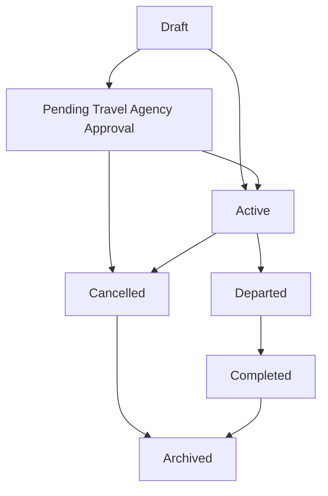

### Status Rules

1. Draft can be edited freely based on permission.
2. Pending Travel Agency Approval is required when Admin creates trip manually on behalf of Travel Agency and approval is not yet recorded.
3. Active requires required core fields to be complete.
4. Departed should lock critical planning fields unless correction permission exists.
5. Completed should lock operational data except remarks and audit correction.
6. Cancelled should preserve all members and attachments.
7. Archived should not appear in active selectors.

### Testimonial Trigger Rule

When group trip status changes to Completed, the system should create end-of-trip testimonial request records for eligible trip members if Testimonial Management is enabled. Submission by Jamaah remains optional, but request creation and notification delivery should be logged.

---

## 28. Readiness and Validation Rules

### Required for Active Status

1. Travel Agency selected.
2. Group trip name entered.
3. Trip schedule entered.
4. Trip type selected.
5. At least one member added or capacity set.
6. Hotel or accommodation plan added if required.
7. Flight or travel plan added if required.
8. Itinerary selected or manually created if required.
9. Admin manual creation approval reference completed if applicable.

### Validation Warnings

| Warning | Condition |
| --- | --- |
| Schedule mismatch | Itinerary template duration differs from trip schedule |
| Flight date mismatch | Flight date outside trip schedule |
| Hotel night mismatch | Hotel nights do not align with schedule |
| Missing mutawwif | No mutawwif assigned when trip type requires guide |
| Capacity exceeded | Member count exceeds capacity |
| Missing documents | Required member documents incomplete |
| Missing services | Visa, ticket, train, or room service incomplete |
| Inactive catalog item | Selected hotel/flight/itinerary source is inactive |
| Unapproved manual creation | Admin-created trip lacks Travel Agency approval |

### Readiness Score

System should optionally calculate readiness score based on:

1. Core trip details completion.
2. Flight assignment completion.
3. Hotel assignment completion.
4. Itinerary completion.
5. Member allocation completion.
6. Document completion.
7. Service completion.

---

## 29. Export to PDF

Export to PDF allows Admin to generate a group trip summary document.

### Export Content

1. Group trip overview.
2. Travel Agency information.
3. Schedule and duration.
4. Mutawwif assignment.
5. Hotel assignment.
6. Flight assignment.
7. Transport information.
8. Itinerary schedule.
9. Member summary.
10. Document completion summary.
11. Service completion summary.
12. Room allocation summary.
13. Notes if allowed.

### Export Rules

1. Export should not expose sensitive document files unless explicitly selected.
2. Export should not expose internal notes to Travel Agency/customer version.
3. Admin should be able to choose export type:
   - Internal Operations.
   - Travel Agency Summary.
   - Jamaah/Public Summary.
4. Export action should be logged.

---

## 30. Notification Rules

Phase 1 should keep notifications controlled and minimal.

| Event | Recipient | Channel | Notes |
| --- | --- | --- | --- |
| Admin creates trip for Travel Agency | Travel Agency PIC | In-app/email optional | If notification module exists |
| Trip requires approval | Travel Agency PIC | In-app/email optional | Approval flow |
| Trip status changed | Travel Agency PIC | In-app optional | Avoid jamaah auto-notify by default |
| Member document rejected | Travel Agency PIC / member | Future phase | Requires notification configuration |
| Flight/hotel/itinerary changed | Travel Agency PIC | Future phase | Useful but should be controlled |

---

## 31. Activity Log Requirements

Every important operation should be logged.

| Action | Logged Data |
| --- | --- |
| Create group trip | Creator, Travel Agency, creation source |
| Admin manual creation | Request source, approval reference |
| Update trip details | Before/after values |
| Assign mutawwif | Old/new mutawwif |
| Assign hotel | Catalog ID and snapshot data |
| Assign flight | Catalog ID and snapshot data |
| Apply itinerary template | Template ID and copied version |
| Edit itinerary activity | Before/after activity |
| Add member | Member ID, group ID |
| Remove member | Member ID and reason |
| Update document status | Member, document type, old/new status |
| Upload document | File metadata, uploader |
| Update service status | Member, service type, old/new status |
| Export PDF | Export type, user, timestamp |
| Archive trip | Reason and actor |

---

## 32. Error and Empty States

### Empty State

#### Group Trip List

Message:

```text
No group trip has been created yet.
```

CTA:

```text
Create Group Trip
```

#### Trip Members

Message:

```text
No trip members have been added yet.
```

CTA:

```text
Add Jamaah
Add Family / Group
```

### Error States

| Error | System Behavior |
| --- | --- |
| Travel Agency not selected | Block save as Active |
| Approval reference missing for Admin manual trip | Allow draft, block Active |
| Selected hotel inactive | Disable selection or show warning |
| Selected flight inactive | Disable selection or show warning |
| Itinerary template mismatch | Show warning and allow controlled override |
| File too large | Reject upload and show max size |
| Unsupported file type | Reject upload |
| Duplicate member | Warn and prevent duplicate active assignment |
| Member already in another active trip with overlapping schedule | Warn Admin |
| Capacity exceeded | Show warning; block or allow based on setting |
| WAG link invalid | Show URL validation error |

---

## 33. Responsive Web Behavior

### Desktop Web

1. Group Trip List uses dense table layout.
2. Trip Members can use horizontal scroll for document/service matrix.
3. Sticky action footer is recommended for Create/Edit forms.
4. Filters should remain visible above table.

### Tablet Web

1. Tables may use horizontal scroll.
2. Create/Edit sections stack into fewer columns.
3. Trip Members matrix should preserve columns with scroll.
4. Buttons should remain accessible.

### Mobile Web

1. Group Trip List may become card list or horizontal table.
2. Create/Edit form sections stack vertically.
3. Trip Members should use member cards with document/service accordion.
4. Avoid forcing wide service matrix on small screens without horizontal scroll.

---

## 34. Security and Data Privacy

1. Member document files are sensitive and require permission checks.
2. Admin should not access documents outside allowed scope.
3. Travel Agency users can only access their own trip members.
4. Upload files must be validated by type and size.
5. File download should require authorization.
6. Sensitive document URLs should not be public.
7. Export PDF should respect export type and permission.
8. Activity logs should preserve who changed what and when.
9. Hard delete should be avoided for operational data.
10. Completed trip data should be locked from casual edits.

---

## 35. Form Field Specification Summary

### 35.1 Create / Edit Group Trip Form

| Section | Field | Type | Required | Validation | Notes |
| --- | --- | --- | --- | --- | --- |
| Group Trip Details | Group Trip Image | Upload | Optional | JPG/PNG/WebP max 2 MB | Optimized image |
| Group Trip Details | Trip Code | Auto/text | Yes | Unique | Auto recommended |
| Group Trip Details | Group Trip Name | Text | Yes | Max 150 chars | Required |
| Group Trip Details | Trip Type | Select | Yes | Master data | Umrah/Hajj/custom |
| Group Trip Details | Travel Agency | Select | Yes | Active agency | Required |
| Group Trip Details | Package Reference | Select | Conditional | Active package | If from package |
| Group Trip Details | Season Type | Auto/select | Optional | Active season or snapshot | From package schedule or departure date |
| Group Trip Details | Season Period | Auto/select | Optional | Active season period or snapshot | Snapshot stored on save |
| Group Trip Details | Season Override Reason | Textarea | Conditional | Max 300 chars | Required if manually changed |
| Group Trip Details | Creation Source | Select | Yes | Fixed values | Audit |
| Group Trip Details | Request Source | Select/text | Conditional | Required for Admin Manual | Audit |
| Group Trip Details | Approval Reference | Text/upload | Conditional | Required for Admin Manual | Audit |
| Group Trip Details | Trip Schedule | Date range | Yes | Valid range | Required |
| Group Trip Details | Mutawwif | Select | Optional | Active mutawwif | Assignment |
| Group Trip Details | Capacity | Number | Optional | Min 1 | Member limit |
| Group Trip Details | Status | Select | Yes | Valid transition | Default Draft |
| Group Trip Details | WAG Link | URL | Optional | Valid URL | WhatsApp group |
| Flight Details | Outbound Airline | Select | Conditional | Active airline | Required if flight included |
| Flight Details | Outbound Flight | Select/text | Optional | Active flight | Catalog snapshot |
| Flight Details | Departure Airport | Select | Conditional | Airport master | Required if flight included |
| Flight Details | Arrival Airport | Select | Conditional | Airport master | Required if flight included |
| Flight Details | Return Flight | Select/text | Optional | Active flight | Optional |
| Hotel Details | Makkah Hotel | Select | Conditional | Active hotel | If Makkah stay |
| Hotel Details | Madinah Hotel | Select | Conditional | Active hotel | If Madinah stay |
| Transport | Inter-city Transport | Select | Optional | Master data | Bus/train/etc |
| Itinerary | Itinerary Template | Select | Optional | Active template | Recommended |
| Trip Members | Add Jamaah | Action | Optional | Existing/new user | Member management |

### 35.2 Trip Member Document Matrix

| Field | Type | Required | Validation | Notes |
| --- | --- | --- | --- | --- |
| Document Type | Fixed/select | Yes | IC, Passport, Photo, Vaccination, Other | Per trip |
| Document Status | Select | Yes | Status values | Per member |
| Upload File | Upload | Optional | See upload limits | Per document |
| Review Note | Textarea | Optional | Max 500 chars | Per document |
| Verified By | Auto | Optional | User ID | If confirmed/rejected |
| Verified At | Auto | Optional | Timestamp | If confirmed/rejected |

### 35.3 Trip Member Service Matrix

| Field | Type | Required | Validation | Notes |
| --- | --- | --- | --- | --- |
| Service Type | Fixed/select | Yes | Visa, Flight Ticket, Train Ticket, Room | Per trip |
| Service Status | Select | Yes | Status values | Per member |
| Reference Number | Text | Optional | Max 80 chars | Application/ticket/etc |
| Attachment | Upload | Optional | PDF/JPG/PNG max 2 MB | Proof |
| Notes | Textarea | Optional | Max 500 chars | Per service |
| Updated By | Auto | Optional | User ID | Audit |
| Updated At | Auto | Optional | Timestamp | Audit |

---

## 36. Acceptance Criteria

### Group Trip List

1. Admin can view group trips across Travel Agencies based on permission.
2. Travel Agency users can only view own group trips.
3. Admin can search by group name, agency, airline, hotel, mutawwif, and trip code.
4. Admin can filter by status, agency, mutawwif, schedule, airport, hotel, and creation source.
5. Admin can export group trip summary to PDF if permitted.

### Create Group Trip

1. Admin can create group trip from package or manually.
2. Admin manual creation requires Travel Agency selection and approval reference before Active status.
3. System saves group trip as Draft when required fields are incomplete.
4. System records creation source and actor.
5. System logs Admin-created trip on behalf of Travel Agency.

### Season, Hotel, Flight, and Itinerary Sync

1. Admin can inherit or resolve season from Season Management through package schedule or trip departure date.
2. Admin can select active hotel records from Hotel Management.
3. Admin can select active flight records from Flight / Airline Management.
4. Admin can select active itinerary template from Itinerary Management.
5. System stores trip-specific snapshots.
6. Updating source catalog or season master data does not automatically change existing group trip snapshots.
7. If trip date changes and season no longer matches, system shows a warning and asks Admin to confirm the new season snapshot.

### Trip Members

1. Admin can add existing Jamaah to group trip.
2. Admin can create minimal new Jamaah and assign to trip.
3. Admin can create family/group and assign members.
4. Admin can track members by documents.
5. Admin can track members by services.
6. Upload limits are enforced.
7. Document and service updates are logged.

### Status and Locking

1. Draft trip can be edited.
2. Active trip requires required core fields.
3. Departed and Completed trips lock critical fields.
4. Cancelled and archived trips preserve history.
5. Group trips with members cannot be hard-deleted by normal Admin.

---

## 37. Open Questions

1. Should Travel Agency approval be a formal approve/reject workflow or only an approval reference field in Phase 1?
2. Should Admin-created manual trips notify Travel Agency automatically?
3. Should WAG link be required before trip becomes Active?
4. Should member capacity be hard limit or warning only?
5. Should room allocation support gender-based auto-suggestion in Phase 1?
6. Should document requirements be configurable by trip type and nationality?
7. Should export PDF include member personal data by default or require explicit checkbox?
8. Should group trip be created only after package exists, or manual trip without package remains allowed?
9. Should overlapping active trip schedules block the same Jamaah from being added?
10. Should Travel Agency Portal have the same Trip Members matrix or a simplified version?
