# Module PRD - Itinerary Management

Version: 1.0  
Date: 3 Juni 2026  
Parent Document: Master PRD - UmrahHaji.com Admin Panel  
Scope: Itinerary Management

---

## 1. Objective

Itinerary Management memungkinkan Admin untuk membuat, mengelola, menggunakan ulang, dan mengarsipkan itinerary template untuk package dan group trip Umrah/Haji.

Module ini berfokus pada:

1. Itinerary List.
2. Create Itinerary Template.
3. Generate day schedule based on duration.
4. Manage day-by-day activities.
5. Manage local and destination time zone.
6. Configure feedback collection.
7. Reuse itinerary template for package or group trip.
8. Activity logs and permission-based access.

Itinerary dalam konteks UmrahHaji.com adalah operational travel schedule. Itinerary harus membantu Admin, travel agency, mutawwif, dan jamaah memahami urutan perjalanan, lokasi, waktu aktivitas, instruksi, dan konteks ibadah.

---

## 2. Scope

### In Scope

1. Itinerary List.
2. Search, filter, sort, pagination, and row actions.
3. Create Itinerary Template.
4. Edit Itinerary Template.
5. Archive and restore itinerary.
6. Template ownership and visibility.
7. Status management: Draft, Active, Inactive, Archived.
8. Template information: name, type, duration, description.
9. Auto-generate days based on duration.
10. Add, edit, reorder, collapse, expand, and delete days.
11. Add, edit, reorder, collapse, expand, and delete activities.
12. Activity icon selection.
13. Day title/focus selection.
14. Location selection.
15. Local and destination time zone settings.
16. Automatic time conversion helper.
17. Feedback collection settings.
18. Template usage by Package as reference.
19. Template usage by Group Trip as copied snapshot.
20. Template version tracking for future-safe updates.
21. Activity log for critical changes.
22. Responsive web behavior for desktop, tablet, and mobile web.

### Out of Scope

1. Native Android app.
2. Native iOS app.
3. Real-time GPS tracking.
4. Live itinerary change notification to jamaah mobile app.
5. Calendar sync integration.
6. Flight/hotel booking management.
7. Mutawwif assignment management.
8. Full package creation workflow.
9. Full group trip operation workflow.
10. Document upload for itinerary activities in Phase 1.

Notes:

1. Itinerary Template is reusable. Package may reference the template, while Group Trip should use a copied snapshot so historical trips do not change when the template is edited later.
2. Flight, Hotel, Mutawwif, and Jamaah assignments are managed in their own modules. Itinerary may reference them only as contextual information.
3. Upload attachment is not required in Phase 1 to reduce storage cost and server load. If future attachment support is added, files should use strict type and size limits.

### Portal & Design System Principle

Admin Panel and Travel Agency Portal will use the same design system to maintain visual consistency, component reuse, and development efficiency. However, each portal will have a separate navigation structure, permission model, user workflow, and data scope based on the role and operational needs of its users.

---

## 3. Relationship With Other Modules

Itinerary Management is a planning module. It stores reusable schedule templates and operational schedule data used by package and group trip workflows.

Core product principle:

```text
Itinerary Template
↓ selected while creating Package
Package Itinerary Reference
↓ used while creating Group Trip
Group Trip Itinerary Snapshot
```

The system must treat these layers differently. A template is a reusable planning asset. A package reference is a package-level default. A group trip snapshot is the operational schedule for a real departure and must be protected from unexpected template changes.

| Related Module | Relationship |
|---|---|
| Package Management | Package may select an itinerary template as part of package setup |
| Group Trip Management | Group trip may use a copied itinerary schedule for actual departure operation |
| Flight Management | Flight data may inform departure, arrival, transit, and transfer activities |
| Hotel Management | Hotel data may inform check-in, check-out, rest, and gathering activities |
| Mutawwif Management | Mutawwif may use itinerary details to guide jamaah |
| Jamaah Management | Jamaah may view itinerary as trip schedule if exposed in portal |
| Announcement / Notification | Future phase may notify participants when itinerary changes |
| Testimonial Management | Itinerary daily feedback settings create optional daily feedback requests and response summaries |

### Data Relationship Diagram

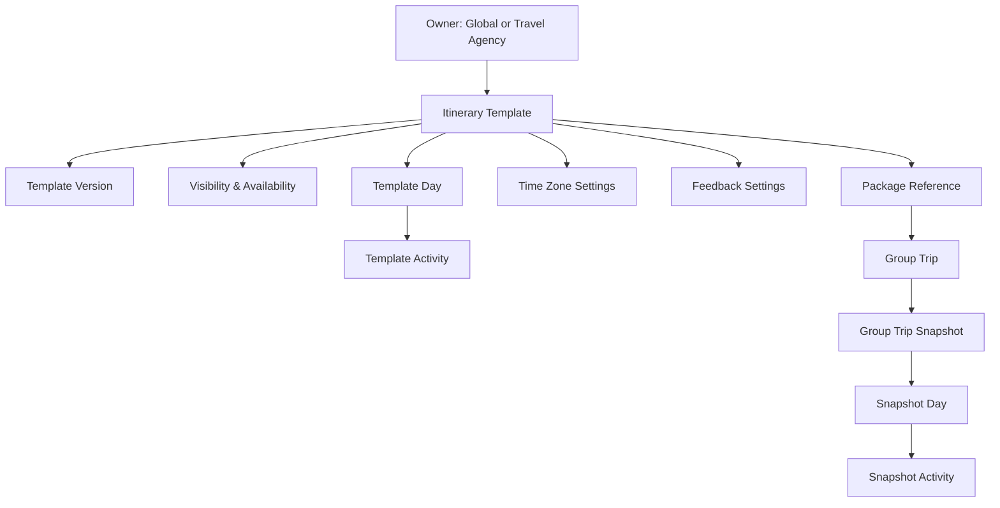

### Template Usage Model Diagram

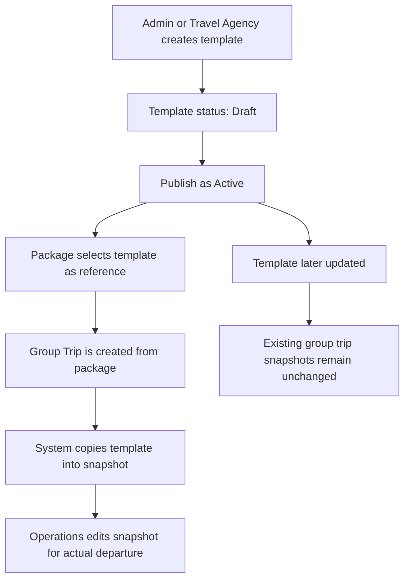

### Template Ownership and Visibility

| Concept | Description | Rule |
|---|---|---|
| Global Template | Created by Super Admin/Admin for platform-wide reuse | Visible to permitted agencies and admins |
| Travel Agency Template | Created by or for a specific travel agency | Visible only within that agency scope |
| Private Draft | Incomplete template not ready for use | Visible only to creator/authorized admins |
| Shared Template | Agency template intentionally shared if product supports it | Requires explicit sharing permission |

Ownership rules:

1. Every itinerary template must have an owner scope: Global or Travel Agency.
2. Travel Agency Admin can only create or edit agency-owned templates if permission allows.
3. Global templates should be maintained by Admin/Super Admin.
4. Package and Group Trip selection must only show templates visible to the user and eligible by status.
5. Deleting a template must be blocked if any package reference or group trip snapshot exists.

### Template, Package, and Group Trip Behavior

| Layer | Purpose | Editable By | Change Impact |
|---|---|---|---|
| Itinerary Template | Reusable schedule blueprint | Admin / authorized Travel Agency Admin | Affects future package selections only |
| Package Itinerary Reference | Default itinerary for a package | Package editor | Points to selected template/version |
| Group Trip Snapshot | Operational schedule for a real departure | Group Trip operations users | Independent copy; does not change when template changes |

Rules:

1. Package should store selected itinerary template ID and template version ID.
2. Group Trip should store a copied itinerary snapshot generated from the package reference at creation time.
3. Updating a template must not automatically update existing group trip snapshots.
4. Future template sync, if implemented, must require manual review and confirmation.
5. Completed or cancelled group trip snapshots should be read-only except admin notes or correction fields with audit log.

---

## 4. User Roles & Permissions

| Role | Access |
|---|---|
| Super Admin | Full access to all itinerary records |
| Admin | View, create, update, archive, and export based on permission |
| Operations Admin | Manage itinerary templates and group trip schedule data |
| Travel Agency Admin | Manage itinerary templates under own agency if portal permission allows |
| Mutawwif Coordinator | View itinerary and suggest operational updates if permitted |
| Finance Admin | No default access unless itinerary visibility is needed for package review |
| View Only / Auditor | Read-only access |

Sensitive actions:

1. Delete itinerary requires Delete permission and should be avoided if already used by package or group trip.
2. Archive itinerary requires Archive permission.
3. Editing Active itinerary used by packages requires confirmation.
4. Editing group trip itinerary snapshot requires Group Trip Itinerary Update permission.
5. Export requires Itinerary Export permission.

---

## 5. Navigation Entry Point

```text
Admin Panel
- Itinerary Management
  - Itinerary List
  - Create Itinerary
  - Itinerary Details
  - Edit Itinerary
```

Related entry points:

1. Dashboard Quick Actions: Create Itinerary.
2. Package Details: Itinerary Included.
3. Group Trip Details: Itinerary tab.
4. Flight Details: Passenger movement context.
5. Hotel Details: Stay/check-in/check-out context.
6. Activity Logs: open changed itinerary record.

---

## 6. Information Architecture

```text
Itinerary Management
- Itinerary List
  - Search
  - Filters
  - Sort
  - Row Actions
  - Bulk Actions
- Create Itinerary
  - Template Info
  - Ownership & Visibility
  - Itinerary Schedule
  - Time Zone Settings
  - Feedback Settings
- Itinerary Details
  - Overview
  - Schedule
  - Usage
  - Feedback Summary
  - Activity Logs
- Edit Itinerary
  - Template Info
  - Ownership & Visibility
  - Schedule Builder
  - Time Zone Settings
  - Feedback Settings
```

### Module IA Diagram

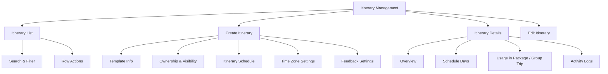

---

## 7. Design Review & Product Recommendations

### Keep From Current Design

1. Clear page title: Itinerary List.
2. Primary Add Itinerary button.
3. Filters for status, duration, time zone, feedback setting, and date created.
4. Table columns for name, duration, activity count, description, status, date created, and actions.
5. Status badges for Active, Inactive, and Draft.
6. Row action menu for Edit, Delete, and Archive.
7. Template Info section with duration and Generate Days action.
8. Day-based schedule builder.
9. Activity-level form with activity name, time, icon, and description.
10. Time zone explanation box.
11. Feedback settings section.

### Improve

1. Change search placeholder from `Search by flight name or number` to `Search by itinerary name, activity, or location`.
2. Rename `Total Activity` to `Total Activities`.
3. Rename `All Duration` filter to show both duration presets and type, because duration alone may not distinguish Umrah vs Haji.
4. Add `Type` filter: Umrah, Haji, Custom.
5. Add `Owner Scope` filter: Global, Travel Agency.
6. Add `Visibility` filter: Private Draft, Internal, Available for Package.
7. Add `Used In` filter: Not Used, Used in Package, Used in Group Trip.
8. Add `Last Updated` as optional column because itinerary templates may be maintained over time.
9. Add `Created By` or `Owner Agency` for multi-agency data scope.
10. Add `Version` or `Last Published Version` for audit clarity.
11. Add duplicate warning for same template name, type, duration, and owner.
12. Add preview action so Admin can review schedule before assigning it to package/group trip.
13. Add duplicate action because travel agencies will often clone a global template and adjust it.
14. Add confirmation when changing duration after days are already generated.
15. Use snapshot behavior when itinerary is attached to group trip to avoid unexpected historical changes.
16. Add timezone conversion preview per activity, not only at settings level.
17. Move Feedback Settings filter to secondary/advanced filters because operational users usually need status, type, duration, owner, and usage first.

### Reduce / Avoid

1. Avoid Delete for itinerary already used by package or group trip; use Archive instead.
2. Avoid requiring file upload in Phase 1.
3. Avoid too many activity icon options in MVP. Keep a controlled master list.
4. Avoid mixing package price, hotel booking, and flight assignment inside Itinerary Management.
5. Avoid automatic notifications in MVP unless Notification module is ready.
6. Avoid editing active group trip itinerary without audit log and confirmation.
7. Avoid editing a template and silently updating packages or active group trips.
8. Avoid allowing Travel Agency Admin to see or edit another agency's private templates.

---

## 8. Itinerary List

### Page Purpose

Itinerary List allows Admin to view, search, filter, and manage itinerary templates across the platform based on permission and data scope.

### Data Scope Rule

1. Super Admin can view all itinerary templates.
2. Admin can view itinerary templates based on assigned permission.
3. Travel Agency Admin can only view itinerary templates owned by their agency.
4. Shared/global templates are visible based on Global Template View permission.
5. Archived templates are hidden by default unless Archive filter is enabled.

### Table Columns

| Column | Description |
|---|---|
| Checkbox | Select row for bulk action |
| Itinerary Name | Template name |
| Type | Umrah, Haji, or Custom |
| Owner Scope | Global or Travel Agency |
| Owner Agency | Agency name if agency-owned |
| Visibility | Private Draft, Internal, Available for Package |
| Duration | Example: 7D / 5N, 16D / 14N |
| Total Activities | Count of all activities across all days |
| Description | Short template description |
| Status | Draft, Active, Inactive, Archived |
| Used In | Number of packages/group trips using the template |
| Version | Current published version or draft version |
| Date Created | Date record was created |
| Last Updated | Optional column |
| Actions | View, edit, duplicate, archive, delete if allowed |

Recommended MVP columns:

1. Itinerary Name.
2. Type.
3. Owner Scope / Owner Agency.
4. Duration.
5. Total Activities.
6. Status.
7. Used In.
8. Date Created.
9. Actions.

### Search

Admin can search by:

1. Itinerary name.
2. Description.
3. Activity name.
4. Location.
5. Created by.
6. Package or group trip name if linked.

Search placeholder:

```text
Search by itinerary name, activity, or location
```

### Filters

| Filter | Values |
|---|---|
| Status | Draft, Active, Inactive, Archived |
| Type | Umrah, Haji, Custom |
| Owner Scope | Global, Travel Agency |
| Owner Agency | Agency list based on permission |
| Visibility | Private Draft, Internal, Available for Package |
| Duration | 5D / 3N, 7D / 5N, 10D / 8N, 12D / 10N, 14D / 12N, 15D / 13N, 16D / 14N, Custom |
| Time Zone | Malaysia GMT+8, Saudi Arabia GMT+3, Indonesia GMT+7/8/9, UAE GMT+4, Custom |
| Feedback Settings | Feedback Enabled, Feedback Disabled, Anonymous Enabled, Anonymous Disabled, Custom Prompt Set, No Prompt Set |
| Used In | Not Used, Used in Package, Used in Group Trip |
| Version State | Draft Only, Published, Has Unpublished Changes |
| Date Created | All Time, Today, This Week, This Month, This Year, Custom Range |

Filter behavior:

1. Filters can be combined.
2. Selected filters should appear as chips.
3. Admin can clear individual filters or clear all filters.
4. Duration, Time Zone, Location, Owner Agency, and Day Title filters should support search inside dropdown.
5. Feedback Settings should be placed in advanced filters if screen space is limited.

### Row Actions

| Action | Availability | Description |
|---|---|---|
| View Details | Users with read permission | Opens Itinerary Details |
| Edit | Users with update permission | Opens edit page |
| Duplicate | Users with create permission | Creates a copy as Draft |
| Preview | Users with read permission | Opens itinerary preview |
| Publish | Draft or Inactive template | Makes template selectable if validation passes |
| Archive | Not actively used or allowed by permission | Archives itinerary from active list |
| Restore | Archived itinerary | Restores itinerary to Draft or Inactive |
| Delete | Draft and unused itinerary only | Permanently deletes record if allowed |

### Bulk Actions

| Action | Description |
|---|---|
| Export Selected | Export selected records |
| Change Status | Bulk status update with validation |
| Archive Selected | Archive selected unused itineraries |
| Restore Selected | Restore archived itineraries |

Bulk action rules:

1. Bulk actions require at least one selected row.
2. System must validate each selected itinerary.
3. Itinerary used by package/group trip cannot be deleted.
4. Failed rows should be reported after bulk action completes.

---

## 9. Create Itinerary

Create Itinerary allows Admin to create a reusable itinerary template by defining basic information, generating days, filling activities, setting time zone behavior, and configuring feedback.

### Main Create Flow

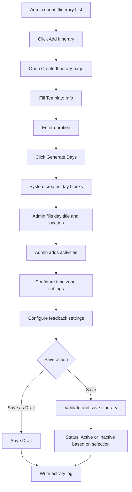

### Template Info

| Field | Type | Required | Validation | Notes |
|---|---|---:|---|---|
| Template Name | Text input | Yes | Max 120 characters | Example: Itinerary for Umrah A |
| Type | Select | Yes | Umrah, Haji, Custom | Screenshot label `For` should be renamed to Type |
| Duration Days | Number input | Yes | 1-60 days | Generates day blocks |
| Duration Nights | Number input | Optional | 0-60 nights | Can be auto-calculated or manually set |
| Description | Textarea | Optional | Max 500 characters | Short internal description |
| Owner Scope | Select | Yes | Global, Travel Agency | Determines data scope |
| Owner Agency | Select | Conditional | Permission-based | Required for agency-scoped template |
| Visibility | Select | Yes | Private Draft, Internal, Available for Package | Determines whether template can be selected |
| Available for Package | Toggle | Optional | Boolean | Enabled only when status is Active and visibility allows |
| Status | Select | Yes | Draft, Active, Inactive | Default Draft |
| Template Version | System generated | Auto | Incremented on publish | Example: v1, v2 |

### Ownership and Visibility Rules

| Rule | Description |
|---|---|
| Global Template | Can be created and maintained by Admin/Super Admin |
| Agency Template | Can be created by authorized Travel Agency Admin or Admin under a selected agency |
| Private Draft | Not selectable by package/group trip |
| Internal | Visible to internal users but not selectable by package unless enabled |
| Available for Package | Template is selectable when creating/editing package |
| Archived | Hidden from selection and normal list view |

Rules:

1. Owner Scope is required for every template.
2. Owner Agency is required when Owner Scope is Travel Agency.
3. Travel Agency Admin cannot create Global Template unless granted explicit permission.
4. A template must be Active and Available for Package before it can be selected in Package Management.
5. Group Trip cannot directly use an unpublished/private draft template.
6. If a template is duplicated from a Global Template by an agency, the new copy becomes an Agency Template in Draft status.
7. Visibility changes must be logged.
8. Availability changes must be logged.

### Generate Days Behavior

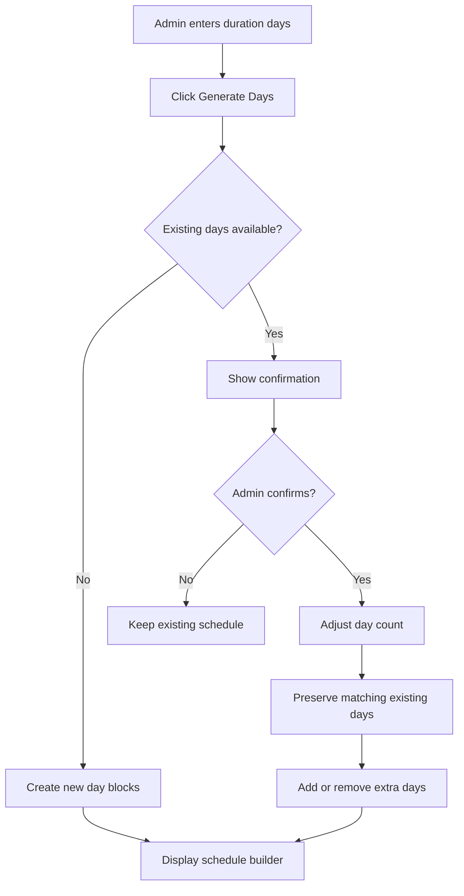

Generate day rules:

1. If no day exists, system creates day blocks from Day 1 to Day N.
2. If days already exist and duration increases, system preserves existing days and appends new blank days.
3. If duration decreases, system warns Admin that extra days and activities may be removed.
4. Deleted days should not be recoverable after save unless revision history is implemented.
5. Day order must always be sequential after save.

---

## 10. Itinerary Schedule Builder

### Day Block Requirements

Each day represents a schedule container.

| Field | Type | Required | Validation | Notes |
|---|---|---:|---|---|
| Day Number | Auto label | Yes | System generated | Day 1, Day 2, Day 3 |
| Day Title / Focus | Select / text input | Yes | Master Data or custom | Departure, Arrival, Ihram, Umrah, Haram, Ziyarah, Rest |
| Location | Select / text input | Recommended | Master Data or custom | Malaysia, KLIA, Makkah, Madinah, Haram |
| Day Notes | Textarea | Optional | Max 500 characters | Internal or participant-facing notes |
| Visibility | Select | Optional | Internal, Participant Visible | Default Participant Visible |
| Sort Order | Drag handle | Yes | Sequential | Admin can reorder days |

Day actions:

1. Expand/collapse day.
2. Add activity.
3. Delete day.
4. Duplicate day.
5. Reorder day by drag handle.

### Activity Requirements

Each day may contain one or more activities.

| Field | Type | Required | Validation | Notes |
|---|---|---:|---|---|
| Activity Name | Text input | Yes | Max 120 characters | Example: Departure from KLIA 1 |
| Activity Time | Time picker | Recommended | Valid time | Uses local or destination time setting |
| Time Display Mode | Select | Optional | Local, Destination, Both | Default follows template setting |
| Activity Icon | Select | Optional | Master icon list | Departure, Arrival, Bus, Hotel, Umrah, Tawaf, Sai, Prayer |
| Location | Select / text input | Optional | Max 120 characters | Overrides day location if filled |
| Short Description | Textarea | Optional | Max 500 characters | Participant-facing summary |
| Instructions | Textarea | Optional | Max 1000 characters | Operational instructions |
| Visibility | Select | Optional | Internal, Participant Visible | Default Participant Visible |
| Sort Order | Drag handle | Yes | Sequential | Admin can reorder activities |

### Activity Icon Master List

Recommended MVP activity icons:

1. Departure.
2. Arrival.
3. Transit.
4. Bus / Transfer.
5. Hotel.
6. Ihram.
7. Umrah.
8. Tawaf.
9. Sa'i.
10. Tahallul.
11. Prayer.
12. Ziyarah.
13. Raudhah.
14. Mina.
15. Arafah.
16. Muzdalifah.
17. Jamrah.
18. Ifadah.
19. Tashreeq.
20. Wada.
21. Rest.
22. Briefing.

Icon rules:

1. Icons should come from controlled Master Data.
2. Admin should not upload custom icons in Phase 1.
3. Icon names should be searchable.
4. If no icon is selected, system should use a default schedule icon.

### Add Activity Flow

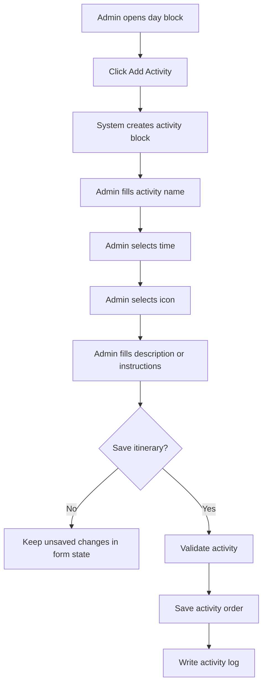

---

## 11. Time Zone Settings

Time Zone Settings help Admin plan travel activities across origin and destination time zones.

### Fields

| Field | Type | Required | Validation | Notes |
|---|---|---:|---|---|
| Local Timezone | Select | Yes | IANA timezone + GMT offset | Example: Malaysia (Asia/Kuala_Lumpur) GMT+8 |
| Destination Timezone | Select | Yes | IANA timezone + GMT offset | Example: Saudi Arabia (Asia/Riyadh) GMT+3 |
| Auto Convert Times | Checkbox / toggle | Optional | Boolean | Converts local time to destination time |
| Time Difference Info | System display | Auto | Derived from timezone | Shows human-readable time difference |

Recommended timezone list:

1. Malaysia (Asia/Kuala_Lumpur) GMT+8.
2. Saudi Arabia (Asia/Riyadh) GMT+3.
3. Indonesia - Jakarta (Asia/Jakarta) GMT+7.
4. Indonesia - Makassar (Asia/Makassar) GMT+8.
5. Indonesia - Jayapura (Asia/Jayapura) GMT+9.
6. Singapore (Asia/Singapore) GMT+8.
7. United Arab Emirates (Asia/Dubai) GMT+4.
8. Qatar (Asia/Qatar) GMT+3.
9. Kuwait (Asia/Kuwait) GMT+3.
10. Oman (Asia/Muscat) GMT+4.

### Time Zone Conversion Flow

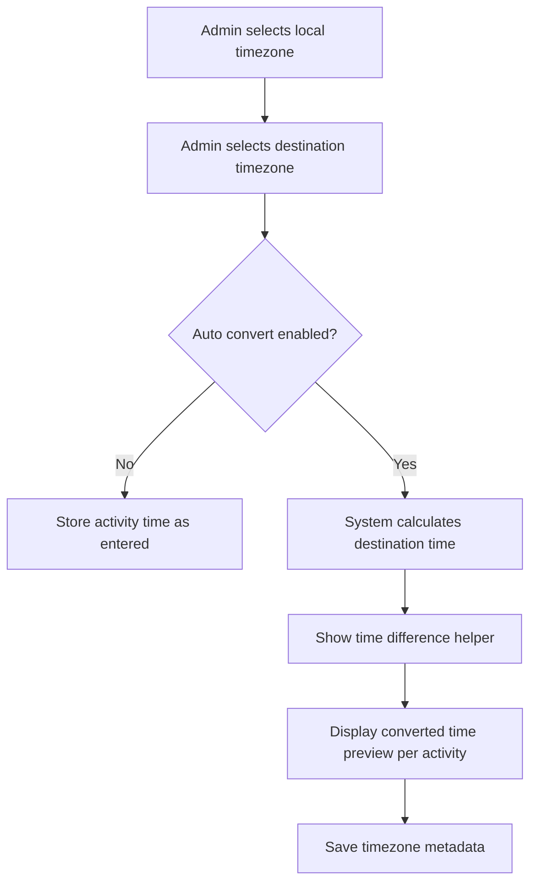

Conversion rules:

1. Store original entered time, source timezone, destination timezone, and converted time.
2. Do not overwrite original time silently.
3. If Admin changes timezone after activities exist, system must show confirmation.
4. DST-aware timezone handling should use IANA timezone identifiers, not only GMT text.
5. If timezone conversion fails, system must keep original time and show warning.

---

## 12. Feedback Settings

Feedback Settings allow Admin to configure whether participants can submit optional daily itinerary feedback. The settings live in Itinerary Management, while collected responses, moderation, analytics, and export are handled in Testimonial Management.

### Fields

| Field | Type | Required | Validation | Notes |
|---|---|---:|---|---|
| Enable Feedback Collection | Checkbox | Optional | Boolean | Default off |
| Anonymous Feedback | Checkbox | Optional | Boolean | Only available if feedback enabled |
| Feedback Prompt | Text input / textarea | Conditional | Max 300 characters | Required if custom prompt is enabled |
| Feedback Visibility | Select | Optional | Internal, Agency, Admin Only | Default Admin Only |
| Feedback Type | Select | Optional | Day-level, Activity-level | Default day-level |

Rules:

1. Anonymous Feedback can only be enabled if Feedback Collection is enabled.
2. Feedback Prompt is optional, but recommended if feedback is enabled.
3. Feedback collection belongs to itinerary usage. If template is copied to group trip, feedback settings should be copied too.
4. Daily feedback submission by Jamaah is optional and should not block itinerary access or next-day activities.
5. Feedback response collection, moderation, media, and reporting are handled in Testimonial Management.

---

## 13. Itinerary Details

Itinerary Details allows Admin to review the template, schedule, usage, and activity logs.

### Recommended Tabs

| Tab | Purpose |
|---|---|
| Overview | Template information, status, duration, owner, and summary |
| Schedule | Day-by-day itinerary schedule and activities |
| Usage | Packages and group trips using this itinerary |
| Feedback Summary | Feedback setting and daily feedback response summary from Testimonial Management |
| Activity Logs | Change history and audit records |

### Overview Fields

| Field | Description |
|---|---|
| Itinerary Name | Template name |
| Type | Umrah, Haji, Custom |
| Duration | Days and nights |
| Status | Draft, Active, Inactive, Archived |
| Owner Agency | Global or agency-specific owner |
| Total Days | Count of day blocks |
| Total Activities | Count of activities |
| Time Zone | Local and destination timezone |
| Feedback | Enabled or disabled |
| Created By | Admin/user who created record |
| Last Updated | Last update date and user |

### Usage Tab

| Field | Description |
|---|---|
| Usage Type | Package or Group Trip |
| Related Record | Package name or group trip name |
| Usage Mode | Template reference or copied snapshot |
| Status | Active, Completed, Cancelled, Archived |
| Assigned Date | Date itinerary was linked |
| Last Sync | If sync is supported |

Usage rules:

1. Package may reference active itinerary template.
2. Group Trip should use a copied snapshot for operational stability.
3. Editing template should not automatically modify completed group trip itinerary.
4. If sync is supported in future, Admin must review changes before applying them.

---

## 14. Edit Itinerary

Edit Itinerary allows Admin to update template data based on permission and usage state.

### Edit Rules

| Condition | Behavior |
|---|---|
| Draft itinerary | Editable without usage warning |
| Active but unused itinerary | Editable with normal confirmation |
| Active and used by package | Show impact warning |
| Used by active group trip snapshot | Template edit does not affect snapshot unless sync is applied |
| Archived itinerary | Read-only until restored |
| Completed group trip itinerary | Read-only except admin note if allowed |

### Edit Flow

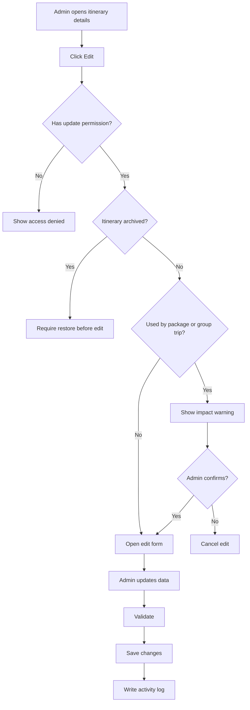

---

## 15. Status Management

### Status Definitions

| Status | Meaning |
|---|---|
| Draft | Template is incomplete or not ready for use |
| Active | Template can be selected by package/group trip |
| Inactive | Template is preserved but not selectable for new usage |
| Archived | Template is hidden from active list and preserved for audit/history |

### Status Flow

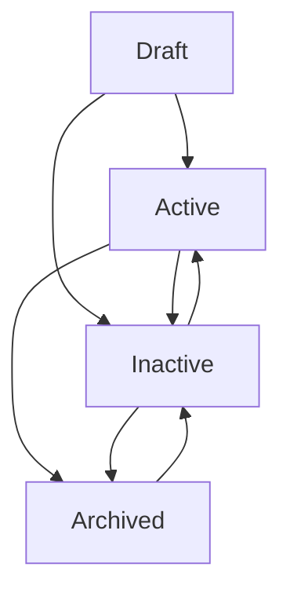

Status rules:

1. Only Active itinerary can be selected for new package or group trip usage.
2. Draft itinerary cannot be assigned to package/group trip.
3. Archived itinerary is hidden by default.
4. Delete is only allowed for Draft itinerary that has never been used.
5. Status changes must be recorded in activity logs.

---

## 16. Versioning and Snapshot Rules

Itinerary templates need lightweight versioning because packages and group trips may depend on a specific schedule structure.

### Version Concepts

| Concept | Description |
|---|---|
| Draft Version | Editable unsaved/unpublished working version |
| Published Version | Active version that can be selected by package |
| Package Reference Version | Version selected by a package |
| Group Trip Snapshot Version | Copied version used by a specific departure |

Rules:

1. Publishing a template should create or update a Published Version.
2. Package should reference a specific Published Version, not only the template master record.
3. Group Trip should copy the referenced version into a snapshot at creation time.
4. Editing the template after publication creates unpublished changes or a new version, depending on implementation.
5. Existing package references may optionally be updated to a newer version by Admin confirmation.
6. Existing group trip snapshots must not be automatically updated.
7. Completed group trip snapshots must remain historically stable.

### Version and Snapshot Flow

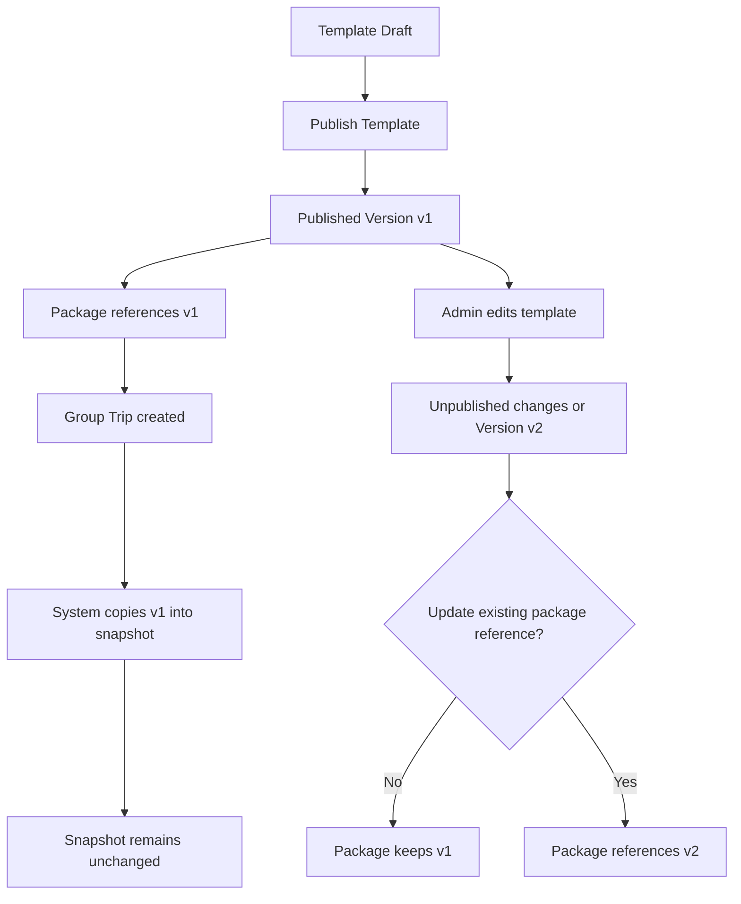

---

## 17. Assignment to Package and Group Trip

Itinerary assignment is initiated from Package Management or Group Trip Management, but Itinerary Management must support readiness and usage visibility.

### Assignment Flow

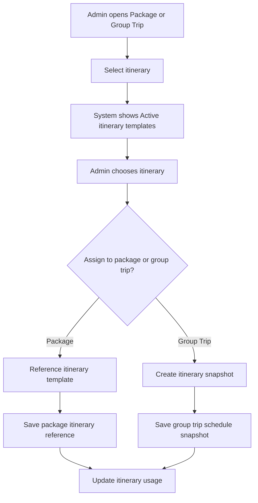

Rules:

1. Package may reference an Active itinerary template version.
2. Group Trip must copy itinerary into a snapshot when the trip is created.
3. Snapshot can be edited for a specific departure without changing the original template.
4. Template usage count should show number of related packages and group trips.
5. Inactive, Archived, Private Draft, and Internal-only itinerary cannot be assigned to new package/group trip.
6. If a package changes its itinerary reference, future group trips should use the new reference while existing group trip snapshots remain unchanged.
7. If a group trip departure date is set, snapshot days may be mapped to actual dates.
8. If departure date changes, system may recalculate actual dates while preserving day order and activity content.
9. Snapshot edit must be logged separately from template edit.

### Date Mapping Rules

Template itinerary does not store actual calendar dates by default. It stores relative schedule data:

```text
Day 1 + activity time
Day 2 + activity time
Day N + activity time
```

When a group trip has a departure date, the system can derive actual dates:

```text
Group Trip Departure Date + Day Offset = Actual Activity Date
```

Rules:

1. Template activities should not require actual dates.
2. Actual dates are calculated only when itinerary is attached to a group trip with a departure date.
3. Group trip snapshot should store both day number and derived date if needed.
4. If departure date changes, Admin must be warned that derived dates will shift.
5. Manual snapshot date overrides should require permission and activity log.

---

## 18. Form Field Specification

### 18.1 Create / Edit Itinerary Form

| Section | Field | Type | Required | Validation | Notes |
|---|---|---|---:|---|---|
| Template Info | Template Name | Text input | Yes | Max 120 chars | Unique within owner/type if possible |
| Template Info | Type | Select | Yes | Umrah, Haji, Custom | Rename from `For` |
| Template Info | Duration Days | Number input | Yes | 1-60 | Used to generate days |
| Template Info | Duration Nights | Number input | Optional | 0-60 | Can be derived |
| Template Info | Description | Textarea | Optional | Max 500 chars | Short description |
| Ownership | Owner Scope | Select | Yes | Global, Travel Agency | Determines data scope |
| Template Info | Owner Agency | Select | Conditional | Permission scoped | Required for agency template |
| Ownership | Visibility | Select | Yes | Private Draft, Internal, Available for Package | Determines selection availability |
| Ownership | Available for Package | Toggle | Optional | Boolean | Requires Active status |
| Versioning | Template Version | System label | Auto | System generated | Incremented on publish |
| Versioning | Based On Template | System label | Optional | Source template ID | Filled when duplicated |
| Template Info | Status | Select | Yes | Draft, Active, Inactive | Default Draft |
| Schedule | Day Title / Focus | Select/text | Yes | Max 80 chars | Per day |
| Schedule | Day Location | Select/text | Recommended | Max 120 chars | Per day |
| Schedule | Day Notes | Textarea | Optional | Max 500 chars | Optional |
| Activity | Activity Name | Text input | Yes | Max 120 chars | Per activity |
| Activity | Activity Time | Time picker | Recommended | Valid time | Time zone aware |
| Activity | Activity Icon | Select | Optional | Master list | Controlled icon set |
| Activity | Activity Location | Select/text | Optional | Max 120 chars | Overrides day location |
| Activity | Short Description | Textarea | Optional | Max 500 chars | Participant-facing |
| Activity | Instructions | Textarea | Optional | Max 1000 chars | Operational notes |
| Time Zone | Local Timezone | Select | Yes | IANA timezone | Source timezone |
| Time Zone | Destination Timezone | Select | Yes | IANA timezone | Destination timezone |
| Time Zone | Auto Convert Times | Checkbox | Optional | Boolean | Default enabled for cross-country trips |
| Feedback | Enable Feedback Collection | Checkbox | Optional | Boolean | Default off |
| Feedback | Anonymous Feedback | Checkbox | Optional | Boolean | Requires feedback enabled |
| Feedback | Feedback Prompt | Textarea | Conditional | Max 300 chars | Required if custom prompt used |

### 18.2 Upload and Storage Policy

There is no file upload requirement for Itinerary Management in Phase 1.

If attachment support is introduced in a future phase:

| Attachment Type | Format | Max Size | Notes |
|---|---|---:|---|
| Itinerary PDF | PDF | 2 MB | Optional export/import support |
| Activity Image | JPG, PNG, WebP | 1 MB | Must be compressed and resized |
| Supporting Document | PDF, JPG, PNG | 2 MB | Only if operationally required |

Storage rules for future uploads:

1. Do not store original large images without compression.
2. Generate thumbnail/preview for images.
3. Reject unsupported file types.
4. Scan files if virus scanning service is available.
5. Store only files needed for operational use.

---

## 19. Validation Rules

1. Template Name is required.
2. Type is required.
3. Duration Days is required and must be greater than 0.
4. Duration Days cannot exceed system limit.
5. Owner Scope is required.
6. Owner Agency is required when Owner Scope is Travel Agency.
7. Visibility is required.
8. Available for Package requires status Active.
9. At least one day is required before itinerary can become Active.
10. Each day must have Day Title / Focus.
11. Activity Name is required for every saved activity.
12. Activity time must use valid time format.
13. Local and destination timezone are required.
14. Feedback Prompt must not exceed max length.
15. Archived itinerary cannot be edited.
16. Active itinerary cannot be deleted if already used.
17. Duplicate template warning should be shown for same name, type, duration, and owner.
18. Reordering days must preserve sequential day numbering.
19. If duration is changed after schedule is generated, confirmation is required.
20. Group Trip snapshot must remain unchanged when the source template is edited.
21. Package reference must point to a valid Active template version.

---

## 20. Empty State

### Itinerary List Empty State

Display when no itinerary exists.

Recommended message:

```text
No itinerary has been created yet.
Create an itinerary template to start building travel schedules.
```

Primary action:

```text
Add Itinerary
```

### Schedule Empty State

Display when duration has not generated day blocks.

Recommended message:

```text
Enter duration and click Generate Days to create the schedule.
```

---

## 21. Error State

| Error | System Behavior |
|---|---|
| Failed to load itinerary list | Show retry action |
| Failed to save itinerary | Preserve form data and show error |
| Invalid duration | Highlight duration field |
| Failed to generate days | Keep existing schedule and show message |
| Timezone conversion failed | Keep original time and show warning |
| Permission denied | Show access denied message |
| Itinerary already used | Block delete and suggest archive |
| Duplicate itinerary name | Show warning and allow rename |
| Private template selected in package | Block selection and explain visibility issue |
| Source template changed after group trip snapshot exists | Keep snapshot unchanged and show usage impact |

---

## 22. Notification Rules

Phase 1 notification scope is limited.

| Event | Recipient | Channel | Notes |
|---|---|---|---|
| Itinerary created | Admin who created | In-app optional | Activity confirmation |
| Itinerary updated | Related Admin / Agency Admin | In-app optional | Only if notification module supports it |
| Itinerary archived | Admin / Auditor | In-app optional | Audit visibility |
| Group trip itinerary changed | Operations Admin / Mutawwif | Future phase | Requires notification module |

Rules:

1. No automatic jamaah notification in Phase 1 unless Group Trip/Notification module supports it.
2. Critical changes should be logged even if no notification is sent.
3. Future participant notification must clearly show changed day/activity and old/new value.

---

## 23. Activity Log Requirements

The system must record activity logs for:

1. Create itinerary.
2. Edit template info.
3. Generate days.
4. Add day.
5. Delete day.
6. Reorder day.
7. Add activity.
8. Edit activity.
9. Delete activity.
10. Reorder activity.
11. Change timezone settings.
12. Enable or disable feedback.
13. Change status.
14. Archive or restore itinerary.
15. Assign itinerary to package/group trip.
16. Publish template version.
17. Duplicate template.
18. Create group trip snapshot from template.
19. Change owner scope or visibility.

Activity log fields:

| Field | Description |
|---|---|
| Action | Type of action performed |
| Actor | Admin/user who performed action |
| Timestamp | Date and time |
| Entity | Itinerary, day, activity, timezone, feedback |
| Old Value | Previous value for critical changes |
| New Value | Updated value |
| Source | Admin Panel or Travel Agency Portal |

---

## 24. Responsive Web Behavior

### Desktop Web

1. Use full table layout for Itinerary List.
2. Schedule builder can use wide form rows.
3. Day and activity blocks can be expanded/collapsed.
4. Drag handles should be visible.
5. Horizontal scroll is allowed for wide tables.

### Tablet Web

1. Filters should wrap into multiple rows.
2. Schedule builder should stack some inputs.
3. Activity fields may use two-column layout.
4. Sticky save bar should remain usable.

### Mobile Web

1. Convert list table into cards or horizontal scroll table.
2. Filters should open in bottom sheet or full-screen drawer.
3. Day blocks should be full-width stacked cards.
4. Activity form fields should stack vertically.
5. Drag-and-drop may be replaced with move up/down buttons.
6. Sticky save bar must not cover form content.

---

## 25. Security & Permission Notes

1. All list and detail data must follow role and data scope.
2. Agency-specific itinerary must not be visible to other agencies unless shared/global permission exists.
3. Archive and delete actions require confirmation.
4. Delete should be disabled for itinerary used by package or group trip.
5. Editing active itinerary should require update permission and impact warning.
6. All critical changes must be logged.
7. Future participant visibility must not expose internal-only notes.

---

## 26. Acceptance Criteria

### Itinerary List

1. Admin can view Itinerary List based on permission.
2. Admin can search by itinerary name, activity, or location.
3. Admin can filter by status, type, owner scope, owner agency, visibility, duration, time zone, feedback settings, used in, and date created.
4. Admin can paginate list results.
5. Admin can open row actions.
6. Admin cannot delete itinerary already used by package or group trip.
7. Admin can identify whether itinerary is Global or Travel Agency owned.
8. Admin can identify whether itinerary is available for package selection.

### Create Itinerary

1. Admin can create itinerary template.
2. Admin can enter template name, type, duration, description, owner scope, and visibility.
3. Admin can generate days from duration.
4. Admin can add, edit, reorder, and delete days.
5. Admin can add, edit, reorder, and delete activities.
6. Admin can configure local and destination timezone.
7. Admin can enable or disable feedback.
8. Admin can save as Draft.
9. Admin can publish valid itinerary as Active.
10. Admin can make Active itinerary available for package selection.

### Edit and Status

1. Admin can edit itinerary based on permission.
2. System shows warning if itinerary is used by package or group trip.
3. Admin can archive itinerary.
4. Admin can restore archived itinerary if permitted.
5. System records activity logs for critical changes.
6. Editing template does not automatically change existing group trip snapshot.
7. Package reference can be updated to a newer template version only with confirmation.
8. Group trip snapshot is created as an independent copy.

### Responsive

1. Itinerary List works on desktop, tablet, and mobile web.
2. Create/Edit form works on desktop, tablet, and mobile web.
3. Schedule builder remains readable and usable on mobile.
4. Sticky actions do not overlap content.

---

## 27. Open Questions

1. Should Travel Agency Admin be allowed to create agency-specific itinerary templates in Phase 1?
2. Should global itinerary templates be provided by Super Admin as default examples?
3. Should itinerary feedback be collected per template or per group trip usage?
4. Should itinerary support participant-facing visibility per activity in Phase 1?
5. Should future notifications be triggered when group trip itinerary changes?
6. Should Package Management expose a manual update action when a newer template version is available?
