# Module PRD - Mutawwif Management

Version: 1.0  
Date: 2 Juni 2026  
Parent Document: Master PRD - UmrahHaji.com Admin Panel  
Scope: Mutawwif Management

---

## 1. Objective

Mutawwif Management memungkinkan Admin untuk membuat, mengundang, memverifikasi, mengelola, dan menugaskan mutawwif sebagai pembimbing ibadah untuk group trip Umrah/Haji.

Mutawwif berbeda dari Jamaah. Jamaah adalah participant/customer, sedangkan Mutawwif adalah guide/service provider yang mendampingi jamaah, memberi bimbingan manasik, membantu pelaksanaan ritual, mendukung komunikasi, dan memastikan operasional group trip berjalan baik.

Module ini mencakup:

1. Mutawwif List.
2. Add / Create Mutawwif.
3. Create new mutawwif user.
4. Add from existing registered user.
5. Invite mutawwif by email.
6. Mutawwif Details.
7. Verification status.
8. Certifications and documents.
9. Experience and assigned trips.
10. Availability and assignment readiness.
11. Ratings and reviews.
12. Mutawwif trip reports and internal service observations.
13. Activity logs.

Research note:

1. Mutawwif is commonly understood as a guide who assists pilgrims during Umrah/Hajj and helps them perform rituals correctly.
2. Operationally, Mutawwif data should emphasize guiding capability, ritual knowledge, availability, language, certification, assignment history, and service quality.
3. Therefore, fields such as certifications, experience, languages, and assigned trips are relevant for Mutawwif, unlike Jamaah Profile where those fields are mostly unnecessary.

References:

1. UmrahDIY - Mutawwif overview: https://umrahdiy.com/mutawwif
2. UNIRAZAK - Mutawwif Umrah & Ziarah Management: https://staging2.unirazak.edu.my/tvet/mutawwif-umrah-ziarah-management/
3. Hajj and Umrah Planner - Mutawwif: https://hajjumrahplanner.com/mutawwif/
4. HRD Corp hospitality occupational reference mentioning Mutawwif responsibilities: https://hrdcorp.gov.my/download/75351/?tmstv=1752281832

---

## 2. Scope

### In Scope

1. Mutawwif List.
2. Search, filter, sort, pagination, and bulk selection.
3. Add Mutawwif by invitation.
4. Add Mutawwif with full personal/profile data.
5. Create new mutawwif user.
6. Add existing registered user as mutawwif.
7. Secure email invitation.
8. Resend invitation.
9. Mutawwif Details initial data scope.
10. Profile, contact, job type, country/location, languages, certifications, experience, documents, and assignment readiness.
11. Verification status management.
12. Availability and group trip assignment readiness.
13. Assigned trips, ratings, and reviews.
14. Payout-ready assignment and service history data.
15. Mutawwif trip report references from Testimonial Management.
16. Permission-based edit behavior.
17. Upload size and storage policy.
18. Activity logs.
19. Responsive web behavior for desktop, tablet, and mobile web.

### Out of Scope

1. Native Android app.
2. Native iOS app.
3. Mutawwif mobile app.
4. Public mutawwif registration website.
5. Payroll system.
6. Mutawwif payout execution.
7. Full commission/payout engine.
8. External certificate/license verification API in MVP.
9. Automated matching algorithm in MVP.
10. Real-time location tracking.

Notes:

1. Mutawwif payout execution is out of scope for Phase 1. However, Phase 1 must capture payout-ready data such as assignment history, role in trip, trip completion status, total jamaah handled, and service performance. This allows Finance to process payout manually outside the system in Phase 1 and enables semi-automated payout workflow in Phase 2.
2. Full assignment conflict logic belongs to Group Trip Management, but Mutawwif Management must expose availability and assignment status.
3. User Account creation/linking depends on User Management.

### Portal & Design System Principle

Admin Panel and Travel Agency Portal will use the same design system to maintain visual consistency, component reuse, and development efficiency. However, each portal will have a separate navigation structure, permission model, user workflow, and data scope based on the role and operational needs of its users.

---

## 3. Relationship With User Management

Mutawwif Management manages the operational Mutawwif Profile. User Management manages account access, login, password, role, permission, and portal access.

Core principle:

```text
User Account = access, authentication, role, permission
Mutawwif Profile = guide/service provider operational data
```

A Mutawwif Profile may be linked to a User Account if the mutawwif needs portal access.

Rules:

1. Add Mutawwif can create a new User Account or link an existing User Account.
2. Email is the primary identifier for User Account matching.
3. Mutawwif Profile should not be duplicated if an existing user already has a mutawwif profile.
4. Deactivating user login must not delete historical mutawwif assignment data.
5. Mutawwif verification and assignment readiness remain under Mutawwif Management.

---

## 4. User Roles & Permissions

| Role | Access |
|---|---|
| Super Admin | Full access to all mutawwif records |
| Admin | View, create, update, invite, verify, and export based on permission |
| Operations Admin | Manage mutawwif profile, availability, and assignment readiness |
| Compliance Officer | Verify certifications, identity, and documents |
| Travel Agency Admin | View/manage mutawwif assigned to or managed by own agency, based on permission |
| Support Staff | View and support invitation/profile issues based on permission |
| Auditor | Read-only access to mutawwif data and logs |

Sensitive areas:

1. Identity number and identity documents require Sensitive Data permission.
2. Bank/payout details require Finance or Sensitive Data permission.
3. Certification verification requires Compliance permission.
4. Assignment readiness update requires Mutawwif Status Update permission.
5. Impersonation/login-as requires special Super Admin permission and strong audit logging.
6. Export requires Mutawwif Export permission.

---

## 5. Navigation Entry Point

```text
Admin Panel
- Mutawwif Management
  - Mutawwif List
  - Add Mutawwif
  - Mutawwif Details
```

Related entry points:

1. Dashboard KPI: Total Mutawwif.
2. Dashboard Quick Action: Add Mutawwif.
3. Travel Agency Details: Jamaah & Mutawwif tab.
4. Group Trip Details: Mutawwif Assignment.
5. Testimonial Management: Mutawwif rating from Jamaah and Mutawwif Trip Reports.
6. Reviews & Rating: Mutawwif rating source.
7. Activity Logs.

---

## 6. Information Architecture

```text
Mutawwif Management
- Mutawwif List
  - Search
  - Filters
  - Sort
  - Bulk Actions
  - Row Actions
- Add Mutawwif
  - By Invitation
  - All Personal Data
  - Create New User
  - Add Existing User
- Mutawwif Details
  - Profile
  - Certifications & Documents
  - Experience
  - Availability
  - Assigned Trips
  - Ratings & Reviews
  - Finance / Payout, optional
  - Activity Logs
```

---

## 7. Design Review & Product Recommendations

### Keep From Current Design

1. Clear page title: Mutawwif List.
2. Search by name, email, and phone number.
3. Add Mutawwif primary action.
4. Dropdown option for `By Invitation` and `All Personal Data`.
5. Filters for status, job type, country, gender, and date created.
6. Pagination and total count.
7. Row action menu.

### Improve

1. Add `Verification Status` filter because mutawwif must be verified before assignment.
2. Add `Availability Status` filter to support group trip assignment.
3. Add `Travel Agency` filter if mutawwif can be agency-managed.
4. Add `Language` filter because language matching is important for jamaah guidance.
5. Add `Specialization` filter, such as Umrah, Hajj, Ziarah, Manasik, Arabic-speaking, elderly support.
6. Add `Assigned Trips` or `Total Trips` column for operational quality.
7. Add `Rating` column if review data is available.
8. Replace hard delete with Archive/Deactivate for historical assignment safety.
9. Use secure activation link in invitation email instead of temporary password.
10. Rename `All Personal Data` to `Create with Full Profile` for clearer product wording.

### Reduce / Avoid

1. Avoid hard delete if mutawwif has assigned trips, reviews, or payment history.
2. Avoid exposing sensitive identity or bank data in list view.
3. Avoid sending temporary passwords by email.
4. Avoid using `Banned` as a default operational status unless there is safety moderation workflow.
5. Avoid `Impersonate` as a normal row action for all admins. Use a restricted `Login As / View As` support tool only for Super Admin with reason, time limit, and audit log.

Recommended MVP list columns:

1. Full Name.
2. Email.
3. Phone Number.
4. Job Type.
5. Gender.
6. Country / Location.
7. Languages.
8. Verification Status.
9. Availability Status.
10. Assigned Trips / Total Trips.
11. Rating.
12. Created At.
13. Status.
14. Actions.

If the UI must stay close to the current screenshot, keep existing columns but add `Verification Status` and `Availability` as high-priority optional columns.

---

## 8. Mutawwif List

### Page Purpose

Mutawwif List allows Admin to view, search, filter, invite, verify, and manage mutawwif records based on permission and data scope.

### Data Scope Rule

1. Super Admin can view all mutawwif records.
2. Admin can view mutawwif records based on assigned permission.
3. Travel Agency Admin can view only mutawwif assigned to or managed by their agency.
4. Group Trip-specific access must only show mutawwif assigned or eligible for the selected group trip.

### Table Columns

| Column | Description |
|---|---|
| Checkbox | Select row for bulk action |
| Full Name | Avatar and full name |
| Email | Primary email, masked/truncated if needed |
| Phone Number | Phone number with country code |
| Job Type | Full Time, Part Time, Freelance, Seasonal, Volunteer, On-Demand |
| Gender | Male or Female |
| Country / Location | Country and operating location |
| Languages | Primary languages, optional in list |
| Verification Status | Draft, Pending Verification, Verified, Need Revision, Rejected |
| Availability Status | Available, Assigned, Unavailable, On Leave |
| Assigned Trips | Number of active/upcoming assigned group trips |
| Rating | Average rating and total reviews |
| Created At | Account/profile creation date |
| Status | Invited, Active, Inactive, Suspended, Archived |
| Actions | View, edit, resend invitation, verify, archive/deactivate |

### Search

Admin can search by:

1. Full name.
2. Email.
3. Phone number.
4. Identity/passport number if permitted.
5. Travel agency name.
6. Certification title.
7. Language.
8. Specialization.

Search behavior:

1. Search supports partial match.
2. Search ignores case.
3. Search result preserves active filters.
4. Search result must respect admin permission and data scope.

### Filters

| Filter | Options |
|---|---|
| Sort By | Newest, Oldest, Name A-Z, Name Z-A, Most Experienced, Highest Rated |
| Status | Invited, Active, Inactive, Suspended, Archived |
| Verification Status | Draft, Pending Verification, Verified, Need Revision, Rejected |
| Job Type | Full Time, Part Time, Freelance, Seasonal, Volunteer, On-Demand |
| Availability Status | Available, Assigned, Unavailable, On Leave |
| Country | Country list from Master Data |
| Location | City/state/region list if available |
| Gender | Male, Female |
| Language | Malay, Indonesian, English, Arabic, Other |
| Specialization | Umrah, Hajj, Ziarah, Manasik, Elderly Support, Family Group, Arabic-speaking |
| Travel Agency | Travel agency list based on permission |
| Date Created | All Time, Today, This Week, This Month, This Year, Custom Range |

Filter behavior:

1. Filters can be combined.
2. Selected filters should appear as chips.
3. Admin can clear individual filters or clear all filters.
4. Job Type, Country, Language, Specialization, and Travel Agency filters should support search inside dropdown.

### Row Actions

| Action | Availability | Description |
|---|---|---|
| View Details | Users with read permission | Opens Mutawwif Details |
| Edit | Users with update permission | Opens edit form |
| Resend Invitation | Pending or Expired invitation | Sends secure invitation link |
| Verify / Review | Pending Verification | Opens verification review |
| Deactivate | Active mutawwif | Disables operational assignment |
| Reactivate | Inactive mutawwif | Restores active status if verified |
| Archive | Mutawwif without active assignment | Removes from active list, preserves history |
| Login As / View As | Super Admin only | Restricted support action with reason, time limit, and audit log |

### Bulk Actions

| Action | Description |
|---|---|
| Export Selected | Export selected mutawwif if user has export permission |
| Send Invitation | Send invitation to selected draft/invitable mutawwif |
| Resend Invitation | Resend invitation to pending or expired invitations |
| Change Status | Bulk status update with confirmation and permission |
| Assign to Travel Agency | Assign selected mutawwif to an agency if eligible |

Bulk action rules:

1. Bulk actions require at least one selected row.
2. System must validate eligibility per selected mutawwif.
3. Failed rows should be reported after bulk action completes.
4. Bulk actions must be recorded in activity logs.

---

## 9. Add Mutawwif

Add Mutawwif allows Admin to create a mutawwif profile by invitation, create a full profile directly, or link an existing registered user as mutawwif.

### Add Method

| Method | Description | Recommended Use |
|---|---|---|
| By Invitation | Admin enters minimum contact/access data, system sends invitation for mutawwif to complete profile | Fast onboarding |
| Create with Full Profile | Admin fills personal, professional, document, and verification data directly | Back-office data entry or verified offline onboarding |
| Add Existing User | Admin searches registered user and links user to Mutawwif Profile | Avoid duplicate accounts |

### Add Mutawwif Main Flow

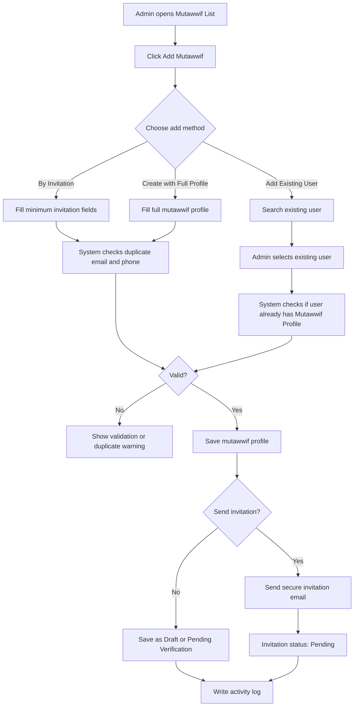

### Source Option Rules

| Source | Behavior |
|---|---|
| Create New User | Creates a new User Account and Mutawwif Profile |
| Add Existing User | Links existing User Account to a Mutawwif Profile |

Rules:

1. Existing user search requires User Lookup permission.
2. If email already exists, system should suggest Add Existing User instead of creating duplicate user.
3. If existing user already has Mutawwif Profile, system should open existing profile or block duplicate creation.
4. User can only be assigned to group trips after mutawwif status and verification rules are satisfied.
5. Mutawwif Profile may be created before user activates account, but assignment should require verified status unless explicitly overridden by Super Admin.

---

## 10. Add Mutawwif Form Fields

### 10.1 Add Method Selection

| Field | Type | Required | Notes |
|---|---|---:|---|
| Add Method | Dropdown or segmented control | Yes | By Invitation, Create with Full Profile, Add Existing User |

### 10.2 By Invitation Fields

| Field | Type | Required | Validation | Notes |
|---|---|---:|---|---|
| Full Name | Text input | Yes | Max 120 characters | Mutawwif name |
| Email | Email input | Yes | Valid email, unique unless linking existing user | Used for invitation |
| Country Code | Phone country selector | Yes | Valid country code | Default by admin locale |
| Phone Number | Phone input | Yes | Valid phone format | Main contact number |
| Job Type | Select | Recommended | Master Data job type | Full Time, Part Time, Freelance, Seasonal, Volunteer, On-Demand |
| Country | Select | Recommended | Master Data country | Operating country/location |
| Gender | Select | Optional | Male or Female | Useful for group assignment matching |
| Travel Agency | Select | Conditional | Required if agency-managed mutawwif | Scoped by permission |
| Send Invitation | Toggle | Yes | Default enabled | Sends activation email |
| Invitation Language | Select | Optional | Default system language | Bahasa Indonesia, English, Malay, Arabic if supported |

Minimum MVP fields from screenshot:

1. Full Name.
2. Email.
3. Phone Number.
4. Job Type.
5. Country.
6. Gender.
7. Send Invitation.

### 10.3 Create With Full Profile Fields

| Field | Type | Required | Validation | Notes |
|---|---|---:|---|---|
| Profile Photo | File upload | Optional | See upload policy | Useful for identification |
| Full Name | Text input | Yes | Max 120 characters | Legal/display name |
| Email | Email input | Yes | Valid email | User Account dependency |
| Country Code | Phone country selector | Yes | Valid country code | Phone country code |
| Phone Number | Phone input | Yes | Valid phone format | Main contact |
| Gender | Select | Recommended | Male or Female | Useful for assignment |
| Date of Birth | Date picker | Optional | Cannot be future date | Sensitive personal data |
| Nationality | Select | Optional | Master Data country | Travel/service context |
| Country | Select | Recommended | Master Data country | Operating country |
| City / Location | Select/Text | Optional | Master Data if available | Operating base |
| Job Type | Select | Yes | Master Data job type | Full Time, Part Time, Freelance, Seasonal, Volunteer, On-Demand |
| Specialization | Multi-select | Recommended | Master Data | Umrah, Hajj, Ziarah, Manasik, Elderly Support, Family Group |
| Languages | Multi-select | Recommended | Master Data languages | Malay, Indonesian, English, Arabic, Other |
| Experience Years | Number input | Optional | 0 or higher | Guide experience |
| Total Trips Handled | Number input | Optional | 0 or higher | Can also be system calculated |
| Biography / About | Long text | Optional | Max length by policy | Public/internal profile summary |
| Travel Agency | Select | Conditional | Required if agency-managed | Owning/managing agency |
| Availability Status | Select | Yes | Available, Unavailable, On Leave | Default Available for verified profile |
| Verification Status | Select | Yes | Draft, Pending Verification, Verified, Need Revision, Rejected | Default Draft/Pending |
| Send Invitation | Toggle | Yes | Default enabled | Invite user to activate account |

### 10.4 Add Existing User Fields

| Field | Type | Required | Validation | Notes |
|---|---|---:|---|---|
| Search Existing User | Search input | Yes | Search by name, email, phone | Requires User Lookup permission |
| Selected User | User selector | Yes | Must select one user | Shows name, email, phone, current roles |
| Add as Mutawwif Role | Toggle | Conditional | Required if user does not have Mutawwif role/profile | Creates/links mutawwif access |
| Job Type | Select | Yes | Master Data job type | Required for profile |
| Country / Location | Select/Text | Recommended | Master Data if available | Operating base |
| Travel Agency | Select | Conditional | Required if agency-managed | Scoped by permission |
| Send Notification | Toggle | Yes | Default enabled | Notifies user of mutawwif role/profile |

Existing user matching logic:

1. Exact email match.
2. Exact phone match with country code.
3. Identity/passport number match if identity data is available and permission allows.
4. Name match should only show as warning, not duplicate blocker.

---

## 11. Email Invitation

### Purpose

Email invitation allows Admin to invite a mutawwif to activate their account and complete their profile.

### Recommended Security Rule

The invitation email must not include a temporary password. The email should include a secure activation link where the mutawwif creates their own password.

### Invitation Email Content

| Element | Requirement |
|---|---|
| Logo | UmrahHaji.com logo |
| Subject | You are invited to join UmrahHaji.com as a Mutawwif |
| Greeting | Personal greeting using mutawwif name |
| Body | Explain that admin has invited them to complete registration |
| CTA | Accept Invitation |
| Expiry Notice | Show invitation expiry period |
| Support Email | support@umrahhaji.com or configured support contact |
| Footer | UmrahHaji.com Team |

Suggested email copy:

```text
Subject: You are invited to join UmrahHaji.com as a Mutawwif

Assalamu'alaikum [Mutawwif Name],

You have been invited to join UmrahHaji.com as a Mutawwif.

Please click the button below to complete your registration and activate your account.

[Accept Invitation]

This invitation link will expire in [X days].

If you need assistance, please contact [support email].

Wassalamu'alaikum,
UmrahHaji.com Team
```

### Invitation Flow

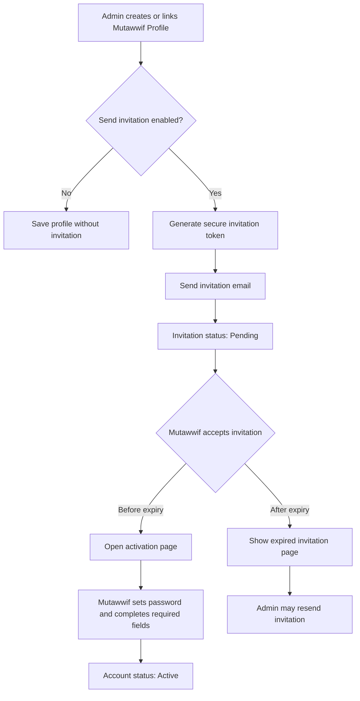

Invitation rules:

1. Invitation token should expire based on configurable setting.
2. Resending invitation invalidates previous pending token.
3. Invitation email must not expose internal admin data.
4. Invitation link should be single-use.
5. System should rate-limit resend action.
6. Accepted invitation cannot be resent unless account is reset by authorized admin.

---

## 12. Mutawwif Status & Verification

### Profile Status

| Status | Description |
|---|---|
| Draft | Profile created but not ready for verification |
| Invited | Invitation sent but not accepted |
| Active | Account/profile is active |
| Inactive | Profile cannot be assigned but remains visible |
| Suspended | Restricted due to operational/compliance reason |
| Archived | Hidden from active list, retained for history |

### Verification Status

| Status | Description |
|---|---|
| Not Submitted | Verification data not submitted |
| Pending Verification | Waiting for admin/compliance review |
| Need Revision | Mutawwif must update data/documents |
| Verified | Approved for assignment if other rules pass |
| Rejected | Verification rejected |

### Availability Status

| Status | Description |
|---|---|
| Available | Can be considered for assignment |
| Assigned | Assigned to active/upcoming group trip |
| Unavailable | Temporarily unavailable |
| On Leave | Not available for a date range |
| Conflict | Has schedule conflict for selected group trip |

### Verification Flow

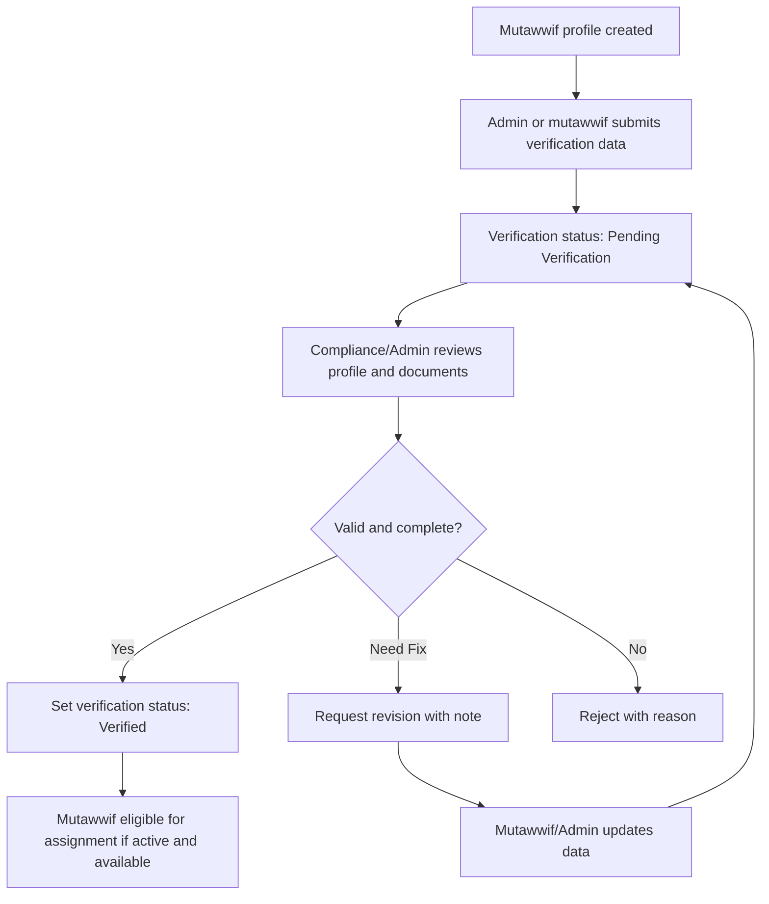

Assignment readiness rules:

1. Mutawwif must be Verified before assignment to group trip.
2. Mutawwif must be Active.
3. Mutawwif must be Available or explicitly assignable.
4. Schedule must not conflict with existing group trip assignment.
5. Required certifications/documents must be valid and not expired.
6. Super Admin override requires reason and audit log.

---

## 13. Mutawwif Details

Mutawwif Details provides a 360-degree view of a selected mutawwif profile.

Mutawwif Details may reuse the same base personal data structure as Jamaah Details for identity, contact, address, profile photo, and account-linked email. However, the additional data must be adapted for Mutawwif because mutawwif is a guide/service provider. Additional Info for Mutawwif should focus on experience, skills, languages, certifications, availability, and assignment readiness.

### Recommended Tabs

| Tab | Contains |
|---|---|
| Profile | Personal/contact info, address, profile photo, job type, country/location, bio |
| Documents | Identity/passport, authorization, profile photo, and supporting documents |
| Certifications | Mutawwif training, manasik, religious guidance, and related certificates |
| Professional Info | Experience, skills, specialization, languages, education, awards if relevant |
| Availability | Availability status, leave dates, schedule conflicts |
| Assigned Trips | Past, active, and upcoming group trips |
| Ratings & Reviews | Jamaah/travel agency feedback |
| Trip Reports | Mutawwif-submitted internal reports, TA coordination feedback, jamaah/group observations, and incidents |
| Payout Readiness | Assignment/service data required for future payout calculation |
| Activity Logs | Profile, verification, assignment, and access logs |

### Header

| Element | Description |
|---|---|
| Profile Photo | Avatar or placeholder |
| Full Name | Mutawwif display name |
| Job Type | Full Time, Part Time, etc. |
| Verification Status | Pending, Verified, Need Revision, Rejected |
| Availability Status | Available, Assigned, Unavailable, On Leave |
| Rating Summary | Average rating and total reviews |
| Edit Button | Visible only with update permission |

### Admin Edit Policy

| Section / Field Group | Admin Panel Behavior | Notes |
|---|---|---|
| Personal Information | View and edit with permission | Name, phone, gender, nationality |
| Email | Edit with account permission | Tied to User Account login |
| Identity Number | Masked by default, edit with sensitive permission | Requires confirmation and audit log |
| Profile Photo | Upload/change with permission | Upload policy applies |
| Job Type | View and edit with operational permission | Full time, part time, freelance, etc. |
| Languages | View and edit with permission | Used for assignment matching |
| Specialization | View and edit with permission | Used for assignment matching |
| Certifications | Upload/review/verify with compliance permission | Verification workflow applies |
| Availability | Edit with operations permission | Affects assignment readiness |
| Assigned Trips | View; assignment changes handled in Group Trip Management | Prevent cross-module conflict |
| Ratings & Reviews | View; moderation follows Review workflow | Do not allow normal edit of rating value |
| Trip Reports | View based on permission; created in Testimonial Management | Sensitive observations require restricted access |
| Payout Readiness | View assignment/service data only | Phase 1 does not execute payout |
| Bank/Payout Details | Out of scope for Phase 1 | Add in Phase 2 if semi-automated payout is introduced |

### Base Personal Data Sync With Jamaah/User Profile

The following fields should use the same data model and validation pattern as Jamaah Details where possible:

| Field Group | Owner / Source of Truth | Notes |
|---|---|---|
| Full Name | User Account / Mutawwif Profile | Should sync with user display name if account exists |
| Email | User Management | Login identity; account-level permission required to edit |
| Phone Number | User Account / Mutawwif Profile | Shared contact pattern with Jamaah |
| Profile Photo | Mutawwif Profile | Same upload policy as Jamaah profile photo |
| Gender | Mutawwif Profile | Used for assignment matching |
| Date of Birth | Mutawwif Profile | Sensitive personal data |
| Nationality / Identity Type | Mutawwif Profile | Same pattern as Jamaah identity data |
| Identity / Passport Number | Mutawwif Profile | Masked by default and requires sensitive permission |
| Address Details | Mutawwif Profile | Country, state/province, city, postal code, street address |
| Bank Details | Future Finance/Payout | Out of scope for Phase 1 |

Rules:

1. Email and password-related data must remain under User Management.
2. Identity and document fields must follow the same masking and sensitive permission rules as Jamaah Details.
3. Mutawwif-specific professional data must not overwrite general User Account data.
4. If the same user also has Jamaah Profile, operational data must remain separated by profile type.

### Base Profile Edit Flow

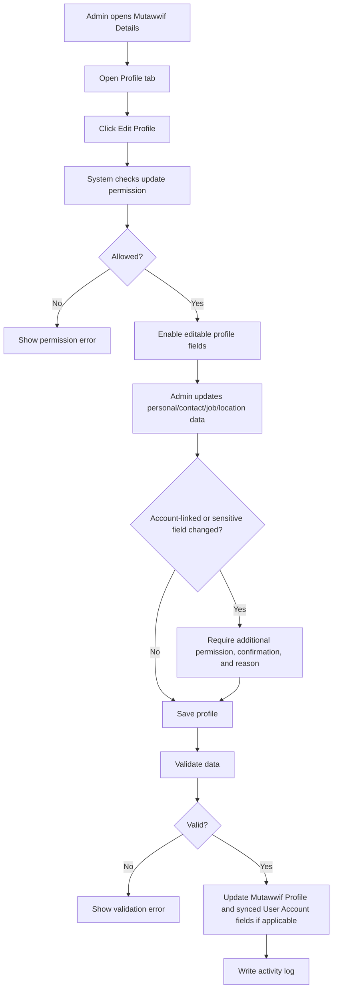

Base Profile form:

| Field | Type | Required | Validation | Notes |
|---|---|---:|---|---|
| Profile Photo | File upload | Optional | JPG, JPEG, PNG, WEBP, max 2 MB | Compress and resize to max 1024px |
| Full Name | Text input | Yes | Max 120 characters | Sync with User Account display name if linked |
| Email | Email input | Yes | Valid email; account permission required to edit | Login identity |
| Country Code | Phone country selector | Yes | Valid country code | Phone country code |
| Phone Number | Phone input | Yes | Valid phone format | Main contact |
| Gender | Select | Recommended | Male or Female | Used for assignment matching |
| Date of Birth | Date picker | Optional | Cannot be future date | Sensitive personal data |
| Nationality | Select | Optional | Master Data country | Useful for compliance |
| Identity Type | Select | Conditional | IC, Passport, National ID, Other | Required if identity number is entered |
| Identity / Passport Number | Text input | Conditional | Masked by default | Sensitive field |
| Job Type | Select | Yes | Master Data job type | Full Time, Part Time, Freelance, Seasonal, Volunteer, On-Demand |
| Operating Country | Select | Recommended | Master Data country | Operating country |
| Operating City / Region | Select/Text | Optional | Master Data if available | Makkah, Madinah, Jeddah, etc. if relevant |
| Bio / About | Long text | Optional | Max length by policy | Professional summary |

Address form:

| Field | Type | Required | Validation | Notes |
|---|---|---:|---|---|
| Country | Select | Optional | Master Data country | Address country |
| State / Province | Select/Text | Optional | Based on country | |
| City | Select/Text | Optional | Based on state/province | |
| Postal / ZIP Code | Text input | Optional | Max 20 characters | |
| Street Address | Long text | Optional | Max length by policy | |

Rules:

1. Email changes require account-level permission.
2. Identity number changes require sensitive data permission and reason.
3. Profile photo upload must follow upload policy.
4. Updating account-linked fields should not overwrite unrelated Jamaah Profile data if the same user also has Jamaah Profile.

### Mutawwif Additional Info Structure

Unlike Jamaah Additional Info, Mutawwif Additional Info should keep professional/service-provider data.

Recommended structure:

```text
Additional Info
- Work Experience
- Education
- Certifications
- Skills / Specializations
- Languages
- Awards & Achievements
- Supporting Documents
- Availability
- Internal Notes
```

Data assessment:

| Additional Data | Recommendation for Mutawwif Profile | Reason |
|---|---|---|
| Hobbies | Optional / Not MVP | Not needed for assignment readiness |
| Working Experience | Keep | Relevant to guide capability and trust |
| Education | Keep as optional | Useful if religious/Islamic studies or tourism-related |
| Certification | Keep | Core verification and quality signal |
| Awards & Achievement | Keep as optional | Useful for professional credibility, not required for MVP |
| Supporting Document | Keep but classify by document type | Should support verification, experience, or operational readiness |
| Skills / Talents | Keep as Specializations | Useful for matching group trip needs |
| Language | Keep | Important for jamaah support and communication |

Recommended MVP priority:

P0 fields:

1. Full Name.
2. Email.
3. Phone Number.
4. Job Type.
5. Gender.
6. Country / Location.
7. Languages.
8. Specialization.
9. Verification Status.
10. Availability Status.
11. Required identity/certification documents.

P1 fields:

1. Profile Photo.
2. Address Details.
3. Work Experience.
4. Education.
5. Awards & Achievements.
6. Supporting Documents.
7. About / Bio.

---

## 14. Certifications & Documents

### Document Types

| Document Type | Required | Notes |
|---|---:|---|
| Profile Photo | Optional | For identification |
| Identity / Passport Document | Conditional | Required if KYC/compliance policy applies |
| Mutawwif Training Certificate | Recommended | Relevant training or mutawwif course |
| Manasik / Religious Guidance Certificate | Optional | Useful for verification |
| Hajj / Umrah Experience Proof | Optional | Assignment/history evidence |
| Travel Agency Authorization Letter | Conditional | Required if managed by an agency and proof is needed |
| Background Check / Police Clearance | Future | If compliance requires |
| Supporting Document | Optional | Requires label and reason |

### Document Upload Policy

| Upload Type | Allowed Format | Max Size | Optimization Rule |
|---|---|---:|---|
| Profile Photo | JPG, JPEG, PNG, WEBP | 2 MB | Compress and resize to max 1024px on longest side |
| Identity / Passport Document | PDF, JPG, JPEG, PNG, WEBP | 5 MB | Sensitive file; restrict preview/download by permission |
| Certificate Document | PDF, JPG, JPEG, PNG, WEBP | 5 MB | Compress and generate preview thumbnail |
| Authorization Letter | PDF, JPG, JPEG, PNG, WEBP | 5 MB | Compress and generate preview thumbnail |
| Supporting Document | PDF, JPG, JPEG, PNG, WEBP | 5 MB per file | Require document label and reason |

Upload performance and storage rules:

1. Upload must be rejected if file size exceeds the allowed max size.
2. System should compress uploaded images before storage when possible.
3. System should generate thumbnails/previews instead of loading original files in list or card views.
4. Original file access should be restricted and loaded only when Admin opens preview/download.
5. Files should be stored in object storage or equivalent file storage, not directly inside the application server filesystem.
6. Server should validate MIME type and file extension to prevent unsafe uploads.
7. System should scan uploaded files for malware if scanning service is available.
8. Sensitive files such as identity/passport documents require permission-based preview/download.

### Add Document Flow

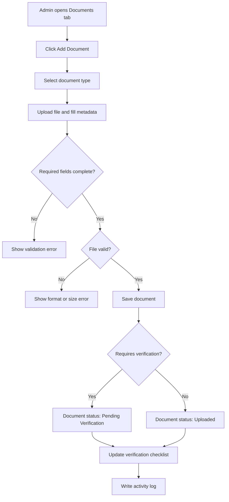

Document upload form:

| Field | Type | Required | Validation | Notes |
|---|---|---:|---|---|
| Document Type | Select | Yes | Must select one type | Identity, Passport, Authorization Letter, Experience Proof, Supporting Document |
| Document Label | Text input | Conditional | Required for Supporting Document | Short label for non-standard document |
| Document Number | Text input | Conditional | Required for identity/passport if applicable | Masked for sensitive document type |
| Issuer / Organization | Text input | Optional | Max 120 characters | Issuing body |
| Issue Date | Date picker | Optional | Cannot be future date | |
| Expiry Date | Date picker | Conditional | Required if document has validity period | Used for expiry warning |
| File Upload | File upload | Yes | Follow document upload policy | Stored as sensitive if identity-related |
| Reason / Purpose | Long text | Conditional | Required for Supporting Document | Explains why document is needed |
| Visible to Mutawwif | Toggle | Optional | Default based on document type | Whether mutawwif can view uploaded document |

### Add Certification Flow

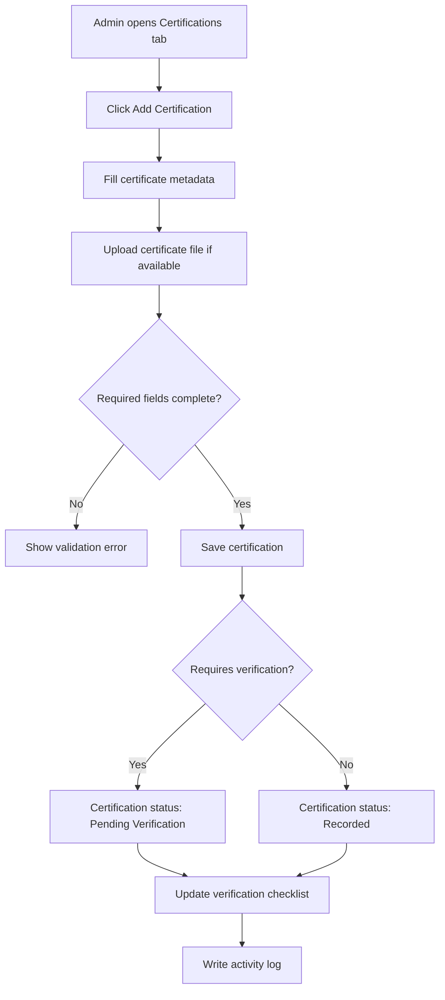

Certification form:

| Field | Type | Required | Validation | Notes |
|---|---|---:|---|---|
| Certificate Name | Text input | Yes | Max 120 characters | Mutawwif training, manasik, religious guidance, first aid, etc. |
| Certificate Type | Select | Yes | Master Data certificate type | Training, Religious Guidance, First Aid, Language, Other |
| Issuer / Institution | Text input | Yes | Max 120 characters | Training provider or institution |
| Certificate Number | Text input | Optional | Max 80 characters | If available |
| Issue Date | Date picker | Optional | Cannot be future date | |
| Expiry Date | Date picker | Optional | Must be after issue date | Required if certificate expires |
| Certificate File | File upload | Optional | PDF/JPG/JPEG/PNG/WEBP, max 5 MB | Compress and generate preview |
| Verification Status | Select/System | Yes | Recorded, Pending Verification, Verified, Rejected, Expired | Based on permission |
| Notes | Long text | Optional | Max length by policy | Internal/professional note |

### Document Verification Flow

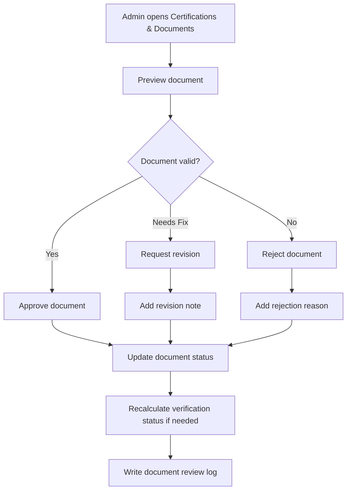

Document review fields:

| Field | Type | Required | Notes |
|---|---|---:|---|
| Document Decision | Select | Yes | Approve, Request Revision, Reject |
| Review Note | Long text | Conditional | Required for Request Revision or Reject |
| Expiry Date | Date picker | Conditional | Required if certificate/document has validity period |
| Internal Note | Long text | Optional | Internal compliance note |

---

## 15. Experience & Skills

Experience and skills are relevant for Mutawwif because they affect assignment suitability and service quality.

### Recommended Data

| Section | Field | Required | Notes |
|---|---|---:|---|
| Experience Summary | Experience Years | Optional | Number of years guiding |
| Experience Summary | Total Trips Handled | Optional/System | Can be calculated from assigned trip history |
| Experience Summary | Total Jamaah Handled | Optional/System | Can be calculated from group trip history |
| Work Experience | Organization | Optional | Travel agency, institution, or self-employed |
| Work Experience | Position / Role | Optional | Mutawwif, guide, lecturer, trainer |
| Work Experience | Start Date | Optional | Work history |
| Work Experience | End Date | Optional | Current if empty |
| Specialization | Specialization Tags | Recommended | Umrah, Hajj, Ziarah, Manasik, elderly support |
| Languages | Language | Recommended | Used for matching |
| Languages | Proficiency | Optional | Basic, conversational, fluent, native |
| Education | Institution | Optional | Islamic studies, tourism, hospitality, language, or relevant education |
| Education | Program / Major | Optional | Optional professional context |
| Certification | Certificate Name | Recommended | Mutawwif, manasik, religious guidance, first aid, language |
| Certification | Issuer | Recommended | Training provider or institution |
| Awards | Award Title | Optional | Professional credibility only |
| Supporting Document | Document Label | Optional | Must be categorized and justified |

### Add Experience Flow

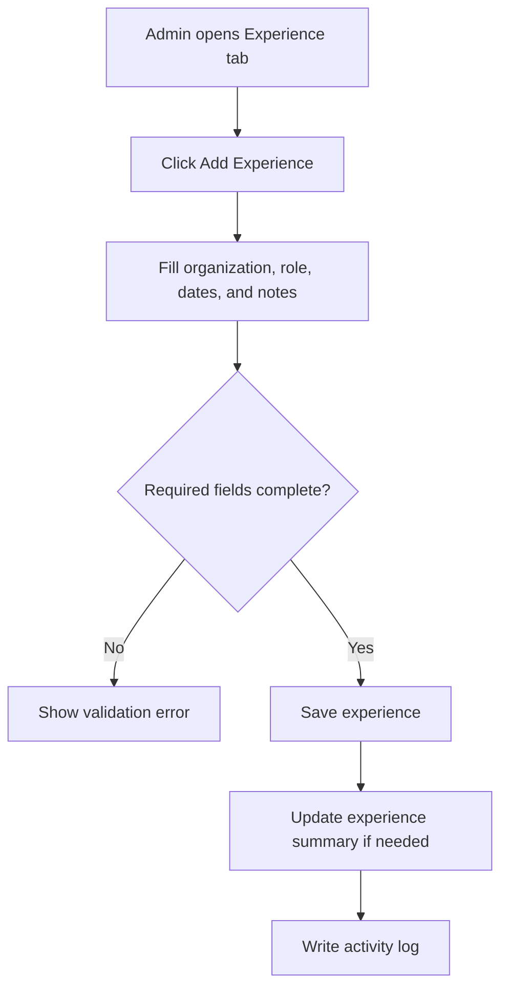

Experience form:

| Field | Type | Required | Validation | Notes |
|---|---|---:|---|---|
| Organization | Text input | Yes | Max 120 characters | Travel agency/institution |
| Role / Position | Text input | Yes | Max 120 characters | Mutawwif, guide, trainer, lecturer |
| Location | Text input | Optional | Max 120 characters | City/country |
| Employment Type | Select | Optional | Full Time, Part Time, Freelance, Volunteer | Optional |
| Start Date | Date picker | Optional | Cannot be future date | Experience start |
| End Date | Date picker | Optional | Must be after start date | Leave empty if current |
| Description | Long text | Optional | Max length by policy | Summary of responsibility |

### Add Skills / Specialization Flow

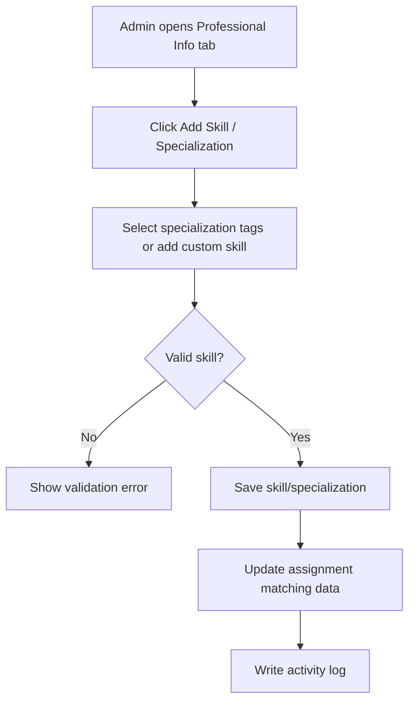

Skills / Specialization form:

| Field | Type | Required | Validation | Notes |
|---|---|---:|---|---|
| Skill / Specialization | Multi-select | Yes | Master Data or approved custom value | Umrah, Hajj, Ziarah, Manasik, Elderly Support, Family Group, Arabic-speaking |
| Proficiency Level | Select | Optional | Basic, Intermediate, Advanced, Expert | Useful for assignment |
| Notes | Long text | Optional | Max length by policy | Internal/professional note |

### Add Language Flow

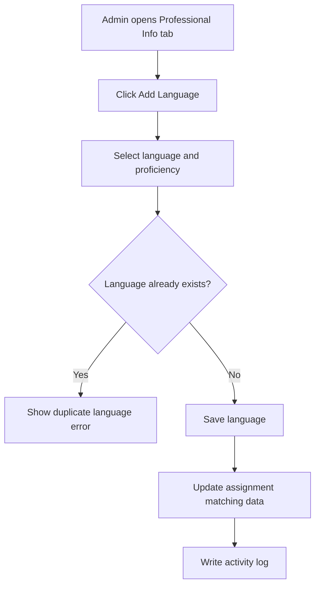

Language form:

| Field | Type | Required | Validation | Notes |
|---|---|---:|---|---|
| Language | Select | Yes | Master Data language | Malay, Indonesian, English, Arabic, Other |
| Speaking Proficiency | Select | Recommended | Basic, Conversational, Fluent, Native | Assignment matching |
| Reading Proficiency | Select | Optional | Basic, Conversational, Fluent, Native | Useful for religious guidance |
| Notes | Long text | Optional | Max length by policy | Optional context |

### Add Education Flow

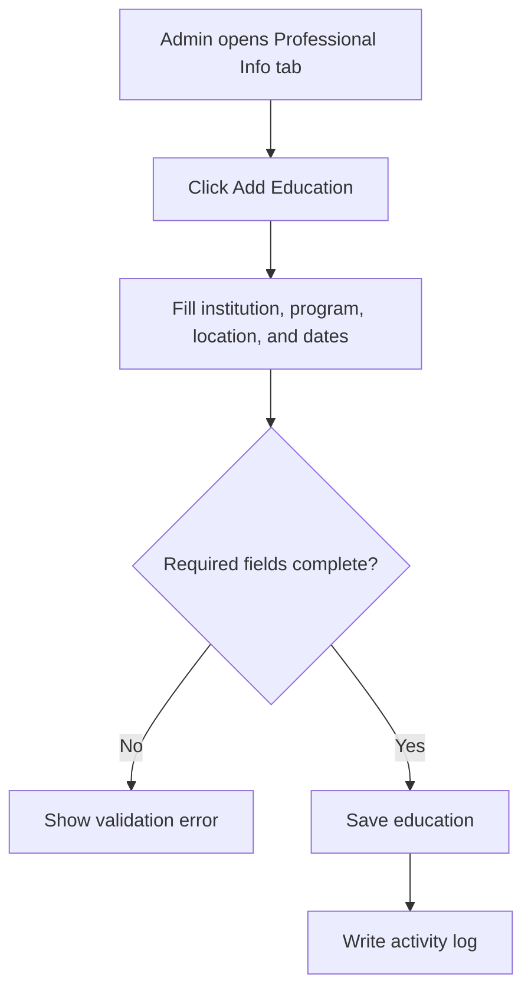

Education form:

| Field | Type | Required | Validation | Notes |
|---|---|---:|---|---|
| Institution | Text input | Yes | Max 120 characters | School/university/training institution |
| Program / Major | Text input | Optional | Max 120 characters | Islamic studies, tourism, language, etc. |
| Education Level | Select | Optional | Master Data education level | Certificate, Diploma, Bachelor, Master, etc. |
| Location | Text input | Optional | Max 120 characters | City/country |
| Start Date | Date picker | Optional | Cannot be future date | |
| End Date | Date picker | Optional | Must be after start date | |
| Description | Long text | Optional | Max length by policy | Optional |

### Add Award / Achievement Flow

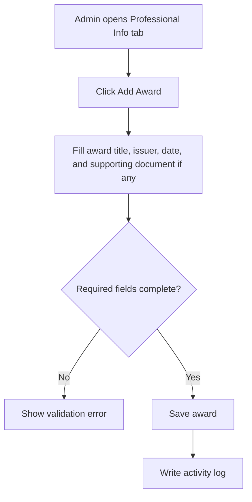

Award / Achievement form:

| Field | Type | Required | Validation | Notes |
|---|---|---:|---|---|
| Award Title | Text input | Yes | Max 120 characters | Award or achievement name |
| Issuer | Text input | Optional | Max 120 characters | Organization/institution |
| Issue Date | Date picker | Optional | Cannot be future date | |
| Description | Long text | Optional | Max length by policy | Optional |
| Supporting Document | File upload | Optional | Follow document upload policy | Certificate/proof if available |

Rules:

1. Working experience, education, awards, and supporting documents are relevant for Mutawwif but should not block account activation.
2. Certifications and required identity documents may affect verification status.
3. Languages and specializations should support assignment matching.
4. Supporting documents must have document label and category.
5. Admin should avoid storing unrelated portfolio documents unless they support verification or professional credibility.

---

## 16. Availability & Assignment Readiness

### Availability Flow

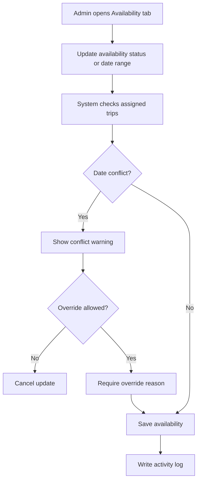

Availability form:

| Field | Type | Required | Validation | Notes |
|---|---|---:|---|---|
| Availability Status | Select | Yes | Available, Unavailable, On Leave | Assignment readiness |
| Start Date | Date picker | Conditional | Required for On Leave/Unavailable date range | |
| End Date | Date picker | Conditional | Must be after start date | |
| Reason | Long text | Conditional | Required for Unavailable/On Leave | Internal/operational reason |
| Override Conflict | Toggle | Conditional | Super Admin only | Requires reason |

Rules:

1. Mutawwif cannot be assigned to overlapping group trips.
2. Verified + Active + Available is required for normal assignment.
3. On Leave should block assignment during leave date range.
4. Conflict override requires permission and audit log.

### Internal Notes Flow

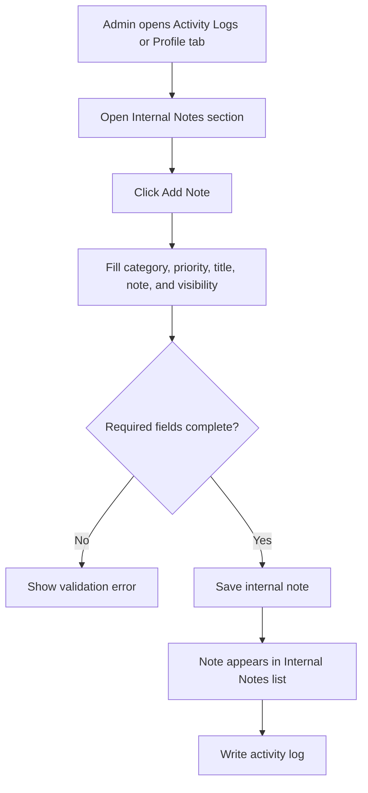

Internal Notes form:

| Field | Type | Required | Validation | Notes |
|---|---|---:|---|---|
| Category | Select | Yes | Must select one category | Operations, Verification, Assignment, Performance, Support, Other |
| Priority | Select | Yes | Low, Normal, High, Urgent | Follow-up priority |
| Title | Text input | Yes | Max 120 characters | Short summary |
| Note | Long text | Yes | Max length by policy | Internal-only content |
| Visibility | Select | Yes | Internal Only, Restricted Admins | Never visible to mutawwif |
| Follow-up Date | Date picker | Optional | Future date | Optional reminder context |

Rules:

1. Internal notes are never visible to Mutawwif users.
2. Restricted notes are visible only to authorized internal roles.
3. Performance or compliance notes may require restricted visibility.

---

## 17. Assigned Trips

Assigned Trips shows active, upcoming, and historical group trips linked to the mutawwif.

### Table Columns

| Column | Description |
|---|---|
| Group Trip | Group trip name |
| Travel Agency | Managing travel agency |
| Package | Related package |
| Departure Date | Departure date |
| Return Date | Return date |
| Total Jamaah | Number of assigned jamaah |
| Role in Trip | Lead Mutawwif, Assistant Mutawwif, Ziarah Guide, Support |
| Status | Draft, Active, Departed, Completed, Cancelled |
| Rating | Trip-specific mutawwif rating if available |
| Trip Report | Submitted, Not Submitted, Incident Reported |
| Actions | View group trip |

Assignment changes should be performed in Group Trip Management to preserve group trip workflow and capacity/status rules.

---

## 18. Payout Readiness

Phase 1 is payout-ready, not payout-execution. The system does not calculate, approve, or transfer mutawwif payout in Phase 1, but it must store the assignment and service data needed to support manual finance processing and future semi-automated payout.

### Phase 1 Payout-Ready Data

| Data | Source | Notes |
|---|---|---|
| Mutawwif ID | Mutawwif Profile | Unique mutawwif reference |
| Job Type | Mutawwif Profile | Full Time, Part Time, Freelance, Seasonal, Volunteer, On-Demand |
| Travel Agency Ownership | Mutawwif Profile / Travel Agency | Independent or agency-managed |
| Group Trip ID | Group Trip Assignment | Related trip |
| Role in Trip | Group Trip Assignment | Lead Mutawwif, Assistant Mutawwif, Ziarah Guide, Support |
| Assignment Date | Group Trip Assignment | Date assigned to trip |
| Departure Date | Group Trip | Trip departure |
| Return Date | Group Trip | Trip return |
| Trip Status | Group Trip | Draft, Active, Departed, Completed, Cancelled |
| Completion Status | Group Trip / Operations | Completed, Cancelled, No Show, Replaced |
| Total Jamaah Handled | Group Trip | Number of jamaah assigned to the trip/group |
| Rating / Review | Reviews | Service performance signal |
| Internal Notes | Admin / Operations | Context for future payout review |

### Phase 1 Rules

1. Mutawwif payout execution is not available in Phase 1.
2. Phase 1 must not require bank details, payout request, payout approval, tax document, or transfer proof.
3. Finance may process payout manually outside the system using exported or reviewed assignment history.
4. The system must preserve assignment history even if mutawwif is deactivated or archived.
5. Completed group trips should lock key payout-ready fields or require permission and reason to edit.
6. Payout-ready data must be structured so Phase 2 can generate payout records without major data migration.

### Future Payout Roadmap

```text
Phase 1: Payout-ready data
- Track mutawwif assignment and service history
- Finance can process payout manually outside the system

Phase 2: Semi-automated payout
- System generates payout records after trip completion
- Finance reviews and approves amount
- Finance performs manual transfer outside system
- Admin uploads payment proof and marks payout as Paid

Phase 3: Automated payout
- System calculates payout
- Finance approves
- Payment gateway or bank API sends payout
- Gateway/bank status updates payout automatically
```

### Phase 2 Semi-Automated Payout Flow

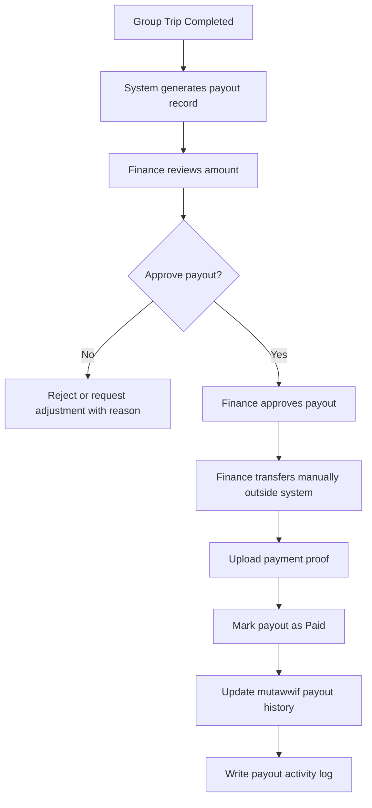

Phase 2 payout fields may include:

| Field | Type | Required | Notes |
|---|---|---:|---|
| Payout Record ID | System | Yes | Generated by system |
| Mutawwif | Reference | Yes | Linked mutawwif |
| Group Trip | Reference | Yes | Source trip |
| Role in Trip | Select/System | Yes | From assignment |
| Base Amount | Currency | Yes | Manual or rule-based |
| Adjustment Amount | Currency | Optional | Bonus/deduction |
| Final Amount | Currency | Yes | Calculated |
| Payout Status | Select | Yes | Draft, Pending Review, Approved, Paid, Rejected |
| Payment Proof | File upload | Conditional | Required when marked Paid |
| Finance Note | Long text | Optional | Internal note |

---

## 19. Trip Reports

Trip Reports show internal feedback submitted by the Mutawwif for assigned group trips. This is different from Jamaah ratings and reviews.

### Trip Report Types

| Type | Purpose |
|---|---|
| Daily Note | Optional operational note during trip |
| End Trip Report | Recommended report after trip completion |
| Incident Report | Mandatory when safety, medical, conflict, document, or serious operational issue occurs |

### Columns

| Column | Description |
|---|---|
| Group Trip | Related group trip |
| Travel Agency | Managing travel agency |
| Report Type | Daily Note, End Trip Report, Incident Report |
| TA Coordination Score | Internal Travel Agency coordination score |
| Jamaah / Group Readiness | Internal readiness or assistance signal |
| Incident | Yes/No |
| Visibility | Admin Only, Admin + Travel Agency, Admin + Support |
| Submitted Date | Report submission date |
| Actions | View report |

Rules:

1. Trip Reports are created and moderated in Testimonial Management.
2. Mutawwif Management displays report references and summaries only.
3. Jamaah/group observations are sensitive internal data and require permission.
4. Incident reports may be escalated to Report Management.
5. Trip Reports should not automatically affect public mutawwif rating.

---

## 20. Ratings & Reviews

Ratings and reviews help Admin evaluate service quality.

### Columns

| Column | Description |
|---|---|
| Reviewer | Jamaah or travel agency reviewer |
| Group Trip | Related group trip |
| Rating | Star rating |
| Feedback | Written feedback |
| Date | Feedback date |
| Status | Published, Archived, Flagged |
| Actions | View, archive, restore |

### Review Moderation Flow

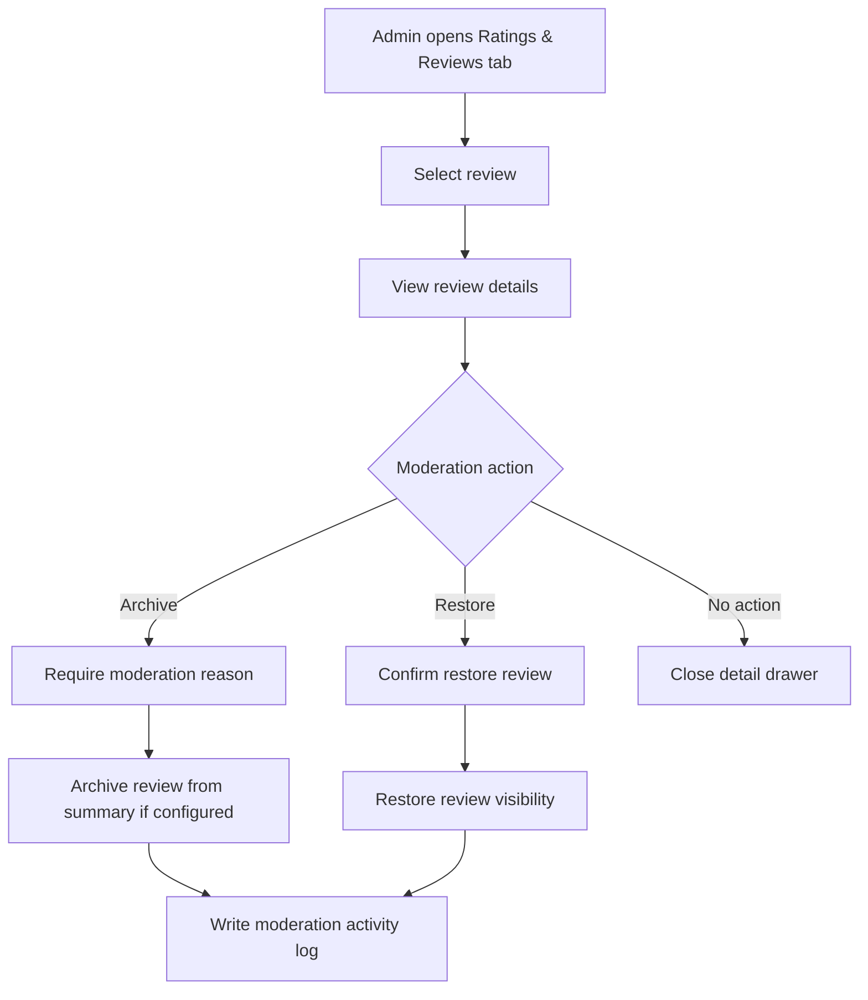

Review moderation form:

| Field | Type | Required | Notes |
|---|---|---:|---|
| Action | Select | Yes | Archive or Restore |
| Reason | Long text | Conditional | Required when archiving review |
| Internal Note | Long text | Optional | Visible only to authorized Admin |

Rules:

1. Admin should not edit rating values.
2. Review moderation should require Review Update permission.
3. Archived reviews should not affect public/summary display if business rule says so.
4. Review moderation must be logged.

---

## 21. Login As / Impersonation Policy

The screenshot shows `Impersonate` as a row action. This is useful for support but high risk.

Recommendation:

1. Do not expose Impersonate to normal Admin roles.
2. Rename to `Login As` or `View As` if needed.
3. Limit to Super Admin or authorized support role.
4. Require reason before starting session.
5. Use time-limited session.
6. Show visible banner while impersonating.
7. Block sensitive actions during impersonation if possible.
8. Log start time, end time, actor, target user, reason, IP address, and device.

---

## 22. Validation Rules

1. Full Name is required.
2. Email is required for invitation.
3. Phone Number is required for MVP based on current design.
4. Email must use valid format.
5. Phone number must use valid country code.
6. System must check duplicate email before creating new user.
7. System must check duplicate phone number and warn Admin.
8. Existing user cannot have duplicate Mutawwif Profile.
9. Job Type is required for Create with Full Profile.
10. Verification status cannot become Verified if required documents are missing or rejected.
11. Mutawwif cannot be assigned to group trip unless Verified, Active, and Available.
12. Mutawwif assignment must not conflict with existing assigned trip date range.
13. Sensitive identity, document, bank, and payout fields require additional permission.
14. Delete should be blocked if mutawwif has assigned trips, ratings, documents, or payment history; use Archive instead.
15. Invitation cannot be sent if email is missing or invalid.
16. Upload files must follow module upload policy.
17. Email changes require account-level permission because email is tied to User Account login.
18. Mutawwif Profile can reuse base personal data structure from Jamaah Details, but professional data must remain under Mutawwif Profile.
19. Languages and specializations should not contain duplicate entries.
20. Supporting documents must have a document label, category, and reason.
21. Identity/passport document metadata is required when uploading identity/passport document.
22. Certificate name, certificate type, and issuer are required when adding certification.
23. Internal notes require category, priority, title, note, and visibility.
24. Review archive action requires moderation reason.

---

## 23. Empty State

Examples:

```text
No mutawwif found.
No mutawwif matches your filters.
No pending invitations found.
No certifications have been uploaded yet.
No assigned trips found.
```

Empty state actions:

1. Add Mutawwif if Admin has create permission.
2. Clear filters if active filters cause no result.
3. Send invitation if mutawwif profile exists but account is not activated.

---

## 24. Error State

The system must show clear error messages when:

1. Mutawwif data fails to load.
2. Admin does not have permission.
3. Required form fields are missing.
4. Email already exists.
5. Existing user already has Mutawwif Profile.
6. Invitation email fails to send.
7. Invitation token is expired or invalid.
8. Document upload format or size is invalid.
9. Verification cannot be completed due to missing documents.
10. Assignment readiness cannot be set because required verification is incomplete.
11. Availability date conflicts with assigned trip.
12. Archive is blocked due to active assignment.

Example messages:

```text
This email is already registered. You can add the existing user as Mutawwif instead.
```

```text
Mutawwif cannot be assigned because verification is not complete.
```

---

## 25. Responsive Behavior

### Desktop Web

1. Use full table layout.
2. Search and Add Mutawwif button appear in the page header.
3. Filters appear above table.
4. Pagination appears below table.
5. Wide table may use horizontal scroll.
6. Details page may use tab layout.

### Tablet Web

1. Use condensed table.
2. Hide non-critical columns by default.
3. Filters can wrap to multiple rows.
4. Add Mutawwif modal should fit viewport with sticky footer actions.

### Mobile Web

1. Use card list or horizontally scrollable table.
2. Filters should open in bottom sheet or collapsible panel.
3. Search should remain easy to access at top.
4. Add Mutawwif should open as full-screen modal or page.
5. Row actions should use bottom sheet menu.
6. Document preview should open in full-screen mode.

---

## 26. Activity Logs

The system must log critical actions:

1. Create new mutawwif.
2. Add existing user as mutawwif.
3. Send invitation.
4. Resend invitation.
5. Accept invitation.
6. Edit mutawwif profile.
7. Change email or phone number.
8. Upload, replace, or delete profile photo.
9. Upload, replace, or delete identity document.
10. Upload, replace, or delete certification.
11. Approve, reject, or request revision for document.
12. Change verification status.
13. Change profile status.
14. Change availability.
15. Add or edit experience.
16. Add or edit language/specialization.
17. Assign or remove travel agency link.
18. Archive or reactivate mutawwif.
19. View sensitive data.
20. Export mutawwif data.
21. Start/end Login As or View As session.
22. Moderate review.
23. Update payout-ready assignment/service data.
24. Edit completed trip assignment data with reason.
25. Add or edit education.
26. Add or edit award/achievement.
27. Add or edit supporting document metadata.
28. Add or edit skills/specializations.
29. Sync account-linked personal data with User Management.
30. Add or edit base profile and address details.
31. Add or edit certification metadata.
32. Add or edit internal notes.
33. Archive or restore review.

Each log must include actor, role, action, previous value, new value, timestamp, IP address, device, and module context.

---

## 27. Acceptance Criteria

1. Admin can view Mutawwif List based on permission and data scope.
2. Admin can search mutawwif by name, email, phone number, certification, language, specialization, and travel agency.
3. Admin can filter mutawwif by status, verification status, job type, availability, country, gender, language, specialization, travel agency, and date created.
4. Admin can add mutawwif by invitation.
5. Admin can create mutawwif with full profile data.
6. Admin can add mutawwif from an existing registered user.
7. System detects duplicate email and suggests adding existing user instead.
8. System prevents duplicate Mutawwif Profile for the same user.
9. Invitation email uses secure activation link and does not include temporary password.
10. Admin can resend invitation if invitation is pending or expired.
11. Mutawwif verification supports Pending Verification, Need Revision, Verified, and Rejected.
12. Admin can upload and review certification/documents based on permission.
13. Upload fields define format, max size, compression, preview, and storage rules.
14. Mutawwif must be Verified, Active, and Available before normal group trip assignment.
15. System prevents assignment date conflicts.
16. Admin can view assigned trips, ratings, and reviews.
17. Admin cannot hard delete mutawwif with assigned trips, reviews, documents, or payment history.
18. Sensitive identity, document, bank, and payout data require additional permission.
19. Login As / View As is restricted to authorized roles, requires reason, and is fully logged.
20. All critical actions are recorded in activity logs.
21. Mutawwif Management works on desktop, tablet, and mobile web.
22. Phase 1 captures payout-ready data including assignment history, role in trip, trip completion status, total jamaah handled, ratings/reviews, and internal notes.
23. Phase 1 does not require bank details, payout request, payout approval, tax document, transfer proof, or payout execution.
24. Completed group trips preserve payout-ready data and require permission plus reason for key edits.
25. Payout-ready data structure can support Phase 2 semi-automated payout without major data migration.
26. Mutawwif Details uses the same base personal data pattern as Jamaah Details for identity, contact, address, profile photo, and account-linked email.
27. Mutawwif Additional Info keeps professional data such as working experience, education, certifications, skills/specializations, languages, awards, and supporting documents.
28. User Account fields such as email, password, account status, and portal access remain managed by User Management.
29. If the same user also has Jamaah Profile, Jamaah operational data and Mutawwif professional data remain separated by profile type.
30. Languages and specializations can be used for assignment matching.
31. Admin can edit base profile and address fields based on permission.
32. Admin can upload identity, authorization, certificate, and supporting documents with required metadata.
33. Admin can add certifications with certificate name, type, issuer, optional expiry date, and file.
34. Admin can add internal notes that are never visible to Mutawwif users.
35. Admin can archive or restore reviews with moderation reason when required.

---

## 28. Open Questions

1. Can mutawwif be independent, travel agency-managed, or both?
2. Should Travel Agency Admin be allowed to create mutawwif directly?
3. What documents are mandatory for mutawwif verification in MVP?
4. Should mutawwif portal access be enabled in Phase 1, or only prepare User Account linkage?
5. What payout model should Phase 2 use: fixed honorarium, role-based amount, per-jamaah amount, per-trip amount, or custom adjustment?
6. Should `Login As / View As` be included in MVP or restricted to support tooling later?
7. Should ratings be visible to Travel Agency users or only internal Admin?
8. Should mutawwif assignment be allowed before verification with Super Admin override?
9. Should certifications expire and trigger automatic warning?
10. Should matching by language/specialization be manual in MVP or automated later?

---

## 29. Future Enhancements

1. Mutawwif self-service portal.
2. Automated mutawwif matching for group trips.
3. Availability calendar.
4. Certification expiry reminders.
5. Background check workflow.
6. WhatsApp invitation.
7. Mutawwif mobile app.
8. Location/SOS support during trip.
9. Performance dashboard.
10. Advanced review analytics.
11. Commission/payout integration.
12. AI-assisted assignment recommendation.
