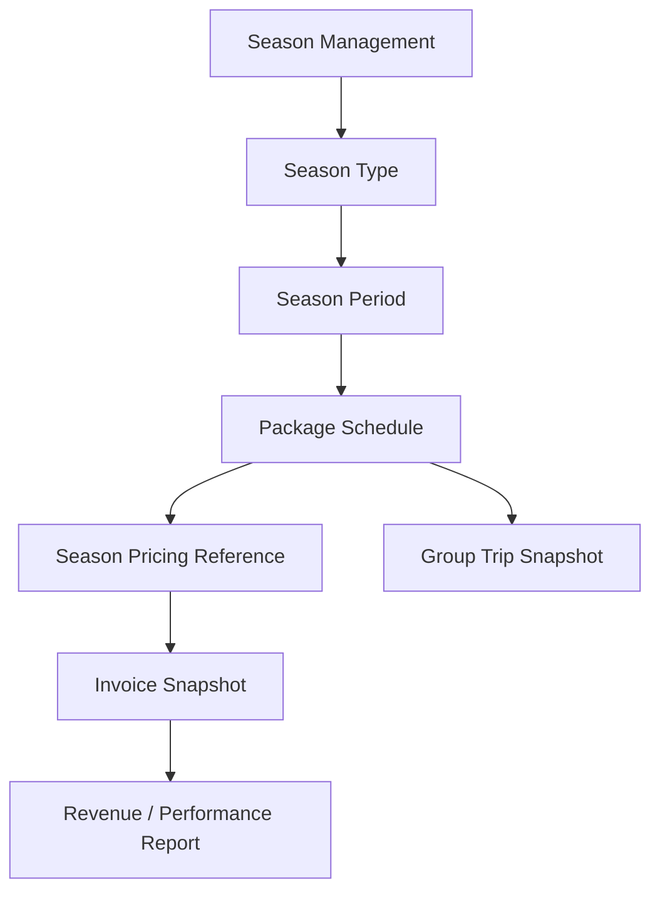
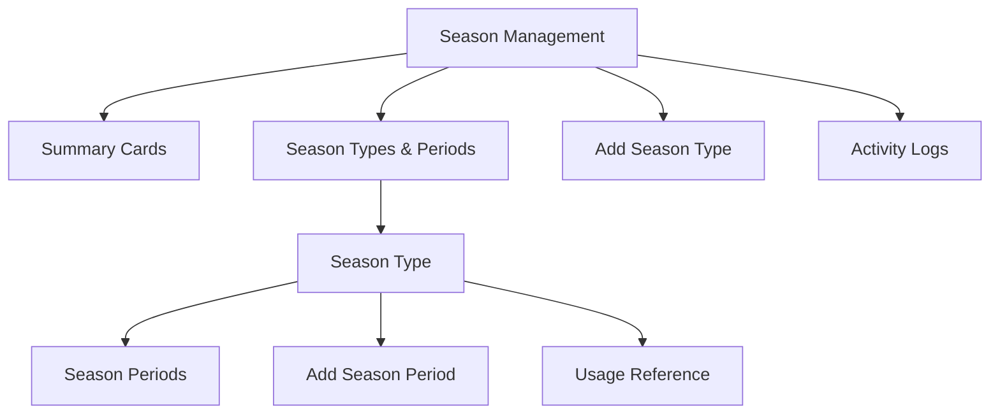
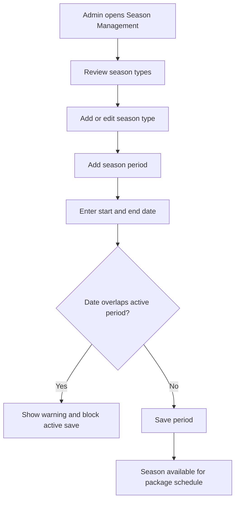
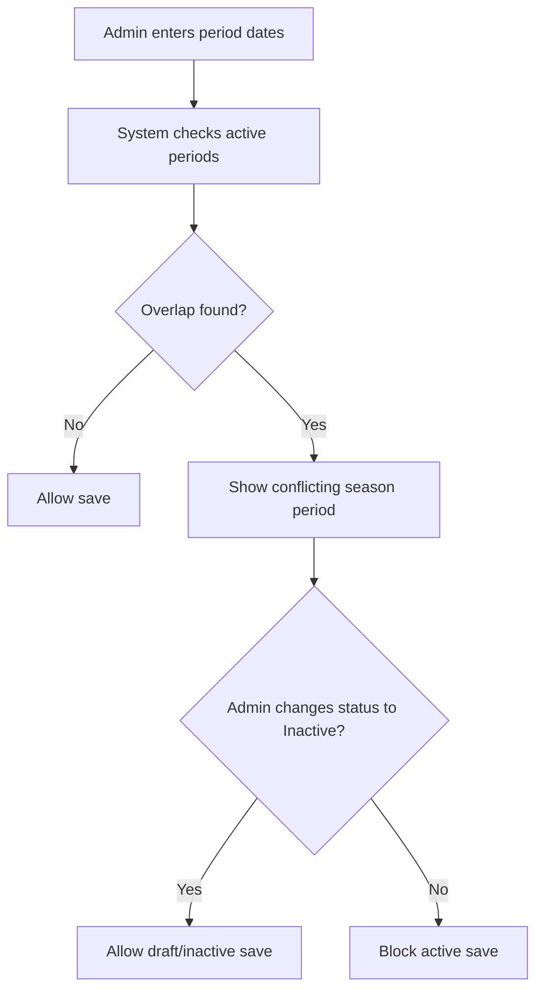

# Module PRD - Season Management

## 1. Document Information

| Item | Description |
| --- | --- |
| Product | UmrahHaji.com Admin Panel |
| Module | Season Management |
| Document Type | Module Product Requirements Document |
| Version | v1.0 |
| Status | Draft |
| Prepared By | Product / UI/UX Team |
| Last Updated | 4 June 2026 |

---

## 2. Module Overview

Season Management allows Admin to define reusable season types and date periods used by Package Management, Group Trip Management, and pricing workflows.

In Phase 1, Season Management works as a master data module. It helps Admin and Travel Agency keep package schedules, seasonal labels, and season-based pricing references consistent across the platform.

Season Management does not automatically change package prices in Phase 1. Package pricing remains configured in Package Management, while Season Management provides the calendar reference and validation.

---

## 3. Objective

1. Allow Admin to create and manage season types such as Low Season, Medium Season, and High / Peak Season.
2. Allow Admin to define active date periods for each season type.
3. Prevent overlapping active season periods that can create pricing or schedule ambiguity.
4. Provide a reusable season calendar for package schedules.
5. Allow Package Management to resolve season automatically based on departure date.
6. Allow Group Trip and Billing to store season snapshots for historical accuracy.
7. Support audit logs, permission-based access, and responsive web behavior.

---

## 4. Scope

### In Scope

1. Season Management list page.
2. Season type creation and editing.
3. Season period creation and editing.
4. Season status management.
5. Period overlap validation.
6. Usage count and usage reference.
7. Season lookup for Package Management.
8. Season snapshot for Group Trip and Billing references.
9. Activity logs.
10. Responsive web behavior.

### Out of Scope

1. Automatic dynamic pricing engine.
2. Real-time hotel/flight price synchronization.
3. External calendar provider integration.
4. AI-based season recommendation.
5. Travel Agency-created private season calendar in Phase 1.
6. Native Android or iOS app behavior.

### Portal & Design System Principle

Admin Panel and Travel Agency Portal will use the same design system to maintain visual consistency, component reuse, and development efficiency. However, each portal will have a separate navigation structure, permission model, user workflow, and data scope based on the role and operational needs of its users.

---

## 5. Product Positioning

Season Management is a supporting master module, not a booking or finance module.

The module should answer these operational questions:

1. Which season type applies to a package departure date?
2. Which periods are considered Low, Medium, or High / Peak season?
3. Which Travel Agencies or packages are using a season period?
4. Can a season period be safely edited, archived, or disabled?
5. Will a date change create pricing or schedule ambiguity?

---

## 6. Relationship With Other Modules

```text
Season Management
├── Package Management
│   ├── Trip schedule season resolution
│   ├── Season-specific pricing reference
│   └── Promotional label reference
├── Group Trip Management
│   └── Season snapshot from selected package schedule
├── Billing & Payment Management
│   └── Invoice pricing snapshot and reporting dimension
└── Reports / Analytics
    └── Season-based package and revenue analysis
```

### Relationship Diagram



### Integration Table

| Module | Relationship |
| --- | --- |
| Package Management | Package schedules can select or auto-resolve season based on departure date |
| Group Trip Management | Group trip stores selected season type and period snapshot |
| Billing & Payment Management | Invoice stores package price and season snapshot for audit/reporting |
| Travel Agency Portal | Travel Agency can use active seasons when creating packages |
| Reports | Season can be used as a reporting dimension for packages, bookings, trips, and revenue |
| Settings / Master Data | Season may use country, city, package category, and package type master data |

---

## 7. User Roles & Permissions

| Role | Access |
| --- | --- |
| Super Admin | Full access to create, edit, archive, and manage season usage |
| Admin | View and manage seasons if granted permission |
| Operations Staff | View active seasons and usage references |
| Finance Admin | View season references for price and revenue analysis |
| Travel Agency Admin | View active platform seasons in Travel Agency Portal; cannot create global seasons in Phase 1 |
| Auditor / View Only | Read-only access to season configuration and activity logs |

### Permission Rules

1. Only Super Admin or authorized Admin can create season type.
2. Only Super Admin or authorized Admin can create or edit season period.
3. Finance Admin can view season references but cannot modify season configuration by default.
4. Travel Agency users can consume active season references but cannot modify platform season master data in Phase 1.
5. Editing season periods used by published packages requires elevated permission and confirmation.
6. Deleting used season records is not allowed; archive or deactivate instead.

---

## 8. Navigation & Entry Point

```text
Admin Panel
└── Season Management
    ├── Season Types & Periods
    ├── Add Season Type
    ├── Add Season Period
    └── Usage Reference
```

### Related Entry Points

1. Package Management -> Schedule & Season section.
2. Package Management -> Room Configuration & Pricing.
3. Group Trip Details -> Package and schedule summary.
4. Billing & Payment -> Invoice and reporting filters.
5. Reports -> Season performance analysis.
6. Settings -> Master Data, if season category settings are centralized later.

---

## 9. Information Architecture

```text
Season Management
├── Summary Cards
├── Season Types & Periods
│   ├── Season Type Row
│   └── Season Period Table
├── Add / Edit Season Type Modal
├── Add / Edit Season Period Modal
├── Usage Reference
└── Activity Logs
```

### Module IA Diagram



---

## 10. Main User Flow

```text
Admin opens Season Management
↓
Admin reviews season types and active periods
↓
Admin creates or edits season type
↓
Admin adds date periods under the season type
↓
System validates date range and overlap
↓
System saves active period
↓
Package Management can use the season for package schedules
```

### Main Flow Diagram



---

## 11. Season List Requirements

### Page Purpose

Season Management list allows Admin to view, search, filter, and manage season types and periods from one operational workspace.

### Summary Cards

| Card | Description |
| --- | --- |
| Total Season Types | Number of season type records |
| Active Seasons | Number of active season types |
| Total Periods | Number of configured season periods |
| Travel Agencies Using | Number of Travel Agencies using seasons in packages |

### Season Type Row

| Field | Description |
| --- | --- |
| Season Type Name | Low Season, Medium Season, High / Peak Season, Custom |
| Status | Active or Inactive |
| Period Count | Number of configured periods |
| Created Date | Season type creation date |
| Usage Count | Packages or Travel Agencies using this season |
| Actions | Add Period, Edit, Archive, View Usage |

### Season Period Table

| Column | Description |
| --- | --- |
| Period Name | Name of the season period |
| Start Date | Period start date |
| End Date | Period end date |
| Duration | Auto-calculated days |
| Status | Active, Inactive, Archived |
| Last Updated | Last modification date |
| Actions | Edit, Deactivate, Archive |

### Search

Admin can search by:

1. Season type name.
2. Period name.
3. Travel Agency name using the season.
4. Package name using the season.

### Filters

| Filter | Options |
| --- | --- |
| Status | Active, Inactive, Archived |
| Season Type | Low, Medium, High / Peak, Custom |
| Date Range | All Time, Today, This Week, This Month, This Year, Custom Range |
| Usage | Used, Not Used |
| Package Category | Umrah, Haji, Custom if available |

### Sorting

1. Newest.
2. Oldest.
3. Season Type A-Z.
4. Start Date.
5. End Date.
6. Usage Count.

---

## 12. Add / Edit Season Type

### Purpose

Season Type defines the reusable category used by package schedules and pricing references.

### Form Fields

| Field | Type | Required | Validation | Notes |
| --- | --- | --- | --- | --- |
| Season Type Name | Text input | Yes | Max 80 characters; unique active name | Example: Low Season |
| Description | Textarea | Optional | Max 500 characters | Internal explanation |
| Display Label | Text input | Optional | Max 40 characters | Customer-visible label if used |
| Color Tag | Color/select | Optional | Design-system color token | Helps UI distinction |
| Sort Order | Number | Optional | 1-99 | Controls display order |
| Status | Radio/select | Yes | Active, Inactive | Default Active |

### Season Type Rules

1. Season Type Name must be unique among non-archived records.
2. Inactive season type cannot be selected for new package schedule.
3. Season type used by package schedule cannot be deleted.
4. Archive is allowed only if no active package schedule uses the season type.
5. Display label should be short enough for package cards and filters.

---

## 13. Add / Edit Season Period

### Purpose

Season Period defines the actual date range under a season type.

### Form Fields

| Field | Type | Required | Validation | Notes |
| --- | --- | --- | --- | --- |
| Season Type | Read-only/select | Yes | Active season type | Preselected when adding from type row |
| Period Name | Text input | Yes | Max 100 characters | Example: Low - Summer |
| Start Date | Date picker | Yes | Valid date | Start of period |
| End Date | Date picker | Yes | Same or after start date | End of period |
| Duration | Auto | Yes | Auto-calculated | Number of days |
| Package Category Scope | Multi-select | Optional | Umrah, Haji, All | Default All |
| Country / Market Scope | Select | Optional | Active country | Default platform market |
| Notes | Textarea | Optional | Max 500 characters | Internal note |
| Status | Radio/select | Yes | Active, Inactive | Default Active |

### Period Validation Rules

1. End Date must be equal to or after Start Date.
2. Active season periods must not overlap within the same market and package category scope.
3. If a date overlap exists, system must block Active status and show the conflicting period.
4. Inactive periods may overlap for draft planning, but they cannot be used by package schedules.
5. Period name should be unique within the same season type and year.
6. A used period cannot be deleted; archive or deactivate instead.
7. Editing date range of used period requires confirmation and does not update existing snapshots automatically.

### Overlap Handling



---

## 14. Season Resolution Logic

Season resolution determines which season applies to a package schedule.

### Resolution Method

| Scenario | System Behavior |
| --- | --- |
| Departure date matches one active season period | Apply that season type and period |
| Departure date does not match any period | Season is blank or Unclassified |
| Departure date matches multiple periods | Should not happen; system flags data conflict |
| Schedule spans multiple season periods | Use departure date as primary season, show cross-season warning |
| Season period is archived after package creation | Existing package/group trip keeps snapshot |

### Rules

1. Departure date is the default source for season resolution.
2. Return date is used only to show cross-season warning.
3. Package schedule stores season type ID and season period ID when resolved.
4. Group Trip stores season name and period snapshot when created.
5. Invoice stores season snapshot from package/booking to preserve historical pricing context.
6. Changing Season Management master data must not silently change published package prices.

---

## 15. Usage Reference

### Purpose

Usage Reference helps Admin understand which Travel Agencies, packages, schedules, group trips, or invoices are using a season type or period.

### Usage Table

| Column | Description |
| --- | --- |
| Usage Type | Package, Package Schedule, Group Trip, Invoice |
| Travel Agency | Agency using the season |
| Related Record | Package, schedule, group trip, or invoice name/number |
| Departure Date | Related departure date |
| Season Snapshot | Stored season label |
| Status | Current status of related record |
| Last Updated | Last change date |
| Actions | View related record |

### Rules

1. Used seasons cannot be hard-deleted.
2. Admin can still deactivate a used season for future use.
3. Existing package, group trip, and invoice snapshots must remain unchanged after season master edits.
4. Usage Reference should show warning if active package schedule references inactive or archived season.

---

## 16. Package Management Integration

### Package Schedule Behavior

1. Package schedule can select a season manually or auto-resolve from departure date.
2. Auto-resolved season should be editable only with permission.
3. Season-specific pricing can be configured in Package Management using season reference.
4. Season labels such as Low Season or High Season can be shown on package cards if enabled.
5. If schedule date changes, system should re-check season and show confirmation before replacing the old season reference.

### Package Pricing Behavior

1. Season Management does not calculate package price automatically in Phase 1.
2. Package Management may use season as a grouping for room pricing.
3. If the package has season-specific pricing, each enabled season/schedule should have a price mapping.
4. Existing bookings and invoices must keep their original price snapshot.

---

## 17. Group Trip Integration

1. Group Trip created from package schedule should inherit season type and period snapshot.
2. Manual Group Trip can resolve season from trip departure date.
3. Admin can view season in Group Trip details for operational and reporting context.
4. Group Trip season snapshot should not change automatically if Season Management is edited later.
5. If trip date changes, system should show a warning if season no longer matches.

---

## 18. Billing & Reporting Integration

1. Invoice generated from package/booking should store season snapshot.
2. Manual invoice may optionally select package schedule and season reference.
3. Payment reports can filter or group revenue by season.
4. Commission reports can optionally compare performance by season.
5. Customer-facing invoice does not need to show season unless configured.

---

## 19. Status Management

### Season Type Status

| Status | Meaning |
| --- | --- |
| Active | Can be used by new package schedules |
| Inactive | Hidden from new selection, existing references remain |
| Archived | Retained for history only |

### Season Period Status

| Status | Meaning |
| --- | --- |
| Active | Can be resolved and selected |
| Inactive | Stored but not selectable for new schedules |
| Archived | Historical reference only |

### Status Rules

1. Active season type can have active or inactive periods.
2. Inactive season type should disable all future selections under it.
3. Active period requires active season type.
4. Archived records remain visible in Usage Reference and Activity Logs.

---

## 20. Activity Log Requirements

System must record:

1. Season type created.
2. Season type updated.
3. Season type status changed.
4. Season period created.
5. Season period updated.
6. Season period status changed.
7. Overlap validation blocked save.
8. Season used by package schedule.
9. Season manually overridden in package schedule.
10. Used season archived or deactivated.

Activity log should include actor, timestamp, old value, new value, and affected related record if applicable.

---

## 21. Notification Rules

### Phase 1

1. In-app confirmation after season type or period is created.
2. Warning when active period overlaps existing active period.
3. Warning when editing season used by package schedule.
4. Warning when package schedule departure date no longer matches selected season.

### Future Phase

1. Notify Travel Agency when platform season calendar changes.
2. Notify package owner when active schedule has unresolved season.
3. Send weekly report for upcoming high/peak season departures.

---

## 22. Empty State

### No Season Type

```text
No season types have been added yet.
Create season types such as Low Season, Medium Season, or High / Peak Season to organize package schedules and pricing references.
```

Primary action:

```text
Add Season Type
```

### No Period Under Season Type

```text
No period has been added for this season type.
Add a date period so packages can use this season.
```

Primary action:

```text
Add Period
```

---

## 23. Error State

| Scenario | System Response |
| --- | --- |
| Date overlap detected | Show conflicting period and block active save |
| End date before start date | Show validation error |
| Duplicate season type name | Show uniqueness error |
| Delete used season | Block delete and suggest archive |
| Inactive season selected in package | Show warning and require new active season |
| Season conflict during schedule date update | Show confirm dialog and old/new season |

---

## 24. Responsive Web Behavior

### Desktop Web

1. Season types can display as expandable rows with nested period table.
2. Summary cards shown in one row where space allows.
3. Usage Reference can use a full table with horizontal scroll.

### Tablet Web

1. Summary cards can wrap into two columns.
2. Season period table may use horizontal scroll.
3. Add/Edit modals should fit viewport with vertical scroll.

### Mobile Web

1. Season type rows become stacked cards.
2. Period table becomes compact list cards.
3. Actions should be available from overflow menu.
4. Date picker must remain usable on small screens.

---

## 25. Security & Permission Notes

1. Season data is not sensitive personal data.
2. Season changes can affect pricing references, so create/edit/archive actions require permission.
3. All season changes must be audited.
4. Used season records must preserve historical references.
5. Finance-related users should not be able to alter season configuration unless explicitly granted.

---

## 26. Data Model Reference

### Season Type

| Field | Notes |
| --- | --- |
| id | Unique identifier |
| name | Season type name |
| display_label | Optional customer-visible label |
| description | Internal description |
| color_tag | UI display token |
| sort_order | Display order |
| status | Active, Inactive, Archived |
| created_by | Admin user |
| created_at | Timestamp |
| updated_at | Timestamp |

### Season Period

| Field | Notes |
| --- | --- |
| id | Unique identifier |
| season_type_id | Parent season type |
| period_name | Period name |
| start_date | Start date |
| end_date | End date |
| market_scope | Optional country/market |
| package_category_scope | Optional category |
| status | Active, Inactive, Archived |
| created_by | Admin user |
| created_at | Timestamp |
| updated_at | Timestamp |

### Snapshot Fields

| Field | Used In |
| --- | --- |
| season_type_id | Package schedule |
| season_period_id | Package schedule |
| season_type_name_snapshot | Group Trip, Booking, Invoice |
| season_period_name_snapshot | Group Trip, Booking, Invoice |
| season_start_date_snapshot | Group Trip, Booking, Invoice |
| season_end_date_snapshot | Group Trip, Booking, Invoice |

---

## 27. Acceptance Criteria

### Season Type

1. Admin can create active season type.
2. Admin cannot create duplicate active season type name.
3. Admin can edit season type metadata.
4. Admin can deactivate or archive season type based on usage rules.

### Season Period

1. Admin can add period under a season type.
2. System validates start and end date.
3. System blocks overlapping active periods in the same scope.
4. System allows inactive draft periods even if they overlap.
5. Used periods cannot be hard-deleted.

### Package Integration

1. Package schedule can resolve season from departure date.
2. Package schedule can store season reference.
3. Published package price does not change automatically when season master data changes.
4. Season-specific pricing can use season reference in Package Management.

### Group Trip and Billing Integration

1. Group Trip stores season snapshot when created from package schedule.
2. Invoice stores season snapshot when created from package/booking.
3. Reports can use season as filter or grouping dimension.

### Responsive

1. Season Management works on desktop, tablet, and mobile web.
2. Season period table remains readable with horizontal scroll or stacked cards.
3. Add/Edit modals remain usable on mobile.

---

## 28. Open Questions

1. Should Travel Agency be allowed to create private agency-specific seasons in Phase 2?
2. Should Season Management support Ramadan, school holiday, and Hajj permit windows as special event calendars?
3. Should season-specific pricing eventually support automatic price rules or only manual mapping?
4. Should season conflicts be validated globally or per market/package category only?

---

## 29. Future Enhancements

1. Travel Agency private season calendar.
2. Dynamic pricing rules by season.
3. Special event calendar such as Ramadan, school holiday, Hajj season, or public holidays.
4. Import/export season calendar.
5. Calendar view.
6. Season-based dashboard and revenue trend.
7. Automated alert when package schedule falls outside defined season.

