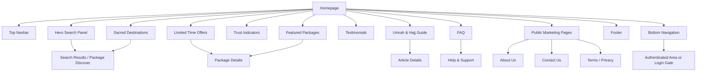
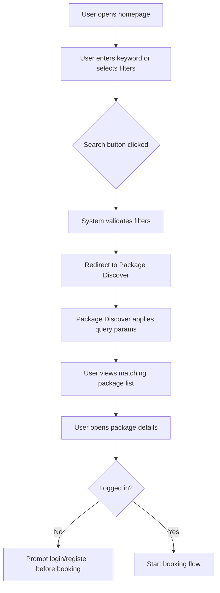

# JUV PRD 01 - Homepage, Public Navigation & Marketing Pages

Product: UmrahHaji.com Jamaah/User View  
Module: Homepage, Public Navigation & Marketing Pages  
Scope: Jamaah/User View / Public Website / Landing Page / Marketing Pages  
Platform: Mobile-first Responsive Web Platform  
Status: Draft  
Last Updated: 16 June 2026  

---

## 1. Objective

Homepage, Public Navigation & Marketing Pages is the primary public entry point for UmrahHaji.com. It helps visitors discover Umrah/Hajj packages, understand platform trust, browse promotions, read guidance content, view testimonials, access FAQ, learn about the platform, contact support, review legal pages, and move into registration, login, package booking, or authenticated jamaah flows.

The page must be optimized for mobile-first discovery while still working well on tablet and desktop web.

The homepage should help users answer:

1. What packages are available?
2. Can I trust this platform and its travel agencies?
3. How do I search, filter, compare, or book?
4. What are the current offers?
5. What do other pilgrims say?
6. What guidance do I need before booking?
7. Who is UmrahHaji.com and how does the platform work?
8. How can I contact support before or during a trip?
9. How do I register, login, or continue my trip?

---

## 2. Relationship With Master PRD

This module follows the Jamaah/User View Master PRD principles:

1. Mobile-first responsive web, not native mobile app in Phase 1.
2. Same design system as Admin Panel and Travel Agency Portal.
3. Public users can browse but must login/register to book, view trip, access notifications, or manage profile.
4. Package, testimonial, article, announcement, and travel agency trust data must sync from existing Admin Panel and Travel Agency Portal modules.
5. Homepage does not own operational records. It displays curated and searchable content from source modules.

---

## 3. Research Notes

The homepage design should follow these practical product and UX considerations:

1. Important navigation must stay discoverable on mobile. Use bottom navigation for core destinations and hamburger/menu for secondary links.
2. Image-heavy sections must be optimized. Hero images should load eagerly if visible in the first viewport, while offscreen package/destination/testimonial images should lazy-load, with fixed image dimensions to prevent layout shift.
3. FAQ content must be visible and user-readable. If FAQ structured data is used later, it must match visible content and should not be treated as a guaranteed SEO rich-result feature.
4. Accessibility must be treated as a product requirement: tappable targets, keyboard support, screen-reader labels, visible focus states, sufficient contrast, and semantic HTML.

Reference sources:

- Google web.dev image lazy-loading and layout-shift guidance: https://web.dev/articles/browser-level-image-lazy-loading
- W3C WCAG 2.2 quick reference: https://www.w3.org/WAI/WCAG22/quickref/
- Google Search Central FAQ structured data guidance: https://developers.google.com/search/docs/appearance/structured-data/faqpage

---

## 4. Scope

### 4.1 In Scope for Phase 1

1. Public homepage.
2. Public top navbar.
3. Mobile bottom navigation bar.
4. Hero search panel.
5. Limited Time Offers section.
6. Promo banner.
7. Featured Packages section.
8. Trust Indicators section.
9. Sacred Destinations section.
10. Testimonials section.
11. Umrah & Hajj Guide section.
12. FAQ section.
13. About Us page.
14. Contact Us page.
15. Terms & Conditions page.
16. Privacy Policy page.
17. Footer links.
18. Guest and logged-in navigation behavior.
19. Deep links to registration, login, package listing, package details, articles, FAQ, support, and authenticated areas.
20. Responsive states for mobile, tablet, desktop.
21. Loading, empty, error, and fallback states.
22. Performance and image optimization requirements.

### 4.2 In Scope for Phase 2

1. Compare Packages full experience.
2. Travel Agency Directory entry points.
3. Personalized homepage for logged-in jamaah.
4. Saved packages/wishlist preview.
5. PWA install prompt.
6. Multi-language homepage content.
7. Advanced search modal.
8. Dynamic recommendations based on user profile, country, travel history, or preferred package type.
9. Help Center article search.
10. Contact form with ticket/report creation.
11. Careers page.
12. Public press/media kit page.

### 4.3 Out of Scope

1. Native app home screen.
2. Admin CMS implementation details.
3. Full Package Discover page.
4. Full Compare Packages page.
5. Full booking checkout.
6. Full article management.
7. Full testimonial management.
8. Real-time chat.
9. Payment form on homepage.
10. Full customer support inbox.
11. Full Reports Management.
12. Full CMS authoring workflow.

---

## 5. Product Positioning

Homepage is a public acquisition and trust-building surface. It should not become a dense operational dashboard.

| Data Area | Source Module | Homepage Behavior |
| --- | --- | --- |
| Package offers | Package Management | Display published packages only |
| Promotions | Package Management / Admin content | Highlight active promo labels and discounts |
| Package count | Package Management | Show dynamic result count when available |
| Travel agency trust | Travel Agency Management | Display verified/active agency trust indicators |
| Testimonials | Testimonial Management | Display approved public testimonials only |
| Articles/guides | Articles Management | Display published guide content |
| FAQ | Admin content/settings | Display public FAQ content |
| Destinations | Admin content/master data | Display curated destination cards |
| About Us | Admin content/settings | Display platform story, mission, trust, and team/company overview |
| Contact Us | Admin content/settings / Support settings | Display contact channels and support entry points |
| Terms & Privacy | Admin content/settings | Display legal static pages |
| Footer/static pages | Admin content/settings | Display links and static pages |
| Auth state | User Management/Auth | Adjust CTA and navigation behavior |

---

## 6. User Roles

| Role | Homepage Access |
| --- | --- |
| Public Visitor | Can browse homepage, packages, articles, FAQ, destinations, testimonials |
| Registered User | Can browse and access authenticated navigation |
| Invited Jamaah | Can accept invitation through login/register flow |
| Jamaah | Can access profile, bookings, trip, transactions, notifications |
| Family PIC | Can access family/group-related trip and booking areas after login |
| Admin/Travel Agency User | Should not use this surface for operational work; redirected to correct portal if role requires |

---

## 7. Information Architecture

### 7.1 Page Structure

```text
Homepage
├── Decorative Background Layer
├── Top Navbar
├── Hero Search Panel
├── Limited Time Offers
├── Promo Banner
├── Featured Packages
├── Trust Indicators
├── Sacred Destinations
├── Testimonials
├── Umrah & Hajj Guide
├── FAQ
├── Public Marketing Pages
│   ├── About Us
│   ├── Contact Us
│   ├── Terms & Conditions
│   └── Privacy Policy
├── Footer
└── Bottom Navigation Bar
```

### 7.2 IA Diagram



---

## 8. Visual Direction

### 8.1 Background Layer

Background elements:

1. Wave pattern as subtle decorative layer.
2. Makkah outline background pattern.
3. Mesh gradient in teal-orange for hero area.

Design rules:

- Decorative patterns must not reduce text contrast.
- Background must remain subtle behind forms and cards.
- Avoid heavy animated backgrounds in Phase 1.
- Use responsive cropping so pattern does not create awkward empty areas on mobile.
- Hero search panel must have enough contrast from the background.

### 8.2 Brand Expression

The visual style should feel:

- Modern.
- Trustworthy.
- Warm.
- Premium but not luxury-only.
- Spiritual without being overly decorative.
- Clear enough for operational booking decisions.

### 8.3 Component Style

Use global design system components:

- Rounded cards.
- Soft shadows.
- Clear active states.
- Teal primary actions.
- Orange promotional accents.
- Badge system for package category, promo, discount, and status.
- Consistent icon style.
- Plus Jakarta Sans typography.

---

## 9. Top Navbar

### 9.1 Desktop/Tablet Navbar

Elements:

| Element | Requirement |
| --- | --- |
| Logo | Use UmrahHaji.com logo image with text |
| Package/cart icon | Opens booking/cart/selected package area if enabled; otherwise hidden until booking flow exists |
| Notification bell | If guest, opens login prompt; if logged-in, opens notification center |
| Login text/button | Opens login page/modal |
| Hamburger/menu | Optional on desktop; required on mobile/tablet if secondary links are hidden |

### 9.2 Mobile Navbar

Elements:

| Element | Requirement |
| --- | --- |
| Logo | Can use compact logo on small width |
| Right action area | Login button for guest; profile/avatar for logged-in user |
| Hamburger/menu | Opens side drawer with public links and auth actions |

Mobile rules:

- Do not show too many icons in the top bar.
- If space is limited, prioritize logo, hamburger, and login/profile.
- Cart icon should only appear when booking/cart concept exists.
- Notification bell for guest should not imply there are notifications before login.

---

## 10. Hero Search Panel

### 10.1 Content

Heading:

```text
Find Your Perfect Package
```

Supporting copy:

```text
Browse 500+ packages from 50+ trusted agencies.
```

The package and agency counts should be dynamic if source data is available. If not available, show generic copy:

```text
Browse trusted Umrah and Hajj packages from verified agencies.
```

### 10.2 Search Fields

| Field | Placeholder | Type | Required |
| --- | --- | --- | --- |
| Main search | Search packages, destinations, or agencies... | Text input | No |
| Category | Category | Select | No |
| Departure | Departure | Month/date range picker | No |
| Package Type | Package Type | Select | No |
| Price Range | Price Range | Select/range | No |

### 10.3 Filter Options

Category options:

- All.
- Umrah.
- Hajj.
- Family.

Package Type options:

- Economy.
- Standard.
- Premium.
- VIP.
- Express.
- Family.

Departure options:

- Any time.
- This month.
- Next month.
- Next 3 months.
- Custom month/date range.

Price Range options:

- Any price.
- Budget.
- Mid-range.
- Premium.
- Custom range.

### 10.4 Actions

| Action | Behavior |
| --- | --- |
| Toggle Filter | Collapse/expand advanced fields |
| Search Packages | Redirect to Package Discover with query parameters |
| Compare Packages | Phase 2 link; can show "Coming soon" or be hidden in Phase 1 |
| Advanced Search | Phase 2 link; can open advanced search modal when available |

CTA label:

```text
Search Packages (500+ results)
```

Rules:

- Result count should update based on selected filters if available.
- If count is unknown, use "Search Packages".
- Search should be usable with main input only.
- Empty search should redirect to Package Discover with default filters.

---

## 11. Section: Limited Time Offers

### 11.1 Purpose

Highlight promotional packages and encourage immediate booking interest.

Header:

```text
Limited Time Offers
Special promotions for Umrah, Hajj, and Family packages
```

### 11.2 Tab Filter

Tabs:

- All.
- Umrah.
- Hajj.
- Family.

### 11.3 Layout

Mobile:

- Horizontal scroll cards.
- Snap-to-card behavior.
- Dot indicator.
- "View All Promo" CTA.

Tablet/Desktop:

- Horizontal carousel or 4-column grid depending on viewport.
- Avoid showing clipped text.

### 11.4 Package Card Fields

Each package card must show:

- Package image.
- 2 category/promo badges.
- Discount percentage badge.
- Package name.
- Seats left.
- Travel agency name.
- Rating.
- Review count.
- Duration.
- Departure date/month.
- Original price.
- Discounted price.
- Primary CTA: Book Now.

### 11.5 Reference Package Data

| Package | Agency | Original Price | Discount Price | Duration | Departure | Availability | Badges |
| --- | --- | ---: | ---: | --- | --- | --- | --- |
| Umrah Sofwa Tower | Berkah Travel | RM 12,500 | RM 10,900/pilgrim | Makkah 7N, Madinah 6D | March 2025 | 20 seats left | Hot Deal, VIP, -15% |
| Hajj 2025 Premium | Malaysia Travel | RM 31,200 | RM 26,900/pilgrim | Makkah 10N, Madinah 7N | June 2025 | 14 seats left | Hot Deal, Premium, -12% |
| Economy Umrah | Barakah Tours | RM 9,900 | RM 7,900/pilgrim | Makkah 5N, Madinah 4N | August 2025 | 15 seats left | Best Offer, Economy, -20% |
| Family Umrah Express | Jafar Tours | RM 28,000 | RM 23,000/family | Makkah 5N, Madinah 5N | May 2025 | 5 families left | Family Deal, Express, -18% |

Business rules:

- Show only published packages.
- Show only active promotions.
- Hide expired promotions.
- If package seat availability is unknown, hide the seat-left label.
- "Book Now" opens package detail or booking start depending on product decision.

---

## 12. Promo Banner

### 12.1 Content

Title:

```text
Premium, Budget & VIP packages available
```

Subtitle:

```text
Compare prices from 50+ trusted agencies
```

CTA:

```text
Browse All
```

### 12.2 Behavior

- CTA redirects to Package Discover.
- Banner can be static in Phase 1.
- Admin content management can later control banner text/image/link.

---

## 13. Section: Featured Packages

### 13.1 Purpose

Show curated packages that are high-quality, verified, or commercially important.

Header:

```text
Featured Packages
Premium, Budget, VIP & Express packages from verified partners
```

### 13.2 Tab Filter

Tabs:

- All.
- Umrah.
- Hajj.
- Family.

### 13.3 Layout

Mobile:

- Vertical list cards for easier comparison and readability.

Tablet/Desktop:

- Grid/list layout based on available space.

### 13.4 Card Logic

Featured package card uses the same data model as Limited Time Offers, but can include:

- Featured label.
- Verified agency badge.
- Package category.
- Starting price.
- CTA: View Details or Book Now.

Footer CTA:

```text
Browse All Packages
```

Business rules:

- Packages can be featured by Admin or Travel Agency if allowed.
- Admin can override featured ordering globally.
- Travel Agency featured packages should still require published/active status.

---

## 14. Trust Indicators

### 14.1 Purpose

Build confidence before users browse or book.

Header:

```text
Trusted Platform
Licensed, verified, and trusted by thousands of pilgrims
```

### 14.2 Stats Grid

| Stat | Label | Sub-label | Data Source |
| --- | --- | --- | --- |
| 100% | MOTAC Certified | All partner agencies verified | Travel Agency verification records |
| 25,000+ | Happy Pilgrims | Successfully served | Completed trips/bookings |
| 4.9 | Average Rating | From verified reviews | Testimonial Management |
| 50+ | Partner Agencies | Trusted travel partners | Active verified agencies |

Business rules:

- If exact values are not reliable, use rounded/approved marketing values.
- Do not display unverifiable claims.
- Admin should control public metric labels if legal/compliance review is required.

---

## 15. Sacred Destinations

### 15.1 Purpose

Introduce key destinations and route users into package discovery.

Header:

```text
Sacred Destinations
```

Link:

```text
View All
```

### 15.2 Destination Cards

Cards:

- Makkah.
- Madinah.
- Jeddah.

Card fields:

- Destination image.
- Destination name.
- Short description.
- Package count if available.
- CTA/deep-link to filtered Package Discover.

Layout:

- Horizontal scroll on mobile.
- 3-column grid on desktop.

---

## 16. Testimonials

### 16.1 Purpose

Show social proof from verified pilgrims.

Header:

```text
What Our Pilgrims Say
```

### 16.2 Stats Row

| Stat | Label |
| --- | --- |
| 4.9 | Average Rating |
| 3,247 | Total Reviews |
| 98% | Recommend |
| 100% | Verified Reviews |

### 16.3 Review Cards

Card fields:

- Reviewer name.
- Optional avatar.
- Package name.
- Travel agency name.
- Rating.
- Review date.
- Quote excerpt.
- Verified label.

Reference review:

| Field | Value |
| --- | --- |
| Reviewer | Jese Leos |
| Package | Umrah Premium 2024 by Raff Tours |
| Rating | 4.9 |
| Date | June 2024 |
| Quote | The best Umrah experience I've ever had... |

Business rules:

- Show approved testimonials only.
- Hide private/sensitive content.
- If anonymous flag is enabled, hide reviewer identity.
- Media shown in testimonial must have public display consent.
- "View All Review" opens testimonial listing or package review page.

---

## 17. Umrah & Hajj Guide

### 17.1 Purpose

Educate users and support SEO/content discovery.

Header:

```text
Umrah & Hajj Guide
```

Tabs:

- Preparation & Guide.
- Travel Policy.

### 17.2 Guide Cards

Display 6 guide cards in 2 rows x 3 columns on desktop, and horizontal/stacked layout on mobile.

Recommended guide cards:

| Title | Category | Source |
| --- | --- | --- |
| Umrah Preparation | Preparation & Guide | Articles |
| Performing Umrah | Preparation & Guide | Articles |
| Makkah Helpful Tips | Preparation & Guide | Articles |
| Performing Second Umrah | Preparation & Guide | Articles |
| Travelling with Family | Preparation & Guide | Articles |
| Travel Policy & Documents | Travel Policy | Articles/Static content |

Business rules:

- Cards should link to published articles.
- If fewer than 6 articles are available, show available cards only.
- Admin can pin priority guide articles.

---

## 18. FAQ

### 18.1 Purpose

Answer common questions and reduce repetitive support inquiries.

Header:

```text
Frequently Asked Questions
Get answers to common questions about booking and pilgrimage
```

### 18.2 Tab Filter

Tabs:

- All.
- Booking.
- Payment.
- Cancellations.

### 18.3 Accordion Items

| No | Badge | Question | Default State |
| ---: | --- | --- | --- |
| 1 | Booking | How do I book a Umrah or Hajj package? | Expanded |
| 2 | Payment | What payment methods do you accept? | Collapsed |
| 3 | Cancellation | Can I cancel or modify my booking? | Collapsed |
| 4 | Documents | What documents do I need for Umrah/Hajj? | Collapsed |
| 5 | Packages | What's the difference between package types? | Collapsed |
| 6 | Support | Do you provide support during the pilgrimage? | Collapsed |
| 7 | Group Bookings | Are there discounts for group bookings? | Collapsed |
| 8 | Travel Agencies | How do you verify travel agencies? | Collapsed |

FAQ #1 answer:

```text
You can browse packages on our platform, compare prices and features, then book directly through our secure payment system. After submitting a booking, you can track your booking, payment, documents, and trip details from your Jamaah account.
```

Business rules:

- FAQ must be editable by Admin content/settings.
- Only one item can be expanded by default on mobile to reduce page height.
- Users should be able to expand multiple items if the UI pattern supports it.
- FAQ structured data, if implemented, must match visible FAQ content.

---

## 19. Footer

### 19.1 Footer Columns

| Column | Links |
| --- | --- |
| About Us | About UmrahHaji.com, Vision & Mission, Our Team, Testimonials, Careers |
| Help & Support | Contact Us, FAQ, Terms & Conditions, Privacy Policy, Help Center |
| Our Services | Umrah Packages, Hajj Packages, Flight Booking, Hotels, Online Manasik, Mutawwif |
| Follow Us | Facebook, X.com, Instagram, YouTube, TikTok |

Copyright:

```text
© 2025 UmrahHaji.com. All rights reserved.
```

### 19.2 Footer Rules

- Footer links can be managed from Admin content/settings.
- External social links open in new tab.
- Terms, privacy, and contact pages must be accessible without login.
- Mobile footer can collapse columns into accordions.

---

## 20. Public Marketing Pages

### 20.1 Purpose

Public marketing pages provide supporting information that users expect before trusting a marketplace-style Umrah/Hajj platform. These pages should be part of PRD 01 because they belong to the public website experience, not a separate authenticated jamaah module.

Included pages:

1. About Us.
2. Contact Us.
3. Terms & Conditions.
4. Privacy Policy.
5. Optional Help Center landing.

### 20.2 About Us Page

Objective:

Explain what UmrahHaji.com is, why the platform exists, how it helps jamaah, and how trust is maintained between jamaah, travel agencies, mutawwif, and platform admin.

Recommended sections:

| Section | Content |
| --- | --- |
| Hero | Page title, short platform promise, image or sacred destination visual |
| Platform Overview | Marketplace for Umrah/Hajj packages from verified travel agencies |
| Vision & Mission | Clear mission around safer, more transparent, easier pilgrimage planning |
| How It Works | Discover package, compare, book, upload documents, track trip, pay, receive support |
| Trust & Verification | Verified travel agencies, document review, real testimonials, secure payment flow |
| Who We Serve | Jamaah, families, travel agencies, mutawwif, platform support team |
| Platform Stats | Active agencies, completed trips, verified reviews, average rating if approved |
| CTA | Browse Packages, Register, Contact Support |

Business rules:

- About page content is public and does not require login.
- Trust claims must be backed by approved admin-managed metrics.
- If metrics are not verified, use descriptive text instead of numeric claims.
- Do not expose internal admin, financial, or agency-sensitive information.

### 20.3 Contact Us Page

Objective:

Allow visitors and jamaah to contact UmrahHaji.com through the right channel without confusing public contact, booking support, agency support, and emergency trip support.

Recommended sections:

| Section | Content |
| --- | --- |
| Contact Overview | Short explanation of available support channels |
| General Support | Email, WhatsApp, phone, operating hours |
| Booking Support | Login prompt or deep link to booking/trip support |
| Travel Agency Support | Separate contact path for agencies or registration inquiries |
| During Trip Support | Guidance to contact assigned travel agency/mutawwif first, plus platform escalation path |
| Office / Business Address | Address if available and approved |
| Contact Form | Optional Phase 2 form to submit inquiry |
| FAQ Shortcut | Link to FAQ and Help Center |

Recommended contact categories:

| Category | Description | Destination |
| --- | --- | --- |
| General Inquiry | Public platform questions | Public support inbox/email |
| Booking Question | Booking/payment/package question | Login gate or booking support |
| Document Issue | Passport, IC, visa, vaccination upload issue | Login gate or document support |
| Payment Issue | Invoice, receipt, failed payment | Login gate or billing support |
| Travel Agency Registration | Agency wants to join platform | Travel Agency application flow |
| Complaint / Report | Service, safety, compliance, refund issue | Reports/Support module |
| Emergency During Trip | Urgent trip support | Agency/mutawwif contact + platform escalation |

Business rules:

- Public Contact page can show general channels without exposing internal staff data.
- Logged-in users should be routed to the correct authenticated support/report flow where possible.
- Emergency wording must be careful: the platform can provide escalation, but immediate local emergency services and travel agency/mutawwif contacts may be required.
- Contact form, if implemented, should create a support inquiry or report depending on category.

### 20.4 Terms & Conditions Page

Objective:

Provide public legal and usage terms for the platform.

Recommended sections:

1. Platform role and service scope.
2. User account responsibilities.
3. Booking and package information disclaimer.
4. Travel agency responsibility.
5. Payment, cancellation, refund, and invoice references.
6. Document upload and accuracy responsibility.
7. Reviews/testimonials policy.
8. Prohibited use.
9. Limitation of liability.
10. Updates to terms.

Business rules:

- Terms page is public and accessible without login.
- Terms content must be managed/reviewed by authorized admin/legal owner.
- Booking-specific terms from Travel Agency or package should be shown in Booking Flow and Package Detail, not hidden only here.

### 20.5 Privacy Policy Page

Objective:

Explain how the platform collects, uses, stores, and shares user data.

Recommended sections:

1. Information collected: account, booking, documents, payment references, profile, support/report data.
2. How information is used: booking, verification, support, payment, communication, safety.
3. Data sharing: travel agencies, payment providers, support providers, legal/compliance if required.
4. Document and identity data handling.
5. Cookies and analytics.
6. Data retention.
7. User rights and account deletion request.
8. Contact privacy support.

Business rules:

- Privacy content must be public.
- Avoid exposing internal architecture or provider secrets.
- Document upload privacy must be clearly explained because jamaah data is sensitive.

### 20.6 Help Center Landing (Optional Phase 2)

If implemented, Help Center can group public help content from FAQ and Articles:

| Category | Examples |
| --- | --- |
| Booking | How booking works, package terms, family booking |
| Payment | Deposit, receipt, failed payment, refund |
| Documents | Passport, IC, visa, vaccination, photo |
| Trip | Itinerary, hotel, flight, mutawwif, group trip |
| Account | Registration, invitation, profile, password |
| Reports | Complaint, escalation, support status |

Help Center search should reuse published Article/FAQ content from Admin Articles Management and Admin content settings.

---

## 21. Bottom Navigation Bar

### 21.1 Tabs

| Order | Icon | Label | Guest Behavior | Logged-in Behavior |
| ---: | --- | --- | --- | --- |
| 1 | home | Home | Stay on homepage | Stay on homepage |
| 2 | grid | Packages | Open Package Discover | Open Package Discover |
| 3 | users-group | My Trip | Prompt login/register | Open My Group Trip |
| 4 | clipboard | Guidelist | Open guide/checklist landing or prompt login | Open checklist/guidance |
| 5 | user-circle | Profile | Prompt login/register | Open Profile |

### 21.2 Bottom Nav Rules

- Bottom nav appears on mobile and can be hidden or replaced by desktop navbar on desktop.
- Active tab must be visually clear.
- Tapping protected tabs as guest opens login/register prompt with clear reason.
- Guidelist can show public guides for guest and personalized checklist for logged-in jamaah.
- Bottom nav must not cover sticky CTAs; safe area padding is required.

---

## 22. Public Menu / Hamburger Drawer

Menu items:

- Home.
- Packages.
- Umrah Packages.
- Hajj Packages.
- Family Packages.
- Articles.
- Guide.
- FAQ.
- About Us.
- Contact Us.
- Login.
- Register.

Logged-in additions:

- My Trip.
- My Bookings.
- Transactions.
- Profile.
- Notifications.
- Logout.

Rules:

- Drawer must close after navigation.
- Drawer must support keyboard and screen-reader interaction.
- Login/register CTAs must remain easy to find.

---

## 23. Search and Filter Flow



Search query parameter examples:

```text
/packages?keyword=sofwa&category=umrah&departure=2025-03&type=vip&price=max-12000
```

---

## 24. Guest vs Logged-in Behavior

| Interaction | Guest | Logged-in Jamaah |
| --- | --- | --- |
| Search packages | Allowed | Allowed |
| View package details | Allowed | Allowed |
| Book package | Prompt login/register | Continue booking |
| Compare Packages | Phase 2 / Coming soon | Phase 2 / Coming soon |
| View My Trip | Prompt login/register | Open My Group Trip |
| View Notifications | Prompt login/register | Open notification center |
| View Profile | Prompt login/register | Open profile |
| View Guidelist | Public guide | Personalized checklist/guidance |
| Referral | Prompt login/register | Open referral |

---

## 25. Data Requirements

### 25.1 Package Card Data

| Field | Required | Source |
| --- | --- | --- |
| Package ID | Yes | Package Management |
| Package name | Yes | Package Management |
| Category | Yes | Package Management |
| Package type | Yes | Package Management |
| Travel agency name | Yes | Travel Agency Management |
| Agency verification status | Yes | Travel Agency Management |
| Thumbnail image | Yes | Package media |
| Original price | No | Package pricing |
| Discount price | Yes | Package pricing |
| Currency | Yes | Package pricing |
| Duration | Yes | Package/itinerary |
| Departure date/month | Yes | Package schedule |
| Seats left | No | Booking/group capacity |
| Rating | No | Testimonials |
| Review count | No | Testimonials |
| Promo labels | No | Package Management |
| Booking CTA URL | Yes | Package detail/booking |

### 25.2 Destination Data

| Field | Required | Source |
| --- | --- | --- |
| Destination name | Yes | Admin content/master data |
| Image | Yes | Admin content |
| Description | No | Admin content |
| Package count | No | Package Management |
| Filter URL | Yes | Package Discover |

### 25.3 Testimonial Data

| Field | Required | Source |
| --- | --- | --- |
| Reviewer name or anonymous label | Yes | Testimonial Management |
| Package name | Yes | Package/booking snapshot |
| Travel agency name | No | Travel Agency Management |
| Rating | Yes | Testimonial Management |
| Date | Yes | Testimonial Management |
| Quote excerpt | Yes | Testimonial Management |
| Public approval status | Yes | Testimonial Management |
| Consent flag | Yes | Testimonial Management |

### 25.4 Public Marketing Page Data

| Page | Required Data | Source |
| --- | --- | --- |
| About Us | Platform description, mission, trust explanation, approved metrics, CTA links | Admin content/settings |
| Contact Us | Support email, phone/WhatsApp, operating hours, address, support categories | Admin support/settings |
| Terms & Conditions | Legal content, version, effective date, last updated date | Admin legal/content settings |
| Privacy Policy | Privacy content, version, effective date, data contact | Admin legal/content settings |
| Help Center | FAQ/articles, categories, search metadata | Admin Articles / FAQ content |

---

## 26. States and Edge Cases

### 26.1 Loading States

- Hero search fields can load immediately with default options.
- Package cards show skeleton cards.
- Testimonials show skeleton cards.
- Articles/guides show skeleton cards.
- Trust stats show fallback placeholders if metrics are delayed.

### 26.2 Empty States

| Section | Empty Behavior |
| --- | --- |
| Limited Time Offers | Hide section or show "No active promotions right now" |
| Featured Packages | Show latest published packages |
| Destinations | Hide package count but keep destination card |
| Testimonials | Hide section if no approved testimonials |
| Guide | Show default static guide cards |
| FAQ | Show default static FAQ |
| About/Contact | Show static fallback page if CMS content is delayed |

### 26.3 Error States

- If package API fails, show retry and fallback content.
- If image fails, show branded placeholder.
- If search fails, keep user on page and show error message.
- If CTA requires login, show login prompt instead of dead link.
- If static/legal page content fails, show retry and support fallback.

---

## 27. Performance Requirements

1. Hero visible image/background should be optimized and prioritized for initial render.
2. Offscreen package, destination, testimonial, and guide images should lazy-load.
3. Every image must have fixed width/height or aspect-ratio to prevent layout shift.
4. Use responsive image sizes for mobile, tablet, and desktop.
5. Use compressed image formats such as WebP/AVIF where supported, with fallback.
6. Avoid loading all carousel images at full size.
7. Avoid heavy background animation.
8. Limit initial JavaScript payload for public homepage.
9. Use caching for public package/landing content.
10. Search/filter should navigate quickly and not block first render.

Recommended targets:

| Metric | Target |
| --- | --- |
| LCP | <= 2.5s on good mobile network |
| CLS | <= 0.1 |
| INP | <= 200ms |
| Initial image payload | Keep as low as practical; avoid full-size gallery images |

---

## 28. SEO and Public Content Requirements

1. Homepage must have proper title and meta description.
2. Use semantic HTML headings in logical order.
3. Package cards should link to crawlable package detail URLs.
4. Article cards should link to crawlable article URLs.
5. FAQ content should be visible in the page, not hidden only behind JavaScript that search engines cannot access.
6. FAQ structured data is optional and must follow Google guidelines if used.
7. Organization schema can be considered for brand information.
8. Images must have meaningful alt text.
9. Canonical URL must be set.
10. Public links should not require login unless the target is an authenticated feature.
11. About, Contact, Terms, and Privacy should have crawlable public URLs.
12. Legal pages should include effective date and last updated date.

---

## 29. Accessibility Requirements

1. All buttons and links must be keyboard accessible.
2. Carousels must provide accessible controls and should not trap focus.
3. Icons must have labels or accessible names.
4. Form fields must have labels, not placeholder-only semantics.
5. FAQ accordion must announce expanded/collapsed state.
6. Color cannot be the only indicator for active tab, discount, or error.
7. Bottom navigation must expose selected/active state.
8. Text contrast must follow WCAG expectations.
9. Touch targets should be comfortable for mobile usage.
10. Motion should be minimal and respect reduced motion preference.

---

## 30. Analytics Events

Recommended events:

| Event | Trigger |
| --- | --- |
| homepage_viewed | User opens homepage |
| hero_search_submitted | User submits search |
| hero_filter_changed | User changes filter |
| package_card_clicked | User opens package card |
| package_book_now_clicked | User taps Book Now |
| promo_view_all_clicked | User taps View All Promo |
| featured_browse_all_clicked | User taps Browse All Packages |
| compare_packages_clicked | User taps Compare Packages |
| advanced_search_clicked | User taps Advanced Search |
| destination_clicked | User taps destination card |
| testimonial_view_all_clicked | User taps View All Review |
| guide_card_clicked | User opens guide article |
| faq_item_expanded | User expands FAQ |
| footer_link_clicked | User taps footer/static page link |
| about_page_viewed | User opens About Us |
| contact_page_viewed | User opens Contact Us |
| contact_category_clicked | User selects support/contact category |
| legal_page_viewed | User opens Terms or Privacy |
| login_clicked | User taps login |
| register_clicked | User taps register |
| protected_nav_prompt_shown | Guest taps protected bottom nav |

---

## 31. Functional Requirements

| ID | Requirement | Priority |
| --- | --- | --- |
| JUV-HP-001 | User can view public homepage without login | P1 |
| JUV-HP-002 | User can access login/register from navbar/menu | P1 |
| JUV-HP-003 | User can search packages from hero panel | P1 |
| JUV-HP-004 | User can select category, departure, package type, and price range filters | P1 |
| JUV-HP-005 | User can navigate to Package Discover with selected search params | P1 |
| JUV-HP-006 | User can view Limited Time Offers with package cards | P1 |
| JUV-HP-007 | User can filter offer section by All, Umrah, Hajj, Family | P1 |
| JUV-HP-008 | User can open package details from offer/featured cards | P1 |
| JUV-HP-009 | User can view promo banner and tap Browse All | P1 |
| JUV-HP-010 | User can view Featured Packages | P1 |
| JUV-HP-011 | User can view trust indicator stats | P1 |
| JUV-HP-012 | User can view Sacred Destinations and open filtered package listing | P1 |
| JUV-HP-013 | User can view approved testimonials | P1 |
| JUV-HP-014 | User can view Umrah & Hajj Guide cards | P1 |
| JUV-HP-015 | User can view FAQ accordion and filter by category | P1 |
| JUV-HP-016 | User can access footer static links | P1 |
| JUV-HP-017 | User can use bottom navigation on mobile | P1 |
| JUV-HP-018 | Guest tapping protected tabs receives login/register prompt | P1 |
| JUV-HP-019 | Homepage supports loading, empty, and error states | P1 |
| JUV-HP-020 | Homepage images are optimized and lazy-loaded where appropriate | P1 |
| JUV-HP-021 | Compare Packages link is visible as P2/coming soon or hidden in Phase 1 | P2 |
| JUV-HP-022 | Advanced Search can open modal or page in Phase 2 | P2 |
| JUV-HP-023 | Logged-in user can see personalized homepage widgets | P2 |
| JUV-HP-024 | Homepage can support multi-language content | P2 |
| JUV-HP-025 | User can open About Us page from footer or menu without login | P1 |
| JUV-HP-026 | User can open Contact Us page from footer or menu without login | P1 |
| JUV-HP-027 | User can choose a contact/support category and be routed to the correct destination | P1 |
| JUV-HP-028 | User can open Terms & Conditions without login | P1 |
| JUV-HP-029 | User can open Privacy Policy without login | P1 |
| JUV-HP-030 | Public marketing pages support loading, empty, and error states | P1 |
| JUV-HP-031 | Optional Help Center search can be added in Phase 2 | P2 |

---

## 32. Acceptance Criteria

1. Public visitor can open homepage without authentication.
2. Search panel redirects to Package Discover with selected filters.
3. Limited Time Offers displays active promotion packages only.
4. Featured Packages displays published packages only.
5. Book Now CTA does not fail for guest; it prompts login/register or opens package detail based on defined flow.
6. Trust stats do not display unverifiable values.
7. Testimonials show only approved public reviews.
8. FAQ accordion works on mobile and desktop.
9. Footer links are accessible without login.
10. Bottom navigation works on mobile and protects authenticated destinations.
11. Offscreen images lazy-load and have dimensions/aspect ratios.
12. Page remains usable when package/testimonial/article APIs fail.
13. The design uses Plus Jakarta Sans and global UmrahHaji.com design system tokens.
14. Page meets basic accessibility requirements for forms, buttons, links, accordions, and carousels.
15. About Us page is accessible from footer and hamburger menu.
16. Contact Us page shows public contact channels and routes logged-in support issues to the proper authenticated flow.
17. Terms & Conditions and Privacy Policy are accessible without login.
18. Public static pages include clear page title, content body, and last updated/effective date where relevant.
19. Contact categories do not expose internal staff or sensitive operational data.

---

## 33. Open Questions

1. Should "Book Now" from homepage go directly to booking flow or first open Package Details?
2. Should the package/cart icon be shown in Phase 1 if there is no multi-package cart?
3. Should Compare Packages be visible as disabled/coming soon in Phase 1 or hidden entirely?
4. Should Advanced Search be part of Phase 1 or Phase 2?
5. Should trust stats be manually approved marketing numbers or calculated live?
6. Should public homepage show travel agency names prominently or keep focus on package offer?
7. Should logged-in users see personalized trip/payment reminders on homepage in Phase 1 or only in Phase 2?
8. Should Contact Us include a public contact form in Phase 1, or should it only show direct channels and authenticated support links?
9. Should About Us show live metrics, approved static metrics, or no numbers until compliance approval?

---

## 34. Summary

Homepage, Public Navigation & Marketing Pages should become the strongest public entry point for Jamaah/User View. It must combine package discovery, trust-building, education, testimonials, public company information, contact/support access, legal links, and clear navigation into a mobile-first experience.

The page should be polished and modern, but its logic must stay connected to source modules: Package Management, Travel Agency Management, Articles Management, Testimonial Management, Admin content/settings, and Auth/User Management.
