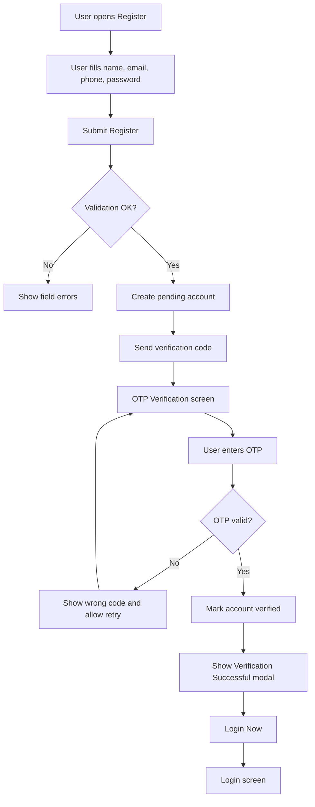
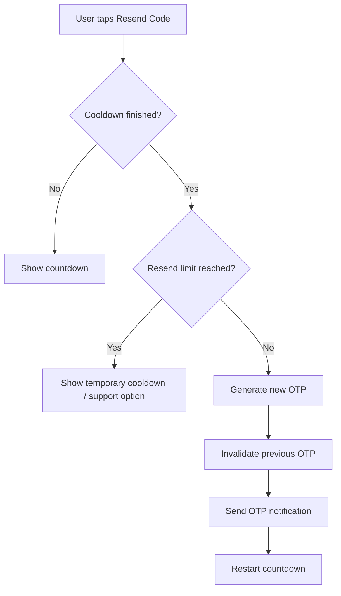
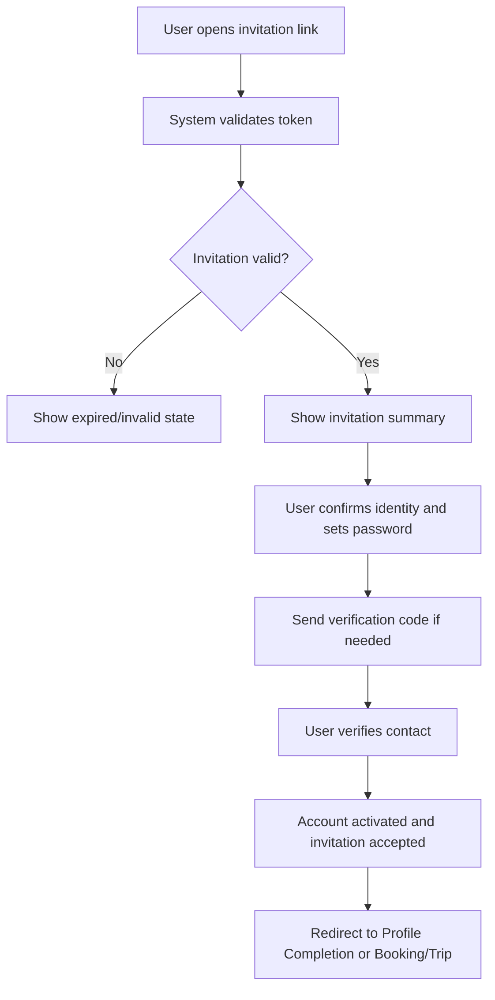
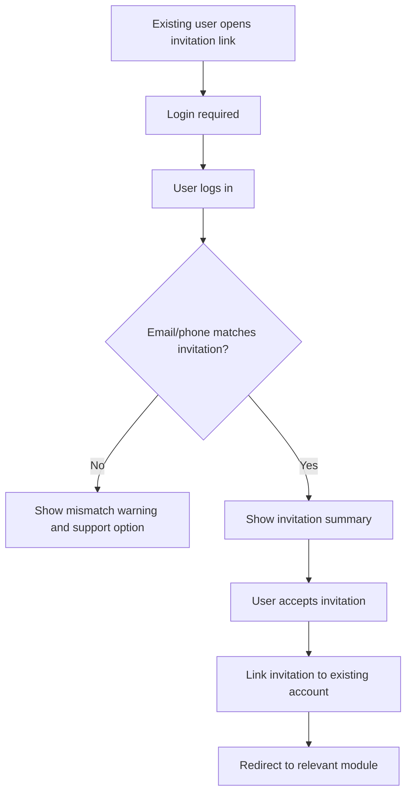

# JUV PRD 02 - Registration, Login & Invitation Acceptance

Product: UmrahHaji.com Jamaah/User View  
Module: Registration, Login & Invitation Acceptance  
Scope: Jamaah/User View / Authentication & Onboarding  
Platform: Mobile-first Responsive Web Platform  
Status: Draft  
Last Updated: 15 June 2026  

---

## 1. Objective

Registration, Login & Invitation Acceptance allows public visitors, invited users, and returning jamaah to securely access UmrahHaji.com. The module covers new user registration, OTP verification, login, invitation acceptance, password recovery, session behavior, and authentication notifications.

The module must balance three needs:

1. Easy onboarding for jamaah who may not be highly technical.
2. Secure account creation and login for sensitive personal, passport, payment, and trip data.
3. Synchronization with Admin Panel and Travel Agency Portal invitation workflows.

---

## 2. Relationship With Master PRD

This module follows the Jamaah/User View Master PRD:

1. Public visitors can browse packages, articles, FAQ, and homepage without login.
2. Login/register is required before booking, viewing trip, managing profile, accessing payment history, submitting reports, or accepting invitations.
3. Invited users may come from Admin Panel or Travel Agency Portal.
4. User account is part of User Management/Auth, while pilgrim operational data belongs to Jamaah Management.
5. The module must not expose internal Admin/Travel Agency user access on the public Jamaah/User login.

---

## 3. Research Notes

Authentication flows should follow practical security guidance:

1. OTP or verification codes should be random, single-use, expire within a short period, and be protected by rate limits.
2. For true out-of-band authentication, NIST recommends at least six decimal digits and completion within 10 minutes. Email confirmation codes are allowed for email validation, but email should not be treated as a strong out-of-band authenticator for high-risk authentication.
3. Passwords should support long passphrases, avoid arbitrary complexity rules, block common/breached passwords, and use a password strength meter.
4. Login and password reset messages should avoid account enumeration by using generic responses and consistent response timing.
5. Password reset should use secure tokens/codes, not send passwords through email, and should not auto-login the user after reset.

Reference sources:

- NIST SP 800-63B Digital Identity Guidelines: https://pages.nist.gov/800-63-4/sp800-63b.html
- OWASP Authentication Cheat Sheet: https://cheatsheetseries.owasp.org/cheatsheets/Authentication_Cheat_Sheet.html
- OWASP Forgot Password Cheat Sheet: https://cheatsheetseries.owasp.org/cheatsheets/Forgot_Password_Cheat_Sheet.html

---

## 4. Scope

### 4.1 In Scope for Phase 1

1. Register as Jamaah.
2. Email OTP verification after registration.
3. Optional WhatsApp OTP notification if provider is enabled.
4. Verification success modal.
5. Login.
6. Logout.
7. Forgot password request.
8. Reset password.
9. Invitation acceptance from Admin Panel or Travel Agency Portal.
10. Existing user invitation linking.
11. New user invitation activation.
12. Resend OTP.
13. OTP countdown and expiry.
14. Generic error handling and rate limiting.
15. Authenticated vs guest routing.
16. Basic session expiry.
17. Mobile-first form behavior.

### 4.2 In Scope for Phase 2

1. Multi-factor authentication for sensitive actions.
2. Passkey/social login if product approves it.
3. Device management.
4. Trusted device flow.
5. Risk-based login prompts.
6. Phone number verification as a separate verified identity factor.
7. Magic link login.
8. Biometric unlock for native app/PWA wrapper if ever introduced.

### 4.3 Out of Scope

1. Admin Panel login.
2. Travel Agency Portal login.
3. Native mobile app authentication.
4. Full identity proofing/KYC.
5. Government ID verification automation.
6. Full MFA recovery workflow.
7. Passwordless-only authentication.

---

## 5. Product Positioning

This module is the access gate for Jamaah/User View. It should be secure, simple, and forgiving.

It should not become a full identity verification module. Account verification confirms contact ownership and enables access. Jamaah identity/passport verification remains inside Profile & Documents and Jamaah Management.

| Area | Source Module | Behavior |
| --- | --- | --- |
| User account | User Management/Auth | Create, activate, login, logout, reset password |
| Jamaah profile | Jamaah Management | Created/linked after registration or invitation |
| Invitation | Admin Panel / Travel Agency Portal | Accept, link, activate |
| Booking access | Booking Management | Requires authenticated account |
| Profile completion | Profile & Documents | Starts after account activation |
| Notifications | Notification/Announcement system | Sends OTP, invitation, password, and security notices |
| Audit logs | User Management/Auth | Logs auth-sensitive events |

---

## 6. User Roles

| Role | Description |
| --- | --- |
| Public Visitor | Can register or login |
| Registered User | Has account but may not have completed jamaah profile |
| Invited Jamaah | Receives invitation from Admin/Travel Agency |
| Existing User | Already has account and can link new invitation/booking |
| Jamaah | Registered user with jamaah profile |
| Family PIC | Can later manage family/group members after authenticated |

---

## 7. Entry Points

| Entry Point | Behavior |
| --- | --- |
| Homepage Login button | Opens login page/modal |
| Homepage Register link | Opens Register as Jamaah |
| Protected bottom nav tab | Shows login/register prompt |
| Book Now CTA | Prompts login/register if guest |
| Invitation email link | Opens invitation acceptance screen |
| Invitation WhatsApp link | Opens invitation acceptance screen |
| Password reset email | Opens reset password screen |
| Expired session | Redirects to login with return URL |

---

## 8. Information Architecture

```text
Authentication & Onboarding
├── Register as Jamaah
│   ├── Default Form
│   ├── Filled Form
│   ├── Field Validation
│   └── Submit Registration
├── OTP Verification
│   ├── Empty State
│   ├── Filling + Countdown
│   ├── Wrong Code
│   ├── Resend Code
│   └── Verification Successful
├── Login
│   ├── Login Form
│   ├── Login Error
│   ├── Forgot Password Link
│   └── Redirect After Login
├── Password Recovery
│   ├── Forgot Password Request
│   ├── Reset Password
│   └── Reset Confirmation
└── Invitation Acceptance
    ├── Validate Invitation
    ├── Existing User Login
    ├── New User Activation
    ├── Expired Invitation
    └── Accepted Invitation
```

---

## 9. Main Flow Diagram



---

## 10. Register as Jamaah

### 10.1 Default Register Screen

State:
Form is empty when first opened.

Fields:

| Field | Type | Placeholder | Required | Notes |
| --- | --- | --- | --- | --- |
| Full Name | Text input | Full Name | Yes | Legal/preferred display name for account start |
| Email | Email input | Email | Yes | Used for login and verification |
| Phone Number | Phone input + country dropdown | Phone Number | Yes | Default country code +60 Malaysia |
| Password | Password input | Password | Yes | Show/hide toggle |
| Confirm Password | Password input | Confirm Password | Yes | Show/hide toggle |

CTA:

```text
Register
```

Visual behavior:

- Button is disabled until required fields are filled and client-side validation passes.
- Field labels can start as placeholders.
- Password fields include eye icon show/hide toggle.
- Country dropdown shows flag and phone code.

### 10.2 Filled Register Screen

State:
Fields are filled and labels move into floating-label state.

Reference values:

| Field | Example Value |
| --- | --- |
| Full Name | Rahmad Ismail |
| Email | rahmad.ismail@mail.com |
| Phone Number | +60 81234567891 |
| Password | Password123 |
| Confirm Password | Password123 |

Production note:
The sample password `Password123` is acceptable for visual mockup only. Production validation should reject weak/common passwords.

### 10.3 Field Validation

| Field | Validation |
| --- | --- |
| Full Name | Required, min 2 words recommended, max 100 chars |
| Email | Required, valid email format, normalized lowercase |
| Phone Number | Required, valid country code and local number format |
| Password | Required, min 12 chars recommended, max at least 64 chars, strength meter |
| Confirm Password | Must match password |

Password rules:

- Allow spaces and common passphrase characters.
- Do not require arbitrary uppercase/lowercase/number/symbol composition.
- Show password strength meter and tips.
- Block known weak/common/breached passwords.
- Do not silently truncate passwords.
- Store only salted password hashes using secure password hashing.

### 10.4 Duplicate Account Handling

| Case | Behavior |
| --- | --- |
| Email already registered and active | Show generic message: "This email may already be registered. Please login or reset your password." |
| Phone already registered and active | Show generic message and offer login/recovery |
| Email registered but unverified | Allow resend verification after rate-limit check |
| Invitation exists for email | Redirect to invitation acceptance after verification/login |

### 10.5 Registration Submit Rules

- Create account in `Pending Verification` status.
- Do not create full jamaah profile until verification succeeds, unless system uses provisional profile records.
- Send verification code.
- Navigate to OTP Verification screen.
- Store registration attempt and metadata in audit log.

---

## 11. OTP Verification

### 11.1 Security Recommendation

The reference screen shows 4 OTP boxes. For production, use 6 digits by default.

Reason:
Six-digit OTP provides better protection against guessing and aligns better with common authentication code expectations. The UI component can support either 4 or 6 boxes, but Phase 1 production should use 6 unless the team explicitly decides the code is only a low-risk email confirmation code.

Recommended OTP:

| Attribute | Requirement |
| --- | --- |
| Length | 6 digits recommended |
| Expiry | 5 minutes recommended, max 10 minutes |
| Reuse | Single-use only |
| Generation | Cryptographically secure random generator |
| Storage | Store hashed code or secure token reference |
| Retry limit | Max 5 failed attempts per code |
| Resend cooldown | 60 seconds |
| Resend limit | Max 3 resends per session, then temporary block |
| Channel | Email primary; WhatsApp optional if enabled |

### 11.2 OTP Verification - State 1 Empty

After successful registration submit, user lands on OTP page.

Title:

```text
OTP Verification
```

Description:

```text
We have sent an OTP code to rahmad.ismail@mail.com
```

Input:

- 6 separate OTP boxes recommended.
- Reference mockup may show 4 boxes; design system should support configurable digit length.

Link:

```text
Did not receive the code? Resend
```

CTA:

```text
Submit
```

Default state:

- OTP boxes empty.
- Submit disabled.
- Resend link disabled until cooldown ends if code was just sent.

### 11.3 OTP Verification - State 2 Filling + Countdown

State:
User starts filling code.

Input behavior:

- Auto-focus next box after digit entry.
- Backspace moves to previous box.
- Paste full code should distribute digits across boxes.
- Digits should be numeric only.
- Active boxes use teal underline/border.

Countdown copy:

```text
Did not receive the code? 59s
```

CTA:

- Submit active only when all OTP digits are filled.

### 11.4 OTP Verification - State 3 Wrong Code

State:
User enters wrong code and taps Submit.

Error behavior:

- OTP boxes show red error state.
- Error message appears under input:

```text
Wrong code
```

Link:

```text
Did not receive the code? Resend Code
```

Rules:

- Keep the entered code visible until user edits or clears it.
- Wrong attempts count toward retry limit.
- After retry limit, disable submit and require resend or temporary cooldown.
- Generating a new code does not reset suspicious activity counters globally.

### 11.5 OTP Expired State

Message:

```text
This code has expired. Please request a new code.
```

Actions:

- Resend Code.
- Change Email/Phone, if user entered wrong contact.

### 11.6 OTP Resend Flow



---

## 12. Verification Successful Modal

Trigger:
OTP is correct.

Overlay:

- Dark translucent overlay.
- Centered modal.
- Close icon.

Content:

| Element | Requirement |
| --- | --- |
| Icon | Green check icon |
| Title | Verification Successful |
| Subtitle | Please login to access your dashboard. |
| CTA | Login Now |
| Close | X icon |

CTA behavior:

- `Login Now` redirects to login screen.
- Close returns user to login screen or homepage with login prompt.

Security note:
For account activation, auto-login can be considered later, but Phase 1 should use `Login Now` to keep session handling simple and predictable.

---

## 13. OTP Notification Channels

### 13.1 Channel Strategy

Reference requirement:
OTP is sent through Email and WhatsApp at the same time.

Recommended Phase 1 rule:

- Email is the primary verification channel.
- WhatsApp OTP is optional and enabled only if WhatsApp provider/template is ready.
- If both channels send the same code, it is treated as delivery redundancy, not as two-factor verification.
- If the product wants to verify both email and phone, use separate verification challenges.

### 13.2 Email OTP Template

From:

```text
UmrahHaji.com
```

Subject:

```text
Your Registration OTP Code
```

Email body:

```text
Assalamu'alaikum,

Thank you for registering at UmrahHaji.com.
To proceed with your registration, please enter the following OTP code on the verification page:

Your OTP Code:
{{OTP_CODE}}

This code will expire in {{EXPIRY_MINUTES}} minutes.
If you did not request this registration, you can ignore this email.

Wassalamu'alaikum,
UmrahHaji.com Team
```

Email rules:

- Do not include password.
- Do not include full sensitive personal data.
- Code should be visually large and easy to copy.
- Email must include expiry information.
- Email must include support/contact link.

### 13.3 WhatsApp OTP Template

Message example:

```text
Assalamu'alaikum Rahmad,

Your UmrahHaji.com registration code is {{OTP_CODE}}.
This code expires in {{EXPIRY_MINUTES}} minutes.

Do not share this code with anyone.
```

WhatsApp UI reference:

- Bubble chat style in mockup.
- Timestamp example: 9:39.

WhatsApp rules:

- Use approved WhatsApp Business template.
- Do not send password.
- Do not include sensitive personal data.
- If WhatsApp delivery fails, user can still verify through email.
- If both email and WhatsApp fail, show support/retry guidance.

---

## 14. Login

### 14.1 Login Screen

Fields:

| Field | Type | Required | Notes |
| --- | --- | --- | --- |
| Email or Phone Number | Text input | Yes | Accept verified email or verified phone |
| Password | Password input | Yes | Show/hide toggle |

Actions:

- Login.
- Forgot Password.
- Register as Jamaah.
- Accept Invitation, if user arrived from invite link.

### 14.2 Login Behavior

Successful login redirects user based on context:

| Previous Context | Redirect |
| --- | --- |
| Book Now clicked | Package/booking flow |
| My Trip tab clicked | My Group Trip |
| Profile clicked | Profile |
| Invitation link | Invitation acceptance/confirmation |
| Direct login | Homepage or user dashboard/home |

### 14.3 Login Error Handling

Error message:

```text
Invalid email/phone or password.
```

Rules:

- Do not reveal whether email/phone exists.
- Do not reveal whether password alone is wrong.
- Apply login throttling after repeated failures.
- Show CAPTCHA or temporary cooldown after suspicious attempts if needed.
- Log failed attempts.

### 14.4 Account Status Handling

| Account Status | Behavior |
| --- | --- |
| Pending Verification | Redirect to OTP verification/resend |
| Active | Login allowed |
| Suspended | Show account restricted message and support contact |
| Deactivated | Show account unavailable message and support contact |
| Invited only | Redirect to invitation acceptance |

---

## 15. Forgot Password & Reset Password

### 15.1 Forgot Password Request

Field:

- Email or phone number.

CTA:

```text
Send Reset Link
```

Success response:

```text
If an account exists for this contact, we will send password reset instructions.
```

Rules:

- Use generic response for existing and non-existing accounts.
- Keep response timing consistent.
- Rate-limit requests by contact, IP/device, and session.
- Do not lock account just because reset was requested.

### 15.2 Reset Password

Fields:

- New password.
- Confirm new password.

Rules:

- Reset token/code must be single-use.
- Token/code must expire.
- Password must follow same password policy.
- After success, show confirmation and ask user to login.
- Do not auto-login after password reset.
- Optionally invalidate all active sessions after reset.
- Send security notification after reset.

---

## 16. Invitation Acceptance

### 16.1 Purpose

Allow users invited by Admin or Travel Agency to activate or link their account and become associated with a jamaah profile, booking, family/group, or trip context.

Invitation sources:

- Admin Panel.
- Travel Agency Portal.

Invitation targets:

- New Jamaah.
- Existing user.
- Family/group member.
- Booking participant.
- Group trip member.

### 16.2 Invitation Link Behavior

Invitation link opens:

```text
/invite/{{INVITATION_TOKEN}}
```

The system validates:

- Token exists.
- Token not expired.
- Token not already accepted.
- Token not revoked.
- Sender agency/admin still authorized.
- Associated booking/trip/package still valid.

### 16.3 Invitation Flow - New User



### 16.4 Invitation Flow - Existing User



### 16.5 Invitation Summary Screen

Show:

- Invited role: Jamaah / Family Member / Group Member.
- Inviting Travel Agency/Admin.
- Related package/booking/trip if available.
- User email/phone.
- Expiry date.
- Accept CTA.
- Decline CTA.

### 16.6 Invitation Statuses

| Status | Description |
| --- | --- |
| Pending | Invitation sent but not accepted |
| Accepted | User accepted and account/profile/link is active |
| Expired | Invitation token expired |
| Revoked | Sender cancelled invitation |
| Declined | User declined invitation |
| Linked | Existing user linked to invitation |

### 16.7 Invitation Rules

- Invitation should not include plain temporary password.
- Invitation token must be single-use.
- Invitation link should expire, recommended 7 days.
- Sender can resend invitation from Admin/Travel Agency portal.
- If token expires, user can request resend or contact sender.
- Existing user must login before accepting invitation.
- If email mismatch occurs, do not silently link invitation.

---

## 17. Auth Routing Rules

| User Action | Guest Behavior | Authenticated Behavior |
| --- | --- | --- |
| View homepage | Allowed | Allowed |
| Search packages | Allowed | Allowed |
| View package details | Allowed | Allowed |
| Book package | Login/register prompt | Continue booking |
| View My Trip | Login/register prompt | Open My Group Trip |
| View Profile | Login/register prompt | Open Profile |
| View Transactions | Login/register prompt | Open Transaction History |
| Accept invitation | Validate token, then login/register | Link invitation after confirmation |
| Submit report | Login/register prompt | Open report form |
| Submit testimonial | Login/register prompt | Open feedback form if eligible |

Return URL rule:

- After successful login/register, user should return to the original intended action when safe.
- Do not redirect to unvalidated external URLs.

---

## 18. Data Model

### 18.1 User Account

| Field | Type | Required | Notes |
| --- | --- | --- | --- |
| user_id | UUID | Yes | Internal immutable ID |
| full_name | String | Yes | Initial account display name |
| email | String | Yes | Unique normalized email |
| email_verified_at | Timestamp | No | Set after OTP |
| phone_country_code | String | Yes | Example +60 |
| phone_number | String | Yes | Normalized phone |
| phone_verified_at | Timestamp | No | Optional in Phase 1 |
| password_hash | String | Yes | Hashed password only |
| account_status | Enum | Yes | Pending Verification, Active, Suspended, Deactivated |
| created_at | Timestamp | Yes | System generated |
| updated_at | Timestamp | Yes | System generated |

### 18.2 Verification Code

| Field | Type | Required | Notes |
| --- | --- | --- | --- |
| verification_id | UUID | Yes | Internal ID |
| user_id | UUID | Yes | Linked user |
| channel | Enum | Yes | Email, WhatsApp |
| code_hash | String | Yes | Store hashed code, not plaintext |
| purpose | Enum | Yes | Registration, password reset, contact verification |
| expires_at | Timestamp | Yes | Recommended 5 minutes |
| used_at | Timestamp | No | Set after success |
| failed_attempt_count | Integer | Yes | Retry limit |
| resend_count | Integer | Yes | Resend limit |
| created_at | Timestamp | Yes | System generated |

### 18.3 Invitation

| Field | Type | Required | Notes |
| --- | --- | --- | --- |
| invitation_id | UUID | Yes | Internal ID |
| token_hash | String | Yes | Store hashed token |
| invited_email | String | Yes | Target email |
| invited_phone | String | No | Target phone |
| invited_name | String | No | Prefill name |
| sender_type | Enum | Yes | Admin, Travel Agency |
| sender_id | UUID | Yes | Sender reference |
| related_booking_id | UUID | No | Optional |
| related_group_trip_id | UUID | No | Optional |
| related_family_id | UUID | No | Optional |
| status | Enum | Yes | Pending, Accepted, Expired, Revoked, Declined |
| expires_at | Timestamp | Yes | Recommended 7 days |
| accepted_at | Timestamp | No | Set after acceptance |
| accepted_user_id | UUID | No | Linked account |

---

## 19. Security Requirements

1. All authentication pages must use HTTPS.
2. Passwords must never be stored or sent in plaintext.
3. OTP and reset codes must be random, single-use, expire, and be rate-limited.
4. Invitation tokens must be long, random, single-use, hashed at rest, and expire.
5. Login errors must avoid account enumeration.
6. Forgot password must use generic responses.
7. Repeated failed login/OTP attempts must trigger throttling.
8. Sessions should rotate after login.
9. Sensitive profile/payment actions should require reauthentication in future phase.
10. Auth events must be logged.
11. Admin and Travel Agency accounts should not authenticate through Jamaah/User login if they are internal/agency-only roles.
12. Return URLs must be validated against allowed internal routes.

---

## 20. UX Requirements

### 20.1 Mobile Form Behavior

- Fields should be large enough for mobile typing.
- Email field uses email keyboard.
- Phone field uses numeric phone keyboard.
- OTP boxes support paste.
- Error message appears close to the relevant field.
- Password show/hide icon must be tappable.
- CTA remains visible without covering form fields.
- Loading states prevent duplicate submit.

### 20.2 Accessibility

- Every field must have accessible label.
- Floating labels must not replace accessible labels.
- OTP inputs must be grouped with accessible instruction.
- Error messages must be announced to assistive technology.
- Buttons must have visible focus state.
- Modal must trap focus and return focus after close.
- Countdown text must be readable and not only color-coded.

---

## 21. Screen Specification

### 21.1 Register - Default

Components:

- Header/title.
- Full Name input.
- Email input.
- Phone Number input with country code dropdown.
- Password input with eye icon.
- Confirm Password input with eye icon.
- Register CTA.
- Login link.
- Terms/Privacy consent text.

Default state:

- Empty fields.
- Register button disabled.

### 21.2 Register - Filled

Components:

- Floating labels.
- Filled values.
- Active Register CTA.
- Password strength indicator.

### 21.3 OTP Verification - Empty

Components:

- Title: OTP Verification.
- Description with masked email where possible.
- OTP boxes.
- Countdown/resend area.
- Submit CTA disabled.

### 21.4 OTP Verification - Filling

Components:

- Filled OTP boxes.
- Active underline/border.
- Countdown.
- Submit CTA active.

### 21.5 OTP Verification - Wrong Code

Components:

- Red OTP input state.
- Error message: Wrong code.
- Resend Code link if allowed.
- Submit CTA.

### 21.6 Verification Successful Modal

Components:

- Overlay.
- Green check icon.
- Title.
- Subtitle.
- Login Now CTA.
- Close icon.

### 21.7 Login

Components:

- Email or Phone Number input.
- Password input.
- Forgot Password link.
- Login CTA.
- Register link.
- Optional invitation context banner.

### 21.8 Forgot Password

Components:

- Email or phone input.
- Send Reset Link CTA.
- Generic success state.

### 21.9 Reset Password

Components:

- New password.
- Confirm password.
- Password strength.
- Reset Password CTA.
- Success confirmation.

### 21.10 Invitation Acceptance

Components:

- Invitation summary.
- Sender identity.
- Related package/booking/trip if available.
- Login or create account actions.
- Accept/Decline actions.
- Expired/revoked state.

---

## 22. Notification Templates

### 22.1 Registration OTP Email

```text
From: UmrahHaji.com
Subject: Your Registration OTP Code

Assalamu'alaikum,

Thank you for registering at UmrahHaji.com.
To proceed with your registration, please enter the following OTP code on the verification page:

Your OTP Code:
{{OTP_CODE}}

This code will expire in {{EXPIRY_MINUTES}} minutes.
Do not share this code with anyone.

If you did not request this registration, you can ignore this email.

Wassalamu'alaikum,
UmrahHaji.com Team
```

### 22.2 Registration OTP WhatsApp

```text
Assalamu'alaikum {{FULL_NAME}},

Your UmrahHaji.com registration code is {{OTP_CODE}}.
It expires in {{EXPIRY_MINUTES}} minutes.

Do not share this code with anyone.
```

### 22.3 Invitation Email

```text
Subject: You have been invited to join UmrahHaji.com

Assalamu'alaikum {{FULL_NAME}},

{{SENDER_NAME}} has invited you to join UmrahHaji.com as a Jamaah.

Please click the secure link below to accept the invitation and activate your account:

{{INVITATION_LINK}}

This invitation expires on {{EXPIRY_DATE}}.

Wassalamu'alaikum,
UmrahHaji.com Team
```

### 22.4 Password Reset Email

```text
Subject: Reset your UmrahHaji.com password

Assalamu'alaikum,

We received a request to reset your UmrahHaji.com password.
Use the secure link below to create a new password:

{{RESET_LINK}}

This link will expire in {{EXPIRY_MINUTES}} minutes.

If you did not request this, you can ignore this email.

UmrahHaji.com Team
```

---

## 23. States and Edge Cases

| Case | Expected Behavior |
| --- | --- |
| User closes registration before OTP | Account remains pending verification |
| User returns with pending account | Prompt to continue verification/resend OTP |
| OTP expired | Show expired message and resend option |
| OTP resend limit reached | Show cooldown/support message |
| Email delivery delayed | Allow resend after cooldown |
| WhatsApp delivery failed | Continue email verification path |
| User typo in email | Allow change contact before verification, with validation |
| Password mismatch | Show inline error |
| Weak password | Show inline error and guidance |
| Existing email | Offer login/recovery without leaking too much account detail |
| Invitation expired | Show expired state and contact sender/resend request |
| Invitation already accepted | Prompt login to existing linked account |
| Invitation email mismatch | Do not link; show support/contact sender |
| Session expired during booking | Redirect to login and preserve safe return URL |

---

## 24. Audit Events

Log the following events:

- Registration started.
- Registration submitted.
- Verification code sent.
- Verification code resent.
- Verification code failed.
- Verification successful.
- Login successful.
- Login failed.
- Logout.
- Password reset requested.
- Password reset completed.
- Invitation opened.
- Invitation accepted.
- Invitation declined.
- Invitation expired.
- Account suspended login attempt.

Audit log should include:

- User ID if known.
- Email/phone hash or masked value.
- IP/device fingerprint where allowed.
- Timestamp.
- Channel.
- Result.

---

## 25. Functional Requirements

| ID | Requirement | Priority |
| --- | --- | --- |
| JUV-AUTH-001 | User can open Register as Jamaah form | P1 |
| JUV-AUTH-002 | User can fill full name, email, phone, password, confirm password | P1 |
| JUV-AUTH-003 | User can toggle password visibility | P1 |
| JUV-AUTH-004 | System validates required fields before submit | P1 |
| JUV-AUTH-005 | System creates pending account after valid registration | P1 |
| JUV-AUTH-006 | System sends OTP to email and optionally WhatsApp | P1 |
| JUV-AUTH-007 | User can enter OTP in separated boxes | P1 |
| JUV-AUTH-008 | OTP input supports auto-advance, backspace, paste, and numeric-only validation | P1 |
| JUV-AUTH-009 | System shows countdown before resend is available | P1 |
| JUV-AUTH-010 | User can resend OTP after cooldown | P1 |
| JUV-AUTH-011 | System shows wrong code error for invalid OTP | P1 |
| JUV-AUTH-012 | System rate-limits OTP attempts and resends | P1 |
| JUV-AUTH-013 | System verifies account after valid OTP | P1 |
| JUV-AUTH-014 | System shows Verification Successful modal | P1 |
| JUV-AUTH-015 | User can navigate to login after verification | P1 |
| JUV-AUTH-016 | User can login using verified email/phone and password | P1 |
| JUV-AUTH-017 | System uses generic login error messages | P1 |
| JUV-AUTH-018 | System redirects user back to intended protected action after login | P1 |
| JUV-AUTH-019 | User can request password reset | P1 |
| JUV-AUTH-020 | System sends password reset instructions with generic response | P1 |
| JUV-AUTH-021 | User can create new password with reset token/code | P1 |
| JUV-AUTH-022 | User can open invitation link from Admin/Travel Agency | P1 |
| JUV-AUTH-023 | System validates invitation token status and expiry | P1 |
| JUV-AUTH-024 | New invited user can activate account and accept invitation | P1 |
| JUV-AUTH-025 | Existing user can login and link invitation | P1 |
| JUV-AUTH-026 | System prevents invitation linking when identity does not match | P1 |
| JUV-AUTH-027 | System logs authentication and invitation events | P1 |
| JUV-AUTH-028 | System supports MFA/risk-based challenge for sensitive actions | P2 |
| JUV-AUTH-029 | System supports trusted device/device management | P2 |
| JUV-AUTH-030 | System supports passkey or magic link login if approved | P2 |

---

## 26. Acceptance Criteria

1. User can register with full name, email, phone, password, and confirm password.
2. Register button is disabled until required input is valid.
3. Password fields support show/hide.
4. Weak/common passwords are rejected.
5. OTP verification screen appears after valid registration.
6. OTP code is single-use and expires.
7. Submit button is disabled until OTP is complete.
8. Wrong OTP shows red error state and message.
9. Resend OTP is disabled during countdown and rate-limited.
10. Correct OTP marks account verified and shows success modal.
11. Login uses generic error message for invalid credentials.
12. Forgot password uses generic response and secure reset flow.
13. Invitation links can be accepted by new or existing users.
14. Expired/revoked invitation states are handled clearly.
15. User is redirected to the intended protected flow after login when safe.
16. Auth events are audit logged.
17. Email/WhatsApp notification templates do not include passwords or sensitive data.
18. UI works well on mobile, tablet, and desktop web.
19. Accessibility requirements are met for forms, OTP inputs, and modal.

---

## 27. Open Questions

1. Should production OTP be 6 digits, while the design mock remains visually adaptable from 4 to 6 boxes?
2. Should WhatsApp OTP be mandatory, optional fallback, or separate phone verification?
3. Should new users be automatically logged in after successful registration, or should Phase 1 keep `Login Now`?
4. Should phone number be verified in Phase 1 or only stored and verified later?
5. Should invitation acceptance create a provisional jamaah profile before contact verification?
6. Should password reset use link-based token, OTP code, or both?
7. Should Admin/Travel Agency users with same email be blocked from Jamaah/User login or allowed separate consumer profile?

---

## 28. Summary

Registration, Login & Invitation Acceptance is the secure entry layer for Jamaah/User View. The reference screens provide a good simple flow, but production implementation should strengthen OTP length, expiry, retry limits, duplicate account handling, password validation, and invitation security.

The recommended Phase 1 flow is:

```text
Register
-> Pending Verification
-> OTP Verification
-> Verification Successful
-> Login Now
-> Profile Completion / Original Intended Flow
```

Invitation users follow a similar pattern, but the invitation token must be validated and linked to the correct user before any booking, family/group, or trip access is granted.

