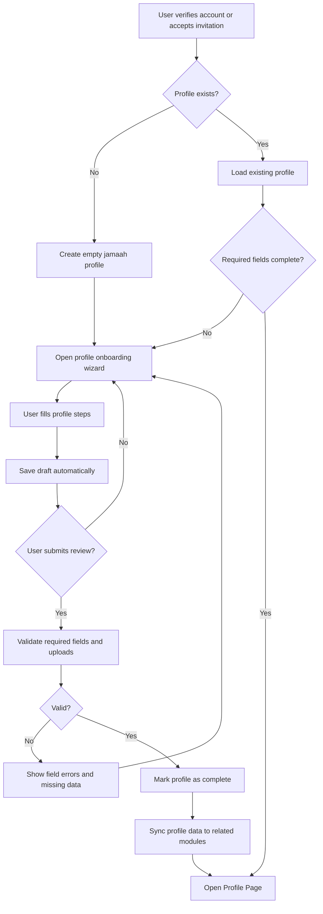

# JUV PRD 03 - Profile & Personal Data

Product: UmrahHaji.com Jamaah/User View  
Module: Profile & Personal Data  
Scope: Jamaah/User View / Profile, Identity, Preferences & Account Hub  
Platform: Mobile-first Responsive Web Platform  
Status: Draft  
Last Updated: 15 June 2026  

---

## 1. Objective

Profile & Personal Data allows a registered jamaah to complete, review, and maintain personal information needed for booking, travel documentation, trip participation, payment records, communication, and support.

This module also defines the main Profile Page as the user account hub. From this page, jamaah can access personal info, documents, bookings, transactions, referrals, payment settings, notifications, support, and account settings.

The module must avoid collecting unnecessary data. Several fields from the design reference look closer to Mutawwif, agent, or general social profile data. For Jamaah/User View, Phase 1 should prioritize travel-readiness data, contactability, identity documents, emergency contact, language/accessibility preferences, and profile completion status.

---

## 2. Relationship With Master PRD

This module follows the Jamaah/User View Master PRD:

1. Login/register is handled by JUV PRD 02.
2. Profile is required before booking confirmation, document review, group trip assignment, and payment tracking.
3. Jamaah profile data must sync to Admin Panel Jamaah Management.
4. Travel Agency Portal can view only the profile fields required to operate assigned bookings and group trips.
5. Sensitive data must be permission-controlled and audit-logged.
6. Health profiling is not part of core profile Phase 1 unless implemented as a separate privacy-controlled module.

---

## 3. Research Notes

Profile onboarding should follow practical digital form and privacy best practices:

1. Long forms should be split into clear steps with progress indicators and save/resume behavior.
2. The product should ask only for data that is required for the user journey or operational processing.
3. Personal data inputs should use semantic autocomplete attributes where possible to improve accessibility and mobile completion.
4. Uploaded files must be validated by extension, MIME type, file signature, size, and server-side security checks.
5. Users should be able to review and correct profile data before final submission.
6. Sensitive data such as identity, passport, emergency contact, health notes, and bank/payment details should be minimized and permission-controlled.

Reference sources:

- W3C WCAG 2.2 - Identify Input Purpose: https://www.w3.org/WAI/WCAG22/Understanding/identify-input-purpose.html
- OWASP File Upload Cheat Sheet: https://cheatsheetseries.owasp.org/cheatsheets/File_Upload_Cheat_Sheet.html
- GOV.UK Service Manual - Forms: https://www.gov.uk/service-manual/design/form-structure

---

## 4. Scope

### 4.1 In Scope for Phase 1

1. Profile onboarding after registration or invitation acceptance.
2. Mobile wizard for completing required profile data.
3. Basic profile photo upload.
4. Personal information.
5. Contact information.
6. Address information.
7. Identity and passport information.
8. Emergency contact.
9. Travel preferences and accessibility needs.
10. Language preference.
11. Profile completion progress.
12. Profile page account hub.
13. Edit profile.
14. Save as draft.
15. Review and submit profile.
16. Profile data validation.
17. Sensitive field access rules.
18. Audit events for sensitive updates.
19. Light mode and dark mode support.
20. Mobile, tablet, and desktop responsive behavior.

### 4.2 In Scope for Phase 2

1. Health profiling as a dedicated consent-based module.
2. Certificate management.
3. Travel readiness checklist automation.
4. Advanced family/dependent profile management.
5. Data export request.
6. Account deletion request workflow.
7. Multi-language profile forms.
8. Advanced profile verification workflow.
9. Preferences-based package recommendation.
10. Accessibility support matching with mutawwif or agency staff.

### 4.3 Out of Scope

1. Admin Panel profile editing workflow.
2. Travel Agency staff profile management.
3. Mutawwif professional profile and certifications.
4. Agent licensing.
5. Employment history as a required jamaah field.
6. Public social profile.
7. Assets and debt management.
8. Full medical record management.
9. Automated government ID verification.
10. Native mobile biometric profile unlock.

---

## 5. Product Positioning

Profile & Personal Data is the user's trusted account center. It should not feel like a corporate onboarding form. It should feel like a calm travel-readiness checklist that helps jamaah prepare correctly.

### 5.1 What Profile Is

| Area | Purpose |
| --- | --- |
| Account identity | Name, email, phone, profile photo |
| Travel identity | Nationality, IC/passport information |
| Contactability | Address, phone, emergency contact |
| Booking readiness | Required data used for package booking and group trip assignment |
| Document readiness | Basic document statuses and upload links |
| Preference readiness | Language, mobility support, communication preference |
| Account hub | Links to booking, trip, payment, referral, support, settings |

### 5.2 What Profile Is Not

| Area | Reason |
| --- | --- |
| Mutawwif experience profile | Belongs to Mutawwif Management |
| Travel agent licensing profile | Belongs to Travel Agency or staff modules |
| Full employment history | Not required for jamaah trip operation |
| Assets and debt | Requires Finance/Credit product scope, not core jamaah profile |
| Full health records | Sensitive and should be a separate consent-based module |
| Public social profile | Not needed for booking or trip operations |

---

## 6. User Roles

| Role | Description |
| --- | --- |
| Registered User | Can complete own profile after account activation |
| Jamaah | Registered user with completed or partially completed jamaah profile |
| Primary Booker | Can manage profile data needed for booking self/family/group |
| Family PIC | Can help manage family member profile data where consent/relationship allows |
| Family Member | May have limited access or profile managed by PIC |
| Travel Agency Staff | Can view assigned jamaah data needed for booking/trip operation |
| Admin | Can view and manage jamaah data according to platform permission |

---

## 7. Entry Points

| Entry Point | Behavior |
| --- | --- |
| After successful OTP verification | Redirect to profile onboarding if profile incomplete |
| After invitation acceptance | Redirect to profile onboarding or profile review |
| Profile bottom nav tab | Opens Profile Page |
| Booking flow | Prompts missing required profile fields before booking confirmation |
| My Trip | Shows profile/document readiness status |
| Payment flow | Uses contact and billing identity fields |
| Document reminder notification | Opens relevant profile/document section |
| Edit profile action | Opens editable profile form |

---

## 8. Information Architecture

```text
Profile & Personal Data
├── Profile Onboarding Wizard
│   ├── Step 1: Basic Profile
│   ├── Step 2: Personal Details
│   ├── Step 3: Address Information
│   ├── Step 4: Identity & Passport
│   ├── Step 5: Emergency Contact
│   ├── Step 6: Travel Preferences
│   └── Review & Submit
├── Profile Page
│   ├── Header Summary
│   ├── Profile Completion
│   ├── Trip & Booking Summary
│   ├── Payment & Referral Summary
│   ├── Menu Grid
│   └── Logout
├── Edit Profile
│   ├── Personal Info
│   ├── Contact & Address
│   ├── Identity & Passport
│   ├── Emergency Contact
│   └── Preferences
└── Connected Modules
    ├── Documents
    ├── Booking
    ├── My Group Trip
    ├── Transaction History
    ├── Referral
    ├── Payment Settings
    ├── Notifications
    ├── Reports & Support
    └── Settings
```

---

## 9. Main Profile Completion Flow



---

## 10. Profile Status Model

| Status | Meaning | User Behavior |
| --- | --- | --- |
| Incomplete | Required profile data is missing | User can browse but may be blocked before booking confirmation |
| Draft | User started profile but has not submitted | User can continue later |
| Submitted | User completed required profile fields | Used for booking/trip readiness |
| Needs Update | Data is expired, invalid, or requested for revision | User is prompted to update |
| Verified | Admin/TA has confirmed key data where required | Used for high-readiness state |
| Locked | Profile is temporarily locked due to compliance/security review | User can view but not edit sensitive fields |

### 10.1 Recommended Phase 1 Behavior

Phase 1 should not require full admin verification before browsing or booking inquiry. However, booking confirmation and trip participation may require required identity/passport fields to be completed.

---

## 11. Onboarding Wizard Structure

The design reference shows two major steps:

1. Personal Info.
2. Experience & Skills.

For Jamaah/User View, this should be rewritten as:

1. Personal & Travel Identity.
2. Travel Preferences & Readiness.

This keeps the UX familiar while avoiding non-jamaah fields such as employment, agent license, and professional certification.

### 11.1 Step Grouping

| Step | Name | Required for Phase 1 | Purpose |
| --- | --- | --- | --- |
| 1 | Basic Profile | Yes | Identify the account holder |
| 2 | Personal Details | Yes | Required for travel and age-sensitive pricing |
| 3 | Address Information | Conditional | Required for invoice/contact and agency support |
| 4 | Identity & Passport | Conditional | Required before confirmed trip/document processing |
| 5 | Emergency Contact | Yes before trip | Required for travel operations |
| 6 | Travel Preferences & Readiness | Optional to required depending field | Improves service quality |
| 7 | Review & Submit | Yes | Confirm before saving final profile |

### 11.2 Save Behavior

1. The wizard must autosave after each completed step.
2. User can manually save draft.
3. User can leave and resume later.
4. System must show profile completion percentage.
5. If a protected action requires missing fields, system deep-links to the missing section.

---

## 12. Step 1 - Basic Profile

### 12.1 Objective

Capture the minimum account-facing identity fields.

### 12.2 Fields

| Field | Type | Required | Validation | Notes |
| --- | --- | --- | --- | --- |
| Profile Photo | Image Upload | No | JPG, JPEG, PNG, WebP, max 2 MB | Crop to 1:1; generate thumbnails |
| Full Name | Text Input | Yes | 2-100 chars | Must match travel document when possible |
| Preferred Name | Text Input | No | 2-60 chars | Used in UI greetings |
| Email | Email Input | Yes | Valid email, verified | Usually read-only after registration unless changed through secure flow |
| Country Code | Dropdown | Yes | Valid country calling code | Default from registration/invitation |
| Phone Number | Phone Input | Yes | E.164-compatible | Can be edited with re-verification if needed |

### 12.3 UX Requirements

1. Use floating labels after field is filled.
2. Use `autocomplete` attributes where supported.
3. Show upload guidance before user chooses image.
4. Show clear error if image is too large or unsupported.
5. Keep the Next button disabled only for hard-required missing fields.
6. Allow skip for profile photo.

---

## 13. Step 2 - Personal Details

### 13.1 Objective

Capture personal details needed for booking, trip, and identity matching.

### 13.2 Fields

| Field | Type | Required | Validation | Notes |
| --- | --- | --- | --- | --- |
| Date of Birth | Date Picker | Yes | Cannot be future date; age derived | Used for adult/child/infant pricing |
| Gender | Radio / Segmented Control | Yes | Male/Female | Keep simple for document matching |
| Nationality | Dropdown Search | Yes | Country list | Used for visa/document requirements |
| Marital Status | Dropdown | No | Single/Married/Other/Prefer not to say | Optional unless agency requires it |
| Preferred Language | Dropdown | No | Malay, English, Arabic, Indonesian, etc. | Used for content and support preference |
| Communication Preference | Checkbox / Select | No | Email, WhatsApp, SMS | Must respect notification settings |

### 13.3 Removed From Core

The following should not appear in core Jamaah profile Phase 1:

| Field | Reason |
| --- | --- |
| Employment history | Not needed for booking/trip |
| Agent company | Belongs to Travel Agency/Agent modules |
| Position/title | Not needed for jamaah |
| License number | Not needed unless user is mutawwif/agent |
| Professional certification | Not needed for jamaah |

---

## 14. Step 3 - Address Information

### 14.1 Objective

Capture residence/contact address for invoice, support, and document delivery context.

### 14.2 Fields

| Field | Type | Required | Validation | Notes |
| --- | --- | --- | --- | --- |
| Country | Dropdown Search | Yes | Country list | Default from phone/nationality if available |
| State/Province | Dropdown/Text | Yes | Depends on country | Use master data if available |
| City | Dropdown/Text | Yes | Depends on country | Use master data if available |
| Postal/ZIP Code | Text Input | Conditional | Country-specific where possible | Required when country uses postal code |
| Street Address | Text Area | Yes | Max 255 chars | Do not overconstrain formatting |

### 14.3 UX Requirements

1. Country selection controls state/city options where data exists.
2. If master data is unavailable, allow manual text entry.
3. Address can be optional for browsing but required before invoice/booking confirmation if needed.

---

## 15. Step 4 - Identity & Passport

### 15.1 Objective

Capture travel identity data needed for booking, visa preparation, and trip documents.

### 15.2 Identity Fields

| Field | Type | Required | Validation | Notes |
| --- | --- | --- | --- | --- |
| ID Type | Dropdown | Yes | IC/NRIC/KTP/Passport/Other | Depends on nationality |
| IC/NRIC/KTP Number | Text Input | Conditional | Country-specific where possible | Required if ID type selected |
| Passport Number | Text Input | Conditional | Alphanumeric, 5-20 chars | Required before confirmed international trip |
| Passport Expiry Date | Date Picker | Conditional | Must be future date | Warn if expiry is within 6 months of return date |
| Passport Issuing Country | Dropdown | Conditional | Country list | Required when passport entered |
| Passport Issuing Place | Text Input | No | Max 100 chars | Optional |

### 15.3 Identity Uploads

| Upload | Required | Format | Max Size | Notes |
| --- | --- | --- | --- | --- |
| Front IC / National ID Image | Conditional | JPG, JPEG, PNG, WebP | 5 MB | Compress and store optimized copy |
| Back IC / National ID Image | Conditional | JPG, JPEG, PNG, WebP | 5 MB | Required only if country document has back side |
| Passport Bio Page | Conditional | JPG, JPEG, PNG, WebP, PDF | 5 MB | Required before visa/trip document processing |

### 15.4 File Handling Requirements

1. Validate extension, MIME type, and file signature.
2. Reject executable, script, archive, and password-protected files.
3. Run malware scanning before making file accessible.
4. Generate preview thumbnails for images/PDF first page.
5. Store original only when required; otherwise store optimized secure copy.
6. Strip image metadata where possible.
7. Use private signed URLs for file access.
8. Keep upload retry resilient on mobile connection.

### 15.5 Server Load Guidance

1. Client should compress large images before upload where supported.
2. Upload should use direct-to-object-storage signed URL where possible.
3. Backend should receive metadata and status only after successful file upload.
4. Thumbnail generation should run asynchronously.
5. Max simultaneous uploads per user should be limited.
6. Show progress and allow cancel.

---

## 16. Step 5 - Emergency Contact

### 16.1 Objective

Capture the person to contact during travel emergency.

### 16.2 Fields

| Field | Type | Required | Validation | Notes |
| --- | --- | --- | --- | --- |
| Emergency Contact Name | Text Input | Yes before trip | 2-100 chars | Required before group trip departure |
| Relationship | Dropdown | Yes before trip | Parent/Spouse/Sibling/Child/Friend/Other | Configurable |
| Country Code | Dropdown | Yes before trip | Valid country calling code |  |
| Phone Number | Phone Input | Yes before trip | E.164-compatible |  |
| Email | Email Input | No | Valid email | Optional |
| Address | Text Area | No | Max 255 chars | Optional |

### 16.3 Rules

1. Emergency contact should not be the same phone/email as the jamaah unless user confirms.
2. User must consent that emergency contact may be contacted for travel-related urgent matters.
3. Emergency contact data is visible only to authorized Admin/TA/trip operation roles.

---

## 17. Step 6 - Travel Preferences & Readiness

### 17.1 Objective

Capture lightweight preferences that improve service quality without turning the profile into a professional resume.

### 17.2 Fields

| Field | Type | Required | Validation | Notes |
| --- | --- | --- | --- | --- |
| Previous Umrah/Hajj Experience | Yes/No | No | Boolean | Used for personalization only |
| Last Pilgrimage Year | Year Picker | Conditional | Cannot be future year | Shown only if previous experience is Yes |
| Number of Previous Trips | Number Input | Conditional | 0-99 | Optional |
| Preferred Guidance Language | Multi-select | No | Language list | Used for mutawwif/group matching where available |
| Mobility Assistance Needed | Yes/No | No | Boolean | Sensitive operational note |
| Wheelchair Assistance | Yes/No | No | Boolean | Requires consent and agency visibility |
| Dietary Notes | Text Area | No | Max 255 chars | Operational note, not medical diagnosis |
| Room Preference | Dropdown | No | Single/Double/Triple/Quad/Family/No preference | Used as preference, final room handled in booking/trip |
| Special Notes | Text Area | No | Max 500 chars | User-provided note for agency/admin |

### 17.3 Fields Deferred to Phase 2

| Field Group | Recommendation |
| --- | --- |
| Health profiling | Separate P2 module with explicit consent |
| Medical documents | Separate P2 or Documents module |
| Vaccination record | Documents/Trip readiness, not base profile |
| Hobbies | Remove from Phase 1 |
| Skills/talents | Remove from Jamaah Phase 1 |
| Employment history | Remove from Jamaah Phase 1 |
| Education | Remove from Jamaah Phase 1 |
| Awards/certification | Remove from Jamaah Phase 1 |

---

## 18. Review & Submit

### 18.1 Objective

Allow user to review all profile data before marking profile as submitted.

### 18.2 Screen Content

1. Basic profile summary.
2. Personal details summary.
3. Address summary.
4. Identity/passport summary.
5. Emergency contact summary.
6. Travel preferences summary.
7. Missing required field warnings.
8. Data accuracy confirmation checkbox.
9. Privacy consent checkbox for sensitive operational data.
10. Submit button.

### 18.3 Rules

1. User can edit any section from the review screen.
2. Submit is disabled until required fields are complete.
3. User may save as draft and return later.
4. Sensitive optional fields require explicit consent before sharing with TA/trip operations.

---

## 19. Profile Page

### 19.1 Objective

Profile Page is the user account hub after registration/profile completion. It should show identity summary, readiness, quick status, and links to related modules.

### 19.2 Header

| Element | Description |
| --- | --- |
| Profile Photo | Avatar or uploaded photo |
| Full Name | Main display name |
| Role Badge | Jamaah / Family PIC / Registered User |
| Email | Verified email |
| Phone | Verified or unverified phone |
| Verification Status | Email verified, phone verified, profile complete, document readiness |
| Edit Profile CTA | Opens editable profile sections |

### 19.3 Stats Bar

The reference shows `Total Bookings`, `Completed Plans`, and `Grooming`. For product clarity, use:

| Label | Value Source | Notes |
| --- | --- | --- |
| Total Bookings | Booking Management | All bookings linked to user |
| Completed Trips | Group Trip/Booking | Completed package participation |
| Active Trips | My Group Trip | Current/upcoming confirmed trips |

Do not use the label `Grooming`; it is unclear for Umrah/Hajj context.

### 19.4 Summary Cards

The reference includes financial-like cards such as loan, topup, referral month, referral earnings, and referral bonus. For Jamaah/User Phase 1, keep this smaller and sourced from existing modules.

| Card | Source Module | Phase | Notes |
| --- | --- | --- | --- |
| Outstanding Balance | Billing/Transaction History | P1 | Only if user has unpaid invoice |
| Paid Amount | Billing/Transaction History | P1 | Lifetime or current booking total |
| Referral Earnings | Referral | P1 | Only if referral program enabled |
| Referral Bonus | Referral | P1 | Optional |
| Payment Method | Payment Settings | P1 | Default or not set |

Do not show `Assets & Debt` or `Loan` in core profile unless Finance/Credit product is approved.

### 19.5 Profile Completion Card

| Item | Behavior |
| --- | --- |
| Completion Percentage | Based on required fields and required documents |
| Missing Items | Shows up to 3 priority missing items |
| CTA | Continue Setup / Update Documents |
| Readiness Label | Incomplete / Ready for Booking / Ready for Trip |

### 19.6 Menu Grid

| Menu Item | Destination | Phase | Notes |
| --- | --- | --- | --- |
| Personal Info | Edit Profile | P1 | Core profile data |
| Documents | Documents module | P1 | Passport, IC, visa-related docs |
| My Bookings | Booking module | P1 | Booking list/history |
| My Trip | Group Trip module | P1 | Current/upcoming trip |
| Transaction | Transaction History | P1 | Invoices, receipts, payments |
| Payment Settings | Payment Settings | P1 | Saved payment preference/instructions |
| My Referrals | Referral | P1 | Referral link/code and rewards |
| Notifications | Notification Settings | P1 | Email/WhatsApp/SMS preferences |
| Support & Help | Reports & Support | P1 | Report issue, help center |
| Articles/Guidance | Articles | P1 | Education content |
| Settings | Account Settings | P1 | Password, session, language |
| Health | Health Profiling | P2 | Hidden in P1 unless module exists |
| Assets & Debt | Finance/Credit | Backlog | Hide until financing product is approved |
| My Certificate | Certificate | P2 | Available after completed trip if implemented |

### 19.7 Logout

1. Logout button appears near the bottom of Profile Page.
2. Logout requires confirmation only if there are unsaved changes.
3. After logout, user returns to homepage or login screen.

---

## 20. Edit Profile

### 20.1 Behavior

1. User can edit non-sensitive fields directly.
2. Email changes require secure re-verification.
3. Phone changes require OTP verification if phone verification is enabled.
4. Passport number/expiry changes must be logged.
5. If a booking/trip is already confirmed, changing identity/passport details may mark related documents as `Needs Review`.

### 20.2 Editable Sections

| Section | Editable | Notes |
| --- | --- | --- |
| Basic Profile | Yes | Email/phone may require re-verification |
| Personal Details | Yes | Changes may affect pricing category if DOB changes |
| Address | Yes | Low risk |
| Identity & Passport | Yes with audit | May trigger document review |
| Emergency Contact | Yes | Important before departure |
| Travel Preferences | Yes | Low/medium sensitivity depending field |

---

## 21. Profile Completion Logic

### 21.1 Completion Components

| Component | Weight | Required For |
| --- | ---: | --- |
| Basic profile | 20% | Account usability |
| Personal details | 20% | Booking |
| Address | 10% | Invoice/support |
| Identity/passport fields | 20% | Trip/document readiness |
| Required uploads | 15% | Visa/document readiness |
| Emergency contact | 10% | Trip readiness |
| Preferences | 5% | Service quality |

### 21.2 Readiness States

| State | Criteria |
| --- | --- |
| Basic Ready | Basic profile + email verified |
| Booking Ready | Basic profile + personal details complete |
| Document Ready | Passport/identity fields + required uploads complete |
| Trip Ready | Document Ready + emergency contact + required trip-specific docs complete |

### 21.3 Blocking Rules

| User Action | Blocking Requirement |
| --- | --- |
| Browse homepage/packages/articles | No profile required |
| Save package/wishlist | Login required |
| Start booking | Login required |
| Confirm booking | Booking Ready required |
| Join group trip | Document Ready may be required |
| Depart trip | Trip Ready required |
| Submit support report | Login required |

---

## 22. Data Sharing Rules

### 22.1 Admin Panel

Admin can access jamaah profile data according to role permission.

| Data | Admin Access |
| --- | --- |
| Basic profile | View/Edit by permission |
| Personal details | View/Edit by permission |
| Identity/passport | View/Edit by sensitive permission |
| Uploads | View/Download by sensitive permission |
| Emergency contact | View/Edit by trip operation permission |
| Travel preferences | View/Edit by operation permission |

### 22.2 Travel Agency Portal

Travel Agency can access only assigned jamaah data needed for booking/trip operation.

| Data | TA Access |
| --- | --- |
| Name, email, phone | Assigned bookings/trips only |
| Passport/identity summary | Assigned bookings/trips only |
| Document status | Assigned bookings/trips only |
| Uploaded files | Only if permission and operational need |
| Emergency contact | Trip operation roles only |
| Sensitive preference notes | Only with consent and operational need |

### 22.3 User Visibility

User must be able to see:

1. Which profile fields are complete.
2. Which documents are pending.
3. Which fields are shared with travel agency for assigned trip.
4. When sensitive fields were last updated.
5. Whether a sensitive update is under review.

---

## 23. Data Model

### 23.1 User Profile

| Field | Type | Required | Notes |
| --- | --- | --- | --- |
| profile_id | UUID | Yes | Primary profile record |
| user_id | UUID | Yes | Links to user account |
| full_name | String | Yes | Legal/display name |
| preferred_name | String | No | UI greeting |
| profile_photo_url | URL | No | Private media URL |
| email | String | Yes | From auth account |
| email_verified_at | Timestamp | Conditional | From auth module |
| phone_country_code | String | Yes | E.164 country code |
| phone_number | String | Yes | Phone number |
| phone_verified_at | Timestamp | No | If phone verification enabled |
| date_of_birth | Date | Yes | Used for age category |
| gender | Enum | Yes | Male/Female |
| nationality | Country Code | Yes |  |
| marital_status | Enum | No | Optional |
| preferred_language | String | No |  |
| communication_preference | Array | No | Email/WhatsApp/SMS |
| profile_status | Enum | Yes | Incomplete/Draft/Submitted/Needs Update/Verified/Locked |
| completion_percentage | Integer | Yes | 0-100 |
| created_at | Timestamp | Yes |  |
| updated_at | Timestamp | Yes |  |

### 23.2 Address

| Field | Type | Required | Notes |
| --- | --- | --- | --- |
| address_id | UUID | Yes |  |
| user_id | UUID | Yes |  |
| country | Country Code | Yes |  |
| state_province | String | Yes |  |
| city | String | Yes |  |
| postal_code | String | Conditional |  |
| street_address | Text | Yes |  |
| is_primary | Boolean | Yes | Default true |

### 23.3 Identity & Passport

| Field | Type | Required | Notes |
| --- | --- | --- | --- |
| identity_id | UUID | Yes |  |
| user_id | UUID | Yes |  |
| id_type | Enum | Yes | IC/NRIC/KTP/Passport/Other |
| id_number | String | Conditional |  |
| passport_number | String | Conditional | Required for international trip |
| passport_expiry_date | Date | Conditional | Warn if near expiry |
| passport_issuing_country | Country Code | Conditional |  |
| passport_issuing_place | String | No |  |
| verification_status | Enum | Yes | Not Submitted/Pending/Verified/Rejected/Needs Update |
| last_reviewed_by | UUID | No | Admin/TA reviewer if applicable |
| last_reviewed_at | Timestamp | No |  |

### 23.4 Emergency Contact

| Field | Type | Required | Notes |
| --- | --- | --- | --- |
| emergency_contact_id | UUID | Yes |  |
| user_id | UUID | Yes |  |
| full_name | String | Yes |  |
| relationship | Enum | Yes |  |
| phone_country_code | String | Yes |  |
| phone_number | String | Yes |  |
| email | String | No |  |
| address | Text | No |  |
| consent_acknowledged | Boolean | Yes |  |

### 23.5 Travel Preference

| Field | Type | Required | Notes |
| --- | --- | --- | --- |
| preference_id | UUID | Yes |  |
| user_id | UUID | Yes |  |
| previous_pilgrimage | Boolean | No |  |
| last_pilgrimage_year | Integer | No |  |
| previous_trip_count | Integer | No |  |
| preferred_guidance_languages | Array | No |  |
| mobility_assistance_needed | Boolean | No | Sensitive |
| wheelchair_assistance | Boolean | No | Sensitive |
| dietary_notes | Text | No | Operational note |
| room_preference | Enum | No | Preference only |
| special_notes | Text | No |  |
| consent_to_share_with_agency | Boolean | Conditional | Required for sensitive operational notes |

---

## 24. Upload Specification

| Asset | Accepted Formats | Max Size | Recommended Client Handling | Server Handling |
| --- | --- | ---: | --- | --- |
| Profile Photo | JPG, JPEG, PNG, WebP | 2 MB | Crop/compress to 1:1 | Thumbnail generation |
| National ID Front | JPG, JPEG, PNG, WebP | 5 MB | Compress image before upload | Private storage + malware scan |
| National ID Back | JPG, JPEG, PNG, WebP | 5 MB | Compress image before upload | Private storage + malware scan |
| Passport Bio Page | JPG, JPEG, PNG, WebP, PDF | 5 MB | Compress image or PDF where possible | Private storage + preview |

### 24.1 Upload Error States

| Case | Message |
| --- | --- |
| File too large | File is too large. Maximum size is {{MAX_SIZE}}. |
| Unsupported format | Unsupported file format. Please upload JPG, PNG, WebP, or PDF where allowed. |
| Upload failed | Upload failed. Please check your connection and try again. |
| Security rejected | This file cannot be uploaded. Please choose another file. |
| Preview failed | File uploaded, but preview is not available. |

---

## 25. Functional Requirements

| ID | Requirement | Priority |
| --- | --- | --- |
| JUV-PROF-001 | System shows profile onboarding after account verification if required profile is incomplete | P1 |
| JUV-PROF-002 | User can complete Basic Profile fields | P1 |
| JUV-PROF-003 | User can upload optional profile photo with max 2 MB limit | P1 |
| JUV-PROF-004 | User can complete Personal Details fields | P1 |
| JUV-PROF-005 | User can complete Address Information fields | P1 |
| JUV-PROF-006 | User can complete Identity & Passport fields | P1 |
| JUV-PROF-007 | User can upload required identity/passport documents with max 5 MB per file | P1 |
| JUV-PROF-008 | User can complete Emergency Contact fields | P1 |
| JUV-PROF-009 | User can add travel preferences and accessibility needs | P1 |
| JUV-PROF-010 | User can review all profile data before submitting | P1 |
| JUV-PROF-011 | User can save profile as draft and resume later | P1 |
| JUV-PROF-012 | System calculates profile completion percentage | P1 |
| JUV-PROF-013 | System shows profile readiness state | P1 |
| JUV-PROF-014 | System blocks booking confirmation if required profile fields are missing | P1 |
| JUV-PROF-015 | System warns if passport expires within 6 months of trip return date | P1 |
| JUV-PROF-016 | User can edit profile after submission | P1 |
| JUV-PROF-017 | Email changes require secure re-verification | P1 |
| JUV-PROF-018 | Phone changes require re-verification if phone verification is enabled | P1 |
| JUV-PROF-019 | Sensitive identity/passport updates are audit-logged | P1 |
| JUV-PROF-020 | Sensitive optional preference data requires consent before sharing with agency | P1 |
| JUV-PROF-021 | Profile Page shows account header, stats, summaries, menu grid, and logout | P1 |
| JUV-PROF-022 | Profile Page links to Documents, Bookings, My Trip, Transactions, Payment Settings, Referral, Notifications, Support, and Settings | P1 |
| JUV-PROF-023 | Travel Agency can only view profile data for assigned jamaah/bookings/trips | P1 |
| JUV-PROF-024 | Admin can access profile data according to permission model | P1 |
| JUV-PROF-025 | Uploads are validated, scanned, and stored privately | P1 |
| JUV-PROF-026 | Profile onboarding supports mobile, tablet, desktop, light mode, and dark mode | P1 |
| JUV-PROF-027 | Profile forms follow accessibility and semantic input requirements | P1 |
| JUV-PROF-028 | User can see missing profile/document items from Profile Page | P1 |
| JUV-PROF-029 | Health Profiling is hidden unless Phase 2 module is enabled | P2 |
| JUV-PROF-030 | Assets & Debt is hidden unless Finance/Credit module is approved | Backlog |

---

## 26. Acceptance Criteria

1. User who completes account verification and has no profile is redirected to onboarding.
2. User can complete the profile wizard step by step on mobile.
3. User can save draft and resume without losing data.
4. Required fields show clear validation messages.
5. Profile photo upload rejects unsupported format and files over 2 MB.
6. Identity/passport uploads reject unsupported format and files over 5 MB.
7. Uploads show progress, success, error, and retry states.
8. Review screen displays all key profile data before submission.
9. Submit is disabled when required fields are missing.
10. Profile completion percentage updates after each completed step.
11. Profile Page shows user header, status, stats, summary cards, menu grid, and logout.
12. Booking confirmation is blocked if required profile fields are incomplete.
13. Passport expiry warning appears when passport expires within 6 months of trip return.
14. Email/phone updates trigger verification requirements.
15. Identity/passport edits are audit-logged.
16. Travel Agency cannot access unassigned jamaah profile data.
17. Sensitive optional data is not shared with agency unless consent is given.
18. Health, Assets & Debt, and certificate menus are hidden unless their modules are enabled.
19. Dark mode remains readable with sufficient contrast.
20. Forms meet mobile usability and accessibility requirements.

---

## 27. Edge Cases

| Case | Expected Behavior |
| --- | --- |
| User leaves onboarding midway | Autosave draft and allow resume |
| User uploads large phone camera image | Compress client-side if possible or reject with clear message |
| User has no passport yet | Allow draft, but block trip-ready status |
| User passport expires soon | Show warning and mark action needed |
| User changes DOB after booking | Flag booking/pricing review if age category changes |
| User changes name after invoice issued | Keep invoice history unchanged; update future records |
| User has existing invited profile | Load existing data and ask user to confirm/update |
| Family PIC manages dependent | Show relationship/permission rule before editing |
| Network disconnects during upload | Pause/fail gracefully and allow retry |
| Document review rejects upload | Show reason and upload replacement CTA |

---

## 28. Audit Events

| Event | Logged Data |
| --- | --- |
| profile_created | user_id, source, timestamp |
| profile_draft_saved | user_id, changed_sections, timestamp |
| profile_submitted | user_id, completion_percentage, timestamp |
| profile_updated | user_id, changed_fields, timestamp |
| sensitive_identity_updated | user_id, field_group, old_hash, new_hash, timestamp |
| document_uploaded | user_id, document_type, file_metadata, timestamp |
| document_deleted | user_id, document_type, timestamp |
| emergency_contact_updated | user_id, timestamp |
| agency_data_consent_updated | user_id, consent_value, timestamp |
| profile_locked | user_id, locked_by, reason, timestamp |

---

## 29. Open Questions

1. Should phone verification be mandatory in Phase 1 or only email verification?
2. Should passport upload be mandatory during onboarding or only before booking/trip confirmation?
3. Should Travel Agency be allowed to download passport files or only view document status?
4. Should emergency contact be required before booking confirmation or only before trip departure?
5. Should profile verification be done by Admin only, TA only, or both depending booking source?
6. Should Family PIC be able to edit dependent profile data without dependent account activation?

---

## 30. Summary

Profile & Personal Data is the operational backbone of Jamaah/User View. The design reference is useful for visual flow, but the data model should be simplified for jamaah needs. Phase 1 should focus on account identity, contact data, address, identity/passport readiness, emergency contact, lightweight travel preferences, and a clear Profile Page hub.

Experience, skills, employment, licenses, education, awards, hobbies, assets/debt, and full health profiling should not be included in core Jamaah profile Phase 1 unless there is a separate approved module and data ownership model.

Recommended production flow:

```text
Account verified
-> Profile onboarding
-> Basic profile
-> Personal details
-> Address
-> Identity & passport
-> Emergency contact
-> Travel preferences
-> Review & submit
-> Profile Page hub
```

