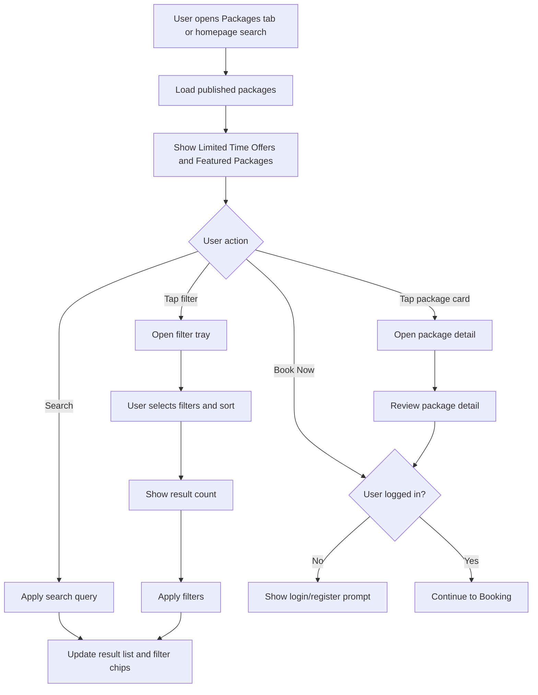

# JUV PRD 04 - Package Discovery & Search

Product: UmrahHaji.com Jamaah/User View  
Module: Package Discovery & Search  
Scope: Jamaah/User View / Package Marketplace Discovery  
Platform: Mobile-first Responsive Web Platform  
Status: Draft  
Last Updated: 15 June 2026  

---

## 1. Objective

Package Discovery & Search allows public visitors and registered jamaah to browse, search, filter, sort, compare at a basic level, and open details of Umrah/Hajj packages published by verified travel agencies.

The module is the main commercial discovery surface of Jamaah/User View. It must help users quickly answer:

1. Which package is suitable for my budget and schedule?
2. Which travel agency provides it?
3. What is included?
4. What hotel, flight, itinerary, and services are used?
5. How many seats or family slots are available?
6. What is the next action if I want to book?

---

## 2. Relationship With Master PRD

This module follows the Jamaah/User View Master PRD:

1. Public visitors can browse packages without login.
2. Login is required to save, book, pay, or continue a protected action.
3. Package data is created and managed by Travel Agency Portal, supervised by Admin Panel.
4. Only packages with approved/published status can appear in Jamaah/User View.
5. Package cards must reflect data from Package Management, Hotel Management, Flight/Airline Management, Itinerary Management, Season Management, Testimonial Management, and Billing/Payment rules.
6. Package discovery must be mobile-first but also responsive for tablet and desktop.

---

## 3. Research Notes

Package discovery uses marketplace and travel search patterns:

1. Mobile faceted filtering works better when users keep some context of the result list instead of moving to a separate full screen with no visible result relationship.
2. Filter controls should use clear labels such as `Sort & Filters`, `Apply Filters`, and `Reset`, not icon-only controls.
3. Result count and selected filter chips should remain visible so users understand the effect of their selections.
4. Search, sort, and filters must support empty states, no-result recovery, loading states, and error states.
5. Touch targets should meet minimum accessible size and spacing for mobile users.
6. Filters should be based on real package data and operational availability, not only static UI categories.

Reference sources:

- Nielsen Norman Group - Mobile Faceted Search with a Tray: https://www.nngroup.com/articles/mobile-faceted-search/
- W3C WCAG 2.2 - Target Size Minimum: https://www.w3.org/WAI/WCAG22/Understanding/target-size-minimum.html

---

## 4. Scope

### 4.1 In Scope for Phase 1

1. Package discover page.
2. Search packages, destinations, and agencies.
3. Limited Time Offers section.
4. Featured Packages section.
5. Package result list.
6. Filter tray/drawer.
7. Sort options.
8. Selected filter chips.
9. Package cards.
10. Package detail page.
11. Package availability and seat summary.
12. Price display.
13. Promo labels.
14. Travel agency verification badge.
15. Hotel, flight, itinerary, duration, and schedule summaries.
16. Ratings and review count.
17. Book Now CTA.
18. Login prompt for protected actions.
19. Empty/loading/error states.
20. Mobile, tablet, and desktop responsive behavior.

### 4.2 In Scope for Phase 2

1. Full package comparison.
2. Saved packages/wishlist.
3. Personalized package recommendations.
4. Advanced package alerts.
5. Map-based hotel/destination browsing.
6. AI-assisted package matching.
7. Multi-currency display.
8. Deep agency directory integration.
9. Recently viewed packages.
10. Package sharing analytics.

### 4.3 Out of Scope

1. Travel Agency package creation.
2. Admin package approval.
3. Booking form and payment submission.
4. Group trip management.
5. User document upload.
6. Package inventory reconciliation with external systems.
7. Real-time airline/hotel supplier booking API integration.

---

## 5. Product Positioning

Package Discovery & Search is not just a product listing page. It is the customer-facing marketplace layer for packages that have already been configured by Travel Agencies and approved or supervised by Admin.

### 5.1 Data Owners

| Data | Source Module | Owner |
| --- | --- | --- |
| Package title, category, type, price, labels | Package Management | Travel Agency, Admin oversight |
| Package availability and schedules | Package Management / Season Management | Travel Agency |
| Hotel summary | Hotel Management + Package Management | Admin catalog, Travel Agency selection |
| Flight summary | Flight/Airline Management + Package Management | Admin catalog, Travel Agency selection |
| Itinerary summary | Itinerary Management + Package Management | Admin template, Travel Agency package |
| Agency name and verification badge | Travel Agency Management | Admin |
| Rating and reviews | Testimonial Management | Jamaah feedback, Admin moderation |
| Payment methods and deposit rules | Billing/Payment Management | Travel Agency/Admin settings |

### 5.2 Display Rules

Only show packages that meet all conditions:

1. Package status is `Published`.
2. Travel Agency status is `Active` and verified.
3. Package has at least one active schedule or valid availability window.
4. Package has required public fields: name, price, category, type, agency, duration, schedule, hotel/flight summary, and thumbnail.
5. Package is not archived, suspended, expired, or hidden.

---

## 6. User Roles

| Role | Description |
| --- | --- |
| Public Visitor | Can search, filter, view package detail, and open login/register prompt |
| Registered User | Can search, filter, view detail, save where enabled, and start booking |
| Jamaah | Can book, view relevant package/trip after purchase, and submit feedback after trip |
| Family PIC | Can evaluate packages for family/group booking |
| Travel Agency Staff | Data owner for agency-created packages, not a user of this module |
| Admin | Supervises package visibility and quality from Admin Panel |

---

## 7. Entry Points

| Entry Point | Behavior |
| --- | --- |
| Homepage search panel | Opens package result list with query/filter prefilled |
| Bottom nav Packages tab | Opens Package Discover default state |
| Limited Time Offers card | Opens Package Detail |
| Featured Packages card | Opens Package Detail |
| View All Promo | Opens result list filtered by promo label |
| Browse All Packages | Opens full package result list |
| Travel Agency page | Opens result list filtered by agency |
| Article/guide CTA | Opens result list filtered by relevant category |
| Shared package link | Opens Package Detail |

---

## 8. Information Architecture

```text
Package Discovery & Search
├── Package Discover
│   ├── Top Navbar
│   ├── Search Bar
│   ├── Limited Time Offers
│   ├── Featured Packages
│   ├── Package Result List
│   ├── Sort & Filters CTA
│   └── Bottom Navigation
├── Filter Tray
│   ├── Sort By
│   ├── Category
│   ├── Package Type
│   ├── Price Range
│   ├── Duration
│   ├── Departure Date
│   ├── Departure City / Airport
│   ├── Airline
│   ├── Hotel Class
│   ├── Hotel Distance
│   ├── Amenities / Inclusions
│   ├── Travel Agency
│   ├── Rating
│   ├── Availability
│   └── Reset / Apply
├── Package Detail
│   ├── Media Gallery
│   ├── Package Summary
│   ├── Price & Availability
│   ├── Included Services
│   ├── Hotel & Flight
│   ├── Itinerary
│   ├── Agency Information
│   ├── Reviews
│   ├── FAQ / Terms Summary
│   └── Book Now CTA
└── Protected Actions
    ├── Login Prompt
    ├── Register Prompt
    └── Continue Booking
```

---

## 9. Main Discovery Flow



---

## 10. Screen 1 - Package Discover Default

### 10.1 Objective

Provide a mobile-first package browsing page with search, promotional sections, featured packages, and quick access to filters.

### 10.2 Top Navbar

| Element | Requirement |
| --- | --- |
| Logo | Use UmrahHaji.com logo image |
| Login/Hamburger Button | If guest, show menu + Login label |
| Notification/Cart | Optional if user is logged in |
| Sticky Behavior | Navbar may become compact/sticky on scroll |

### 10.3 Search Bar

| Element | Requirement |
| --- | --- |
| Placeholder | Search packages, destinations, or agencies |
| Search Targets | Package name, agency name, city, hotel, airline, category, type |
| Submit Behavior | Updates package results |
| Suggestions | Phase 1 optional: recent/popular searches |
| Debounce | 300-500 ms if live query is enabled |
| Clear Action | User can clear query |

### 10.4 Limited Time Offers

| Element | Requirement |
| --- | --- |
| Section Title | Limited Time Offers |
| Subtitle | Special promotions for Umrah, Hajj, and Family packages |
| Tabs | All, Umrah, Hajj, Family |
| Card Layout | Horizontal scroll on mobile |
| Card Count | Show up to 10, initial 4 visible through scroll |
| CTA | View All Promo |

Package source rule:

1. Package must have active promotional label or discount.
2. Promo period must be currently active.
3. Package schedule must still have availability.
4. Package must be published and agency active.

### 10.5 Featured Packages

| Element | Requirement |
| --- | --- |
| Section Title | Featured Packages |
| Subtitle | Premium, Budget, VIP & Express packages from verified partners |
| Tabs | All, Premium, Budget, VIP, Express, Economy |
| Card Layout | Vertical list on mobile, grid on tablet/desktop |
| CTA | Browse All Packages |

Featured ranking may use:

1. Admin/TA featured flag.
2. Agency verification status.
3. Package rating.
4. Availability.
5. Recent performance.
6. Promotional priority.

### 10.6 Sort & Filters Floating CTA

| Element | Requirement |
| --- | --- |
| Label | Sort & Filters |
| Icon | Filter icon with text |
| Position | Floating bottom-right above bottom nav or sticky result toolbar |
| Behavior | Opens filter tray |
| Badge | Show selected filter count |

### 10.7 Bottom Navigation

Use Master PRD navigation:

| Tab | Label |
| --- | --- |
| Home | Home |
| Packages | Packages |
| My Trip | My Trip |
| Payments | Payments |
| Profile | Profile |

The reference has wallet/analysis icons. For Jamaah/User View, use meaningful product labels rather than duplicate analytics icons.

---

## 11. Package Card Specification

### 11.1 Promotional Card

| Field | Required | Source |
| --- | --- | --- |
| Thumbnail | Yes | Package gallery |
| Package Name | Yes | Package Management |
| Agency Name | Yes | Travel Agency Management |
| Agency Verification Badge | Yes | Travel Agency Management |
| Original Price | Conditional | Package promo pricing |
| Discounted Price | Yes | Package pricing |
| Currency | Yes | Default MYR/RM in Phase 1 |
| Price Unit | Yes | Per pax, per family, per package |
| Category Badge | Yes | Umrah/Hajj/Family |
| Type Badge | Yes | Economy/VIP/Premium/Express |
| Promo Badge | Conditional | Hot Deal, Best Offer, Family Deal |
| Discount Percentage | Conditional | Derived |
| Duration | Yes | Package duration |
| Schedule | Yes | Next available date or selected schedule |
| Availability | Yes | Seats/family slots left |
| Rating | Conditional | Testimonial data |
| Review Count | Conditional | Testimonial data |
| Book Now CTA | Yes | Opens login/booking flow |

### 11.2 Featured/List Card

| Field | Required | Notes |
| --- | --- | --- |
| Thumbnail | Yes | Landscape crop |
| Name and agency | Yes | Agency badge visible |
| Hotel summary | Yes | Makkah/Madinah hotel names if available |
| Flight summary | Conditional | Airline and airport summary |
| Duration and dates | Yes | Human readable |
| Price | Yes | Clear final starting price |
| Tags | Conditional | Promo, type, inclusions |
| Book CTA | Yes | Primary action |
| Detail tap area | Yes | Entire card can open detail, CTA remains explicit |

### 11.3 Card UX Rules

1. Do not hide price behind detail page.
2. Show `From RM X` if multiple schedules/room types affect price.
3. Show `Sold Out` or `Waitlist` instead of Book Now when no seats remain.
4. Show package type and category clearly.
5. Do not show too many badges; max 3 visible, rest collapsed.
6. Use optimized images and skeleton loading.
7. Card touch targets must meet WCAG target size guidance.

---

## 12. Screen 2 - Filter Tray

### 12.1 Objective

Allow users to narrow package results while keeping relationship with the result list visible.

### 12.2 Recommended Pattern

Use a right-side slide tray/drawer on mobile with translucent overlay. The results remain visually behind the tray. On tablet/desktop, filters may become a left sidebar or top filter bar.

### 12.3 Filter Tray Structure

| Section | Controls | Notes |
| --- | --- | --- |
| Header | Sort & Filters title, close button, result count | Result count should update |
| Sort By | Most popular, lowest price, highest price, shortest duration, earliest departure, highest rated | Single select |
| Category | Umrah, Hajj, Family | Multi-select |
| Package Type | Economy, Standard, Premium, VIP, Express, Private, Plus, Mujamalah | Multi-select; labels from master data |
| Price Range | Min/max price slider + numeric input | Currency defaults to MYR/RM |
| Duration | 5D/3N, 7D/5N, 9D/7N, 12D/10N, 14D/12N, 21+ days | Multi-select |
| Departure Date | Date range picker | Supports flexible month |
| Departure City / Airport | Kuala Lumpur, Jakarta, Surabaya, etc. | Based on package flight setup |
| Airline | Malaysia Airlines, Saudia, Qatar, Turkish, Emirates, etc. | Based on active airlines |
| Hotel Class | 3 star, 4 star, 5 star | Multi-select |
| Hotel Distance | 0-300m, 301-700m, 701m-1km, 1km+ | Based on hotel catalog |
| Amenities/Inclusions | Flight ticket, visa processing, hotel stay, transport, breakfast, mutawwif guide, insurance, wheelchair assistance | Multi-select |
| Travel Agency | Verified agencies with active packages | Searchable |
| Rating | 4.5+, 4.0+, 3.5+ | Optional |
| Availability | Available seats, family slots, low seat warning, sold out hidden | Optional |
| Season | Low, Mid, High/Peak | From Season Management |

### 12.4 Footer Actions

| Action | Behavior |
| --- | --- |
| Reset | Clears all filters and keeps user on tray |
| Apply Filters | Closes tray and updates result list |
| Show Results Count | Button label can show `Show 125 Packages` if data is available |

### 12.5 Filter State Rules

1. Selected filters appear as chips above results.
2. Chips can be removed individually.
3. `Clear All` appears when one or more filters are active.
4. Query string should store active filters for shareable URLs.
5. Back button should close tray before navigating away.
6. Filter options with zero results may be disabled or hidden depending UX decision.
7. Price range must use active currency and package price rules.

---

## 13. Search & Results Behavior

### 13.1 Search Index Fields

| Field | Searchable |
| --- | --- |
| Package name | Yes |
| Package description | Yes |
| Travel agency name | Yes |
| Category/type | Yes |
| Destination city | Yes |
| Hotel name | Yes |
| Airline name | Yes |
| Itinerary day title/focus | Optional |
| Inclusions/features | Yes |

### 13.2 Result Ranking

Default ranking should combine:

1. Exact match relevance.
2. Package publish status.
3. Availability.
4. Agency verification.
5. Active schedule proximity.
6. Rating/review count.
7. Promotion priority.
8. Featured flag.

### 13.3 No Results

If no results match:

1. Show clear empty state.
2. Show active filters causing no results.
3. Offer `Clear All Filters`.
4. Offer related categories or nearby dates.
5. Keep search query editable.

### 13.4 Loading

Use skeleton cards for:

1. Initial page load.
2. Search query update.
3. Applying filters.
4. Loading more packages.

### 13.5 Pagination

Mobile:

1. Infinite scroll or `Load More` is preferred.
2. Keep result count visible.
3. Preserve scroll position when returning from detail.

Desktop:

1. Pagination or infinite scroll can be used.
2. URL state must remain consistent.

---

## 14. Package Detail Page

### 14.1 Objective

Provide enough information for a user to decide whether to book or contact/register.

### 14.2 Detail Page Sections

| Section | Content |
| --- | --- |
| Media Gallery | Images/video from package gallery |
| Package Header | Name, agency, verification badge, rating, category/type badges |
| Price & Availability | Starting price, original price if promo, deposit info, seats left |
| Schedule Selector | Available departure dates and duration |
| Package Summary | Short description, who it is for |
| Key Inclusions | Flight, hotel, visa, transport, mutawwif, insurance, meals, emergency support |
| Hotel & Flight | Selected hotels, star rating, mosque distance, airline, airport, transit summary |
| Itinerary Preview | Day-by-day summary from itinerary template/package |
| Room & Pricing Summary | Room types and public price rules if available |
| Agency Info | Agency name, verification status, rating, contact/support availability |
| Reviews | End-of-trip reviews and rating summary |
| Terms Summary | Cancellation, refund, payment terms, document requirements |
| FAQ | Package-specific common questions |
| Sticky CTA | Book Now / Login to Book / Sold Out / Join Waitlist |

### 14.3 Detail CTA Rules

| Package State | CTA |
| --- | --- |
| Available, guest | Login/Register to Book |
| Available, logged in | Book Now |
| Low seats | Book Now with low-seat warning |
| Sold out | Join Waitlist or View Similar |
| Expired schedule | View Other Dates |
| Draft/Inactive/Archived | Not visible to public |

---

## 15. Data Model

### 15.1 Public Package Listing View

| Field | Type | Required | Notes |
| --- | --- | --- | --- |
| package_id | UUID | Yes | Public package reference |
| slug | String | Yes | SEO/share URL |
| package_name | String | Yes |  |
| category | Enum | Yes | Umrah/Hajj/Family |
| package_type | Enum | Yes | Economy/Standard/Premium/VIP/Express/etc. |
| agency_id | UUID | Yes |  |
| agency_name | String | Yes |  |
| agency_verified | Boolean | Yes |  |
| thumbnail_url | URL | Yes | Optimized image |
| gallery_count | Integer | No |  |
| currency | String | Yes | MYR/RM in Phase 1 |
| starting_price | Decimal | Yes | Lowest public visible price |
| original_price | Decimal | No | Promo comparison |
| discount_percentage | Decimal | No | Derived |
| price_unit | Enum | Yes | Per pax/family/package |
| duration_days | Integer | Yes |  |
| duration_nights | Integer | Yes |  |
| makkah_nights | Integer | Conditional |  |
| madinah_nights | Integer | Conditional |  |
| next_departure_date | Date | Conditional |  |
| schedule_count | Integer | No | Active schedules |
| seats_available | Integer | Conditional |  |
| availability_status | Enum | Yes | Available/Low Seats/Sold Out/Waitlist |
| hotel_summary | String | Conditional |  |
| flight_summary | String | Conditional |  |
| itinerary_template_id | UUID | Conditional |  |
| rating_average | Decimal | No | From testimonials |
| review_count | Integer | No | From testimonials |
| promo_labels | Array | No | Hot Deal/Best Offer/etc. |
| inclusions | Array | No | Key inclusions |
| published_at | Timestamp | Yes |  |
| updated_at | Timestamp | Yes |  |

### 15.2 Filter Metadata

| Field | Source |
| --- | --- |
| Available categories | Package Management master data |
| Package types | Package Management master data |
| Price range | Published package prices |
| Duration options | Published package durations |
| Departure cities/airports | Package flight config |
| Airlines | Flight/Airline Management |
| Hotel classes | Hotel Management |
| Hotel distances | Hotel Management |
| Travel agencies | Active verified agencies |
| Seasons | Season Management |
| Amenities | Package inclusions/features |

---

## 16. Business Rules

1. Package price shown on card must match the starting public price from Package Management.
2. If package has multiple schedules with different prices, show `From RM X`.
3. If a package has promo pricing, show original price only when discount is active and valid.
4. If a schedule is sold out, it should not appear as the next available date.
5. If all schedules are sold out, card CTA changes to Sold Out or Waitlist.
6. Package must not appear if agency is inactive, suspended, unverified, or archived.
7. Package must not appear if payment setup is unavailable and package requires online payment.
8. Travel agency rating must be based on verified testimonials only.
9. Search and filters must never reveal hidden/draft package data.
10. Package detail page must handle unavailable package links gracefully.

---

## 17. Responsive Behavior

### 17.1 Mobile

1. Cards are single-column.
2. Limited Time Offers use horizontal scroll.
3. Filter opens as tray/drawer.
4. Bottom nav remains accessible.
5. Sticky CTA on detail page.
6. Use large touch targets and enough spacing.

### 17.2 Tablet

1. Cards may become 2-column grid.
2. Filter may stay drawer or become side panel.
3. Package detail can use section cards with sticky booking summary.

### 17.3 Desktop

1. Results can use grid/list toggle.
2. Filters can appear as persistent sidebar.
3. Package detail can show media and booking summary side by side.

---

## 18. States

### 18.1 Empty State

| State | Message |
| --- | --- |
| No package yet | No packages are available right now. Please check again later. |
| No matching result | No packages match your search. Try adjusting your filters. |
| No promo | No active promotions at the moment. Browse all packages instead. |

### 18.2 Error State

| State | Message |
| --- | --- |
| Failed to load packages | We could not load packages. Please try again. |
| Filter failed | Filters could not be applied. Please try again. |
| Package unavailable | This package is no longer available. View similar packages. |

### 18.3 Protected Action State

| Action | Behavior |
| --- | --- |
| Book Now as guest | Show login/register prompt |
| Save package as guest | Show login/register prompt |
| Continue booking with incomplete profile | Redirect to Profile completion |

---

## 19. Analytics Events

| Event | Trigger |
| --- | --- |
| package_discover_viewed | User opens package discover page |
| package_search_submitted | User searches query |
| package_filter_opened | User opens filter tray |
| package_filter_applied | User applies filters |
| package_filter_reset | User resets filters |
| package_card_clicked | User opens package detail |
| package_detail_viewed | Package detail page loads |
| package_book_cta_clicked | User taps Book Now |
| package_login_prompt_shown | Guest attempts protected action |
| promo_view_all_clicked | User taps View All Promo |
| featured_browse_all_clicked | User taps Browse All Packages |

---

## 20. Functional Requirements

| ID | Requirement | Priority |
| --- | --- | --- |
| JUV-PKG-001 | System shows published packages from active verified agencies only | P1 |
| JUV-PKG-002 | User can search by package, destination, agency, hotel, airline, category, and inclusion | P1 |
| JUV-PKG-003 | System shows Limited Time Offers from active promotional packages | P1 |
| JUV-PKG-004 | System shows Featured Packages based on configured ranking rules | P1 |
| JUV-PKG-005 | User can filter packages by category | P1 |
| JUV-PKG-006 | User can filter packages by package type | P1 |
| JUV-PKG-007 | User can filter packages by price range | P1 |
| JUV-PKG-008 | User can filter packages by duration | P1 |
| JUV-PKG-009 | User can filter packages by departure date | P1 |
| JUV-PKG-010 | User can filter packages by departure city/airport | P1 |
| JUV-PKG-011 | User can filter packages by airline | P1 |
| JUV-PKG-012 | User can filter packages by hotel class and distance | P1 |
| JUV-PKG-013 | User can filter packages by inclusions/features | P1 |
| JUV-PKG-014 | User can filter packages by travel agency | P1 |
| JUV-PKG-015 | User can sort packages by popularity, price, duration, departure, and rating | P1 |
| JUV-PKG-016 | System shows selected filter chips and allows removing each chip | P1 |
| JUV-PKG-017 | System shows empty/no-result states with recovery actions | P1 |
| JUV-PKG-018 | User can open package detail from any package card | P1 |
| JUV-PKG-019 | Package detail shows summary, pricing, schedule, hotel, flight, itinerary, agency, reviews, terms, and CTA | P1 |
| JUV-PKG-020 | Guest user who taps Book Now sees login/register prompt | P1 |
| JUV-PKG-021 | Logged-in user who taps Book Now continues to Booking flow | P1 |
| JUV-PKG-022 | System preserves search/filter state in URL or route state | P1 |
| JUV-PKG-023 | System preserves result scroll position after returning from detail page | P1 |
| JUV-PKG-024 | System supports loading, error, and skeleton states | P1 |
| JUV-PKG-025 | Package cards and controls meet mobile touch target guidance | P1 |
| JUV-PKG-026 | Result list must not expose draft, archived, inactive, or hidden packages | P1 |
| JUV-PKG-027 | Package detail handles expired/unavailable package links gracefully | P1 |
| JUV-PKG-028 | User can view all promos from Limited Time Offers | P1 |
| JUV-PKG-029 | User can browse all packages from Featured Packages | P1 |
| JUV-PKG-030 | Full package comparison is available as Phase 2 | P2 |

---

## 21. Acceptance Criteria

1. Public user can open package discover page without login.
2. Page shows top navbar, search bar, Limited Time Offers, Featured Packages, package results, filter CTA, and bottom navigation.
3. Limited Time Offers only shows active promo packages.
4. Featured Packages only shows published packages from active verified agencies.
5. User can search and see updated results.
6. User can open filter tray and select multiple filters.
7. Filter tray shows selected filters and result count.
8. Reset clears selected filters.
9. Apply updates results and closes tray.
10. Selected filters are shown as removable chips.
11. No-result state provides clear recovery action.
12. Package card shows agency, price, duration, availability, rating, and booking CTA.
13. Package detail opens from card and displays package information consistently.
14. Guest user tapping Book Now is prompted to login/register.
15. Logged-in user tapping Book Now proceeds to booking flow.
16. Sold-out package does not show active Book Now CTA.
17. Package from inactive/unverified agency is not visible.
18. Package with expired schedule is hidden or shown with View Other Dates only when valid.
19. Back navigation from detail preserves result list state.
20. Mobile filter and card controls meet accessibility target size guidance.

---

## 22. Open Questions

1. Should Phase 1 support wishlist/save package or defer fully to Phase 2?
2. Should Compare Packages appear as disabled/coming soon or be hidden until Phase 2?
3. Should package detail show exact room pricing or only starting price in Phase 1?
4. Should sold-out packages remain visible for SEO/discovery or be hidden?
5. Should users be able to contact travel agency from package detail before booking?
6. Should package result ranking be configurable by Admin?
7. Should package cards show deposit amount when deposit payment is enabled?
8. Should search support multilingual keywords in Phase 1?

---

## 23. Summary

Package Discovery & Search should combine the visual direction from the reference with stronger product logic:

1. Use MYR/RM as Phase 1 currency unless multi-currency is approved.
2. Keep mobile filter as a tray/drawer with visible result context.
3. Add package detail page because discovery needs a clear bridge to booking.
4. Sync card/detail fields with Package, Hotel, Flight, Itinerary, Season, Testimonial, Travel Agency, and Billing modules.
5. Keep Compare Packages and Saved Packages as Phase 2 unless the team explicitly moves them into MVP.

Recommended Phase 1 flow:

```text
Open Packages
-> Search or browse sections
-> Apply filters/sort
-> Open Package Detail
-> Review package details
-> Login/Register if guest
-> Continue to Booking
```

