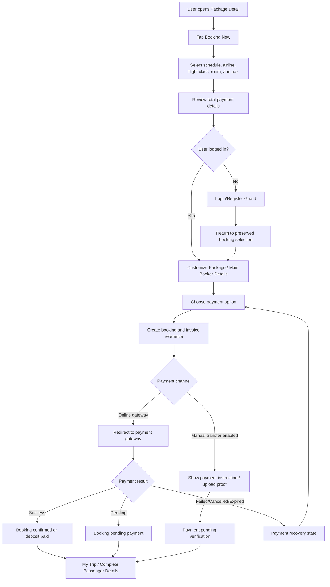

# JUV PRD 05 - Booking Flow

Product: UmrahHaji.com Jamaah/User View  
Module: Booking Flow  
Scope: Jamaah/User View / Package Booking & Checkout  
Platform: Mobile-first Responsive Web Platform  
Status: Draft  
Last Updated: 15 June 2026  

---

## 1. Objective

Booking Flow allows a registered jamaah or primary booker to reserve a published Umrah/Hajj package, select a valid departure schedule, configure pax and room preferences, confirm the main booker information, choose an available payment option, complete payment through the configured payment channel, and receive a booking confirmation.

This module is the conversion layer between Package Discovery and My Trip.

It must answer:

1. Which schedule am I booking?
2. How many adults, children, and infants are included?
3. Which flight, room, and price options apply?
4. How much do I need to pay now?
5. What remains after deposit or installment payment?
6. What happens after payment?

---

## 2. Relationship With Master PRD

This module follows the Jamaah/User View Master PRD:

1. Booking is P1.
2. Booking starts from a published package or shared package detail link.
3. Booking must store package, schedule, price, room, terms, and payment snapshot at booking time.
4. Booking must sync with Travel Agency Booking Management.
5. Booking must be visible to Admin Panel for oversight.
6. Booking payment and invoices must sync with Billing/Payment Management.
7. Confirmed booking can later be allocated to a Group Trip.
8. Passenger document completion happens after booking/payment through My Trip and Documents/Services flow.

---

## 3. Research Notes

Booking and checkout flow should follow mobile commerce and accessibility patterns:

1. Keep checkout steps short and clearly labelled.
2. Avoid asking for every passenger document before the first payment; collect only what is needed to create the reservation.
3. Preserve selections if user is asked to login or register mid-flow.
4. Show price breakdown before payment, not only after payment.
5. Use a secure external payment gateway or hosted payment page so card/payment credentials are not stored in UmrahHaji.com.
6. Use large, clear mobile controls for counters, room selection, payment options, and primary CTA.
7. Provide recovery paths for failed payment, expired payment link, schedule sold out, and gateway timeout.

Reference sources:

- Nielsen Norman Group - Mobile Faceted Search with a Tray: https://www.nngroup.com/articles/mobile-faceted-search/
- W3C WCAG 2.2 - Target Size Minimum: https://www.w3.org/WAI/WCAG22/Understanding/target-size-minimum.html
- PCI Security Standards Council - Payment Security Standards: https://www.pcisecuritystandards.org/standards/

---

## 4. Scope

### 4.1 In Scope for Phase 1

1. Start booking from Package Detail.
2. Login/register guard before final booking submission.
3. Select departure schedule.
4. Select airline option if the package supports multiple airlines.
5. Select flight class if available.
6. Select room type.
7. Configure adults, children, and infants.
8. Calculate total price.
9. Show price breakdown.
10. Capture main booker information.
11. Support individual, family, and group booking intent.
12. Preserve package and price snapshot.
13. Choose enabled payment option: full payment, deposit, or installment plan.
14. Generate booking ID.
15. Generate invoice/payment reference.
16. Redirect to configured payment gateway or payment instruction.
17. Receive payment success, pending, failed, expired, or cancelled status.
18. Show success screen.
19. Handoff to My Trip.
20. Handoff to passenger detail/document completion.
21. Send booking and payment confirmation email/WhatsApp where enabled.
22. Mobile, tablet, and desktop responsive behavior.

### 4.2 Phase 2 Scope

1. Saved booking draft across devices.
2. Promo code and voucher engine.
3. Waitlist and auto-seat release.
4. Customer amendment request.
5. Cancellation and refund request from booking detail.
6. Multi-currency checkout.
7. Split payment by family/group member.
8. Travel insurance upsell.
9. Add-on marketplace.
10. Live supplier seat and room availability.

### 4.3 Out of Scope

1. Creating package data.
2. Editing package price after booking.
3. Full document verification.
4. Visa processing.
5. Group Trip operation execution.
6. Mutawwif assignment.
7. Hotel room inventory reconciliation with external hotels.
8. Airline ticket issuance.
9. Storing card number, CVV, or banking credentials.

---

## 5. Product Positioning

Booking is not the same as Package or Group Trip.

| Area | Package | Booking | Group Trip |
| --- | --- | --- | --- |
| Purpose | Sellable offer | Customer reservation and payment record | Operational departure management |
| User action | Browse and compare | Reserve and pay | Follow trip progress |
| Owner | Travel Agency, Admin oversight | Jamaah/User, Travel Agency, Admin oversight | Travel Agency operations, Admin oversight |
| Snapshot needed | No | Yes | Uses booking/member data |
| Payment | Payment options only | Invoice and payment status | Payment summary reference |
| Members | No member detail | Booker and pax count/member placeholders | Confirmed trip members |

### 5.1 Key Product Principle

Once booking is submitted, the system must store a booking snapshot. Later package edits by Travel Agency or Admin must not silently change the user's booking.

Snapshot must include:

1. Package name.
2. Travel Agency.
3. Package category and type.
4. Departure and return dates.
5. Selected airline and flight class.
6. Hotel summary.
7. Itinerary template/version.
8. Room type and pax pricing.
9. Payment terms.
10. Cancellation terms.
11. Promotional labels and discounts applied.
12. Currency.

---

## 6. User Roles

| Role | Description |
| --- | --- |
| Public Visitor | Can view package detail and start intent, but must login/register before submitting booking |
| Registered User | Can create booking for self |
| Jamaah | Can create booking, pay, and complete post-booking requirements |
| Family PIC | Can create family booking and manage family member placeholders |
| Group PIC | Can create group booking request for multiple participants |
| Travel Agency Staff | Receives and manages booking in Travel Agency Portal |
| Admin | Can view booking in Admin Panel and assist/override based on permissions |

---

## 7. Entry Points

| Entry Point | Behavior |
| --- | --- |
| Package Detail - Booking Now | Opens Select Schedule |
| Package Card - Book Now | Opens Package Detail or Select Schedule if package has one schedule |
| Shared package link | Opens Package Detail |
| Promo package CTA | Opens Package Detail with promo context |
| My Trip unpaid card | Opens Payment Method / Balance Payment flow |
| Invoice link | Opens payment details or gateway link |
| Email/WhatsApp reminder | Opens booking/payment details |

---

## 8. Information Architecture

```text
Booking Flow
├── Package Detail Entry
├── Select Schedule
│   ├── Package Summary
│   ├── Schedule List
│   ├── Airline Option
│   ├── Flight Class
│   ├── Room Preferences
│   ├── Pax Counter
│   └── Price Breakdown
├── Login / Register Guard
├── Customize Package
│   ├── Main Booker Details
│   ├── Booking Type
│   ├── Pax Summary
│   └── Review Snapshot
├── Payment Method
│   ├── Booking Summary
│   ├── Full Payment
│   ├── Deposit Payment
│   ├── Installment Plan
│   └── Payment Summary
├── Payment Gateway / Payment Instruction
├── Payment Result
│   ├── Success
│   ├── Pending
│   ├── Failed
│   ├── Expired
│   └── Cancelled
└── Post-booking Handoff
    ├── My Trip
    ├── Complete Passenger Details
    ├── Upload Documents
    └── Payment Dashboard
```

---

## 9. Main Booking Flow



---

## 10. Booking Status Model

### 10.1 Booking Status

| Status | Meaning | Visible to User |
| --- | --- | --- |
| Draft | User started but has not submitted | Resume booking |
| Pending Payment | Booking created, payment not completed | Pay now |
| Pending Verification | Manual transfer proof submitted or gateway status not final | Waiting confirmation |
| Deposit Paid | Deposit paid, balance remains | Complete requirements |
| Partial Paid | Some installment/balance paid | Continue payment |
| Confirmed | Minimum payment/confirmation rules satisfied | Booking confirmed |
| Pending Passenger Details | Booking confirmed but member details incomplete | Complete passenger details |
| Pending Documents | Required documents incomplete | Upload documents |
| Allocated to Trip | Booking members assigned to Group Trip | View trip |
| Cancel Requested | User requested cancellation | Waiting review |
| Cancelled | Booking cancelled | View details |
| Refunded | Refund completed | View receipt |
| Expired | Payment/session expired before confirmation | Rebook or contact support |

### 10.2 Payment Status

| Status | Meaning |
| --- | --- |
| Unpaid | No payment received |
| Pending | Waiting for gateway or manual verification |
| Paid | Full required payment received |
| Deposit Paid | Deposit amount received |
| Partial Paid | Installment/balance payment partly received |
| Failed | Gateway payment failed |
| Overdue | Due date passed |
| Refunded | Refund marked completed |

---

## 11. Screen 1 - Package Detail Entry

Package Detail belongs mostly to PRD 04, but Booking Flow uses the following entry controls:

1. Sticky bottom bar.
2. Starting price.
3. Selected default schedule if available.
4. `Booking Now` CTA.
5. `Contact Support` secondary link.

### 11.1 Entry Rules

1. If package has no active schedule, disable `Booking Now` and show `No available schedule`.
2. If package is fully booked but waitlist is enabled, show `Join Waitlist`.
3. If user is public visitor, allow browsing but require login/register before booking submission.
4. If package status changes to unpublished while user is in checkout, block submission and show recovery message.

---

## 12. Screen 2 - Select Schedule

### 12.1 Purpose

Allows user to select the exact departure slot and pricing configuration before entering personal data.

### 12.2 Sections

| Section | Content |
| --- | --- |
| Header Card | Package name, Travel Agency, destination, duration, starting price |
| Year Selector | Current and future available years |
| Month Filter | Months with available schedules and count |
| Schedule Cards | Date range, seat count, schedule label, room/hotel summary, base price |
| Airline Option | Airline choices configured in package schedule |
| Flight Class | Economy, Business, First Class based on availability |
| Room Preferences - Adults | Room type and price per adult |
| Room Preferences - Children | Room type and child/infant pricing |
| Total Payment Details | Expandable price breakdown |
| Sticky Bottom Bar | Total amount and Booking Now CTA |

### 12.3 Fields and Controls

| Field | Type | Required | Notes |
| --- | --- | ---: | --- |
| Departure Schedule | Card selection | Yes | Only active schedules |
| Airline | Card/radio | Conditional | Required if multiple airlines enabled |
| Flight Class | Radio/card | Yes | Disable unavailable classes |
| Adult Count | Stepper | Yes | Min 1 for standard booking |
| Child Count | Stepper | No | Children under 12 |
| Infant Count | Stepper | No | Infant under 2 |
| Adult Room Type | Radio/card | Yes | Single, double, triple, quad, quint |
| Child Room Type | Radio/card | Conditional | Required if children count > 0 |
| Extra Bed | Stepper | No | Limited by room rules |
| Member Placeholder Names | Text | No in Phase 1 | Can be completed after payment |

### 12.4 Room Type Rules

| Room Type | Capacity | Typical Usage |
| --- | ---: | --- |
| Single | 1 | Solo/private |
| Double | 2 | Couple or 2 adults |
| Triple | 3 | Small family/group |
| Quad | 4 | Default family/group |
| Quint | 5 | Budget/family |

Rules:

1. Total pax must not exceed selected room capacity unless extra bed is allowed.
2. Room selection must respect package room configuration.
3. If room type is unavailable for selected schedule, disable the option.
4. Infant pricing must be separate from child/adult pricing.
5. Extra bed pricing must appear in total breakdown before payment.

### 12.5 Price Breakdown

Price breakdown should show:

1. Adult subtotal.
2. Child subtotal.
3. Infant subtotal.
4. Extra bed subtotal.
5. Discount or promo.
6. Taxes/fees if applicable.
7. Total package price.
8. Amount due now based on selected payment method.

---

## 13. Screen 3 - Login / Register Guard

### 13.1 Trigger

If a public visitor taps `Continue` or `Booking Now` after selecting package details, the system must ask the user to login or register before creating the booking.

### 13.2 Requirements

1. Preserve selected package, schedule, pax, room, airline, and price configuration.
2. Allow login with existing account.
3. Allow registration flow from PRD 02.
4. Return user to booking flow after successful login/registration.
5. Do not create confirmed booking before user identity is known.
6. If selected schedule becomes unavailable during login, show schedule conflict state.

---

## 14. Screen 4 - Customize Your Package

### 14.1 Purpose

Collects minimum main booker details needed to create booking and invoice.

The screen should not force every passenger document before payment. That would make checkout heavy and reduce conversion. Passenger details and operational documents are completed after payment in My Trip.

### 14.2 Sections

| Section | Content |
| --- | --- |
| Booking Summary | Package, agency, schedule, pax, total |
| Main Booker Details | Name, email, phone, IC/passport, address |
| Booking Type | Individual, family, group |
| Pax Summary | Adults, children, infants, room |
| Info Banner | Explain passenger details can be completed after payment |
| Quick Login/Autofill | Use profile data from account |
| Action Buttons | Back, Continue |

### 14.3 Main Booker Fields

| Field | Type | Required | Validation | Notes |
| --- | --- | ---: | --- | --- |
| Full Name | Text | Yes | 2-100 chars | From profile if logged in |
| Email | Email | Yes | Valid email | Used for invoice and confirmation |
| Country Code | Select | Yes | Country list | Default +60 MY |
| Phone Number | Phone | Yes | Numeric, country format | Used for WhatsApp notification |
| IC/Passport Number | Text | Yes | 6-30 chars | At least one identity reference |
| Address | Textarea | Optional in Phase 1 | Max 250 chars | Required only if invoice policy requires |

### 14.4 Booking Type

| Type | Behavior |
| --- | --- |
| Individual | User books for self |
| Family | User is PIC for family members |
| Group | User is PIC for multiple unrelated members |

Rules:

1. Individual booking requires at least 1 adult.
2. Family booking can contain adults, children, and infants.
3. Group booking can use member placeholders first, then complete member details after payment.
4. The primary booker is responsible for payment and communication unless changed by Travel Agency/Admin.

---

## 15. Screen 5 - Payment Method

### 15.1 Purpose

Allows user to choose how much to pay now and understand remaining obligations.

### 15.2 Payment Options

Only show options enabled for the selected package/schedule.

| Option | Description | Example |
| --- | --- | --- |
| Full Payment | Pay full package amount now | RM 22,300 |
| Deposit Payment | Pay deposit to reserve booking | RM 500 |
| Installment Plan | Pay in fixed installments before due date | 3-month plan |
| Manual Transfer | Show bank instruction and proof upload if enabled | Pending verification |

### 15.3 Payment Method Rules

1. Full payment sets payment status to `Paid` after successful payment.
2. Deposit payment sets payment status to `Deposit Paid` after successful payment.
3. Installment plan sets payment status to `Partial Paid` or `Deposit Paid` depending on first payment.
4. Installment plan must show due dates, amount per installment, admin fee if any, and remaining balance.
5. Deposit and installment must show payment deadline.
6. If payment due date is after cutoff date, disable unavailable plan.
7. User must accept payment terms before redirecting to gateway.
8. Payment gateway result must be verified server-side, not only from browser return URL.

### 15.4 Payment Summary

Payment summary must show:

1. Booking ID.
2. Package name.
3. Travel Agency.
4. Schedule date.
5. Pax count.
6. Total package amount.
7. Amount paid or due now.
8. Remaining balance.
9. Due date.
10. Payment method.
11. Currency.
12. Terms and cancellation note.

---

## 16. Screen 6 - Payment Gateway / Payment Instruction

### 16.1 Online Gateway

For online payments, UmrahHaji.com redirects user to the configured payment gateway or hosted payment page.

Rules:

1. Do not collect card number or CVV inside UmrahHaji.com.
2. Generate payment reference before redirect.
3. Store gateway transaction ID.
4. Use webhook/server confirmation as the payment source of truth.
5. Handle browser close, timeout, gateway pending, and duplicate callbacks.
6. Expire unpaid payment session based on configured gateway expiry.

### 16.2 Manual Transfer

If enabled by Travel Agency/Admin:

1. Show bank account/payment instruction.
2. Allow proof upload.
3. Use file constraints:
   - Allowed formats: PDF, JPG, JPEG, PNG, WebP.
   - Max size: 5 MB per file.
   - Max files: 3 per payment proof.
   - System should compress image previews and store optimized thumbnails.
4. Status becomes `Pending Verification`.
5. Finance/Travel Agency verifies payment in portal.

---

## 17. Screen 7 - Payment Result

### 17.1 Success - Full Payment

Show:

1. Confirmation banner.
2. Booking ID.
3. Payment ID.
4. Package summary.
5. Amount paid.
6. Travel Agency.
7. Departure date.
8. Pax count.
9. What's next checklist.
10. CTA: `Complete Passenger Details`.
11. CTA: `View My Trip`.
12. CTA: `Book Another Journey`.

### 17.2 Success - Deposit / Installment

Show:

1. Status: Deposit Paid or Installment Plan Confirmed.
2. Amount paid today.
3. Remaining balance.
4. Next payment due date.
5. Payment schedule.
6. Benefits/terms of installment if configured.
7. CTA: `View Payment Dashboard`.
8. CTA: `Complete Passenger Details`.
9. CTA: `Join WhatsApp Group` only if group link is available and user has access.

### 17.3 Pending

Show:

1. Payment pending message.
2. Payment reference.
3. Expected confirmation time.
4. CTA: `Refresh Status`.
5. CTA: `View My Trip`.
6. Support contact.

### 17.4 Failed / Cancelled / Expired

Show:

1. Clear failure reason if available.
2. Booking status.
3. Amount not charged notice if applicable.
4. CTA: `Try Again`.
5. CTA: `Choose Another Payment Method`.
6. CTA: `Contact Support`.

---

## 18. My Trip Handoff

After booking creation or payment attempt, user should be able to access the booking from My Trip.

My Trip card should show:

1. Booking/trip status.
2. Package name.
3. Travel Agency.
4. Schedule.
5. Pax count.
6. Payment status.
7. Progress stage.
8. Next action.

Next action examples:

| Status | CTA |
| --- | --- |
| Pending Payment | Pay Now |
| Deposit Paid | Complete Passenger Details |
| Pending Documents | Upload Documents |
| Pending Verification | Check Payment Status |
| Allocated to Trip | View Group Trip |
| Overdue | Pay Balance |

---

## 19. Notifications

### 19.1 User Notifications

| Event | Channel | Recipient |
| --- | --- | --- |
| Booking created | Email, WhatsApp if enabled | Primary Booker |
| Payment successful | Email, WhatsApp if enabled | Primary Booker |
| Payment pending | Email or in-app | Primary Booker |
| Payment failed | Email or in-app | Primary Booker |
| Balance reminder | Email, WhatsApp if enabled | Primary Booker |
| Passenger details required | Email, WhatsApp if enabled | Primary Booker |
| Booking confirmed | Email, WhatsApp if enabled | Primary Booker |

### 19.2 Travel Agency/Admin Notifications

| Event | Receiver |
| --- | --- |
| New booking submitted | Travel Agency Booking team |
| Payment successful | Travel Agency Finance, Admin finance overview |
| Manual proof uploaded | Travel Agency Finance |
| Booking pending passenger details | Travel Agency Operations |
| Booking cancellation requested | Travel Agency and Admin if escalation required |

---

## 20. Data Model

### 20.1 Booking

| Field | Type | Required | Notes |
| --- | --- | ---: | --- |
| booking_id | String | Yes | User-facing unique ID |
| user_id | UUID | Yes | Primary booker account |
| package_id | UUID | Yes | Source package |
| package_version_id | UUID | Yes | Snapshot version |
| travel_agency_id | UUID | Yes | Package owner |
| schedule_id | UUID | Yes | Selected schedule |
| booking_type | Enum | Yes | Individual, family, group |
| status | Enum | Yes | Booking status |
| payment_status | Enum | Yes | Payment status |
| pax_adult | Integer | Yes | Min 1 |
| pax_child | Integer | No | Default 0 |
| pax_infant | Integer | No | Default 0 |
| total_pax | Integer | Yes | Calculated |
| currency | String | Yes | MYR/RM in Phase 1 |
| total_amount | Decimal | Yes | Package total |
| amount_due_now | Decimal | Yes | Based on payment option |
| remaining_balance | Decimal | Yes | Calculated |
| selected_payment_option | Enum | Yes | Full, deposit, installment, manual |
| terms_accepted_at | DateTime | Yes | Required before payment |
| created_at | DateTime | Yes | Audit |
| updated_at | DateTime | Yes | Audit |

### 20.2 Main Booker

| Field | Type | Required | Notes |
| --- | --- | ---: | --- |
| booking_id | UUID | Yes | Parent booking |
| full_name | String | Yes | Main contact |
| email | String | Yes | Invoice and notification |
| phone_country_code | String | Yes | Default +60 |
| phone_number | String | Yes | WhatsApp compatible |
| identity_number | String | Yes | IC/passport reference |
| address | Text | Optional | Invoice address |

### 20.3 Booking Snapshot

| Field | Type | Required | Notes |
| --- | --- | ---: | --- |
| package_snapshot | JSON | Yes | Package public data |
| schedule_snapshot | JSON | Yes | Departure and return |
| hotel_snapshot | JSON | Yes | Selected hotel summary |
| flight_snapshot | JSON | Yes | Airline and flight class |
| itinerary_snapshot | JSON | Yes | Template/version summary |
| room_price_snapshot | JSON | Yes | Room and pax price |
| payment_terms_snapshot | JSON | Yes | Deposit/installment rules |
| cancellation_terms_snapshot | JSON | Yes | Terms shown to user |

### 20.4 Payment Reference

| Field | Type | Required | Notes |
| --- | --- | ---: | --- |
| payment_reference | String | Yes | Gateway/manual reference |
| gateway_provider | String | Conditional | Example: Chip |
| gateway_transaction_id | String | Conditional | From provider |
| invoice_id | UUID | Yes | Billing reference |
| amount | Decimal | Yes | Amount to pay |
| status | Enum | Yes | Pending, paid, failed, expired |
| expires_at | DateTime | Conditional | Payment link expiry |
| webhook_received_at | DateTime | Conditional | Server confirmation |

---

## 21. Business Rules

### 21.1 Availability Rules

1. User can only book active schedules.
2. Schedule availability must be checked again before booking is created.
3. If seat locking is enabled, temporary hold should expire after configured duration.
4. If selected schedule is full before payment, user must choose another schedule.
5. Pax count cannot exceed remaining seat availability.
6. Room type cannot exceed configured availability if room inventory is tracked.

### 21.2 Pricing Rules

1. Displayed price must match selected schedule, pax, room, flight class, season, and promo.
2. Total must recalculate immediately after pax/room changes.
3. Booking must use price snapshot after submission.
4. Taxes, service fee, admin fee, discount, and deposit must be transparent before payment.
5. If Travel Agency changes price after booking, existing booking keeps original snapshot unless a formal change is approved.

### 21.3 Payment Rules

1. Payment option visibility depends on package configuration.
2. User cannot pay less than required deposit.
3. Installment due dates must end before package cutoff date.
4. Overdue payment status must sync to My Trip and Billing.
5. Manual transfer proof does not mark booking paid until verified.
6. Gateway webhook is the payment source of truth.

### 21.4 Identity and Data Rules

1. User must be authenticated before final booking submission.
2. Main booker information can autofill from profile.
3. User can edit main booker information before payment.
4. Passenger details can be completed after successful payment/deposit unless Travel Agency requires earlier collection.
5. Sensitive identity documents belong to Profile/Documents flow, not the initial checkout.

---

## 22. States and Edge Cases

| State | Behavior |
| --- | --- |
| Loading | Show skeleton or progress message |
| Empty schedule | Disable booking and suggest other packages |
| Schedule sold out | Show sold-out state and alternative schedules |
| Price changed before submission | Show updated price confirmation |
| User not logged in | Preserve selection and show login/register guard |
| Gateway timeout | Mark payment pending until webhook confirms or expires |
| Gateway failed | Allow retry or alternative payment method |
| Payment link expired | Regenerate if booking still valid |
| Manual proof upload failed | Show retry with file requirements |
| Duplicate payment callback | Ignore duplicate and keep audited event |
| Network failure | Save draft locally/server-side where possible |
| Overdue balance | Show Pay Balance CTA in My Trip |

---

## 23. Responsive Behavior

### 23.1 Mobile

1. Single-column flow.
2. Sticky bottom payment/action bar.
3. Stepper controls for pax.
4. Bottom sheet for payment breakdown.
5. Large tap targets for room and payment options.
6. Payment CTA always visible after required fields are completed.

### 23.2 Tablet

1. Two-column layout where summary can sit beside form.
2. Sticky summary panel may be used.
3. Payment breakdown can appear inline.

### 23.3 Desktop

1. Main form and right summary panel.
2. Persistent booking summary.
3. Payment options displayed as cards.

---

## 24. Analytics Events

| Event | Trigger |
| --- | --- |
| booking_started | User taps Booking Now |
| schedule_selected | User selects departure schedule |
| room_selected | User selects room type |
| pax_changed | User changes pax count |
| booking_login_required | Public user reaches protected step |
| booking_form_completed | Main booker form valid |
| payment_option_selected | User selects full/deposit/installment |
| payment_redirect_started | User taps Pay Now |
| payment_success | Gateway/manual status confirmed |
| payment_failed | Gateway returns failed/cancelled |
| booking_created | Booking record created |
| booking_handoff_my_trip | User opens My Trip after booking |

---

## 25. Functional Requirements

| ID | Requirement | Priority |
| --- | --- | --- |
| JUV-BKG-001 | System shall allow user to start booking from Package Detail. | P1 |
| JUV-BKG-002 | System shall block booking for unpublished, inactive, archived, expired, or sold-out package schedules. | P1 |
| JUV-BKG-003 | System shall allow user to select departure schedule. | P1 |
| JUV-BKG-004 | System shall allow airline selection when multiple airline options exist. | P1 |
| JUV-BKG-005 | System shall allow flight class selection based on availability. | P1 |
| JUV-BKG-006 | System shall allow adult, child, and infant pax configuration. | P1 |
| JUV-BKG-007 | System shall allow room type selection based on package room configuration. | P1 |
| JUV-BKG-008 | System shall calculate total price from pax, room, flight, season, discount, and fee rules. | P1 |
| JUV-BKG-009 | System shall show total payment breakdown before payment. | P1 |
| JUV-BKG-010 | System shall require authentication before final booking submission. | P1 |
| JUV-BKG-011 | System shall preserve booking selections during login/register. | P1 |
| JUV-BKG-012 | System shall autofill main booker data from user profile where available. | P1 |
| JUV-BKG-013 | System shall allow user to edit main booker information before submission. | P1 |
| JUV-BKG-014 | System shall support individual, family, and group booking intent. | P1 |
| JUV-BKG-015 | System shall store package, schedule, room, flight, itinerary, payment, and cancellation snapshot at booking creation. | P1 |
| JUV-BKG-016 | System shall allow user to choose enabled payment option. | P1 |
| JUV-BKG-017 | System shall generate booking ID and invoice/payment reference. | P1 |
| JUV-BKG-018 | System shall redirect online payments to hosted gateway/payment page. | P1 |
| JUV-BKG-019 | System shall not store card number, CVV, or sensitive payment credentials. | P1 |
| JUV-BKG-020 | System shall process payment status through server-side gateway confirmation/webhook. | P1 |
| JUV-BKG-021 | System shall support manual transfer proof upload if enabled. | P1 |
| JUV-BKG-022 | System shall enforce proof upload file format and max size rules. | P1 |
| JUV-BKG-023 | System shall show success, pending, failed, cancelled, and expired payment states. | P1 |
| JUV-BKG-024 | System shall sync booking to Travel Agency Booking Management. | P1 |
| JUV-BKG-025 | System shall sync booking visibility to Admin Panel. | P1 |
| JUV-BKG-026 | System shall sync invoice/payment data to Billing Management. | P1 |
| JUV-BKG-027 | System shall create My Trip entry after booking creation. | P1 |
| JUV-BKG-028 | System shall direct user to Complete Passenger Details after successful payment/deposit. | P1 |
| JUV-BKG-029 | System shall send booking/payment notifications where enabled. | P1 |
| JUV-BKG-030 | System shall log booking creation, payment attempt, status change, and user actions. | P1 |

---

## 26. Acceptance Criteria

1. User can start booking from a published package.
2. User cannot submit booking without selected schedule, room, pax count, and authenticated account.
3. User sees accurate total price before payment.
4. User sees amount due now and remaining balance before payment.
5. Booking snapshot is stored and does not change when package data changes later.
6. User can pay full payment, deposit, or installment only if enabled by package/payment settings.
7. Online payment redirects to configured payment gateway.
8. Payment status is updated from server-side confirmation/webhook.
9. Manual proof upload respects file size and format constraints.
10. Successful booking appears in My Trip.
11. Travel Agency can see the booking in its Booking Management module.
12. Admin can see booking/payment status for oversight.
13. Billing module receives invoice/payment reference.
14. Failed payment allows retry without losing booking context.
15. Mobile layout is usable from 320px width.

---

## 27. Open Questions

1. Should Phase 1 allow booking submission with deposit only, or require Travel Agency confirmation before payment?
2. Should manual transfer be enabled for all agencies or only selected agencies?
3. Should group booking require minimum pax before checkout?
4. Should seat hold expire in 15 minutes, 30 minutes, or based on agency setting?
5. Should package booking support promo code in Phase 1 or Phase 2 only?
6. Should installment plan be called `Installment` instead of `Subscription` in user-facing UI?

---

## 28. Summary

Booking Flow should be simple enough for mobile users but strict enough to protect package price, schedule, room, payment, and pax data. The best Phase 1 approach is to collect only the minimum data needed to create a reservation and payment record, then move detailed passenger documents and trip preparation into My Trip after payment.

This keeps checkout fast, preserves clean operational ownership, and keeps the data synchronized with Travel Agency Booking Management, Admin Booking oversight, Billing Management, Package Management, and Group Trip Management.

