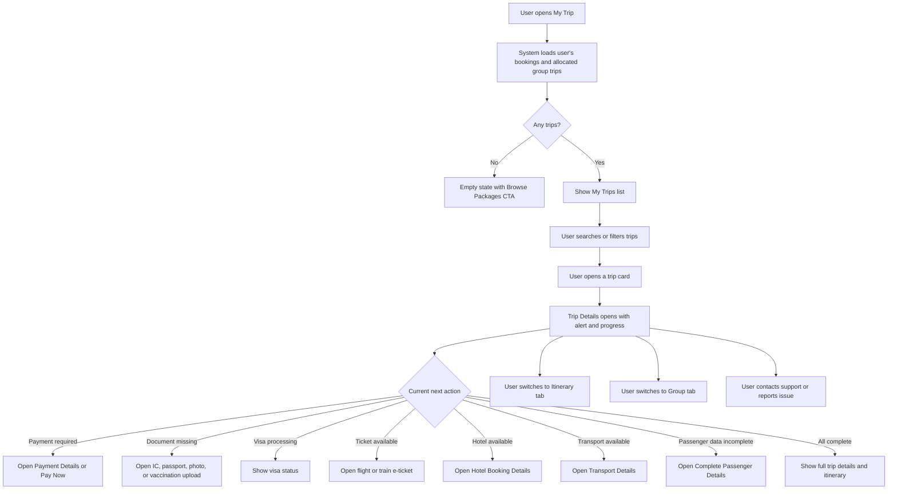

# JUV PRD 06 - My Group Trip & Trip Details

Product: UmrahHaji.com Jamaah/User View  
Module: My Group Trip & Trip Details  
Scope: Jamaah/User View / Post-booking Trip Operations  
Platform: Mobile-first Responsive Web Platform  
Status: Draft  
Last Updated: 16 June 2026  

---

## 1. Objective

My Group Trip & Trip Details allows jamaah to view and track their active, upcoming, completed, or cancelled Umrah/Hajj trips after booking. It provides a user-facing operational dashboard for trip progress, payment status, document readiness, visa status, flight ticket status, hotel assignment, transport, itinerary, group members, emergency contacts, announcements, and next actions.

This module is not used to edit operational trip data. It is a read-first self-service layer that displays data managed by Travel Agency Portal and Admin Panel, while allowing jamaah to complete their own required actions such as payment, document upload, viewing tickets, reading itinerary, and contacting support.

---

## 2. Relationship With Master PRD

This module follows the Jamaah/User View Master PRD:

1. My Trip is P1.
2. Group Trip data is sourced from Group Trip Management.
3. Booking/payment data is sourced from Booking and Billing Management.
4. Documents and services are sourced from Group Trip member tracking and Jamaah profile documents.
5. User can view trip data but cannot change operational assignments.
6. User can submit missing data/documents, make payments, view tickets, and report issues.
7. Group trip changes should trigger notifications to affected jamaah.
8. Completed trip can trigger end-of-trip testimonial and report/support flows.
9. Payment Details is a drill-down view from Billing Management and PRD 05 Booking Flow.
10. Hotel, flight, transport, and itinerary details are read-only user-facing snapshots from Group Trip Management.
11. IC, passport, photo, and vaccination upload flows update the member document readiness records used by Travel Agency and Admin operations.
12. Complete Passenger Details updates booking member data before it is locked for visa, ticketing, and group trip operations.

---

## 3. Research Notes

For mobile trip tracking and status-heavy views:

1. Users need a clear current status, next action, and progress indicator at the top of each trip card.
2. Progress steps should use plain language, not internal operational terms.
3. Important alerts such as overdue payment or missing documents should appear before general trip details.
4. Users should not need to search across different modules to know what to do next.
5. Bottom navigation should keep the user's current section visible and avoid ambiguous duplicate labels.
6. Touch targets for CTAs, tabs, accordions, and ticket actions must be large enough for mobile use.
7. Status changes must be announced accessibly for screen-reader users.

Reference sources:

- W3C WCAG 2.2 - Target Size Minimum: https://www.w3.org/WAI/WCAG22/Understanding/target-size-minimum.html
- W3C WCAG 2.2 - Status Messages: https://www.w3.org/WAI/WCAG22/Understanding/status-messages.html
- Material Design 3 - Navigation Bar: https://m3.material.io/components/navigation-bar/overview

---

## 4. Scope

### 4.1 In Scope for Phase 1

1. My Trips list.
2. Search trips by package, agency, or trip ID.
3. Filter trips by payment/status grouping.
4. Trip cards with alert, status, progress, package, schedule, pax, price, and CTA.
5. Trip Details page.
6. Booking progress tracker.
7. Payment information summary.
8. Payment next action and Pay Now handoff.
9. Document submission next action.
10. Visa processing status view.
11. Flight ticket status and details.
12. Hotel booking status and details.
13. Transport status and ticket view.
14. Trip itinerary tab.
15. Group members tab.
16. Emergency contact section.
17. WhatsApp group link if enabled.
18. Announcements and update alerts.
19. Empty/loading/error states.
20. Mobile-first responsive behavior.
21. Payment Details page with payment plan, registration details, and payment history.
22. Hotel Booking Details page for Makkah/Madinah hotel assignments.
23. Transport Details page with e-ticket reference and secure view/download action.
24. Complete Passenger Details form for missing member data.
25. IC, passport, photo, and vaccination certificate upload flows.
26. Per-member document status chips and upload status handling.
27. Shared upload component pattern with fullscreen preview and file constraints.
28. Group member list/search with privacy-safe visibility.

### 4.2 Phase 2 Scope

1. Offline itinerary cache.
2. In-app trip chat.
3. Live bus/location tracking.
4. Live flight status integration.
5. Live hotel room update integration.
6. Push notifications.
7. Attendance check-in.
8. Geofenced reminders.
9. Daily itinerary feedback inside each activity.
10. Travel companion mini-profile sharing.

### 4.3 Out of Scope

1. Creating or editing group trips.
2. Assigning mutawwif.
3. Assigning hotel or flight.
4. Updating visa status by user.
5. Verifying documents.
6. Issuing airline/train tickets.
7. Modifying package/booking price.
8. Managing Travel Agency operational checklist.
9. Viewing other unrelated trip members' sensitive documents.

---

## 5. Product Positioning

My Group Trip is the jamaah-facing view of operational trip data.

| Area | Booking | My Group Trip | Group Trip Management |
| --- | --- | --- | --- |
| Purpose | Reservation and payment start | User-facing trip tracking | Operations workspace |
| User | Jamaah/primary booker | Jamaah/primary booker | Travel Agency/Admin |
| Editable by jamaah | Limited booking info before payment | Own documents/actions only | No |
| Data source | Booking, package snapshot, billing | Booking, billing, group trip snapshots | Travel Agency/Admin |
| Main CTA | Pay/book/complete passenger details | Pay, upload document, view ticket, view itinerary | Manage trip operations |

### 5.1 Key Product Principle

The page must prioritize "what should I do next?" over showing every operational detail. Detailed data should be available, but urgent actions and trip readiness must be visible first.

---

## 6. User Roles

| Role | Description |
| --- | --- |
| Jamaah | Views own trips and completes own required actions |
| Primary Booker | Views and manages trip/payment actions for booking members they are authorized to manage |
| Family PIC | Views family trip readiness and member action summary |
| Group PIC | Views group-level member readiness only for authorized group members |
| Travel Agency Staff | Data owner in Travel Agency Portal, not direct user of this module |
| Admin | Supervises data from Admin Panel, not direct user of this module |

### 6.1 Visibility Rules

1. Jamaah can view their own trip.
2. Primary Booker can view booking-level payment and member completion summaries.
3. Family/Group PIC can view member readiness for members they manage.
4. Users cannot see other members' sensitive documents unless they are authorized PIC.
5. Public visitors cannot access My Trips.

---

## 7. Entry Points

| Entry Point | Behavior |
| --- | --- |
| Bottom nav My Trip | Opens My Trips list |
| Booking success CTA | Opens relevant trip/booking card |
| Payment reminder | Opens payment section of Trip Details |
| Payment Details CTA | Opens detailed payment and registration page |
| Document reminder | Opens document action section |
| Upload Document CTA | Opens document type picker or selected upload modal |
| Flight ticket notification | Opens flight ticket section |
| Hotel assignment update | Opens hotel section |
| Hotel Details CTA | Opens hotel booking detail page |
| Transport/E-ticket CTA | Opens transport detail or e-ticket viewer |
| Itinerary update | Opens itinerary tab |
| Complete Passenger Details CTA | Opens passenger detail completion form |
| Group search/member tap | Opens privacy-safe member list/detail behavior |
| WhatsApp/email announcement | Opens related trip update |

---

## 8. Information Architecture

```text
My Group Trip
├── My Trips List
│   ├── Header
│   ├── Search
│   ├── Status Filter Tabs
│   ├── Trip Cards
│   └── Bottom Navigation
├── Trip Details
│   ├── Sticky Alert
│   ├── Trip Header
│   ├── Tabs
│   │   ├── Trip Details
│   │   ├── Itinerary
│   │   └── Group
│   ├── Booking Progress
│   ├── Payment Information
│   ├── Document Summary
│   ├── Visa Status
│   ├── Flight Details
│   ├── Hotel Details
│   ├── Transport Details
│   ├── WhatsApp Group
│   ├── Emergency Contact
│   └── Announcements
└── Detail Actions
    ├── Pay Now
    ├── Payment Details
    ├── Upload Document
    │   ├── IC Upload
    │   ├── Passport Upload
    │   ├── Photo Upload
    │   └── Vaccination Certificate Upload
    ├── Complete Passenger Details
    ├── View Ticket
    ├── Hotel Booking Details
    ├── Transport Details
    ├── Group Member List
    ├── Contact Support
    └── Report Issue
```

---

## 9. Main User Flow



---

## 10. Trip Readiness Progress Model

### 10.1 Default Six-Step Progress

| Step | User-facing Label | Source | Example CTA |
| ---: | --- | --- | --- |
| 1 | Payment Required | Billing/Booking | Make a Payment |
| 2 | Document Submission | Group Trip Documents / Jamaah Profile | Upload Document |
| 3 | Visa Processing | Group Trip Services | Check Visa Status |
| 4 | Flight Ticket | Group Trip Flight / Ticket Service | Check Ticket |
| 5 | Hotel Booking | Group Trip Hotel / Room Assignment | Check Hotel |
| 6 | Transport | Group Trip Transport / Ticket Service | Check Transport |

### 10.2 Completion Percentage

The completion percentage is a user-facing readiness indicator, not a strict mathematical operation score.

Recommended defaults:

| State | Percent |
| --- | ---: |
| Payment Required | 15% |
| Document Submission | 33% |
| Visa Processing | 43% |
| Flight Ticket | 67% |
| Hotel Booking | 71% |
| Transport | 86% |
| All Completed | 100% |

Rules:

1. Current step is determined by the highest-priority incomplete requirement.
2. Payment overdue overrides all other steps.
3. Missing documents override visa/ticket readiness.
4. All completed requires payment satisfied, required documents accepted, visa/ticket/hotel/transport ready or not required.
5. If a trip does not require a specific step, the system should mark the step as `Not Required` and skip it in progress logic.

---

## 11. Trip Status Model

| Status | User Meaning | Primary CTA |
| --- | --- | --- |
| Upcoming | Trip has not started | View Details |
| Payment Required | Payment is missing or overdue | Pay Now |
| Document Pending | Required documents missing or rejected | Upload Document |
| Processing | Visa/ticket/hotel/transport is being prepared | Check Status |
| Ready for Departure | All required preparation completed | View Itinerary |
| In Trip | Trip is currently ongoing | View Today |
| Completed | Trip has ended | Give Feedback |
| Cancelled | Trip cancelled or user removed | View Details |

### 11.1 Payment Status Filter Tabs

The list reference uses payment tabs. Phase 1 should support:

| Tab | Meaning |
| --- | --- |
| All | All user trips |
| Paid | Fully paid or deposit-confirmed trips with no overdue balance |
| Unpaid | No payment received |
| Overdue | Due date passed |
| Partial | Deposit/partial/installment paid |

---

## 12. Screen 1 - My Trips List

### 12.1 Purpose

Show all bookings and trips that belong to the logged-in jamaah or managed family/group members.

### 12.2 Layout

| Section | Content |
| --- | --- |
| Top Navbar | Logo, cart icon, notification, menu/profile |
| Header | `My Trips`, subtitle |
| Search | Search by package, agency, trip ID |
| Filter Tabs | All, Paid, Unpaid, Overdue, Partial |
| Trip Cards | One card per booking/trip |
| Bottom Navigation | Home, Packages, My Trip, Payments, Profile |

### 12.3 Trip Card Anatomy

```text
Alert Banner, conditional
Badge Row: payment status, package tier, current step
Package Name + Price
Departure date, return date, pax count, location
Progress label + completion percentage
Progress bar
Trip ID + CTA
```

### 12.4 Trip Card Fields

| Field | Required | Source | Notes |
| --- | ---: | --- | --- |
| Trip ID / Booking ID | Yes | Booking / Group Trip | Use Trip ID once allocated |
| Package Name | Yes | Booking snapshot |
| Travel Agency | Yes | Booking / Group Trip |
| Package Tier | Conditional | Package snapshot | VIP, Economy, Premium |
| Payment Status | Yes | Billing |
| Trip Status | Yes | Booking / Group Trip |
| Current Step | Yes | Readiness logic |
| Completion Percent | Yes | Readiness logic |
| Total Price / Outstanding | Yes | Billing |
| Departure Date | Yes | Group Trip / Booking schedule |
| Return Date | Yes | Group Trip / Booking schedule |
| Pax Count | Yes | Booking |
| Location Summary | Yes | Package/trip snapshot |
| CTA | Yes | Derived next action |

### 12.5 Alert Banner Rules

Show alert banner only when user action is urgent:

1. Payment overdue.
2. Payment required before deadline.
3. Rejected document.
4. Missing required document close to deadline.
5. Schedule change acknowledgement required.
6. Emergency announcement.

Alert content should include:

1. Problem summary.
2. Amount/date if relevant.
3. Action button.
4. Severity color.

---

## 13. Screen 2 - Trip Details

### 13.1 Purpose

Shows detailed trip information and actionable next steps for one booking/group trip.

### 13.2 Header

| Element | Description |
| --- | --- |
| Back Navigation | Returns to My Trips list |
| Trip Name | Package or trip group name |
| Trip ID | HAJ/UMH booking or group trip ID |
| Badges | Payment status, package tier, current step |
| Tab Bar | Trip Details, Itinerary, Group |

### 13.3 Sticky Alert

Sticky alert appears at top of Trip Details if:

1. Payment required or overdue.
2. Document rejected.
3. Major itinerary, hotel, flight, or transport update requires acknowledgement.
4. Emergency announcement exists.

---

## 14. Trip Details Tab

### 14.1 Booking Progress Section

Content:

1. Six-step tracker.
2. Current step label.
3. Completion percentage.
4. Next action CTA.
5. Last updated timestamp.

Rules:

1. Active step must be visually distinct.
2. Completed steps must show completed state.
3. Pending steps must remain visible but subdued.
4. If a step is not required, display `Not Required` or skip based on design decision.

### 14.2 Payment Information Section

Fields:

| Field | Description |
| --- | --- |
| Payment Status | Unpaid, Paid, Deposit Paid, Partial, Overdue |
| Total Amount | Booking total |
| Paid Amount | Amount confirmed |
| Outstanding Amount | Remaining balance |
| Due Date | Next due date |
| Payment Plan | Full, deposit, installment |
| CTA | Payment Details, Pay Now |

Rules:

1. Amounts come from Billing/Payment Management.
2. Jamaah cannot edit invoice amount.
3. Platform commission is not shown.
4. Pay Now opens PRD 07 payment flow or PRD 05 balance payment flow.

### 14.3 Document Summary Section

Fields:

| Field | Description |
| --- | --- |
| IC/ID status | Pending, Uploaded, Verified, Rejected |
| Passport status | Pending, Uploaded, Verified, Rejected |
| Photo status | Pending, Uploaded, Verified, Rejected |
| Vaccination status | Optional/Required based on agency/admin rule |
| Rejection Reason | Shown if rejected |
| CTA | Upload Document |

Rules:

1. Upload constraints follow Jamaah Profile / Documents PRD.
2. Max upload size should be shown before upload.
3. User can upload own documents.
4. Family/Group PIC can upload documents only for authorized members.

### 14.4 Visa Status Section

Fields:

| Field | Description |
| --- | --- |
| Visa Application ID | If available |
| Visa Status | Not Started, Submitted, Processing, Approved, Rejected |
| Last Updated | Timestamp |
| Notes | Optional |
| CTA | View Details or Contact Agency |

Rules:

1. User cannot change visa status.
2. Visa status is read-only from Travel Agency/Admin operations.
3. If visa rejected, show clear support path.

### 14.5 Flight Section

Fields:

| Field | Description |
| --- | --- |
| Segment | Departure or return |
| Airline | Airline name |
| Flight Number | If available |
| Route | Departure airport to arrival airport |
| Cabin Class | Economy, Business, etc. |
| Departure Date/Time | Local timezone |
| Arrival Date/Time | Destination/local timezone |
| Transit | Transit airport and duration if any |
| Ticket Status | Pending, Issued, Updated, Cancelled |
| CTA | View E-ticket |

Rules:

1. Flight data comes from Group Trip flight assignment snapshot.
2. Flight times are subject to change.
3. If e-ticket is unavailable, CTA should be disabled with helper text.
4. E-ticket download/view follows secure file access rules.

### 14.6 Hotel Section

Fields:

| Field | Description |
| --- | --- |
| City | Makkah, Madinah, etc. |
| Hotel Name | Assigned hotel |
| Hotel Image | Thumbnail |
| Rating | Star rating |
| Distance to Mosque | If available |
| Check-in Date | Date |
| Check-out Date | Date |
| Room Type | If assigned |
| Room Number | Show only when allowed |
| CTA | Hotel Details |

Rules:

1. Hotel data comes from Group Trip hotel assignment snapshot.
2. Room number can be hidden until Travel Agency releases it.
3. Hotel change should show update banner if changed after previous view.

### 14.7 Transport Section

Fields:

| Field | Description |
| --- | --- |
| Transport Type | Bus, train, shuttle, private vehicle |
| Route | Makkah, Madinah, inter-city, airport transfer |
| Ticket Number | If available |
| Status | Pending, Confirmed, Issued |
| CTA | View E-ticket |

Rules:

1. Transport data comes from Group Trip transport assignment.
2. E-ticket can be unavailable if not issued yet.
3. Transport schedule changes should trigger notification.

### 14.8 Emergency Contact Section

Recommended contacts:

| Contact | Purpose |
| --- | --- |
| Travel Agency Emergency Line | Primary trip support |
| Mutawwif / Trip Guide | On-ground religious/trip guidance |
| Local Support | Destination-side support |
| Platform Support | Platform/payment/account support |

Rules:

1. At least one emergency contact should be available before departure.
2. Phone and WhatsApp CTA should be available if configured.
3. Office hour contact should be labelled clearly.

### 14.9 WhatsApp Group Section

Rules:

1. Show WhatsApp group link only if enabled by Travel Agency/Admin.
2. Link becomes visible only to confirmed or authorized trip members.
3. If user is not allowed yet, show helper text.
4. Do not expose WhatsApp group link publicly.

### 14.10 Payment Details Page

Purpose:
Shows detailed payment and booking registration information for the selected trip/booking.

This page is opened from:

1. Payment summary card.
2. Payment reminder notification.
3. Pay Now CTA when user needs to review payment details before redirecting to gateway.

Recommended variants:

| Variant | Use Case | Primary CTA |
| --- | --- | --- |
| Simple Payment Details | User needs to understand amount, due, and deposit plan | Make Payment |
| Payment & Registration Details | User needs payment plus booking/trip identity context | Pay Now |

Simple Payment Details sections:

| Section | Fields |
| --- | --- |
| Payment Information | Total Amount, Paid Amount, Due Amount, Payment Method, Payment Date |
| Deposit Payment Plan | Initial Deposit, Remaining Balance, Final Payment Due |
| Payment History | Booking Created, payment attempts, confirmed payments, failed payments |

Full Payment & Registration Details sections:

| Section | Fields |
| --- | --- |
| Payment Information | Total Amount, Paid Amount, Due Amount, Payment Method, Payment Date |
| Registration Details | Booking Date, Tour ID, Travel Agency, Package |
| Deposit Payment Plan | Initial Deposit, Remaining Balance, Final Payment Due |
| Payment History | Timeline of invoice/payment events |

Rules:

1. Due Amount should be highlighted when greater than zero.
2. Final Payment Due should be highlighted when the deadline is near or overdue.
3. Payment Method reflects the selected invoice/payment plan from Billing Management.
4. Payment History must distinguish system events from actual confirmed payment.
5. `Pay Now` opens the active invoice or gateway handoff defined in PRD 05/PRD 07.
6. The page must never expose platform commission or Travel Agency internal settlement data.

### 14.11 Hotel Booking Details Page

Purpose:
Shows accommodation assignment details for each destination city in the trip.

Hotel card fields:

| Field | Description |
| --- | --- |
| City Label | Makkah Hotel, Madinah Hotel, or other city |
| Status | Pending, Confirmed, Changed, Cancelled |
| Hotel Image | Thumbnail from Hotel Management |
| Booking ID | `-` when pending, actual ID when confirmed |
| Hotel Name | Assigned hotel name |
| Room Type | Single, Double, Triple, Quad, Quint, etc. |
| Room Number | TBA until released by Travel Agency |
| Nights | Number of nights |
| Distance to Haram/Mosque | Distance from Hotel Management snapshot |
| Map Link | Opens map if coordinates exist |

Rules:

1. Show one hotel card per city/stay block.
2. Empty state should show `Pending assignment` with expected update source.
3. Room number should remain hidden or `TBA` until released by Travel Agency.
4. Hotel name, rating, distance, image, and location must come from the package/group trip snapshot, not live-edited hotel master data.
5. If hotel changes after booking, show an update banner and changed timestamp.

### 14.12 Transport Details / E-ticket Page

Purpose:
Shows issued transport ticket details, especially train or inter-city transport used during the trip.

Transport details sections:

| Section | Fields |
| --- | --- |
| Transport Summary | Transport type, route, operator, status |
| E-ticket | Ticket ID/number per passenger, issue status, view/download action |
| Notes | Boarding instructions, meeting point, baggage note, schedule warning |

Example e-ticket use case:

| Field | Example |
| --- | --- |
| Transport Type | Haramain High Speed Railway |
| Passenger/Ticket Reference | 1234567890 |
| Ticket Action | View or Download |

Rules:

1. Transport details are read-only.
2. Ticket numbers may be shown per member only to the user/PIC authorized to view that member.
3. E-ticket view/download must use secure expiring URLs.
4. If ticket is pending, disable the action and show helper text.
5. Transport changes should trigger notification and update the Trip Details alert if urgent.

### 14.13 Complete Passenger Details Page

Purpose:
Collects missing passenger information required for visa, ticketing, hotel rooming, and final group trip operations.

Entry points:

1. Booking progress step.
2. Document readiness reminder.
3. Trip Details alert.
4. Member row with incomplete passenger data.

Form fields:

| Field | Type | Required | Notes |
| --- | --- | ---: | --- |
| First Name | Text | Yes | Match passport/identity document |
| Last Name | Text | Yes | Match passport/identity document |
| Date of Birth | Date picker | Yes | DD/MM/YYYY |
| Place of Birth | Text | Conditional | Required if used for visa/document processing |
| Gender | Radio | Yes | Male/Female |
| Country/Nationality | Dropdown | Yes | Default from profile if available |
| Document Number | Text | Yes | Passport or IC depending on trip requirement |
| Document Expiry Date | Date picker | Conditional | Required for passport |

Rules:

1. Pre-fill fields from Jamaah Profile when available.
2. User can edit before the passenger data lock deadline.
3. After lock deadline, changes require Travel Agency support or report/support flow.
4. Continue button remains disabled until required fields pass validation.
5. When saved, update the related booking member and group trip member readiness status.

### 14.14 Shared Document Upload Modal Pattern

The same upload pattern is used for IC, passport, photo, and vaccination certificate.

Common layout:

| Area | Content |
| --- | --- |
| Header | Document title, pax summary, close action |
| Upload Mode | `Upload for All Members` toggle if supported |
| Member Status Chips | Member name and status badge |
| Requirement Checklist | File/document instructions |
| Upload Zone | One or more file drop/select areas |
| Download & Instructions | Opens document requirements guide |
| Preview | Thumbnail and fullscreen preview when available |
| Footer | Close and Upload Files |

Document statuses:

| Status | Meaning |
| --- | --- |
| Pending | No file submitted yet |
| Uploaded | File submitted, awaiting review |
| Approved | Accepted by Travel Agency/Admin |
| Rejected | Needs replacement |
| Not Required | Document type not required for member/trip |

Upload mode rules:

1. Default mode is per-member upload.
2. `Upload for All Members` is allowed only when the document type and trip rules allow the same file to be associated with multiple members.
3. Official identity documents such as IC, passport, passport photo, and vaccination certificate should normally require per-member files.
4. If the toggle is shown for these official documents, the system must show a warning and still store file-member mapping per person.
5. Primary Booker/Family PIC can upload documents only for members they are authorized to manage.

### 14.15 IC Upload

Purpose:
Collects the member's national identity card where required.

Fields:

| Field | Type | Required |
| --- | --- | ---: |
| Front of IC | File upload | Yes |
| Back of IC | File upload | Yes |
| Front Status | Status chip | Yes |
| Back Status | Status chip | Yes |
| Member Status | Status chip | Yes |

Requirements shown to user:

1. Upload clear front and back images.
2. Full document must be visible.
3. Name and identity number must be readable.
4. No glare, blur, crop, or heavy filter.

### 14.16 Passport Upload

Purpose:
Collects the passport copy required for visa, flight ticketing, and trip registration.

Fields:

| Field | Type | Required |
| --- | --- | ---: |
| Passport Front Page | File upload | Yes |
| Passport Back/Additional Page | File upload | Conditional |
| Passport Status | Status chip | Yes |
| Member Status | Status chip | Yes |

Requirements shown to user:

1. Upload clear passport page with photo and identity information.
2. Passport number, full name, nationality, and expiry date must be readable.
3. Passport expiry must meet package/visa requirement.
4. Full page must be visible without crop or reflection.

### 14.17 Photo Upload

Purpose:
Collects the passport-style photo required for visa and travel documentation.

Fields:

| Field | Type | Required |
| --- | --- | ---: |
| Passport Photo | File upload | Yes |
| Photo Status | Status chip | Yes |
| Member Status | Status chip | Yes |

Requirements shown to user:

1. Recent face photo.
2. White or off-white background.
3. Face clearly visible and centered.
4. No blur, filter, sunglasses, or heavy shadow.
5. File should be portrait-oriented where possible.

### 14.18 Vaccination Certificate Upload

Purpose:
Collects meningitis or other required vaccination certificate based on package/trip rules.

Fields:

| Field | Type | Required |
| --- | --- | ---: |
| Vaccination Certificate | File upload | Conditional |
| Vaccination Type | Select/Text | Conditional |
| Issue Date | Date | Conditional |
| Expiry Date | Date | Conditional |
| Certificate Status | Status chip | Yes |

Requirements shown to user:

1. Certificate name must match the member.
2. Vaccination type and issue date must be readable.
3. Expiry date should be readable if applicable.
4. Upload original certificate photo or PDF where possible.

Rules:

1. Vaccination requirement is controlled by package/trip configuration.
2. If not required, show `Not Required` and do not block readiness.
3. If required and missing, document readiness remains incomplete.

### 14.19 Shared Upload File Constraints

All upload screens must show file constraints before upload.

| Upload Type | Allowed Formats | Max Size | Max Files |
| --- | --- | ---: | ---: |
| IC Front/Back | JPG, JPEG, PNG, WebP, PDF | 5 MB/file | 2 |
| Passport | JPG, JPEG, PNG, WebP, PDF | 5 MB/file | 2 |
| Passport Photo | JPG, JPEG, PNG, WebP | 5 MB/file | 1 |
| Vaccination Certificate | JPG, JPEG, PNG, WebP, PDF | 5 MB/file | 1 |

Server and storage rules:

1. Compress image previews on upload.
2. Generate thumbnails for list and modal previews.
3. Store original files in private storage.
4. Use expiring URLs for preview/download.
5. Scan files for malware where infrastructure supports it.
6. Reject files that exceed size, unsupported format, unreadable image, or password-protected PDF.
7. Avoid loading original files in list views to reduce bandwidth and server load.
8. Keep audit log of upload, replacement, approval, and rejection events.

---

## 15. Itinerary Tab

### 15.1 Purpose

Shows the dated itinerary for the selected trip using the group trip itinerary snapshot.

### 15.2 Sections

| Section | Content |
| --- | --- |
| Header | Package/trip name, date range |
| Day Selector | Horizontal day tabs |
| Day Summary | Day number, date, city, focus |
| Activity Timeline | Time, icon, title, description |
| Timezone Note | Local/destination timezone |
| Support Link | Contact support/report issue |

### 15.3 Activity Fields

| Field | Required | Notes |
| --- | ---: | --- |
| Day Number | Yes | Derived from itinerary |
| Date | Yes | Generated from trip dates |
| Location | Yes | Makkah, Madinah, airport, etc. |
| Activity Time | Conditional | Some activities may be flexible |
| Activity Name | Yes | Example: Arrival at Jeddah |
| Icon | Yes | Departure, bus, prayer, hotel, etc. |
| Short Description | Optional | User-facing |
| Notes/Instructions | Optional | Ihram, meeting point, document reminder |

### 15.4 Rules

1. Itinerary is read-only for user.
2. If itinerary changes, show updated timestamp.
3. Today's itinerary should be easy to identify during an active trip.
4. Daily feedback is not required in Phase 1, but the itinerary can link to Testimonial/Feedback later.

---

## 16. Group Tab

### 16.1 Purpose

Shows group context and member readiness without exposing sensitive data.

### 16.2 Sections

| Section | Content |
| --- | --- |
| Group Summary | Group name, travel agency, mutawwif, total pax |
| My Family/Group | Members managed by user if any |
| Other Members | Privacy-safe list of other visible members if enabled |
| Individual Jamaah | User's own row or visible authorized rows |
| Readiness Summary | Payment, document, visa, ticket, room status |
| Mutawwif Card | Guide name, contact availability if allowed |
| Group Search | Search member name when member visibility is enabled |

### 16.3 Member Fields

| Field | Visibility |
| --- | --- |
| Name | Own/member authorized |
| Relationship | Authorized family/group only |
| Country Flag/Nationality | Own/member authorized or public group display if enabled |
| Payment status | Booker/PIC only |
| Document status | Own/PIC only |
| Visa status | Own/PIC only |
| Ticket status | Own/PIC only |
| Room type | Own/PIC only |
| Room number | Only when released |
| Contact details | Own/PIC only, never public to full group by default |

### 16.4 Group Member List Behavior

Recommended list structure:

1. Header shows package/trip name, booking or trip number, and active tab.
2. Tabs can be `Trip Details`, `Summary`, and `Group` if used inside a trip detail shell.
3. `My Group` shows the user's family/group members first.
4. `Other Members` can show a privacy-safe list when Travel Agency enables group visibility.
5. Search should match visible member names only.
6. Member rows should show avatar, display name, country flag, and optional role/relationship.

Rules:

1. Do not show phone, email, IC, passport, payment, document, or room details for unrelated members.
2. Full member list can be hidden by default and replaced with total counts if privacy settings are strict.
3. Family/Group PIC can view managed members and their completion status.
4. Individual jamaah can always view their own row.
5. Mutawwif contact visibility follows Travel Agency privacy settings.

### 16.5 Rules

1. Do not expose full group member list by default if privacy risk is high.
2. Show counts and readiness summary for general group context.
3. PIC can view managed members.
4. Mutawwif contact should respect Travel Agency privacy settings.
5. Search and pagination must operate only on members visible to the current user.

---

## 17. Navigation Rules

Use Master PRD bottom navigation:

| Tab | Purpose |
| --- | --- |
| Home | Landing, highlights, reminders |
| Packages | Discovery and booking entry |
| My Trip | Current booking and group trip tracking |
| Payments | Invoices, payment status, receipts |
| Profile | Personal data, documents, family, settings |

Note:
The early homepage reference used `Guidelist` as the fourth bottom nav item. For consistency with the latest Master and PRD 04, `Payments` should remain the fourth bottom nav item. Checklist/guidance content can be accessed inside My Trip or Profile unless the team decides to revise the global navigation.

---

## 18. Data Model

### 18.1 Trip Summary

| Field | Type | Required | Source |
| --- | --- | ---: | --- |
| trip_id | String | Conditional | Group Trip |
| booking_id | String | Yes | Booking |
| package_name | String | Yes | Booking snapshot |
| travel_agency_id | UUID | Yes | Booking/Group Trip |
| travel_agency_name | String | Yes | Snapshot |
| package_tier | Enum | Conditional | Package snapshot |
| payment_status | Enum | Yes | Billing |
| trip_status | Enum | Yes | Group Trip/Booking |
| current_step | Integer | Yes | Readiness logic |
| current_step_label | String | Yes | Readiness logic |
| completion_percent | Integer | Yes | Readiness logic |
| departure_date | Date | Yes | Booking/Group Trip |
| return_date | Date | Yes | Booking/Group Trip |
| pax_count | Integer | Yes | Booking |
| total_amount | Decimal | Yes | Billing |
| outstanding_amount | Decimal | Conditional | Billing |
| next_action | Enum | Yes | Derived |

### 18.2 Trip Details Snapshot

| Field | Type | Required | Source |
| --- | --- | ---: | --- |
| mutawwif_snapshot | JSON | Conditional | Group Trip |
| hotel_snapshot | JSON | Conditional | Group Trip |
| flight_snapshot | JSON | Conditional | Group Trip |
| transport_snapshot | JSON | Conditional | Group Trip |
| itinerary_snapshot | JSON | Conditional | Group Trip |
| room_assignment | JSON | Conditional | Group Trip |
| emergency_contacts | JSON | Yes | Travel Agency/Admin settings |
| whatsapp_group_link | String | Conditional | Group Trip |
| latest_announcement | JSON | Conditional | Announcement |

### 18.3 Member Readiness

| Field | Type | Required | Source |
| --- | --- | ---: | --- |
| member_id | UUID | Yes | Jamaah/Booking |
| display_name | String | Yes | Jamaah |
| relationship | String | Conditional | Family/Group |
| document_status | Enum | Yes | Group Trip Documents |
| visa_status | Enum | Conditional | Group Trip Services |
| flight_ticket_status | Enum | Conditional | Group Trip Services |
| train_ticket_status | Enum | Conditional | Group Trip Services |
| room_status | Enum | Conditional | Group Trip |
| service_status | Enum | Conditional | Group Trip Services |

### 18.4 Payment Details

| Field | Type | Required | Source |
| --- | --- | ---: | --- |
| invoice_id | UUID/String | Yes | Billing |
| invoice_number | String | Yes | Billing |
| payment_plan_type | Enum | Yes | Billing |
| total_amount | Decimal | Yes | Billing |
| paid_amount | Decimal | Yes | Billing |
| due_amount | Decimal | Yes | Billing |
| payment_method | Enum/String | Conditional | Billing |
| payment_date | DateTime | Conditional | Billing |
| initial_deposit | Decimal | Conditional | Billing |
| remaining_balance | Decimal | Conditional | Billing |
| final_payment_due | Date | Conditional | Billing |
| payment_history | JSON Array | Yes | Billing |
| booking_date | Date | Conditional | Booking |
| tour_id | String | Conditional | Group Trip/Booking |
| agency_name | String | Yes | Travel Agency snapshot |
| package_name | String | Yes | Package snapshot |

### 18.5 Hotel Booking Details

| Field | Type | Required | Source |
| --- | --- | ---: | --- |
| hotel_assignment_id | UUID | Conditional | Group Trip |
| city | Enum/String | Yes | Group Trip |
| booking_id | String | Conditional | Travel Agency/Admin input |
| status | Enum | Yes | Group Trip |
| hotel_name | String | Yes | Hotel snapshot |
| hotel_image_url | String | Conditional | Hotel snapshot |
| room_type | Enum/String | Conditional | Group Trip |
| room_number | String | Conditional | Travel Agency release |
| nights | Integer | Yes | Group Trip schedule |
| distance_to_mosque_m | Integer | Conditional | Hotel snapshot |
| map_url | String | Conditional | Hotel coordinates |

### 18.6 Transport Ticket Details

| Field | Type | Required | Source |
| --- | --- | ---: | --- |
| transport_assignment_id | UUID | Conditional | Group Trip |
| transport_type | Enum | Yes | Group Trip |
| operator_name | String | Conditional | Group Trip/Transport |
| route | String | Conditional | Group Trip |
| status | Enum | Yes | Group Trip |
| member_ticket_numbers | JSON Array | Conditional | Group Trip Services |
| e_ticket_file_id | UUID | Conditional | Secure file storage |
| boarding_notes | Text | Conditional | Travel Agency/Admin |

### 18.7 Trip Document Upload

| Field | Type | Required | Source |
| --- | --- | ---: | --- |
| trip_document_id | UUID | Yes | User upload |
| member_id | UUID | Yes | Booking/Jamaah |
| document_type | Enum | Yes | IC, Passport, Photo, Vaccination |
| file_slot | Enum | Conditional | Front, Back, Main |
| file_id | UUID | Yes | Secure file storage |
| original_filename | String | Yes | User upload |
| file_mime_type | String | Yes | User upload |
| file_size_bytes | Integer | Yes | User upload |
| preview_url | String | Conditional | Generated thumbnail/preview |
| status | Enum | Yes | Pending, Uploaded, Approved, Rejected |
| rejection_reason | Text | Conditional | Travel Agency/Admin |
| uploaded_by_user_id | UUID | Yes | Auth |
| uploaded_at | DateTime | Yes | System |

### 18.8 Passenger Details

| Field | Type | Required | Source |
| --- | --- | ---: | --- |
| member_id | UUID | Yes | Booking/Jamaah |
| first_name | String | Yes | User/Profile |
| last_name | String | Yes | User/Profile |
| date_of_birth | Date | Yes | User/Profile |
| place_of_birth | String | Conditional | User/Profile |
| gender | Enum | Yes | User/Profile |
| country_or_nationality | String | Yes | User/Profile |
| document_number | String | Yes | User/Profile |
| document_expiry_date | Date | Conditional | User/Profile |
| data_lock_status | Enum | Yes | Editable, Locked, Change Requested |

### 18.9 Group Member Visibility

| Field | Type | Required | Source |
| --- | --- | ---: | --- |
| member_id | UUID | Yes | Group Trip |
| display_name | String | Yes | Jamaah |
| avatar_url | String | Conditional | Jamaah |
| country_code | String | Conditional | Jamaah |
| relationship | String | Conditional | Booking family/group |
| role_label | String | Conditional | Booking family/group |
| visibility_level | Enum | Yes | Own, Managed, Public Summary |
| can_view_contact | Boolean | Yes | Privacy rules |
| can_view_documents | Boolean | Yes | Privacy rules |
| can_view_payment | Boolean | Yes | Privacy rules |

---

## 19. Business Rules

### 19.1 Access Rules

1. User must be logged in to access My Trips.
2. User can only view trips linked to their user ID or managed family/group authorization.
3. Expired sessions should redirect to login and return to intended trip after login.
4. Sensitive member data must be hidden from unrelated members.

### 19.2 Trip Display Rules

1. Show booking cards even if not allocated to group trip yet.
2. Use `Booking ID` until `Trip ID` exists.
3. Once allocated, show group trip details.
4. If group trip is not ready, show preparation pending state.
5. Completed and cancelled trips remain accessible for history.

### 19.3 Next Action Rules

Priority order:

1. Emergency alert.
2. Payment overdue.
3. Payment required.
4. Passenger data incomplete.
5. Rejected document.
6. Missing required document.
7. Visa issue.
8. Ticket available.
9. Hotel assignment available.
10. Transport available.
11. Itinerary/today view.
12. Feedback after completed trip.

### 19.4 Notification Rules

Notify affected users when:

1. Payment deadline changes.
2. Document is rejected.
3. Visa status changes.
4. Flight details change.
5. Hotel assignment changes.
6. Transport detail changes.
7. Itinerary time/location changes.
8. WhatsApp group link is published.
9. Emergency announcement is sent.

### 19.5 Document Upload Rules

1. User can upload only documents for themselves or members they are authorized to manage.
2. Uploaded documents are not considered approved until reviewed by Travel Agency/Admin.
3. Rejected documents must show reason and replacement CTA.
4. Official identity documents should normally be uploaded per member.
5. `Upload for All Members` must be disabled or warning-gated for document types that require unique member identity.
6. File constraints must be visible before upload.
7. IC, passport, and vaccination uploads support JPG, JPEG, PNG, WebP, and PDF.
8. Passport photo supports JPG, JPEG, PNG, and WebP only.
9. Maximum upload size is 5 MB per file.
10. IC and passport can have up to 2 file slots.
11. Photo and vaccination certificate can have 1 file slot by default.
12. List views must use generated thumbnails/previews instead of original files.
13. Original files must be stored privately and served through secure expiring URLs.
14. The system should compress images and reject unreadable or oversized files before final submission.

### 19.6 Passenger Data Rules

1. Passenger data should be pre-filled from Jamaah Profile whenever available.
2. Passenger data can be edited until the trip member data lock deadline.
3. After data lock, user must request changes through Travel Agency support or Report flow.
4. Passport/IC name consistency should be validated before visa/ticket processing where possible.
5. Missing required passenger data blocks readiness progress.

### 19.7 Hotel and Transport Release Rules

1. Hotel assignment can be shown as pending until Travel Agency/Admin confirms it.
2. Room number can remain hidden or `TBA` until released by Travel Agency.
3. Transport/e-ticket can be shown only when issued or allowed for preview.
4. Pending ticket states must explain that the agency is still preparing the ticket.
5. Hotel, room, transport, or ticket changes after first release should create a visible update banner.

---

## 20. States and Edge Cases

| State | Behavior |
| --- | --- |
| Not logged in | Prompt login/register |
| Empty trip list | Show Browse Packages CTA |
| Loading | Show skeleton trip cards |
| Network error | Show retry |
| Booking not allocated | Show booking progress and pending trip details |
| Payment overdue | Show sticky alert and Pay Now CTA |
| Payment plan missing | Show payment unavailable state and Contact Agency CTA |
| Document rejected | Show rejection reason and upload CTA |
| Document upload file too large | Reject upload and show 5 MB limit |
| Unsupported file format | Reject upload and show allowed formats |
| Upload interrupted | Preserve selected member context and allow retry |
| Document preview unavailable | Show file metadata and download/view retry |
| Passenger data incomplete | Show Complete Passenger Details CTA |
| Passenger data locked | Show read-only details and request-change path |
| Ticket pending | Show disabled ticket CTA with helper text |
| Ticket issued | Enable secure view/download action |
| Hotel pending | Show hotel pending state |
| Room number not released | Show TBA with helper text |
| Transport pending | Show transport pending state |
| Transport e-ticket unavailable | Disable e-ticket CTA with helper text |
| Group member hidden | Show aggregate count instead of member list |
| Trip cancelled | Show reason if available and support CTA |
| Trip completed | Show feedback/testimonial CTA |
| Emergency update | Pin emergency banner |

---

## 21. Responsive Behavior

### 21.1 Mobile

1. Single-column list and details.
2. Horizontal scroll filter tabs.
3. Sticky alert for urgent action.
4. Bottom navigation always available except on external payment/ticket viewers.
5. Accordions for long trip sections.
6. Day selector uses horizontal chips.

### 21.2 Tablet

1. Trip list can use wider cards.
2. Trip Details can show summary and detail sections with more spacing.
3. Itinerary timeline can remain single-column.

### 21.3 Desktop

1. My Trips can use list/table hybrid.
2. Trip Details can use a two-column layout with sticky summary.
3. Emergency/contact widgets can sit in a right-side panel.

---

## 22. Analytics Events

| Event | Trigger |
| --- | --- |
| my_trip_opened | User opens My Trip tab |
| trip_search_used | User searches trips |
| trip_filter_selected | User selects filter tab |
| trip_card_opened | User opens a trip card |
| trip_next_action_clicked | User clicks card CTA |
| payment_alert_clicked | User clicks Pay Now |
| payment_details_opened | User opens Payment Details page |
| document_alert_clicked | User clicks Upload Document |
| document_upload_opened | User opens IC, passport, photo, or vaccination upload |
| document_upload_submitted | User submits document upload |
| document_preview_opened | User opens fullscreen document preview |
| passenger_details_opened | User opens Complete Passenger Details |
| passenger_details_submitted | User saves passenger details |
| hotel_details_opened | User opens Hotel Booking Details |
| transport_details_opened | User opens Transport Details |
| itinerary_tab_opened | User opens itinerary tab |
| group_tab_opened | User opens group tab |
| group_member_search_used | User searches visible group members |
| ticket_viewed | User opens ticket |
| emergency_contact_clicked | User taps emergency contact |
| whatsapp_group_opened | User opens WhatsApp group |
| trip_feedback_clicked | User clicks feedback after completed trip |

---

## 23. Functional Requirements

| ID | Requirement | Priority |
| --- | --- | --- |
| JUV-TRIP-001 | System shall show My Trips only to authenticated users. | P1 |
| JUV-TRIP-002 | System shall show booking/trip cards linked to the logged-in user. | P1 |
| JUV-TRIP-003 | System shall allow search by package, agency, or trip ID. | P1 |
| JUV-TRIP-004 | System shall provide filter tabs for All, Paid, Unpaid, Overdue, and Partial. | P1 |
| JUV-TRIP-005 | System shall show trip card alert when urgent user action is required. | P1 |
| JUV-TRIP-006 | System shall show trip progress step and completion percentage. | P1 |
| JUV-TRIP-007 | System shall derive next action based on payment, document, visa, ticket, hotel, transport, and trip status. | P1 |
| JUV-TRIP-008 | System shall open Trip Details from a trip card. | P1 |
| JUV-TRIP-009 | System shall show Trip Details, Itinerary, and Group tabs. | P1 |
| JUV-TRIP-010 | System shall show booking progress tracker in Trip Details. | P1 |
| JUV-TRIP-011 | System shall show payment summary from Billing Management. | P1 |
| JUV-TRIP-012 | System shall hand off payment CTA to payment flow. | P1 |
| JUV-TRIP-013 | System shall show document summary and document upload CTA. | P1 |
| JUV-TRIP-014 | System shall show visa processing status when available. | P1 |
| JUV-TRIP-015 | System shall show flight details and ticket status. | P1 |
| JUV-TRIP-016 | System shall show hotel assignment and hotel details. | P1 |
| JUV-TRIP-017 | System shall show transport details and ticket status. | P1 |
| JUV-TRIP-018 | System shall show emergency contact details. | P1 |
| JUV-TRIP-019 | System shall show WhatsApp group link only to authorized trip members when enabled. | P1 |
| JUV-TRIP-020 | System shall show itinerary timeline from group trip itinerary snapshot. | P1 |
| JUV-TRIP-021 | System shall show group/member readiness according to privacy rules. | P1 |
| JUV-TRIP-022 | System shall prevent users from editing operational trip assignments. | P1 |
| JUV-TRIP-023 | System shall show empty, loading, error, cancelled, and completed states. | P1 |
| JUV-TRIP-024 | System shall notify affected users when major trip data changes. | P1 |
| JUV-TRIP-025 | System shall log user clicks on payment, document, ticket, itinerary, contact, and support actions. | P1 |
| JUV-TRIP-026 | System shall provide Payment Details with total, paid, due amount, payment method, payment plan, and payment history. | P1 |
| JUV-TRIP-027 | System shall show booking registration details such as booking date, tour ID, agency, and package when available. | P1 |
| JUV-TRIP-028 | System shall provide Hotel Booking Details with city, booking ID, hotel, room type, room number/TBA, nights, distance, and map link. | P1 |
| JUV-TRIP-029 | System shall provide Transport Details with operator, route, status, and secure e-ticket view/download when available. | P1 |
| JUV-TRIP-030 | System shall provide Complete Passenger Details form for missing member data. | P1 |
| JUV-TRIP-031 | System shall pre-fill passenger details from Jamaah Profile where available. | P1 |
| JUV-TRIP-032 | System shall lock passenger detail edits after the configured data lock deadline. | P1 |
| JUV-TRIP-033 | System shall provide IC upload with front and back file slots. | P1 |
| JUV-TRIP-034 | System shall provide passport upload with required identity page and optional additional page slot. | P1 |
| JUV-TRIP-035 | System shall provide passport-style photo upload. | P1 |
| JUV-TRIP-036 | System shall provide vaccination certificate upload when required by package/trip configuration. | P1 |
| JUV-TRIP-037 | System shall show per-member document status chips for Pending, Uploaded, Approved, Rejected, and Not Required. | P1 |
| JUV-TRIP-038 | System shall enforce max upload size of 5 MB per file and allowed formats by document type. | P1 |
| JUV-TRIP-039 | System shall generate optimized thumbnails/previews and avoid loading original files in list views. | P1 |
| JUV-TRIP-040 | System shall serve uploaded document preview/download through secure expiring URLs. | P1 |
| JUV-TRIP-041 | System shall allow fullscreen preview for uploaded documents/images when available. | P1 |
| JUV-TRIP-042 | System shall restrict document upload and member detail visibility to self, primary booker, family PIC, or authorized group PIC. | P1 |
| JUV-TRIP-043 | System shall provide privacy-safe group member list/search when group visibility is enabled. | P1 |
| JUV-TRIP-044 | System shall show aggregate group counts instead of member list when visibility is restricted. | P1 |
| JUV-TRIP-045 | System shall show update banners when hotel, room, transport, ticket, or itinerary details change after release. | P1 |

---

## 24. Acceptance Criteria

1. Logged-in user can see only their own trips and authorized family/group trips.
2. User can search and filter trip cards.
3. Trip card clearly shows payment status, package, date, pax, progress, and next action.
4. Overdue payment shows alert and Pay Now CTA.
5. Trip Details opens from card and shows correct trip data.
6. Trip Details shows progress tracker with current step.
7. Payment information matches Billing Management.
8. Flight, hotel, itinerary, transport, and mutawwif data match Group Trip snapshot.
9. User cannot edit operational assignments from Jamaah/User View.
10. Itinerary tab shows day-by-day schedule.
11. Group tab respects privacy rules.
12. Emergency contact section is visible when configured.
13. WhatsApp group link is not visible to unauthorized users.
14. Completed trip can show feedback CTA.
15. Mobile layout works from 320px width.
16. Payment Details shows amount, deposit plan, due date, registration details, and payment history correctly.
17. Pay Now opens the correct active invoice/payment handoff.
18. Hotel Booking Details shows pending and filled states correctly.
19. Room number is hidden or shown as TBA until released by Travel Agency.
20. Transport Details shows secure ticket view/download only when issued.
21. Complete Passenger Details can be submitted only when required fields are valid.
22. Passenger data becomes read-only after lock deadline.
23. IC upload requires front and back slots.
24. Passport, photo, and vaccination upload flows show requirements before upload.
25. Uploads reject files above 5 MB or unsupported formats.
26. Upload list views use optimized preview thumbnails.
27. Fullscreen preview opens only for accessible uploaded file previews.
28. Per-member document status chips update after upload submission.
29. Unauthorized users cannot view or upload another member's sensitive documents.
30. Group member search only returns members visible to the current user.

---

## 25. Open Questions

1. Should the global bottom nav use `Payments` or restore `Guidelist` as the fourth item?
2. Should room number be visible before departure or only after Travel Agency release?
3. Should all group member names be hidden by default for privacy?
4. Should daily feedback live inside Itinerary tab in Phase 1 or wait for Testimonial flow?
5. Should emergency contact always include platform support, or only Travel Agency support?
6. Should unpaid bookings appear in My Trip before group trip allocation?
7. Should `Upload for All Members` be disabled entirely for official identity documents?
8. Should vaccination certificate be mandatory for all Umrah/Hajj trips or configurable per package/trip?
9. Should transport e-ticket be downloadable before final payment is completed?
10. Should hotel room number become visible only on departure day or as soon as agency releases it?
11. Should passenger data lock deadline be set by platform default, travel agency, or package schedule?

---

## 26. Summary

My Group Trip & Trip Details should become the jamaah's operational command center after booking. It should not duplicate Admin or Travel Agency controls. Instead, it should show the right user-facing trip snapshot, urgent next actions, itinerary, readiness status, and support paths.

The strongest Phase 1 version is focused: payment details, passenger data completion, document upload readiness, visa, flight, hotel, transport, itinerary, group visibility, and emergency support. More advanced features such as live tracking, in-app chat, offline itinerary, attendance, and daily feedback can remain Phase 2 unless the team decides they are critical for launch.
