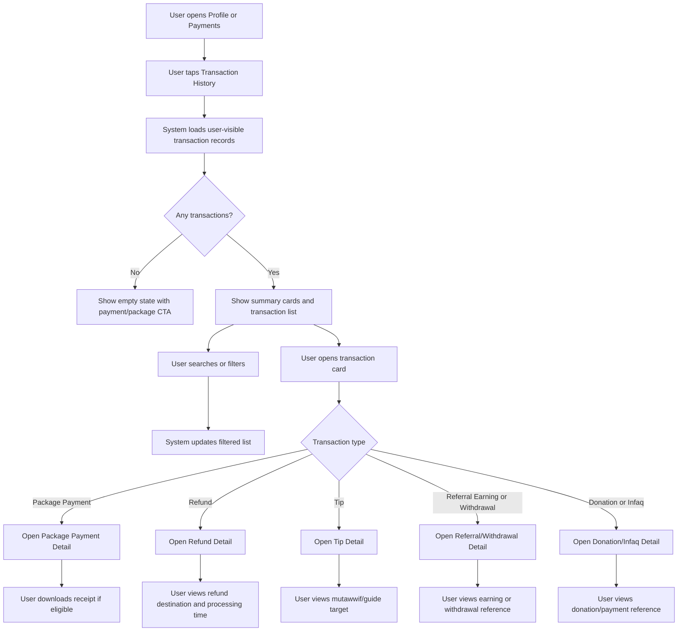

# JUV PRD 07 - Transaction History & Receipts

Product: UmrahHaji.com Jamaah/User View  
Module: Transaction History & Receipts  
Scope: Jamaah/User View / Payments, Refunds, Tips, Referral Earnings, Donation Records  
Platform: Mobile-first Responsive Web Platform  
Status: Draft  
Last Updated: 16 June 2026  

---

## 1. Objective

Transaction History & Receipts allows jamaah to view, search, filter, inspect, and download records of financial transactions related to their Umrah/Hajj journey. This includes package payments, deposit/installment payments, refunds, tips, referral earnings, withdrawal records, donations/infaq records, and other platform-supported payment events.

This module is not a finance operations workspace. It is a user-facing transaction ledger that displays safe, user-readable financial records sourced from Billing & Payment Management, Booking, Referral, Finance, and Payment Gateway records.

The module must answer:

1. What have I paid?
2. What was refunded to me?
3. What tips or donations did I send?
4. What referral earnings or withdrawals did I receive?
5. Can I download a receipt or reference for this transaction?
6. Which booking, package, travel agency, or user action is this transaction related to?

---

## 2. Relationship With Master PRD

This module follows the Jamaah/User View Master PRD:

1. Transaction History is P1.
2. It belongs under the Payments bottom navigation area and can also be accessed from Profile.
3. It displays records owned by the logged-in user only.
4. Billing & Payment Management is the source of invoice, payment, refund, and receipt data.
5. Booking Flow is the source of package payment context.
6. My Group Trip is the source of trip-related payment handoff context.
7. Referral records are sourced from Referral/Finance Management.
8. Tip records are sourced from testimonial/tip/payment records tied to mutawwif or guide service.
9. Donation, zakat, infaq, or BNPL records can be shown only if the relevant Finance/Payment record exists.
10. Customer-facing records must never expose platform commission, gateway settlement internals, or Travel Agency payout data.

---

## 3. Relationship With Admin and Travel Agency PRDs

| Source Module | Relationship |
| --- | --- |
| Admin Billing & Payment Management | Owns invoice, payment, receipt, refund, and gateway reference data |
| Admin Finance Management | Owns referral payout, withdrawal, commission, settlement, and finance reporting oversight |
| Admin Booking Management | Owns booking/payment linkage and booking status |
| Admin Report Management | Can receive transaction/payment issues submitted by jamaah |
| Travel Agency Booking Management | Owns agency booking context and payment status for agency-owned bookings |
| Travel Agency Finance Management | Views agency-owned customer payments, refunds, and outstanding balances |
| Travel Agency Mutawwif/Testimonial | Can be related to tip transactions where enabled |
| Jamaah My Group Trip | Shows payment readiness and links to transaction/payment detail |

### 3.1 Data Visibility Principle

The user sees transaction records that affect their own wallet/payment history. Admin and Travel Agency may see broader operational or finance data, but Jamaah/User View must show a simplified, privacy-safe version.

---

## 4. Research and Product Notes

Transaction history should behave like a trustworthy financial record:

1. Each record needs a clear amount direction: money paid out by user or money received by user.
2. Users should be able to download official receipts for successful payments.
3. Refunds should show expected processing time and refund destination.
4. Failed, pending, expired, and reversed transactions should remain visible for support traceability.
5. Search should support transaction reference, package name, agency name, and payment method.
6. Payment gateway IDs should be visible enough for support, but not exposed as the primary user label.
7. Sensitive payment credentials must not be stored or shown. Only masked payment method labels are allowed.
8. BNPL should not be treated as a generic user debt feature in P1. If shown, it is a transaction type sourced from approved payment records.

Key product correction from reference:

The Zakat/Infaq via BNPL example shows `+RM 350`, but donation/infaq paid by user should normally be an outgoing amount. The PRD should use amount direction rules, not hardcoded prefixes.

---

## 5. Scope

### 5.1 In Scope for Phase 1

1. Transaction History list.
2. Summary cards for user-visible financial totals.
3. Search transactions.
4. Filter by transaction type, status, date range, and payment method.
5. Package payment transaction detail.
6. Refund transaction detail.
7. Tip transaction detail.
8. Referral earning and withdrawal transaction detail.
9. Donation/infaq transaction detail if records exist.
10. Receipt download for eligible transactions.
11. Gateway reference display using safe/masked data.
12. Empty, loading, error, and no-results states.
13. Mobile-first layout with responsive tablet/desktop behavior.

### 5.2 Phase 2 Scope

1. Wallet balance.
2. Advanced referral earnings dashboard.
3. Request withdrawal from user view.
4. Refund request from transaction detail.
5. Dispute transaction from transaction detail.
6. Multi-currency transaction history.
7. BNPL repayment schedule and financing disclosure.
8. Export statement by date range.
9. Donation certificate generation.
10. Advanced tax receipt support if legally required.

### 5.3 Out of Scope

1. Creating invoices.
2. Editing payment records.
3. Verifying payment proof.
4. Manual refund approval.
5. Platform commission display.
6. Travel Agency settlement and payout data.
7. Storing card numbers, CVV, banking login, or full account numbers.
8. Full accounting ledger.
9. Standalone BNPL/credit product.

---

## 6. User Roles

| Role | Access |
| --- | --- |
| Registered User | Can view own transaction history if transactions exist |
| Jamaah | Can view booking, payment, refund, tip, donation, and receipt records linked to own account |
| Primary Booker | Can view booking-level payments for bookings they initiated or manage |
| Family PIC | Can view payment records for authorized family booking only |
| Group PIC | Can view group booking payment summary only if authorized |
| Public Visitor | No access |
| Travel Agency Staff | Not a user of this module, but their portal owns agency-side billing context |
| Admin/Finance | Not a user of this module, but owns source records in back-office modules |

### 6.1 Permission Rules

1. User must be authenticated.
2. User can view only transactions linked to their user ID, booking ID, family/group authorization, or payout account.
3. Family/Group PIC can view booking-level transaction records only if they are the primary payer or authorized payer.
4. Sensitive payment method details must be masked.
5. Gateway transaction IDs can be shown but not used as editable fields.

---

## 7. Entry Points

| Entry Point | Behavior |
| --- | --- |
| Profile - Transaction | Opens Transaction History list |
| Payments bottom nav | Opens Payments area, with Transaction History as one section |
| Payment success screen | Opens package payment transaction detail |
| My Trip payment section | Opens related invoice/transaction detail |
| Refund notification | Opens refund transaction detail |
| Tip confirmation | Opens tip transaction detail |
| Referral earnings card | Opens referral transaction list/detail |
| Receipt email/WhatsApp link | Opens related receipt/detail after authentication |

---

## 8. Information Architecture

```text
Transaction History & Receipts
├── Transaction History List
│   ├── Header
│   ├── Summary Cards
│   ├── Filter Tabs
│   ├── Search
│   ├── Advanced Filters
│   └── Transaction Cards
├── Transaction Detail
│   ├── Common Transaction Header
│   ├── Amount and Status Summary
│   ├── Transaction Metadata
│   ├── Related Entity
│   ├── Gateway Reference
│   ├── Notes / Policy Information
│   └── Receipt / Download Actions
└── Detail Types
    ├── Package Payment Detail
    ├── Refund Detail
    ├── Tip Detail
    ├── Referral Earning Detail
    ├── Withdrawal Detail
    └── Donation / Infaq Detail
```

---

## 9. Main User Flow



---

## 10. Transaction Type Model

### 10.1 Supported User-facing Transaction Types

| Type | Direction | Description | Source |
| --- | --- | --- | --- |
| Package Payment | Outgoing | Payment for Umrah/Hajj package, deposit, installment, or full payment | Billing/Booking |
| Refund | Incoming | Refund returned to user for cancelled/adjusted booking | Billing/Finance |
| Tip | Outgoing | Tip paid to mutawwif/guide/service staff if enabled | Payment/Testimonial/Finance |
| Referral Earning | Incoming | Referral reward earned by user | Referral/Finance |
| Referral Withdrawal | Incoming to bank/e-wallet, outgoing from platform wallet | Payout of referral balance to user | Referral/Finance |
| Donation/Infaq/Zakat | Outgoing | Donation, infaq, zakat, or charitable payment if supported | Finance/Payment |
| Other | Depends on record | Miscellaneous finance event approved by Finance rules | Finance |

### 10.2 Amount Direction Rules

| Direction | Display Rule | Example |
| --- | --- | --- |
| Outgoing | No `+` prefix; amount can use normal color or debit style | RM 39,999 |
| Incoming | Use `+` prefix and success/incoming style | +RM 25,999 |
| Reversal | Use signed amount based on accounting direction | -RM 89.99 or +RM 89.99 |
| Pending | Show amount with pending badge, not success color | RM 5,000 Pending |

Rules:

1. Package payment, tip, and donation are normally outgoing.
2. Refund and referral earning are normally incoming.
3. Referral withdrawal should be labelled carefully: from the user's perspective it is money received to bank/e-wallet, but it also reduces referral balance.
4. Donation/Infaq via BNPL is not automatically incoming; it should follow the payment record direction.
5. Amount direction must be driven by transaction metadata, not by transaction title.

### 10.3 Transaction Status Model

| Status | User Meaning |
| --- | --- |
| Pending | Transaction created but not confirmed |
| Processing | Gateway, bank, or finance team is processing |
| Success | Transaction completed |
| Failed | Transaction failed |
| Expired | Payment link/session expired |
| Refunded | Payment has been refunded |
| Partially Refunded | Only part of the original payment was refunded |
| Reversed | Transaction was reversed/adjusted |
| Cancelled | Transaction was cancelled before completion |

---

## 11. Screen 1 - Transaction History List

### 11.1 Purpose

Show all user-visible transaction records in a scannable mobile list.

### 11.2 Layout

| Section | Content |
| --- | --- |
| Top Navbar | Logo, menu/profile access |
| Header | Back button, `Transaction History`, subtitle |
| Summary Cards | Total Spent, Total Refunded, Tips Given, Referral Earnings, Infaq Donated |
| Filter Tabs | All, Payments, Refunds, Tips, Others |
| Search | Search by package, agency, reference, method |
| Filters | Transaction type, status, date range, payment method |
| Transaction Cards | One card per transaction |

### 11.3 Recommended Subtitle

The reference subtitle says `Track and organize your Umrah & Hajj group journeys`. This should be adjusted because the page is finance-focused.

Recommended subtitle:

`Track your payments, refunds, receipts, tips, and rewards.`

### 11.4 Summary Cards

| Card | Label | Calculation | Notes |
| --- | --- | --- | --- |
| Total Spent | Sum of successful outgoing package, tip, donation payments | Exclude failed/pending |
| Total Refunded | Sum of successful incoming refunds | Include partial refunds |
| Tips Given | Sum of successful outgoing tip transactions | If tipping is enabled |
| Referral Earnings | Sum of earned referral rewards | Separate earned vs withdrawn if needed |
| Infaq Donated | Sum of successful outgoing donation/infaq/zakat | Show only if donation feature exists |

Rules:

1. Summary cards should use confirmed transactions by default.
2. Pending amounts can be shown separately only if product wants a pending indicator.
3. If a feature does not exist for user, hide or show zero state based on design consistency.
4. Summary cards must respect selected date range only if date filter is explicitly applied.

### 11.5 Filter Tabs

| Tab | Included Types |
| --- | --- |
| All | All visible transactions |
| Payments | Package Payment, Deposit, Installment |
| Refunds | Refund, Partial Refund |
| Tips | Tip |
| Others | Referral, Withdrawal, Donation/Infaq/Zakat, Other |

### 11.6 Transaction Card Anatomy

```text
Transaction Card
├── Top Row
│   ├── Status Badge
│   ├── Type Badge
│   ├── Transaction Title
│   └── Amount
├── Metadata Row
│   ├── Reference Number
│   ├── Date and Time
│   └── Payment Method
├── Related Entity
│   ├── Package / Travel Agency / Mutawwif / Referral / Donation
└── Footer
    ├── Download Receipt if eligible
    └── View Details
```

### 11.7 Transaction Card Fields

| Field | Required | Notes |
| --- | ---: | --- |
| Transaction Title | Yes | User-readable title |
| Status Badge | Yes | Pending, Success, Refunded, etc. |
| Type Badge | Yes | Payment, Refund, Tip, Referral, Donation |
| Reference Number | Yes | PAY/REF/TIP/WD/INF reference |
| Amount | Yes | Signed/direction-aware |
| Date and Time | Yes | Use user's locale/timezone display |
| Payment Method | Conditional | Masked, e.g. VISA Credit ****4532 |
| Gateway | Conditional | Chip or configured gateway |
| Related Entity | Conditional | Package, booking, agency, mutawwif |
| Download Button | Conditional | Only when receipt exists |

---

## 12. Transaction Detail Common Pattern

All detail screens should use a shared structure.

| Section | Description |
| --- | --- |
| Header | Back, transaction type icon, title |
| Amount Summary | Total amount, status, direction |
| Related Entity | Package, booking, refund, mutawwif, referral, or donation target |
| Transaction Fields | Gateway, method, transaction IDs, fee, date, references |
| Notes | Refund policy, donation note, processing time, or support note |
| Actions | Download Receipt, Contact Support, Report Issue |

Common fields:

| Field | Required | Visibility |
| --- | ---: | --- |
| Total Amount | Yes | User |
| Status | Yes | User |
| Payment Gateway | Conditional | User |
| Payment Method | Conditional | Masked |
| Gateway Transaction ID | Conditional | User/support-safe |
| Gateway Payment ID | Conditional | User/support-safe |
| Processing Fee | Conditional | Only if charged to user |
| Processing Time | Conditional | User |
| Date | Yes | User |
| Reference | Yes | User |
| Merchant Reference | Conditional | User/support-safe |

Rules:

1. Use masked payment method labels only.
2. Show processing fee only if the fee is charged to or relevant for the user.
3. Do not show gateway settlement, platform commission, net settlement, or Travel Agency payout fields.
4. `Download Receipt` is shown for successful package payments, tips, donations, and completed refunds where receipt exists.
5. Failed/pending transactions can show `View Details` and `Contact Support`, but may not have a receipt.

---

## 13. Package Payment Detail

Purpose:
Shows a completed or attempted package payment.

Fields:

| Field | Example |
| --- | --- |
| Related Package | Premium Hajj 2025 |
| Booking ID | BKG2025001 |
| Travel Agency | Berkah Travel |
| Total Amount | RM 39,999 |
| Status | Success / Pending / Failed |
| Payment Gateway | Chip |
| Payment Method | Full Payment - VISA Credit ****4532 |
| Gateway Transaction ID | txn_chip_3QKL2mFYnRVZX2rH0abc1234 |
| Gateway Payment ID | pay_chip_8999_2024_001 |
| Processing Fee | RM 89.99, only if charged to user |
| Processing Time | Instant |
| Date | 1 Jan 2025, 8:00 AM |
| Reference | PAY2025001 |
| Merchant Reference | BKH2025001 |

Actions:

1. Download Receipt.
2. View Booking / My Trip.
3. Contact Support.

---

## 14. Refund Payment Detail

Purpose:
Shows refund status and refund destination for a cancelled or adjusted booking.

Fields:

| Field | Example |
| --- | --- |
| Related Package | Cancelled Umrah Premium package |
| Original Payment Reference | PAY2025001 |
| Refund Amount | +RM 25,999 |
| Status | Processing / Refunded / Failed |
| Refund Method | Original payment method |
| Refund Destination | Credit Card (Visa ****4532) |
| Gateway Transaction ID | txn_chip_refund_9750_001 |
| Gateway Payment ID | pay_chip_refund_2024_005 |
| Processing Time | 3-5 business days |
| Date | 1 Jan 2025, 8:00 AM |
| Reference | REF2025001 |
| Refund Note | Refund for cancelled package based on policy |

Rules:

1. Refund amount uses incoming display.
2. Refund policy explanation should be concise and user-readable.
3. If refund is processing, show expected timeline.
4. If refund fails, show support path.
5. Refund detail should link to the original payment where allowed.

---

## 15. Tip Payment Detail

Purpose:
Shows a tip paid by user to mutawwif/guide/service staff if tipping is enabled.

Fields:

| Field | Example |
| --- | --- |
| Tip Target | Ustaz Ahmad |
| Related Trip | Premium Umrah 2025 |
| Total Amount | RM 50 |
| Status | Success |
| Payment Gateway | Chip |
| Payment Method | VISA Credit ****4532 |
| Gateway Transaction ID | txn_chip_tip_50_001 |
| Gateway Payment ID | pay_chip_tip_2024_003 |
| Processing Fee | RM 2.50, only if charged to user |
| Processing Time | Instant |
| Date | 1 Jan 2025, 8:00 AM |
| Reference | TIP2024003 |

Rules:

1. Tip is an outgoing transaction for user.
2. Tip target can be shown as mutawwif/guide name if privacy settings allow.
3. Tip payout status to mutawwif should not be shown in Jamaah/User View unless product explicitly approves it.
4. If tipping is not enabled in Phase 1, this type remains display-only for imported/seeded records or Phase 2.

---

## 16. Referral Earning and Withdrawal Detail

### 16.1 Referral Earning

Purpose:
Shows reward earned by the user from referral activity.

Fields:

| Field | Description |
| --- | --- |
| Referral Campaign | Campaign or referral source |
| Earned Amount | Incoming earning amount |
| Status | Pending, Earned, Reversed, Withdrawn |
| Related Booking | Booking that generated reward if allowed |
| Date | Earning timestamp |
| Reference | Referral reference |

Rules:

1. Referral earning may be pending until booking/payment conditions are satisfied.
2. Referral earning can be reversed if booking is cancelled/refunded based on policy.
3. Do not expose referred user's sensitive information unless consent/policy allows.

### 16.2 Referral Withdrawal

Purpose:
Shows payout/withdrawal of referral earnings to user's selected bank or e-wallet.

Fields:

| Field | Example |
| --- | --- |
| Withdrawal Amount | +RM 350 |
| Status | Processing / Paid / Failed |
| Destination | Maybank2u Online Banking or masked bank account |
| Gateway/Provider | Chip or payout provider if applicable |
| Transaction ID | txn_chip_withdrawal_350_001 |
| Payment/Payout ID | pay_chip_wd_2024_002 |
| Processing Fee | RM 1.00, only if charged to user |
| Processing Time | 1-3 business days |
| Date | 1 Jan 2025, 8:00 AM |
| Reference | WD2024002 |

Rules:

1. Withdrawal detail should show money received by user destination.
2. If the user has an internal referral balance, withdrawal should also reduce available balance in Referral module.
3. Bank account details must be masked.
4. Failed withdrawal should explain what happens next.

---

## 17. Donation / Infaq / Zakat Detail

Purpose:
Shows user donation, infaq, zakat, or charitable payment transaction if supported by UmrahHaji.com.

Fields:

| Field | Example |
| --- | --- |
| Donation Type | Zakat Fitrah, Infaq, Donation |
| Amount | RM 1,000 |
| Status | Success / Pending / Failed |
| Payment Gateway | Chip |
| Payment Method | VISA Credit ****4532 |
| Transaction ID | txn_chip_bnpl_500_001 |
| Payment ID | pay_chip_bnpl_2024_010 |
| Processing Fee | RM 15.00, only if charged to user |
| Processing Time | Instant |
| Date | 1 Jan 2025, 8:00 AM |
| Reference | INF2024010 |

Rules:

1. Donation/infaq/zakat is normally outgoing.
2. BNPL should be shown only if supported and approved in Payment/Finance scope.
3. If donation certificate exists, show `Download Certificate`.
4. If no donation feature exists in Phase 1, hide donation summary card and transaction filter unless records exist.
5. Do not label BNPL as user asset/debt unless a formal financing product is defined.

---

## 18. Search and Filter Requirements

### 18.1 Search

Search should support:

1. Transaction title.
2. Package name.
3. Travel Agency name.
4. Reference number.
5. Payment method label.
6. Mutawwif/guide name for tip if visible.

### 18.2 Filters

| Filter | Options |
| --- | --- |
| Transaction Type | All, Package Payment, Refund, Tip, Referral, Withdrawal, Donation/Infaq, Other |
| Status | All, Pending, Processing, Success, Failed, Expired, Refunded, Reversed, Cancelled |
| Date Range | All Time, Today, This Week, This Month, This Year, Custom Range |
| Payment Method | Card, FPX, Bank Transfer, E-wallet, Cash, Manual, Other |
| Related Source | Booking, My Trip, Referral, Tip, Donation, Other |

Rules:

1. Filter selections should persist while user navigates to detail and back.
2. Clear filters should reset list to default.
3. No-result state should explain that no transactions match current filters.

---

## 19. Data Model

### 19.1 Transaction Summary

| Field | Type | Required | Source |
| --- | --- | ---: | --- |
| transaction_id | UUID | Yes | Billing/Finance |
| user_id | UUID | Yes | Auth/User |
| transaction_type | Enum | Yes | Billing/Finance |
| direction | Enum | Yes | Billing/Finance |
| title | String | Yes | Derived/source |
| status | Enum | Yes | Billing/Finance |
| amount | Decimal | Yes | Billing/Finance |
| currency | String | Yes | Billing/Finance |
| reference_number | String | Yes | Billing/Finance |
| occurred_at | DateTime | Yes | Billing/Finance |
| payment_method_label | String | Conditional | Billing/Payment Gateway |
| gateway_name | String | Conditional | Billing/Payment Gateway |
| related_entity_type | Enum | Conditional | Booking/Referral/Finance |
| related_entity_id | UUID/String | Conditional | Source module |
| receipt_file_id | UUID | Conditional | Receipt storage |

### 19.2 Transaction Detail

| Field | Type | Required | Source |
| --- | --- | ---: | --- |
| transaction_id | UUID | Yes | Billing/Finance |
| gateway_transaction_id | String | Conditional | Payment Gateway |
| gateway_payment_id | String | Conditional | Payment Gateway |
| merchant_reference | String | Conditional | Billing/Booking |
| processing_fee | Decimal | Conditional | Billing/Payment Gateway |
| processing_time_label | String | Conditional | Billing/Payment Gateway |
| related_package_snapshot | JSON | Conditional | Booking snapshot |
| related_agency_snapshot | JSON | Conditional | Booking snapshot |
| refund_destination_label | String | Conditional | Billing/Finance |
| original_payment_reference | String | Conditional | Billing/Finance |
| tip_target_snapshot | JSON | Conditional | Tip/Testimonial |
| referral_context | JSON | Conditional | Referral/Finance |
| donation_context | JSON | Conditional | Finance |
| notes | Text | Conditional | Billing/Finance |

### 19.3 Receipt File

| Field | Type | Required | Source |
| --- | --- | ---: | --- |
| receipt_file_id | UUID | Yes | Receipt service |
| file_url | String | Conditional | Secure storage |
| generated_at | DateTime | Yes | Receipt service |
| expires_at | DateTime | Conditional | Secure URL |
| file_format | Enum | Yes | PDF |
| download_allowed | Boolean | Yes | Business rules |

---

## 20. Business Rules

### 20.1 Access Rules

1. User must be authenticated to view transaction history.
2. User can access only transactions linked to their user/account authorization.
3. Receipt URLs must be secure and time-limited.
4. Deep links to receipts/details require authentication.

### 20.2 Financial Display Rules

1. Amounts must use the transaction currency.
2. Incoming transactions use `+` prefix.
3. Outgoing transactions do not use `+` prefix.
4. Failed and expired transactions should remain visible with clear status.
5. Processing fee is displayed only if relevant to user.
6. Customer-facing detail must not show internal commission, settlement, or payout data.

### 20.3 Receipt Rules

1. Receipt can be downloaded for successful package payments, tips, donations, and completed refunds where receipt exists.
2. Pending, failed, and expired payments should not show official receipt unless the system has a pending payment instruction document.
3. Downloaded receipt should include transaction reference, amount, date, payer, payee/agency where applicable, and payment method.
4. Receipt generation must use immutable finalized transaction data.

### 20.4 Refund Rules

1. Refund detail must link to original payment if available.
2. Refund amount can be full or partial.
3. Refund processing time should come from gateway/finance settings.
4. If refund fails, show support path and last update.

### 20.5 Security and Compliance Rules

1. Do not store or display full card numbers, CVV, banking credentials, or full bank account numbers.
2. Use masked labels such as `VISA Credit ****4532`.
3. Gateway IDs can be copied only if product approves copy action; default is display-only.
4. Transaction list must avoid exposing other group members' payment information unless the user is authorized payer/PIC.
5. Audit log is maintained in back-office modules, not exposed fully to user.

---

## 21. States and Edge Cases

| State | Behavior |
| --- | --- |
| Not logged in | Redirect to login and return to intended transaction page |
| Empty transaction list | Show friendly empty state and Browse Packages CTA |
| Loading | Show skeleton cards |
| Network error | Show retry |
| No filter results | Show clear filters CTA |
| Receipt unavailable | Hide download and show helper text |
| Payment pending | Show pending status and processing note |
| Payment failed | Show failed reason if available and retry/payment CTA if applicable |
| Refund processing | Show expected processing time |
| Refund failed | Show support/report CTA |
| Transaction reversed | Show adjustment note |
| Unknown gateway | Show payment method as `Other` and keep reference visible |
| Unauthorized detail | Show access denied and return to list |

---

## 22. Responsive Behavior

### 22.1 Mobile

1. Summary cards use horizontal scroll.
2. Filter tabs use horizontal chips.
3. Transaction cards use single-column layout.
4. Detail pages use stacked sections.
5. Download receipt CTA should be sticky or easy to reach when eligible.

### 22.2 Tablet

1. Summary cards can wrap into two rows.
2. Transaction list remains card-based.
3. Detail metadata can use two-column rows.

### 22.3 Desktop

1. Transaction list can become table/card hybrid.
2. Filters can sit in one row above the list.
3. Transaction detail can use two-column layout with receipt/actions panel.

---

## 23. Analytics Events

| Event | Trigger |
| --- | --- |
| transaction_history_opened | User opens transaction history |
| transaction_summary_card_viewed | Summary cards load |
| transaction_search_used | User searches transaction |
| transaction_filter_selected | User applies filter |
| transaction_card_opened | User opens transaction detail |
| transaction_receipt_downloaded | User downloads receipt |
| transaction_support_clicked | User clicks contact support/report issue |
| refund_detail_opened | User opens refund detail |
| tip_detail_opened | User opens tip detail |
| referral_transaction_opened | User opens referral earning/withdrawal detail |
| donation_transaction_opened | User opens donation/infaq detail |

---

## 24. Functional Requirements

| ID | Requirement | Priority |
| --- | --- | --- |
| JUV-TXN-001 | System shall show Transaction History only to authenticated users. | P1 |
| JUV-TXN-002 | System shall show only user-authorized transactions. | P1 |
| JUV-TXN-003 | System shall show summary cards for total spent, refunded, tips, referral earnings, and infaq donated where applicable. | P1 |
| JUV-TXN-004 | System shall allow search by transaction title, package, agency, reference, and payment method. | P1 |
| JUV-TXN-005 | System shall allow filtering by transaction type, status, date range, and payment method. | P1 |
| JUV-TXN-006 | System shall display transaction cards with status, type, title, reference, amount, date, and payment method. | P1 |
| JUV-TXN-007 | System shall display amount direction correctly for incoming and outgoing transactions. | P1 |
| JUV-TXN-008 | System shall provide Package Payment Detail. | P1 |
| JUV-TXN-009 | System shall provide Refund Payment Detail. | P1 |
| JUV-TXN-010 | System shall provide Tip Payment Detail when tipping records exist. | P1 |
| JUV-TXN-011 | System shall provide Referral Earning and Withdrawal Detail when referral records exist. | P1 |
| JUV-TXN-012 | System shall provide Donation/Infaq/Zakat Detail when records exist. | P1 |
| JUV-TXN-013 | System shall show masked payment method labels only. | P1 |
| JUV-TXN-014 | System shall hide platform commission, settlement, and payout internals from user-facing transaction details. | P1 |
| JUV-TXN-015 | System shall allow receipt download only for eligible transactions. | P1 |
| JUV-TXN-016 | System shall use secure expiring URLs for receipt downloads. | P1 |
| JUV-TXN-017 | System shall show refund destination and expected processing time when available. | P1 |
| JUV-TXN-018 | System shall show empty, loading, error, no-results, and unauthorized states. | P1 |
| JUV-TXN-019 | System shall preserve filters when user opens detail and returns to list. | P1 |
| JUV-TXN-020 | System shall log transaction history, filter, detail, download, and support interactions. | P1 |

---

## 25. Acceptance Criteria

1. Logged-in user can open Transaction History from Profile and Payments area.
2. User sees only transactions linked to their account or authorized booking/PIC scope.
3. Transaction list shows summary cards, filters, search, and transaction cards.
4. Search returns matching transaction records.
5. Filters correctly narrow transaction records.
6. Incoming transactions display with `+` prefix.
7. Outgoing transactions display without `+` prefix.
8. Package payment detail shows package, agency, payment method, gateway reference, date, and receipt action.
9. Refund detail shows refund amount, destination, processing time, and original payment reference where available.
10. Tip detail shows target and related trip where allowed.
11. Referral withdrawal detail masks bank/payment destination.
12. Donation/infaq detail appears only when such records exist or feature is enabled.
13. Download Receipt is hidden when transaction is not eligible.
14. Receipt download uses secure access.
15. Full card/bank data is never displayed.
16. Platform commission and internal settlement data are not visible.
17. Empty, loading, error, and no-results states work on mobile.
18. Mobile layout works from 320px width.

---

## 26. Open Questions

1. Should Transaction History live under Payments tab only, or remain accessible from Profile menu too?
2. Should donation/infaq/zakat be enabled in Phase 1 or hidden until Finance confirms the product scope?
3. Should BNPL appear only as a payment method label, or should a full BNPL repayment schedule become a Phase 2 module?
4. Should users be able to request refund from transaction detail in Phase 2?
5. Should receipt PDFs be generated at payment confirmation time or on-demand when downloaded?
6. Should referral withdrawal be initiated from Referral module only, or also from Transaction History in Phase 2?
7. Should users be able to export full statements by custom date range in Phase 2?

---

## 27. Summary

Transaction History & Receipts should be the user's trusted financial record across package payments, refunds, tips, referral earnings, withdrawals, and approved donation/infaq records. The strongest Phase 1 version is display-first: searchable list, clear amount direction, safe transaction details, and receipt download.

The module should stay synchronized with Billing & Payment Management, Booking, Finance, Referral, and My Group Trip without exposing back-office finance internals. Advanced actions such as withdrawal request, refund request, BNPL repayment schedule, and statement export can remain Phase 2 unless the finance roadmap requires them earlier.
