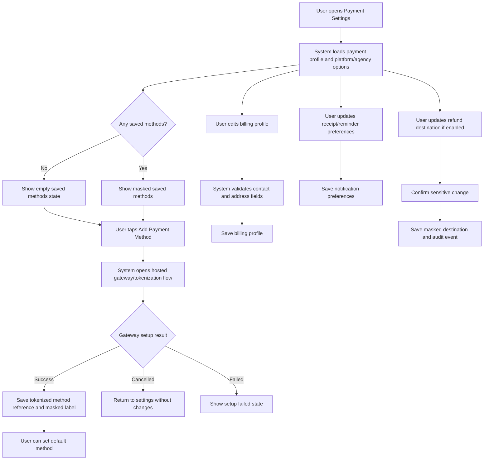
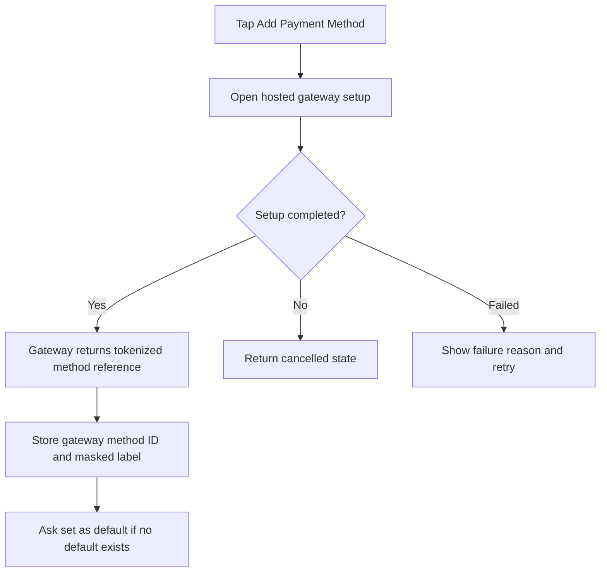

# JUV PRD 08 - Payment Settings

Product: UmrahHaji.com Jamaah/User View  
Module: Payment Settings  
Scope: Jamaah/User View / Payment Preferences, Billing Profile, Receipt & Reminder Settings  
Platform: Mobile-first Responsive Web Platform  
Status: Draft  
Last Updated: 16 June 2026  

---

## 1. Objective

Payment Settings allows jamaah to manage safe payment preferences used across booking, invoice payment, receipts, reminders, refunds, and transaction history. It provides a user-facing place to view or configure preferred payment methods, billing recipient information, receipt delivery preferences, reminder preferences, and refund/payout destination where supported.

This module does not store raw card details, bank login credentials, CVV, full account numbers, or payment gateway secrets. Saved card/payment methods must use gateway tokenization or hosted payment flows.

The module must answer:

1. Which payment method do I prefer to use?
2. Where should my invoices and receipts be sent?
3. Do I want payment reminders by email or WhatsApp?
4. Which refund or payout destination should be used when applicable?
5. Which payment methods are available for my bookings?
6. Is my payment setup safe and ready before checkout?

---

## 2. Relationship With Master PRD

This module follows the Jamaah/User View Master PRD:

1. Payment Settings is P1.
2. It belongs under the Payments tab and can also be accessed from Profile.
3. Booking Flow uses Payment Settings as a preference source, but final available methods are still controlled by package, invoice, Travel Agency, and platform settings.
4. Transaction History uses Payment Settings labels for masked payment method display.
5. My Group Trip payment alerts can link to Payment Settings only when payment setup is incomplete.
6. Refund, referral withdrawal, or payout destination settings are shown only if the Finance/Referral scope enables them.
7. Admin Billing & Payment Management remains the source of invoice, payment, refund, and payment gateway configuration.
8. Travel Agency Finance can configure agency-owned payment options where permitted, but Jamaah/User View sees only allowed options.

---

## 3. Relationship With Admin and Travel Agency PRDs

| Source Module | Relationship |
| --- | --- |
| Admin Billing & Payment Management | Owns payment gateway, invoice settings, receipt rules, reminder rules, and refund/payment policies |
| Admin Finance Management | Owns payout/refund controls, commission, settlement, and finance governance |
| Admin Settings | Owns global payment methods, tax/currency, notification channels, and security policy |
| Travel Agency Finance Management | Owns agency-specific invoice/payment options and bank transfer instructions if enabled |
| Travel Agency Package Management | Package can define allowed payment options such as full payment, deposit, installment |
| Jamaah Booking Flow | Uses saved preferences and redirects to allowed payment method selection |
| Jamaah Transaction History | Displays masked payment method and receipt records |
| Jamaah Profile | Provides identity, contact, and optional bank/refund destination data |

### 3.1 Key Sync Rule

Payment Settings stores user preferences, not financial authority. If the user's preferred method is not allowed for a package/invoice, checkout must show available methods from the invoice/package configuration.

---

## 4. Research and Product Notes

Payment settings touch sensitive data, so the product should use a conservative design:

1. Use hosted payment pages or tokenized payment methods to avoid handling raw card data.
2. Show only masked payment labels such as `VISA Credit ****4532`.
3. Do not store CVV, card number, card PIN, banking password, or full bank account number.
4. Use HTTPS/TLS for all payment-related pages and webhooks.
5. Use programmatic input purposes/autocomplete where appropriate for billing contact forms.
6. Require user confirmation for removing a saved method, changing default method, or changing refund destination.
7. Separate user preference from invoice availability. A saved method does not guarantee it can pay every package.

Reference sources:

- PCI Security Standards Council - PCI DSS: https://www.pcisecuritystandards.org/standards/pci-dss/
- Stripe Integration Security Guide: https://docs.stripe.com/security/guide
- W3C WCAG 2.2 - Identify Input Purpose: https://www.w3.org/WAI/WCAG22/Understanding/identify-input-purpose.html

---

## 5. Scope

### 5.1 In Scope for Phase 1

1. Payment Settings page.
2. Preferred payment method selection.
3. Display available payment methods configured by platform/agency.
4. Saved payment method list if gateway tokenization is enabled.
5. Add payment method through hosted gateway/tokenization flow if enabled.
6. Remove saved payment method.
7. Set default payment method.
8. Billing profile for invoice/receipt recipient.
9. Receipt delivery preferences.
10. Payment reminder preferences.
11. Refund destination view/update if Finance allows user-managed refund destination.
12. Security notes and masked payment data display.
13. Empty/loading/error states.
14. Mobile-first responsive behavior.

### 5.2 Phase 2 Scope

1. Auto-pay for installments.
2. BNPL repayment preference.
3. Wallet balance and top-up settings.
4. Referral withdrawal destination management.
5. Saved statement export preferences.
6. Multi-currency preference.
7. Payment failure recovery recommendations.
8. Payment limit or family approval controls.
9. Shared family payment authorization.
10. Advanced notification schedules.

### 5.3 Out of Scope

1. Storing raw card number.
2. Storing CVV/CVC.
3. Storing banking login credentials.
4. Manually verifying payment proof.
5. Creating invoice from user side.
6. Editing invoice amount or payment terms.
7. Viewing platform commission or Travel Agency settlement.
8. Full wallet/credit/loan product.
9. Making refund or payout approval decisions.

---

## 6. User Roles

| Role | Access |
| --- | --- |
| Registered User | Can manage own payment preferences when logged in |
| Jamaah | Can manage payment settings used for bookings and invoices |
| Primary Booker | Can manage payment settings for own payer profile |
| Family PIC | Can manage payment settings only for their own payer profile, not other adult members |
| Group PIC | Can manage payment settings only for authorized group payment context if enabled |
| Public Visitor | No access |
| Admin/Finance | Owns back-office settings, not user of this page |
| Travel Agency Staff | Owns agency-side options, not user of this page |

### 6.1 Permission Rules

1. User must be authenticated.
2. User can manage only their own payment settings.
3. Family/Group PIC cannot add payment method under another adult member's identity.
4. Sensitive changes may require OTP, password confirmation, or re-authentication.
5. Refund/payout destination change should require confirmation and audit log.

---

## 7. Entry Points

| Entry Point | Behavior |
| --- | --- |
| Profile - Payment Settings | Opens Payment Settings |
| Payments bottom nav | Opens Payments area where Payment Settings is available |
| Booking checkout | Opens Payment Settings only when payment method setup is required |
| Invoice/Payment Details | Opens settings when user wants to update preference |
| Payment failed state | Opens Payment Settings or method selection |
| Refund destination prompt | Opens refund destination section |
| Receipt preference prompt | Opens receipt delivery settings |

---

## 8. Information Architecture

```text
Payment Settings
├── Payment Readiness Summary
├── Preferred Payment Method
├── Saved Payment Methods
│   ├── Method List
│   ├── Add Method
│   ├── Set Default
│   └── Remove Method
├── Billing Profile
│   ├── Full Name
│   ├── Email
│   ├── Phone
│   └── Billing Address
├── Receipt Preferences
│   ├── Email Receipt
│   ├── WhatsApp Receipt
│   └── Download from Transaction History
├── Reminder Preferences
│   ├── Due Date Reminders
│   ├── Overdue Alerts
│   └── Reminder Channels
├── Refund / Payout Destination
│   ├── Bank / E-wallet Destination
│   ├── Masked Destination
│   └── Update Destination
└── Security & Privacy Notes
```

---

## 9. Main User Flow



---

## 10. Payment Method Model

### 10.1 Method Categories

| Method | Phase | Notes |
| --- | --- | --- |
| Card | Phase 1 if gateway enabled | Must be hosted/tokenized |
| FPX / Online Banking | Phase 1 if gateway enabled | Redirect/hosted flow |
| Bank Transfer | Phase 1 | Agency/platform instructions, payment proof may be handled in Billing/Booking flow |
| E-wallet | Phase 1/2 based on gateway support | Hosted/redirect flow |
| Cash / Offline | Phase 1 if agency allows | Display instruction only, not saved as method |
| BNPL | Phase 2 unless approved | Must include financing disclosures |
| Internal Wallet | Phase 2 | Requires wallet/ledger scope |

### 10.2 Saved Payment Method Fields

| Field | Type | Required | Notes |
| --- | --- | ---: | --- |
| method_id | UUID/String | Yes | Internal reference |
| user_id | UUID | Yes | Owner |
| gateway_customer_id | String | Conditional | Gateway customer reference |
| gateway_method_id | String | Conditional | Tokenized method reference |
| method_type | Enum | Yes | Card, bank, e-wallet, etc. |
| brand | String | Conditional | VISA, Mastercard, Maybank, etc. |
| masked_label | String | Yes | Example: VISA Credit ****4532 |
| expiry_month | Integer | Conditional | Card only, if returned by gateway |
| expiry_year | Integer | Conditional | Card only, if returned by gateway |
| is_default | Boolean | Yes | One default per supported context |
| status | Enum | Yes | Active, Expired, Removed, Failed Setup |
| created_at | DateTime | Yes | System |
| last_used_at | DateTime | Conditional | System |

### 10.3 Display Rules

1. Show method icon, brand, masked label, status, and default badge.
2. Do not show full account/card data.
3. Expired methods should remain visible with update/remove CTA.
4. Removed methods should not appear in active list, but remain in audit/back-office records.
5. Default method can be used as preselected option in checkout if method is allowed.

---

## 11. Screen 1 - Payment Settings Overview

### 11.1 Purpose

Provide one place for user payment readiness, preferred methods, billing contact, receipts, reminders, and refund destination.

### 11.2 Layout

| Section | Content |
| --- | --- |
| Header | Payment Settings, subtitle, back navigation |
| Payment Readiness | Payment method setup status and warning if incomplete |
| Preferred Method | Current preferred method or prompt to set |
| Saved Payment Methods | Masked method list |
| Billing Profile | Invoice recipient details |
| Receipt Preferences | Email/WhatsApp receipt toggles |
| Reminder Preferences | Due date and overdue reminders |
| Refund/Payout Destination | Masked bank/e-wallet destination if enabled |
| Security Note | Explanation that sensitive payment data is not stored |

Recommended subtitle:

`Manage payment preferences, billing information, receipts, and reminders.`

---

## 12. Saved Payment Methods

### 12.1 Empty State

Content:

1. Title: `No saved payment method yet`.
2. Description: `Add a secure payment method to make future payments faster.`
3. CTA: `Add Payment Method`.
4. Security note: `Payment details are securely handled by the payment provider.`

### 12.2 Filled State

Each saved method row should show:

| Field | Example |
| --- | --- |
| Method Icon | Card, bank, e-wallet |
| Masked Label | VISA Credit ****4532 |
| Expiry | Expires 08/2028 |
| Status | Active / Expired |
| Default Badge | Default |
| Actions | Set Default, Remove |

### 12.3 Add Payment Method Flow



Rules:

1. Add method must happen through hosted gateway/tokenized setup.
2. The platform stores only gateway method ID and masked method metadata.
3. If setup fails, no partial payment method should be stored.
4. If it is the first active method, set as default by default.

### 12.4 Remove Payment Method Flow

Rules:

1. User must confirm removal.
2. If the method is used by active auto-pay in Phase 2, removal should be blocked or require replacement.
3. If default method is removed, user is prompted to choose another default.
4. Removing a method does not remove past transaction history.

---

## 13. Preferred Payment Method

Purpose:
Allows user to choose a preferred method for future checkout.

Fields:

| Field | Type | Required |
| --- | --- | ---: |
| Preferred Method Type | Select | Yes |
| Preferred Saved Method | Select | Conditional |
| Use for future payments | Toggle | Optional |

Rules:

1. Preferred method is a preference only.
2. Checkout must still validate against invoice/package allowed payment methods.
3. If preferred method is not available during checkout, show available methods and helper text.
4. Default method should not trigger auto-payment unless auto-pay is explicitly enabled in Phase 2.

---

## 14. Billing Profile

Purpose:
Stores invoice and receipt recipient information.

Fields:

| Field | Type | Required | Notes |
| --- | --- | ---: | --- |
| Full Name | Text | Yes | Pre-fill from profile |
| Email | Email | Yes | Used for invoice/receipt delivery |
| Phone Country Code | Select | Yes | Example +60 |
| Phone Number | Text/Tel | Yes | Used for WhatsApp reminders if enabled |
| Address Line | Textarea | Conditional | Needed if invoice requires address |
| City | Text/Select | Conditional |  |
| State/Province | Text/Select | Conditional |  |
| Postal Code | Text | Conditional |  |
| Country | Select | Conditional |  |

Rules:

1. Billing profile can pre-fill from Jamaah Profile.
2. Updating billing profile does not automatically change identity/passport profile data.
3. Email and phone changes may require verification depending on account security rules.
4. Use proper input types and autocomplete attributes where supported.

---

## 15. Receipt Preferences

Purpose:
Allows user to choose how receipts are delivered after payment confirmation.

Settings:

| Setting | Type | Default |
| --- | --- | --- |
| Email Receipt | Toggle | On |
| WhatsApp Receipt | Toggle | On if phone verified |
| Download Receipt from Transaction History | Always available if receipt exists | On |
| Include invoice PDF attachment | Toggle | On if enabled by system |

Rules:

1. Receipt delivery depends on global and agency notification settings.
2. If WhatsApp is not configured or phone is unverified, show disabled state.
3. User can always access receipts from Transaction History if the receipt exists.

---

## 16. Reminder Preferences

Purpose:
Allows user to control payment reminder delivery.

Settings:

| Setting | Type | Notes |
| --- | --- | --- |
| Due Date Reminder | Toggle | Sent before due date |
| Overdue Alert | Toggle | Important alerts may remain required |
| Email Reminder | Toggle | Requires verified email |
| WhatsApp Reminder | Toggle | Requires verified phone |
| Reminder Time | Select | Phase 2 optional |

Rules:

1. Critical overdue or trip-impacting payment alerts may be mandatory even if marketing reminders are disabled.
2. Reminder schedule is controlled by Admin/Travel Agency billing settings.
3. User preference controls delivery channel where allowed.
4. Do not allow users to disable legally or operationally required payment notices if policy requires delivery.

---

## 17. Refund / Payout Destination

Purpose:
Allows user to view or update refund/payout destination if Finance policy allows user-managed destination.

Phase 1 recommendation:

1. Show refund destination only if there is an active refund or approved payout use case.
2. Keep edit ability permission-controlled.
3. Prefer refund to original payment method for card/gateway payments where supported.
4. Use bank/e-wallet destination mainly for manual refunds, referral payout, or failed original-method refunds.

Fields:

| Field | Type | Required | Notes |
| --- | --- | ---: | --- |
| Destination Type | Select | Conditional | Bank, e-wallet, original method |
| Bank/E-wallet Name | Select/Text | Conditional | Example: Maybank |
| Account Holder Name | Text | Conditional | Must match user or approved recipient |
| Account Number / Wallet ID | Text | Conditional | Store securely and display masked |
| Country | Select | Conditional |  |
| Status | Enum | Yes | Unverified, Verified, Pending Review |

Rules:

1. Display masked destination only.
2. Changing destination should require confirmation/re-auth.
3. Finance/Admin can require review before use.
4. Refund destination changes do not change previous refund records.
5. If original payment method refund is required by gateway/policy, user cannot override destination.

---

## 18. Payment Readiness Summary

The top of the page should summarize user readiness.

| State | Message | CTA |
| --- | --- | --- |
| Ready | Payment setup is ready | View Methods |
| No Method | Add a payment method for faster checkout | Add Method |
| Expired Method | Your default card/payment method has expired | Update Method |
| Missing Billing Info | Complete billing profile for invoice delivery | Complete Profile |
| Refund Destination Needed | Add refund destination for pending refund | Add Destination |
| Provider Unavailable | Payment provider temporarily unavailable | Try Again Later |

Rules:

1. Readiness should not block package browsing.
2. Readiness can block checkout only if the selected invoice/payment method requires setup.
3. User should always have a fallback method if platform/agency allows bank transfer or manual payment.

---

## 19. Data Model

### 19.1 Payment Settings Profile

| Field | Type | Required | Source |
| --- | --- | ---: | --- |
| payment_settings_id | UUID | Yes | System |
| user_id | UUID | Yes | Auth/User |
| preferred_method_type | Enum | Conditional | User preference |
| default_saved_method_id | UUID/String | Conditional | Gateway token metadata |
| billing_profile_id | UUID | Conditional | User/Profile |
| receipt_email_enabled | Boolean | Yes | User preference |
| receipt_whatsapp_enabled | Boolean | Yes | User preference |
| reminder_email_enabled | Boolean | Yes | User preference |
| reminder_whatsapp_enabled | Boolean | Yes | User preference |
| refund_destination_id | UUID | Conditional | Finance/Profile |
| updated_at | DateTime | Yes | System |

### 19.2 Billing Profile

| Field | Type | Required | Source |
| --- | --- | ---: | --- |
| billing_profile_id | UUID | Yes | System |
| user_id | UUID | Yes | Auth/User |
| full_name | String | Yes | User input/Profile |
| email | String | Yes | User input/Profile |
| phone_country_code | String | Yes | User input/Profile |
| phone_number | String | Yes | User input/Profile |
| address_line | Text | Conditional | User input/Profile |
| city | String | Conditional | User input/Profile |
| state | String | Conditional | User input/Profile |
| postal_code | String | Conditional | User input/Profile |
| country | String | Conditional | User input/Profile |
| verified_email | Boolean | Yes | Auth/User |
| verified_phone | Boolean | Yes | Auth/User |

### 19.3 Refund / Payout Destination

| Field | Type | Required | Source |
| --- | --- | ---: | --- |
| destination_id | UUID | Yes | System |
| user_id | UUID | Yes | Auth/User |
| destination_type | Enum | Yes | Bank, e-wallet, original method |
| provider_name | String | Conditional | User input |
| account_holder_name | String | Conditional | User input |
| masked_account_label | String | Conditional | Generated |
| encrypted_account_reference | String | Conditional | Secure storage/payment provider |
| status | Enum | Yes | Unverified, Pending Review, Verified |
| last_updated_at | DateTime | Yes | System |

---

## 20. Business Rules

### 20.1 Security Rules

1. Never store raw card number, CVV, card PIN, banking password, or full bank credentials.
2. Store only tokenized gateway references and safe masked metadata.
3. Use HTTPS/TLS for all payment settings and payment method setup.
4. Sensitive changes require confirmation and audit log.
5. Receipt and payment method changes must be accessible only to authenticated users.

### 20.2 Payment Preference Rules

1. Preferred method does not override invoice/package allowed methods.
2. Checkout should preselect default method only if it is available and active.
3. Expired, removed, or failed setup methods cannot be used.
4. Offline/manual payment methods cannot be saved as reusable tokenized methods.

### 20.3 Notification Rules

1. Receipt preferences control delivery channel only if platform/agency supports the channel.
2. Payment reminder preferences can be overridden for critical operational notices.
3. WhatsApp delivery requires verified phone and enabled WhatsApp provider.
4. Email delivery requires verified or deliverable email.

### 20.4 Refund Destination Rules

1. Original payment method refund should be preferred where gateway/policy supports it.
2. Manual refund destination must be verified or reviewed before payout where required.
3. Destination changes apply only to future refunds/payouts unless Finance approves otherwise.
4. Past transaction details must remain unchanged.

---

## 21. States and Edge Cases

| State | Behavior |
| --- | --- |
| Not logged in | Redirect to login and return after authentication |
| No saved methods | Show empty state and Add Method CTA |
| Gateway tokenization disabled | Hide Add Method and show available checkout methods |
| Gateway setup failed | Show failure reason and retry |
| Gateway setup cancelled | Return to settings without changes |
| Method expired | Show expired state and update/remove CTA |
| Removing default method | Prompt user to select another default |
| Billing profile incomplete | Show readiness warning |
| Email unverified | Disable email receipt toggle or prompt verification |
| Phone unverified | Disable WhatsApp receipt/reminder toggle or prompt verification |
| Refund destination pending review | Show pending status and helper text |
| Provider unavailable | Show non-blocking error and retry |

---

## 22. Responsive Behavior

### 22.1 Mobile

1. Single-column settings sections.
2. Primary CTAs full width.
3. Saved methods shown as stacked cards.
4. Toggle rows should have large touch targets.
5. Sensitive confirmations should use bottom sheet or modal.

### 22.2 Tablet

1. Sections can use two-column layout where readable.
2. Saved methods remain card-based.
3. Billing profile can use grouped fields.

### 22.3 Desktop

1. Settings can use left-side section navigation with right-side content.
2. Saved methods and billing profile can sit in separate panels.
3. Security note can be shown in a right-side helper panel.

---

## 23. Analytics Events

| Event | Trigger |
| --- | --- |
| payment_settings_opened | User opens Payment Settings |
| payment_method_add_started | User taps Add Payment Method |
| payment_method_add_completed | Gateway setup succeeds |
| payment_method_add_failed | Gateway setup fails |
| payment_method_set_default | User sets default method |
| payment_method_removed | User removes saved method |
| billing_profile_updated | User saves billing profile |
| receipt_preference_updated | User changes receipt preferences |
| reminder_preference_updated | User changes reminder preferences |
| refund_destination_updated | User updates refund/payout destination |
| payment_security_note_viewed | User opens security explanation |

---

## 24. Functional Requirements

| ID | Requirement | Priority |
| --- | --- | --- |
| JUV-PSET-001 | System shall show Payment Settings only to authenticated users. | P1 |
| JUV-PSET-002 | System shall display payment readiness summary. | P1 |
| JUV-PSET-003 | System shall display preferred payment method. | P1 |
| JUV-PSET-004 | System shall allow user to set preferred payment method. | P1 |
| JUV-PSET-005 | System shall display saved payment methods if gateway tokenization is enabled. | P1 |
| JUV-PSET-006 | System shall add payment method only through hosted/tokenized gateway setup. | P1 |
| JUV-PSET-007 | System shall store only gateway method reference and masked metadata. | P1 |
| JUV-PSET-008 | System shall allow user to set default saved method. | P1 |
| JUV-PSET-009 | System shall allow user to remove saved payment method. | P1 |
| JUV-PSET-010 | System shall prevent expired/removed/failed methods from being used. | P1 |
| JUV-PSET-011 | System shall provide billing profile fields for invoice and receipt delivery. | P1 |
| JUV-PSET-012 | System shall pre-fill billing profile from Jamaah Profile when available. | P1 |
| JUV-PSET-013 | System shall provide receipt delivery preferences. | P1 |
| JUV-PSET-014 | System shall provide payment reminder preferences. | P1 |
| JUV-PSET-015 | System shall show refund/payout destination only when enabled by Finance rules. | P1 |
| JUV-PSET-016 | System shall mask refund/payout destination details. | P1 |
| JUV-PSET-017 | System shall require confirmation/re-auth for sensitive payment setting changes. | P1 |
| JUV-PSET-018 | System shall never store or display raw card/CVV/banking credentials. | P1 |
| JUV-PSET-019 | System shall show empty, loading, error, disabled, and provider unavailable states. | P1 |
| JUV-PSET-020 | System shall log payment setting changes and important user interactions. | P1 |

---

## 25. Acceptance Criteria

1. Logged-in user can open Payment Settings from Profile and Payments area.
2. User can view payment readiness summary.
3. User can choose preferred payment method type.
4. Saved payment methods are displayed only as masked labels.
5. Add payment method opens a hosted/tokenized provider setup, not a raw card form.
6. Successful setup stores token reference and masked metadata.
7. Failed setup does not create an active method.
8. User can set one default saved method.
9. User can remove a saved method after confirmation.
10. Expired methods cannot be used for payment.
11. Billing profile can be saved and pre-filled from Profile.
12. Receipt and reminder preferences can be saved.
13. WhatsApp toggles are disabled or show verification prompt when phone is unverified.
14. Refund/payout destination is masked and permission-controlled.
15. Raw card number, CVV, banking password, and full bank account number are never shown.
16. Checkout still validates against package/invoice allowed payment methods.
17. Mobile layout works from 320px width.

---

## 26. Open Questions

1. Should saved payment methods be enabled in Phase 1, or should Phase 1 use gateway redirect without saving methods?
2. Which payment provider will be used for tokenized methods in production?
3. Should Payment Settings include refund destination in P1, or should it remain under Profile/Finance only?
4. Should users be allowed to disable payment reminders, or only choose delivery channels?
5. Should family/group booking allow shared payer authorization in Phase 2?
6. Should BNPL preference appear only after BNPL product approval?
7. Should bank transfer proof upload live in Booking/Invoice flow only, or also be accessible from Payment Settings?

---

## 27. Summary

Payment Settings should be a safe preference and readiness page, not a raw payment data storage area. The strongest Phase 1 version lets users manage billing profile, receipt/reminder preferences, preferred method, and tokenized saved methods only if the gateway supports it.

The module stays synchronized with Admin Billing, Finance, Travel Agency payment options, Booking, Transaction History, and My Group Trip while keeping finance authority in the back-office systems. Advanced auto-pay, wallet, BNPL, withdrawal request, and family payer authorization can remain Phase 2 unless the finance roadmap explicitly moves them forward.
