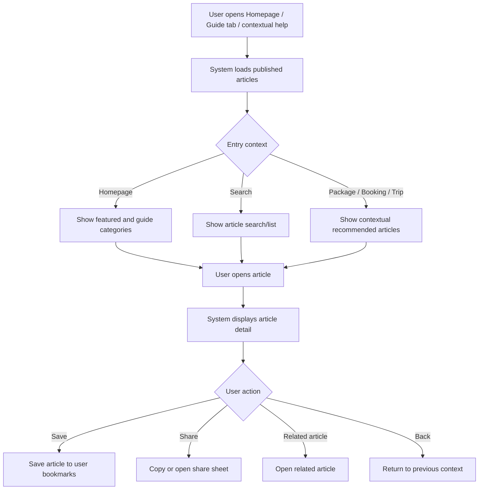
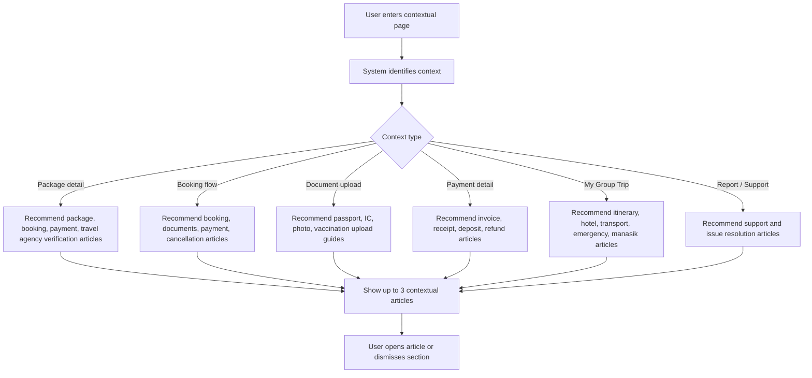

# JUV PRD 09 - Articles / Guide Content

Product: UmrahHaji.com Jamaah/User View  
Module: Articles / Guide Content  
Scope: Jamaah/User View / Educational Articles, Pilgrimage Guides, Contextual Help  
Platform: Mobile-first Responsive Web Platform  
Status: Draft  
Last Updated: 16 June 2026  

---

## 1. Objective

Articles / Guide Content provides jamaah with trusted, easy-to-read educational content before, during, and after Umrah/Hajj. It helps users understand pilgrimage preparation, documents, payments, itinerary guidance, travel policies, health and safety, package selection, and platform usage.

This module is primarily read-only for jamaah. Article creation, review, publishing, archiving, SEO metadata, and content governance are owned by Admin Panel Articles Management.

The module must answer:

1. What should I prepare before Umrah/Hajj?
2. What documents, health requirements, and travel steps do I need?
3. How do I understand package, booking, payment, refund, and trip rules?
4. Where can I read trusted guidance connected to my booking or group trip?
5. How can I save, share, or revisit useful articles?
6. How can the platform recommend relevant guidance without overwhelming the user?

---

## 2. Relationship With Master PRD

This module follows the Jamaah/User View Master PRD:

1. Articles / Guide Content is P1.
2. It is accessible from Homepage, bottom navigation, Profile, Package Detail, Booking Flow, My Group Trip, Report/Support context, and search results.
3. Public articles may be accessible before login.
4. Personalized article recommendations require authenticated user context.
5. Articles must be consistent with Admin Panel Articles Management.
6. Article content should support mobile-first reading and low-friction sharing.
7. Articles are educational and voluntary; they do not replace official booking, invoice, visa, or travel document status.

---

## 3. Relationship With Admin and Travel Agency PRDs

| Source Module | Relationship |
| --- | --- |
| Admin Articles Management | Creates, edits, schedules, publishes, archives, categorizes, tags, and monitors articles |
| Admin Announcement Management | Can link to published articles for deeper explanation |
| Admin Report Management | Can reference articles as help content for common issues |
| Admin Settings | Controls public visibility, language, notification, and content policy |
| Travel Agency Articles / Knowledge Base | Agency staff can read/share approved articles and attach links to trip/package communication |
| Travel Agency Package Management | Package detail may show related preparation articles |
| Travel Agency Booking / Jamaah Management | Booking/document workflows may link to document preparation articles |
| Jamaah Homepage | Shows selected guide cards and featured content |
| Jamaah Package Discovery | Can surface package-related guide content |
| Jamaah Booking Flow | Can show contextual preparation/payment/document help |
| Jamaah My Group Trip | Can show itinerary/day/document guidance |
| Jamaah Reports & Support | Can suggest help articles before or after report creation |

### 3.1 Key Sync Rule

Jamaah/User View only displays articles with `Published` status and allowed visibility. Draft, scheduled, archived, internal-only, or agency-only content must not appear in the public/user article experience.

---

## 4. Research and Product Notes

For a user-facing article module, the product should follow a content-first pattern:

1. Use clear page titles, headings, summaries, and related links.
2. Keep article detail readable on small screens.
3. Use categories and tags for discovery, not as visual noise.
4. Support structured content blocks or sanitized HTML from Admin.
5. Use accessible text contrast, heading order, link labels, and form input purpose.
6. Support SEO metadata and share previews for public article pages.
7. Avoid publishing medical, legal, or religious claims without reviewer/source metadata.
8. Make content date/version visible when guidance may change.

Reference sources:

- Google Search Central - SEO Starter Guide: https://developers.google.com/search/docs/fundamentals/seo-starter-guide
- Schema.org - Article structured data type: https://schema.org/Article
- W3C WCAG 2.2 - Headings and Labels: https://www.w3.org/WAI/WCAG22/Understanding/headings-and-labels.html

---

## 5. Scope

### 5.1 In Scope for Phase 1

1. Article / Guide home.
2. Article list.
3. Article category browsing.
4. Search articles by title, excerpt, category, tag, or keyword.
5. Article detail page.
6. Featured articles.
7. Latest articles.
8. Popular articles.
9. Related articles.
10. Contextual articles in package, booking, document upload, payment, group trip, and support flows.
11. Save/bookmark article for logged-in users.
12. Share article link.
13. Open public article from link.
14. Read time, author/reviewer, updated date, and content type display.
15. Empty/loading/error states.
16. Mobile-first responsive behavior.
17. Basic analytics events for read/search/share/save.

### 5.2 Phase 2 Scope

1. Multi-language article variants.
2. Personalized learning checklist.
3. Offline saved reading.
4. Audio narration.
5. Video guide collections.
6. Article comments or feedback.
7. Article contribution request from jamaah.
8. Dynamic article recommendations based on trip day.
9. Content quiz or readiness check.
10. In-app article notifications for major updates.
11. Advanced article-to-booking conversion analytics.

### 5.3 Out of Scope

1. Article authoring from Jamaah/User View.
2. Public comment moderation.
3. Religious ruling approval workflow.
4. Medical/legal consultation.
5. Announcement creation.
6. Support ticket creation, except links from support context.
7. Checklist task completion, which belongs to a separate Checklist & Guidance module.
8. Admin SEO/content approval workflow.

---

## 6. User Roles and Access

| User Type | Access |
| --- | --- |
| Guest | View public published articles, search public articles, share public links |
| Registered Jamaah | Guest access plus save articles, view personalized contextual articles, see booking/trip-related guidance |
| Invited Jamaah | Same as Registered Jamaah after accepting invitation |
| Family/Group Member | View group/trip-related articles if the member has access to the trip |
| Suspended/Banned User | Public article access only if not blocked by platform policy |

---

## 7. User Needs

### 7.1 Before Booking

1. Compare package types with clear educational content.
2. Understand Umrah vs Hajj requirements.
3. Learn what documents are needed.
4. Understand payment/deposit/refund policy basics.
5. Learn how travel agency verification works.

### 7.2 During Booking

1. Read document upload instructions.
2. Understand payment plans and invoice terms.
3. Know what happens after booking.
4. Understand visa, vaccination, hotel, flight, and room arrangement status.

### 7.3 Before Departure

1. Read preparation checklist.
2. Understand itinerary basics.
3. Learn health, safety, and travel etiquette.
4. Read baggage, airport, transport, and accommodation tips.

### 7.4 During Trip

1. Open day-specific guidance from My Group Trip.
2. Read manasik reminders.
3. Access emergency and support guidance.
4. Understand hotel/transport/activity instructions.

### 7.5 After Trip

1. Learn how to submit testimonial.
2. Understand certificate, receipt, refund, or complaint process.
3. Save useful content for future trips or family members.

---

## 8. Content Categories

| Category | Description | Example Topics |
| --- | --- | --- |
| Umrah Guide | General Umrah preparation and rituals | Ihram, tawaf, sa'i, tahallul |
| Hajj Guide | General Hajj preparation and rituals | Mina, Arafah, Muzdalifah, jamrah |
| Documents & Visa | Document preparation | Passport, IC, photo, visa, vaccination |
| Health & Safety | Health guidance and safety reminders | Vaccination, heat safety, medication, emergency |
| Travel Guide | Travel logistics | Airport, baggage, hotel, transport, train |
| Package & Booking | How packages and bookings work | Package type, booking steps, room types |
| Payment & Refund | Payment education | Deposit, installment, receipt, refund policy |
| Platform Guide | How to use UmrahHaji.com | Booking, group trip, upload documents, report issue |
| Makkah & Madinah Tips | Destination guidance | Mosque etiquette, local transport, useful places |
| Family Travel | Family/group travel guidance | Children, elderly, family room, group coordination |
| FAQ | Short answer content | Common booking/payment/document questions |

### 8.1 Phase 1 Category Rule

Category list should be controlled by Admin Panel. Jamaah/User View only consumes active categories that contain published articles.

---

## 9. Content Type Model

| Content Type | Purpose | Display Pattern |
| --- | --- | --- |
| Article | Educational long-form content | Article card and detail |
| Guide | Step-by-step guidance | Guide card, numbered steps |
| FAQ | Short Q&A | Accordion or compact card |
| Practical Tips | Short, scannable tips | Card/list |
| Policy Explanation | Simplified policy guidance | Detail page with disclaimer |
| Checklist Reference | Read-only prep checklist article | Article detail, no completion tracking in P1 |
| Destination Info | Place-related content | Destination card/detail |

---

## 10. Information Architecture

```text
Articles / Guide
├── Guide Home
│   ├── Featured Guides
│   ├── Categories
│   ├── Latest Articles
│   ├── Popular Articles
│   └── Saved Articles
├── Article List
│   ├── Search
│   ├── Category Filter
│   ├── Content Type Filter
│   ├── Sort
│   └── Article Cards
├── Article Detail
│   ├── Hero / Thumbnail
│   ├── Title & Excerpt
│   ├── Author / Reviewer
│   ├── Updated Date
│   ├── Read Time
│   ├── Body Content
│   ├── Related Articles
│   └── Save / Share Actions
├── Contextual Articles
│   ├── Package Detail
│   ├── Booking Step
│   ├── Document Upload
│   ├── Payment Detail
│   ├── My Group Trip
│   └── Report / Support
└── Saved Articles
    ├── Saved List
    ├── Search Saved
    └── Remove Saved
```

---

## 11. Main User Flow



---

## 12. Contextual Recommendation Flow



### 12.1 Recommendation Rule

Phase 1 recommendation can use simple metadata matching:

1. Category.
2. Tags.
3. Related module.
4. Package category.
5. Trip status.
6. Document type.
7. Payment status.

Complex personalization should be Phase 2.

---

## 13. Entry Points

| Entry Point | Behavior |
| --- | --- |
| Homepage - Umrah & Hajj Guide section | Opens article list or article detail |
| Bottom Navigation - Guidelist / Articles | Opens Guide Home |
| Package Detail | Shows package-related guides |
| Booking Flow | Shows contextual help for current booking step |
| Document Upload Modal | Shows document instruction article |
| Payment Details | Shows payment/refund guide article |
| My Group Trip | Shows trip/day/document articles |
| Profile - Articles/Guidance | Opens saved or recommended articles |
| Report / Support | Shows suggested article before report submission |
| Shared Link | Opens public article if visibility allows |
| Search | Includes article results if global search supports content |

---

## 14. Screen 1 - Guide Home

### 14.1 Purpose

Guide Home is the main entry point for jamaah to discover educational content.

### 14.2 Components

| Component | Requirement |
| --- | --- |
| Header | Page title `Guide` or `Umrah & Hajj Guide`, search icon, optional saved icon |
| Search Bar | Placeholder `Search guide, documents, payment, or trip tips...` |
| Featured Guide Carousel | Up to 5 featured articles from Admin |
| Category Chips | Active categories with article count optional |
| Preparation Section | Curated preparation articles |
| During Trip Section | Contextual if user has active trip |
| Latest Articles | Recent published articles |
| Popular Articles | Most viewed public articles |
| Saved Articles Preview | Logged-in users only |
| Empty State | Show educational empty copy if no articles available |

### 14.3 Display Rules

1. Guest users can see public content.
2. Logged-in users can see saved and contextual content.
3. Active trip users should see `For Your Trip` section.
4. If no trip exists, hide trip-specific section.
5. Featured content is controlled by Admin `Featured Article` flag.

---

## 15. Screen 2 - Article List

### 15.1 Purpose

Article List allows users to search and browse published articles.

### 15.2 Filters

| Filter | Options |
| --- | --- |
| Category | All, Umrah Guide, Hajj Guide, Documents & Visa, Health & Safety, Travel Guide, Payment & Refund, Platform Guide |
| Content Type | All, Article, Guide, FAQ, Practical Tips, Policy |
| Sort | Latest, Popular, Recommended, Shortest Read |
| Language | Default language first; Phase 2 multi-language |

### 15.3 Search Behavior

Search should match:

1. Article title.
2. Excerpt.
3. Category.
4. Tags.
5. Body content keywords if indexed.
6. Related module.

### 15.4 Article Card Fields

| Field | Required | Notes |
| --- | --- | --- |
| Thumbnail | No | Use fallback if missing |
| Category Badge | Yes | Active category |
| Title | Yes | Max 2 lines on list |
| Excerpt | Yes | Max 2-3 lines |
| Read Time | No | Auto-calculated from content |
| Updated Date | Yes | Important for changing guidance |
| Author/Reviewer | No | Recommended for trust |
| Featured Badge | No | Only if featured |
| Saved Indicator | No | Logged-in users only |

---

## 16. Screen 3 - Article Detail

### 16.1 Purpose

Article Detail provides a focused reading experience.

### 16.2 Page Content

| Section | Requirement |
| --- | --- |
| Header | Back button, save button, share button |
| Hero Image | Optional thumbnail/featured image |
| Category | Show category badge |
| Title | Clear H1 |
| Excerpt | Short summary |
| Metadata | Updated date, read time, author/reviewer |
| Body | Structured content from Admin |
| Disclaimer | Required for health, policy, finance, religious guidance where applicable |
| Related Articles | 3-5 related articles |
| CTA Context Link | Optional contextual CTA such as `Continue Booking`, `Upload Documents`, `View My Trip` |

### 16.3 Reading Behavior

1. Body content should support headings, paragraph, bullets, numbered lists, quote blocks, images, and links.
2. Links should clearly describe destination.
3. Long articles should support a sticky progress indicator or table of contents in Phase 2.
4. User should return to the previous context after closing article.
5. If opened from shared link, user should remain in public article context.

---

## 17. Screen 4 - Contextual Article Section

### 17.1 Purpose

Contextual articles reduce support burden by showing help at the right moment.

### 17.2 Context Mapping

| Context | Suggested Articles |
| --- | --- |
| Package Detail | How package types work, what is included, cancellation policy, agency verification |
| Booking Step | How booking works, passenger data requirement, family booking rules |
| Document Upload | Passport copy guide, IC upload guide, photo requirements, vaccination certificate guide |
| Payment Detail | Deposit plan, receipt, invoice, refund, payment failure |
| My Group Trip | Daily preparation, hotel, transport, emergency contact, mutawwif guidance |
| Report / Support | How to report an issue, what evidence to attach, expected response time |
| Testimonial | How reviews work, public vs private feedback |

### 17.3 UI Rules

1. Show maximum 3 articles by default.
2. Use compact cards in forms/modals.
3. Use `See all related guides` link if more articles exist.
4. Contextual articles should not block primary task completion.
5. Users should be able to dismiss contextual suggestions in the current session.

---

## 18. Screen 5 - Saved Articles

### 18.1 Purpose

Saved Articles allows logged-in users to revisit important guidance.

### 18.2 Requirements

1. User can save article from card or detail page.
2. User can remove saved article.
3. Saved articles are visible from Guide Home and Profile.
4. Saved article list should show title, category, updated date, and read time.
5. If an article becomes archived, saved list should show `No longer available` or hide it based on Admin setting.
6. User cannot save draft/scheduled/internal article.

### 18.3 Empty State

Message:

```text
No saved articles yet.
Save useful guides so you can find them again before or during your trip.
```

---

## 19. Screen 6 - Public Article From Shared Link

### 19.1 Purpose

Users may open articles from WhatsApp, email, travel agency messages, announcements, or external links.

### 19.2 Rules

1. Public published articles open without login.
2. User-specific or trip-specific articles require login.
3. If article requires login, redirect to login and return to article after authentication.
4. If article is archived, show unavailable state with related articles.
5. If article is scheduled/draft/internal, show not found.
6. Shared preview should use article title, excerpt, thumbnail, and canonical URL.

---

## 20. Article Visibility Model

| Visibility | Guest | Logged-in Jamaah | Travel Agency Staff | Admin |
| --- | --- | --- | --- | --- |
| Public | View | View | View | Manage |
| Registered Users | Login required | View | View if allowed | Manage |
| Trip Members Only | No | View if related to trip | View if related to agency/trip | Manage |
| Travel Agency Only | No | No | View if allowed | Manage |
| Internal Admin | No | No | No | Manage |

### 20.1 Phase 1 Rule

Jamaah/User View should support `Public`, `Registered Users`, and `Trip Members Only`. Other visibility rules can exist in Admin but should not create user-facing confusion.

---

## 21. Content Trust and Disclaimer Rules

### 21.1 Reviewer Metadata

For sensitive categories, show reviewer/source metadata if available.

| Category | Reviewer/Source Recommended |
| --- | --- |
| Health & Safety | Medical/health reviewer or official source note |
| Payment & Refund | Platform finance/policy source |
| Documents & Visa | Platform operations or official requirement note |
| Umrah/Hajj Guide | Religious reviewer/ustaz metadata |
| Travel Policy | Platform policy/admin reviewer |

### 21.2 Disclaimer Examples

| Content Type | Disclaimer |
| --- | --- |
| Health | `This guide is general information and does not replace medical advice.` |
| Religious | `This guide is educational. Follow your appointed mutawwif or trusted scholar for specific religious guidance.` |
| Payment/Refund | `Final payment and refund terms follow your invoice, package terms, and platform policy.` |
| Document/Visa | `Requirements may change. Always follow the latest instruction from your travel agency or platform notification.` |

---

## 22. Article Data Model

### 22.1 Article

| Field | Type | Required | Notes |
| --- | --- | --- | --- |
| article_id | UUID | Yes | Unique identifier |
| title | String | Yes | From Admin |
| slug | String | Yes | Public URL |
| excerpt | Text | Yes | Short summary |
| content | Structured blocks / sanitized HTML | Yes | Rendered read-only |
| category_id | UUID | Yes | Active category |
| content_type | Enum | Yes | Article, Guide, FAQ, Tips, Policy |
| thumbnail_url | URL | No | Optimized media |
| author_id | UUID | No | Admin/author profile |
| reviewer_name | String | No | Trust metadata |
| reviewer_role | String | No | Trust metadata |
| status | Enum | Yes | Only Published visible |
| visibility | Enum | Yes | Public, Registered, Trip Members |
| is_featured | Boolean | No | Homepage/Guide home |
| tags | Array | No | Search/recommendation |
| related_module | Array | No | Booking, Payment, Group Trip, Documents |
| read_time_minutes | Number | No | Auto-calculated |
| published_at | Datetime | Yes | Public date |
| updated_at | Datetime | Yes | Last updated date |
| canonical_url | URL | No | SEO/share |

### 22.2 Article Category

| Field | Type | Required | Notes |
| --- | --- | --- | --- |
| category_id | UUID | Yes | Unique identifier |
| name | String | Yes | Visible label |
| description | Text | No | Category intro |
| icon | String | No | UI icon |
| status | Enum | Yes | Active/Inactive |
| sort_order | Number | No | Display order |

### 22.3 Saved Article

| Field | Type | Required | Notes |
| --- | --- | --- | --- |
| saved_article_id | UUID | Yes | Unique identifier |
| user_id | UUID | Yes | Owner |
| article_id | UUID | Yes | Saved article |
| saved_at | Datetime | Yes | Timestamp |

### 22.4 Article View Event

| Field | Type | Required | Notes |
| --- | --- | --- | --- |
| event_id | UUID | Yes | Unique identifier |
| article_id | UUID | Yes | Viewed article |
| user_id | UUID | No | Null for guest |
| context_type | Enum | No | Homepage, Booking, Trip, Payment, Support |
| context_id | UUID | No | Booking/package/trip if applicable |
| viewed_at | Datetime | Yes | Timestamp |

---

## 23. Business Rules

1. Only published articles can appear in Jamaah/User View.
2. Articles must respect visibility and access rules.
3. Draft, scheduled, archived, deleted, or internal articles must not appear.
4. Article detail should show `Updated` date to reduce outdated guidance risk.
5. Article recommendations must not block booking/payment/document completion.
6. Saved article action requires login.
7. Share action should work for public articles.
8. Trip-member-only article links require authentication and access validation.
9. Article content from Admin must be sanitized before rendering.
10. External links should open safely and be clearly labeled.
11. Missing thumbnail should use category fallback image/icon.
12. If article is unavailable, show related public articles if possible.
13. Article search should not expose internal tags or unpublished content.
14. Health, religious, payment, and document guidance should show disclaimer when category requires it.
15. Article analytics must not expose private user information to public users.

---

## 24. States and Edge Cases

| State / Case | Expected Behavior |
| --- | --- |
| No articles | Show empty state and hide category sections |
| No search result | Show `No guide found` and suggest categories |
| Slow network | Show skeleton cards |
| Article archived after saved | Show unavailable state or remove from saved list |
| Article visibility changed | Revalidate access on open |
| User opens trip-only article without login | Redirect to login and return after login |
| User opens trip-only article but not member | Show access denied |
| Article missing thumbnail | Use default category visual |
| Article has outdated update date | Show `Last updated` prominently |
| Article body media fails | Show fallback area and continue text reading |
| User taps external source link | Open safely with confirmation if leaving platform |

---

## 25. Notifications

Phase 1 should keep article notifications minimal.

| Event | Recipient | Channel | Notes |
| --- | --- | --- | --- |
| Major trip-related guide update | Affected trip members | In-app, optional WhatsApp/email | Only critical guidance |
| Saved article updated | User who saved article | In-app optional | Phase 2 preferred |
| Announcement links article | Announcement audience | Announcement channels | Owned by Announcement module |
| Support suggests article | Reporting user | In-app | Owned by Support/Report flow |

### 25.1 Notification Rule

Do not notify users for every new article. Article notifications should be used only for important contextual updates or when linked through Announcement.

---

## 26. Analytics Events

| Event | Trigger |
| --- | --- |
| article_home_opened | User opens Guide Home |
| article_search_submitted | User searches articles |
| article_filter_applied | User applies category/type/sort filter |
| article_card_clicked | User opens article from list/card |
| article_detail_viewed | Article detail loads |
| article_saved | User saves article |
| article_unsaved | User removes saved article |
| article_shared | User shares/copies article link |
| contextual_article_clicked | User opens contextual article |
| related_article_clicked | User opens related article |
| article_unavailable_viewed | User opens unavailable/archived article |

### 26.1 Analytics Privacy

1. Guest analytics should use anonymous session identifiers only.
2. User-specific analytics should follow platform privacy policy.
3. Article analytics shown to Admin should be aggregated unless authorized.

---

## 27. Functional Requirements

| ID | Requirement | Priority |
| --- | --- | --- |
| JUV-ART-001 | System shall display Guide Home with published article sections. | P1 |
| JUV-ART-002 | System shall display active article categories from Admin. | P1 |
| JUV-ART-003 | System shall allow users to search published articles. | P1 |
| JUV-ART-004 | System shall allow filtering by category and content type. | P1 |
| JUV-ART-005 | System shall display article cards with title, excerpt, category, updated date, and thumbnail/fallback. | P1 |
| JUV-ART-006 | System shall open article detail from card/list/contextual link. | P1 |
| JUV-ART-007 | System shall render structured/sanitized article content safely. | P1 |
| JUV-ART-008 | System shall show article metadata including updated date and read time when available. | P1 |
| JUV-ART-009 | System shall show sensitive-content disclaimer based on category/content type. | P1 |
| JUV-ART-010 | System shall show related articles on detail page. | P1 |
| JUV-ART-011 | System shall allow logged-in users to save and unsave articles. | P1 |
| JUV-ART-012 | System shall show saved article list for logged-in users. | P1 |
| JUV-ART-013 | System shall allow users to share public article links. | P1 |
| JUV-ART-014 | System shall hide draft, scheduled, archived, deleted, and unauthorized articles. | P1 |
| JUV-ART-015 | System shall show contextual articles in package, booking, document, payment, trip, and support contexts. | P1 |
| JUV-ART-016 | System shall redirect unauthenticated users to login when opening restricted article links. | P1 |
| JUV-ART-017 | System shall show unavailable/access denied states for inaccessible articles. | P1 |
| JUV-ART-018 | System shall track article view, search, save, share, and contextual click events. | P1 |
| JUV-ART-019 | System shall support mobile-first responsive article reading. | P1 |
| JUV-ART-020 | System shall support public article SEO/share metadata from Admin. | P1 |
| JUV-ART-021 | System shall not allow jamaah to create, edit, publish, or archive articles. | P1 |
| JUV-ART-022 | System shall show external links clearly and safely. | P1 |
| JUV-ART-023 | System shall preserve return path when user opens an article from booking/trip/payment context. | P1 |
| JUV-ART-024 | System shall show empty/loading/error states for article home, list, detail, and saved articles. | P1 |

---

## 28. Acceptance Criteria

1. Guest can open public article list and public article detail.
2. Logged-in jamaah can save and unsave article.
3. Article search returns only published and allowed articles.
4. Draft, scheduled, archived, deleted, internal, or unauthorized articles do not appear.
5. Package detail can show related package/booking guide articles.
6. Booking document upload can show document-specific guide articles.
7. Payment details can show payment/refund guide articles.
8. My Group Trip can show trip/day/preparation guide articles.
9. Article detail shows title, category, excerpt, body, updated date, and related articles.
10. Sensitive categories show disclaimer.
11. Shared public article link can be opened without login.
12. Restricted article link requires login and access validation.
13. Mobile article detail remains readable without horizontal scrolling.
14. Save/share/search/read events are tracked.
15. If no articles exist, page shows proper empty state.
16. If an archived saved article is opened, system shows unavailable state.

---

## 29. Responsive Behavior

### 29.1 Mobile

1. Single-column layout.
2. Search at top.
3. Category chips horizontal scroll.
4. Article cards stacked or horizontal carousel depending on section.
5. Article body max width follows mobile content padding.
6. Save/share actions in header or floating action area.
7. Related articles shown below article body.

### 29.2 Tablet

1. Two-column article card grid.
2. Category filter can remain sticky at top.
3. Detail page may show related articles below or side rail.

### 29.3 Desktop Web

1. Wider reading column with optional side rail.
2. Search and filters in horizontal layout.
3. Article body should preserve readable line length.
4. Related articles can appear in side panel.

---

## 30. Content Quality Guidelines

1. Use simple language for non-technical users.
2. Keep important actions and warnings near the top.
3. Use H2/H3 headings for scanability.
4. Use short paragraphs.
5. Use lists for requirements and steps.
6. Avoid unsupported claims.
7. Include updated date and reviewer/source metadata when applicable.
8. Avoid mixing announcements with evergreen guide content.
9. Avoid making users read long articles to complete urgent tasks.
10. Link to exact platform actions where useful.

---

## 31. Open Questions

1. Should article content support Bahasa Melayu, Bahasa Indonesia, English, and Arabic in Phase 1 or Phase 2?
2. Should users be able to request article corrections in Phase 1?
3. Should saved articles be available offline in Phase 2?
4. Should trip day-specific articles be manually linked by Admin or automatically recommended by tags?
5. Should health/religious articles require visible reviewer approval metadata before publishing?
6. Should article analytics be visible to Travel Agency for articles they share, or Admin only?
7. Should public article pages be crawlable by search engines in Phase 1?

---

## 32. Summary

Articles / Guide Content should be the trusted education layer for Jamaah/User View. It should be easy to read, searchable, contextual, and governed by Admin. The strongest Phase 1 version focuses on public and logged-in reading, contextual help, saved articles, safe sharing, and strict visibility rules.

This keeps the user experience helpful without turning the module into a complex CMS on the Jamaah side. Admin remains the content owner; jamaah receive the right guidance at the right moment.
