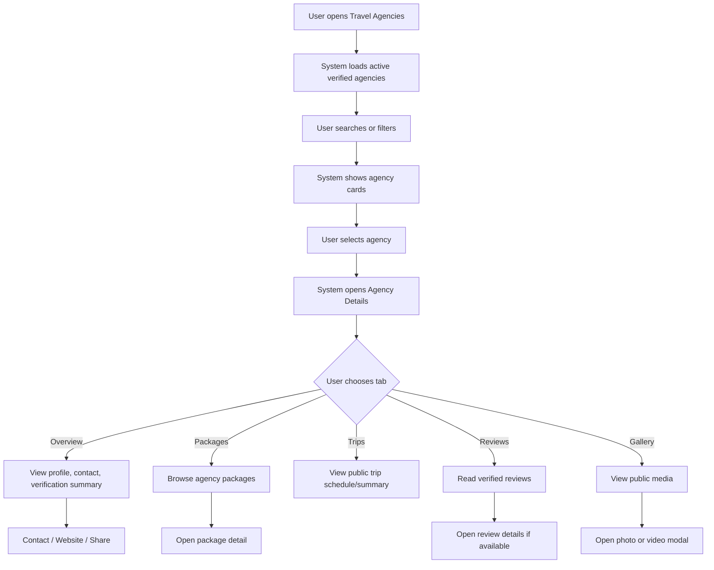
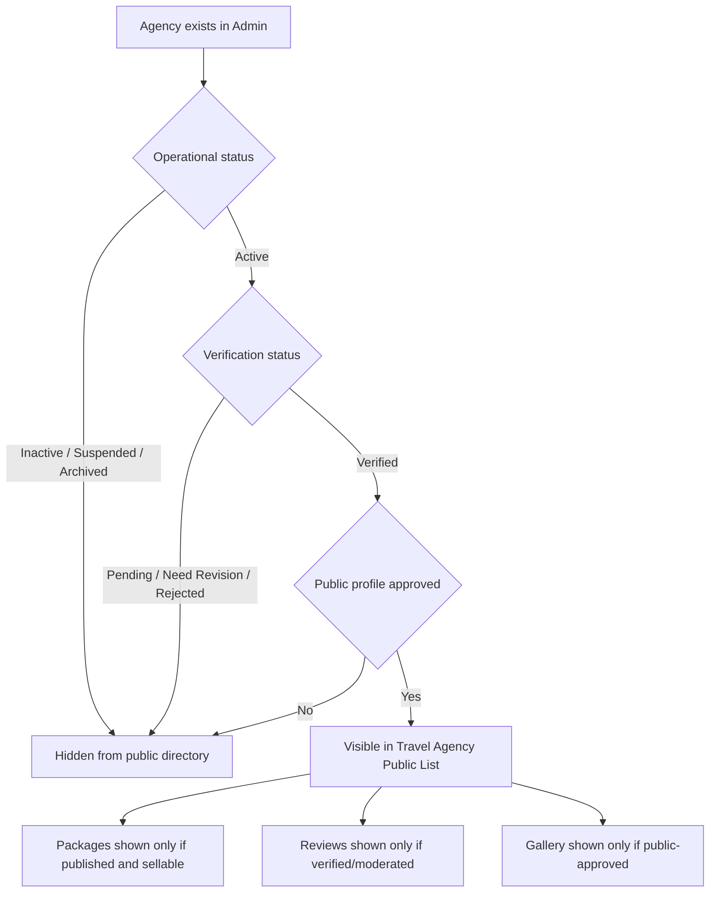

# JUV PRD 10 - Travel Agency Public List & Profile

Product: UmrahHaji.com Jamaah/User View  
Module: Travel Agency Public List & Profile  
Scope: Jamaah/User View / Public Agency Directory, Agency Profile, Packages, Trips, Reviews, Gallery  
Platform: Mobile-first Responsive Web Platform  
Status: Draft  
Last Updated: 16 June 2026  

---

## 1. Objective

Travel Agency Public List & Profile allows public visitors and registered jamaah to browse trusted travel agencies, inspect basic agency credibility, compare available packages, review completed/upcoming group trips, read verified testimonials, and open agency media before choosing a package or continuing to booking.

This module is a trust and discovery layer. It does not replace Admin Travel Agency Management, Travel Agency Portal Agency Profile, or Package Discovery. It exposes only public-safe agency data from verified and active travel agencies.

The module must answer:

1. Which travel agencies are available on UmrahHaji.com?
2. Is this travel agency verified and active?
3. What packages does the agency offer?
4. What trips has the agency operated or scheduled?
5. What do verified jamaah say about this agency?
6. How can I contact or open this agency's packages safely?

---

## 2. Relationship With Master PRD

This module follows the Jamaah/User View Master PRD:

1. Travel Agency Directory is P2 in the current Jamaah/User View scope.
2. It supports user trust before package selection.
3. It must use the same verified agency data used by Package Discovery.
4. It must not expose internal Admin/Travel Agency operational data.
5. It must be consistent with Admin Panel and Travel Agency Portal terminology: use `Travel Agency`, not `Company`.
6. It can be linked from Homepage, Package Discovery, Package Detail, Booking Flow, Testimonials, Articles, and Profile.

---

## 3. Relationship With Admin and Travel Agency PRDs

| Source Module | Relationship |
| --- | --- |
| Admin Travel Agency Management | Source of agency status, verification, public profile approval, legal/license metadata |
| Admin Travel Agency Applications | Source of initial verified agency intake before agency becomes active |
| Travel Agency Agency Profile & Verification Status | Source of agency public profile, contact data, logo, gallery, and profile update requests |
| Admin Package Management | Ensures only valid/public packages are displayed |
| Travel Agency Package Management | Source of agency-owned published packages |
| Admin Group Trip Management | Source of trip status and cross-agency operational sync |
| Travel Agency Group Trip Management | Source of agency trip schedules and occupancy summaries |
| Testimonial Management | Source of verified reviews and rating aggregation |
| Report Management | Source of private issue handling; only public-safe trust indicators may be shown |
| Articles / Guide Content | Can link to travel agency verification guide |

### 3.1 Key Sync Rule

Only travel agencies with `Active` operational status and `Verified` public verification status can appear in the public directory. Suspended, inactive, rejected, pending, archived, or under-critical-review agencies must not appear.

---

## 4. Scope

### 4.1 In Scope for Phase 2

1. Travel agency public list page.
2. Search travel agency by name, location, registration number, specialization, or package keyword.
3. Sort and filter drawer.
4. Travel agency card.
5. Travel agency details page.
6. Agency Overview tab.
7. Agency Packages tab.
8. Agency Trips tab.
9. Agency Reviews tab.
10. Agency Gallery tab.
11. Photo/video preview modal.
12. Public-safe license/verification display.
13. Contact actions.
14. Open package/booking from agency profile.
15. Empty/loading/error states.
16. Mobile-first responsive behavior.
17. Basic analytics.

### 4.2 Possible Phase 1 Fallback

If this module is pulled into Phase 1, reduce the scope to:

1. Public agency list.
2. Agency detail Overview tab.
3. Agency Packages tab.
4. Reviews summary.
5. Basic search/filter.

Gallery, Trips tab, and advanced filters can remain Phase 2.

### 4.3 Out of Scope

1. Agency registration submission.
2. Agency profile editing.
3. Admin verification workflow.
4. Raw legal document download.
5. Public report/complaint history per agency.
6. Direct chat with agency unless Communications module supports it.
7. Payment/booking modification.
8. Package comparison, which belongs to JUV PRD 11.
9. Agency staff/private operational dashboard.

---

## 5. User Roles and Access

| User Type | Access |
| --- | --- |
| Guest | Browse active verified agency list, open public agency profile, view packages/reviews/gallery |
| Registered Jamaah | Guest access plus save/follow agency if enabled, report issue, contact from logged-in context |
| Booked Jamaah | Can access agency profile from booking/trip context |
| Family/Group Member | Can view agency profile connected to group trip |
| Suspended/Banned User | Public read-only access only if platform policy allows |

---

## 6. User Needs

### 6.1 Before Booking

1. Browse trustworthy travel agencies.
2. Confirm agency is verified.
3. Compare agency rating, package style, total trips, and specialization.
4. See packages owned by the agency.
5. Contact or visit website safely.

### 6.2 During Package Selection

1. Open agency profile from package card.
2. Understand if agency specializes in Umrah, Hajj, family, VIP, economy, or express trips.
3. Review agency experience and public reviews.
4. Continue to package detail or booking.

### 6.3 After Booking

1. Revisit agency profile from My Group Trip or Booking.
2. Check agency contact info.
3. Read reviews and trip photos.
4. Submit report through Report Management if there is an issue.

---

## 7. Terminology

| Term | Definition |
| --- | --- |
| Travel Agency | Verified partner agency offering Umrah/Hajj packages |
| Public Profile | User-facing agency profile approved for public display |
| Verified Badge | Public signal that Admin has verified required legal/operational data |
| Registration Number | Public-safe company/agency registration number |
| License Metadata | Public-safe license number/status/validity information |
| Specialization Tags | Agency service focus such as Umrah, Hajj, Family, VIP, Budget |
| Completed Trips | Aggregated completed trip count |
| Rating | Aggregated verified testimonial score |
| Gallery | Public-safe photos/videos approved for display |

---

## 8. Information Architecture

```text
Travel Agencies
├── List Page
│   ├── Header
│   ├── Search
│   ├── Results Summary
│   ├── Sort & Filter
│   └── Agency Cards
├── Sort & Filter Drawer
│   ├── Sort By
│   ├── Verification Status
│   ├── Location
│   ├── Specialization
│   ├── Package Duration
│   ├── Minimum Rating
│   ├── Minimum Completed Trips
│   └── Established Year
└── Agency Details
    ├── Hero / Summary
    ├── Overview
    │   ├── Contact & Address
    │   ├── Public Verification
    │   └── Operational Summary
    ├── Packages
    ├── Trips
    ├── Reviews
    └── Gallery
        ├── Photos
        └── Videos
```

---

## 9. Main User Flow



---

## 10. Public Visibility Flow



---

## 11. Entry Points

| Entry Point | Behavior |
| --- | --- |
| Homepage | Opens Travel Agency list or highlighted agency |
| Package Discovery | Agency name/badge opens agency profile |
| Package Detail | Agency section opens agency profile |
| Booking Flow | Agency name opens profile in read-only context |
| My Group Trip | Agency name opens profile/contact section |
| Testimonials | Agency name opens profile reviews tab |
| Articles | Verification guide can link to agency list |
| Search | Global search may return agency results |
| Shared Link | Opens public agency profile if still visible |

---

## 12. Screen 1 - Travel Agency List

### 12.1 Purpose

Travel Agency List helps users discover verified travel agencies and compare trust signals before opening agency details.

### 12.2 Header

| Component | Requirement |
| --- | --- |
| Top Navbar | Logo with text, hamburger/menu or login control |
| Page Title | `Travel Agencies` |
| Subtitle | `Choose a trusted travel agency for your Umrah journey` |
| Search Field | Placeholder `Search agency, package, city, or registration number...` |
| Results Summary | Example: `Showing 5 travel agencies` |
| Sort Button | Opens sort/filter drawer |
| Filter Icon | Opens sort/filter drawer |

### 12.3 Search Behavior

Search should match:

1. Agency public name.
2. Registration number.
3. City/country.
4. Specialization tags.
5. Published package title.
6. Package category.

### 12.4 Agency Card Fields

| Field | Required | Source | Notes |
| --- | --- | --- | --- |
| Agency Logo | No | Travel Agency Profile | Use fallback if missing |
| Agency Name | Yes | Travel Agency Profile | Public display name |
| Verification Badge | Yes | Admin Verification | Visible only if verified |
| Registration Number | No | Admin/Agency Profile | Mask if policy requires |
| Short Description | Yes | Agency Profile | Max 2-3 lines |
| Specialization Tags | No | Agency Profile | Up to 3 visible |
| Rating | No | Testimonial Management | Verified reviews only |
| Total Completed Trips | No | Group Trip Management | Aggregated count |
| Established Year | No | Agency Profile | Public-safe |
| Featured Packages | No | Package Management | Up to 2 package mini-cards |
| Primary CTA | Yes | `View Agency` |
| Secondary CTA | No | `View Packages` |
| Contact CTA | No | `Contact` if allowed |

### 12.5 Card Actions

| Action | Behavior |
| --- | --- |
| View Agency | Opens Agency Details Overview |
| View Packages | Opens Agency Details Packages tab |
| Contact | Opens contact options if public contact is enabled |
| Share | Copies public agency profile link |
| Report Issue | Logged-in users only; opens Report Management prefilled context |

### 12.6 Empty State

```text
No travel agencies found.
Try changing your filters or search by agency name, city, package, or specialization.
```

---

## 13. Screen 2 - Sort & Filter Drawer

### 13.1 Purpose

Sort & Filter helps users narrow agencies by trust, location, specialization, and operational experience.

### 13.2 Drawer Layout

1. Dark overlay.
2. Right-side mobile drawer.
3. Header `Sort & Filter`.
4. Close button.
5. Scrollable filter sections.
6. Sticky footer with `Reset` and `Apply Filters`.

### 13.3 Filters

| Filter | Type | Options / Data |
| --- | --- | --- |
| Sort By | Radio | Most Popular, Best Rating, Newest, Most Completed Trips |
| Verification Status | Checkbox | Verified only |
| Location | Checkbox | Active agency cities/countries |
| Specialization | Checkbox | Umrah, Hajj, Family, VIP, Budget, Economy, Express, Group |
| Package Duration | Checkbox | 5-7 days, 8-10 days, 11-14 days, 15+ days |
| Minimum Rating | Slider | 0-5 |
| Minimum Completed Trips | Slider | 0+ |
| Established Year | Range | Year range |

### 13.4 Filter Rules

1. `Verified only` is enabled by default because only verified agencies should appear publicly.
2. Filter counts should be based on active verified agencies only.
3. Location list should show only locations with available agencies.
4. Search term and filters can be combined.
5. Reset returns to default verified active list.

---

## 14. Screen 3 - Agency Details Shared Layout

### 14.1 Purpose

Agency Details gives users a 360-degree public-safe view of a selected travel agency.

### 14.2 Shared Page Structure

| Section | Requirement |
| --- | --- |
| Hero Image | Agency cover/banner image or fallback |
| Back Button | Returns to previous page/context |
| Top Navbar | Logo/menu or app header |
| Agency Summary Card | Logo, name, verified badge, rating, total trips, established year, description, specialization tags |
| Action Buttons | Contact, Website, Share, View Packages |
| Tab Bar | Overview, Packages, Trips, Reviews, Gallery |

### 14.3 Summary Card Fields

| Field | Required | Notes |
| --- | --- | --- |
| Logo | No | Fallback icon if missing |
| Public Agency Name | Yes | Approved public name |
| Verified Badge | Yes | From Admin verification |
| Rating | No | Verified testimonials only |
| Total Completed Trips | No | Aggregated |
| Established Year | No | Public-safe |
| Description | Yes | Approved profile description |
| Specialization Tags | No | Up to 3-5 visible |

### 14.4 Contact Actions

| Action | Rules |
| --- | --- |
| Call | Show only if public phone enabled |
| WhatsApp | Show only if public WhatsApp enabled |
| Email | Show only if public email enabled |
| Website | External link warning if leaving platform |
| Share | Copy public agency URL |

### 14.5 Privacy Rule

Agency Details must not show private PIC phone, internal email, bank details, subscription data, legal documents, internal notes, issue report details, financial data, or admin verification history.

---

## 15. Tab 1 - Overview

### 15.1 Purpose

Overview summarizes agency identity, contact info, public verification, and operational trust indicators.

### 15.2 Sections

| Section | Content |
| --- | --- |
| Contact & Address | Address, public phone, public email, website |
| Public Verification | Verified badge, registration number, license number/status, verification date if allowed |
| Operational Summary | Completed trips, active packages, years in operation, supported package types |
| Service Focus | Specialization tags and supported services |
| Policy Summary | Optional cancellation/payment/support summary |

### 15.3 Public Verification Fields

| Field | Public? | Notes |
| --- | --- | --- |
| Verification Status | Yes | Show as badge |
| Registration Number | Yes/Masked | Depends on Admin policy |
| MOTAC / PPIU License Number | Yes/Masked | Public-safe display |
| License Validity | Optional | Show if approved |
| Legal Document Preview | No by default | Use public-safe certificate only if approved |
| Verification Notes | No | Internal Admin only |

### 15.4 Public-Safe Document Modal

If document preview is enabled, it must show only a public-safe certificate or verification proof, not full raw legal files.

| Field | Requirement |
| --- | --- |
| Title | Certificate/document display name |
| Identifier | Masked or public-safe number |
| Preview | Watermarked/public-safe image/PDF preview |
| Download | Disabled by default |
| Close | Required |

### 15.5 Recommendation

For Phase 2, prefer showing a `Verified by UmrahHaji.com` verification summary instead of exposing raw SSM/MOTAC files publicly. This protects the agency while still giving users trust.

---

## 16. Tab 2 - Packages

### 16.1 Purpose

Packages tab lets users browse packages owned by the selected agency.

### 16.2 Display Rules

1. Show only published packages.
2. Package status must be sellable or viewable.
3. Package must not appear if package is archived, draft, hidden, expired, or blocked.
4. Package must respect package visibility rules.
5. If package is sold out, show `Sold Out` but allow details if product policy allows.

### 16.3 Filters

| Filter | Options |
| --- | --- |
| Package Type | All, Budget, Regular, Premium, VIP, Family, Express |
| Category | Umrah, Hajj |
| Duration | 5-7, 8-10, 11-14, 15+ days |
| Departure Month | Available departure months |
| Price Range | Available price range |

### 16.4 Package Card Fields

| Field | Required | Notes |
| --- | --- | --- |
| Image | No | Use package thumbnail/fallback |
| Package Name | Yes | From Package Management |
| Category/Type Badges | Yes | Umrah/Hajj + type |
| Short Description | No | Max 2 lines |
| Duration | Yes | Makkah/Madinah nights if available |
| Departure Date | No | Next available date |
| Price From | Yes | Currency formatted |
| Seat Availability | No | If enabled |
| Rating/Reviews | No | Package-level if available |
| CTA | Yes | `View Package` or `Book Now` |

### 16.5 Load More

If more packages exist, show `Load More` or pagination. On mobile, prefer load more.

---

## 17. Tab 3 - Trips

### 17.1 Purpose

Trips tab shows public-safe trip history and upcoming trip signals for the selected agency.

### 17.2 Trip Visibility

| Trip Status | Public Display |
| --- | --- |
| Upcoming / Active | Show if package/trip is public |
| Completed | Show aggregate/history if approved |
| Draft | Hide |
| Cancelled | Hide by default; show only if package policy requires |
| Archived | Hide |

### 17.3 Trip Card Fields

| Field | Required | Notes |
| --- | --- | --- |
| Trip Name | Yes | Public group/trip name |
| Package Name | No | Link to package if available |
| Departure Date | Yes | Public-safe |
| Return Date | No | If available |
| Duration | Yes | Days/nights |
| Destination Summary | No | Makkah/Madinah nights |
| Capacity | No | Show general availability, not private manifest |
| Status | Yes | Upcoming, Active, Completed |
| Mutawwif | No | Show only if public and approved |

### 17.4 Privacy Rule

Trips tab must not expose jamaah names, passenger manifest, room numbers, ticket numbers, document status, payment status, or private group WhatsApp links.

---

## 18. Tab 4 - Reviews

### 18.1 Purpose

Reviews tab helps users evaluate agency quality using verified jamaah testimonials.

### 18.2 Review Source

Reviews must come from Testimonial Management and use verified booking/trip records where possible.

### 18.3 Summary Fields

| Field | Requirement |
| --- | --- |
| Overall Rating | Average of verified public reviews |
| Review Count | Count of visible reviews |
| Star Breakdown | 5-star to 1-star distribution |
| Recommend Rate | Optional |
| Recent Review Date | Optional |

### 18.4 Review Card Fields

| Field | Required | Notes |
| --- | --- | --- |
| Reviewer Avatar | No | Use initials/fallback |
| Reviewer Name | Yes | Respect anonymous flag |
| Review Date | Yes | Date submitted/published |
| Rating | Yes | Star rating |
| Review Text | Yes | Moderated text |
| Package/Trip Name | No | If public |
| Media Count/Preview | No | If public approved |
| Agency Response | No | Phase 2 if supported |

### 18.5 Review Rules

1. Show only approved public reviews.
2. Respect anonymous review setting.
3. Do not show private feedback meant only for Admin/Agency.
4. Do not expose report/complaint details.
5. Media must be moderated/public-approved before display.

---

## 19. Tab 5 - Gallery

### 19.1 Purpose

Gallery shows approved photos and videos that help users understand the agency's trips, hotel quality, group activities, and travel experience.

### 19.2 Filter Bar

| Filter | Behavior |
| --- | --- |
| All | Shows photos and videos |
| Photos | Shows images only |
| Videos | Shows videos only |

### 19.3 Gallery Item Fields

| Field | Required | Notes |
| --- | --- | --- |
| Media Type | Yes | Photo or video |
| Thumbnail URL | Yes | Optimized |
| Media URL | Yes | Public-safe |
| Caption | No | Optional |
| Related Package/Trip | No | Optional |
| Created Date | No | Optional |

### 19.4 Media Preview Modal

| Component | Requirement |
| --- | --- |
| Dark Overlay | Required |
| Modal Header | Title and close button |
| Preview Area | Image or video preview |
| Caption | Optional |
| Navigation | Optional next/previous |
| Download | Disabled by default |

### 19.5 Server/Performance Rules

1. Use thumbnails in gallery grid.
2. Lazy-load media below viewport.
3. Do not autoplay videos with sound.
4. Use compressed images and adaptive sizes.
5. Large original media should not be loaded until preview is opened.

---

## 20. Data Model

### 20.1 Travel Agency Public Profile

| Field | Type | Required | Notes |
| --- | --- | --- | --- |
| agency_id | UUID | Yes | Unique identifier |
| public_slug | String | Yes | Public URL |
| public_name | String | Yes | Approved display name |
| legal_name | String | No | Hidden by default |
| logo_url | URL | No | Optimized logo |
| cover_image_url | URL | No | Hero image |
| registration_no | String | No | Public-safe/masked |
| license_no | String | No | Public-safe/masked |
| verification_status | Enum | Yes | Must be Verified |
| operational_status | Enum | Yes | Must be Active |
| public_profile_status | Enum | Yes | Approved/Hidden |
| description | Text | Yes | Approved description |
| specialization_tags | Array | No | Public tags |
| established_year | Number | No | Public-safe |
| rating_average | Number | No | Aggregated verified reviews |
| rating_count | Number | No | Visible review count |
| completed_trip_count | Number | No | Aggregated |
| active_package_count | Number | No | Published/sellable count |
| public_phone | String | No | If enabled |
| public_email | String | No | If enabled |
| website_url | URL | No | If enabled |
| address | Object | No | Public-safe address |
| created_at | Datetime | Yes | System |
| updated_at | Datetime | Yes | System |

### 20.2 Agency Package Summary

| Field | Type | Required | Notes |
| --- | --- | --- | --- |
| package_id | UUID | Yes | Unique identifier |
| agency_id | UUID | Yes | Parent agency |
| package_name | String | Yes | Published package |
| category | Enum | Yes | Umrah/Hajj |
| package_type | Enum | Yes | Budget/Regular/Premium/VIP/etc. |
| duration_days | Number | No | If available |
| duration_nights | Number | No | If available |
| price_from | Money | Yes | Display value |
| thumbnail_url | URL | No | Optimized |
| next_departure_date | Date | No | If schedule available |
| availability_status | Enum | No | Available, Limited, Sold Out |
| status | Enum | Yes | Published only |

### 20.3 Agency Trip Summary

| Field | Type | Required | Notes |
| --- | --- | --- | --- |
| trip_id | UUID | Yes | Unique identifier |
| agency_id | UUID | Yes | Parent agency |
| package_id | UUID | No | Related package |
| public_trip_name | String | Yes | Public-safe name |
| departure_date | Date | Yes | Public date |
| return_date | Date | No | Public date |
| duration_summary | String | No | Example: Makkah 7N, Madinah 5N |
| capacity_total | Number | No | Optional |
| capacity_available | Number | No | Optional |
| public_status | Enum | Yes | Upcoming, Active, Completed |

### 20.4 Agency Review Summary

| Field | Type | Required | Notes |
| --- | --- | --- | --- |
| review_id | UUID | Yes | Unique identifier |
| agency_id | UUID | Yes | Reviewed agency |
| reviewer_display_name | String | Yes | Anonymous-aware |
| reviewer_avatar_url | URL | No | Optional |
| rating | Number | Yes | 1-5 |
| review_text | Text | Yes | Moderated |
| media_count | Number | No | Public-approved media count |
| package_name | String | No | If public |
| submitted_at | Datetime | Yes | Timestamp |
| is_anonymous | Boolean | Yes | Privacy |
| public_status | Enum | Yes | Approved only |

### 20.5 Gallery Item

| Field | Type | Required | Notes |
| --- | --- | --- | --- |
| media_id | UUID | Yes | Unique identifier |
| agency_id | UUID | Yes | Parent agency |
| type | Enum | Yes | Photo/Video |
| thumbnail_url | URL | Yes | Grid display |
| media_url | URL | Yes | Preview |
| caption | String | No | Optional |
| public_status | Enum | Yes | Approved only |
| related_package_id | UUID | No | Optional |
| related_trip_id | UUID | No | Optional |

---

## 21. Business Rules

1. Public list shows active verified agencies only.
2. Agency profile must be hidden if agency becomes suspended, inactive, unverified, archived, or blocked.
3. Public profile data must come from approved public fields only.
4. Legal documents are not public by default.
5. Verification badge must not be manually faked from frontend data.
6. Ratings must be calculated from approved public testimonials only.
7. Package tab shows published and allowed packages only.
8. Trip tab must not expose private member or operational details.
9. Gallery shows approved public media only.
10. Contact information appears only if agency/admin enabled public display.
11. External website link should clearly leave UmrahHaji.com.
12. Report issue requires logged-in user.
13. Search/filter must not reveal hidden agencies.
14. Shared agency link must revalidate visibility on open.
15. If agency is hidden after being shared, show unavailable state.
16. Completed trip count is aggregated and should not expose private trip data.
17. Registration/license number display must follow platform masking policy.
18. Public agency list should not display private finance, bank, settlement, or subscription data.

---

## 22. Status and Visibility Matrix

| Operational Status | Verification Status | Public Profile Status | Public Directory |
| --- | --- | --- | --- |
| Active | Verified | Approved | Visible |
| Active | Verified | Hidden | Hidden |
| Active | Pending Verification | Any | Hidden |
| Active | Revision Required | Any | Hidden |
| Active | Rejected | Any | Hidden |
| Suspended | Verified | Any | Hidden |
| Inactive | Verified | Any | Hidden |
| Archived | Verified | Any | Hidden |

---

## 23. States and Edge Cases

| State / Case | Expected Behavior |
| --- | --- |
| No agencies | Show empty state |
| No search result | Suggest clearing filters |
| Agency hidden after user opens detail | Show unavailable state |
| Agency has no packages | Show empty packages state |
| Agency has no public trips | Hide trips list or show empty state |
| Agency has no reviews | Show rating unavailable state |
| Agency has no gallery | Show empty gallery state |
| Contact info disabled | Hide contact action |
| Website unavailable | Hide website action |
| Media fails to load | Show fallback thumbnail |
| Review is anonymous | Show anonymous display name |
| Report issue by guest | Prompt login |
| License expired | Hide agency if verification no longer valid, or show only if Admin policy allows grace status |

---

## 24. Analytics Events

| Event | Trigger |
| --- | --- |
| agency_list_opened | User opens Travel Agency list |
| agency_search_submitted | User searches agency |
| agency_filter_applied | User applies filters |
| agency_card_clicked | User opens agency profile |
| agency_tab_opened | User switches Overview/Packages/Trips/Reviews/Gallery |
| agency_package_clicked | User opens package from agency profile |
| agency_contact_clicked | User taps contact action |
| agency_website_clicked | User opens external website |
| agency_share_clicked | User shares agency link |
| agency_gallery_item_opened | User opens photo/video |
| agency_report_issue_clicked | User starts report for agency |
| agency_unavailable_viewed | User opens hidden/unavailable agency link |

---

## 25. Functional Requirements

| ID | Requirement | Priority |
| --- | --- | --- |
| JUV-TA-001 | System shall display Travel Agency list with active verified agencies only. | P2 |
| JUV-TA-002 | System shall allow users to search by agency name, location, registration number, specialization, and package keyword. | P2 |
| JUV-TA-003 | System shall show agency cards with logo, name, verification badge, description, tags, rating, trips, year, and CTA. | P2 |
| JUV-TA-004 | System shall allow users to sort and filter agency list. | P2 |
| JUV-TA-005 | System shall open Agency Details from agency card. | P2 |
| JUV-TA-006 | System shall display Agency Details shared header and tab navigation. | P2 |
| JUV-TA-007 | System shall display Overview tab with public-safe contact, verification, and operational summary. | P2 |
| JUV-TA-008 | System shall display Packages tab with published packages from selected agency. | P2 |
| JUV-TA-009 | System shall open Package Detail from package card. | P2 |
| JUV-TA-010 | System shall display Trips tab with public-safe trip summaries. | P2 |
| JUV-TA-011 | System shall display Reviews tab with approved public verified reviews only. | P2 |
| JUV-TA-012 | System shall display Gallery tab with approved public photos/videos only. | P2 |
| JUV-TA-013 | System shall allow users to preview gallery media. | P2 |
| JUV-TA-014 | System shall support contact actions only when agency public contact data is enabled. | P2 |
| JUV-TA-015 | System shall hide raw legal documents from public view by default. | P2 |
| JUV-TA-016 | System shall show only public-safe verification/license metadata. | P2 |
| JUV-TA-017 | System shall require login before report issue action. | P2 |
| JUV-TA-018 | System shall show unavailable state for hidden/suspended/inactive agency links. | P2 |
| JUV-TA-019 | System shall not expose private jamaah, trip, finance, document, report, or bank data. | P2 |
| JUV-TA-020 | System shall track agency list/detail/search/filter/contact/package/gallery analytics events. | P2 |
| JUV-TA-021 | System shall support responsive mobile-first behavior. | P2 |
| JUV-TA-022 | System shall show empty/loading/error states for list, details tabs, and media modal. | P2 |

---

## 26. Acceptance Criteria

1. User can open Travel Agency list.
2. List shows only active verified agencies.
3. User can search and filter agencies.
4. Agency card shows public trust signals.
5. User can open agency details.
6. Overview tab shows public-safe agency information.
7. Public legal/raw documents are not exposed by default.
8. Packages tab shows only published package records from selected agency.
9. Trips tab does not expose private jamaah/member data.
10. Reviews tab shows approved public testimonials only.
11. Gallery tab shows approved public media only.
12. User can preview gallery image/video.
13. Contact actions are hidden if contact data is disabled.
14. Suspended/inactive/unverified agency is not visible.
15. Shared link for hidden agency shows unavailable state.
16. Report issue requires login.
17. Mobile layout works without horizontal overflow.
18. Analytics events are logged for major interactions.

---

## 27. Responsive Behavior

### 27.1 Mobile

1. Single-column list.
2. Search field full width.
3. Sort/filter drawer from right or bottom sheet.
4. Agency card uses compact stacked layout.
5. Details tabs horizontally scroll if needed.
6. Packages and trips use cards.
7. Gallery uses two-column grid.
8. Contact actions can appear as button row or action sheet.

### 27.2 Tablet

1. Two-column card grid optional.
2. Details page can use wider content cards.
3. Gallery can use three-column grid.

### 27.3 Desktop Web

1. List can use grid or card list.
2. Filter can be side panel instead of drawer.
3. Details page can use main content plus side trust panel.
4. Gallery can use masonry/grid layout.

---

## 28. Security, Privacy, and Trust

1. Never expose internal agency documents without explicit public-safe approval.
2. Never expose private PIC information unless it is marked public contact.
3. Never expose bank details or settlement information.
4. Never expose jamaah manifests or trip member data.
5. Never expose private complaint/report records.
6. Mask registration/license numbers if required by policy.
7. Use server-side visibility checks for every agency detail request.
8. Use signed/optimized media URLs if media storage requires protection.
9. External links should use safe redirect handling.
10. Report issue should create a private report, not public review.

---

## 29. Open Questions

1. Should Travel Agency Directory remain P2, or should a reduced version be moved into Phase 1 for trust?
2. Should public profile show full MOTAC/PPIU number or masked number?
3. Should verified certificate preview be allowed, or should only a verification summary be shown?
4. Should agencies be able to disable public phone/WhatsApp individually?
5. Should completed trip count include only trips completed through UmrahHaji.com?
6. Should agency gallery be curated by Admin, Travel Agency, or both?
7. Should users be able to follow/save agencies in Phase 2?
8. Should reviews show agency response in Phase 2?

---

## 30. Recommendation

The best product direction is to show a strong public agency profile without exposing raw legal documents. Users need trust, but agencies also need privacy and protection.

Recommended public trust model:

1. Show `Verified by UmrahHaji.com` badge.
2. Show public-safe registration/license metadata.
3. Show rating from verified reviews.
4. Show completed trip count.
5. Show published packages and public trip summaries.
6. Show approved gallery media.
7. Provide a report issue path for logged-in users.

This gives jamaah enough confidence to choose a travel agency while keeping sensitive Admin and Travel Agency Portal data protected.
