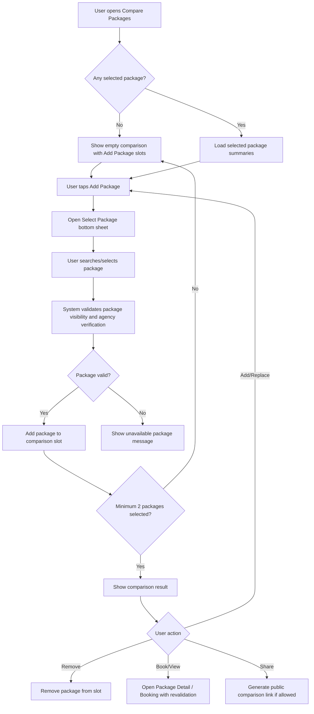
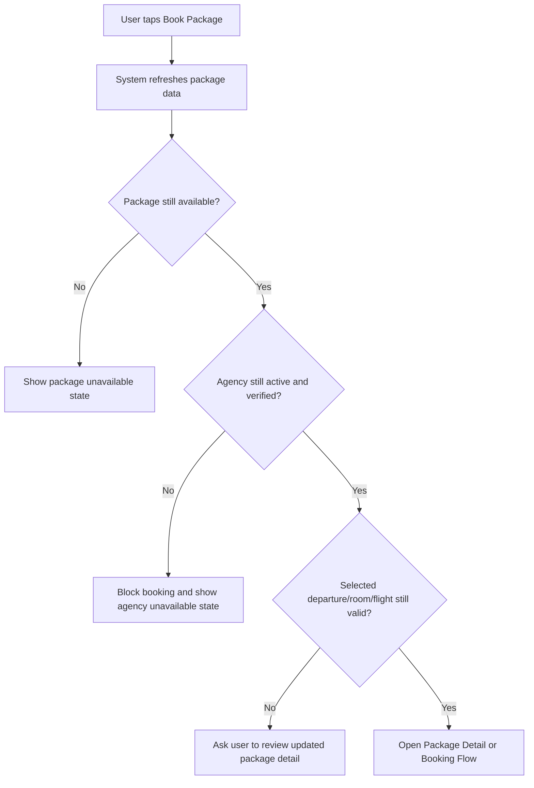

# JUV PRD 11 - Compare Packages

Product: UmrahHaji.com Jamaah/User View  
Module: Compare Packages  
Scope: Jamaah/User View / Package Comparison, Selection Support, Booking Decision  
Platform: Mobile-first Responsive Web Platform  
Status: Draft  
Last Updated: 16 June 2026  

---

## 1. Objective

Compare Packages allows users to compare multiple Umrah/Hajj packages side by side before choosing a package and starting booking. It helps jamaah understand differences in price, duration, agency, hotel, flight, itinerary, room options, departure dates, inclusions, payment options, and availability.

This module is a decision-support tool. It does not create a booking, reserve seats, guarantee price, or override package rules. Final package price, availability, schedule, payment method, and booking terms must be revalidated when the user opens package detail or starts booking.

The module must answer:

1. What are the key differences between selected packages?
2. Which package has the best value for my needs?
3. Which agency owns each package and is it verified?
4. What hotel, flight, room, itinerary, and departure options are available?
5. Which package can I book now?
6. What changes when I choose different room, flight, or departure options?

---

## 2. Relationship With Master PRD

This module follows the Jamaah/User View Master PRD:

1. Compare Packages is P2.
2. It is connected to Package Discovery, Package Detail, Homepage, and Travel Agency Public Profile.
3. It compares only packages that are public, published, visible, and owned by active verified travel agencies.
4. It must use the same package data source as Package Discovery and Booking Flow.
5. It must not allow booking directly without revalidation.
6. It should be optimized for mobile because wide tables are difficult on small screens.

---

## 3. Relationship With Admin and Travel Agency PRDs

| Source Module | Relationship |
| --- | --- |
| Admin Package Management | Source of package validity, package status, package visibility, and admin-controlled data governance |
| Travel Agency Package Management | Source of package content, pricing, schedules, flights, hotels, room pricing, inclusions, and promotions |
| Hotel Management | Source of hotel name, city, rating, distance, and public media |
| Flight / Airline Management | Source of airline, flight class, route, baggage, transit, and price adjustment options |
| Itinerary Management | Source of itinerary template summary and Makkah/Madinah nights |
| Season Management | Source of seasonal schedule/price context |
| Billing Management | Source of payment option availability and deposit/installment logic |
| Travel Agency Public List & Profile | Source of verified agency profile and public trust indicators |
| Testimonial Management | Source of verified package/agency rating and review count |
| Booking Flow | Revalidates selected package before booking |

### 3.1 Key Sync Rule

Compare Packages is read-only and advisory. All pricing, seat availability, room options, flight options, departure dates, and payment options must be refreshed when the user enters Package Detail or Booking Flow.

---

## 4. Scope

### 4.1 In Scope for Phase 2

1. Empty compare page.
2. Add package slot.
3. Package selection bottom sheet/modal.
4. Search packages within selection modal.
5. Compare 2-3 packages on mobile.
6. Compare up to 4 packages on tablet/desktop if feasible.
7. Remove package from comparison.
8. Replace package in comparison slot.
9. Display side-by-side comparison table/cards.
10. Highlight differences.
11. Show best value indicator if criteria are available.
12. Show package/agency/rating summary.
13. Compare starting price.
14. Compare duration.
15. Compare itinerary summary.
16. Compare Makkah and Madinah hotels.
17. Compare airline/flight options.
18. Compare room types and price adjustments.
19. Compare departure dates and seat availability.
20. Compare meals, transport, guide/mutawwif, insurance, visa, and inclusions.
21. Compare payment options.
22. Continue to Package Detail or Booking Flow.
23. Share comparison link if public packages only.
24. Empty/loading/error states.
25. Mobile-first responsive behavior.

### 4.2 Possible Phase 1 Fallback

If moved into Phase 1, reduce scope to:

1. Compare 2 packages only.
2. Compare price, duration, agency, rating, hotel summary, flight summary, inclusions, and departure dates.
3. No best value scoring.
4. No share comparison.
5. No advanced option-level pricing comparison.

### 4.3 Out of Scope

1. Booking creation.
2. Seat reservation.
3. Payment.
4. Package editing.
5. Travel agency internal package management.
6. Admin package approval.
7. Full itinerary day-by-day comparison.
8. Private agency/trip/member data.
9. Comparing inactive, draft, archived, expired, hidden, or unverified-agency packages.

---

## 5. User Roles and Access

| User Type | Access |
| --- | --- |
| Guest | Compare public packages and open package detail |
| Registered Jamaah | Guest access plus save/share comparison if enabled |
| Booked Jamaah | Can compare packages before creating a new booking |
| Suspended/Banned User | Public read-only access only if platform policy allows |

---

## 6. User Needs

### 6.1 Before Booking

1. Compare packages across verified travel agencies.
2. Understand why one package is cheaper or more expensive.
3. Check hotel distance and quality.
4. Check flight airline/class/baggage.
5. Compare room options and price differences.
6. Compare departure dates and remaining seats.
7. Compare included services.
8. Choose package and continue to detail/booking.

### 6.2 During Discovery

1. Add package to compare from package card.
2. Add package to compare from package detail.
3. Add package to compare from travel agency profile.
4. Replace a package without losing the whole comparison.
5. Remove package from comparison.

### 6.3 Returning User

1. Reopen comparison if local/session state is available.
2. Share comparison with family.
3. Open saved comparison if Phase 2 account saving is enabled.

---

## 7. Core Product Decisions

| Decision | Recommendation |
| --- | --- |
| Maximum packages on mobile | 3 packages |
| Minimum packages for useful comparison | 2 packages |
| Empty state behavior | Show comparison rows and `Add Package` slots |
| Data freshness | Revalidate on open and before booking |
| Best value | Use explainable indicators, not black-box scoring |
| Share comparison | Public package only; no private prices or user data |
| Option-level price | Show as `base`, `+RM`, or `-RM` relative to starting price |
| Booking CTA | Opens Package Detail or Booking Flow with revalidation |

---

## 8. Information Architecture

```text
Compare Packages
├── Header
│   ├── Back
│   ├── Title
│   └── Counter
├── Empty / Partial State
│   ├── Package Detail Rows
│   └── Add Package Slots
├── Select Package Bottom Sheet
│   ├── Search
│   ├── Filters (optional)
│   └── Package Cards
├── Comparison Result
│   ├── Package Headers
│   ├── Price & Availability
│   ├── Agency & Rating
│   ├── Duration & Itinerary
│   ├── Hotels
│   ├── Flight Options
│   ├── Room Types
│   ├── Departure Dates
│   ├── Inclusions
│   ├── Payment Options
│   └── CTA Row
└── Actions
    ├── Add Package
    ├── Remove Package
    ├── Replace Package
    ├── Highlight Differences
    ├── Share
    └── Book / View Detail
```

---

## 9. Main User Flow



---

## 10. Revalidation Flow



---

## 11. Entry Points

| Entry Point | Behavior |
| --- | --- |
| Homepage - Compare Packages link | Opens compare page |
| Package Discovery card | Add selected package to compare |
| Package Detail | Add current package to compare |
| Travel Agency Profile - Packages tab | Add agency package to compare |
| Search Results | Add package to compare |
| Shared Comparison Link | Opens comparison if packages are still public |

---

## 12. Screen 1 - Compare Empty State

### 12.1 Purpose

Empty state teaches the user what can be compared and gives clear add-package entry points.

### 12.2 Components

| Component | Requirement |
| --- | --- |
| Header | Back arrow, title `Compare Packages`, counter `0/3` |
| Section Title | `Detailed Comparison` |
| Navigation Buttons | Left/right buttons disabled when no package is selected |
| Comparison Rows | Show row labels even when empty |
| Add Package Slots | Empty package columns with `Add Package` CTA |
| Footer | Logo/menu if public mobile shell uses footer |

### 12.3 Default Rows

| Row | Empty Value |
| --- | --- |
| Starting Price | - |
| Duration | - |
| Itinerary | - |
| Makkah Hotel | - |
| Madinah Hotel | - |
| Airline Options | - |
| Room Types | - |
| Departure Dates | - |
| Meals | - |
| Transport | - |
| Guide / Mutawwif | - |
| Insurance | - |
| Visa | - |
| Payment Options | - |
| Book Package | Add Package |

### 12.4 UX Rule

On mobile, keep the left row label column sticky or repeated per comparison section so users do not lose context while scrolling horizontally.

---

## 13. Screen 2 - Select Package Bottom Sheet

### 13.1 Purpose

Select Package lets users add a package into an empty compare slot.

### 13.2 Components

| Component | Requirement |
| --- | --- |
| Header | Title `Select Package`, close button |
| Search Input | Placeholder `Search packages...` |
| Package List | Scrollable package cards |
| Selected Indicator | Show if package already selected |
| Unavailable State | Disable package if no longer eligible |

### 13.3 Package Card Fields

| Field | Required | Notes |
| --- | --- | --- |
| Thumbnail | No | Use fallback |
| Package Name | Yes | Published package name |
| Travel Agency Name | Yes | Verified agency |
| Verification Badge | Yes | Agency verified indicator |
| Rating | No | Package or agency rating |
| Review Count | No | Verified reviews |
| Starting Price | Yes | Price from active schedule/room default |
| Discount Price | No | If promo active |
| Duration | Yes | Days/nights |
| Category/Type | Yes | Umrah/Hajj + package type |
| Availability | No | Seats left/sold out |

### 13.4 Search Behavior

Search should match:

1. Package name.
2. Travel agency name.
3. Package category.
4. Package type.
5. Destination/city.
6. Hotel name.
7. Airline name.
8. Departure month.

### 13.5 Selection Rules

1. Do not allow duplicate package in comparison.
2. Do not show packages from inactive/unverified agencies.
3. Do not show draft, archived, hidden, expired, or blocked packages.
4. Sold out packages can be shown only if product policy allows comparison, but booking CTA must be disabled.
5. If maximum slots are full, selecting a package should require replacing an existing slot.

---

## 14. Screen 3 - Comparison Result

### 14.1 Purpose

Comparison Result shows detailed side-by-side package differences.

### 14.2 Header

| Component | Requirement |
| --- | --- |
| Header | Back, title, counter `2/3` or `3/3` |
| Section Title | `Detailed Comparison` |
| Navigation Buttons | Scroll left/right across package columns |
| Difference Toggle | Optional: `Highlight differences` |
| Share Button | Optional: enabled if comparison contains public packages only |

### 14.3 Package Column Header

| Field | Required |
| --- | --- |
| Package Name | Yes |
| Travel Agency Name | Yes |
| Agency Verified Badge | Yes |
| Rating & Review Count | No |
| Remove/Replace Action | Yes |
| Best Value Badge | Optional |

### 14.4 Comparison Rows

| Group | Rows |
| --- | --- |
| Price | Starting Price, Promo Price, Deposit, Payment Options |
| Schedule | Duration, Departure Dates, Seat Availability, Season |
| Itinerary | Itinerary Summary, Makkah Nights, Madinah Nights, Key Activities |
| Hotel | Makkah Hotel, Madinah Hotel, Star Rating, Distance to Mosque |
| Flight | Airline Options, Flight Class, Baggage, Transit, Route |
| Room | Room Types, Default Room, Capacity, Upgrade Price |
| Inclusions | Visa, Meals, Transport, Mutawwif/Guide, Insurance, Airport Transfer, Ziarah |
| Agency | Agency Rating, Completed Trips, Verification |
| Booking | Cancellation Policy Summary, Refund Policy Summary, Book Package CTA |

---

## 15. Data Field Mapping

### 15.1 Package Summary

| Compare Field | Source Module | Notes |
| --- | --- | --- |
| Package Name | Package Management | Published title |
| Category | Package Management | Umrah/Hajj |
| Package Type | Package Management | Economy/Premium/VIP/Family/etc. |
| Agency Name | Travel Agency Management | Active verified agency only |
| Agency Badge | Travel Agency Verification | Public badge |
| Rating | Testimonial Management | Verified public reviews |
| Starting Price | Package Pricing | Base/default room and active schedule |
| Promo Price | Package Promotion | Active promo only |
| Duration | Package/Itinerary | Days/nights |
| Itinerary Summary | Itinerary Management | Template summary |
| Makkah/Madinah Nights | Package/Itinerary | Derived summary |
| Hotel | Hotel Management | Hotel records selected in package |
| Airline | Flight/Airline Management | Flight options selected in package |
| Room Types | Package Room Pricing | Room configuration |
| Departure Dates | Package Schedule / Season | Active schedules |
| Seats Left | Package Schedule / Booking | Public availability |
| Meals | Package Inclusions | Included/excluded |
| Transport | Package Transport | Included/excluded |
| Guide/Mutawwif | Package Inclusions/Trip | Included/excluded |
| Insurance | Package Inclusions | Included/excluded |
| Payment Options | Billing/Package Settings | Full/deposit/installment |

### 15.2 Option-Level Pricing Display

| Option Type | Display |
| --- | --- |
| Included/default option | `base` |
| More expensive option | `+RM 800` |
| Cheaper option | `-RM 500` |
| Unknown price | `TBA` |
| Not available | `-` |

### 15.3 Availability Display

| Availability | Display |
| --- | --- |
| Many seats | `Available` or seat count if enabled |
| Limited seats | `8 seats left` |
| Sold out | `Sold Out` |
| Hidden availability | `Check availability` |
| Expired schedule | Do not show |

---

## 16. Comparison Data Model

### 16.1 Compare Session

| Field | Type | Required | Notes |
| --- | --- | --- | --- |
| compare_session_id | UUID | No | Required if saved/shared |
| user_id | UUID | No | Null for guest |
| package_ids | Array | Yes | 1-3 mobile, 1-4 desktop |
| created_at | Datetime | Yes | Session timestamp |
| updated_at | Datetime | Yes | Session timestamp |
| source_context | Enum | No | Homepage, Package List, Package Detail, Agency Profile |

### 16.2 Compare Package Snapshot

| Field | Type | Required | Notes |
| --- | --- | --- | --- |
| package_id | UUID | Yes | Package reference |
| package_name | String | Yes | Snapshot for compare display |
| agency_id | UUID | Yes | Agency reference |
| agency_name | String | Yes | Snapshot |
| agency_verified | Boolean | Yes | Must be true |
| status | Enum | Yes | Published/Unavailable |
| starting_price | Money | Yes | Display price |
| promo_price | Money | No | Active promo |
| duration_summary | String | Yes | Example: 9D/8N |
| itinerary_summary | String | No | Makkah/Madinah nights |
| hotel_summary | Object | No | Makkah/Madinah hotel |
| flight_options | Array | No | Selected public options |
| room_options | Array | No | Public room prices |
| departure_dates | Array | No | Public schedules |
| inclusions | Array | No | Included services |
| payment_options | Array | No | Full/deposit/installment |
| last_refreshed_at | Datetime | Yes | Data freshness |

---

## 17. Difference Highlighting

### 17.1 Purpose

Highlight differences helps users quickly see what matters.

### 17.2 Rules

1. Highlight only comparable fields.
2. Do not highlight missing data as negative unless the feature is explicitly not included.
3. Show `Same` or muted style for identical values.
4. Show `Best price` only for lowest comparable starting price.
5. Show `Closest hotel` only when distance values are available.
6. Show `Most flexible payment` only when payment options are available.
7. Show `Highest rating` only when rating count meets minimum reliability threshold.

### 17.3 Best Value Indicator

Best value should be explainable:

```text
Best Value
Lower price + verified agency + included hotel/flight + good rating
```

If scoring criteria are incomplete, hide best value badge.

---

## 18. Booking CTA Behavior

| Package State | CTA |
| --- | --- |
| Available | `View Package` or `Book Package` |
| Limited Seats | `Book Package` with limited indicator |
| Sold Out | Disabled `Sold Out` |
| Price Updated | `Review Updated Price` |
| Agency Hidden/Suspended | Disabled `Unavailable` |
| Package Archived/Expired | Disabled `Unavailable` |

### 18.1 CTA Revalidation

When user taps booking CTA:

1. Refresh package.
2. Refresh agency status.
3. Refresh departure availability.
4. Refresh price.
5. Refresh room/flight options.
6. Redirect to Package Detail or Booking Flow.

---

## 19. Share Comparison

### 19.1 Purpose

Share comparison lets users discuss options with family before booking.

### 19.2 Rules

1. Share only public package IDs, not private user data.
2. Shared comparison must revalidate package visibility on open.
3. If one package becomes unavailable, show it as unavailable and keep other packages.
4. Guest can open shared comparison if packages are public.
5. Login is not required to view public comparison.
6. Saved comparison to account is Phase 2 optional.

### 19.3 Shared Link Data

Recommended link format:

```text
/compare?packages=pkg_1,pkg_2,pkg_3
```

Use opaque IDs/slugs if package IDs should not be exposed.

---

## 20. States and Edge Cases

| State / Case | Expected Behavior |
| --- | --- |
| No packages selected | Show empty comparison |
| One package selected | Prompt user to add another package |
| Duplicate package selected | Show `Package already added` |
| Max slots reached | Ask user to replace a package |
| Package unavailable | Show unavailable package column |
| Agency no longer verified | Disable booking CTA and show warning |
| Price changed | Show updated price warning |
| Seat availability changed | Show refreshed seat status |
| Missing hotel data | Show `TBA` or `Not provided` |
| Missing flight options | Show `TBA` or `Not included` |
| Incomplete package data | Allow comparison but show missing fields clearly |
| Network error | Show retry state |
| Shared package removed | Show unavailable column and allow remove |
| Sold out package | Show comparison but disable booking if policy allows |

---

## 21. Security and Privacy

1. Do not expose draft/hidden package data.
2. Do not expose private travel agency data.
3. Do not expose package margin, internal cost, commission, finance, or settlement data.
4. Do not expose private trip members or booking data.
5. Do not include user identity in shared comparison link.
6. Revalidate visibility server-side.
7. Compare API should return public-safe package summaries only.

---

## 22. Analytics Events

| Event | Trigger |
| --- | --- |
| compare_opened | User opens compare page |
| compare_add_package_clicked | User taps Add Package |
| compare_package_search_submitted | User searches in select package modal |
| compare_package_added | User adds package |
| compare_package_removed | User removes package |
| compare_package_replaced | User replaces package |
| compare_difference_toggle | User toggles highlight differences |
| compare_share_clicked | User shares comparison |
| compare_booking_cta_clicked | User taps View/Book package |
| compare_unavailable_package_viewed | Comparison contains unavailable package |

---

## 23. Functional Requirements

| ID | Requirement | Priority |
| --- | --- | --- |
| JUV-CMP-001 | System shall allow users to open Compare Packages page. | P2 |
| JUV-CMP-002 | System shall show empty comparison state when no package is selected. | P2 |
| JUV-CMP-003 | System shall allow users to add package through package selection modal. | P2 |
| JUV-CMP-004 | System shall allow searching packages in selection modal. | P2 |
| JUV-CMP-005 | System shall show only public, published, eligible packages from active verified agencies. | P2 |
| JUV-CMP-006 | System shall prevent duplicate package selection. | P2 |
| JUV-CMP-007 | System shall support comparing up to 3 packages on mobile. | P2 |
| JUV-CMP-008 | System shall allow removing package from comparison. | P2 |
| JUV-CMP-009 | System shall allow replacing package when maximum slots are full. | P2 |
| JUV-CMP-010 | System shall compare package price, duration, itinerary, hotels, flights, rooms, dates, inclusions, and payment options. | P2 |
| JUV-CMP-011 | System shall display unavailable/missing data clearly. | P2 |
| JUV-CMP-012 | System shall support horizontal comparison navigation on mobile. | P2 |
| JUV-CMP-013 | System shall allow users to open Package Detail or Booking Flow from comparison. | P2 |
| JUV-CMP-014 | System shall revalidate package data before opening booking flow. | P2 |
| JUV-CMP-015 | System shall disable booking CTA for unavailable/sold out/invalid package. | P2 |
| JUV-CMP-016 | System shall support public comparison sharing if enabled. | P2 |
| JUV-CMP-017 | System shall not expose private package, agency, booking, finance, or user data. | P2 |
| JUV-CMP-018 | System shall track compare analytics events. | P2 |
| JUV-CMP-019 | System shall support responsive mobile-first behavior. | P2 |
| JUV-CMP-020 | System shall show empty/loading/error states for compare and selection modal. | P2 |

---

## 24. Acceptance Criteria

1. User can open Compare Packages page.
2. Empty state shows comparison rows and Add Package slots.
3. User can open Select Package modal.
4. User can search package in modal.
5. User can add valid package to comparison.
6. User cannot add duplicate package.
7. User can compare at least 2 packages.
8. Mobile comparison supports up to 3 packages.
9. Comparison shows package name, agency, rating, price, duration, itinerary, hotel, airline, room, departure date, inclusions, and CTA.
10. Missing data is displayed as TBA, not as broken UI.
11. User can remove package.
12. User can replace package.
13. User can open Package Detail or Booking Flow.
14. Booking CTA revalidates package and agency status.
15. Package from unverified/inactive agency is not shown.
16. Hidden/draft/archived package is not shown.
17. Sold out/unavailable package cannot be booked.
18. Shared comparison does not expose user data.
19. Mobile layout has no unreadable overflow except intentional horizontal comparison scroll.
20. Analytics events are tracked.

---

## 25. Responsive Behavior

### 25.1 Mobile

1. Use horizontal package columns with sticky row labels where possible.
2. Limit comparison to 3 packages.
3. Use compact package headers.
4. Use section grouping to reduce long-table fatigue.
5. Add package via bottom sheet.
6. Use left/right navigation buttons for column scroll.
7. Keep CTA visible at the bottom of each package column or repeated after major sections.

### 25.2 Tablet

1. Allow 3-4 package columns.
2. More rows can be visible at once.
3. Use sticky header for package names.

### 25.3 Desktop Web

1. Allow up to 4 package columns if layout supports it.
2. Use a table-like layout with sticky top package headers.
3. Filters/search can appear in modal or side panel.

---

## 26. Open Questions

1. Should mobile maximum be 2 packages or 3 packages? Mockup shows 3; recommended is 3 with careful UX.
2. Should Compare Packages be P2 only, or should simplified 2-package compare enter Phase 1?
3. Should users be able to save comparison to account?
4. Should best value scoring be included, or should only difference highlighting be shown?
5. Should shared comparison use package IDs or public slugs?
6. Should package comparison include cancellation/refund policy summary?
7. Should room/flight option selection affect displayed price in comparison, or remain informational only?
8. Should sold out packages be comparable for reference, or hidden entirely?

---

## 27. Recommendation

Compare Packages should be built as a decision-support feature, not a booking shortcut. It should stay honest about data freshness and guide users back to Package Detail/Booking for final confirmation.

Recommended Phase 2 implementation:

1. Mobile compare up to 3 packages.
2. Add package from Package Discovery, Package Detail, and Travel Agency Profile.
3. Compare core decision fields first: price, duration, agency, rating, hotel, flight, departure, room, inclusions, payment options.
4. Add difference highlighting.
5. Keep best value badge optional and explainable.
6. Revalidate before booking.

This gives jamaah a powerful but understandable comparison flow without making the booking logic fragile.
