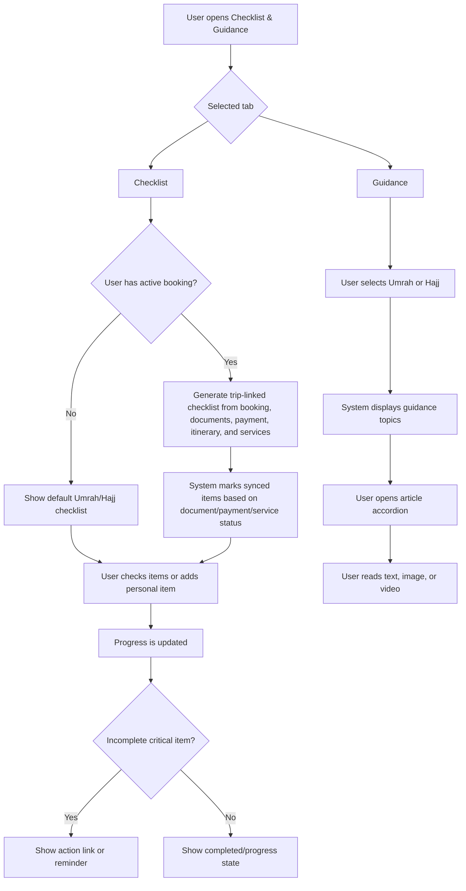
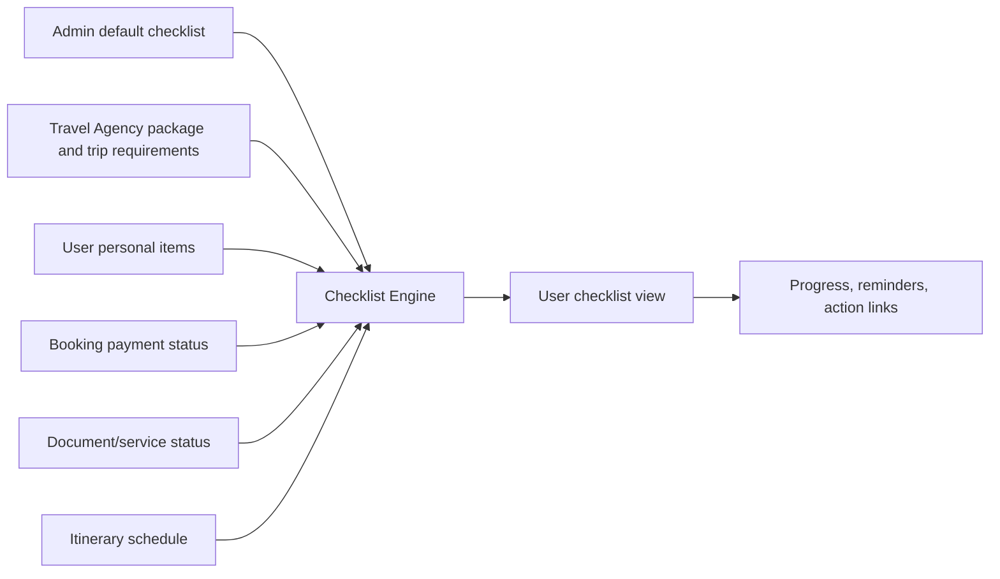

# JUV PRD 12 - Checklist & Guidance

Product: UmrahHaji.com Jamaah/User View  
Module: Checklist & Guidance  
Scope: Jamaah/User View / Pilgrimage Preparation, Ritual Guidance, Trip Readiness  
Platform: Mobile-first Responsive Web Platform  
Status: Draft  
Last Updated: 16 June 2026  

---

## 1. Objective

Checklist & Guidance helps jamaah prepare for, perform, and complete Umrah or Hajj with structured tasks and educational guidance. The module combines two user needs:

1. Checklist: actionable preparation and trip-readiness tasks.
2. Guidance: educational articles and media about Umrah/Hajj rituals, travel preparation, health, safety, and common questions.

This module must reduce uncertainty for jamaah by answering:

1. What do I need to prepare before departure?
2. Which documents, payments, and services are still incomplete?
3. What should I do during each pilgrimage phase?
4. What is different between Umrah and Hajj?
5. Which guidance article should I read before or during the trip?
6. Which tasks are general, and which are connected to my booking or group trip?

Checklist & Guidance is not a religious authority, medical authority, visa authority, or final compliance source. It should present curated guidance, link to verified agency/admin content, and clearly mark items that must be confirmed with the assigned Travel Agency, Mutawwif, or official authority.

---

## 2. Relationship With Master PRD

This module follows the Jamaah/User View Master PRD:

1. Checklist & Guidance is P2.
2. It is accessible from bottom navigation as `Guidelist` or `Guide`.
3. It supports both public users and logged-in jamaah, with deeper progress tracking for logged-in users.
4. It must use the same design system, mobile-first layout, and account model as other Jamaah/User View modules.
5. It must integrate with Booking, My Group Trip, Articles/Guide Content, Documents, Payment, and Notifications.

---

## 3. Relationship With Admin and Travel Agency PRDs

| Source Module | Relationship |
| --- | --- |
| Admin Articles Management | Source of public guidance articles, categories, tags, featured media, and publish status |
| Admin Announcement Management | Source of platform-wide alerts related to Hajj/Umrah preparation |
| Admin Package Management | Source of package category, type, schedule, itinerary, inclusion rules, and visibility |
| Admin Itinerary Management | Source of standard itinerary phases and activity templates |
| Admin Settings / Master Data | Source of document types, checklist categories, content status, and language settings |
| Travel Agency Package Management | Source of package-specific inclusions, exclusions, room/flight rules, schedule, and required documents |
| Travel Agency Group Trip Management | Source of group-specific departure schedule, itinerary, mutawwif, hotel, flight, and service status |
| Travel Agency Documents & Services | Source of required document status: IC, passport, photo, vaccination, visa, tickets, room, and transport |
| JUV Booking Flow | Creates booking-linked checklist items and redirects incomplete tasks |
| JUV My Group Trip | Displays trip-specific checklist progress and daily guidance |
| JUV Articles / Guide Content | Content reader for detailed guidance articles |
| JUV Transaction History | Source of payment status and invoice/payment receipt readiness |
| JUV Reports / Support | Destination for issue reporting when checklist item cannot be completed |

### 3.1 Key Sync Rule

Checklist has two data sources:

1. Global default checklist: platform-managed, generic Umrah/Hajj tasks.
2. Trip-linked checklist: generated from a user's booking, package, itinerary, documents, payment, and services.

Trip-linked checklist must always take priority when the user has an active booking.

---

## 4. Research Notes and Product Decisions

The reference mockup covers Umrah checklist and guidance. Hajj requires a separate content structure because Hajj has a fixed seasonal timeline and more ritual phases than Umrah.

Important research-based considerations:

1. Hajj is performed on specific dates and includes Mina, Arafat, Muzdalifah, Jamarat, Tawaf Ifadah, Sa'i, and Tawaf Wada.
2. Umrah can occur throughout the year and has a simpler ritual sequence: Ihram, Tawaf, Sa'i, and Tahallul.
3. Health preparation must include required and recommended health tasks, especially meningococcal vaccination and routine travel health preparation.
4. Guidance should separate ritual education from operational travel tasks to avoid mixing worship steps with agency service status.
5. The app should not present religious rulings as final fatwa. It should use neutral wording and support content review by qualified content owners.

References used for content direction:

1. Nusuk official pilgrimage gateway: https://www.nusuk.sa/
2. CDC Saudi Arabia travel health page: https://wwwnc.cdc.gov/travel/destinations/traveler/none/saudi-arabia
3. Hajj ritual overview and sacred-site sequence used for product-level categorization: https://en.wikipedia.org/wiki/Hajj

---

## 5. Scope

### 5.1 In Scope for Phase 2

1. Checklist and Guidance tabs.
2. Umrah checklist phases.
3. Hajj checklist phases.
4. Trip-linked checklist generated from booking and group trip data.
5. Default checklist for users without active booking.
6. User-created personal checklist items.
7. Checklist section expand/collapse.
8. Per-item complete/incomplete toggle.
9. Overall and per-phase progress.
10. Required vs recommended vs optional item labels.
11. Item source labels: platform default, agency, trip, personal.
12. Guidance category tabs: Umrah and Hajj.
13. Guidance article accordions with image/video support.
14. Hajj guidance topics and data.
15. Link from checklist item to relevant app screen, article, document upload, payment, or support.
16. Reminder settings for incomplete critical tasks.
17. Offline-friendly cached guidance content.
18. Empty/loading/error states.
19. Mobile-first layout.

### 5.2 Phase 1 Fallback

If this module is moved into Phase 1, reduce scope to:

1. Static default checklist only.
2. Umrah and Hajj guidance articles.
3. Manual item completion.
4. No trip-linked checklist generation.
5. No reminder automation.
6. No progress sync with document/payment/service status.

### 5.3 Out of Scope

1. Booking creation.
2. Payment processing.
3. Document upload storage.
4. Medical consultation.
5. Religious fatwa or scholar approval workflow.
6. Travel agency content authoring in Jamaah View.
7. Admin content moderation tools.
8. Full LMS/e-learning course.
9. Certificate issuance.
10. Real-time crowd management instructions.

---

## 6. User Roles and Access

| User Type | Access |
| --- | --- |
| Public visitor | Can view public guidance articles and general checklist preview |
| Registered jamaah without booking | Can use default checklist and save personal progress |
| Jamaah with active booking | Can view default + trip-linked checklist, service status, and reminders |
| Family PIC | Can view checklist status for family/group members if linked to same booking |
| Non-PIC family member | Can view own checklist and family shared tasks depending on permission |
| Travel Agency Staff | No direct access inside Jamaah View, but supplies trip-linked checklist data through TA Portal |
| Admin | No direct user-side access, but manages global content, checklist defaults, and policy settings |

---

## 7. Information Architecture

```text
Checklist & Guidance
├── Checklist
│   ├── Umrah
│   │   ├── Pre-Departure
│   │   ├── During Umrah
│   │   └── Post-Umrah
│   └── Hajj
│       ├── Pre-Departure
│       ├── During Hajj
│       └── Post-Hajj
└── Guidance
    ├── Umrah
    │   ├── Preparation
    │   ├── Documents & Equipment
    │   ├── Health & Safety
    │   ├── Performing Umrah
    │   ├── Family Travel
    │   └── Dua Collection
    └── Hajj
        ├── Hajj Overview
        ├── Types of Hajj
        ├── Documents & Health
        ├── Hajj Timeline
        ├── Mina, Arafat, Muzdalifah
        ├── Jamarat, Tawaf Ifadah & Sa'i
        ├── Safety & Crowd Etiquette
        └── Post-Hajj Guidance
```

---

## 8. Main User Flow



---

## 9. Checklist Data Source Flow



---

## 10. Screen Structure

### 10.1 Main Page

| Area | Description |
| --- | --- |
| Header | Page title `Checklist & Guidance`, optional trip selector |
| Primary tabs | `Checklist`, `Guidance` |
| Pilgrimage type selector | `Umrah`, `Hajj` |
| Progress summary | Overall completion percentage, required incomplete count, next recommended action |
| Content body | Checklist sections or guidance articles |
| Bottom navigation | Home, Packages, My Trip, Guide, Profile |

### 10.2 Checklist Page

| Element | Description |
| --- | --- |
| Type selector | Umrah / Hajj |
| Phase tabs | Pre-Departure, During, Post |
| Progress bar | Completion percentage for current type and phase |
| Critical alert | Shows incomplete required items linked to departure date |
| Add personal item | Allows user-defined task |
| Section cards | Collapsible task groups |
| Task rows | Checkbox, title, priority, source, action link |

### 10.3 Guidance Page

| Element | Description |
| --- | --- |
| Type selector | Umrah / Hajj |
| Search | Search guide topics, articles, dua, or safety tips |
| Category chips | Preparation, Ritual, Health, Family, Documents, Safety |
| Article accordion | Collapsible article group |
| Article body | Text, image, video, summary, related checklist links |
| Save/bookmark | Optional P2 enhancement |

---

## 11. Checklist Item Rules

| Attribute | Description |
| --- | --- |
| Requirement Level | Required, Recommended, Optional |
| Source | Platform, Travel Agency, Group Trip, User |
| Sync Type | Manual, Auto from document status, Auto from payment status, Auto from service status |
| Action Type | None, Upload Document, Pay Invoice, Read Article, View Trip, Contact Agency, Contact Mutawwif, Report Issue |
| Owner | Individual user, family/group, booking, trip |
| Due Rule | No due date, before departure, during day X, after trip |
| Visibility | Public default, logged-in only, trip-linked only |

### 11.1 Completion Rules

| Item Type | Completion Rule |
| --- | --- |
| Manual checklist item | User can check/uncheck |
| Document item | Auto completed when document status is approved or confirmed |
| Payment item | Auto completed when related invoice is paid or required deposit is paid |
| Service item | Auto completed when service is confirmed by agency/admin |
| Article item | Completed when user opens article or manually marks as read |
| Personal item | User can check/uncheck/delete |

### 11.2 Critical Item Rules

Critical items should be highlighted when:

1. Departure date is near.
2. Required document is missing, rejected, or expired.
3. Payment due date has passed.
4. Vaccination certificate is missing.
5. Visa status is pending close to departure.
6. Flight ticket or hotel allocation is not confirmed.

---

## 12. Checklist: Umrah

### 12.1 Umrah Phases

| Phase | Purpose |
| --- | --- |
| Pre-Departure | Prepare documents, health, knowledge, supplies, and trip logistics |
| During Umrah | Follow ritual, safety, group, and travel guidance while in Saudi Arabia |
| Post-Umrah | Complete departure, reflection, feedback, receipts, and follow-up tasks |

### 12.2 Pre-Departure Umrah Checklist

| Section | Items | Requirement |
| --- | --- | --- |
| Administration | Confirm passport validity; Confirm Umrah visa; Photocopy important documents; Save booking and agency contact | Required |
| Documents | Upload IC if required; Upload passport; Upload photo; Upload vaccination certificate | Required if booking requires |
| Health | Complete meningococcal vaccination if required; Consider influenza/routine vaccine; Prepare personal medication; Basic health check | Required/Recommended |
| Ritual Knowledge | Learn Rukun Umrah; Learn Ihram prohibitions; Read Tawaf and Sa'i guide; Attend manasik briefing | Recommended |
| Ritual Preparation | Prepare Ihram clothing; Prepare non-perfumed toiletries; Trim nails before Ihram if needed; Perform ghusl/wudu before Ihram | Recommended |
| Supplies | Pack comfortable sandals; Pack small prayer/document bag; Pack refillable bottle; Pack travel adapter and medication | Recommended |
| Finance | Prepare SAR cash; Confirm card/e-wallet readiness; Review emergency funds | Recommended |
| Group Logistics | Join WhatsApp group; Save hotel card; Save mutawwif phone number; Confirm meeting point | Required if group trip |
| Worship | Renew intention; Prepare dua list; Recite Talbiyah after Niyyah | Recommended |

### 12.3 During Umrah Checklist

| Section | Items | Requirement |
| --- | --- | --- |
| Arrival & Logistics | Follow group assembly instruction; Carry hotel card; Confirm return transport time | Recommended |
| Safety | Stay with group; Follow mutawwif instructions; Stay hydrated; Avoid pushing in crowds | Recommended |
| Navigation | Note Masjidil Haram gate number; Save route from hotel to mosque; Use group location sharing if enabled | Recommended |
| Ihram | Maintain Ihram prohibitions; Avoid perfume after Ihram; Keep Ihram clothing clean | Required |
| Tawaf | Make Niyyah for Tawaf; Complete 7 rounds; Pray 2 raka'ah after Tawaf if possible; Drink Zamzam if available | Required/Recommended |
| Sa'i | Start at Safa; End at Marwa; Complete 7 laps; Men jog between green markers if able | Required/Recommended |
| Tahallul | Men shave or trim hair; Women cut small portion of hair | Required |
| Madinah / Ziyarah | Visit Masjid Nabawi with proper adab; Follow group ziyarah schedule | Optional/Recommended |

### 12.4 Post-Umrah Checklist

| Section | Items | Requirement |
| --- | --- | --- |
| Departure | Confirm airport transfer; Collect belongings; Check baggage and documents | Required |
| Worship | Maintain good deeds; Review lessons from trip | Recommended |
| Feedback | Submit end-of-trip testimonial; Rate travel agency; Rate mutawwif | Optional/Recommended |
| Finance | Download receipts; Confirm payment completion/refund if any | Recommended |
| Support | Report unresolved issue if needed | Optional |

---

## 13. Checklist: Hajj

### 13.1 Hajj Phases

| Phase | Purpose |
| --- | --- |
| Pre-Departure | Prepare permit, documents, health, supplies, rituals, and Hajj-specific itinerary |
| During Hajj | Track major Hajj rites and operational movements |
| Post-Hajj | Complete return logistics, feedback, receipts, reports, and follow-up |

### 13.2 Pre-Departure Hajj Checklist

| Section | Items | Requirement |
| --- | --- | --- |
| Administration | Confirm Hajj package; Confirm Hajj permit/visa; Confirm passport validity; Confirm flight and accommodation; Save agency and mutawwif contacts | Required |
| Documents | Upload IC; Upload passport; Upload photo; Upload vaccination certificate; Confirm visa document; Save e-ticket and hotel allocation | Required if booking requires |
| Health | Complete required meningococcal vaccine; Review routine vaccine status; Prepare medication; Prepare heat protection; Consult doctor for chronic condition | Required/Recommended |
| Hajj Knowledge | Understand Hajj types: Tamattu, Ifrad, Qiran; Learn pillars and wajib acts; Learn Ihram prohibitions; Attend manasik Hajj briefing | Recommended |
| Supplies | Prepare Ihram; Pack lightweight modest clothing; Pack sandals; Pack small day bag; Pack refillable bottle; Pack basic first aid | Recommended |
| Finance | Prepare SAR cash; Confirm payment/deposit completion; Review emergency funds | Required/Recommended |
| Group Logistics | Join official group chat; Confirm Hajj group number; Save tent/camp information if available; Confirm meeting points | Required if group trip |
| Spiritual Preparation | Renew intention; Prepare dua list; Increase prayer, dhikr, Quran reading, and repentance | Recommended |

### 13.3 During Hajj Checklist

| Phase/Section | Items | Requirement |
| --- | --- | --- |
| Ihram & Niyyah | Enter Ihram at Miqat; Make Niyyah according to Hajj type; Start Talbiyah; Observe Ihram prohibitions | Required |
| 8 Dhul-Hijjah - Mina | Move to Mina with group; Confirm tent/camp location; Follow prayer and mutawwif schedule; Stay hydrated | Required/Recommended |
| 9 Dhul-Hijjah - Arafat | Move to Arafat; Perform Wuquf; Make dua and dhikr; Follow group departure instruction after sunset | Required |
| Night of Muzdalifah | Move to Muzdalifah after Arafat; Pray as instructed by mutawwif; Collect pebbles if required by itinerary; Rest and follow group movement | Required/Recommended |
| 10 Dhul-Hijjah - Jamarat & Eid | Perform Ramy at Jamrat al-Aqabah if scheduled; Complete Hady/Qurban arrangement if applicable; Perform Halq/Taqsir; Move for Tawaf Ifadah when scheduled | Required |
| Tawaf Ifadah & Sa'i | Perform Tawaf Ifadah; Perform Sa'i if required for Hajj type; Follow crowd safety instructions | Required |
| 11-12/13 Dhul-Hijjah - Mina | Stay in Mina; Perform Jamarat on scheduled days; Follow agency/mutawwif timing to avoid peak crowd | Required |
| Tawaf Wada | Perform farewell Tawaf before leaving Makkah if applicable; Confirm departure transport | Required for many pilgrims, subject to guidance |
| Safety & Health | Drink water; Avoid heat exposure; Keep ID bracelet/card; Stay with group; Report illness to mutawwif/agency | Recommended |

### 13.4 Post-Hajj Checklist

| Section | Items | Requirement |
| --- | --- | --- |
| Departure | Confirm airport transfer; Check baggage; Confirm passport and documents; Download transport/e-ticket if needed | Required |
| Finance | Download receipts; Confirm refund/remaining balance status; Save invoice and payment record | Recommended |
| Feedback | Submit end-of-trip testimonial; Rate travel agency; Rate mutawwif; Share issue report if needed | Optional/Recommended |
| Health | Rest after return; Monitor symptoms; Contact doctor if unwell | Recommended |
| Spiritual Follow-up | Maintain worship routine; Share beneficial learning with family/community | Recommended |

---

## 14. Guidance Content

### 14.1 Guidance Content Types

| Content Type | Description |
| --- | --- |
| Article | Text-based guide with sections and bullet points |
| Video Guide | Embedded video with summary |
| Checklist Link | Related checklist item or phase |
| Dua Collection | Curated dua list with source review |
| Travel Tips | Practical safety/logistics guidance |
| FAQ | Question-answer format |

### 14.2 Umrah Guidance Topics

| Topic | Content Scope |
| --- | --- |
| Umrah Preparation | General preparation, timeline, key items |
| Travel Documents & Equipment | Passport, visa, vaccination, flight, accommodation, documents |
| Health & Safety | Vaccination, medication, hydration, crowd safety |
| Packing List | Ihram, clothing, sandals, document bag, prayer items, medicine |
| Spiritual Readiness | Intention, dua, dhikr, manasik |
| Makkah Helpful Tips | Gate number, sandals, Zamzam bottle, crowd timing |
| Madinah Helpful Tips | Masjid Nabawi adab, ziyarah etiquette, group coordination |
| Traveling with Family | Family PIC, children/elderly support, communication tools |
| Performing Umrah | Ihram, Tawaf, Sa'i, Tahallul |
| Performing Second Umrah | Re-entering Ihram and repeating ritual flow |
| Dua Collection | Niyyah, Talbiyah, Tawaf/Sa'i dua, Zamzam dua |

### 14.3 Hajj Guidance Topics

| Topic | Content Scope |
| --- | --- |
| Hajj Overview | What Hajj is, who it applies to, high-level journey |
| Types of Hajj | Tamattu, Ifrad, Qiran and how checklist can differ |
| Hajj Documents & Permit | Passport, Hajj visa/permit, agency confirmation, group ID |
| Health Preparation | Required vaccine reminder, chronic condition preparation, heat safety |
| Hajj Packing List | Ihram, light clothing, footwear, day bag, hydration, medicine |
| Hajj Timeline | 8-13 Dhul-Hijjah overview |
| Day 8: Mina | Camp/tent guidance and group logistics |
| Day 9: Arafat | Wuquf, dua, worship, safety, departure to Muzdalifah |
| Muzdalifah | Movement, rest, pebbles, group coordination |
| Day 10: Jamarat, Hady, Halq/Taqsir | High-level rite sequence and safety notes |
| Tawaf Ifadah & Sa'i | Required rite guidance and scheduling notes |
| Days 11-13: Jamarat | Stoning schedule and group movement reminders |
| Tawaf Wada | Farewell Tawaf and departure preparation |
| Elderly and Family Support | Wheelchair, medication, meeting point, emergency contact |
| Common Mistakes | Missed group timing, lost documents, dehydration, crowd pressure |

### 14.4 Content Governance

| Rule | Description |
| --- | --- |
| Content ownership | Admin manages global guidance content |
| Review | Religious/ritual content should be reviewed by qualified reviewer before publish |
| Agency-specific notes | Travel agency may supply trip-specific instructions through package/group trip data |
| Versioning | Guidance should store publish date, last updated date, reviewer, and status |
| Disclaimer | Content must remind users to follow assigned mutawwif/agency instructions and official authorities |

---

## 15. Integration With Booking and Group Trip

### 15.1 Booking-Linked Checklist Generation

When a booking is created, the system should generate checklist items from:

1. Package category: Umrah or Hajj.
2. Booking type: individual, family, group.
3. Required documents.
4. Payment plan.
5. Package inclusions.
6. Itinerary template.
7. Flight status.
8. Hotel allocation status.
9. Room allocation status.
10. Transport service status.

### 15.2 Examples

| Booking Data | Generated Checklist Item |
| --- | --- |
| Passport required | Upload passport copy |
| Vaccination required | Upload vaccination certificate |
| Deposit pending | Pay required deposit |
| Visa status pending | Monitor visa status |
| Flight ticket pending | Check e-ticket once issued |
| Hotel room TBA | Check room allocation before departure |
| Itinerary day includes Arafat | Show Arafat guidance in Hajj checklist |

---

## 16. Reminder and Notification Logic

| Trigger | Notification |
| --- | --- |
| 30 days before departure | Reminder to complete documents and health preparation |
| 14 days before departure | Reminder for incomplete required checklist items |
| 7 days before departure | Critical reminder for payment, documents, visa, ticket |
| 1 day before departure | Departure checklist reminder |
| During trip day starts | Show related itinerary guidance |
| After trip completed | Ask for testimonial and receipt review |

Notification channels should follow the user's notification settings:

1. In-app notification.
2. Email.
3. WhatsApp, if enabled and allowed.

---

## 17. Data Model

```text
ChecklistTemplate
├── id
├── pilgrimageType: umrah | hajj
├── phase: pre_departure | during | post
├── sections[]
├── status
└── version

ChecklistSection
├── id
├── templateId
├── title
├── displayOrder
└── items[]

ChecklistItem
├── id
├── sectionId
├── title
├── description
├── requirementLevel
├── source
├── syncType
├── actionType
├── actionTarget
├── dueRule
└── displayOrder

UserChecklist
├── id
├── userId
├── bookingId
├── pilgrimageType
├── completionSummary
└── itemStates[]

ChecklistItemState
├── itemId
├── status: pending | completed | blocked | not_required
├── completedAt
├── completedBy
├── sourceStatusRef
└── userNote

GuidanceArticle
├── id
├── title
├── category
├── pilgrimageType
├── excerpt
├── body
├── media[]
├── relatedChecklistItems[]
├── status
└── lastUpdated
```

---

## 18. Functional Requirements

| ID | Requirement | Priority |
| --- | --- | --- |
| JUV-CG-001 | System shall allow user to open Checklist & Guidance from bottom navigation. | P2 |
| JUV-CG-002 | System shall provide primary tabs: Checklist and Guidance. | P2 |
| JUV-CG-003 | System shall allow user to switch between Umrah and Hajj content. | P2 |
| JUV-CG-004 | System shall provide phase tabs for checklist: Pre-Departure, During, Post. | P2 |
| JUV-CG-005 | System shall show default checklist for users without active booking. | P2 |
| JUV-CG-006 | System shall generate trip-linked checklist for users with active booking. | P2 |
| JUV-CG-007 | System shall sync document checklist status with document/service status. | P2 |
| JUV-CG-008 | System shall sync payment checklist status with invoice/payment status. | P2 |
| JUV-CG-009 | System shall allow manual checkbox toggle for manual items. | P2 |
| JUV-CG-010 | System shall allow user to add personal checklist item per phase. | P2 |
| JUV-CG-011 | System shall allow user to delete only personal checklist items. | P2 |
| JUV-CG-012 | System shall prevent deletion of default or trip-linked checklist items. | P2 |
| JUV-CG-013 | System shall calculate progress per section, phase, and pilgrimage type. | P2 |
| JUV-CG-014 | System shall display required/recommended/optional labels. | P2 |
| JUV-CG-015 | System shall provide action links for linked checklist items. | P2 |
| JUV-CG-016 | System shall show guidance articles for Umrah and Hajj. | P2 |
| JUV-CG-017 | System shall support article text, image, and video embed. | P2 |
| JUV-CG-018 | System shall support collapsible guidance article sections. | P2 |
| JUV-CG-019 | System shall provide Hajj guidance topics including Mina, Arafat, Muzdalifah, Jamarat, Tawaf Ifadah, Sa'i, and Tawaf Wada. | P2 |
| JUV-CG-020 | System shall send reminders for incomplete critical items when enabled. | P2 |
| JUV-CG-021 | System shall show empty/loading/error states. | P2 |
| JUV-CG-022 | System shall not mark ritual guidance as official fatwa or medical advice. | P2 |
| JUV-CG-023 | System shall cache recently opened guidance articles for low-connectivity access. | P2 |
| JUV-CG-024 | System shall support public guidance preview for non-logged-in users. | P2 |

---

## 19. Acceptance Criteria

1. User can open Checklist & Guidance from bottom navigation.
2. User can switch between Checklist and Guidance.
3. User can switch between Umrah and Hajj.
4. Checklist displays correct phase tabs.
5. Umrah checklist includes Pre-Departure, During Umrah, and Post-Umrah.
6. Hajj checklist includes Pre-Departure, During Hajj, and Post-Hajj.
7. Hajj guidance includes complete Hajj timeline topics.
8. User can check and uncheck manual checklist items.
9. User can add personal item with minimum 3 characters and maximum 100 characters.
10. User can delete personal items only.
11. Default items cannot be deleted.
12. Trip-linked items cannot be deleted manually.
13. Progress is recalculated after completion changes.
14. Document checklist items reflect document/service status when linked to booking.
15. Payment checklist items reflect invoice/payment status when linked to booking.
16. Checklist item can open related upload/payment/article/support screen.
17. Guidance article can be expanded/collapsed.
18. Article can show text, optional image, and optional video.
19. Critical incomplete items are highlighted before departure.
20. Public user can preview guidance but cannot save checklist progress until login.
21. No Hajj/Umrah guidance content is treated as final legal, medical, or religious ruling.

---

## 20. States and Edge Cases

| State | Behavior |
| --- | --- |
| No login | Show public guidance preview and prompt login to save checklist |
| No booking | Show default checklist |
| Has booking | Show default + trip-linked checklist |
| Multiple active bookings | Show booking selector |
| Package category unknown | Default to general checklist and ask user to choose Umrah/Hajj |
| Document status rejected | Checklist item remains incomplete and links to upload/revision screen |
| Payment overdue | Checklist item shows critical alert |
| Agency changes itinerary | Trip-linked guidance updates and shows last updated timestamp |
| Offline/poor network | Show cached articles and last known checklist state |
| Guidance article unpublished | Hide from user and show fallback message if linked |
| Personal item duplicate | Warn user and allow edit or cancel |

---

## 21. Responsive Behavior

| Breakpoint | Behavior |
| --- | --- |
| Mobile 320-767px | Single-column layout, sticky bottom nav, horizontal phase chips |
| Tablet 768-1023px | Two-column content possible: progress summary + checklist |
| Desktop 1024px+ | Wider content with side summary, article index, and checklist body |

Mobile is the primary design target. Checklist rows must remain readable and tappable with a minimum touch target of 44px.

---

## 22. Analytics Events

| Event | Trigger |
| --- | --- |
| checklist_viewed | User opens Checklist tab |
| guidance_viewed | User opens Guidance tab |
| checklist_type_changed | User switches Umrah/Hajj |
| checklist_phase_changed | User changes phase |
| checklist_item_completed | User completes item |
| checklist_item_uncompleted | User unchecks item |
| personal_item_added | User adds personal item |
| personal_item_deleted | User deletes personal item |
| checklist_action_clicked | User opens linked action |
| guidance_article_opened | User opens article |
| guidance_video_played | User plays embedded video |
| reminder_enabled | User enables reminder |

---

## 23. Permission and Privacy

1. User can see own checklist.
2. Family PIC can see shared family/group checklist status if booking permission allows.
3. Personal checklist items are private to the user unless explicitly shared in family booking.
4. Admin and Travel Agency should not see private personal items in normal operations.
5. Travel Agency can see required document/payment/service completion through existing booking/service modules, not through private checklist text.
6. Guidance content is public unless marked logged-in only.

---

## 24. Open Questions

1. Should Hajj checklist support country-specific requirements such as Malaysia-specific TH documentation?
2. Should guidance content be multilingual from Phase 2 or only English/Bahasa first?
3. Should user be able to export checklist as PDF?
4. Should family PIC be able to assign checklist tasks to family members?
5. Should mutawwif have ability to push day-specific guidance during trip?

---

## 25. Recommendation

Checklist & Guidance should be built as a practical companion, not only a static article page. The best version is a hybrid between checklist, trip status, and guidance content:

1. Default checklist for general users.
2. Trip-linked checklist for booked jamaah.
3. Hajj and Umrah guidance separated clearly.
4. Critical readiness items connected to real booking/document/payment/service status.
5. Gentle reminders before departure.

The Hajj tab should not be left empty. It should have a dedicated structure because the Hajj journey has more phases, stricter timing, and more operational dependencies than Umrah.
