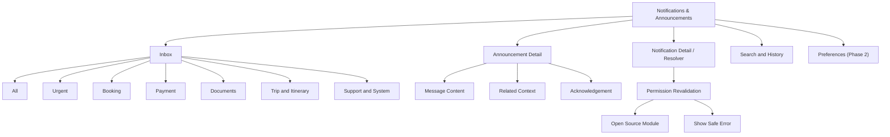
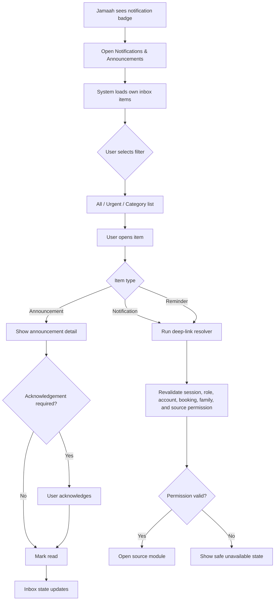
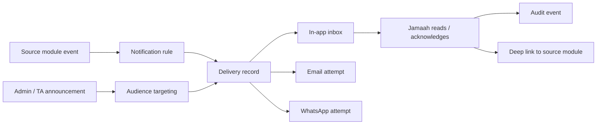

# JUV PRD 13 - Notifications & Announcements

Product: UmrahHaji.com Jamaah/User View  
Module: Notifications & Announcements  
Scope: Jamaah/User View / Notification Inbox, Announcement Inbox, Reminder, Read Status, Acknowledgement  
Platform: Mobile-first Responsive Web Platform  
Status: Draft  
Last Updated: 20 June 2026  

---

## 1. Objective

Notifications & Announcements is the jamaah-facing communication inbox. It gives users one trusted place to receive, read, filter, acknowledge, and open important updates from booking, payment, documents, group trip, itinerary, travel agency, mutawwif assignment, checklist, reports/support, testimonials, referral, account security, and official platform announcements.

This module must help jamaah answer:

1. What new update needs my attention?
2. Is this update about my booking, payment, documents, trip, itinerary, mutawwif, report, referral, feedback, or account?
3. Which announcement comes from UmrahHaji.com and which comes from my Travel Agency?
4. Which notice requires acknowledgement?
5. Which payment, document, or service task is still pending?
6. What should I open next after reading the notification?
7. Which messages have been read, unread, archived, acknowledged, or expired?
8. Did I miss an update because email or WhatsApp delivery failed?

This module is not a chat feature, not a support conversation module, and not an announcement creation workspace. Admin Panel and Travel Agency Portal create announcements. Source modules create transactional notifications. Jamaah/User View receives them, displays safe summaries, and routes users back to the correct source module.

---

## 2. Relationship With Master PRD

This module follows the Jamaah/User View Master PRD:

1. Notifications & Announcements is a P1 communication module.
2. It is accessible from the top navbar notification bell and related deep links across the app.
3. It supports public account lifecycle notifications where relevant, but full inbox history requires login.
4. It must use the same mobile-first layout, account model, design system, and privacy model as other Jamaah/User View modules.
5. It must integrate with Homepage, Authentication, Profile, Package Discovery, Booking, My Group Trip, Transaction History, Payment Settings, Articles, Travel Agency Profile, Compare Packages, Checklist & Guidance, and future Reports, Testimonials, Referral, Documents, and Account Settings modules.

---

## 3. Relationship With Admin, Travel Agency, Jamaah, and Mutawwif PRDs

| Source Module | Relationship |
| --- | --- |
| Admin Announcement Management | Creates official platform announcements, safety notices, policy notices, maintenance notices, and platform-wide operational alerts |
| Admin User Management | Controls account status, role, session, password reset, security policy, and notification eligibility |
| Admin Jamaah Management | Provides jamaah profile, family/group, booking, and account context for targeting rules |
| Admin Booking Management | Sends booking confirmation, status, cancellation, and participant update notifications |
| Admin Billing / Finance Management | Sends invoice, payment, refund, receipt, and financial status notifications |
| Admin Group Trip Management | Sends group trip status, schedule, flight, hotel, transport, and service updates |
| Admin Report Management | Sends report/case status notifications and escalation updates |
| Admin Articles Management | Sends article or guidance announcement links where relevant |
| Admin Testimonial Management | Sends feedback request, moderation, or testimonial status updates where enabled |
| Travel Agency Announcements | Sends agency-owned booking, document, payment, briefing, departure, service, and group trip announcements |
| Travel Agency Booking Management | Sends agency-scoped booking and participant updates |
| Travel Agency Group Trip Management | Sends group trip, itinerary, mutawwif, hotel, flight, transport, and operational updates |
| Travel Agency Documents & Services | Sends missing document, rejected document, visa, vaccination, ticket, room, and service readiness reminders |
| Travel Agency Finance Management | Sends invoice, due date, payment confirmation, refund, and receipt updates |
| Travel Agency Reports / Support | Sends support case updates if the case is agency-scoped |
| Travel Agency Testimonials | Sends feedback/testimonial reminders after trip milestones |
| MV PRD 10 - Notifications & Announcements | Provides parallel notification/read/deep-link pattern for Mutawwif View |
| MV PRD 05 - My Group Trip | Shared group trip update source, with different user-facing detail by role |
| MV PRD 06 - Activity Guidance | Shared itinerary/activity change source where jamaah receives simplified version |
| JUV PRD 02 - Registration, Login, Invitation | Produces account activation, OTP, password reset, and invitation notifications |
| JUV PRD 03 - Profile & Personal Data | Produces profile completion and personal data update notifications |
| JUV PRD 05 - Booking Flow | Produces booking, participant, cancellation, and payment handoff notifications |
| JUV PRD 06 - My Group Trip | Produces trip, itinerary, flight, hotel, mutawwif, and service status notifications |
| JUV PRD 07 - Transaction History | Produces receipt, payment, refund, and transaction status notifications |
| JUV PRD 08 - Payment Settings | Produces sensitive payment method and receipt preference notifications |
| JUV PRD 09 - Articles / Guide Content | Receives article-linked announcement deep links |
| JUV PRD 12 - Checklist & Guidance | Produces preparation, document, health, ritual, and trip-readiness reminders |

### 3.1 Key Sync Rule

Notifications & Announcements is the recipient inbox, not the source of truth for the underlying event.

Source Event -> Notification / Announcement Delivery Record -> Jamaah Inbox -> Deep Link to Source Module -> Source Module Revalidates Permission and Data.

If the source record changes, the inbox item may update status, link target, expiry, or safe summary. It must not expose data beyond the user's permission, family/group permission, booking scope, and data masking rules.

### 3.2 Announcement vs Transactional Notification

| Type | Created By | Example | Jamaah Action |
| --- | --- | --- | --- |
| Announcement | Admin or Travel Agency | Departure briefing, safety notice, system maintenance | Read, acknowledge if required, open linked context |
| Transactional Notification | System/source module | Payment received, document rejected, booking confirmed | Read, open source detail, complete required action |
| Reminder | System/Admin/TA rule | Passport expiring, invoice due, checklist incomplete | Read, open task/detail |
| Alert | System/Admin/TA rule | Flight changed, urgent safety notice, itinerary changed | Read, acknowledge if required, open urgent context |

Rules:

1. Announcement should not duplicate transactional notification for the same event unless Admin/TA explicitly sends broader context.
2. Transactional notification should be short and deep-link to the source module.
3. Announcement can include longer context, attachment, article link, or acknowledgement requirement.
4. Urgent/safety announcements can override optional channel preferences but must still respect privacy and scope.

---

## 4. Research Notes and Product Decisions

Notifications can easily become noisy. Jamaah needs clarity, trust, and action priority, especially around payment, travel documents, departure schedule, itinerary changes, and safety updates.

Product decisions:

1. In-app inbox is required for every eligible notification and announcement.
2. Email and WhatsApp are supplemental channels and may fail without removing the in-app record.
3. Urgent and safety messages should be visually distinct but not overused.
4. Acknowledgement is reserved for high-impact travel, safety, compliance, payment deadline, or schedule-critical announcements.
5. Notification previews must use safe summaries and never reveal sensitive identity, passport, health, payment, internal admin note, risk score, or provider data.
6. Read/unread, archive, acknowledge, and expiry are user-facing states and must not alter source event truth.
7. Status changes must be accessible to screen readers when shown dynamically.
8. Mobile touch targets must be large enough for one-handed usage while travelling.
9. Family/group behavior must distinguish between Family PIC, non-PIC family member, and individual jamaah.
10. Jamaah should be able to filter by operational context: Booking, Payment, Documents, Trip, Itinerary, Mutawwif, Checklist, Support, Feedback, Referral, Security, System.

Reference direction inherited from existing PRDs:

1. W3C WCAG 2.2 status message and target size principles for accessible dynamic updates and mobile controls.
2. Personal data protection principles used in Admin, Travel Agency, and Mutawwif PRDs.
3. Existing Admin Announcement Management and TA PRD 13 rules for sender ownership, targeting, delivery tracking, and acknowledgement.

### 4.1 Product Safety Rule

The inbox must not become a place for uncontrolled sensitive data. Any message that needs sensitive detail should link to the correct source module, where permission, masking, recent authentication, and business rules can be enforced.

### 4.2 Channel Reliability Rule

In-app notification is the user-facing source of record. Email and WhatsApp are delivery attempts, not authoritative proof that jamaah saw the message.

---

## 5. Scope

### 5.1 In Scope for Phase 1

1. Notification bell entry from top navbar.
2. Notification badge count.
3. Notifications & Announcements inbox.
4. Filter tabs: All, Urgent, Booking, Payment, Documents, Trip, Itinerary, Support, System.
5. Read/unread state.
6. Announcement detail page.
7. Notification detail or deep-link resolver.
8. Required acknowledgement flow.
9. Archive from own inbox.
10. Mark one item as read.
11. Mark all as read.
12. Search by title, summary, booking reference, trip name, invoice reference, document label, or source label.
13. Safe preview text.
14. Priority levels: Info, Important, Urgent.
15. Category labels.
16. Source module labels.
17. Related context display.
18. In-app delivery status visibility.
19. External channel delivery note when email/WhatsApp failed.
20. Empty, loading, error, and offline states.
21. Deep links to JUV PRD 02-12 and future PRD 14-18 modules.
22. Audit logs for read, acknowledgement, archive, and sensitive deep-link attempts.
23. Mobile-first responsive behavior.

### 5.2 In Scope for Phase 2

1. Notification preferences by category.
2. Quiet hours controlled by user where policy allows.
3. Bulk archive.
4. Saved/pinned announcements.
5. Advanced grouping by trip, booking, or family member.
6. Notification digest.
7. PWA push notification if approved.
8. Acknowledgement reminders.
9. Attachment preview inside announcement detail.
10. Translation/multi-language message rendering.
11. Advanced search/filter with date range.
12. Family PIC acknowledgement dashboard for family/group members where permitted.
13. Calendar handoff for departure briefing and itinerary changes.

### 5.3 Out of Scope

1. Creating announcements.
2. Sending announcements.
3. Editing sent announcement content.
4. Managing audience targeting.
5. Viewing delivery tracking for other recipients.
6. Admin/TA broadcast analytics.
7. Real-time chat.
8. Support case conversation thread.
9. Email provider configuration.
10. WhatsApp provider configuration.
11. Native mobile push implementation.
12. Marketing automation campaign management.
13. Exporting recipient delivery logs.
14. Editing booking, payment, document, or trip source records from the inbox.

---

## 6. User Roles and Access

| Role | Access Behavior |
| --- | --- |
| Public visitor | No full inbox; may receive public system banners or public article announcements on eligible pages |
| Registered user without booking | Can receive account, security, referral, article, and general platform notifications |
| Jamaah with active booking | Can view booking, payment, document, trip, itinerary, mutawwif, checklist, and agency announcements for own booking scope |
| Family PIC | Can view family/group-targeted announcements and member task summaries when permission allows |
| Non-PIC family member | Can view own notifications and shared family/group announcements relevant to them |
| Cancelled booking user | Can view historical notifications and refund/support updates tied to own cancelled booking |
| Completed trip jamaah | Can view historical notifications, feedback requests, receipts, reports, and post-trip announcements |
| Suspended or locked account | Inbox may be read-only; sensitive deep links disabled based on Admin User Management policy |
| Travel Agency staff | Creates/monitors agency announcements from TA Portal, not this module |
| Admin | Creates/monitors platform announcements from Admin Panel, not this module |

### 6.1 Visibility Rules

Jamaah can see:

1. Own targeted notifications.
2. Announcements sent to own user, role, booking, family/group, group trip, package booking, or jamaah segment.
3. Safe booking, payment, document, service, trip, itinerary, mutawwif, report, feedback, referral, and account context.
4. Masked financial and document status summaries.
5. Read/acknowledgement status for own receipt.
6. External channel failure note for own delivery when useful.

Jamaah must not see:

1. Notifications for another unrelated jamaah.
2. Family/group member private data unless Family PIC permission allows a safe summary.
3. Full passport, IC, health, vaccination, or uploaded document content in inbox preview.
4. Full payment method, bank, card, gateway token, provider reference, or risk score.
5. Internal Admin/TA/Finance/Support notes.
6. Mutawwif internal operational notes.
7. Delivery tracking or acknowledgement data for other recipients except safe family/group summary where explicitly permitted.

### 6.2 Action Permission Rules

| Action | Public | Registered | Active Booking Jamaah | Family PIC | Admin/TA |
| --- | --- | --- | --- | --- | --- |
| View public banner | Yes | Yes | Yes | Yes | N/A |
| Open full inbox | No | Yes | Yes | Yes | No, use own portal |
| Mark read/unread | No | Own items | Own items | Own items | No |
| Mark all as read | No | Own inbox | Own inbox | Own inbox | No |
| Archive | No | Own items | Own items | Own items | No |
| Acknowledge | No | Own required notices | Own required notices | Own/family where allowed | No |
| Open booking/payment/document deep link | No | If permitted | Own booking scope | Family scope where allowed | No |
| Change source record | No | Source module only | Source module only | Source module only | No |
| Create/send announcement | No | No | No | No | Admin/TA portal only |

---

## 7. Entry Points

| Entry Point | Behavior |
| --- | --- |
| Top navbar bell | Opens inbox and shows unread/urgent badge |
| Homepage notification card | Opens filtered inbox or latest urgent item |
| Booking detail | Shows related booking/payment/document notifications |
| My Group Trip | Shows trip and itinerary updates |
| Transaction History | Opens finance/payment notification source detail |
| Payment Settings | Opens payment method/security notification source detail |
| Checklist & Guidance | Opens reminder or task notification source detail |
| Articles / Guide Content | Opens article-linked announcement |
| Email/WhatsApp link | Opens resolver, validates session and permission, then routes to detail/source |
| Report/support status link | Opens future JUV Reports & Support detail |
| Feedback request link | Opens future JUV Testimonials & Feedback flow |

---

## 8. Information Architecture

```text
Notifications & Announcements
├── Inbox
│   ├── All
│   ├── Urgent
│   ├── Booking
│   ├── Payment
│   ├── Documents
│   ├── Trip
│   ├── Itinerary
│   ├── Support
│   └── System
├── Announcement Detail
│   ├── Message Content
│   ├── Related Context
│   ├── Attachment / Article Link
│   ├── Acknowledgement
│   └── Source and Sender
├── Notification Detail / Resolver
│   ├── Safe Summary
│   ├── Source Link
│   ├── Delivery Status
│   └── Permission Error State
├── Search and History
│   ├── Keyword Search
│   ├── Category Filter
│   ├── Priority Filter
│   ├── Read State Filter
│   └── Archived Items
└── Preferences (Phase 2)
    ├── Channel Preferences
    ├── Optional Category Preferences
    └── Quiet Hours
```



---

## 9. Main User Flow



### 9.1 Delivery Flow From Source



---

## 10. Notification and Announcement Type Model

### 10.1 Inbox Item Types

| Type | Description | Example |
| --- | --- | --- |
| Announcement | Sender-created message from Admin or Travel Agency | Departure briefing time changed |
| Transactional Notification | Source-event message | Payment received |
| Reminder | Time or status-based task reminder | Passport upload still pending |
| Alert | Urgent operational or safety message | Flight schedule changed |
| Security Notice | Account/security-sensitive message | Password changed |
| System Notice | Platform service or maintenance notice | Scheduled maintenance |

### 10.2 Categories

| Category | Examples |
| --- | --- |
| Booking | Booking created, participant added, booking cancelled |
| Payment | Invoice due, payment received, refund update, receipt ready |
| Documents | Missing document, rejected document, visa/ticket ready |
| Trip | Group trip confirmed, hotel changed, transport update |
| Itinerary | Activity time changed, briefing reminder, daily schedule update |
| Mutawwif | Mutawwif assigned, replacement notice, contact availability |
| Checklist | Preparation task reminder, health/vaccination checklist, packing item |
| Support | Report submitted, case updated, case resolved |
| Feedback | Feedback request, testimonial moderation update |
| Referral | Referral converted, reward status, referral policy update |
| Account | Login, password, session, profile update, security notice |
| System | Maintenance, policy, platform announcement |

### 10.3 Priority Levels

| Priority | Meaning | UI Treatment |
| --- | --- | --- |
| Info | Useful update; no immediate action | Standard item |
| Important | Action expected or deadline approaching | Emphasized label and action CTA |
| Urgent | Safety, schedule-critical, payment-critical, or travel-critical | Top grouping, strong label, optional acknowledgement |

### 10.4 Read and Acknowledgement State

| State | Meaning |
| --- | --- |
| Unread | User has not opened item detail |
| Read | User opened item detail |
| Acknowledgement Required | Sender/source requires explicit acknowledgement |
| Acknowledged | User confirmed they have read/understood |
| Archived | User removed from active inbox list |
| Expired | Announcement is no longer active but may remain in history |
| Source Unavailable | Source module record is deleted, hidden, expired, or no longer accessible |

---

## 11. Screen 1 - Notification Inbox

### 11.1 Purpose

Give jamaah a single mobile-first list of important updates, sorted by urgency and recency, with enough context to decide what to open next without exposing sensitive data in preview.

### 11.2 Layout

1. Header: `Notifications`.
2. Badge summary: unread count and urgent count.
3. Search input.
4. Horizontal filter chips: All, Urgent, Booking, Payment, Documents, Trip, Itinerary, Support, System.
5. List grouped by Today, Yesterday, This Week, Older.
6. Optional urgent group pinned at top until read/acknowledged.
7. Empty state.
8. Offline cached state.

### 11.3 Inbox Item Card

| Element | Required | Notes |
| --- | --- | --- |
| Priority marker | Yes | Info, Important, Urgent |
| Category label | Yes | Booking, Payment, Documents, etc. |
| Title | Yes | Short, user-safe title |
| Preview summary | Yes | Must be privacy-safe |
| Source label | Yes | UmrahHaji.com, Travel Agency, System, Booking, Payment, etc. |
| Related context | Conditional | Booking ref, trip name, invoice ref, document label, masked as needed |
| Timestamp | Yes | Relative and absolute on detail |
| Unread indicator | Yes | Visual and accessible |
| Acknowledgement label | Conditional | Show if required |
| External channel status | Conditional | Show failed email/WhatsApp note only if useful |

### 11.4 List Rules

1. Urgent unread items appear before non-urgent unread items.
2. Read items remain available unless archived, expired, or policy-hidden.
3. Archived items move to History/Archived filter.
4. Mark all as read does not acknowledge required announcements.
5. Expired announcements may remain in history if linked to booking, payment, safety, or compliance.
6. Deleted/hidden source records must show safe unavailable state.

---

## 12. Screen 2 - Announcement Detail

### 12.1 Purpose

Display full user-facing announcement content from Admin or Travel Agency while preserving sender ownership, expiry, attachments, links, and acknowledgement rules.

### 12.2 Layout

1. Back button.
2. Priority and category label.
3. Announcement title.
4. Sender label: UmrahHaji.com or Travel Agency name.
5. Sent date/time.
6. Related context: booking, group trip, package, payment, document, or service label where applicable.
7. Message body.
8. Attachment or article link if allowed.
9. Acknowledgement section if required.
10. Primary CTA to source module if linked.
11. Delivery channel summary if relevant.
12. Footer metadata: announcement reference and expiry.

### 12.3 Acknowledgement Rules

1. Required acknowledgement must be explicit and user-initiated.
2. Opening a detail page does not count as acknowledgement.
3. Acknowledgement copy must be clear, for example: `I have read and understood this notice`.
4. If the announcement targets a family/group, Family PIC acknowledgement covers only the PIC unless policy explicitly allows family-level acknowledgement.
5. Acknowledgement must write an audit event with timestamp, user ID, announcement receipt ID, IP/session metadata, and channel.
6. Acknowledgement must not be reversible by the user.
7. If source announcement is corrected later, a new acknowledgement may be required.

---

## 13. Screen 3 - Notification Detail / Deep-Link Resolver

### 13.1 Purpose

Safely route jamaah from an inbox item to the correct source module after validating login, account status, booking scope, family/group permission, and source record visibility.

### 13.2 Resolver Behavior

| Resolver Result | Behavior |
| --- | --- |
| Source available and permitted | Open source module detail |
| Login required | Ask user to log in, then retry resolver |
| Recent authentication required | Ask for OTP/password/MFA based on security policy |
| Source expired | Show safe expired message and keep inbox item history |
| Source hidden by permission | Show safe unavailable message |
| Booking cancelled | Open cancelled booking view if user still owns historical access |
| Family permission removed | Show safe message and hide member-specific detail |
| Payment/document sensitive | Open source module with masking and recent authentication rules |

### 13.3 Common Detail Fields

| Field | Description |
| --- | --- |
| Notification ID | System identifier |
| Receipt ID | User-specific delivery/receipt identifier |
| Source module | Booking, Payment, Document, Trip, Support, etc. |
| Source reference | Booking ref, invoice ref, report ref, document label, or trip ref |
| Safe title | User-facing title |
| Safe summary | User-facing summary |
| Priority | Info, Important, Urgent |
| Category | Functional category |
| Created at | Event creation timestamp |
| Delivered at | In-app delivery timestamp |
| Read at | User read timestamp |
| Acknowledged at | User acknowledgement timestamp if any |
| Expiry at | Optional expiry timestamp |

---

## 14. Screen 4 - Search, Filter, and History

### 14.1 Search

Search must support:

1. Title.
2. Safe summary.
3. Booking reference.
4. Invoice/payment reference.
5. Trip name.
6. Document label.
7. Travel Agency name.
8. Announcement reference.
9. Source module label.

Search must not expose hidden records through typeahead or result counts.

### 14.2 Filters

| Filter | Options |
| --- | --- |
| Category | Booking, Payment, Documents, Trip, Itinerary, Support, Feedback, Referral, Account, System |
| Priority | Info, Important, Urgent |
| Read State | Unread, Read |
| Acknowledgement | Required, Acknowledged |
| Source | UmrahHaji.com, Travel Agency, System |
| Time | Today, This Week, This Month, Custom Range |
| Status | Active, Archived, Expired |

### 14.3 History

History shows read, archived, expired, and older notifications. Items may still open source detail if permission is valid.

History must preserve:

1. Payment and receipt notices.
2. Booking and cancellation notices.
3. Safety/compliance notices.
4. Acknowledged notices.
5. Report/support notices.

---

## 15. Notification Sources and Deep Links

| Source | Event Examples | Deep Link Target |
| --- | --- | --- |
| Registration/Login | Account activated, password reset, OTP requested | Account/security flow |
| Profile | Profile incomplete, identity update, family member update | Profile detail |
| Package Discovery | Saved package update, package availability change | Package detail |
| Booking | Booking created, pending approval, cancelled, participant update | Booking detail |
| Payment | Invoice due, payment successful, receipt ready, refund update | Transaction detail |
| Payment Settings | Payment method changed, receipt preference updated | Payment settings |
| Documents & Services | Missing document, rejected document, visa/ticket ready | Document/service detail |
| My Group Trip | Trip confirmed, hotel/flight changed, mutawwif assigned | Group trip detail |
| Itinerary | Activity time changed, briefing reminder | Itinerary activity detail |
| Checklist | Critical task incomplete, preparation reminder | Checklist item detail |
| Articles | New guidance article, safety article | Article detail |
| Reports & Support | Report created, updated, resolved | Future JUV Report detail |
| Testimonials | Feedback request, testimonial moderation | Future JUV Feedback flow |
| Referral | Referral converted, reward status | Future JUV Referral detail |
| System | Maintenance, policy notice, platform announcement | Announcement detail |

---

## 16. Announcement Handling

### 16.1 Supported Announcement Types

| Announcement Type | Sender | Jamaah Visibility |
| --- | --- | --- |
| Platform Notice | Admin | Targeted jamaah or all eligible users |
| Policy Notice | Admin | Users affected by policy |
| Safety / Compliance Notice | Admin or approved TA role | Targeted trip, booking, package, or user group |
| Group Trip Update | Travel Agency | Group trip members and Family PIC where applicable |
| Booking Reminder | Travel Agency/System | Booking owner, participants, or Family PIC |
| Document Reminder | Travel Agency/System | Jamaah with relevant missing/rejected document |
| Finance Reminder | Travel Agency/System | User/PIC with payment responsibility |
| Article / Guidance Notice | Admin or Travel Agency | Eligible users based on trip/package/context |
| Feedback Request | System/Travel Agency | Completed trip or activity participants |

### 16.2 Announcement Rules

1. Platform announcements are labeled `UmrahHaji.com`.
2. Agency announcements are labeled with the Travel Agency name.
3. Jamaah cannot edit, forward to other platform users, or change announcement content inside the app.
4. Sent announcement content is immutable from the user's perspective.
5. Corrections are shown as a new announcement or linked correction notice.
6. Attachments must be scanned, type-limited, size-limited, and permission-scoped.
7. Urgent announcements can remain pinned until read or acknowledged.
8. Expired announcements can remain searchable in history if they are important for trip, payment, compliance, or dispute context.

---

## 17. Channel and Badge Rules

### 17.1 Channels

| Channel | Rule |
| --- | --- |
| In-app | Required authoritative user-facing record |
| Email | Optional delivery attempt based on settings and policy |
| WhatsApp | Optional delivery attempt based on settings, template approval, and policy |
| Push/PWA | Phase 2 only if approved |

### 17.2 Badge Count

Badge count includes:

1. Unread active notifications.
2. Unread active announcements.
3. Urgent read-but-unacknowledged announcements.

Badge count excludes:

1. Archived items.
2. Expired non-critical items.
3. Read items with no required action.
4. Items hidden by permission.

### 17.3 External Delivery Note

If email or WhatsApp delivery fails, the in-app record remains visible. The user may see a simple note such as `WhatsApp delivery failed, but this notice is available here`.

The note must not expose provider error codes, internal retry logs, or third-party identifiers.

---

## 18. Data Requirements

### 18.1 Inbox Item Summary

| Field | Required | Notes |
| --- | --- | --- |
| inbox_item_id | Yes | Unique item identifier |
| receipt_id | Yes | User-specific delivery receipt |
| user_id | Yes | Recipient user |
| family_group_id | Conditional | Used for family/group scope |
| booking_id | Conditional | Booking context |
| group_trip_id | Conditional | Trip context |
| source_module | Yes | Booking, Payment, Documents, Trip, etc. |
| source_reference | Conditional | Safe reference |
| item_type | Yes | Announcement, notification, reminder, alert |
| category | Yes | Functional category |
| priority | Yes | Info, Important, Urgent |
| title | Yes | User-safe title |
| preview_summary | Yes | User-safe preview |
| sender_label | Yes | UmrahHaji.com, Travel Agency, System |
| created_at | Yes | Source event timestamp |
| delivered_at | Yes | In-app delivery timestamp |
| read_at | Optional | User read timestamp |
| acknowledged_at | Optional | User acknowledgement timestamp |
| archived_at | Optional | User archive timestamp |
| expires_at | Optional | Announcement expiry |
| deep_link_target | Conditional | Source route |

### 18.2 Announcement Receipt

| Field | Required | Notes |
| --- | --- | --- |
| announcement_id | Yes | Source announcement |
| receipt_id | Yes | Recipient-specific receipt |
| recipient_user_id | Yes | Target user |
| target_basis | Yes | User, booking, group trip, family/group, segment |
| acknowledgement_required | Yes | Boolean |
| acknowledgement_copy | Conditional | Required if acknowledgement required |
| read_at | Optional | Read timestamp |
| acknowledged_at | Optional | Acknowledgement timestamp |
| channel_summary | Optional | Safe delivery summary |

### 18.3 Delivery Channel Summary

| Field | Required | Notes |
| --- | --- | --- |
| channel | Yes | In-app, email, WhatsApp |
| delivery_status | Yes | Delivered, failed, pending, skipped |
| safe_status_label | Yes | User-facing wording |
| attempted_at | Optional | Timestamp |
| delivered_at | Optional | Timestamp |

---

## 19. Empty, Loading, Error, and Offline States

| State | Behavior |
| --- | --- |
| Empty inbox | Show friendly empty state and no badge |
| Empty filter | Show filter-specific empty state and clear filter option |
| Loading | Show skeleton list and preserve last known badge when possible |
| Offline | Show cached read-only items and offline notice |
| Source unavailable | Show safe message and keep inbox item history |
| Permission changed | Hide sensitive detail and show safe unavailable state |
| Delivery delayed | Show in-app record if available; avoid implying external channel success |
| Acknowledgement failed | Keep item unacknowledged and allow retry |
| Search error | Show retry and do not leak hidden result counts |

---

## 20. Notifications and Reminders Generated by This Module

This module generally displays notifications created by other modules. It may generate only inbox-state reminders:

1. Required acknowledgement reminder.
2. Urgent unread reminder.
3. Delivery fallback reminder when external channel failed and user has not opened in-app item.
4. Notification preference confirmation in Phase 2.

It must not create duplicate payment, booking, document, support, or trip events.

---

## 21. Permissions, Privacy, and Security

### 21.1 Permission Logic

1. Inbox query must be scoped to authenticated user ID.
2. Booking/trip/document/payment deep links must re-check source permission.
3. Family PIC access must be evaluated per family/group and per data type.
4. Account locked/suspended states must follow Admin User Management policy.
5. Sensitive deep links may require recent authentication.
6. Archived/read state belongs to the recipient only.
7. Acknowledgement belongs to the recipient only unless family-level policy is explicitly enabled.
8. Source module permission overrides inbox preview availability.

### 21.2 Data Scope

The inbox can show:

1. Safe title and summary.
2. Booking reference.
3. Invoice reference.
4. Document label, not raw file.
5. Group trip name.
6. Travel Agency name.
7. Mutawwif display name if already visible in My Group Trip.
8. Due date or deadline where relevant.
9. Status labels such as paid, pending, rejected, approved, cancelled, changed.

The inbox must not show:

1. Full passport or IC number.
2. Full uploaded document content.
3. Full payment method, bank, card, gateway token, or provider error.
4. Internal Finance/Admin/TA notes.
5. Health/medical detail beyond safe reminder label.
6. Other family member private detail unless permitted.
7. Mutawwif internal notes or assignment reasoning.

### 21.3 Privacy Rules

1. Preview text must be safe for lock-screen-like environments.
2. Sensitive categories should prefer action prompts over detailed data.
3. Attachments must inherit announcement/source permissions.
4. Email/WhatsApp content should use even stricter summary than in-app detail.
5. Search must not reveal hidden records.
6. Analytics must use non-sensitive event labels.

### 21.4 Security Rules

1. Every external deep link must use signed or validated route tokens.
2. Expired links must fail safely.
3. Sensitive links require active session and may require recent authentication.
4. Mark read/archive endpoints must validate recipient ownership.
5. Acknowledgement endpoint must validate recipient, announcement, and required acknowledgement state.
6. Rate limiting must apply to repeated resolver and acknowledgement attempts.
7. Audit logs must be immutable for acknowledgement and sensitive link access.

---

## 22. Audit and Activity Logs

Audit events:

1. Notification delivered in-app.
2. Notification opened.
3. Announcement opened.
4. Announcement acknowledged.
5. Item archived.
6. Mark all as read.
7. Sensitive deep link opened.
8. Permission denied from deep-link resolver.
9. External channel failure surfaced to user.

### 22.1 Audit Fields

| Field | Description |
| --- | --- |
| actor_user_id | Jamaah user performing action |
| receipt_id | Notification/announcement receipt |
| source_module | Source module |
| source_reference | Safe source reference |
| action | Opened, read, acknowledged, archived, denied |
| timestamp | Event timestamp |
| session_id | Session metadata |
| ip_hash | Privacy-safe IP reference |
| user_agent_summary | Device/browser summary |
| result | Success/failure |

---

## 23. Analytics Events

| Event | Trigger | Purpose |
| --- | --- | --- |
| juv_notification_inbox_opened | User opens inbox | Measure inbox usage |
| juv_notification_item_opened | User opens item | Measure engagement |
| juv_notification_filter_used | User applies filter | Measure discoverability |
| juv_notification_search_used | User searches | Measure search need |
| juv_announcement_acknowledged | User acknowledges announcement | Track required notice compliance |
| juv_notification_deeplink_opened | User opens source module | Measure action handoff |
| juv_notification_deeplink_denied | Permission blocks source | Monitor permission issues |
| juv_notification_archived | User archives item | Measure inbox management |
| juv_notification_mark_all_read | User marks all as read | Measure bulk management |
| juv_notification_external_failed_seen | User sees external delivery failure note | Monitor channel reliability |

Analytics must not include full message content, passport, payment method, document content, internal notes, or personal health detail.

---

## 24. Functional Requirements

| ID | Requirement | Priority |
| --- | --- | --- |
| JUV-NOTIF-001 | User can open notification inbox from navbar bell | P1 |
| JUV-NOTIF-002 | System shows unread and urgent badge count | P1 |
| JUV-NOTIF-003 | User can view targeted notifications and announcements only | P1 |
| JUV-NOTIF-004 | Inbox items show safe title, summary, category, priority, source, and timestamp | P1 |
| JUV-NOTIF-005 | User can filter by category and urgency | P1 |
| JUV-NOTIF-006 | User can search inbox history safely | P1 |
| JUV-NOTIF-007 | User can mark individual item as read | P1 |
| JUV-NOTIF-008 | User can mark all eligible items as read | P1 |
| JUV-NOTIF-009 | User can archive own inbox item | P1 |
| JUV-NOTIF-010 | User can open announcement detail | P1 |
| JUV-NOTIF-011 | User can acknowledge required announcement | P1 |
| JUV-NOTIF-012 | Deep links revalidate permission before opening source module | P1 |
| JUV-NOTIF-013 | In-app record remains available even if email/WhatsApp fails | P1 |
| JUV-NOTIF-014 | Notification previews mask sensitive payment/document/personal data | P1 |
| JUV-NOTIF-015 | Family PIC visibility follows family/group permission | P1 |
| JUV-NOTIF-016 | System shows empty/loading/error/offline states | P1 |
| JUV-NOTIF-017 | Acknowledgement and sensitive access actions are audited | P1 |
| JUV-NOTIF-018 | Source-unavailable state is safe and does not leak hidden data | P1 |
| JUV-NOTIF-019 | Phase 2 supports notification preferences | P2 |
| JUV-NOTIF-020 | Phase 2 supports digest and advanced grouping | P2 |

---

## 25. Acceptance Criteria

1. Jamaah can open Notifications & Announcements from the top navbar bell.
2. Inbox displays only items targeted to the authenticated user or permitted family/group scope.
3. Badge count matches unread active and urgent unacknowledged items.
4. User can filter inbox by major categories.
5. User can search without exposing hidden records.
6. Announcement detail shows sender, message, context, timestamp, and acknowledgement if required.
7. Required acknowledgement cannot be satisfied by simply opening the announcement.
8. Acknowledgement writes an audit event.
9. Notification deep links re-check permission before opening source module.
10. Payment/document previews use safe summaries and masking.
11. Family PIC cannot see member-private data unless permission allows it.
12. Mark all as read does not acknowledge required announcements.
13. Archived items leave active inbox but remain in history.
14. Expired important notices remain in history when needed for compliance or dispute.
15. External email/WhatsApp failure does not remove in-app item.
16. Locked/suspended accounts follow Admin User Management policy.
17. Offline state shows cached read-only items where available.
18. Empty/loading/error states are implemented.
19. Analytics events exclude sensitive content.
20. Cross-role ownership is clear: Admin/TA send announcements, source modules create transactional notifications, Jamaah View receives and acts.

---

## 26. Dependencies

1. Admin Announcement Management.
2. Admin User Management.
3. Admin Booking Management.
4. Admin Billing / Finance Management.
5. Admin Group Trip Management.
6. Admin Report Management.
7. Travel Agency PRD 13 - Announcements.
8. Travel Agency Booking, Documents & Services, Group Trip, Finance, Reports, and Testimonials modules.
9. JUV PRD 02 - Registration, Login, Invitation.
10. JUV PRD 03 - Profile & Personal Data.
11. JUV PRD 05 - Booking Flow.
12. JUV PRD 06 - My Group Trip.
13. JUV PRD 07 - Transaction History.
14. JUV PRD 08 - Payment Settings.
15. JUV PRD 09 - Articles / Guide Content.
16. JUV PRD 12 - Checklist & Guidance.
17. Future JUV PRD 14 - Reports & Support.
18. Future JUV PRD 15 - Testimonials & Feedback.
19. Future JUV PRD 16 - Referral.
20. Future JUV PRD 17 - Documents & Service Readiness.
21. Future JUV PRD 18 - Account Settings & Security.
22. Notification delivery service.
23. Email and WhatsApp provider integration where enabled.
24. Audit logging service.

---

## 27. Open Questions

1. Should Family PIC be allowed to acknowledge notices on behalf of family/group members in Phase 1?
2. Which categories may override user channel preferences?
3. Should WhatsApp delivery be enabled by default for urgent travel notices?
4. Should archived payment/receipt notices remain visible forever or follow retention policy?
5. Should public users without account receive browser-only public notices?
6. Should agency announcements require platform approval for safety/compliance categories?
7. Should unread urgent notices block checkout or trip readiness completion?
8. Should notification preferences be delivered in PRD 13 Phase 2 or moved to JUV Account Settings?

---

## 28. Future Enhancements

1. Notification preferences by category and channel.
2. Digest mode for low-priority updates.
3. Pinned/saved announcements.
4. Smart grouping by booking, trip, and family member.
5. Multi-language rendering.
6. Calendar integration for briefing and departure reminders.
7. PWA push notification.
8. Family/group acknowledgement dashboard.
9. AI-assisted safe summary generation with strict review controls.
10. Emergency mode inbox for safety protocol updates.

---

## 29. Final Product Decision

JUV PRD 13 - Notifications & Announcements must be implemented as the jamaah-facing communication inbox and trusted announcement reader. It must synchronize with Admin Announcement Management, Travel Agency Announcements, JUV Booking, My Group Trip, Transaction History, Payment Settings, Checklist & Guidance, and future JUV Reports, Testimonials, Referral, Documents, and Account Settings modules.

The key product rule is that Jamaah/User View does not create or own source events. It receives targeted, privacy-safe communication records, supports read/archive/acknowledgement states, and routes users back to the correct module after permission revalidation.

This PRD should be built as P1 before JUV PRD 14 because Reports & Support, Testimonials, Referral, Documents, and Account Settings all depend on reliable user-facing notification, announcement, and deep-link behavior.
