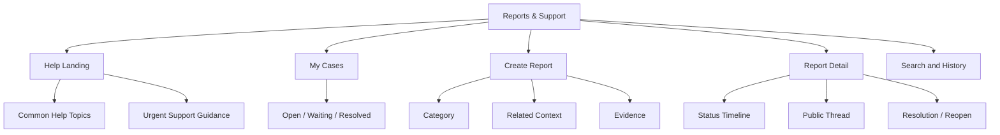
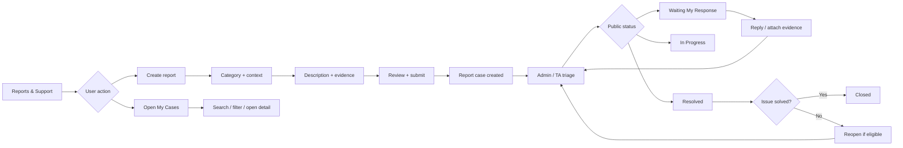
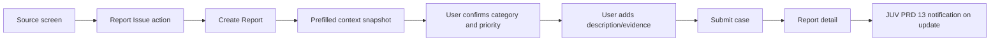
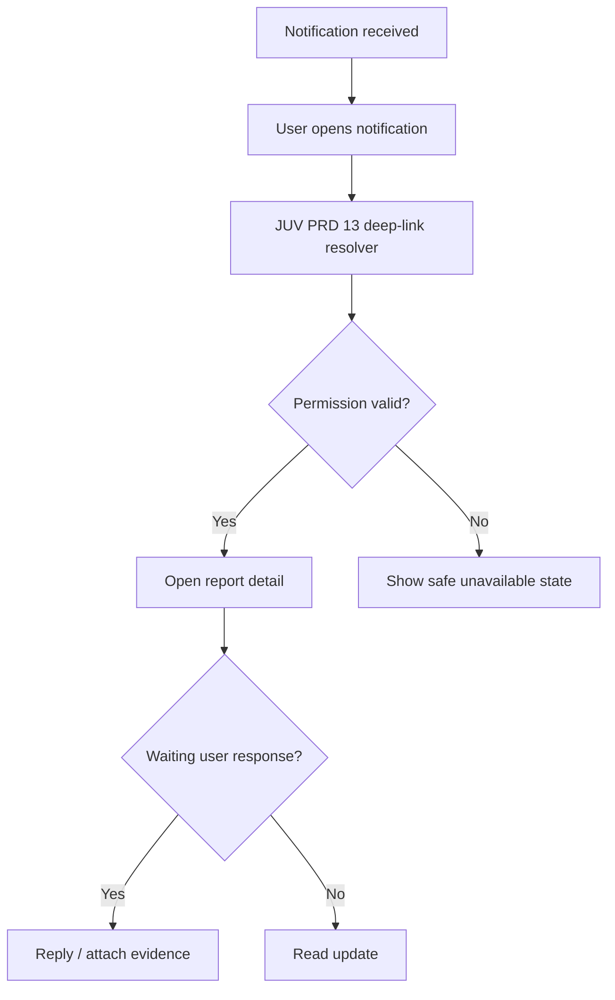

# JUV PRD 14 - Reports & Support

Product: UmrahHaji.com Jamaah/User View  
Module: Reports & Support  
Scope: Jamaah/User View / Issue Reporting, Support Case Tracking, Evidence, Resolution, Reopen  
Platform: Mobile-first Responsive Web Platform  
Status: Draft  
Last Updated: 20 June 2026  

---

## 1. Objective

Reports & Support is the jamaah-facing case center. It allows jamaah to submit structured issues, attach evidence, track case status, reply to public follow-up questions, view resolution notes, and reopen eligible resolved cases from one mobile-first workspace.

This module must help jamaah answer:

1. Where do I report an issue about booking, payment, document, group trip, itinerary, travel agency service, mutawwif, refund, account, referral, or platform access?
2. Which support case is still waiting for Admin, Travel Agency, or my response?
3. What evidence or attachment have I submitted?
4. What is the latest safe status and resolution note?
5. Which issue is urgent and needs immediate attention?
6. Can I reopen a resolved case because the issue is not actually solved?
7. Which module should I open after a case update?
8. Which support details are visible to me and which are internal to Admin or Travel Agency?

This module is not live chat, not an Admin triage dashboard, not a Travel Agency helpdesk workspace, and not a legal dispute engine. It is a structured support and report submission module for jamaah, while triage, assignment, internal notes, escalation, and final operational handling remain owned by Admin Panel and Travel Agency Portal.

---

## 2. Relationship With Master PRD

This module follows the Jamaah/User View Master PRD:

1. Reports & Support is a P1 module.
2. It is accessible from user account/help area, contextual actions, notification deep links, booking detail, trip detail, transaction detail, and document/service readiness surfaces.
3. It must support logged-in jamaah only for full case creation and case history.
4. It must use the same mobile-first layout, account model, design system, permission model, and privacy boundaries as other Jamaah/User View modules.
5. It must integrate with Booking, My Group Trip, Transaction History, Payment Settings, Documents/Services, Notifications, Testimonials, Referral, Account Settings, Admin Report Management, and Travel Agency Reports / Support.

---

## 3. Relationship With Admin, Travel Agency, Jamaah, and Mutawwif PRDs

| Source Module | Relationship |
| --- | --- |
| Admin Report Management | Source of truth for triage, priority, assignment, internal notes, status, resolution, reopen policy, escalation, and audit |
| Admin User Management | Controls user account, session, role, status, sensitive action policy, and support eligibility |
| Admin Jamaah Management | Provides jamaah profile, family/group, booking, and identity context where permitted |
| Admin Booking Management | Provides booking context and receives booking-related support cases |
| Admin Billing / Finance Management | Receives payment, receipt, invoice, refund, and financial issue cases |
| Admin Group Trip Management | Receives group trip, itinerary, hotel, flight, transport, service, and safety case context |
| Admin Mutawwif Management | Receives mutawwif-related service, conduct, replacement, and assignment cases |
| Admin Testimonial Management | May escalate low rating or complaint-style feedback into report case |
| Travel Agency Reports / Support | Receives agency-scoped cases, agency-public replies, response requests, and resolution notes |
| Travel Agency Booking Management | Receives agency booking and participant cases |
| Travel Agency Documents & Services | Receives document, visa, ticket, vaccination, rooming, and service readiness cases |
| Travel Agency Finance Management | Receives agency invoice, payment, receipt, and refund-related cases |
| Travel Agency Group Trip Management | Receives group trip, itinerary, service, hotel, flight, transport, briefing, and operational cases |
| Travel Agency Mutawwif Assignment | Receives mutawwif assignment/replacement concerns when agency-scoped |
| MV PRD 11 - Reports & Support | Provides parallel case status, evidence, and permission pattern for Mutawwif View |
| JUV PRD 05 - Booking Flow | Can open support/report flow with booking context |
| JUV PRD 06 - My Group Trip | Can open support/report flow with group trip, itinerary, mutawwif, flight, hotel, and service context |
| JUV PRD 07 - Transaction History | Can open support/report flow with transaction, receipt, invoice, or refund context |
| JUV PRD 08 - Payment Settings | Can open account/payment support case with masked payment context |
| JUV PRD 12 - Checklist & Guidance | Can open issue/report flow for blocked checklist or readiness item |
| JUV PRD 13 - Notifications & Announcements | Sends report status notifications and deep-links back to report detail |

### 3.1 Key Sync Rule

Reports & Support is the jamaah entry and tracking surface, not the operational owner of resolution.

Report Issue Handoff / Manual Create -> Report Case Record -> Admin / Travel Agency Triage -> Status, Priority, Public Reply, Resolution -> Jamaah Case Tracking -> JUV PRD 13 Notification Update.

If Admin or Travel Agency changes status, public comment, visible attachment, or resolution note, Jamaah View updates the case detail and notification inbox. If the source booking/payment/document/trip record changes, the report retains a context snapshot and links to the latest permitted source detail.

### 3.2 Cross-Role Boundary

| Role / Surface | Owns | Can Jamaah View Display? | PRD 14 Rule |
| --- | --- | --- | --- |
| Admin Report Management | Triage, assignment, internal notes, priority, status, escalation, resolution | Yes, only public status, public comments, public resolution | Never expose internal notes or internal assignee |
| Travel Agency Reports / Support | Agency-scoped response and service follow-up | Yes, only agency-public reply and safe agency status | Respect agency and booking/trip scope |
| Admin Finance | Payment/refund investigation, gateway/provider review, manual settlement | Yes, only safe case summary/status | Do not expose internal finance review |
| Admin Mutawwif Management | Mutawwif service/conduct/replacement handling | Yes, safe update and next action | Do not expose internal evaluation or disciplinary notes |
| Travel Agency Group Trip | Trip itinerary, service, hotel, flight, transport, briefing, assignment context | Yes, own trip context | Do not expose other jamaah private data |
| Jamaah/User View | Create report, add public reply, attach evidence, track status, reopen eligible case | Yes | Own-user and permitted family/group scope only |
| Mutawwif View | Mutawwif-originated reports and field support | No, unless case specifically needs jamaah-safe update | Do not expose mutawwif private support history |

### 3.3 Boundary With JUV PRD 05-13

| Area | Source Module | PRD 14 Behavior |
| --- | --- | --- |
| Booking issue | JUV PRD 05 | Prefill booking reference, package, agency, participant, and booking status |
| Trip/service issue | JUV PRD 06 | Prefill group trip, itinerary item, hotel, flight, transport, mutawwif, and service context |
| Transaction issue | JUV PRD 07 | Prefill transaction reference, invoice/receipt status, amount label, and payment status |
| Payment setting issue | JUV PRD 08 | Prefill masked payment method/status only |
| Article/guidance issue | JUV PRD 09/12 | Prefill article/checklist context and user task state |
| Notification update | JUV PRD 13 | Deep-link to report detail after permission revalidation |
| Report status notification | JUV PRD 13 | Creates transactional notification when public case status changes |

---

## 4. Research Notes and Product Decisions

Reports & Support handles operational incidents, personal data, attachments, finance references, travel documents, family/group context, and potentially urgent safety issues. Product decisions:

1. Reports must be structured cases, not free-form chat.
2. The report form should support contextual prefill so jamaah does not need to retype booking, trip, payment, document, or mutawwif details.
3. Urgent issues should be allowed, but priority escalation must be reviewed by Admin or Travel Agency to prevent misuse.
4. Jamaah-facing status must be simplified while internal status remains richer in Admin/TA surfaces.
5. Attachments must use allowlisted file types, file size limits, permission checks, safe filenames, and scanning policy.
6. Case comments must separate public participant replies from internal notes.
7. Dynamic status changes, submission success, validation errors, upload progress, and search/filter results must be accessible.
8. Mobile controls for create, reply, attachment, status filter, and reopen must be easy to tap.
9. Report previews and notification previews must use safe summaries and avoid sensitive details.
10. Personal data protection requires minimum necessary collection, scoped visibility, retention policy, and audit logs.

Reference direction inherited from existing PRDs:

1. W3C WCAG 2.2 status message and target size principles for accessible dynamic updates and mobile controls.
2. OWASP-style secure file upload principles already adopted in MV PRD 11.
3. Personal data protection principles used in Admin, Travel Agency, Mutawwif, and JUV PRD 13.

### 4.1 Support Safety Rule

Reports & Support must not expose sensitive source details just because a case exists. The report detail can show only the context and evidence that the jamaah is allowed to see. Any deeper investigation detail must remain in Admin Panel or Travel Agency Portal.

### 4.2 Attachment Safety Rule

Evidence upload must be treated as sensitive and potentially unsafe. The system must not trust file extension, original filename, or browser-provided content type as the only validation source.

### 4.3 Emergency Clarification Rule

Urgent support is not the same as emergency rescue. If the platform later defines an Emergency & Safety Protocol, PRD 14 should route severe safety/medical/security issues to emergency instructions first, then create a report record for tracking.

---

## 5. Scope

### 5.1 In Scope for Phase 1

1. Reports & Support landing page.
2. My Cases list.
3. Create Report form.
4. Contextual Report Issue handoff from booking, group trip, transaction, document/service, payment setting, checklist, notification, and account contexts.
5. Support category selection.
6. Priority selection: Normal, Important, Urgent.
7. System-suggested priority based on category and context.
8. Related context selection or prefilled context snapshot.
9. Report title and description.
10. Attachment upload for evidence.
11. Attachment preview/download if permission allows.
12. Report detail page.
13. Public comments and replies.
14. Status timeline.
15. Resolution note display.
16. Reopen eligible resolved report.
17. Archive/hide case from own list where policy allows.
18. Search and filter by status, category, priority, source module, booking, and trip.
19. Empty, loading, error, offline, and upload failure states.
20. Notification integration with JUV PRD 13.
21. Audit logs for create, view sensitive case, comment, attachment upload, reopen, archive.
22. Mobile-first responsive behavior.

### 5.2 In Scope for Phase 2

1. SLA countdown and overdue labels.
2. Saved report drafts for offline or poor network use.
3. Satisfaction survey after closure.
4. Advanced escalation request.
5. Family PIC group case summary where policy allows.
6. Case merge/duplicate explanation visible to jamaah.
7. Voice note or video evidence upload if storage/security policy allows.
8. Auto-summary for long case threads.
9. Case export for personal record.
10. Multi-language support templates.
11. Help article recommendations based on category.
12. Guided troubleshooting before submission.
13. Emergency mode handoff if cross-role safety protocol is implemented.

### 5.3 Out of Scope

1. Admin triage dashboard.
2. Travel Agency support dashboard.
3. Creating Admin or TA internal notes.
4. Viewing Admin or TA internal notes.
5. Viewing internal assignee or internal escalation chain.
6. Legal dispute management.
7. Refund approval.
8. Payment chargeback processing.
9. Booking cancellation execution.
10. Trip/package/jamaah data editing.
11. Live chat.
12. Voice/video call support.
13. Public complaint forum.
14. Knowledge base authoring.
15. Provider settlement or gateway investigation workspace.
16. Full audit export for external roles.
17. Direct penalty, suspension, or mutawwif disciplinary decision.

---

## 6. User Roles and Access

| Role | Access Behavior |
| --- | --- |
| Public visitor | Can view public help entry points/FAQ only; cannot create full report without login |
| Registered user without booking | Can create account/platform/general support cases |
| Jamaah with active booking | Can create cases tied to own booking, payment, documents, group trip, itinerary, agency, and mutawwif context |
| Family PIC | Can create and view cases for family/group booking scope where policy allows |
| Non-PIC family member | Can create/view own cases and shared trip cases relevant to them |
| Cancelled booking user | Can create/view cases tied to own cancellation, refund, or historical booking access |
| Completed trip jamaah | Can create/view post-trip service, feedback, receipt, and report cases within policy window |
| Suspended or locked account | May view own historical cases read-only; create/reply may be limited to account recovery/support |
| Travel Agency staff | Handles agency-scoped response in TA Portal, not this module |
| Admin | Handles triage in Admin Panel, not this module |

### 6.1 Visibility Rules

Jamaah can see:

1. Own submitted report cases.
2. Reports shared to them for response.
3. Safe report title, category, priority, status, source module, related context, and public timeline.
4. Public comments sent by Admin, Travel Agency, or system.
5. Own submitted attachments.
6. Public attachments shared back to jamaah.
7. Resolution note marked visible to jamaah.
8. Reopen eligibility and deadline if available.
9. Masked finance, payment, identity, document, or family/group context where allowed.

Jamaah must not see:

1. Reports submitted by other unrelated jamaah.
2. Family/group member private cases unless Family PIC permission explicitly allows safe summary.
3. Admin internal notes.
4. Travel Agency internal notes.
5. Internal assignee names unless intentionally exposed.
6. Internal priority/risk/fraud score.
7. Provider investigation evidence.
8. Full payment method, gateway token, card, bank, or refund provider data.
9. Passport, IC, visa, vaccination, or health document details outside allowed source context.
10. Deleted or quarantined attachments.

### 6.2 Access State Rules

| Account State | My Cases | Create Report | Reply | Upload Attachment | Reopen |
| --- | --- | --- | --- | --- | --- |
| Active | Yes | Yes, by permission | Yes | Yes | Yes, if eligible |
| Registered no booking | Yes | General/account only | Yes | Yes | Yes, if eligible |
| Active booking | Yes | Full permitted booking/trip/payment/document context | Yes | Yes | Yes, if eligible |
| Cancelled booking | Historical plus cancellation/refund | Cancellation/refund/support only | Yes, if case open | Yes, if case allows | Yes, if eligible |
| Suspended/locked | Read-only or limited | Account recovery/support only | Limited | Limited | No, unless policy allows appeal |
| Guest/public | No case history | Login required | No | No | No |

---

## 7. Entry Points

| Entry Point | Behavior |
| --- | --- |
| Account / Help menu | Opens Reports & Support landing page |
| My Cases shortcut | Opens filtered case list |
| Booking detail | Create report with booking context prefilled |
| Payment / transaction detail | Create finance report with invoice/transaction context prefilled |
| Payment Settings | Create payment method/account finance support case with masked context |
| Profile / family member detail | Create profile or family data support case |
| My Group Trip | Create trip/service/mutawwif/itinerary report with trip context |
| Checklist & Guidance | Create readiness/checklist issue with item context |
| Notification item | Opens report detail or create report handoff from JUV PRD 13 |
| Article/help content | Suggest report only after guidance does not resolve issue |
| Feedback flow | Escalate complaint-style feedback into support case where eligible |

---

## 8. Information Architecture

```text
Reports & Support
├── Help Landing
│   ├── Create Report
│   ├── My Cases
│   ├── Common Help Topics
│   └── Urgent Support Guidance
├── My Cases
│   ├── All
│   ├── Open
│   ├── Waiting My Response
│   ├── In Progress
│   ├── Resolved / Closed
│   └── Archived
├── Create Report
│   ├── Category
│   ├── Related Context
│   ├── Priority
│   ├── Description
│   ├── Attachments
│   └── Review & Submit
├── Report Detail
│   ├── Case Summary
│   ├── Status Timeline
│   ├── Public Thread
│   ├── Attachments
│   ├── Resolution
│   └── Reopen
└── Search and History
    ├── Keyword Search
    ├── Status Filter
    ├── Category Filter
    ├── Priority Filter
    └── Context Filter
```



### 8.1 Navigation Entry Points

| Navigation | Target |
| --- | --- |
| Account > Help & Support | Help Landing |
| Account > My Cases | My Cases |
| Booking Detail > Need Help | Create Report with booking context |
| Group Trip Detail > Report Issue | Create Report with trip context |
| Transaction Detail > Report Payment Issue | Create Report with finance context |
| Notification > Case Updated | Report Detail |

---

## 9. Report Category Model

### 9.1 Jamaah-Facing Categories

| Category | Examples | Default Owner |
| --- | --- | --- |
| Booking | Booking status, participant issue, package mismatch, cancellation question | Admin/TA |
| Payment / Refund | Payment not reflected, receipt missing, refund status, invoice issue | Finance/Admin/TA |
| Documents / Services | Passport/photo/visa/vaccination/ticket/room/service status issue | TA/Admin |
| Group Trip | Departure, hotel, flight, transport, briefing, itinerary issue | TA/Admin |
| Mutawwif / Guidance | Assigned mutawwif, communication, guidance clarity, replacement concern | TA/Admin |
| Travel Agency Service | Agency communication, service promise, package inclusion concern | TA/Admin |
| Account / Profile | Login, profile data, family member, account status, security | Admin |
| Checklist / Guidance | Blocked checklist item, unclear guidance, article issue | Admin/TA |
| Referral | Referral code, attribution, reward status | Admin/Finance |
| Feedback / Testimonial | Feedback issue, testimonial visibility, complaint escalation | Admin/TA |
| Safety / Urgent | Active trip safety, missing person, serious service disruption | Admin/TA with urgent escalation |
| Platform Issue | Website bug, page error, upload failure, notification issue | Admin |

### 9.2 Priority Model

| Priority | Meaning | Suggested First Response |
| --- | --- | --- |
| Normal | Non-urgent question or issue | Within 2 business days |
| Important | May affect booking readiness, payment, document, or trip experience | Within 1 business day |
| Urgent | Active trip, departure, safety, payment-critical, document-critical, or access-critical issue | Same day or immediate based on policy |

Rules:

1. User can select priority, but system may recommend a higher or lower priority.
2. Admin/TA can reclassify priority internally.
3. Jamaah-facing priority should show simple language and expected next action.
4. Urgent category should show emergency guidance if relevant.

### 9.3 Status Model

| Status | Meaning | Jamaah Action |
| --- | --- | --- |
| Draft | Report started but not submitted | Edit or submit |
| Submitted | Report submitted and being routed | View confirmation |
| Open | Case is awaiting first review | Add information if needed |
| In Progress | Admin/TA is handling the case | Monitor or add reply |
| Waiting My Response | Admin/TA requested clarification | Reply or attach evidence |
| Waiting Admin/TA Response | Case is with Admin/TA | Monitor |
| Resolved | Resolution has been provided | Accept, reopen, or wait for close |
| Closed | Case completed | View history; reopen if allowed |
| Archived | Hidden from active list | View in history |

### 9.4 Status Mapping With Admin/TA

| Admin/TA Internal Status | Jamaah-Facing Status |
| --- | --- |
| New / Unassigned / Open | Open |
| Triage / Assigned / In Review | In Progress |
| Waiting Customer Response | Waiting My Response |
| Waiting Agency / Waiting Platform | Waiting Admin/TA Response |
| Resolved | Resolved |
| Closed | Closed |
| Duplicate / Merged | Closed or In Progress with explanation |
| Reopened | In Progress |
| Archived | Archived |

---

## 10. User Flows

### 10.1 Main Case Flow



### 10.2 Contextual Report Handoff Flow



### 10.3 Report Update From Notification



---

## 11. Screens and Components

### 11.1 Help Landing

Purpose:

Give jamaah a calm starting point for support, without forcing every question into a report.

Required content:

1. Primary CTA: `Create Report`.
2. Secondary CTA: `My Cases`.
3. Quick topics: Booking, Payment, Documents, Group Trip, Mutawwif, Account.
4. Urgent support guidance banner for active trip/safety issues.
5. Help article suggestions from Articles/Guidance where available.
6. Latest open case summary if user has active cases.

### 11.2 My Cases

Required content:

1. Search input.
2. Status tabs: All, Open, Waiting My Response, In Progress, Resolved/Closed.
3. Case cards grouped by status or date.
4. Case reference.
5. Category and priority.
6. Source context: booking, trip, transaction, document, mutawwif, or account.
7. Latest public update summary.
8. Last updated timestamp.
9. CTA if waiting user response.

### 11.3 Create Report

Required steps:

1. Select category.
2. Confirm related context.
3. Select priority.
4. Add title.
5. Add description.
6. Add attachments.
7. Review and submit.

Form rules:

1. Contextual handoff should prefill category/context where possible.
2. User can remove prefilled context only if policy allows.
3. Description should have minimum useful length but not force long narrative.
4. Sensitive categories should show privacy guidance before upload.
5. Urgent priority should show a short warning about appropriate use.

### 11.4 Report Detail

Required sections:

1. Case header.
2. Status and priority.
3. Related context snapshot.
4. Status timeline.
5. Public comments and updates.
6. Attachments.
7. Resolution note.
8. Reopen action if eligible.
9. Source module link if available.

### 11.5 Add Reply / Attachment

Required behavior:

1. User can reply only if case status allows.
2. Reply is public to authorized Admin/TA handlers.
3. Attachment upload follows allowlist, size limit, scanning, and permission policy.
4. Upload progress and errors are visible and accessible.
5. User can delete an attachment only before submission or before it is accepted into case record, depending on policy.

### 11.6 Resolution and Reopen

Rules:

1. Resolved cases must show public resolution note.
2. User can accept/close if policy allows.
3. User can reopen within configured window if issue remains unresolved.
4. Reopen requires reason.
5. Reopen creates timeline event and notification to Admin/TA.
6. Closed cases remain viewable in history.

---

## 12. Data and Field Requirements

### 12.1 ReportCase

| Field | Required | Notes |
| --- | --- | --- |
| report_id | Yes | System identifier |
| report_reference | Yes | User-facing reference, e.g. RPT-JUV-2026-000123 |
| sender_user_id | Yes | Jamaah submitting the report |
| family_group_id | Conditional | Family/group scope if applicable |
| booking_id | Conditional | Booking context |
| group_trip_id | Conditional | Trip context |
| travel_agency_id | Conditional | Agency context |
| mutawwif_id | Conditional | Mutawwif context if relevant |
| source_module | Conditional | Booking, Payment, Documents, Trip, Account, etc. |
| source_reference | Conditional | Safe reference |
| category | Yes | Jamaah-facing category |
| priority_user_selected | Yes | Normal, Important, Urgent |
| priority_system_suggested | Optional | Recommended priority |
| status_user_facing | Yes | Open, In Progress, Waiting My Response, etc. |
| title | Yes | User-provided short title |
| description | Yes | User-provided details |
| public_resolution_note | Conditional | Required for resolved case |
| reopen_deadline | Optional | Policy window |
| created_at | Yes | Timestamp |
| updated_at | Yes | Timestamp |
| closed_at | Optional | Timestamp |

### 12.2 ReportContext

| Field | Required | Notes |
| --- | --- | --- |
| context_type | Yes | Booking, transaction, document, trip, itinerary, mutawwif, account |
| context_id | Conditional | Source ID |
| context_label | Yes | Safe display label |
| context_snapshot | Yes | Immutable safe summary at submission |
| current_deep_link | Optional | Latest permitted source link |
| permission_snapshot | Yes | What user could see at creation |

### 12.3 ReportComment

| Field | Required | Notes |
| --- | --- | --- |
| comment_id | Yes | Unique identifier |
| report_id | Yes | Parent report |
| author_type | Yes | Jamaah, Admin, Travel Agency, System |
| author_display_label | Yes | Safe label |
| visibility | Yes | Jamaah-visible, internal-only, agency-visible |
| body | Yes | Comment text |
| attachments_count | Optional | Count only |
| created_at | Yes | Timestamp |

### 12.4 ReportAttachment

| Field | Required | Notes |
| --- | --- | --- |
| attachment_id | Yes | Unique identifier |
| report_id | Yes | Parent report |
| uploaded_by_user_id | Yes | Uploader |
| original_filename | Yes | Stored separately from safe filename |
| safe_filename | Yes | Generated filename |
| file_type | Yes | Validated type |
| file_size | Yes | Size in bytes |
| scan_status | Yes | Pending, clean, rejected, quarantined |
| visibility | Yes | Jamaah-visible or internal |
| created_at | Yes | Timestamp |

### 12.5 ReportStatusTimeline

| Field | Required | Notes |
| --- | --- | --- |
| timeline_id | Yes | Unique identifier |
| report_id | Yes | Parent report |
| status_from | Optional | Previous status |
| status_to | Yes | New status |
| user_facing_label | Yes | Safe status label |
| public_note | Optional | Visible explanation |
| created_by_type | Yes | System, Admin, Travel Agency, Jamaah |
| created_at | Yes | Timestamp |

---

## 13. Permission Logic

### 13.1 Permission Chain

Every report detail request must validate:

1. Authenticated user.
2. Account status.
3. Report recipient/sender relationship.
4. Family/group permission where applicable.
5. Source module permission.
6. Attachment visibility.
7. Sensitive category rules.

### 13.2 Data Scope Rules

1. Jamaah can access own submitted reports.
2. Family PIC can access family/group case summaries only where policy allows.
3. Non-PIC family member can access own cases and shared trip cases relevant to them.
4. Cases about another person must show only safe labels unless explicit permission allows more.
5. Payment cases must mask payment method and provider detail.
6. Document cases must show document status and label, not raw file, unless the user uploaded the file and source policy allows preview.
7. Mutawwif cases must show user-facing assignment/service context, not internal performance review.
8. Travel Agency replies must be limited to public/shared response content.

### 13.3 Sensitive Field Visibility

| Field Type | Jamaah Visibility |
| --- | --- |
| Own report title/description | Visible |
| Own attachment | Visible if clean and permitted |
| Admin internal note | Hidden |
| TA internal note | Hidden |
| Internal assignee | Hidden unless intentionally exposed |
| Payment method full detail | Hidden |
| Gateway/provider error | Hidden |
| Passport/IC full number | Hidden |
| Health/medical details | Hidden unless user submitted and permitted |
| Mutawwif internal action | Hidden |
| Public resolution note | Visible |

---

## 14. Attachment Policy

### 14.1 Supported Files

Phase 1 supported upload types:

1. JPG/JPEG.
2. PNG.
3. PDF.
4. HEIC if converted/validated by upload service.

Phase 2 candidates:

1. Video.
2. Audio/voice note.
3. Additional document types if security policy allows.

### 14.2 Upload Rules

1. File type must be allowlisted.
2. File size must be limited.
3. Filename must be sanitized and replaced with safe server filename.
4. File must be scanned before becoming visible to support handlers.
5. Quarantined files must not be downloadable.
6. User must see safe error if upload is rejected.
7. Attachment preview must respect report visibility and source permission.
8. Sensitive document uploads should warn user not to upload unnecessary private data.
9. Metadata extraction should avoid exposing location or device metadata unless required and consented.

---

## 15. Notifications

Reports & Support uses JUV PRD 13 for notification delivery.

Notification events:

1. Report submitted.
2. Report status changed.
3. Admin/TA requested response.
4. Public comment added.
5. Attachment rejected/quarantined.
6. Report resolved.
7. Report closed.
8. Report reopened.
9. Reopen deadline approaching.

Notification rules:

1. Notification preview must use safe summary only.
2. Deep link must re-check report permission.
3. Waiting My Response notifications should be marked Important.
4. Active trip/safety report updates may be marked Urgent.
5. Internal comments must never generate jamaah-visible notification content.

---

## 16. Business Rules

1. A report cannot be submitted without category, title, description, and sender.
2. Contextual reports should include a context snapshot.
3. Source record deletion must not delete report history.
4. Admin/TA internal notes are hidden from jamaah.
5. Public replies are visible to jamaah and authorized handlers.
6. Resolution requires a public resolution note before user-facing status becomes Resolved.
7. Reopen requires reason and is allowed only within policy window.
8. Duplicate/merged cases must show a safe explanation to the user.
9. Urgent misuse can be reclassified internally without hiding the report.
10. Attachments must pass scanning before being shared.
11. Archived cases remain retained for audit.
12. Locked/suspended accounts follow Admin User Management policy.
13. Payment/refund reports do not execute payment/refund action by themselves.
14. Mutawwif reports do not directly penalize or replace mutawwif without Admin/TA workflow.
15. Emergency/safety cases may require separate emergency instructions before standard report creation.

---

## 17. UI State Requirements

| State | Behavior |
| --- | --- |
| Empty My Cases | Show no cases yet and CTA to create report |
| Empty filter | Show no matching cases and clear filter action |
| Loading list | Show skeleton cards |
| Loading detail | Show skeleton detail sections |
| Offline | Show cached case list/detail read-only if available |
| Submit success | Show confirmation and report reference |
| Submit failure | Preserve entered data and allow retry |
| Upload in progress | Show progress and allow cancel where possible |
| Upload rejected | Show safe reason and next step |
| Permission denied | Show safe unavailable state |
| Source unavailable | Show case context snapshot and safe source unavailable note |
| Reopen unavailable | Show reason: expired window, closed policy, or permission |

---

## 18. Security, Privacy, and Compliance

### 18.1 Security Requirements

1. All create, reply, upload, reopen, archive, and detail endpoints must validate ownership and permission.
2. Sensitive cases may require recent authentication.
3. Attachment URLs must be short-lived or permission-checked.
4. Upload endpoints must rate-limit large or repeated uploads.
5. Public comment body must be sanitized for unsafe content.
6. Case reference must not expose sequential sensitive business volume if avoidable.
7. Report deep links from email/WhatsApp must use validated/signed routes.

### 18.2 Privacy Requirements

1. Collect minimum necessary data.
2. Do not ask users to upload full identity/payment documents unless clearly needed.
3. Mask personal and financial identifiers in previews and notifications.
4. Separate internal notes from public replies.
5. Do not show other jamaah private data.
6. Retain case and attachment data based on platform retention policy.
7. Analytics must not include report body, attachment content, full identity data, payment method, or internal notes.

### 18.3 Data Retention

Retention should be configured by report category and legal/operational requirement:

1. General support cases: standard support retention.
2. Payment/refund cases: finance retention policy.
3. Document/identity cases: privacy-sensitive retention policy.
4. Safety/compliance cases: compliance retention policy.
5. Attachments: category-based retention and deletion/quarantine rules.

---

## 19. Audit and Activity Logs

Audit events:

1. Report created.
2. Report submitted.
3. Report viewed.
4. Sensitive report opened.
5. Comment added.
6. Attachment uploaded.
7. Attachment rejected/quarantined.
8. Status changed.
9. Public resolution published.
10. Report reopened.
11. Report archived.
12. Permission denied.

### 19.1 Audit Fields

| Field | Description |
| --- | --- |
| actor_user_id | Jamaah/admin/agency actor where applicable |
| actor_type | Jamaah, Admin, Travel Agency, System |
| report_id | Report identifier |
| report_reference | User-facing report reference |
| action | Create, submit, view, comment, upload, reopen, archive, deny |
| source_module | Related source |
| source_reference | Safe source reference |
| timestamp | Event timestamp |
| session_id | Session metadata |
| ip_hash | Privacy-safe IP reference |
| user_agent_summary | Device/browser summary |
| result | Success/failure |

---

## 20. Analytics and Monitoring

### 20.1 Product Analytics

| Event | Trigger | Purpose |
| --- | --- | --- |
| juv_report_landing_opened | User opens Reports & Support | Measure support entry |
| juv_report_create_started | User starts create flow | Measure intent |
| juv_report_context_prefilled | Report starts from source module | Measure contextual handoff |
| juv_report_submitted | User submits report | Measure case volume |
| juv_report_detail_opened | User opens case detail | Measure tracking |
| juv_report_reply_added | User replies | Measure follow-up |
| juv_report_attachment_uploaded | User uploads evidence | Measure evidence use |
| juv_report_reopened | User reopens case | Measure resolution quality |
| juv_report_filter_used | User filters My Cases | Measure discoverability |
| juv_report_notification_opened | User opens report from notification | Measure PRD 13 handoff |

### 20.2 Operational Monitoring

1. Report creation failures.
2. Upload failure rate.
3. Attachment scan failure rate.
4. Deep-link permission denial rate.
5. Waiting My Response aging.
6. Reopen rate by category.
7. Urgent report volume and reclassification rate.
8. Duplicate/merged case rate.
9. Notification delivery event failures.

Analytics must avoid full report body, attachments, payment method, identity document detail, internal notes, and other sensitive content.

---

## 21. Functional Requirements

### 21.1 My Cases

| ID | Requirement | Priority |
| --- | --- | --- |
| JUV-RPT-001 | User can open Reports & Support from account/help area | P1 |
| JUV-RPT-002 | User can view own accessible cases only | P1 |
| JUV-RPT-003 | User can filter by status, category, priority, and context | P1 |
| JUV-RPT-004 | User can search case title, reference, and safe context labels | P1 |
| JUV-RPT-005 | Case cards show reference, status, category, priority, context, and latest update | P1 |

### 21.2 Create Report

| ID | Requirement | Priority |
| --- | --- | --- |
| JUV-RPT-010 | User can create report with category, priority, title, description, and context | P1 |
| JUV-RPT-011 | Source modules can prefill report context snapshot | P1 |
| JUV-RPT-012 | System can suggest priority based on category/context | P1 |
| JUV-RPT-013 | User can review report before submission | P1 |
| JUV-RPT-014 | User receives report reference after submit | P1 |

### 21.3 Comments and Timeline

| ID | Requirement | Priority |
| --- | --- | --- |
| JUV-RPT-020 | User can view public status timeline | P1 |
| JUV-RPT-021 | User can view public comments and resolution notes | P1 |
| JUV-RPT-022 | User can reply when case allows user response | P1 |
| JUV-RPT-023 | Internal Admin/TA notes are never shown | P1 |

### 21.4 Attachments

| ID | Requirement | Priority |
| --- | --- | --- |
| JUV-RPT-030 | User can upload supported evidence files | P1 |
| JUV-RPT-031 | Upload validates file type, size, safe filename, and scan status | P1 |
| JUV-RPT-032 | User can view own permitted attachments | P1 |
| JUV-RPT-033 | Quarantined/rejected files are not downloadable | P1 |

### 21.5 Resolution and Reopen

| ID | Requirement | Priority |
| --- | --- | --- |
| JUV-RPT-040 | Resolved case shows public resolution note | P1 |
| JUV-RPT-041 | User can reopen eligible resolved/closed case with reason | P1 |
| JUV-RPT-042 | Reopen creates status event and Admin/TA notification | P1 |
| JUV-RPT-043 | Reopen is blocked after policy window or permission loss | P1 |

### 21.6 Notifications

| ID | Requirement | Priority |
| --- | --- | --- |
| JUV-RPT-050 | Report status changes generate JUV PRD 13 notification | P1 |
| JUV-RPT-051 | Notification deep links revalidate report permission | P1 |
| JUV-RPT-052 | Waiting My Response notification is clearly marked | P1 |

---

## 22. Acceptance Criteria

1. Jamaah can open Reports & Support from account/help area.
2. Jamaah can create report manually.
3. Jamaah can create report from booking detail with booking context prefilled.
4. Jamaah can create report from group trip detail with trip context prefilled.
5. Jamaah can create report from transaction detail with payment context prefilled and masked.
6. My Cases shows only own accessible cases.
7. Family PIC visibility follows family/group permission.
8. Report detail shows safe public timeline and hides internal notes.
9. User can reply when case status is Waiting My Response or otherwise allows replies.
10. User can upload supported evidence files.
11. Rejected/quarantined attachment is not downloadable.
12. Resolved case shows public resolution note.
13. User can reopen eligible resolved/closed case with reason.
14. Reopen creates a timeline event and notification to handlers.
15. Report status update creates JUV PRD 13 notification.
16. Notification deep link revalidates permission before opening report detail.
17. Payment, document, identity, and family/member data are masked in previews.
18. Empty/loading/error/offline states are implemented.
19. Audit logs exist for create, view sensitive case, comment, upload, reopen, archive, and denied access.
20. Cross-role ownership is clear: Jamaah submits/tracks, Admin/TA triage and resolve, JUV PRD 13 notifies.

---

## 23. Dependencies

1. Admin Report Management.
2. Admin User Management.
3. Admin Jamaah Management.
4. Admin Booking Management.
5. Admin Billing / Finance Management.
6. Admin Group Trip Management.
7. Admin Mutawwif Management.
8. Travel Agency PRD 11 - Reports / Support.
9. Travel Agency PRD 05 - Booking Management.
10. Travel Agency PRD 07 - Group Trip Management.
11. Travel Agency PRD 09 - Documents & Services.
12. Travel Agency PRD 10 - Finance Management.
13. Travel Agency PRD 13 - Announcements.
14. JUV PRD 02 - Registration, Login, Invitation.
15. JUV PRD 03 - Profile & Personal Data.
16. JUV PRD 05 - Booking Flow.
17. JUV PRD 06 - My Group Trip.
18. JUV PRD 07 - Transaction History.
19. JUV PRD 08 - Payment Settings.
20. JUV PRD 12 - Checklist & Guidance.
21. JUV PRD 13 - Notifications & Announcements.
22. Future JUV PRD 15 - Testimonials & Feedback.
23. Future JUV PRD 16 - Referral.
24. Future JUV PRD 17 - Documents & Service Readiness.
25. Future JUV PRD 18 - Account Settings & Security.
26. File upload/scanning service.
27. Audit logging service.
28. Notification delivery service.

---

## 24. Risks and Mitigations

| Risk | Impact | Mitigation |
| --- | --- | --- |
| Users treat reports as live chat | Frustration and repeated submissions | Clear status, expected response guidance, no chat-like UI |
| Sensitive files uploaded unnecessarily | Privacy exposure | Upload warnings, file policy, masking, retention rules |
| Internal notes leak to user | Trust/compliance issue | Strict visibility model and QA tests |
| Duplicate reports flood support | Operational load | Duplicate detection, guided help topics, merge explanation |
| Urgent priority overused | Support fatigue | System suggestion and internal reclassification |
| Family/PIC scope exposes private member data | Privacy issue | Family permission checks and safe summaries |
| External notifications leak details | Privacy issue | JUV PRD 13 safe notification preview |
| Source record changes after report | Confusion | Immutable context snapshot plus latest permitted deep link |

---

## 25. Release Plan

### 25.1 Phase 1 Release

Deliver:

1. Help Landing.
2. My Cases.
3. Create Report.
4. Contextual handoff from Booking, My Group Trip, Transaction History, Payment Settings, Checklist, and Notifications.
5. Report Detail.
6. Public comments.
7. Attachments.
8. Resolution and Reopen.
9. JUV PRD 13 notifications.
10. Audit events.

### 25.2 Phase 1 Rollout Checks

1. Admin Report Management can receive jamaah-originated report.
2. TA Reports / Support can receive agency-scoped jamaah case.
3. JUV PRD 13 notification deep links open correct report.
4. Attachment upload is scanned and permission-checked.
5. Internal notes are hidden from Jamaah View.
6. Family/PIC cases pass privacy QA.

### 25.3 Phase 2 Candidate Enhancements

1. SLA countdown.
2. Saved drafts.
3. Satisfaction survey.
4. Guided troubleshooting.
5. Case export.
6. Voice/video evidence.
7. Multi-language templates.
8. Emergency safety protocol handoff.

---

## 26. QA Checklist

### 26.1 Functional QA

1. Create report manually.
2. Create report from each source module.
3. Submit with and without attachment.
4. Add reply.
5. View timeline.
6. View resolution.
7. Reopen eligible case.
8. Search and filter My Cases.

### 26.2 Permission QA

1. User cannot access other user's case.
2. Family PIC permission behaves correctly.
3. Non-PIC cannot view private family member case.
4. Suspended/locked account restrictions apply.
5. Internal notes are hidden.
6. Sensitive attachments require permission.

### 26.3 Integration QA

1. Admin receives jamaah case.
2. TA receives agency-scoped case.
3. Status update reaches JUV PRD 13.
4. Notification deep link revalidates permission.
5. Source detail link opens only if permitted.
6. Context snapshot remains after source changes.

### 26.4 Accessibility QA

1. Submit success announced.
2. Validation errors announced.
3. Upload progress announced.
4. Status update visible and accessible.
5. Touch targets are comfortable on mobile.
6. Keyboard and screen reader access works for forms, tabs, filters, and attachments.

---

## 27. Open Questions

1. Should Family PIC be allowed to create one case on behalf of all family/group members in Phase 1?
2. Which categories require recent authentication before opening report detail?
3. What is the default reopen window per category?
4. Should urgent safety cases require emergency instruction before submission?
5. Should duplicate/merged cases show the linked master case reference to jamaah?
6. Should video/voice evidence be supported in Phase 1 or delayed to Phase 2?
7. Should user be able to export own case history?
8. Which report categories are routed to Admin first versus Travel Agency first?

---

## 28. Future Enhancements

1. SLA countdown and expectation labels.
2. Saved drafts.
3. Guided troubleshooting before report creation.
4. Post-resolution satisfaction survey.
5. Case export.
6. Voice note/video evidence.
7. Multi-language support templates.
8. Family/group case summary.
9. Duplicate case merge explanation.
10. Emergency & Safety Protocol integration.
11. AI-assisted case summary for Admin/TA with strict privacy rules.
12. Suggested help articles based on category.

---

## 29. Final Product Decision

JUV PRD 14 - Reports & Support must be implemented as the jamaah-facing support case center. It must synchronize with Admin Report Management, Travel Agency Reports / Support, JUV Booking, My Group Trip, Transaction History, Payment Settings, Checklist & Guidance, JUV PRD 13 Notifications, and future JUV Testimonials, Referral, Documents, and Account Settings modules.

The key product rule is that Jamaah/User View owns report submission, public follow-up, user evidence, case tracking, and reopen request. Admin Panel and Travel Agency Portal own triage, internal notes, assignment, escalation, operational resolution, and internal compliance handling.

This PRD should be built after JUV PRD 13 because report status updates, response requests, resolution notices, and reopen reminders all depend on reliable user-facing notification and deep-link behavior.
