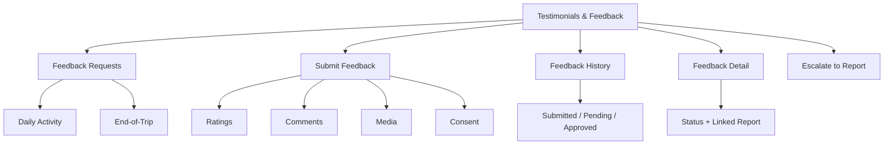
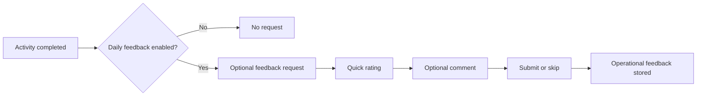
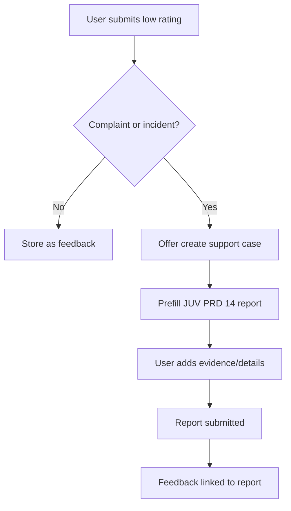
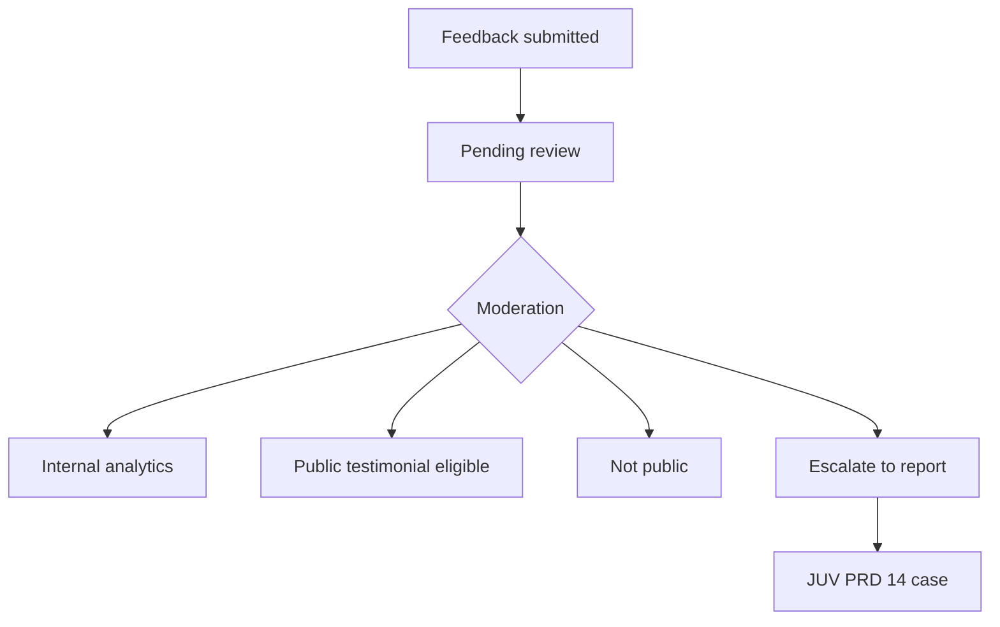

# JUV PRD 15 - Testimonials & Feedback

Product: UmrahHaji.com Jamaah/User View  
Module: Testimonials & Feedback  
Scope: Jamaah/User View / Daily Feedback, End-of-Trip Testimonial, Ratings, Consent, Moderation Status  
Platform: Mobile-first Responsive Web Platform  
Status: Draft  
Last Updated: 21 June 2026  

---

## 1. Objective

Testimonials & Feedback is the jamaah-facing feedback submission and tracking module. It allows jamaah to submit lightweight daily itinerary feedback, complete end-of-trip feedback, rate overall trip experience, rate Travel Agency service, rate assigned mutawwif service, provide optional comments/media, control public display consent, and track moderation or follow-up status.

This module must help jamaah answer:

1. When should I give feedback about my trip or activity?
2. What exactly am I rating: overall trip, Travel Agency, mutawwif, itinerary day, service, or package?
3. Can I submit quick feedback without writing a long comment?
4. Can I decide whether my testimonial may be displayed publicly?
5. What happens if my feedback contains a complaint or serious issue?
6. Can I upload media as part of a testimonial?
7. Can I submit anonymously while still keeping the platform protected from abuse?
8. Which feedback has been submitted, skipped, pending moderation, approved, hidden, or escalated?

This module is not a public publishing tool, not an Admin moderation queue, not a Travel Agency analytics dashboard, and not a report/case module. Jamaah submits feedback. Admin and Travel Agency surfaces moderate, analyze, respond, and escalate. Reports & Support handles complaints, incidents, disputes, and operational cases.

---

## 2. Relationship With Master PRD

This module follows the Jamaah/User View Master PRD:

1. Testimonials & Feedback is a P1 module.
2. It is triggered from My Group Trip, completed itinerary/activity milestones, completed group trip, notification requests, and account history.
3. It must support mobile-first quick submission, because jamaah may submit during travel or shortly after trip completion.
4. It must use the same account, booking, group trip, family/PIC, permission, and notification behavior as other Jamaah/User View modules.
5. It must integrate with Admin Testimonial Management, Travel Agency Testimonials, Mutawwif Ratings & Feedback, Reports & Support, Notifications & Announcements, My Group Trip, Checklist & Guidance, and future Documents/Account Settings modules.

---

## 3. Relationship With Admin, Travel Agency, Jamaah, and Mutawwif PRDs

| Source Module | Relationship |
| --- | --- |
| Admin Testimonial Management | Source of truth for moderation, public display consent, visibility, archive, analytics, export, and audit |
| Admin Report Management | Destination for complaint, incident, abuse, or low-rating escalation |
| Admin Group Trip Management | Provides trip completion, itinerary completion, package, trip, mutawwif, and participant context |
| Admin Travel Agency Management | Consumes approved public testimonial and rating summary for agency quality/profile where policy allows |
| Admin Mutawwif Management | Consumes moderated mutawwif rating and feedback summary where policy allows |
| Travel Agency Testimonials | Reviews agency-scoped feedback, public responses, internal notes, escalation, and analytics |
| Travel Agency Group Trip Management | Provides group trip and itinerary completion triggers |
| Travel Agency Mutawwif Assignment | Provides assigned mutawwif context for rating and feedback |
| Travel Agency Reports / Support | Receives escalated feedback complaints or incidents |
| MV PRD 15 - Ratings & Feedback | Receives moderated projection of jamaah feedback that is released to mutawwif |
| JUV PRD 06 - My Group Trip | Entry point and source context for trip/day/activity completion and feedback request |
| JUV PRD 13 - Notifications & Announcements | Sends feedback request, reminder, moderation, and escalation notifications |
| JUV PRD 14 - Reports & Support | Handles feedback that becomes complaint, case, dispute, or incident |

### 3.1 Key Sync Rule

Testimonials & Feedback is the jamaah submission surface, not the moderation or publishing owner.

Trip/Activity Completed -> Feedback Request -> Jamaah Submission -> Moderation / Review -> Visibility Release / Internal Analytics / Optional Report Escalation.

If moderation status changes, Jamaah View may show a status update, but it must not expose internal moderation notes, agency internal notes, mutawwif internal review, or admin scoring logic.

### 3.2 Cross-Role Boundary

| Role / Surface | Owns | Can Jamaah View Display? | PRD 15 Rule |
| --- | --- | --- | --- |
| Jamaah/User View | Feedback submission, consent, own submission history | Yes | Own and permitted family/group scope only |
| Admin Testimonial Management | Moderation, archive, public approval, visibility, audit | Yes, only user-facing moderation status | Do not expose internal review notes |
| Travel Agency Testimonials | Agency analytics, response, escalation, internal notes | Yes, only public/approved response if enabled | Do not expose internal notes |
| MV Ratings & Feedback | Mutawwif-facing rating projection | No direct access; only source relationship | Jamaah controls consent/privacy, not mutawwif visibility rules |
| Reports & Support | Complaint/incident case handling | Yes, linked case status | Feedback does not replace report case |

### 3.3 Feedback vs Testimonial vs Report

| Area | Feedback | Testimonial | Report / Support |
| --- | --- | --- | --- |
| Purpose | Service quality signal | Public/marketing eligible review | Operational issue/case |
| Timing | Daily or end-of-trip | Usually end-of-trip | Any time |
| Public use | No by default | Requires consent + moderation | No |
| Owner | Testimonial Management | Testimonial Management | Report Management |
| Jamaah action | Rate/comment/upload | Consent to public display | Submit case/evidence |

Rules:

1. Do not treat every feedback as a public testimonial.
2. Feedback becomes a public testimonial only when jamaah gives consent and moderation approves it.
3. Complaint-like feedback can be escalated to JUV PRD 14 without forcing public testimonial consent.
4. Tip/gratuity must remain separate from feedback and must not be conditioned on positive review.

---

## 4. Research Notes and Product Decisions

Feedback collection must balance service quality, user trust, privacy, and survey fatigue. Product decisions:

1. Daily itinerary feedback is optional and lightweight.
2. End-of-trip feedback is strongly prompted but voluntary.
3. If user chooses to submit feedback, at least one rating is required.
4. Written comment and media upload are optional.
5. Public display consent is required before using testimonial publicly.
6. Anonymous display can be supported, but internal audit reference remains stored.
7. Feedback should separate Overall Trip, Travel Agency, Mutawwif, and optional service/activity themes.
8. Low rating should not automatically become a penalty, refund, payout change, or mutawwif replacement.
9. Low rating with complaint content should offer escalation to Reports & Support.
10. Jamaah must be able to understand what will be private, internal, public, or anonymous.

Reference direction inherited from existing PRDs:

1. Admin Testimonial Management separates feedback, testimonial, and report.
2. TA PRD 12 defines daily feedback as optional to reduce survey fatigue.
3. MV PRD 15 receives only moderated feedback projection.
4. JUV PRD 13 provides notification and deep-link behavior.
5. JUV PRD 14 handles complaint/report escalation.

### 4.1 Review Integrity Rule

Feedback must be tied to verified booking, group trip, itinerary day, or activity participation. The module must not accept arbitrary public reviews for trips the user did not join.

### 4.2 Consent Rule

Public testimonial use requires explicit consent. Consent must be separate from submitting feedback. The user must be able to submit private/internal feedback without agreeing to public display.

### 4.3 Survey Fatigue Rule

The platform should avoid excessive feedback requests during active pilgrimage. Daily feedback reminders must be limited, optional, and easy to skip.

---

## 5. Scope

### 5.1 In Scope for Phase 1

1. Feedback request card from My Group Trip and Notifications.
2. Daily itinerary/activity feedback form.
3. End-of-trip testimonial form.
4. Overall trip rating.
5. Travel Agency rating.
6. Mutawwif rating.
7. Optional package/service/theme rating.
8. Optional written comment.
9. Optional media upload.
10. Public display consent.
11. Anonymous display preference where policy allows.
12. Submission confirmation.
13. Own feedback history.
14. Moderation/status labels: Submitted, Pending Review, Approved, Hidden, Flagged, Escalated, Archived.
15. Low rating follow-up prompt.
16. Escalate to JUV PRD 14 Reports & Support.
17. Feedback request reminder through JUV PRD 13.
18. Empty, loading, error, offline draft, and upload failure states.
19. Audit logs for submission, consent, media upload, edit window, delete/request removal, and escalation.
20. Mobile-first responsive behavior.

### 5.2 In Scope for Phase 2

1. Edit submission within short policy window.
2. Withdraw public display consent.
3. Feedback draft autosave.
4. Multi-language feedback form.
5. Voice/video testimonial if storage/security policy allows.
6. Feedback response from Travel Agency visible to jamaah.
7. AI-assisted prompt suggestions for clearer feedback, with user control.
8. Public testimonial preview before consent.
9. Family/PIC group feedback summary.
10. Detailed sentiment/theme confirmation by user.

### 5.3 Out of Scope

1. Admin moderation queue.
2. Travel Agency analytics dashboard.
3. Mutawwif rating dashboard.
4. Editing submitted feedback after policy window.
5. Public testimonial publishing workflow.
6. Marketing campaign management.
7. Incentivized review campaigns.
8. Tip/gratuity processing.
9. Refund approval.
10. Support case resolution.
11. Automatic agency/mutawwif penalty.
12. External Google review sync.
13. AI moderation decisioning for launch.
14. Public review browsing.

---

## 6. User Roles and Access

| Role | Access Behavior |
| --- | --- |
| Public visitor | Cannot submit trip feedback; may see public testimonials elsewhere if enabled |
| Registered user without booking | Cannot submit trip feedback; may submit platform/account feedback only if separate policy enables |
| Jamaah with active trip | Can submit daily/activity feedback for completed eligible activities |
| Jamaah with completed trip | Can submit end-of-trip testimonial within policy window |
| Family PIC | Can submit own feedback and may submit family/group summary only if policy allows |
| Non-PIC family member | Can submit own feedback for own participation |
| Cancelled booking user | No trip testimonial unless service/cancellation feedback is specifically enabled |
| Completed trip jamaah | Can view own feedback history and moderation status |
| Suspended/locked account | May be read-only or blocked based on Admin User Management policy |
| Admin | Moderates from Admin Panel, not this module |
| Travel Agency staff | Reviews/responds from TA Portal, not this module |
| Mutawwif | Views released projection in MV PRD 15, not this module |

### 6.1 Visibility Rules

Jamaah can see:

1. Own feedback requests.
2. Own submitted feedback history.
3. Own rating/comment/media submission.
4. Public display consent status.
5. User-facing moderation status.
6. Linked report status if escalated.
7. Travel Agency public response if enabled and moderated.

Jamaah must not see:

1. Other jamaah feedback.
2. Internal Admin moderation notes.
3. Travel Agency internal notes.
4. Mutawwif internal response or dispute details unless intentionally shared.
5. Rating aggregation formulas that expose other users.
6. Hidden moderation labels that could reveal abuse/fraud logic.
7. Media uploaded by other users.

### 6.2 Action Permission Rules

| Action | Public | Registered No Booking | Active/Completed Trip Jamaah | Family PIC | Admin/TA/Mutawwif |
| --- | --- | --- | --- | --- | --- |
| View feedback request | No | No | Own eligible requests | Own/family if allowed | No, use own portal |
| Submit daily feedback | No | No | Own eligible activity | Own/family if allowed | No |
| Submit end-trip testimonial | No | No | Own completed trip | Own/family if allowed | No |
| Upload media | No | No | Own submission | Own/family if allowed | No |
| Give public consent | No | No | Own submission | Own/family only if legally/policy allowed | No |
| Escalate to report | No | Limited | Yes | Yes if allowed | No |
| Moderate/publish | No | No | No | No | Admin/TA portal only |

---

## 7. Entry Points

| Entry Point | Behavior |
| --- | --- |
| JUV PRD 13 notification | Opens feedback request or submitted feedback detail |
| My Group Trip completed activity | Opens daily/activity feedback |
| My Group Trip completed trip | Opens end-of-trip testimonial |
| Checklist & Guidance post-trip task | Opens end-of-trip reflection/feedback prompt |
| Account > Feedback History | Opens own feedback history |
| Reports & Support | Opens linked case when feedback was escalated |
| Travel Agency public profile | May show approved public testimonials, not submission form |

---

## 8. Information Architecture

```text
Testimonials & Feedback
├── Feedback Requests
│   ├── Daily Activity Feedback
│   ├── End-of-Trip Testimonial
│   └── Reminder / Expired Requests
├── Submit Feedback
│   ├── Rating Sections
│   ├── Comments
│   ├── Media Upload
│   ├── Public Display Consent
│   └── Review & Submit
├── Feedback History
│   ├── Submitted
│   ├── Pending Review
│   ├── Approved
│   ├── Hidden / Flagged
│   ├── Escalated
│   └── Archived
├── Feedback Detail
│   ├── Submitted Content
│   ├── Moderation Status
│   ├── Consent Status
│   ├── Linked Report
│   └── Public Response
└── Escalate to Report
    ├── Low Rating Follow-Up
    ├── Complaint Context
    └── JUV PRD 14 Handoff
```



---

## 9. Feedback Model

### 9.1 Feedback Types

| Type | Trigger | Purpose | Public Eligible |
| --- | --- | --- | --- |
| Daily Activity Feedback | Activity/day completed | Operational signal | No by default |
| End-of-Trip Feedback | Group trip completed | Overall quality and service review | Yes with consent/moderation |
| Mutawwif Rating | End trip or activity where mutawwif served | Mutawwif service quality | Summary projection only |
| Travel Agency Rating | End trip | Agency service quality | Yes with consent/moderation |
| Package/Trip Rating | End trip | Package/trip experience | Yes with consent/moderation |
| Service Feedback | Document, hotel, flight, transport, room, briefing | Service improvement | Usually internal |
| Complaint Feedback | Low rating or issue text | Potential support case | No, route to report |

### 9.2 Rating Dimensions

| Rating Dimension | Applies To | Required |
| --- | --- | --- |
| Overall Trip | End-of-trip | Yes |
| Travel Agency Service | End-of-trip | Yes |
| Mutawwif Guidance | End-of-trip if assigned | Yes if mutawwif served |
| Itinerary / Activity | Daily feedback | Yes if daily form submitted |
| Hotel / Transport / Flight / Room | End-of-trip service section | Optional |
| Recommendation | End-of-trip | Optional in Phase 1 |

### 9.3 Status Model

| Status | Meaning | User-Facing Behavior |
| --- | --- | --- |
| Request Available | User can submit feedback | Show CTA |
| Draft | User started but not submitted | Show resume if draft supported |
| Submitted | Feedback received | Show confirmation |
| Pending Review | Awaiting moderation/review | Show status |
| Approved Internal | Available for internal analytics | Show status |
| Approved Public | Eligible for public display | Show consent/public status |
| Hidden | Not displayed publicly or to target role | Show safe status |
| Flagged | Needs review due to content/risk | Show safe pending/review wording |
| Escalated | Linked to report/support case | Show report link |
| Archived | Retained but not active | Show history state |
| Expired | Request window ended | Show expired request |

---

## 10. User Flows

### 10.1 End-of-Trip Feedback Flow

```mermaid
flowchart LR
    A["Group trip completed"] --> B["Create feedback request"]
    B --> C["JUV PRD 13 notification"]
    C --> D["Jamaah opens form"]
    D --> E["Rate trip, agency, mutawwif"]
    E --> F["Add comments/media"]
    F --> G["Choose public consent"]
    G --> H["Review + submit"]
    H --> I["Pending review"]
    I --> J["Admin/TA moderation"]
    J --> K["Approved / hidden / escalated"]
```



### 10.2 Daily Activity Feedback Flow



### 10.3 Low Rating Escalation Flow



---

## 11. Screens and Components

### 11.1 Feedback Request Card

Required content:

1. Request type: Daily Feedback or End-of-Trip Testimonial.
2. Related context: trip, activity, package, Travel Agency, mutawwif.
3. Due/expiry date if configured.
4. Status: Available, Submitted, Skipped, Expired.
5. Primary CTA: `Give Feedback`.
6. Secondary action: `Skip` if allowed.

### 11.2 Daily Activity Feedback Form

Required fields:

1. Activity/day label.
2. Quick rating.
3. Optional comment.
4. Optional issue toggle: `I need help with this`.
5. Submit button.
6. Skip button if request is optional.

Rules:

1. Daily feedback should take less than one minute.
2. Daily feedback must not block itinerary access.
3. User should not receive more than one daily reminder per day.
4. Complaint toggle should route to Reports & Support.

### 11.3 End-of-Trip Testimonial Form

Required sections:

1. Overall Trip Rating.
2. Travel Agency Rating.
3. Mutawwif Rating if applicable.
4. Optional service ratings.
5. Written testimonial/comment.
6. Media upload.
7. Public display consent.
8. Anonymous display preference where allowed.
9. Review and submit.

### 11.4 Consent Section

Required copy behavior:

1. Explain that feedback may be used internally without public display.
2. Public display consent must be explicit.
3. Media consent must be explicit if media may be displayed.
4. Anonymous display preference must explain that internal audit still stores the submitter reference.
5. Consent should be changeable only according to platform policy.

### 11.5 Feedback History

Required content:

1. Submitted feedback cards.
2. Filter by trip, type, status, and date.
3. Status label.
4. Consent label.
5. Linked report label if escalated.
6. Detail view action.

### 11.6 Feedback Detail

Required sections:

1. Submitted rating(s).
2. Submitted comments.
3. Media attachments.
4. Related trip/activity context.
5. Consent status.
6. Moderation/status label.
7. Linked Reports & Support case if applicable.
8. Travel Agency public response if enabled.

---

## 12. Data and Field Requirements

### 12.1 FeedbackRequest

| Field | Required | Notes |
| --- | --- | --- |
| feedback_request_id | Yes | Unique request |
| user_id | Yes | Recipient jamaah |
| booking_id | Conditional | Booking context |
| group_trip_id | Conditional | Trip context |
| itinerary_activity_id | Conditional | Daily/activity context |
| travel_agency_id | Conditional | Agency context |
| mutawwif_id | Conditional | Assigned mutawwif context |
| request_type | Yes | DailyActivity, EndOfTrip |
| status | Yes | Available, Submitted, Skipped, Expired |
| available_at | Yes | Request start |
| expires_at | Optional | Submission deadline |
| notification_id | Optional | JUV PRD 13 link |

### 12.2 FeedbackSubmission

| Field | Required | Notes |
| --- | --- | --- |
| feedback_id | Yes | Unique feedback |
| feedback_reference | Yes | User-facing reference |
| feedback_request_id | Yes | Source request |
| submitted_by_user_id | Yes | Jamaah |
| family_group_id | Conditional | Family/group scope |
| booking_id | Conditional | Booking context |
| group_trip_id | Conditional | Trip context |
| feedback_type | Yes | Daily, EndOfTrip, Service |
| rating_overall | Conditional | Required for end trip |
| rating_agency | Conditional | Required for end trip |
| rating_mutawwif | Conditional | Required if mutawwif served |
| rating_activity | Conditional | Required for daily |
| comment_text | Optional | User comment |
| recommendation | Optional | Yes/No/Maybe |
| anonymous_display | Optional | Display preference |
| public_display_consent | Yes | Boolean |
| media_public_consent | Conditional | Required for public media |
| moderation_status | Yes | Pending, Approved, Hidden, Flagged, Archived |
| linked_report_id | Optional | JUV PRD 14 report |
| submitted_at | Yes | Timestamp |
| updated_at | Yes | Timestamp |

### 12.3 FeedbackMedia

| Field | Required | Notes |
| --- | --- | --- |
| media_id | Yes | Unique media |
| feedback_id | Yes | Parent feedback |
| uploaded_by_user_id | Yes | Uploader |
| original_filename | Yes | Stored separately |
| safe_filename | Yes | Generated filename |
| file_type | Yes | Validated type |
| file_size | Yes | Size limit |
| scan_status | Yes | Pending, clean, rejected, quarantined |
| public_consent | Yes | Whether user allows public use |
| moderation_status | Yes | Pending, approved, hidden |
| created_at | Yes | Timestamp |

### 12.4 FeedbackAuditEvent

| Field | Required | Notes |
| --- | --- | --- |
| audit_id | Yes | Unique audit |
| feedback_id | Conditional | Feedback reference |
| feedback_request_id | Conditional | Request reference |
| actor_user_id | Yes | User/system/admin |
| actor_type | Yes | Jamaah, Admin, Travel Agency, System |
| action | Yes | Create, submit, consent_change, upload, escalate, view |
| timestamp | Yes | Event timestamp |
| result | Yes | Success/failure |

---

## 13. Permission Logic

### 13.1 Permission Chain

Every request must validate:

1. Authenticated user.
2. Account status.
3. Booking/trip participation.
4. Family/group permission.
5. Feedback request eligibility.
6. Submission window.
7. Attachment/media permission.
8. Consent authority.

### 13.2 Data Scope Rules

1. User can submit feedback only for eligible own booking/trip/activity.
2. Family PIC can submit group/family summary only where explicitly allowed.
3. Non-PIC member submits own feedback only.
4. Feedback history is scoped to own submissions.
5. Public display consent belongs to the submitter or legally/policy-approved guardian/PIC.
6. Moderation status shown to user must be simplified and safe.
7. User cannot see internal moderation or agency notes.

### 13.3 Privacy and Identity Rules

| Data Type | Default Visibility |
| --- | --- |
| User identity to public | Hidden unless public consent allows display |
| User identity to Admin | Visible by permission |
| User identity to Travel Agency | Visible by policy/permission, anonymous where configured |
| User identity to Mutawwif | Hidden by default |
| Written feedback | Internal until moderated |
| Media | Private until consent + moderation |
| Daily feedback | Internal operational signal by default |
| End-trip testimonial | Internal unless consent + moderation |

---

## 14. Media Upload Policy

### 14.1 Supported Media

Phase 1:

1. JPG/JPEG.
2. PNG.
3. PDF for testimonial evidence if allowed.

Phase 2:

1. Video testimonial.
2. Audio/voice note.
3. HEIC conversion support.

### 14.2 Media Rules

1. Media upload is optional.
2. File type must be allowlisted.
3. File size must be limited.
4. Filename must be sanitized and replaced with safe filename.
5. File must be scanned before review/display.
6. Public media display requires explicit media consent.
7. Faces, children/minors, medical documents, passport/IC, and private hotel/room imagery require stricter moderation.
8. Rejected/quarantined files must not be displayed or downloadable.
9. Metadata should be stripped where possible.

---

## 15. Moderation and Visibility

### 15.1 Moderation Status

| Status | Meaning | Jamaah-Facing Copy Direction |
| --- | --- | --- |
| Pending Review | Submitted and waiting for review | Your feedback is being reviewed |
| Approved Internal | Accepted for internal quality review | Your feedback has been received |
| Approved Public | Approved for public use based on consent | Your testimonial may be displayed |
| Hidden | Not displayed publicly | Your feedback is not public |
| Flagged | Requires additional review | Your feedback is under review |
| Escalated | Linked to support/report case | This feedback is linked to a support case |
| Archived | Retained in history | Archived |

### 15.2 Visibility Rules

1. Daily feedback is internal by default.
2. End-trip feedback may become public only with consent and moderation.
3. Low rating remains valid internally even if hidden from public display.
4. Mutawwif sees only moderated released projection in MV PRD 15.
5. Travel Agency sees agency-scoped feedback based on TA PRD 12 permissions.
6. Admin sees/moderates based on Admin Testimonial Management permissions.

### 15.3 Moderation Flow



---

## 16. Notifications

Testimonials & Feedback uses JUV PRD 13 for notification delivery.

Notification events:

1. Daily feedback request available.
2. End-of-trip feedback request available.
3. Feedback reminder.
4. Feedback submitted.
5. Moderation/status update if user-facing.
6. Feedback escalated to report.
7. Travel Agency public response available if enabled.
8. Public consent status changed if Phase 2 supports changes.

Notification rules:

1. Feedback request notifications should not be excessive.
2. Daily reminders must be capped.
3. End-of-trip reminder may repeat only within policy limit.
4. Notification previews must not show sensitive feedback text.
5. Deep links must re-check permission and eligibility.

---

## 17. Business Rules

1. Feedback request is generated only for verified eligible participation.
2. Daily feedback is optional.
3. End-of-trip feedback is strongly prompted but optional.
4. Submitted feedback requires at least one applicable rating.
5. Public display consent is separate from feedback submission.
6. User can submit private/internal feedback without public consent.
7. Anonymous display does not remove internal audit trace.
8. Low rating does not automatically create penalty, refund, or assignment action.
9. Complaint content can create/report handoff to JUV PRD 14.
10. Media requires upload validation and moderation.
11. Feedback must be retained based on platform policy.
12. User cannot submit duplicate feedback for the same request unless policy allows update/edit window.
13. Feedback cannot be edited after moderation unless policy defines correction/replacement flow.
14. Tips/gratuity must remain separate from rating and testimonial.

---

## 18. UI State Requirements

| State | Behavior |
| --- | --- |
| No feedback request | Show no pending feedback |
| Request available | Show CTA and expiry if any |
| Request expired | Show expired state |
| Draft | Resume if draft/autosave enabled |
| Submission success | Show confirmation and history link |
| Submission failure | Preserve input and allow retry |
| Upload progress | Show progress and allow cancel where possible |
| Upload rejected | Show safe reason and next step |
| Offline | Allow read-only history and optional local draft if Phase 2 |
| Pending review | Show safe review status |
| Escalated | Show linked report case |
| Consent missing | Keep private/internal only |

---

## 19. Security, Privacy, and Compliance

### 19.1 Security Requirements

1. All submit, upload, consent, history, and detail endpoints must validate ownership and eligibility.
2. Feedback request tokens must not allow unauthorized submission.
3. Media URLs must be permission-checked or short-lived.
4. Public consent changes must be audited.
5. Form fields must be sanitized.
6. Abuse/spam rate limits must apply.
7. Submission source must be logged.

### 19.2 Privacy Requirements

1. Collect minimum necessary data.
2. Explain public display consent clearly.
3. Hide jamaah identity from public unless consent/policy allows display.
4. Hide jamaah identity from mutawwif by default.
5. Strip or moderate sensitive media metadata where possible.
6. Do not expose other users' feedback in history.
7. Do not show internal moderation/agency notes.
8. Analytics must not include raw private comments unless access-controlled.

### 19.3 Review Integrity Requirements

1. Feedback must be tied to verified participation.
2. Duplicate submissions must be controlled.
3. Incentivized positive reviews are not supported in Phase 1.
4. Admin/TA cannot edit user feedback text.
5. Hidden feedback may still count internally based on policy.
6. Public rating calculations must follow moderation and consent rules.

---

## 20. Audit and Activity Logs

Audit events:

1. Feedback request created.
2. Feedback request opened.
3. Feedback submitted.
4. Feedback skipped.
5. Media uploaded.
6. Media rejected/quarantined.
7. Public display consent granted.
8. Public display consent withdrawn if supported.
9. Feedback escalated to report.
10. Moderation status changed.
11. Feedback detail viewed.

### 20.1 Audit Fields

| Field | Description |
| --- | --- |
| actor_user_id | User/admin/system actor |
| actor_type | Jamaah, Admin, Travel Agency, System |
| feedback_id | Feedback identifier |
| feedback_request_id | Request identifier |
| action | Opened, submitted, consented, uploaded, escalated, moderated |
| source_module | Trip, Activity, Notification, Report |
| timestamp | Event timestamp |
| session_id | Session metadata |
| result | Success/failure |

---

## 21. Analytics and Monitoring

### 21.1 Product Analytics

| Event | Trigger | Purpose |
| --- | --- | --- |
| juv_feedback_request_opened | User opens request | Measure engagement |
| juv_feedback_daily_started | Daily form started | Measure daily feedback friction |
| juv_feedback_end_trip_started | End-trip form started | Measure completion funnel |
| juv_feedback_submitted | Feedback submitted | Measure submission rate |
| juv_feedback_skipped | User skips request | Measure fatigue |
| juv_feedback_media_uploaded | Media uploaded | Measure media usage |
| juv_feedback_public_consent_given | Consent granted | Measure public testimonial pool |
| juv_feedback_escalated_report | Feedback linked to report | Measure complaint path |
| juv_feedback_history_opened | User opens history | Measure status checking |

### 21.2 Operational Monitoring

1. Feedback request creation failures.
2. Notification delivery failures.
3. Submission failure rate.
4. Upload failure rate.
5. Media scan failure rate.
6. Low-rating escalation rate.
7. Skip rate by request type.
8. Public consent rate.
9. Moderation backlog age.

Analytics must not include raw private comment, media content, passport/identity data, payment data, internal moderation notes, or other sensitive content.

---

## 22. Functional Requirements

### 22.1 Feedback Requests

| ID | Requirement | Priority |
| --- | --- | --- |
| JUV-FDB-001 | System can show eligible feedback requests to jamaah | P1 |
| JUV-FDB-002 | User can open request from notification or trip detail | P1 |
| JUV-FDB-003 | User can skip optional daily feedback where policy allows | P1 |
| JUV-FDB-004 | Expired requests show expired state | P1 |

### 22.2 Submission

| ID | Requirement | Priority |
| --- | --- | --- |
| JUV-FDB-010 | User can submit daily activity feedback | P1 |
| JUV-FDB-011 | User can submit end-of-trip feedback | P1 |
| JUV-FDB-012 | End-trip form supports overall, agency, and mutawwif rating | P1 |
| JUV-FDB-013 | User can add optional comment | P1 |
| JUV-FDB-014 | User can upload optional media if enabled | P1 |
| JUV-FDB-015 | User can submit feedback without public consent | P1 |
| JUV-FDB-016 | User can grant public display consent | P1 |

### 22.3 History and Status

| ID | Requirement | Priority |
| --- | --- | --- |
| JUV-FDB-020 | User can view own feedback history | P1 |
| JUV-FDB-021 | User can see simplified moderation/status labels | P1 |
| JUV-FDB-022 | User can open feedback detail | P1 |
| JUV-FDB-023 | Linked report status appears when escalated | P1 |

### 22.4 Escalation

| ID | Requirement | Priority |
| --- | --- | --- |
| JUV-FDB-030 | Low rating can prompt support escalation | P1 |
| JUV-FDB-031 | Escalation opens JUV PRD 14 with feedback context | P1 |
| JUV-FDB-032 | Feedback detail links to report if created | P1 |

### 22.5 Notifications and Privacy

| ID | Requirement | Priority |
| --- | --- | --- |
| JUV-FDB-040 | Feedback request notifications use JUV PRD 13 | P1 |
| JUV-FDB-041 | Notification deep links revalidate permission | P1 |
| JUV-FDB-042 | Public display requires explicit consent | P1 |
| JUV-FDB-043 | Internal moderation notes are hidden from jamaah | P1 |

---

## 23. Acceptance Criteria

1. Jamaah can open feedback request from notification.
2. Jamaah can open feedback request from My Group Trip.
3. Daily feedback is optional and quick.
4. End-of-trip form supports Overall Trip, Travel Agency, and Mutawwif rating.
5. User can submit feedback without written comment.
6. User can submit feedback without public display consent.
7. Public display consent is explicit and separate.
8. User can upload media if enabled.
9. Media upload validates file type, size, scan status, and consent.
10. User can view own feedback history.
11. User sees safe moderation/status label.
12. Internal Admin/TA notes are hidden.
13. Mutawwif identity/rating context is captured only when mutawwif served.
14. Low rating can hand off to Reports & Support.
15. Linked report appears in feedback detail.
16. Feedback request reminders follow JUV PRD 13.
17. Notification previews do not expose sensitive feedback text.
18. Family/PIC behavior follows permission rules.
19. Duplicate submission is prevented for same request unless policy allows edit/update.
20. Cross-role ownership is clear: Jamaah submits, Admin/TA moderate/analyze/respond, Mutawwif sees only released projection.

---

## 24. Dependencies

1. Admin Testimonial Management.
2. Admin Report Management.
3. Admin Group Trip Management.
4. Admin Travel Agency Management.
5. Admin Mutawwif Management.
6. Travel Agency PRD 12 - Testimonials.
7. Travel Agency PRD 07 - Group Trip Management.
8. Travel Agency PRD 08 - Mutawwif Assignment.
9. Travel Agency PRD 11 - Reports / Support.
10. MV PRD 15 - Ratings & Feedback.
11. JUV PRD 06 - My Group Trip.
12. JUV PRD 12 - Checklist & Guidance.
13. JUV PRD 13 - Notifications & Announcements.
14. JUV PRD 14 - Reports & Support.
15. Future JUV PRD 17 - Documents & Service Readiness.
16. Future JUV PRD 18 - Account Settings & Security.
17. File/media upload and scanning service.
18. Audit logging service.
19. Notification delivery service.

---

## 25. Risks and Mitigations

| Risk | Impact | Mitigation |
| --- | --- | --- |
| Survey fatigue | Low completion and annoyance | Optional daily feedback, capped reminders |
| Public consent confusion | Privacy/trust issue | Separate explicit consent from submission |
| Negative review manipulation | Trust issue | Verified participation, moderation, audit |
| Low rating treated as automatic penalty | Unfair governance | Separate feedback from disciplinary/report workflows |
| Media privacy exposure | Compliance issue | Strict consent, moderation, scanning, metadata controls |
| Feedback used as support case without context | Poor resolution | Handoff to JUV PRD 14 with context snapshot |
| Mutawwif sees private identity | Privacy issue | MV PRD 15 receives moderated anonymous projection by default |

---

## 26. Release Plan

### 26.1 Phase 1 Release

Deliver:

1. Feedback request card.
2. Daily activity feedback.
3. End-of-trip testimonial.
4. Rating sections.
5. Comment and media upload.
6. Public display consent.
7. Feedback history and detail.
8. Low-rating escalation to Reports.
9. Notification integration.
10. Audit events.

### 26.2 Phase 1 Rollout Checks

1. Group trip completion creates end-trip request.
2. Activity completion can create daily request where enabled.
3. JUV PRD 13 notification opens feedback form.
4. Admin Testimonial Management receives submission.
5. TA Testimonials receives agency-scoped feedback.
6. MV PRD 15 receives only moderated released projection.
7. JUV PRD 14 receives escalation when user creates report.
8. Public consent and media consent are stored separately.

### 26.3 Phase 2 Candidate Enhancements

1. Edit window.
2. Consent withdrawal flow.
3. Draft autosave.
4. Multi-language forms.
5. Travel Agency public response.
6. Voice/video testimonial.
7. Public testimonial preview.
8. Family/group feedback summary.

---

## 27. QA Checklist

### 27.1 Functional QA

1. Submit daily feedback.
2. Skip daily feedback.
3. Submit end-trip feedback.
4. Submit with and without comment.
5. Submit with and without media.
6. Grant public display consent.
7. Submit private-only feedback.
8. View feedback history.
9. Open feedback detail.
10. Escalate low rating to report.

### 27.2 Permission QA

1. User cannot submit feedback for unowned trip.
2. Non-PIC cannot submit family member feedback unless allowed.
3. Family PIC policy is enforced.
4. Suspended/locked account policy is enforced.
5. Other users' feedback is hidden.
6. Internal moderation notes are hidden.

### 27.3 Integration QA

1. Notification request deep link opens form.
2. Admin receives submission.
3. TA receives agency-scoped feedback.
4. Mutawwif receives only moderated projection.
5. Low rating report handoff includes context.
6. Feedback history updates after moderation status change.

### 27.4 Accessibility QA

1. Rating controls are keyboard and screen-reader usable.
2. Submission success is announced.
3. Upload progress/errors are announced.
4. Consent choices are clear and accessible.
5. Touch targets are comfortable on mobile.
6. Error messages are specific and recoverable.

---

## 28. Open Questions

1. Should Family PIC be allowed to submit one family-level testimonial in Phase 1?
2. Should daily activity feedback be enabled by default or per agency/trip setting?
3. What is the default end-of-trip feedback expiry window?
4. Should users be able to edit feedback before moderation?
5. Should users be able to withdraw public consent after approval?
6. Should Travel Agency public response be visible in Phase 1?
7. Which media types and size limits are approved for launch?
8. Should low rating automatically offer report creation or only when complaint text is present?

---

## 29. Future Enhancements

1. Feedback edit window.
2. Public consent withdrawal.
3. Draft autosave.
4. Voice/video testimonial.
5. Multi-language forms.
6. Agency public response.
7. Public testimonial preview.
8. Smart help article suggestion after low rating.
9. Family/group summary.
10. Theme tagging and user-confirmed sentiment.
11. External review handoff only after internal consent and moderation policy.

---

## 30. Final Product Decision

JUV PRD 15 - Testimonials & Feedback must be implemented as the jamaah-facing feedback submission and consent module. It must synchronize with Admin Testimonial Management, TA PRD 12 Testimonials, MV PRD 15 Ratings & Feedback, JUV PRD 13 Notifications, JUV PRD 14 Reports & Support, and JUV PRD 06 My Group Trip.

The key product rule is that Jamaah/User View collects verified user feedback and explicit consent, while Admin and Travel Agency surfaces own moderation, analytics, response, and publishing decisions. Mutawwif receives only safe, moderated, scoped projection.

This PRD should be built after JUV PRD 13 and JUV PRD 14 because feedback requests require notifications, and complaint-like feedback needs a reliable report/support handoff.
