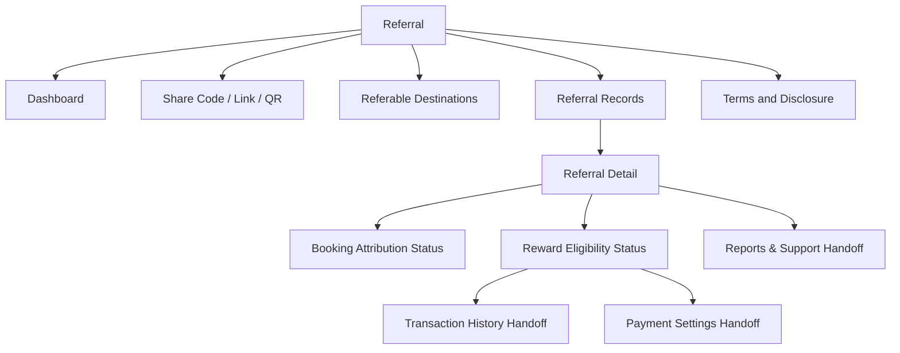
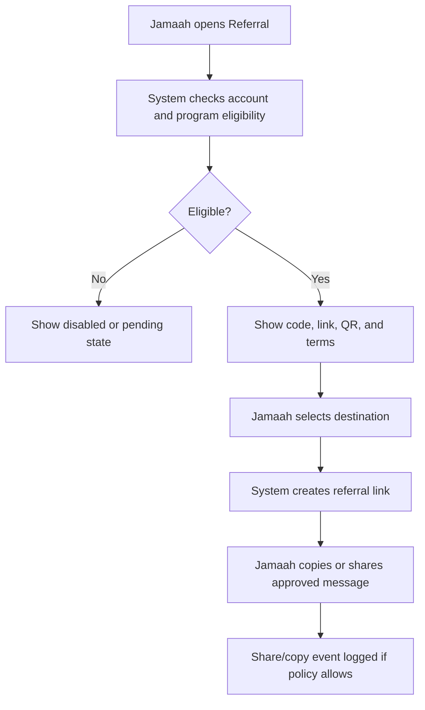
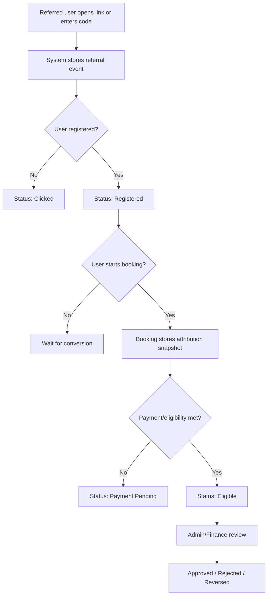
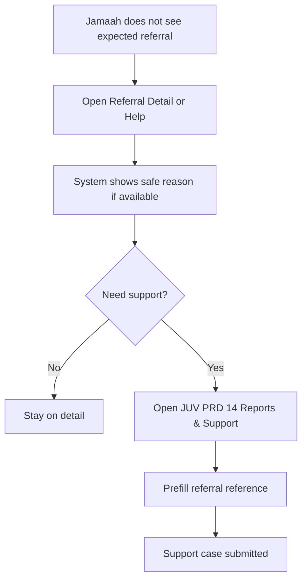

# JUV PRD 16 - Referral

Product: UmrahHaji.com Jamaah/User View  
Module: Referral  
Scope: Jamaah/User View / Referral Code, Link Sharing, Attribution Tracking, Reward Eligibility  
Platform: Mobile-first Responsive Web Platform  
Status: Draft  
Last Updated: 21 June 2026  

---

## 1. Objective

Referral is the jamaah-facing module for sharing an approved UmrahHaji.com referral code or referral link, inviting family/friends to discover packages or register, tracking referral progress, and understanding reward eligibility without exposing sensitive booking, payment, finance, or personal data.

This module must help jamaah answer:

1. What referral code or link can I share?
2. Where does my referral link send people: homepage, package, Travel Agency profile, campaign, or registration?
3. What disclosure should I include if a reward, voucher, discount, credit, or other benefit may apply?
4. Who has used my referral link or code, in a privacy-safe way?
5. Which referrals are only clicks, which became registrations, which became bookings, and which are eligible for reward?
6. Why is a referral pending, rejected, expired, reversed, or not eligible?
7. What reward can I see safely before Finance/Admin approval?
8. Where do payout destination, withdrawal, voucher credit, and final reward release live?

Referral is not a booking editor, not a payment module, not a finance payout module, not an influencer campaign workspace, and not a guaranteed income feature. It is a transparent acquisition and attribution surface for jamaah.

---

## 2. Relationship With Master PRD

This module follows the Jamaah/User View Master PRD:

1. Referral is a P1 module for basic referral code/link tracking.
2. Advanced Referral Rewards remain P2 until finance, reward, withdrawal, and campaign rules are confirmed.
3. Referral is available from Profile/Menu and can appear as a Home card or package detail share action when enabled.
4. Referral must use the same account, family/PIC, booking, transaction, payment settings, notification, and support behavior as other Jamaah/User View modules.
5. Referral attribution must be synchronized with Package Discovery, Booking Flow, Billing/Payment, Admin Finance, Travel Agency settings, Transaction History, Notifications, and Reports & Support.
6. Finance/Admin must audit referral attribution before reward release.
7. Reward payout, wallet credit, withdrawal, or payment destination management is Phase 2 unless finance rules are confirmed for launch.

---

## 3. Relationship With Admin, Travel Agency, Jamaah, and Mutawwif PRDs

| Source Module | Relationship |
| --- | --- |
| Admin User Management | Controls account status, role, permission, suspension, and sensitive access |
| Admin Package Management | Source of public packages that can be referred |
| Admin Travel Agency Management | Source of agency eligibility, agency policy, and public agency profile |
| Admin Booking Management | Source of booking conversion, booking status, duplicate booking, cancellation, and correction |
| Admin Billing & Payment Management | Source of payment status used for reward eligibility; payment detail is not exposed here |
| Admin Finance Management | Owns reward validation, approval, reversal, payout preparation, and finance audit |
| Admin Reports / Audit | Reviews suspicious referral activity, support escalation, disputes, and override history |
| Travel Agency Package Management | Controls agency package availability and referral-enabled package participation |
| Travel Agency Booking Management | Provides agency-owned booking state that may drive referral eligibility |
| Travel Agency Settings | Enables/disables agency referral campaigns, terms, destinations, and reward labels if delegated |
| JUV PRD 04 - Package Discovery | Destination for referral links and package-specific sharing |
| JUV PRD 05 - Booking Flow | Captures referral code/link attribution during booking |
| JUV PRD 07 - Transaction History & Receipts | Shows referral earning/withdrawal records only after finance release |
| JUV PRD 08 - Payment Settings | Manages payout/refund destination only when Finance/Referral enables it |
| JUV PRD 13 - Notifications & Announcements | Sends referral converted, reward status, policy update, and expiry notifications |
| JUV PRD 14 - Reports & Support | Handles referral issue, dispute, fraud concern, or missing attribution support case |
| MV PRD 07 - Referral | Parallel referral module for mutawwif with stricter professional/assignment eligibility |

### 3.1 Key Sync Rule

Referral reads from referral attribution and booking/payment eligibility snapshots.

Referral Code/Link -> Package/Profile/Registration Entry -> Referral Event -> Booking Attribution Snapshot -> Payment Eligibility Snapshot -> Finance Reward Validation -> User-Facing Referral Status / Transaction History.

Changing package, booking, payment, finance, or campaign data must not silently rewrite historical referral attribution. Corrections require Admin/Finance permission, reason, and audit log.

### 3.2 Cross-Role Boundary

| Role / Surface | Owns | Can Jamaah View Display? | PRD 16 Rule |
| --- | --- | --- | --- |
| Jamaah/User View | Own referral code/link, sharing, own referral history, reward eligibility status | Yes | Own account and permitted family/PIC scope only |
| Admin Panel | Global referral rules, fraud review, finance validation, correction, audit | Yes, as safe status only | Do not expose fraud score, internal notes, or override tools |
| Travel Agency Portal | Agency campaign participation, package eligibility, agency terms | Yes, released campaign/package summary only | Do not let jamaah edit campaign terms |
| Booking Flow | Referral code capture and attribution snapshot | Yes, as entered/applied state | Do not allow post-payment silent edits |
| Finance / Payment Settings | Reward approval, payout, withdrawal, destination, reversal | Limited status only | PRD 16 does not approve or execute payout |
| Mutawwif View | Mutawwif referral sharing and tracking | No direct access | Keep jamaah and mutawwif referral ledgers separate |

### 3.3 Referral vs Voucher vs Reward vs Withdrawal

| Area | Referral | Voucher / Discount | Reward / Credit | Withdrawal / Payout |
| --- | --- | --- | --- | --- |
| Purpose | Attribution and invitation | Booking price benefit | Benefit earned after rules met | Money/credit release |
| Owner | Referral rules + Booking attribution | Promotion/Package/Booking | Finance/Referral | Finance/Payment Settings |
| Jamaah action | Share link/code, track status | Apply if eligible | View status if released | Manage destination only if enabled |
| P1 rule | Yes | Only if existing promo supports it | Status only | No execution |

Rules:

1. Referral code must not automatically create discount unless campaign explicitly defines it.
2. Referral reward must not be shown as final until Finance/Admin approves or releases it.
3. Referral earning and withdrawal records must be synchronized with Transaction History when enabled.
4. Payment destination and withdrawal method must remain in Payment Settings / Finance flow.

---

## 4. Research Notes and Product Decisions

Referral touches marketing, privacy, trust, reward expectations, and finance-adjacent attribution. Product decisions:

1. Referral must be transparent. If a reward, voucher, discount, credit, or other benefit may apply, shared messages should include clear disclosure.
2. Referral sharing should be user-initiated. The app must not scrape contacts, auto-send invitations, or blast messages in Phase 1.
3. Referral attribution must be auditable because it may affect reward, voucher, credit, finance approval, or fraud review.
4. The module should display conservative status wording: estimated, pending, eligible, approved, rejected, expired, reversed.
5. The module must not expose referred user's payment, invoice, bank, IC/passport, documents, private booking detail, or family composition.
6. Referral code/link should not promise guaranteed income, guaranteed reward, guaranteed discount, guaranteed package availability, or guaranteed approval.
7. Duplicate and abuse prevention must cover self-referral, duplicate account, same payer, same device/IP pattern, cancelled booking, unpaid booking, refunded booking, and manual override.
8. Jamaah may be both a referrer and a referred user. The product must make the two states understandable.
9. Referral should work for package discovery and registration even if reward rules are disabled.
10. Referral should not interrupt sensitive pilgrimage workflows such as document upload, trip guidance, payment, emergency report, or itinerary execution.

Reference direction inherited from existing PRDs:

1. Master Jamaah/User View marks Referral as P1 and Advanced Referral Rewards as P2.
2. MV PRD 07 defines the shared referral lifecycle, privacy-safe status, and finance boundary.
3. JUV PRD 05 Booking Flow must capture referral code/link attribution.
4. JUV PRD 07 Transaction History can show referral earning/withdrawal records after finance release.
5. JUV PRD 08 Payment Settings owns payout/refund destination only when enabled.
6. JUV PRD 13 Notifications includes referral converted, reward status, and referral policy update events.
7. JUV PRD 14 Reports & Support handles missing attribution, disputed reward, or abuse concerns.

### 4.1 Regulatory and Trust Rule

Referral wording must be configurable and reviewed by platform/Travel Agency policy. User-facing copy must avoid guaranteed reward, guaranteed income, misleading urgency, hidden benefit, or unclear material connection.

### 4.2 Privacy Rule

Referral records may identify a referred user only through masked or user-safe labels. Do not show full name, phone, email, IC/passport, document, invoice, payment method, rooming, family, or private booking details.

### 4.3 Finance Safety Rule

Referral reward shown in this module is a status or estimate until Finance/Admin approves. The module must not calculate final payable balance from raw clicks, leads, or bookings.

---

## 5. Scope

### 5.1 In Scope for Phase 1

1. Referral dashboard.
2. Jamaah referral code display.
3. Default referral link generation.
4. Copy referral code/link.
5. Native share sheet / WhatsApp share.
6. QR code display for referral link.
7. Default disclosure text in share message.
8. Referable package, Travel Agency, or campaign list if enabled.
9. Referral status list.
10. Referral detail with masked referred user information.
11. Referral lifecycle status: Clicked, Registered, Booking Started, Booking Submitted, Payment Pending, Eligible, Approved, Rejected, Expired, Reversed.
12. Reward eligibility status and estimated reward display if configured.
13. Referral terms summary.
14. Duplicate/self-referral/fraud-prevention states in safe wording.
15. Booking flow referral code attribution display.
16. Notification deep links for referral converted, reward status, expiry, and policy update.
17. Handoff to Transaction History for released referral earning or withdrawal records.
18. Handoff to Payment Settings if payout destination is enabled.
19. Handoff to Reports & Support for missing referral, dispute, or issue.
20. Empty, loading, error, offline, expired, disabled, and suspended states.
21. Audit logs for view, copy, share, QR open, referral detail open, and support handoff where policy allows.
22. Mobile-first responsive behavior.

### 5.2 In Scope for Phase 2

1. Campaign-specific referral codes.
2. Deep link to selected package, date, schedule, room type, or Travel Agency campaign.
3. Consent-safe invitation by phone/email.
4. UTM/source analytics visible to user in summary form.
5. Referral dispute request and evidence upload.
6. Referral reward withdrawal status from Finance.
7. Wallet credit, voucher credit, cash payout, or donation/infaq options if approved.
8. Social media banner assets.
9. Leaderboard only if privacy/commercial policy allows.
10. Advanced analytics by destination/package.
11. Referral program opt-in/out controls.
12. Multi-language referral templates.
13. Multi-tier attribution only if legally and commercially approved.

### 5.3 Out of Scope

1. Booking creation or editing.
2. Payment collection.
3. Payment verification.
4. Reward approval.
5. Payout execution.
6. Bank/e-wallet destination management.
7. Commission rule configuration.
8. Referral fraud investigation workspace.
9. Contact scraping or automatic invite blasting.
10. Public influencer campaign management.
11. Multi-level marketing compensation tree.
12. Guaranteed income claims.
13. Editing another user's referral record.
14. Viewing other jamaah referral history.
15. Internal finance notes or fraud scores.

---

## 6. User Roles and Access

| Role | Access Behavior |
| --- | --- |
| Public visitor | Can open an inbound referral link and browse public destinations; cannot access referral dashboard |
| Registered user without booking | Can access referral only if platform policy enables general-user referral |
| Invited jamaah | Can use inbound referral code/link; own sharing depends on activation policy |
| Jamaah with active booking | Can share referral if account and program are eligible |
| Completed trip jamaah | Can share referral and track own referral records if program remains active |
| Primary Booker | Can share own referral; cannot claim referral for family member unless rules allow |
| Family PIC | Can view own referral; family-level access only if explicitly permitted |
| Family Member | Can use own referral if account exists and eligible |
| Returning Jamaah | Can keep same referral code/link unless policy rotates it |
| Suspended/locked account | Referral sharing disabled; historical view may be read-only |
| Admin | Manages rules, review, correction, and finance validation from Admin Panel |
| Travel Agency staff | Manages agency campaign participation from TA Portal if enabled |
| Mutawwif | Uses separate MV PRD 07 module, not this module |

### 6.1 Visibility Rules

Jamaah can see:

1. Own referral code.
2. Own referral link.
3. Own eligible referral destinations.
4. Own referral counts and status.
5. Masked referred user/lead label.
6. Booking/conversion status in summary form.
7. Reward eligibility status and estimate if released.
8. Approved/released reward status if Finance exposes it.
9. Referral terms summary.
10. User-safe rejection, expiry, or reversal reason.
11. Linked Transaction History record if released.
12. Linked Payment Settings setup prompt only if payout destination is enabled.

Jamaah must not see:

1. Full referred user's IC/passport/document data.
2. Full referred user's phone/email unless the user directly shared it and policy allows.
3. Payment amount, invoice, proof, bank, card, refund, or financing detail of referred user.
4. Internal fraud score.
5. Internal Admin/Finance notes.
6. Travel Agency internal sales notes.
7. Other jamaah referral records.
8. Mutawwif referral ledger.
9. Global campaign conversion data unless released as aggregate.

### 6.2 Action Permission Rules

| Action | Public | Registered No Booking | Eligible Jamaah | Family PIC | Admin/TA/Mutawwif |
| --- | --- | --- | --- | --- | --- |
| Open referral link | Yes | Yes | Yes | Yes | Yes as public route |
| View referral dashboard | No | Policy-based | Yes | Own only | No, use own portal |
| Copy referral code/link | No | Policy-based | Yes | Own only | No |
| Share referral link | No | Policy-based | Yes | Own only | No |
| Show QR code | No | Policy-based | Yes | Own only | No |
| View referral records | No | Own only if eligible | Own only | Own only | No |
| View reward estimate | No | Policy-based | If released | Own only | No |
| View approved reward | No | If released | If released | Own only | No |
| Start withdrawal | No | No in P1 | Handoff only if enabled | Own only | No |
| Request referral dispute | No | Phase 2 | Phase 2 | Own only | No |
| Approve reward | No | No | No | No | Admin/Finance only |
| Execute payout | No | No | No | No | Finance/Payment only |

---

## 7. Entry Points

| Entry Point | Behavior |
| --- | --- |
| Profile - Referral | Opens Referral dashboard |
| Home referral card | Opens Referral dashboard or share sheet |
| Package detail - Share | Opens package-specific referral share if package is referral-enabled |
| Travel Agency profile - Share | Opens agency-specific referral share if enabled |
| Booking Flow - Referral Code | Allows referred user to enter/apply referral code before booking submission |
| Notification - referral converted | Opens referral detail |
| Notification - reward approved/rejected | Opens referral detail or Transaction History record |
| Notification - policy update | Opens terms/disclosure page |
| Transaction History - referral earning | Opens released transaction detail, with link back to referral |
| Payment Settings - payout destination prompt | Opens destination setup only if Finance/Referral enables payout |
| Reports & Support | Opens referral issue/dispute case if linked |

---

## 8. Information Architecture

```text
Referral
+-- Dashboard
|   +-- Referral Summary
|   +-- My Referral Code
|   +-- My Referral Link
|   +-- Share Actions
|   +-- Reward Eligibility Summary
+-- Share Referral
|   +-- Destination Selector
|   +-- Share Preview
|   +-- Copy Code / Copy Link
|   +-- Native Share / WhatsApp
|   +-- QR Code
+-- Referable Destinations
|   +-- Default Link
|   +-- Package Links
|   +-- Travel Agency Links
|   +-- Campaign Links
+-- Referral Records
|   +-- Status Tabs
|   +-- Search / Filter
|   +-- Referral Row
|   +-- Referral Detail
+-- Terms & Disclosure
|   +-- Reward Terms
|   +-- Disclosure Text
|   +-- Privacy Notes
+-- Linked Modules
    +-- Booking Flow
    +-- Transaction History
    +-- Payment Settings
    +-- Reports & Support
```



---

## 9. Referral Model

### 9.1 Referral Destination Types

| Destination | Phase | Behavior |
| --- | --- | --- |
| Public homepage | P1 | Default fallback link |
| Registration page | P1 | Opens sign-up with referral attribution |
| Package detail | P1 | Opens selected package with referral attribution |
| Travel Agency profile | P1 | Opens agency public profile with referral attribution |
| Campaign landing page | P1/P2 | Opens campaign-specific page |
| Schedule-specific package | P2 | Opens package detail with selected date/schedule |
| Booking flow direct | P2 | Opens booking flow only if package/schedule remains valid |

### 9.2 Referral Lifecycle Status

| Status | Meaning | Jamaah Display |
| --- | --- | --- |
| Active Code | Referral code/link can be shared | Active |
| Clicked | Link opened | Clicked |
| Registered | Referred user created account | Registered |
| Booking Started | Booking flow started | Started |
| Booking Submitted | Booking created with attribution | Booking |
| Payment Pending | Booking not yet payment-eligible | Pending |
| Eligible | Meets configured eligibility rules | Eligible |
| Pending Review | Waiting Admin/Finance review | Pending Review |
| Approved | Reward approved/released | Approved |
| Rewarded | Reward credited, paid, or released according to finance policy | Rewarded |
| Rejected | Not eligible after review | Rejected |
| Expired | Campaign/window expired | Expired |
| Reversed | Previously eligible/approved but reversed | Reversed |
| Suspicious | Flagged for review | Under Review |

### 9.3 Reward Status Values

| Reward Status | Meaning |
| --- | --- |
| Not Applicable | No reward configured or not eligible |
| Estimate | Possible reward shown before validation |
| Pending Eligibility | Waiting booking/payment condition |
| Eligible for Review | Meets basic rules but not approved |
| Pending Finance Review | Waiting manual review |
| Approved | Approved by Finance/Admin |
| Credited | Wallet/voucher/credit posted if enabled |
| Payout Pending | Approved but not paid |
| Paid | Finance marks paid; optional display if released |
| Rejected | Not approved |
| Reversed | Reversed due to cancellation/refund/fraud/correction |

### 9.4 Attribution Rules

1. Referral attribution must be stored when the referred user opens a link, registers, or enters a code.
2. Booking attribution snapshot must be stored when booking is submitted.
3. Referral code entered manually should be validated before booking submission.
4. First-click, last-click, manual-code priority, or campaign priority must be configured by Admin/Referral settings.
5. If a booking has multiple referral signals, system must apply configured priority and retain raw events for audit.
6. Referral attribution should not change after invoice/payment is completed unless Admin/Finance performs an audited correction.
7. Cancelled, refunded, duplicate, or fraudulent bookings may reverse referral eligibility.
8. Self-referral must be blocked.
9. Same payer, same device/IP pattern, duplicate account, or unusual activity may be flagged for review, but the exact fraud reason should not be exposed.
10. Referral attribution must remain separate from promo/voucher application unless campaign explicitly links both.

---

## 10. User Flows

### 10.1 Share Referral Flow



### 10.2 Referred User Attribution Flow



### 10.3 Reward Eligibility Flow

```mermaid
flowchart LR
    A["Booking attributed"] --> B["Payment status checked"]
    B --> C["Campaign rules checked"]
    C --> D["Duplicate/self-referral rules checked"]
    D --> E["Eligibility snapshot created"]
    E --> F["Finance review"]
    F --> G["Released status to Referral"]
    G --> H["Transaction History if reward is posted"]
    H --> I["Payment Settings if payout setup is needed"]
```



### 10.4 Missing Referral / Dispute Flow



---

## 11. Screens and Components

### 11.1 Referral Dashboard

Referral Dashboard is the main jamaah screen for sharing and tracking.

| Element | Requirement |
| --- | --- |
| Top navbar | Back/navigation, page title, notification access |
| Page title | `Referral` |
| Eligibility banner | Active, disabled, pending activation, suspended, campaign unavailable |
| Referral code card | Code, copy action, QR action |
| Referral link card | Link, copy/share action |
| Disclosure note | Clear note that benefit may apply if configured |
| Summary cards | Clicks, registrations, bookings, eligible, approved where released |
| Reward summary | Estimated, pending, approved, credited, or paid amount only if policy allows |
| Referral records shortcut | Opens list |
| Terms shortcut | Opens terms and disclosure |
| Support shortcut | Opens referral issue path |

Rules:

1. If reward amount is not released, show count/status instead of amount.
2. If referral is disabled, hide share actions and show reason-safe banner.
3. If terms are not loaded, disable share actions until terms can be shown.
4. Do not show global leaderboard in P1.
5. Do not show withdrawal CTA unless approved/released balance exists and Finance/Payment Settings enables handoff.

### 11.2 Share Referral

Share Referral supports copy, native share, WhatsApp, and QR display.

| Element | Requirement |
| --- | --- |
| Referral destination selector | Default, package, agency, campaign if available |
| Share preview | Shows message and link/code |
| Disclosure text | Included in preview by default |
| Copy link | Copies link |
| Copy code | Copies code |
| Share button | Opens native share sheet |
| WhatsApp button | Opens WhatsApp share intent if available |
| QR code | Opens QR modal/screen |
| Terms link | Opens terms |

Default share message:

```text
Saya mungkin menerima manfaat referral jika kamu mendaftar atau booking melalui link/kode ini. Cek detail package dan syarat yang berlaku di UmrahHaji.com:
{referral_link}
Kode: {referral_code}
```

Share rules:

1. Default disclosure must remain in the suggested message.
2. User may edit personal wording before sharing through native apps, but link/code should preserve attribution.
3. The app must not auto-send invitations to contacts.
4. The app must not import contact lists in Phase 1.
5. QR should include only URL/code, not private user data.
6. Share/copy events may be logged as analytics, but not as proof of conversion.

### 11.3 Referable Destinations

Referable Destinations shows packages, agencies, or campaigns that jamaah can share.

| Field | Requirement |
| --- | --- |
| Destination name | Package/campaign/agency name |
| Type | Package, Agency, Campaign, Default |
| Status | Active, paused, expired, unavailable |
| Reward rule label | Optional, user-safe summary |
| Validity | Optional date range |
| Package price label | If destination is package; owned by Package module |
| Agency label | If destination is package or agency; owned by Travel Agency module |
| CTA | Generate/share link |

Rules:

1. Only published and referral-enabled destinations should appear.
2. Expired or paused campaigns should be hidden or shown read-only depending on context.
3. Sold-out or schedule-full states must be reflected before sharing when possible.
4. Package price/detail remains owned by Package/Travel Agency modules.
5. Destination access does not guarantee reward eligibility.

### 11.4 Referral Records List

Referral Records List lets jamaah track own referrals without exposing sensitive details.

| Element | Requirement |
| --- | --- |
| Status tabs | All, Clicks, Registered, Bookings, Eligible, Approved, Rejected |
| Search | By referral ID, masked label, package, or status where available |
| Filter | Date range, destination, status |
| Referral row | Masked referred label, destination, status, date, reward status |
| Empty state | No referral yet |
| Pull to refresh | Mobile-friendly refresh |

Referral row fields:

| Field | Example | Visibility |
| --- | --- | --- |
| Referral ID | REF-2026-00012 | Visible |
| Referred label | A*** B. or User #8421 | Masked |
| Destination | Umrah Ramadan 2026 | Visible if destination is visible |
| Status | Booking Submitted | Visible |
| Reward status | Pending Eligibility | Visible |
| Date | 21 Jun 2026 | Visible |
| Amount | RM 50 estimate | Optional |

### 11.5 Referral Detail

Referral Detail gives a single referral's lifecycle and eligibility explanation.

| Section | Requirement |
| --- | --- |
| Header | Referral ID, status, destination |
| Referred user | Masked label only |
| Timeline | Clicked, registered, booking, payment/eligibility, review, approval/rejection |
| Eligibility | Pending, eligible, approved, rejected, expired, reversed |
| Reward estimate | Optional, if policy allows |
| Reason | Safe reason if rejected/expired/reversed |
| Transaction handoff | Link to Transaction History only when released |
| Payout handoff | Link to Payment Settings only when enabled |
| Support | Reports & Support if dispute or issue is allowed |

Safe reason examples:

| Reason Type | User-Safe Message |
| --- | --- |
| Booking unpaid | Reward becomes eligible after required payment is completed |
| Booking cancelled | Referral is not eligible because booking was cancelled |
| Duplicate referral | Another referral attribution already applies |
| Self-referral | Self-referral is not eligible |
| Campaign expired | Referral was outside campaign validity period |
| Manual review | Referral is under review |
| Policy mismatch | Referral does not meet campaign terms |
| Reversed | Referral eligibility changed after booking cancellation, refund, or correction |

### 11.6 Referral Terms & Disclosure

Required content:

1. Program availability.
2. Who can refer.
3. Who can be referred.
4. Valid destinations.
5. Eligibility conditions.
6. Reward type if configured.
7. Reward is estimate/pending until approved.
8. Expiry and reversal conditions.
9. Privacy explanation.
10. Disclosure wording.
11. Support/dispute channel.
12. Policy update timestamp.

---

## 12. UI Breakdown Adaptation From Existing Referral Concept

The previous Referral UI concept can be applied to Jamaah View with terminology and ownership adjustments.

### 12.1 Dashboard Mapping

| UI Area | JUV PRD 16 Implementation | Rule |
| --- | --- | --- |
| Header Card - My Reward | Show referral reward summary | Use `estimated`, `pending`, `eligible`, `approved`, `credited`, or `paid` labels |
| Friends Invited | Show click/register count | Count only own attributed referral records |
| Balance | Show approved/released reward balance only if Finance exposes it | Do not calculate from raw events |
| Commission Earned | Rename to `Referral Rewards` or `Estimated Rewards` | Avoid implying final commission before approval |
| Withdraw CTA | Show only as handoff when approved balance exists and PRD 08/Finance enables it | PRD 16 must not process payout |
| View Withdraw History | Link to JUV PRD 07 Transaction History when enabled | Read-only handoff |
| Share Your Referral | Use referral code/link/share UI | Include disclosure text by default |
| Referral Code | Display own code | Do not expose internal user ID |
| Copy Link | Copy referral URL/code | Log analytics if policy allows |
| Social Share Icons | WhatsApp/native share | No automatic contact upload or blasting |
| Stats | Total referrals and conversion rate | Use own referral events and booking attribution |
| How to Join | Onboarding education | Must include terms/disclosure and no guaranteed income claim |

Recommended label changes:

1. `Commission Earned` -> `Referral Rewards`.
2. `Commission: RM 300` -> `Estimated Referral Reward: RM 300` or `Potential Reward: RM 300`.
3. `Claim Your Prize` -> `Reward Review` or `Reward Eligibility`.
4. `Withdraw` -> `Withdraw Approved Balance` only when Finance/Payment Settings handoff is enabled.

### 12.2 Offering Packages Mapping

| UI Field | JUV PRD 16 Implementation | Source |
| --- | --- | --- |
| Filter tabs: Recommendation / Umrah / Hajj / Family | Referable destination filters | Package/Travel Agency referral campaign configuration |
| Sort: Popular / VIP | Destination sorting | Package/public campaign metadata |
| Duration | Package display snapshot | Package Management |
| Operator | Travel Agency name | Travel Agency Management |
| Rating/reviews | Public package/agency rating if available | Testimonial/Package source |
| Package name | Referable package title | Package Management |
| Route/detail | Public package summary | Package snapshot |
| Price | Public price label | Package Management, not referral-owned |
| Commission/reward | Estimated referral reward label | Referral campaign/reward policy |
| View All Package | Opens referable destinations list | PRD 16 |

Rules:

1. Only referral-enabled and published packages should appear.
2. Sold-out, paused, expired, or unavailable packages must not be shareable.
3. Reward amount is an estimate until Finance/Admin approves.
4. Package price, rating, operator, and availability remain owned by Package/Travel Agency modules.
5. Package cards should include disclosure/terms access before sharing.

### 12.3 Referral History Mapping

| UI Area | JUV PRD 16 Implementation | Rule |
| --- | --- | --- |
| Referral History tab | Full referral records page | Owned by PRD 16 |
| Withdrawal History tab | Link/handoff to Transaction History / Finance history | Not owned by PRD 16 |
| Summary stats | Total referrals, rewards earned, pending rewards | Use own referral + released reward status |
| Performance analytics | Referral and reward trend | Phase 2 unless needed for launch |
| Filters | Date range, package, status | P1 |
| Chart view | Rewards and referrals trend | Phase 2 or optional P1 |
| New Users / Package Purchases | Sub-tabs mapped to registered vs booking conversion | P1 |
| Masked name | Example: `Ah*** K***` | Required privacy rule |
| Status badge | Pending / Converted / Failed | Map to PRD 16 lifecycle |
| Commission earned | Estimated/eligible/approved reward | Use conservative labels |

### 12.4 Withdraw Funds Boundary

The existing UI concept includes a complete withdrawal system with available balance, minimum withdrawal, withdrawal amount, quick amount buttons, payment methods, confirmation, processing, success state, and withdrawal history.

This UI is useful, but it belongs outside PRD 16 core scope.

| UI Flow | PRD Owner | PRD 16 Behavior |
| --- | --- | --- |
| Withdraw Funds landing | Finance / Payment Settings handoff | Open only after approved reward balance exists |
| Available Balance | Finance/Referral Reward | Display only if released by Finance |
| Pending Withdrawal | Finance | Display only as read-only handoff |
| Minimum Withdrawal | Finance Settings | Display only |
| Withdrawal Amount | Finance/Withdrawal flow | Not editable in PRD 16 |
| Infaq/donation option | Finance or future donation flow | Not processed in PRD 16 |
| Bank Transfer withdrawal | Finance + Payment Settings | PRD 16 may deep-link only |
| E-Wallet withdrawal | Finance + Payment Settings | PRD 16 may deep-link only |
| Saved bank/e-wallet account | JUV PRD 08 Payment Settings | Not stored in PRD 16 |
| Withdrawal confirmation | Finance | Not owned by PRD 16 |
| Withdrawal successful screen | Finance | Not owned by PRD 16 |
| Withdrawal history | JUV PRD 07 Transaction History | PRD 16 can link to it |

Handoff rule:

```text
Referral Dashboard
    -> Approved / released reward balance exists
        -> Withdraw CTA visible
            -> Open Finance/Withdrawal flow
                -> Payment destination managed by Payment Settings
                -> History visible in Transaction History
```

---

## 13. Data and Field Requirements

### 13.1 ReferralProfile

| Field | Required | Notes |
| --- | --- | --- |
| referral_profile_id | Yes | Unique referral profile |
| user_id | Yes | Referrer jamaah |
| referral_code | Yes | User-facing code |
| referral_status | Yes | Active, Disabled, Suspended, Pending |
| default_referral_link | Yes | Generated URL |
| program_id | Conditional | Current referral program |
| eligibility_reason | Optional | Safe reason for disabled/pending |
| terms_version | Yes | Accepted/displayed terms |
| created_at | Yes | Code creation |
| updated_at | Yes | Last update |

### 13.2 ReferralLink

| Field | Required | Notes |
| --- | --- | --- |
| referral_link_id | Yes | Unique link |
| referral_profile_id | Yes | Owner |
| destination_type | Yes | Homepage, Registration, Package, Agency, Campaign |
| destination_id | Conditional | Package/agency/campaign ID |
| generated_url | Yes | Trackable URL |
| short_url | Optional | If URL shortener enabled |
| status | Yes | Active, Paused, Expired |
| created_at | Yes | Generation date |
| expires_at | Optional | Campaign expiry |

### 13.3 ReferralAttribution

| Field | Required | Notes |
| --- | --- | --- |
| attribution_id | Yes | Unique event |
| referral_profile_id | Yes | Referrer |
| referral_link_id | Conditional | Link source if available |
| referral_code | Conditional | Manual code if used |
| referred_user_id | Conditional | Set after registration if available |
| referred_masked_label | Yes | User-facing masked label |
| event_type | Yes | Clicked, Registered, BookingStarted, BookingSubmitted |
| destination_type | Yes | Context |
| destination_id | Conditional | Context ID |
| source_channel | Optional | Native share, WhatsApp, copy, QR, direct |
| occurred_at | Yes | Event time |
| raw_event_retention | Internal | Internal audit only |

### 13.4 ReferralRecord

| Field | Required | Notes |
| --- | --- | --- |
| referral_record_id | Yes | User-facing referral row |
| referral_reference | Yes | Example REF-2026-00012 |
| referrer_user_id | Yes | Owner |
| referred_user_id | Conditional | Internal relationship |
| referred_masked_label | Yes | Display only |
| booking_id | Conditional | Linked booking if conversion occurred |
| booking_reference_masked | Conditional | User-safe booking reference if allowed |
| package_id | Conditional | Destination package |
| travel_agency_id | Conditional | Destination agency |
| referral_status | Yes | Lifecycle status |
| reward_status | Yes | Reward status |
| safe_reason_code | Optional | User-facing reason |
| created_at | Yes | First event date |
| last_status_at | Yes | Last status update |

### 13.5 ReferralReward

| Field | Required | Notes |
| --- | --- | --- |
| referral_reward_id | Yes | Reward record |
| referral_record_id | Yes | Linked referral |
| reward_type | Yes | None, Cash, WalletCredit, Voucher, Discount, Donation |
| reward_currency | Conditional | Example MYR |
| estimated_amount | Optional | Before approval |
| approved_amount | Optional | After approval |
| released_amount | Optional | After release |
| reward_status | Yes | Estimate, Pending, Approved, Credited, Paid, Rejected, Reversed |
| finance_reference_id | Optional | Internal or released transaction reference |
| transaction_id | Optional | JUV PRD 07 handoff if released |
| payout_destination_required | Optional | Payment Settings prompt |
| updated_at | Yes | Last update |

### 13.6 ReferralAuditEvent

| Field | Required | Notes |
| --- | --- | --- |
| audit_event_id | Yes | Unique event |
| actor_user_id | Conditional | User or system actor |
| actor_role | Yes | Jamaah, System, Admin, Finance, TA |
| action | Yes | View, Copy, Share, QR, StatusChange, Correction, SupportHandoff |
| target_type | Yes | Profile, Link, Attribution, Record, Reward |
| target_id | Yes | Related entity |
| reason | Conditional | Required for correction/override |
| occurred_at | Yes | Timestamp |
| metadata_visibility | Yes | Internal or user-facing |

---

## 14. Permission, Privacy, and Data Masking

### 14.1 Permission Checks

The system must check:

1. User login status.
2. Account active/suspended/locked status.
3. Referral program enabled status.
4. User eligibility policy.
5. Destination availability.
6. Terms version availability.
7. Family/PIC scope when acting on behalf of family.
8. Reward visibility permission.
9. Finance release permission.
10. Support/dispute eligibility.

### 14.2 Data Masking Rules

| Data | Display Rule |
| --- | --- |
| Referred name | Masked initials or partial name only |
| Phone | Hidden by default |
| Email | Hidden by default |
| IC/passport | Never shown |
| Document status | Never shown |
| Payment method | Never shown |
| Invoice/proof | Never shown |
| Booking detail | Status summary only |
| Family members | Never shown |
| Reward amount | Estimate/approved/released only when policy allows |
| Fraud reason | User-safe reason only |

### 14.3 Audit Rules

Audit is required for:

1. Referral code generation.
2. Link generation.
3. Copy/share/QR action where policy allows.
4. Referral attribution event.
5. Booking attribution snapshot.
6. Manual correction.
7. Reward status change.
8. Rejection/reversal.
9. Transaction History handoff.
10. Payment Settings handoff.
11. Reports & Support handoff.

---

## 15. Anti-Abuse and Fraud Rules

The product must handle:

1. Self-referral.
2. Duplicate referral code/link.
3. Duplicate user account.
4. Same payer or same payment identity.
5. Same device/IP pattern.
6. Cancelled booking.
7. Refunded booking.
8. Unpaid booking.
9. Chargeback or payment reversal.
10. Campaign expired before booking/payment condition.
11. Referral code added after booking submission or payment without allowed correction.
12. Suspended referrer.
13. Suspicious activity requiring manual review.
14. Manual override with reason and audit.

User-facing anti-abuse wording must be safe and non-accusatory unless policy explicitly permits stronger language.

---

## 16. Notifications

Referral uses JUV PRD 13 notification behavior.

| Notification | Trigger | Destination |
| --- | --- | --- |
| Referral link clicked | Optional event threshold | Referral dashboard or record |
| Referred user registered | Registration attributed | Referral detail |
| Booking attributed | Booking submitted with code/link | Referral detail |
| Reward eligible | Eligibility snapshot created | Referral detail |
| Reward approved | Finance/Admin approval released | Referral detail or Transaction History |
| Reward rejected | Finance/Admin rejection released | Referral detail |
| Reward reversed | Cancellation/refund/correction affects reward | Referral detail |
| Referral terms updated | Program policy changed | Terms & Disclosure |
| Campaign expiring | Campaign expiry approaching | Referable destination |
| Payout destination required | Approved reward needs destination | Payment Settings |

Rules:

1. Notification content must not expose referred user's private data.
2. Reward amount may appear only if Finance releases it for user-facing display.
3. Terms update notification should be required-read if policy materially changes.
4. Rejected/reversed notification should use safe reason wording and support link if allowed.

---

## 17. Empty, Loading, Error, and Offline States

| State | Required Behavior |
| --- | --- |
| No referral program | Show disabled state and terms/help if available |
| Not eligible | Show safe reason and no share actions |
| No referral yet | Show sharing CTA and education |
| No referable destination | Show default link if available or disabled state |
| Loading summary | Skeleton cards |
| Loading records | Skeleton list |
| Link generation failed | Retry and support option |
| Copy failed | Show manual copy field |
| Native share unavailable | Show copy link/code fallback |
| QR failed | Show code/link fallback |
| Offline | Allow viewing cached code/link; disable fresh status update |
| Terms unavailable | Disable sharing until terms load |
| Suspended account | Read-only history if policy allows; disable share |
| Reward data delayed | Show status pending and last updated timestamp |

---

## 18. Security, Privacy, and Compliance

1. Referral URLs must not contain sensitive user data.
2. Referral codes must not expose internal database IDs.
3. QR codes must encode only referral URL/code and destination context.
4. Referral event tracking must follow platform privacy policy.
5. Users must understand if a referral benefit may apply.
6. Referral data retention must follow platform retention and audit policy.
7. Fraud prevention data must not be exposed in user-facing API responses.
8. Reward amount display must be controlled by released finance status.
9. Referral support cases must avoid exposing other user's private data.
10. Accessibility must follow the platform design system, including readable status labels, tap targets, and non-color-only status indicators.

---

## 19. Analytics and Metrics

### 19.1 Product Metrics

1. Referral dashboard views.
2. Referral code copies.
3. Referral link copies.
4. Native share actions.
5. WhatsApp share actions.
6. QR opens.
7. Referral link clicks.
8. Registrations attributed.
9. Booking starts attributed.
10. Bookings submitted with referral attribution.
11. Eligible referral count.
12. Approved reward count.
13. Rejected/reversed referral count.
14. Support/dispute handoff count.

### 19.2 Operational Metrics

1. Time from booking attribution to eligibility.
2. Time from eligibility to finance decision.
3. Rejection reason distribution.
4. Reversal reason distribution.
5. Duplicate/self-referral blocked count.
6. Campaign expiry impact.
7. Terms update read rate.
8. Share-to-registration conversion.
9. Registration-to-booking conversion.
10. Booking-to-approved-reward conversion.

### 19.3 Analytics Privacy Rule

Analytics must not expose full referred user identity to the referrer. Aggregate analytics can be shown only when privacy thresholds and policy allow.

---

## 20. Functional Requirements

| ID | Requirement | Priority |
| --- | --- | --- |
| JUV-REF-001 | User can open Referral dashboard from Profile/Menu | P1 |
| JUV-REF-002 | System checks referral eligibility before showing share actions | P1 |
| JUV-REF-003 | User can view own referral code | P1 |
| JUV-REF-004 | User can view own referral link | P1 |
| JUV-REF-005 | User can copy referral code | P1 |
| JUV-REF-006 | User can copy referral link | P1 |
| JUV-REF-007 | User can share referral link through native share/WhatsApp | P1 |
| JUV-REF-008 | User can view QR code for referral link | P1 |
| JUV-REF-009 | Share preview includes disclosure text | P1 |
| JUV-REF-010 | User can view referable destinations if enabled | P1 |
| JUV-REF-011 | System hides or disables unavailable destinations | P1 |
| JUV-REF-012 | Booking Flow captures referral attribution snapshot | P1 |
| JUV-REF-013 | User can view own referral records list | P1 |
| JUV-REF-014 | User can view referral detail and timeline | P1 |
| JUV-REF-015 | Referred user details are masked | P1 |
| JUV-REF-016 | User can view reward eligibility status if configured | P1 |
| JUV-REF-017 | User can view safe rejection/expiry/reversal reason | P1 |
| JUV-REF-018 | System blocks self-referral | P1 |
| JUV-REF-019 | System handles duplicate referral attribution rules | P1 |
| JUV-REF-020 | System sends referral notifications through JUV PRD 13 | P1 |
| JUV-REF-021 | Released reward records can link to Transaction History | P1 |
| JUV-REF-022 | Payout destination prompt links to Payment Settings only if enabled | P1/P2 |
| JUV-REF-023 | Referral issue can link to Reports & Support | P1 |
| JUV-REF-024 | System logs auditable referral events | P1 |
| JUV-REF-025 | System supports empty/loading/error/offline states | P1 |
| JUV-REF-026 | User can request referral dispute | P2 |
| JUV-REF-027 | User can view advanced referral analytics | P2 |
| JUV-REF-028 | User can use campaign-specific referral codes | P2 |
| JUV-REF-029 | User can use deep link to selected package schedule | P2 |
| JUV-REF-030 | User can see withdrawal status after Finance enables it | P2 |

---

## 21. Acceptance Criteria

### 21.1 Referral Dashboard

1. Given a referral-eligible user, when they open Referral, then the system shows referral code, referral link, terms, share actions, and summary.
2. Given an ineligible user, when they open Referral, then the system shows safe disabled/pending reason and hides share actions.
3. Given terms cannot be loaded, when the user opens Referral, then share actions are disabled until terms are available.

### 21.2 Share Referral

1. Given referral is active, when the user taps copy code, then the referral code is copied and confirmation appears.
2. Given referral is active, when the user taps copy link, then the referral link is copied and confirmation appears.
3. Given native share is available, when the user taps share, then the approved message and link/code are passed to the share sheet.
4. Given QR is opened, then QR contains only referral URL/code and no private data.
5. Given the user shares referral, then the system does not auto-send to contacts or import contacts.

### 21.3 Attribution

1. Given a referred user opens a referral link, when the event is valid, then the system stores a referral event.
2. Given a referred user registers, when attribution exists, then the referral status can update to Registered.
3. Given a booking is submitted with referral attribution, then the booking stores an attribution snapshot.
4. Given a booking is cancelled/refunded/duplicate, then referral eligibility can become rejected or reversed.
5. Given multiple referral signals exist, then configured attribution priority is applied and raw events are retained for audit.

### 21.4 Privacy and Finance

1. Given the referrer views referral history, then referred user identity is masked.
2. Given reward amount is not released, then the system shows status/count instead of final amount.
3. Given reward is approved and Transaction History is enabled, then the user can open the released transaction record.
4. Given payout destination is required and Payment Settings is enabled, then the user can open Payment Settings handoff.
5. Given Finance/Admin internal notes exist, then Jamaah View never displays them.

### 21.5 Support

1. Given a user believes a referral is missing, when support is allowed, then the system opens Reports & Support with referral context.
2. Given a referral is rejected or reversed, then the system displays safe reason and support path if policy allows.
3. Given a suspicious referral is under review, then the system shows safe pending/review wording and does not expose fraud details.

---

## 22. Dependencies

| Dependency | Purpose |
| --- | --- |
| User Management | Account status and eligibility |
| Referral Rules / Campaign Settings | Program terms, reward rules, attribution priority |
| Package Management | Referable package destination and availability |
| Travel Agency Management | Agency eligibility and profile destination |
| Booking Flow | Referral code capture and attribution snapshot |
| Billing & Payment | Payment eligibility snapshot |
| Finance Management | Reward validation, approval, reversal, payout preparation |
| Transaction History | Released earning/withdrawal record display |
| Payment Settings | Payout destination setup if enabled |
| Notifications | Referral lifecycle updates |
| Reports & Support | Referral issue/dispute support |
| Audit Log | Tracking and correction history |

---

## 23. Risks and Mitigations

| Risk | Impact | Mitigation |
| --- | --- | --- |
| User thinks estimate is guaranteed | Trust and finance dispute | Use conservative labels and terms |
| Referred user privacy exposure | Compliance and trust risk | Mask identity and hide private details |
| Duplicate/self-referral abuse | Finance loss | Block and review suspicious patterns |
| Referral code conflicts with voucher | Booking confusion | Keep referral attribution separate from promo discount unless configured |
| Finance status delayed | User frustration | Show last updated timestamp and pending state |
| Campaign terms change | Dispute risk | Version terms and notify users |
| Withdrawal scope leaks into Referral | Product complexity | Keep payout execution in Finance/Payment Settings |
| Travel Agency package unavailable after sharing | Broken journey | Show destination availability and fallback |
| Referral attribution correction after payment | Audit risk | Require Admin/Finance reason and audit |

---

## 24. Release Plan

### Phase 1

1. Referral dashboard.
2. Code/link copy and share.
3. QR code.
4. Terms and disclosure.
5. Referable destinations.
6. Referral records and detail.
7. Booking attribution snapshot.
8. Reward eligibility status.
9. Notification integration.
10. Transaction History and Payment Settings handoff placeholders.
11. Reports & Support handoff.
12. Audit logging.

### Phase 2

1. Advanced campaign codes.
2. Schedule-specific deep links.
3. Referral dispute workflow.
4. Reward withdrawal visibility.
5. Wallet/voucher/credit integration.
6. Social media asset generator.
7. Advanced analytics.
8. Consent-safe phone/email invitation.
9. Multi-language templates.

---

## 25. QA Checklist

1. Verify referral dashboard only appears for eligible users or shows correct disabled state.
2. Verify referral code and link are unique and stable.
3. Verify copy/share/QR actions work on mobile.
4. Verify disclosure text appears in share preview.
5. Verify QR does not encode private data.
6. Verify referral destination availability is respected.
7. Verify booking attribution snapshot is stored.
8. Verify manual referral code entry in Booking Flow validates before booking submission.
9. Verify self-referral is blocked.
10. Verify duplicate attribution follows configured priority.
11. Verify referred user identity is masked everywhere.
12. Verify reward amount is hidden unless policy/Finance releases it.
13. Verify rejected/reversed reasons use safe wording.
14. Verify referral notifications deep-link correctly.
15. Verify Transaction History handoff appears only for released records.
16. Verify Payment Settings handoff appears only when payout destination is enabled.
17. Verify Reports & Support handoff includes referral reference.
18. Verify suspended account disables sharing.
19. Verify offline state does not allow stale status assumptions.
20. Verify audit logs exist for sensitive transitions.

---

## 26. Open Questions

1. What reward model is approved for P1: no reward, fixed amount, percentage, voucher, wallet credit, cash payout, donation, or non-financial tracking only?
2. Can registered users without booking share referral, or only confirmed/returning jamaah?
3. Which attribution model should be used: first-click, last-click, manual code priority, or campaign priority?
4. What is the referral validity window from click/register/booking/payment?
5. Should referral reward require full payment, deposit payment, booking confirmation, trip completion, or no refund window?
6. Should family/PIC referral be allowed within the same family group?
7. What data can be shown as masked referred user label in Malaysia privacy context?
8. Should agency-specific referral programs be visible to all jamaah or only agency customers?
9. Should withdrawal be part of Phase 1 or remain Phase 2 with Finance/Payment Settings?
10. Should referral terms require explicit user acceptance before first share?
11. Should referral code be editable/customizable by user in Phase 2?
12. Should reward reversal trigger push/email notification or in-app only?

---

## 27. Future Enhancements

1. Referral campaign opt-in/out.
2. Package schedule-specific referral sharing.
3. Referral dispute evidence upload.
4. Public social banner generator.
5. Multi-language share templates.
6. Wallet credit integration.
7. Voucher generation after approved referral.
8. Donation/infaq reward routing.
9. Advanced attribution analytics.
10. Privacy-safe referral milestones.
11. Agency-specific referral marketplace.
12. Referral campaign A/B testing.
13. Fraud review status summary.
14. Loyalty tier integration.
15. Family/group referral invitation with consent-safe rules.

---

## 28. Final Product Decision

JUV PRD 16 should be implemented as a privacy-safe referral sharing and attribution tracking module for jamaah.

Phase 1 should include referral code/link, sharing, QR, referable destinations, basic referral history, masked referral detail, booking attribution status, reward eligibility status, terms/disclosure, notifications, support handoff, and finance/payment handoff placeholders.

The module must not approve rewards, execute payouts, manage payment destinations, edit booking/payment records, expose private referred user data, or promise guaranteed reward. Final reward approval and release remain owned by Admin/Finance, with Transaction History and Payment Settings acting as downstream user-facing surfaces only when enabled.
