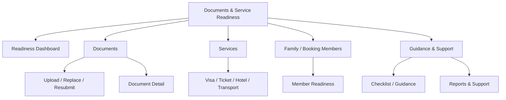
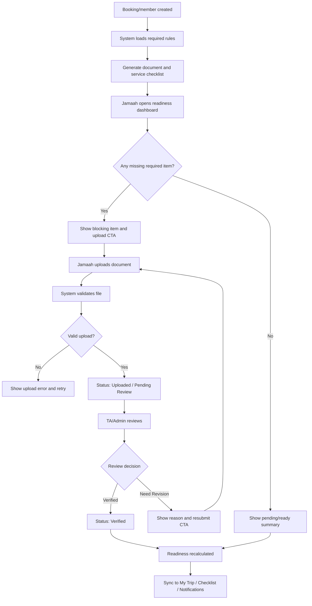
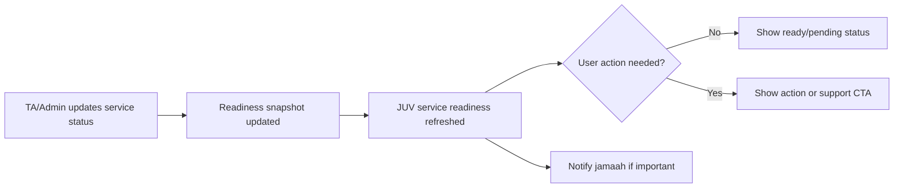
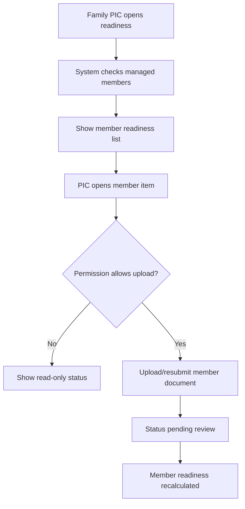
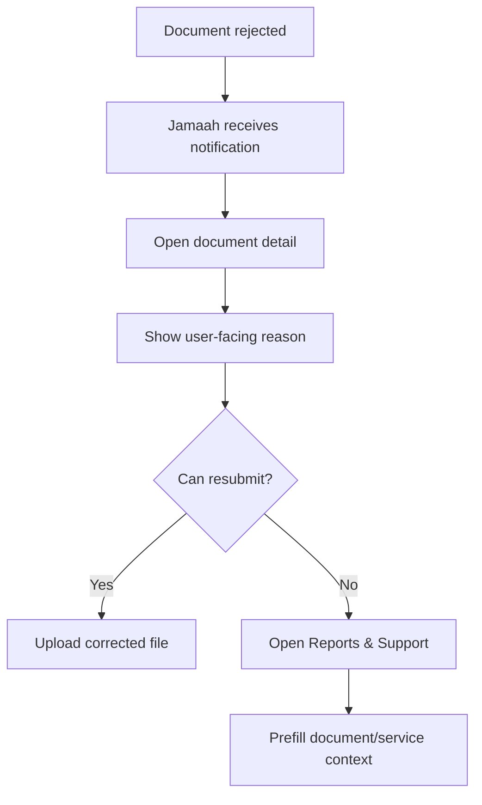

# JUV PRD 17 - Documents & Service Readiness

Product: UmrahHaji.com Jamaah/User View  
Module: Documents & Service Readiness  
Scope: Jamaah/User View / Document Upload, Review Status, Travel Service Readiness & Family/PIC Readiness  
Platform: Mobile-first Responsive Web Platform  
Status: Draft  
Last Updated: 21 June 2026  

---

## 1. Objective

Documents & Service Readiness is the jamaah-facing readiness module for uploading required travel documents, tracking review status, understanding missing or rejected items, viewing service readiness, and completing family/group readiness actions before departure.

This module must help jamaah answer:

1. Which documents do I need to submit for this booking or trip?
2. Which documents are missing, uploaded, pending review, accepted, rejected, expired, or expiring soon?
3. What should I fix when a document is rejected?
4. Can I upload documents for my family members or dependents?
5. Which trip services are ready: visa, flight ticket, hotel/rooming, transport, kit, vaccination, or other package services?
6. Which items block my trip readiness?
7. Which items are managed by Travel Agency/Admin and cannot be edited by me?
8. When should I contact support instead of uploading again?

This module is not a visa application system, not an airline/hotel/transport booking system, not a document verification workspace, not a finance/payment module, and not a mutawwif document access tool. Jamaah can submit and monitor their own required readiness items. Travel Agency and Admin remain the owners of verification, service operations, official status, and sensitive back-office actions.

---

## 2. Relationship With Master PRD

This module follows the Jamaah/User View Master PRD:

1. Documents are required for trip readiness and should be available from Profile, Booking, My Group Trip, Notifications, and Checklist.
2. Jamaah profile data syncs to Admin Jamaah Management and Travel Agency Jamaah Management according to permission.
3. Travel documents and service readiness sync with Travel Agency Documents & Services and Group Trip Management.
4. The module must support mobile-first upload and status tracking because jamaah may submit files from mobile devices.
5. Family/PIC permissions must follow the same family/group rules used in Booking, Profile, My Group Trip, and Payment.
6. Sensitive identity, passport, vaccination, visa, ticket, and service data must be masked, permission-controlled, and audit-logged.
7. Checklist & Guidance can show document readiness tasks but must link into this module for actual upload/status.
8. Notifications & Announcements must deep-link to the relevant document/service item.
9. Reports & Support must handle document/service issues, rejected document disputes, upload problems, and readiness blockers.

---

## 3. Relationship With Admin, Travel Agency, Jamaah, and Mutawwif PRDs

| Source Module | Relationship |
| --- | --- |
| Admin Jamaah Management | Source/consumer of jamaah profile, identity, passport, document status, and audit |
| Admin Group Trip Management | Platform-level trip readiness supervision and group trip readiness snapshot |
| Admin Document/Service Configuration | Source of required document types, service categories, expiry rules, labels, and visibility |
| Admin Report Management | Destination for escalated document/service readiness issues |
| Travel Agency Documents & Services | Main operational owner for document verification, service readiness, reminders, and blocking items |
| Travel Agency Jamaah Management | Agency-scoped jamaah data and operational profile context |
| Travel Agency Booking Management | Booking context, package, member list, payment clearance dependency, and required passenger information |
| Travel Agency Group Trip Management | Source of group trip service readiness: visa, ticket, rooming, transport, hotel, itinerary, and departure readiness |
| Travel Agency Announcements | Can send readiness updates and required action notices |
| JUV PRD 03 - Profile & Personal Data | Stores reusable identity/passport/contact data and profile completion |
| JUV PRD 05 - Booking Flow | Creates booking member records and can request passenger/document details before confirmation |
| JUV PRD 06 - My Group Trip | Shows trip readiness summary and links to this module for document/service action |
| JUV PRD 07 - Transaction History | May show payment clearance if payment is part of readiness; receipts stay in Transaction History |
| JUV PRD 08 - Payment Settings | Payment preferences only; not document/service owner |
| JUV PRD 12 - Checklist & Guidance | Shows checklist tasks and guidance, but upload/status lives here |
| JUV PRD 13 - Notifications & Announcements | Sends missing document, rejected document, expiry, ticket ready, visa ready, and service update notifications |
| JUV PRD 14 - Reports & Support | Handles upload failure, rejection dispute, missing service, wrong ticket/rooming, and readiness support |
| MV PRD 13 - Trip Documents & Service Readiness | Mutawwif receives safe assigned-trip readiness projection only |

### 3.1 Key Sync Rule

Documents & Service Readiness is the jamaah submission and self-service status surface. Verification and operational readiness remain owned by Travel Agency/Admin.

Booking / Profile / Family Members -> Required Document & Service Rules -> Jamaah Upload / Data Completion -> TA/Admin Review -> Readiness Snapshot -> My Group Trip / Checklist / Notifications / Mutawwif Safe Projection.

Jamaah View must not directly mark official visa, passport, vaccination, ticket, rooming, transport, or service readiness as verified unless the status is supplied by authorized Admin/TA workflow.

### 3.2 Cross-Role Boundary

| Role / Surface | Owns | Can Jamaah View Display? | PRD 17 Rule |
| --- | --- | --- | --- |
| Jamaah/User View | Own upload, own/family action, status tracking, resubmission, user-facing readiness | Yes | User can submit and track, not verify |
| Admin Panel | Platform rules, audit, support oversight, sensitive override | Yes, as released status only | Do not expose internal review notes |
| Travel Agency Portal | Document review, service readiness, reminder, blocking item, operational status | Yes, user-facing status/reason only | TA is main source of operational readiness truth |
| Mutawwif View | Assigned-trip safe readiness awareness | No direct access to jamaah files | Mutawwif sees safe summary only via MV PRD 13 |
| Reports & Support | Issue/case escalation | Yes, linked case status | Support does not replace verification workflow |

### 3.3 Document vs Service vs Checklist

| Area | Document | Service Readiness | Checklist |
| --- | --- | --- | --- |
| Purpose | User submits required file/data | Agency/Admin tracks operational arrangement | User sees preparation tasks |
| Example | Passport, IC, photo, vaccination certificate | Visa, ticket, hotel, rooming, transport, kit | Pack items, read guidance, upload passport |
| Owner | Jamaah submits; TA/Admin verifies | TA/Admin manages | Admin/TA/JUV checklist engine |
| User action | Upload, replace, resubmit, view status | View status, report issue | Mark personal tasks, open action link |
| Blocks trip readiness | Yes if required | Yes if required | Only if linked to required document/service |

Rules:

1. Checklist items may point to this module, but checklist completion must not override document/service verification.
2. A submitted file is not automatically verified.
3. A verified document can still become warning/expired if expiry rules change.
4. A service can be ready even if the downloadable file is not yet released to jamaah.

---

## 4. Research Notes and Product Decisions

Document and service readiness contains sensitive identity, travel, health, and operational data. The jamaah experience must reduce anxiety while protecting privacy and keeping verification authority in the correct back-office modules.

Product decisions:

1. The module should prioritize "what needs action now?" over showing all operational data.
2. Upload flows must be short, mobile-friendly, resumable, and clear about allowed file types.
3. Uploaded files must be validated by extension, MIME type, file signature, size, malware scan, and server-side rules.
4. Jamaah should receive specific rejection reason and resubmission instruction when a document is rejected.
5. Rejection reason should be user-facing and safe; internal verification remarks remain hidden.
6. Family/PIC can manage family member documents only when booking/family permission allows.
7. Requirements must be configurable by package, travel agency, nationality, trip type, season, member type, and official policy.
8. The app must not hard-code visa, passport validity, vaccination, Hajj permit, airline, hotel, train, or transport rules.
9. Sensitive file preview/download must be permission-controlled, time-limited, and audit-logged.
10. Service readiness should explain whether the item is agency-managed or user-action-required.
11. Mutawwif should never receive raw document files by default; only safe readiness status can be projected.
12. Payment clearance can appear as a readiness dependency but payment action remains in Payment/Transaction modules.

Reference direction inherited from existing PRDs:

1. TA PRD 09 defines document/service readiness as an agency operational workspace.
2. MV PRD 13 defines mutawwif view as safe, read-only readiness projection.
3. JUV PRD 03 defines identity/passport/profile data and file-upload security concerns.
4. JUV PRD 06 already includes IC, passport, photo, and vaccination upload flows from My Group Trip.
5. JUV PRD 12 defines checklist as a guidance/task layer, not upload owner.
6. JUV PRD 13 handles document/service reminders and readiness notifications.
7. JUV PRD 14 handles document/service support cases.

### 4.1 Official Requirement Boundary

This PRD must not define final legal/official requirements such as passport validity duration, vaccination rules, visa rules, permit rules, airline baggage rules, or hotel policy. Those rules must be configurable in Admin/Travel Agency systems and displayed as current requirement status and user-facing guidance.

### 4.2 File Safety Rule

File upload must follow secure file handling:

1. Allow only approved extensions and MIME types.
2. Validate file signature server-side.
3. Enforce size limits and image/document compression where appropriate.
4. Store files outside public application storage.
5. Use signed/time-limited file access URLs.
6. Scan files for malware.
7. Log access to sensitive files.
8. Strip metadata where policy requires it.

### 4.3 User Trust Rule

The UI must distinguish between:

1. `Uploaded` - user sent the file.
2. `Pending Review` - agency/admin has not approved it.
3. `Verified` - accepted by authorized reviewer.
4. `Need Revision` - user action required.
5. `Service Ready` - operational item is confirmed by agency/admin.

---

## 5. Scope

### 5.1 In Scope for Phase 1

1. Documents & Service Readiness dashboard.
2. Required document list by booking/trip/member.
3. Required service readiness list by booking/trip/member.
4. Upload document from mobile.
5. Replace/resubmit document.
6. Fullscreen file/image preview before submission.
7. Capture or upload file from device.
8. Document status: Missing, Uploaded, Pending Review, Need Revision, Verified, Expiring Soon, Expired, Waived, Not Required.
9. Service status: Not Started, In Progress, Ready, Delayed, Blocked, Released, Not Required.
10. Per-member readiness for Primary Booker / Family PIC.
11. Own document view for individual jamaah.
12. Rejection reason and resubmit instruction.
13. Expiry date display for relevant documents.
14. Required vs optional labels.
15. Blocking item summary.
16. Readiness score/status summary.
17. Link to Profile for reusable identity/passport data.
18. Link to My Group Trip readiness summary.
19. Link to Checklist guidance.
20. Link to Transaction History/Payment if payment clearance is blocking readiness.
21. Link to Reports & Support for document/service issue.
22. Notifications for missing document, rejection, expiry, verified, service ready, and service blocked.
23. Empty, loading, error, upload failure, offline, permission denied, and locked states.
24. Audit logs for upload, replace, view sensitive file, submit, resubmit, delete request, and support handoff.
25. Mobile-first responsive behavior.

### 5.2 In Scope for Phase 2

1. OCR-assisted field extraction with user confirmation.
2. Auto-crop passport/photo upload.
3. Multi-page document upload.
4. Secure ticket/voucher download wallet.
5. Document expiry renewal reminders.
6. Family bulk upload.
7. Agency-requested additional document workflow.
8. Health profile consent module.
9. Offline upload queue.
10. E-sign consent/waiver forms.
11. Visa application tracking detail if agency exposes it.
12. Kit distribution acknowledgement.
13. Rooming preference request flow.
14. Document history/version comparison.
15. Data export request.

### 5.3 Out of Scope

1. Admin/TA document verification workspace.
2. Approving or rejecting documents by jamaah.
3. Editing service readiness by jamaah.
4. Submitting official visa applications directly to government systems.
5. Booking airline/hotel/train/transport services.
6. Payment processing.
7. Refund or finance dispute management.
8. Full medical record management.
9. Mutawwif access to raw documents.
10. Bulk export of sensitive documents.
11. Public document sharing.
12. Automated official identity verification in Phase 1.
13. Final legal/compliance advice.
14. Replacing Travel Agency operational workflow.

---

## 6. User Roles and Access

| Role | Access Behavior |
| --- | --- |
| Public visitor | Cannot access documents/readiness |
| Registered user without booking | Can manage reusable profile documents only if enabled; no trip service readiness |
| Invited jamaah | Can complete required profile/document items after invitation acceptance |
| Jamaah with booking | Can upload and track own required documents and service readiness |
| Primary Booker | Can view booking member readiness and manage documents where booking permission allows |
| Family PIC | Can manage family/dependent documents according to family relationship and consent rules |
| Family Member | Can view/manage own documents if account exists; otherwise PIC-managed view may apply |
| Group PIC | Can view group readiness summary only if explicitly authorized; no sensitive files by default |
| Cancelled booking user | Can view historical submitted document status only if retention policy allows |
| Suspended/locked account | Upload disabled; read-only or blocked according to account policy |
| Travel Agency staff | Reviews/manages in TA Portal, not this module |
| Admin | Supervises/manages in Admin Panel, not this module |
| Mutawwif | Views safe readiness summary in MV PRD 13, not this module |

### 6.1 Visibility Rules

Jamaah can see:

1. Own required document list.
2. Own uploaded file preview if allowed.
3. Own document status and user-facing rejection reason.
4. Own service readiness status.
5. Own blocking items.
6. Family/dependent readiness if they are authorized PIC.
7. Trip-level readiness summary for own booking/trip.
8. Last updated timestamp and source label.
9. User-facing TA/Admin notes if released.
10. Linked support case status.

Jamaah must not see:

1. Other unrelated jamaah documents.
2. Internal TA/Admin verification notes.
3. Internal fraud/compliance notes.
4. Provider contracts or service costs.
5. Other family member raw files unless authorized.
6. Mutawwif internal readiness notes.
7. Finance invoice details outside Transaction History/Payment.
8. Hidden rules that expose fraud/security logic.

### 6.2 Action Permission Rules

| Action | Own Jamaah | Primary Booker | Family PIC | Group PIC | TA/Admin |
| --- | --- | --- | --- | --- | --- |
| View own readiness | Yes | Own + booking members if allowed | Family scope | Summary only if allowed | Use back-office |
| Upload own document | Yes | If acting for managed member | If relationship permits | No by default | Use back-office |
| Replace/resubmit document | Yes | If permitted | If permitted | No by default | Use back-office |
| View uploaded file | Own only | Managed member if permitted | Managed member if permitted | No raw file by default | Use back-office |
| Delete submitted file | Request only | Request only | Request only | No | Back-office policy |
| Verify document | No | No | No | No | TA/Admin only |
| Reject document | No | No | No | No | TA/Admin only |
| Edit service status | No | No | No | No | TA/Admin only |
| Report issue | Yes | Yes | Yes | Yes if authorized | Use back-office |

---

## 7. Entry Points

| Entry Point | Behavior |
| --- | --- |
| Profile - Documents | Opens reusable document/profile document area |
| Profile completion card | Opens missing required profile/document item |
| Booking Flow | Opens passenger/document requirement for booking members |
| My Group Trip readiness card | Opens trip-specific Documents & Service Readiness dashboard |
| My Group Trip document CTA | Opens selected document upload |
| Checklist task | Opens relevant upload/status screen |
| Notification - missing document | Opens required document item |
| Notification - document rejected | Opens rejected item with reason/resubmit CTA |
| Notification - expiring document | Opens document detail |
| Notification - ticket/visa/service ready | Opens service readiness detail |
| Reports & Support | Opens linked document/service case |
| Payment reminder | Opens payment module if payment clearance blocks readiness |

---

## 8. Information Architecture

```text
Documents & Service Readiness
+-- Readiness Dashboard
|   +-- Overall Readiness
|   +-- Blocking Items
|   +-- Member Readiness
|   +-- Service Readiness
+-- Documents
|   +-- Required Documents
|   +-- Optional Documents
|   +-- Document Detail
|   +-- Upload / Replace / Resubmit
|   +-- Rejection Reason
+-- Services
|   +-- Visa
|   +-- Flight / Train Ticket
|   +-- Hotel / Rooming
|   +-- Transport
|   +-- Kit / Other Services
+-- Family / Booking Members
|   +-- Member List
|   +-- Member Detail
|   +-- PIC Actions
+-- Guidance & Support
|   +-- Checklist Link
|   +-- Guidance Article
|   +-- Report Issue
+-- History
    +-- Upload History
    +-- Status Timeline
    +-- Linked Notifications
```



---

## 9. Main Readiness Flow



### 9.1 Service Readiness Flow



### 9.2 Family/PIC Flow



### 9.3 Rejection and Support Flow



---

## 10. Readiness Model

### 10.1 Document Status Values

| Status | Meaning | User Action | Blocks Readiness |
| --- | --- | --- | --- |
| Not Required | Item is not needed | None | No |
| Missing | Required item has not been provided | Upload | Yes |
| Draft | User started upload but has not submitted | Continue | Yes |
| Uploaded | File received but not queued/reviewed | Wait | Yes |
| Pending Review | TA/Admin must verify | Wait | Yes |
| Need Revision | Uploaded file rejected or incomplete | Resubmit | Yes |
| Verified | Accepted by authorized reviewer | None | No |
| Expiring Soon | Valid but expiry is near | Prepare renewal if requested | Warning |
| Expired | Validity has passed | Upload new document | Yes |
| Waived | Requirement waived with reason | None | No if approved |
| Locked | Temporarily locked by review/operation | Contact support if needed | Depends |

### 10.2 Service Status Values

| Status | Meaning | User Action | Blocks Readiness |
| --- | --- | --- | --- |
| Not Required | Service does not apply | None | No |
| Not Started | TA/Admin has not started service workflow | Wait or contact if overdue | Warning/Yes based on date |
| In Progress | Service is being processed | Wait | Warning |
| Pending User Action | User must provide data/document/payment | Complete action | Yes |
| Ready | Service confirmed internally | None | No |
| Released | User-facing document/detail is available | View/download if allowed | No |
| Delayed | Service is late or awaiting provider | Wait/contact support | Warning/Yes |
| Blocked | Service cannot proceed | Follow instruction/report | Yes |
| Cancelled | Service no longer applies due to cancelled booking/trip | None | N/A |

### 10.3 Overall Readiness Status

| Status | Meaning |
| --- | --- |
| Ready | All required documents and required services are complete/verified/ready |
| Action Needed | User must upload, complete data, resubmit, or pay |
| Pending Review | User has submitted items and is waiting for review |
| Warning | Item is expiring soon, delayed, or needs attention but may not block yet |
| Blocked | Required item prevents operational readiness |
| Not Available | Trip/booking readiness has not been generated |
| Locked | Readiness is temporarily locked due to review/cancellation/security |

### 10.4 Readiness Calculation

```text
Required Readiness = Completed Required Items / Total Required Items x 100
```

Rules:

1. Required documents count as complete only when Verified or approved Waived.
2. Required services count as complete only when Ready or Released.
3. Pending Review does not count as complete unless policy explicitly allows provisional readiness.
4. Optional items are excluded from required readiness score.
5. Expiring Soon can count as complete with warning.
6. Expired counts as incomplete.
7. Payment clearance can be included only if configured by booking/trip readiness rules.
8. The UI should show user-facing labels and not internal scoring formulas unless useful.

---

## 11. Screen 1 - Readiness Dashboard

The dashboard gives jamaah a clear view of what is ready and what needs action.

| Element | Requirement |
| --- | --- |
| Header | Documents & Readiness title, related booking/trip selector |
| Overall status | Ready, Action Needed, Pending Review, Warning, Blocked |
| Progress indicator | Required readiness progress |
| Blocking item card | Shows highest-priority missing/rejected/expired item |
| Member readiness | Shows own/family member status if authorized |
| Document section | Required and optional document categories |
| Service section | Visa, ticket, hotel, rooming, transport, kit, other services |
| Last updated | Timestamp and source label |
| Primary CTA | Upload/Resubmit/Continue action |
| Secondary CTA | Report Issue / Contact Support / Open Guidance |

Rules:

1. Highest-risk item appears first.
2. User action items appear before agency-managed pending items.
3. Service statuses must clearly say if user action is not needed.
4. If there are multiple trips/bookings, the user must be able to select context.

---

## 12. Screen 2 - Documents List

Documents List shows required and optional documents for the selected booking/trip/member.

| Element | Requirement |
| --- | --- |
| Filter | All, Required, Optional, Missing, Pending, Need Revision, Verified |
| Document card | Document name, member, status, required/optional, due date |
| Status chip | Uses canonical document status |
| CTA | Upload, Resubmit, View, Replace, Details |
| Info link | Opens guidance/requirements copy |
| Due/expiry | Shows due date or expiry if relevant |

Common document categories:

1. IC / identity card.
2. Passport.
3. Passport photo.
4. Visa support document.
5. Vaccination certificate.
6. Permit/approval document if applicable.
7. Family/dependent authorization document if applicable.
8. Additional agency-requested document.

Rules:

1. Document requirements must come from configuration and booking/trip context.
2. Do not show document types that are not required or optional for the current context unless user asks to view all.
3. Use plain-language instructions, not internal file labels.
4. Required items must be visually distinct from optional items.

---

## 13. Screen 3 - Document Detail

Document Detail explains status, requirement, file history, and next action.

| Section | Requirement |
| --- | --- |
| Header | Document name, related member, status |
| Requirement summary | What is needed and why |
| Accepted file rules | File type, size, image quality guidance |
| Current submission | Uploaded date, file preview if allowed, status |
| Review status | Pending/Verified/Need Revision/Expired/etc. |
| Rejection reason | User-facing reason and resubmit instruction |
| Expiry info | Expiry date and renewal guidance if applicable |
| Timeline | Submitted, reviewed, rejected/verified, resubmitted |
| Actions | Upload, Replace, Resubmit, Report Issue, Open Guidance |

Safe rejection reason examples:

| Reason Type | User-Facing Message |
| --- | --- |
| Blurry image | The document is not clear enough to review |
| Cropped document | The full document edges are not visible |
| Wrong document | The uploaded file does not match the required document |
| Expired document | The document has expired or is too close to expiry based on current rules |
| Missing page | A required page or side is missing |
| Name mismatch | The document details do not match the booking/profile record |
| File unreadable | The file could not be opened or processed |
| Review locked | This item is being reviewed by the agency/admin |

Rules:

1. Internal reviewer notes must not be shown unless converted to user-facing reason.
2. Rejection must always include an actionable instruction.
3. Replace/resubmit must keep previous submission history for audit.
4. File preview must use secure access and should not expose storage URL.

---

## 14. Screen 4 - Upload / Replace / Resubmit

Upload flow must be optimized for mobile.

| Step | Requirement |
| --- | --- |
| Select member | Required if user manages multiple members |
| Select document | Preselected when opened from detail/CTA |
| Read requirement | Plain-language instruction and examples |
| Choose source | Camera, gallery, file upload if supported |
| Preview | Fullscreen preview with replace/crop/confirm |
| Validation | File type, size, image quality, required sides/pages |
| Submit | Confirmation and status change |
| Confirmation | Show `Uploaded` or `Pending Review` with next step |

Upload rules:

1. Allow camera upload on mobile.
2. Show supported file types before upload.
3. Reject unsupported file types immediately.
4. Compress images where safe without making them unreadable.
5. Allow retry after network failure.
6. Prevent duplicate accidental submits.
7. Show upload progress.
8. Do not mark as verified after upload.
9. If upload succeeds but review queue fails, show safe processing state.

---

## 15. Screen 5 - Service Readiness

Service Readiness shows agency/admin-managed travel service status.

| Service Area | Example User-Facing Status |
| --- | --- |
| Visa | In Progress, Ready, Need Document, Delayed |
| Flight Ticket | Not Released, Ready, Released |
| Train Ticket | Not Required, Pending, Released |
| Hotel | Assigned, Pending, Changed |
| Rooming | Pending, Assigned, Update Available |
| Transport | Scheduled, Pending, Ticket Released |
| Kit / Supplies | Pending, Ready, Collected |
| Briefing | Scheduled, Completed, Missed |
| Payment Clearance | Pending, Cleared, Action Needed |

Rules:

1. Jamaah cannot edit service status.
2. If service status requires user action, show exact action link.
3. If service is delayed, show user-safe reason and support option if allowed.
4. Ticket/voucher download appears only when released by TA/Admin.
5. Hotel/rooming details may be hidden until release date or agency approval.
6. Payment clearance links to payment/transaction modules, not this module.

---

## 16. Screen 6 - Family / Booking Member Readiness

Family/Booking Member Readiness supports Primary Booker and Family PIC workflows.

| Element | Requirement |
| --- | --- |
| Member list | Name/label, relationship, readiness status |
| Action badge | Missing, Need Revision, Pending, Ready |
| Member detail | Required documents and services for that member |
| Bulk warning | Shows if multiple family members have same missing item |
| PIC action | Upload/resubmit where permitted |
| Privacy note | Shows why user can manage this member |

Rules:

1. Family/PIC actions must be permission-checked per member.
2. Dependents may be managed by PIC if policy allows.
3. Adult family members with own account may need consent before PIC can upload or view sensitive files.
4. Group PIC should see summary by default, not raw files.
5. Member readiness must not reveal sensitive files to unauthorized users.

---

## 17. Notifications

This module uses JUV PRD 13 notification behavior.

| Notification | Trigger | Destination |
| --- | --- | --- |
| Missing document reminder | Required item missing near due date | Document detail/upload |
| Document uploaded | Upload completed | Document detail |
| Document verified | TA/Admin verifies | Document detail |
| Document needs revision | TA/Admin rejects | Rejection detail |
| Document expiring soon | Expiry threshold reached | Document detail |
| Document expired | Expiry passed | Document detail |
| Additional document requested | TA/Admin adds requirement | Document list |
| Visa status updated | TA/Admin updates service | Service readiness |
| Ticket released | Ticket/voucher released | Service detail |
| Hotel/rooming updated | Assignment released/changed | Service detail |
| Transport updated | Transport/ticket released/changed | Service detail |
| Readiness blocked | Required item blocks trip readiness | Dashboard |
| Readiness complete | All required items complete | Dashboard |

Rules:

1. Notifications must not include full IC/passport numbers or sensitive file names.
2. Rejection notifications should include a safe summary and deep link.
3. Critical reminders should respect rate limits but remain visible in notification inbox.
4. Family/PIC notifications should identify the member in a privacy-safe way.

---

## 18. Empty, Loading, Error, and Offline States

| State | Required Behavior |
| --- | --- |
| No booking/trip | Show no trip readiness and link to packages/bookings |
| Requirements not generated | Show pending generation state and support link if delayed |
| No required documents | Show no action needed |
| All ready | Show ready state and next trip action |
| Loading dashboard | Skeleton readiness cards |
| Loading list | Skeleton list rows |
| Upload in progress | Progress indicator and prevent duplicate submit |
| Upload failed | Retry, change file, support link |
| File unsupported | Explain allowed formats |
| File too large | Explain size limit and compression tips |
| Review delayed | Show pending review and last updated timestamp |
| Permission denied | Explain that user is not authorized for this member/item |
| Offline | Show cached read-only status; disable new upload unless offline queue exists |
| Locked item | Explain review/operation lock and support path |
| Cancelled booking | Show historical/read-only state according to retention policy |

---

## 19. Data and Field Requirements

### 19.1 ReadinessContext

| Field | Required | Notes |
| --- | --- | --- |
| readiness_context_id | Yes | Unique context |
| user_id | Yes | Current user |
| booking_id | Conditional | Booking context |
| group_trip_id | Conditional | Trip context |
| package_id | Conditional | Package rules |
| travel_agency_id | Yes | Agency owner |
| member_scope | Yes | Own, Family, Booking, Group |
| readiness_status | Yes | Overall readiness |
| readiness_score | Optional | Required item completion |
| blocking_count | Yes | Number of blocking items |
| last_updated_at | Yes | Snapshot update |

### 19.2 RequiredDocumentItem

| Field | Required | Notes |
| --- | --- | --- |
| document_item_id | Yes | Unique item |
| readiness_context_id | Yes | Parent |
| member_id | Yes | Jamaah/family member |
| document_type | Yes | Passport, IC, Photo, Vaccination, etc. |
| required_level | Yes | Required, Optional, Conditional |
| status | Yes | Missing, Pending Review, Verified, etc. |
| due_date | Optional | User-facing deadline |
| expiry_date | Optional | If document has expiry |
| rejection_reason_public | Conditional | Required if Need Revision |
| guidance_article_id | Optional | Related guidance |
| can_upload | Yes | Based on permission/status |
| can_view_file | Yes | Based on permission/status |

### 19.3 DocumentSubmission

| Field | Required | Notes |
| --- | --- | --- |
| submission_id | Yes | Unique submission |
| document_item_id | Yes | Linked item |
| uploaded_by_user_id | Yes | Actor |
| member_id | Yes | Document owner |
| file_token | Yes | Secure storage reference, not public URL |
| original_filename | Optional | Sanitized |
| file_type | Yes | MIME/category |
| file_size | Yes | Bytes |
| upload_status | Yes | Uploaded, Processing, Failed |
| review_status | Yes | Pending, Verified, Need Revision |
| submitted_at | Yes | Timestamp |
| reviewed_at | Optional | Timestamp |
| reviewer_role | Optional | TA/Admin |
| previous_submission_id | Optional | Resubmission chain |

### 19.4 ServiceReadinessItem

| Field | Required | Notes |
| --- | --- | --- |
| service_item_id | Yes | Unique service item |
| readiness_context_id | Yes | Parent |
| member_id | Conditional | Member-level if applicable |
| service_type | Yes | Visa, Flight, Hotel, Rooming, Transport, Kit |
| status | Yes | Not Started, In Progress, Ready, Blocked, Released |
| user_action_required | Yes | Boolean |
| user_action_type | Optional | Upload, Payment, Confirm, Contact |
| release_available | Yes | Ticket/voucher/detail available |
| public_note | Optional | User-facing note |
| last_updated_at | Yes | Status update |
| source_module | Yes | TA Docs, Group Trip, Booking, Finance |

### 19.5 ReadinessAuditEvent

| Field | Required | Notes |
| --- | --- | --- |
| audit_event_id | Yes | Unique event |
| actor_user_id | Conditional | User/system/TA/Admin actor |
| actor_role | Yes | Jamaah, PIC, System, TA, Admin |
| action | Yes | View, Upload, Replace, Resubmit, StatusChange, FileAccess, SupportHandoff |
| target_type | Yes | DocumentItem, Submission, ServiceItem, Context |
| target_id | Yes | Related entity |
| member_id | Conditional | If member-specific |
| reason | Conditional | Required for rejection/override/delete |
| occurred_at | Yes | Timestamp |
| visibility | Yes | Internal or user-facing |

---

## 20. Permission, Privacy, and Data Masking

### 20.1 Sensitive Data Rules

| Data | Display Rule |
| --- | --- |
| IC/passport number | Mask except last characters if needed |
| Passport file | Preview only to owner/PIC if permitted |
| Vaccination file | Preview only if permitted |
| Visa file | Released only if TA/Admin allows |
| Ticket/voucher | Released only after TA/Admin publishes |
| Hotel/rooming detail | Show only released user-facing detail |
| Medical notes | Hidden by default; separate consent needed |
| Internal review note | Hidden |
| Provider contract/cost | Hidden |
| Other member files | Hidden unless PIC permission allows |

### 20.2 Family/PIC Privacy Rule

Family/PIC access must follow:

1. Relationship validation.
2. Booking membership.
3. Consent where required.
4. Dependent/adult distinction.
5. Per-member permission.
6. Audit logging for sensitive file access.

### 20.3 File Access Rule

Any sensitive file preview/download must:

1. Re-check authentication.
2. Re-check member permission.
3. Use signed/time-limited access.
4. Avoid exposing direct storage path.
5. Log file access.
6. Block access after account/booking/trip permission changes.

---

## 21. Security and Compliance

1. Use secure upload validation and storage.
2. Do not trust client-side MIME/extension checks alone.
3. Scan files before making them available to reviewers.
4. Apply rate limits to upload attempts.
5. Prevent path traversal and executable upload risks.
6. Strip unsafe metadata where policy requires it.
7. Retain files according to document retention policy.
8. Support deletion/anonymization request only through approved policy workflow.
9. Encrypt files at rest and in transit.
10. Keep review and access audit logs.
11. Avoid showing sensitive data in notifications.
12. Follow privacy principles for minimum necessary display.

---

## 22. Analytics and Metrics

### 22.1 Product Metrics

1. Readiness dashboard views.
2. Missing document CTA clicks.
3. Upload start rate.
4. Upload success rate.
5. Upload failure reason distribution.
6. Resubmission rate.
7. Rejection reason distribution.
8. Time from request to upload.
9. Time from upload to review.
10. Family/PIC upload usage.
11. Service readiness detail views.
12. Support handoff rate.

### 22.2 Operational Metrics

1. Members with blocking items.
2. Trips with readiness below threshold.
3. Documents pending review.
4. Documents needing revision.
5. Expiring soon documents.
6. Service delays by category.
7. Ticket/visa release timing.
8. Critical departures with blocking items.
9. Readiness completion before departure.
10. Notification-to-upload conversion.

### 22.3 Privacy Rule

Analytics must use aggregate or anonymized data where possible. Sensitive document values must not be sent to analytics events.

---

## 23. Functional Requirements

| ID | Requirement | Priority |
| --- | --- | --- |
| JUV-DOC-001 | User can open Documents & Service Readiness from Profile/My Trip/Notification | P1 |
| JUV-DOC-002 | System shows readiness dashboard for selected booking/trip/member | P1 |
| JUV-DOC-003 | System shows required and optional document list | P1 |
| JUV-DOC-004 | User can upload required document | P1 |
| JUV-DOC-005 | User can replace/resubmit rejected document | P1 |
| JUV-DOC-006 | System validates file type, size, and upload status | P1 |
| JUV-DOC-007 | System shows document status and review status | P1 |
| JUV-DOC-008 | System shows user-facing rejection reason | P1 |
| JUV-DOC-009 | System shows expiry/expiring soon status where relevant | P1 |
| JUV-DOC-010 | System supports Family/PIC member readiness where permitted | P1 |
| JUV-DOC-011 | System masks sensitive document data | P1 |
| JUV-DOC-012 | System shows service readiness status | P1 |
| JUV-DOC-013 | System shows blocking items and user action required | P1 |
| JUV-DOC-014 | System links payment blockers to Payment/Transaction modules | P1 |
| JUV-DOC-015 | System links guidance tasks to Checklist/Guidance | P1 |
| JUV-DOC-016 | System links unresolved issues to Reports & Support | P1 |
| JUV-DOC-017 | System sends document/service notifications through JUV PRD 13 | P1 |
| JUV-DOC-018 | System logs sensitive upload/file/status actions | P1 |
| JUV-DOC-019 | System supports empty/loading/error/offline states | P1 |
| JUV-DOC-020 | System prevents jamaah from verifying or editing service status | P1 |
| JUV-DOC-021 | System supports OCR-assisted extraction with confirmation | P2 |
| JUV-DOC-022 | System supports secure ticket/voucher wallet | P2 |
| JUV-DOC-023 | System supports e-sign consent/waiver | P2 |
| JUV-DOC-024 | System supports offline upload queue | P2 |

---

## 24. Acceptance Criteria

### 24.1 Dashboard and Readiness

1. Given a jamaah has an active booking, when they open readiness, then the system shows required documents, service readiness, overall status, blocking items, and last updated timestamp.
2. Given a user has multiple bookings, when they open readiness, then the system allows selecting the correct booking/trip context.
3. Given all required items are verified/ready, when dashboard loads, then the system shows Ready state.
4. Given a required item is missing/rejected/expired, when dashboard loads, then the system shows Action Needed or Blocked state.

### 24.2 Upload and Review

1. Given a required document is missing, when user uploads a valid file, then the status becomes Uploaded/Pending Review.
2. Given a file is unsupported or too large, when user uploads it, then the system rejects it with clear guidance.
3. Given a document is rejected, when user opens detail, then the system shows safe reason and resubmit CTA.
4. Given a document is verified, when user opens detail, then the system shows verified status and no required action.
5. Given user replaces a document, then previous submission remains retained for audit.

### 24.3 Family/PIC

1. Given user is Family PIC, when they open member readiness, then they see authorized family members only.
2. Given user is not authorized for a member, when they attempt file access, then access is denied and logged.
3. Given an adult family member requires consent, when PIC tries to manage document, then the system follows consent/permission policy.

### 24.4 Service Readiness

1. Given TA/Admin updates visa status, when user opens service readiness, then the user sees the released status.
2. Given ticket is not released, when user opens service readiness, then download action is hidden.
3. Given payment clearance blocks readiness, when user taps action, then the system opens payment/transaction module.
4. Given a service is delayed or blocked, then user sees safe public note and support action if allowed.

### 24.5 Privacy and Security

1. Given notification is sent, then it does not expose sensitive document numbers or raw file names.
2. Given a sensitive file is previewed, then the system re-checks permission and logs access.
3. Given mutawwif views assigned trip readiness, then raw document files remain hidden by default.
4. Given internal reviewer notes exist, then Jamaah View does not display them unless converted into user-facing reason.

---

## 25. Dependencies

| Dependency | Purpose |
| --- | --- |
| User Management | Account status, login, family/PIC permission |
| Profile & Personal Data | Identity/passport/contact source |
| Booking Flow | Booking members and passenger requirements |
| Package Management | Required document/service rules by package |
| Travel Agency Documents & Services | Review, verification, service readiness source |
| Group Trip Management | Trip-level readiness, service status, rooming, ticket, transport |
| Billing/Payment | Payment clearance if configured |
| Notifications | Missing/rejected/ready/expiry/service updates |
| Checklist & Guidance | Preparation task and guidance links |
| Reports & Support | Issue escalation |
| Secure File Storage | Upload, preview, retention, malware scan |
| Audit Log | Sensitive action tracking |

---

## 26. Risks and Mitigations

| Risk | Impact | Mitigation |
| --- | --- | --- |
| User assumes upload means verified | Readiness misunderstanding | Separate Uploaded, Pending Review, and Verified |
| Sensitive file leakage | Privacy/compliance risk | Secure storage, signed URLs, permission checks, audit |
| PIC sees unauthorized adult documents | Privacy risk | Relationship/consent checks per member |
| Requirements change after upload | Confusion | Version requirements and notify users |
| File quality poor | Review delays | Preview, examples, clear rejection reason |
| Service status delayed | User anxiety | Last updated timestamp and public note |
| Ticket/rooming released too early | Operational confusion | Release control by TA/Admin |
| Duplicate modules overlap with Checklist/Profile/My Trip | UX fragmentation | Use this module as upload/status owner; others link here |
| Payment readiness mixed with documents | Scope confusion | Payment remains in payment modules |
| Mutawwif receives too much document data | Privacy risk | Safe readiness projection only |

---

## 27. Release Plan

### Phase 1

1. Readiness dashboard.
2. Required document list.
3. Upload/replace/resubmit.
4. Review status and rejection reason.
5. Family/PIC member readiness.
6. Service readiness summary.
7. Blocking item summary.
8. Notifications integration.
9. My Group Trip/Profile/Checklist entry points.
10. Reports & Support handoff.
11. Secure file handling.
12. Audit logging.

### Phase 2

1. OCR and auto-crop.
2. Secure ticket/voucher wallet.
3. Offline upload queue.
4. Family bulk upload.
5. E-sign consent/waiver.
6. Advanced document history.
7. Health profile consent module.
8. Kit/rooming/transport acknowledgement.

---

## 28. QA Checklist

1. Verify readiness dashboard loads by booking/trip context.
2. Verify required/optional document labels.
3. Verify upload from camera/gallery/file.
4. Verify unsupported file rejection.
5. Verify upload progress and retry.
6. Verify status changes to Pending Review after upload.
7. Verify rejected document shows safe reason.
8. Verify resubmission keeps history.
9. Verify verified document cannot be accidentally overwritten unless policy allows.
10. Verify expiry and expiring soon states.
11. Verify Family/PIC scope.
12. Verify unauthorized member access is denied.
13. Verify service readiness is read-only for jamaah.
14. Verify ticket/voucher download appears only when released.
15. Verify payment blocker links to payment modules.
16. Verify checklist links open correct document/service item.
17. Verify notifications deep-link correctly.
18. Verify support handoff includes document/service context.
19. Verify sensitive file access is logged.
20. Verify raw document data is not exposed to mutawwif projection.
21. Verify offline state is read-only unless offline queue is enabled.
22. Verify cancelled booking state follows retention policy.

---

## 29. Open Questions

1. Which document types are required for Phase 1 by package/trip type?
2. Will all required document rules be platform-managed, agency-managed, or both?
3. What is the maximum upload size and supported file types?
4. Should PDF be allowed in Phase 1, or image-only for mobile simplicity?
5. Can Family PIC upload for adult family members without explicit in-app consent?
6. Which service details are released to jamaah: visa only, ticket, hotel, rooming, transport, kit?
7. Should ticket/voucher download be Phase 1 or Phase 2?
8. Should document deletion be user-initiated request only or direct delete before review?
9. What is the retention policy after completed/cancelled trips?
10. Should payment clearance appear in readiness score?
11. Should health/vaccination be part of documents or a separate health profile module?
12. What readiness threshold blocks departure or group trip completion?

---

## 30. Future Enhancements

1. Passport OCR with user confirmation.
2. Smart image quality detection.
3. Automatic expiry reminders.
4. E-wallet style secure travel document wallet.
5. Multi-language upload guidance.
6. Family document bulk upload.
7. Document consent delegation.
8. Digital signature/waiver flow.
9. Offline upload queue.
10. Agency-specific document requirement templates.
11. Document version history.
12. Readiness timeline by member.
13. Travel kit distribution scan.
14. Rooming acknowledgement.
15. Transport boarding readiness.

---

## 31. Final Product Decision

JUV PRD 17 should be implemented as the Jamaah-owned document submission and readiness tracking module.

Phase 1 should include required document upload, replacement/resubmission, status tracking, rejection reason, family/PIC readiness, service readiness summary, blocking item visibility, notifications, support handoff, secure file handling, and audit logging.

Travel Agency and Admin remain the authority for document verification, service readiness, operational status, rule configuration, and sensitive override. Jamaah View gives users a clear, mobile-first way to complete their own actions without exposing internal notes, other users' private data, or back-office verification tools.
