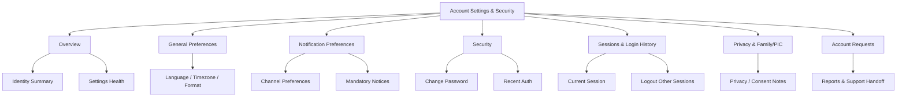
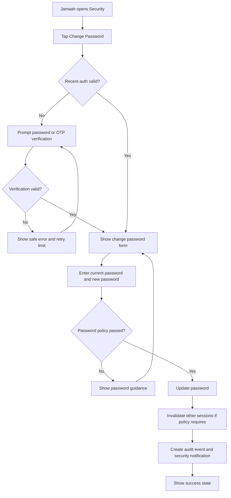
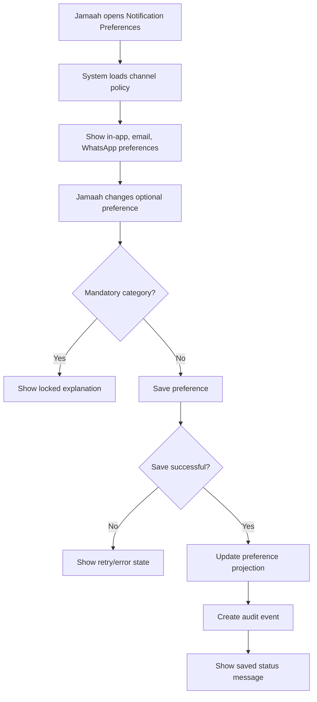
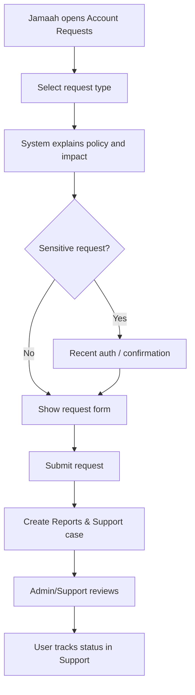
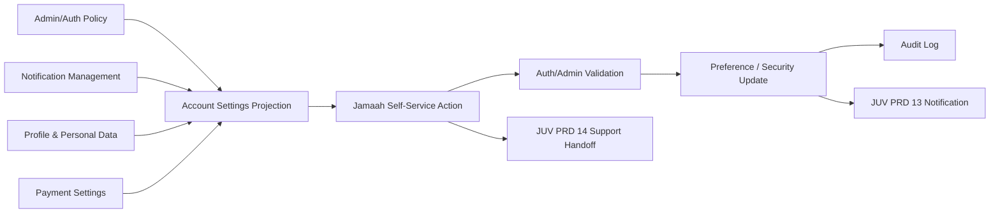

# JUV PRD 18 - Account Settings & Security

Product: UmrahHaji.com Jamaah/User View  
Module: Account Settings & Security  
Scope: Jamaah/User View / Personal Preferences, Security Controls, Session Visibility, Privacy Preferences & Account Request Handoff  
Platform: Mobile-first Responsive Web Platform  
Status: Draft  
Last Updated: 21 June 2026  

---

## 1. Objective

Account Settings & Security is the jamaah-facing personal account control center. It allows jamaah to manage safe account-level preferences, login identity visibility, password/security actions, notification channel preferences, language/time display preferences, active session visibility, privacy/data request handoff, and account deactivation request handoff without becoming an Admin user management module.

This module must help jamaah answer:

1. Which email and phone are connected to my account?
2. Are my email and phone verified?
3. Which language, timezone, date format, and notification preferences are used in my account?
4. Which notifications can I turn off, and which are mandatory for trip, payment, document, security, or emergency reasons?
5. Can I change my password or secure my account after suspicious activity?
6. Which sessions or devices are currently active or recently used?
7. Can I logout from other sessions?
8. What privacy options control my family/PIC visibility, profile display, and data preferences?
9. How do I request account deactivation, data export, account deletion, or privacy support if policy allows?

This module is not Admin User Management, not Travel Agency Team & Roles, not payment settings, not profile verification, not document management, and not a customer support case workspace. Admin/Auth remains the source of truth for account status, lock/suspension, permission, session validity, password policy, MFA policy, security audit, and final account deactivation/deletion decision.

---

## 2. Relationship With Master PRD

This module follows the Jamaah/User View Master PRD:

1. Jamaah/User View requires secure access because the account contains personal, passport, document, payment, booking, trip, family, and support data.
2. Registration, login, OTP, invitation, and password recovery are handled by JUV PRD 02.
3. Profile and personal data are handled by JUV PRD 03.
4. Payment preferences and payout/refund destinations are handled by JUV PRD 08.
5. Notification inbox, announcement read state, and acknowledgement are handled by JUV PRD 13.
6. Reports & Support handles suspicious activity, access issue, account request, privacy request, and deactivation support cases.
7. Account Settings can show summaries and shortcuts, but it must not duplicate source data from Profile, Payment Settings, Documents, Transaction History, or Reports.
8. Sensitive changes require recent authentication, OTP, password confirmation, or platform-defined step-up verification.
9. Mandatory safety, security, payment, document, trip, and compliance notifications cannot be disabled by user preference.

---

## 3. Relationship With Admin, Travel Agency, Jamaah, and Mutawwif PRDs

| Source Module | Relationship |
| --- | --- |
| Admin User Management | Source of account, role, portal access, account status, password reset, session revoke, login history, and security audit |
| Admin Settings / Security Policy | Defines password policy, MFA policy, session timeout, channel availability, rate limits, and account retention rules |
| Admin Jamaah Management | Source of jamaah operational status, profile linkage, family/dependent relationship, and support visibility |
| Admin Report Management | Destination for account, privacy, deletion, suspicious activity, or access issue cases |
| Admin Announcement / Notification Management | Source of notification templates, delivery rules, mandatory categories, and audience policy |
| Travel Agency Jamaah Management | Consumes allowed account contactability and booking/member relationship, not account security controls |
| Travel Agency Booking / Group Trip | Can trigger trip-critical account notifications and family/PIC context |
| Travel Agency Settings | Agency-level channel defaults may affect customer-facing delivery where platform allows |
| JUV PRD 02 - Registration, Login & Invitation Acceptance | Source of login, logout, OTP, invitation, password reset, session expiry, and auth behavior |
| JUV PRD 03 - Profile & Personal Data | Owns personal data, identity/passport, emergency contact, preferences that are profile-specific |
| JUV PRD 07 - Transaction History & Receipts | Owns receipt records and finance transaction details |
| JUV PRD 08 - Payment Settings | Owns payment preferences, saved methods, refund/payout destination if enabled |
| JUV PRD 13 - Notifications & Announcements | Owns inbox, read/unread, archive, acknowledgement, and deep links |
| JUV PRD 14 - Reports & Support | Destination for account access, suspicious activity, privacy, deletion, or deactivation request |
| JUV PRD 17 - Documents & Service Readiness | Uses account security and family/PIC permission context for sensitive file access |
| MV PRD 16 - Account Settings & Security | Parallel self-service account settings model for mutawwif role |

### 3.1 Key Sync Rule

Account Settings & Security is a self-service projection of account-level controls, not the source of system authority.

Admin/Auth Policy -> Account Settings & Security -> Jamaah Self-Service Action -> Auth/Admin Validation -> Audit Event / Notification / Support Handoff.

Jamaah View can request or update allowed settings, but Admin/Auth remains the source of truth for account status, permission, session validity, security policy, and final deactivation/deletion decisions.

### 3.2 Cross-Role Boundary

| Role / Surface | Owns | Can Jamaah View Display? | PRD 18 Rule |
| --- | --- | --- | --- |
| Admin User Management | Account, portal access, sessions, password reset, lock/suspend, security audit | Yes, safe account/security status | Do not expose internal security notes or risk score |
| Admin Settings | Global auth/session/channel/security policy | Yes, as read-only policy labels | Jamaah cannot override platform requirements |
| Travel Agency Portal | Booking/trip/customer communication context | Limited, user-facing only | TA cannot manage jamaah account security here |
| Profile & Personal Data | Identity, passport, emergency contact, family profile | Link/summary only | Do not edit profile fields here |
| Payment Settings | Payment preferences and refund/payout destination | Link/summary only | Do not edit bank/e-wallet here |
| Notifications | Inbox, announcement acknowledgement, delivery history | Link/summary only | Channel preference lives here; inbox lives in JUV PRD 13 |
| Reports & Support | Account/privacy/security requests | Yes, as handoff/case link | Sensitive account requests become support/admin cases |

### 3.3 Boundary With Related Jamaah Modules

| Area | Account Settings & Security | Related Module |
| --- | --- | --- |
| Login identity summary | Shows masked email/phone and verification status | JUV 02 owns verification/recovery flow |
| Full name, passport, address, emergency contact | Links only | JUV 03 owns profile fields |
| Document file access security | Provides session/auth requirements | JUV 17 owns upload/status |
| Payment method and refund destination | Links only | JUV 08 owns payment fields |
| Transaction receipts | Links only | JUV 07 owns receipts |
| Notification inbox | Links only | JUV 13 owns read/archive/acknowledgement |
| Notification channel preference | Owns account-level preference | JUV 13 and source modules consume preference |
| Account access issue | Opens support handoff | JUV 14 owns case workflow |
| Family/PIC permission | Shows safe summary and privacy preference | Booking/Profile/Documents own member-level data |

---

## 4. Research Notes and Product Decisions

Account settings combines security, accessibility, privacy, and user trust. Product decisions:

1. Security-sensitive actions require recent authentication or step-up challenge.
2. Password changes must support long passphrases, avoid arbitrary complexity friction, and block weak/common credentials.
3. Login, password, OTP, and reset messages must avoid account enumeration.
4. Sessions need both automatic expiration and user-facing logout/revoke controls.
5. MFA or passkey setup can be Phase 2 unless platform policy requires it at launch.
6. Notification preference changes must never suppress mandatory safety, security, compliance, payment, document, trip, or emergency notices.
7. In-app notifications remain the account communication record even if WhatsApp/email is disabled or delivery fails.
8. Privacy preferences can control optional sharing/display where policy allows, but cannot hide required operational identity from Admin/TA.
9. Account deactivation/deletion is a request workflow, not an immediate destructive action in Jamaah View.
10. Family/PIC privacy must separate own account control from managed member control.
11. Authentication must remain accessible and should support password managers, paste, and alternative recovery where policy allows.

Reference direction inherited from existing PRDs:

1. JUV PRD 02 defines registration, OTP, login, logout, password recovery, session expiry, and invitation acceptance.
2. JUV PRD 03 defines profile account hub and sensitive profile update rules.
3. JUV PRD 08 keeps payment settings separate from general account settings.
4. JUV PRD 13 keeps notification inbox and acknowledgement separate from preference settings.
5. JUV PRD 14 handles account/security/privacy requests as cases.
6. JUV PRD 17 requires account/session permission for sensitive document access.
7. MV PRD 16 defines the parallel account settings and security pattern for mutawwif.

### 4.1 Security Product Rule

Account Settings must make the account safer without giving jamaah platform authority. Jamaah can update allowed personal preferences and request security actions, but cannot override Admin security policy, unlock a locked account, grant roles, bypass verification, or delete operational/audit records.

### 4.2 Notification Preference Rule

Jamaah can choose optional delivery channels where allowed, but the system can still send mandatory in-app safety, security, compliance, payment, document, booking, trip, emergency, and support notices.

### 4.3 Family/PIC Privacy Rule

Family/PIC controls must not create privacy leakage. A primary booker or Family PIC may manage family readiness where authorized, but each signed-in adult user still owns their own account security, password, sessions, privacy requests, and account deletion/deactivation request.

---

## 5. Scope

### 5.1 In Scope for Phase 1

1. Account Settings overview.
2. Login identity summary: masked email, masked phone, verification status.
3. Language preference.
4. Timezone preference.
5. Date/time format preference.
6. Optional notification channel preferences.
7. Mandatory notification explanation.
8. Change password.
9. Recent authentication prompt for sensitive changes.
10. Security notification when password/channel/security preference changes.
11. Current session summary.
12. Active sessions list if Auth service supports it.
13. Logout current session.
14. Logout other sessions where Auth service supports it.
15. Recent login history summary with masked device/location metadata.
16. Privacy preference summary.
17. Family/PIC account privacy explanation.
18. Suspicious activity report handoff to Reports & Support.
19. Account access issue handoff to Reports & Support.
20. Deactivation request entry if policy enables it.
21. Data/privacy request handoff if policy enables it.
22. Empty, loading, error, offline, locked, suspended, and rate-limited states.
23. Audit logs for sensitive settings actions.
24. Mobile-first responsive behavior.

### 5.2 In Scope for Phase 2

1. MFA setup and recovery codes.
2. Passkey/passwordless setup.
3. Trusted device management.
4. Advanced session/device detail.
5. Risk-based challenge history.
6. Quiet hours and notification digest preferences.
7. Data export request workflow.
8. Account deletion request workflow with retention explanation.
9. Consent dashboard.
10. Authorized family/dependent account delegation.
11. Account recovery contact management.
12. Security center recommendation score.

### 5.3 Out of Scope

1. Admin role and permission management.
2. Admin account unlock/suspend/reactivate decision.
3. Platform auth policy configuration.
4. Travel Agency staff settings.
5. Profile/passport/document verification decision.
6. Editing profile identity, passport, emergency contact, or family member records.
7. Payout destination, refund destination, saved bank/e-wallet, or payment method editing.
8. Transaction receipt management.
9. Notification inbox read/archive/acknowledgement behavior.
10. Creating full support cases beyond request handoff.
11. Immediate destructive account deletion.
12. Native biometric unlock.
13. SSO/enterprise identity provider setup.

---

## 6. User Roles and Access

| Role | Access Behavior |
| --- | --- |
| Public visitor | Cannot access Account Settings |
| Registered user | Can manage own account settings after login |
| Invited jamaah | Can manage settings after invitation acceptance and account activation |
| Jamaah with booking | Can manage own account settings and trip-related notification preferences |
| Primary Booker | Can manage own account; cannot change other adults' account security |
| Family PIC | Can manage own account; can view family permission summary if authorized |
| Family Member | Can manage own account if signed in; dependent account behavior follows policy |
| Returning Jamaah | Can reuse account settings and security controls |
| Suspended account | Limited settings/support access based on Admin policy |
| Locked account | Cannot access settings until recovery/unlock succeeds |
| Admin | Manages user account/security from Admin Panel |
| Travel Agency staff | Cannot manage user account security from this module |
| Support staff | Handles account/security/privacy cases from Admin/Support tools |

### 6.1 Visibility Rules

Jamaah can see:

1. Own masked login identity.
2. Own email/phone verification status.
3. Own preference values.
4. Own current/recent sessions.
5. Own login history summary.
6. Own security action history summary where released.
7. Own privacy preference status.
8. Family/PIC permission summary where relevant.
9. Account request status if linked to Reports & Support.

Jamaah cannot see:

1. Other users' account settings.
2. Other adult family members' sessions or login history.
3. Other users' passwords, tokens, OTPs, or security data.
4. Internal security notes.
5. Fraud/risk score.
6. Admin-only reason codes if restricted.
7. Password hash, session secret, provider token, or internal identifiers.
8. Full IP/geolocation if policy masks it.
9. Role/permission matrix beyond own readable account scope.

### 6.2 Action Permission Rules

| Action | Own Account | Primary Booker | Family PIC | Admin/TA |
| --- | --- | --- | --- | --- |
| View settings | Yes | Own only | Own only | Use back-office |
| Update language/timezone | Yes | Own only | Own only | Use back-office |
| Update optional notification preference | Yes | Own only | Own only | Use back-office |
| Change password | Yes | Own only | Own only | Admin reset via back-office |
| View sessions | Own only | Own only | Own only | Admin via back-office |
| Logout other sessions | Own only | Own only | Own only | Admin via back-office |
| Report suspicious activity | Yes | Own account or managed support context | Own account or managed support context | Use back-office |
| Request deactivation | Own account | Own account only | Own account only | Review/approve via back-office |
| Delete account immediately | No | No | No | Admin/compliance workflow only |
| Change another adult's password | No | No | No | Admin reset policy only |

---

## 7. Entry Points

| Entry Point | Behavior |
| --- | --- |
| Profile menu - Settings | Opens Account Settings overview |
| Profile page account hub | Opens Account Settings card |
| Top navbar account menu | Opens Account Settings or quick logout |
| Security notification deep link | Opens related security setting or login history |
| Password reset success | Opens security summary after login |
| Suspicious login alert | Opens login history and report action |
| Notification preference link | Opens notification channel preferences |
| Payment notification note | Links to general notification preferences |
| Document security prompt | Opens security/recent authentication explanation |
| Reports & Support case | Opens account request status if permitted |

---

## 8. Information Architecture

```text
Account Settings & Security
+-- Overview
|   +-- Account Identity Summary
|   +-- Preference Summary
|   +-- Security Summary
|   +-- Linked Modules
+-- General Preferences
|   +-- Language
|   +-- Timezone
|   +-- Date Format
|   +-- Time Format
+-- Notification Preferences
|   +-- Channel Availability
|   +-- Optional Category Preferences
|   +-- Mandatory Notification Explanation
|   +-- Delivery Failure Note
+-- Security
|   +-- Change Password
|   +-- Recent Authentication
|   +-- Login Alerts
|   +-- MFA / Passkey Placeholder
+-- Sessions & Login History
|   +-- Current Session
|   +-- Other Active Sessions
|   +-- Recent Login History
|   +-- Logout Other Sessions
+-- Privacy & Family/PIC
|   +-- Profile Display Preferences
|   +-- Family/PIC Privacy Notes
|   +-- Consent / Data Request Placeholder
+-- Account Requests
    +-- Report Suspicious Activity
    +-- Account Access Issue
    +-- Deactivation Request
    +-- Data / Privacy Request Handoff
```



---

## 9. User Flows

### 9.1 Change Password Flow



### 9.2 Notification Preference Flow



### 9.3 Account Request Flow



### 9.4 Account Settings Sync Flow



---

## 10. Screens and Components

### 10.1 Account Settings Overview

Purpose:
Show account status, setting groups, security health, and linked modules.

Content:

1. Account identity summary.
2. Email/phone verification status.
3. Language/timezone summary.
4. Notification preference summary.
5. Security summary.
6. Active session summary.
7. Privacy/family permission summary.
8. Linked modules: Profile, Payment Settings, Notifications, Reports & Support, Documents.

Rules:

1. Use grouped list rows or compact cards on mobile.
2. Show locked/read-only reason when policy prevents editing.
3. Mask email/phone if masking policy requires masking.
4. Do not show admin-only account notes.
5. Put destructive requests behind separate confirmation and support handoff.

### 10.2 General Preferences

Purpose:
Allow jamaah to control personal display and localization preferences.

| Field | Type | Required | Notes |
| --- | --- | --- | --- |
| language | Select | Yes | Malay, Indonesian, English based on platform support |
| timezone | Select | Yes | Default from profile country or system |
| date_format | Select | Yes | Example DD MMM YYYY |
| time_format | Select | Yes | 12-hour or 24-hour |
| first_day_of_week | Select | Optional | Useful for calendar/trip display |

Rules:

1. Timezone affects display of trip, payment, notification, and document timestamps.
2. Source timestamps remain stored in canonical system time.
3. Changing display preference must not change trip schedule truth.
4. Language preference affects user-facing app copy only when translations exist.

### 10.3 Notification Preferences

Purpose:
Allow jamaah to manage optional delivery preferences by channel and category.

| Category | Preference Allowed | Notes |
| --- | --- | --- |
| Security | No | Mandatory based on policy |
| Account / Login | No | Mandatory for account safety |
| Booking | Limited | Critical booking updates cannot be disabled |
| Payment / Refund | Limited | Critical finance updates cannot be disabled |
| Documents / Readiness | Limited | Missing/rejected/expired critical notices remain mandatory |
| Trip / Itinerary | Limited | Safety and schedule-critical updates remain mandatory |
| Reports & Support | Limited | Case-critical updates remain mandatory |
| Referral | Yes | Optional status/digest where policy allows |
| Feedback / Testimonials | Yes | Optional reminders where policy allows |
| Articles / Guidance | Yes | Optional content updates |
| Marketing / Promotions | Yes | Off by default unless consent policy allows |

Rules:

1. In-app inbox record is always created for eligible system notifications.
2. Email/WhatsApp can be disabled only for optional categories.
3. Mandatory notifications show lock indicator and reason.
4. Channel preference must respect verified email/phone status.
5. Delivery failure belongs to Notification Management, not Settings.
6. Emergency/safety notifications cannot be suppressed.

### 10.4 Security

Purpose:
Allow jamaah to change password and understand security state.

Actions:

1. Change password.
2. Confirm recent authentication.
3. View email/phone verification status.
4. View MFA status placeholder if not enabled.
5. View passkey/passwordless placeholder if not enabled.
6. Open suspicious activity report.

Rules:

1. Current password or OTP/recent auth is required before password change.
2. Password must not be sent through email or WhatsApp.
3. Password field must support password manager and paste behavior.
4. Failed change attempts must be rate-limited.
5. Success triggers security notification and audit log.
6. If account is locked/suspended, security actions follow Admin policy.

### 10.5 Sessions & Login History

Purpose:
Let jamaah understand recent account access and revoke sessions where allowed.

| Field | Display Rule |
| --- | --- |
| session_id | Hidden from UI |
| device_label | Safe label, e.g. Mobile Safari |
| browser | Safe label |
| operating_system | Safe label |
| last_active_at | Display in user timezone |
| login_at | Display in user timezone |
| location_hint | Coarse/masked if available |
| ip_hint | Masked or hidden based on policy |
| current_session | Label current device |

Actions:

1. Logout current session.
2. Logout other sessions.
3. Report suspicious session.

Rules:

1. Current session must be clearly labeled.
2. Logout other sessions requires confirmation.
3. If session revoke fails, show retry and support handoff.
4. Login history must not expose exact sensitive network data if policy masks it.
5. Revoked sessions must be invalidated server-side.

### 10.6 Privacy & Family/PIC

Purpose:
Show and control optional privacy and account delegation preferences where policy allows.

| Preference / Info | Editable | Notes |
| --- | --- | --- |
| Profile display name preference | Policy-dependent | Legal name still used for booking/travel records |
| Marketing consent | Yes if enabled | Must be explicit and revocable |
| Referral sharing disclosure preference | Limited | Disclosure text remains mandatory where benefit applies |
| Family/PIC management summary | Read-only | Shows who can manage booking/document items if allowed |
| Adult family consent status | Read-only / Phase 2 | Consent flow belongs to family/delegation policy |
| Data export request | Phase 2 / handoff | Creates support/privacy request |
| Account deletion request | Phase 2 / handoff | Requires compliance review |

Rules:

1. Admin and authorized TA operational access cannot be hidden by user preference.
2. Booking/travel legal identity cannot be replaced by display nickname.
3. Family/PIC privacy controls must never reveal another adult user's security data.
4. Sensitive identity, payment, passport, and document data are never exposed through privacy preferences.

### 10.7 Account Requests

Purpose:
Provide safe handoff for sensitive account-related requests.

Request types:

1. Report suspicious activity.
2. Cannot access account.
3. Request account deactivation.
4. Request data export.
5. Request account deletion/privacy support.
6. Request contact/channel issue review.
7. Request family/PIC permission review.

Rules:

1. Requests create or deep-link to JUV PRD 14 Reports & Support.
2. Deactivation is not immediate if active booking, active trip, pending refund, referral reward, reports, legal retention, or compliance holds exist.
3. Account deletion must explain data retention and operational record limitations.
4. Request status should be visible through Reports & Support if permission allows.

---

## 11. Data and Field Requirements

### 11.1 AccountSettings

| Field | Required | Notes |
| --- | --- | --- |
| settings_id | Yes | Primary identifier |
| user_id | Yes | Owner user account |
| jamaah_profile_id | Conditional | Linked jamaah profile if available |
| language | Yes | Supported locale |
| timezone | Yes | IANA timezone |
| date_format | Yes | Display preference |
| time_format | Yes | 12h/24h |
| first_day_of_week | Optional | Calendar display |
| marketing_consent | Optional | If marketing consent supported |
| privacy_profile_visibility | Yes | platform_default, limited, policy_controlled |
| security_alert_enabled | Yes | Mandatory true if policy requires |
| created_at | Yes | Timestamp |
| updated_at | Yes | Timestamp |

### 11.2 NotificationPreference

| Field | Required | Notes |
| --- | --- | --- |
| preference_id | Yes | Primary identifier |
| user_id | Yes | Owner user |
| category | Yes | security, booking, payment, documents, trip, support, referral, feedback, guidance, marketing |
| channel | Yes | in_app, email, whatsapp |
| enabled | Yes | False only if optional |
| locked_by_policy | Yes | True for mandatory categories |
| policy_reason | Optional | Safe explanation |
| updated_at | Yes | Timestamp |

### 11.3 SecurityPreference

| Field | Required | Notes |
| --- | --- | --- |
| user_id | Yes | Owner user |
| password_last_changed_at | Optional | Display safe relative timestamp |
| mfa_status | Yes | not_available, optional, enabled, required |
| passkey_status | Yes | not_available, available, enabled |
| login_alerts_enabled | Yes | Mandatory true if policy requires |
| recent_auth_until | Optional | Server-side only; UI can infer |
| updated_at | Yes | Timestamp |

### 11.4 SessionSummary

| Field | Required | Notes |
| --- | --- | --- |
| session_id | Yes | Hidden or opaque |
| user_id | Yes | Owner user |
| device_label | Optional | Safe display |
| browser | Optional | Safe display |
| operating_system | Optional | Safe display |
| ip_hint | Optional | Masked |
| location_hint | Optional | Coarse location only |
| login_at | Yes | Timestamp |
| last_active_at | Yes | Timestamp |
| current_session | Yes | Current browser/device |
| revocable | Yes | Whether user can revoke |

### 11.5 AccountRequest

| Field | Required | Notes |
| --- | --- | --- |
| request_id | Yes | Primary identifier |
| user_id | Yes | Requester |
| jamaah_profile_id | Optional | Linked profile |
| report_id | Optional | JUV PRD 14 support case |
| request_type | Yes | suspicious_activity, access_issue, deactivation, data_export, deletion, privacy_request, contact_issue |
| status | Yes | submitted, in_review, resolved, rejected, cancelled |
| description | Optional | User-provided explanation |
| created_at | Yes | Timestamp |
| updated_at | Yes | Timestamp |

### 11.6 SecurityAuditEvent

| Field | Required | Notes |
| --- | --- | --- |
| audit_id | Yes | Primary identifier |
| user_id | Yes | Actor |
| jamaah_profile_id | Optional | Context |
| action | Yes | view_settings, update_preference, change_password, revoke_session, report_activity, request_deactivation |
| target_type | Yes | settings, notification_preference, session, password, account_request |
| target_id | Optional | Related record |
| result | Yes | success, failed, blocked |
| reason_code | Optional | Safe code only |
| created_at | Yes | Timestamp |

---

## 12. Permission Logic

### 12.1 Permission Chain

Account Settings & Security must follow the user permission chain:

Authenticated Account -> Account Status -> Module Access -> Action Permission -> Data Scope -> Recent Authentication.

### 12.2 Permission Keys

| Permission Key | Description |
| --- | --- |
| jamaah.account_settings.view | View Account Settings module |
| jamaah.account_settings.preferences.update | Update own general preferences |
| jamaah.account_settings.notifications.update | Update own optional channel preferences |
| jamaah.account_settings.security.view | View own security summary |
| jamaah.account_settings.password.change | Change own password |
| jamaah.account_settings.sessions.view | View own session summary |
| jamaah.account_settings.sessions.revoke | Revoke own sessions |
| jamaah.account_settings.privacy.update | Update own optional privacy preferences |
| jamaah.account_settings.request.create | Create account/security/privacy request |
| jamaah.account_settings.audit.view_own | View safe own settings/security history where enabled |

### 12.3 Data Scope Rules

| Scope | Rule |
| --- | --- |
| Own account | Jamaah can only access settings tied to own `user_id` |
| Own session | Jamaah can only view/revoke sessions belonging to own account |
| Own preference | Jamaah can only update allowed own preferences |
| Family/PIC | Does not grant access to other adult account security |
| Admin policy | Platform-controlled settings are read-only |
| Suspended/locked state | Actions may be blocked or reduced based on account status |
| Booking context | Settings cannot change booking ownership or travel identity truth |
| Finance context | Settings cannot change payment/refund/payout destination |

### 12.4 Blocked Actions

Jamaah cannot:

1. Change role or permission.
2. Grant portal access.
3. Unlock, unsuspend, or reactivate their account.
4. Delete audit logs.
5. Disable mandatory security notifications.
6. Disable urgent/safety/trip-critical notifications.
7. View other users' sessions.
8. Edit payment destination in Account Settings.
9. Edit document verification fields in Account Settings.
10. Change another adult user's password/session.
11. Self-approve deletion/deactivation if active booking, trip, refund, report, referral reward, or compliance hold exists.

---

## 13. Functional Requirements

| ID | Requirement | Priority |
| --- | --- | --- |
| JUV-ASEC-001 | System shall provide Account Settings overview for signed-in jamaah | P1 |
| JUV-ASEC-002 | System shall show masked login identity and verification status | P1 |
| JUV-ASEC-003 | System shall allow jamaah to update language preference | P1 |
| JUV-ASEC-004 | System shall allow jamaah to update timezone and display format preferences | P1 |
| JUV-ASEC-005 | System shall allow jamaah to update optional notification channel preferences | P1 |
| JUV-ASEC-006 | System shall lock mandatory security, payment, document, trip, support, and emergency notifications | P1 |
| JUV-ASEC-007 | System shall require recent authentication for sensitive setting actions | P1 |
| JUV-ASEC-008 | System shall allow password change based on Auth policy | P1 |
| JUV-ASEC-009 | System shall send security notification after password or sensitive security change | P1 |
| JUV-ASEC-010 | System shall show current session summary | P1 |
| JUV-ASEC-011 | System shall show recent login/session history with safe masked metadata | P1 |
| JUV-ASEC-012 | System shall allow logout current session | P1 |
| JUV-ASEC-013 | System shall allow logout other sessions where Auth service supports session revoke | P1 |
| JUV-ASEC-014 | System shall allow suspicious activity report handoff to JUV PRD 14 | P1 |
| JUV-ASEC-015 | System shall show privacy and family/PIC preference summary where policy allows | P1 |
| JUV-ASEC-016 | System shall block attempts to edit platform-controlled settings | P1 |
| JUV-ASEC-017 | System shall create audit event for sensitive settings actions | P1 |
| JUV-ASEC-018 | System shall show empty/loading/error/offline states | P1 |
| JUV-ASEC-019 | System shall prevent access to other users' settings or sessions | P1 |
| JUV-ASEC-020 | System shall support account deactivation request entry if policy enables it | P1/P2 |
| JUV-ASEC-021 | System shall support MFA setup if platform policy enables MFA | P2 |
| JUV-ASEC-022 | System shall support passkey/passwordless setup if approved | P2 |
| JUV-ASEC-023 | System shall support trusted device management | P2 |
| JUV-ASEC-024 | System shall support quiet hours and notification digest preferences | P2 |
| JUV-ASEC-025 | System shall support data export/deletion request workflow if compliance roadmap enables it | P2 |

---

## 14. Business Rules

### 14.1 Account Settings Rules

1. Settings are scoped to the signed-in jamaah user.
2. Account settings cannot change profile verification status.
3. Account settings cannot change booking, payment, document, or trip ownership.
4. Platform-locked settings must show a clear reason.
5. Failed sensitive actions must use safe errors and rate limits.

### 14.2 Password and Authentication Rules

1. Password change requires current password or recent authenticated session plus step-up challenge when required.
2. Passwords must support long passphrases and password manager use.
3. Passwords must not be sent over email/WhatsApp.
4. Password update must create security audit and notification events.
5. After password change, the platform may revoke other sessions based on policy.

### 14.3 Session Rules

1. Current session must be labeled.
2. Logout other sessions must not revoke the current session unless explicitly requested.
3. Revoked sessions must not regain access through cached client state.
4. Session history is informational and may be limited by retention policy.
5. Family/PIC status does not allow viewing another adult's sessions.

### 14.4 Notification Rules

1. In-app record must remain enabled for required system events.
2. Optional external channels can be disabled only if category allows it.
3. Security and account recovery notifications cannot be disabled.
4. Emergency, trip-critical, payment-critical, document-critical, and support-critical notifications cannot be disabled.
5. Channel preference applies only after save and does not rewrite old delivery records.

### 14.5 Deactivation / Privacy Request Rules

1. Deactivation request may be blocked, delayed, or routed for review if there are active bookings, active trips, pending refunds, referral rewards, unresolved support cases, compliance holds, or legal retention requirements.
2. Jamaah cannot self-delete operational records in P1.
3. Account deletion must explain what can be deleted, retained, anonymized, or kept for legal/finance/compliance reasons.
4. Requests must be traceable through JUV PRD 14 and Admin tools.

---

## 15. API and Event Requirements

### 15.1 API Endpoints

| Method | Endpoint | Purpose |
| --- | --- | --- |
| GET | /jamaah/account-settings | Load account settings overview |
| PATCH | /jamaah/account-settings/preferences | Update language/timezone/display preferences |
| GET | /jamaah/account-settings/notification-preferences | Load channel/category preferences |
| PATCH | /jamaah/account-settings/notification-preferences | Update optional channel preferences |
| POST | /jamaah/account-settings/recent-auth | Start recent authentication/step-up |
| POST | /jamaah/account-settings/change-password | Change password |
| GET | /jamaah/account-settings/sessions | Load own session summary |
| POST | /jamaah/account-settings/sessions/revoke | Revoke own selected/other sessions |
| GET | /jamaah/account-settings/login-history | Load safe login history |
| PATCH | /jamaah/account-settings/privacy | Update optional privacy preferences |
| POST | /jamaah/account-settings/account-requests | Create account/security/privacy request |

### 15.2 Event Triggers

| Event | Trigger | Recipient |
| --- | --- | --- |
| account_settings.updated | Preference update succeeds | Audit, Notification if needed |
| notification_preference.updated | Channel/category preference changes | Audit |
| password.changed | Password update succeeds | User, Audit, Auth service |
| session.revoked | User revokes session | User, Audit, Auth service |
| suspicious_activity.reported | User reports suspicious session/login | Reports & Support, Support/Admin |
| account_deactivation.requested | User submits deactivation request | Reports & Support, Admin/Support |
| data_privacy.requested | User submits data/privacy request | Reports & Support, Admin/Support |
| security_policy.blocked_action | User attempts blocked sensitive action | Audit, optional support |

### 15.3 Deep Link Requirements

| Source | Target |
| --- | --- |
| JUV 02 password reset success | Account Settings > Security |
| JUV 13 security notification | Account Settings > Security or Login History |
| JUV 13 channel preference link | Account Settings > Notification Preferences |
| JUV 08 finance notification preference note | Account Settings > Notification Preferences |
| JUV 14 account issue report | Account Settings > Account Requests |
| JUV 17 document security prompt | Account Settings > Security |
| JUV 16 referral notification preference | Account Settings > Notification Preferences |

---

## 16. UI States

| State | Behavior |
| --- | --- |
| Loading | Show skeleton rows and section placeholders |
| Empty | Show default preferences and explain no session history yet |
| Read-only | Show locked state and policy reason |
| Save success | Show accessible success status message |
| Save failed | Show retry option and safe error |
| Offline | Allow cached read-only view; disable sensitive changes |
| Recent auth required | Show verification prompt before sensitive action |
| Rate limited | Show temporary block and retry-after guidance |
| Suspended | Show limited settings and support handoff |
| Locked account | Redirect to recovery/unlock flow |
| Session revoke failed | Keep session visible and show retry/support option |
| Deactivation unavailable | Explain policy blocker and open support option |
| Family permission unavailable | Explain that adult member account settings are private |

---

## 17. Security, Privacy, and Compliance

1. All Account Settings pages require authenticated jamaah session.
2. Sensitive actions require recent authentication or step-up challenge.
3. Full email/phone/IP/location may be masked based on policy.
4. Password, OTP, session token, provider token, and secret values must never be displayed.
5. Settings updates must use CSRF protection where applicable.
6. Session revoke must invalidate server-side session state.
7. Security events must be audit logged.
8. Notification preference changes must not disable mandatory security/safety notices.
9. Personal data collection must be minimum necessary.
10. Deactivation/deletion requests must respect legal, finance, support, trip, and compliance retention.
11. User-facing errors must avoid account enumeration.
12. Privacy settings must not hide required operational identity from authorized Admin/TA users.
13. Family/PIC permissions must not expose another adult's account security details.

---

## 18. Analytics and Audit

### 18.1 Analytics Events

| Event | Properties |
| --- | --- |
| account_settings_opened | user_id, source |
| preference_updated | preference_type, result |
| notification_preference_updated | category, channel, enabled, locked_by_policy |
| password_change_started | source |
| password_change_completed | result |
| session_list_opened | session_count |
| session_revoked | target_type, result |
| suspicious_activity_report_started | source |
| account_request_submitted | request_type, result |

### 18.2 Audit Requirements

Audit events are required for:

1. Viewing security/session detail.
2. Updating language/timezone/display preferences.
3. Updating notification preferences.
4. Changing password.
5. Revoking sessions.
6. Updating privacy preferences.
7. Reporting suspicious activity.
8. Requesting deactivation/privacy support.
9. Blocked attempts to access another account/session.

Audit must include actor, account, target type, result, timestamp, and safe reason code. Do not store raw password, OTP, session token, provider token, or secrets in audit payload.

---

## 19. Acceptance Criteria

1. Jamaah can open Account Settings from profile/account menu.
2. Jamaah sees masked account identity and verification status.
3. Jamaah can update language/timezone/date/time format and see saved status.
4. Mandatory notification categories cannot be disabled.
5. Optional notification preferences save correctly and reflect policy locks.
6. Password change requires recent authentication or policy-defined verification.
7. Password change success creates security notification and audit event.
8. Jamaah can view current session and recent login history with safe metadata.
9. Jamaah can logout other sessions where backend supports session revoke.
10. Jamaah cannot view or revoke another user's session.
11. Suspicious session report opens JUV PRD 14 handoff with context.
12. Privacy preferences are shown only where platform policy allows editing.
13. Family/PIC status does not allow access to another adult's account security.
14. Account deactivation request does not immediately delete account and routes to JUV PRD 14/Admin review.
15. Suspended or locked account states follow Admin User Management policy.
16. Offline mode prevents sensitive setting changes.
17. All sensitive actions create audit events.
18. All deep links re-check permission and data scope.
19. Mobile layout has readable rows, comfortable tap targets, and no overlapping controls.

---

## 20. Dependencies

| Dependency | Purpose |
| --- | --- |
| Admin User Management | Account status, security policy, session, audit |
| Auth/session service | Login, recent authentication, password change, session revoke |
| Notification Management | Channel policy, security notifications, mandatory events |
| JUV PRD 02 | Login, OTP, password recovery, invitation, session behavior |
| JUV PRD 03 | Profile and personal data linkage |
| JUV PRD 08 | Payment settings linkage |
| JUV PRD 13 | Notification inbox and deep links |
| JUV PRD 14 | Account/privacy/security support cases |
| JUV PRD 17 | Sensitive document access security context |
| Audit Log | Sensitive action tracking |

---

## 21. Risks and Mitigations

| Risk | Impact | Mitigation |
| --- | --- | --- |
| User disables critical notifications | Missed trip/payment/document/security events | Lock mandatory categories |
| Family PIC accesses adult account security | Privacy breach | Own-account scope only |
| Password change without reauth | Account takeover risk | Require recent auth/step-up |
| Session revoke only client-side | Security gap | Server-side session invalidation |
| Deletion request removes operational records too early | Legal/finance/trip risk | Use support/admin review and retention rules |
| Settings duplicates profile/payment fields | Data inconsistency | Link to source modules only |
| Error messages reveal account existence | Enumeration risk | Use safe generic errors |
| Exact IP/location shown | Privacy risk | Mask/coarsen metadata |

---

## 22. Release Plan

### Phase 1

1. Account Settings overview.
2. General preferences.
3. Notification preferences with mandatory locks.
4. Change password.
5. Recent authentication prompt.
6. Session summary and logout other sessions if supported.
7. Login history safe summary.
8. Suspicious activity support handoff.
9. Deactivation/privacy request entry if policy enables it.
10. Audit logging.

### Phase 2

1. MFA setup.
2. Passkeys.
3. Trusted devices.
4. Quiet hours and digest.
5. Consent dashboard.
6. Data export request.
7. Account deletion request workflow.
8. Family/dependent delegation controls.

---

## 23. QA Checklist

1. Verify Account Settings opens only when authenticated.
2. Verify masked email and phone display.
3. Verify language/timezone/date/time format save.
4. Verify mandatory notification categories are locked.
5. Verify optional notification categories can be changed.
6. Verify unverified email/phone affects external channel availability.
7. Verify password change requires recent auth.
8. Verify weak/common passwords are rejected.
9. Verify password success notification is sent.
10. Verify current session is labeled.
11. Verify logout other sessions works server-side.
12. Verify login history uses masked/coarse metadata.
13. Verify suspicious activity report opens Reports & Support.
14. Verify Family PIC cannot access another adult's session/security detail.
15. Verify suspended/locked states follow policy.
16. Verify offline mode blocks sensitive edits.
17. Verify all sensitive actions are audited.
18. Verify deactivation/deletion request does not immediately delete operational account data.

---

## 24. Open Questions

1. Is MFA required for Phase 1 or Phase 2?
2. Which channels are supported for Jamaah: in-app, email, WhatsApp, SMS?
3. Should users be able to change login email/phone in Phase 1, or should it require support verification?
4. What is the recent authentication time window?
5. Should password change automatically revoke all other sessions?
6. What session metadata can be shown under Malaysia privacy policy?
7. Should account deactivation be available if user has active booking/trip?
8. What account deletion/anonymization retention policy applies after completed trips?
9. Should Family PIC delegation include account-level consent in Phase 2?
10. Should marketing consent be managed here or in a separate consent center?

---

## 25. Future Enhancements

1. MFA setup and recovery codes.
2. Passkey login.
3. Trusted device management.
4. Consent center.
5. Data export request.
6. Account deletion workflow.
7. Family/dependent delegation center.
8. Security score/recommendations.
9. Quiet hours and notification digest.
10. Login anomaly explanation.
11. Account recovery contact.
12. Privacy-safe activity history.

---

## 26. Final Product Decision

JUV PRD 18 should be implemented as the Jamaah-owned self-service account settings and security module.

Phase 1 should include account overview, general preferences, notification preferences with mandatory locks, password change, recent authentication, session visibility, logout other sessions where supported, suspicious activity handoff, account request handoff, privacy/family summary, and audit logging.

Admin/Auth remains the authority for account status, lock/suspension, role/permission, security policy, final deactivation/deletion, and audit governance. Jamaah View gives users safe controls over their own account without exposing internal security data, other users' account data, payment settings, profile verification tools, or back-office authority.
