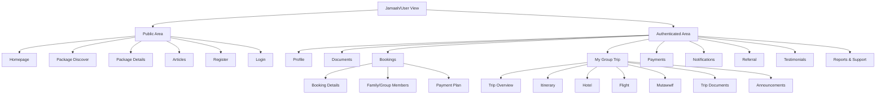
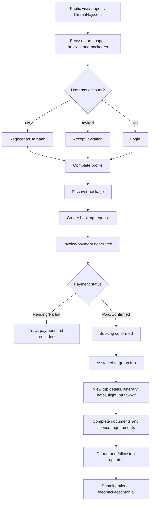
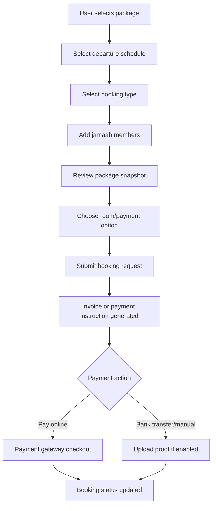

# Master PRD - UmrahHaji.com Jamaah/User View

## Document Information

| Item | Description |
| --- | --- |
| Product | UmrahHaji.com Jamaah/User View |
| Document Type | Master Product Requirements Document |
| Version | v1.0 |
| Platform | Mobile-first Responsive Web Platform |
| Scope | Jamaah/User customer-facing portal |
| Status | Draft |
| Prepared by | Product / UI/UX Team |
| Last Updated | 16 June 2026 |

---

## 1. Product Overview

UmrahHaji.com Jamaah/User View is the customer-facing experience for pilgrims who want to register, receive invitations from travel agencies, discover packages, create or manage bookings, complete profile and document requirements, track payments, follow group trip information, read guidance articles, submit feedback, and communicate issues through reports/support.

The view must be designed mobile-first because most jamaah interactions are expected to happen from mobile devices. Phase 1 remains a responsive web platform, not a native Android or iOS app.

This PRD defines the master scope, priority, navigation, core flows, data relationships, and cross-platform synchronization rules for the Jamaah/User side. Detailed module PRDs can be created after this master PRD is approved.

---

## 2. Product Relationship

Jamaah/User View is one of three connected product surfaces in UmrahHaji.com.

| Product Surface | Main User | Primary Purpose |
| --- | --- | --- |
| Admin Panel | Platform admin, finance, operations, support, compliance | Supervise all travel agencies, jamaah, bookings, packages, trips, finance, reports, announcements, articles, and platform settings |
| Travel Agency Portal | Travel agency owner, staff, operations, finance | Manage agency-owned packages, bookings, jamaah, trips, documents, payments, announcements, testimonials, and reports |
| Jamaah/User View | Public visitor, invited user, registered jamaah, family PIC | Discover packages, book packages, complete profile/documents, track payments, view trips, receive announcements, submit feedback and reports |

### 2.1 Shared Design System

All three surfaces use the same design system, typography, colors, components, interaction patterns, and accessibility standards.

### 2.2 Separate Navigation and Data Scope

Each surface has its own navigation, permission model, and data scope.

| Area | Admin Panel | Travel Agency Portal | Jamaah/User View |
| --- | --- | --- | --- |
| Data access | All platform data | Agency-owned data only | Own account, own family/group, own bookings/trips/payments only |
| Main action | Supervise and control | Operate and sell | Discover, book, complete, track, communicate |
| Navigation | Admin modules | Agency modules | Mobile-first customer journeys |
| Edit authority | Broad, permission-based | Agency-owned records | Own profile, own documents, limited booking/trip actions |
| Audit requirement | High | High | Medium to high for sensitive changes |

---

## 3. Platform Scope

### 3.1 Platform Type

UmrahHaji.com Jamaah/User View will be developed as a mobile-first responsive web platform accessible through modern browsers.

### 3.2 Supported Platforms

| Platform | Supported | Phase |
| --- | --- | --- |
| Mobile Web | Yes | Phase 1 |
| Tablet Web | Yes | Phase 1 |
| Desktop Web | Yes | Phase 1 |
| Android App | No | Not Phase 1 |
| iOS App | No | Not Phase 1 |
| PWA-ready behavior | Optional | Phase 1 enhancement |

### 3.3 Responsive Breakpoints

| Device | Width |
| --- | --- |
| Mobile | 320px - 767px |
| Tablet | 768px - 1023px |
| Desktop | 1024px+ |

### 3.4 Mobile-First Requirement

The primary layout must be optimized for one-handed mobile usage:

- Bottom navigation for high-frequency destinations.
- Sticky primary actions for booking, payment, document upload, and trip actions.
- Short cards instead of dense desktop tables.
- Progressive disclosure for long forms.
- Clear progress indicators for profile, booking, payment, and trip readiness.
- Fast loading with optimized images and compressed media.

---

## 4. Product Goals

1. Allow public users and invited users to become registered jamaah smoothly.
2. Help jamaah discover and compare suitable Umrah/Hajj packages.
3. Allow jamaah to create booking requests and continue payment flows.
4. Provide a clear personal trip dashboard once a booking is confirmed or assigned to a group trip.
5. Reduce travel agency support workload by letting jamaah self-serve profile, document, payment, announcement, itinerary, and transaction information.
6. Keep user-facing data synchronized with Admin Panel and Travel Agency Portal.
7. Provide a trustworthy, calm, and modern mobile experience for sensitive pilgrimage-related journeys.

---

## 5. Non-Goals

The following items are not part of Phase 1 unless explicitly approved later:

- Native Android app.
- Native iOS app.
- Full offline app mode.
- Real-time chat between jamaah and mutawwif.
- Fully automated refund dispute resolution.
- Full marketplace bidding between travel agencies.
- Public user-to-user social networking.
- Advanced loyalty marketplace.

---

## 6. User Roles

| Role | Description |
| --- | --- |
| Public Visitor | A non-logged-in user browsing homepage, articles, travel agencies, and packages |
| Registered User | A user account with login access but not necessarily linked to a booking |
| Invited Jamaah | A user invited by Admin or Travel Agency to join as jamaah |
| Jamaah | A registered user with pilgrim profile and booking/trip participation |
| Primary Booker | User who initiates or manages a booking for self, family, or group |
| Family PIC | User responsible for managing family members and their required documents |
| Family Member | User/dependent linked under a family or group booking |
| Returning Jamaah | Existing user who can book again without recreating core profile data |

---

## 7. Priority Scope

The screenshot reference is used as the initial priority map. The scope below expands it only where needed to make the product operationally complete and synchronized with existing Admin Panel and Travel Agency Portal PRDs.

### 7.1 Phase 1 - P1

| Module | Priority | Reason |
| --- | --- | --- |
| Homepage | P1 | Entry point for package discovery, onboarding, articles, and login |
| Register as Jamaah | P1 | Required for public onboarding |
| Approve Invitation | P1 | Required because Admin/Travel Agency can invite jamaah |
| Login & Account Activation | P1 | Required for secure access |
| Profile | P1 | Required for identity, passport, contact, family, and trip readiness |
| Documents | P1 | Required for visa/passport/travel readiness |
| Package Discover | P1 | Main commercial discovery flow |
| Booking | P1 | Converts package interest into reservation or booking request |
| My Group Trip | P1 | Main operational journey after booking confirmation |
| Transaction History | P1 | Allows jamaah to track invoices, payments, and receipts |
| Payment Settings | P1 | Allows payment method preference and payment instruction visibility |
| Notifications & Announcements | P1 | Required for travel agency/admin broadcast and trip updates |
| Referral | P1 | Basic referral code/link tracking |
| Articles | P1 | Educational content and pilgrimage guidance |
| Testimonials & Feedback | P1 | End-of-trip and optional daily feedback submission |
| Reports & Support | P1 | Required for issues, complaints, document/payment/trip problems |

### 7.2 Phase 2 - P2

| Module | Priority | Reason |
| --- | --- | --- |
| Travel Agency Directory | P2 | Helps users browse verified travel agencies |
| Compare Packages | P2 | Helps users evaluate similar packages before booking |
| Saved Packages / Wishlist | P2 | Improves package discovery and return visits |
| Advanced Referral Rewards | P2 | Requires clearer finance and reward rules |
| Advanced Review Browsing | P2 | Requires moderation, privacy, and testimonial policy |
| Multi-language Content | P2 | Useful for broader markets but not required for MVP |
| PWA Install Prompt | P2 | Useful enhancement after core mobile web is stable |

### 7.3 Phase 2 Candidate Features from Jamaah Mobile Scope

Some candidate features appear in the Jamaah mobile mockup but do not yet exist as full modules in Admin Panel or Travel Agency Portal. These should not automatically become large standalone modules. Each feature must have a clear data owner and operational reason before it is implemented.

| Candidate Feature | Recommended Placement | Back-Office Owner | Travel Agency Access | Recommendation |
| --- | --- | --- | --- | --- |
| Checklist + Guidance | My Trip, Documents, Articles | Admin manages checklist templates and guidance content | Can view jamaah readiness and add agency-specific notes if needed | Keep as P2 module candidate; sync with Trip Readiness |
| About & Contact Us | Homepage/Public Content | Admin manages static page content | Not required | Do not create standalone module; include under Homepage/Public Content |
| My Certificate | My Trip/Profile | Admin manages certificate templates and global rules | Can issue/request certificate for completed agency trips | Keep as P2 module candidate; depends on completed trip data |
| Health Profiling | Profile & Documents | Admin defines health data policy and sensitive access rules | Limited read access only for approved operations roles | Keep as P2 module candidate; requires consent and privacy controls |
| Assets & Debt | Not recommended for core Jamaah P2 | Finance/Admin only if financing product exists | No access unless financing module is approved | Defer until financing/credit product is formally defined |

### 7.4 P2 Back-Office Sync Requirement

Any P2 feature visible in Jamaah/User View must meet at least one of the following before implementation:

- It has an existing Admin Panel or Travel Agency Portal owner module.
- It can be managed through an existing content/settings module.
- It has a clear read-only data source from booking, trip, payment, or document records.
- It has privacy and permission rules if it contains sensitive data.

If none of the above is true, the feature should remain in the backlog and not be implemented in the user app.

---

## 8. Information Architecture

### 8.1 Mobile Navigation

Recommended bottom navigation:

| Tab | Purpose |
| --- | --- |
| Home | Landing, package highlights, trip reminders, articles |
| Packages | Discover, filter, package details, booking CTA |
| My Trip | Current booking, group trip, itinerary, documents, services |
| Payments | Invoices, payment status, receipts, payment settings |
| Profile | Personal info, documents, family, referrals, settings, support |

### 8.2 Secondary Menu

The Profile or menu drawer can include:

- My Profile
- My Documents
- My Bookings
- My Group Trip
- Transaction History
- Payment Settings
- Referrals
- Articles
- Announcements
- Testimonials
- Reports & Support
- Checklist & Guidance
- Certificates
- Health & Accessibility Profile
- Account Settings
- Logout

### 8.3 IA Diagram

---

## 9. Core Business Flow

---

## 10. Module Overview

### 10.1 Homepage

Purpose:
Provide a public and logged-in landing experience that helps users quickly continue their journey.

Key features:

- Hero/search entry to packages.
- Featured packages.
- Popular destinations or package categories.
- Articles/guides.
- Travel agency trust indicators.
- Login/register CTA.
- Logged-in widgets: active booking, next payment, trip countdown, missing documents.

Admin/TA sync:

- Featured packages come from published packages.
- Articles come from Articles Management.
- Announcements can be shown when targeted to user.

---

### 10.2 Register as Jamaah

Purpose:
Allow public users to create an account and start a jamaah profile.

Key features:

- Register using name, email, phone number, password.
- Email/phone verification.
- Consent to privacy policy and terms.
- Optional referral code.
- Redirect to profile completion after activation.

Business rules:

- Email and phone must be unique unless existing account recovery flow is triggered.
- Duplicate user detection must prevent multiple accounts with same verified identity.
- Password must not be sent through plain email.

---

### 10.3 Approve Invitation

Purpose:
Allow users invited by Admin or Travel Agency to accept an invitation and activate their account.

Key features:

- Secure invitation link.
- Invitation status validation.
- Set password or login if already registered.
- Confirm basic personal data.
- Accept invitation into a jamaah profile, booking, family/group, or trip context.

Business rules:

- Invitation link expires after configured duration.
- Expired invitation can be resent by Travel Agency/Admin.
- If invited email already exists, system links the invitation to the existing account after login verification.
- No temporary password should be displayed in email for production.

Invitation statuses:

| Status | Description |
| --- | --- |
| Pending | Invitation sent but not accepted |
| Accepted | User accepted and activated/linked account |
| Expired | Link expired |
| Cancelled | Invitation revoked by sender |

---

### 10.4 Profile

Purpose:
Allow jamaah to maintain personal, identity, contact, family, emergency, and travel readiness data.

Recommended profile sections:

- Personal Information.
- Contact Information.
- Identity & Passport.
- Emergency Contact.
- Address.
- Family/Companion.
- Health & Accessibility Notes.
- Travel Preferences.
- Linked Bookings.
- Activity & Change History.

Recommended simplification:

The Jamaah profile should not include broad social profile fields unless they serve travel operations. Fields such as hobbies, work experience, broad education history, awards, and general skills are not required for jamaah MVP.

Data that matters for jamaah:

- Legal name.
- Gender.
- Date of birth.
- Nationality.
- IC/NRIC/passport number.
- Passport issue/expiry date.
- Phone and email.
- Address.
- Emergency contact.
- Health/allergy notes.
- Wheelchair or accessibility requirement.
- Rooming preference.
- Meal preference.
- Family relation.

---

### 10.5 Documents

Purpose:
Allow jamaah to upload and track required documents for booking, visa, travel, and trip readiness.

Document types:

- Profile photo.
- IC/NRIC front and back.
- Passport biodata page.
- Passport photo.
- Vaccination certificate.
- Visa document.
- Flight ticket.
- Train ticket.
- Travel insurance.
- Special requirement document.

Document statuses:

| Status | Description |
| --- | --- |
| Missing | Required document has not been uploaded |
| Uploaded | User uploaded document, not yet reviewed |
| Under Review | Travel Agency/Admin is checking document |
| Approved | Document accepted |
| Need Revision | User must replace or correct document |
| Expired | Document date is no longer valid |

Upload rules:

| File Type | Allowed Format | Recommended Max Size | Notes |
| --- | --- | ---: | --- |
| Profile photo | JPG, JPEG, PNG, WEBP | 2 MB | Auto-compress and resize on upload |
| Identity/passport image | JPG, JPEG, PNG, WEBP, PDF | 5 MB | Use client-side compression for images |
| Certificate/document | PDF, JPG, JPEG, PNG | 5 MB | Store original plus optimized preview |
| Ticket/receipt | PDF, JPG, JPEG, PNG | 5 MB | OCR optional, not required in Phase 1 |
| Video evidence for report | MP4, MOV, WEBM | 20 MB | Optional, use only in Reports & Support |

Server protection rules:

- Compress images before upload when possible.
- Generate thumbnails/previews asynchronously.
- Use direct object storage upload for large files.
- Virus scan uploaded files.
- Restrict access with signed URLs.
- Mask sensitive document numbers in UI.

---

### 10.6 Package Discover

Purpose:
Allow users to browse published Umrah/Hajj packages from verified travel agencies.

Key features:

- Search by package name, destination, travel agency, date, or keyword.
- Filters: package category, type, price range, departure month, duration, agency, hotel, airline, rating, availability.
- Package cards with price, duration, agency, hotel, flight, labels, and availability.
- Package detail page.
- Booking CTA.

Package detail information:

- Package name.
- Travel agency.
- Category: Umrah/Hajj.
- Package type: Economy, Standard, Premium, VIP, Family, Custom.
- Duration.
- Departure schedules.
- Price per pax.
- Payment options.
- Commission/referral visibility only if relevant to user.
- Hotel information.
- Flight information.
- Itinerary summary.
- Inclusions/exclusions.
- Gallery/media.
- Terms and cancellation policy.
- Booking requirements.

Sync rules:

- Only published packages are visible to users.
- Package details shown to users must use the package snapshot at booking time once a booking is created.
- If Travel Agency edits a package after booking, user booking must keep its original snapshot unless change is explicitly applied to that booking.

---

### 10.7 Booking

Purpose:
Allow users to reserve or request a package booking for individual, family, or group.

Booking types:

- Individual.
- Family.
- Group.

Booking flow:

Booking statuses:

| Status | Description |
| --- | --- |
| Draft | User started but has not submitted |
| Pending Confirmation | Submitted but waiting for agency/admin confirmation |
| Pending Payment | Invoice generated, payment not completed |
| Deposit Paid | Deposit received |
| Partial Paid | Some payment received |
| Confirmed | Booking accepted and confirmed |
| Allocated to Trip | Booking members assigned to group trip |
| Cancelled | Booking cancelled |
| Refunded | Refund completed |

Business rules:

- Booking must store package snapshot.
- Booking must support individual, family, and group member structures.
- Family PIC can add/manage member data based on consent and relationship.
- Booking can be confirmed only if required rules are satisfied by Travel Agency/Admin.
- User can request cancellation or change, but approval is handled by Travel Agency/Admin.

---

### 10.8 My Group Trip

Purpose:
Provide a clear operational dashboard for confirmed jamaah assigned to a group trip.

Key features:

- Trip overview.
- Travel agency information.
- Mutawwif information.
- Departure and return schedule.
- Hotel assignment.
- Flight assignment.
- Room assignment.
- Itinerary by day.
- Trip documents and service readiness.
- Announcements.
- WhatsApp group link if enabled.
- Emergency contact.
- Trip status and countdown.

Trip status visibility:

| Status | User Meaning |
| --- | --- |
| Upcoming | Trip has not started |
| Document Pending | User still has missing/pending documents |
| Ready for Departure | User is operationally ready |
| In Trip | Trip is ongoing |
| Completed | Trip has ended |
| Cancelled | Trip cancelled or user removed |

Sync rules:

- Hotel, flight, itinerary, mutawwif, transport, and room data come from Group Trip Management.
- User can view trip data but cannot edit operational assignments.
- User can submit missing documents, report issues, and view announcements.
- Group trip changes should trigger notifications to affected jamaah.

---

### 10.9 Transaction History

Purpose:
Allow jamaah to view invoices, payments, receipts, refunds, and outstanding balances.

Key features:

- Invoice list.
- Payment progress.
- Payment status.
- Receipt download.
- Payment proof upload if manual transfer is enabled.
- Refund status tracking.
- Filter by package, booking, date, status.

Payment statuses:

| Status | Description |
| --- | --- |
| Unpaid | No payment received |
| Pending Verification | Manual proof uploaded and awaiting review |
| Deposit Paid | Deposit received |
| Partial Paid | Partial payment received |
| Paid | Full payment received |
| Overdue | Payment due date has passed |
| Refunded | Refund completed |
| Failed | Online payment failed |

Sync rules:

- User payment data is read from Billing/Finance Management.
- User cannot directly edit invoice amount.
- Platform commission is not shown to jamaah unless legally/operationally required.

---

### 10.10 Payment Settings

Purpose:
Allow user to manage payment preferences and receive payment instructions.

Phase 1 features:

- View supported payment methods.
- Save preferred payment method if provider supports tokenization.
- View bank transfer instructions.
- View payment reminder settings.
- View invoice email/WhatsApp notification preference.

Recommended boundaries:

- Do not build full wallet system in Phase 1.
- Do not store raw card data on UmrahHaji.com servers.
- Any card or e-wallet tokenization must be handled by payment gateway.

---

### 10.11 Referral

Purpose:
Allow users to share a referral code or link for package discovery or registration.

Phase 1 features:

- Referral code/link.
- Share CTA.
- Basic referral history.
- Status: Clicked, Registered, Booked, Eligible, Rewarded.
- Referral rules text.

Recommended Phase 1 boundary:

- Keep referral reward calculation simple.
- Reward payout or wallet credit can be Phase 2 unless finance rules are confirmed.
- Finance/Admin must be able to audit referral attribution before any reward is released.

---

### 10.12 Articles

Purpose:
Provide educational and trust-building content for Umrah/Hajj preparation.

Key features:

- Article list.
- Category filters.
- Search.
- Article details.
- Featured articles.
- Related articles.
- Save/share article.

Sync rules:

- Only published articles from Articles Management are visible.
- Draft/archived articles are not visible to users.
- Featured articles can appear on Homepage.

---

### 10.13 Notifications & Announcements

Purpose:
Keep jamaah informed about booking, payment, document, trip, announcement, and support updates.

Notification sources:

- Admin Panel announcements.
- Travel Agency announcements.
- Booking status updates.
- Payment reminders.
- Document revision requests.
- Group trip schedule changes.
- Report/support status updates.
- Testimonial request.

Delivery channels:

- In-app notification.
- Email.
- WhatsApp/SMS, if enabled and integrated.

Business rules:

- Critical operational notifications should be logged.
- Users may manage notification preferences except mandatory operational/legal notices.
- Announcements can be targeted by user, booking, group trip, package, or travel agency.

---

### 10.14 Testimonials & Feedback

Purpose:
Collect structured feedback from jamaah after daily itinerary activities and at the end of trip.

Recommended rule:

- Daily itinerary feedback should be optional.
- End-of-trip feedback should be strongly prompted but not blocking; operational completion should not depend on testimonial submission.

Feedback targets:

| Feedback Type | Target | Mandatory? |
| --- | --- | --- |
| Daily activity feedback | Specific itinerary day/activity | Optional |
| End-of-trip travel agency feedback | Travel Agency/package experience | Optional but strongly prompted |
| End-of-trip mutawwif feedback | Assigned mutawwif/service quality | Optional but strongly prompted |
| General trip feedback | Overall experience | Optional |

Why separate travel agency and mutawwif feedback:

- Travel agency feedback evaluates operations, communication, package accuracy, hotel/flight handling, and support.
- Mutawwif feedback evaluates guidance, care, religious explanation, punctuality, and group assistance.
- A general score alone is less useful for quality improvement.

Sync rules:

- Submitted testimonials appear in Testimonial Management.
- Public display must respect moderation, consent, and anonymity settings.
- Media uploads must follow upload rules.

---

### 10.15 Reports & Support

Purpose:
Allow jamaah to report issues related to bookings, payments, documents, travel agency service, mutawwif service, trip operations, or platform problems.

Key features:

- Create report.
- Select category.
- Select related booking/trip/package/member.
- Describe issue.
- Upload attachments.
- Track status.
- View admin/agency response.
- Reopen report if unresolved.

Report categories:

- Service.
- Document.
- Payment.
- Trip.
- Hotel.
- Flight.
- Mutawwif.
- Travel Agency.
- Platform.
- Safety/Compliance.

Report statuses:

| Status | Description |
| --- | --- |
| Open | Newly submitted |
| In Progress | Assigned and being handled |
| Waiting for User | User must provide more information |
| Resolved | Resolution provided |
| Closed | Case closed |
| Reopened | User reopened after resolution |

Sync rules:

- Reports appear in Admin Report Management.
- Reports involving a specific travel agency can be routed to the Travel Agency Portal when appropriate.
- Sensitive compliance/safety reports can be restricted to Admin only.

---

### 10.16 Travel Agency Directory - P2

Purpose:
Allow public users to browse verified travel agencies before choosing packages.

Key features:

- Verified agency list.
- Search and filter.
- Agency profile.
- Packages by agency.
- Ratings/testimonials summary.
- Contact or inquiry CTA.

Visibility rules:

- Only active and verified agencies should be public.
- Suspended or inactive agencies must not appear.

---

### 10.17 Compare Packages - P2

Purpose:
Help users compare multiple packages before booking.

Comparison fields:

- Price.
- Duration.
- Departure dates.
- Hotel.
- Flight.
- Itinerary.
- Inclusions.
- Room type.
- Payment options.
- Travel agency rating.
- Cancellation policy.

Business rules:

- Compare only published packages.
- Selected packages should keep current published values until booking is created.
- Once booking is created, the package snapshot is stored in booking record.

---

### 10.18 Checklist & Guidance - P2

Purpose:
Provide jamaah with a structured preparation checklist and guidance content before departure, during trip, and after trip.

Recommended placement:

- Show checklist inside My Trip and Documents.
- Show general guidance through Articles/Knowledge Base.
- Do not create a separate high-level bottom navigation item unless usage data proves it is needed.

Checklist examples:

- Complete profile.
- Upload passport.
- Upload vaccination document.
- Confirm emergency contact.
- Review payment status.
- Review flight and hotel information.
- Read ihram preparation guidance.
- Read departure briefing.
- Submit post-trip feedback.

Back-office sync:

- Admin Panel owns global checklist templates.
- Travel Agency Portal can view jamaah readiness and optionally add agency-specific guidance for its own trips.
- Jamaah/User View displays assigned checklist items based on booking, group trip, document requirements, and itinerary stage.

Business rules:

- Checklist completion can be automatic when linked data is already approved.
- Manual checklist completion should be allowed only for non-critical guidance items.
- Critical items such as passport, visa, payment, and vaccination must be driven by actual document/payment statuses.

---

### 10.19 About & Contact Us - P2 / Public Content

Purpose:
Provide basic platform information, contact channels, support policy, and trust content.

Recommended placement:

- Include inside Homepage & Public Navigation PRD.
- Manage content through Admin content/settings, not a standalone Jamaah module.

Content examples:

- About UmrahHaji.com.
- Contact support.
- FAQ.
- Privacy policy.
- Terms and conditions.
- Emergency contact guidance.

Back-office sync:

- Admin Panel manages static content.
- Travel Agency Portal does not need a dedicated module.

---

### 10.20 My Certificate - P2

Purpose:
Allow jamaah to view and download trip completion certificates or participation certificates after a completed trip.

Certificate types:

- Trip completion certificate.
- Umrah/Hajj participation certificate.
- Mutawwif-led program attendance certificate.
- Training/briefing completion certificate, if offered.

Back-office sync:

- Admin Panel owns certificate template rules.
- Travel Agency Portal can issue or request certificates for completed agency group trips.
- Jamaah/User View can view/download certificates assigned to the user.

Business rules:

- Certificate can only be issued after eligible trip completion or approved event completion.
- Certificate must store issuer, template version, issue date, certificate ID, and related trip/package.
- Certificate must be downloadable as PDF.
- Certificate can be revoked or reissued by authorized Admin/Travel Agency roles.

---

### 10.21 Health & Accessibility Profile - P2

Purpose:
Collect limited health, accessibility, and assistance information that helps travel agencies and mutawwif support jamaah safely during the trip.

Recommended placement:

- Include inside Profile & Documents.
- Do not combine with broad medical record management.

Allowed Phase 2 data:

- Allergy notes.
- Chronic condition notes.
- Medication reminder notes.
- Wheelchair/accessibility requirement.
- Mobility assistance need.
- Emergency medical contact.
- Dietary restriction.
- Special care notes for elderly/child jamaah.

Sensitive data rules:

- User consent is required before collecting health data.
- Data must be visible only to authorized operations/support roles.
- Travel Agency access should be limited to jamaah under its own booking/trip.
- Mutawwif access, if enabled, should show only operationally necessary care notes.
- Every view/edit of sensitive health data should be audit logged.
- Health profile should not be used for eligibility scoring unless a separate compliance policy is defined.

---

### 10.22 Assets & Debt - Deferred

Purpose:
This feature is not recommended for core Jamaah/User View unless UmrahHaji.com introduces financing, savings, affordability assessment, or credit-related products.

Reason to defer:

- The data is financially sensitive.
- It is not required for package discovery, booking, payment, or trip operations.
- It requires finance policy, privacy policy, security controls, and possibly regulatory review.
- It would create a new data domain not yet covered by Admin Panel or Travel Agency Portal.

Recommended decision:

- Do not include Assets & Debt in Phase 1 or ordinary Phase 2.
- Revisit only if Finance Management introduces installment financing, credit assessment, travel savings, or subsidy eligibility.
- If approved later, the feature should belong to Finance Management, not Jamaah profile.

---

## 11. Data Scope and Ownership

| Data | Source of Truth | User Access |
| --- | --- | --- |
| Account login | User Management/Auth | Own account only |
| Jamaah profile | Jamaah Management/User Profile | Own profile, limited family if PIC |
| Travel agency profile | Travel Agency Management | Public/limited view for verified agencies |
| Package | Package Management | Published package view |
| Booking | Booking Management | Own bookings and managed family/group bookings |
| Group trip | Group Trip Management | Own assigned trip only |
| Hotel | Hotel Management | View through package/trip context |
| Flight/Airline | Flight/Airline Management | View through package/trip context |
| Itinerary | Itinerary Management/Group Trip | View through package/trip context |
| Invoice/payment | Billing/Finance Management | Own invoices/payments only |
| Articles | Articles Management | Published articles |
| Announcements | Announcement Management | Targeted announcements only |
| Testimonials | Testimonial Management | Own submissions and public approved testimonials |
| Reports | Report Management | Own submitted reports |
| Checklist & guidance | Checklist Templates / Articles / Group Trip | Assigned checklist and guidance only |
| Certificates | Certificate Templates / Group Trip / Travel Agency | Own certificates only |
| Health & accessibility profile | Jamaah Profile / Sensitive Profile Data | Own profile, limited authorized access |
| Assets & debt | Deferred / Finance Management if approved later | Not in current scope |

---

## 12. Data Privacy and Security

### 12.1 Privacy Requirements

- User must only see their own personal data.
- Family PIC can view/manage family member data based on relationship and consent.
- Minor/dependent profiles must be managed by guardian or family PIC.
- Sensitive documents must use protected access.
- Identity numbers and passport numbers should be masked in non-edit views.
- Audit logs are required for sensitive data changes.

### 12.2 Authentication Requirements

- Email/phone verification for new accounts.
- Secure invitation links.
- Password reset flow.
- Session timeout for sensitive pages.
- Optional MFA for future phase.

### 12.3 Sensitive Changes

The following changes should create audit history:

- Full legal name.
- IC/NRIC/passport number.
- Passport expiry date.
- Date of birth.
- Nationality.
- Primary phone/email.
- Document upload/replacement.
- Booking cancellation request.
- Payment proof upload.

---

## 13. Status Model

### 13.1 Account Status

| Status | Description |
| --- | --- |
| Invited | Account invitation sent |
| Active | User can log in and use platform |
| Suspended | Access restricted by Admin |
| Deactivated | Account disabled |

### 13.2 Profile Completion Status

| Status | Description |
| --- | --- |
| Incomplete | Required data missing |
| Pending Review | Sensitive profile/document data awaiting review |
| Complete | Required data completed |
| Need Revision | User must correct data/document |

### 13.3 Trip Readiness Status

| Status | Description |
| --- | --- |
| Not Ready | Required items missing |
| Pending Review | Submitted items awaiting review |
| Ready | Required items approved |
| Blocked | Critical issue prevents departure readiness |

---

## 14. Cross-Module Synchronization

### 14.1 Admin Panel Synchronization

Jamaah/User View must sync with Admin Panel for:

- User account status.
- Jamaah profile visibility.
- Documents and verification status.
- Health data access policy, if Health & Accessibility Profile is enabled.
- Booking oversight.
- Group trip assignment.
- Payment/invoice status.
- Reports/support case status.
- Testimonials moderation.
- Announcements and articles.
- Checklist templates, static pages, and certificate templates.

### 14.2 Travel Agency Portal Synchronization

Jamaah/User View must sync with Travel Agency Portal for:

- Invitations created by agency.
- Bookings for agency packages.
- Jamaah assigned to agency group trips.
- Documents requested by agency.
- Payment reminders and invoice visibility.
- Trip announcements.
- Testimonials for agency/mutawwif.
- Reports that involve the agency.
- Trip readiness checklist, if enabled.
- Certificate issuance/request for completed agency trips, if enabled.
- Limited health/accessibility notes for assigned trip members, if enabled and permitted.

### 14.3 P2 Feature Ownership Rules

For P2 features that do not yet exist in Admin Panel or Travel Agency Portal:

| Feature | Admin Panel Requirement | Travel Agency Portal Requirement | User View Requirement |
| --- | --- | --- | --- |
| Checklist + Guidance | Checklist template management or content management | Trip readiness visibility, optional agency note | Display assigned checklist and guidance |
| About & Contact Us | Static page/content settings | None | Public page access |
| My Certificate | Certificate template and issuance audit | Issue/request/download for own completed trips | Download own certificate |
| Health Profiling | Sensitive data policy, permission, audit log | Limited operational notes only | Consent-based health profile |
| Assets & Debt | Finance module required before any implementation | Not recommended | Deferred |

### 14.4 Snapshot Rules

Some data must be snapshotted to protect booking consistency:

- Package price.
- Package inclusions.
- Hotel/flight shown at booking time.
- Room pricing.
- Departure schedule.
- Payment terms.
- Cancellation policy.

If a package changes after booking, the user booking must preserve original snapshot unless Travel Agency/Admin explicitly applies change and the user is notified.

---

## 15. Functional Requirements Summary

| ID | Requirement | Priority |
| --- | --- | --- |
| JUV-001 | User can register as jamaah from public web | P1 |
| JUV-002 | User can accept invitation from Admin/Travel Agency | P1 |
| JUV-003 | User can complete personal and travel-ready profile | P1 |
| JUV-004 | User can upload required documents with file validation | P1 |
| JUV-005 | User can browse and filter published packages | P1 |
| JUV-006 | User can view package details and create booking request | P1 |
| JUV-007 | User can manage individual/family/group booking participants | P1 |
| JUV-008 | User can view booking status and package snapshot | P1 |
| JUV-009 | User can view invoices, payment status, and receipts | P1 |
| JUV-010 | User can access group trip details after assignment | P1 |
| JUV-011 | User can view itinerary, hotel, flight, room, and mutawwif details | P1 |
| JUV-012 | User can receive targeted announcements/notifications | P1 |
| JUV-013 | User can read published articles | P1 |
| JUV-014 | User can submit optional daily and end-of-trip feedback | P1 |
| JUV-015 | User can submit and track reports/support cases | P1 |
| JUV-016 | User can share referral link/code | P1 |
| JUV-017 | User can browse verified travel agency directory | P2 |
| JUV-018 | User can compare packages side by side | P2 |
| JUV-019 | User can save packages for later | P2 |
| JUV-020 | User can manage advanced notification preferences | P2 |
| JUV-021 | User can view assigned checklist and preparation guidance | P2 |
| JUV-022 | User can view About, Contact, FAQ, Terms, and Privacy pages | P2 |
| JUV-023 | User can download issued trip certificates | P2 |
| JUV-024 | User can submit consent-based health and accessibility profile | P2 |
| JUV-025 | Assets & Debt remains deferred until a finance/credit product is approved | Deferred |

---

## 16. Recommended Module PRD Sequence

After this master PRD, the recommended module PRD order is:

| Order | PRD | Priority |
| ---: | --- | --- |
| 01 | Homepage & Public Navigation | P1 |
| 02 | Registration, Login & Invitation Acceptance | P1 |
| 03 | Profile & Documents | P1 |
| 04 | Package Discover & Package Details | P1 |
| 05 | Booking | P1 |
| 06 | My Group Trip | P1 |
| 07 | Payments, Transaction History & Payment Settings | P1 |
| 08 | Notifications & Announcements | P1 |
| 09 | Referral | P1 |
| 10 | Articles | P1 |
| 11 | Testimonials & Feedback | P1 |
| 12 | Reports & Support | P1 |
| 13 | Travel Agency Directory | P2 |
| 14 | Compare Packages | P2 |
| 15 | Account Settings & Privacy | P2 |
| 16 | Checklist & Guidance | P2 |
| 17 | Certificates | P2 |
| 18 | Health & Accessibility Profile | P2 |

Not recommended as standalone module:

| Candidate | Recommended Handling |
| --- | --- |
| About & Contact Us | Include inside Homepage & Public Navigation or Admin content/settings |
| Assets & Debt | Defer until Finance Management has a financing/credit scope |

---

## 17. UX Principles

### 17.1 Mobile-first clarity

Every flow should be clear on mobile without relying on desktop tables.

### 17.2 Trust and calm

The product handles pilgrimage, money, identity, and travel documents. UI should feel trustworthy, calm, and precise.

### 17.3 Progress visibility

Users must always understand:

- What is missing.
- What is pending review.
- What is approved.
- What they need to do next.

### 17.4 Reduce support dependency

Common questions should be answered through structured trip details, document statuses, payment status, announcements, and articles.

### 17.5 Safe sensitive actions

Sensitive actions must use confirmations, clear consequences, and audit logs.

---

## 18. Analytics and Metrics

Recommended metrics:

- Registration conversion rate.
- Invitation acceptance rate.
- Profile completion rate.
- Document completion rate.
- Package detail conversion rate.
- Booking request conversion rate.
- Payment completion rate.
- Trip readiness rate.
- Report creation volume.
- Average report resolution time.
- Article views.
- Referral click and booking conversion.
- Testimonial submission rate.

---

## 19. Dependencies

| Dependency | Related PRD |
| --- | --- |
| User authentication and account status | Admin Panel User Management |
| Jamaah profile and document management | Admin/TA Jamaah Management |
| Package visibility and package snapshot | Package Management |
| Booking lifecycle | Booking Management |
| Group trip assignment and itinerary | Group Trip Management |
| Hotel and flight details | Hotel Management, Flight/Airline Management |
| Payment and invoice tracking | Billing/Finance Management |
| Announcements | Announcement Management |
| Articles | Articles Management |
| Testimonials | Testimonial Management |
| Reports/support | Report Management |
| Checklist & guidance | Admin content/checklist template, Group Trip readiness, Articles |
| Certificates | Certificate templates, Group Trip completion, Travel Agency issuance |
| Health & accessibility profile | Jamaah profile, permission policy, audit logs |
| Assets & debt | Deferred; future Finance Management only if approved |

---

## 20. Acceptance Criteria - Master Level

1. Jamaah/User View has a clear separation from Admin Panel and Travel Agency Portal.
2. Phase 1 scope covers registration, invitation acceptance, profile, documents, package discovery, booking, trip view, payments, articles, referral, testimonials, notifications, and reports.
3. All user-visible booking, package, payment, and trip data can be traced back to existing Admin/TA modules.
4. Users cannot access other users' private data.
5. Sensitive profile/document/payment actions are auditable.
6. Mobile layout supports all P1 flows without requiring desktop view.
7. Upload limits and file validation are defined for all user uploads.
8. Package and booking snapshot rules are defined.
9. Feedback is separated between Travel Agency and Mutawwif for end-of-trip quality analysis.
10. Future Phase 2 items are clearly separated from MVP/P1 scope.
11. P2 features that need back-office ownership are mapped to Admin Panel and Travel Agency Portal responsibilities.
12. Sensitive P2 features such as Health Profiling and Assets & Debt are not implemented without explicit privacy and finance governance.

---

## 21. Open Questions

1. Should direct public self-service booking be fully enabled in Phase 1, or should Phase 1 submit booking requests that Travel Agency confirms manually?
2. Should payment be online gateway only, manual transfer only, or both in Phase 1?
3. What referral reward model should be used: fixed amount, percentage, voucher, or non-financial tracking only?
4. Should Travel Agency Directory be public in Phase 2, or visible only after login?
5. Should user profile verification be handled by Travel Agency first, Admin first, or both depending on document type?
6. Should Checklist + Guidance be global-only from Admin, or should Travel Agency be allowed to add agency-specific checklist items?
7. Should certificates be issued automatically after trip completion, or manually approved by Travel Agency/Admin?
8. What minimum health/accessibility information is legally and operationally acceptable to collect?
9. Should Assets & Debt be permanently removed from Jamaah/User scope unless a financing product is approved?

---

## 22. Summary

Jamaah/User View should be treated as a mobile-first customer portal that connects the public website, package discovery, booking, trip operations, payment tracking, and support workflows. It should not duplicate Admin Panel or Travel Agency Portal logic. Instead, it should expose the right self-service layer for users while keeping operational control, approvals, and sensitive management inside Admin Panel and Travel Agency Portal.
