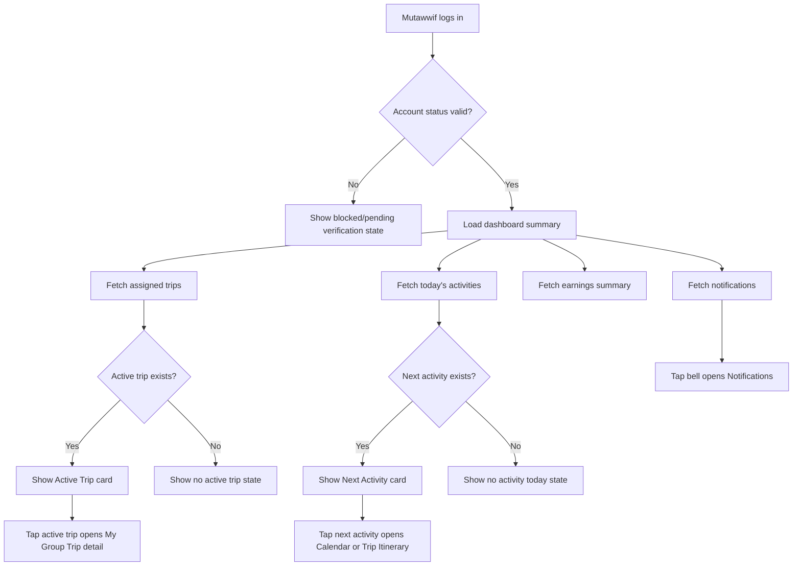

# MV PRD 01 - Home / Mutawwif Dashboard

Product: UmrahHaji.com Mutawwif View  
Module: Home / Mutawwif Dashboard  
Scope: Mutawwif Mobile Web App / Operational Dashboard  
Platform: Mobile-first Responsive Web Platform  
Status: Draft  
Last Updated: 18 June 2026  

---

## 1. Objective

Home / Mutawwif Dashboard is the primary landing screen for mutawwif after login. It gives a fast operational overview of the mutawwif's current assignments, active pilgrims, today's activities, active trip, next activity, notifications, and monthly earnings.

This screen must help mutawwif answer:

1. Which group trips am I assigned to?
2. How many jamaah are currently under my guidance?
3. What is my next activity today?
4. Which active trip needs my attention now?
5. Are there urgent schedule changes or notifications?
6. How much allowance/tip/earning is recorded this month?
7. Where should I go next: trip detail, calendar, notification, or profile?

The home screen must be operational, compact, and mobile-first. It should not become a full analytics dashboard. The goal is quick awareness and action.

---

## 2. Relationship With Mutawwif View Master Scope

This module follows the Mutawwif View mobile web app scope:

1. Mutawwif View is focused on assigned work, not platform-wide admin operations.
2. Mutawwif can see only data related to their own assignments.
3. Mutawwif cannot see sensitive jamaah financial data unless explicitly needed for a task.
4. Mutawwif dashboard must sync with Travel Agency group trip assignments and Admin-controlled data.
5. Allowance/tip information is read-only unless the related module allows request/update action.
6. All assignment, schedule, and payment data must show last updated status when relevant.

---

## 3. Relationship With Admin, Travel Agency, and Jamaah PRDs

| Source Module | Relationship |
| --- | --- |
| Admin Mutawwif Management | Source of mutawwif profile, verification status, role, and active/inactive status |
| Admin Group Trip Management | Platform-level view of group trips and assignments |
| Admin Itinerary Management | Source of itinerary templates and activity structure |
| Admin Report Management | Destination for incidents/escalation if needed |
| Admin Finance / Allowance Management | Source of allowance/tip payout status if administered centrally |
| Travel Agency Group Trip Management | Source of trip assignment, jamaah list, trip status, hotel, flight, transport, and itinerary |
| Travel Agency Mutawwif Assignment | Source of assigned mutawwif role, schedule, and responsibility |
| Travel Agency Finance Management | Source of allowance/tip records if handled by agency |
| Jamaah My Group Trip | Jamaah-facing version of trip details and itinerary |
| Jamaah Checklist & Guidance | Mutawwif daily guidance may align with jamaah-facing ritual/trip guidance |

### 3.1 Key Sync Rule

The Mutawwif Dashboard is a read-only operational summary. Mutawwif should not be able to edit trip, package, hotel, flight, or payment master data from the home screen.

---

## 4. Research Notes and Product Decisions

Mutawwif acts as a guide/support role during Umrah/Hajj trips. Because this role touches religious guidance, group movement, safety, and jamaah support, the dashboard should prioritize:

1. Active assignment clarity.
2. Daily schedule and next action.
3. Jamaah count and group responsibility.
4. Notifications for schedule changes.
5. Quick access to group trip detail.
6. Verification/license status in profile, not as a large home widget unless incomplete.
7. Incident/report escalation from trip detail, not from homepage unless urgent.

Product safety notes:

1. Mutawwif guidance content must not be presented as official fatwa.
2. Mutawwif should follow Travel Agency, group leader, and official authority instructions during operations.
3. Emergency support must route users to correct local/agency/platform channels.
4. Earnings shown in dashboard are summaries only; payout detail belongs to Allowance & Tip module.

References used for product direction:

1. Nusuk pilgrimage ecosystem: https://www.nusuk.sa/
2. CDC Saudi Arabia travel health guidance: https://wwwnc.cdc.gov/travel/destinations/traveler/none/saudi-arabia

---

## 5. Scope

### 5.1 In Scope for Phase 1

1. Mobile dashboard after mutawwif login.
2. Top navbar with logo and notification bell.
3. Greeting using logged-in mutawwif name/title.
4. Stats row:
   - Assigned Groups.
   - Active Pilgrims.
   - Today's Activities.
5. Earnings summary card:
   - Earnings this month.
   - Growth percentage if available.
   - Paid amount.
   - Tips received.
6. Active Trip section.
7. Next Activity section.
8. Bottom navigation:
   - Home.
   - My Trips.
   - Calendar.
   - Profile.
9. Loading, empty, error, and offline-friendly states.
10. Permission-based data display.
11. Deep links to notifications, trip detail, calendar, allowance, and profile.

### 5.2 In Scope for Phase 2

1. Multiple active trip carousel.
2. Urgent task card.
3. Pending incident/action reminders.
4. Offline cached daily schedule.
5. Home widgets customization.
6. Performance/rating snapshot.
7. Today route/map shortcut.
8. Team/assistant mutawwif summary if assigned.

### 5.3 Out of Scope

1. Full trip management.
2. Full calendar management.
3. Full allowance payout management.
4. License/document editing.
5. Jamaah profile editing.
6. Booking/package creation.
7. Admin verification actions.
8. Travel agency management actions.
9. Payment method setup.
10. Incident report creation from dashboard, unless as a shortcut in future.

---

## 6. User Roles and Access

| Role | Access |
| --- | --- |
| Pending mutawwif | Cannot access full dashboard until invitation/verification rules allow |
| Invited mutawwif | Can see invitation acceptance/onboarding state |
| Active mutawwif | Can access dashboard and assigned data |
| Suspended/inactive mutawwif | Dashboard access blocked or limited with reason |
| Lead mutawwif | Can see assigned groups and possibly assistant mutawwif/team summaries |
| Assistant mutawwif | Can see only assigned groups/activities according to permission |
| Admin | Does not use Mutawwif View; manages data from Admin Panel |
| Travel Agency staff | Does not use Mutawwif View; assigns and monitors from TA Portal |

---

## 7. Information Architecture

```text
Mutawwif View
├── Home
│   ├── Top Navbar
│   ├── Greeting
│   ├── Stats Summary
│   ├── Earnings Summary
│   ├── Active Trip
│   ├── Next Activity
│   └── Bottom Navigation
├── My Trips
├── Calendar
├── Notifications
└── Profile
```

---

## 8. Main Dashboard Flow



---

## 9. Screen Structure

### 9.1 Screen Overview

Reference size: mobile 412 x 937px.

| Area | Width/Height | Description |
| --- | --- | --- |
| Top Navbar | 412 x 64px | Logo and notification bell |
| Main Content | 380 x variable | Greeting, stats, earnings, active trip, next activity |
| Bottom Navigation | 412 x 74px | Home, My Trips, Calendar, Profile |

### 9.2 Top Navbar

| Element | Requirement |
| --- | --- |
| Logo | Display UmrahHaji.com logo image |
| Notification bell | Opens notification center |
| Unread badge | Optional; show unread notification count if available |

Rules:

1. Logo is static and taps to Home.
2. Bell is visible only for authenticated mutawwif.
3. If notifications fail to load, bell remains usable and opens notification page with error state.

### 9.3 Greeting

Text:

```text
Assalamu'alaikum, Ustadz Muhammad
```

Data source:

| Field | Source |
| --- | --- |
| title | Mutawwif profile |
| displayName | User profile |

Rules:

1. Use title if available: Ustadz, Ustazah, Sheikh, etc.
2. If display name is unavailable, fallback to `Assalamu'alaikum`.
3. Greeting should not wrap awkwardly on small screens; name can truncate after two lines.

---

## 10. Stats Summary

### 10.1 Stat Cards

| Card | Icon | Field | Example | Source |
| --- | --- | --- | --- | --- |
| Assigned Groups | Briefcase/group | assignedGroupsCount | 3 | Group Trip Assignment |
| Active Pilgrims | People | activePilgrimCount | 45 | Group Trip Members |
| Today's Activities | Calendar | todayActivityCount | 3 | Itinerary / Calendar |

### 10.2 Calculation Rules

| Metric | Rule |
| --- | --- |
| Assigned Groups | Count active/upcoming group trips assigned to this mutawwif |
| Active Pilgrims | Count jamaah in active assigned trips only |
| Today's Activities | Count itinerary activities scheduled today in local/destination timezone |

### 10.3 Display Rules

1. Use compact numeric cards.
2. If value is loading, show skeleton.
3. If no data, show `0`.
4. If API error occurs, show `--` and allow retry from page refresh.

---

## 11. Earnings Summary

### 11.1 Purpose

Give mutawwif quick visibility into monthly earnings without making the dashboard a finance screen.

### 11.2 Fields

| Field | Example | Description | Source |
| --- | --- | --- | --- |
| Label | Earnings This Month | Card title | Static |
| Earnings this month | RM 3,450 | Gross recorded earning for current month | Allowance & Tip |
| Growth percent | +12.5% | Change compared with previous period | Allowance & Tip |
| Paid | RM 2,250 | Amount marked paid | Allowance & Tip / Finance |
| Tips received | RM 450 | Tips recorded in month | Tip Management |
| Tips extra | +3 more | Additional tip entries hidden in summary | Tip Management |

### 11.3 Business Rules

1. Earnings are read-only on home.
2. Tap card opens Allowance & Tip module.
3. If finance module is disabled, hide earnings card or show `Earnings unavailable`.
4. If payout is manual in Phase 1, label should say `Recorded earnings`, not guaranteed payout.
5. Growth percentage is optional; hide if previous period data is unavailable.
6. Paid amount must include only confirmed paid records.
7. Tips must show only tips assigned to the logged-in mutawwif.

### 11.4 Privacy Rules

1. Mutawwif sees only own earnings.
2. Mutawwif cannot see jamaah package payment details from home.
3. If Travel Agency owns payout, show agency-owned status and last updated date in Allowance & Tip module.

---

## 12. Active Trip Section

### 12.1 Purpose

Highlight the most relevant current trip assignment.

Header:

```text
Active Trip
```

CTA:

```text
View All
```

CTA destination: My Trips list.

### 12.2 Active Trip Card Fields

| Field | Example | Source |
| --- | --- | --- |
| Group avatar/icon | Group image or default icon | Group Trip |
| Trip name | Barokah Umrah Group 2025 | Group Trip |
| Travel agency | Jaya Tours | Travel Agency |
| Status | Active | Group Trip status |
| Location | Makkah | Itinerary current day/location |
| Pilgrim count | 45 Pilgrims | Trip Members |
| Date range | Dec 28 - Jan 10 | Group Trip schedule |

### 12.3 Active Trip Selection Logic

If more than one active trip exists, select in this priority:

1. Trip with activity today.
2. Trip currently in progress.
3. Trip with nearest departure.
4. Most recently updated assigned trip.

Phase 2 may support carousel/multiple active trip cards.

### 12.4 Actions

| User Action | Result |
| --- | --- |
| Tap card | Opens My Group Trip detail |
| Tap View All | Opens My Trips list |
| Tap agency name | No action in Phase 1, or open agency detail if allowed |

---

## 13. Next Activity Section

### 13.1 Purpose

Tell mutawwif the next schedule item they need to lead, monitor, or attend.

Header:

```text
Next Activity
```

### 13.2 Activity Card Fields

| Field | Example | Source |
| --- | --- | --- |
| Date/time | Today, 09:00 AM | Itinerary/Calendar |
| Activity name | Umrah Tawaf | Itinerary activity |
| Trip name | Barokah Umrah Group 2025 | Group Trip |
| Location | Masjid al-Haram | Itinerary location |

### 13.3 Activity Selection Logic

The next activity is:

1. The nearest upcoming activity assigned to the mutawwif.
2. Within active or upcoming group trips.
3. Based on the activity's local/destination timezone.
4. Excluding completed/cancelled activities.

### 13.4 Actions

| User Action | Result |
| --- | --- |
| Tap activity card | Opens activity detail in Calendar or Trip Itinerary |
| Tap location | Optional Phase 2: opens map/departure meeting point |

---

## 14. Bottom Navigation

### 14.1 Tabs

| Tab | Icon | Label | State |
| --- | --- | --- | --- |
| Home | Home icon | Home | Active |
| My Trips | Users/group icon | My Trips | Inactive |
| Calendar | Calendar icon | Calendar | Inactive |
| Profile | Avatar/photo | Profile | Inactive |

### 14.2 Rules

1. Bottom nav is fixed at the bottom on mobile.
2. Active tab must be visually clear.
3. Profile tab may use avatar image or default profile icon.
4. Bottom nav must respect safe-area padding.
5. Bottom nav should not cover page content.

---

## 15. Data Requirements

### 15.1 Dashboard API Response

```text
MutawwifDashboard
├── user
│   ├── id
│   ├── title
│   ├── displayName
│   ├── avatarUrl
│   └── verificationStatus
├── stats
│   ├── assignedGroupsCount
│   ├── activePilgrimCount
│   └── todayActivityCount
├── earnings
│   ├── currency
│   ├── thisMonth
│   ├── growthPercent
│   ├── paidAmount
│   ├── tipsReceived
│   └── extraTipCount
├── activeTrip
│   ├── id
│   ├── name
│   ├── agencyName
│   ├── status
│   ├── currentLocation
│   ├── pilgrimCount
│   ├── startDate
│   └── endDate
├── nextActivity
│   ├── id
│   ├── startsAt
│   ├── timezone
│   ├── name
│   ├── tripName
│   └── location
└── notifications
    ├── unreadCount
    └── hasUrgent
```

### 15.2 Data Freshness

| Data | Recommended Freshness |
| --- | --- |
| Greeting/profile | On login/session refresh |
| Stats | Refresh on screen open and pull-to-refresh |
| Earnings | Refresh on screen open; cache allowed |
| Active trip | Refresh on screen open and assignment update |
| Next activity | Refresh on screen open and every meaningful schedule update |
| Notification count | Refresh on screen open and notification event |

---

## 16. States and Edge Cases

### 16.1 Loading State

1. Show skeleton for stats cards.
2. Show skeleton for earnings card.
3. Show skeleton for active trip and next activity.
4. Bottom nav remains visible.

### 16.2 Empty State

| Area | Empty Behavior |
| --- | --- |
| Stats | Show 0 values |
| Earnings | Show RM 0 or hide if finance disabled |
| Active Trip | Show `No active trip assigned` and CTA to Calendar/My Trips if useful |
| Next Activity | Show `No activity scheduled today` |
| Notifications | Bell shows no badge |

### 16.3 Error State

| Area | Error Behavior |
| --- | --- |
| Dashboard summary API fails | Show partial content if cached, plus retry |
| Earnings fails | Show `Earnings unavailable` |
| Active trip fails | Show fallback empty state with retry |
| Notification count fails | Hide unread count but keep bell action |

### 16.4 Account State

| Account Status | Dashboard Behavior |
| --- | --- |
| Pending verification | Show pending state and link to Profile/Verification |
| Rejected verification | Show reason and next action if allowed |
| Suspended | Block dashboard and show support contact |
| Inactive | Block operational data |
| Active | Show full dashboard |

---

## 17. Permission and Privacy Rules

1. Mutawwif can see only assigned group trips.
2. Mutawwif can see jamaah count, not full jamaah sensitive profile from dashboard.
3. Mutawwif can see next activity only for assigned trips.
4. Mutawwif cannot edit trip/package/hotel/flight data from dashboard.
5. Mutawwif can see only own earnings.
6. Mutawwif cannot see other mutawwif earnings.
7. If mutawwif is no longer assigned to a trip, dashboard must remove that trip after refresh.
8. If trip is archived/completed, it should not appear as active.

---

## 18. Responsive Behavior

| Breakpoint | Behavior |
| --- | --- |
| Mobile 320-767px | Primary layout. Single column, fixed bottom nav |
| Tablet 768-1023px | Wider card layout, optional two-column sections |
| Desktop 1024px+ | Still usable, but Mutawwif View remains mobile-first |

Mobile constraints:

1. Stats cards must remain readable on 320px width.
2. Earnings card must wrap values cleanly.
3. Active trip and next activity cards must not truncate critical data.
4. Tappable targets should be at least 44px.

---

## 19. Analytics Events

| Event | Trigger |
| --- | --- |
| mv_home_viewed | Mutawwif opens home |
| mv_notification_clicked | Mutawwif taps bell |
| mv_active_trip_clicked | Mutawwif taps active trip card |
| mv_view_all_trips_clicked | Mutawwif taps View All |
| mv_next_activity_clicked | Mutawwif taps next activity |
| mv_earnings_card_clicked | Mutawwif taps earnings card |
| mv_bottom_nav_clicked | Mutawwif taps bottom navigation item |
| mv_dashboard_refresh | Pull-to-refresh or screen refresh |
| mv_dashboard_error | Dashboard summary fails to load |

---

## 20. Functional Requirements

| ID | Requirement | Priority |
| --- | --- | --- |
| MV-HOME-001 | System shall show Home screen after active mutawwif login. | P1 |
| MV-HOME-002 | System shall show top navbar with logo and notification bell. | P1 |
| MV-HOME-003 | System shall show greeting using mutawwif title and display name. | P1 |
| MV-HOME-004 | System shall show Assigned Groups count. | P1 |
| MV-HOME-005 | System shall show Active Pilgrims count. | P1 |
| MV-HOME-006 | System shall show Today's Activities count. | P1 |
| MV-HOME-007 | System shall show Earnings This Month summary when finance data is enabled. | P1 |
| MV-HOME-008 | System shall show Paid amount and Tips Received summary. | P1 |
| MV-HOME-009 | System shall show Active Trip card when assigned active trip exists. | P1 |
| MV-HOME-010 | System shall show no active trip state when no active trip exists. | P1 |
| MV-HOME-011 | System shall show Next Activity card when upcoming activity exists. | P1 |
| MV-HOME-012 | System shall show no activity state when no activity exists. | P1 |
| MV-HOME-013 | System shall open My Group Trip detail when active trip card is tapped. | P1 |
| MV-HOME-014 | System shall open Calendar or activity detail when next activity is tapped. | P1 |
| MV-HOME-015 | System shall open notification center when bell is tapped. | P1 |
| MV-HOME-016 | System shall show fixed bottom navigation with Home, My Trips, Calendar, Profile. | P1 |
| MV-HOME-017 | System shall prevent inactive/suspended mutawwif from accessing operational dashboard. | P1 |
| MV-HOME-018 | System shall show loading, empty, and error states. | P1 |
| MV-HOME-019 | System shall restrict dashboard data to assigned trips only. | P1 |
| MV-HOME-020 | System shall support pull-to-refresh or screen refresh. | P1 |

---

## 21. Acceptance Criteria

1. Active mutawwif can open Home screen after login.
2. Top navbar displays logo and notification bell.
3. Greeting displays mutawwif title/name when available.
4. Assigned Groups, Active Pilgrims, and Today's Activities stats are visible.
5. Stats are calculated only from assigned trips.
6. Earnings card shows this month, paid amount, and tips when data is available.
7. Earnings card is hidden or fallbacked when finance data is disabled.
8. Active Trip card shows trip name, agency, status, location, pilgrim count, and date range.
9. Active Trip card opens related trip detail.
10. View All opens My Trips list.
11. Next Activity card shows time, activity name, trip name, and location.
12. Next Activity card opens calendar/activity detail.
13. Bottom navigation shows Home, My Trips, Calendar, Profile.
14. Home tab is marked active.
15. Suspended/inactive mutawwif cannot see operational dashboard.
16. No active trip and no activity states are handled clearly.
17. Dashboard remains usable when one data section fails.
18. Dashboard layout works on 320px mobile width.

---

## 22. Open Questions

1. Should earnings be visible on Home in Phase 1, or should it only appear inside Allowance & Tip?
2. Should Lead Mutawwif see assistant mutawwif/team summary?
3. Should urgent incident/report reminders appear on Home in Phase 1?
4. Should Active Trip support multiple active trips as carousel in Phase 1 or Phase 2?
5. Should Today's Activities count use local Malaysia timezone or destination timezone when trips are in Saudi Arabia?
6. Should Profile verification warning appear on Home if license/document is expiring soon?

---

## 23. Recommendation

PRD 01 should stay focused on fast operational awareness:

1. Show assignment health.
2. Show next action.
3. Show active trip.
4. Show lightweight earnings.
5. Route to deeper modules for detailed work.

This keeps the Home screen useful during real trip operations, especially when mutawwif needs quick access on mobile while moving between hotel, mosque, transport, and group meeting points.
