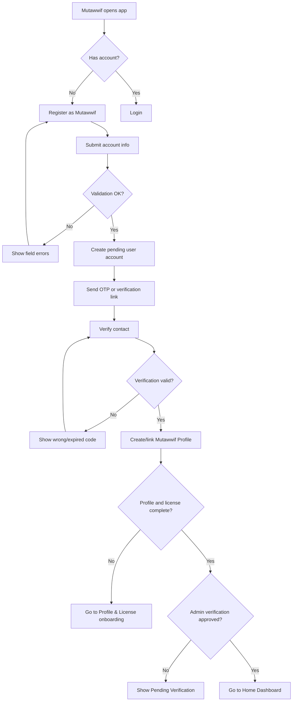
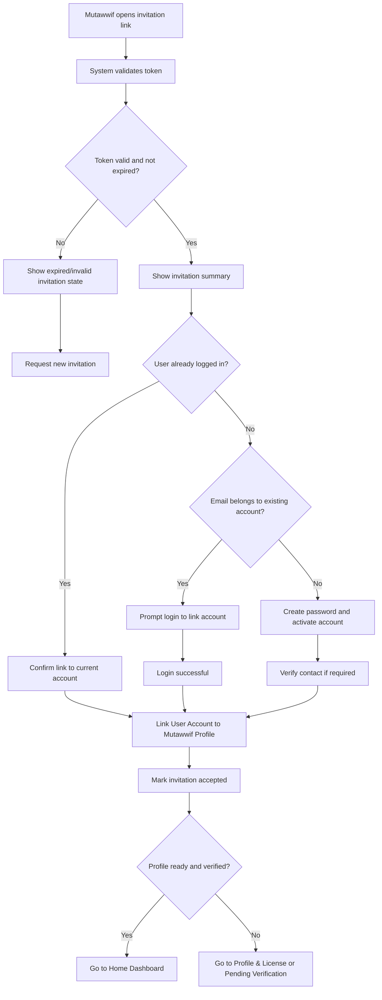

# MV PRD 02 - Register as Mutawwif & Invitation Acceptance

Product: UmrahHaji.com Mutawwif View  
Module: Register as Mutawwif & Invitation Acceptance  
Scope: Mutawwif Mobile Web App / Authentication & Onboarding  
Platform: Mobile-first Responsive Web Platform  
Status: Draft  
Last Updated: 18 June 2026  

---

## 1. Objective

Register as Mutawwif & Invitation Acceptance allows a mutawwif to create an account, accept an invitation, activate portal access, verify contact ownership, and enter the Mutawwif View app safely.

The module must support two onboarding paths:

1. Self-registration as a mutawwif from the public/mobile web app.
2. Invitation acceptance from Admin Mutawwif Management.

This module must not become the full mutawwif profile or license module. It only creates or activates access and links the user account to a mutawwif profile. Detailed profile, license, certification, bank account, availability, and professional data are handled in PRD 03 - Mutawwif Profile & License.

---

## 2. Relationship With Mutawwif View Master Scope

This module follows the Mutawwif View mobile web app scope:

1. Mutawwif View is a mobile-first portal for assigned guides/service providers.
2. Mutawwif must have a valid user account before accessing Home, Calendar, My Group Trip, Allowance, Payment Settings, or Profile.
3. User account access and mutawwif operational profile must remain separate but linked.
4. A user may have more than one profile type, for example Jamaah Profile and Mutawwif Profile, but each profile keeps its own data boundary.
5. Registration must not automatically make a mutawwif eligible for assignment.
6. Assignment eligibility depends on verification, active status, availability, and license/profile readiness.

---

## 3. Relationship With Admin, Travel Agency, and Jamaah PRDs

| Source Module | Relationship |
| --- | --- |
| Admin User Management | Owns user account, portal access, login identity, invitation status, password, session, and audit events |
| Admin Mutawwif Management | Owns mutawwif profile creation, verification, status, documents, license, and assignment readiness |
| Admin Settings, Roles & Permissions | Defines who can invite, approve, suspend, or link mutawwif users |
| Travel Agency Mutawwif Assignment | Consumes approved mutawwif profiles for assignment; does not own mutawwif identity verification |
| Travel Agency Group Trip Management | Sends assignment notifications after mutawwif is assigned to a group trip |
| Jamaah/User View Authentication | Shares auth patterns such as OTP, password reset, session rules, and invitation acceptance behavior |
| Notification Management | Sends invitation, OTP, activation, password, and status notification messages |
| Report Management | Can receive onboarding/access issues if mutawwif cannot activate or access assigned work |

### 3.1 Key Sync Rule

Registration creates or links the User Account. Verification readiness remains under Mutawwif Profile. A newly registered mutawwif should enter a Pending Verification or Profile Incomplete state until required profile/license data is approved.

---

## 4. Research Notes and Product Decisions

Authentication and invitation flows should follow practical security principles:

1. Invitation links must be secure, single-use, and expire based on system configuration.
2. The system must not send temporary passwords through email or WhatsApp.
3. OTP/verification codes should be random, short-lived, single-use, and protected by resend/rate limits.
4. Password reset and registration errors must avoid account enumeration.
5. Password rules should support long passphrases, block common/breached passwords, and avoid arbitrary complexity friction.
6. Email and phone verification prove contact reachability, not mutawwif professional eligibility.
7. A mutawwif should not be assignable until the profile is verified, active, and available.
8. If the same person is also a Jamaah user, the system should link the same user account but keep Jamaah and Mutawwif profile data separated.

Reference sources for product direction:

1. NIST SP 800-63B Digital Identity Guidelines: https://pages.nist.gov/800-63-4/sp800-63b.html
2. OWASP Authentication Cheat Sheet: https://cheatsheetseries.owasp.org/cheatsheets/Authentication_Cheat_Sheet.html
3. OWASP Forgot Password Cheat Sheet: https://cheatsheetseries.owasp.org/cheatsheets/Forgot_Password_Cheat_Sheet.html

---

## 5. Scope

### 5.1 In Scope for Phase 1

1. Register as Mutawwif.
2. Login from Mutawwif View.
3. Email verification using OTP or secure verification link.
4. Optional WhatsApp OTP if provider is enabled.
5. Invitation acceptance from Admin Mutawwif Management.
6. Existing user invitation linking.
7. New user activation from invitation.
8. Password creation.
9. Forgot password and reset password entry points.
10. OTP resend and expiry handling.
11. Invitation expired/invalid handling.
12. Profile incomplete redirect.
13. Pending verification state.
14. Suspended/inactive account blocked state.
15. Authenticated routing to Home after access is valid.
16. Security notifications for activation, login, and password reset.
17. Audit logs for account and invitation events.
18. Mobile-first responsive behavior.

### 5.2 In Scope for Phase 2

1. Assignment self-confirmation during invitation flow.
2. Multi-factor authentication for high-risk actions.
3. Passkey or passwordless login.
4. Trusted device management.
5. Device/session list.
6. Risk-based login challenge.
7. Magic link login.
8. PWA biometric unlock if wrapped in app-like shell.
9. Onboarding progress wizard connected to PRD 03.
10. Admin review queue for public mutawwif applications.

### 5.3 Out of Scope

1. Full Mutawwif Profile editing.
2. License/certification upload and verification detail.
3. Bank account setup.
4. Allowance/tip payout configuration.
5. Group trip assignment confirmation details.
6. Calendar setup.
7. Full role/permission management.
8. Admin approval decision UI.
9. Travel Agency assignment workflow.
10. Native mobile app authentication.

---

## 6. User Roles and Access

| Role | Description | Access Behavior |
| --- | --- | --- |
| Public visitor | Person browsing and choosing to register as mutawwif | Can open Register as Mutawwif |
| Self-registered mutawwif | User who registers from mobile web | Gets Pending Verification/Profile Incomplete state |
| Invited mutawwif | User invited by Admin Mutawwif Management | Can accept invitation and activate access |
| Existing user | User already registered as Jamaah, staff, or another profile type | Can login and link Mutawwif Profile if invited |
| Active mutawwif | Verified/active mutawwif with portal access | Can access Home and assigned data |
| Pending verification mutawwif | Account active but profile/license not approved | Can access limited onboarding/profile completion screens |
| Suspended/inactive mutawwif | Blocked by Admin or system status | Cannot access operational modules |
| Admin | Uses Admin Panel, not Mutawwif View | Creates/invites/reviews mutawwif |
| Travel Agency staff | Uses Travel Agency Portal, not Mutawwif View | Assigns approved mutawwif to trips |

---

## 7. Entry Points

| Entry Point | Behavior |
| --- | --- |
| Public mobile menu | Opens Login/Register options |
| Register as Mutawwif CTA | Opens self-registration screen |
| Invitation email link | Opens invitation validation screen |
| Invitation WhatsApp link | Opens invitation validation screen |
| Assignment notification link | Requires login; opens assignment/trip if mutawwif already active |
| Expired session | Redirects to login with return URL |
| Profile incomplete banner | Opens profile/license completion page |
| Forgot password link | Opens password recovery flow |

---

## 8. Information Architecture

```text
Mutawwif Onboarding
├── Login
│   ├── Email / Phone
│   ├── Password
│   ├── Forgot Password
│   └── Return URL Handling
├── Register as Mutawwif
│   ├── Account Info
│   ├── Contact Verification
│   ├── Terms Consent
│   └── Registration Submitted
├── OTP Verification
│   ├── Empty State
│   ├── Filling State
│   ├── Wrong Code
│   ├── Expired Code
│   └── Verification Successful
├── Invitation Acceptance
│   ├── Validate Invitation
│   ├── New User Activation
│   ├── Existing User Linking
│   ├── Expired / Invalid Invitation
│   └── Invitation Accepted
└── Access Gate
    ├── Active - Go to Home
    ├── Profile Incomplete - Go to Profile & License
    ├── Pending Verification - Show Waiting State
    └── Suspended / Inactive - Block Access
```

---

## 9. Core Onboarding Flow



---

## 10. Invitation Acceptance Flow



---

## 11. Status Model

### 11.1 User Account Status

| Status | Meaning | User Experience |
| --- | --- | --- |
| Draft | Account/profile prepared by Admin but not invited | Not visible to mutawwif |
| Invited | Invitation sent but not accepted | Invitation acceptance available |
| Pending Verification | Contact verified but mutawwif profile/license pending review | Limited access |
| Active | Account and access active | Can access allowed modules |
| Inactive | Account disabled without disciplinary reason | Blocked or limited |
| Suspended | Access blocked due to compliance/security/admin action | Blocked with support message |
| Archived | Historical account/profile no longer active | No operational access |

### 11.2 Invitation Status

| Status | Meaning | Allowed Actions |
| --- | --- | --- |
| Not Sent | Profile created but no invitation sent | Admin can send invitation |
| Pending | Invitation sent, not accepted | Mutawwif can accept, Admin can resend/cancel |
| Accepted | Invitation used successfully | No reuse allowed |
| Expired | Token expired | Request resend |
| Cancelled | Invitation revoked by Admin | Show invalid invitation state |

### 11.3 Mutawwif Profile Readiness

| Status | Meaning | Routing |
| --- | --- | --- |
| Profile Incomplete | Required profile/license data missing | Route to PRD 03 |
| Pending Review | Submitted data waiting for Admin verification | Show waiting state |
| Need Revision | Admin requests update | Route to PRD 03 revision state |
| Verified | Profile approved | Allow normal access if account active |
| Rejected | Application/profile rejected | Show rejected state with support/action options |

---

## 12. Register as Mutawwif

### 12.1 Screen Purpose

Register as Mutawwif allows a new user to create an account and start the mutawwif verification journey.

The registration screen should remain simple. It should not ask for full professional history, license upload, bank account, or detailed availability. Those belong to Profile & License onboarding.

### 12.2 Form Fields

| Field | Type | Required | Validation | Notes |
| --- | --- | --- | --- | --- |
| Full Name | Text input | Yes | 2-120 characters | Display/legal name for account start |
| Email | Email input | Yes | Valid email format, unique or existing user handling | Primary login identity |
| Country Code | Select | Yes | Valid country calling code | Default +60 Malaysia |
| Phone Number | Phone input | Yes | Numeric, country-specific length | Used for contact and optional WhatsApp OTP |
| Password | Password input | Yes | Minimum length, block common passwords | Show/hide toggle |
| Confirm Password | Password input | Yes | Must match password | Show/hide toggle |
| Preferred Language | Select | Optional | Supported language list | Default system/browser language |
| I agree to Terms & Privacy | Checkbox | Yes | Must be checked | Required before submit |
| I understand verification is required | Checkbox | Yes | Must be checked | Prevents misunderstanding |

### 12.3 CTA

Primary CTA:

```text
Register
```

Secondary links:

```text
Already have an account? Login
Have an invitation? Accept Invitation
```

### 12.4 Registration Rules

1. Register button is disabled until required fields pass client-side validation.
2. Email and phone uniqueness check must return safe/generic messaging.
3. If email already exists, system should offer login and profile linking, not duplicate account creation.
4. A new mutawwif self-registration creates:
   - User Account.
   - Mutawwif Profile placeholder.
   - Pending verification/profile completion state.
5. Self-registered mutawwif cannot be assigned to trip until verified and active.
6. Registration must be logged in audit history.

---

## 13. OTP / Contact Verification

### 13.1 Purpose

OTP verifies that the mutawwif can access the email or phone number used during registration or invitation activation.

### 13.2 Recommended Behavior

| Item | Requirement |
| --- | --- |
| Code length | 6 digits recommended |
| Expiry | Configurable, default 10 minutes |
| Attempts | Limited attempts before temporary lock |
| Resend | Available after countdown |
| Channels | Email required; WhatsApp optional if enabled |
| Reuse | OTP is single-use |
| Audit | Generate, resend, success, failure, and lock events logged |

### 13.3 OTP Empty State

Content:

```text
OTP Verification
We have sent a verification code to [email/phone].
```

UI:

1. Six OTP boxes.
2. Disabled Submit button until all digits are entered.
3. Resend text with countdown if applicable.

### 13.4 OTP Filling State

Behavior:

1. Auto-focus moves to next box after digit entry.
2. Backspace returns to previous box.
3. Paste full OTP into first box fills all boxes.
4. Submit button becomes active when all digits are filled.

### 13.5 Wrong or Expired Code State

Errors:

```text
Wrong code. Please try again.
This code has expired. Please request a new code.
Too many attempts. Please wait before trying again.
```

Rules:

1. Do not reveal whether email/phone exists.
2. Do not generate unlimited OTPs.
3. Reset attempts when new OTP is generated.

---

## 14. Invitation Acceptance

### 14.1 Invitation Summary Screen

When a valid invitation link is opened, the system should show a clear invitation summary before account activation.

| Field | Source | Notes |
| --- | --- | --- |
| Invited Name | Mutawwif Profile / Invitation | Read-only |
| Invited Email | Invitation | Mask partially if needed |
| Invited Role | Invitation | Mutawwif |
| Invited By | Admin Mutawwif Management | Do not expose internal admin details beyond organization label |
| Invitation Expiry | Invitation token | Show expiry if still valid |
| Required Next Step | System status | Login, set password, verify contact, complete profile, or wait approval |

### 14.2 New User Invitation Activation

Fields:

| Field | Type | Required | Validation | Notes |
| --- | --- | --- | --- | --- |
| Full Name | Text input | Yes | Pre-filled if provided | Editable if Admin allows |
| Email | Email input | Yes | Read-only if invitation email locked | Login identity |
| Phone Number | Phone input | Conditional | Required if missing | For contact/WhatsApp |
| Password | Password input | Yes | Password rules | Do not send temporary password |
| Confirm Password | Password input | Yes | Must match | - |
| Terms & Privacy | Checkbox | Yes | Must be checked | - |

CTA:

```text
Accept Invitation
```

### 14.3 Existing User Invitation Linking

Existing user scenario:

1. User opens invitation link.
2. System detects email belongs to an existing account or user chooses "Login to existing account".
3. User logs in.
4. System asks confirmation to link Mutawwif Profile to current account.
5. System blocks link if current user email/phone conflicts with invitation policy.
6. System links profile and marks invitation as Accepted.

Confirmation copy:

```text
This invitation will add Mutawwif access to your existing UmrahHaji.com account.
Your Jamaah data and Mutawwif data will remain separated.
```

### 14.4 Expired or Invalid Invitation

States:

| State | Message | Allowed Action |
| --- | --- | --- |
| Expired | This invitation has expired. | Request new invitation |
| Cancelled | This invitation is no longer valid. | Contact support/admin |
| Already Accepted | This invitation has already been used. | Login |
| Email Mismatch | This invitation belongs to another email. | Login with invited email or contact support |
| Profile Archived | This mutawwif profile is no longer active. | Contact support |

---

## 15. Login

### 15.1 Login Form

| Field | Type | Required | Notes |
| --- | --- | --- | --- |
| Email or Phone | Text input | Yes | Supports login identity configured by system |
| Password | Password input | Yes | Show/hide toggle |
| Remember Me | Checkbox | Optional | Only for non-shared devices |

CTA:

```text
Login
```

Secondary actions:

```text
Forgot password?
Register as Mutawwif
Accept Invitation
```

### 15.2 Login Routing Rules

After successful login, route user based on status:

| Condition | Destination |
| --- | --- |
| Active account + verified mutawwif profile | Home Dashboard |
| Active account + profile incomplete | Profile & License onboarding |
| Active account + pending verification | Pending Verification screen |
| Need revision | Profile & License revision screen |
| Rejected | Rejected state with support/action options |
| Suspended/inactive | Blocked state |
| Return URL available and allowed | Return URL after access check |

---

## 16. Forgot Password and Reset Password

### 16.1 Forgot Password

Fields:

| Field | Type | Required | Notes |
| --- | --- | --- | --- |
| Email or Phone | Text input | Yes | Use generic response |

Response message:

```text
If an account exists, we will send password reset instructions.
```

### 16.2 Reset Password

Fields:

| Field | Type | Required | Notes |
| --- | --- | --- | --- |
| New Password | Password input | Yes | Same password rules |
| Confirm Password | Password input | Yes | Must match |

Rules:

1. Reset token must be single-use and expire.
2. User should not be auto-logged in after reset unless approved by security policy.
3. Existing sessions may be invalidated after password reset.
4. Security notification must be sent after successful reset.

---

## 17. Notification Requirements

### 17.1 Invitation Email

Subject:

```text
You are invited to join UmrahHaji.com as a Mutawwif
```

Required content:

1. UmrahHaji.com logo.
2. Greeting with invited mutawwif name.
3. Clear role: Mutawwif.
4. Inviting organization/platform label.
5. CTA: Accept Invitation.
6. Invitation expiry notice.
7. Support contact.
8. Security note: ignore if the recipient did not expect this invitation.

### 17.2 Invitation WhatsApp

WhatsApp invitation should be shorter than email:

```text
Assalamu'alaikum [Name], you have been invited to join UmrahHaji.com as a Mutawwif. Tap this secure link to accept your invitation: [link]. This link expires on [date/time].
```

### 17.3 OTP Email

Subject:

```text
Your UmrahHaji.com verification code
```

Required content:

1. Verification code.
2. Expiry time.
3. Do not share code warning.
4. Support contact.

### 17.4 Security Notifications

Events:

| Event | Recipient | Channel |
| --- | --- | --- |
| Invitation sent | Mutawwif | Email, optional WhatsApp |
| Invitation accepted | Mutawwif, Admin audit | Email/system log |
| Account activated | Mutawwif | Email |
| Password reset requested | Mutawwif | Email |
| Password changed | Mutawwif | Email |
| Account suspended/reactivated | Mutawwif | Email/system notification |

---

## 18. Data Requirements

### 18.1 User Account Data

| Field | Description |
| --- | --- |
| User ID | Unique user account reference |
| Full Name | Display name |
| Email | Login/contact identity |
| Phone Number | Contact identity |
| Password Hash | Secure server-side password hash |
| Account Status | Draft, Invited, Active, Inactive, Suspended, Archived |
| Portal Access | Mutawwif View |
| Linked Profile Type | Mutawwif |
| Linked Mutawwif Profile ID | Reference to Mutawwif Profile |
| Email Verified At | Timestamp |
| Phone Verified At | Timestamp if enabled |
| Last Login At | Timestamp |
| Created At | Timestamp |
| Updated At | Timestamp |

### 18.2 Invitation Data

| Field | Description |
| --- | --- |
| Invitation ID | Unique invitation reference |
| Invitee Email | Invited email |
| Invitee Phone | Optional invited phone |
| Invitee Name | Invited display name |
| Profile ID | Mutawwif profile to be linked |
| Portal Access | Mutawwif View |
| Token Hash | Hashed invitation token |
| Status | Not Sent, Pending, Accepted, Expired, Cancelled |
| Expires At | Expiry timestamp |
| Sent At | Timestamp |
| Accepted At | Timestamp |
| Created By | Admin user ID |
| Source Module | Admin Mutawwif Management |

### 18.3 Mutawwif Profile Link Data

| Field | Description |
| --- | --- |
| Mutawwif Profile ID | Operational profile reference |
| User ID | Linked user account |
| Profile Status | Profile Incomplete, Pending Review, Need Revision, Verified, Rejected |
| Verification Status | Pending, Verified, Rejected |
| Assignment Readiness | Not Ready, Ready, Blocked |
| Active Status | Active, Inactive, Suspended |

---

## 19. Permission and Privacy Rules

1. Public users can only create their own account.
2. Only authorized Admin users can send mutawwif invitations from Admin Panel.
3. Travel Agency can only assign approved mutawwif; new mutawwif onboarding should route through Admin-controlled Mutawwif Management unless explicitly approved in later phase.
4. Invitation link must not expose sensitive profile fields.
5. Existing user linking must require login to the target account.
6. Internal admin remarks are never visible in Mutawwif View.
7. Mutawwif cannot see other mutawwif accounts during onboarding.
8. Suspended users must not access operational trip data.
9. Audit logs must capture onboarding and access events.
10. If a user has Jamaah and Mutawwif profiles, module navigation and data scope must be separated.

---

## 20. States and Edge Cases

| State / Case | Expected Behavior |
| --- | --- |
| Network error during registration | Preserve filled data locally if safe and show retry |
| Email already registered | Suggest login/link flow using safe copy |
| Phone already registered | Suggest login or support using safe copy |
| Weak/common password | Block and show password guidance |
| OTP expired | Ask user to resend |
| OTP too many attempts | Temporarily lock verification |
| Invitation expired | Show request new invitation option |
| Invitation already accepted | Show login CTA |
| Invitation email mismatch | Require invited email or support |
| Existing user already has Mutawwif Profile | Show existing profile status; prevent duplicate |
| Profile rejected | Show rejected state and next allowed action |
| Account suspended | Block access with support contact |
| User returns from notification deep link | Validate login and status before opening target screen |
| User closes app during onboarding | Resume latest safe onboarding step |

---

## 21. Responsive Behavior

### 21.1 Mobile

1. Forms use single-column layout.
2. Primary CTA is sticky at bottom when form is long.
3. OTP boxes fit 320px width without horizontal scroll.
4. Error messages appear directly below fields.
5. Keyboard should not cover primary CTA.
6. Invitation summary uses compact stacked cards.

### 21.2 Tablet

1. Forms may use centered card layout.
2. Invitation summary may use two-column detail rows.
3. CTA remains visible without excessive scrolling.

### 21.3 Desktop Web

1. Authentication forms appear centered with max width.
2. Background may use brand visual pattern.
3. Do not expose admin-style side navigation.

---

## 22. Analytics Events

| Event | Trigger |
| --- | --- |
| mutawwif_register_viewed | Register screen opened |
| mutawwif_register_submitted | Register submitted |
| mutawwif_register_failed | Registration validation/server failure |
| mutawwif_otp_sent | OTP sent |
| mutawwif_otp_verified | OTP verified successfully |
| mutawwif_otp_failed | Wrong/expired OTP |
| mutawwif_invitation_opened | Invitation link opened |
| mutawwif_invitation_accepted | Invitation accepted |
| mutawwif_invitation_failed | Invalid/expired/cancelled invitation |
| mutawwif_login_success | Login successful |
| mutawwif_login_failed | Login failed |
| mutawwif_password_reset_requested | Forgot password submitted |
| mutawwif_access_blocked | Suspended/inactive/pending blocked from module |

---

## 23. Functional Requirements

| ID | Requirement | Priority |
| --- | --- | --- |
| MV-AUTH-001 | System shall allow public users to register as mutawwif. | P1 |
| MV-AUTH-002 | System shall collect minimum account fields during registration. | P1 |
| MV-AUTH-003 | System shall verify email using OTP or secure verification link. | P1 |
| MV-AUTH-004 | System shall support optional WhatsApp OTP if provider is enabled. | P1 |
| MV-AUTH-005 | System shall create or link a Mutawwif Profile after registration or invitation. | P1 |
| MV-AUTH-006 | System shall prevent duplicate Mutawwif Profile for the same user. | P1 |
| MV-AUTH-007 | System shall support invitation acceptance from Admin Mutawwif Management. | P1 |
| MV-AUTH-008 | System shall support existing user linking during invitation acceptance. | P1 |
| MV-AUTH-009 | System shall support new user activation from invitation. | P1 |
| MV-AUTH-010 | System shall validate invitation token before showing activation actions. | P1 |
| MV-AUTH-011 | System shall block reused, expired, or cancelled invitations. | P1 |
| MV-AUTH-012 | System shall not send temporary passwords by email or WhatsApp. | P1 |
| MV-AUTH-013 | System shall route active/verified mutawwif to Home Dashboard after login. | P1 |
| MV-AUTH-014 | System shall route incomplete profile users to Profile & License onboarding. | P1 |
| MV-AUTH-015 | System shall show Pending Verification state when Admin approval is required. | P1 |
| MV-AUTH-016 | System shall block suspended/inactive mutawwif from operational modules. | P1 |
| MV-AUTH-017 | System shall support forgot password and reset password. | P1 |
| MV-AUTH-018 | System shall send security notifications for activation and password changes. | P1 |
| MV-AUTH-019 | System shall log account, invitation, OTP, and access events. | P1 |
| MV-AUTH-020 | System shall support mobile-first responsive authentication screens. | P1 |
| MV-AUTH-021 | System shall avoid account enumeration in error messages. | P1 |
| MV-AUTH-022 | System shall rate-limit OTP resend and failed verification attempts. | P1 |
| MV-AUTH-023 | System shall preserve allowed return URL after successful login. | P1 |
| MV-AUTH-024 | System shall keep Jamaah Profile and Mutawwif Profile data separated if both exist. | P1 |

---

## 24. Acceptance Criteria

1. User can open Register as Mutawwif from mobile web.
2. Registration form validates name, email, phone, password, confirm password, and required consents.
3. Duplicate email does not create duplicate account.
4. Successful registration sends verification code/link.
5. OTP screen supports empty, filling, wrong code, expired code, resend, and success states.
6. Verified self-registered mutawwif is routed to Profile & License onboarding or Pending Verification, not directly to assignment eligibility.
7. Invitation link opens invitation summary if valid.
8. Expired, cancelled, already accepted, or invalid invitation shows correct state.
9. New invited user can set password and activate account.
10. Existing invited user can login and link Mutawwif Profile without duplicating user account.
11. Invitation acceptance marks invitation as Accepted and logs the event.
12. Active and verified mutawwif can access Home Dashboard.
13. Pending, incomplete, rejected, suspended, and inactive users see correct access gate states.
14. Password reset uses generic response and secure reset token.
15. No temporary password is sent by email or WhatsApp.
16. Security notifications are sent for activation and password changes.
17. Mobile layout works at 320px width without horizontal overflow.
18. User account and Mutawwif Profile data remain separate from Jamaah Profile data.
19. Audit logs capture registration, invitation, OTP, login, and password actions.
20. The module is consistent with Admin User Management and Admin Mutawwif Management rules.

---

## 25. Open Questions

1. Should public self-registration as mutawwif be open to everyone, or should it be invitation-only for Phase 1?
2. Should Admin approve public mutawwif applications before the account can access even limited Mutawwif View?
3. Should phone verification be mandatory in Phase 1, or only email verification?
4. Should WhatsApp OTP be enabled from launch or kept as optional provider-based enhancement?
5. Should mutawwif invitation be sent only by Platform Admin, or can Travel Agency request/invite candidates through an approval workflow?
6. What languages must invitation and OTP templates support at launch?
7. Should suspended mutawwif still access historical allowance/tax records, or fully block access?

---

## 26. Recommendation

For Phase 1, the best approach is:

1. Allow Admin-created invitation as the primary mutawwif onboarding path.
2. Allow public self-registration only if the business wants a mutawwif candidate pipeline.
3. Use secure invitation links and OTP/contact verification.
4. Never send temporary passwords.
5. Route all new/invited mutawwif to Profile & License onboarding or Pending Verification before operational access.
6. Keep Travel Agency assignment limited to approved mutawwif records.

This keeps onboarding simple for mutawwif, protects platform quality, and keeps Admin Mutawwif Management as the source of truth for verification and assignment readiness.
