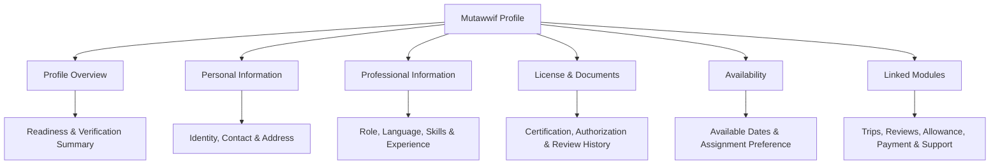
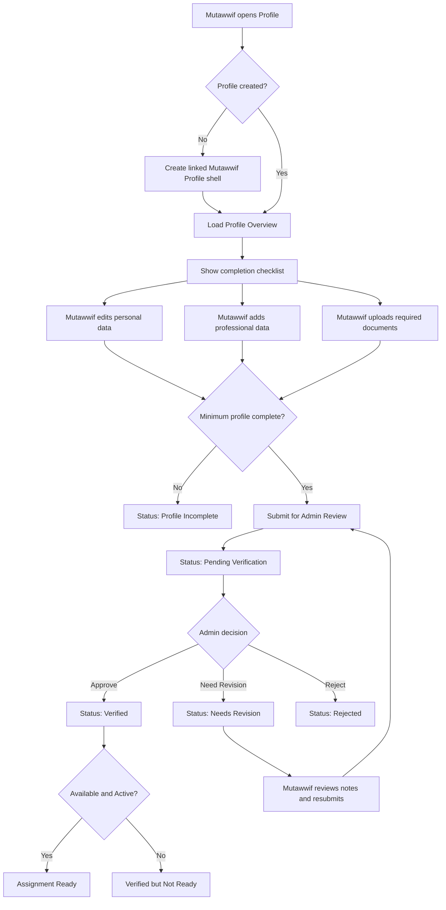
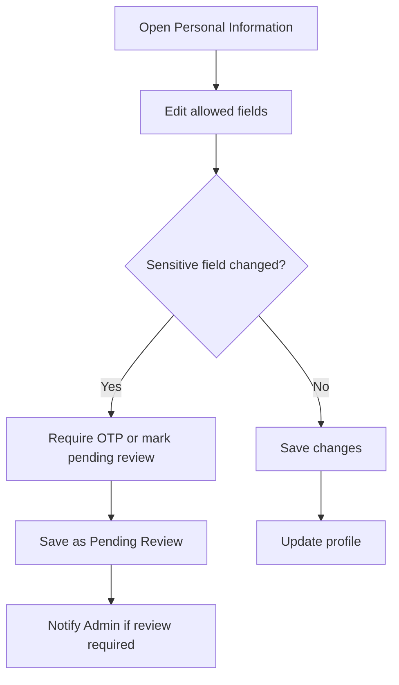
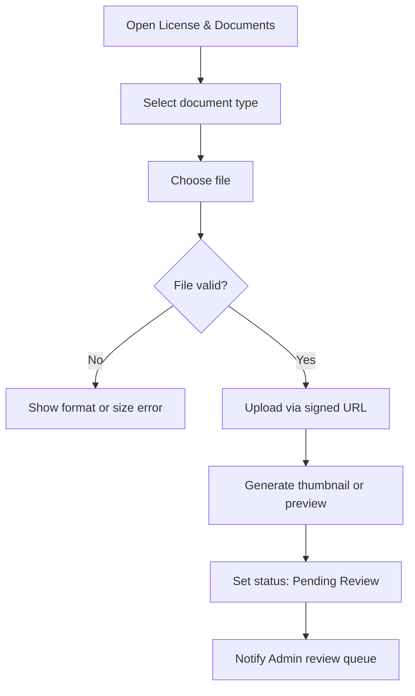
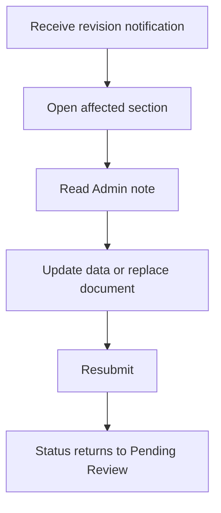

# MV PRD 03 - Mutawwif Profile, License & Verification

Product: UmrahHaji.com Mutawwif View  
Module: Profile, License & Verification  
Scope: Mutawwif Mobile Web App / Profile, Professional Data & Assignment Readiness  
Platform: Mobile-first Responsive Web Platform  
Status: Draft  
Last Updated: 18 June 2026  

---

## 1. Objective

Mutawwif Profile, License & Verification allows a mutawwif to complete and maintain the personal, professional, document, certification, language, specialization, and availability data required to become eligible for group trip assignment.

The module must answer these questions:

1. Who is this mutawwif?
2. Is the account linked to the correct person?
3. Is the mutawwif verified by Admin?
4. Is the mutawwif currently available for assignment?
5. What language, specialization, and experience make this mutawwif suitable for a trip?
6. Which documents or certifications are missing, expired, rejected, or under review?
7. Which data can Travel Agency see for assignment decisions?
8. Which data must remain private to Admin and the mutawwif only?

This module is not a general social profile. It is an operational and compliance profile for mutawwif assignment readiness.

---

## 2. Relationship With Mutawwif View Master Scope

This module follows the Mutawwif View mobile web app scope:

1. Mutawwif View is mobile-first and focused on assigned work.
2. Profile data is owned by the mutawwif but verified by Admin.
3. A mutawwif can update personal and professional data, but sensitive changes may require Admin review.
4. A mutawwif cannot approve, verify, or activate their own profile.
5. Assignment readiness depends on account status, mutawwif profile status, document status, certification validity, and availability.
6. Travel Agency can only see the assignment-safe profile summary, not sensitive personal or financial data.

---

## 3. Relationship With Admin, Travel Agency, and Jamaah PRDs

| Source Module | Relationship |
| --- | --- |
| Admin User Management | Owns user account, login identity, linked profiles, portal access, and account status |
| Admin Mutawwif Management | Owns verification decision, documents review, status management, admin notes, and assignment readiness |
| Admin Group Trip Management | Consumes assigned mutawwif data and displays mutawwif profile summary |
| Admin Finance / Allowance Management | Owns allowance and payout status; profile only links to payment settings where enabled |
| Travel Agency Mutawwif Assignment | Consumes verified mutawwif summary for assignment decisions |
| Travel Agency Group Trip Management | Uses mutawwif assignment and role data for trip operations |
| Jamaah/User Profile | Shares common identity patterns but keeps jamaah and mutawwif profile data separate |
| Report Management | Can create or receive reports related to mutawwif behavior, compliance, or assignment issues |
| Notification Management | Sends verification, revision, expiry, availability, and assignment readiness notifications |

### 3.1 Key Sync Rule

Mutawwif Profile must be separate from User Account and Jamaah Profile.

A single person may have:

1. One user account.
2. One Jamaah Profile.
3. One Mutawwif Profile.
4. Other future profiles.

Each operational profile must keep its own data boundary. Updating Jamaah travel preferences must not change mutawwif assignment preferences, and updating mutawwif certifications must not change jamaah travel documents.

---

## 4. Research Notes and Product Decisions

The provided reference contains many useful personal profile components, but not all fields are appropriate for a mutawwif assignment profile.

Product decisions:

1. Basic identity fields can follow Jamaah Profile patterns because both roles are tied to a real person.
2. Mutawwif requires additional professional fields: languages, specialization, certifications, experience, availability, and assignment preferences.
3. Generic hobbies should not be required in Phase 1 because they do not affect assignment readiness.
4. Working experience, education, certifications, awards, skills, and supporting documents are useful only when framed around mutawwif work, religious guidance, travel operation, language ability, safety, customer care, or group handling.
5. Bank details should not block verification in Phase 1. Allowance and payout setup belongs to Payment Settings / Allowance & Tip modules.
6. Travel Agency should see enough profile summary to assign the right mutawwif, but not identity number, bank data, private documents, or internal verification notes.
7. File upload must use strict size limits, direct-to-storage upload, thumbnail generation, validation, and malware scanning where available.

Reference sources for product direction:

1. Nusuk pilgrimage ecosystem: https://www.nusuk.sa/
2. W3C WCAG 2.2 - Identify Input Purpose: https://www.w3.org/WAI/WCAG22/Understanding/identify-input-purpose.html
3. GOV.UK Service Manual - Form structure: https://www.gov.uk/service-manual/design/form-structure
4. OWASP File Upload Cheat Sheet: https://cheatsheetseries.owasp.org/cheatsheets/File_Upload_Cheat_Sheet.html

---

## 5. Scope

### 5.1 In Scope for Phase 1

1. Mutawwif Profile overview.
2. Profile completion status.
3. Assignment readiness status.
4. Personal information editing.
5. Address information editing.
6. Identity/passport information.
7. Professional information.
8. Job type and assignment role preference.
9. Languages and proficiency level.
10. Specialization tags.
11. Work experience.
12. Education background.
13. Certifications and licenses.
14. Supporting documents.
15. Availability status.
16. Admin verification status display.
17. Revision request display and resubmission.
18. Document upload, preview, replace, and delete.
19. Document expiry warning.
20. Sensitive data masking.
21. Visibility rules for Travel Agency assignment.
22. Audit events for profile and document changes.
23. Notifications for verification, rejection, revision, expiry, and readiness changes.
24. Mobile-first responsive behavior.

### 5.2 In Scope for Phase 2

1. Full payout/bank account verification.
2. Advanced availability calendar.
3. Preferred destination/city schedule.
4. Professional portfolio media.
5. Self-declared service rate if marketplace pricing is enabled.
6. License integration with external regulator or training provider if available.
7. Background check integration.
8. Automated document OCR.
9. Performance scorecard.
10. Public mutawwif profile if the platform chooses to display mutawwif publicly.

### 5.3 Out of Scope

1. Admin approval decision UI.
2. Travel Agency assignment workflow.
3. Full allowance payout processing.
4. Direct payment withdrawal.
5. Group trip creation.
6. Jamaah profile editing.
7. Booking and package management.
8. Public social profile.
9. Generic hobby/community profile.
10. Native mobile app behavior.

---

## 6. User Roles and Access

| Role | Access Behavior |
| --- | --- |
| Pending mutawwif | Can complete profile and upload documents; cannot access full assignment features |
| Invited mutawwif | Can complete profile after accepting invitation |
| Active mutawwif | Can edit allowed profile fields and access assigned modules |
| Verified mutawwif | Eligible for assignment if available and not blocked |
| Needs Revision mutawwif | Can view Admin revision notes and resubmit corrected data |
| Suspended mutawwif | Can view limited status; cannot edit operational readiness unless Admin allows |
| Admin | Reviews, approves, rejects, suspends, and manages sensitive notes from Admin Panel |
| Travel Agency staff | Can view assignment-safe summary only |

---

## 7. Entry Points

| Entry Point | Behavior |
| --- | --- |
| Bottom navigation Profile tab | Opens Mutawwif Profile overview |
| Home profile completion banner | Opens missing profile/document section |
| Pending Verification screen | Opens profile status and revision details |
| Notification - document rejected | Opens related document detail |
| Notification - license expiring | Opens certification/license section |
| Assignment blocked warning | Opens assignment readiness checklist |
| Payment Settings link | Opens separate Payment Settings module if enabled |
| Admin invitation completion | Redirects to profile/license completion after account activation |

---

## 8. Information Architecture

The diagram below shows the mobile profile structure and its related modules at a glance.



```text
Mutawwif Profile
+-- Profile Overview
|   +-- Identity Summary
|   +-- Verification Status
|   +-- Availability Status
|   +-- Assignment Readiness
|   +-- Profile Completion
+-- Personal Information
|   +-- Profile Photo
|   +-- Name & Contact
|   +-- Birth & Gender
|   +-- Nationality & Identity
|   +-- Address
+-- Professional Information
|   +-- Job Type
|   +-- Assignment Role Preference
|   +-- Languages
|   +-- Specializations
|   +-- Work Experience
|   +-- Education
|   +-- Bio
+-- License & Documents
|   +-- Identity / Passport
|   +-- Mutawwif Certification
|   +-- Religious Guidance Certification
|   +-- Travel Agency Authorization
|   +-- Supporting Documents
|   +-- Revision History
+-- Availability
|   +-- Availability Status
|   +-- Unavailable Date Range
|   +-- Assignment Preferences
|   +-- Conflict Warning
+-- Linked Modules
    +-- Assigned Trips
    +-- Ratings & Reviews
    +-- Allowance & Tip
    +-- Payment Settings
    +-- Support
```

---

## 9. Profile Completion and Verification Flow



---

## 10. Profile Status and Assignment Readiness Model

### 10.1 Profile Status

| Status | Meaning | Mutawwif Action |
| --- | --- | --- |
| Incomplete | Required profile data is missing | Complete required fields |
| Draft | Data is saved but not submitted | Continue editing or submit |
| Pending Verification | Submitted and waiting for Admin review | View status, cannot self-approve |
| Needs Revision | Admin requested correction | Review notes, update, resubmit |
| Verified | Admin approved profile and required documents | Keep data current |
| Rejected | Profile is not approved | Contact support or resubmit if allowed |
| Suspended | Profile is restricted by Admin | View status and support contact only |

### 10.2 Assignment Readiness

| Readiness | Conditions |
| --- | --- |
| Not Ready | Account inactive, profile incomplete, rejected, suspended, or missing required documents |
| Pending Review | Minimum data submitted but Admin has not approved |
| Verified but Unavailable | Profile verified but availability is unavailable/on leave |
| Ready for Assignment | User account active, Mutawwif Profile verified, availability available, no blocking expired documents, not suspended |
| Temporarily Blocked | Active profile but document expiry, conflict, or admin block prevents assignment |

### 10.3 Key Rule

`Ready for Assignment` is calculated by the system. Mutawwif cannot manually switch themselves to Ready if verification, document, account, or availability conditions are not met.

---

## 11. Profile Overview Page

### 11.1 Objective

Profile Overview is the mutawwif's account hub. It must show identity, readiness, verification, and shortcuts without overwhelming the mobile screen.

### 11.2 Header Summary

| Element | Requirement |
| --- | --- |
| Profile photo | Square/circle avatar with upload state |
| Display name | Full name with optional title, for example Ustadz Muhammad |
| Role badge | Mutawwif |
| Verification badge | Incomplete, Pending, Needs Revision, Verified, Rejected, Suspended |
| Availability badge | Available, Unavailable, On Leave, Assigned Today |
| Rating summary | Average rating and review count if available |
| Assignment readiness | Ready / Not Ready / Pending Review |

### 11.3 Readiness Cards

| Card | Data |
| --- | --- |
| Profile Completion | Percentage and missing required sections |
| Document Readiness | Required uploaded, pending, rejected, expiring |
| Assignment Readiness | Active, verified, available, no blocking issue |
| Current Assignment | Active group trip count and next activity shortcut |

### 11.4 Profile Menu

| Menu Item | Opens | Phase |
| --- | --- | --- |
| Personal Information | Personal data and address | P1 |
| Professional Information | Job type, specialization, language, experience, education | P1 |
| License & Documents | Required documents, certifications, revision notes | P1 |
| Availability | Availability status and preferences | P1 |
| Assigned Trips | My Group Trip module | P1 |
| Ratings & Reviews | Ratings summary and testimonial detail | P1 |
| Allowance & Tip | Allowance and tip records | P1 |
| Payment Settings | Payment receiving setup if enabled | P1/P2 depending finance scope |
| Support & Reports | Contact support or report issue | P1 |
| Account Settings | Password, contact verification, logout | P1 |

---

## 12. Personal Information

Personal information should reuse the Jamaah Profile pattern where relevant, but mutawwif professional readiness must remain separate.

| Field | Type | Required | Validation | Notes |
| --- | --- | ---: | --- | --- |
| Profile Photo | Image upload | No | JPG, JPEG, PNG, WebP, max 2 MB | Compress and crop 1:1 |
| Full Name | Text | Yes | Max 120 chars | Legal/preferred display name |
| Surname / Family Name | Text | No | Max 80 chars | Optional depending country |
| Email | Email | Yes | Valid email | Linked to User Account; change may require verification |
| Phone Country Code | Select | Yes | ISO country calling code | Default based on registration |
| Phone Number | Text | Yes | E.164 compatible | Change may require OTP |
| Date of Birth | Date | Conditional | User must meet age rule | Required if identity verification requires age |
| Place of Birth | Text | No | Max 120 chars | Useful for identity matching |
| Gender | Radio | Conditional | Male, Female, Prefer not to say if policy allows | May affect assignment matching in some contexts |
| Nationality | Select | Yes | Country list | Visible to Admin; summary only to TA if allowed |
| Marital Status | Select | No | Single, Married, Divorced, Widowed, Prefer not to say | Not part of readiness |
| About / Bio | Textarea | No | Max 500 chars | Mutawwif-facing bio; no religious claims requiring proof |

### 12.1 Identity Information

| Field | Type | Required | Validation | Notes |
| --- | --- | ---: | --- | --- |
| Identity Type | Select | Conditional | IC, KTP, Passport, Other | Based on nationality/country |
| Identity Number | Text | Conditional | Mask in display | Admin-only visibility |
| Passport Number | Text | Conditional | Mask in display | Required if cross-border operations need it |
| Passport Expiry Date | Date | Conditional | Future date | Warn before expiry |
| Passport Issuing Country | Select | Conditional | Country list | Used for verification only |

### 12.2 Address Information

| Field | Type | Required | Validation | Notes |
| --- | --- | ---: | --- | --- |
| Country | Select | Yes | Country list | Current residence country |
| State / Province | Select/Text | Conditional | Based on country |  |
| City | Select/Text | Conditional | Based on country | Used for location matching |
| Postal / ZIP Code | Text | No | Country-specific |  |
| Street Address | Textarea | No | Max 300 chars | Admin-only/private |

### 12.3 Decision on Hobbies

Hobbies from the reference design should not be part of Phase 1 Mutawwif Profile. If the product later needs community features, hobbies can become `Personal Interests` under Phase 2 and remain hidden from Travel Agency assignment.

---

## 13. Professional Information

Professional Information is the biggest difference between Jamaah Profile and Mutawwif Profile.

### 13.1 Core Professional Fields

| Field | Type | Required | Validation | Notes |
| --- | --- | ---: | --- | --- |
| Job Type | Select | Yes | Full-time, Part-time, Freelance, Seasonal, Volunteer, On-demand | Used by Admin/TA filtering |
| Assignment Role Preference | Multi-select | Yes | Lead Mutawwif, Assistant Mutawwif, Group Guide, Manasik Speaker, Ziarah Guide | Can be overridden by Admin/TA assignment |
| Primary Country | Select | Yes | Country list | Country of usual operation |
| Primary City / Region | Select/Text | Yes | Max 120 chars | Used for matching availability/location |
| Years of Experience | Number | Conditional | 0-60 | Self-declared; Admin can verify |
| Total Trips Handled | Number/System | No | 0+ | Prefer system-calculated from completed trips |
| Total Jamaah Handled | Number/System | No | 0+ | Prefer system-calculated |
| Bio for Assignment | Textarea | No | Max 500 chars | Shown to Admin/TA if approved |

### 13.2 Languages

| Field | Type | Required | Validation | Notes |
| --- | --- | ---: | --- | --- |
| Language | Select | Yes | Language list | At least one required |
| Proficiency | Select | Yes | Basic, Conversational, Professional, Native/Bilingual | Used for group matching |
| Can Lead Briefing | Toggle | No | Boolean | Useful for assignment matching |

Recommended default language options:

1. Malay.
2. Indonesian.
3. English.
4. Arabic.
5. Urdu.
6. Mandarin.
7. Tamil.
8. Other.

### 13.3 Specializations

Specializations replace the generic skills/talents list from the reference design.

| Category | Examples |
| --- | --- |
| Ritual Guidance | Umrah Manasik, Hajj Manasik, Tawaf Guidance, Sai Guidance, Ihram Briefing |
| Group Handling | Family Group, Senior Jamaah, Youth Group, Large Group Coordination |
| Destination Guidance | Makkah, Madinah, Jeddah, Ziarah Sites, Airport Coordination |
| Language Support | Arabic Support, Malay Support, English Support, Indonesian Support |
| Care Support | Elderly Assistance, Wheelchair Coordination, Medication Reminder Support |
| Operations | Hotel Check-in Support, Transport Coordination, Schedule Briefing |

### 13.4 Work Experience

| Field | Type | Required | Validation | Notes |
| --- | --- | ---: | --- | --- |
| Position / Role | Text | Yes | Max 120 chars | Example: Lead Mutawwif |
| Organization / Travel Agency | Text | Conditional | Max 160 chars | Optional if freelance |
| Employment Type | Select | No | Full-time, Part-time, Contract, Seasonal, Volunteer |
| Location | Text | No | Max 120 chars | City/country |
| Start Month / Year | Month picker | Yes | Not future unless planned |  |
| End Month / Year | Month picker | Conditional | Required unless currently working |
| Currently Working Here | Checkbox | No | Boolean | Hides end date |
| Description | Textarea | No | Max 500 chars | Role summary |

### 13.5 Education

Education is optional in Phase 1 unless required by platform policy.

| Field | Type | Required | Validation | Notes |
| --- | --- | ---: | --- | --- |
| Education Level | Select | No | Secondary, Diploma, Degree, Islamic Studies, Other |  |
| Institution | Text | Conditional | Max 160 chars | Required if education entry added |
| Field of Study | Text | No | Max 120 chars | Example: Islamic Studies |
| Start Year | Year picker | No | 1900-current year |  |
| End Year | Year picker | No | >= start year |  |
| Description | Textarea | No | Max 300 chars | Optional |

### 13.6 Awards and Achievements

Awards are optional and should not block assignment readiness.

| Field | Type | Required | Validation | Notes |
| --- | --- | ---: | --- | --- |
| Achievement Title | Text | Conditional | Max 160 chars | Required if entry added |
| Issuing Organization | Text | No | Max 160 chars |  |
| Issue Date | Date | No | Not future |  |
| Description | Textarea | No | Max 500 chars |  |
| Supporting File | Upload | No | See upload policy | Optional |

---

## 14. License, Certifications and Documents

### 14.1 Document Categories

| Category | Required | Visibility | Purpose |
| --- | ---: | --- | --- |
| Identity Document | Conditional | Admin only | Identity verification |
| Passport | Conditional | Admin only | Travel identity verification |
| Mutawwif Training Certificate | Recommended / Policy-based | Admin, TA status summary only | Professional readiness |
| Manasik / Religious Guidance Certificate | Optional / Policy-based | Admin, TA status summary only | Skill validation |
| Travel Agency Authorization Letter | Conditional | Admin only, TA if same agency and permitted | Agency authorization |
| Experience Proof | Optional | Admin only | Verify claimed experience |
| Supporting Document | Optional | Admin only by default | Additional validation |

### 14.2 Certification Fields

| Field | Type | Required | Validation | Notes |
| --- | --- | ---: | --- | --- |
| Certification Name | Text | Yes | Max 160 chars | Required if certification added |
| Issuing Organization | Text | Yes | Max 160 chars |  |
| Certificate Type | Select | Yes | Mutawwif Training, Manasik, Islamic Studies, Language, Safety, Other |  |
| Issue Date | Date | Conditional | Not future |  |
| Expiration Date | Date | Conditional | Future date if certificate expires | Warn before expiry |
| Credential ID | Text | No | Max 120 chars |  |
| Credential URL | URL | No | Valid URL | Optional |
| Supporting File | Upload | Yes | PDF/JPG/PNG/WebP max 5 MB | Required for verification |
| Verification Status | System | Yes | Pending, Approved, Rejected, Expired | Admin-owned |
| Admin Note | Read-only | Conditional | Max 500 chars | Shown only when revision/rejection requires action |

### 14.3 Verification Status per Document

| Status | Meaning |
| --- | --- |
| Missing | Required document has not been uploaded |
| Uploaded | File uploaded but not submitted |
| Pending Review | Submitted and waiting for Admin review |
| Approved | Admin approved document |
| Needs Revision | Admin requested correction |
| Rejected | Admin rejected document |
| Expiring Soon | Expiry date is within configured threshold |
| Expired | Document is no longer valid |

---

## 15. Availability and Assignment Preferences

Availability directly affects assignment readiness.

### 15.1 Availability Fields

| Field | Type | Required | Validation | Notes |
| --- | --- | ---: | --- | --- |
| Availability Status | Select | Yes | Available, Unavailable, On Leave | Required for readiness |
| Unavailable Start Date | Date | Conditional | Required if unavailable/on leave with range |  |
| Unavailable End Date | Date | Conditional | >= start date |  |
| Reason | Textarea | No | Max 300 chars | Private to Admin unless configured |
| Preferred Assignment Type | Multi-select | No | Umrah, Hajj, Ziarah, Airport, Manasik, Family, Senior Group | Used for matching |
| Preferred Group Size | Select | No | Small, Medium, Large, No preference |  |
| Preferred Language Groups | Multi-select | No | From languages list |  |
| Notes for Scheduler | Textarea | No | Max 500 chars | Admin/TA visibility controlled |

### 15.2 Conflict Rules

1. Mutawwif cannot mark themselves available for dates that conflict with confirmed assignments unless Admin override is enabled.
2. If a mutawwif becomes unavailable during an active assignment, system should warn and notify Admin/Travel Agency.
3. Availability changes should be logged.
4. Availability does not override verification status.

---

## 16. Bank, Payout and Allowance Data Decision

The reference design includes Bank Details. For Phase 1, this data should be handled carefully.

### 16.1 Recommended Phase 1 Decision

1. Bank details are not required for profile verification.
2. Bank details are not visible to Travel Agency through Mutawwif Profile.
3. Profile page can show a read-only `Payment Settings` shortcut or `Payout Setup Status` if the Allowance & Tip module is enabled.
4. Allowance, tip, payout, and payout method management belongs to separate PRDs:
   - Mutawwif View - Allowance & Tip.
   - Mutawwif View - Payment Settings.
   - Admin Finance / Allowance Management.

### 16.2 If Bank Data Is Collected in Phase 1

| Rule | Requirement |
| --- | --- |
| Optional | Must not block assignment readiness |
| Protected | Mask account number except last 4 digits |
| Permissioned | Visible only to user and authorized finance/admin users |
| Audit logged | Any create/update/delete must be logged |
| Verification | Bank verification remains finance-owned, not profile-owned |

---

## 17. Edit Flows

### 17.1 Edit Personal Information



Sensitive fields include email, phone number, identity number, passport number, nationality, and date of birth.

### 17.2 Upload or Replace Document



### 17.3 Respond to Revision Request



---

## 18. Upload Specification

Uploads must be strict to avoid server overload and security risk.

| Upload Type | Format | Max Size | Processing | Storage Notes |
| --- | --- | ---: | --- | --- |
| Profile Photo | JPG, JPEG, PNG, WebP | 2 MB | Compress, crop 1:1, generate thumbnail | Public/avatar derivative only |
| Identity / IC / KTP | PDF, JPG, JPEG, PNG, WebP | 5 MB | Validate file signature, preview thumbnail | Private storage |
| Passport | PDF, JPG, JPEG, PNG, WebP | 5 MB | Validate file signature, preview thumbnail | Private storage |
| Certification / License | PDF, JPG, JPEG, PNG, WebP | 5 MB | Validate file signature, preview thumbnail | Private storage |
| Authorization Letter | PDF, JPG, JPEG, PNG, WebP | 5 MB | Validate file signature, preview thumbnail | Private storage |
| Supporting Document | PDF, JPG, JPEG, PNG, WebP | 5 MB per file | Validate file signature, preview thumbnail | Private storage |

### 18.1 Upload Rules

1. Use direct upload to object storage using signed URL.
2. Do not upload large files through the app server.
3. Validate extension, MIME type, and file signature.
4. Reject files over the configured maximum before upload when possible.
5. Generate small thumbnails for list display.
6. Do not load original files in list/table views.
7. Use malware scanning where available before marking file as reviewable.
8. Store private files with permissioned access only.
9. Use expiring signed URLs for preview/download.
10. Log uploader, timestamp, file type, and review status.

### 18.2 Video Upload Decision

Video upload should not be included in Phase 1 Mutawwif Profile. If portfolio videos are needed later, they should be Phase 2 with separate storage rules and stricter limits.

---

## 19. Visibility and Privacy Rules

### 19.1 Visible to Mutawwif

1. Own personal data.
2. Own professional data.
3. Own documents and review status.
4. Admin revision notes that require action.
5. Own assignment readiness status.
6. Own availability status.

### 19.2 Visible to Admin

1. Full profile.
2. Sensitive identity fields.
3. Verification documents.
4. Certification files.
5. Revision and review history.
6. Admin notes.
7. Assignment readiness calculation.
8. Activity logs.

### 19.3 Visible to Travel Agency

Travel Agency should see only assignment-safe summary:

| Data | Visibility |
| --- | --- |
| Name and profile photo | Visible |
| Gender | Visible if relevant and policy allows |
| Country/city | Visible |
| Job type | Visible |
| Languages | Visible |
| Specializations | Visible |
| Experience years / trips handled | Visible |
| Verification status | Visible as status only |
| Availability status | Visible |
| Rating summary | Visible |
| Contact | Conditional by assignment/permission |
| Identity number | Hidden |
| Passport number | Hidden |
| Bank/payout data | Hidden |
| Document files | Hidden |
| Admin private notes | Hidden |

---

## 20. Notifications

| Event | Channel | Recipient | Notes |
| --- | --- | --- | --- |
| Profile submitted | In-app, email | Mutawwif | Confirmation |
| Profile pending review | In-app | Mutawwif | Show expected review status |
| Profile approved | In-app, email/WhatsApp if enabled | Mutawwif | Assignment readiness may update |
| Profile needs revision | In-app, email/WhatsApp if enabled | Mutawwif | Must include affected section |
| Document rejected | In-app, email | Mutawwif | Must include reason/notes if allowed |
| Document expiring soon | In-app, email | Mutawwif and Admin | Configurable threshold |
| Availability changed | In-app | Admin/TA if assignment affected | Only if relevant |
| Assignment readiness changed | In-app | Mutawwif | Explains blocking reason |

---

## 21. Empty, Loading, Error and Edge States

| State | Requirement |
| --- | --- |
| First-time profile | Show guided checklist and primary CTA |
| Profile incomplete | Show missing required sections |
| Pending verification | Show read-only review status and support info |
| Needs revision | Show affected fields/documents and resubmit CTA |
| Rejected | Show reason if allowed and support CTA |
| Suspended | Show restricted status and support CTA |
| File too large | Show max size and suggested compression |
| Unsupported format | Show accepted formats |
| Upload interrupted | Allow retry without losing form data |
| Offline | Show cached profile summary and disable uploads |
| Expired document | Show blocking or warning state depending policy |
| Same user has Jamaah Profile | Keep data boundaries clear and show role switch only if enabled |

---

## 22. Responsive Behavior

### 22.1 Mobile

1. Use stacked sections and accordions.
2. Keep primary action sticky only on long edit forms.
3. Use bottom sheets for add language, add specialization, add certification, and upload actions.
4. Keep document preview full screen with close and download actions.
5. Avoid dense tables.

### 22.2 Tablet and Desktop Web

1. Use two-column layout where helpful.
2. Keep profile overview and readiness cards visible above edit sections.
3. Use side navigation or tabs for profile sections.
4. Keep upload previews aligned in responsive grid.

---

## 23. Data Model Summary

### 23.1 Mutawwif Profile

| Field Group | Example Fields |
| --- | --- |
| Account Link | user_id, mutawwif_profile_id |
| Status | profile_status, verification_status, assignment_readiness |
| Personal | full_name, surname, email, phone, dob, gender, nationality |
| Address | country, state, city, postal_code, street_address |
| Professional | job_type, role_preference, primary_country, primary_city, bio |
| Experience | years_experience, trips_handled_system, jamaah_handled_system |
| Availability | availability_status, unavailable_start, unavailable_end, preferences |
| Audit | created_at, updated_at, submitted_at, verified_at, verified_by |

### 23.2 Mutawwif Language

| Field | Description |
| --- | --- |
| language | Language name |
| proficiency | Basic, Conversational, Professional, Native/Bilingual |
| can_lead_briefing | Boolean |

### 23.3 Mutawwif Certification

| Field | Description |
| --- | --- |
| certification_name | Name/title |
| issuing_organization | Issuer |
| certificate_type | Category |
| issue_date | Date |
| expiration_date | Date |
| credential_id | Optional |
| credential_url | Optional |
| file_id | Private file reference |
| verification_status | Admin-owned status |
| review_note | Admin note if revision/rejection |

### 23.4 Mutawwif Document

| Field | Description |
| --- | --- |
| document_type | Identity, Passport, Certificate, Authorization, Supporting |
| file_id | Private file reference |
| file_name | Display name |
| file_size | Bytes |
| mime_type | Validated MIME |
| status | Missing, Uploaded, Pending Review, Approved, Needs Revision, Rejected, Expired |
| expiry_date | Optional |
| uploaded_at | Timestamp |
| reviewed_by | Admin user id |
| reviewed_at | Timestamp |

---

## 24. Functional Requirements

| ID | Requirement | Priority |
| --- | --- | --- |
| MV-PROF-001 | System shall display Mutawwif Profile overview after user opens Profile tab | P1 |
| MV-PROF-002 | System shall show profile completion percentage and missing required sections | P1 |
| MV-PROF-003 | System shall separate User Account data from Mutawwif Profile data | P1 |
| MV-PROF-004 | System shall support personal information editing | P1 |
| MV-PROF-005 | System shall require re-verification or review for sensitive personal data changes | P1 |
| MV-PROF-006 | System shall support address information editing | P1 |
| MV-PROF-007 | System shall support professional information editing | P1 |
| MV-PROF-008 | System shall require at least one language for assignment readiness | P1 |
| MV-PROF-009 | System shall support language proficiency selection | P1 |
| MV-PROF-010 | System shall support mutawwif-specific specialization tags | P1 |
| MV-PROF-011 | System shall support work experience entries | P1 |
| MV-PROF-012 | System shall support education entries as optional data | P1 |
| MV-PROF-013 | System shall support certification/license entries | P1 |
| MV-PROF-014 | System shall support document upload, preview, replace, and delete according to permission | P1 |
| MV-PROF-015 | System shall enforce upload format and size rules | P1 |
| MV-PROF-016 | System shall upload private documents using direct-to-storage signed upload flow | P1 |
| MV-PROF-017 | System shall show document verification status per document | P1 |
| MV-PROF-018 | System shall show Admin revision notes only when action is required | P1 |
| MV-PROF-019 | System shall allow resubmission after revision request | P1 |
| MV-PROF-020 | System shall calculate assignment readiness from account, profile, verification, documents, and availability | P1 |
| MV-PROF-021 | System shall not allow mutawwif to self-approve verification | P1 |
| MV-PROF-022 | System shall support availability status update | P1 |
| MV-PROF-023 | System shall warn when availability changes affect active or upcoming assignments | P1 |
| MV-PROF-024 | System shall hide identity number, passport number, bank data, document files, and admin notes from Travel Agency | P1 |
| MV-PROF-025 | System shall expose only assignment-safe profile summary to Travel Agency | P1 |
| MV-PROF-026 | System shall show document expiry warning before configured threshold | P1 |
| MV-PROF-027 | System shall log profile edits, document uploads, review submissions, and availability changes | P1 |
| MV-PROF-028 | System shall send notifications for approval, revision, rejection, expiry, and readiness changes | P1 |
| MV-PROF-029 | System shall show loading, empty, error, offline, and upload retry states | P1 |
| MV-PROF-030 | System shall support mobile-first responsive layout | P1 |
| MV-PROF-031 | System shall link to Payment Settings without making bank data required for profile verification | P1 |
| MV-PROF-032 | System shall keep Jamaah Profile and Mutawwif Profile data boundaries separate for users with multiple roles | P1 |
| MV-PROF-033 | System shall support Admin-controlled suspension/restriction display | P1 |
| MV-PROF-034 | System shall support document download/preview only with permissioned expiring URL | P1 |
| MV-PROF-035 | System shall block assignment readiness when required documents are rejected or expired | P1 |

---

## 25. Acceptance Criteria

1. Mutawwif can open Profile Overview from bottom navigation.
2. Profile Overview shows verification, availability, completion, and assignment readiness.
3. Mutawwif can edit allowed personal and professional fields.
4. Sensitive edits require re-verification or become pending review based on configuration.
5. Mutawwif can add languages with proficiency levels.
6. Mutawwif can add mutawwif-specific specializations.
7. Mutawwif can add work experience and optional education.
8. Mutawwif can upload required documents within defined format and size limits.
9. Files over the limit are rejected before or during upload with clear error messaging.
10. Uploaded documents use private storage and do not load originals in list views.
11. Document statuses are visible to mutawwif.
12. Admin revision notes appear only for affected fields/documents.
13. Mutawwif can resubmit corrected data after revision.
14. Mutawwif cannot approve their own verification.
15. Assignment readiness remains Not Ready until required rules are satisfied.
16. Travel Agency profile summary does not expose identity number, passport number, bank data, document files, or admin notes.
17. Bank/payout data does not block Phase 1 profile verification.
18. Availability changes update readiness and warn if assignments are affected.
19. Users with both Jamaah and Mutawwif profiles keep separate operational data.
20. Profile works on mobile, tablet, and desktop web.

---

## 26. Open Questions

1. Which documents are legally required for mutawwif verification in each operating country?
2. Should Travel Agency be allowed to request additional documents from a mutawwif, or only Admin?
3. Should `Gender` be required for assignment matching, or optional with policy constraints?
4. Should mutawwif be publicly visible to jamaah, or only visible after group assignment?
5. Should bank/payout setup move to Phase 1 if allowance/tip payout is active from launch?
6. What is the document expiry warning threshold: 30, 60, or 90 days?
7. Should certification expiry block assignment automatically or warn Admin first?

---

## 27. Recommendation

PRD 03 should treat Mutawwif Profile as an assignment-readiness profile, not a generic user CV.

For Phase 1, keep the data set focused:

1. Basic identity and contact data.
2. Address and nationality.
3. Languages and proficiency.
4. Mutawwif specializations.
5. Work experience.
6. Core certifications and required documents.
7. Availability and assignment preferences.
8. Verification and revision status.

Move hobbies, generic awards, portfolio videos, advanced payout setup, and public profile features to Phase 2 unless they become launch-critical.
