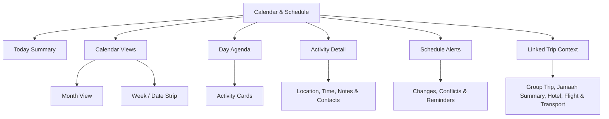
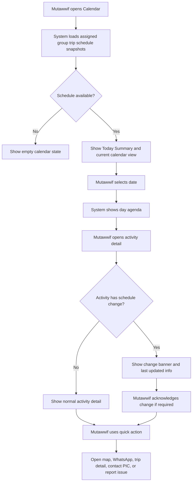
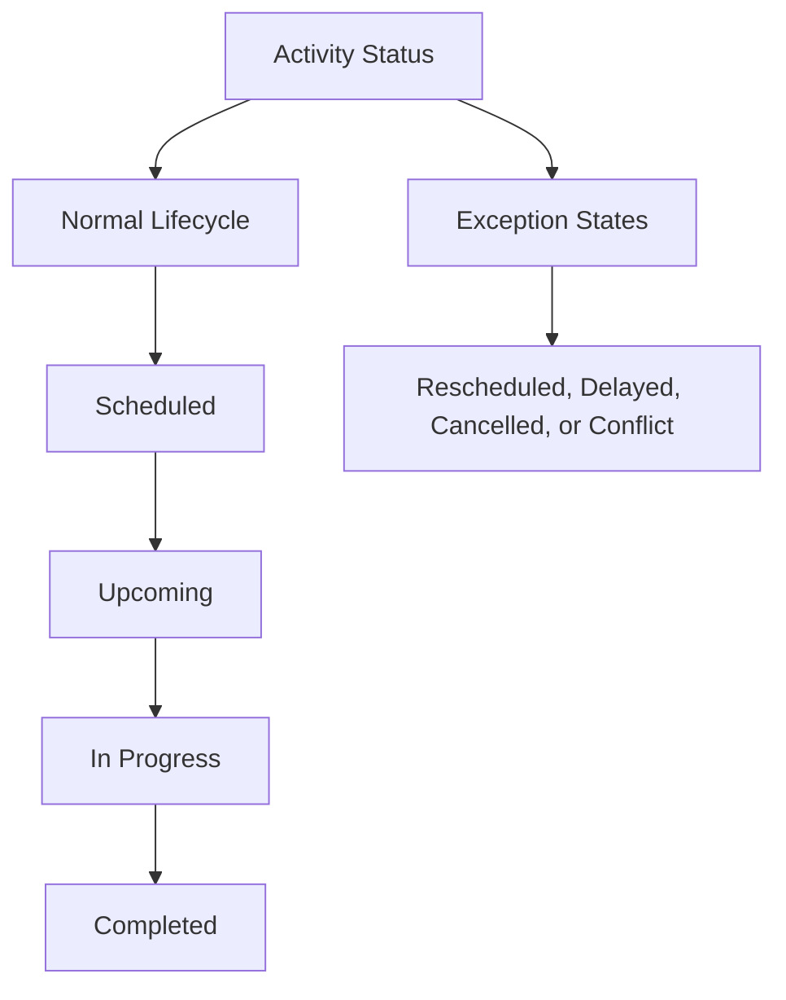
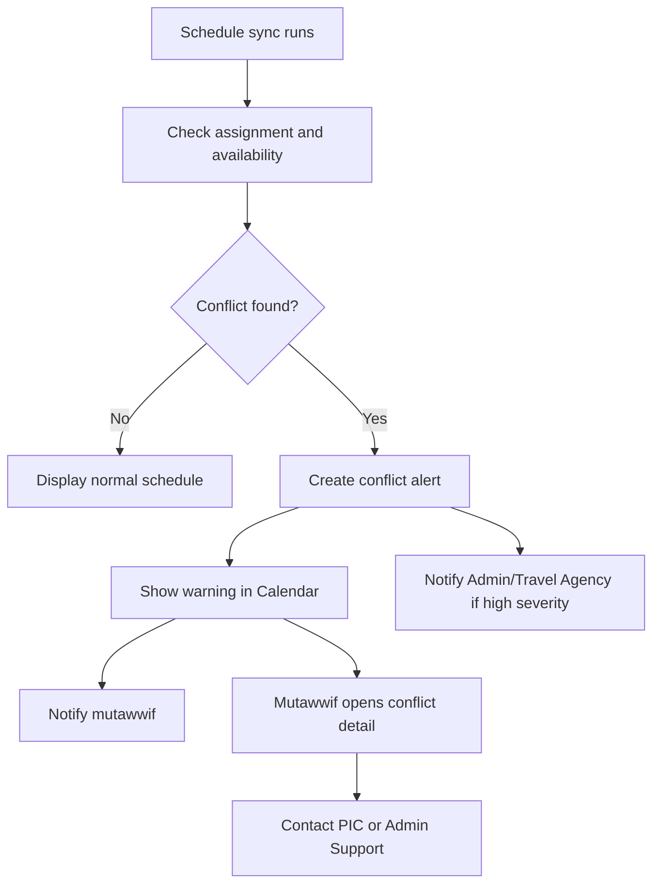

# MV PRD 04 - Calendar & Schedule

Product: UmrahHaji.com Mutawwif View  
Module: Calendar & Schedule  
Scope: Mutawwif Mobile Web App / Assignment Calendar, Daily Schedule & Activity Detail  
Platform: Mobile-first Responsive Web Platform  
Status: Draft  
Last Updated: 19 June 2026  

---

## 1. Objective

Calendar & Schedule is the daily operational workspace for mutawwif. It allows a mutawwif to view assigned group trip schedules, daily itinerary activities, activity locations, participant context, reminders, schedule changes, and assignment conflicts from a mobile-first interface.

This module must help mutawwif answer:

1. What group trip activities am I responsible for today?
2. What is the next activity, where is it, and when should I be there?
3. Which group, travel agency, and jamaah are related to this activity?
4. Has the itinerary changed after the schedule was published?
5. Which activities require preparation, briefing, document awareness, transport coordination, or ritual guidance?
6. Are there conflicts with my availability or another assigned trip?
7. Which schedule times are shown in local time and destination time?
8. How do I quickly contact the Travel Agency, group WhatsApp, or Admin support if an issue happens?

Calendar & Schedule is not a trip editor. It is a read-first operational calendar for assigned mutawwif work.

---

## 2. Relationship With Mutawwif View Master Scope

This module follows the Mutawwif View mobile web app scope:

1. Mutawwif View is mobile-first and focused on assigned work.
2. Calendar shows only schedules for group trips assigned to the logged-in mutawwif.
3. Calendar consumes Group Trip itinerary snapshots, not raw itinerary templates.
4. Mutawwif can view schedule details and operational notes, but cannot change package, hotel, flight, itinerary template, or group trip master data.
5. Any activity status update by mutawwif must be limited, auditable, and permission-based.
6. Schedule changes made by Admin or Travel Agency must trigger notifications to mutawwif.
7. Calendar must remain useful during travel, including limited connectivity states.

---

## 3. Relationship With Admin, Travel Agency, and Jamaah PRDs

| Source Module | Relationship |
| --- | --- |
| Admin Group Trip Management | Source of group trip assignment, mutawwif assignment, dated itinerary snapshot, schedule changes, status, and WhatsApp group link |
| Admin Itinerary Management | Source of reusable itinerary templates before they are converted into trip-specific schedule snapshots |
| Admin Mutawwif Management | Source of mutawwif verification, status, availability, and assignment readiness |
| Admin Report Management | Destination for escalation if an activity issue becomes a report |
| Admin Announcement Management | Source of urgent operational announcements shown in calendar notifications if targeted |
| Travel Agency Group Trip Management | Agency-owned operational source for group trip schedule, members, hotel, flight, transport, and itinerary |
| Travel Agency Mutawwif Assignment | Source of assignment role, assignment status, conflict checks, and replacement history |
| Travel Agency Documents & Services | Source of document/service readiness signals when relevant to activity preparation |
| Jamaah My Group Trip | Jamaah-facing itinerary and trip detail view; should align with mutawwif schedule where visible |
| Jamaah Checklist & Guidance | Jamaah-facing preparation guidance that can align with mutawwif activity briefing |
| Billing / Finance / Allowance | Not editable here; activity completion may feed future allowance calculation if enabled |

### 3.1 Key Sync Rule

Calendar reads from the Group Trip Schedule Snapshot.

Itinerary Template -> Package Itinerary Reference -> Group Trip Schedule Snapshot -> Mutawwif Calendar.

Updating an itinerary template must not automatically change a mutawwif calendar entry for an existing group trip. Existing group trip schedule changes must be made through Group Trip operations and then pushed to Mutawwif Calendar.

---

## 4. Research Notes and Product Decisions

The external and internal research direction for this module is:

1. Pilgrimage operations require clarity, service readiness, and timely instructions. The Ministry of Hajj and Umrah positions digital services as a way to facilitate and expedite official service completion for beneficiaries, while Nusuk is the pilgrimage planning ecosystem. Calendar should therefore prioritize practical service timing and clarity over decorative calendar views.
2. Mutawwif activity guidance must not be positioned as official fatwa. Ritual guidance text should be sourced from approved platform content or agency-approved notes and marked as guidance where appropriate.
3. Mobile controls must be easy to tap during movement. WCAG 2.2 Target Size guidance states targets should be at least 24 x 24 CSS pixels or have sufficient spacing.
4. Calendar should show the destination timezone prominently for in-trip activities because Umrah/Hajj operations happen across Malaysia/Indonesia departure context and Saudi destination context.
5. Schedule edits belong to Admin/Travel Agency Group Trip operations. Mutawwif can acknowledge changes, view details, contact PIC, and optionally mark attendance/activity status if enabled.
6. The schedule must support operational activities, not only ritual activities: departure, arrival, transit, hotel check-in, briefing, transport movement, ziyarah, prayer, rest, emergency support, and free time.
7. Offline-friendly cached schedule is valuable, but any action that changes server state should sync when connection returns.

Reference sources:

1. Nusuk pilgrimage platform: https://www.nusuk.sa/
2. Ministry of Hajj and Umrah official site: https://haj.gov.sa/en
3. W3C WCAG 2.2 - Target Size Minimum: https://www.w3.org/WAI/WCAG22/Understanding/target-size-minimum.html

---

## 5. Scope

### 5.1 In Scope for Phase 1

1. Calendar landing screen for mutawwif.
2. Today summary.
3. Month view with assigned activity indicators.
4. Week view or compact date strip.
5. Day agenda.
6. Activity detail page.
7. Filter by trip, activity type, status, and location.
8. Schedule sourced from assigned Group Trip snapshots.
9. Timezone label and time conversion display.
10. Schedule change indicator.
11. Conflict warning for overlapping assignments or unavailable dates.
12. Empty state for no schedule.
13. Offline cached read-only schedule.
14. Push/in-app notification entry points.
15. Quick actions:
   - Open trip detail.
   - Open location/map link.
   - Open WhatsApp group link.
   - Contact agency PIC.
   - Contact Admin support.
   - Report issue.
16. Read-only participant summary.
17. Optional activity acknowledgement.
18. Mobile-first responsive behavior.

### 5.2 In Scope for Phase 2

1. Mutawwif check-in / activity attendance.
2. GPS arrival confirmation.
3. QR scan for group assembly.
4. Calendar export as .ics.
5. Offline action queue.
6. Personal notes visible only to mutawwif.
7. Team handover notes between lead and assistant mutawwif.
8. Live delay reporting.
9. Route estimate and meeting point pin.
10. Smart reminders based on flight/hotel schedule changes.

### 5.3 Out of Scope

1. Creating itinerary templates.
2. Editing package itinerary.
3. Editing group trip master schedule.
4. Reassigning mutawwif.
5. Editing hotel, flight, transport, or package master data.
6. Managing jamaah documents.
7. Billing, payout, allowance, or payment settings.
8. Public package discovery.
9. Native mobile push implementation details.
10. Official religious ruling content management.

---

## 6. User Roles and Access

| Role | Access Behavior |
| --- | --- |
| Pending mutawwif | Cannot access full calendar until account/assignment rules allow |
| Invited mutawwif | Can see onboarding/invitation state, not assigned schedule unless activated |
| Active mutawwif | Can view assigned trip schedules |
| Verified mutawwif | Eligible for assignment and full calendar access |
| Lead mutawwif | Can see assigned group schedule, participant summary, and assistant mutawwif names if assigned |
| Assistant mutawwif | Can see assigned activities and group context based on assignment role |
| Suspended mutawwif | Calendar blocked or read-only depending on Admin policy |
| Admin | Manages schedule from Admin Panel, not Mutawwif View |
| Travel Agency staff | Manages trip schedule from TA Portal, not Mutawwif View |

### 6.1 Visibility Rule

Mutawwif can only see:

1. Own assigned group trips.
2. Activities where the mutawwif is assigned directly or through group trip assignment.
3. Participant summary necessary for operational guidance.
4. Contact information for operational PICs.
5. Schedule change notes visible to mutawwif.

Mutawwif must not see:

1. Jamaah payment details.
2. Jamaah private identity documents unless explicitly required by an activity and permission allows.
3. Other mutawwif private availability.
4. Internal Admin notes.
5. Travel Agency financial data.

---

## 7. Entry Points

| Entry Point | Behavior |
| --- | --- |
| Bottom navigation Calendar tab | Opens Calendar landing screen |
| Home Today's Activities stat | Opens today's agenda |
| Home Next Activity card | Opens activity detail |
| My Group Trip itinerary section | Opens trip-filtered calendar or selected activity detail |
| Notification - schedule changed | Opens changed activity detail |
| Notification - upcoming activity | Opens activity detail |
| Profile availability conflict warning | Opens affected schedule range |
| Report issue action | Opens Report module with activity context prefilled |

---

## 8. Information Architecture

The diagram below shows the mobile calendar structure and how mutawwif moves from schedule overview into action-level context.



```text
Calendar & Schedule
+-- Today Summary
|   +-- Next Activity
|   +-- Activity Count
|   +-- Active Trip
|   +-- Urgent Alerts
+-- Calendar Views
|   +-- Month View
|   +-- Week / Date Strip
|   +-- Day Agenda
+-- Filters
|   +-- Trip
|   +-- Activity Type
|   +-- Status
|   +-- Location
+-- Activity Detail
|   +-- Activity Header
|   +-- Time & Timezone
|   +-- Location & Map
|   +-- Trip Context
|   +-- Participant Summary
|   +-- Operational Notes
|   +-- Quick Actions
+-- Schedule Alerts
|   +-- Schedule Change
|   +-- Conflict Warning
|   +-- Reminder
|   +-- Cancellation
+-- Linked Modules
    +-- My Group Trip
    +-- Notifications
    +-- Reports
    +-- Profile Availability
```

---

## 9. Main Calendar Flow



---

## 10. Schedule Source and Sync Logic

### 10.1 Schedule Hierarchy

| Layer | Purpose | Calendar Behavior |
| --- | --- | --- |
| Itinerary Template | Reusable schedule blueprint | Not shown directly to mutawwif |
| Package Itinerary Reference | Default itinerary selected for package | Not shown directly unless package is linked |
| Group Trip Schedule Snapshot | Real departure schedule with dates/times | Primary source for calendar |
| Mutawwif Activity Assignment | Optional per-activity responsibility layer | Filters activities by mutawwif responsibility if available |

### 10.2 Sync Rules

1. Calendar must pull activities from assigned Group Trip Schedule Snapshot.
2. If a group trip schedule is edited by Admin/Travel Agency, system creates a schedule update event.
3. Updated activities must show `Updated` badge until acknowledged or viewed by mutawwif.
4. Existing completed activities remain in history with original and updated timestamps.
5. Activity changes must show `Last updated by`, `Last updated at`, and optional `Change note` if visible to mutawwif.
6. Calendar should not expose the raw template version unless useful as read-only metadata.
7. Schedule sync should be near real-time for active trips, but read-only cache should remain available when offline.

---

## 11. Calendar Views

### 11.1 Calendar Landing

The default landing should open to `Today`.

| Element | Requirement |
| --- | --- |
| Top navbar | Logo, notification bell, optional date shortcut |
| Greeting / title | Calendar or Today's Schedule |
| Today summary | Next activity, activity count, active trip, alert count |
| Date strip | 7-day horizontal strip with activity indicators |
| Day agenda | Activity cards grouped by time |
| Bottom navigation | Home, My Trips, Calendar, Profile |

### 11.2 Month View

Month view is useful for seeing assigned trip blocks and activity density.

| Element | Requirement |
| --- | --- |
| Month selector | Current month by default |
| Date cell indicators | Dots or color marks for assigned activities |
| Active trip range | Subtle highlighted range if trip spans multiple days |
| Today marker | Clearly highlighted |
| Selected date | Active selected style |
| Conflict marker | Warning icon/dot |

### 11.3 Week / Date Strip

Week/date strip should be used for quick mobile navigation.

| Element | Requirement |
| --- | --- |
| 7-day strip | Today centered where possible |
| Activity count | Small count/dot per date |
| Swipe | Horizontal swipe allowed |
| Tap date | Loads day agenda |
| Long label | Use short date labels on mobile |

### 11.4 Day Agenda

Day agenda is the most important operational view.

| Field | Description |
| --- | --- |
| Time | Activity start time with timezone label |
| Activity title | Example: Umrah Tawaf, Hotel Check-in, Airport Departure |
| Activity type icon | Departure, Arrival, Bus, Hotel, Tawaf, Sai, Ziyarah, Briefing |
| Trip name | Assigned group trip name |
| Location | Main location or meeting point |
| Status | Scheduled, Upcoming, In Progress, Completed, Cancelled, Rescheduled |
| Change badge | Shows if schedule was updated |
| Action | Tap card to open activity detail |

---

## 12. Activity Detail

### 12.1 Purpose

Activity Detail is the operational action page for a single calendar event. It should contain enough information for mutawwif to execute the activity without digging into the full group trip page.

### 12.2 Activity Detail Fields

| Field | Type | Required | Source | Notes |
| --- | --- | ---: | --- | --- |
| Activity ID | System | Yes | Group Trip Schedule Snapshot | Hidden unless needed for support |
| Activity Title | Text | Yes | Group Trip itinerary activity | Example: Departure from KLIA |
| Activity Type | Select/System | Yes | Itinerary icon/type | Used for icon and filters |
| Activity Status | Status | Yes | Group Trip / Calendar | Scheduled by default |
| Start Date | Date | Yes | Group Trip snapshot | Must be trip-specific |
| Start Time | Time | Recommended | Group Trip snapshot | Timezone label required |
| End Time | Time | Optional | Group Trip snapshot | Required if activity duration matters |
| Timezone | Select/System | Yes | Group Trip timezone setting | Show label, e.g. Asia/Riyadh GMT+3 |
| Location Name | Text/select | Recommended | Group Trip snapshot | Meeting point or city |
| Location Address | Text | Optional | Group Trip snapshot | Useful for hotel/airport |
| Map Link | URL | Optional | Group Trip snapshot | Opens external map |
| Trip Name | Text | Yes | Group Trip | Link to My Group Trip |
| Travel Agency | Text | Yes | Group Trip | Show agency name |
| Agency PIC | Contact | Recommended | Group Trip/TA | Phone/WhatsApp/email if visible |
| Admin Support | Contact | Optional | Platform setting | Emergency/support escalation |
| WhatsApp Group Link | URL | Optional | Group Trip | Open group link |
| Participant Count | Number | Recommended | Trip Members | Summary only |
| Participant Notes | Text | Optional | Group Trip | Example: senior group, family group |
| Operational Notes | Text | Optional | Group Trip activity notes | Mutawwif visible notes only |
| Internal Notes | Text | No | Admin-only | Must not display |
| Last Updated At | Datetime | Yes | Audit event | Show if changed |
| Last Updated By | Text | Optional | Audit event | Admin/Agency label |

### 12.3 Quick Actions

| Action | Phase | Behavior |
| --- | --- | --- |
| Open Trip Detail | P1 | Opens My Group Trip detail |
| Open Map | P1 | Opens external map if location available |
| Open WhatsApp Group | P1 | Opens group link if available |
| Contact Agency PIC | P1 | Opens contact options |
| Contact Admin Support | P1 | Opens support route |
| Report Issue | P1 | Opens report form with trip/activity context |
| Acknowledge Change | P1 | Marks schedule change as viewed/acknowledged |
| Mark Activity Done | P2 | Mutawwif marks activity completed if permission allows |
| Add Personal Note | P2 | Private note stored for mutawwif only |

---

## 13. Activity Type Taxonomy

Calendar must support operational and pilgrimage-specific activity types.

| Category | Activity Types |
| --- | --- |
| Flight | Departure, Arrival, Transit, Airport Assembly |
| Transport | Bus Transfer, Train Transfer, Inter-city Transfer, Driver/Vehicle Briefing |
| Hotel | Check-in, Check-out, Room Allocation, Luggage Coordination |
| Ritual | Ihram, Tawaf, Sai, Tahallul, Umrah, Wada, Manasik Briefing |
| Hajj | Mina, Arafah, Muzdalifah, Jamarat, Tashreeq, Ifadah |
| Ziyarah | Makkah Ziyarah, Madinah Ziyarah, Haram Visit, Raudhah Visit |
| Group Care | Briefing, Meal Coordination, Rest Time, Health Reminder |
| Support | Document Reminder, Emergency Support, Incident Follow-up |
| Free Time | Free Time, Optional Activity |

### 13.1 Product Rule

The activity taxonomy should reuse the icon and type master data from Itinerary Management so Admin, Travel Agency, Jamaah, and Mutawwif views remain consistent.

---

## 14. Status Model

### 14.1 Activity Status Values

| Status | Meaning | Mutawwif Action |
| --- | --- | --- |
| Scheduled | Activity is planned but not yet near time | View details |
| Upcoming | Activity is soon based on reminder threshold | Prepare / open details |
| In Progress | Current time is within activity window or manually started | View / support |
| Completed | Activity completed | View history |
| Cancelled | Activity cancelled by Admin/TA | View reason |
| Rescheduled | Activity date/time changed | Acknowledge change |
| Delayed | Activity delayed but still active | View new ETA |
| Conflict | Activity overlaps another assignment or unavailable date | Contact PIC / Admin |

### 14.2 Status Flow

The diagram separates the normal activity lifecycle from exception states so implementation does not treat exceptions as a required sequential path. Exception details are controlled by the status ownership table below.



### 14.3 Status Ownership

| Status | Owned By |
| --- | --- |
| Scheduled | Admin/Travel Agency schedule source |
| Upcoming | System calculated |
| In Progress | System calculated or optional operations control |
| Completed | System calculated or permission-based mutawwif/Admin action |
| Cancelled | Admin/Travel Agency |
| Rescheduled | Admin/Travel Agency schedule change |
| Delayed | Admin/Travel Agency; future mutawwif request |
| Conflict | System calculated |

---

## 15. Timezone Rules

### 15.1 Display Rules

1. Every activity time must show a timezone label.
2. During active trip dates, destination timezone should be the primary display.
3. Before departure, departure/local timezone can be shown as primary with destination equivalent if helpful.
4. If local timezone differs from activity timezone, show a secondary line:
   - Example: `10:00 PM Malaysia time / 5:00 PM Saudi time`.
5. Flight and transport activities may show departure and arrival timezone separately.
6. User device timezone must not silently overwrite trip timezone.

### 15.2 Timezone Fields

| Field | Required | Notes |
| --- | ---: | --- |
| local_timezone | Yes | Departure or user local timezone |
| destination_timezone | Yes | Usually Saudi Arabia for Umrah/Hajj |
| activity_timezone | Yes | Timezone used for activity schedule |
| display_timezone_mode | Yes | Local, destination, both |
| converted_time | System | Derived display only |

---

## 16. Conflict Detection

### 16.1 Conflict Types

| Conflict | Description | Severity |
| --- | --- | --- |
| Assignment Overlap | Mutawwif has two activities at overlapping times | High |
| Trip Overlap | Mutawwif assigned to two trips with overlapping travel dates | High |
| Availability Conflict | Activity falls inside unavailable/on-leave date | High |
| Location Impossibility | Consecutive activities have unrealistic movement gap | Medium |
| Verification Block | Mutawwif status becomes inactive/suspended/unverified | High |
| Schedule Changed | Activity changed after mutawwif viewed it | Medium |
| Missing Location | Activity lacks meeting point/location | Medium |
| Missing Contact | No agency/admin contact for critical activity | Medium |

### 16.2 Conflict Flow



### 16.3 Rules

1. High severity conflicts must show in Calendar, Home, and Notifications.
2. Conflict warning does not let mutawwif self-reassign.
3. Admin/Travel Agency remains responsible for assignment correction.
4. Mutawwif can report an issue if the conflict impacts operations.
5. Conflict events must be audit logged.

---

## 17. Schedule Change and Acknowledgement

### 17.1 Schedule Change Banner

If activity is changed after assignment, Activity Detail should show:

1. `Schedule updated` banner.
2. Previous time/date if allowed.
3. New time/date.
4. Change reason or note if available.
5. Last updated by Admin/Travel Agency.
6. Acknowledge button if acknowledgement is required.

### 17.2 Acknowledgement Rules

| Rule | Requirement |
| --- | --- |
| Required acknowledgement | Configurable per activity type or severity |
| Who can acknowledge | Assigned mutawwif only |
| What is logged | User ID, timestamp, activity ID, schedule version |
| If not acknowledged | Reminder notification can be sent |
| If activity is changed again | Acknowledgement resets for new version |

---

## 18. Notifications and Reminders

### 18.1 Notification Events

| Event | Channel | Recipient | Timing |
| --- | --- | --- | --- |
| New assignment added | In-app, email/WhatsApp if enabled | Mutawwif | Immediately |
| Schedule changed | In-app, push/WhatsApp if enabled | Mutawwif | Immediately |
| Activity reminder | In-app | Mutawwif | 24h, 2h, 30m configurable |
| Conflict detected | In-app, email/WhatsApp if high severity | Mutawwif, Admin/TA if needed | Immediately |
| Activity cancelled | In-app | Mutawwif | Immediately |
| Urgent announcement | In-app, WhatsApp if enabled | Targeted mutawwif | Immediately |
| Missing acknowledgement | In-app | Mutawwif | Configurable |

### 18.2 Notification Deep Links

| Notification | Opens |
| --- | --- |
| New assignment | Trip-filtered calendar |
| Schedule changed | Changed activity detail |
| Activity reminder | Activity detail |
| Conflict detected | Conflict detail or affected activity |
| Activity cancelled | Activity detail with cancelled status |
| Urgent announcement | Announcement detail or related trip |

---

## 19. Data Requirements

### 19.1 Calendar API Response

```text
MutawwifCalendar
+-- user
|   +-- userId
|   +-- mutawwifId
|   +-- displayName
|   +-- verificationStatus
+-- view
|   +-- selectedDate
|   +-- displayTimezone
|   +-- localTimezone
|   +-- destinationTimezone
+-- summary
|   +-- todayActivityCount
|   +-- nextActivityId
|   +-- activeTripCount
|   +-- conflictCount
|   +-- unreadScheduleChangeCount
+-- days[]
|   +-- date
|   +-- activityCount
|   +-- conflictCount
|   +-- tripIds[]
+-- activities[]
    +-- activityId
    +-- groupTripId
    +-- groupTripName
    +-- travelAgencyId
    +-- travelAgencyName
    +-- activityTitle
    +-- activityType
    +-- activityStatus
    +-- startDateTime
    +-- endDateTime
    +-- activityTimezone
    +-- locationName
    +-- mapUrl
    +-- participantCount
    +-- assignedRole
    +-- isChanged
    +-- changeAcknowledgementRequired
    +-- lastUpdatedAt
```

### 19.2 Activity Detail Data

```text
MutawwifActivityDetail
+-- activity
|   +-- activityId
|   +-- scheduleVersion
|   +-- title
|   +-- type
|   +-- status
|   +-- date
|   +-- startTime
|   +-- endTime
|   +-- timezone
|   +-- convertedTimeLabel
|   +-- description
|   +-- operationalNotes
+-- location
|   +-- name
|   +-- address
|   +-- mapUrl
|   +-- meetingPoint
+-- trip
|   +-- groupTripId
|   +-- groupTripName
|   +-- travelAgencyName
|   +-- scheduleRange
|   +-- status
+-- participants
|   +-- totalCount
|   +-- familyGroupCount
|   +-- individualCount
|   +-- specialNotesCount
+-- contacts
|   +-- agencyPic
|   +-- adminSupport
|   +-- whatsappGroupUrl
+-- changeLog
    +-- changedAt
    +-- changedByLabel
    +-- changeReason
    +-- previousValueSummary
    +-- acknowledgementStatus
```

---

## 20. UI Components

### 20.1 Reusable Components

| Component | Usage |
| --- | --- |
| Calendar Header | Title, selected month/date, notification shortcut |
| Today Summary Card | Next activity, count, active trip, conflict count |
| Date Strip | Week/day selection |
| Month Calendar Grid | Monthly schedule overview |
| Activity Card | Day agenda item |
| Activity Detail Sheet/Page | Full activity detail |
| Status Chip | Activity status |
| Change Badge | Updated/rescheduled marker |
| Conflict Banner | Conflict warning |
| Timezone Label | Local/destination time clarity |
| Quick Action Row | Map, WhatsApp, contact, report |
| Empty State | No schedule today or no assigned trip |
| Offline Banner | Cached schedule indicator |

### 20.2 Mobile Interaction Requirements

1. Primary tappable controls should be at least 44px high where possible, and never below WCAG minimum target guidance.
2. Important actions must have clear icon + label, not icon-only unless globally understood.
3. Activity cards must be large enough for one-handed use.
4. Calendar date cells can be compact but should provide an accessible selected/today state.
5. Long activity titles must wrap, not truncate critical timing/location details.
6. Bottom navigation must respect safe-area padding and must not cover agenda content.
7. Activity detail should be reachable in one tap from Home Next Activity and Calendar agenda.

---

## 21. Empty, Loading, Error, and Offline States

| State | UI Behavior | User Message |
| --- | --- | --- |
| Loading | Skeleton date strip and agenda cards | Loading your schedule |
| No assigned trip | Empty state with Profile/My Trip shortcut | No assigned group trip yet |
| No activity today | Calm empty state | No activity scheduled today |
| No internet | Show cached data if available | Showing last saved schedule |
| Sync failed | Retry button | Could not refresh schedule |
| Schedule conflict | Warning banner | This schedule needs attention |
| Activity cancelled | Cancelled banner | This activity was cancelled |
| Permission blocked | Restricted state | You do not have access to this schedule |

---

## 22. Permission Matrix

| Action | Pending | Active | Verified | Lead | Assistant | Suspended |
| --- | ---: | ---: | ---: | ---: | ---: | ---: |
| View calendar shell | Limited | Yes | Yes | Yes | Yes | Limited |
| View assigned schedule | No | Yes | Yes | Yes | Yes | Limited/no |
| View activity detail | No | Yes | Yes | Yes | Assigned only | Limited/no |
| Open WhatsApp group | No | Yes | Yes | Yes | Yes | No |
| Contact agency PIC | No | Yes | Yes | Yes | Yes | Limited/no |
| Acknowledge schedule change | No | Yes | Yes | Yes | Yes | No |
| Report issue | No | Yes | Yes | Yes | Yes | Limited/no |
| Mark activity done | No | Configurable | Configurable | Configurable | Configurable | No |

---

## 23. Audit and Logging

Calendar must log:

1. Activity detail viewed if acknowledgement is required.
2. Schedule change acknowledged.
3. Conflict alert generated.
4. Quick action used for report issue.
5. Activity status update if enabled.
6. Offline queued action synced.
7. Permission denied event if sensitive schedule is blocked.

Audit log must include:

1. User ID.
2. Mutawwif profile ID.
3. Group trip ID.
4. Activity ID.
5. Action.
6. Timestamp.
7. Device/user agent metadata if available.

---

## 24. Form and Action Specifications

Calendar is mostly read-only, but several lightweight actions are needed.

### 24.1 Acknowledge Schedule Change

| Field | Type | Required | Validation | Notes |
| --- | --- | ---: | --- | --- |
| activity_id | Hidden | Yes | Existing assigned activity | From activity detail |
| schedule_version | Hidden | Yes | Current schedule version | Prevent stale acknowledgement |
| acknowledgement_note | Textarea | No | Max 300 chars | Optional mutawwif note |
| acknowledged_at | System | Yes | Current timestamp | Audit |

### 24.2 Report Issue From Activity

This action opens Report Management with context prefilled.

| Field | Prefilled Value |
| --- | --- |
| Reporter | Logged-in mutawwif |
| Related role | Travel Agency, Jamaah, Platform, or Mutawwif based on issue |
| Group Trip | Current group trip |
| Activity | Current activity |
| Category | Service by default; selectable |
| Priority | Normal by default; selectable |
| Subject | Empty |
| Description | Empty |
| Attachment | Optional |

Upload rules for report attachment should follow Report Management file rules, not Calendar rules.

### 24.3 Request Schedule Clarification

| Field | Type | Required | Validation | Notes |
| --- | --- | ---: | --- | --- |
| Activity | Hidden | Yes | Assigned activity | Context |
| Recipient | Select/system | Yes | Agency PIC / Admin Support | Default agency PIC |
| Message | Textarea | Yes | Max 500 chars | Ask clarification |
| Urgency | Select | Yes | Normal, Important, Urgent | Default Normal |

This is optional for Phase 1 if Report Management already covers the need.

---

## 25. Functional Requirements

| ID | Requirement | Priority |
| --- | --- | --- |
| MV-CAL-001 | System shall display Calendar tab in Mutawwif bottom navigation | P1 |
| MV-CAL-002 | System shall show only schedules related to assigned group trips | P1 |
| MV-CAL-003 | System shall use Group Trip Schedule Snapshot as calendar source | P1 |
| MV-CAL-004 | System shall display Today Summary on calendar landing | P1 |
| MV-CAL-005 | System shall display date strip for quick date navigation | P1 |
| MV-CAL-006 | System shall display day agenda grouped by selected date | P1 |
| MV-CAL-007 | System shall display activity cards with time, title, type, trip, location, and status | P1 |
| MV-CAL-008 | System shall display activity detail from activity card | P1 |
| MV-CAL-009 | System shall display timezone label for all scheduled activities | P1 |
| MV-CAL-010 | System shall display schedule change indicator when activity was updated | P1 |
| MV-CAL-011 | System shall allow assigned mutawwif to acknowledge schedule changes when required | P1 |
| MV-CAL-012 | System shall detect assignment overlaps and availability conflicts | P1 |
| MV-CAL-013 | System shall show high-severity conflicts in Calendar and Notifications | P1 |
| MV-CAL-014 | System shall deep link schedule notifications to the related activity detail | P1 |
| MV-CAL-015 | System shall provide quick action to open Group Trip detail | P1 |
| MV-CAL-016 | System shall provide quick action to open map link when available | P1 |
| MV-CAL-017 | System shall provide quick action to open WhatsApp group link when available | P1 |
| MV-CAL-018 | System shall provide quick action to contact agency PIC when available | P1 |
| MV-CAL-019 | System shall provide report issue entry point with trip/activity context | P1 |
| MV-CAL-020 | System shall support read-only cached schedule during offline state | P1 |
| MV-CAL-021 | System shall not allow mutawwif to edit itinerary templates or trip master schedule | P1 |
| MV-CAL-022 | System shall hide internal Admin notes from mutawwif | P1 |
| MV-CAL-023 | System shall record audit logs for acknowledgement and conflict events | P1 |
| MV-CAL-024 | System shall support month view with activity indicators | P2 |
| MV-CAL-025 | System shall support mark activity done if enabled by Admin/TA permission | P2 |
| MV-CAL-026 | System shall support calendar export as .ics | P2 |
| MV-CAL-027 | System shall support GPS arrival confirmation | P2 |

---

## 26. Acceptance Criteria

1. Mutawwif can open Calendar from bottom navigation.
2. Calendar loads only assigned group trip schedules.
3. Today summary shows next activity, activity count, active trip, and alert/conflict count.
4. Mutawwif can select a date and view agenda for that date.
5. Activity card shows title, time, timezone, trip, location, type, and status.
6. Activity detail shows trip context, participant summary, notes, contact options, and quick actions.
7. Schedule changes display a visible updated banner.
8. Mutawwif can acknowledge schedule change when required.
9. Conflict warning appears for overlapping assignment or unavailable date.
10. Mutawwif cannot edit group trip schedule from Calendar.
11. Internal Admin notes are not visible.
12. WhatsApp, map, and contact actions are hidden or disabled when data is missing.
13. Offline state shows cached schedule with clear stale-data message.
14. Notification deep links open the correct activity.
15. Calendar remains usable on 320px mobile width without clipping primary actions.
16. All key actions are audit logged.

---

## 27. Dependencies

| Dependency | Notes |
| --- | --- |
| Group Trip Schedule Snapshot | Required source of actual dated activities |
| Mutawwif Assignment | Determines which trips/activities are visible |
| Mutawwif Profile Availability | Used for conflict detection |
| Notification System | Required for reminders and schedule changes |
| Report Management | Used for issue escalation |
| Map URL/location data | Required for map quick action |
| WhatsApp Group Link | Optional quick action |
| Timezone Master Data | Required for correct display |

---

## 28. Future Enhancements

1. Offline itinerary pack with hotel, flight, emergency contacts, and map notes.
2. Smart route reminder based on location and meeting point.
3. AI-generated daily briefing checklist from itinerary and jamaah readiness data.
4. Mutawwif team handover between shifts.
5. Live trip operations board for Admin/TA.
6. QR attendance for group assembly.
7. Activity completion feeding allowance calculation.
8. Calendar integration with external calendar apps.
9. Multi-language ritual briefing templates.
10. Emergency broadcast mode.

---

## 29. Final Product Decision

PRD 04 should define Calendar & Schedule as the mutawwif's daily execution layer.

The best Phase 1 solution is:

1. Use Group Trip Schedule Snapshot as the only operational source.
2. Keep mutawwif schedule read-first and mobile-first.
3. Allow quick action, acknowledgement, and reporting, but not schedule editing.
4. Use timezone-aware activity display.
5. Notify mutawwif immediately when schedules change.
6. Preserve strong data boundaries between Admin, Travel Agency, Jamaah, and Mutawwif views.

This keeps the module realistic for Phase 1 while still supporting the operational complexity of Umrah/Hajj group trips.
