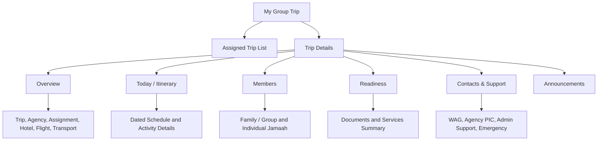
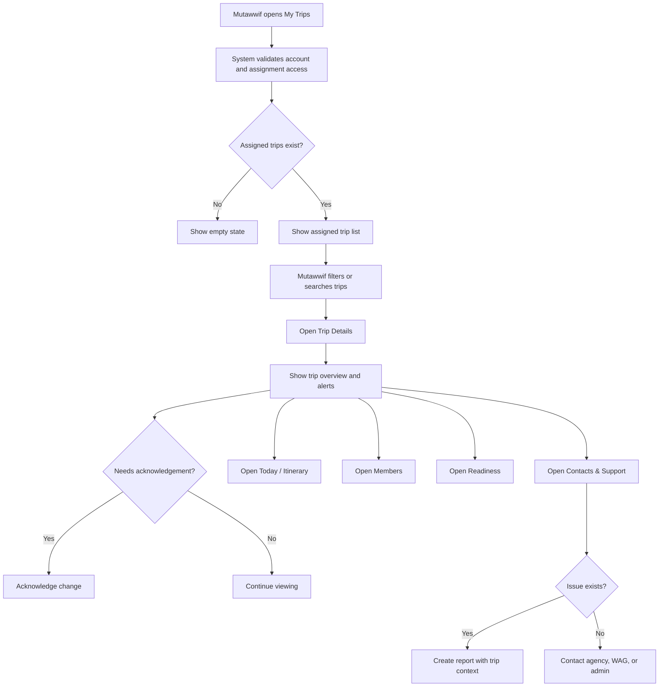
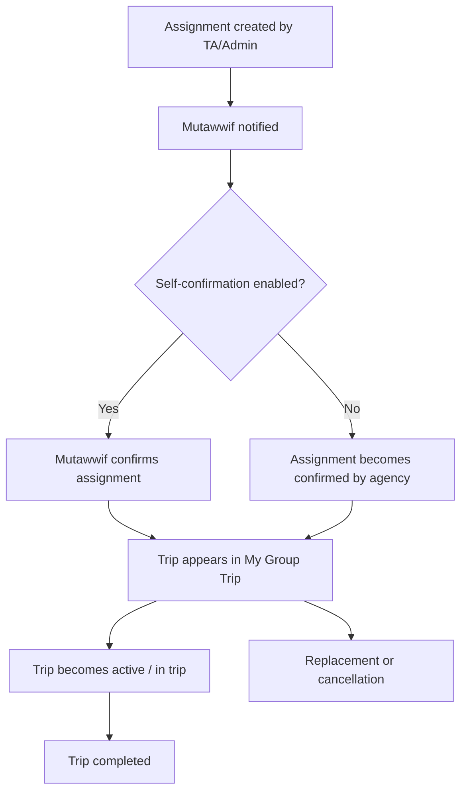
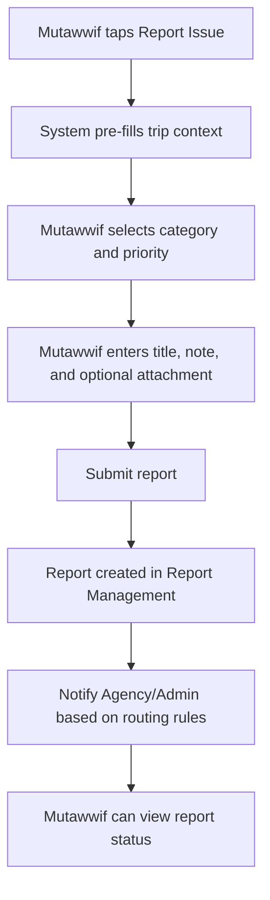

# MV PRD 05 - My Group Trip & Trip Details

Product: UmrahHaji.com Mutawwif View  
Module: My Group Trip & Trip Details  
Scope: Mutawwif Mobile Web App / Assigned Group Trip Operations  
Platform: Mobile-first Responsive Web Platform  
Status: Draft  
Last Updated: 19 June 2026  

---

## 1. Objective

My Group Trip & Trip Details is the mutawwif-facing operational workspace for assigned Umrah/Hajj group trips. It allows a mutawwif to view assigned trips, understand trip readiness, review group members, follow the dated itinerary, access hotel/flight/transport context, contact the Travel Agency PIC, open the WhatsApp group, acknowledge schedule changes, and escalate issues through Reports.

This module must help mutawwif answer:

1. Which group trips am I assigned to?
2. Which trips are active, upcoming, completed, cancelled, or require attention?
3. What are the trip schedule, city flow, hotel, flight, transport, and itinerary details?
4. Who are the jamaah in this group, and how are they organized by family/group?
5. Are there members or operational services that need attention before departure?
6. What is today's itinerary and what is my responsibility?
7. Who should I contact if there is an issue?
8. What information is safe for me to view and what remains hidden?

This module is not a Group Trip editor. It is a read-first mobile workspace for assigned mutawwif operations.

---

## 2. Relationship With Mutawwif View Master Scope

This module follows the Mutawwif View mobile web app scope:

1. Mutawwif can access only their own assigned trips.
2. Group Trip data comes from Admin Panel and Travel Agency Portal operational snapshots.
3. Mutawwif can view assignment context, itinerary, members, readiness summary, and operational contacts.
4. Mutawwif cannot edit package, booking, payment, hotel, flight, itinerary template, transport master data, or member documents.
5. Mutawwif actions are limited to acknowledgement, operational notes where enabled, contact shortcuts, and report escalation.
6. Sensitive jamaah data must be minimized and permission-based.
7. Trip changes must show last updated timestamp and change acknowledgement when needed.
8. Offline-friendly read-only access should be supported for active trip details.

---

## 3. Relationship With Admin, Travel Agency, and Jamaah PRDs

| Source Module | Relationship |
| --- | --- |
| Admin Group Trip Management | Platform-level source for group trip monitoring, admin-assisted creation, mutawwif assignment, schedule, hotel, flight, itinerary, transport, trip members, readiness, and WAG link |
| Admin Mutawwif Management | Source of mutawwif account status, verification, profile, assignment readiness, and access eligibility |
| Admin Report Management | Destination for mutawwif issue escalation from trip detail |
| Admin Announcement Management | Source of urgent trip or role-targeted operational announcements |
| Travel Agency Group Trip Management | Main operational owner for group trip detail, trip members, document/service readiness, hotel, flight, itinerary, transport, WAG link, and activity logs |
| Travel Agency Mutawwif Assignment | Source of assignment role, assignment status, assignment history, and replacement flow |
| Travel Agency Finance / Allowance | Future source of allowance/tip reference; not editable in this module |
| Jamaah My Group Trip | Jamaah-facing version of trip detail; data should align where visible |
| Jamaah Checklist & Guidance | Source/partner for jamaah preparation context that may be reflected in mutawwif briefing |
| Calendar & Schedule | Trip itinerary and daily activities are also surfaced in Calendar module |

### 3.1 Key Sync Rule

Mutawwif View reads from Group Trip operational snapshots.

Package + Booking + Catalog Data -> Group Trip Operational Snapshot -> Mutawwif My Group Trip.

When Travel Agency or Admin changes a group trip after publication, Mutawwif View must display the updated snapshot, previous-view change indicator, and acknowledgement requirement where configured.

---

## 4. Research Notes and Product Decisions

The product direction for mutawwif trip operations is:

1. Mutawwif is a field-facing guide role, so the mobile view must prioritize trip execution, clarity, and contact access over administrative editing.
2. Group trip data can be complex. The mutawwif view should summarize readiness and expose details only when useful for operations.
3. Member privacy matters. Mutawwif may need names, family grouping, nationality, room grouping, special assistance notes, and emergency escalation context, but should not see payment, full identity documents, bank data, or private personal data by default.
4. Ritual and guidance content must be positioned as platform/agency-approved guidance, not official fatwa.
5. During active travel, the interface should support quick tapping, large touch targets, low-bandwidth usage, and read-only offline cache.
6. Group Trip is the source of operational truth. Mutawwif can acknowledge and report issues, but cannot silently change trip operations.
7. Lead mutawwif and assistant mutawwif may require different access. Lead can see broader group context; assistant may see only assigned activities or assigned sub-group.

Reference sources used as product direction:

1. Nusuk pilgrimage platform: https://www.nusuk.sa/
2. Ministry of Hajj and Umrah official site: https://haj.gov.sa/en
3. W3C WCAG 2.2 - Target Size Minimum: https://www.w3.org/WAI/WCAG22/Understanding/target-size-minimum.html
4. Personal Data Protection Act 2010, Laws of Malaysia Act 709: https://lom.agc.gov.my/act-detail.php?type=principal&lang=BI&act=709

### 4.0.1 Research Update for PRD 05 Finalization

The finalization review for PRD 05 confirms that the module should stay focused on assigned group trip visibility and field support. Current official pilgrimage digital ecosystems emphasize trusted trip facilitation, service coordination, official guidance, and safer pilgrim handling. For Mutawwif View, this translates into:

1. Clear assigned-trip visibility rather than broad trip management.
2. Fast access to schedule, location, members, contacts, and escalation.
3. Privacy-safe display of jamaah and readiness data.
4. Strong separation between operational ownership and field execution.
5. Mobile-first interaction with large enough touch targets for field use.
6. Configurable health, visa, document, and service rules controlled by Admin/Travel Agency, not hard-coded in the mutawwif app.

This research reinforces the decision that PRD 05 should be a trip workspace. Activity-level execution depth belongs to PRD 06, while financial references belong to PRD 08 and PRD 09.

### 4.1 Research Validation Notes

| Research Area | Product Interpretation | Impact on This PRD |
| --- | --- | --- |
| Pilgrimage service operations | Official pilgrimage platforms emphasize guided service delivery, pilgrim support, and service supervision | Mutawwif View must prioritize active trip execution, itinerary clarity, member assistance, and escalation |
| Complaint, inquiry, and suggestion handling | Pilgrim-facing ecosystems usually include inquiry/complaint channels for service issues | Report Issue must be available from trip and activity context, with routing to Admin/Travel Agency |
| Data privacy | Personal data should be limited to the purpose needed by the receiving role | Mutawwif sees only operationally necessary jamaah data; full documents, payment data, bank data, and private medical data stay hidden by default |
| Mobile accessibility | Field users rely on quick mobile interactions during travel | Buttons, filters, tabs, and emergency/contact actions should use clear labels and large touch targets |
| Health and document readiness | Requirements may change by destination, season, package, government policy, or Travel Agency policy | Mutawwif View should display readiness status from Admin/Travel Agency, not hard-code medical or document rules |
| Operational ownership | Admin and Travel Agency own group trip data, while mutawwif supports execution | Mutawwif can acknowledge, contact, and report; mutawwif cannot silently edit trip master data |

### 4.2 Regulatory Safety Rule

This PRD must not hard-code official health, visa, vaccination, or travel document requirements inside Mutawwif View. Those requirements should be maintained in Admin/Travel Agency configuration and displayed to mutawwif only as readiness status, issue count, or action note.

### 4.3 Cross-Role Product Boundary

| Role / Surface | Owns | Can Mutawwif View Display? | PRD 05 Rule |
| --- | --- | --- | --- |
| Admin Panel | Platform-wide supervision, global status, compliance, audit, emergency escalation | Yes, as status or support context only | Do not expose internal Admin notes or global operational controls |
| Travel Agency Portal | Group trip operations, members, itinerary, hotel, flight, transport, WAG link, PIC contact, readiness | Yes, through trip snapshot and released fields | Treat Travel Agency data as the main operational source |
| Jamaah/User View | User-facing trip, payment, documents, personal readiness, family/group visibility | Yes, only where shared trip data overlaps | Keep itinerary aligned, but do not expose jamaah payment or private documents |
| Mutawwif View | Assigned trip support, itinerary awareness, member support context, contact, acknowledgement, report issue | Yes | Read-first, assignment-scoped, mobile-first |
| Finance / Allowance | Allowance, tip, payout readiness, settlement references | Limited future handoff only | PRD 05 may link to completed trip reference, but does not calculate or execute payout |

### 4.4 Boundary With PRD 06 - Activity Guidance / Daily Itinerary Execution

PRD 05 shows the selected group trip and its itinerary overview. PRD 06 should handle deeper per-activity execution.

| Area | PRD 05 Responsibility | PRD 06 Responsibility |
| --- | --- | --- |
| Trip context | Show trip, agency, assignment, members, readiness, contacts, alerts | Consume trip/activity context when executing an activity |
| Itinerary display | Show dated itinerary timeline inside Trip Details | Provide daily guidance, preparation checklist, activity instructions, and activity-level actions |
| Activity actions | Open activity, map, WAG, contact PIC, report issue | Acknowledge activity guidance, view ritual/service instructions, activity-specific escalation, optional completion signal |
| Member context | Privacy-safe member and readiness summary | Activity-specific participant notes only when needed |
| Ownership | Group Trip snapshot from Admin/TA | Group Trip schedule snapshot plus approved guidance content |
| Out of scope | Attendance, check-in, field notes, activity completion | Can define these as P1/P2 based on launch decision |

The handoff rule is: PRD 05 answers "what trip am I assigned to and what is the current operational context?" PRD 06 answers "what should I do for this activity today?"

---

## 5. Scope

### 5.1 In Scope for Phase 1

1. My Group Trip list.
2. Search assigned trips.
3. Filters by trip status, schedule, agency, and attention status.
4. Trip cards with status, schedule, pax count, agency, hotel/flight summary, readiness indicator, and next action.
5. Trip Details page.
6. Trip Overview tab.
7. Today / Itinerary tab.
8. Members tab with privacy-safe member list.
9. Readiness summary for documents and services.
10. Hotel summary.
11. Flight summary.
12. Transport summary.
13. WhatsApp group link shortcut when available.
14. Travel Agency PIC contact shortcut.
15. Admin support shortcut.
16. Emergency contacts section.
17. Assignment role and status display.
18. Schedule change acknowledgement.
19. Report Issue entry with trip context.
20. Announcements and urgent alerts.
21. Empty/loading/error/offline states.
22. Mobile-first responsive behavior.

### 5.2 In Scope for Phase 2

1. Activity check-in.
2. Attendance or assembly confirmation.
3. GPS-based arrival confirmation.
4. QR check-in for group assembly.
5. Assistant mutawwif sub-group task assignment.
6. Private mutawwif notes.
7. Team handover notes.
8. Live bus/location tracking.
9. Offline action queue.
10. Daily service observation.
11. Post-trip mutawwif report.
12. Allowance-ready activity completion feed.

### 5.3 Out of Scope

1. Creating group trips.
2. Editing group trip master data.
3. Editing package, booking, hotel, flight, itinerary template, or transport catalog.
4. Adding or removing trip members.
5. Uploading or verifying jamaah documents.
6. Changing payment or invoice data.
7. Reassigning mutawwif.
8. Viewing unrelated trips.
9. Viewing full identity documents by default.
10. Payout execution.

---

## 6. User Roles and Access

| Role | Access Behavior |
| --- | --- |
| Pending mutawwif | Cannot access assigned trip details until account rules allow |
| Invited mutawwif | Can see invitation/onboarding state, not full trip data unless activated |
| Active mutawwif | Can view own assigned trips |
| Verified mutawwif | Eligible for full assignment access |
| Lead mutawwif | Can view full assigned group context and operational readiness summary |
| Assistant mutawwif | Can view assigned trip context; member visibility may be limited to assigned subgroup or activity |
| Suspended mutawwif | Trip access blocked or read-only based on Admin policy |
| Replaced mutawwif | Historical access limited to previous assignment record; active trip access removed |
| Admin | Manages and monitors from Admin Panel |
| Travel Agency staff | Owns group trip operations from Travel Agency Portal |
| Jamaah | Views own user-facing My Group Trip, not this module |

### 6.1 Visibility Rules

Mutawwif can see:

1. Assigned group trip summary.
2. Package/trip schedule snapshot.
3. Travel Agency and agency PIC contact.
4. Assigned mutawwif role and responsibility.
5. Dated itinerary and activities.
6. Hotel, flight, and transport summary.
7. Member names and family/group grouping when enabled.
8. Member special assistance flags when relevant and permission-based.
9. Document/service readiness summary.
10. WhatsApp group link when enabled.
11. Announcements targeted to mutawwif or group trip.

Mutawwif must not see by default:

1. Jamaah payment amount or invoice details.
2. Jamaah bank data.
3. Jamaah full IC/passport files.
4. Jamaah private medical details unless specifically permitted for emergency support.
5. Internal Admin notes.
6. Travel Agency internal finance data.
7. Other mutawwif private profile or availability data.

Research-informed privacy rule:

Mutawwif visibility follows minimum necessary access. The default view should show display name, family/group role, gender where operationally required, nationality/country where operationally useful, language preference, visible assistance flags, readiness status, and room/service assignment only when released. Full identity document numbers, uploaded document files, payment amounts, invoices, bank information, and private health notes must remain hidden unless an explicit emergency or compliance permission is granted.

---

## 7. Entry Points

| Entry Point | Behavior |
| --- | --- |
| Bottom navigation My Trips | Opens assigned group trip list |
| Home Assigned Groups stat | Opens My Group Trip list filtered to active/upcoming assignments |
| Home Active Trip card | Opens selected Trip Details |
| Home Next Activity card | Opens activity detail or trip itinerary |
| Calendar activity detail | Opens related Trip Details |
| Notification - new assignment | Opens assigned trip detail |
| Notification - schedule changed | Opens trip detail with change banner |
| Notification - urgent announcement | Opens trip announcement section |
| Report module | Can deep link back to related trip |
| Allowance & Tip module future | Can deep link to completed trip reference |

---

## 8. Information Architecture

The diagram below shows the mutawwif-facing trip workspace. It is intentionally simpler than Admin/Travel Agency Group Trip Management.



```text
My Group Trip
+-- Assigned Trip List
|   +-- Search
|   +-- Filters
|   +-- Trip Cards
|   +-- Attention Alerts
+-- Trip Details
    +-- Overview
    |   +-- Trip Header
    |   +-- Assignment Role
    |   +-- Schedule
    |   +-- Hotel Summary
    |   +-- Flight Summary
    |   +-- Transport Summary
    |   +-- WhatsApp Group
    +-- Today / Itinerary
    |   +-- Day Selector
    |   +-- Activity Timeline
    |   +-- Activity Detail
    +-- Members
    |   +-- Group Summary
    |   +-- Family / Group List
    |   +-- Individual Jamaah
    |   +-- Special Assistance Flags
    +-- Readiness
    |   +-- Document Readiness Summary
    |   +-- Service Readiness Summary
    |   +-- Blocking Issues
    +-- Contacts & Support
    |   +-- Agency PIC
    |   +-- Admin Support
    |   +-- Emergency Contact
    |   +-- Report Issue
    +-- Announcements
```

---

## 9. Main User Flow



---

## 10. Source of Truth and Sync Logic

### 10.1 Source vs Display

| Data | Source | Mutawwif View Behavior |
| --- | --- | --- |
| Travel Agency | Agency Profile | Display agency name and verified badge |
| Group Trip | Admin/TA Group Trip | Display assigned trip snapshot |
| Assignment | TA Mutawwif Assignment | Display role, status, responsibility, and assignment history summary |
| Package | Package snapshot in Group Trip | Display package name/category/tier only |
| Jamaah Members | Group Trip Members | Display privacy-safe member list |
| Hotel | Group Trip Hotel Snapshot | Display hotel summary |
| Flight | Group Trip Flight Snapshot | Display flight summary |
| Transport | Group Trip Transport | Display transport summary |
| Itinerary | Group Trip Schedule Snapshot | Display dated itinerary |
| Documents | Group Trip Documents | Display readiness summary only |
| Services | Group Trip Services | Display readiness summary only |
| WAG Link | Group Trip | Display quick action if enabled |
| Announcements | Announcement Management | Display targeted announcements |
| Reports | Report Management | Create linked issue/report |

### 10.2 Snapshot Rules

1. Existing trip display must use Group Trip snapshot, not live package/catalog data.
2. If Admin/TA updates hotel, flight, itinerary, transport, WAG link, or mutawwif assignment, Mutawwif View must show update banner.
3. If an update requires acknowledgement, Trip Details must show an `Acknowledge` CTA until completed.
4. Mutawwif cannot refresh or override snapshot manually.
5. Historical completed trip details must preserve the completed trip snapshot.
6. Offline cache must show `Last synced at` timestamp.

### 10.3 Cross-Module Sync Matrix

| Mutawwif View Section | Reads From | Must Stay Aligned With |
| --- | --- | --- |
| Assigned Trip List | Group Trip Assignment Snapshot | Admin Group Trip, TA Group Trip |
| Trip Overview | Group Trip Operational Snapshot | Package, Hotel, Flight, Transport, Itinerary |
| Today / Itinerary | Trip-specific itinerary snapshot | Admin/TA Group Trip itinerary, Jamaah My Group Trip |
| Members | Trip Members Snapshot | Admin/TA Trip Members, Jamaah Booking |
| Readiness | Document and service readiness summary | Admin/TA By Documents and By Services tabs |
| Contacts | Agency PIC, Operations PIC, Admin Support | Travel Agency Profile, Admin Settings |
| Announcements | Announcement Management | Admin/TA announcement targeting |
| Report Issue | Report Management | Admin/TA Report Management |

### 10.4 Sync Guardrails

1. Mutawwif View must not fetch directly from billing, invoice, or bank/payment tables for P1.
2. Mutawwif View must not expose raw document assets unless Admin/TA explicitly grants temporary permission for a specific case.
3. If Package, Hotel, Flight, or Itinerary catalog data changes after a trip is created, Mutawwif View should keep showing the trip snapshot until Admin/TA republishes the trip update.
4. When a trip update is republished, the app must show what changed in plain language, for example `Madinah hotel updated`, `Return flight changed`, or `Day 4 activity time updated`.
5. Jamaah-facing and mutawwif-facing itinerary should use the same trip snapshot, but mutawwif may receive extra operational notes that are hidden from jamaah.

---

## 11. Trip List

### 11.1 Purpose

Show all group trips assigned to the logged-in mutawwif and help them quickly identify active, upcoming, completed, or attention-needed trips.

### 11.2 Recommended Filters

| Filter | Options |
| --- | --- |
| Status | All, Upcoming, Active, In Trip, Completed, Cancelled |
| Schedule | Today, This Week, This Month, Custom Range |
| Travel Agency | Assigned agencies |
| Attention | Schedule Changed, Conflict, Missing Readiness, Urgent Announcement |
| Role | Lead, Assistant, Activity-only |
| Location | Makkah, Madinah, Jeddah, Mina, Arafah, Muzdalifah, Other |

### 11.3 Search

Search should support:

1. Group trip name.
2. Package name.
3. Travel Agency name.
4. Trip code.
5. City/location.
6. Jamaah name if member search permission is enabled.

### 11.4 Trip Card Fields

| Field | Required | Source | Notes |
| --- | ---: | --- | --- |
| Trip Image/Icon | No | Group Trip snapshot | Use fallback icon |
| Group Trip Name | Yes | Group Trip | Example: Barokah Umrah Group 2025 |
| Package Name | Recommended | Package snapshot | Optional if manual trip |
| Travel Agency | Yes | Agency snapshot | Show verified badge if available |
| Assignment Role | Yes | Mutawwif Assignment | Lead, assistant, activity-only |
| Trip Status | Yes | Group Trip | Active, In Trip, Completed, etc. |
| Assignment Status | Yes | Assignment | Confirmed, Active, Completed, Replaced |
| Date Range | Yes | Group Trip | Departure-return |
| Main City Flow | Recommended | Itinerary/hotel | Example: Makkah 7N - Madinah 6N |
| Jamaah Count | Yes | Trip members | Total assigned pax |
| Family/Group Count | Recommended | Trip members | If available |
| Today's Activities | Conditional | Calendar | Count for active/current trip |
| Readiness Badge | Recommended | Group Trip readiness | Complete, Warning, Blocked |
| Change Badge | Conditional | Audit/change log | New update or schedule changed |
| CTA | Yes | UI | Open Details |

### 11.5 Attention Rules

Show attention badge when:

1. Assignment is newly added and not viewed.
2. Schedule changed after last view.
3. Mutawwif replacement occurred.
4. Trip has urgent announcement.
5. Activity conflict exists.
6. Readiness has blocking issue that affects mutawwif operations.
7. WAG link or contact has been updated.

---

## 12. Trip Details Overview

### 12.1 Purpose

Trip Overview gives the mutawwif enough operational context to lead or support the group without opening every sub-section.

### 12.2 Header Fields

| Field | Required | Notes |
| --- | ---: | --- |
| Group Trip Name | Yes | Prominent title |
| Travel Agency | Yes | Agency name and verified badge if available |
| Trip Status | Yes | Active, In Trip, Completed, etc. |
| Assignment Role | Yes | Lead, assistant, activity-only |
| Date Range | Yes | Departure-return |
| Current Location | Conditional | If trip is in progress |
| Jamaah Count | Yes | Total visible count |
| Last Updated | Yes | Required for trust |

### 12.3 Overview Sections

| Section | Content |
| --- | --- |
| Change / Alert Banner | Schedule changes, urgent announcement, conflict, missing readiness |
| Assignment Card | Role, assignment status, assigned by, accepted/confirmed state |
| Schedule Summary | Departure/return, days/nights, current day |
| Hotel Summary | Makkah/Madinah hotel names and distance if available |
| Flight Summary | Departure/return airline, route, time |
| Transport Summary | Bus/train/inter-city transport status |
| WhatsApp Group | Open WAG link if available |
| Contacts | Agency PIC, Admin support, emergency contact |
| Quick Actions | Itinerary, Members, Report Issue, Open Map, Contact PIC |

### 12.4 Rules

1. Overview must remain readable on mobile without horizontal scrolling.
2. Sensitive member detail should not appear on overview.
3. If data is missing, show clear `Not provided yet` state.
4. Quick actions should be hidden or disabled if data is unavailable.
5. Completed trips should become read-only.

---

## 13. Assignment Card

### 13.1 Assignment Fields

| Field | Type | Required | Source |
| --- | --- | ---: | --- |
| Mutawwif Role | Select/display | Yes | Assignment |
| Assignment Status | Status | Yes | Assignment |
| Assignment Start Date | Date | Recommended | Assignment/Trip |
| Assignment End Date | Date | Recommended | Assignment/Trip |
| Assigned By | Text | Recommended | TA/Admin |
| Confirmed At | Datetime | Conditional | Assignment |
| Replacement Status | Status | Conditional | Assignment |
| Responsibility Notes | Text | Optional | Assignment visible notes |
| Payout Reference | Hidden/link | No | Finance future; not shown in overview P1 |

### 13.2 Assignment Status Values

| Status | Meaning | Mutawwif Action |
| --- | --- | --- |
| Pending Confirmation | Assignment waiting for confirmation | View and confirm if enabled |
| Confirmed | Assignment confirmed | View details |
| Active | Assignment active for upcoming or running trip | Operate trip |
| Completed | Assignment completed with trip | View history |
| Replaced | Mutawwif was replaced | View limited historical record |
| Cancelled | Assignment cancelled | View reason if visible |
| Conflict | System detected conflict | Contact Agency/Admin |

### 13.3 Assignment Flow



---

## 14. Today / Itinerary Tab

### 14.1 Purpose

Show the trip schedule in a format optimized for mutawwif execution. This tab complements PRD 04 Calendar but keeps the context inside a selected group trip.

### 14.2 Sections

| Section | Content |
| --- | --- |
| Day Selector | Day 1, Day 2, today marker |
| Day Summary | Date, city, focus, timezone |
| Activity Timeline | Time, icon, title, location, status |
| Activity Detail | Notes, map, contacts, related readiness |
| Change Indicator | Updated/rescheduled activity |
| Quick Actions | Open map, open WAG, report issue |

### 14.3 Activity Fields

| Field | Required | Notes |
| --- | ---: | --- |
| Day Number | Yes | Generated from trip schedule |
| Date | Yes | Destination/local timezone rules apply |
| Time | Conditional | Some activities may be flexible |
| Timezone Label | Yes | Example: Saudi Arabia time |
| Activity Name | Yes | Example: Tawaf, hotel check-in, airport assembly |
| Activity Type/Icon | Yes | From itinerary taxonomy |
| Location | Recommended | Map link if available |
| Short Description | Optional | Mutawwif-facing |
| Operational Notes | Optional | Visible notes only |
| Required Preparation | Optional | Example: remind passports, ihram, train ticket |
| Activity Status | Yes | Scheduled, upcoming, in progress, completed, changed |
| Last Updated | Yes | If changed after publication |

### 14.4 Itinerary Rules

1. Itinerary is read-only in Mutawwif View.
2. Activity content comes from Group Trip Schedule Snapshot.
3. Activity changes must show update badge until viewed or acknowledged.
4. Mutawwif can open activity detail from Trip Details or Calendar.
5. Mutawwif cannot edit activity time, location, or description.
6. Timezone rules follow PRD 04 Calendar.

---

## 15. Members Tab

### 15.1 Purpose

Show group members in a privacy-safe way so mutawwif understands the group composition and can provide operational support.

### 15.2 Member Grouping

Members can be grouped as:

1. Family / Group.
2. Individual Jamaah.
3. Special assistance group, if enabled by Travel Agency.
4. Room group, if released and relevant.

### 15.3 Recommended Sections

| Section | Description |
| --- | --- |
| Group Summary | Total pax, family/group count, individual count |
| My Responsibility | Assigned subgroup or activity responsibility if available |
| Needs Attention | Members with operational flags visible to mutawwif |
| Family / Group List | Expandable family/group containers |
| Individual Jamaah | Individual members not under family/group |
| Search | Search visible member names |

### 15.4 Member Fields

| Field | Visibility | Notes |
| --- | --- | --- |
| Display Name | Visible | Required |
| Avatar | Optional | Low-res thumbnail only |
| Member Type | Visible | Adult, child, infant if configured |
| Family/Group Role | Conditional | PIC, parent, child, companion |
| Nationality Flag | Optional | Useful for language/cultural context |
| Language Preference | Optional | If provided and relevant |
| Room Type | Conditional | Show only if released |
| Room Number | Conditional | Show only when Travel Agency releases it |
| Special Assistance Flag | Permission-based | Wheelchair, elderly, medical support, etc. |
| Emergency Contact | Restricted | Lead mutawwif only or emergency permission |
| Phone/Email | Hidden by default | Show only with explicit operational permission |
| Payment Status | Hidden | Belongs to Billing/Jamaah view |
| Identity Documents | Hidden | Belongs to document verification workflow |

### 15.5 Member Readiness View

Mutawwif should not see the full By Documents / By Services matrix like Admin or Travel Agency. Instead, show summary-level readiness:

| Readiness Area | Mutawwif Display | Notes |
| --- | --- | --- |
| Documents | Complete / Warning / Blocked count | No document file access by default |
| Visa | Ready / In progress / Issue count | Show issue count only |
| Flight Ticket | Ready / Pending / Issue count | No raw ticket file unless allowed |
| Train Ticket | Ready / Pending / Issue count | Optional |
| Room | Assigned / Pending / Issue count | Room details only when released |
| Transport | Confirmed / Pending / Issue count | Useful before movement |
| Special Assistance | Count and permitted flags | No private diagnosis by default |

### 15.6 Member Privacy Rules

1. Do not expose full group contact list by default.
2. Show member readiness in aggregate unless lead mutawwif permission allows detail.
3. Show private health or emergency details only when configured and operationally required.
4. Family/Group structure can be visible without showing sensitive personal data.
5. Search only returns members visible to the mutawwif.
6. Completed trips should preserve historical member display but hide sensitive fields unless needed.

---

## 16. Readiness Tab

### 16.1 Purpose

Readiness gives mutawwif a high-level sense of whether the group is operationally ready and what needs attention before or during trip execution.

### 16.2 Readiness Categories

| Category | Display | Source |
| --- | --- | --- |
| Members | Total members, family/group count | Group Trip Members |
| Mutawwif Assignment | Assigned/confirmed/active | Mutawwif Assignment |
| Itinerary | Generated/updated | Group Trip Schedule Snapshot |
| Hotel | Assigned/pending/changed | Group Trip Hotel Snapshot |
| Flight | Assigned/pending/changed | Group Trip Flight Snapshot |
| Transport | Confirmed/pending/issue | Group Trip Transport |
| Documents | Complete/warning/blocked | Group Trip Documents summary |
| Services | Complete/warning/blocked | Group Trip Services summary |
| Announcements | Urgent/normal count | Announcement Management |

### 16.3 Readiness Status

| Status | Meaning |
| --- | --- |
| Complete | Ready for operation |
| Warning | Non-blocking issue exists |
| Blocked | Required item is missing or has an issue |
| Updated | Changed after mutawwif last viewed |
| Not Required | Not applicable to trip |

### 16.3.1 Research-Aligned Readiness Scope

| Readiness Area | Allowed Mutawwif Display | Hidden From Mutawwif by Default |
| --- | --- | --- |
| Identity documents | Ready / Pending / Issue / Expired count | IC/passport files, full document numbers, verification remarks |
| Visa readiness | Ready / In progress / Issue count | Visa application files unless specifically released |
| Health/vaccination readiness | Not required / Pending / Submitted / Approved / Rejected / Expired / Action Needed | Diagnosis, medical history, certificate file, private medical notes |
| Flight ticket readiness | Ready / Pending / Issue count | Raw ticket PDF unless travel agency enables release |
| Train ticket readiness | Ready / Pending / Issue count | Raw ticket PDF unless travel agency enables release |
| Hotel room readiness | Assigned / Pending / Changed / Issue count | Internal hotel booking contract and cost data |
| Transport readiness | Confirmed / Pending / Changed / Issue count | Vendor contract and cost data |
| Payment readiness | Cleared / Attention needed / Blocked for travel when configured | Amounts, invoice, receipts, bank details |
| Special assistance | Mobility, language, elderly, child/infant, wheelchair, dietary flag if allowed | Private medical diagnosis or unsupported free-text health notes |

Health/vaccination readiness should be displayed from Admin/Travel Agency configuration. Mutawwif must not approve, reject, or interpret health documents in Phase 1.

### 16.4 Mutawwif Actions

| Action | Phase | Behavior |
| --- | --- | --- |
| View summary | P1 | Opens readiness category summary |
| Contact Agency PIC | P1 | Opens contact shortcut |
| Report issue | P1 | Opens Report form with trip context |
| Acknowledge update | P1 | Marks update as viewed |
| Request clarification | P2 | Sends structured question to agency operations |
| Add field note | P2 | Private or agency-visible note based on setting |

### 16.5 Rules

1. Readiness is read-only for mutawwif in Phase 1.
2. Blocking issues should be visible only at summary level unless details are safe.
3. The module must not allow mutawwif to verify documents or update service status in Phase 1.
4. If mutawwif needs action, the action should be `Contact PIC` or `Report Issue`.
5. If a readiness item is based on changing external rules, the detail copy must say `Based on Travel Agency/Admin verification status` rather than presenting it as an official legal or medical rule.

---

## 17. Contacts & Support

### 17.1 Contact Types

| Contact | Purpose | Source |
| --- | --- | --- |
| Travel Agency PIC | Operational trip owner | Group Trip / Agency |
| Operations PIC | Schedule/hotel/flight/transport issue | Group Trip |
| Admin Support | Platform escalation | Settings / Admin |
| Emergency Contact | Emergency handling | Group Trip / Agency |
| WhatsApp Group | Group communication | Group Trip WAG link |

### 17.2 Contact Actions

| Action | Behavior |
| --- | --- |
| Call | Opens phone dialer if phone is available |
| WhatsApp | Opens WhatsApp chat/group link |
| Email | Opens email client |
| Copy Contact | Copies contact detail |
| Report Issue | Opens report form with context |
| View Map | Opens map if location exists |

### 17.3 Contact Visibility Rules

1. WAG link is visible only if enabled for mutawwif.
2. Agency PIC contact is recommended for Phase 1.
3. Emergency contact should be pinned during active trip.
4. Admin support can be hidden if the agency handles first-line support.
5. Contact details must not expose personal data of unrelated jamaah.

---

## 18. Announcements and Alerts

### 18.1 Announcement Types

| Type | Example |
| --- | --- |
| Schedule Change | Departure meeting time changed |
| Operational Alert | Bus pickup moved to another gate |
| Hotel Alert | Room allocation delayed |
| Flight Alert | Flight time updated |
| Document/Service Alert | Several members missing required service |
| Emergency Alert | Urgent safety instruction |
| General Notice | Reminder or agency note |

### 18.2 Alert Placement

| Placement | Use |
| --- | --- |
| Trip List Card | Show count/badge |
| Trip Detail Banner | Show top priority alert |
| Itinerary Activity | Show activity-specific alert |
| Notifications | Full alert history |

### 18.3 Rules

1. Emergency alert overrides all other banners.
2. Schedule change alert stays visible until acknowledged when acknowledgement is required.
3. Expired alerts should remain in history but not block current operations.
4. Alert source should be visible: Admin, Travel Agency, or System.

---

## 19. Report Issue Flow

Report Issue is the primary escalation action when mutawwif sees operational problems.

### 19.1 Report Issue Flow



### 19.2 Prefilled Context

| Field | Prefill |
| --- | --- |
| Reporter | Logged-in mutawwif |
| Reported Context | Group trip |
| Travel Agency | Trip agency |
| Package | Trip package if available |
| Activity | Activity ID if launched from itinerary |
| Category | Service by default |
| Priority | Normal by default |

### 19.3 Report Form Fields

| Field | Type | Required | Validation |
| --- | --- | ---: | --- |
| Category | Select | Yes | Service, Schedule, Transport, Hotel, Flight, Member Assistance, Document Readiness, Platform, Safety/Emergency |
| Priority | Select | Yes | Normal, Important, Urgent |
| Title | Text | Yes | Max 120 chars |
| Note | Textarea | Yes | Max 2,000 chars |
| Visibility | Select | Yes | Agency/Admin, Admin only where allowed |
| Attachment | File upload | No | JPG, JPEG, PNG, PDF max 5 MB per file, max 3 files |

### 19.4 Attachment Rules

1. Do not allow video in Phase 1 report attachments from mobile web unless explicitly enabled.
2. Compress image uploads where possible.
3. Generate thumbnail previews for images.
4. Reject unsupported, oversized, corrupted, or password-protected files.
5. Attachments become visible based on report permissions.
6. Attachment upload should warn mutawwif not to upload sensitive ID, passport, payment, or medical files unless the report category and permission policy allow it.

---

## 20. Forms and Actions

### 20.1 Acknowledge Trip Update

| Field | Type | Required | Notes |
| --- | --- | ---: | --- |
| Update ID | Hidden | Yes | From change log |
| Acknowledgement Status | System | Yes | Acknowledged |
| Note | Textarea | No | Max 300 chars |
| Timestamp | System | Yes | Server time |

Rules:

1. Only assigned mutawwif can acknowledge the update.
2. Acknowledgement must be logged.
3. If multiple changes exist, system can allow `Acknowledge all visible changes`.

### 20.2 Contact Agency PIC

| Field | Type | Required | Notes |
| --- | --- | ---: | --- |
| Contact ID | Hidden | Yes | Agency PIC |
| Channel | Select/button | Yes | Call, WhatsApp, email |
| Context | Hidden | Yes | Trip ID |

Rules:

1. Contact tap should be logged as lightweight analytics, not an audit event unless policy requires.
2. If no contact is available, show `Contact not provided`.

### 20.3 Open WhatsApp Group

| Field | Type | Required | Notes |
| --- | --- | ---: | --- |
| WAG Link | URL | Yes | Must be valid WhatsApp URL |
| Trip ID | Hidden | Yes | For analytics |

Rules:

1. Do not expose WAG link before Travel Agency publishes it.
2. If link changes, show update banner.
3. If link is invalid, show fallback to contact Agency PIC.

### 20.4 UI Breakdown Implementation Specification

This section adapts the provided mobile UI breakdown into PRD 05 requirements. The visual structure can be implemented, but product ownership rules from this PRD remain the source of truth.

Implementation baseline:

1. Primary viewport reference: mobile width around 412px.
2. The screen should stay mobile-first and one-handed friendly.
3. Touch targets for primary controls should meet mobile accessibility expectations and avoid crowded adjacent tap areas.
4. Top Navbar and Bottom Navigation should reuse the same Mutawwif View components used in PRD 01 and PRD 04.
5. All displayed data must come from assigned Group Trip Snapshot, Mutawwif Assignment, Travel Agency Profile, Announcement Management, Report Management, and permitted readiness summaries.

#### 20.4.1 Screen 1 - My Group Trips List

| Section | Component | Data / Behavior |
| --- | --- | --- |
| Top Navbar | Mobile Top Navbar | UmrahHaji.com logo and notification bell |
| Header | Text + badge | `My Group Trips` and active count, for example `1 Active` |
| Tab Filter | Horizontal tabs | All, Ongoing, Upcoming, Completed |
| Search Bar | Floating label input | Placeholder: `Search by group name or trip ID...` |
| Ongoing Section | Section label + badge | `Ongoing` and count badge |
| Ongoing Trip Card | Card | Avatar/group logo, trip name, agency, location, pilgrim count, date range, status badge |
| Upcoming Section | Section label + badge | `Upcoming` and count badge |
| Upcoming Trip Card | Card | Same trip card pattern |
| Completed Section | Section label + badge | `Completed` and count badge |
| Completed Trip Card | Card | Same trip card pattern with completed visual treatment |
| Bottom Navigation | 4-tab navigation | Home, My Trip active, Calendar, Profile |

Trip card fields:

| Field | Example | Source |
| --- | --- | --- |
| Group avatar/logo | Group avatar or fallback icon | Group Trip snapshot |
| Trip name | Barokah Umrah Group 2025 | Group Trip |
| Agency name + verified icon | Hijrah Tours / verified | Travel Agency snapshot |
| Location | Makkah | Itinerary / hotel summary |
| Pilgrim count | 45 Pilgrims | Trip Members |
| Travel date | Dec 28 - Jan 10 | Group Trip date range |
| Status badge | Active, Upcoming, Completed | Group Trip / Assignment |

Rules:

1. Search returns only assigned trips and visible member names if member-search permission is enabled.
2. Completed cards remain accessible as history but should be read-only.
3. If a trip has unread update, urgent announcement, or assignment conflict, show a compact attention badge on the card.

#### 20.4.2 Screen 2 - Trip Details Tab

Header card requirements:

| Element | Requirement |
| --- | --- |
| Back arrow | Returns to My Group Trips list |
| Group avatar | Uses group avatar or fallback |
| Group name | Example: Barokah Umrah Group 2025 |
| Status badge | Active / Upcoming / Completed |
| Sub-info | Agency, date range, visible member count |
| Summary strip | Agency, date, members; can use segmented progress style if visually useful |
| Tab bar | Trip Details active, Itinerary, Group |

Trip Details sections should use collapsible cards. Default open/closed behavior can be decided by implementation, but active-trip critical sections should be easy to reach.

Flight section:

| Element | Requirement |
| --- | --- |
| Header | Plane icon, `Flight`, badge such as `2/2 Confirmed` |
| Departure row | Departure badge, departure/arrival time, date, duration, route, airline, PNR when released |
| Return row | Return badge, departure/arrival time, date, duration, route, airline, PNR when released |
| CTA | `Flight Details` with view icon |
| Disclaimer | `Flight times and routes are subject to change` |

Hotel section:

| Element | Requirement |
| --- | --- |
| Header | Hotel icon, `Hotel`, badge such as `2/2 Confirmed` |
| Hotel item | Thumbnail, hotel name, rating if available, check-in/out dates, room type if released |
| CTA | `Hotel Details` with view icon |

Transport section:

| Element | Requirement |
| --- | --- |
| Header | Bus/train icon, `Transport`, badge such as `Confirmed` |
| Transport item | Transport type, route or service label, operator if available |
| Examples | Makkah Transport Bus, Madinah Transport Bus, Haramain High Speed Railway |

Emergency Contact section:

| Contact Block | Required Data / Action |
| --- | --- |
| Travel Agency / Tour Operator | 24/7 emergency line, phone number, Call and WhatsApp buttons if available |
| Local Support in Saudi | 24/7 local support, phone number, Call and WhatsApp buttons if available |
| Embassy / Consular Contact | Operating hours, phone number, Call button |

Rules:

1. Contact details must come from Group Trip, Travel Agency Profile, or Admin Settings.
2. If a phone/WhatsApp value is missing, hide or disable the action with a clear unavailable state.
3. Mutawwif cannot edit flight, hotel, transport, or emergency contact values from this screen.

#### 20.4.3 Screen 3 - Group Tab

| Section | Component | Data / Behavior |
| --- | --- | --- |
| Header Card | Same as Trip Details | Back arrow, avatar, group name, status badge |
| Tab Bar | 3 tabs | Trip Details, Itinerary, Group active |
| WhatsApp Banner | Horizontal action banner | WhatsApp icon, title `Join Your Trip WhatsApp Group`, support copy, `Join Now` button |
| Family Group | Expandable group card | Example: Arif's Family, badge `3 members` |
| Family Members | Table/cell rows | Avatar, display name, family role badge, country flag |
| Other Members | Expandable group card | Badge such as `37 members` |
| Search | Input field | Placeholder: `Search member name` |
| Other Member List | Table/cell rows | Avatar, visible name, country flag |

Rules:

1. Family/group member display follows privacy-safe member rules from Section 15.
2. Phone, email, IC, passport, payment, bank, and private medical details are hidden by default.
3. `Other Members` can be replaced by aggregate count only if Travel Agency privacy settings disable group visibility.
4. Search only searches visible members.

#### 20.4.4 Screens 4-8 - Itinerary Tab Variants

The attached UI breakdown includes multiple itinerary states. PRD 05 may implement the itinerary display layer, while deeper activity execution belongs to PRD 06.

Supported PRD 05 itinerary states:

| State | Behavior |
| --- | --- |
| Day 1 empty/low content | Show day label, travel timezone, and available activities or calm empty state |
| Day with activities | Show activity timeline with icon, title, description, and time |
| Day with jamaah feedback preview | Show read-only preview only if feedback is already approved and visible to mutawwif |
| Toast success state | Allowed for acknowledgement, report submission, WAG open fallback, or saved local state |
| Full feedback card state | Phase 2 or linked to Testimonial/Allowance scope; should not become the main PRD 05 workflow |

Itinerary screen structure:

| Section | Component | Data / Behavior |
| --- | --- | --- |
| Header Card | Same as Trip Details | Back arrow, avatar, group name, status badge |
| Tab Bar | 3 tabs | Itinerary active |
| Itinerary Header | Text + badge + button | `Itinerary Schedule`, badge such as `7 Days`, optional `Add All to Calendar` |
| Day Picker | Horizontal day picker | Day number, date, short label, current day indicator |
| Day Label | Text | Example: `Day 1: 2 Jun - Depart`, timezone label |
| Activity Row | Activity card/row | Icon, time, activity name, short description, status |
| Feedback Row | Optional read-only preview | `Feedback from Jamaah (N)` and `See all` only if permitted |
| Feedback Cards | Optional preview | Avatar, name, rating, review excerpt, tip reference if released |
| Toast | Toast component | Success or error message |
| Bottom CTA | Contextual button | For mutawwif: `Report Issue`, `Contact PIC`, `Open Calendar`, or `Open Activity Guidance` |

Activity icon mapping should reuse Itinerary/Calendar taxonomy:

| UI Icon | Usage |
| --- | --- |
| Plane arrival | Arrival/departure flight activity |
| Bus | Transfer or bus activity |
| Hotel | Hotel check-in/check-out activity |
| Clock | Rest/free time |

Rules:

1. `Add All to Calendar` can create local calendar handoff or open PRD 04 Calendar, but must not modify the Group Trip schedule.
2. Feedback and tip data are read-only previews only when source modules allow visibility.
3. Activity detail should deep-link to PRD 06 when daily guidance or execution behavior is needed.

#### 20.4.5 Screen 9 - Edit Activity Adaptation Rule

The provided UI includes an `Edit Activity` screen with fields for day title, location, activity name, time, icon, description, add activity, back, and publish.

For Mutawwif View PRD 05:

| UI Element | PRD 05 Decision |
| --- | --- |
| Edit Activity CTA | Not available to mutawwif in Phase 1 |
| Activity form fields | Owned by Admin/Travel Agency Group Trip or future PRD 06 if activity guidance has editable agency notes |
| Publish action | Not available to mutawwif |
| Add Activity | Not available to mutawwif |
| Delete activity | Not available to mutawwif |
| Drag reorder | Not available to mutawwif |

Replacement actions for mutawwif:

1. `Report Issue` for incorrect activity details.
2. `Request Clarification` if enabled in PRD 06.
3. `Contact Agency PIC`.
4. `Acknowledge Update` when the activity was changed by Admin/Travel Agency.

If the product team wants to keep the Edit Activity screen, it should be moved to:

1. Travel Agency Portal Group Trip itinerary editing.
2. Admin Panel Group Trip itinerary editing.
3. PRD 06 as an agency-controlled guidance editor, not as mutawwif free editing.

#### 20.4.6 Reusable Components From UI Breakdown

| Component | Usage | PRD 05 Rule |
| --- | --- | --- |
| Mobile / Top Navbar | All Mutawwif View screens | Reuse global mobile shell |
| Badge | Status, count, confirmation state | Status labels must match PRD terminology |
| Floating label input | Search and forms | Use for search and report form, not unnecessary dense forms |
| Input Field | Member search | Search visible member names only |
| Button | CTA | Use specific labels, e.g. `Flight Details`, `Join Now`, `Report Issue` |
| Tables/Cell | Member list | Mobile table/cell rows must wrap safely |
| Toast | Success/error feedback | Use for short feedback after safe actions |
| Avatar | Group/member identity | Use low-res avatar or fallback |
| Collapsible section | Flight, hotel, transport, emergency contact | Keep important active-trip information easy to reach |

#### 20.4.7 UI Navigation Flow

```text
My Trip List
    -> Trip Details (tap card)
        -> Tab: Trip Details
            -> Flight / Hotel / Transport / Emergency Contact
        -> Tab: Itinerary
            -> Day Picker
            -> Day Detail
            -> Activity Rows
            -> Feedback Preview, if permitted
            -> Open Activity Guidance / Report Issue / Contact PIC
        -> Tab: Group
            -> Family / Group
            -> Member Search
            -> Privacy-safe Member Rows
```

Navigation guardrail:

1. Mutawwif can move from PRD 05 to PRD 04 Calendar and future PRD 06 Activity Guidance.
2. Mutawwif cannot move from PRD 05 into Admin/TA edit screens unless they have a separate portal role and explicitly switch portal context.
3. Any finance/tip preview must deep-link to PRD 08/09 only when those modules are enabled and permission allows.

---

## 21. Data Requirements

### 21.1 Trip Summary Object

| Field | Type | Required | Source |
| --- | --- | ---: | --- |
| trip_id | UUID/String | Yes | Group Trip |
| trip_code | String | Recommended | Group Trip |
| trip_name | String | Yes | Group Trip |
| package_snapshot | JSON | Conditional | Package Snapshot |
| agency_snapshot | JSON | Yes | Agency |
| trip_status | Enum | Yes | Group Trip |
| departure_date | Date | Yes | Group Trip |
| return_date | Date | Yes | Group Trip |
| location_summary | String | Recommended | Itinerary/Hotel |
| jamaah_count | Number | Yes | Trip Members |
| family_group_count | Number | Optional | Trip Members |
| readiness_summary | JSON | Recommended | Group Trip |
| assignment_summary | JSON | Yes | Assignment |
| last_updated_at | Datetime | Yes | Audit |
| last_viewed_at | Datetime | Optional | Mutawwif View |

### 21.2 Assignment Summary

| Field | Type | Required |
| --- | --- | ---: |
| assignment_id | UUID/String | Yes |
| mutawwif_id | UUID/String | Yes |
| role | Enum | Yes |
| status | Enum | Yes |
| responsibilities | Text/JSON | Optional |
| assigned_by | Text | Optional |
| assigned_at | Datetime | Recommended |
| confirmed_at | Datetime | Conditional |
| replacement_status | Enum | Optional |

### 21.3 Member Summary

| Field | Type | Required | Notes |
| --- | --- | ---: | --- |
| member_id | UUID/String | Yes | Internal ID |
| display_name | String | Yes | Privacy-safe |
| avatar_thumbnail | URL | Optional | Thumbnail only |
| member_type | Enum | Optional | Adult, child, infant |
| family_group_id | UUID/String | Optional | Grouping |
| role_in_family | String | Optional | PIC, father, mother, child |
| nationality | String | Optional | Display if enabled |
| language_preference | String/Array | Optional | Helpful for mutawwif |
| room_type | String | Conditional | If released |
| room_number | String | Conditional | If released |
| assistance_flags | Array | Permission-based | Minimal labels only |
| readiness_summary | JSON | Optional | Summary only |

### 21.4 Itinerary Summary

| Field | Type | Required |
| --- | --- | ---: |
| day_number | Number | Yes |
| date | Date | Yes |
| city | String | Recommended |
| focus | String | Optional |
| activities | Array | Yes |
| timezone | String | Yes |
| last_updated_at | Datetime | Recommended |

---

## 22. Empty, Loading, Error, and Offline States

| State | Behavior |
| --- | --- |
| No assigned trip | Show empty state with message to wait for assignment or contact agency |
| Loading | Show skeleton trip cards |
| Trip unavailable | Show permission or assignment status message |
| Trip removed/replaced | Show historical limited view or redirect to active assignment |
| Network offline | Show cached assigned trip details with last synced timestamp |
| WAG unavailable | Hide button or show disabled state |
| Missing hotel/flight/transport | Show `Not provided yet` with contact agency action |
| Member list hidden | Show total pax only and privacy explanation |
| Sensitive detail restricted | Show restricted message without revealing data |
| Report submit failed | Save draft locally if possible or show retry |

---

## 23. Permission Matrix

| Capability | Pending | Active | Verified | Lead | Assistant | Suspended |
| --- | ---: | ---: | ---: | ---: | ---: | ---: |
| View assigned trip list | No | Yes | Yes | Yes | Yes | No/Read-only |
| View trip overview | No | Yes | Yes | Yes | Yes | No/Read-only |
| View full itinerary | No | Yes | Yes | Yes | Limited/Yes | No/Read-only |
| View member names | No | Permission-based | Permission-based | Yes | Limited | No |
| View readiness summary | No | Yes | Yes | Yes | Limited/Yes | No |
| View sensitive member flags | No | No by default | Permission-based | Permission-based | Limited | No |
| Open WAG link | No | Yes if enabled | Yes if enabled | Yes | Yes if enabled | No |
| Contact Agency PIC | No | Yes | Yes | Yes | Yes | No |
| Acknowledge update | No | Yes | Yes | Yes | Yes | No |
| Submit report | No | Yes | Yes | Yes | Yes | No |
| Edit trip data | No | No | No | No | No | No |

---

## 24. Audit and Logging

### 24.1 Audit Events

Record audit event for:

1. Trip update acknowledgement.
2. Report issue submission.
3. Sensitive detail viewed, if enabled.
4. Offline cache sync if policy requires.

### 24.2 Analytics Events

Track analytics for:

1. `mv_trip_list_opened`
2. `mv_trip_detail_opened`
3. `mv_trip_filter_used`
4. `mv_itinerary_opened`
5. `mv_member_search_used`
6. `mv_wag_opened`
7. `mv_contact_pic_tapped`
8. `mv_report_issue_started`
9. `mv_report_issue_submitted`
10. `mv_trip_update_acknowledged`

---

## 25. Notifications

| Event | Channel | Target | Timing |
| --- | --- | --- | --- |
| New assignment | In-app, email/WhatsApp if enabled | Assigned mutawwif | Immediately |
| Assignment confirmed | In-app | Mutawwif, agency | Immediately |
| Assignment replaced/cancelled | In-app, WhatsApp if urgent | Old/new mutawwif | Immediately |
| Trip detail changed | In-app | Assigned mutawwif | Immediately |
| Schedule changed | In-app, WhatsApp if enabled | Assigned mutawwif | Immediately |
| Hotel/flight/transport changed | In-app | Assigned mutawwif | Immediately |
| WAG link published/changed | In-app | Assigned mutawwif | Immediately |
| Urgent announcement | In-app, WhatsApp if enabled | Targeted mutawwif | Immediately |
| Report status updated | In-app | Reporter mutawwif | On update |

---

## 26. Functional Requirements

| ID | Requirement | Priority |
| --- | --- | --- |
| MV-TRIP-001 | System shall show only group trips assigned to the logged-in mutawwif | P1 |
| MV-TRIP-002 | System shall support assigned trip list with search and filters | P1 |
| MV-TRIP-003 | System shall show trip card with schedule, agency, role, status, pax count, and readiness badge | P1 |
| MV-TRIP-004 | System shall open Trip Details from a trip card | P1 |
| MV-TRIP-005 | System shall show trip overview with assignment, schedule, hotel, flight, transport, and WAG summary | P1 |
| MV-TRIP-006 | System shall show dated itinerary snapshot for the selected trip | P1 |
| MV-TRIP-007 | System shall show privacy-safe member list and family/group grouping when allowed | P1 |
| MV-TRIP-008 | System shall show document/service readiness summary without exposing files by default | P1 |
| MV-TRIP-009 | System shall show Agency PIC and support contacts when available | P1 |
| MV-TRIP-010 | System shall allow mutawwif to open WAG link when enabled | P1 |
| MV-TRIP-011 | System shall show schedule/trip changes after last view | P1 |
| MV-TRIP-012 | System shall allow assigned mutawwif to acknowledge required changes | P1 |
| MV-TRIP-013 | System shall allow mutawwif to create report issue with trip context | P1 |
| MV-TRIP-014 | System shall prevent mutawwif from editing trip master data | P1 |
| MV-TRIP-015 | System shall hide payment and private identity documents from mutawwif by default | P1 |
| MV-TRIP-016 | System shall support offline read-only cached trip details for active trips | P1 |
| MV-TRIP-017 | System shall show replacement/cancelled assignment state when applicable | P1 |
| MV-TRIP-018 | System shall log acknowledgement and report submission events | P1 |
| MV-TRIP-019 | System should support special assistance flags with permission-based visibility | P1 |
| MV-TRIP-020 | System shall provide clear handoff from trip itinerary overview to PRD 06 activity guidance when activity detail execution is needed | P1 |
| MV-TRIP-021 | System shall keep finance, allowance, tip, and payment settings as read-only references or future deep links outside PRD 05 core workflow | P1 |
| MV-TRIP-022 | System should support activity check-in in Phase 2 | P2 |

---

## 27. Acceptance Criteria

1. Mutawwif can see only assigned trips.
2. Trip list clearly shows active/upcoming/completed/cancelled assignments.
3. Trip details display agency, schedule, assignment role, pax count, hotel, flight, transport, itinerary, contacts, and readiness summary.
4. Itinerary matches Group Trip Schedule Snapshot.
5. Trip data matches Admin/Travel Agency Group Trip snapshots where visible.
6. Jamaah-facing itinerary and mutawwif-facing itinerary stay aligned for shared activities.
7. Mutawwif cannot edit package, trip, booking, hotel, flight, itinerary, transport, or member documents.
8. Member list respects privacy rules.
9. Payment, invoice, bank, and full identity document data are not visible by default.
10. Schedule changes show update indicator and acknowledgement CTA when configured.
11. WAG link opens only when published and enabled.
12. Contact shortcuts are hidden/disabled when missing.
13. Report Issue opens with trip context prefilled.
14. Completed trips become read-only.
15. Offline state shows last synced timestamp.
16. PDF/visual implementation should preserve mobile-first layout and large touch targets.
17. No payment amount, invoice detail, bank detail, raw IC/passport file, or private medical detail appears to mutawwif in Phase 1 by default.
18. Report Issue launched from an itinerary activity must prefill trip, agency, package, day, activity, and logged-in mutawwif.
19. Health, vaccination, visa, document, and service readiness must follow Admin/Travel Agency status configuration.
20. If a snapshot changes after mutawwif last viewed the trip, the changed section must be identifiable without requiring the mutawwif to compare screens manually.
21. Search and filters must return only trips or members that the mutawwif is allowed to view.
22. Critical actions such as Contact PIC, Open WAG, Report Issue, and Emergency Contact must remain reachable within two taps from Trip Details.
23. Mobile touch targets, labels, and error messages must be clear enough for one-handed use during active travel.
24. PRD 05 remains the assigned-trip workspace and does not duplicate PRD 06 activity execution, PRD 08 allowance/tip, or PRD 09 payment settings logic.
25. Activity-level handoff preserves trip ID, group trip ID, day, activity ID, agency ID, mutawwif assignment ID, and visible operational notes.
26. Cross-role data boundaries are respected: Admin/TA own operations, Jamaah owns user-facing actions, and Mutawwif receives only assignment-scoped field context.

---

## 28. Dependencies

| Dependency | Purpose |
| --- | --- |
| User Management | Authentication and role access |
| Admin Mutawwif Management | Mutawwif verification and account status |
| Travel Agency Mutawwif Assignment | Assignment status and role |
| Admin/TA Group Trip Management | Core trip snapshot |
| Itinerary Management | Dated schedule structure |
| Hotel Management | Hotel snapshot |
| Flight/Airline Management | Flight snapshot |
| Transport Information | Transport summary |
| Trip Members | Member grouping and readiness |
| Report Management | Issue escalation |
| Announcement Management | Urgent updates |
| Notification Settings | Email/WhatsApp/in-app delivery |
| PRD 06 Activity Guidance / Daily Itinerary Execution | Activity-level guidance and execution handoff |
| PRD 08 Allowance & Tip | Future completed-trip allowance/tip reference |
| PRD 09 Payment Settings | Future payment/tip destination preference reference |

---

## 29. Future Enhancements

1. Live group movement dashboard.
2. Attendance and roll-call.
3. QR assembly check-in.
4. Assistant mutawwif sub-group task list.
5. Mutawwif field notes.
6. Daily operational report.
7. AI-assisted issue summary for agency operations.
8. Offline action queue.
9. Live map and meeting point.
10. Allowance calculation based on completed activities.

---

## 30. Final Product Decision

PRD 05 should define My Group Trip & Trip Details as the mutawwif's assigned trip workspace.

Recommended product decision:

1. Keep the module read-first and mobile-first.
2. Use Group Trip operational snapshot as the source of truth.
3. Show enough member and readiness context for mutawwif operations.
4. Hide sensitive jamaah and financial data by default.
5. Push all edits and operational data ownership back to Admin/Travel Agency.
6. Use Report Issue, Contact PIC, WAG, and Acknowledge Update as the main mutawwif actions.
7. Keep deeper execution features such as check-in, attendance, and field notes for Phase 2 unless required earlier.
8. Treat official travel, health, and document requirements as configurable Admin/Travel Agency policy, not as hard-coded mutawwif app logic.
9. Design the screen as an operational field companion: fast status, safe member visibility, clear next activity, and immediate escalation.
