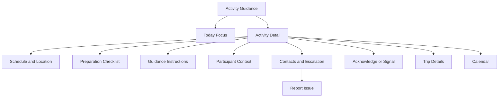
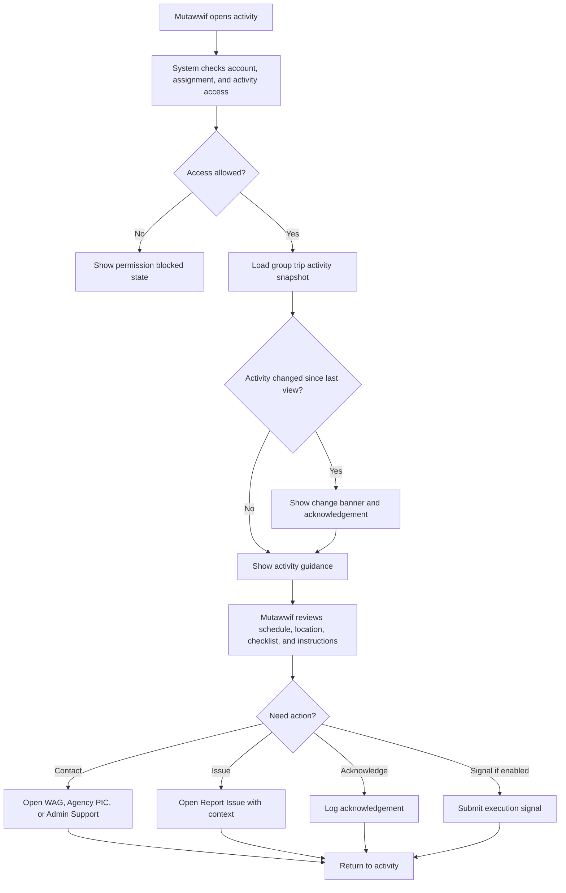

# MV PRD 06 - Activity Guidance / Daily Itinerary Execution

Product: UmrahHaji.com Mutawwif View  
Module: Activity Guidance / Daily Itinerary Execution  
Scope: Mutawwif Mobile Web App / Assigned Activity Execution  
Platform: Mobile-first Responsive Web Platform  
Status: Draft  
Last Updated: 19 June 2026  

---

## 1. Objective

Activity Guidance / Daily Itinerary Execution is the mutawwif-facing execution layer for today's assigned activities. It helps a mutawwif open an activity from Calendar or Trip Details, understand what must happen, follow approved operational guidance, access ritual/service instructions, contact the right PIC, acknowledge updates, and escalate issues with full trip and activity context.

This module must help mutawwif answer:

1. What activity should I focus on now or next?
2. What are the time, location, meeting point, group, and operational instructions?
3. What should I prepare before the activity starts?
4. Which jamaah/group context is relevant for this activity?
5. Which guidance is approved by the platform or Travel Agency?
6. Has this activity changed since I last viewed it?
7. What action can I take if the activity is delayed, unclear, unsafe, or impossible to execute?
8. Which activity signals can I send without changing the official itinerary?

This module is not an itinerary editor. It is a read-first, action-oriented execution workspace for assigned mutawwif activities.

---

## 2. Relationship With Mutawwif View Master Scope

This module follows the Mutawwif View mobile web app scope:

1. Mutawwif can access only activities from assigned group trips.
2. Activity data comes from Group Trip Schedule Snapshot and approved guidance sources.
3. Mutawwif can view activity guidance, acknowledge updates, contact PIC, open WAG, open map, and report issues.
4. Mutawwif cannot edit itinerary template, group trip schedule, hotel, flight, transport, package, member allocation, or payment data.
5. Activity execution signals must be auditable and permission-based.
6. Sensitive jamaah data must be minimized and shown only when needed for the activity.
7. Activity guidance must remain useful during travel, including limited connectivity and offline read-only states.
8. Religious guidance must be clearly positioned as curated guidance, not final religious authority or fatwa.

---

## 3. Relationship With Admin, Travel Agency, Jamaah, and Other Mutawwif PRDs

| Source Module | Relationship |
| --- | --- |
| MV PRD 04 - Calendar & Schedule | Main entry point for daily agenda and activity detail |
| MV PRD 05 - My Group Trip & Trip Details | Provides assigned trip context, itinerary overview, group members, WAG link, and contacts |
| Admin Group Trip Management | Platform-level source for group trip schedule snapshot, activity changes, operational contacts, and audit |
| Admin Itinerary Management | Source of reusable itinerary activity structure before copied into group trip snapshot |
| Admin Announcement Management | Source of urgent operational announcements related to activity execution |
| Admin Report Management | Destination for activity issue escalation |
| Admin Articles / Guidance Content | Source of approved guidance content if used by activity |
| Travel Agency Group Trip Management | Main operational owner for group trip activity schedule, notes, meeting point, WAG link, contacts, and published updates |
| Travel Agency Mutawwif Assignment | Source of mutawwif role, assignment scope, assistant/lead distinction, and active assignment status |
| Travel Agency Documents & Services | Source of readiness signals when an activity requires document/service awareness |
| Jamaah My Group Trip | Jamaah-facing itinerary view; should align where visible |
| Jamaah Checklist & Guidance | Jamaah-facing preparation/guidance counterpart; can share approved guidance taxonomy |
| PRD 08 Allowance & Tip | Future consumer of completed activity references if enabled; not owned here |
| PRD 09 Payment Settings | Future source of payout/payment destination; not owned here |

### 3.1 Key Sync Rule

Activity Guidance reads from the Group Trip Schedule Snapshot and approved guidance content.

Itinerary Template -> Package Itinerary Reference -> Group Trip Schedule Snapshot -> Mutawwif Calendar -> Activity Guidance.

Updating an itinerary template must not automatically update existing Activity Guidance for an active group trip. For active trips, Travel Agency or Admin must update the Group Trip schedule/guidance snapshot, trigger notification rules, and reset acknowledgement where required.

---

## 4. Research Notes and Product Decisions

The product direction for activity-level mutawwif execution is:

1. Pilgrimage operations require clear step-by-step field guidance, not broad administrative controls.
2. Digital pilgrimage platforms such as Nusuk position the journey around official service facilitation, planning, and guidance. Mutawwif View should support that by making activity instructions practical, timely, and easy to access.
3. The Ministry of Hajj and Umrah remains the official authority for pilgrimage services. UmrahHaji.com guidance must not replace official rules or qualified religious/medical/legal advice.
4. During active travel, mutawwif may use the app while walking, coordinating transport, briefing groups, or handling urgent changes. Primary controls must be easy to tap and should follow mobile accessibility guidance.
5. W3C WCAG 2.2 Target Size guidance states pointer targets should be at least 24 x 24 CSS pixels or have sufficient spacing. This reinforces large, separated controls for field actions.
6. Data privacy must follow minimum necessary access. Activity guidance can show participant counts, family/group labels, assistance flags, and visible readiness alerts, but must hide payment, bank, private document, and private medical data by default.
7. Activity execution signals should be operational evidence, not silent schedule edits. Admin/Travel Agency remains the owner of official activity status unless a permission-based field execution flow is explicitly enabled.

Reference sources used as product direction:

1. Nusuk pilgrimage platform: https://www.nusuk.sa/
2. Ministry of Hajj and Umrah official site: https://haj.gov.sa/en
3. W3C WCAG 2.2 - Target Size Minimum: https://www.w3.org/WAI/WCAG22/Understanding/target-size-minimum.html
4. Personal Data Protection Act 2010, Laws of Malaysia Act 709: https://lom.agc.gov.my/act-detail.php?type=principal&lang=BI&act=709

### 4.1 Research Validation Notes

| Research Area | Product Interpretation | Impact on This PRD |
| --- | --- | --- |
| Pilgrimage service delivery | Field users need timed instructions, coordination, and escalation | Activity Guidance must center on current/next activity, instruction, contact, and issue reporting |
| Official guidance boundary | Platform guidance must not be framed as final religious/legal authority | Guidance content needs source label, disclaimer, and review ownership |
| Mobile field usage | Users may operate one-handed and under time pressure | Primary actions must be reachable, clear, and separated |
| Data privacy | Activity context should expose only what the role needs | Sensitive jamaah data stays hidden; assistance flags are permission-gated |
| Operational ownership | Admin/TA own the trip schedule and activity master data | Mutawwif can acknowledge and report; schedule edits stay outside this module |
| Cross-role sync | Jamaah, TA, Admin, and Mutawwif views must not conflict | Use group trip snapshot and approved content release flags |

### 4.2 Regulatory Safety Rule

This PRD must not hard-code official health, visa, vaccination, ritual, movement, or site-access requirements. Those requirements should be maintained through Admin/Travel Agency configuration or approved guidance content and displayed as activity-specific instructions, readiness flags, or advisory notes.

### 4.3 Cross-Role Product Boundary

| Role / Surface | Owns | Can Mutawwif View Display? | PRD 06 Rule |
| --- | --- | --- | --- |
| Admin Panel | Global schedule supervision, guidance content, report routing, audit | Yes, as released guidance/status only | Do not expose internal Admin notes or controls |
| Travel Agency Portal | Group trip activity schedule, meeting point, activity notes, contacts, WAG link | Yes, through published group trip snapshot | Treat TA as operational source for activity execution |
| Jamaah/User View | Jamaah-facing itinerary and checklist guidance | Yes, only where shared content overlaps | Keep visible schedule aligned; do not expose jamaah private data |
| Mutawwif View | Assigned activity execution, acknowledgement, issue escalation, optional signal | Yes | Read-first, assignment-scoped, mobile-first |
| Finance / Allowance | Allowance and tip calculation/settlement | Limited future handoff only | PRD 06 may create activity evidence, but does not calculate payout |

### 4.4 Boundary With PRD 04 and PRD 05

| Area | PRD 04 Responsibility | PRD 05 Responsibility | PRD 06 Responsibility |
| --- | --- | --- | --- |
| Calendar view | Month/week/day schedule | Trip itinerary overview | Consumes selected activity |
| Trip context | Shows activity in calendar | Shows group trip details, members, WAG, contacts | Shows only activity-relevant context |
| Activity detail | Basic schedule detail and quick actions | Itinerary tab can open activity | Deep guidance, prep checklist, acknowledgement, issue escalation |
| Status signals | Calendar status badges | Trip-level readiness/status | Activity-level acknowledgement and optional execution signal |
| Edits | No schedule editing | No trip editing | No itinerary editing |
| Issue handling | Opens report with activity context | Opens report with trip context | Opens report with activity-specific prefill and severity |

The handoff rule is:

1. PRD 04 answers "what is on my schedule?"
2. PRD 05 answers "what trip context do I need?"
3. PRD 06 answers "what should I do for this activity now?"

---

## 5. Scope

### 5.1 In Scope for Phase 1

1. Daily guidance entry from Calendar, Trip Details itinerary, Home next activity, and notifications.
2. Current/next activity focus screen.
3. Activity Guidance detail page.
4. Activity header with status, time, timezone, location, trip, and group.
5. Preparation checklist for the activity.
6. Step-by-step operational instructions.
7. Ritual/service guidance content when approved and linked.
8. Meeting point and map shortcut.
9. Travel Agency PIC contact.
10. Admin support shortcut when configured.
11. WhatsApp group shortcut when released.
12. Activity change banner.
13. Acknowledge guidance/update.
14. Report Issue with trip/activity context prefilled.
15. Optional activity execution signal: `Ready`, `Started`, `Completed`, or `Unable to execute`, only when enabled by permission and agency policy.
16. Participant summary relevant to the activity.
17. Assistance and readiness alerts when permission allows.
18. Empty/loading/error/offline states.
19. Audit log for acknowledgements, issue submissions, and execution signals.
20. Mobile-first responsive behavior.

### 5.2 In Scope for Phase 2

1. Attendance or assembly confirmation.
2. QR scan for group assembly.
3. GPS arrival confirmation.
4. Offline action queue for acknowledgements and execution signals.
5. Private mutawwif field notes.
6. Team handover notes between lead and assistant mutawwif.
7. Live delay reporting with agency approval.
8. Group movement checklist.
9. Activity-specific jamaah exception tracking.
10. Voice note attachment for incident context.
11. AI-assisted activity summary for agency operations.
12. Allowance-ready completion feed with validation.

### 5.3 Out of Scope

1. Creating itinerary templates.
2. Editing itinerary templates.
3. Editing group trip schedule or activity master data.
4. Changing activity time/date/location.
5. Assigning or replacing mutawwif.
6. Adding/removing trip members.
7. Uploading or verifying jamaah documents.
8. Viewing payment, invoice, bank, or payout details.
9. Calculating allowance or tip.
10. Native app push implementation details.
11. Official religious fatwa workflow.
12. Real-time crowd management instructions controlled by external authorities.

---

## 6. User Roles and Access

| Role | Access Behavior |
| --- | --- |
| Pending mutawwif | Cannot access activity guidance until account rules allow |
| Invited mutawwif | Can see onboarding/invitation state, not full activity data unless activated |
| Active mutawwif | Can view assigned activity guidance |
| Verified mutawwif | Eligible for full assigned activity access |
| Lead mutawwif | Can view full assigned group activity context and permitted participant summary |
| Assistant mutawwif | Can view assigned activity context; participant visibility may be limited |
| Suspended mutawwif | Activity access blocked or read-only based on Admin policy |
| Replaced mutawwif | Active activity access removed; historical access limited by policy |
| Admin | Manages and monitors from Admin Panel |
| Travel Agency staff | Owns group trip activity schedule/guidance from TA Portal |
| Jamaah | Views own itinerary/guidance in Jamaah View, not this module |

### 6.1 Visibility Rules

Mutawwif can see:

1. Assigned activity title, date, time, timezone, and status.
2. Group trip name and Travel Agency name.
3. Activity location, meeting point, and map link when released.
4. Activity operational instructions visible to mutawwif.
5. Approved guidance content linked to the activity.
6. Activity preparation checklist.
7. Participant count and group/family summary.
8. Assistance flags relevant to execution when permission allows.
9. Document/service readiness summary when needed for the activity.
10. WAG link, Agency PIC, and Admin support contact when configured.
11. Change history visible to mutawwif.

Mutawwif must not see by default:

1. Jamaah payment amount or invoice details.
2. Jamaah bank data.
3. Jamaah full IC/passport files.
4. Full private medical records.
5. Internal Admin notes.
6. Travel Agency internal finance data.
7. Other mutawwif private availability or payout data.
8. Internal guidance drafts not published to mutawwif.

### 6.2 Action Permission Rules

| Action | Lead Mutawwif | Assistant Mutawwif | Rule |
| --- | ---: | ---: | --- |
| View assigned activity | Yes | Yes | Assignment-scoped |
| View full participant summary | Yes | Permission-based | Assistant may see subgroup/activity-only |
| Acknowledge guidance/update | Yes | Yes | Assigned activity only |
| Report issue | Yes | Yes | Activity context prefilled |
| Contact Agency PIC | Yes | Yes | If contact released |
| Contact Admin Support | Yes | Yes | If support route enabled |
| Open WAG | Yes | Permission-based | If link released and role allowed |
| Send execution signal | Permission-based | Permission-based | Agency/Admin policy controls |
| Edit activity data | No | No | Must be hidden |
| Mark official schedule completed | No by default | No by default | Only if future workflow delegates ownership |
| View allowance/tip | No in PRD 06 | No in PRD 06 | Belongs to PRD 08/09 |

---

## 7. Entry Points

| Entry Point | Behavior |
| --- | --- |
| Calendar activity card | Opens Activity Guidance detail |
| Calendar next activity CTA | Opens current/next Activity Guidance |
| Home next activity card | Opens Activity Guidance for next assigned activity |
| My Group Trip itinerary row | Opens Activity Guidance with trip context |
| Notification - activity reminder | Opens Activity Guidance |
| Notification - activity changed | Opens Activity Guidance with change banner |
| Notification - missing acknowledgement | Opens Activity Guidance with acknowledgement focus |
| Report issue deep link | Opens report form with activity context |

---

## 8. Information Architecture

```text
Activity Guidance
+-- Today Focus
|   +-- Current Activity
|   +-- Next Activity
|   +-- Activity Alerts
+-- Activity Guidance Detail
|   +-- Header
|   +-- Schedule & Location
|   +-- Preparation Checklist
|   +-- Guidance Instructions
|   +-- Participant Context
|   +-- Contacts & Escalation
|   +-- Acknowledgement / Execution Signal
+-- Linked Context
|   +-- Trip Details
|   +-- Calendar
|   +-- Report Issue
|   +-- Announcement
+-- States
    +-- Empty
    +-- Loading
    +-- Offline Cache
    +-- Permission Blocked
    +-- Schedule Changed
```



---

## 9. Main User Flow



---

## 10. Source and Sync Logic

### 10.1 Data Hierarchy

| Layer | Purpose | PRD 06 Behavior |
| --- | --- | --- |
| Itinerary Template | Reusable activity blueprint | Not shown directly to mutawwif |
| Package Itinerary Reference | Package-level default itinerary | Not shown directly |
| Group Trip Schedule Snapshot | Real trip activity schedule | Primary source |
| Group Trip Activity Guidance Snapshot | Published operational instructions for the activity | Primary guidance source |
| Approved Guidance Content | Platform/agency-approved ritual/service guidance | Linked if released |
| Mutawwif Assignment | Determines access and role | Filters activity visibility |
| Report Management | Stores issues/escalations | Receives activity context |

### 10.2 Sync Rules

1. PRD 06 must consume activity records from assigned Group Trip Schedule Snapshot.
2. Activity guidance content must be versioned or timestamped.
3. If Admin/TA updates activity time, location, meeting point, instruction, or contact, the activity must show an update indicator.
4. If acknowledgement is required, a new activity version resets acknowledgement status.
5. Mutawwif execution signals must not overwrite Group Trip official schedule fields.
6. Report Issue must store activity ID, activity version, group trip ID, mutawwif assignment ID, and submitted timestamp.
7. Offline cache can display last known guidance, but server-changing actions must wait for connection unless offline queue is implemented.

### 10.3 Ownership Rules

| Data / Action | Owner |
| --- | --- |
| Activity title/time/location/status | Admin/Travel Agency Group Trip |
| Activity instructions | Admin/Travel Agency published guidance |
| Guidance article content | Admin Articles/Guidance or approved agency source |
| Acknowledgement | Assigned mutawwif |
| Execution signal | Assigned mutawwif, if enabled |
| Report issue submission | Assigned mutawwif |
| Report triage/resolution | Admin/Support/Operations or Travel Agency if enabled |
| Allowance/tip calculation | PRD 08/09, not PRD 06 |

---

## 11. Screen 1 - Today Focus / Daily Execution

Today Focus is the activity-level landing when opened from Home or Calendar.

| Element | Requirement |
| --- | --- |
| Top navbar | Logo, notification bell, optional refresh/status indicator |
| Page title | `Today Guidance` or `Today's Activities` |
| Date strip | Current day with previous/next day shortcut |
| Current activity card | Shows activity in progress or nearest upcoming activity |
| Next activity card | Shows next assigned activity after current one |
| Alert banner | Missing acknowledgement, changed schedule, conflict, missing location, urgent announcement |
| Activity list | Compact day timeline for assigned activities |
| Bottom navigation | Home, My Trips, Calendar, Profile |

### 11.1 Today Activity Card

| Field | Example | Source |
| --- | --- | --- |
| Activity title | Tawaf Guidance Briefing | Group Trip Schedule Snapshot |
| Time | 08:30 Saudi time | Activity timezone |
| Status | Upcoming | System/activity status |
| Trip name | Barokah Umrah Group 2025 | Group Trip |
| Location | Hotel Lobby / Masjidil Haram Gate | Activity location |
| Attention badge | Updated / Need Acknowledge / Missing Location | System flags |
| Primary CTA | Open Guidance | PRD 06 |

### 11.2 Rules

1. Today Focus shows only assigned activities.
2. If there is no activity today, show next assigned activity with date.
3. If multiple active trips overlap, show conflict warning and group trip labels clearly.
4. Current and next activity should be prioritized over a full calendar layout.
5. Mutawwif must not be able to reorder, add, delete, or edit activities from this screen.

---

## 12. Screen 2 - Activity Guidance Detail

Activity Guidance Detail is the core execution screen.

### 12.1 Header Section

| Element | Requirement |
| --- | --- |
| Back action | Returns to Calendar, Trip Details, or prior screen |
| Activity title | Full activity name |
| Status badge | Scheduled, Upcoming, In Progress, Completed, Delayed, Cancelled, Rescheduled |
| Trip name | Linked to My Group Trip |
| Assignment role | Lead / Assistant / Support |
| Last updated | Timestamp and source label |
| Change banner | Visible when changed since last view or acknowledgement required |

### 12.2 Schedule and Location Section

| Field | Requirement |
| --- | --- |
| Start date/time | Required with timezone label |
| End time | Optional, shown if available |
| Secondary timezone | Shown when local and destination time differ |
| Meeting point | Preferred over broad location |
| Location address | Optional |
| Map link | Button visible only if URL/location available |
| Movement note | Optional travel/transport hint |

### 12.3 Guidance Sections

| Section | Purpose |
| --- | --- |
| Before You Start | Short checklist of preparation tasks |
| What To Do | Step-by-step operational instructions |
| Jamaah Briefing | Talking points for mutawwif, if configured |
| Ritual Guidance | Approved ritual guidance link or excerpt, if configured |
| Safety / Service Notes | Crowd, health, service, or transport reminders when configured |
| If Something Goes Wrong | Clear escalation path |

### 12.4 Sticky Action Area

The sticky action area should remain simple and not overcrowded.

| Action | Display Rule |
| --- | --- |
| Acknowledge | Show when acknowledgement required or guidance unread |
| Report Issue | Always available for active/assigned activity |
| Contact PIC | Show if agency PIC contact exists |
| Open WAG | Show if WAG link released |
| Signal | Show only when activity execution signal is enabled |

---

## 13. Screen 3 - Preparation Checklist

Preparation checklist helps mutawwif verify practical activity readiness.

| Checklist Item Type | Example | Source |
| --- | --- | --- |
| Location readiness | Meeting point confirmed | Group Trip Activity |
| Contact readiness | Agency PIC available | Group Trip / TA |
| Group readiness | Participant count visible | Trip Members summary |
| Transport readiness | Bus/driver note available | Transport snapshot |
| Ritual readiness | Ihram/Tawaf/Sa'i guidance linked | Approved guidance |
| Service readiness | Ticket/document/service flag clear | Documents/Services summary |
| Safety readiness | Senior/special assistance note visible | Permission-gated member context |

### 13.1 Checklist Behavior

1. Checklist items can be system-generated from activity type and agency configuration.
2. Checklist items may be read-only guidance or mutawwif-tickable.
3. Mutawwif-tickable checklist state belongs to the activity execution record, not the group trip master schedule.
4. Completion of a checklist item must not automatically mark the activity completed.
5. Hidden/locked checklist items should explain "Not available" only when that does not reveal sensitive information.

---

## 14. Screen 4 - Guidance Instruction Content

Guidance content must be concise enough for field use.

| Content Block | Requirement |
| --- | --- |
| Summary | 1-3 short sentences about activity goal |
| Steps | Numbered operational steps |
| Do / Avoid | Optional checklist-style reminders |
| Source label | Platform, Travel Agency, or Admin-approved |
| Last reviewed | Optional but recommended for ritual/health/safety guidance |
| Related article | Link to full guidance content when available |
| Disclaimer | Required for ritual, health, visa, or safety guidance |

### 14.1 Guidance Content Rules

1. Use plain, practical wording.
2. Avoid presenting guidance as fatwa or final authority.
3. If content is agency-specific, label it as Travel Agency guidance.
4. If content is platform-managed, label it as UmrahHaji.com guidance.
5. If guidance is missing, show schedule and escalation actions instead of blocking the activity.
6. Long articles should open in Articles/Guidance reader, not crowd the activity screen.

---

## 15. Screen 5 - Participant Context

Participant context should help the mutawwif execute the activity without exposing unnecessary data.

| Data | Phase 1 Behavior |
| --- | --- |
| Total participant count | Show |
| Family/group breakdown | Show if released |
| Room/bus grouping | Show if relevant and released |
| Special assistance count | Show count by default; details permission-based |
| Names | Show when operationally required and permission allows |
| Phone number | Hidden by default; emergency/lead permission only |
| Passport/IC | Hidden |
| Payment status | Hidden |
| Private medical notes | Hidden unless explicit emergency permission |

### 15.1 Participant Context Rules

1. Default view should summarize, not expose full member table.
2. Lead mutawwif may access more group context than assistant mutawwif.
3. Assistant mutawwif may see only assigned subgroup or activity participant context.
4. Sensitive flags should be purpose-limited and logged if opened.
5. Search member from PRD 05 may be linked when the user needs full permitted member context.

---

## 16. Activity Execution Signals

Activity execution signals are optional P1 capability and should be controlled by Admin/Travel Agency policy.

### 16.1 Signal Values

| Signal | Meaning | Rule |
| --- | --- | --- |
| Ready | Mutawwif has reviewed guidance and is ready to execute | Does not change official schedule |
| Started | Mutawwif indicates activity has started | Evidence only unless agency policy maps it to operations |
| Completed | Mutawwif indicates activity was completed | Evidence only; payout use belongs to PRD 08 |
| Unable to execute | Mutawwif cannot execute as planned | Requires reason and should suggest Report Issue |

### 16.2 Signal Rules

1. Signal feature can be disabled globally, per agency, per trip, or per activity type.
2. Signals are visible only to assigned mutawwif.
3. Signals must store user ID, assignment ID, activity ID, activity version, timestamp, device/network metadata where available, and optional reason.
4. Signal submission should not edit activity title, date, time, location, or official status.
5. `Unable to execute` should create or suggest a Report Issue flow.
6. Completed signal may become an input to PRD 08 allowance calculation only after future validation rules are defined.

---

## 17. Activity Status Model

### 17.1 Display Status Values

| Status | Meaning | Mutawwif Action |
| --- | --- | --- |
| Scheduled | Activity is planned | View guidance |
| Upcoming | Activity is soon | Prepare |
| In Progress | Current time is within activity window or marked by operations | Execute guidance |
| Completed | Activity is complete or past | View history / report issue if needed |
| Delayed | Activity delayed | View updated instruction / contact PIC |
| Rescheduled | Time/date/location changed | Acknowledge |
| Cancelled | Activity cancelled by Admin/TA | View reason |
| Conflict | Activity conflicts with another assignment or availability | Contact PIC / Report Issue |
| Missing Info | Required location/contact/guidance missing | Contact PIC / Report Issue |

### 17.2 Status Ownership

| Status / Indicator | Owner |
| --- | --- |
| Scheduled, Delayed, Rescheduled, Cancelled | Admin/Travel Agency |
| Upcoming, In Progress by time window | System |
| Conflict, Missing Info | System |
| Mutawwif Ready/Started/Completed/Unable signal | Assigned mutawwif |
| Official completion for trip operations | Admin/Travel Agency unless delegated later |

---

## 18. Change and Acknowledgement Logic

### 18.1 Change Banner

When activity guidance changes after assignment or after mutawwif viewed it, show:

1. `Activity updated` banner.
2. Updated field summary: time, location, meeting point, instruction, contact, or guidance.
3. Previous value when allowed.
4. New value.
5. Update source: Admin, Travel Agency, or System.
6. Last updated timestamp.
7. Acknowledge button if required.

### 18.2 Acknowledgement Rules

| Rule | Requirement |
| --- | --- |
| Who can acknowledge | Assigned mutawwif only |
| What can be acknowledged | Guidance version, schedule change version, urgent instruction |
| What is logged | User ID, activity ID, activity version, timestamp |
| If activity changes again | Acknowledgement resets |
| If offline | Store locally only if offline queue exists; otherwise block with message |
| If user is replaced | Old user cannot acknowledge new version after replacement |

---

## 19. Report Issue Handoff

Report Issue is a primary safety/action path.

### 19.1 Prefilled Report Context

| Field | Prefill Source |
| --- | --- |
| Sender role | Mutawwif |
| Group Trip ID | Activity context |
| Activity ID | Activity context |
| Activity title | Activity context |
| Activity time | Activity context |
| Travel Agency | Group trip |
| Agency PIC | Group trip / TA |
| Mutawwif assignment ID | Assignment |
| Category suggestion | Activity type/status |
| Priority suggestion | User selected or rule-based |

### 19.2 Activity Issue Categories

| Category | Examples |
| --- | --- |
| Missing Information | Missing location, contact, instruction, meeting point |
| Schedule Problem | Delay, wrong time, conflict, impossible movement gap |
| Group Coordination | Jamaah late, member missing, subgroup mismatch |
| Transport Issue | Bus/driver unavailable, wrong pickup point |
| Hotel Issue | Room/check-in/luggage issue related to activity |
| Ritual Guidance Question | Guidance unclear or needs agency/admin clarification |
| Safety / Emergency | Injury, crowd risk, urgent assistance |
| App Issue | Cannot open map, WAG, guidance, or activity |

### 19.3 Rules

1. Report Issue must be available even if guidance content is missing.
2. Sensitive report categories may hide details from Travel Agency or Mutawwif after submission depending on Report Management permissions.
3. Activity issue submission must not change itinerary schedule automatically.
4. If `Unable to execute` signal is submitted, system should suggest or require Report Issue based on agency policy.

---

## 20. UI Breakdown Implementation Specification

This section adapts the itinerary and activity UI breakdown into PRD 06 requirements. The visual structure can be implemented, but product ownership rules from this PRD remain the source of truth.

### 20.1 Baseline

1. Primary viewport reference: mobile width around 412px.
2. Activity execution screen should be mobile-first and one-handed friendly.
3. Primary actions should have clear labels, strong hierarchy, and sufficient touch target size/spacing.
4. Top Navbar and Bottom Navigation should reuse the same Mutawwif View components used in PRD 01, PRD 04, and PRD 05.
5. UI must support activity states: normal, updated, missing info, conflict, cancelled, offline cache, permission blocked.

### 20.2 Itinerary Variants From UI Breakdown

| UI Variant | PRD 06 Implementation |
| --- | --- |
| Day 1 itinerary empty state | Show no activities or no guidance available state with Contact PIC / Report Issue |
| Day with activity rows | Activity rows deep-link to Activity Guidance Detail |
| Jamaah feedback preview | Read-only preview only if source module allows; not core PRD 06 workflow |
| Success toast | Used after acknowledgement, checklist tick, signal, or report submission |
| Full feedback cards | Defer to Testimonial/Allowance-related scope; not PRD 06 core |

### 20.3 Activity Row Mapping

| UI Element | PRD 06 Decision |
| --- | --- |
| Activity icon | Reuse Itinerary/Calendar taxonomy |
| Activity title | From Group Trip Schedule Snapshot |
| Time | Show timezone label |
| Short description | Mutawwif-visible operational note or guidance summary |
| Status badge | From Activity Status Model |
| Feedback row | Optional read-only preview, not primary action |
| Edit Activity CTA | Not available to Mutawwif in PRD 06 |
| Bottom CTA | `Open Guidance`, `Report Issue`, `Contact PIC`, or enabled signal |

### 20.4 Edit Activity Adaptation Rule

The provided UI breakdown includes an Edit Activity screen with fields for day title, location, activity name, time, icon, description, add activity, back, and publish.

For Mutawwif View PRD 06:

| UI Element | PRD 06 Decision |
| --- | --- |
| Edit Activity CTA | Not available to mutawwif in Phase 1 |
| Activity form fields | Owned by Admin/Travel Agency Group Trip schedule |
| Publish action | Not available to mutawwif |
| Add Activity | Not available to mutawwif |
| Delete activity | Not available to mutawwif |
| Drag reorder | Not available to mutawwif |

Replacement actions for mutawwif:

1. Report Issue for incorrect activity details.
2. Contact Agency PIC for clarification.
3. Acknowledge updated guidance.
4. Send execution signal if enabled.
5. Open Trip Details or Calendar for broader context.

If product later wants mutawwif-suggested schedule edits, it should be a separate `Suggest Correction` workflow with Admin/TA approval, audit log, and no silent schedule mutation.

### 20.5 Activity Guidance Flow

```text
Calendar / My Trip / Home
    -> Activity Guidance
        -> Schedule & Location
        -> Preparation Checklist
        -> Guidance Instructions
        -> Participant Context
        -> Contact PIC / WAG / Map
        -> Acknowledge / Signal if enabled
        -> Report Issue
```

---

## 21. Data Requirements

### 21.1 Activity Guidance Response

```text
ActivityGuidance
+-- user
|   +-- userId
|   +-- mutawwifId
|   +-- displayName
|   +-- assignmentRole
+-- assignment
|   +-- assignmentId
|   +-- groupTripId
|   +-- accessScope
|   +-- status
+-- activity
|   +-- activityId
|   +-- activityVersionId
|   +-- title
|   +-- type
|   +-- status
|   +-- startDateTime
|   +-- endDateTime
|   +-- activityTimezone
|   +-- secondaryTimezone
|   +-- locationName
|   +-- meetingPoint
|   +-- address
|   +-- mapUrl
|   +-- lastUpdatedAt
|   +-- lastUpdatedByLabel
+-- trip
|   +-- groupTripId
|   +-- groupTripName
|   +-- agencyName
|   +-- agencyPic
|   +-- wagUrlVisible
+-- guidance
|   +-- guidanceVersionId
|   +-- sourceLabel
|   +-- summary
|   +-- steps[]
|   +-- doItems[]
|   +-- avoidItems[]
|   +-- relatedArticleUrl
|   +-- disclaimer
+-- checklist[]
|   +-- itemId
|   +-- title
|   +-- source
|   +-- required
|   +-- completionMode
|   +-- completed
+-- participantContext
|   +-- totalCount
|   +-- groupBreakdown[]
|   +-- assistanceSummary[]
|   +-- visibleMemberRows[]
+-- actions
    +-- canAcknowledge
    +-- canReportIssue
    +-- canContactPic
    +-- canOpenWag
    +-- canSubmitSignal
```

### 21.2 Activity Guidance Fields

| Field | Required | Notes |
| --- | ---: | --- |
| activity_id | Yes | Stable ID from group trip snapshot |
| activity_version_id | Yes | Required for acknowledgement and audit |
| group_trip_id | Yes | Access and report context |
| mutawwif_assignment_id | Yes | Access and audit context |
| activity_title | Yes | Display name |
| activity_type | Yes | Drives icon and default checklist |
| start_datetime | Yes | Must include timezone |
| location_name | Recommended | Missing location creates warning |
| meeting_point | Recommended | More useful than broad location |
| guidance_version_id | Optional | Required if guidance content exists |
| guidance_source | Optional | Platform / Travel Agency / Admin |
| acknowledgement_required | Yes | Boolean |
| execution_signal_enabled | Yes | Boolean |
| report_issue_enabled | Yes | Boolean |
| participant_context_policy | Yes | Controls privacy |

---

## 22. Empty, Loading, Error, and Offline States

| State | Behavior |
| --- | --- |
| Loading | Show skeleton for header, schedule, checklist, and action area |
| No activity today | Show next assigned activity and Calendar shortcut |
| Activity not found | Show safe error and return to Calendar |
| Not assigned | Show permission blocked state |
| Mutawwif suspended | Block access or show read-only based on Admin policy |
| Guidance missing | Show schedule, contact, and report actions |
| Location missing | Show warning with Contact PIC / Report Issue |
| WAG unavailable | Hide WAG action or show unavailable note depending context |
| Offline cached | Show last synced timestamp and disable server-changing actions |
| Submit failed | Show retry and keep user input where safe |
| Activity cancelled | Show cancelled state, reason if visible, and contact/report actions |

---

## 23. Notifications and Reminders

### 23.1 Notification Events

| Event | Recipient | Opens | Notes |
| --- | --- | --- | --- |
| Upcoming activity reminder | Assigned mutawwif | Activity Guidance | Timing configurable |
| Activity guidance updated | Assigned mutawwif | Activity Guidance with change banner | May require acknowledgement |
| Activity location changed | Assigned mutawwif | Activity Guidance | High priority if near activity time |
| Missing acknowledgement | Assigned mutawwif | Activity Guidance | Reminder after configured delay |
| Activity conflict | Mutawwif, Admin/TA if high severity | Activity Guidance or conflict detail | Does not allow self-reassignment |
| Report submitted | Mutawwif | Report detail/status | Confirmation |
| Report status updated | Mutawwif if allowed | Report detail/status | Permission-based |
| Urgent announcement | Targeted mutawwif | Announcement or Activity Guidance | If linked to activity |

### 23.2 Reminder Rules

1. Reminder windows should be configurable by activity type.
2. Critical activity reminders should show location and meeting point if available.
3. If activity is cancelled, pending reminders must be cancelled or changed.
4. If activity is rescheduled, reminders must follow new activity version.
5. Notifications must not expose sensitive jamaah data in notification preview.

---

## 24. Permissions, Privacy, and Security

### 24.1 Permission Logic

This module follows the shared permission model:

Portal Access -> Role -> Permission Group -> Module Permission -> Action Permission -> Data Scope.

| Permission | Purpose |
| --- | --- |
| mutawwif.activity.view | View assigned activity guidance |
| mutawwif.activity.participant_summary.view | View participant summary |
| mutawwif.activity.assistance_flags.view | View permission-gated assistance notes |
| mutawwif.activity.acknowledge | Acknowledge guidance/update |
| mutawwif.activity.signal.submit | Submit execution signal |
| mutawwif.activity.report.submit | Submit report issue |
| mutawwif.activity.contact.view | View contact shortcuts |
| mutawwif.activity.sensitive_context.view | View sensitive context during emergency only |

### 24.2 Hide vs Disable Rules

| Condition | UI Behavior |
| --- | --- |
| User should not know action exists | Hide action |
| User can know but cannot act due to state | Disable with explanation |
| Data is unavailable | Show missing state if operationally relevant |
| Data is sensitive and not permitted | Hide or show masked summary |
| Action requires online connection | Disable offline with clear message |

### 24.3 Privacy Rules

1. Show minimum necessary jamaah data.
2. Mask or hide sensitive data by default.
3. Opening sensitive context requires explicit permission and should be logged.
4. Report attachments and notes must follow Report Management permission rules.
5. Notification previews must not contain sensitive member details.

---

## 25. Audit and Activity Logs

Audit logs should be created for:

1. Activity guidance viewed if high-sensitivity tracking is enabled.
2. Guidance acknowledgement.
3. Schedule/guidance update acknowledgement.
4. Checklist item completion if mutable.
5. Execution signal submission.
6. Unable to execute signal.
7. Report Issue submission.
8. Sensitive participant context opened.
9. Contact shortcut used if analytics/logging policy allows.
10. Offline sync success or failure if action queue exists.

### 25.1 Audit Fields

| Field | Description |
| --- | --- |
| audit_id | Unique log ID |
| actor_user_id | Mutawwif user |
| mutawwif_id | Mutawwif profile |
| assignment_id | Assignment context |
| group_trip_id | Trip context |
| activity_id | Activity context |
| activity_version_id | Version context |
| action_type | Acknowledge, signal, report, view sensitive context |
| previous_value | If relevant |
| new_value | If relevant |
| reason | Required for unable/conflict/sensitive actions where applicable |
| timestamp | Server time |
| device_context | Optional |

---

## 26. Functional Requirements

| ID | Requirement | Priority |
| --- | --- | --- |
| MV-ACT-001 | System must show Activity Guidance only for assigned mutawwif activities | P1 |
| MV-ACT-002 | System must load activity detail from Group Trip Schedule Snapshot | P1 |
| MV-ACT-003 | System must show activity time with timezone label | P1 |
| MV-ACT-004 | System must show meeting point/location and map shortcut when available | P1 |
| MV-ACT-005 | System must show approved guidance content when linked | P1 |
| MV-ACT-006 | System must show preparation checklist based on activity type/configuration | P1 |
| MV-ACT-007 | System must show activity update banner when activity version changes | P1 |
| MV-ACT-008 | System must allow assigned mutawwif to acknowledge required updates | P1 |
| MV-ACT-009 | System must allow Report Issue with activity context prefilled | P1 |
| MV-ACT-010 | System must show Agency PIC/Admin support/WAG shortcuts based on release and permission | P1 |
| MV-ACT-011 | System must hide activity edit, add, delete, reorder, and publish actions from mutawwif | P1 |
| MV-ACT-012 | System must enforce participant data privacy rules | P1 |
| MV-ACT-013 | System must support offline read-only cached guidance with last synced timestamp | P1 |
| MV-ACT-014 | System must audit acknowledgements, reports, sensitive context opens, and execution signals | P1 |
| MV-ACT-015 | System must support optional execution signal if enabled by policy | P1 |
| MV-ACT-016 | System must not use execution signal to mutate official itinerary schedule | P1 |
| MV-ACT-017 | System must deep-link from Calendar, Trip Details, Home, and notifications | P1 |
| MV-ACT-018 | System must show clear empty, missing info, blocked, cancelled, and error states | P1 |
| MV-ACT-019 | System should support private field notes | P2 |
| MV-ACT-020 | System should support attendance/assembly confirmation | P2 |
| MV-ACT-021 | System should support GPS/QR evidence | P2 |
| MV-ACT-022 | System should feed validated completion references to allowance module | P2 |

---

## 27. Acceptance Criteria

### 27.1 Access and Scope

1. Given a mutawwif opens an activity assigned to their active trip, the system displays Activity Guidance.
2. Given a mutawwif opens an activity from an unassigned trip, the system blocks access.
3. Given a mutawwif has been replaced, the system removes access to active/new activity versions.

### 27.2 Activity Guidance

1. Given an activity has approved guidance, the system shows summary, steps, source label, and disclaimer where required.
2. Given guidance is missing, the system still shows schedule/location/contact/report actions.
3. Given activity location exists, the system shows map action.
4. Given activity location is missing, the system shows missing info warning.

### 27.3 Acknowledgement

1. Given an activity update requires acknowledgement, the system shows acknowledge CTA.
2. When mutawwif acknowledges, system logs user ID, timestamp, activity ID, and version.
3. When activity changes again, previous acknowledgement no longer satisfies the new version.

### 27.4 Execution Signal

1. Given execution signal is disabled, no signal UI is shown.
2. Given execution signal is enabled, assigned mutawwif can submit allowed signal values.
3. When signal is submitted, system logs it without changing official schedule fields.
4. When `Unable to execute` is selected, system requires reason and suggests Report Issue.

### 27.5 Report Issue

1. Given mutawwif taps Report Issue, report form opens with group trip and activity context prefilled.
2. Given report is submitted, the system creates a report record and shows confirmation.
3. Given report submission fails, the system shows retry state and preserves safe input.

### 27.6 Privacy

1. Given participant context is shown, payment, bank, IC/passport files, and private medical data are hidden by default.
2. Given assistant mutawwif has limited scope, participant context is limited to assigned subgroup/activity.
3. Given sensitive context is opened with emergency permission, audit log is created.

---

## 28. Dependencies

| Dependency | Purpose |
| --- | --- |
| User Management | Authentication, role access, permission groups |
| Admin Mutawwif Management | Mutawwif verification and account status |
| Travel Agency Mutawwif Assignment | Assignment status and role |
| Admin/TA Group Trip Management | Activity schedule snapshot and operational ownership |
| Itinerary Management | Activity taxonomy and template source |
| Calendar & Schedule | Main activity entry and schedule context |
| My Group Trip & Trip Details | Trip, member, WAG, contact, and itinerary overview |
| Announcement Management | Urgent activity/trip notices |
| Report Management | Issue escalation and resolution tracking |
| Articles / Guidance Content | Approved guidance content |
| Documents & Services | Readiness/assistance signals where relevant |
| Notification Settings | Reminder and update delivery |
| PRD 08 Allowance & Tip | Future completed activity reference consumer |
| PRD 09 Payment Settings | Future payout/payment destination dependency |

---

## 29. Future Enhancements

1. Mutawwif field notes.
2. Team handover notes.
3. Attendance and assembly check.
4. QR check-in.
5. GPS arrival evidence.
6. Live delay request with agency approval.
7. Offline action queue.
8. Activity incident media attachment.
9. AI-generated end-of-day operational summary.
10. Activity completion validation for allowance readiness.
11. Assistant mutawwif sub-task assignment.
12. Smart route/movement gap warnings.
13. Guidance language personalization.
14. Voice mode for field guidance.

---

## 30. Final Product Decision

PRD 06 should define Activity Guidance / Daily Itinerary Execution as the mutawwif's activity-level operating screen.

Recommended product decision:

1. Keep the module read-first, mobile-first, and execution-focused.
2. Use Group Trip Schedule Snapshot as the source of truth.
3. Treat Admin/Travel Agency as owner of activity data, instructions, and schedule changes.
4. Let mutawwif acknowledge, contact, report, and optionally send execution signals.
5. Do not allow mutawwif to edit, add, delete, reorder, or publish itinerary activities.
6. Show only participant context needed for safe execution.
7. Keep guidance source-labeled and non-authoritative where religious, health, visa, or official service rules are involved.
8. Use PRD 06 activity signals as operational evidence only, not as automatic allowance, payout, or official completion logic.
9. Push deeper attendance, GPS, QR, notes, and payout-ready completion into Phase 2 or PRD 08 handoff.

