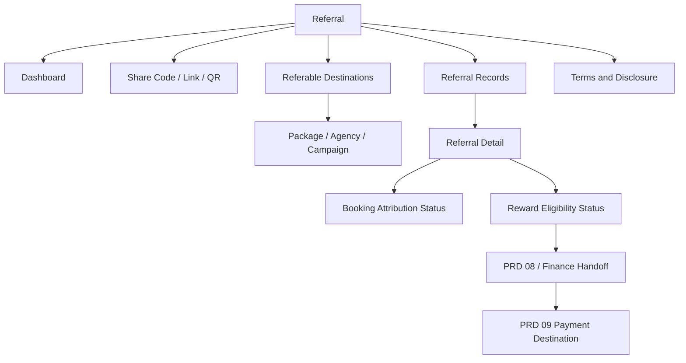
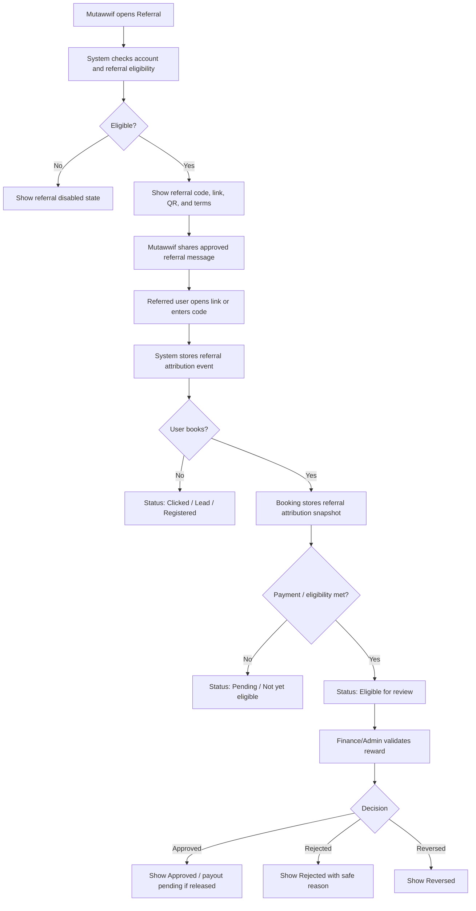

# MV PRD 07 - Referral

Product: UmrahHaji.com Mutawwif View  
Module: Referral  
Scope: Mutawwif Mobile Web App / Referral Link, Lead Attribution & Reward Tracking  
Platform: Mobile-first Responsive Web Platform  
Status: Draft  
Last Updated: 19 June 2026  

---

## 1. Objective

Referral is the mutawwif-facing module for sharing an approved UmrahHaji.com referral link or referral code, tracking referred leads/bookings, viewing referral status, and understanding reward eligibility without exposing sensitive jamaah, payment, or finance data.

This module must help mutawwif answer:

1. What referral code or link can I share?
2. Which packages or Travel Agencies am I allowed to refer?
3. How should I disclose that I may receive a referral benefit?
4. Who has used my referral link or code?
5. Which referrals are only leads, which became bookings, and which are eligible for reward?
6. Why is a referral pending, rejected, expired, or not eligible?
7. What reward amount or estimate can I see safely?
8. Where do payout destination and final payment rules live?

Referral is not a finance payout module and not a booking editor. It is a transparent acquisition and attribution workspace for mutawwif.

---

## 2. Relationship With Mutawwif View Master Scope

This module follows the Mutawwif View mobile web app scope:

1. Mutawwif can access only their own referral code, referral links, and referral records.
2. Referral eligibility depends on mutawwif account status, verification status, assignment/compliance status, and platform/Travel Agency policy.
3. Referral code/link can point to public package detail, Travel Agency profile, campaign page, or booking flow depending on configuration.
4. Mutawwif can share a link/code, view referral status, and view reward eligibility status.
5. Mutawwif cannot approve referrals, edit booking/payment records, force attribution, override duplicate rules, or execute payout.
6. Referral rewards are calculated or validated by Admin/Finance/Referral rules outside this module.
7. Personal data of referred users must be minimized and masked by default.
8. Referral sharing must include clear disclosure when reward, commission, discount, or benefit may apply.

---

## 3. Relationship With Admin, Travel Agency, Jamaah, and Finance PRDs

| Source Module | Relationship |
| --- | --- |
| Admin User Management | Controls role, permission, account status, data scope, and sensitive action access |
| Admin Mutawwif Management | Source of mutawwif verification, active/suspended status, compliance status, and referral eligibility |
| Admin Package Management | Source of public package records that may be referable |
| Admin Travel Agency Management | Source of agency eligibility and agency referral policy |
| Admin Booking Management | Source of booking conversion, booking status, cancellation, and duplicate booking logic |
| Admin Billing & Payment Management | Source of invoice/payment status used for reward eligibility, but not exposed in detail |
| Admin Finance Management | Owns commission, reward validation, payout preparation, reversal, and finance audit |
| Travel Agency Package Management | Agency-owned package availability and referral campaign participation |
| Travel Agency Booking Management | Operational booking source for agency-owned bookings |
| Travel Agency Settings | Agency-level referral enablement, campaign terms, and allowed package/market scope if enabled |
| Jamaah Package Discovery | Destination of referral links for public/user package browsing |
| Jamaah Booking Flow | Captures referral code/link attribution during checkout |
| Jamaah Payment Settings | Future payout/refund destination surface for user-side payment preferences; not owned here |
| PRD 08 Allowance & Tip | Future reward/tip/allowance visibility handoff if referral reward is grouped there |
| PRD 09 Payment Settings | Future payment destination and payout preference dependency |

### 3.1 Key Sync Rule

Referral reads from referral attribution and booking/payment status snapshots.

Referral Link/Code -> Public Package/Profile/Booking Entry -> Booking Attribution Snapshot -> Payment/Booking Eligibility Snapshot -> Finance Reward Validation -> Mutawwif Referral Status.

Changing a package, payment, booking, or finance record must not silently rewrite historical referral attribution. Corrections require Admin/Finance permission, reason, and audit log.

---

## 4. Research Notes and Product Decisions

Referral touches marketing, disclosure, privacy, and finance-adjacent reward tracking. Product decisions:

1. Referral must be transparent. If a mutawwif may receive reward, commission, discount, allowance, or any benefit, the shared message should include a clear disclosure.
2. FTC endorsement guidance states that financial, employment, personal, family, free-product, or other valuable relationships should be disclosed when endorsing or recommending. It also emphasizes clear and conspicuous placement near the endorsement.
3. Referral must avoid spam behavior. The app should support sharing by user action, not automated contact blasting.
4. Referral attribution must be auditable because it may affect reward, commission, or payout readiness.
5. Referral reward shown to mutawwif should be status-based and conservative. Do not show final payout unless Finance has approved or released it.
6. Referral should not expose referred user's payment, invoice, bank, document, passport/IC, or private booking detail.
7. Referral code should not create booking privilege, price override, discount, or guaranteed reward unless the campaign explicitly defines it.
8. Duplicate and fraud prevention must be part of the product: self-referral, duplicate account, same payer, cancelled booking, unpaid booking, and manual override must be handled.

Reference sources used as product direction:

1. FTC - Disclosures 101 for Social Media Influencers: https://www.ftc.gov/business-guidance/resources/disclosures-101-social-media-influencers
2. FTC - Endorsement Guides: What People Are Asking: https://www.ftc.gov/business-guidance/resources/ftcs-endorsement-guides-what-people-are-asking
3. Personal Data Protection Act 2010, Laws of Malaysia Act 709: https://lom.agc.gov.my/act-detail.php?type=principal&lang=BI&act=709
4. W3C WCAG 2.2 - Target Size Minimum: https://www.w3.org/WAI/WCAG22/Understanding/target-size-minimum.html

### 4.1 Research Validation Notes

| Research Area | Product Interpretation | Impact on This PRD |
| --- | --- | --- |
| Disclosure | Referral reward is a material connection | Shared referral messages should include clear reward/benefit disclosure |
| Affiliate/referral links | Disclosure should be near the recommendation/link and easy to understand | Referral share composer should include default disclosure text |
| Privacy | Referral often involves lead/user data | Mutawwif sees masked lead/booking status, not private details |
| Finance integrity | Reward eligibility depends on booking/payment lifecycle | PRD 07 shows eligibility status only; Finance owns approval and payout |
| Mobile sharing | Field users share links from mobile | Share, copy, QR, and WhatsApp actions must be simple and large enough to tap |
| Anti-abuse | Referral can be gamed | Need duplicate, self-referral, cancelled/unpaid, and suspicious activity states |

### 4.2 Regulatory Safety Rule

This PRD must not promise guaranteed income, guaranteed commission, guaranteed discount, guaranteed package availability, or official approval. Referral wording must be configurable and reviewed by Admin/Travel Agency policy.

### 4.3 Cross-Role Product Boundary

| Role / Surface | Owns | Can Mutawwif View Display? | PRD 07 Rule |
| --- | --- | --- | --- |
| Admin Panel | Referral rules, campaign controls, fraud review, finance validation, global audit | Yes, as status and released policy only | Do not expose internal fraud score, finance notes, or override tools |
| Travel Agency Portal | Agency package/campaign participation and booking follow-up | Yes, if agency releases campaign/package to mutawwif referral | Do not let mutawwif edit agency campaign terms |
| Jamaah/User View | Package browsing, booking flow, payment, own privacy | Yes, only lead/booking status when attributed | Do not expose full jamaah identity or payment detail |
| Mutawwif View | Share referral, track own attribution, view reward eligibility | Yes | Read-first status tracking and sharing |
| Finance / Allowance / Payment Settings | Reward approval, payout preparation, destination, settlement | Limited status only | PRD 07 does not approve or execute payout |

### 4.4 Boundary With PRD 08 and PRD 09

| Area | PRD 07 Responsibility | PRD 08 Responsibility | PRD 09 Responsibility |
| --- | --- | --- | --- |
| Referral link/code | Create/display/share own link/code | No | No |
| Lead and booking attribution | Show own referral status | No | No |
| Reward estimate | Show if policy allows | May show as reward/tip/allowance line if grouped | No |
| Reward eligibility | Show pending/eligible/rejected/expired | May consume eligible reward for allowance/tip view | No |
| Payout approval | No | Finance/Allowance workflow if enabled | No |
| Payment destination | No | No | Owns payout/payment destination preference |
| Bank/e-wallet data | No | No | Masked destination only if enabled |

The handoff rule is: PRD 07 answers "which referrals are attributed to me and what is their eligibility status?" PRD 08 answers "what benefit/allowance/tip is visible after approval?" PRD 09 answers "where can approved money be paid or what payment preferences are used?"

---

## 5. Scope

### 5.1 In Scope for Phase 1

1. Referral dashboard.
2. Mutawwif referral code display.
3. Referral link generation for default campaign/package/profile destination.
4. Copy referral code/link.
5. Native share sheet / WhatsApp share.
6. QR code display for referral link.
7. Default disclosure text in share message.
8. Referable package/campaign list if enabled.
9. Referral status list.
10. Referral detail with masked lead/booking information.
11. Referral lifecycle status: Clicked, Lead Captured, Registered, Booking Started, Booking Submitted, Payment Pending, Eligible, Approved, Rejected, Expired, Reversed.
12. Reward eligibility status and estimated reward display if configured.
13. Referral terms summary.
14. Duplicate/self-referral/fraud prevention states.
15. Empty/loading/error/offline states.
16. Audit log for share/copy/QR/open/detail actions where policy allows.
17. Mobile-first responsive behavior.

### 5.2 In Scope for Phase 2

1. Campaign-specific referral codes.
2. Deep link to selected package and schedule.
3. Referral invitation by phone/email with consent-safe flow.
4. UTM/source analytics.
5. Campaign leaderboard if policy allows.
6. Multi-tier attribution if legally/commercially approved.
7. Referral dispute request.
8. Referral reward withdrawal status from Finance.
9. Referral banner assets for social media.
10. Agency-specific mutawwif referral campaign opt-in.
11. Fraud review status visible in summary form.
12. Referral performance analytics by destination/package.

### 5.3 Out of Scope

1. Booking creation or editing.
2. Payment collection.
3. Payment verification.
4. Reward approval.
5. Payout execution.
6. Bank/e-wallet destination management.
7. Commission rule configuration.
8. Referral fraud investigation workspace.
9. Contact scraping or automatic invite blasting.
10. Public influencer campaign management.
11. Multi-level marketing compensation tree.
12. Guaranteed income claims.

---

## 6. User Roles and Access

| Role | Access Behavior |
| --- | --- |
| Pending mutawwif | Referral hidden until account rules allow |
| Invited mutawwif | Can see onboarding state; referral disabled unless activated |
| Active mutawwif | Can access referral if policy enables |
| Verified mutawwif | Eligible for referral sharing and attribution tracking |
| Lead mutawwif | Same referral access as verified mutawwif unless campaign grants more |
| Assistant mutawwif | Same referral access as verified mutawwif unless campaign restricts |
| Suspended mutawwif | Referral sharing disabled; historical view may be read-only |
| Replaced mutawwif | Referral access unaffected unless account status changes |
| Admin | Manages rules, review, and finance validation from Admin Panel |
| Travel Agency staff | Manages agency campaign participation from TA Portal if enabled |
| Jamaah | Uses referral link/code in public/user booking flow, not this module |

### 6.1 Visibility Rules

Mutawwif can see:

1. Own referral code.
2. Own referral link.
3. Campaign/package destinations available to them.
4. Own referral count and status.
5. Masked referred user/lead label.
6. Booking/conversion status in summary form.
7. Reward eligibility status and estimate if released.
8. Referral terms summary.
9. Rejection/expiry reason in user-safe language.

Mutawwif must not see by default:

1. Full referred user's IC/passport/document data.
2. Full referred user's phone/email unless the user directly shared it and policy allows.
3. Payment amount, invoice, proof, bank, card, or refund detail.
4. Internal fraud score.
5. Internal Admin/Finance notes.
6. Travel Agency internal sales notes.
7. Other mutawwif referral records.
8. Global campaign conversion data unless released as aggregate.

### 6.2 Action Permission Rules

| Action | Mutawwif | Rule |
| --- | ---: | --- |
| View referral dashboard | Permission-based | Requires eligible account status |
| Copy referral code/link | Yes | If referral active |
| Share referral link | Yes | Uses approved share template |
| Show QR code | Yes | If referral active |
| View referred lead status | Yes | Own referrals only |
| View reward estimate | Permission-based | If campaign releases estimate |
| View approved reward | Permission-based | If Finance releases status |
| Request referral dispute | Phase 2 | Must be auditable |
| Edit campaign terms | No | Admin/TA only |
| Approve reward | No | Finance/Admin only |
| Execute payout | No | Finance/Payment module only |

---

## 7. Entry Points

| Entry Point | Behavior |
| --- | --- |
| Profile - Referral | Opens Referral dashboard |
| Home referral card | Opens Referral dashboard or share sheet |
| Bottom navigation More/Profile | Referral listed as enabled feature |
| Package detail - Share referral | Opens package-specific referral share if enabled |
| Notification - referral converted | Opens referral detail |
| Notification - referral approved/rejected | Opens referral detail |
| PRD 08 reward card | Deep-links to referral detail if reward source is referral |
| PRD 09 payout setup prompt | Opens Payment Settings when payout destination is needed |

---

## 8. Information Architecture

```text
Referral
+-- Dashboard
|   +-- Referral Summary
|   +-- My Referral Code
|   +-- Share Actions
|   +-- Reward Eligibility Summary
+-- Referable Destinations
|   +-- Default Link
|   +-- Package Links
|   +-- Travel Agency/Profile Links
|   +-- Campaign Links
+-- Referral Records
|   +-- Status Tabs
|   +-- Search/Filter
|   +-- Referral Row
|   +-- Referral Detail
+-- Terms & Disclosure
|   +-- Reward Terms
|   +-- Disclosure Text
|   +-- Privacy Notes
+-- Linked Modules
    +-- Booking Flow
    +-- Finance / Allowance
    +-- Payment Settings
    +-- Support / Report Issue
```



---

## 9. Main Referral Flow



---

## 10. Referral Source and Attribution Logic

### 10.1 Attribution Hierarchy

| Layer | Purpose | PRD 07 Behavior |
| --- | --- | --- |
| Referral Campaign | Defines terms, eligibility, reward, destination | Display released terms only |
| Referral Code | Mutawwif-owned code | Display/share |
| Referral Link | Deep link with tracking parameters | Display/share/QR |
| Click Event | Records link open | Own summary only |
| Lead Event | Captures registration or lead form | Masked status only |
| Booking Attribution Snapshot | Stored when booking is submitted | Main conversion source |
| Payment Eligibility Snapshot | Determines reward readiness | Status only |
| Finance Reward Record | Approval/rejection/reversal/payout state | Released status only |

### 10.2 Attribution Rules

1. Referral attribution must be stored at booking submission time.
2. Referral code entered manually should be validated before booking submission.
3. Last-click, first-click, or manual-code priority must be configured by Admin/Referral settings.
4. If a booking has multiple referral signals, system must apply configured attribution priority and store all raw events for audit.
5. Referral attribution should not change after invoice/payment is completed unless Admin/Finance performs an audited correction.
6. Cancelled, refunded, duplicate, or fraudulent bookings may reverse referral eligibility.
7. Self-referral must be blocked.
8. Referral from same device/IP/payment identity may be flagged for review, but the exact fraud reason should not be exposed to mutawwif.

### 10.3 Referral Destination Types

| Destination | Phase | Behavior |
| --- | --- | --- |
| Public homepage | P1 | Default fallback link |
| Package detail | P1 | Opens selected package with referral attribution |
| Travel Agency profile | P1 | Opens agency public profile with attribution |
| Campaign landing page | P1/P2 | Opens campaign-specific page |
| Schedule-specific package | P2 | Opens package detail with selected schedule |
| Booking flow direct | P2 | Opens booking flow only if package/schedule still valid |

---

## 11. Screen 1 - Referral Dashboard

Referral Dashboard is the main mutawwif screen for sharing and tracking.

| Element | Requirement |
| --- | --- |
| Top navbar | Logo, notification bell |
| Page title | `Referral` |
| Eligibility banner | Active, disabled, pending verification, suspended, campaign unavailable |
| Referral code card | Code, copy action, QR action |
| Referral link card | Link, copy/share action |
| Disclosure note | Clear note that benefit may apply if configured |
| Summary cards | Clicks/leads/bookings/eligible/approved where released |
| Reward summary | Estimated/pending/approved amount only if policy allows |
| Referral records shortcut | Opens list |
| Terms shortcut | Opens terms and disclosure |

### 11.1 Referral Summary Fields

| Field | Example | Source |
| --- | --- | --- |
| Total clicks | 24 | Referral event summary |
| Leads | 6 | Lead/registration events |
| Bookings | 2 | Booking attribution snapshot |
| Eligible | 1 | Eligibility snapshot |
| Pending review | 1 | Finance/referral status |
| Approved reward | RM 100 | Finance released status, optional |

### 11.2 Rules

1. If reward amount is not released, show count/status instead of amount.
2. If referral is disabled, hide share actions and show reason-safe banner.
3. If terms are not loaded, disable share actions until terms can be shown.
4. Do not show global leaderboard in P1.

---

## 12. Screen 2 - Share Referral

Share Referral supports copy, native share, WhatsApp, and QR display.

| Element | Requirement |
| --- | --- |
| Referral destination selector | Default, package, agency, campaign if available |
| Share preview | Shows message and link/code |
| Disclosure text | Included in preview by default |
| Copy link | Copies link |
| Copy code | Copies code |
| Share button | Opens native share sheet |
| WhatsApp button | Opens WhatsApp share intent if available |
| QR code | Opens QR modal/screen |
| Terms link | Opens terms |

### 12.1 Default Share Message

```text
Saya mungkin menerima manfaat referral jika kamu mendaftar atau booking melalui link/kode ini. Cek detail package dan syarat yang berlaku di UmrahHaji.com:
{referral_link}
Kode: {referral_code}
```

### 12.2 Share Rules

1. Default disclosure must remain in the suggested message.
2. User may edit personal wording before sharing through native apps, but link/code should preserve attribution.
3. The app must not auto-send invitations to contacts.
4. The app must not import contact lists in Phase 1.
5. QR should include only URL/code, not private user data.
6. Share/copy events may be logged as analytics, but not as proof of conversion.

---

## 13. Screen 3 - Referable Destinations

Referable Destinations shows packages, agencies, or campaigns that the mutawwif can share.

| Field | Requirement |
| --- | --- |
| Destination name | Package/campaign/agency name |
| Type | Package, Agency, Campaign, Default |
| Status | Active, paused, expired, unavailable |
| Reward rule label | Optional, user-safe summary |
| Validity | Optional date range |
| CTA | Generate/share link |

### 13.1 Destination Rules

1. Only published and referral-enabled destinations should appear.
2. Expired or paused campaigns should be hidden or shown read-only depending on context.
3. Package sold-out or schedule-full states must be reflected before sharing when possible.
4. Package price/detail remains owned by Package/Travel Agency modules.
5. Destination access does not guarantee reward eligibility.

---

## 14. Screen 4 - Referral Records List

Referral Records List lets mutawwif track own referrals without exposing sensitive details.

| Element | Requirement |
| --- | --- |
| Status tabs | All, Leads, Bookings, Eligible, Approved, Rejected |
| Search | By masked name/code/booking reference if available |
| Filter | Date range, destination, status |
| Referral row | Masked referred label, destination, status, date, reward status |
| Empty state | No referral yet |
| Pull to refresh | Mobile-friendly refresh |

### 14.1 Referral Row Fields

| Field | Example | Visibility |
| --- | --- | --- |
| Referral ID | REF-2026-00012 | Visible |
| Referred label | A*** B. or User #8421 | Masked |
| Destination | Umrah Ramadan 2026 | Visible if referable destination is visible |
| Status | Booking Submitted | Visible |
| Reward status | Pending Eligibility | Visible |
| Date | 19 Jun 2026 | Visible |
| Amount | RM 50 estimate | Optional |

---

## 15. Screen 5 - Referral Detail

Referral Detail gives a single referral's lifecycle and eligibility explanation.

| Section | Requirement |
| --- | --- |
| Header | Referral ID, status, destination |
| Referred user | Masked label only |
| Timeline | Clicked, lead, registered, booking, payment/eligibility, review, approval/rejection |
| Eligibility | Pending/eligible/approved/rejected/expired/reversed |
| Reward estimate | Optional, if policy allows |
| Reason | Safe reason if rejected/expired |
| Handoff | Link to PRD 08/09 only when enabled |
| Support | Report/Support if dispute or issue allowed |

### 15.1 Safe Reason Examples

| Reason Type | User-Safe Message |
| --- | --- |
| Booking unpaid | Reward becomes eligible after required payment is completed |
| Booking cancelled | Referral is not eligible because booking was cancelled |
| Duplicate referral | Another referral attribution already applies |
| Self-referral | Self-referral is not eligible |
| Campaign expired | Referral was outside campaign validity period |
| Manual review | Referral is under review |
| Policy mismatch | Referral does not meet campaign terms |

### 15.2 UI Breakdown Implementation Specification

This section adapts the provided Referral and Withdraw UI breakdown into PRD 07 requirements. The Referral dashboard, referral package promotion, referral history, and masked referral records can be implemented in PRD 07. The Withdraw Funds flows should be treated as downstream Finance/Allowance/Payment Settings scope and must not become core PRD 07 payout execution.

#### 15.2.1 Referral Dashboard Mapping

| UI Area | PRD 07 Implementation | Rule |
| --- | --- | --- |
| Header Card - My Reward | Show referral reward summary | Use `estimated`, `pending`, `eligible`, `approved`, or `paid` labels based on Finance release |
| Friends Invited | Show lead/register count | Count only own attributed referral records |
| Balance | Show approved/released reward balance only if Finance exposes it | Do not calculate from PRD 07 events alone |
| Commission Earned | Rename to `Referral Rewards` or `Estimated Rewards` | Avoid implying final commission before approval |
| Withdraw CTA | Show only as handoff when approved balance exists and PRD 08/09 is enabled | PRD 07 must not process payout |
| View Withdraw History | Link to PRD 08/Finance withdrawal history when enabled | Read-only handoff, not PRD 07 data ownership |
| Share Your Referral | Use referral code/link/share UI | Include disclosure text by default |
| Referral Code | Display own code | Do not expose internal user ID |
| Copy Link | Copy referral URL/code | Log analytics if policy allows |
| Social Share Icons | WhatsApp/native share | No automatic contact upload or blasting |
| Stats | Total referrals and conversion rate | Use own referral events and booking attribution |
| How to Join | Onboarding education | Must include terms/disclosure and no guaranteed income claim |

Recommended label changes:

1. `Commission Earned` -> `Referral Rewards`.
2. `Commission: RM 300` -> `Estimated Referral Reward: RM 300` or `Potential Reward: RM 300`.
3. `Claim Your Prize` -> `Reward Review` or `Reward Eligibility`.
4. `Withdraw` -> `Withdraw Approved Balance` when PRD 08/09 is enabled.

#### 15.2.2 Offering Packages Mapping

| UI Field | PRD 07 Implementation | Source |
| --- | --- | --- |
| Filter tabs: Recommendation / Umrah / Hajj / Family | Referable destination filters | Package/Travel Agency referral campaign configuration |
| Sort: Popular / VIP | Destination sorting | Package/public campaign metadata |
| Duration | Package display snapshot | Package Management |
| Operator | Travel Agency name | Travel Agency Management |
| Rating/reviews | Public package/agency rating if available | Testimonial/Package source |
| Package name | Referable package title | Package Management |
| Route/detail | Public package summary | Package snapshot |
| Price | Public price label | Package Management, not referral-owned |
| Commission/reward | Estimated referral reward label | Referral campaign/reward policy |
| View All Package | Opens referable destinations list | PRD 07 |

Rules:

1. Only referral-enabled and published packages should appear.
2. Sold-out, paused, expired, or unavailable packages must not be shareable.
3. Reward amount is an estimate until Finance/Admin approves.
4. Package price, rating, operator, and availability remain owned by Package/Travel Agency modules.
5. Package cards should include disclosure/terms access before sharing.

#### 15.2.3 Referral History Mapping

| UI Area | PRD 07 Implementation | Rule |
| --- | --- | --- |
| Referral History tab | Full referral records page | Owned by PRD 07 |
| Withdrawal History tab | Link/handoff to PRD 08/Finance history | Not owned by PRD 07 |
| Summary stats | Total referrals, rewards earned, pending rewards | Use own referral + released reward status |
| Performance analytics | Referral and reward trend | Phase 2 unless needed for launch |
| Filters | Date range, package, status | P1 |
| Chart view | Commission & referrals trend | Phase 2 or optional P1 |
| New Users / Package Purchases | Sub-tabs mapped to lead/register vs booking conversion | P1 |
| Masked name | Example: `Ah*** K***` | Required privacy rule |
| Status badge | Pending / Converted / Failed | Map to PRD 07 lifecycle |
| Commission earned | Estimated/eligible/approved reward | Use conservative labels |

Status mapping:

| UI Status | PRD 07 Status |
| --- | --- |
| Pending | Clicked, Lead Captured, Registered, Booking Started, Payment Pending, or Pending Review |
| Converted | Booking Submitted, Eligible, Approved, or Paid depending displayed context |
| Failed | Rejected, Expired, Reversed, or Not Eligible |

#### 15.2.4 Withdraw Funds Boundary

The provided UI includes a complete withdrawal system with available balance, minimum withdrawal, withdrawal amount, quick amount buttons, selectable payment methods, confirmation, processing, success state, and withdrawal history.

This UI is useful, but it belongs outside PRD 07 core scope.

| UI Flow | PRD Owner | PRD 07 Behavior |
| --- | --- | --- |
| Withdraw Funds landing | PRD 08 / Finance handoff | Open only after approved reward balance exists |
| Available Balance | Finance/Allowance | Display only if released by Finance |
| Pending Withdrawal | Finance/Allowance | Display only as read-only handoff |
| Minimum Withdrawal | Finance Settings / PRD 08 | Display only |
| Withdrawal Amount | PRD 08 | Not editable in PRD 07 |
| Infaq2U donation | PRD 08 or future donation/charity payout flow | Not processed in PRD 07 |
| Bank Transfer withdrawal | PRD 08 + PRD 09 | PRD 07 may deep-link only |
| E-Wallet withdrawal | PRD 08 + PRD 09 | PRD 07 may deep-link only |
| Online Banking withdrawal | PRD 08 + PRD 09 | PRD 07 may deep-link only |
| Saved bank/e-wallet account | PRD 09 Payment Settings | Not stored in PRD 07 |
| Withdrawal confirmation | PRD 08 / Finance | Not owned by PRD 07 |
| Withdrawal successful screen | PRD 08 / Finance | Not owned by PRD 07 |
| Withdrawal history | PRD 08 / Finance | PRD 07 can link to it |

PRD 07 handoff rule:

```text
Referral Dashboard
    -> Approved / released reward balance exists
        -> Withdraw CTA visible
            -> Open PRD 08 withdrawal flow
                -> Payment destination managed by PRD 09
```

#### 15.2.5 Withdrawal Method Design Notes for PRD 08/09

These UI details should be carried forward when PRD 08 and PRD 09 are written:

| Method | Fee | Processing Time | Account Data Owner |
| --- | --- | --- | --- |
| Infaq2U | Free | Instant | PRD 08 / donation integration |
| Bank Transfer | Configurable, example RM 5 | 1-3 business days | PRD 09 bank destination |
| E-Wallet | Configurable, example RM 2 | Instant or provider-defined | PRD 09 e-wallet destination |
| Online Banking | Configurable, example RM 3 | Within 1 hour or provider-defined | PRD 09 bank destination |

Correction notes before implementation:

1. Bank Transfer success should use `Net Amount` or `You will receive`, not `Donation Amount`.
2. Online Banking processing copy must be consistent between confirmation and success state.
3. Fees and processing time must be configuration-driven, not hard-coded.
4. Saved account details must be masked and permission-gated.
5. Withdrawal payout cannot proceed without Finance approval and audit.

#### 15.2.6 Reusable Component Mapping

| Component | PRD 07 Use | PRD 08/09 Use |
| --- | --- | --- |
| Balance Info Card | Reward summary only if Finance releases balance | Full available/pending/minimum withdrawal balance |
| Quick Amount Buttons | No | Withdrawal amount selection |
| Selectable Method Card | No | Withdrawal method selection |
| Saved Account List Item | No | Bank/e-wallet payout destination |
| Inline Add Account Form | No | Payment Settings destination setup |
| Final Confirmation Summary | No | Withdrawal confirmation |
| Processing State Button | No | Withdrawal submission |
| Success Screen | No | Withdrawal/donation result |
| Tab Navigation | Referral History tab only | Withdrawal History tab |
| Performance Chart | Optional referral analytics | Withdrawal vs earnings analytics |
| Filter Chips | Referral history filters | Withdrawal history filters |
| List Item | Masked referral records | Withdrawal transaction records |

#### 15.2.7 Data Model Adaptation

The attached UI suggests three data models: `Withdrawal Transaction`, `Saved Account`, and `Referral`.

For PRD 07:

```text
Referral
+-- referrer_id
+-- referral_code
+-- referee_masked_name
+-- status
+-- reward_status
+-- reward_estimate_amount
+-- approved_reward_amount
+-- registered_at
+-- package_purchased_label
```

For PRD 08:

```text
WithdrawalTransaction
+-- reference_id
+-- gross_amount
+-- fee
+-- net_amount
+-- method
+-- status
+-- created_at
+-- processing_time_label
+-- finance_approval_status
```

For PRD 09:

```text
SavedPayoutDestination
+-- destination_type
+-- provider
+-- masked_account_number
+-- masked_phone_number
+-- holder_name
+-- is_primary
+-- verification_status
```

PRD 07 must reference `WithdrawalTransaction` and `SavedPayoutDestination` only through downstream handoff/status APIs. It must not store or manage payout destination data directly.

---

## 16. Referral Lifecycle and Status Model

### 16.1 Referral Status Values

| Status | Meaning | Mutawwif Display |
| --- | --- | --- |
| Active Code | Referral code/link can be shared | Active |
| Clicked | Link opened | Clicked |
| Lead Captured | Lead form or lightweight tracking captured | Lead |
| Registered | Referred user created account | Registered |
| Booking Started | Booking flow started | Started |
| Booking Submitted | Booking created with attribution | Booking |
| Payment Pending | Booking not yet payment-eligible | Pending |
| Eligible | Meets configured eligibility rules | Eligible |
| Pending Review | Waiting Admin/Finance review | Pending Review |
| Approved | Reward approved/released | Approved |
| Rejected | Not eligible after review | Rejected |
| Expired | Campaign/window expired | Expired |
| Reversed | Previously eligible/approved but reversed | Reversed |
| Suspicious | Flagged for review | Under Review |

### 16.2 Reward Status Values

| Reward Status | Meaning |
| --- | --- |
| Not Applicable | No reward configured or not eligible |
| Estimate | Possible reward shown before validation |
| Pending Eligibility | Waiting booking/payment condition |
| Eligible for Review | Meets basic rules but not approved |
| Pending Finance Review | Waiting manual review |
| Approved | Approved by Finance/Admin |
| Payout Pending | Approved but not paid |
| Paid | Finance marks paid; optional display if released |
| Rejected | Not approved |
| Reversed | Reversed due to cancellation/refund/fraud/correction |

### 16.3 Status Ownership

| Status Area | Owner |
| --- | --- |
| Referral code active/disabled | Admin/Referral policy |
| Click/lead/register event | System |
| Booking status | Booking Management |
| Payment eligibility | Billing & Payment / Finance |
| Reward approval/rejection/reversal | Admin/Finance |
| Payout status | Finance / PRD 08 / PRD 09 handoff |
| User-facing referral status | PRD 07 display layer |

---

## 17. Reward Eligibility Rules

Eligibility rules must be configurable. PRD 07 displays status but does not own final approval.

| Rule | Example |
| --- | --- |
| Campaign validity | Referral must happen during active campaign |
| Package eligibility | Only selected packages qualify |
| Attribution window | Booking must occur within X days after click/code use |
| Minimum payment | Deposit or full payment verified |
| Cancellation window | Reward may wait until cancellation/refund window passes |
| Self-referral block | Referrer and referred user cannot be same identity |
| Duplicate block | Only one referrer can receive reward per booking |
| Fraud review | Suspicious activity requires review |
| Account status | Mutawwif must be active/verified at eligibility point |
| Finance approval | Finance/Admin must approve before payout |

### 17.1 Reward Display Rules

1. Use `estimated reward` label before approval.
2. Use `approved reward` only after Finance/Admin approval.
3. Do not show bank, payout, or settlement details here.
4. Do not expose platform margin, Travel Agency commission, or internal finance calculations.
5. If the reward depends on payment status, show status text instead of invoice/payment detail.

---

## 18. Anti-Abuse and Fraud Controls

| Control | Requirement |
| --- | --- |
| Self-referral detection | Block or flag same user/identity/payer where possible |
| Duplicate attribution | Apply configured priority; store audit |
| Same device/IP signal | Flag for review, do not auto-reject unless policy says |
| Repeated cancelled bookings | Flag mutawwif/referral pattern |
| Suspicious click volume | Rate-limit and flag |
| Manual override | Admin/Finance only with reason |
| Reward reversal | Possible after cancellation/refund/fraud/correction |
| Terms acceptance | User must be able to view terms before sharing |

### 18.1 User-Facing Fraud Rules

1. Do not show internal fraud score.
2. Use safe status such as `Under Review`.
3. Rejection reasons should be simple and not reveal detection mechanics.
4. Support/dispute flow should be Phase 2 unless required earlier.

---

## 19. Consent, Disclosure, and Privacy

### 19.1 Disclosure Requirements

Referral share templates should include plain disclosure when benefit may apply.

Recommended disclosure wording:

```text
Saya mungkin menerima manfaat referral jika kamu mendaftar atau booking melalui link/kode ini.
```

Rules:

1. Disclosure should be in the same language as the shared message.
2. Disclosure should appear near the referral link/code.
3. Do not rely only on a profile page or terms page.
4. Avoid vague disclosure such as `partner`, `collab`, or `thanks`.
5. Campaigns can provide approved localized disclosure templates.

### 19.2 Consent and Contact Rules

1. PRD 07 must not upload or scrape phone contacts in Phase 1.
2. Invites should be initiated manually by mutawwif through native share.
3. If Phase 2 adds invite by phone/email, the referred person must have clear opt-out/unsubscribe behavior where required.
4. Referral records should not expose referred user's contact unless the referred user consented and policy allows.

### 19.3 Privacy Rules

1. Mask referred user identity by default.
2. Do not show payment or document detail.
3. Do not show booking participant names unless explicitly permitted.
4. Store referral attribution with minimum necessary data.
5. Data retention should follow Admin/Privacy policy.

---

## 20. Data Requirements

### 20.1 Referral Dashboard Response

```text
MutawwifReferralDashboard
+-- user
|   +-- userId
|   +-- mutawwifId
|   +-- displayName
|   +-- referralEligibilityStatus
+-- referralProfile
|   +-- referralCode
|   +-- defaultReferralLink
|   +-- qrPayload
|   +-- status
|   +-- disclosureTemplate
|   +-- termsVersion
+-- summary
|   +-- clickCount
|   +-- leadCount
|   +-- bookingCount
|   +-- eligibleCount
|   +-- pendingReviewCount
|   +-- approvedCount
|   +-- rewardEstimate
|   +-- approvedRewardAmount
+-- destinations[]
|   +-- destinationId
|   +-- destinationType
|   +-- name
|   +-- status
|   +-- rewardLabel
+-- recentReferrals[]
    +-- referralId
    +-- maskedUserLabel
    +-- destinationName
    +-- referralStatus
    +-- rewardStatus
    +-- createdAt
```

### 20.2 Referral Record

```text
ReferralRecord
+-- referralId
+-- referrerUserId
+-- referrerMutawwifId
+-- referralCode
+-- campaignId
+-- destinationType
+-- destinationId
+-- referredUserId
+-- maskedReferredLabel
+-- clickEventId
+-- leadEventId
+-- bookingId
+-- bookingAttributionSnapshotId
+-- status
+-- rewardStatus
+-- rewardEstimateAmount
+-- approvedRewardAmount
+-- currency
+-- rejectionReasonCode
+-- safeReasonText
+-- createdAt
+-- updatedAt
+-- expiresAt
+-- termsVersion
```

### 20.3 Referral Event Fields

| Field | Required | Notes |
| --- | ---: | --- |
| event_id | Yes | Unique event |
| referral_code | Yes | Code used |
| referrer_user_id | Yes | Mutawwif user |
| campaign_id | Conditional | If campaign-specific |
| destination_url | Yes | Link destination |
| event_type | Yes | Click, lead, register, booking, payment eligibility, review |
| event_timestamp | Yes | Server time |
| device_context | Optional | For abuse detection |
| ip_hash | Optional | Store hash where policy allows |
| user_agent_hash | Optional | Store hash where policy allows |
| booking_id | Conditional | If booking exists |
| terms_version | Yes | Terms at time of share/attribution |

---

## 21. Empty, Loading, Error, and Offline States

| State | Behavior |
| --- | --- |
| Loading | Show skeleton for referral code, summary, and recent records |
| No referrals yet | Show referral code/link and share CTA |
| Referral disabled | Show safe reason and hide share actions |
| Pending verification | Explain referral unlock depends on verification/account status |
| Campaign unavailable | Show no active campaigns and default link if allowed |
| Terms unavailable | Disable share until terms are available |
| Link generation failed | Show retry |
| Copy failed | Show manual code view |
| QR unavailable | Hide QR or show retry |
| Offline | Show cached code/list; disable fresh link generation and status refresh |
| Permission blocked | Show account/permission message |

---

## 22. Notifications

### 22.1 Notification Events

| Event | Recipient | Opens | Notes |
| --- | --- | --- | --- |
| Referral lead created | Mutawwif | Referral detail | Optional |
| Referral booking submitted | Mutawwif | Referral detail | No payment details |
| Referral eligible | Mutawwif | Referral detail | Reward may still need review |
| Referral approved | Mutawwif | Referral detail or PRD 08 | If released |
| Referral rejected | Mutawwif | Referral detail | Safe reason only |
| Referral reversed | Mutawwif | Referral detail | Safe reason only |
| Referral campaign ending | Mutawwif | Referral dashboard | Optional |
| Payout destination needed | Mutawwif | PRD 09 Payment Settings | Future |

### 22.2 Notification Rules

1. Notification preview must not include sensitive referred user data.
2. Reward amount should appear only if policy allows.
3. Rejection/reversal notification should use safe wording.
4. Campaign notifications must respect user notification preferences.

---

## 23. Permissions, Privacy, and Security

### 23.1 Permission Logic

This module follows the shared permission model:

Portal Access -> Role -> Permission Group -> Module Permission -> Action Permission -> Data Scope.

| Permission | Purpose |
| --- | --- |
| mutawwif.referral.view | View Referral module |
| mutawwif.referral.share | Copy/share code/link/QR |
| mutawwif.referral.destination.view | View referable destinations |
| mutawwif.referral.records.view | View own referral records |
| mutawwif.referral.reward.view | View reward estimate/approved status when released |
| mutawwif.referral.dispute.create | Create referral dispute, Phase 2 |
| mutawwif.referral.payout_status.view | View payout status when released |

### 23.2 Security Rules

1. Referral links must use signed or non-guessable tracking parameters.
2. Referral code should not expose internal user ID.
3. QR code should not contain private data.
4. Manual referral code entry must be rate-limited.
5. Abuse detection should run server-side.
6. Backend must enforce access even if UI hides data.
7. Export is not available to mutawwif in Phase 1.

### 23.3 Hide vs Disable Rules

| Condition | UI Behavior |
| --- | --- |
| Referral feature disabled globally | Hide or show disabled entry depending product decision |
| Mutawwif not eligible | Show disabled state with safe reason |
| Terms not accepted/available | Disable share |
| Campaign paused/expired | Disable share for campaign |
| Reward amount not released | Hide amount; show status |
| Payout destination not configured | Show future handoff to PRD 09 only after approval |

---

## 24. Audit and Activity Logs

Audit logs should be created for:

1. Referral profile/code generated.
2. Referral link generated.
3. Referral link copied/shared/QR opened if analytics policy allows.
4. Referral click event.
5. Lead/register event attributed.
6. Booking attribution snapshot created.
7. Attribution correction.
8. Reward eligibility status changed.
9. Reward approved/rejected/reversed.
10. Referral disabled/enabled.
11. Terms version changed.
12. Suspicious activity flag created.

### 24.1 Audit Fields

| Field | Description |
| --- | --- |
| audit_id | Unique log ID |
| actor_user_id | User performing action |
| referrer_mutawwif_id | Mutawwif profile |
| referral_id | Referral record |
| campaign_id | Campaign if relevant |
| booking_id | Booking if relevant |
| action_type | Generated, shared, attributed, corrected, approved, rejected |
| previous_value | If relevant |
| new_value | If relevant |
| reason | Required for correction/rejection/reversal |
| timestamp | Server time |
| source_module | Referral, Booking, Finance, Admin |

---

## 25. Functional Requirements

| ID | Requirement | Priority |
| --- | --- | --- |
| MV-REF-001 | System must show referral module only to eligible mutawwif based on policy | P1 |
| MV-REF-002 | System must provide unique referral code for eligible mutawwif | P1 |
| MV-REF-003 | System must generate referral link without exposing internal user ID | P1 |
| MV-REF-004 | System must support copy code/link | P1 |
| MV-REF-005 | System must support native share/WhatsApp share | P1 |
| MV-REF-006 | System must show QR code for referral link | P1 |
| MV-REF-007 | System must include default disclosure text in share preview | P1 |
| MV-REF-008 | System must show referral summary counts | P1 |
| MV-REF-009 | System must show own referral records only | P1 |
| MV-REF-010 | System must mask referred user identity by default | P1 |
| MV-REF-011 | System must show referral lifecycle status | P1 |
| MV-REF-012 | System must show reward eligibility status without exposing finance details | P1 |
| MV-REF-013 | System must prevent self-referral eligibility | P1 |
| MV-REF-014 | System must support duplicate attribution rules | P1 |
| MV-REF-015 | System must create booking attribution snapshot when referral is used in booking | P1 |
| MV-REF-016 | System must not approve or execute payout from PRD 07 | P1 |
| MV-REF-017 | System must support safe rejection/expiry/reversal reasons | P1 |
| MV-REF-018 | System must audit attribution, correction, eligibility, and reward state changes | P1 |
| MV-REF-019 | System must show referable package/campaign cards when enabled | P1 |
| MV-REF-020 | System must label reward amounts as estimated, pending, eligible, approved, paid, rejected, or reversed | P1 |
| MV-REF-021 | System must show Withdraw CTA only as downstream handoff when approved/released balance exists | P1 |
| MV-REF-022 | System must not collect or store bank/e-wallet payout destination data in PRD 07 | P1 |
| MV-REF-023 | System should support referral performance charts | P2 |
| MV-REF-024 | System should support referral dispute request | P2 |
| MV-REF-025 | System should support campaign-specific referral codes | P2 |
| MV-REF-026 | System should support payout status handoff to PRD 08/09 | P2 |

---

## 26. Acceptance Criteria

### 26.1 Eligibility and Access

1. Given mutawwif is verified and referral policy is active, system shows referral dashboard.
2. Given mutawwif is pending/suspended/not eligible, system hides or disables share actions.
3. Given a mutawwif tries to open another mutawwif referral record, backend denies access.

### 26.2 Sharing

1. Given referral is active, mutawwif can copy code/link.
2. Given mutawwif opens share preview, disclosure text is included.
3. Given campaign terms are unavailable, share action is disabled.
4. Given QR is opened, QR payload contains referral URL/code only, not private data.

### 26.3 Attribution

1. Given referred user opens referral link, system records click event.
2. Given referred user submits booking with valid referral attribution, booking stores attribution snapshot.
3. Given multiple referral signals exist, system applies configured attribution priority.
4. Given booking is cancelled/refunded, reward eligibility can become reversed based on policy.

### 26.4 Privacy

1. Given mutawwif views referral list, referred identity is masked.
2. Given mutawwif views referral detail, payment, bank, invoice, passport/IC, and private document data are hidden.
3. Given notification is sent, preview does not expose sensitive user data.

### 26.5 Finance Boundary

1. Given referral is eligible, PRD 07 shows eligibility status but does not approve payout.
2. Given reward is approved by Finance/Admin and released, PRD 07 can show approved status.
3. Given payout destination is missing, system links to PRD 09 only when payout setup is relevant.
4. Given approved/released reward balance does not exist, Withdraw CTA is hidden or disabled.
5. Given user taps Withdraw CTA, system opens the PRD 08/09 withdrawal/payment destination flow and does not process withdrawal in PRD 07.
6. Given a package card shows a reward amount, the label uses `Estimated` or `Potential` unless Finance/Admin has approved the reward.

### 26.6 UI Breakdown Adoption

1. Given mutawwif opens Referral dashboard, system shows referral code/link, share action, disclosure note, referral stats, and recent referral history preview.
2. Given referable packages exist, system shows package cards with public package details and estimated reward label.
3. Given mutawwif opens Referral History, system shows masked names, status badges, package/activity labels, and reward status.
4. Given mutawwif opens Withdrawal History from Referral, system routes to downstream Finance/PRD 08 history if enabled.
5. Given share message is generated, disclosure text appears near the referral link/code.

---

## 27. Dependencies

| Dependency | Purpose |
| --- | --- |
| User Management | Authentication, role, permission, data scope |
| Admin Mutawwif Management | Mutawwif eligibility and status |
| Package Management | Referable package destinations |
| Travel Agency Management | Agency eligibility and public profile destination |
| Travel Agency Settings | Agency referral enablement and campaign policy |
| Booking Management | Booking attribution and conversion status |
| Billing & Payment Management | Payment eligibility signal |
| Finance Management | Reward approval, reversal, payout preparation |
| Notification Settings | Referral status notifications |
| Jamaah Booking Flow | Referral code/link capture during booking |
| Jamaah Package Discovery | Referral destination experience |
| PRD 08 Allowance & Tip | Future approved reward display/handoff |
| PRD 09 Payment Settings | Future payout destination dependency |
| Report Management | Referral dispute/support, Phase 2 |

---

## 28. Future Enhancements

1. Campaign-specific referral codes.
2. Referral landing assets for mutawwif.
3. Package-specific QR code.
4. Schedule-specific referral link.
5. Referral dispute workflow.
6. Referral payout status timeline.
7. Social media asset generator with required disclosure.
8. Referral performance analytics by package/campaign.
9. Agency opt-in referral campaign management.
10. Multi-language share templates.
11. Consent-safe direct invite flow.
12. Fraud review dashboard in Admin.
13. Referral-to-agent conversion path if platform adds agent role.

---

## 29. Final Product Decision

PRD 07 should define Referral as the mutawwif's transparent referral sharing and attribution status module.

Recommended product decision:

1. Keep Referral mobile-first and simple: code, link, QR, share, records, status, terms.
2. Require clear benefit disclosure in default share message.
3. Treat referral attribution as auditable booking metadata.
4. Show reward eligibility conservatively and avoid finance detail.
5. Keep payout approval, payout destination, commission calculation, and settlement outside PRD 07.
6. Mask referred user data by default.
7. Block self-referral and support duplicate/fraud review rules.
8. Use PRD 08/09 only as downstream handoff after Finance/Admin releases reward or payout setup.
9. Implement the provided Referral Dashboard, Offering Packages, and Referral History UI patterns in PRD 07.
10. Carry the provided Withdraw Funds, payment method, saved account, confirmation, success, and withdrawal history UI patterns into PRD 08/09, not PRD 07 core scope.
