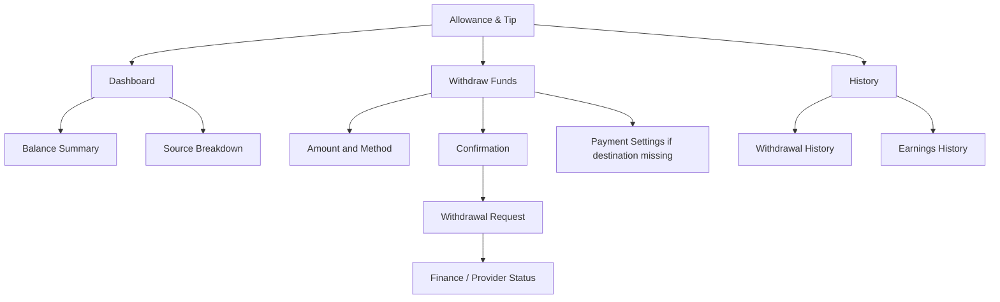
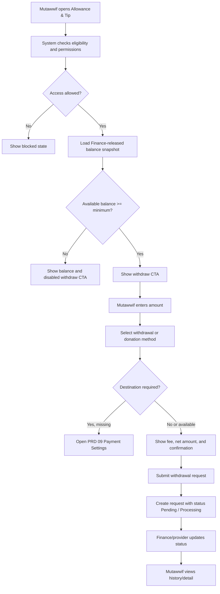

# MV PRD 08 - Allowance & Tip

Product: UmrahHaji.com Mutawwif View  
Module: Allowance & Tip  
Scope: Mutawwif Mobile Web App / Approved Balance, Withdrawal Request, Tip & Allowance Visibility  
Platform: Mobile-first Responsive Web Platform  
Status: Draft  
Last Updated: 19 June 2026  

---

## 1. Objective

Allowance & Tip is the mutawwif-facing finance visibility and withdrawal request module. It allows a mutawwif to view approved and released balances from allowance, tip, referral reward, and other finance-approved sources; request withdrawal or donation through enabled methods; view withdrawal history; and understand why funds are pending, unavailable, rejected, processing, paid, or reversed.

This module must help mutawwif answer:

1. What approved balance is available to withdraw or donate?
2. Which amounts are still pending Finance/Admin review?
3. Which amounts come from trip allowance, jamaah tip, referral reward, or adjustment?
4. What is the minimum withdrawal amount?
5. Which withdrawal or donation methods are available?
6. What fee and net amount will apply before I confirm?
7. What is the status of my withdrawal request?
8. Where do I manage bank or e-wallet payout destination?

This module is not the Finance approval workspace and not the Payment Settings module. It is a mutawwif-facing balance, withdrawal request, and history surface.

---

## 2. Relationship With Mutawwif View Master Scope

This module follows the Mutawwif View mobile web app scope:

1. Mutawwif can view only their own finance-released balance and own withdrawal records.
2. Finance/Admin remains the source of truth for allowance approval, reward approval, payout preparation, disbursement, reversal, and audit.
3. Mutawwif can request withdrawal only from available approved balance.
4. Mutawwif cannot approve allowance, approve tip, edit Finance records, override fee, force payout, or change paid status.
5. Mutawwif cannot store raw card, bank login, CVV, full account number, or sensitive payment credentials in this module.
6. Saved payout destination belongs to PRD 09 Payment Settings.
7. Referral reward eligibility comes from PRD 07 and Finance validation.
8. Activity completion signals from PRD 06 may become future allowance references only after validation rules are enabled.

---

## 3. Relationship With Admin, Travel Agency, Jamaah, Referral, and Payment PRDs

| Source Module | Relationship |
| --- | --- |
| Admin Finance Management | Owns finance overview, approval, payout preparation, reversal, and finance reports |
| Admin Allowance Management | Owns operational allowance records, approval, disbursement, settlement, and receipts |
| Admin Billing & Payment Management | Owns invoice/payment status that may affect referral reward or tip eligibility |
| Admin Mutawwif Management | Source of mutawwif account status, payout eligibility, compliance status, and suspension |
| Admin User Management | Controls role, permissions, sensitive action, data scope, and audit |
| Travel Agency Finance Management | Agency-scoped finance source if agency manages mutawwif allowance/tip |
| Travel Agency Group Trip Management | Source of trip/assignment context for allowance and trip-related tip |
| Travel Agency Mutawwif Assignment | Source of mutawwif assignment and completed trip reference |
| Jamaah/User View | Future source of jamaah tip submission if enabled |
| MV PRD 06 - Activity Guidance | Optional source of validated activity completion evidence in future phase |
| MV PRD 07 - Referral | Source of referral reward attribution and eligibility status |
| MV PRD 09 - Payment Settings | Owns bank/e-wallet/online banking payout destination and masking |
| Report Management | Destination for allowance/tip/withdrawal dispute or issue |

### 3.1 Key Sync Rule

Allowance & Tip reads from Finance-approved balance snapshots.

Allowance/Tip/Referral Source -> Finance Validation -> Released Balance Snapshot -> Mutawwif Allowance & Tip -> Withdrawal Request -> Finance Payout/Disbursement -> Mutawwif Withdrawal Status.

PRD 08 must not create money by itself. Every available balance must come from a Finance-approved and auditable source.

---

## 4. Research Notes and Product Decisions

Allowance, tip, and withdrawal touch sensitive finance data, payout identity, and user trust. Product decisions:

1. Available balance must represent Finance-approved and released funds only.
2. Pending rewards, pending tips, pending allowance, and pending withdrawal should be displayed separately from available balance.
3. Withdrawal request is not the same as payout completion. Finance or payment provider status remains authoritative.
4. Fees, processing time, minimum withdrawal, supported methods, and method availability must be configuration-driven.
5. Bank/e-wallet destination must be masked and managed through PRD 09.
6. Payment-related pages must use secure transmission and avoid storing sensitive card/payment credentials directly.
7. PCI DSS provides baseline technical and operational requirements for entities that store, process, or transmit payment account data. This module should avoid card data scope where possible.
8. Payment integration security guidance recommends low-risk integrations and secure transmission so sensitive payment details do not pass through application servers unnecessarily.
9. Personal data protection rules reinforce minimum necessary use of payout identity, bank/e-wallet data, and finance documents.
10. Mobile withdrawal controls must use clear confirmation and sufficiently large tap targets to reduce accidental financial actions.

Reference sources used as product direction:

1. PCI Security Standards Council - PCI DSS: https://www.pcisecuritystandards.org/standards/pci-dss/
2. Stripe Integration Security Guide: https://docs.stripe.com/security/guide
3. W3C WCAG 2.2 - Target Size Minimum: https://www.w3.org/WAI/WCAG22/Understanding/target-size-minimum.html
4. Personal Data Protection Act 2010, Laws of Malaysia Act 709: https://lom.agc.gov.my/act-detail.php?type=principal&lang=BI&act=709
5. FTC - Disclosures 101 for Social Media Influencers: https://www.ftc.gov/business-guidance/resources/disclosures-101-social-media-influencers

### 4.1 Research Validation Notes

| Research Area | Product Interpretation | Impact on This PRD |
| --- | --- | --- |
| Finance integrity | Paid, approved, settled, or reversed records require audit trail | Mutawwif can request withdrawal but cannot approve or edit finance records |
| Payment security | Avoid handling sensitive payment credentials directly | Saved payout destination belongs to PRD 09 and must be masked/tokenized where applicable |
| Data privacy | Payout and bank/e-wallet data are sensitive | Show only masked destination and minimum necessary status |
| Referral disclosure | Referral-derived reward can be a material benefit | Referral reward source must remain traceable to PRD 07 and Finance approval |
| Mobile usability | Withdrawal is a high-risk action | Amount, fee, net amount, method, destination, and confirmation must be clear before submit |

### 4.2 Finance Safety Rule

This PRD must not promise guaranteed payout, guaranteed tip, guaranteed allowance, guaranteed processing time, or final income. All money displayed must have a status, source, and owner.

### 4.3 Cross-Role Product Boundary

| Role / Surface | Owns | Can Mutawwif View Display? | PRD 08 Rule |
| --- | --- | --- | --- |
| Admin Finance | Approval, release, payout, disbursement, reversal, settlement, audit | Yes, as released balance/status | Do not expose internal finance notes or override tools |
| Admin Allowance | Allowance record and settlement workflow | Yes, as allowance source/status | Mutawwif cannot approve or settle Finance-owned records unless future claim flow enables |
| Travel Agency Finance | Agency allowance/tip/reward participation if enabled | Yes, only own mutawwif records | Agency scope must be enforced |
| Jamaah/User View | Future tip submission | Yes, as approved tip source only | Do not expose jamaah private payment data |
| Referral | Referral attribution and reward eligibility | Yes, as source and eligibility reference | PRD 08 displays only Finance-released reward/tip lines |
| Payment Settings | Payout destination setup | Yes, as masked destination label | Destination management belongs to PRD 09 |
| Mutawwif View | Balance visibility, withdrawal request, history | Yes | Read-first finance status and controlled request |

### 4.4 Boundary With PRD 07 and PRD 09

| Area | PRD 07 Referral | PRD 08 Allowance & Tip | PRD 09 Payment Settings |
| --- | --- | --- | --- |
| Referral code/link | Owns | No | No |
| Referral reward eligibility | Shows pending/eligible/rejected | Consumes only approved/released reward | No |
| Available balance | No | Own display surface | No |
| Withdraw request | No | Own request surface | Requires destination from PRD 09 |
| Bank/e-wallet/online banking destination | No | Display masked selected destination only | Owns setup/update |
| Withdrawal history | Links out | Owns user-facing history | Shows destination labels if needed |
| Payout approval | No | Displays status only | No |

---

## 5. Scope

### 5.1 In Scope for Phase 1

1. Allowance & Tip dashboard.
2. Available balance display.
3. Pending balance display.
4. Minimum withdrawal display.
5. Balance source breakdown: allowance, tip, referral reward, adjustment.
6. Withdraw Funds entry from approved balance.
7. Withdrawal amount input.
8. Quick amount buttons: RM 100, RM 500, RM 1,000, Max.
9. Withdrawal method selection: Infaq2U, Bank Transfer, E-Wallet, Online Banking, based on configuration.
10. Fee, net amount, and processing time preview.
11. Final confirmation summary.
12. Withdrawal request submission.
13. Processing state.
14. Success/request-submitted state.
15. Withdrawal history.
16. Withdrawal detail.
17. Donation/Infaq handoff if Infaq2U integration is enabled.
18. Masked payout destination display.
19. Link to PRD 09 to add/update payout destination.
20. Empty/loading/error/offline states.
21. Audit log for view, request, confirmation, and status update.
22. Mobile-first responsive behavior.

### 5.2 In Scope for Phase 2

1. Mutawwif allowance request or claim submission.
2. Receipt/proof upload for claim/settlement if Finance enables.
3. Tip source detail by trip with privacy-safe jamaah aggregation.
4. Auto payout batch status.
5. Withdrawal dispute request.
6. Donation receipt from Infaq2U or other charity integration.
7. Multi-currency support, e.g. MYR/SAR.
8. Offline draft for claim submission.
9. Advanced earnings/withdrawal charts.
10. Tax/statement export if legally required and Finance approves.
11. Activity-completion-based allowance readiness from PRD 06.

### 5.3 Out of Scope

1. Finance approval.
2. Payout execution by mutawwif.
3. Editing allowance source records.
4. Editing referral attribution or reward rules.
5. Editing tip source records.
6. Storing full bank account number as PRD 08-owned data.
7. Storing CVV, card number, card PIN, or banking login credentials.
8. Payment gateway settlement reconciliation.
9. Bank reconciliation.
10. Full accounting ledger.
11. Payroll.
12. Tax filing.
13. Automatic zakat/infaq compliance calculations unless separate scope is approved.

---

## 6. User Roles and Access

| Role | Access Behavior |
| --- | --- |
| Pending mutawwif | Cannot access finance balance until account rules allow |
| Invited mutawwif | No allowance/tip access unless activated |
| Active mutawwif | Can view own released balance if Finance enables |
| Verified mutawwif | Eligible for withdrawal request if payout policy allows |
| Lead mutawwif | Same finance access to own records; no access to assistant balance |
| Assistant mutawwif | Same finance access to own records |
| Suspended mutawwif | Withdrawal disabled; historical view may remain read-only |
| Replaced mutawwif | Active trip allowance may be recalculated by Finance; view own records only |
| Admin Finance | Manages approval/disbursement from Admin Panel |
| Travel Agency Finance | Manages agency-scoped finance if enabled |
| Jamaah | May submit tip in Jamaah View if enabled, not this module |

### 6.1 Visibility Rules

Mutawwif can see:

1. Own available balance.
2. Own pending balance.
3. Own withdrawal history.
4. Own allowance/tip/referral reward source labels.
5. Own masked payout destination label.
6. Fee and net amount before confirmation.
7. Finance-safe status reason.
8. Link to Payment Settings if destination is missing.

Mutawwif must not see by default:

1. Other mutawwif balances.
2. Full bank account or e-wallet number.
3. Internal Finance approval notes.
4. Internal fraud/risk score.
5. Jamaah full identity, payment, invoice, or bank data.
6. Travel Agency internal settlement details.
7. Platform margin or commission calculation.
8. Finance account used to pay disbursement.

### 6.2 Action Permission Rules

| Action | Mutawwif | Rule |
| --- | ---: | --- |
| View balance | Permission-based | Own records only |
| View pending rewards/tips/allowance | Permission-based | Own records only |
| Start withdrawal | Yes | Only if available balance >= minimum and account eligible |
| Select withdrawal method | Yes | Enabled methods only |
| Submit withdrawal request | Yes | Requires confirmation and destination if needed |
| Donate via Infaq2U | Permission-based | If integration and policy enabled |
| Add/update payout destination | No in PRD 08 | Link to PRD 09 |
| Cancel withdrawal request | Permission-based | Only if Finance status allows |
| Approve payout | No | Finance/Admin only |
| Mark paid | No | Finance/Admin or provider callback only |
| View finance proof | Permission-based | Usually hidden from mutawwif except receipt/confirmation |

---

## 7. Entry Points

| Entry Point | Behavior |
| --- | --- |
| Profile - Allowance & Tip | Opens dashboard |
| Home balance card | Opens dashboard if feature enabled |
| Referral dashboard Withdraw CTA | Opens Withdraw Funds if approved/released balance exists |
| PRD 07 reward detail | Opens source detail or balance line if reward released |
| Notification - allowance released | Opens balance detail |
| Notification - tip received/approved | Opens balance detail |
| Notification - withdrawal status updated | Opens withdrawal detail |
| PRD 09 payout destination prompt | Opens Payment Settings destination setup |

---

## 8. Information Architecture

```text
Allowance & Tip
+-- Dashboard
|   +-- Balance Summary
|   +-- Source Breakdown
|   +-- Recent Transactions
|   +-- Withdraw CTA
+-- Withdraw Funds
|   +-- Balance Info
|   +-- Amount Input
|   +-- Method Selection
|   +-- Method Detail / Destination
|   +-- Final Confirmation
|   +-- Processing / Result
+-- History
|   +-- Earnings / Balance History
|   +-- Withdrawal History
|   +-- Donation History
+-- Detail
|   +-- Source Detail
|   +-- Withdrawal Detail
|   +-- Status Timeline
+-- Linked Modules
    +-- PRD 07 Referral
    +-- PRD 09 Payment Settings
    +-- Report / Support
```



---

## 9. Main Flow



---

## 10. Balance Source and Sync Logic

### 10.1 Balance Source Types

| Source Type | Description | Owner |
| --- | --- | --- |
| Trip Allowance | Finance-approved operational or mutawwif trip allowance | Admin/TA Finance |
| Jamaah Tip | Tip/gratuity from jamaah if feature enabled | Jamaah View + Finance validation |
| Referral Reward | Approved reward from PRD 07 attribution | Referral + Finance |
| Adjustment Credit | Manual correction or finance adjustment | Admin Finance |
| Reversal Debit | Reversal due to cancellation/refund/error | Admin Finance |
| Withdrawal Debit | Deducted when withdrawal request is accepted/locked | Finance/PRD 08 |
| Donation Debit | Deducted when donation request is accepted/locked | Finance/PRD 08 |

### 10.2 Balance Rules

1. Available balance includes only approved and released sources minus locked/pending/paid withdrawals.
2. Pending balance must be displayed separately.
3. Rejected, reversed, expired, or cancelled sources must not count toward available balance.
4. Withdrawal request can lock balance while processing if Finance policy requires.
5. If a withdrawal fails, locked amount returns to available balance unless Finance marks otherwise.
6. All balance changes must be auditable and traceable to source.
7. Mutawwif must not be able to manually edit balance.

### 10.3 Source Ownership

| Data | Owner | PRD 08 Behavior |
| --- | --- | --- |
| Allowance approval | Finance/Admin | Display source/status |
| Tip approval | Finance/Admin or configured tip workflow | Display source/status |
| Referral reward approval | Referral + Finance | Display source/status |
| Payout destination | PRD 09 | Display masked label |
| Withdrawal request | PRD 08 + Finance | Create request, then follow Finance/provider status |
| Withdrawal paid status | Finance/provider callback/manual record | Display status only |

---

## 11. Screen 1 - Allowance & Tip Dashboard

| Element | Requirement |
| --- | --- |
| Top navbar | Logo, notification bell |
| Page title | `Allowance & Tip` |
| Balance card | Available balance, pending balance, minimum withdrawal |
| Source breakdown | Allowance, tip, referral reward, adjustment |
| Primary CTA | Withdraw, Donate, or disabled state |
| Payout destination status | Shows masked default destination or setup prompt |
| Recent transactions | Latest balance source/withdrawal records |
| History shortcut | Opens history |
| Terms/security note | Explains Finance approval and destination handling |

### 11.1 Balance Card Fields

| Field | Example | Source |
| --- | --- | --- |
| Available Balance | RM 2,000 | Finance-released balance snapshot |
| Pending Balance | RM 950 | Pending source or withdrawal |
| Minimum Withdrawal | RM 100 | Finance settings |
| Last Updated | 19 Jun 2026, 10:00 PM | Balance snapshot |
| Destination | Maybank ****7890 | PRD 09 masked destination |

### 11.2 Dashboard Rules

1. Available balance should be visually primary.
2. Pending balance must not be presented as withdrawable.
3. Withdraw CTA is disabled if available balance is below minimum.
4. Withdraw CTA is disabled if payout destination is required but missing.
5. Suspended or unverified mutawwif should see safe blocked/disabled state.
6. Source breakdown should be expandable but not expose internal Finance notes.

---

## 12. Screen 2 - Withdraw Funds

Withdraw Funds uses the UI breakdown provided in PRD 07 update.

| Section | Requirement |
| --- | --- |
| Header | Page title `Withdraw Funds`, subtitle `Transfer your approved earnings` |
| Balance Info Card | Available Balance, Pending Withdrawal, Minimum Withdrawal |
| Withdrawal Amount | Floating label input `Amount (RM)` |
| Quick Amount Buttons | RM 100, RM 500, RM 1,000, Max |
| Choose Withdrawal Method | Selectable cards with expandable method details |
| Final Confirmation | Amount, fee, net amount, processing time, destination, disclaimer |
| Submit CTA | `Confirm Withdrawal`, `Confirm Donation`, or processing label |

### 12.1 Withdrawal Amount Rules

| Rule | Requirement |
| --- | --- |
| Minimum | Amount must be >= configured minimum, e.g. RM 100 |
| Maximum | Amount must be <= available balance |
| Decimal | Currency precision follows Finance settings |
| Quick Max | Uses available balance minus any method-specific rule if applicable |
| Fee | Fee shown before confirmation |
| Net amount | Gross amount minus fee unless method defines fee absorbed |
| Locking | Amount may be locked after request submission |

---

## 13. Withdrawal Methods

### 13.1 Method Summary

| Method | Fee | Processing Time | Destination Required | PRD Owner |
| --- | --- | --- | --- | --- |
| Infaq2U | Free | Instant | No bank/e-wallet destination | PRD 08 / integration |
| Bank Transfer | Configurable, example RM 5 | 1-3 business days | Bank account | PRD 09 destination |
| E-Wallet | Configurable, example RM 2 | Instant or provider-defined | E-wallet account | PRD 09 destination |
| Online Banking | Configurable, example RM 3 | Within 1 hour or provider-defined | Bank account | PRD 09 destination |

### 13.2 Method Rules

1. Methods must be configuration-driven by Finance/Admin.
2. Disabled methods should be hidden or disabled with safe reason.
3. Fee and processing time must not be hard-coded.
4. Method destination must be masked.
5. If destination is missing, show setup CTA to PRD 09.
6. Method-specific confirmation must show gross amount, fee, net amount, and expected processing time.
7. Actual status remains controlled by Finance/provider.

---

## 14. Flow - Infaq2U Donation

Infaq2U is treated as donation/infaq from approved balance, not cash withdrawal.

### 14.1 Infaq2U Form

| Field | Type | Notes |
| --- | --- | --- |
| Donation Type | Dropdown | Example: Education Fund |
| Message | Textarea | Optional |
| Amount | Currency | From withdrawal amount |
| Fee | Display | Free if configured |
| Final Donation | Display | Amount minus fee, usually same amount |

### 14.2 Infaq2U Copy

Recommended info banner:

```text
Your donation will be credited to your Infaq2U account or donation destination.
All your donation goes to charity - no fees, if configured by Finance.
```

### 14.3 Infaq2U Result

| Field | Example |
| --- | --- |
| Title | Donation Request Submitted or Donation Successful |
| Reference ID | INF64116767 |
| Amount | RM 500 |
| Method | Infaq2U |
| Fee | Free |
| Final Donation | RM 500 |
| Status | Submitted, Processing, Successful, Failed |

Rules:

1. Use `Donation Request Submitted` if external confirmation is not instant.
2. Use `Donation Successful` only after provider/Finance confirms success.
3. Donation request must create audit log and balance movement.
4. Donation is irreversible after provider confirms unless Finance policy allows correction.

---

## 15. Flow - Bank Transfer

Bank Transfer uses a saved payout destination from PRD 09.

### 15.1 Bank Account Details

| Field | Example | Source |
| --- | --- | --- |
| Bank Name | Maybank | PRD 09 |
| Account Holder | Ilham Bukhari | PRD 09 |
| Account Number | 12******90 | PRD 09 masked destination |
| Badge | Primary | PRD 09 |
| Action | Add New Account | Opens PRD 09 |

### 15.2 Bank Transfer Confirmation

| Field | Example |
| --- | --- |
| Withdrawal Amount | RM 500 |
| Transaction Fee | - RM 5 |
| Net Amount | RM 495 |
| Processing Info | 1-3 business days |
| CTA | Confirm Withdrawal |

Rules:

1. Success screen should show `Net Amount`, not `Donation Amount`.
2. If bank destination is unverified, withdrawal may be blocked or require Finance review.
3. Full account number must not be shown.
4. Bank account add/edit belongs to PRD 09.

---

## 16. Flow - E-Wallet

E-Wallet uses saved destination from PRD 09.

### 16.1 E-Wallet Details

| Field | Example | Source |
| --- | --- | --- |
| Provider | Touch 'n Go, GrabPay, ShopeePay | PRD 09 |
| Phone Number | +60******543 | PRD 09 masked destination |
| Badge | Primary | PRD 09 |
| Action | Add New Account | Opens PRD 09 |

### 16.2 E-Wallet Confirmation

| Field | Example |
| --- | --- |
| Withdrawal Amount | RM 500 |
| Transaction Fee | - RM 2 |
| Net Amount | RM 498 |
| Processing Info | Instant or provider-defined |
| CTA | Confirm Withdrawal |

Rules:

1. E-wallet phone number must be masked.
2. E-wallet provider availability must be configuration-driven.
3. Do not imply instant completion unless provider/Finance can confirm it.

---

## 17. Flow - Online Banking

Online Banking uses bank destination from PRD 09, but processing route may differ from Bank Transfer.

| Field | Example |
| --- | --- |
| Withdrawal Amount | RM 500 |
| Transaction Fee | - RM 3 |
| Net Amount | RM 497 |
| Processing Info | Within 1 hour or provider-defined |
| CTA | Confirm Withdrawal |

Rules:

1. Confirmation and success processing copy must be consistent.
2. Online Banking method should not reuse Bank Transfer processing copy unless configured.
3. Method availability and fee must come from Finance settings.
4. Destination add/update belongs to PRD 09.

---

## 18. Withdrawal Request and Status Model

### 18.1 Withdrawal Status Values

| Status | Meaning | Mutawwif Display |
| --- | --- | --- |
| Draft | Amount/method selected but not submitted | Draft |
| Submitted | Request submitted | Submitted |
| Pending Review | Waiting Finance review | Pending Review |
| Processing | Finance/provider is processing | Processing |
| Paid | Disbursement completed | Paid |
| Donation Successful | Donation confirmed | Donation Successful |
| Failed | Provider/Finance failed request | Failed |
| Rejected | Finance rejected request | Rejected |
| Cancelled | Cancelled before processing | Cancelled |
| Reversed | Paid/processed amount reversed | Reversed |

### 18.2 Status Ownership

| Status Area | Owner |
| --- | --- |
| Submitted | PRD 08 request creation |
| Pending Review | Finance workflow |
| Processing | Finance/provider |
| Paid | Finance/provider confirmation |
| Failed | Finance/provider |
| Rejected | Finance |
| Reversed | Finance |
| User-facing display | PRD 08 |

### 18.3 Balance Locking Rules

1. Finance settings decide whether submitted withdrawal immediately locks balance.
2. Paid and processing withdrawals must reduce available balance.
3. Failed/cancelled/rejected withdrawals should release locked balance unless Finance marks otherwise.
4. Reversed paid transactions create reversal movement and audit trail.

---

## 19. History

### 19.1 History Tabs

| Tab | Purpose |
| --- | --- |
| Earnings History | Shows allowance/tip/referral reward source lines |
| Withdrawal History | Shows withdrawal/donation requests |

### 19.2 Withdrawal History Fields

| Field | Example |
| --- | --- |
| Reference ID | WTH64841324 |
| Amount | RM 1,500 |
| Fee | RM 5 |
| Net Amount | RM 1,495 |
| Method | Bank Transfer: Maybank ****4567 |
| Status | Pending / Processing / Paid / Failed |
| Date | 30 May 2025 |
| Processing Info | 1-3 business days |

### 19.3 Analytics

Phase 1 can show summary cards. Charts are Phase 2 unless needed for launch.

| Metric | Phase |
| --- | --- |
| Total withdrawn | P1 |
| Completed count | P1 |
| Processing count | P1 |
| Failed count | P1 |
| Withdrawal vs earnings trend | P2 |
| Source breakdown trend | P2 |

---

## 20. UI Breakdown Implementation Specification

This section implements the previously provided UI breakdown in PRD 08.

### 20.1 Withdraw Funds Page

| UI Component | PRD 08 Implementation |
| --- | --- |
| Header | `Withdraw Funds`, subtitle `Transfer your approved earnings` |
| Balance Info Card | Available Balance, Pending Withdrawal, Minimum Withdrawal |
| Amount Input | `Amount (RM)` with min/max validation |
| Quick Select Buttons | RM 100 / RM 500 / RM 1,000 / Max |
| Method Cards | Infaq2U, Bank Transfer, E-Wallet, Online Banking |
| Expandable Details | Method-specific destination/form/confirmation |
| Final Confirmation | Amount, fee, net amount/final donation |
| Processing State | Button and page state |
| Success State | Request submitted / paid / donation successful based on confirmed status |

### 20.2 Correction Notes From UI Breakdown

1. Bank Transfer success uses `Net Amount`, not `Donation Amount`.
2. Online Banking processing time must be consistent across confirmation and result.
3. Infaq2U is donation, not withdrawal.
4. Fees and processing time are examples only and must be configuration-driven.
5. Saved account list belongs to PRD 09 but is displayed as masked destination in PRD 08.
6. Withdrawal history belongs to PRD 08.
7. Referral history remains PRD 07.

### 20.3 Reusable Components

| Component | Use |
| --- | --- |
| Balance Info Card | Dashboard and Withdraw Funds |
| Quick Amount Buttons | Withdraw amount selection |
| Selectable Method Card | Method selection |
| Saved Account List Item | Masked payout destination display |
| Inline Add Account CTA | Opens PRD 09, not inline storage in PRD 08 |
| Final Confirmation Summary | Withdrawal/donation confirmation |
| Processing Button | Request submission |
| Success Screen | Request result |
| Tab Navigation | Earnings History / Withdrawal History |
| Performance Chart | Phase 2 analytics |
| Filter Chips | History filtering |
| List Item | Earnings and withdrawal records |

---

## 21. Data Requirements

### 21.1 Dashboard Response

```text
AllowanceTipDashboard
+-- user
|   +-- userId
|   +-- mutawwifId
|   +-- displayName
|   +-- financeEligibilityStatus
+-- balance
|   +-- availableBalance
|   +-- pendingBalance
|   +-- lockedBalance
|   +-- minimumWithdrawal
|   +-- currency
|   +-- lastUpdatedAt
+-- payoutDestination
|   +-- hasDefaultDestination
|   +-- maskedLabel
|   +-- destinationType
|   +-- verificationStatus
+-- sourceSummary[]
|   +-- sourceType
|   +-- amount
|   +-- status
+-- recentTransactions[]
    +-- transactionId
    +-- type
    +-- amount
    +-- status
    +-- createdAt
```

### 21.2 Withdrawal Transaction

```text
WithdrawalTransaction
+-- referenceId
+-- userId
+-- mutawwifId
+-- grossAmount
+-- feeAmount
+-- netAmount
+-- currency
+-- method
+-- destinationSnapshotId
+-- maskedDestinationLabel
+-- status
+-- requestedAt
+-- processedAt
+-- paidAt
+-- failedAt
+-- rejectionReasonCode
+-- safeReasonText
+-- financeReviewStatus
+-- providerReference
+-- sourceBalanceMovementIds[]
```

### 21.3 Balance Movement

```text
BalanceMovement
+-- movementId
+-- userId
+-- mutawwifId
+-- sourceType
+-- sourceRecordId
+-- amount
+-- direction
+-- status
+-- availableAt
+-- lockedAt
+-- releasedAt
+-- createdAt
```

### 21.4 Saved Payout Destination Reference

PRD 08 may read only a masked destination reference from PRD 09.

```text
PayoutDestinationSummary
+-- destinationId
+-- destinationType
+-- provider
+-- maskedLabel
+-- isPrimary
+-- verificationStatus
```

---

## 22. Empty, Loading, Error, and Offline States

| State | Behavior |
| --- | --- |
| Loading | Show skeleton for balance, source breakdown, and recent history |
| No available balance | Show pending/source education and disabled withdraw CTA |
| Below minimum | Show minimum withdrawal requirement |
| Missing payout destination | Show setup CTA to PRD 09 |
| Destination unverified | Disable withdrawal or show Finance review state based on policy |
| Method unavailable | Hide or disable method with safe reason |
| Submit failed | Show retry and preserve amount/method where safe |
| Offline | Show cached balance and history; disable new withdrawal submission |
| Finance blocked | Show account/eligibility blocked state |
| Withdrawal failed | Show safe reason and status detail |
| Reversed | Show reversed status and safe reason |

---

## 23. Notifications

| Event | Recipient | Opens | Notes |
| --- | --- | --- | --- |
| Allowance released | Mutawwif | Source detail | Optional |
| Tip approved | Mutawwif | Source detail | Optional |
| Referral reward released | Mutawwif | Source detail / PRD 07 | Optional |
| Withdrawal submitted | Mutawwif | Withdrawal detail | Confirmation |
| Withdrawal processing | Mutawwif | Withdrawal detail | Optional |
| Withdrawal paid | Mutawwif | Withdrawal detail | No sensitive destination in preview |
| Withdrawal failed/rejected | Mutawwif | Withdrawal detail | Safe reason only |
| Destination needed | Mutawwif | PRD 09 Payment Settings | If approved balance exists |

Notification previews must not reveal full bank/e-wallet destination, internal Finance notes, or jamaah identity.

---

## 24. Permissions, Privacy, and Security

### 24.1 Permission Logic

This module follows the shared permission model:

Portal Access -> Role -> Permission Group -> Module Permission -> Action Permission -> Data Scope.

| Permission | Purpose |
| --- | --- |
| mutawwif.allowance_tip.view | View dashboard |
| mutawwif.allowance_tip.source.view | View source breakdown |
| mutawwif.allowance_tip.withdraw.create | Submit withdrawal request |
| mutawwif.allowance_tip.donation.create | Submit donation request |
| mutawwif.allowance_tip.history.view | View own history |
| mutawwif.allowance_tip.destination.summary.view | View masked destination summary |
| mutawwif.allowance_tip.cancel_request | Cancel request if Finance policy allows |
| mutawwif.allowance_tip.dispute.create | Create dispute, Phase 2 |

### 24.2 Security Rules

1. Backend must enforce user owns all balance/withdrawal records.
2. Full bank/e-wallet data must not be stored by PRD 08.
3. Destination summaries must be masked.
4. Withdrawal request must require confirmation.
5. Sensitive changes route to PRD 09 and may require re-authentication.
6. Finance status update must be audit logged.
7. Amount, fee, and net amount must be calculated server-side.
8. Client-side values must not be trusted.

### 24.3 Privacy Rules

1. Do not expose jamaah identity behind tips unless policy allows aggregated source labels.
2. Do not expose internal Finance notes.
3. Do not expose full destination details.
4. Use safe reason text for rejection/reversal/failure.
5. Logs and exports are Finance/Admin-owned, not Mutawwif-owned.

---

## 25. Audit and Activity Logs

Audit logs should be created for:

1. Balance snapshot generated or refreshed.
2. Withdrawal page opened if high-risk tracking is enabled.
3. Withdrawal request submitted.
4. Donation request submitted.
5. Withdrawal cancelled by user if allowed.
6. Finance status update.
7. Provider callback/status update.
8. Balance locked/released.
9. Reversal.
10. Destination summary changed via PRD 09.

### 25.1 Audit Fields

| Field | Description |
| --- | --- |
| audit_id | Unique log ID |
| actor_user_id | Actor |
| mutawwif_id | Mutawwif profile |
| transaction_id | Withdrawal/donation transaction |
| source_record_id | Balance source |
| action_type | Submit, lock, process, paid, failed, reverse |
| previous_value | If relevant |
| new_value | If relevant |
| reason | Required for rejection/reversal/correction |
| timestamp | Server time |
| source_module | PRD 08, Finance, Provider, PRD 09 |

---

## 26. Functional Requirements

| ID | Requirement | Priority |
| --- | --- | --- |
| MV-ALW-001 | System must show Allowance & Tip only to eligible mutawwif | P1 |
| MV-ALW-002 | System must show available, pending, locked, and minimum withdrawal values | P1 |
| MV-ALW-003 | System must separate allowance, tip, referral reward, adjustment, and reversal sources | P1 |
| MV-ALW-004 | System must show Withdraw CTA only when available balance meets policy rules | P1 |
| MV-ALW-005 | System must validate withdrawal amount against minimum and available balance | P1 |
| MV-ALW-006 | System must support quick amount buttons | P1 |
| MV-ALW-007 | System must show enabled withdrawal/donation methods | P1 |
| MV-ALW-008 | System must show fee, net amount, processing time, and destination before confirmation | P1 |
| MV-ALW-009 | System must submit withdrawal request without marking it paid | P1 |
| MV-ALW-010 | System must display withdrawal status from Finance/provider | P1 |
| MV-ALW-011 | System must display masked payout destination from PRD 09 only | P1 |
| MV-ALW-012 | System must link to PRD 09 when destination is missing/unverified | P1 |
| MV-ALW-013 | System must support Infaq2U donation request if integration is enabled | P1 |
| MV-ALW-014 | System must show withdrawal history | P1 |
| MV-ALW-015 | System must not store full bank/e-wallet destination data | P1 |
| MV-ALW-016 | System must not allow mutawwif to approve, mark paid, or reverse finance records | P1 |
| MV-ALW-017 | System must audit withdrawal request, status update, balance lock, and reversal | P1 |
| MV-ALW-018 | System should support withdrawal dispute request | P2 |
| MV-ALW-019 | System should support charts for withdrawal vs earnings | P2 |
| MV-ALW-020 | System should support receipt/proof upload for mutawwif claims if Finance enables | P2 |

---

## 27. Acceptance Criteria

### 27.1 Balance

1. Given Finance releases approved balance, mutawwif sees available balance.
2. Given balance is pending review, mutawwif sees it as pending, not withdrawable.
3. Given balance is below minimum, withdraw CTA is disabled with minimum requirement.

### 27.2 Withdrawal

1. Given available balance is sufficient and destination is valid, mutawwif can submit withdrawal request.
2. Given amount is below minimum or above available balance, system blocks submission.
3. Given method has a fee, confirmation shows gross amount, fee, and net amount.
4. Given withdrawal is submitted, status becomes Submitted/Pending Review/Processing based on policy.
5. Given withdrawal is paid by Finance/provider, status updates to Paid.

### 27.3 Destination

1. Given destination is missing, system links to PRD 09.
2. Given destination exists, PRD 08 shows only masked label.
3. Given destination is unverified, withdrawal is blocked or routed to review based on policy.

### 27.4 Donation

1. Given Infaq2U is enabled, mutawwif can select donation method.
2. Given donation is submitted, system shows request/processing state.
3. Given provider confirms donation, status becomes Donation Successful.

### 27.5 Finance Boundary

1. Mutawwif cannot approve allowance/tip/reward.
2. Mutawwif cannot mark withdrawal as paid.
3. Mutawwif cannot edit fee, processing time, or finance status.
4. Mutawwif cannot view internal finance notes.

### 27.6 Privacy

1. Full payout destination is never shown.
2. Jamaah payer/tip identity is hidden unless policy explicitly permits.
3. Notification preview does not expose sensitive finance data.

---

## 28. Dependencies

| Dependency | Purpose |
| --- | --- |
| User Management | Authentication, role, permission, data scope |
| Admin Mutawwif Management | Mutawwif finance eligibility |
| Admin Finance Management | Approval, payout preparation, disbursement, reversal |
| Admin Allowance Management | Allowance source records |
| Billing & Payment Management | Payment/eligibility signal for referral/tip where relevant |
| Travel Agency Finance Management | Agency-scoped allowance/tip if enabled |
| Group Trip Management | Trip/assignment context |
| Mutawwif Assignment | Assignment reference |
| PRD 06 Activity Guidance | Future activity-completion evidence |
| PRD 07 Referral | Referral reward source and attribution |
| PRD 09 Payment Settings | Payout destination setup and masking |
| Notification Settings | Finance status notifications |
| Report Management | Dispute/support flow |
| Infaq2U / Donation Integration | Optional donation request |

---

## 29. Future Enhancements

1. Mutawwif claim submission.
2. Receipt upload for reimbursement.
3. Tip detail by trip with privacy-safe aggregation.
4. Auto payout batch status.
5. Withdrawal dispute.
6. Donation receipt download.
7. Multi-currency MYR/SAR.
8. Tax/statement export.
9. Activity completion validation for allowance readiness.
10. Advanced earnings analytics.
11. Offline claim draft.
12. Finance provider webhook status tracking.
13. Optional charity/infaq provider expansion.

---

## 30. Final Product Decision

PRD 08 should define Allowance & Tip as the mutawwif's approved balance and withdrawal request module.

Recommended product decision:

1. Keep PRD 08 finance-safe, status-based, and mobile-first.
2. Show only Finance-approved/released balance as available balance.
3. Keep pending sources separate from withdrawable funds.
4. Implement the provided Withdraw Funds, Infaq2U, Bank Transfer, E-Wallet, Online Banking, confirmation, success, and withdrawal history UI patterns here.
5. Keep saved bank/e-wallet/online banking destination setup in PRD 09.
6. Do not allow mutawwif to approve, mark paid, reverse, or edit Finance records.
7. Make fee, minimum withdrawal, processing time, and method availability configuration-driven.
8. Treat withdrawal submission as a request/status workflow, not instant payout unless Finance/provider confirms it.
9. Mask payout destination and protect all finance-sensitive data.
10. Use PRD 07 only as referral source handoff and PRD 09 only as payout destination handoff.

