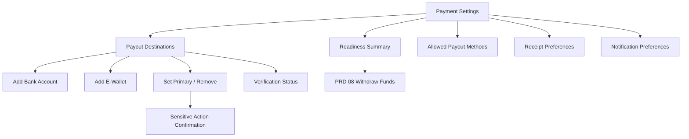
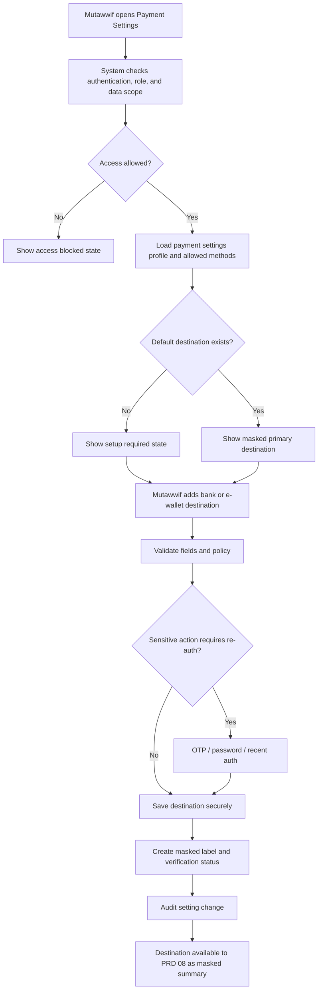
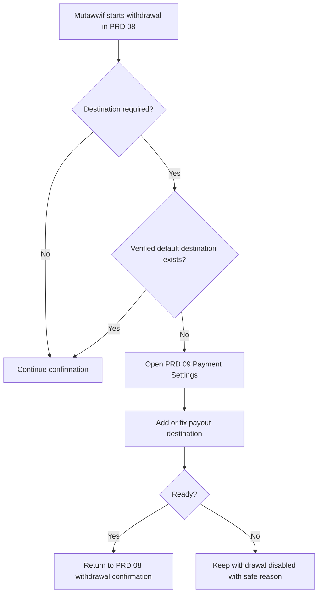

# MV PRD 09 - Payment Settings

Product: UmrahHaji.com Mutawwif View  
Module: Payment Settings  
Scope: Mutawwif Mobile Web App / Payout Destination, Finance Preferences, Receipt & Notification Settings  
Platform: Mobile-first Responsive Web Platform  
Status: Draft  
Last Updated: 20 June 2026  

---

## 1. Objective

Payment Settings is the mutawwif-facing finance preference module. It allows a mutawwif to manage payout destination data used by Allowance & Tip, referral reward withdrawal, approved trip allowance, jamaah tip payout, and future finance disbursement flows.

This module must help mutawwif answer:

1. Is my payout setup ready?
2. Which bank account or e-wallet will be used for withdrawal?
3. Is my payout destination verified, pending review, rejected, disabled, or expired?
4. Which payout destination is primary?
5. Which payout method is available for my account and agency/platform policy?
6. Where should finance receipts and withdrawal status notifications be sent?
7. What data is masked and protected after save?
8. Which changes require OTP, password confirmation, or recent authentication?

This module is not the withdrawal request module and not the Finance approval workspace. It stores mutawwif-owned payment preferences and payout destination references, while payout request creation remains PRD 08 and payout execution remains Finance/Admin/provider-owned.

---

## 2. Relationship With Mutawwif View Master Scope

This module follows the Mutawwif View mobile web app scope:

1. Mutawwif can view and manage only their own payout settings.
2. Payment Settings is P1 because PRD 08 Allowance & Tip requires payout destination readiness.
3. Mutawwif can add, update, remove, and set primary payout destination only if permission and account eligibility allow.
4. Mutawwif cannot approve payout, force payout, mark paid, edit Finance records, change fees, or bypass verification.
5. Mutawwif cannot store raw card number, CVV, card PIN, banking password, bank login, or payment gateway secrets.
6. PRD 08 reads only masked destination summary from this module.
7. PRD 07 Referral can deep-link to this module when approved reward withdrawal requires payout setup.
8. Finance/Admin remains the source of truth for payout method availability, approval, provider status, disbursement, reversal, and audit.

---

## 3. Relationship With Admin, Travel Agency, Jamaah, Referral, and Allowance PRDs

| Source Module | Relationship |
| --- | --- |
| Admin Finance Management | Owns payout approval, disbursement, provider status, failed payout handling, reversal, and finance audit |
| Admin Billing & Payment Management | Owns platform payment/payout provider configuration, gateway rules, refund policy, and finance settings |
| Admin Mutawwif Management | Source of mutawwif account status, verification status, compliance eligibility, and suspension |
| Admin User Management | Controls role, permission, recent authentication, OTP/MFA policy, and data scope |
| Travel Agency Finance Management | Owns agency-scoped finance settings if agency manages mutawwif allowance/tip payout |
| Travel Agency Mutawwif Assignment | Provides assignment context that may affect payout eligibility but does not own payment settings |
| Jamaah/User View Payment Settings | Provides shared pattern for masking, tokenized methods, receipt preferences, and secure payment data handling |
| Jamaah/User View Tip Flow | Future source of jamaah tip; mutawwif sees only approved payout readiness and masked destination |
| MV PRD 07 - Referral | May send approved reward withdrawal users to Payment Settings when destination is missing |
| MV PRD 08 - Allowance & Tip | Consumes masked payout destination and opens Payment Settings setup when destination is missing/unverified |
| Report Management | Destination for payout destination issue, failed verification, or finance support request |

### 3.1 Key Sync Rule

Payment Settings stores mutawwif-owned payout preferences, not financial authority.

Payout Destination Setup -> Verification / Finance Policy Check -> Masked Destination Summary -> PRD 08 Withdrawal Request -> Finance Payout / Provider Status -> PRD 08 Withdrawal Status.

PRD 09 must not create withdrawable balance, approve withdrawal, or mark payout as paid.

### 3.2 Cross-Role Boundary

| Role / Surface | Owns | Can Mutawwif View Display? | PRD 09 Rule |
| --- | --- | --- | --- |
| Admin Finance | Payout approval, provider status, payout failure, manual disbursement, reversal | Yes, as safe readiness/status reason | Do not expose internal Finance notes |
| Admin Billing & Payment | Gateway/provider configuration, payout methods, processing policy | Yes, as enabled/disabled method availability | Do not allow mutawwif to override method policy |
| Admin Mutawwif Management | Mutawwif identity, compliance, active/suspended status | Yes, as payout eligibility status | Block sensitive changes if account not eligible |
| Travel Agency Finance | Agency-scoped payout method if enabled | Yes, as agency allowed method | Must respect `agency_id` and assignment scope |
| Jamaah/User View | Payment preference pattern and future tip source | Only approved tip/payout readiness | Do not expose jamaah payment identity |
| Referral | Reward attribution and reward eligibility | Yes, as payout setup prompt | Referral does not manage destination |
| PRD 08 Allowance & Tip | Withdrawal request, amount, fee, net amount, status | Yes, through masked destination summary | PRD 08 cannot edit destination inline |
| Mutawwif View | Own settings and own payout destination | Yes | Own-user data scope only |

### 3.3 Boundary With PRD 07 and PRD 08

| Area | PRD 07 Referral | PRD 08 Allowance & Tip | PRD 09 Payment Settings |
| --- | --- | --- | --- |
| Referral code/link | Owns | No | No |
| Reward eligibility | Owns display | Consumes only Finance-released reward | No |
| Available balance | No | Own display surface | No |
| Withdrawal request | No | Owns request | No |
| Payout destination setup | No | Opens PRD 09 if missing | Owns |
| Destination verification status | No | Displays summary | Owns user-facing setting status |
| Bank/e-wallet full details | No | No | Captures only needed fields and stores securely/masked |
| Payout approval | No | Displays status only | No |
| Payout execution | No | Displays Finance/provider status | No |

---

## 4. Research Notes and Product Decisions

Payment Settings touches sensitive finance data, payout identity, and user trust. Product decisions:

1. Payout destination data must be collected only when needed for withdrawal, referral reward payout, allowance payout, tip payout, refund, or Finance-approved disbursement.
2. Full destination identifiers must not be displayed after save. Use masked labels such as `Maybank XXXX7890` or `Touch 'n Go +60XXXXXX543`.
3. Sensitive payment credentials must not be collected or stored in this module.
4. Card-based saved payment methods should use hosted/tokenized provider flows if ever enabled; they are not required for mutawwif payout destination in P1.
5. Bank/e-wallet destination changes require explicit confirmation and may require OTP, password confirmation, or recent authentication.
6. Payout destination status must be separated from payout status. A verified destination does not mean a withdrawal is approved or paid.
7. Admin/Finance policy determines which payout methods are enabled, minimum withdrawal, fees, processing time, and whether destination review is required.
8. Personal data rules require minimum necessary collection and privacy-safe display of payout identity.
9. Mobile forms must use clear input purpose, labels, validation, and sufficiently large tap targets.
10. Audit logs are mandatory for sensitive view/change actions.

Reference sources used as product direction:

1. PCI Security Standards Council - PCI DSS: https://www.pcisecuritystandards.org/standards/pci-dss/
2. Stripe Integration Security Guide: https://docs.stripe.com/security/guide
3. W3C WCAG 2.2 - Identify Input Purpose: https://www.w3.org/WAI/WCAG22/Understanding/identify-input-purpose.html
4. W3C WCAG 2.2 - Target Size Minimum: https://www.w3.org/WAI/WCAG22/Understanding/target-size-minimum.html
5. Personal Data Protection Act 2010, Laws of Malaysia Act 709: https://lom.agc.gov.my/act-detail.php?type=principal&lang=BI&act=709

### 4.1 Research Validation Notes

| Research Area | Product Interpretation | Impact on This PRD |
| --- | --- | --- |
| PCI DSS | Applies to entities that store, process, or transmit cardholder/sensitive authentication data | Avoid card data scope in P1 and use hosted/tokenized flow if cards are ever enabled |
| Hosted/tokenized payment flow | Low-risk integrations reduce direct handling of sensitive payment details | Do not collect raw card details or bank login in native forms |
| TLS/HTTPS | Payment-related pages and provider communication must be protected in transit | Require HTTPS/TLS for all Payment Settings pages and callbacks |
| Input purpose | Form inputs should be programmatically identifiable where supported | Use proper input type/autocomplete for name, phone, email, and address fields |
| Target size | Important mobile controls need large tap targets and spacing | Use clear confirmation controls for set primary/remove actions |
| Personal data protection | Bank/e-wallet identity data is sensitive personal data | Collect minimum required data, mask display, audit changes, and restrict scope |

### 4.2 Finance Safety Rule

Payment Settings must not promise guaranteed payout, guaranteed processing time, or guaranteed eligibility. It can show readiness and method availability only. Actual payout approval, failure, rejection, paid status, reversal, and provider reference remain Finance/Admin/provider-owned.

### 4.3 Security Product Rule

This module must never store or display:

1. CVV/CVC.
2. Card PIN.
3. Banking password.
4. Full card number after hosted setup.
5. Payment gateway secret.
6. Bank login credential.
7. Internal Finance fraud/risk score.
8. Unmasked destination in notification previews.

---

## 5. Scope

### 5.1 In Scope for Phase 1

1. Payment Settings overview.
2. Payout readiness summary.
3. Saved payout destination list.
4. Add bank account destination.
5. Add e-wallet destination.
6. Add online banking destination as bank-account destination type if Finance enables it.
7. Set primary/default payout destination.
8. Remove or disable payout destination.
9. View destination verification status.
10. View allowed payout methods from platform/agency policy.
11. Receipt delivery preference.
12. Withdrawal status notification preference.
13. Security and privacy notes.
14. Re-authentication/OTP/password confirmation for sensitive actions.
15. Masking and safe display rules.
16. Deep link from PRD 08 when destination is missing or unverified.
17. Deep link from PRD 07 when reward withdrawal needs payout setup.
18. Empty/loading/error/offline states.
19. Audit logs for sensitive setting actions.
20. Mobile-first responsive behavior.

### 5.2 In Scope for Phase 2

1. Micro-deposit bank account verification.
2. Provider-based account verification.
3. Multi-currency payout destination.
4. Statement/export preference.
5. Tax or compliance profile if Finance/legal requires.
6. Device trust and enhanced MFA.
7. Auto-payout preference if Finance enables.
8. Donation destination preference for Infaq2U.
9. Multiple default destinations by payout type, e.g. allowance, tip, referral.
10. Payout destination dispute flow.
11. Bank statement or document upload for verification.

### 5.3 Out of Scope

1. Withdrawal request creation.
2. Withdrawal approval.
3. Payout execution.
4. Mark paid / mark failed / mark reversed.
5. Finance ledger.
6. Bank reconciliation.
7. Provider settlement reconciliation.
8. Editing fee or processing time.
9. Editing Finance policy.
10. Storing raw card data.
11. Storing CVV/CVC.
12. Storing banking login credentials.
13. Managing other mutawwif payout destination.
14. Travel Agency finance configuration.
15. Admin payment gateway configuration.
16. Tax filing.

---

## 6. User Roles and Access

| Role | Access Behavior |
| --- | --- |
| Pending mutawwif | Cannot manage payout destination until account rules allow |
| Invited mutawwif | No payment settings access unless activated |
| Active mutawwif | Can view Payment Settings if feature and permission enabled |
| Verified mutawwif | Can add/update payout destination if payout policy allows |
| Lead mutawwif | Own payment settings only; no assistant destination access |
| Assistant mutawwif | Own payment settings only |
| Suspended mutawwif | Sensitive changes disabled; historical view may remain read-only |
| Replaced mutawwif | Own payment settings remain, but trip payout eligibility may change by Finance |
| Admin Finance | Manages payout approval/execution in Admin Panel, not this user page |
| Travel Agency Finance | Manages agency finance/payout policy if enabled, not this user page |
| Jamaah | No access to mutawwif payment settings |

### 6.1 Visibility Rules

Mutawwif can see:

1. Own payout readiness status.
2. Own saved payout destinations.
3. Own masked destination labels.
4. Own destination verification status.
5. Own finance receipt/notification preferences.
6. Available payout methods permitted by policy.
7. Safe rejection or verification reason where allowed.
8. Link to support/report if verification fails.

Mutawwif must not see:

1. Other mutawwif payout destinations.
2. Full account number after save.
3. Internal Finance review notes.
4. Internal risk/fraud score.
5. Jamaah payment details.
6. Travel Agency settlement account.
7. Platform payout bank account.
8. Provider secret, token, webhook secret, or internal settlement reference.

### 6.2 Action Permission Rules

| Action | Mutawwif | Rule |
| --- | ---: | --- |
| View Payment Settings | Permission-based | Own settings only |
| View payout readiness | Permission-based | Own account only |
| View saved destination | Permission-based | Masked data only |
| Add bank destination | Yes | Requires eligible status, confirmation, and optional re-auth |
| Add e-wallet destination | Yes | Requires eligible status, confirmation, and optional re-auth |
| Edit destination | Permission-based | May require re-verification |
| Set primary destination | Yes | Only active/verified destination unless Finance policy allows pending |
| Remove destination | Yes | Requires confirmation; may be blocked by processing withdrawal |
| View verification status | Yes | Safe status and safe reason only |
| Update notification preference | Yes | Channel availability and verification required |
| Execute payout | No | Finance/Admin/provider only |
| Approve payout | No | Finance/Admin only |
| Override verification | No | Finance/Admin only |
| View raw secure data | No | Not exposed to client |

---

## 7. Entry Points

| Entry Point | Behavior |
| --- | --- |
| Profile - Payment Settings | Opens Payment Settings overview |
| Allowance & Tip destination prompt | Opens payout destination setup or destination list |
| Withdraw Funds missing destination state | Opens Add Destination flow |
| Referral reward withdrawal prompt | Opens payout readiness section |
| Notification - destination verification approved | Opens destination detail |
| Notification - destination verification rejected | Opens destination detail with safe reason |
| Notification - payout destination needed | Opens Add Destination flow |
| Security setting prompt | Opens re-authentication step before sensitive action |
| Report/Support payout issue | Opens Report Management with payout destination context |

---

## 8. Information Architecture

```text
Payment Settings
+-- Payment Readiness Summary
+-- Payout Destinations
|   +-- Destination List
|   +-- Add Bank Account
|   +-- Add E-Wallet
|   +-- Set Primary
|   +-- Remove / Disable
|   +-- Verification Status
+-- Allowed Payout Methods
|   +-- Infaq2U
|   +-- Bank Transfer
|   +-- E-Wallet
|   +-- Online Banking
+-- Finance Receipt Preferences
|   +-- Email Receipt
|   +-- WhatsApp Receipt
|   +-- In-App Receipt
+-- Withdrawal Notification Preferences
|   +-- Submitted
|   +-- Processing
|   +-- Paid
|   +-- Failed / Rejected
+-- Security & Privacy
|   +-- Masking Explanation
|   +-- Sensitive Change Confirmation
|   +-- Recent Authentication
+-- Linked Modules
    +-- PRD 08 Allowance & Tip
    +-- PRD 07 Referral
    +-- Report / Support
```



---

## 9. Main Flow



### 9.1 PRD 08 Handoff Flow



---

## 10. Payout Destination Model

### 10.1 Destination Categories

| Destination Type | Phase | Notes |
| --- | --- | --- |
| Bank Account | P1 | Used for Bank Transfer and Online Banking payout routes |
| E-Wallet | P1 | Used for provider-supported e-wallet payout |
| Infaq2U | P1 via PRD 08 | Donation flow may not require bank/e-wallet destination |
| Original Payment Method | P2 / not typical for mutawwif | More relevant to Jamaah refund flow |
| Card | Out of P1 | If enabled later, must use hosted/tokenized flow only |
| Internal Wallet | P2 | Requires wallet/ledger scope |

### 10.2 Destination Status Values

| Status | Meaning | Mutawwif Display | Use in PRD 08 |
| --- | --- | --- | --- |
| Draft | User started form but did not save | Draft | Not usable |
| Pending Verification | Saved and waiting review/provider check | Pending Verification | Policy-based; often blocked |
| Verified | Approved for use | Verified | Usable if payout policy allows |
| Rejected | Finance/provider rejected destination | Rejected | Not usable |
| Expired | Verification expired or provider token no longer valid | Expired | Not usable |
| Disabled | User removed or Finance disabled destination | Disabled | Not usable |
| Locked | Destination is being used in processing payout | Locked | Visible but edit/remove blocked |

### 10.3 Masking Rules

| Data | Input Example | Display Example |
| --- | --- | --- |
| Bank account number | 1234567890 | 12XXXXXX90 or XXXX7890 |
| E-wallet phone | +60123456543 | +60XXXXXX543 |
| Account holder name | Ilham Bukhari | Ilham Bukhari or IXXXX BXXXXXXX if privacy mode enabled |
| Provider | Maybank | Maybank |
| Destination label | Maybank + account | Maybank XXXX7890 |

Rules:

1. Full destination data may be accepted during form entry but must not be shown again after save.
2. Stored destination data must use secure storage/encryption/tokenization based on provider architecture.
3. Notification previews must use masked label only.
4. PRD 08 can read only `destinationId`, `destinationType`, `provider`, `maskedLabel`, `isPrimary`, and `verificationStatus`.

---

## 11. Screen 1 - Payment Settings Overview

### 11.1 Purpose

Provide one place for payout readiness, primary destination, allowed methods, receipt preferences, notification preferences, and security notes.

### 11.2 Layout

| Section | Requirement |
| --- | --- |
| Header | `Payment Settings`, subtitle, back navigation |
| Readiness Summary | Ready / Setup Required / Pending Verification / Action Needed |
| Primary Payout Destination | Masked primary destination or setup CTA |
| Allowed Methods | Method cards based on Admin/Agency policy |
| Saved Destinations | Bank/e-wallet list with status badges |
| Receipt Preferences | Email, WhatsApp, in-app delivery controls |
| Withdrawal Notifications | Status update channel preferences |
| Security Note | Explains masking, secure handling, and sensitive changes |

Recommended subtitle:

```text
Manage payout destination, receipts, and finance notifications.
```

### 11.3 Readiness Summary States

| State | Message | CTA |
| --- | --- | --- |
| Ready | Your payout setup is ready | View Destination |
| No Destination | Add payout destination before requesting withdrawal | Add Destination |
| Pending Verification | Your destination is waiting verification | View Status |
| Rejected | Your destination needs attention | Fix Destination |
| Suspended | Payment settings are read-only while account is suspended | Contact Support |
| Provider Unavailable | Payout provider is temporarily unavailable | Try Again Later |

Rules:

1. Readiness should be clear but not alarming.
2. Readiness must not imply approved balance exists.
3. Ready means destination can be used if PRD 08 withdrawal rules pass.
4. Provider unavailable should not delete saved destination.

---

## 12. Screen 2 - Payout Destination List

### 12.1 Purpose

Show saved payout destinations with masked labels, status, primary badge, and safe actions.

### 12.2 Destination List Item

| Element | Requirement |
| --- | --- |
| Provider icon/name | Maybank, CIMB, Touch 'n Go, GrabPay, ShopeePay |
| Destination type | Bank Account or E-Wallet |
| Masked label | `Maybank XXXX7890` |
| Account holder | Visible if policy allows |
| Status badge | Verified, Pending Verification, Rejected, Disabled |
| Primary badge | Shows `Primary` on default destination |
| Actions | Set Primary, Edit, Remove, View Status |

### 12.3 Empty State

Content:

1. Title: `No payout destination yet`.
2. Description: `Add a bank account or e-wallet to receive approved withdrawals.`
3. CTA: `Add Destination`.
4. Security note: `Your full account details will be protected and shown only as masked labels after save.`

### 12.4 Destination List Rules

1. Show only active and pending destinations by default.
2. Removed/disabled destinations remain in audit/back-office records but not active list.
3. Rejected destinations can remain visible until replaced or removed.
4. If a destination is locked by processing payout, edit/remove action must be disabled.
5. One primary destination per mutawwif for P1.
6. Phase 2 may support different primary destinations by payout type.

---

## 13. Screen 3 - Add Bank Account

### 13.1 Purpose

Allow mutawwif to add a bank account destination for Bank Transfer or Online Banking payout.

### 13.2 Fields

| Field | Type | Required | Notes |
| --- | --- | ---: | --- |
| Bank Name | Select | Yes | Uses Finance/Admin allowed bank list |
| Account Holder Name | Text | Yes | Should match mutawwif legal/profile name or approved recipient rule |
| Account Number | Text/Numeric | Yes | Validate length/pattern per bank if available |
| Country | Select | Conditional | Default Malaysia if platform scope requires |
| Currency | Select/Display | Conditional | Default MYR in P1 |
| Set as Primary | Toggle | Optional | Default on if first destination |
| Confirmation Checkbox | Checkbox | Yes | User confirms details are correct |

### 13.3 Validation Rules

1. Bank name must be from enabled list unless manual entry is allowed by Finance policy.
2. Account holder should match mutawwif profile name unless Finance allows alternate recipient.
3. Account number must not include spaces/symbols after normalization unless bank rule allows.
4. Duplicate active destination should be detected and blocked.
5. Save may set status to `Pending Verification` or `Verified` depending on policy.
6. Add bank destination may require re-authentication.
7. Full account number must be masked after save.

### 13.4 Online Banking Rule

Online Banking payout in PRD 08 can reuse bank destination fields from this screen, but processing route, fee, and expected time remain PRD 08/Finance configuration.

---

## 14. Screen 4 - Add E-Wallet

### 14.1 Purpose

Allow mutawwif to add an e-wallet payout destination if e-wallet payout is enabled.

### 14.2 Fields

| Field | Type | Required | Notes |
| --- | --- | ---: | --- |
| E-Wallet Provider | Select | Yes | Example: Touch 'n Go, GrabPay, ShopeePay |
| Phone Country Code | Select | Yes | Default +60 if Malaysia |
| Phone Number | Tel | Yes | Use `type=tel` and validation |
| Account Name | Text | Conditional | If provider/policy requires |
| Set as Primary | Toggle | Optional | Default on if first destination |
| Confirmation Checkbox | Checkbox | Yes | User confirms the phone is linked to the e-wallet |

### 14.3 Validation Rules

1. Provider must be enabled by Admin/Agency policy.
2. Phone number must pass country and provider validation.
3. Duplicate active destination should be detected and blocked.
4. If phone is unverified in user profile, system may require phone verification before save or before use.
5. E-wallet destination may be `Pending Verification` until provider/Finance confirms.
6. Full phone number must be masked after save except where user is actively editing before confirmation.

---

## 15. Screen 5 - Set Primary / Remove Destination

### 15.1 Set Primary

Rules:

1. Set Primary requires active destination.
2. Default rule: only `Verified` destination can be primary.
3. If Finance policy allows pending primary, PRD 08 still decides whether pending can be used.
4. User must confirm if replacing existing primary destination.
5. Action may require re-authentication.
6. System must audit previous primary and new primary.

Confirmation copy:

```text
Use this destination as your primary payout destination?
Future withdrawal requests will use this destination when the method matches.
```

### 15.2 Remove Destination

Rules:

1. Remove requires confirmation.
2. Remove may require re-authentication.
3. Remove should be blocked if destination is linked to processing payout.
4. If primary destination is removed, user must choose another primary or payout readiness becomes incomplete.
5. Removing a destination must not change past withdrawal records.
6. Removed destination remains available as masked historical snapshot for audit and withdrawal history.

Confirmation copy:

```text
Remove this payout destination?
You will need to add or choose another destination before requesting withdrawal.
```

---

## 16. Screen 6 - Verification Status Detail

### 16.1 Purpose

Explain destination verification status in user-safe language.

### 16.2 Status Detail Fields

| Field | Example |
| --- | --- |
| Destination | Maybank XXXX7890 |
| Type | Bank Account |
| Status | Pending Verification |
| Last Updated | 20 Jun 2026, 10:00 AM |
| Safe Reason | Waiting for Finance review |
| Next Step | No action needed / Update details / Contact support |
| Related Module | PRD 08 if withdrawal is blocked |

### 16.3 Safe Reason Rules

1. Do not expose internal fraud/risk scoring.
2. Do not expose internal admin notes.
3. Use reason codes mapped to safe user copy.
4. Rejected status should clearly explain what user can do next.
5. Pending status should state whether withdrawal is blocked or can continue under review.

Example safe reasons:

| Reason Code | User Copy |
| --- | --- |
| NAME_MISMATCH | Account holder name could not be verified. Please check the details. |
| PROVIDER_UNAVAILABLE | Verification provider is temporarily unavailable. Please try again later. |
| DUPLICATE_DESTINATION | This destination already exists in your account. |
| ACCOUNT_NOT_ELIGIBLE | Your account is not eligible for payout setup yet. |
| FINANCE_REVIEW_REQUIRED | Finance team needs to review this destination before it can be used. |

---

## 17. Screen 7 - Receipt and Notification Preferences

### 17.1 Receipt Preferences

Purpose:
Allows mutawwif to control delivery channel for finance receipts, withdrawal confirmations, and payout notices where allowed.

| Setting | Type | Default | Rule |
| --- | --- | --- | --- |
| Email Receipt | Toggle | On | Requires verified/deliverable email |
| WhatsApp Receipt | Toggle | On if phone verified | Requires WhatsApp provider and verified phone |
| In-App Receipt | Always available | On | Cannot be disabled if receipt exists |
| Include PDF Attachment | Toggle | Policy-based | Finance/Admin setting controls availability |

### 17.2 Withdrawal Notification Preferences

| Setting | Type | Notes |
| --- | --- | --- |
| Withdrawal Submitted | Toggle | Confirmation after PRD 08 request |
| Verification Status Updated | Toggle | Destination approved/rejected/pending |
| Withdrawal Processing | Toggle | Optional operational update |
| Withdrawal Paid | Toggle | Important finance update; may be mandatory |
| Withdrawal Failed/Rejected | Toggle | Important finance update; may be mandatory |
| Destination Needed | Toggle | Prompt when PRD 08 detects missing setup |

Rules:

1. Critical finance notices may remain mandatory even if user disables optional notifications.
2. WhatsApp delivery requires verified phone.
3. Email delivery requires verified/deliverable email.
4. Notification preview must show masked destination only.
5. Preference controls delivery channel, not Finance event creation.

---

## 18. Allowed Payout Methods

### 18.1 Method Summary

| Method | PRD 09 Behavior | PRD 08 Behavior | Owner |
| --- | --- | --- | --- |
| Infaq2U | Shows availability and donation preference if configured | Handles donation request | PRD 08 / integration / Finance |
| Bank Transfer | Stores bank destination | Handles withdrawal amount, fee, net amount, status | PRD 08 + Finance |
| E-Wallet | Stores e-wallet destination | Handles withdrawal request and status | PRD 08 + Finance |
| Online Banking | Stores bank destination; method label from policy | Handles withdrawal route and status | PRD 08 + Finance |

### 18.2 Method Availability Rules

1. Method availability comes from Admin/Agency Finance configuration.
2. Payment Settings can display allowed methods but cannot enable methods by itself.
3. Disabled method should show safe reason only if useful.
4. Fees, minimum withdrawal, maximum withdrawal, processing time, and provider status remain PRD 08/Finance configuration.
5. If a method requires destination and no eligible destination exists, Payment Settings shows setup prompt.

---

## 19. UI Breakdown Implementation Specification

This section adapts the UI breakdown previously used in Referral and Allowance & Tip into PRD 09.

### 19.1 Saved Account List Item

| UI Component | PRD 09 Implementation |
| --- | --- |
| Method icon | Bank/e-wallet/provider icon |
| Account label | `Maybank XXXX7890`, `Touch 'n Go +60XXXXXX543` |
| Owner label | Account holder if policy allows |
| Status badge | Primary, Verified, Pending, Rejected |
| Action menu | Set Primary, Edit, Remove, View Status |
| Add New Account CTA | Opens Add Bank Account or Add E-Wallet |

### 19.2 Inline Add Account Adaptation

The prior UI breakdown included inline bank/e-wallet forms inside withdrawal. PRD 09 adapts those forms into a dedicated secure settings flow.

| Prior UI Pattern | PRD 09 Decision |
| --- | --- |
| Add New Account inside withdrawal | Move to Payment Settings dedicated flow |
| Bank Transfer account form | Use Add Bank Account screen |
| E-Wallet account form | Use Add E-Wallet screen |
| Online Banking account form | Reuse bank destination screen |
| Saved account selection | Owns destination list and primary selection |
| Final withdrawal confirmation | Remains PRD 08 |
| Success withdrawal state | Remains PRD 08 |

### 19.3 Reusable Components

| Component | Use |
| --- | --- |
| Readiness Summary Card | Overview and PRD 08 handoff |
| Saved Payout Destination Item | Destination list and PRD 08 masked display |
| Status Badge | Verified, Pending, Rejected, Disabled |
| Add Destination Button | Bank/e-wallet setup |
| Confirmation Modal / Bottom Sheet | Set primary and remove destination |
| Re-auth Prompt | Sensitive actions |
| Security Note | Masking and data protection explanation |
| Toggle Row | Receipt and notification preferences |
| Support Link | Failed verification or blocked state |

---

## 20. Data Requirements

### 20.1 Payment Settings Profile

```text
PaymentSettingsProfile
+-- paymentSettingsId
+-- userId
+-- mutawwifId
+-- payoutReadinessStatus
+-- defaultDestinationId
+-- defaultDestinationType
+-- receiptEmailEnabled
+-- receiptWhatsappEnabled
+-- inAppReceiptEnabled
+-- withdrawalNotificationPreferences
+-- lastUpdatedAt
+-- lastSensitiveActionAt
```

### 20.2 Payout Destination

```text
PayoutDestination
+-- destinationId
+-- userId
+-- mutawwifId
+-- destinationType
+-- providerName
+-- maskedLabel
+-- status
+-- isPrimary
+-- verificationStatus
+-- verificationReasonCode
+-- safeReasonText
+-- encryptedDestinationReference
+-- providerDestinationReference
+-- createdAt
+-- updatedAt
+-- disabledAt
+-- lockedByTransactionId
```

### 20.3 Bank Destination

```text
BankDestination
+-- destinationId
+-- bankName
+-- accountHolderName
+-- accountNumberEncryptedOrTokenized
+-- accountNumberLast4
+-- country
+-- currency
+-- normalizedBankCode
+-- verificationStatus
+-- verificationMethod
```

### 20.4 E-Wallet Destination

```text
EWalletDestination
+-- destinationId
+-- providerName
+-- phoneCountryCode
+-- phoneEncryptedOrTokenized
+-- phoneLast3
+-- accountName
+-- verificationStatus
+-- verificationMethod
```

### 20.5 Destination Summary for PRD 08

PRD 08 may read only this summary shape.

```text
PayoutDestinationSummary
+-- destinationId
+-- destinationType
+-- provider
+-- maskedLabel
+-- isPrimary
+-- verificationStatus
+-- status
```

### 20.6 Notification Preference

```text
PaymentNotificationPreference
+-- preferenceId
+-- userId
+-- mutawwifId
+-- emailReceiptEnabled
+-- whatsappReceiptEnabled
+-- inAppReceiptEnabled
+-- withdrawalSubmittedEnabled
+-- destinationStatusEnabled
+-- withdrawalProcessingEnabled
+-- withdrawalPaidEnabled
+-- withdrawalFailedEnabled
+-- destinationNeededEnabled
+-- updatedAt
```

---

## 21. Business Rules

### 21.1 Destination Rules

1. A mutawwif can manage only their own payout destinations.
2. One primary destination is allowed in P1.
3. A destination cannot be used if status is Rejected, Expired, Disabled, or Draft.
4. Pending Verification usage is policy-controlled.
5. Verified destination can be used by PRD 08 only if PRD 08 withdrawal rules also pass.
6. Removing a destination does not remove historical withdrawal destination snapshots.
7. Destination must be masked everywhere outside active form entry.

### 21.2 Security Rules

1. System must not store raw card number, CVV, card PIN, bank login, banking password, or gateway secret.
2. Bank/e-wallet destination data must be stored securely using encryption/tokenization/provider reference based on architecture.
3. Sensitive changes require confirmation and may require OTP, password confirmation, or recent authentication.
4. Client-side values must not be trusted.
5. Server must re-check role, ownership, eligibility, method availability, and destination status.
6. HTTPS/TLS is required for all Payment Settings pages and provider communication.
7. Full destination data must not appear in logs, notifications, analytics, or support previews.

### 21.3 Finance Policy Rules

1. Payout method availability comes from Admin/Agency Finance policy.
2. Payment Settings does not set fee or processing time.
3. Payment Settings does not approve destination if Finance review is required.
4. Finance can disable a destination if risk, compliance, or provider failure requires.
5. If mutawwif account is suspended, sensitive changes are disabled.
6. If destination is locked by a processing withdrawal, edit/remove action is disabled.

### 21.4 Notification Rules

1. Critical finance notices may be mandatory.
2. Optional channel preferences should respect user settings.
3. Email requires verified/deliverable email.
4. WhatsApp requires verified phone and configured provider.
5. Notification preview must never reveal full destination detail.

---

## 22. Empty, Loading, Error, and Offline States

| State | Behavior |
| --- | --- |
| Loading | Show skeleton for readiness summary, destination list, and preferences |
| No destination | Show setup prompt and explain why it is needed for withdrawal |
| No allowed method | Show Finance policy unavailable state and support link |
| Pending verification | Show status, expected next step, and PRD 08 impact |
| Rejected destination | Show safe reason and fix/retry CTA |
| Duplicate destination | Show duplicate warning and existing masked label |
| Provider unavailable | Preserve form draft where safe and allow retry later |
| Re-auth failed | Keep action unsaved and show retry |
| Permission denied | Show blocked state and hide sensitive actions |
| Suspended account | Show read-only state and support link |
| Offline | Show cached masked settings; disable add/update/remove |
| Save failed | Preserve non-sensitive form values where safe and show retry |
| Destination locked | Disable edit/remove and show linked processing withdrawal status |

---

## 23. Notifications

| Event | Recipient | Opens | Notes |
| --- | --- | --- | --- |
| Destination added | Mutawwif | Payment Settings | Masked label only |
| Destination pending verification | Mutawwif | Verification detail | Safe reason only |
| Destination verified | Mutawwif | Payment Settings | Can enable PRD 08 withdrawal if other rules pass |
| Destination rejected | Mutawwif | Verification detail | Safe reason and fix CTA |
| Destination removed | Mutawwif | Payment Settings | Security confirmation |
| Primary destination changed | Mutawwif | Payment Settings | Masked old/new labels |
| Destination needed for withdrawal | Mutawwif | Add Destination | Triggered from PRD 08 |
| Suspicious destination change | Admin/Finance/Security | Admin audit | Based on risk policy |

Notification previews must not reveal full account number, full phone, provider token, internal Finance note, or risk score.

---

## 24. Permissions, Privacy, and Security

### 24.1 Permission Logic

This module follows the shared permission model:

Portal Access -> Role -> Permission Group -> Module Permission -> Action Permission -> Data Scope.

| Permission | Purpose |
| --- | --- |
| mutawwif.payment_settings.view | View Payment Settings overview |
| mutawwif.payment_settings.readiness.view | View payout readiness |
| mutawwif.payment_settings.destination.view | View own masked payout destinations |
| mutawwif.payment_settings.destination.create | Add payout destination |
| mutawwif.payment_settings.destination.update | Edit payout destination |
| mutawwif.payment_settings.destination.remove | Remove payout destination |
| mutawwif.payment_settings.destination.set_default | Set primary destination |
| mutawwif.payment_settings.destination.status.view | View verification status |
| mutawwif.payment_settings.notification.update | Update receipt/notification preferences |
| mutawwif.payment_settings.sensitive_action.reauth | Complete required re-authentication |
| mutawwif.payment_settings.support.create | Create support/report context |

### 24.2 Data Scope

| Data | Scope Rule |
| --- | --- |
| PaymentSettingsProfile | `user_id` and `mutawwif_id` must match authenticated user |
| PayoutDestination | Own-user only |
| DestinationSummary | Own-user only and masked |
| NotificationPreference | Own-user only |
| AuditLog | Admin/Finance/Security visible based on permission |
| ProviderReference | Backend/provider only, not exposed to client |

### 24.3 Privacy Rules

1. Collect minimum data required for payout destination.
2. Display masked data after save.
3. Do not expose internal review notes to mutawwif.
4. Do not expose full destination in notifications or analytics.
5. Do not expose support attachments without permission.
6. Past withdrawal records should keep masked destination snapshot only.

### 24.4 Security Rules

1. Sensitive actions require server-side authorization and audit.
2. Re-authentication should be required for add, edit, remove, and set primary if policy enables it.
3. OTP or password confirmation failure must not reveal whether account data exists.
4. Destination tokens/references must never be returned to client.
5. Audit logs must not include full bank account number or full phone.
6. Client-side masking is not enough; backend response must already be masked.

---

## 25. Audit and Activity Logs

Audit logs should be created for:

1. Payment Settings opened if high-risk tracking is enabled.
2. Destination add started.
3. Destination saved.
4. Destination verification status changed.
5. Destination set as primary.
6. Destination edited.
7. Destination removed/disabled.
8. Sensitive action re-auth requested.
9. Sensitive action re-auth succeeded or failed.
10. Notification preference changed.
11. PRD 08 requested destination summary.
12. Destination locked/unlocked by withdrawal processing.
13. Admin/Finance disabled or reviewed destination.

### 25.1 Audit Fields

| Field | Description |
| --- | --- |
| audit_id | Unique log ID |
| actor_user_id | Actor |
| mutawwif_id | Mutawwif profile |
| destination_id | Payout destination |
| action_type | Add, update, remove, set_primary, verify, reject, lock |
| previous_value | Masked/safe previous value only |
| new_value | Masked/safe new value only |
| reason_code | Required for reject/disable |
| source_module | PRD 09, PRD 08, Finance, Provider, Admin |
| ip_address | If security policy allows |
| device_id | If security policy allows |
| timestamp | Server time |

---

## 26. Functional Requirements

| ID | Requirement | Priority |
| --- | --- | --- |
| MV-PAY-001 | System shall show Payment Settings only to authenticated mutawwif users with permission. | P1 |
| MV-PAY-002 | System shall enforce own-user data scope for all payment settings data. | P1 |
| MV-PAY-003 | System shall display payout readiness summary. | P1 |
| MV-PAY-004 | System shall display allowed payout methods based on Admin/Agency Finance policy. | P1 |
| MV-PAY-005 | System shall display saved payout destinations only as masked labels after save. | P1 |
| MV-PAY-006 | System shall allow eligible mutawwif to add bank destination. | P1 |
| MV-PAY-007 | System shall allow eligible mutawwif to add e-wallet destination. | P1 |
| MV-PAY-008 | System shall validate destination fields before save. | P1 |
| MV-PAY-009 | System shall prevent duplicate active payout destinations. | P1 |
| MV-PAY-010 | System shall store destination data securely and return only masked summaries to the client. | P1 |
| MV-PAY-011 | System shall assign destination verification status after save. | P1 |
| MV-PAY-012 | System shall allow mutawwif to set primary destination if status/policy allows. | P1 |
| MV-PAY-013 | System shall allow mutawwif to remove destination after confirmation if not locked. | P1 |
| MV-PAY-014 | System shall require confirmation and optional re-authentication for sensitive destination changes. | P1 |
| MV-PAY-015 | System shall block edit/remove when destination is locked by processing withdrawal. | P1 |
| MV-PAY-016 | System shall provide safe verification status detail and safe rejection reason. | P1 |
| MV-PAY-017 | System shall expose masked payout destination summary to PRD 08 only. | P1 |
| MV-PAY-018 | System shall support deep link from PRD 08 missing destination state. | P1 |
| MV-PAY-019 | System shall support deep link from PRD 07 reward withdrawal setup prompt. | P1 |
| MV-PAY-020 | System shall provide finance receipt delivery preferences. | P1 |
| MV-PAY-021 | System shall provide withdrawal notification preferences. | P1 |
| MV-PAY-022 | System shall keep mandatory critical finance notices enabled when policy requires. | P1 |
| MV-PAY-023 | System shall never store or display raw card number, CVV, bank login, banking password, or gateway secret. | P1 |
| MV-PAY-024 | System shall use HTTPS/TLS for Payment Settings and provider communication. | P1 |
| MV-PAY-025 | System shall create audit logs for sensitive view/change/status actions. | P1 |
| MV-PAY-026 | System shall show loading, empty, blocked, offline, provider unavailable, and error states. | P1 |
| MV-PAY-027 | System shall preserve historical withdrawal destination snapshots as masked labels only. | P1 |
| MV-PAY-028 | System shall prevent Payment Settings from approving payout or marking payout as paid. | P1 |

---

## 27. Acceptance Criteria

1. Authenticated mutawwif can open Payment Settings from Profile.
2. Mutawwif can see payout readiness summary.
3. Mutawwif can see allowed payout methods based on policy.
4. Mutawwif with permission can add a bank destination.
5. Mutawwif with permission can add an e-wallet destination.
6. Full destination details are not shown after save.
7. Saved destinations appear only as masked labels.
8. One primary destination can be selected in P1.
9. Setting primary destination requires confirmation and passes policy/status validation.
10. Removing destination requires confirmation and is blocked if linked to processing payout.
11. Rejected/pending destination shows safe reason without internal Finance notes.
12. PRD 08 can read only destination summary, not raw destination data.
13. PRD 08 opens PRD 09 when withdrawal destination is missing.
14. PRD 07 can open PRD 09 when reward withdrawal needs payout setup.
15. Receipt and notification preferences can be saved where channel is available.
16. WhatsApp preferences are disabled or prompt verification when phone is unverified.
17. Critical finance notices remain mandatory when policy requires.
18. Raw card number, CVV, banking password, bank login, gateway secret, and provider secret are never stored or displayed.
19. Sensitive destination changes create audit logs.
20. Mobile layout works from 320px width.

---

## 28. Dependencies

| Dependency | Impact |
| --- | --- |
| Authentication / User Management | Login, role, permission, recent authentication, OTP/MFA |
| Mutawwif Profile | Identity, legal name, phone, email, verification status |
| Admin Finance | Payout policy, verification review, payout execution, disable destination |
| Admin Billing & Payment | Gateway/provider configuration and method availability |
| Travel Agency Finance | Agency-specific payout method/policy if enabled |
| PRD 08 Allowance & Tip | Withdrawal request consumes masked destination summary |
| PRD 07 Referral | Reward withdrawal setup prompt |
| Notification Service | Email/WhatsApp/in-app delivery |
| Audit Log Service | Sensitive action logging |
| Report Management | Support/report handoff |

---

## 29. Open Questions

1. Should destination verification be automatic in P1 or manual Finance review?
2. Should pending verification destination be selectable as primary but blocked in PRD 08, or blocked from primary selection?
3. Should alternate recipient bank accounts be allowed, or must account holder match mutawwif legal name?
4. Which e-wallet providers are approved for P1?
5. Should Infaq2U account preference live in PRD 09 Phase 2 or remain only in PRD 08 donation flow?
6. Should Travel Agency be allowed to define agency-specific payout methods for mutawwif, or should platform policy be global in P1?
7. What exact re-authentication method is required for sensitive changes: password, OTP, MFA, or recent session?
8. Should destination status changes trigger Admin/Finance review queues in P1?

---

## 30. Future Enhancements

1. Automatic bank account verification.
2. Micro-deposit verification.
3. Provider-side e-wallet validation.
4. Multiple primary destinations by payout type.
5. Multi-currency payout settings.
6. Tax/compliance payout profile.
7. Statement export preferences.
8. Auto-payout preference.
9. Device trust and suspicious change detection.
10. Destination change cooling-off period.
11. Donation destination preferences.
12. Payout destination dispute flow.

---

## 31. Final Product Decision

PRD 09 Payment Settings is the mutawwif-owned payout destination and finance preference module. It does not replace PRD 08 Allowance & Tip and does not become a Finance approval workspace.

The final Phase 1 product should include:

1. Payment Settings overview with payout readiness.
2. Saved payout destination list.
3. Add bank destination.
4. Add e-wallet destination.
5. Set primary destination.
6. Remove destination with confirmation.
7. Verification status detail with safe reasons.
8. Receipt and withdrawal notification preferences.
9. Secure masking and sensitive action confirmation.
10. Masked destination summary consumed by PRD 08.
11. Deep-link support from PRD 07 and PRD 08.
12. Full audit trail and role-based data scope.

The product boundary is:

1. PRD 09 owns payout destination setup and finance preferences.
2. PRD 08 owns withdrawal amount, fee, net amount, request submission, and withdrawal history.
3. PRD 07 owns referral reward attribution and reward status.
4. Admin/Finance owns payout approval, execution, provider status, failed payout, reversal, and finance audit.
5. Travel Agency Finance can define agency-scoped payout method availability if platform policy enables it.
6. Jamaah/User Payment Settings remains a separate user payment preference module, sharing only security/masking patterns.

This keeps mutawwif experience simple while preserving finance authority, privacy, and cross-role synchronization.
