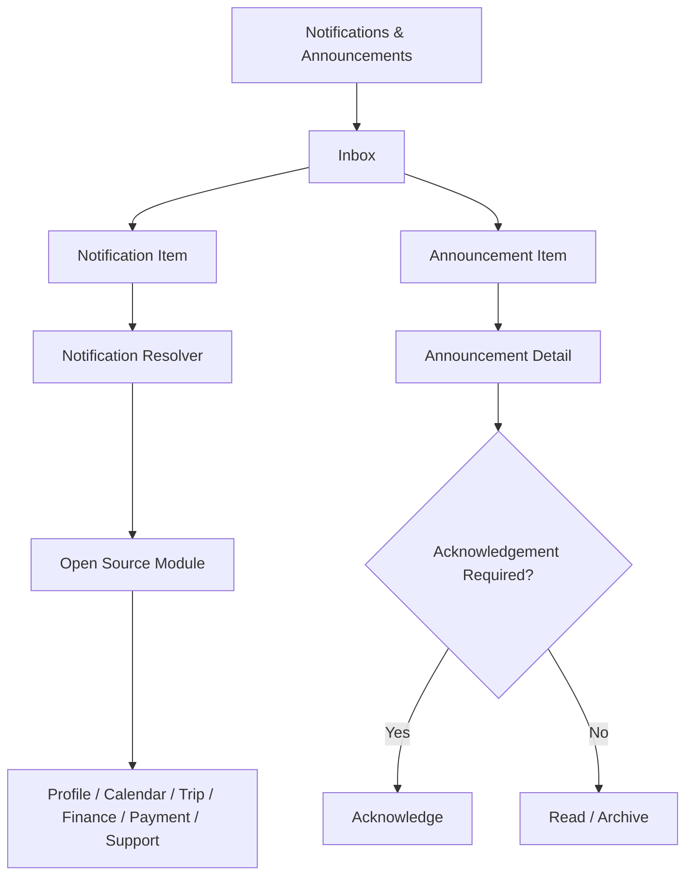
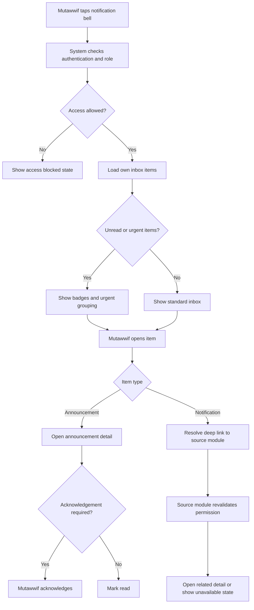
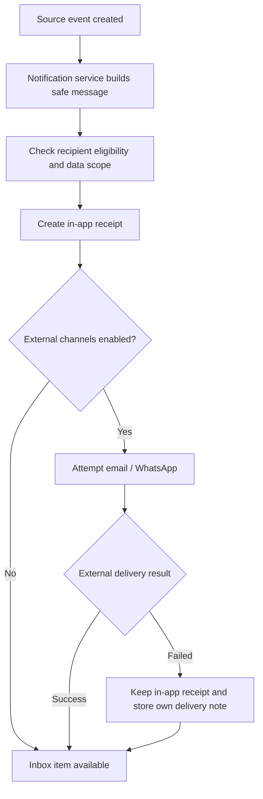

# MV PRD 10 - Notifications & Announcements

Product: UmrahHaji.com Mutawwif View  
Module: Notifications & Announcements  
Scope: Mutawwif Mobile Web App / Notification Inbox, Announcement Inbox, Read Status & Acknowledgement  
Platform: Mobile-first Responsive Web Platform  
Status: Draft  
Last Updated: 20 June 2026  

---

## 1. Objective

Notifications & Announcements is the mutawwif-facing communication inbox. It gives mutawwif one place to receive, read, filter, acknowledge, and open important updates from assigned trips, schedule changes, activity reminders, profile verification, finance status, payout destination status, reports/support, and targeted announcements from Admin or Travel Agency.

This module must help mutawwif answer:

1. What new update needs my attention?
2. Is this update about a trip, activity, profile, finance, payout, report, referral, or system?
3. Which announcement requires acknowledgement?
4. Which schedule or assignment changed?
5. Which message is urgent, important, or informational?
6. What should I open next after reading the notification?
7. Which notifications have been read, unread, archived, or acknowledged?
8. Which external channel failed but still has an in-app record?

This module is not a chat feature, not a report/case management module, and not an announcement creation workspace. Admin Panel and Travel Agency Portal create announcements. Source modules create transactional notifications. Mutawwif View receives and acts on them.

---

## 2. Relationship With Mutawwif View Master Scope

This module follows the Mutawwif View mobile web app scope:

1. Mutawwif can view only notifications and announcements targeted to their own account, assignment, profile, or assigned trip.
2. Mutawwif cannot create platform announcements, agency announcements, marketing campaigns, or broad messages.
3. Mutawwif can mark read, acknowledge where required, archive from own inbox, and open related context.
4. In-app inbox is the source of user-facing communication history even when email/WhatsApp delivery fails.
5. Notification preview must not expose sensitive jamaah, payment, bank, passport, internal Finance, internal Admin, or provider data.
6. Critical operational notices may remain visible in history even after expiry.
7. Every deep link must re-check permission and data scope before opening related module.

---

## 3. Relationship With Admin, Travel Agency, Jamaah, and Mutawwif PRDs

| Source Module | Relationship |
| --- | --- |
| Admin Announcement Management | Creates official platform announcements and targeted mutawwif announcements |
| Admin Mutawwif Management | Sends verification, revision, suspension, readiness, and assignment eligibility updates |
| Admin Group Trip Management | Sends platform-level trip, assignment, schedule, safety, and operational updates |
| Admin Finance / Allowance Management | Sends allowance, payout, finance review, reversal, and payout status notifications |
| Admin Report Management | Sends support/case status notifications and escalation updates |
| Travel Agency Announcements | Sends agency-owned group trip, briefing, document, payment, service, and assigned mutawwif updates |
| Travel Agency Mutawwif Assignment | Sends assignment request, accepted, replaced, cancelled, and handover notifications |
| Travel Agency Group Trip Management | Sends trip-specific schedule, hotel, flight, transport, and operational changes |
| Travel Agency Documents & Services | Sends document/service readiness reminders that affect assigned trip operations |
| Jamaah/User View Notifications | Provides user-facing notification/read/deep-link patterns for shared design consistency |
| MV PRD 03 - Profile, License & Verification | Produces profile, license, document, availability, and revision notifications |
| MV PRD 04 - Calendar & Schedule | Produces upcoming activity, schedule change, and conflict notifications |
| MV PRD 05 - My Group Trip & Trip Details | Produces trip alert, member/readiness, contact, and report handoff notifications |
| MV PRD 06 - Activity Guidance | Produces daily execution, preparation checklist, change acknowledgement, and issue handoff notifications |
| MV PRD 07 - Referral | Produces referral status and reward eligibility notifications |
| MV PRD 08 - Allowance & Tip | Produces balance release, withdrawal status, donation status, and finance issue notifications |
| MV PRD 09 - Payment Settings | Produces payout destination verification and sensitive change notifications |

### 3.1 Key Sync Rule

Notifications & Announcements is the recipient inbox, not the source of truth for the underlying event.

Source Event -> Notification / Announcement Delivery Record -> Mutawwif Inbox -> Deep Link to Source Module -> Source Module Revalidates Permission and Data.

If the source record changes, the inbox item may update status, link target, or safe summary, but must not expose data beyond mutawwif permission.

### 3.2 Announcement vs Transactional Notification

| Type | Created By | Example | Mutawwif Action |
| --- | --- | --- | --- |
| Announcement | Admin or Travel Agency | Group briefing update, safety notice, platform maintenance | Read, acknowledge if required, open linked context |
| Transactional Notification | System/source module | Withdrawal paid, schedule changed, document rejected | Read, open source detail, act in source module |
| Reminder | System/Admin/TA rule | Upcoming activity, document expiry, payout destination needed | Read, open task/detail |
| Alert | System/Admin/TA rule | Urgent safety update, assignment cancelled, trip schedule changed | Read, acknowledge if required, open urgent context |

Rules:

1. Announcement should not duplicate transactional notification for the same event unless Admin/TA explicitly sends broader context.
2. Transactional notification should be short and deep-link to the source module.
3. Announcement can include longer context, attachment, article link, or acknowledgement requirement.

---

## 4. Research Notes and Product Decisions

Notifications are easy to overuse. Mutawwif needs signal, not noise. Product decisions:

1. In-app inbox is required for every eligible notification/announcement.
2. Email and WhatsApp are supplemental channels and may fail without removing the in-app record.
3. Urgent and safety messages should be visually distinct but not overused.
4. Acknowledgement is reserved for high-impact operational, safety, compliance, or schedule-critical announcements.
5. Notification previews must use safe summaries and never reveal sensitive underlying data.
6. Read/unread, archive, acknowledge, and expiry are user-facing states and must not alter source event truth.
7. Status changes must be accessible to screen readers when shown dynamically.
8. Mobile touch targets must be large enough for one-handed field usage.
9. Personal data protection requires minimum necessary message content, masking, and scoped access.
10. Mutawwif should be able to filter by operational context: Trip, Activity, Profile, Finance, Payment Settings, Referral, Support, System.

Reference sources used as product direction:

1. W3C WCAG 2.2 - Status Messages: https://www.w3.org/WAI/WCAG22/Understanding/status-messages.html
2. W3C WCAG 2.2 - Target Size Minimum: https://www.w3.org/WAI/WCAG22/Understanding/target-size-minimum.html
3. Personal Data Protection Act 2010, Laws of Malaysia Act 709: https://lom.agc.gov.my/act-detail.php?type=principal&lang=BI&act=709

### 4.1 Research Validation Notes

| Research Area | Product Interpretation | Impact on This PRD |
| --- | --- | --- |
| Status messages | Important dynamic status changes should be programmatically determinable | New/unread, saved, acknowledged, failed, and filtered result messages should be accessible |
| Target size | Mobile controls need sufficient target size and spacing | Inbox actions, filters, mark read, acknowledge, and archive must be easy to tap |
| Personal data protection | Notification content may contain personal, operational, finance, or trip data | Use safe summaries, masking, and scoped deep links |
| Field usage | Mutawwif may read notifications while moving or coordinating groups | Prioritize compact list, urgent grouping, offline cached read-only inbox, and clear CTA |

### 4.2 Product Safety Rule

The inbox must not become a channel for uncontrolled sensitive data. Any message that needs sensitive detail should link to the correct source module where permission and masking can be enforced.

### 4.3 Channel Reliability Rule

In-app notification is the user-facing source of record. Email and WhatsApp are delivery attempts, not authoritative proof that mutawwif saw the message.

---

## 5. Scope

### 5.1 In Scope for Phase 1

1. Notification bell entry from top navbar.
2. Notification badge count.
3. Notifications & Announcements inbox.
4. Filter tabs: All, Urgent, Trips, Schedule, Profile, Finance, Support, System.
5. Read/unread state.
6. Announcement detail page.
7. Notification detail or deep-link resolver.
8. Required acknowledgement flow.
9. Archive from own inbox.
10. Mark one item as read.
11. Mark all as read.
12. Search by title, summary, trip name, reference, or source label.
13. Safe preview text.
14. Priority levels: Info, Important, Urgent.
15. Category labels.
16. Source module labels.
17. Related context display.
18. In-app delivery status visibility.
19. External channel delivery note when email/WhatsApp failed.
20. Empty, loading, error, offline states.
21. Deep links to PRD 03-09.
22. Audit logs for read/acknowledge/archive where required.
23. Mobile-first responsive behavior.

### 5.2 In Scope for Phase 2

1. Notification preferences by category.
2. Quiet hours controlled by user where policy allows.
3. Bulk archive.
4. Saved/pinned announcements.
5. Advanced grouping by trip/day.
6. Notification digest.
7. Push notification if native app/PWA push is approved.
8. Acknowledgement reminders.
9. Attachment preview inside announcement detail.
10. Translation/multi-language message rendering.
11. Advanced search/filter with date range.
12. Team/lead mutawwif acknowledgement dashboard if permitted.

### 5.3 Out of Scope

1. Creating announcements.
2. Sending announcements.
3. Editing sent announcement content.
4. Managing audience targeting.
5. Viewing delivery tracking for other recipients.
6. Admin/TA broadcast analytics.
7. Real-time chat.
8. Support case conversation thread.
9. Email provider configuration.
10. WhatsApp provider configuration.
11. Native mobile push implementation.
12. Marketing automation campaign management.
13. Exporting recipient delivery logs.

---

## 6. User Roles and Access

| Role | Access Behavior |
| --- | --- |
| Pending mutawwif | Can see onboarding/profile verification notifications if account access allows |
| Invited mutawwif | Can see invitation and activation notifications after authentication |
| Active mutawwif | Can view own notification inbox and targeted announcements |
| Verified mutawwif | Can view full operational notifications for assigned trips |
| Lead mutawwif | Can receive lead-specific trip and coordination announcements |
| Assistant mutawwif | Can receive assistant-scoped trip/activity announcements |
| Suspended mutawwif | Inbox may be read-only; operational deep links disabled where policy requires |
| Replaced mutawwif | Can see replacement notice and own historical notifications |
| Admin | Creates/monitors announcements from Admin Panel, not this module |
| Travel Agency staff | Creates agency announcements from TA Portal, not this module |

### 6.1 Visibility Rules

Mutawwif can see:

1. Own targeted notifications.
2. Announcements sent to own user, role, assigned trip, assigned group, or mutawwif segment.
3. Safe trip/activity context.
4. Safe finance status summary.
5. Masked payout destination label if included.
6. Read/acknowledgement status for own receipt.
7. External channel failure note for own delivery when useful.

Mutawwif must not see:

1. Other recipients.
2. Audience count if it exposes sensitive grouping.
3. Admin internal notes.
4. Travel Agency internal notes.
5. Delivery tracking for other users.
6. Jamaah private documents or payment data in preview.
7. Full bank/e-wallet destination.
8. Provider secrets, tokens, webhook IDs, or internal delivery logs.

### 6.2 Action Permission Rules

| Action | Mutawwif | Rule |
| --- | ---: | --- |
| View inbox | Permission-based | Own inbox only |
| View announcement detail | Yes | Only if targeted and still visible |
| View notification detail | Yes | Only if targeted and source permission passes |
| Mark read | Yes | Own receipt only |
| Mark all read | Yes | Own inbox only |
| Acknowledge | Yes | Required for selected announcement types |
| Archive | Yes | Own inbox visibility only, not source delete |
| Search/filter | Yes | Own inbox only |
| Open source detail | Yes | Source module revalidates permission |
| Create announcement | No | Admin/TA only |
| View audience list | No | Admin/TA only |
| Retry external delivery | No | Admin/TA/System only |
| Delete source event | No | Source owner only |

---

## 7. Entry Points

| Entry Point | Behavior |
| --- | --- |
| Top navbar bell | Opens Notifications & Announcements inbox |
| Home urgent card | Opens filtered urgent inbox |
| Bottom navigation Notifications | Opens inbox if added to bottom nav |
| Profile menu - Notifications | Opens inbox |
| Schedule changed toast | Opens schedule notification detail |
| Assignment notification | Opens assignment/trip detail after permission check |
| Profile verification notice | Opens PRD 03 related status |
| Withdrawal status notice | Opens PRD 08 transaction detail |
| Payout destination notice | Opens PRD 09 destination detail |
| Report update notice | Opens PRD 11 when available, or source support detail |
| Announcement acknowledgement prompt | Opens announcement detail with acknowledgement CTA |

---

## 8. Information Architecture

```text
Notifications & Announcements
+-- Inbox
|   +-- All
|   +-- Urgent
|   +-- Trips
|   +-- Schedule
|   +-- Profile
|   +-- Finance
|   +-- Support
|   +-- System
+-- Notification Detail / Resolver
|   +-- Safe Summary
|   +-- Related Context
|   +-- Open Source Action
+-- Announcement Detail
|   +-- Message Content
|   +-- Priority
|   +-- Related Context
|   +-- Attachment / Article Link
|   +-- Acknowledgement
+-- Inbox Actions
|   +-- Mark Read
|   +-- Mark All Read
|   +-- Archive
|   +-- Search / Filter
+-- Linked Modules
    +-- Profile & License
    +-- Calendar
    +-- My Group Trip
    +-- Activity Guidance
    +-- Referral
    +-- Allowance & Tip
    +-- Payment Settings
    +-- Reports & Support
```



---

## 9. Main User Flow



### 9.1 Delivery Flow From Source



---

## 10. Notification and Announcement Type Model

### 10.1 Inbox Item Types

| Item Type | Description | Example |
| --- | --- | --- |
| Transactional Notification | Event generated by source module | Withdrawal paid, document rejected, schedule changed |
| Announcement | Broadcast/targeted message from Admin or TA | Group briefing changed, safety notice |
| Reminder | Time-based reminder | Activity starts in 1 hour |
| Alert | Urgent/high-impact update | Trip schedule changed, assignment cancelled |
| System Notice | Account/security/platform notice | Password changed, maintenance |

### 10.2 Categories

| Category | Source Examples | Default Priority |
| --- | --- | --- |
| Trip | PRD 05, Admin/TA Group Trip | Important |
| Schedule | PRD 04, PRD 06 | Important |
| Activity | PRD 06 | Important |
| Assignment | TA Mutawwif Assignment, Admin Group Trip | Important |
| Profile | PRD 03, Admin Mutawwif Management | Info/Important |
| Finance | PRD 08, Admin/TA Finance | Important |
| Payment Settings | PRD 09 | Important |
| Referral | PRD 07 | Info |
| Support | Report Management | Important |
| Safety | Admin/TA Announcement | Urgent |
| System | Auth/User Management | Info |

### 10.3 Priority Levels

| Priority | Meaning | Visual Treatment | Rules |
| --- | --- | --- | --- |
| Info | Useful but not time-critical | Neutral badge | Can be archived/read normally |
| Important | Needs attention but not immediate emergency | Highlight badge | May appear near top |
| Urgent | Time-sensitive operational/safety issue | Strong badge and top grouping | Should not be hidden until read/acknowledged if policy requires |

### 10.4 Read and Acknowledgement State

| State | Meaning |
| --- | --- |
| Unread | Recipient has not opened item |
| Read | Recipient opened item/detail or marked read |
| Acknowledgement Required | Announcement requires explicit confirmation |
| Acknowledged | Recipient confirmed reading/understanding |
| Archived | Hidden from active inbox for that user |
| Expired | Visibility expired based on source/announcement settings |
| Source Unavailable | Source record no longer accessible or permission changed |

Rules:

1. Reading an acknowledgement-required announcement should not automatically acknowledge it.
2. Archive does not delete source record, delivery receipt, or audit log.
3. Source unavailable should show safe explanation and keep notification history if allowed.
4. Expired critical safety/compliance announcements may remain in history.

---

## 11. Screen 1 - Notification Inbox

### 11.1 Purpose

Show all user-targeted notifications and announcements in one mobile-first inbox.

### 11.2 Layout

| Section | Requirement |
| --- | --- |
| Header | `Notifications`, unread count, search icon |
| Quick Filter Tabs | All, Urgent, Trips, Schedule, Profile, Finance, Support, System |
| Urgent Group | Pinned urgent unread/ack-required items |
| Inbox List | Notification/announcement cards |
| Bulk Action | Mark all read |
| Empty State | No notifications |
| Offline State | Cached read-only list |

### 11.3 Inbox Item Card

| Element | Requirement |
| --- | --- |
| Icon | Category/source icon |
| Title | Short title, max 2 lines |
| Summary | Safe preview text, max 2-3 lines |
| Source Label | Trip, Schedule, Profile, Finance, System, etc. |
| Priority Badge | Info, Important, Urgent |
| Unread Dot | Visible for unread |
| Time | Relative time and absolute date in detail |
| Related Context | Trip name/activity/reference if safe |
| Action Hint | `View trip`, `Acknowledge`, `View withdrawal`, etc. |

### 11.4 List Rules

1. Urgent unread items appear at top.
2. Acknowledgement-required unread announcements appear before ordinary items.
3. Read items remain visible until archived or expired.
4. Archived items are hidden from active inbox but can be shown in history if enabled.
5. Infinite scroll or pagination must preserve filter/search state.
6. Badge count includes unread active items only, unless policy includes ack-required items separately.

---

## 12. Screen 2 - Announcement Detail

### 12.1 Purpose

Show full announcement content from Admin or Travel Agency and allow acknowledgement when required.

### 12.2 Layout

| Section | Requirement |
| --- | --- |
| Header | Back navigation and category/priority |
| Title | Announcement title |
| Sender | Platform/Admin or Travel Agency name where safe |
| Sent Time | Sent at and timezone |
| Message Content | Plain/rich text sanitized for display |
| Related Context | Group trip, activity, profile, finance, article, report if linked |
| Attachments | Safe attachment preview/link if recipient has permission |
| Acknowledgement | Required acknowledgement checkbox/button if configured |
| Actions | Open context, Mark unread/read, Archive |

### 12.3 Acknowledgement Rules

1. Required acknowledgement must use explicit action, not passive page view.
2. The CTA should be clear: `Acknowledge`.
3. If acknowledgement is required, show why it matters in safe copy.
4. Acknowledgement action must be audit logged.
5. If offline, acknowledgement is disabled unless offline queue is approved in Phase 2.
6. If source announcement was revoked/expired, show unavailable state and acknowledgement disabled.

Recommended acknowledgement copy:

```text
I have read and understood this announcement.
```

---

## 13. Screen 3 - Notification Detail / Deep-Link Resolver

### 13.1 Purpose

For transactional notifications, the detail page resolves the target module safely and avoids broken links.

### 13.2 Resolver Behavior

| Scenario | Behavior |
| --- | --- |
| Source accessible | Open related module/detail |
| Source requires re-auth | Prompt re-auth, then open source |
| Source permission removed | Show safe unavailable state |
| Source deleted/archived | Show history-safe unavailable state |
| Source offline | Show cached summary if available and retry |
| Source in future PRD | Show placeholder support state or disable link |

### 13.3 Common Detail Fields

| Field | Example |
| --- | --- |
| Title | Withdrawal Paid |
| Safe Summary | Your withdrawal request has been marked paid. |
| Source Module | Allowance & Tip |
| Related Reference | WTH64841324 |
| Priority | Important |
| Created At | 20 Jun 2026, 10:00 AM |
| CTA | View Withdrawal |

Rules:

1. Deep link must not trust notification payload.
2. Source module must re-fetch the related record server-side.
3. If source module denies access, show a safe error and provide support link where appropriate.

---

## 14. Screen 4 - Search, Filter, and History

### 14.1 Search

Search fields:

1. Title.
2. Safe summary.
3. Source label.
4. Trip name.
5. Activity name.
6. Reference ID.

Search must not search hidden sensitive data.

### 14.2 Filters

| Filter | Options |
| --- | --- |
| Category | Trip, Schedule, Activity, Assignment, Profile, Finance, Referral, Support, System |
| Priority | Info, Important, Urgent |
| Read State | Unread, Read, Acknowledgement Required, Acknowledged |
| Item Type | Notification, Announcement, Reminder, Alert |
| Date | Today, Last 7 Days, Last 30 Days, Custom P2 |
| Source Module | PRD 03-09, Admin, Travel Agency, System |

### 14.3 History

Phase 1 may keep history inside the main inbox using filters. A separate Archived/History tab is Phase 2 unless required by compliance.

---

## 15. Notification Sources and Deep Links

| Source | Event | Inbox Category | Deep Link |
| --- | --- | --- | --- |
| PRD 03 Profile | Document rejected | Profile | Profile document detail |
| PRD 03 Profile | License expiring | Profile | License section |
| PRD 03 Profile | Verification approved | Profile | Profile overview |
| PRD 04 Calendar | Schedule changed | Schedule | Changed activity detail |
| PRD 04 Calendar | Upcoming activity | Schedule | Activity detail |
| PRD 04 Calendar | Assignment conflict | Schedule | Conflict detail |
| PRD 05 Trip | New assigned trip | Trip | Trip detail |
| PRD 05 Trip | Hotel/flight/transport changed | Trip | Trip logistics tab |
| PRD 05 Trip | Announcement targeted to trip | Trip | Announcement detail |
| PRD 06 Activity | Activity updated | Activity | Activity guidance detail |
| PRD 06 Activity | Activity issue response | Support | Report/support detail when available |
| PRD 07 Referral | Referral reward eligible | Referral | Referral detail |
| PRD 08 Allowance & Tip | Balance released | Finance | Balance source detail |
| PRD 08 Allowance & Tip | Withdrawal status changed | Finance | Withdrawal detail |
| PRD 09 Payment Settings | Destination verified/rejected | Payment Settings | Destination detail |
| Report Management | Case updated | Support | Report detail |
| Admin Announcement | Safety notice | Safety/System | Announcement detail |
| TA Announcement | Group trip update | Trip/Schedule | Announcement detail or trip detail |

---

## 16. Announcement Handling

### 16.1 Supported Announcement Types

| Type | Owner | Mutawwif Behavior |
| --- | --- | --- |
| Platform Notice | Admin | Read-only, may require acknowledgement |
| Group Trip Update | Admin/TA | Read-only, opens trip/activity context |
| Safety / Compliance Notice | Admin/TA with permission | Read-only, acknowledgement recommended |
| Assignment Coordination | TA/Admin | Opens assignment/trip context |
| Finance Notice | Admin/TA Finance | Opens finance or payout detail if targeted |
| Document / Service Notice | TA/Admin | Opens trip readiness or support context |
| Article / Guidance Notice | Admin/TA | Opens Knowledge Base/Article when available |
| Feedback Request | Admin/TA/System | Opens feedback flow when future PRD exists |

### 16.2 Announcement Rules

1. Platform announcements are read-only.
2. Agency announcements are read-only for mutawwif.
3. Sent announcement content is immutable from recipient perspective.
4. Correction must appear as a new announcement.
5. If announcement expires, it can be hidden from active inbox but retained in history based on policy.
6. Acknowledgement state belongs to each recipient.
7. Mutawwif cannot see delivery/read status of other recipients.

---

## 17. Channel and Badge Rules

### 17.1 Channels

| Channel | Phase 1 Behavior |
| --- | --- |
| In-App | Required default channel and source of inbox history |
| Email | Supplemental if enabled and verified email exists |
| WhatsApp | Supplemental if enabled and verified phone exists |
| SMS | Out of scope unless configured later |
| Push Notification | Out of scope until native app/PWA push is approved |

### 17.2 Badge Count

Badge count should include:

1. Unread active in-app notifications.
2. Unread active announcements.
3. Acknowledgement-required items not yet acknowledged.

Badge count should exclude:

1. Archived items.
2. Expired non-critical items.
3. Items the user no longer has permission to view.

### 17.3 External Delivery Note

If email/WhatsApp delivery fails, mutawwif can still see the in-app item. The UI may show a safe note only when useful:

```text
This message is available in-app. External delivery may be delayed.
```

Do not show provider error codes to mutawwif.

---

## 18. Data Requirements

### 18.1 Inbox Item Summary

```text
InboxItemSummary
+-- inboxItemId
+-- recipientUserId
+-- mutawwifId
+-- itemType
+-- category
+-- priority
+-- title
+-- safeSummary
+-- sourceModule
+-- sourceRecordId
+-- relatedContextType
+-- relatedContextId
+-- relatedContextLabel
+-- readStatus
+-- acknowledgementStatus
+-- createdAt
+-- visibleUntil
+-- deepLink
```

### 18.2 Announcement Receipt

```text
AnnouncementReceipt
+-- receiptId
+-- announcementId
+-- recipientUserId
+-- mutawwifId
+-- title
+-- contentSafeHtml
+-- senderType
+-- senderLabel
+-- priority
+-- category
+-- acknowledgementRequired
+-- acknowledgedAt
+-- readAt
+-- archivedAt
+-- relatedContextType
+-- relatedContextId
+-- attachments[]
```

### 18.3 Notification Receipt

```text
NotificationReceipt
+-- notificationId
+-- recipientUserId
+-- mutawwifId
+-- sourceModule
+-- sourceRecordId
+-- eventType
+-- title
+-- safeSummary
+-- category
+-- priority
+-- readAt
+-- archivedAt
+-- deliveryChannels[]
+-- createdAt
```

### 18.4 Delivery Channel Summary

```text
DeliveryChannelSummary
+-- channel
+-- status
+-- attemptedAt
+-- deliveredAt
+-- safeFailureReason
```

Safe failure reasons only:

1. Channel unavailable.
2. Contact not verified.
3. Delivery delayed.
4. Provider unavailable.
5. User channel preference disabled, where policy allows.

Do not expose raw provider response, phone number, email bounce detail, webhook ID, or internal delivery token.

---

## 19. Empty, Loading, Error, and Offline States

| State | Behavior |
| --- | --- |
| Loading inbox | Show skeleton cards |
| No notifications | Show calm empty state |
| No filtered result | Show reset filters CTA |
| Offline | Show cached inbox read-only and disable acknowledge/archive if server sync is required |
| Failed to load | Show retry and support reference |
| Source unavailable | Show safe unavailable state and keep item readable if allowed |
| Permission changed | Hide sensitive detail and show permission-safe message |
| Announcement expired | Show expired state or hide based on policy |
| Acknowledgement failed | Keep acknowledgement pending and allow retry |
| Mark read failed | Keep local state consistent after server response |
| External channel failed | Keep in-app item available |

---

## 20. Notifications and Reminders Generated by This Module

This module mainly receives notifications. It may generate internal user-facing status messages for:

1. Mark all read completed.
2. Acknowledgement submitted.
3. Archive completed.
4. Filter result count.
5. Failed action retry state.

Accessibility rule:

Dynamic status messages should be announced to assistive technology using appropriate roles/properties where supported.

---

## 21. Permissions, Privacy, and Security

### 21.1 Permission Logic

This module follows the shared permission model:

Portal Access -> Role -> Permission Group -> Module Permission -> Action Permission -> Data Scope.

| Permission | Purpose |
| --- | --- |
| mutawwif.notifications.view | View own inbox |
| mutawwif.notifications.detail.view | View own notification/announcement detail |
| mutawwif.notifications.read.update | Mark own items read/unread |
| mutawwif.notifications.acknowledge | Acknowledge own required announcement |
| mutawwif.notifications.archive | Archive own inbox item |
| mutawwif.notifications.search | Search own inbox |
| mutawwif.notifications.deep_link.open | Open source module with revalidation |
| mutawwif.notifications.history.view | View archived/history items if enabled |

### 21.2 Data Scope

| Data | Scope Rule |
| --- | --- |
| Inbox item | `recipient_user_id` must match authenticated user |
| Announcement receipt | Recipient-scoped copy only |
| Notification receipt | Recipient-scoped copy only |
| Source record | Source module revalidates permission |
| Delivery status | Own delivery summary only |
| Audit log | Admin/TA/System visible based on permission; mutawwif sees only own user-facing state |

### 21.3 Privacy Rules

1. Previews must use safe summary text.
2. Sensitive detail should live in source module, not notification payload.
3. Do not include raw jamaah document, passport, payment, or bank data in notification preview.
4. Do not expose other recipient names or delivery status.
5. Do not expose internal Admin/TA notes.
6. Do not expose provider delivery error payloads.
7. If a notification references a removed/unavailable record, show safe explanation.

### 21.4 Security Rules

1. Deep link must be treated as pointer only, not permission.
2. Backend must validate ownership before returning inbox items.
3. Acknowledgement must be server-side and auditable.
4. Archive must affect only user's inbox receipt.
5. Client-side read state must sync with server.
6. Notification payload must not contain secrets or raw sensitive data.

---

## 22. Audit and Activity Logs

Audit logs should be created for:

1. Acknowledgement submitted.
2. Required acknowledgement missed past due date, if enabled.
3. Item archived.
4. Sensitive notification opened, if policy requires.
5. Deep link opened to sensitive module, if policy requires.
6. Notification visibility changed by source status.
7. Announcement expired/hidden from recipient inbox.

### 22.1 Audit Fields

| Field | Description |
| --- | --- |
| audit_id | Unique log ID |
| actor_user_id | Mutawwif user |
| mutawwif_id | Mutawwif profile |
| inbox_item_id | Inbox item |
| source_module | Admin Announcement, TA Announcement, PRD 03-09, System |
| source_record_id | Related record |
| action_type | read, acknowledge, archive, open_deep_link |
| previous_value | Safe previous value |
| new_value | Safe new value |
| timestamp | Server time |
| device_id | If security policy allows |

---

## 23. Analytics Events

| Event | Trigger |
| --- | --- |
| notification_inbox_opened | Mutawwif opens inbox |
| notification_filter_selected | Mutawwif changes filter |
| notification_search_used | Mutawwif searches inbox |
| notification_item_opened | Mutawwif opens item |
| notification_deep_link_opened | Mutawwif opens related module |
| announcement_opened | Mutawwif opens announcement |
| announcement_acknowledged | Mutawwif acknowledges |
| notification_mark_read | Mutawwif marks read |
| notification_mark_all_read | Mutawwif marks all read |
| notification_archived | Mutawwif archives item |
| notification_source_unavailable | Source could not open |

Analytics must not include sensitive personal data, raw message content, full account number, passport number, or internal notes.

---

## 24. Functional Requirements

| ID | Requirement | Priority |
| --- | --- | --- |
| MV-NOTIF-001 | System shall show notification bell for authenticated mutawwif users. | P1 |
| MV-NOTIF-002 | System shall show unread badge count based on own active inbox items. | P1 |
| MV-NOTIF-003 | System shall provide Notifications & Announcements inbox. | P1 |
| MV-NOTIF-004 | System shall show only recipient-scoped notifications and announcements. | P1 |
| MV-NOTIF-005 | System shall support filter tabs by category. | P1 |
| MV-NOTIF-006 | System shall support search over safe inbox fields. | P1 |
| MV-NOTIF-007 | System shall display notification item cards with title, safe summary, category, priority, source, and time. | P1 |
| MV-NOTIF-008 | System shall display read/unread state. | P1 |
| MV-NOTIF-009 | System shall allow mutawwif to mark one item as read. | P1 |
| MV-NOTIF-010 | System shall allow mutawwif to mark all active items as read. | P1 |
| MV-NOTIF-011 | System shall allow mutawwif to archive own inbox item. | P1 |
| MV-NOTIF-012 | System shall show announcement detail for targeted announcements. | P1 |
| MV-NOTIF-013 | System shall support acknowledgement-required announcements. | P1 |
| MV-NOTIF-014 | System shall audit acknowledgement actions. | P1 |
| MV-NOTIF-015 | System shall resolve notification deep links through source module permission revalidation. | P1 |
| MV-NOTIF-016 | System shall show source unavailable state if linked record cannot be opened. | P1 |
| MV-NOTIF-017 | System shall keep in-app record available even if email/WhatsApp delivery fails. | P1 |
| MV-NOTIF-018 | System shall avoid exposing sensitive data in notification preview. | P1 |
| MV-NOTIF-019 | System shall support priority levels Info, Important, and Urgent. | P1 |
| MV-NOTIF-020 | System shall pin urgent unread or acknowledgement-required items above normal items. | P1 |
| MV-NOTIF-021 | System shall show empty, loading, error, offline, expired, and permission-changed states. | P1 |
| MV-NOTIF-022 | System shall support accessibility-friendly status messages for dynamic actions. | P1 |
| MV-NOTIF-023 | System shall log sensitive read/open/archive actions where policy requires. | P1 |
| MV-NOTIF-024 | System shall prevent mutawwif from viewing other recipient delivery status. | P1 |
| MV-NOTIF-025 | System shall keep announcement creation, targeting, delivery retry, and analytics out of Mutawwif View. | P1 |

---

## 25. Acceptance Criteria

1. Mutawwif can open inbox from the notification bell.
2. Inbox shows only notifications and announcements targeted to the logged-in mutawwif.
3. Unread badge count updates after item is read.
4. Mutawwif can filter inbox by major categories.
5. Mutawwif can search by safe text fields.
6. Urgent unread items appear before normal items.
7. Announcement detail displays sender, title, content, priority, time, and related context.
8. Required acknowledgement cannot be completed by page view alone.
9. Acknowledgement action is saved and audit logged.
10. Transactional notification opens source module only after source permission revalidation.
11. If source is unavailable, user sees a safe unavailable state.
12. Mark all read affects own inbox only.
13. Archive hides item from own active inbox only.
14. Email/WhatsApp failure does not remove in-app notification.
15. Notification preview does not expose full bank/e-wallet, passport, jamaah private document, payment detail, or internal notes.
16. Mobile layout works from 320px width.

---

## 26. Dependencies

| Dependency | Impact |
| --- | --- |
| Authentication / User Management | Login, account status, role, portal access |
| Notification Service | Delivery records, badge count, channels |
| Admin Announcement Management | Platform announcement source |
| Travel Agency Announcements | Agency announcement source |
| Mutawwif Profile | Profile, verification, license events |
| Calendar & Schedule | Schedule and reminder events |
| My Group Trip | Trip, logistics, member/readiness events |
| Activity Guidance | Daily execution and issue events |
| Referral | Referral/reward events |
| Allowance & Tip | Finance status events |
| Payment Settings | Payout destination events |
| Report Management | Support/case events |
| Audit Log Service | Read/ack/archive/deep-link audit |

---

## 27. Open Questions

1. Should Notifications become a bottom navigation tab, or remain top-bell plus Profile menu only?
2. Should mutawwif be allowed to mark an acknowledgement-required announcement unread after acknowledging?
3. Should archived notifications be visible in Phase 1 history?
4. What retention period applies to mutawwif notification history?
5. Which urgent categories may bypass quiet hours for email/WhatsApp?
6. Should lead mutawwif see acknowledgement status of assistant mutawwif for trip-critical announcements in Phase 2?
7. Should notification preferences live in PRD 10 or PRD 16 Account Settings?
8. Should safety/compliance announcements remain permanently visible in history?

---

## 28. Future Enhancements

1. Notification preferences by category.
2. Quiet hours.
3. Digest summary.
4. Pin/save important announcements.
5. Advanced date range filtering.
6. Separate archived/history tab.
7. Push notification if PWA/native app is approved.
8. Multi-language message rendering.
9. Offline acknowledgement queue.
10. Lead mutawwif team acknowledgement view.
11. Smart grouping by trip/day.
12. Attachment preview and document viewer for permitted announcements.

---

## 29. Final Product Decision

PRD 10 Notifications & Announcements should be the central mutawwif inbox for communication, not a sending tool.

The final Phase 1 product should include:

1. Notification bell and unread badge.
2. Central inbox.
3. Filter tabs and safe search.
4. Notification and announcement item cards.
5. Announcement detail with acknowledgement.
6. Transactional notification deep-link resolver.
7. Read/unread, mark all read, and archive.
8. Urgent and acknowledgement-required grouping.
9. Safe previews and privacy rules.
10. In-app record preserved even when external channels fail.
11. Audit logs for acknowledgement and sensitive actions.
12. Cross-module links to PRD 03-09.

The product boundary is:

1. Admin and Travel Agency create announcements.
2. Source modules create transactional notifications.
3. Mutawwif reads, acknowledges, archives, and opens related context.
4. Reports & Support remains a separate PRD for case handling.
5. Account Settings should own broad notification preferences unless PRD 10 is explicitly expanded.

This keeps Mutawwif View focused, mobile-first, auditable, and aligned with Admin, Travel Agency, Jamaah, and existing Mutawwif PRDs.
