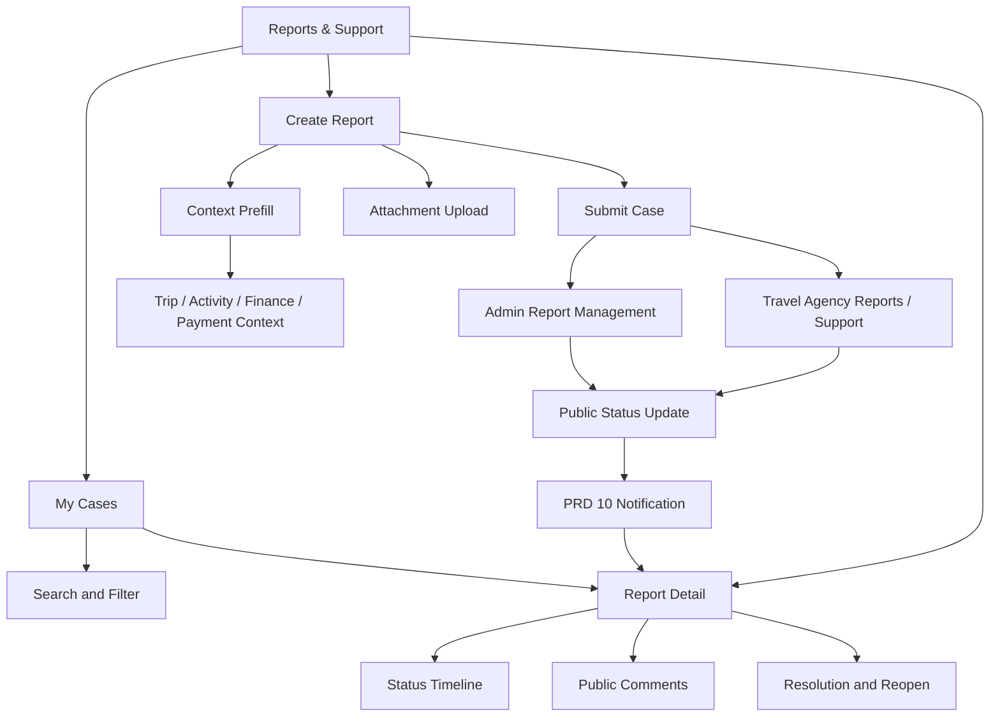
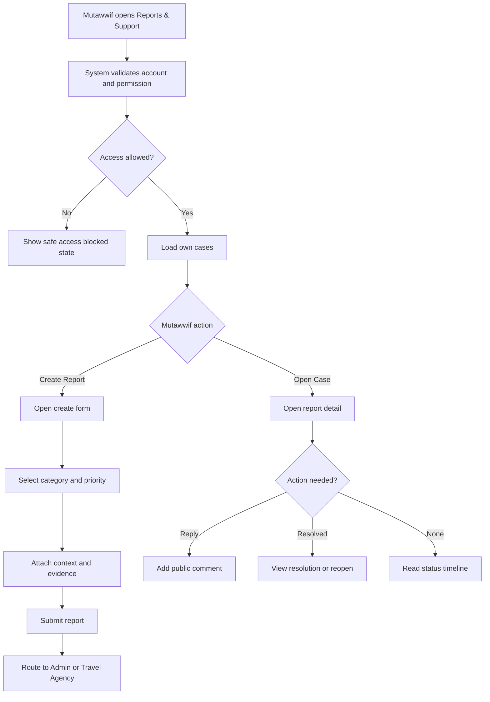
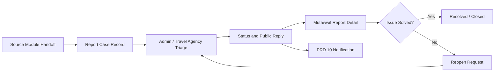

# MV PRD 11 - Reports & Support

Product: UmrahHaji.com Mutawwif View  
Module: Reports & Support  
Scope: Mutawwif Mobile Web App / Issue Reporting, Support Case Tracking, Evidence & Resolution  
Platform: Mobile-first Responsive Web Platform  
Status: Draft  
Last Updated: 20 June 2026  

---

## 1. Objective

Reports & Support is the mutawwif-facing case center. It allows mutawwif to create support reports, attach evidence, track case status, reply to follow-up questions, view resolution notes, and reopen eligible resolved cases from one mobile-first workspace.

This module must help mutawwif answer:

1. Where do I report an issue related to my assigned trip, jamaah, activity, allowance, tip, payout settings, referral, profile, or platform access?
2. Which support case is still waiting for Admin, Travel Agency, or my response?
3. What evidence or attachment has already been submitted?
4. What is the latest safe status and resolution note?
5. Which case is urgent and needs immediate attention?
6. Can I reopen a resolved case because the issue is not actually solved?
7. Which module should I open after a case update?
8. Which support details are visible to me and which are internal to Admin or Travel Agency?

This module is not live chat, not an Admin triage dashboard, not a Travel Agency helpdesk workspace, and not a legal dispute engine. It is a structured support and report submission module for mutawwif, while triage, assignment, internal notes, escalation, and final operational handling remain owned by Admin Panel and Travel Agency Portal.

---

## 2. Relationship With Mutawwif View Master Scope

This module follows the Mutawwif View mobile web app scope:

1. Mutawwif can create and view only reports within their own account, assigned trip, assigned activity, or permitted finance/referral/profile context.
2. Mutawwif cannot view other mutawwif reports unless explicitly assigned as part of a lead/assistant workflow in a future phase.
3. Mutawwif cannot access Admin internal notes, internal assignment, internal risk labels, fraud review, legal notes, or provider-only evidence.
4. Mutawwif can reply to public follow-up questions and upload evidence only for reports they are allowed to access.
5. Mutawwif can reopen only eligible resolved reports within policy limits.
6. Reports can be created from direct module entry or contextual handoff from PRD 05, PRD 06, PRD 08, PRD 09, PRD 10, and related future modules.
7. Every deep link must re-check permission and data scope before opening the report or related source module.

Reports & Support is P1 because Admin Report Management and Travel Agency Reports / Support already expect mutawwif-originated operational cases, but Mutawwif View needs a safe, scoped, mobile-friendly way to submit and track them.

---

## 3. Relationship With Admin, Travel Agency, Jamaah, and Mutawwif PRDs

| Source Module | Relationship |
| --- | --- |
| Admin Report Management | Source of truth for triage, status, priority, assignment, internal notes, resolution, reopening policy, and audit |
| Admin Group Trip Management | Receives trip, jamaah, schedule, service, transport, hotel, safety, and operational issue context |
| Admin Mutawwif Management | Receives profile, license, verification, suspension, readiness, and compliance report context |
| Admin Finance / Allowance Management | Receives allowance, tip, withdrawal, payout failure, reversal, and finance support context |
| Admin User Management | Controls role, permission, session, account status, and sensitive access policy |
| Travel Agency Reports / Support | Receives agency-scoped cases involving assigned trip, itinerary, briefing, service, staff coordination, and jamaah support |
| Travel Agency Group Trip Management | Provides trip, package, jamaah readiness, flight, hotel, transport, itinerary, and assignment context |
| Travel Agency Mutawwif Assignment | Provides assignment status, lead/assistant role, replacement, and handover context |
| Jamaah/User View Reports | Provides shared status, evidence, and report visibility pattern for cross-role consistency |
| MV PRD 03 - Profile, License & Verification | Can open report flow for verification rejection, license issue, profile access, or compliance clarification |
| MV PRD 04 - Calendar & Schedule | Can open report flow for schedule conflict, missing assignment, duplicate event, or calendar issue |
| MV PRD 05 - My Group Trip & Trip Details | Can open trip-scoped Report Issue handoff with group trip and assignment context |
| MV PRD 06 - Activity Guidance | Can open activity-scoped Report Issue handoff with daily itinerary, checkpoint, and execution context |
| MV PRD 07 - Referral | Can open referral reward, referral attribution, or referral status support case |
| MV PRD 08 - Allowance & Tip | Can open finance case for allowance, tip, withdrawal, donation, balance, or transaction discrepancy |
| MV PRD 09 - Payment Settings | Can open payout destination, verification, masking, bank/e-wallet, or sensitive change support case |
| MV PRD 10 - Notifications & Announcements | Receives report status notifications and deep-links back to report detail |

### 3.1 Key Sync Rule

Reports & Support is the mutawwif entry and tracking surface, not the operational owner of resolution.

Report Issue Handoff / Manual Create -> Report Case Record -> Admin / Travel Agency Triage -> Status, Priority, Public Reply, Resolution -> Mutawwif Case Tracking -> Notification Update.

If Admin or Travel Agency changes status, priority, visible comment, or resolution note, Mutawwif View updates the case detail and PRD 10 notification inbox. If the source trip/activity/finance record changes, the report retains a context snapshot and links to the latest permitted source detail.

### 3.2 Cross-Role Boundary

| Role / Surface | Owns | Can Mutawwif View Display? | PRD 11 Rule |
| --- | --- | --- | --- |
| Admin Report Management | Triage, assignment, internal notes, priority, status, escalation, resolution | Yes, only public status, public comments, public resolution | Never expose internal notes or internal assignee |
| Travel Agency Reports / Support | Agency-scoped response and trip coordination follow-up | Yes, only agency-public reply and safe agency status | Respect agency and trip scope |
| Admin Finance | Finance investigation, payout provider status, reversal, manual disbursement | Yes, only safe case summary/status | Do not expose internal finance review |
| Admin Mutawwif Management | Profile, verification, compliance, suspension handling | Yes, safe reason and next action | Do not expose internal compliance scoring |
| Travel Agency Group Trip | Trip itinerary, jamaah readiness, flight, hotel, service operations | Yes, assigned trip context | Do not expose unassigned jamaah or other trips |
| Mutawwif View | Create report, add public reply, attach evidence, track status, reopen eligible case | Yes | Own-user data scope only |
| Jamaah/User View | Jamaah-originated reports and user support | No, unless case specifically involves assigned mutawwif and is shared safely | Do not expose jamaah private support history |

### 3.3 Boundary With PRD 05-10

| Area | Source Module | PRD 11 Behavior |
| --- | --- | --- |
| Trip assignment issue | PRD 05 | Prefill trip, group, assignment role, departure date, and agency context |
| Activity execution issue | PRD 06 | Prefill activity, day, time, checkpoint, and itinerary item context |
| Referral issue | PRD 07 | Prefill referral code, referral status, reward status, and safe referral reference |
| Allowance/tip/withdrawal issue | PRD 08 | Prefill transaction reference, balance type, status, and masked amount context where allowed |
| Payout destination issue | PRD 09 | Prefill destination type/status and masked destination label only |
| Notification case update | PRD 10 | Deep-link to report detail after permission revalidation |
| Report status notification | PRD 10 | Creates transactional notification when public case status changes |

---

## 4. Research Notes and Product Decisions

Reports & Support handles operational incidents, personal data, attachments, finance references, and potentially urgent safety signals. Product decisions:

1. Reports must be structured cases, not free-form chat.
2. The report form should support contextual prefill so mutawwif does not need to retype trip, activity, finance, or payout details.
3. Urgent issues should be allowed, but priority escalation must be reviewed by Admin or Travel Agency to prevent misuse.
4. Mutawwif-facing status must be simplified while internal status remains richer in Admin/TA surfaces.
5. Attachments must use allowlisted file types, file size limits, permission checks, safe filenames, and scanning policy.
6. Case comments must separate public participant replies from internal notes.
7. Dynamic status changes, submission success, validation errors, upload progress, and search/filter results must be accessible.
8. Mobile controls for create, reply, attachment, status filter, and reopen must be easy to tap during field use.
9. Report previews and notification previews must use safe summaries and avoid sensitive details.
10. Personal data protection requires minimum necessary collection, scoped visibility, retention policy, and audit logs.

Reference sources used as product direction:

1. W3C WCAG 2.2 - Status Messages: https://www.w3.org/WAI/WCAG22/Understanding/status-messages.html
2. W3C WCAG 2.2 - Target Size Minimum: https://www.w3.org/WAI/WCAG22/Understanding/target-size-minimum.html
3. OWASP File Upload Cheat Sheet: https://cheatsheetseries.owasp.org/cheatsheets/File_Upload_Cheat_Sheet.html
4. Personal Data Protection Act 2010, Laws of Malaysia Act 709: https://lom.agc.gov.my/act-detail.php?type=principal&lang=BI&act=709

### 4.1 Research Validation Notes

| Research Area | Product Interpretation | Impact on This PRD |
| --- | --- | --- |
| Status messages | Important dynamic updates should be programmatically determinable | Submission, upload, comment sent, status update, reopen result, and validation errors need accessible feedback |
| Target size | Mobile controls need sufficient size or spacing | Filters, tabs, attachment delete, submit, reply, and reopen controls must be comfortable on mobile |
| Secure file upload | User uploads can carry malicious files or expose personal data | Allowlist file types, limit size, generate safe filenames, scan uploads, and enforce access checks |
| Personal data protection | Reports can include trip, jamaah, finance, and identity details | Collect minimum data, mask sensitive fields, restrict visibility, and audit access/actions |
| Field operations | Mutawwif may report while coordinating a group under time pressure | Use short form, contextual prefill, save draft, urgent priority, and clear next steps |

### 4.2 Support Safety Rule

Reports & Support must not expose sensitive source details just because a case exists. The report detail can show only the context and evidence that the mutawwif is allowed to see. Any deeper investigation detail must remain in Admin Panel or Travel Agency Portal.

### 4.3 Attachment Safety Rule

Evidence upload must be treated as sensitive and potentially unsafe. The system must not trust file extension, original filename, or browser-provided content type as the only validation source.

---

## 5. Scope

### 5.1 In Scope for Phase 1

1. Reports & Support dashboard.
2. My Cases list.
3. Create Report form.
4. Contextual Report Issue handoff from PRD 05, PRD 06, PRD 08, PRD 09, and PRD 10.
5. Support category selection.
6. Priority selection: Normal, Important, Urgent.
7. System-suggested priority based on category and context.
8. Related context selection or prefilled context snapshot.
9. Report title and description.
10. Attachment upload for evidence.
11. Attachment preview/download if permission allows.
12. Report detail page.
13. Public comments and replies.
14. Status timeline.
15. Resolution note display.
16. Reopen eligible resolved report.
17. Archive/hide case from own list where policy allows.
18. Search and filter by status, category, priority, source module, and trip.
19. Empty, loading, error, offline, and upload failure states.
20. Notification integration with PRD 10.
21. Audit logs for create, view sensitive case, comment, attachment upload, reopen, archive.
22. Mobile-first responsive behavior.

### 5.2 In Scope for Phase 2

1. SLA countdown and overdue labels.
2. Saved report drafts for offline or poor network use.
3. Satisfaction survey after closure.
4. Advanced escalation request.
5. Lead mutawwif team case view if policy allows.
6. Case assignment handover when mutawwif is replaced.
7. Voice note or video evidence upload if storage/security policy allows.
8. Auto-summary for long case threads.
9. Case export for mutawwif personal record.
10. Multi-language support templates.
11. Help article recommendations based on category.
12. In-app guided troubleshooting before submission.

### 5.3 Out of Scope

1. Admin triage dashboard.
2. Travel Agency support dashboard.
3. Creating Admin internal notes.
4. Viewing Admin internal notes.
5. Viewing internal assignee or internal escalation chain.
6. Legal dispute management.
7. Refund approval.
8. Payout approval.
9. Withdrawal execution.
10. Assignment change execution.
11. Trip/package/jamaah data editing.
12. Live chat.
13. Voice/video call support.
14. Public complaint forum.
15. Knowledge base authoring.
16. Provider settlement or gateway investigation workspace.
17. Full audit export for external roles.

---

## 6. User Roles and Access

| Role | Access Behavior |
| --- | --- |
| Pending mutawwif | Can create/view account onboarding or profile-related support cases if account access allows |
| Invited mutawwif | Can report invitation or activation issue after authentication |
| Active mutawwif | Can create and view own support cases |
| Verified mutawwif | Can create trip/activity/finance/payout/referral cases based on active permissions |
| Lead mutawwif | Can create own cases and lead-scoped trip cases; cannot view assistant private cases unless future policy allows |
| Assistant mutawwif | Can create own cases for assigned trip/activity only |
| Suspended mutawwif | May view own historical cases read-only; create/reply may be restricted except suspension appeal/support |
| Replaced mutawwif | Can view own historical cases and replacement-related notices; cannot report as active assignee for removed scope |
| Admin | Handles triage in Admin Panel, not this module |
| Travel Agency staff | Handles agency-scoped response in TA Portal, not this module |

### 6.1 Visibility Rules

Mutawwif can see:

1. Own submitted report cases.
2. Reports shared to them for response.
3. Safe report title, category, priority, status, source module, related context, and public timeline.
4. Public comments sent by Admin, Travel Agency, or system.
5. Own submitted attachments.
6. Public attachments shared back to mutawwif.
7. Resolution note marked visible to mutawwif.
8. Reopen eligibility and deadline if available.
9. Masked finance, payout, identity, or jamaah context where allowed.

Mutawwif must not see:

1. Reports submitted by other mutawwif unless future team permission explicitly allows.
2. Reports submitted by jamaah unless safely shared through Admin/TA workflow.
3. Admin internal notes.
4. Travel Agency internal notes.
5. Internal assignee names unless intentionally exposed.
6. Internal priority/risk/fraud score.
7. Provider investigation evidence.
8. Full jamaah private data.
9. Full bank account, e-wallet, or payout destination identifier.
10. Passport, visa, health, or identity document details outside allowed source context.
11. Deleted or quarantined attachments.

### 6.2 Access State Rules

| Account State | Reports List | Create Report | Reply | Upload Attachment | Reopen |
| --- | --- | --- | --- | --- | --- |
| Active | Yes | Yes, by permission | Yes | Yes | Yes, if eligible |
| Verified | Yes | Yes, full permitted context | Yes | Yes | Yes, if eligible |
| Pending | Limited | Profile/onboarding only | Yes, if own case | Yes, if own case | Limited |
| Suspended | Read-only or limited | Suspension/support only | Limited | Limited | No, unless policy allows appeal |
| Replaced | Historical own cases | Limited to own historical issue | Yes, if case still open | Yes, if case allows | Limited |
| Deleted/deactivated | No app access | No | No | No | No |

---

## 7. Information Architecture

Reports & Support

```text
Reports & Support
+-- My Cases
|   +-- All Cases
|   +-- Open / Waiting
|   +-- Resolved / Closed
|   +-- Archived
+-- Create Report
|   +-- Category
|   +-- Priority
|   +-- Related Context
|   +-- Description
|   +-- Attachments
+-- Report Detail
|   +-- Safe Case Summary
|   +-- Status Timeline
|   +-- Public Comments
|   +-- Attachments
|   +-- Resolution
|   +-- Reopen
+-- Linked Context
|   +-- Trip
|   +-- Activity
|   +-- Finance
|   +-- Payment Settings
|   +-- Notification
+-- Integrations
    +-- Admin Report Management
    +-- Travel Agency Reports / Support
    +-- Notifications
    +-- Guidance Library
```



### 7.1 Navigation Entry Points

| Entry Point | Behavior |
| --- | --- |
| Main menu: Reports & Support | Opens My Cases dashboard |
| Top navbar support icon | Opens Reports & Support or Create Report shortcut depending design system decision |
| PRD 05 Report Issue | Opens Create Report with trip context prefilled |
| PRD 06 Report Issue | Opens Create Report with activity context prefilled |
| PRD 08 Need Help / Report Finance Issue | Opens Create Report with finance context prefilled |
| PRD 09 Report Payment Settings Issue | Opens Create Report with payout destination context prefilled |
| PRD 10 notification | Opens Report Detail after permission revalidation |
| Profile/account help | Opens Create Report with profile/account category preselected |

---

## 8. Report Category Model

### 8.1 Mutawwif-Facing Categories

| Category | Typical Use Case | Default Admin Category Mapping |
| --- | --- | --- |
| Trip Coordination | Group trip, assignment, briefing, agency coordination issue | Service |
| Activity Execution | Daily itinerary, checkpoint, guidance, route, field execution issue | Service |
| Schedule / Itinerary | Calendar conflict, changed timing, missing activity, wrong day | Service |
| Jamaah Support / Safety | Missing jamaah, health concern, emergency, behavior issue, safety incident | Safety |
| Document / Service Readiness | Visa, passport readiness, hotel/flight/service readiness issue visible to mutawwif | Document |
| Profile / License / Verification | Profile, license, verification rejection, account eligibility | Compliance |
| Allowance / Tip / Withdrawal | Allowance, tip, balance, withdrawal, donation, transaction issue | Payment |
| Payment Settings / Payout Destination | Bank/e-wallet setup, verification, sensitive destination change | Payment |
| Referral Reward | Referral attribution, reward eligibility, reward withdrawal support | Payment |
| Platform Bug / Access | Login, permission, navigation, data not loading, app error | Platform |
| General Support | Other support request that does not fit predefined category | Other |

### 8.2 Priority Model

| Priority | Mutawwif Meaning | System Handling |
| --- | --- | --- |
| Normal | Non-blocking issue or question | Standard queue |
| Important | Affects trip preparation, assignment, finance readiness, or service execution | Highlight in Admin/TA queue |
| Urgent | Active-trip blocker, safety risk, missing group/member, medical/security issue, critical payout fraud/access concern | Flag for faster triage and urgent notification |

Rules:

1. Mutawwif can select priority.
2. System may suggest priority based on category and context.
3. Admin/Travel Agency can adjust official priority in their own workspace.
4. Mutawwif can see the public priority label if policy allows.
5. Urgent priority must not bypass permission checks or internal triage.

### 8.3 Status Model

| Internal Status | Mutawwif Display Status | Description |
| --- | --- | --- |
| Draft | Draft | Report saved but not submitted |
| Submitted | Submitted | Report submitted and waiting for intake |
| Open | In Review | Case accepted into support queue |
| In Progress | In Progress | Admin/TA is working on case |
| Waiting Mutawwif Response | Waiting for Your Response | Public follow-up question requires mutawwif reply |
| Waiting Agency Response | Waiting for Agency | Waiting for Travel Agency action or response |
| Waiting Platform Response | Waiting for Platform | Waiting for Admin/platform action or response |
| Resolved | Resolved | Resolution note is available |
| Closed | Closed | Case is closed and no longer active |
| Reopened | Reopened | Mutawwif or Admin reopened eligible resolved case |
| Archived | Archived | Hidden from default list but still retained per policy |

Rules:

1. Mutawwif cannot manually set official status to Open, In Progress, Waiting Agency Response, Waiting Platform Response, Resolved, or Closed.
2. Mutawwif can submit, reply, archive own view, and request reopen if eligible.
3. Admin/TA status changes must create a timeline event.
4. Closed cases can remain searchable based on retention and permission policy.

---

## 9. User Flows



### 9.0 Report Sync Flow



### 9.1 Flow: Create Report From Reports & Support

1. Mutawwif opens Reports & Support.
2. Mutawwif taps Create Report.
3. System shows category, priority, title, description, related context, and attachment fields.
4. Mutawwif selects category.
5. System suggests related context and priority if possible.
6. Mutawwif writes issue description.
7. Mutawwif optionally uploads evidence.
8. System validates required fields, file type, file size, and permission.
9. Mutawwif submits report.
10. System creates case with Submitted status.
11. System shows confirmation and case reference.
12. PRD 10 creates notification record if policy requires.

### 9.2 Flow: Create Report From Trip Detail

1. Mutawwif opens assigned trip in PRD 05.
2. Mutawwif taps Report Issue.
3. PRD 11 opens Create Report with trip context prefilled.
4. Prefilled fields include group trip ID, trip name, package label, agency ID, mutawwif assignment role, departure date, and safe trip status.
5. Mutawwif selects issue category and adds description.
6. System attaches context snapshot to report.
7. Report is routed to Admin Report Management and agency-scoped support if applicable.

### 9.3 Flow: Create Report From Activity Guidance

1. Mutawwif opens an activity in PRD 06.
2. Mutawwif taps Report Issue.
3. PRD 11 opens Create Report with activity context prefilled.
4. Prefilled fields include activity ID, day number, itinerary title, scheduled time, checkpoint status, trip ID, and role.
5. Mutawwif adds issue description and evidence.
6. Report is routed as activity execution issue.

### 9.4 Flow: Reply to Follow-Up

1. Mutawwif receives notification that a report is waiting for response.
2. Mutawwif opens Report Detail.
3. System highlights latest public question.
4. Mutawwif writes reply and optionally uploads attachment.
5. System validates permission and attachment policy.
6. System posts public comment.
7. Status changes from Waiting Mutawwif Response to In Review or equivalent owner-defined state.

### 9.5 Flow: Reopen Resolved Case

1. Mutawwif opens resolved report.
2. System shows resolution note and reopen eligibility.
3. Mutawwif taps Reopen if allowed.
4. System asks for reopen reason.
5. Mutawwif submits reason.
6. System creates reopen event and changes status to Reopened or Submitted based on support workflow.
7. Admin/TA receives reopen notification.

### 9.6 Flow: Open Report Update From Notification

1. PRD 10 notification says case status changed.
2. Mutawwif taps notification.
3. System checks session, role, permission, and case visibility.
4. If allowed, system opens Report Detail at latest timeline event.
5. If not allowed, system shows safe access error and does not expose report detail.

---

## 10. Screens and Components

### 10.1 Reports & Support Dashboard / My Cases

Purpose: Give mutawwif a concise view of all accessible support cases.

Components:

1. Page title: Reports & Support.
2. Create Report button.
3. Search input.
4. Status filters: All, Open, Waiting, Resolved, Closed, Archived.
5. Category filters.
6. Priority filter.
7. Case card list.
8. Case reference number.
9. Category label.
10. Priority label.
11. Display status label.
12. Related context label.
13. Last update timestamp.
14. Unread update indicator.
15. Empty state.
16. Offline/read-only state.

Primary actions:

1. Open case.
2. Create report.
3. Search case.
4. Filter case.
5. Archive from own list if allowed.

### 10.2 Create Report

Purpose: Let mutawwif submit a structured case with minimum necessary context.

Fields:

1. Category.
2. Priority.
3. Related context type.
4. Related context selector.
5. Title.
6. Description.
7. Attachments.
8. Contact preference if required.
9. Consent/acknowledgement for sensitive evidence where policy requires.

Context types:

1. Trip.
2. Activity.
3. Schedule.
4. Jamaah support/safety.
5. Profile/license.
6. Referral.
7. Allowance/tip/withdrawal.
8. Payment settings/payout destination.
9. Notification/announcement.
10. General.

Validation:

1. Category is required.
2. Title is required.
3. Description is required.
4. Related context is required for trip/activity/finance/payout categories where available.
5. Urgent priority requires reason or sufficient description.
6. Attachment type, size, count, and scanning rules must pass.

### 10.3 Report Detail

Purpose: Show safe case context, latest status, comments, evidence, and next action.

Components:

1. Case reference.
2. Title.
3. Display status.
4. Category.
5. Priority.
6. Related context summary.
7. Latest public update.
8. Status timeline.
9. Public comments.
10. Attachments.
11. Resolution note.
12. Reopen eligibility.
13. Linked source module CTA.
14. Reply composer when allowed.

### 10.4 Add Comment / Attachment

Purpose: Let mutawwif answer follow-up questions or add evidence.

Rules:

1. Comment must be public participant comment, not internal note.
2. Empty comment cannot be submitted unless attachment-only reply is allowed.
3. Attachment upload must show progress and result.
4. Failed upload must not submit as successful evidence.
5. Deleted/quarantined attachment must show safe error state.

### 10.5 Resolution & Reopen

Purpose: Let mutawwif understand the outcome and reopen when policy allows.

Components:

1. Resolution summary.
2. Resolution timestamp.
3. Resolved by display role, if safe.
4. Next step instruction.
5. Reopen button if eligible.
6. Reopen reason field.
7. Reopen deadline if configured.

### 10.6 Contextual Report Handoff

Purpose: Reduce typing and improve routing accuracy from source modules.

Prefill behavior:

1. Source module passes context token, not raw unrestricted data.
2. PRD 11 resolves token after permission check.
3. Create Report displays safe context summary.
4. Report stores context snapshot and source reference.
5. If source record is no longer accessible, report keeps safe snapshot but disables source CTA.

---

## 11. Data and Field Requirements

### 11.1 ReportCase

| Field | Type | Required | Notes |
| --- | --- | --- | --- |
| report_id | UUID | Yes | Primary identifier |
| report_reference | String | Yes | User-facing reference, e.g. RPT-MV-2026-000123 |
| created_by_user_id | UUID | Yes | Mutawwif user |
| created_by_role | Enum | Yes | mutawwif |
| mutawwif_id | UUID | Yes | Mutawwif profile reference |
| agency_id | UUID | Conditional | Required when report is agency/trip scoped |
| group_trip_id | UUID | Conditional | Required when trip scoped |
| activity_id | UUID | Conditional | Required when activity scoped |
| category | Enum | Yes | Mutawwif-facing category |
| admin_category | Enum | Yes | Service, Compliance, Document, Payment, Platform, Safety, Other |
| priority | Enum | Yes | Normal, Important, Urgent |
| official_priority | Enum | Optional | Admin/TA adjusted priority |
| title | String | Yes | Short report title |
| description | Text | Yes | Issue description |
| status | Enum | Yes | Internal status |
| display_status | Enum | Yes | Mutawwif-facing status |
| source_module | Enum | Optional | manual, PRD03, PRD04, PRD05, PRD06, PRD07, PRD08, PRD09, PRD10 |
| source_record_id | UUID/String | Optional | Related source reference |
| context_snapshot_json | JSON | Yes | Safe snapshot |
| assigned_owner_type | Enum | Optional | admin, agency, platform, finance; not always displayed |
| last_public_update_at | DateTime | Optional | For list sorting |
| unread_for_mutawwif | Boolean | Yes | Own inbox unread state |
| resolution_note | Text | Optional | Only public-safe note |
| resolved_at | DateTime | Optional | Resolution timestamp |
| closed_at | DateTime | Optional | Closure timestamp |
| reopen_deadline_at | DateTime | Optional | If policy configured |
| is_archived_by_mutawwif | Boolean | Yes | Own list archive only |
| created_at | DateTime | Yes | Creation timestamp |
| updated_at | DateTime | Yes | Update timestamp |

### 11.2 ReportContext

| Field | Type | Required | Notes |
| --- | --- | --- | --- |
| context_id | UUID | Yes | Context identifier |
| report_id | UUID | Yes | Parent report |
| context_type | Enum | Yes | trip, activity, schedule, finance, payout, referral, profile, notification, general |
| source_module | Enum | Yes | Source PRD/module |
| source_record_id | UUID/String | Conditional | Related source record |
| safe_label | String | Yes | Display label |
| safe_summary | Text | Optional | Masked summary |
| permission_scope | JSON | Yes | Scope used when captured |
| snapshot_created_at | DateTime | Yes | Snapshot timestamp |

### 11.3 ReportComment

| Field | Type | Required | Notes |
| --- | --- | --- | --- |
| comment_id | UUID | Yes | Primary identifier |
| report_id | UUID | Yes | Parent report |
| author_user_id | UUID | Yes | Author |
| author_role | Enum | Yes | mutawwif, admin, travel_agency, system |
| visibility | Enum | Yes | public_to_mutawwif, internal_admin, internal_agency |
| body | Text | Yes | Comment body |
| attachment_count | Number | Yes | Count of visible attachments |
| created_at | DateTime | Yes | Timestamp |
| edited_at | DateTime | Optional | If edit policy allows |
| deleted_at | DateTime | Optional | If deleted |

Rules:

1. Mutawwif-created comments always use public participant visibility.
2. Internal Admin/TA notes must never be sent to Mutawwif View API responses.
3. System comments can be public or internal based on event type.

### 11.4 ReportAttachment

| Field | Type | Required | Notes |
| --- | --- | --- | --- |
| attachment_id | UUID | Yes | Primary identifier |
| report_id | UUID | Yes | Parent report |
| comment_id | UUID | Optional | Linked comment |
| uploaded_by_user_id | UUID | Yes | Uploader |
| uploaded_by_role | Enum | Yes | mutawwif, admin, travel_agency |
| original_filename | String | Yes | Stored safely, not used as storage path |
| safe_filename | String | Yes | Generated filename |
| file_type | Enum | Yes | image, pdf, document, other allowed |
| mime_type | String | Yes | Verified server-side |
| file_size_bytes | Number | Yes | Enforce size limit |
| storage_key | String | Yes | Private storage key |
| scan_status | Enum | Yes | pending, clean, rejected, quarantined |
| visibility | Enum | Yes | public_to_mutawwif, internal_admin, internal_agency |
| created_at | DateTime | Yes | Upload timestamp |

Allowed P1 attachment examples:

1. JPG/JPEG.
2. PNG.
3. PDF.
4. DOC/DOCX if document upload is approved.
5. HEIC if image processing pipeline supports it.

Attachment rules:

1. Set maximum file count per report.
2. Set maximum file size per file.
3. Set maximum total size per report.
4. Generate storage filename.
5. Store outside public webroot or private bucket.
6. Serve through permission-checked download handler.
7. Scan before making file available.
8. Show pending scan state if asynchronous scanning is used.

### 11.5 ReportStatusTimeline

| Field | Type | Required | Notes |
| --- | --- | --- | --- |
| timeline_id | UUID | Yes | Primary identifier |
| report_id | UUID | Yes | Parent report |
| event_type | Enum | Yes | submitted, status_changed, priority_changed, comment_added, attachment_added, resolved, reopened, closed, archived |
| from_status | Enum | Optional | Previous status |
| to_status | Enum | Optional | New status |
| actor_role | Enum | Yes | mutawwif, admin, travel_agency, system |
| visible_to_mutawwif | Boolean | Yes | Controls timeline display |
| public_message | String | Optional | Safe display message |
| created_at | DateTime | Yes | Event timestamp |

### 11.6 ReportAuditEvent

| Field | Type | Required | Notes |
| --- | --- | --- | --- |
| audit_id | UUID | Yes | Primary identifier |
| report_id | UUID | Yes | Parent report |
| actor_user_id | UUID | Yes | Actor |
| actor_role | Enum | Yes | Actor role |
| action | Enum | Yes | create, view, comment, upload, download, reopen, archive, status_change |
| data_scope | JSON | Yes | Scope at time of action |
| ip_address | String | Optional | Security audit |
| user_agent | String | Optional | Security audit |
| created_at | DateTime | Yes | Timestamp |

---

## 12. Permission Logic

### 12.1 Permission Chain

Reports & Support must follow the existing permission chain:

Portal Access -> Role -> Permission Group -> Module Permission -> Action Permission -> Data Scope.

### 12.2 Permission Keys

| Permission Key | Description |
| --- | --- |
| mutawwif.reports.view | View Reports & Support entry and list |
| mutawwif.reports.create | Create report |
| mutawwif.reports.detail.view | View permitted report detail |
| mutawwif.reports.comment.create | Add public comment/reply |
| mutawwif.reports.attachment.upload | Upload evidence attachment |
| mutawwif.reports.attachment.view | View/download permitted attachment |
| mutawwif.reports.reopen | Reopen eligible resolved report |
| mutawwif.reports.archive | Archive/hide own case from default list |
| mutawwif.reports.context.prefill | Use source module context prefill |
| mutawwif.reports.sensitive.create | Submit sensitive category report if policy allows |

### 12.3 Data Scope Rules

| Scope | Rule |
| --- | --- |
| Own user | Mutawwif can access cases created by own user ID |
| Own mutawwif profile | Mutawwif can access cases linked to own mutawwif ID |
| Assigned trip | Mutawwif can create report for trips where they are active/allowed assignee |
| Assigned activity | Mutawwif can create report for activities within assigned trip scope |
| Agency scope | Agency-scoped case must match assigned trip/agency relationship |
| Finance scope | Finance case must match own allowance/tip/withdrawal record |
| Payout scope | Payout destination case must match own masked destination reference |
| Referral scope | Referral case must match own referral account/code/reward reference |
| Notification scope | Notification case deep link must match own targeted notification |

### 12.4 Sensitive Field Visibility

| Data | Mutawwif Visibility |
| --- | --- |
| Jamaah full name | Only if already visible in assigned trip and necessary |
| Jamaah phone/email | Follow PRD 05 contact masking and assignment rules |
| Passport/visa/health data | Not shown unless existing source permission allows specific safe field |
| Bank/e-wallet full identifier | Never show full identifier |
| Payout destination | Masked label only |
| Finance internal note | Never show |
| Admin internal note | Never show |
| TA internal note | Never show |
| Internal assignee | Hidden unless explicitly public display is approved |
| Attachment scan detail | Safe display only: pending, available, rejected |

---

## 13. Functional Requirements

### 13.1 Report List

| ID | Requirement | Priority |
| --- | --- | --- |
| MV-RPT-001 | System must display Reports & Support entry for mutawwif with `mutawwif.reports.view` permission | P1 |
| MV-RPT-002 | System must display only cases visible to the authenticated mutawwif | P1 |
| MV-RPT-003 | System must support filters by status, category, priority, source module, and trip | P1 |
| MV-RPT-004 | System must support search by case reference, title, safe context label, and category | P1 |
| MV-RPT-005 | System must show unread update indicator for cases with new public update | P1 |
| MV-RPT-006 | System must support empty, loading, error, and offline read-only states | P1 |

### 13.2 Create Report

| ID | Requirement | Priority |
| --- | --- | --- |
| MV-RPT-007 | System must allow mutawwif with permission to create a report | P1 |
| MV-RPT-008 | System must require category, title, and description | P1 |
| MV-RPT-009 | System must allow priority selection: Normal, Important, Urgent | P1 |
| MV-RPT-010 | System must suggest priority based on category and context when possible | P1 |
| MV-RPT-011 | System must allow source context prefill from permitted source modules | P1 |
| MV-RPT-012 | System must create safe context snapshot when report is submitted | P1 |
| MV-RPT-013 | System must route submitted report to Admin Report Management and agency support where applicable | P1 |
| MV-RPT-014 | System must show confirmation with report reference after successful submission | P1 |

### 13.3 Contextual Handoff

| ID | Requirement | Priority |
| --- | --- | --- |
| MV-RPT-015 | PRD 05 must be able to open report creation with assigned trip context | P1 |
| MV-RPT-016 | PRD 06 must be able to open report creation with activity context | P1 |
| MV-RPT-017 | PRD 08 must be able to open report creation with finance context | P1 |
| MV-RPT-018 | PRD 09 must be able to open report creation with payout destination context | P1 |
| MV-RPT-019 | PRD 10 must deep-link from notification to report detail after permission revalidation | P1 |
| MV-RPT-020 | System must prevent context prefill if source record is outside mutawwif scope | P1 |

### 13.4 Comments and Timeline

| ID | Requirement | Priority |
| --- | --- | --- |
| MV-RPT-021 | System must show visible public comments in chronological order | P1 |
| MV-RPT-022 | System must allow mutawwif to add public reply when case status allows reply | P1 |
| MV-RPT-023 | System must never expose internal Admin/TA notes in Mutawwif View | P1 |
| MV-RPT-024 | System must show status timeline events visible to mutawwif | P1 |
| MV-RPT-025 | System must show latest public update at the top of report detail | P1 |
| MV-RPT-026 | System must create audit event when mutawwif views sensitive case detail | P1 |

### 13.5 Attachments

| ID | Requirement | Priority |
| --- | --- | --- |
| MV-RPT-027 | System must allow evidence upload if mutawwif has upload permission | P1 |
| MV-RPT-028 | System must validate allowed file type, size, count, and total report attachment limits | P1 |
| MV-RPT-029 | System must generate safe filename and not use original filename as storage path | P1 |
| MV-RPT-030 | System must run attachment scanning before download/display where security policy requires | P1 |
| MV-RPT-031 | System must serve attachments only through permission-checked access | P1 |
| MV-RPT-032 | System must show safe upload failure, rejected, or quarantine state | P1 |

### 13.6 Resolution and Reopen

| ID | Requirement | Priority |
| --- | --- | --- |
| MV-RPT-033 | System must show public resolution note when case is resolved | P1 |
| MV-RPT-034 | System must show reopen action only when case is eligible | P1 |
| MV-RPT-035 | System must require reopen reason | P1 |
| MV-RPT-036 | System must create timeline event and notify Admin/TA when case is reopened | P1 |
| MV-RPT-037 | System must prevent reopen when case is closed beyond policy or outside mutawwif scope | P1 |

### 13.7 Notifications

| ID | Requirement | Priority |
| --- | --- | --- |
| MV-RPT-038 | System must create PRD 10 notification when public status changes | P1 |
| MV-RPT-039 | System must create PRD 10 notification when mutawwif response is required | P1 |
| MV-RPT-040 | System must create PRD 10 notification when case is resolved or closed | P1 |
| MV-RPT-041 | Notification preview must use safe summary only | P1 |

---

## 14. Business Rules

1. A report belongs to the submitting mutawwif account unless created by system workflow on behalf of mutawwif.
2. A report must have one primary category.
3. A report can have one or more context references, but only one primary related context.
4. Report context must use safe snapshot plus source reference.
5. Mutawwif cannot alter report context after submission unless support flow allows correction.
6. Mutawwif cannot change official case status.
7. Mutawwif cannot change official owner, assignee, or internal priority.
8. Mutawwif-created comments are public participant comments.
9. Internal notes must never be mixed into public comment API responses.
10. Urgent priority can be reviewed and changed by Admin/TA.
11. Attachments rejected by scan must not be downloadable.
12. Attachment access must always check report permission.
13. Archived by mutawwif means hidden from own default list, not deleted globally.
14. Reopen requires eligible status and reason.
15. Closed cases can be retained according to operational and legal retention policy.
16. Deleted source context must not delete report history.
17. Report reference must be stable and user-facing.
18. Notification deep links must re-check report permission.

---

## 15. API and Integration Expectations

### 15.1 API Endpoints

Exact endpoint naming may follow backend standards, but expected capabilities are:

| Capability | Expected Behavior |
| --- | --- |
| List reports | Returns permitted reports for authenticated mutawwif |
| Create report | Creates report with category, priority, description, context, and attachments |
| Resolve context token | Converts source module handoff token into safe context after permission check |
| Get report detail | Returns safe detail, comments, timeline, attachments, and allowed actions |
| Add comment | Adds public mutawwif reply |
| Upload attachment | Creates attachment and scan state |
| Download attachment | Serves permitted attachment through secure handler |
| Reopen report | Reopens eligible case with reason |
| Archive own case | Hides case from default own list |
| Mark report update read | Updates unread state for own account |

### 15.2 Integration Events

| Event | Producer | Consumer |
| --- | --- | --- |
| report.submitted | Mutawwif View | Admin Report Management, Travel Agency Reports / Support, PRD 10 |
| report.comment_added | Mutawwif View/Admin/TA | Report participants, PRD 10 |
| report.status_changed | Admin/TA/System | Mutawwif View, PRD 10 |
| report.resolved | Admin/TA/System | Mutawwif View, PRD 10 |
| report.reopened | Mutawwif View/Admin/TA | Admin Report Management, TA Support, PRD 10 |
| report.attachment_uploaded | Mutawwif View/Admin/TA | Report case audit, attachment scanner |
| report.attachment_rejected | Attachment scanner | Report case, PRD 10 if user action needed |

### 15.3 Routing Rules

| Case Context | Route To |
| --- | --- |
| Platform bug/access | Admin Report Management |
| Profile/license/verification | Admin Mutawwif Management via Admin Report Management |
| Trip coordination | Travel Agency Reports / Support and Admin visibility where configured |
| Activity execution | Travel Agency Reports / Support and Admin visibility where configured |
| Safety incident | Admin Report Management plus urgent route; agency route if trip scoped |
| Allowance/tip/withdrawal | Admin Finance / Allowance queue via Admin Report Management |
| Payout destination | Finance/payment settings support queue |
| Referral reward | Referral/Finance support queue |
| General support | Default support queue |

---

## 16. UI State Requirements

### 16.1 Empty States

| Screen | Empty State |
| --- | --- |
| Reports list | No support cases yet. Primary action: Create Report |
| Search result | No case matches current search/filter |
| Attachments | No evidence attached |
| Comments | No updates yet |
| Archived | No archived cases |

### 16.2 Loading States

1. Report list skeleton.
2. Report detail skeleton.
3. Context prefill loading.
4. Attachment upload progress.
5. Submit report progress.
6. Reopen request progress.

### 16.3 Error States

| Error | UX Behavior |
| --- | --- |
| Permission denied | Show safe message and do not reveal case data |
| Source context unavailable | Let user continue manual report if category allows |
| Upload failed | Keep draft/comment text and let retry |
| Attachment rejected | Show safe rejected state and reason category |
| Network offline | Allow read-only cached list/detail if available; disable submit |
| Case closed | Disable reply/reopen unless policy allows |
| Invalid urgent report | Ask for clearer urgent reason |

### 16.4 Accessibility States

1. Submission success must be announced as a status message.
2. Validation errors must be announced and linked to fields.
3. Upload progress and result must be announced.
4. Filter result count should be announced when changed.
5. Status changes on detail page should be programmatically available.
6. Tap targets should meet mobile target size requirements.

---

## 17. Security, Privacy, and Compliance

### 17.1 Security Requirements

1. All report APIs require authentication.
2. Every report detail request must verify role, permission, and data scope.
3. Every attachment download must verify report and attachment visibility.
4. Attachment upload must validate file type, file size, file signature, and permission.
5. Original filenames must not be used as storage paths.
6. Storage must not expose public direct URLs without signed access or secure handler.
7. Uploads should be scanned before public availability.
8. Sensitive fields must be masked.
9. Internal notes must be excluded at query/serializer layer.
10. Audit logs are required for sensitive view and mutation events.

### 17.2 Privacy Requirements

1. Collect only data needed to understand and resolve the case.
2. Do not ask mutawwif to upload unnecessary personal documents.
3. Warn users before uploading sensitive evidence if required by policy.
4. Mask finance, payout, identity, and jamaah fields where possible.
5. Use retention policy for closed cases and attachments.
6. Respect user account deactivation and legal retention rules.
7. Do not include sensitive report content in notification previews.

### 17.3 Data Retention

| Record | Retention Direction |
| --- | --- |
| Report case | Retain according to operational/legal support policy |
| Public comments | Retain with case |
| Internal notes | Retain in Admin/TA surfaces only |
| Attachments | Retain according to case category and legal/security policy |
| Audit events | Retain according to audit/security policy |
| Archived-by-mutawwif flag | Retain as own user preference |

---

## 18. Analytics and Monitoring

### 18.1 Product Analytics

| Metric | Purpose |
| --- | --- |
| Reports created by category | Understand support demand |
| Reports created by source module | Identify friction points in PRD 05-10 |
| Urgent report rate | Monitor priority misuse or operational risk |
| Attachment upload failure rate | Improve evidence upload reliability |
| Reopen rate | Measure resolution quality |
| Waiting Mutawwif Response aging | Reduce stalled cases |
| Notification open rate | Measure support update reach |
| Search/filter usage | Improve case list usability |

### 18.2 Operational Monitoring

1. API error rate.
2. Attachment scan queue delay.
3. Attachment storage failures.
4. Permission-denied spikes.
5. Case routing failures.
6. Notification delivery event failures.
7. Slow report detail load.
8. Offline/cache behavior errors.

---

## 19. Acceptance Criteria

### 19.1 Reports List

1. Given mutawwif has reports, when they open Reports & Support, then only permitted reports are shown.
2. Given mutawwif searches by report reference, when a matching permitted case exists, then the case appears.
3. Given a report has unread public update, when list loads, then unread indicator appears.
4. Given report is archived by mutawwif, when default list loads, then it is hidden unless Archived filter is selected.

### 19.2 Create Report

1. Given mutawwif has `mutawwif.reports.create`, when required fields are valid, then report can be submitted.
2. Given required fields are missing, when mutawwif submits, then field-level validation appears.
3. Given source context is passed from PRD 05, when mutawwif is assigned to the trip, then safe trip context is prefilled.
4. Given source context is outside scope, when create form opens, then the context is rejected without exposing data.
5. Given report is submitted, when creation succeeds, then report reference is shown.

### 19.3 Attachments

1. Given file type is not allowed, when mutawwif uploads, then system rejects the file.
2. Given file size exceeds policy, when mutawwif uploads, then system rejects the file.
3. Given attachment is pending scan, when report detail loads, then attachment shows pending state.
4. Given attachment is quarantined, when mutawwif tries to open it, then system blocks download.
5. Given user lacks report permission, when attachment URL is requested, then download is denied.

### 19.4 Comments and Status

1. Given report waits for mutawwif response, when mutawwif adds reply, then public comment is added.
2. Given Admin adds internal note, when Mutawwif View loads detail, then internal note is not visible.
3. Given status changes to Waiting Mutawwif Response, when PRD 10 notification is opened, then report detail highlights needed reply.
4. Given report is resolved, when mutawwif opens detail, then public resolution note appears.

### 19.5 Reopen

1. Given report is resolved and within reopen window, when mutawwif enters reason and submits, then case is reopened.
2. Given report is not eligible for reopen, when detail loads, then reopen action is hidden or disabled with safe reason.
3. Given case is reopened, when Admin/TA queue refreshes, then reopened case is visible to owner workflow.

### 19.6 Permission and Privacy

1. Given mutawwif tries to open another user's report, when request is made, then system denies access.
2. Given report contains finance context, when list preview displays, then sensitive amount/account data is masked or omitted.
3. Given notification preview is generated, when content includes sensitive fields, then preview uses safe summary only.
4. Given support case has internal owner assignment, when Mutawwif View loads, then internal assignment is not shown.

---

## 20. Dependencies

1. Authentication and session management.
2. Role and permission engine.
3. Admin Report Management.
4. Travel Agency Reports / Support.
5. Report case backend model.
6. Attachment storage service.
7. Attachment scanning pipeline.
8. Notification system from PRD 10.
9. Source modules PRD 03-10 for context handoff.
10. Audit logging service.
11. Mobile design system components.
12. Data masking utilities.

---

## 21. Risks and Mitigations

| Risk | Impact | Mitigation |
| --- | --- | --- |
| Report module becomes chat | Scope creep and poor triage | Keep structured comments and status timeline; no real-time chat in P1 |
| Sensitive data leakage in preview | Privacy/compliance issue | Use safe summary, masking, and source permission revalidation |
| Internal notes exposed | Major operational/privacy issue | Separate visibility at data/query layer and test explicitly |
| Attachment malware or unsafe file | Security risk | Allowlist, signature validation, scanning, private storage, secure handler |
| Urgent priority overused | Support queue fatigue | Allow Admin/TA to adjust priority and monitor urgent rate |
| Wrong routing from context | Delayed resolution | Use source module, category, agency, and admin mapping rules |
| Reopen abuse | Case churn | Require reason, limit reopen eligibility, and track reopen rate |
| Poor field connectivity | Failed report submission during operations | Provide clear retry, save draft in future phase, and preserve entered text |

---

## 22. Release Plan

### 22.1 Phase 1 Release

1. Reports & Support menu entry.
2. My Cases list.
3. Create Report form.
4. Manual report submission.
5. PRD 05 trip handoff.
6. PRD 06 activity handoff.
7. PRD 08 finance handoff.
8. PRD 09 payout destination handoff.
9. Report detail.
10. Public comments.
11. Attachment upload.
12. Status timeline.
13. Resolution display.
14. Reopen eligible report.
15. PRD 10 status notifications.
16. Permission and audit enforcement.

### 22.2 Phase 1 Rollout Checks

1. Verify mutawwif cannot view another user's case.
2. Verify Admin internal notes never appear.
3. Verify TA internal notes never appear.
4. Verify trip/activity handoff rejects unassigned records.
5. Verify attachment upload rejects unsafe file types.
6. Verify attachment download requires permission.
7. Verify notification deep link re-checks permission.
8. Verify urgent category appears in Admin/TA queue.

### 22.3 Phase 2 Candidate Enhancements

1. SLA display.
2. Offline draft.
3. Satisfaction survey.
4. Advanced escalation.
5. Team/lead mutawwif case visibility.
6. Case export.
7. Guided troubleshooting.
8. Auto-summary.

---

## 23. QA Checklist

### 23.1 Functional QA

1. Create normal report manually.
2. Create urgent report manually.
3. Create report from trip detail.
4. Create report from activity detail.
5. Create finance support report.
6. Create payout settings support report.
7. View report list.
8. Search report.
9. Filter by status/category/priority.
10. Open report detail.
11. Add public comment.
12. Upload valid attachment.
13. Reject invalid attachment.
14. View resolution note.
15. Reopen eligible case.
16. Archive own case.

### 23.2 Permission QA

1. Pending mutawwif limited support behavior.
2. Active mutawwif own case access.
3. Verified mutawwif trip/activity context access.
4. Suspended mutawwif limited read-only behavior.
5. Replaced mutawwif historical case behavior.
6. Other mutawwif case blocked.
7. Unassigned trip context blocked.
8. Internal notes blocked.
9. Attachment download blocked without permission.

### 23.3 Integration QA

1. Admin Report Management receives submitted case.
2. TA Reports / Support receives agency-scoped case.
3. PRD 05 passes safe trip context.
4. PRD 06 passes safe activity context.
5. PRD 08 passes safe finance context.
6. PRD 09 passes safe payout destination context.
7. PRD 10 notification opens report detail.
8. Status update from Admin/TA appears in Mutawwif View.
9. Reopen event appears in Admin/TA queue.

### 23.4 Accessibility QA

1. Form validation is reachable and announced.
2. Submission success is announced.
3. Upload progress and result are announced.
4. Status changes are announced where dynamic.
5. Filter result count is clear.
6. Tap targets are large enough.
7. Keyboard focus order is logical.
8. Color is not the only indicator for priority/status.

---

## 24. Open Questions

1. Should urgent safety reports trigger a separate emergency escalation channel outside normal report queue?
2. What are the exact attachment type, size, count, and retention limits for P1?
3. Should lead mutawwif be allowed to view assistant mutawwif cases for the same trip in Phase 1 or Phase 2?
4. What is the reopen window after resolution?
5. Which report categories should Travel Agency receive directly versus Admin-only?
6. Should mutawwif be able to save draft reports in P1?
7. Should closed reports remain visible forever or only within retention/display window?
8. Should report satisfaction survey be mandatory after closure?

---

## 25. Final Product Decision

Reports & Support must be implemented as a structured case center for mutawwif, tightly synchronized with Admin Report Management, Travel Agency Reports / Support, PRD 05 trip context, PRD 06 activity context, PRD 08 finance context, PRD 09 payout settings context, and PRD 10 notifications.

The product direction is:

1. Use structured report cases, not live chat.
2. Use contextual prefill from source modules to reduce mutawwif effort and improve routing.
3. Keep Admin/TA internal work private.
4. Show only safe public status, public comments, evidence, and resolution.
5. Treat attachments as sensitive and security-relevant.
6. Revalidate permission on every report detail, attachment, and notification deep link.
7. Preserve report history and audit trail even when source context changes.

This keeps mutawwif supported in the field while preserving role boundaries, privacy, operational ownership, and cross-module synchronization.
