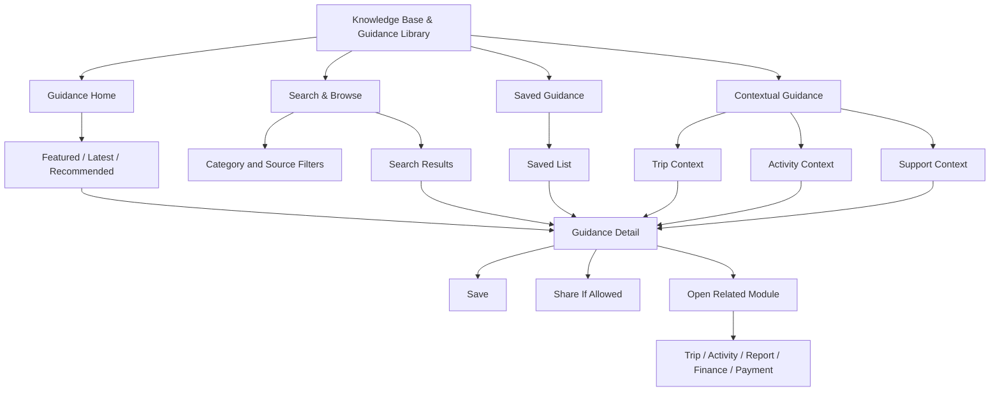
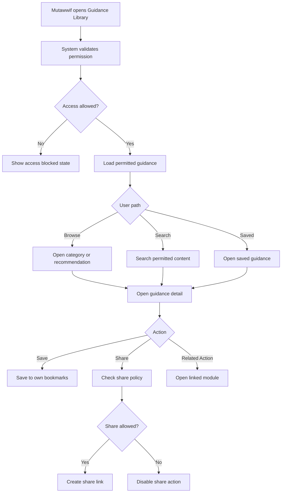
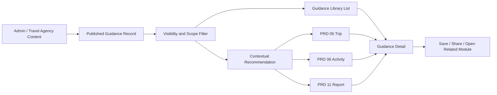

# MV PRD 12 - Knowledge Base & Guidance Library

Product: UmrahHaji.com Mutawwif View  
Module: Knowledge Base & Guidance Library  
Scope: Mutawwif Mobile Web App / Operational Guidance, Ritual Reference, SOP, Safety Guidance & Contextual Help  
Platform: Mobile-first Responsive Web Platform  
Status: Draft  
Last Updated: 20 June 2026  

---

## 1. Objective

Knowledge Base & Guidance Library is the mutawwif-facing reference library for field guidance. It allows mutawwif to search, read, save, share, and open approved operational references, ritual guidance, safety guidance, group handling SOP, platform help, trip notes, and activity-specific guidance from one mobile-first module.

This module must help mutawwif answer:

1. What approved guidance should I follow for this trip, activity, ritual, or operational situation?
2. Which SOP applies when I handle jamaah, briefing, movement, delay, missing member, safety concern, or urgent issue?
3. Which article or guide is approved by Admin, Travel Agency, or platform content governance?
4. Which guidance is relevant to my assigned group trip or today's activity?
5. Which guidance can I save for quick access during travel?
6. Which guidance can I share to jamaah, co-mutawwif, or support response where allowed?
7. What content is official, agency-specific, public, mutawwif-only, or role-restricted?
8. When should I open Reports & Support instead of relying on static guidance?

This module is not a content authoring CMS, not a religious fatwa authority, not a medical/legal consultation tool, and not a replacement for official Hajj/Umrah authorities. Admin Panel and Travel Agency Portal own content creation, review, publishing, and governance. Mutawwif View consumes approved content within role and assignment scope.

---

## 2. Relationship With Mutawwif View Master Scope

This module follows the Mutawwif View mobile web app scope:

1. Mutawwif can view only published, active, and permitted guidance content.
2. Mutawwif cannot create, edit, publish, schedule, archive, or delete official guidance in Phase 1.
3. Mutawwif can save/bookmark guidance for own account.
4. Mutawwif can share only guidance marked shareable for the target audience.
5. Mutawwif can open contextual guidance from trip, activity, notification, support case, profile, or finance/payout help context.
6. Mutawwif can access offline cached guidance only if content policy allows local caching.
7. Sensitive agency-only, internal Admin, draft, scheduled, archived, or restricted content must not appear unless explicitly permitted.
8. Religious, health, safety, visa, and legal guidance must show source/reviewer metadata or disclaimer where required.

Knowledge Base & Guidance Library is P1 if field guidance is central to MVP. Otherwise, the minimum P1 should include searchable read-only guidance and contextual links from PRD 06 Activity Guidance, while saved/offline/advanced recommendation can move to P2.

---

## 3. Relationship With Admin, Travel Agency, Jamaah, and Mutawwif PRDs

| Source Module | Relationship |
| --- | --- |
| Admin Articles Management | Source of platform-approved guidance, categories, tags, reviewer metadata, publish status, featured content, and visibility rules |
| Admin Announcement Management | Can link mutawwif to important guidance updates or safety references |
| Admin Itinerary Management | Can attach ritual/activity references to itinerary templates or reusable activity definitions |
| Admin Group Trip Management | Can attach platform guidance to group trip operation context |
| Admin Mutawwif Management | Can link license, verification, compliance, SOP, and role guidance |
| Admin Report Management | Can reference articles as support response or resolution guidance |
| Admin Settings / Master Data | Source of categories, tags, languages, content visibility, and allowed share rules |
| Travel Agency Articles / Knowledge Base | Source of agency-specific operational notes if enabled |
| Travel Agency Group Trip Management | Source of trip-specific notes, briefing references, hotel/flight/transport guidance, and agency SOP links |
| Travel Agency Mutawwif Assignment | Source of mutawwif role, assignment scope, lead/assistant differences, and agency-specific visibility |
| Travel Agency Announcements | Can distribute agency guidance links to assigned mutawwif |
| Travel Agency Documents & Services | Can link document/service readiness guidance for field operations |
| Jamaah Articles / Guide Content | Shared public guidance source, filtered for mutawwif relevance |
| Jamaah Checklist & Guidance | Shared taxonomy for Umrah/Hajj preparation and ritual categories |
| MV PRD 03 - Profile, License & Verification | Can link mutawwif to profile/license/compliance guidance |
| MV PRD 04 - Calendar & Schedule | Can show guidance suggestions for upcoming activities |
| MV PRD 05 - My Group Trip & Trip Details | Can show trip-level guidance library shortcuts and trip-specific notes |
| MV PRD 06 - Activity Guidance | Main contextual consumer of activity-specific guidance |
| MV PRD 07 - Referral | Can link referral policy/help guidance if approved |
| MV PRD 08 - Allowance & Tip | Can link finance, allowance, tip, donation, and withdrawal help guidance |
| MV PRD 09 - Payment Settings | Can link payout destination setup/security guidance |
| MV PRD 10 - Notifications & Announcements | Can deliver guidance updates and deep-link to guidance detail |
| MV PRD 11 - Reports & Support | Can suggest guidance before case creation or attach guidance to public support replies |

### 3.1 Key Sync Rule

Knowledge Base & Guidance Library is a content consumption surface, not the source of content truth.

Admin / Travel Agency Content Governance -> Published Guidance Record -> Mutawwif Visibility Filter -> Knowledge Base / Contextual Recommendation -> Mutawwif Read, Save, Share, or Open Related Module.

If content status becomes Draft, Scheduled, Archived, Expired, or permission-restricted, Mutawwif View must remove it from list/search and show an unavailable state for old links.

### 3.2 Cross-Role Boundary

| Role / Surface | Owns | Can Mutawwif View Display? | PRD 12 Rule |
| --- | --- | --- | --- |
| Admin Articles Management | Official platform content lifecycle | Yes, only published and permitted content | Admin remains content owner |
| Admin Itinerary Management | Ritual/activity templates and attached references | Yes, as approved activity guidance | Do not expose draft template notes |
| Admin Report Management | Support response and case resolution references | Yes, public/shareable guidance only | Do not expose internal support notes |
| Travel Agency Knowledge Base | Agency-specific content and operational notes | Yes, only if agency/trip/role scope matches | Respect `agency_id`, assignment, and visibility |
| Travel Agency Group Trip | Trip-specific notes and briefing references | Yes, assigned trip only | Do not expose unassigned trips |
| Jamaah Articles / Guides | Public education content | Yes, if relevant and shareable | Mutawwif version may show extra operational framing |
| Mutawwif View | Read, search, save, share allowed content, and open context | Yes | No authoring/publishing in P1 |

### 3.3 Boundary With PRD 06 and PRD 11

| Area | PRD 06 Activity Guidance | PRD 11 Reports & Support | PRD 12 Knowledge Base |
| --- | --- | --- | --- |
| Main purpose | Execute a specific assigned activity | Submit/track support cases | Search/read reusable guidance |
| Content source | Group trip activity snapshot + approved guidance | Case record + public comments | Published articles/guides/SOP |
| Mutawwif action | Acknowledge, contact, report, optional signal | Create, reply, attach, reopen | Read, save, share, open source/action |
| Official owner | Admin/TA schedule owner | Admin/TA support owner | Admin/TA content owner |
| When to use | "What do I do now for this activity?" | "Something is wrong and needs follow-up" | "What is the approved reference?" |

Rules:

1. PRD 06 may embed or link PRD 12 content, but activity status and execution actions remain PRD 06.
2. PRD 11 may suggest PRD 12 content, but case creation, comments, and resolution remain PRD 11.
3. PRD 12 may link back to PRD 06 or PRD 11 when the guidance is contextual or insufficient.

---

## 4. Research Notes and Product Decisions

Mutawwif guidance must be practical, searchable, and reliable during field operations. Product decisions:

1. Guidance should separate official content, agency-specific notes, public jamaah-facing content, and mutawwif-only operational SOP.
2. Religious, health, safety, visa, and compliance guidance must show reviewer/source metadata where available.
3. Content should not be presented as final fatwa, medical advice, legal advice, or official government instruction unless the content source explicitly supports that.
4. Mutawwif needs contextual recommendations from trip/activity, but must also be able to browse/search manually.
5. Saved guidance is important because mutawwif may need quick access while moving or under time pressure.
6. Offline cached reading is useful, but should be limited to approved content and must respect expiry/refresh rules.
7. Article detail should be readable on small screens with clear headings, labels, updated date, source, and related actions.
8. Share actions must be controlled by content visibility. Not every internal SOP can be shared to jamaah.
9. Content changes should trigger user-facing notifications only when important, not for every minor edit.
10. Guidance should deflect common support cases, but must still offer Reports & Support when the issue cannot be solved by reading content.

Reference sources used as product direction:

1. Nusuk official pilgrimage gateway: https://www.nusuk.sa/
2. Ministry of Hajj and Umrah official site: https://haj.gov.sa/en
3. W3C WCAG 2.2 - Headings and Labels: https://www.w3.org/WAI/WCAG22/Understanding/headings-and-labels.html
4. W3C WCAG 2.2 - Target Size Minimum: https://www.w3.org/WAI/WCAG22/Understanding/target-size-minimum.html
5. Schema.org - Article structured data type: https://schema.org/Article
6. Personal Data Protection Act 2010, Laws of Malaysia Act 709: https://lom.agc.gov.my/act-detail.php?type=principal&lang=BI&act=709

### 4.1 Research Validation Notes

| Research Area | Product Interpretation | Impact on This PRD |
| --- | --- | --- |
| Official pilgrimage services | Hajj/Umrah guidance must respect official authority and service rules | Use source/reviewer labels and avoid hard-coded official requirements |
| Headings and labels | Guidance content must be easy to scan and accessible | Require semantic headings, clear titles, category labels, and readable detail pages |
| Mobile target size | Mutawwif may use the app one-handed during field operations | Search, filter, save, share, and related-action controls need comfortable tap targets |
| Article metadata | Content needs title, author/reviewer, date, category, tags, and body structure | Reuse article metadata from Admin content model |
| Personal data protection | Contextual recommendations may use trip/assignment data | Keep recommendation inputs scoped and avoid exposing sensitive source data |

### 4.2 Guidance Authority Rule

This module must present guidance as curated platform/agency reference content. It must not present itself as the final authority for religious rulings, medical requirements, visa rules, legal obligations, transport control, crowd control, or government policies.

### 4.3 Content Freshness Rule

If an article contains operational, health, visa, safety, government, or trip-specific guidance, the detail page must show updated date and source/reviewer metadata where available.

---

## 5. Scope

### 5.1 In Scope for Phase 1

1. Knowledge Base & Guidance Library home.
2. Article/guide list.
3. Search by title, summary, category, tag, keyword, activity, trip, or source label.
4. Category browsing.
5. Content type filter.
6. Visibility/source label: Platform Official, Agency Note, Public Guide, Mutawwif SOP, Activity Guidance, FAQ.
7. Article/guide detail page.
8. Featured guidance.
9. Latest updated guidance.
10. Recommended guidance based on assigned trip/activity.
11. Saved/bookmarked guidance for own account.
12. Share allowed guidance link.
13. Open related module action, e.g. Activity, Trip, Report, Payment Settings, Allowance.
14. Related guidance suggestions.
15. Read time, updated date, author/reviewer/source display.
16. Important update banner for revised safety/operation guidance.
17. Contextual entry from PRD 05, PRD 06, PRD 10, and PRD 11.
18. Empty, loading, error, unavailable, and offline cached read-only states.
19. Basic analytics for search/read/save/share/useful feedback.
20. Audit logs for restricted guidance access and share actions.
21. Mobile-first responsive behavior.

### 5.2 In Scope for Phase 2

1. Offline saved guidance with expiry/refresh policy.
2. Multi-language content variants.
3. Audio narration.
4. Video guide collections.
5. Guidance contribution request from mutawwif.
6. Mutawwif feedback on guidance usefulness.
7. Advanced recommendation based on itinerary day, location, role, and case history.
8. Lead mutawwif team guidance packs.
9. Agency trip briefing pack export.
10. Version comparison for major guidance changes.
11. Guidance checklist integration for activity preparation.
12. AI-assisted content summary if approved by content governance.

### 5.3 Out of Scope

1. Article authoring from Mutawwif View.
2. Official content publishing.
3. Review/approval workflow.
4. Article scheduling.
5. Archive/restore article.
6. Category/tag management.
7. Public SEO configuration.
8. Public comment moderation.
9. Religious fatwa workflow.
10. Medical consultation.
11. Legal consultation.
12. Creating announcements.
13. Creating support reports, except linking to PRD 11.
14. Editing trip itinerary or activity schedule.
15. Editing Travel Agency SOP.
16. Paid course or LMS implementation.

---

## 6. User Roles and Access

| Role | Access Behavior |
| --- | --- |
| Pending mutawwif | Can see onboarding/profile guidance if account access allows |
| Invited mutawwif | Can see invitation and activation guidance after authentication |
| Active mutawwif | Can view general mutawwif guidance and permitted public/platform content |
| Verified mutawwif | Can view full assigned-trip and activity-related guidance |
| Lead mutawwif | Can view lead-specific SOP and group handling references where permitted |
| Assistant mutawwif | Can view assistant-scoped guidance and assigned activity references |
| Suspended mutawwif | May be limited to account/suspension support guidance |
| Replaced mutawwif | Can view general guidance; assigned-trip guidance may be removed or historical only |
| Admin | Manages official content from Admin Panel, not this module |
| Travel Agency staff | Manages/links agency knowledge from TA Portal, not this module |
| Jamaah | Reads jamaah guidance in Jamaah/User View, not this module |

### 6.1 Visibility Rules

Mutawwif can see:

1. Published platform guidance targeted to mutawwif.
2. Published public guidance that is also useful to mutawwif.
3. Published agency guidance for their assigned agency/trip/role.
4. Activity-specific guidance for assigned activities.
5. Mutawwif SOP content permitted by role.
6. Saved/bookmarked guidance for own account.
7. Related source module links if permission allows.
8. Share action only when content is marked shareable.

Mutawwif must not see:

1. Draft articles.
2. Scheduled articles before publish date.
3. Archived articles in normal list/search.
4. Admin internal articles.
5. Agency internal articles from unassigned agency.
6. Trip-specific guidance from unassigned trip.
7. Role-restricted SOP outside role.
8. Reviewer-only comments.
9. Internal content analytics.
10. Content edit history unless published change note is intended for users.

### 6.2 Access State Rules

| Account State | Library Access | Trip/Activity Guidance | Save | Share |
| --- | --- | --- | --- | --- |
| Active | Yes | Assigned scope only | Yes | If content allows |
| Verified | Yes | Full assigned scope | Yes | If content allows |
| Pending | Limited | No active trip scope unless policy allows | Limited | Limited |
| Suspended | Limited/read-only | Blocked or historical only | No or limited | No |
| Replaced | General access | Historical only if policy allows | Yes | If content allows |
| Deactivated | No app access | No | No | No |

---

## 7. Information Architecture

Knowledge Base & Guidance Library

```text
Knowledge Base & Guidance Library
+-- Guidance Home
|   +-- Featured Guidance
|   +-- Recommended for My Trip
|   +-- Recommended for Today
|   +-- Latest Updated
+-- Search & Browse
|   +-- Categories
|   +-- Content Type Filter
|   +-- Source Filter
|   +-- Saved Filter
+-- Guidance Detail
|   +-- Title and Summary
|   +-- Source / Reviewer
|   +-- Body Content
|   +-- Related Guidance
|   +-- Related Actions
+-- Saved Guidance
|   +-- Saved List
|   +-- Offline State
|   +-- Unavailable State
+-- Contextual Guidance
    +-- Trip Guidance
    +-- Activity Guidance
    +-- Support Reference
    +-- Finance / Payment Help
```



### 7.1 Navigation Entry Points

| Entry Point | Behavior |
| --- | --- |
| Main menu: Guidance Library | Opens Guidance Home |
| Home dashboard quick card | Opens recommended guidance or saved guidance |
| PRD 05 Trip Detail | Opens trip-recommended guidance |
| PRD 06 Activity Guidance | Opens activity-specific guide detail |
| PRD 10 notification | Opens updated guidance detail after permission revalidation |
| PRD 11 report detail | Opens suggested guidance related to case category |
| Profile/license page | Opens profile, license, or verification guidance |
| Allowance/Payment modules | Opens finance or payout setup guidance |

### 7.2 Recommended Categories

| Category | Description | Example Topics |
| --- | --- | --- |
| Mutawwif SOP | Operational process for guiding groups | Briefing, group movement, handover, escalation |
| Activity Guidance | Activity-specific steps and preparation | Miqat, tawaf briefing, ziyarah coordination |
| Umrah Ritual Guidance | Curated Umrah ritual references | Ihram, tawaf, sa'i, tahallul |
| Hajj Ritual Guidance | Curated Hajj ritual references | Mina, Arafah, Muzdalifah, jamrah |
| Group Handling | Practical field coordination | Meeting points, late jamaah, elderly support |
| Health & Safety | Safety, heat, medication, emergency reference | Heat safety, lost member, medical escalation |
| Documents & Services | Readiness and field awareness | Visa status, ticket, hotel allocation, transport |
| Platform Guide | How to use Mutawwif View features | Calendar, trip detail, report issue, payment settings |
| Finance Help | Allowance, tip, withdrawal, payout setup | Balance, withdrawal status, payout destination |
| Referral Help | Referral policy and reward reference | Referral link, reward eligibility |
| FAQ | Short operational Q&A | Common questions from mutawwif |

### 7.3 Content Type Model

| Content Type | Purpose | Display Pattern |
| --- | --- | --- |
| Article | Long-form explanation | Article detail |
| Guide | Step-by-step instruction | Numbered steps |
| SOP | Operational procedure | Structured sections and checklist |
| FAQ | Short question/answer | Accordion/list |
| Safety Guidance | Urgent or preventive reference | Highlighted caution and action links |
| Ritual Reference | Worship sequence and reminders | Source/reviewer metadata required |
| Platform Help | Feature usage instruction | Short task-based guide |
| Agency Note | Agency-specific operational note | Agency label and trip/role scope |

---

## 8. Content Visibility and Source Model

### 8.1 Visibility Types

| Visibility | Mutawwif Access |
| --- | --- |
| Public Published | Visible if relevant and active |
| Mutawwif Published | Visible to authenticated mutawwif with permission |
| Role-Restricted Published | Visible only to matching role/permission |
| Agency Published | Visible only within matching agency scope |
| Trip Published | Visible only to assigned trip scope |
| Activity Published | Visible only to assigned activity scope |
| Admin Internal | Not visible |
| Draft | Not visible |
| Scheduled | Not visible until publish time |
| Archived | Not visible in normal list/search |

### 8.2 Source Labels

| Source Label | Meaning |
| --- | --- |
| Platform Official | Published by Admin content owner |
| Agency Note | Published/linked by Travel Agency for assigned scope |
| Public Guide | Public jamaah-facing guide also useful to mutawwif |
| Mutawwif SOP | Role-specific operating reference |
| Activity Guidance | Linked from itinerary/activity context |
| Support Reference | Guidance linked from Reports & Support |

Rules:

1. Source label must be visible on guide cards and detail pages.
2. Agency Note must show agency name where allowed.
3. Activity Guidance must show related trip/activity context where allowed.
4. Public Guide can be shared externally only if marked shareable.
5. Mutawwif SOP must not be shareable to jamaah unless explicitly allowed.

---

## 9. User Flows



### 9.0 Content Sync and Recommendation Flow



### 9.1 Flow: Browse and Read Guidance

1. Mutawwif opens Guidance Library.
2. System shows featured, recommended, latest updated, and saved guidance.
3. Mutawwif selects category or opens article card.
4. System checks permission and content availability.
5. Guidance detail opens with title, source, category, updated date, reviewer/source, body, related content, and actions.
6. Mutawwif can save, share if allowed, or open related module.

### 9.2 Flow: Search Guidance

1. Mutawwif opens search.
2. Mutawwif enters keyword.
3. System searches permitted content only.
4. System displays results with category, source, read time, updated date, and visibility label.
5. Mutawwif opens result.
6. System logs read/search analytics where allowed.

### 9.3 Flow: Open Contextual Guidance From Activity

1. Mutawwif opens activity in PRD 06.
2. Activity screen shows linked guidance.
3. Mutawwif taps guidance item.
4. PRD 12 opens detail after checking assigned activity/trip permission.
5. Mutawwif reads guide and returns to activity.
6. If guide is insufficient, mutawwif can open Report Issue back to PRD 11 with activity context.

### 9.4 Flow: Save Guidance

1. Mutawwif opens guidance detail.
2. Mutawwif taps Save.
3. System saves bookmark to own account.
4. Guidance appears in Saved Guidance.
5. If content becomes archived/restricted later, saved item shows unavailable state.

### 9.5 Flow: Share Guidance

1. Mutawwif opens guidance detail.
2. System checks content share policy.
3. If shareable, Share action is enabled.
4. Mutawwif shares link through allowed channel.
5. Recipient access still depends on content visibility.
6. System logs share event if required.

### 9.6 Flow: Guidance Update Notification

1. Admin or Travel Agency updates important published guidance.
2. System determines if update is material and targeted to mutawwif.
3. PRD 10 creates notification if policy requires.
4. Mutawwif opens notification.
5. PRD 12 opens updated guidance detail and highlights update note.

---

## 10. Screens and Components

### 10.1 Guidance Home

Purpose: Provide quick access to recommended and saved guidance.

Components:

1. Page title: Guidance Library.
2. Search input.
3. Category chips.
4. Recommended for Today.
5. Recommended for My Trip.
6. Featured Guidance.
7. Latest Updated.
8. Saved Guidance shortcut.
9. Source/visibility labels.
10. Empty state.
11. Offline cached state.

Primary actions:

1. Search.
2. Browse category.
3. Open guidance detail.
4. Open saved guidance.

### 10.2 Search & Browse

Purpose: Let mutawwif find approved content quickly.

Filters:

1. Category.
2. Content type.
3. Source label.
4. Trip relevance.
5. Activity relevance.
6. Saved only.
7. Updated date.

Sort:

1. Recommended.
2. Latest updated.
3. Most viewed.
4. Shortest read time.
5. Alphabetical.

### 10.3 Guidance Detail

Purpose: Provide readable, trusted guidance and actions.

Components:

1. Title.
2. Summary/excerpt.
3. Source label.
4. Category and tags.
5. Content type.
6. Author/reviewer/source metadata.
7. Published date.
8. Updated date.
9. Read time.
10. Body content.
11. Important disclaimer if required.
12. Related trip/activity context if applicable.
13. Related guidance.
14. Save/bookmark action.
15. Share action if allowed.
16. Open related module CTA.
17. Report Issue CTA if guidance cannot solve the situation.

### 10.4 Saved Guidance

Purpose: Let mutawwif quickly revisit important references.

Components:

1. Saved list.
2. Search saved.
3. Category filter.
4. Last opened timestamp.
5. Offline available badge if enabled.
6. Unavailable content state.
7. Remove saved action.

### 10.5 Contextual Recommendation Panel

Purpose: Show guidance relevant to source module context.

Inputs:

1. Source module.
2. Trip ID.
3. Activity ID.
4. Agency ID.
5. Role: lead/assistant.
6. Category.
7. Tags.
8. Current date/trip phase.

Outputs:

1. Recommended guidance list.
2. Related SOP.
3. Safety guidance if applicable.
4. Platform help article.
5. Report Issue fallback.

---

## 11. Data and Field Requirements

### 11.1 GuidanceContent

| Field | Type | Required | Notes |
| --- | --- | --- | --- |
| content_id | UUID | Yes | Primary identifier |
| source_content_id | UUID/String | Yes | Admin/TA article source ID |
| title | String | Yes | Display title |
| slug | String | Yes | Stable URL slug if applicable |
| excerpt | Text | Optional | Card/list summary |
| body_content | Structured JSON/HTML | Yes | Sanitized or structured content blocks |
| content_type | Enum | Yes | article, guide, sop, faq, safety, ritual, platform_help, agency_note |
| category_id | UUID | Yes | Active category |
| tags | Array | Optional | Search/recommendation tags |
| source_label | Enum | Yes | platform_official, agency_note, public_guide, mutawwif_sop, activity_guidance, support_reference |
| visibility | Enum | Yes | public, mutawwif, role_restricted, agency, trip, activity |
| share_policy | Enum | Yes | not_shareable, internal_share, public_share |
| language | String | Optional | e.g. en, ms, id, ar |
| author_name | String | Optional | Author display |
| reviewer_name | String | Optional | Reviewer display where required |
| reviewer_role | String | Optional | Religious reviewer, medical reviewer, operations reviewer |
| source_url | URL | Optional | Official/reference source |
| featured_image_url | URL | Optional | Thumbnail or hero image |
| read_time_minutes | Number | Optional | Estimated read time |
| status | Enum | Yes | published, archived, expired, unavailable |
| is_featured | Boolean | Yes | Featured content |
| is_important_update | Boolean | Yes | Material update flag |
| published_at | DateTime | Yes | Publish timestamp |
| updated_at | DateTime | Yes | Last update timestamp |
| expires_at | DateTime | Optional | Expiry for time-sensitive content |

### 11.2 GuidanceCategory

| Field | Type | Required | Notes |
| --- | --- | --- | --- |
| category_id | UUID | Yes | Primary identifier |
| name | String | Yes | Category display name |
| slug | String | Yes | Category slug |
| description | Text | Optional | Category description |
| parent_category_id | UUID | Optional | Nested category |
| is_active | Boolean | Yes | Only active categories shown |
| sort_order | Number | Optional | Display order |

### 11.3 GuidanceContextLink

| Field | Type | Required | Notes |
| --- | --- | --- | --- |
| context_link_id | UUID | Yes | Primary identifier |
| content_id | UUID | Yes | Linked content |
| source_module | Enum | Yes | PRD03, PRD04, PRD05, PRD06, PRD07, PRD08, PRD09, PRD10, PRD11 |
| context_type | Enum | Yes | trip, activity, schedule, finance, payout, referral, profile, report, notification |
| source_record_id | UUID/String | Optional | Related source record |
| agency_id | UUID | Optional | Agency scope |
| group_trip_id | UUID | Optional | Trip scope |
| activity_id | UUID | Optional | Activity scope |
| role_scope | Enum | Optional | lead, assistant, verified, all |
| priority | Number | Optional | Recommendation ranking |
| created_at | DateTime | Yes | Link timestamp |

### 11.4 GuidanceBookmark

| Field | Type | Required | Notes |
| --- | --- | --- | --- |
| bookmark_id | UUID | Yes | Primary identifier |
| user_id | UUID | Yes | Mutawwif account user |
| mutawwif_id | UUID | Yes | Mutawwif profile |
| content_id | UUID | Yes | Saved content |
| saved_at | DateTime | Yes | Saved timestamp |
| last_opened_at | DateTime | Optional | For sorting |
| offline_enabled | Boolean | Optional | Phase 2 if offline save enabled |

### 11.5 GuidanceInteraction

| Field | Type | Required | Notes |
| --- | --- | --- | --- |
| interaction_id | UUID | Yes | Primary identifier |
| user_id | UUID | Yes | Mutawwif user |
| content_id | UUID | Yes | Guidance content |
| action | Enum | Yes | view, search_click, save, unsave, share, open_related, useful_feedback |
| source_module | Enum | Optional | Context source |
| data_scope | JSON | Yes | Scope used for action |
| created_at | DateTime | Yes | Timestamp |

---

## 12. Permission Logic

### 12.1 Permission Chain

Knowledge Base & Guidance Library must follow the existing permission chain:

Portal Access -> Role -> Permission Group -> Module Permission -> Action Permission -> Data Scope.

### 12.2 Permission Keys

| Permission Key | Description |
| --- | --- |
| mutawwif.guidance.view | View Guidance Library entry and list |
| mutawwif.guidance.detail.view | View guidance detail |
| mutawwif.guidance.search | Search guidance content |
| mutawwif.guidance.bookmark.create | Save/bookmark guidance |
| mutawwif.guidance.bookmark.delete | Remove saved guidance |
| mutawwif.guidance.share | Share guidance when content policy allows |
| mutawwif.guidance.context.view | View contextual recommendations |
| mutawwif.guidance.offline.save | Save offline copy if enabled |
| mutawwif.guidance.feedback.create | Submit usefulness feedback |
| mutawwif.guidance.restricted.view | View role/agency/trip restricted guidance |

### 12.3 Data Scope Rules

| Scope | Rule |
| --- | --- |
| Public content | Accessible if published and active |
| Mutawwif content | Requires authenticated mutawwif and module permission |
| Role restricted | Requires matching role/permission group |
| Agency content | Requires matching agency scope through assignment |
| Trip content | Requires active or permitted historical trip assignment |
| Activity content | Requires assigned activity/trip scope |
| Finance content | Requires own finance/payout context if personalized |
| Report content | Requires own visible report context if recommended from PRD 11 |
| Saved content | Only own user bookmarks |

### 12.4 Sharing Rules

| Share Policy | Behavior |
| --- | --- |
| not_shareable | No share action shown |
| internal_share | Can share only to authenticated internal users with permission |
| public_share | Can share public link; recipient still sees only allowed public content |

Rules:

1. Mutawwif cannot share agency-only SOP publicly.
2. Mutawwif cannot share role-restricted content outside permitted audience.
3. Shared links must re-check permission on open.
4. Notification previews and share previews must use safe summary.

---

## 13. Functional Requirements

### 13.1 Guidance Home and Browse

| ID | Requirement | Priority |
| --- | --- | --- |
| MV-KB-001 | System must display Guidance Library entry for mutawwif with `mutawwif.guidance.view` permission | P1 |
| MV-KB-002 | System must display only published, active, and permitted guidance content | P1 |
| MV-KB-003 | System must show featured guidance, recommended guidance, latest updated guidance, and saved shortcut | P1 |
| MV-KB-004 | System must support category browsing | P1 |
| MV-KB-005 | System must show source/visibility label on guidance cards | P1 |
| MV-KB-006 | System must support empty, loading, error, unavailable, and offline read-only states | P1 |

### 13.2 Search and Filter

| ID | Requirement | Priority |
| --- | --- | --- |
| MV-KB-007 | System must support search across title, excerpt, category, tag, keyword, and source label | P1 |
| MV-KB-008 | Search results must include only permitted content | P1 |
| MV-KB-009 | System must support filters by category, content type, source, trip relevance, activity relevance, and saved state | P1 |
| MV-KB-010 | System must show result count and no-result state | P1 |
| MV-KB-011 | System must log search and click analytics where policy allows | P2 |

### 13.3 Guidance Detail

| ID | Requirement | Priority |
| --- | --- | --- |
| MV-KB-012 | System must show title, summary, source label, category, tags, content body, updated date, and read time | P1 |
| MV-KB-013 | System must show author/reviewer/source metadata where available | P1 |
| MV-KB-014 | System must show disclaimer for religious, medical, legal, visa, or safety content where required | P1 |
| MV-KB-015 | System must support related guidance suggestions | P1 |
| MV-KB-016 | System must support open related module CTA where context exists | P1 |
| MV-KB-017 | System must show unavailable state for archived/expired/restricted old links | P1 |

### 13.4 Contextual Recommendations

| ID | Requirement | Priority |
| --- | --- | --- |
| MV-KB-018 | PRD 05 must be able to request trip-level guidance recommendations | P1 |
| MV-KB-019 | PRD 06 must be able to request activity-specific guidance recommendations | P1 |
| MV-KB-020 | PRD 10 notification must deep-link to guidance detail after permission revalidation | P1 |
| MV-KB-021 | PRD 11 must be able to suggest guidance from report category/context | P1 |
| MV-KB-022 | System must not recommend guidance outside mutawwif data scope | P1 |
| MV-KB-023 | System must rank recommendations by source relevance, category, trip/activity context, and update recency | P2 |

### 13.5 Save and Share

| ID | Requirement | Priority |
| --- | --- | --- |
| MV-KB-024 | System must allow mutawwif to save permitted guidance to own bookmark list | P1 |
| MV-KB-025 | System must allow mutawwif to remove saved guidance | P1 |
| MV-KB-026 | System must show saved guidance list | P1 |
| MV-KB-027 | System must allow share only when content share policy allows | P1 |
| MV-KB-028 | System must re-check permission when shared link is opened | P1 |
| MV-KB-029 | System must log restricted share actions if audit policy requires | P1 |

### 13.6 Offline and Update Handling

| ID | Requirement | Priority |
| --- | --- | --- |
| MV-KB-030 | System should support cached read-only access for recently opened guidance | P2 |
| MV-KB-031 | System must show stale/needs refresh state for expired cached guidance | P2 |
| MV-KB-032 | System must create PRD 10 notification for important guidance updates where policy requires | P1 |
| MV-KB-033 | System must remove or block guidance if content is archived, expired, or no longer permitted | P1 |

---

## 14. Business Rules

1. Only published and active content can appear in Mutawwif View.
2. Draft, scheduled, archived, internal, and restricted content must not leak through search, recommendation, direct link, or cache.
3. Content source of truth remains Admin Articles Management or Travel Agency knowledge base.
4. Mutawwif cannot modify official guidance content in Phase 1.
5. Bookmarking is a user preference and must not alter content.
6. Sharing depends on content share policy.
7. Shared links must re-check permission on open.
8. Contextual recommendation must never reveal source records outside mutawwif scope.
9. Important updated guidance may trigger PRD 10 notification.
10. Expired or archived guidance must show unavailable state if opened from old link.
11. Religious, health, visa, safety, and legal guidance must show appropriate source/reviewer/disclaimer metadata when configured.
12. Activity-specific guidance must not edit activity or itinerary status.
13. Support reference guidance must not create/resolve report cases.
14. Analytics must be aggregate or scoped and must not expose sensitive trip/jamaah data.
15. Offline cached content must respect expiry and restriction changes after refresh.

---

## 15. API and Integration Expectations

### 15.1 API Endpoints

Exact endpoint naming may follow backend standards, but expected capabilities are:

| Capability | Expected Behavior |
| --- | --- |
| List guidance | Returns permitted guidance cards for authenticated mutawwif |
| Search guidance | Searches permitted content only |
| Get guidance detail | Returns safe content detail after visibility check |
| Get categories | Returns active categories available to mutawwif |
| Get contextual recommendations | Returns content based on source module and scoped context |
| Save bookmark | Saves content to own user bookmarks |
| Remove bookmark | Removes own bookmark |
| List saved guidance | Returns own saved guidance |
| Share guidance | Creates/copies allowed share link based on share policy |
| Track interaction | Stores view/search/save/share/open-related events where allowed |

### 15.2 Integration Events

| Event | Producer | Consumer |
| --- | --- | --- |
| guidance.published | Admin/TA content system | Mutawwif Guidance Library |
| guidance.updated_important | Admin/TA content system | PRD 10 Notifications, Guidance Library |
| guidance.archived | Admin/TA content system | Guidance Library |
| guidance.permission_changed | Admin/TA content system | Guidance Library cache/search |
| guidance.viewed | Mutawwif View | Analytics/Audit where allowed |
| guidance.saved | Mutawwif View | Saved Guidance |
| guidance.shared | Mutawwif View | Audit/analytics where required |
| guidance.open_related | Mutawwif View | Source module deep link |

### 15.3 Recommendation Inputs

| Input | Source | Usage |
| --- | --- | --- |
| role | User/permission engine | Lead/assistant/general guidance filtering |
| agency_id | Assignment/trip | Agency note filtering |
| group_trip_id | PRD 05 | Trip-related guidance |
| activity_id | PRD 06 | Activity-specific guidance |
| itinerary_day | PRD 06 | Phase/day recommendation |
| category | Source module | Recommendation ranking |
| tags | Source module/content | Related content matching |
| report_category | PRD 11 | Support deflection |
| notification_id | PRD 10 | Deep link validation |

---

## 16. UI State Requirements

### 16.1 Empty States

| Screen | Empty State |
| --- | --- |
| Guidance Home | No guidance available for your current scope |
| Search | No guidance matches this search |
| Category | No published guidance in this category |
| Saved Guidance | No saved guidance yet |
| Recommended for Trip | No trip-specific guidance available |
| Recommended for Activity | No activity-specific guidance available |

### 16.2 Loading States

1. Guidance home skeleton.
2. Search result loading.
3. Category loading.
4. Guidance detail loading.
5. Bookmark save/remove progress.
6. Share link loading.
7. Contextual recommendation loading.

### 16.3 Error States

| Error | UX Behavior |
| --- | --- |
| Permission denied | Show safe access message and do not reveal title/body |
| Content archived | Show unavailable state and suggest search |
| Content expired | Show expired state and suggest latest guidance |
| Network offline | Show cached read-only guidance if available |
| Share not allowed | Disable share and explain content is not shareable |
| Recommendation unavailable | Let user browse/search manually |
| Related module unavailable | Disable CTA and show safe reason |

### 16.4 Accessibility States

1. Search result count should be clear and announced when changed.
2. Save/unsave state must be programmatically determinable.
3. Share success/failure must be announced.
4. Article headings must follow readable hierarchy.
5. Link labels must be descriptive.
6. Tap targets must be large enough for mobile use.
7. Color must not be the only indicator for source, priority, or warning.

---

## 17. Security, Privacy, and Compliance

### 17.1 Security Requirements

1. Authenticated mutawwif-only content requires session validation.
2. Every guidance detail request must validate content visibility and data scope.
3. Search must filter by permission before returning results.
4. Share link must not bypass visibility restrictions.
5. Cached content must respect expiry/refresh policy.
6. Sanitized HTML or structured content blocks must be used for article body.
7. Embedded media must be from approved sources or secure storage.
8. Internal admin/reviewer comments must never appear in Mutawwif View.
9. Restricted content access and sharing should be auditable.

### 17.2 Privacy Requirements

1. Recommendation engine must use minimum necessary context.
2. Trip/activity context should not reveal sensitive jamaah details.
3. Analytics must avoid storing unnecessary personal data.
4. Saved guidance belongs to own user account.
5. Notification/share previews must use safe summaries.
6. Agency-specific guidance must not leak outside agency scope.

### 17.3 Content Compliance Requirements

1. Religious guidance should show reviewer/source metadata where configured.
2. Health guidance should show disclaimer and source metadata where configured.
3. Visa/government/travel rule guidance should show updated date and source.
4. Time-sensitive guidance should have expiry or review date.
5. Agency notes should clearly indicate agency ownership.

---

## 18. Analytics and Monitoring

### 18.1 Product Analytics

| Metric | Purpose |
| --- | --- |
| Guidance views by category | Understand field guidance demand |
| Search terms with no results | Identify missing content |
| Saved guidance count | Measure repeated utility |
| Share events by content type | Understand allowed distribution |
| Contextual recommendation click rate | Measure source module relevance |
| Report deflection click rate | See whether PRD 11 guidance suggestions help |
| Unavailable link count | Monitor stale/archived references |
| Offline cached read usage | Assess field connectivity needs |

### 18.2 Operational Monitoring

1. Search API error rate.
2. Detail page error rate.
3. Permission-denied spikes.
4. Stale cache rate.
5. Broken related content links.
6. Missing reviewer/source metadata for sensitive categories.
7. Notification deep-link failures.
8. Share permission mismatch.

---

## 19. Acceptance Criteria

### 19.1 Guidance Home and Browse

1. Given mutawwif has guidance permission, when opening Guidance Library, then permitted published guidance appears.
2. Given content is draft, scheduled, archived, or internal, when mutawwif searches, then content does not appear.
3. Given content is agency-scoped, when mutawwif is not assigned to that agency/trip, then content is hidden.
4. Given content is role-restricted, when mutawwif role does not match, then content is hidden.

### 19.2 Search

1. Given mutawwif searches a keyword, when matching permitted content exists, then results appear with source label and updated date.
2. Given no permitted result exists, when search completes, then no-result state appears.
3. Given restricted content matches keyword, when user lacks scope, then it does not appear in result count.

### 19.3 Guidance Detail

1. Given mutawwif opens permitted content, then detail shows title, body, source label, category, updated date, and available metadata.
2. Given content requires disclaimer, when detail opens, then disclaimer appears.
3. Given content is archived after being saved, when opened from saved list, then unavailable state appears.
4. Given content has related activity, when mutawwif has activity access, then related activity CTA appears.

### 19.4 Save and Share

1. Given mutawwif saves content, when saved list opens, then content appears in own saved list.
2. Given mutawwif removes saved content, when saved list refreshes, then content is removed.
3. Given content is not shareable, when detail opens, then share action is hidden or disabled.
4. Given content is shareable, when mutawwif shares link, then recipient still must pass visibility rules on open.

### 19.5 Contextual Recommendations

1. Given mutawwif opens assigned activity, when guidance exists for that activity, then PRD 06 can show linked guidance.
2. Given mutawwif opens assigned trip, when trip guidance exists, then PRD 05 can show recommended guidance.
3. Given report category has guidance suggestion, when PRD 11 shows suggestion, then only permitted guidance appears.
4. Given notification opens guidance update, when permission is valid, then PRD 12 opens detail.

### 19.6 Security and Privacy

1. Given user tries direct link to restricted content, when permission check fails, then body content is not returned.
2. Given agency note belongs to another agency, when user searches, then note is not visible.
3. Given cached guidance has expired, when user opens it online, then system refreshes or blocks stale content.
4. Given share preview is generated, when content is restricted, then preview uses safe title/summary or no preview.

---

## 20. Dependencies

1. Authentication and session management.
2. Role and permission engine.
3. Admin Articles Management.
4. Travel Agency Articles / Knowledge Base.
5. Guidance category/tag master data.
6. Search service.
7. Recommendation rules service.
8. Content rendering/sanitization service.
9. Bookmark service.
10. Notification system from PRD 10.
11. Source modules PRD 03-11.
12. Audit/analytics service.
13. Mobile design system components.

---

## 21. Risks and Mitigations

| Risk | Impact | Mitigation |
| --- | --- | --- |
| Guidance treated as final authority | Religious/medical/legal risk | Show source, reviewer, disclaimer, and official authority boundary |
| Sensitive agency SOP leaked | Operational/privacy risk | Enforce visibility and share policy |
| Search exposes restricted titles | Privacy/security risk | Filter before result and count generation |
| Old guidance used in field | Operational risk | Show updated date, expiry, important update notification, and stale cache state |
| Content becomes too broad | Low usability | Prioritize mutawwif categories and contextual recommendations |
| PRD 12 duplicates PRD 06 | Scope confusion | PRD 12 stores reusable guidance; PRD 06 executes assigned activity |
| PRD 12 replaces support | Issue unresolved | Keep Report Issue fallback to PRD 11 |
| Offline cache violates restrictions | Privacy/content risk | Limit caching and force refresh/expiry checks |

---

## 22. Release Plan

### 22.1 Phase 1 Release

1. Guidance Library menu entry.
2. Guidance home.
3. Article/guide list.
4. Search and filters.
5. Guidance detail.
6. Source/visibility labels.
7. Saved guidance.
8. Share allowed guidance.
9. Contextual recommendations for PRD 05 trip.
10. Contextual recommendations for PRD 06 activity.
11. PRD 10 notification deep-link.
12. PRD 11 guidance suggestion.
13. Permission and visibility filtering.
14. Basic analytics.
15. Mobile responsive behavior.

### 22.2 Phase 1 Rollout Checks

1. Published platform content visible.
2. Draft content hidden.
3. Scheduled content hidden before publish.
4. Archived content hidden from list/search.
5. Agency content visible only to assigned mutawwif.
6. Trip/activity content visible only to assigned scope.
7. Not-shareable content cannot be shared.
8. Shared link re-checks permission.
9. PRD 06 activity link opens correct guidance.
10. PRD 11 suggested guidance does not expose restricted content.

### 22.3 Phase 2 Candidate Enhancements

1. Offline saved reading.
2. Multi-language variants.
3. Audio/video guidance.
4. Contribution request.
5. Usefulness feedback.
6. Advanced recommendation.
7. Lead mutawwif guidance pack.
8. Version comparison.

---

## 23. QA Checklist

### 23.1 Functional QA

1. Open Guidance Library.
2. Browse categories.
3. Search keyword.
4. Filter by content type.
5. Open guidance detail.
6. Save guidance.
7. Remove saved guidance.
8. Share public guidance.
9. Block share for internal SOP.
10. Open guidance from trip detail.
11. Open guidance from activity detail.
12. Open guidance from notification.
13. Open guidance suggestion from report detail.
14. View unavailable state for archived content.

### 23.2 Permission QA

1. Active mutawwif general guidance access.
2. Verified mutawwif assigned-trip guidance access.
3. Lead mutawwif lead SOP access.
4. Assistant mutawwif limited SOP access.
5. Suspended mutawwif restricted access.
6. Replaced mutawwif historical/general access.
7. Other agency content blocked.
8. Unassigned trip content blocked.
9. Draft/scheduled/internal content blocked.
10. Direct restricted link blocked.

### 23.3 Integration QA

1. Admin published content appears.
2. Admin archived content disappears.
3. TA agency note appears only for matching assignment.
4. PRD 05 trip recommendation uses correct trip context.
5. PRD 06 activity recommendation uses correct activity context.
6. PRD 10 notification opens updated content.
7. PRD 11 support suggestion opens permitted content.
8. Share link respects recipient visibility.

### 23.4 Accessibility QA

1. Article heading hierarchy is logical.
2. Search result count is announced.
3. Save/unsave state is accessible.
4. Share success/failure is announced.
5. Link labels are descriptive.
6. Tap targets are large enough.
7. Warning/disclaimer is not color-only.
8. Content remains readable on mobile.

---

## 24. Open Questions

1. Should Knowledge Base & Guidance Library be P1 full scope or P1-minimum with P2 saved/offline enhancements?
2. Who is the official reviewer for mutawwif religious guidance: platform scholar, agency reviewer, or both?
3. Which agency notes are allowed to be visible to mutawwif in Phase 1?
4. Can mutawwif share public jamaah-facing guides directly from this module?
5. Should SOP content support offline caching, or only public/general guidance?
6. Should PRD 06 require acknowledgement for updated critical guidance?
7. Should mutawwif be able to request new guidance content in Phase 2?
8. Which languages are required for first release: English, Malay, Indonesian, Arabic?

---

## 25. Final Product Decision

Knowledge Base & Guidance Library must be implemented as a read-first, mobile-first guidance surface for mutawwif, synchronized with Admin Articles Management, Travel Agency Articles / Knowledge Base, Jamaah Articles / Guide Content, Jamaah Checklist & Guidance taxonomy, PRD 06 Activity Guidance, PRD 10 Notifications, and PRD 11 Reports & Support.

The product direction is:

1. Let mutawwif read, search, save, and share approved guidance where allowed.
2. Keep official content creation and publishing outside Mutawwif View.
3. Separate platform official content, agency notes, public guides, mutawwif SOP, activity guidance, and support references.
4. Use strict visibility and share rules.
5. Show source, reviewer, updated date, and disclaimer for sensitive guidance.
6. Use contextual recommendations from trip/activity/support context.
7. Keep PRD 12 as reusable guidance, while PRD 06 remains activity execution and PRD 11 remains case handling.

This gives mutawwif a trusted field reference without weakening content governance, role boundaries, or operational ownership.
