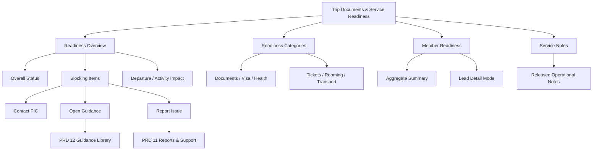
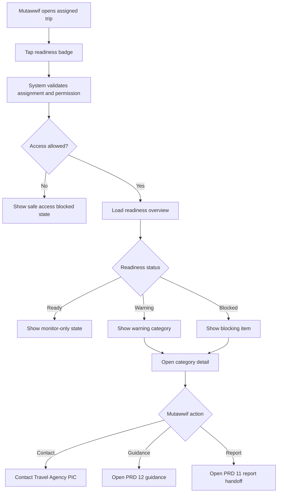
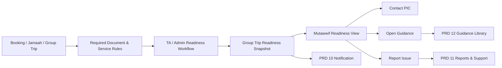

# MV PRD 13 - Trip Documents & Service Readiness

Product: UmrahHaji.com Mutawwif View  
Module: Trip Documents & Service Readiness  
Scope: Mutawwif Mobile Web App / Assigned Trip Readiness Summary, Document Awareness, Service Status & Operational Alerts  
Platform: Mobile-first Responsive Web Platform  
Status: Draft  
Last Updated: 20 June 2026  

---

## 1. Objective

Trip Documents & Service Readiness is the mutawwif-facing readiness awareness module for assigned group trips. It allows mutawwif to view safe, scoped readiness summaries for documents, visa, ticket, rooming, transport, service status, and operational blocking items without exposing raw sensitive document files or giving mutawwif document management authority.

This module must help mutawwif answer:

1. Is my assigned group trip operationally ready from a document and service perspective?
2. Which readiness areas are complete, warning, blocked, or waiting for agency action?
3. Are there members or services that need attention before departure or before an activity?
4. Which readiness warnings affect my field guidance duty?
5. Which item should I escalate to Travel Agency PIC or Reports & Support?
6. Which document/service data is safe for me to see?
7. Which details are owned by Admin or Travel Agency and not editable by mutawwif?
8. Has a readiness item changed since I last viewed the trip?

This module is not a document upload module, not a document verification workspace, not a service management workspace, not an export tool, and not a visa/ticket/hotel/transport booking system. Travel Agency Portal and Admin Panel own document/service management. Mutawwif View consumes a safe readiness snapshot for assigned trips.

---

## 2. Relationship With Mutawwif View Master Scope

This module follows the Mutawwif View mobile web app scope:

1. Mutawwif can view readiness only for assigned group trips.
2. Mutawwif can view safe readiness summary and limited detail only when the role and data scope allow.
3. Mutawwif cannot upload, approve, reject, replace, delete, export, or download jamaah documents in Phase 1.
4. Mutawwif cannot update visa, ticket, train, room, transport, kit, or service status in Phase 1.
5. Mutawwif can open related trip/activity context, contact PIC, open guidance, or create a support report.
6. Sensitive document files, full passport/IC numbers, medical notes, payment values, provider contracts, and internal verification remarks are hidden by default.
7. Readiness requirements must come from Admin/Travel Agency configuration and trip snapshot, not hard-coded in Mutawwif View.
8. Every deep link must re-check assignment, permission, and data scope before showing readiness detail.

Trip Documents & Service Readiness is P1 if mutawwif must coordinate readiness in the field. If the MVP keeps mutawwif visibility high-level only, the readiness summary can stay inside PRD 05 and this module can become P2. Product recommendation: implement as PRD 13 because TA/Admin/Jamaah roles already have document/service surfaces and PRD 05 references readiness repeatedly.

---

## 3. Relationship With Admin, Travel Agency, Jamaah, and Mutawwif PRDs

| Source Module | Relationship |
| --- | --- |
| Admin Group Trip Management | Platform-level group trip snapshot, readiness supervision, service status, document/service summary, and audit |
| Admin Jamaah Management | Source of jamaah profile, identity, passport, emergency contact, and document status where platform-managed |
| Admin Mutawwif Management | Source of mutawwif assignment eligibility and access state |
| Admin Document/Service Configuration | Source of required document/service rules, visibility, labels, and status mapping |
| Admin Report Management | Destination for readiness-related issue escalation |
| Travel Agency Documents & Services | Main source of document/service readiness, verification status, service status, reminders, and blocking items |
| Travel Agency Group Trip Management | Source of group trip member readiness, rooming, ticket, transport, hotel, flight, train, and service context |
| Travel Agency Mutawwif Assignment | Source of assigned trip scope, role, replacement, lead/assistant visibility, and access rights |
| Travel Agency Announcements | Can notify mutawwif of readiness changes or operational notices |
| Jamaah Profile & Documents | Jamaah-owned profile and document data; Mutawwif sees only safe readiness status where allowed |
| Jamaah My Group Trip | Jamaah-facing service/document readiness should align with safe status where shared |
| Jamaah Checklist & Guidance | Jamaah preparation tasks can influence readiness summary but remain jamaah-facing |
| MV PRD 05 - My Group Trip & Trip Details | Main entry point and summary surface for trip readiness |
| MV PRD 06 - Activity Guidance | Consumes activity-relevant readiness warning, e.g. ticket, document, rooming, transport, assistance |
| MV PRD 10 - Notifications & Announcements | Sends readiness change, warning, blocked, and notice notifications |
| MV PRD 11 - Reports & Support | Destination for reporting readiness issue with trip/context prefilled |
| MV PRD 12 - Knowledge Base & Guidance Library | Provides document/service guidance and SOP for readiness issues |

### 3.1 Key Sync Rule

Trip Documents & Service Readiness is a read-only mutawwif projection of Admin/Travel Agency readiness data.

Booking / Jamaah / Group Trip -> Required Document & Service Rules -> TA/Admin Document & Service Readiness -> Group Trip Readiness Snapshot -> Mutawwif Readiness View -> Contact PIC / Guidance / Report Issue.

Mutawwif View must not directly compute official document legality, visa eligibility, health compliance, or travel validity. It displays status supplied by the authorized Admin/TA readiness workflow.

### 3.2 Cross-Role Boundary

| Role / Surface | Owns | Can Mutawwif View Display? | PRD 13 Rule |
| --- | --- | --- | --- |
| Admin Group Trip Management | Platform-level trip readiness and support oversight | Yes, as released trip readiness snapshot | Do not expose internal admin remarks |
| Admin Jamaah Management | Jamaah profile and sensitive identity fields | Yes, safe member label/readiness only | Do not expose full document or private identity data |
| TA Documents & Services | Main document/service operational workflow | Yes, summary and limited detail | Treat TA as source of readiness truth |
| TA Group Trip Management | Trip member service status and operational allocations | Yes, assigned trip only | Show operationally needed status only |
| Jamaah Documents | Jamaah-owned uploads and personal readiness | Yes, safe status only | Do not expose raw files by default |
| Mutawwif View | Field awareness, escalation, contact, guidance | Yes | No management actions in P1 |

### 3.3 Boundary With PRD 05, PRD 06, PRD 10, PRD 11, and PRD 12

| Area | Source Module | PRD 13 Behavior |
| --- | --- | --- |
| Trip readiness summary | PRD 05 | PRD 05 shows badge/summary and links into PRD 13 detail |
| Activity readiness warning | PRD 06 | PRD 13 supplies activity-relevant warnings, e.g. ticket/transport/assistance |
| Readiness notification | PRD 10 | Status changes and urgent warnings deep-link to PRD 13 after permission check |
| Report readiness issue | PRD 11 | Create report with trip/readiness category prefilled |
| Readiness guidance | PRD 12 | Open approved guide/SOP for document or service issue |

Rules:

1. PRD 05 answers "what is the trip status?"
2. PRD 13 answers "what readiness area needs attention?"
3. PRD 06 answers "what should I do for this activity now?"
4. PRD 11 answers "what issue needs support follow-up?"
5. PRD 12 answers "what approved guidance should I read?"

---

## 4. Research Notes and Product Decisions

Document/service readiness contains sensitive identity, travel, health, and operational data. Mutawwif needs enough information to guide the group safely, but not the raw back-office detail. Product decisions:

1. Mutawwif must see readiness status, not raw document management.
2. Document and service requirements must be configurable by Admin/TA because visa, health, travel, and package rules can change.
3. Readiness labels must be action-oriented: Ready, Warning, Blocked, Pending, Action Needed.
4. Member-level detail should be aggregate by default and expanded only for lead mutawwif or explicit permission.
5. Full IC/passport files, full document numbers, private medical notes, payment values, and provider contracts must be hidden by default.
6. Ticket/voucher/rooming/transport details should be released only when useful for field execution.
7. If a status is based on external or official rule, copy must say it is based on Admin/Travel Agency verification status.
8. Dynamic readiness changes must produce accessible status feedback and PRD 10 notification when important.
9. Any future document/file access must follow secure file handling and audit requirements.
10. Mobile view must prioritize blocked items, next departure/activity impact, and contact/report actions.

Reference sources used as product direction:

1. Nusuk official pilgrimage gateway: https://www.nusuk.sa/
2. Ministry of Hajj and Umrah official site: https://haj.gov.sa/en
3. OWASP File Upload Cheat Sheet: https://cheatsheetseries.owasp.org/cheatsheets/File_Upload_Cheat_Sheet.html
4. W3C WCAG 2.2 - Status Messages: https://www.w3.org/WAI/WCAG22/Understanding/status-messages.html
5. W3C WCAG 2.2 - Target Size Minimum: https://www.w3.org/WAI/WCAG22/Understanding/target-size-minimum.html
6. Personal Data Protection Act 2010, Laws of Malaysia Act 709: https://lom.agc.gov.my/act-detail.php?type=principal&lang=BI&act=709

### 4.1 Research Validation Notes

| Research Area | Product Interpretation | Impact on This PRD |
| --- | --- | --- |
| Pilgrimage service operation | Pilgrimage support depends on confirmed service arrangements and official facilitation | Readiness must cover visa, ticket, rooming, transport, and operational service status |
| Changing official requirements | Visa/health/document rules can change by authority, season, nationality, package, or agency | Mutawwif View must display configured status, not hard-coded requirements |
| Secure file handling | Uploaded identity/travel files are sensitive and risky | P1 hides raw document files; any future access must be permission-checked and audited |
| Status messages | Readiness changes should be clearly perceivable | Blocked/warning updates need accessible labels and dynamic feedback |
| Target size | Field controls need comfortable tap targets | Category filters, member expanders, contact/report actions must be easy to tap |
| Personal data protection | Readiness data includes personal and travel data | Show minimum necessary data, mask sensitive fields, restrict scope, log sensitive access |

### 4.2 Official Requirement Boundary

This PRD must not hard-code passport validity, visa rules, vaccination rules, Hajj permit rules, airline rules, hotel policy, or transport policy. Those requirements should be managed through Admin/Travel Agency configuration and shown to mutawwif as verification status and operational note.

### 4.3 Privacy Safety Rule

The default mutawwif readiness view should answer "is there an operational issue?" without exposing "what exact private document or identity value is inside the file?"

---

## 5. Scope

### 5.1 In Scope for Phase 1

1. Trip readiness entry from PRD 05.
2. Readiness overview for assigned group trip.
3. Readiness status: Ready, Warning, Blocked, Pending, Not Required.
4. Category summaries: Documents, Visa, Health/Vaccination, Flight Ticket, Train Ticket, Hotel/Rooming, Transport, Kit/Service, Payment Clearance if configured.
5. Blocking item summary.
6. Departure impact label.
7. Activity impact label.
8. Safe member-level readiness summary where permitted.
9. Lead mutawwif detail mode if policy allows.
10. Service notes released to mutawwif.
11. Rooming summary released to mutawwif.
12. Transport/ticket readiness summary released to mutawwif.
13. Update/change banner when readiness changes.
14. Contact Travel Agency PIC action.
15. Open related guidance from PRD 12.
16. Report Issue action with PRD 11 prefill.
17. Deep link from PRD 10 readiness notification.
18. Empty, loading, error, permission denied, unavailable, and offline cached read-only states.
19. Audit logs for sensitive readiness detail views.
20. Mobile-first responsive behavior.

### 5.2 In Scope for Phase 2

1. Temporary document preview for specific released documents.
2. Secure voucher/ticket download if Travel Agency explicitly releases file.
3. Offline readiness snapshot with expiry.
4. Lead mutawwif member exception tracking.
5. Rooming checklist for field coordination.
6. Transport boarding readiness checklist.
7. Kit distribution acknowledgement.
8. QR code verification for service handover.
9. Team handover notes between lead and assistant mutawwif.
10. Readiness trend/history.
11. Readiness export for lead mutawwif if explicitly approved.
12. AI-generated readiness summary if approved by governance.

### 5.3 Out of Scope

1. Uploading jamaah documents.
2. Verifying or rejecting documents.
3. Replacing document files.
4. Downloading sensitive identity files by default.
5. Editing visa/ticket/train/room/transport status.
6. Sending document reminders directly to jamaah.
7. Exporting readiness report in P1.
8. Managing required document/service rules.
9. Submitting visa applications.
10. Booking airline, hotel, train, or transport services.
11. Viewing payment invoices/receipts/amounts.
12. Viewing provider contracts or costs.
13. Viewing private medical records.
14. Editing trip members.
15. Editing group trip schedule.

---

## 6. User Roles and Access

| Role | Access Behavior |
| --- | --- |
| Pending mutawwif | No trip readiness access unless account policy allows limited onboarding context |
| Invited mutawwif | No assigned-trip readiness until invitation accepted and assignment active |
| Active mutawwif | Can view high-level readiness for assigned trips |
| Verified mutawwif | Can view full permitted assigned-trip readiness summary |
| Lead mutawwif | Can view more detailed member/service readiness if released by policy |
| Assistant mutawwif | Can view assigned-trip readiness summary; member detail may be limited |
| Suspended mutawwif | Readiness access blocked or read-only based on policy |
| Replaced mutawwif | Active readiness access removed; historical view limited by policy |
| Admin | Manages/monitors readiness in Admin Panel, not this module |
| Travel Agency staff | Manages documents/services in TA Portal, not this module |
| Jamaah | Manages own documents in Jamaah View, not this module |

### 6.1 Visibility Rules

Mutawwif can see:

1. Assigned trip readiness score or status.
2. Readiness category status.
3. Count of ready/warning/blocked/pending items.
4. Safe blocking item labels.
5. Departure impact label.
6. Activity impact label.
7. Safe member display name or group label if permission allows.
8. Released rooming/transport/service note.
9. Travel Agency PIC contact.
10. Last updated timestamp and source label.

Mutawwif must not see by default:

1. Raw IC/passport files.
2. Full passport/IC number.
3. Full visa application file.
4. Medical diagnosis or private medical notes.
5. Vaccination certificate file unless explicitly released.
6. Payment invoice, receipt, amount, bank, or card data.
7. Internal verification comments.
8. Provider contracts, cost, commission, or internal booking references.
9. Other unassigned trips.
10. Jamaah support case history.

### 6.2 Access State Rules

| Assignment State | Readiness Overview | Member Detail | Contact/Report | File Access |
| --- | --- | --- | --- | --- |
| Assigned active | Yes | Based on role/permission | Yes | No by default |
| Lead assigned | Yes | Expanded if released | Yes | No by default |
| Assistant assigned | Yes | Limited | Yes | No by default |
| Pending assignment | No or limited preview | No | No | No |
| Replaced | Historical only if policy allows | No | Limited | No |
| Suspended | Blocked or read-only | No | Limited support only | No |

---

## 7. Information Architecture

Trip Documents & Service Readiness

```text
Trip Documents & Service Readiness
+-- Readiness Overview
|   +-- Overall Status
|   +-- Blocking Items
|   +-- Departure Impact
|   +-- Activity Impact
+-- Readiness Categories
|   +-- Documents
|   +-- Visa
|   +-- Health / Vaccination
|   +-- Flight Ticket
|   +-- Train Ticket
|   +-- Hotel & Rooming
|   +-- Transport
|   +-- Kit & Services
+-- Member Readiness
|   +-- Aggregate Summary
|   +-- Lead Detail Mode
|   +-- Safe Member Drawer
+-- Service Notes
|   +-- Released Notes
|   +-- Related Guidance
+-- Actions
    +-- Contact PIC
    +-- Open Guidance
    +-- Report Issue
```



### 7.1 Navigation Entry Points

| Entry Point | Behavior |
| --- | --- |
| PRD 05 Readiness badge | Opens readiness overview for selected assigned trip |
| PRD 05 Trip tab | Opens readiness category summary |
| PRD 06 Activity warning | Opens readiness item related to activity |
| PRD 10 notification | Opens readiness detail after permission revalidation |
| PRD 11 report detail | Opens linked readiness context if case is related |
| PRD 12 guidance | Opens readiness context if guide is trip-specific |

---

## 8. Readiness Status and Category Model

### 8.1 Readiness Display Status

| Status | Mutawwif Meaning | Typical Action |
| --- | --- | --- |
| Ready | Required item is verified/completed or not blocking | Monitor only |
| Warning | Item is complete but needs attention, expiring soon, changed, or partially ready | Check note/contact PIC if needed |
| Pending | Waiting for agency/admin review or service update | Monitor/contact PIC if urgent |
| Blocked | Required item is missing, rejected, expired, or service is incomplete and affects departure/activity | Contact PIC or report issue |
| Not Required | Requirement does not apply for this trip/member | No action |
| Unknown | Source status unavailable | Refresh/contact PIC/report issue |

### 8.2 Readiness Categories

| Category | Mutawwif Display | Hidden by Default |
| --- | --- | --- |
| Identity Documents | Ready / Pending / Issue / Expired count | Raw files, full numbers, verification remarks |
| Passport | Ready / Warning / Blocked count | Full passport file/number |
| Visa | Ready / In Progress / Issue count | Visa file/application details unless released |
| Health/Vaccination | Not Required / Pending / Approved / Rejected / Expired / Action Needed | Medical notes, diagnosis, certificate file |
| Flight Ticket | Ready / Pending / Issue count | Raw ticket PDF unless released |
| Train Ticket | Ready / Pending / Issue count | Raw ticket PDF unless released |
| Hotel & Rooming | Assigned / Pending / Changed / Issue count | Internal contract/cost/vendor notes |
| Transport | Confirmed / Pending / Changed / Issue count | Vendor contract/cost/internal reference |
| Kit & Services | Ready / Pending / Issue count | Internal procurement/cost details |
| Payment Clearance | Cleared / Attention Needed / Blocked when configured | Amounts, invoice, receipts, bank details |

### 8.3 Impact Labels

| Impact Label | Meaning |
| --- | --- |
| No Field Impact | Mutawwif does not need to act |
| Briefing Needed | Mutawwif should mention or remind during briefing |
| Activity Impact | Affects a specific activity or day |
| Departure Impact | May affect departure readiness |
| Safety Impact | Requires safety-aware handling |
| Agency Action Needed | Travel Agency must act |
| Admin Action Needed | Platform/Admin must act |
| Report Recommended | Mutawwif should create support report if issue persists |

---

## 9. User Flows



### 9.0 Readiness Sync Flow



### 9.1 Flow: Open Trip Readiness From PRD 05

1. Mutawwif opens assigned group trip.
2. PRD 05 shows readiness badge.
3. Mutawwif taps readiness badge.
4. System validates assignment, role, permission, and trip scope.
5. PRD 13 opens readiness overview.
6. Mutawwif sees category summary and blocking item count.
7. Mutawwif opens category detail, guidance, contact PIC, or report issue.

### 9.2 Flow: Investigate Blocking Item

1. Mutawwif opens readiness overview.
2. System highlights blocked categories.
3. Mutawwif taps blocked category.
4. System shows safe item labels, affected count, impact, source, and last update.
5. Mutawwif can contact PIC, open guidance, or report issue.
6. System does not expose raw document files or internal remarks.

### 9.3 Flow: Lead Mutawwif Views Member-Level Summary

1. Lead mutawwif opens Member Readiness.
2. System checks lead role and data permission.
3. System shows safe member list with display name/group label and readiness badges.
4. Lead mutawwif can filter by blocked/warning/pending.
5. Lead mutawwif can open safe member readiness detail if allowed.
6. Sensitive document/payment/medical details remain hidden.

### 9.4 Flow: Activity-Specific Readiness Warning

1. Mutawwif opens activity in PRD 06.
2. Activity has linked readiness warning, e.g. transport pending or ticket issue.
3. Mutawwif taps warning.
4. PRD 13 opens readiness item after permission check.
5. Mutawwif reads safe note and can contact PIC or report issue.

### 9.5 Flow: Readiness Change Notification

1. TA/Admin changes readiness status.
2. System determines if change affects assigned mutawwif.
3. PRD 10 sends notification if status is important, blocked, urgent, or acknowledgement-required.
4. Mutawwif opens notification.
5. PRD 13 opens readiness detail after permission check.
6. Mutawwif sees updated status and last-updated source.

### 9.6 Flow: Report Readiness Issue

1. Mutawwif opens readiness item.
2. Mutawwif taps Report Issue.
3. PRD 11 opens Create Report.
4. System pre-fills trip ID, readiness category, item status, impact label, and agency context.
5. Mutawwif adds description and optional safe attachment.
6. Report routes to Admin/TA support.

---

## 10. Screens and Components

### 10.1 Readiness Overview

Purpose: Summarize trip readiness and prioritize operational attention.

Components:

1. Trip name and date.
2. Agency name.
3. Assignment role.
4. Overall readiness badge.
5. Last updated timestamp.
6. Source label: Travel Agency/Admin verification status.
7. Blocking item summary.
8. Category cards.
9. Departure impact banner.
10. Activity impact banner.
11. Contact PIC button.
12. Report Issue button.
13. Open Guidance button.
14. Offline/read-only indicator.

### 10.2 Category Detail

Purpose: Show safe detail for one readiness category.

Components:

1. Category title.
2. Status badge.
3. Affected count.
4. Impact label.
5. Safe description.
6. Last update.
7. Source module/source owner.
8. Related activity/trip link.
9. Member summary if allowed.
10. Service note if released.
11. Contact/report/guidance actions.

### 10.3 Blocking Items

Purpose: Give mutawwif a short list of what may affect operations.

Fields:

1. Item label.
2. Category.
3. Status.
4. Impact.
5. Affected count.
6. Related day/activity if any.
7. Recommended action.
8. Source owner.
9. Last update.

### 10.4 Member Readiness

Purpose: Let permitted lead/assigned mutawwif understand who may need operational attention without seeing raw private documents.

Components:

1. Member/group list.
2. Family/group label.
3. Readiness badges by category.
4. Assistance flag if released.
5. Room/transport label if released.
6. Filter: All, Ready, Warning, Blocked.
7. Safe detail drawer.

### 10.5 Service Notes

Purpose: Display released notes that help mutawwif operate in the field.

Examples:

1. Rooming note.
2. Transport boarding note.
3. Ticket collection note.
4. Kit distribution note.
5. Hotel check-in note.
6. Document carry reminder.
7. Special assistance note.

Rules:

1. Notes must be explicitly released to mutawwif.
2. Notes must avoid unnecessary sensitive data.
3. Notes can link to PRD 12 guidance.

---

## 11. Data and Field Requirements

### 11.1 TripReadinessSnapshot

| Field | Type | Required | Notes |
| --- | --- | --- | --- |
| readiness_snapshot_id | UUID | Yes | Primary identifier |
| group_trip_id | UUID | Yes | Assigned trip |
| agency_id | UUID | Yes | Trip agency |
| overall_status | Enum | Yes | ready, warning, pending, blocked, unknown |
| readiness_score | Number | Optional | Percentage if configured |
| blocked_count | Number | Yes | Blocking items count |
| warning_count | Number | Yes | Warning items count |
| pending_count | Number | Yes | Pending items count |
| ready_count | Number | Yes | Ready items count |
| departure_impact | Enum | Optional | none, briefing_needed, departure_impact, safety_impact |
| activity_impact_count | Number | Optional | Linked impacted activities |
| source_owner | Enum | Yes | admin, travel_agency, system |
| source_label | String | Yes | e.g. Based on Travel Agency verification status |
| last_synced_at | DateTime | Yes | Snapshot sync time |
| updated_at | DateTime | Yes | Last update |

### 11.2 ReadinessCategorySummary

| Field | Type | Required | Notes |
| --- | --- | --- | --- |
| category_summary_id | UUID | Yes | Primary identifier |
| readiness_snapshot_id | UUID | Yes | Parent snapshot |
| category | Enum | Yes | documents, passport, visa, health, flight_ticket, train_ticket, rooming, transport, kit_service, payment_clearance |
| display_status | Enum | Yes | ready, warning, pending, blocked, not_required, unknown |
| affected_member_count | Number | Optional | Count only |
| blocked_item_count | Number | Yes | Count only |
| warning_item_count | Number | Yes | Count only |
| impact_label | Enum | Optional | Field impact |
| safe_summary | Text | Optional | No sensitive raw data |
| last_updated_at | DateTime | Yes | Timestamp |

### 11.3 ReadinessItem

| Field | Type | Required | Notes |
| --- | --- | --- | --- |
| readiness_item_id | UUID | Yes | Primary identifier |
| readiness_snapshot_id | UUID | Yes | Parent snapshot |
| category | Enum | Yes | Category |
| item_label | String | Yes | Safe label |
| item_status | Enum | Yes | ready, warning, pending, blocked, not_required, unknown |
| requirement_level | Enum | Yes | required, recommended, optional, not_required |
| impact_label | Enum | Optional | Operational impact |
| source_module | Enum | Yes | TA Documents, TA Group Trip, Admin Group Trip, Admin Jamaah, etc. |
| source_record_id | UUID/String | Optional | Source reference |
| group_trip_id | UUID | Yes | Trip scope |
| activity_id | UUID | Optional | If linked to activity |
| affected_member_count | Number | Optional | Aggregate count |
| safe_member_ids | Array | Optional | Only if member detail allowed |
| safe_note | Text | Optional | Released note |
| action_hint | String | Optional | Contact PIC, open guidance, report issue |
| last_updated_at | DateTime | Yes | Timestamp |

### 11.4 MemberReadinessSummary

| Field | Type | Required | Notes |
| --- | --- | --- | --- |
| member_readiness_id | UUID | Yes | Primary identifier |
| group_trip_id | UUID | Yes | Trip scope |
| jamaah_id | UUID | Yes | Member reference |
| display_name | String | Yes | Safe display name |
| family_group_label | String | Optional | Safe group label |
| overall_status | Enum | Yes | ready, warning, pending, blocked |
| document_status | Enum | Optional | Safe status only |
| visa_status | Enum | Optional | Safe status only |
| health_status | Enum | Optional | Safe status only |
| ticket_status | Enum | Optional | Safe status only |
| rooming_status | Enum | Optional | Safe status only |
| transport_status | Enum | Optional | Safe status only |
| assistance_flag | Enum | Optional | Released flag only |
| safe_note | Text | Optional | Released note only |

### 11.5 ReadinessAuditEvent

| Field | Type | Required | Notes |
| --- | --- | --- | --- |
| audit_id | UUID | Yes | Primary identifier |
| user_id | UUID | Yes | Actor |
| mutawwif_id | UUID | Yes | Actor profile |
| group_trip_id | UUID | Yes | Trip |
| action | Enum | Yes | view_overview, view_category, view_member_summary, open_guidance, contact_pic, report_issue |
| permission_scope | JSON | Yes | Scope at time of action |
| created_at | DateTime | Yes | Timestamp |

---

## 12. Permission Logic

### 12.1 Permission Chain

Trip Documents & Service Readiness must follow the existing permission chain:

Portal Access -> Role -> Permission Group -> Module Permission -> Action Permission -> Data Scope.

### 12.2 Permission Keys

| Permission Key | Description |
| --- | --- |
| mutawwif.readiness.view | View readiness module entry and overview |
| mutawwif.readiness.category.view | View readiness category detail |
| mutawwif.readiness.blocking.view | View blocking item summary |
| mutawwif.readiness.member_summary.view | View safe member-level readiness summary |
| mutawwif.readiness.member_detail.view | View expanded safe member readiness detail |
| mutawwif.readiness.service_note.view | View released service notes |
| mutawwif.readiness.contact_pic | Contact PIC from readiness context |
| mutawwif.readiness.report_issue | Open report issue handoff |
| mutawwif.readiness.guidance.open | Open related PRD 12 guidance |
| mutawwif.readiness.sensitive.view | Future restricted permission for specifically released sensitive detail |

### 12.3 Data Scope Rules

| Scope | Rule |
| --- | --- |
| Assigned trip | Required for all readiness access |
| Assignment role | Lead/assistant determines detail level |
| Active assignment | Required for live readiness access |
| Historical assignment | Only if policy allows historical view |
| Agency scope | Readiness must match assigned agency/trip |
| Activity scope | Activity warning must match assigned activity/trip |
| Member detail scope | Only safe member summary, and only if role/permission allows |
| Sensitive data scope | Off by default in P1 |

### 12.4 Hidden Field Rules

| Data | P1 Mutawwif Default |
| --- | --- |
| Full IC/passport file | Hidden |
| Full IC/passport number | Hidden |
| Visa application file | Hidden |
| Vaccination certificate file | Hidden unless explicitly released |
| Medical notes/diagnosis | Hidden |
| Internal verification remark | Hidden |
| Payment amount/invoice/receipt | Hidden |
| Provider contract/cost | Hidden |
| Ticket file | Hidden unless released |
| Rooming cost/contract | Hidden |
| Transport vendor cost/contract | Hidden |

---

## 13. Functional Requirements

### 13.1 Readiness Overview

| ID | Requirement | Priority |
| --- | --- | --- |
| MV-RDY-001 | System must display readiness entry from assigned trip when mutawwif has `mutawwif.readiness.view` | P1 |
| MV-RDY-002 | System must show only readiness for trips assigned to authenticated mutawwif | P1 |
| MV-RDY-003 | System must show overall readiness status and last updated timestamp | P1 |
| MV-RDY-004 | System must show category summary with ready/warning/pending/blocked status | P1 |
| MV-RDY-005 | System must show blocking item summary without exposing sensitive raw data | P1 |
| MV-RDY-006 | System must support empty, loading, error, permission denied, and offline read-only states | P1 |

### 13.2 Category and Blocking Detail

| ID | Requirement | Priority |
| --- | --- | --- |
| MV-RDY-007 | System must allow permitted mutawwif to open category detail | P1 |
| MV-RDY-008 | Category detail must show safe summary, status, affected count, impact label, and source owner | P1 |
| MV-RDY-009 | System must hide internal verification remarks and raw file links by default | P1 |
| MV-RDY-010 | System must show departure/activity impact where available | P1 |
| MV-RDY-011 | System must show source copy such as `Based on Travel Agency/Admin verification status` | P1 |

### 13.3 Member Readiness

| ID | Requirement | Priority |
| --- | --- | --- |
| MV-RDY-012 | System must show aggregate member readiness by default | P1 |
| MV-RDY-013 | System may show safe member-level summary only when role and permission allow | P1 |
| MV-RDY-014 | Member detail must hide full document, payment, and medical data | P1 |
| MV-RDY-015 | Lead mutawwif can filter member summary by ready/warning/pending/blocked if policy allows | P1 |

### 13.4 Actions

| ID | Requirement | Priority |
| --- | --- | --- |
| MV-RDY-016 | System must allow Contact PIC from readiness context if contact is released | P1 |
| MV-RDY-017 | System must open PRD 12 guidance from readiness category when linked | P1 |
| MV-RDY-018 | System must open PRD 11 report creation with readiness context prefilled | P1 |
| MV-RDY-019 | System must open related PRD 06 activity when readiness item has activity impact | P1 |
| MV-RDY-020 | System must create audit event for sensitive readiness detail views | P1 |

### 13.5 Notifications and Changes

| ID | Requirement | Priority |
| --- | --- | --- |
| MV-RDY-021 | System must show update banner when readiness changed since last view | P1 |
| MV-RDY-022 | System must create PRD 10 notification for blocked/urgent readiness changes where policy requires | P1 |
| MV-RDY-023 | Notification deep link must re-check permission before opening readiness detail | P1 |
| MV-RDY-024 | System must show unavailable state if readiness snapshot is removed or no longer permitted | P1 |

### 13.6 Future Restricted File Access

| ID | Requirement | Priority |
| --- | --- | --- |
| MV-RDY-025 | If file preview is introduced, system must require explicit release and permission | P2 |
| MV-RDY-026 | If file preview is introduced, every view/download must be audit logged | P2 |
| MV-RDY-027 | If file preview is introduced, file links must use secure handler and expiry | P2 |

---

## 14. Business Rules

1. Readiness belongs to the group trip operational snapshot and TA/Admin document-service workflow.
2. Mutawwif cannot create or change official readiness status in P1.
3. Mutawwif cannot upload, verify, reject, delete, or export document/service records in P1.
4. Overall readiness should be calculated by TA/Admin rules, not by Mutawwif View.
5. Optional items must not block readiness unless configured as required.
6. Expired required documents count as blocked when source status says blocked.
7. Expiring soon can show warning if source marks it warning.
8. Waived items count as complete only if source workflow marks waiver approved.
9. Member-level detail is aggregate by default.
10. Lead mutawwif detail requires explicit permission.
11. Sensitive document/payment/medical fields remain hidden by default.
12. Ticket/voucher files are hidden unless Travel Agency explicitly releases them.
13. Status copies must not claim official validity beyond source verification.
14. Readiness notification must use safe summary only.
15. Direct links must always re-check assignment and permission.

---

## 15. API and Integration Expectations

### 15.1 API Endpoints

Exact endpoint naming may follow backend standards, but expected capabilities are:

| Capability | Expected Behavior |
| --- | --- |
| Get trip readiness overview | Returns safe readiness snapshot for assigned trip |
| Get readiness category | Returns safe category detail |
| Get blocking items | Returns safe blocking item list |
| Get member readiness summary | Returns aggregate or safe member summary based on permission |
| Get readiness service notes | Returns released notes only |
| Mark readiness update seen | Stores own last-view state |
| Open guidance link | Resolves PRD 12 related guidance |
| Open report handoff | Passes readiness context token to PRD 11 |

### 15.2 Integration Events

| Event | Producer | Consumer |
| --- | --- | --- |
| readiness.snapshot_updated | TA/Admin readiness system | Mutawwif View, PRD 10 |
| readiness.status_blocked | TA/Admin readiness system | PRD 10, Mutawwif View |
| readiness.status_warning | TA/Admin readiness system | PRD 10 if policy requires |
| readiness.item_linked_activity | TA/Admin group trip system | PRD 06, PRD 13 |
| readiness.report_created | PRD 11 | Admin/TA Report Management |
| readiness.guidance_opened | PRD 13 | PRD 12/analytics |

### 15.3 Source Mapping

| Source Data | Mutawwif Display |
| --- | --- |
| TA Documents by member | Category status, affected count, safe member summary if allowed |
| TA Services by member | Visa/ticket/room/transport service readiness |
| Admin Group Trip readiness | Platform status and critical alerts |
| Jamaah profile documents | Safe status only |
| Group trip activity | Activity impact label |
| Announcement/update | Readiness change banner and notification |

---

## 16. UI State Requirements

### 16.1 Empty States

| Screen | Empty State |
| --- | --- |
| Readiness Overview | No readiness data released for this trip |
| Blocking Items | No blocking items |
| Category Detail | No visible items in this category |
| Member Readiness | Member detail is not available for your role |
| Service Notes | No released service notes |

### 16.2 Loading States

1. Overview skeleton.
2. Category card skeleton.
3. Blocking item loading.
4. Member summary loading.
5. Contact/report handoff loading.
6. Guidance link loading.

### 16.3 Error States

| Error | UX Behavior |
| --- | --- |
| Permission denied | Show safe message and do not expose trip/member/readiness data |
| Trip no longer assigned | Show no access state |
| Snapshot unavailable | Show unavailable and suggest contact PIC/report issue |
| Network offline | Show cached read-only snapshot if available |
| Category restricted | Hide detail and show summary only |
| Related activity unavailable | Disable activity CTA |
| Guidance unavailable | Suggest search/open PRD 12 manually |

### 16.4 Accessibility States

1. Readiness status changes must be announced where dynamic.
2. Category cards must expose status text, not color alone.
3. Filter result count must be clear.
4. Contact/report buttons must have sufficient target size.
5. Expand/collapse member details must be keyboard/screen-reader accessible.
6. Warning/blocked labels must include text and icon semantics.

---

## 17. Security, Privacy, and Compliance

### 17.1 Security Requirements

1. All readiness APIs require authentication.
2. Every request must validate assignment, role, permission, and data scope.
3. Search/filter must run only on already permitted readiness scope.
4. Raw document files must not be returned in P1 responses.
5. Sensitive fields must be excluded at query/serializer layer.
6. Direct readiness deep links must re-check permission.
7. Audit logs are required for sensitive detail views.
8. Any future file access must use secure handler, expiry, permission check, and audit.

### 17.2 Privacy Requirements

1. Show minimum necessary readiness information.
2. Use aggregate counts unless member detail is explicitly permitted.
3. Mask or omit identity values.
4. Do not show private medical notes.
5. Do not show payment values or bank details.
6. Do not include sensitive data in notifications.
7. Do not cache sensitive detail beyond policy.

### 17.3 Compliance Requirements

1. Requirement labels should reference Admin/TA verification status, not official legal/medical claims.
2. Time-sensitive readiness must show last updated timestamp.
3. Health/vaccination status must not reveal medical content by default.
4. Service documents and ticket files must be released intentionally if ever shown.
5. Access and file view events must be auditable if sensitive.

---

## 18. Analytics and Monitoring

### 18.1 Product Analytics

| Metric | Purpose |
| --- | --- |
| Readiness overview views | Understand field use |
| Blocking item opens | Identify operational friction |
| Category views by type | See which readiness areas matter most |
| Contact PIC clicks | Measure escalation need |
| Report Issue clicks | Connect readiness gaps to PRD 11 |
| Guidance opens | Connect readiness gaps to PRD 12 |
| Permission denied count | Monitor scope confusion |
| Notification open rate | Measure urgent readiness communication |

### 18.2 Operational Monitoring

1. Readiness snapshot sync delay.
2. Missing source owner/source label.
3. Broken trip assignment mapping.
4. Readiness API error rate.
5. Notification deep-link failure rate.
6. Hidden sensitive field leakage tests.
7. Stale snapshot rate.
8. Member detail permission mismatch.

---

## 19. Acceptance Criteria

### 19.1 Readiness Overview

1. Given mutawwif is assigned to a trip, when opening readiness, then overview displays safe readiness summary.
2. Given mutawwif is not assigned to a trip, when opening direct link, then access is denied.
3. Given readiness has blocked items, when overview loads, then blocked count and categories appear.
4. Given snapshot is stale or unavailable, when overview loads, then safe unavailable state appears.

### 19.2 Category Detail

1. Given category detail is permitted, when mutawwif opens category, then safe status, affected count, impact, and source owner appear.
2. Given category includes sensitive documents, when mutawwif opens detail, then raw files and full numbers do not appear.
3. Given category affects an activity, when detail opens, then activity impact label appears.
4. Given category has guidance, when mutawwif taps guidance, then PRD 12 opens after permission check.

### 19.3 Member Readiness

1. Given mutawwif lacks member detail permission, when opening member readiness, then aggregate summary only appears.
2. Given lead mutawwif has permission, when opening member readiness, then safe member-level summary appears.
3. Given member has health/vaccination issue, when shown to mutawwif, then private medical note is hidden.
4. Given member has payment clearance issue, when shown to mutawwif, then amount/invoice/bank data is hidden.

### 19.4 Actions and Integrations

1. Given readiness issue requires agency action, when mutawwif taps Contact PIC, then agency contact opens if released.
2. Given issue needs case follow-up, when mutawwif taps Report Issue, then PRD 11 opens with readiness context.
3. Given readiness changes to blocked, when notification policy applies, then PRD 10 notification is created.
4. Given notification is opened, when permission is valid, then PRD 13 readiness detail opens.

### 19.5 Security and Privacy

1. Given raw document file exists in source system, when Mutawwif View API responds, then file URL is not included in P1.
2. Given internal verification remark exists, when readiness detail loads, then remark is not visible.
3. Given unassigned trip ID is requested, when API receives request, then response is denied without data leak.
4. Given sensitive detail is viewed, when audit policy requires, then audit event is created.

---

## 20. Dependencies

1. Authentication and session management.
2. Role and permission engine.
3. Travel Agency Documents & Services.
4. Travel Agency Group Trip Management.
5. Travel Agency Mutawwif Assignment.
6. Admin Group Trip Management.
7. Admin Jamaah Management.
8. Document/service rules configuration.
9. Group trip readiness snapshot service.
10. Notification system from PRD 10.
11. Reports & Support from PRD 11.
12. Guidance Library from PRD 12.
13. Audit logging service.
14. Data masking utilities.
15. Mobile design system components.

---

## 21. Risks and Mitigations

| Risk | Impact | Mitigation |
| --- | --- | --- |
| Raw document data leaks | Privacy/compliance issue | Hide raw files by default; serializer-level exclusion; permission tests |
| Mutawwif misreads status as official legal rule | Operational/legal risk | Use source copy and avoid hard-coded rules |
| Readiness becomes editable | Role boundary break | No management actions in P1 |
| Too much detail overwhelms mobile | Poor field usability | Prioritize overview, blocked items, and actions |
| Lead/assistant visibility unclear | Privacy risk | Role-based detail and explicit permission keys |
| Stale readiness causes wrong action | Operational risk | Last updated timestamp, change banner, notifications |
| Payment/medical details exposed | High sensitivity risk | Mask/omit by category and test explicitly |
| Duplicate with PRD 05 | Scope confusion | PRD 05 summary; PRD 13 detail |

---

## 22. Release Plan

### 22.1 Phase 1 Release

1. PRD 05 readiness entry.
2. Readiness overview.
3. Category summaries.
4. Blocking items.
5. Safe category detail.
6. Departure/activity impact labels.
7. Safe member summary if permitted.
8. Released service notes.
9. Contact PIC action.
10. PRD 12 guidance link.
11. PRD 11 report issue handoff.
12. PRD 10 readiness notifications.
13. Permission and privacy enforcement.
14. Audit logs for sensitive views.
15. Mobile responsive behavior.

### 22.2 Phase 1 Rollout Checks

1. Assigned trip readiness visible.
2. Unassigned trip blocked.
3. Raw document file hidden.
4. Full passport/IC number hidden.
5. Internal verification remark hidden.
6. Payment amount/invoice hidden.
7. Private medical note hidden.
8. Lead/assistant permission difference works.
9. Notification deep link re-checks permission.
10. Report Issue prefill uses safe readiness context.

### 22.3 Phase 2 Candidate Enhancements

1. Secure released ticket/voucher preview.
2. Offline readiness snapshot.
3. Rooming/transport field checklist.
4. Kit distribution acknowledgement.
5. Readiness trend/history.
6. Lead mutawwif export if approved.
7. Team handover notes.

---

## 23. QA Checklist

### 23.1 Functional QA

1. Open readiness from PRD 05.
2. View overview.
3. Open documents category.
4. Open visa category.
5. Open ticket category.
6. Open rooming category.
7. Open transport category.
8. View blocking items.
9. Filter member readiness if allowed.
10. Contact PIC.
11. Open guidance.
12. Create report issue handoff.
13. Open notification deep link.

### 23.2 Permission QA

1. Active mutawwif assigned trip access.
2. Verified mutawwif full summary access.
3. Lead mutawwif expanded safe detail access.
4. Assistant mutawwif limited detail access.
5. Suspended mutawwif blocked/limited access.
6. Replaced mutawwif historical access behavior.
7. Unassigned trip blocked.
8. Member detail blocked without permission.
9. Sensitive data hidden by default.
10. Direct deep link permission rechecked.

### 23.3 Integration QA

1. TA Documents & Services status appears as summary.
2. TA Group Trip service status appears as summary.
3. Admin Group Trip readiness alert appears.
4. PRD 05 badge opens PRD 13.
5. PRD 06 activity warning opens PRD 13.
6. PRD 10 readiness notification opens PRD 13.
7. PRD 11 report handoff receives readiness context.
8. PRD 12 guidance opens from readiness category.

### 23.4 Accessibility QA

1. Status labels include text.
2. Blocked/warning status is not color-only.
3. Dynamic update banner is announced.
4. Category cards have accessible names.
5. Contact/report buttons are large enough.
6. Member expand/collapse works with keyboard.
7. Error states are clear.
8. Offline/read-only state is understandable.

---

## 24. Open Questions

1. Should PRD 13 be P1 full module or merged as expanded PRD 05 Readiness tab for MVP?
2. Should lead mutawwif see member-level readiness in Phase 1?
3. Which service notes should Travel Agency be allowed to release to mutawwif?
4. Should ticket/voucher files ever be downloadable by mutawwif, or only status/notes?
5. Should health/vaccination status be shown as category count only or member-level safe status?
6. What readiness change threshold should trigger PRD 10 notification?
7. Should payment clearance be visible to mutawwif at all, or only as generic "travel readiness blocked"?
8. What is the retention policy for historical readiness snapshots after trip completion?

---

## 25. Final Product Decision

Trip Documents & Service Readiness must be implemented as a safe, assignment-scoped readiness viewer for mutawwif, synchronized with Travel Agency Documents & Services, Travel Agency Group Trip Management, Admin Group Trip Management, Admin Jamaah Management, Jamaah document readiness, PRD 05 Trip Details, PRD 06 Activity Guidance, PRD 10 Notifications, PRD 11 Reports & Support, and PRD 12 Guidance Library.

The product direction is:

1. Show readiness status, not raw document management.
2. Keep Admin/Travel Agency as source of truth and operational owner.
3. Make blocked and warning items visible enough for field coordination.
4. Hide sensitive identity, document, payment, health, and provider data by default.
5. Use aggregate summaries first; member-level detail only with explicit permission.
6. Provide action paths: contact PIC, open guidance, or report issue.
7. Avoid hard-coding official document, visa, health, or travel rules in Mutawwif View.

This gives mutawwif the operational awareness needed to guide assigned trips while preserving privacy, permission boundaries, and back-office ownership.
