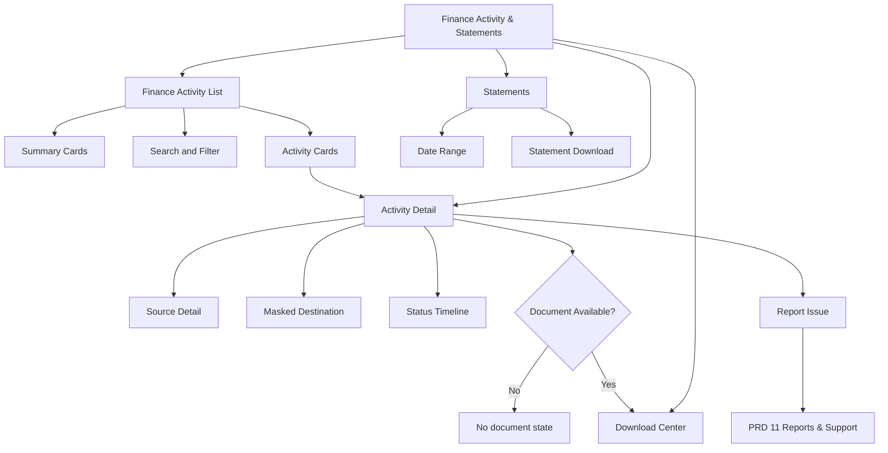
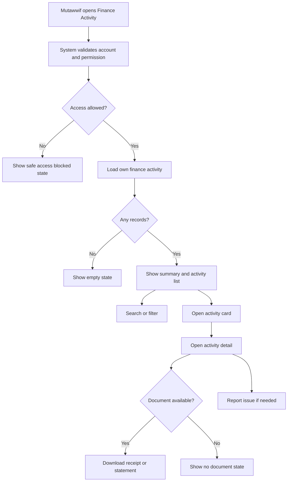
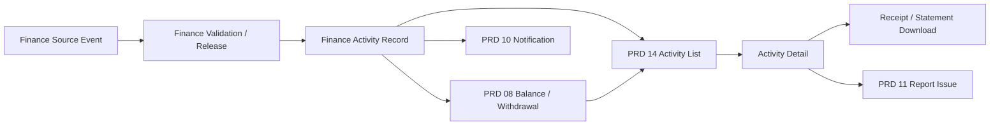

# MV PRD 14 - Finance Activity & Statements

Product: UmrahHaji.com Mutawwif View  
Module: Finance Activity & Statements  
Scope: Mutawwif Mobile Web App / Finance Activity Ledger, Transaction Detail, Receipts & Statements  
Platform: Mobile-first Responsive Web Platform  
Status: Draft  
Last Updated: 20 June 2026  

---

## 1. Objective

Finance Activity & Statements is the mutawwif-facing finance activity history module. It allows mutawwif to view, search, filter, inspect, and download eligible records for their own finance activities, including allowance source lines, jamaah tip records, referral reward releases, withdrawal requests, donation/infaq records, payout records, adjustments, reversals, and Finance-approved receipts/statements.

This module must help mutawwif answer:

1. What finance activity happened on my account?
2. Which amount came from allowance, tip, referral reward, withdrawal, donation, adjustment, or reversal?
3. Which trip, activity, referral, payout destination, or withdrawal request is related to this record?
4. Is this record pending, released, processing, paid, failed, reversed, cancelled, or rejected?
5. Can I download a receipt, statement, payout slip, or donation proof?
6. Which records affect available balance in PRD 08?
7. Which payout destination was used, shown safely as a masked label?
8. Where should I report a finance issue if the record looks wrong?

This module is not the withdrawal request module, not the payout execution workspace, not a finance approval tool, not a full accounting ledger, and not a tax filing system. PRD 08 owns balance and withdrawal request. PRD 09 owns payout destination setup. Admin/Travel Agency Finance owns approval, release, payout, reversal, settlement, receipts, and audit.

---

## 2. Relationship With Mutawwif View Master Scope

This module follows the Mutawwif View mobile web app scope:

1. Mutawwif can view only their own finance activity records.
2. Mutawwif cannot view another mutawwif's earnings, payout, allowance, tip, referral reward, or statement.
3. Mutawwif cannot edit finance records, approve payouts, mark paid, reverse transactions, upload proof, or change Finance status.
4. Mutawwif can download only receipts/statements that Finance has released for user-facing access.
5. All destination, payment method, and account labels must be masked.
6. Finance activity must include source, status, amount direction, owner, timestamp, and support reference where available.
7. Download/share actions must re-check permission and be auditable where policy requires.
8. Notification deep links from PRD 10 must re-check permission before opening activity detail.

Finance Activity & Statements is a P1-lite extension of PRD 08 if only history is needed. It becomes standalone PRD 14 because statements/downloads, cross-source search, and source-detail drilldown can grow beyond the Allowance & Tip dashboard.

---

## 3. Relationship With Admin, Travel Agency, Jamaah, and Mutawwif PRDs

| Source Module | Relationship |
| --- | --- |
| Admin Finance Management | Source of approved/released/paid/reversed records, finance reports, payout references, and audit |
| Admin Allowance Management | Source of allowance records, settlement status, receipt/proof status, and adjustment records |
| Admin Billing & Payment Management | Source of payment provider configuration, payout provider status, and finance receipts where applicable |
| Admin Mutawwif Management | Source of mutawwif account status, compliance eligibility, suspension, and payout eligibility |
| Admin Report Management | Destination for finance activity disputes or issues |
| Travel Agency Finance Management | Source of agency-scoped allowance/tip/settlement records if agency manages finance |
| Travel Agency Group Trip Management | Source of trip/assignment context for trip allowance and trip-related tip |
| Travel Agency Mutawwif Assignment | Source of assignment and completed trip reference that may link to finance records |
| Jamaah/User Transaction History | Provides shared list/detail/receipt pattern for user-facing transaction history |
| Jamaah Tip Flow | Future source of approved jamaah tip records where enabled |
| MV PRD 06 - Activity Guidance | Future source of validated activity completion evidence where Finance uses it |
| MV PRD 07 - Referral | Source of referral reward eligibility and reward source references |
| MV PRD 08 - Allowance & Tip | Source of available balance, pending balance, withdrawal request, and withdrawal history |
| MV PRD 09 - Payment Settings | Source of masked payout destination snapshot |
| MV PRD 10 - Notifications & Announcements | Sends finance activity, receipt, statement, payout, and reversal notifications |
| MV PRD 11 - Reports & Support | Destination for finance activity issue reporting |

### 3.1 Key Sync Rule

Finance Activity & Statements is a read-only user-facing ledger projection. It must not create, approve, or execute money movement.

Finance Source Event -> Finance Validation / Release -> Finance Activity Record -> Mutawwif Finance Activity List -> Detail / Receipt / Statement -> Report Issue if needed.

PRD 14 displays the activity history. PRD 08 displays available balance and owns withdrawal request. PRD 09 owns payout destination setup. Finance/Admin/provider systems remain authoritative for paid, failed, reversed, and settled states.

### 3.2 Cross-Role Boundary

| Role / Surface | Owns | Can Mutawwif View Display? | PRD 14 Rule |
| --- | --- | --- | --- |
| Admin Finance | Approval, release, payout, reversal, settlement, receipts, audit | Yes, user-facing activity and status only | Do not expose internal finance notes |
| Admin Allowance | Allowance records and settlement workflow | Yes, source label/detail where released | Mutawwif cannot edit or settle |
| Travel Agency Finance | Agency-scoped finance records | Yes, only own mutawwif records | Enforce agency and user scope |
| Jamaah/User View | Customer-facing transaction pattern and future tip source | Yes, as safe pattern/source only | Do not expose jamaah payment identity |
| Referral | Referral reward attribution and eligibility | Yes, as source detail after Finance release | PRD 14 does not alter reward logic |
| PRD 08 Allowance & Tip | Balance, withdrawal request, withdrawal history | Yes, as linked source and detail | PRD 14 does not submit withdrawal |
| PRD 09 Payment Settings | Payout destination | Yes, masked snapshot only | No destination editing here |
| Mutawwif View | Own finance activity read-only history | Yes | Own-user data scope only |

### 3.3 Boundary With PRD 07, PRD 08, and PRD 09

| Area | PRD 07 Referral | PRD 08 Allowance & Tip | PRD 09 Payment Settings | PRD 14 Finance Activity |
| --- | --- | --- | --- | --- |
| Referral code/link | Owns | No | No | Source reference only |
| Referral reward eligibility | Owns display | Consumes if released | No | Shows finance activity after release |
| Available balance | No | Owns | No | Shows activity records that affect balance |
| Withdrawal request | No | Owns | Requires destination | Shows history/detail only |
| Payout destination setup | No | Links to PRD 09 | Owns | Shows masked snapshot only |
| Receipt/statement download | No | Partial history | No | Owns user-facing finance document list |
| Payout approval/execution | No | Displays status | No | Displays status only |

---

## 4. Research Notes and Product Decisions

Finance activity history must feel trustworthy, traceable, and safe. Product decisions:

1. Every record must show amount direction, source, status, timestamp, and safe reference.
2. Available balance and finance activity are separate views. PRD 08 answers "what can I withdraw"; PRD 14 answers "what happened."
3. Receipts/statements are downloadable only if Finance releases them.
4. Failed, rejected, cancelled, reversed, or expired records should remain visible for support traceability.
5. Finance activity search must support source, status, date, amount, trip, withdrawal reference, and payout destination label.
6. Amount direction must come from metadata, not from title text or hard-coded plus/minus rules.
7. Payout destination must be shown as masked label only.
8. Sensitive finance notes, provider settlement details, bank account numbers, fraud scores, and internal approval remarks must stay hidden.
9. Any download or statement access should be logged if policy requires.
10. Finance screens should use clear statuses and large mobile controls because finance actions and downloads are high-trust moments.

Reference sources used as product direction:

1. PCI Security Standards Council - PCI DSS: https://www.pcisecuritystandards.org/standards/pci-dss/
2. Stripe Integration Security Guide: https://docs.stripe.com/security/guide
3. W3C WCAG 2.2 - Status Messages: https://www.w3.org/WAI/WCAG22/Understanding/status-messages.html
4. W3C WCAG 2.2 - Target Size Minimum: https://www.w3.org/WAI/WCAG22/Understanding/target-size-minimum.html
5. Personal Data Protection Act 2010, Laws of Malaysia Act 709: https://lom.agc.gov.my/act-detail.php?type=principal&lang=BI&act=709

### 4.1 Research Validation Notes

| Research Area | Product Interpretation | Impact on This PRD |
| --- | --- | --- |
| Payment data security | Avoid storing or exposing sensitive payment credentials | Show masked payment/payout labels only |
| Secure integration | Sensitive provider and settlement data should stay in Finance/provider systems | Display safe status and references, not provider internals |
| Status messages | Finance status changes must be perceivable and understandable | Use accessible status labels and update feedback |
| Target size | Mobile finance controls need comfortable tap targets | Search/filter/download/report actions must be easy to tap |
| Personal data protection | Finance history contains payout identity and personal transaction data | Enforce own-user scope, masking, audit, and minimum necessary display |

### 4.2 Finance Integrity Rule

PRD 14 must never imply that a record is final, paid, taxable, claimable, or guaranteed unless Finance/Admin/provider status marks it that way. Every amount needs a visible status and source.

### 4.3 Statement Safety Rule

A downloaded statement is a user-facing artifact generated from Finance-approved records. Mutawwif must not be able to edit, regenerate with altered values, or download unreleased internal finance reports.

---

## 5. Scope

### 5.1 In Scope for Phase 1

1. Finance Activity list.
2. Summary cards: Total Released, Pending, Withdrawn, Reversed/Adjusted.
3. Search by reference, source, trip, amount, status, payout label, or keyword.
4. Filters by date range, type, status, source, direction, and document availability.
5. Activity detail page.
6. Allowance source detail.
7. Tip source detail with privacy-safe jamaah aggregation.
8. Referral reward release detail.
9. Withdrawal record detail.
10. Donation/infaq record detail if enabled.
11. Adjustment/reversal detail.
12. Masked payout destination snapshot.
13. Receipt download where eligible.
14. Statement download by date range where Finance enables.
15. Report Issue handoff to PRD 11.
16. Deep links from PRD 08, PRD 09, PRD 10, and PRD 11.
17. Empty, loading, error, no-result, unavailable, and offline read-only states.
18. Audit logs for sensitive view/download actions.
19. Mobile-first responsive behavior.

### 5.2 In Scope for Phase 2

1. Monthly statement archive.
2. Multi-currency support, e.g. MYR/SAR.
3. Tax/compliance statement if legally required and Finance approves.
4. Donation certificate generation.
5. Advanced earning charts.
6. Statement email delivery.
7. CSV export if policy allows.
8. Finance dispute flow from activity detail.
9. Payout batch trace detail if Finance releases it.
10. Offline downloaded receipt vault with expiry.

### 5.3 Out of Scope

1. Withdrawal request creation.
2. Payout approval.
3. Payout execution.
4. Editing finance records.
5. Uploading payout proof.
6. Marking paid, failed, reversed, or settled.
7. Finance ledger editing.
8. Bank reconciliation.
9. Provider settlement reconciliation.
10. Full accounting ledger.
11. Payroll.
12. Tax filing.
13. Viewing another mutawwif's records.
14. Viewing jamaah private payment data.
15. Viewing internal Finance notes, fraud/risk score, or provider settlement internals.

---

## 6. User Roles and Access

| Role | Access Behavior |
| --- | --- |
| Pending mutawwif | No finance activity access until account rules allow |
| Invited mutawwif | No finance activity access unless activated |
| Active mutawwif | Can view own finance activity if Finance feature is enabled |
| Verified mutawwif | Can view full permitted own finance activity and eligible downloads |
| Lead mutawwif | Own records only; no assistant finance visibility |
| Assistant mutawwif | Own records only |
| Suspended mutawwif | Historical view may remain read-only; downloads/withdrawal-linked actions may be disabled |
| Replaced mutawwif | Can view own historical records; active trip finance may be recalculated by Finance |
| Admin Finance | Manages source records from Admin Panel, not this module |
| Travel Agency Finance | Manages agency-scoped finance from TA Portal, not this module |

### 6.1 Visibility Rules

Mutawwif can see:

1. Own finance activity list.
2. Own activity detail.
3. Own allowance/tip/referral/withdrawal/donation/adjustment source labels.
4. Own transaction reference.
5. Own status and timestamp.
6. Own masked payout destination label.
7. Downloadable receipt/statement if released.
8. Safe support reason/status if available.

Mutawwif must not see:

1. Other mutawwif finance records.
2. Jamaah full identity or payment method.
3. Full bank/e-wallet/account number.
4. Internal Finance notes.
5. Internal risk/fraud status.
6. Travel Agency settlement internals.
7. Platform commission/margin unless intentionally released.
8. Provider settlement or bank reconciliation detail.

### 6.2 Action Permission Rules

| Action | Mutawwif | Rule |
| --- | ---: | --- |
| View activity list | Yes | Own records only |
| View detail | Yes | Own records only |
| Search/filter | Yes | Own records only |
| Download receipt | Conditional | Only Finance-released documents |
| Download statement | Conditional | Only if Finance enables and permission allows |
| Share/download external file | Conditional | Must re-check permission |
| Report issue | Yes | Opens PRD 11 with context |
| Edit finance record | No | Admin/TA Finance only |
| Mark paid/reversed | No | Finance/Admin/provider only |
| Approve payout | No | Finance/Admin only |

---

## 7. Information Architecture

```text
Finance Activity & Statements
+-- Finance Activity List
|   +-- Summary Cards
|   +-- Search
|   +-- Filters
|   +-- Activity Cards
+-- Activity Detail
|   +-- Amount and Direction
|   +-- Status
|   +-- Source Detail
|   +-- Related Entity
|   +-- Masked Destination
|   +-- Timeline
|   +-- Documents
+-- Statements
|   +-- Date Range
|   +-- Statement Preview
|   +-- Download
+-- Download Center
|   +-- Receipts
|   +-- Payout Slips
|   +-- Donation Proof
+-- Linked Modules
    +-- Allowance & Tip
    +-- Payment Settings
    +-- Referral
    +-- Reports & Support
    +-- Notifications
```



### 7.1 Navigation Entry Points

| Entry Point | Behavior |
| --- | --- |
| PRD 08 Allowance & Tip | Opens finance activity filtered by balance source or withdrawal |
| PRD 08 Withdrawal detail | Opens related activity detail |
| PRD 09 Payment Settings | Opens finance activity filtered by payout destination usage |
| PRD 10 notification | Opens activity detail after permission revalidation |
| PRD 11 support case | Opens related finance activity if permitted |
| Profile / Finance menu | Opens Finance Activity list |
| Receipt/statement link | Opens detail or download after authentication |

---

## 8. Finance Activity Type and Status Model

### 8.1 Activity Types

| Type | Direction | Description | Source |
| --- | --- | --- | --- |
| Allowance Release | Incoming/credit | Finance-approved allowance released to mutawwif balance | Admin/TA Allowance |
| Jamaah Tip | Incoming/credit | Approved tip attributed to mutawwif | Jamaah Tip/Finance |
| Referral Reward Release | Incoming/credit | Approved referral reward released to balance | PRD 07/Finance |
| Withdrawal Request | Outgoing from app balance / payout to destination | Mutawwif withdrawal request | PRD 08/Finance |
| Payout Paid | Settlement event | Withdrawal or payout marked paid | Finance/provider |
| Donation/Infaq | Outgoing/debit | Mutawwif donation from available balance if enabled | PRD 08/Finance |
| Adjustment | Credit or debit | Manual Finance correction with safe reason | Admin/Finance |
| Reversal | Credit or debit | Reversal of prior activity | Admin/Finance/provider |
| Fee | Debit | Approved fee applied to withdrawal or payout if configured | Finance |
| Other | Depends on record | Finance-approved miscellaneous event | Finance |

### 8.2 Amount Direction Rules

| Direction | Display Rule | Example |
| --- | --- | --- |
| Credit | Use `+` prefix and credit/incoming style | +RM 500 |
| Debit | Use `-` prefix or debit style based on design system | -RM 100 |
| Neutral | Show amount without balance effect | RM 0 reference |
| Pending | Show amount with pending badge, not success color | +RM 250 Pending |
| Reversal | Use signed direction from Finance metadata | +RM 80 or -RM 80 |

Rules:

1. Amount direction must come from Finance metadata.
2. Withdrawal request can reduce app balance but represent incoming money to bank/e-wallet; wording must be clear.
3. Donation/infaq is normally debit from mutawwif balance.
4. Referral reward release is credit only after Finance approval.
5. Fees are debit and must be shown separately when available.

### 8.3 Status Model

| Status | Mutawwif Meaning |
| --- | --- |
| Draft | Created internally but not visible unless released |
| Pending | Waiting for validation, review, or processing |
| Released | Added to available or pending balance based on rule |
| Processing | Finance/provider is processing |
| Paid | Payout or transaction completed |
| Failed | Provider/Finance failed the process |
| Rejected | Finance rejected the record or request |
| Cancelled | Record/request cancelled |
| Reversed | Prior record reversed |
| Adjusted | Corrected by Finance with safe reason |
| Expired | Request or document expired |

Rules:

1. Mutawwif-facing status can be simplified but must map to internal Finance status.
2. Failed/rejected/reversed records remain visible for traceability.
3. Internal reasons are not shown unless converted to a safe public reason.

---

## 9. User Flows



### 9.0 Finance Activity Sync Flow



### 9.1 Flow: View Finance Activity

1. Mutawwif opens Finance Activity & Statements.
2. System validates authentication, role, permission, and data scope.
3. System loads own finance records only.
4. Mutawwif views summary cards and activity list.
5. Mutawwif searches or filters.
6. Mutawwif opens activity detail.

### 9.2 Flow: Download Receipt or Statement

1. Mutawwif opens activity detail or Statements.
2. System checks document availability and permission.
3. If eligible, system shows Download action.
4. Mutawwif downloads receipt/statement.
5. System creates audit event if required.
6. If not eligible, system shows no-document state.

### 9.3 Flow: Open From Withdrawal Detail

1. Mutawwif opens withdrawal detail in PRD 08.
2. Mutawwif taps View Finance Activity.
3. PRD 14 opens matching withdrawal activity after permission check.
4. Mutawwif sees status, destination snapshot, fees, net amount, and document status.

### 9.4 Flow: Report Finance Activity Issue

1. Mutawwif opens activity detail.
2. Mutawwif taps Report Issue.
3. PRD 11 opens Create Report with finance activity context token.
4. Report includes safe reference, source type, status, and amount context where allowed.
5. Admin/TA Finance receives case based on routing rules.

---

## 10. Screens and Components

### 10.1 Finance Activity List

Purpose: Give mutawwif a searchable history of own finance activities.

Components:

1. Page title: Finance Activity.
2. Summary cards.
3. Search input.
4. Filter chips.
5. Date range picker.
6. Type filter.
7. Status filter.
8. Activity card list.
9. Amount direction label.
10. Source label.
11. Document available badge.
12. Empty/no-result/offline state.

### 10.2 Activity Detail

Purpose: Show one finance activity with safe source, status, and downloadable artifacts.

Components:

1. Activity reference.
2. Amount and direction.
3. Status.
4. Source type.
5. Related trip/activity/referral/withdrawal.
6. Masked payout destination.
7. Fee/net amount if relevant.
8. Timeline.
9. Public-safe reason.
10. Receipt/statement/document actions.
11. Report Issue action.

### 10.3 Statements

Purpose: Allow Finance-approved statement download by date range.

Components:

1. Date range selector.
2. Included activity count.
3. Statement type.
4. Currency.
5. Download button.
6. Statement unavailable state.
7. Privacy note.

### 10.4 Download Center

Purpose: Centralize eligible receipt, payout slip, donation proof, and statement downloads.

Rules:

1. Show only released documents.
2. Use stable public labels.
3. Re-check permission on each download.
4. Show generated/downloaded timestamp where available.

---

## 11. Data and Field Requirements

### 11.1 FinanceActivityRecord

| Field | Type | Required | Notes |
| --- | --- | --- | --- |
| activity_id | UUID | Yes | Primary identifier |
| activity_reference | String | Yes | User-facing reference |
| mutawwif_id | UUID | Yes | Owner |
| user_id | UUID | Yes | Authenticated account |
| agency_id | UUID | Optional | Source agency if applicable |
| activity_type | Enum | Yes | allowance, tip, referral_reward, withdrawal, payout_paid, donation, adjustment, reversal, fee, other |
| direction | Enum | Yes | credit, debit, neutral |
| amount | Decimal | Yes | Display amount |
| currency | String | Yes | MYR default unless configured |
| status | Enum | Yes | Mutawwif-facing status |
| internal_status | Enum | Optional | Finance mapping, not always exposed |
| source_module | Enum | Yes | PRD07, PRD08, PRD09, Admin Finance, TA Finance, etc. |
| source_record_id | UUID/String | Optional | Related source record |
| group_trip_id | UUID | Optional | Trip context |
| activity_context_id | UUID | Optional | Activity context |
| referral_id | UUID | Optional | Referral source |
| withdrawal_id | UUID | Optional | Withdrawal source |
| payout_destination_snapshot | JSON | Optional | Masked destination only |
| fee_amount | Decimal | Optional | Fee if relevant |
| net_amount | Decimal | Optional | Net if relevant |
| safe_reason | Text | Optional | Public-safe explanation |
| posted_at | DateTime | Yes | Finance posting timestamp |
| created_at | DateTime | Yes | Created timestamp |
| updated_at | DateTime | Yes | Updated timestamp |

### 11.2 FinanceActivityDocument

| Field | Type | Required | Notes |
| --- | --- | --- | --- |
| document_id | UUID | Yes | Primary identifier |
| activity_id | UUID | Yes | Parent activity |
| document_type | Enum | Yes | receipt, statement, payout_slip, donation_proof, adjustment_note |
| document_status | Enum | Yes | available, processing, unavailable, expired, revoked |
| file_label | String | Yes | User-facing label |
| file_format | Enum | Yes | pdf, csv, image |
| generated_at | DateTime | Optional | Generation time |
| expires_at | DateTime | Optional | Link/document expiry |
| download_url | URL | Optional | Secure, short-lived, permission-checked |
| visibility | Enum | Yes | mutawwif_public, internal_only |

### 11.3 FinanceStatementRequest

| Field | Type | Required | Notes |
| --- | --- | --- | --- |
| statement_request_id | UUID | Yes | Primary identifier |
| user_id | UUID | Yes | Requesting user |
| mutawwif_id | UUID | Yes | Owner |
| date_from | Date | Yes | Start date |
| date_to | Date | Yes | End date |
| currency | String | Yes | Currency |
| statement_type | Enum | Yes | summary, detailed |
| status | Enum | Yes | processing, ready, failed, expired |
| activity_count | Number | Optional | Included records count |
| generated_document_id | UUID | Optional | Output document |
| created_at | DateTime | Yes | Timestamp |

### 11.4 FinanceActivityAuditEvent

| Field | Type | Required | Notes |
| --- | --- | --- | --- |
| audit_id | UUID | Yes | Primary identifier |
| user_id | UUID | Yes | Actor |
| mutawwif_id | UUID | Yes | Owner |
| action | Enum | Yes | view_list, view_detail, search, filter, download_document, generate_statement, report_issue |
| activity_id | UUID | Optional | Related activity |
| document_id | UUID | Optional | Related document |
| data_scope | JSON | Yes | Scope at action time |
| created_at | DateTime | Yes | Timestamp |

---

## 12. Permission Logic

### 12.1 Permission Chain

Finance Activity & Statements must follow the existing permission chain:

Portal Access -> Role -> Permission Group -> Module Permission -> Action Permission -> Data Scope.

### 12.2 Permission Keys

| Permission Key | Description |
| --- | --- |
| mutawwif.finance_activity.view | View Finance Activity module and list |
| mutawwif.finance_activity.detail.view | View own finance activity detail |
| mutawwif.finance_activity.search | Search/filter own finance records |
| mutawwif.finance_activity.document.view | View available document metadata |
| mutawwif.finance_activity.document.download | Download released receipt/statement |
| mutawwif.finance_activity.statement.generate | Generate/download statement if enabled |
| mutawwif.finance_activity.report_issue | Open PRD 11 report handoff |
| mutawwif.finance_activity.sensitive.view | Future restricted sensitive view permission |

### 12.3 Data Scope Rules

| Scope | Rule |
| --- | --- |
| Own user | Required for all activity access |
| Own mutawwif profile | Required for all activity access |
| Own withdrawal | Required for withdrawal detail |
| Own payout destination | Masked snapshot only |
| Own referral reward | Required for referral reward detail |
| Assigned trip context | Show trip label only if mutawwif had relevant scope |
| Agency scope | Agency records must match source relationship |
| Released document | Required for receipt/statement download |

### 12.4 Sensitive Field Rules

| Data | Mutawwif Visibility |
| --- | --- |
| Full bank/e-wallet/account number | Never |
| Payout destination | Masked label only |
| Provider settlement ID | Hidden unless safe reference released |
| Internal Finance note | Never |
| Internal fraud/risk score | Never |
| Jamaah payment identity | Hidden |
| Platform commission/margin | Hidden unless intentionally released |
| Statement file | Only if generated/released for mutawwif |

---

## 13. Functional Requirements

### 13.1 List and Search

| ID | Requirement | Priority |
| --- | --- | --- |
| MV-FAS-001 | System must display Finance Activity entry for mutawwif with permission | P1 |
| MV-FAS-002 | System must display only own finance activity records | P1 |
| MV-FAS-003 | System must show summary cards for released, pending, withdrawn, and adjusted/reversed totals | P1 |
| MV-FAS-004 | System must support search by reference, source, trip, amount, status, payout label, and keyword | P1 |
| MV-FAS-005 | System must support filters by date range, type, status, source, direction, and document availability | P1 |
| MV-FAS-006 | System must support empty, loading, error, no-result, and offline read-only states | P1 |

### 13.2 Activity Detail

| ID | Requirement | Priority |
| --- | --- | --- |
| MV-FAS-007 | System must allow mutawwif to open permitted own activity detail | P1 |
| MV-FAS-008 | Activity detail must show amount, direction, status, source, reference, and timestamp | P1 |
| MV-FAS-009 | Activity detail must show related trip/referral/withdrawal/payout context where permitted | P1 |
| MV-FAS-010 | Activity detail must show masked payout destination only | P1 |
| MV-FAS-011 | Activity detail must hide internal Finance notes and provider internals | P1 |
| MV-FAS-012 | Activity detail must show public-safe reason for rejected/failed/reversed/adjusted records where available | P1 |

### 13.3 Receipts and Statements

| ID | Requirement | Priority |
| --- | --- | --- |
| MV-FAS-013 | System must show receipt/document action only when document is released and available | P1 |
| MV-FAS-014 | System must re-check permission before document download | P1 |
| MV-FAS-015 | System must create audit event for download where policy requires | P1 |
| MV-FAS-016 | System must support statement generation/download by date range if Finance enables | P1 |
| MV-FAS-017 | System must show unavailable/processing/expired state for documents | P1 |

### 13.4 Integrations

| ID | Requirement | Priority |
| --- | --- | --- |
| MV-FAS-018 | PRD 08 must deep-link to matching activity detail from balance/withdrawal history | P1 |
| MV-FAS-019 | PRD 09 must deep-link to activity filtered by masked payout destination usage | P2 |
| MV-FAS-020 | PRD 10 must open finance activity notification after permission revalidation | P1 |
| MV-FAS-021 | PRD 11 must receive finance activity context when mutawwif reports an issue | P1 |
| MV-FAS-022 | PRD 07 referral reward detail can link to released reward activity | P1 |

---

## 14. Business Rules

1. Finance Activity is read-only for mutawwif.
2. Mutawwif can view only own records.
3. Every displayed amount must have direction and status.
4. Activity records must be sourced from Finance-approved or Finance-visible records.
5. Pending, failed, rejected, reversed, and adjusted records remain visible for traceability.
6. Available balance is owned by PRD 08; PRD 14 shows records that affect or explain it.
7. Payout destination management belongs to PRD 09.
8. Downloadable documents appear only if Finance releases them.
9. Statement date range must obey Finance policy limits.
10. Direct download links must be permission-checked and short-lived.
11. Internal Finance notes must not appear in Mutawwif View.
12. Provider settlement details must not appear unless converted to safe reference.
13. Support issue handoff must use safe context token.
14. Notification previews must use safe summary only.
15. Suspended accounts may retain read-only historical view based on policy.

---

## 15. API and Integration Expectations

### 15.1 API Endpoints

Exact endpoint naming may follow backend standards, but expected capabilities are:

| Capability | Expected Behavior |
| --- | --- |
| List finance activities | Returns own permitted activity records |
| Search/filter activities | Searches own records only |
| Get activity detail | Returns safe detail for one record |
| Get document metadata | Returns released document labels/status |
| Download activity document | Secure permission-checked download |
| Generate statement | Creates statement request if enabled |
| Get statement status | Returns processing/ready/failed/expired status |
| Report activity issue | Passes safe context to PRD 11 |

### 15.2 Integration Events

| Event | Producer | Consumer |
| --- | --- | --- |
| finance_activity.created | Admin/TA Finance | PRD 14, PRD 10 if notify |
| finance_activity.status_changed | Finance/provider | PRD 14, PRD 10 |
| finance_activity.document_available | Finance | PRD 14, PRD 10 if policy requires |
| finance_activity.reversed | Finance/provider | PRD 14, PRD 10 |
| finance_activity.statement_generated | PRD 14/Finance | PRD 14 |
| finance_activity.issue_reported | PRD 14/PRD 11 | Admin/TA Report Management |

### 15.3 Source Mapping

| Source | PRD 14 Display |
| --- | --- |
| PRD 08 Available Balance | Activity lines that explain balance movements |
| PRD 08 Withdrawal | Withdrawal request, payout status, fee/net amount |
| PRD 07 Referral | Reward release and adjustment records |
| PRD 09 Payout Destination | Masked destination snapshot |
| Admin Allowance | Allowance release, adjustment, reversal, receipt |
| TA Finance | Agency-managed allowance/tip/settlement source |
| Jamaah Tip Flow | Approved tip line with privacy-safe aggregation |

---

## 16. UI State Requirements

### 16.1 Empty States

| Screen | Empty State |
| --- | --- |
| Finance Activity list | No finance activity yet |
| Search result | No activity matches current search/filter |
| Detail documents | No receipt or statement available |
| Statements | Statement generation is not available |
| Download Center | No released documents yet |

### 16.2 Loading States

1. Activity list skeleton.
2. Summary card loading.
3. Detail page loading.
4. Document download preparing.
5. Statement generation processing.
6. Filter/search loading.

### 16.3 Error States

| Error | UX Behavior |
| --- | --- |
| Permission denied | Show safe access message and no data |
| Activity unavailable | Show unavailable state |
| Document expired | Show expired and regenerate option if allowed |
| Statement failed | Show safe failure reason and retry if allowed |
| Offline | Show cached read-only list/detail if available |
| Download blocked | Show permission or unavailable message |

### 16.4 Accessibility States

1. Status changes must be text-visible and programmatically determinable.
2. Amount direction must not rely on color alone.
3. Download success/failure must be announced.
4. Search result count must be clear.
5. Date range controls must have clear labels.
6. Tap targets must be large enough for mobile use.

---

## 17. Security, Privacy, and Compliance

### 17.1 Security Requirements

1. All APIs require authentication.
2. Every request must verify own-user and own-mutawwif scope.
3. Document download must be permission-checked and time-limited.
4. Full payment/payout credentials must never be returned.
5. Internal Finance notes must be excluded at query/serializer layer.
6. Statement generation must use Finance-approved records only.
7. Download and sensitive view actions should be audit logged.
8. Direct links from notifications or receipts must re-check permission.

### 17.2 Privacy Requirements

1. Show minimum necessary finance details.
2. Mask payout destinations.
3. Hide jamaah private payment identity.
4. Hide provider settlement internals.
5. Hide platform margin/commission unless intentionally released.
6. Use safe summaries in notifications.
7. Retain records according to Finance/legal policy.

### 17.3 Compliance Requirements

1. Receipts/statements must identify source, date range, currency, and status.
2. Statement generation must not include unreleased internal records.
3. Tax/compliance language must not be implied unless legal/Finance approves it.
4. Reversed/adjusted records must remain traceable.
5. Audit logs must preserve critical finance access actions where required.

---

## 18. Analytics and Monitoring

### 18.1 Product Analytics

| Metric | Purpose |
| --- | --- |
| Activity list views | Measure finance history usage |
| Search/filter usage | Improve finance discovery |
| Detail opens by type | Identify high-interest record types |
| Receipt downloads | Understand document demand |
| Statement downloads | Validate standalone module need |
| Report issue clicks | Identify finance confusion/disputes |
| No-result searches | Identify missing labels or records |
| Download failures | Improve reliability |

### 18.2 Operational Monitoring

1. Finance activity sync delay.
2. Activity detail API error rate.
3. Document generation failure rate.
4. Statement generation delay.
5. Permission denied spikes.
6. Masking regression tests.
7. Notification deep-link failure rate.
8. Finance record mismatch with PRD 08 balance.

---

## 19. Acceptance Criteria

### 19.1 List and Search

1. Given mutawwif has finance activity, when opening PRD 14, then own records appear.
2. Given mutawwif searches by reference, when matching own record exists, then result appears.
3. Given another mutawwif record matches search keyword, when search runs, then it does not appear.
4. Given no records exist, when list opens, then empty state appears.

### 19.2 Activity Detail

1. Given mutawwif opens own activity, then detail shows amount, direction, status, source, and timestamp.
2. Given activity has payout destination, then only masked destination label appears.
3. Given activity has internal Finance note, then note is not visible.
4. Given activity is failed/rejected/reversed, then safe public reason appears if available.

### 19.3 Receipt and Statement

1. Given receipt is released, when detail opens, then Download Receipt appears.
2. Given receipt is not released, when detail opens, then no-document state appears.
3. Given statement generation is enabled, when mutawwif selects valid date range, then statement can be generated/downloaded.
4. Given document download is attempted by wrong user, then access is denied.

### 19.4 Integrations

1. Given withdrawal exists in PRD 08, when mutawwif opens View Finance Activity, then matching PRD 14 detail opens.
2. Given payout destination is used, when PRD 09 opens related history, then PRD 14 filters by masked destination usage.
3. Given finance activity status changes, when notification policy applies, then PRD 10 notification deep-links to PRD 14.
4. Given mutawwif reports issue from activity detail, when PRD 11 opens, then finance activity context is prefilled safely.

### 19.5 Security and Privacy

1. Given direct link targets another user's finance activity, then system denies access.
2. Given a record includes provider settlement ID, then it is hidden unless safe reference is released.
3. Given statement contains internal Finance-only records, then those records are excluded from mutawwif statement.
4. Given download occurs, then audit event is created if policy requires.

---

## 20. Dependencies

1. Authentication and session management.
2. Role and permission engine.
3. Admin Finance Management.
4. Admin Allowance Management.
5. Travel Agency Finance Management.
6. PRD 07 Referral.
7. PRD 08 Allowance & Tip.
8. PRD 09 Payment Settings.
9. PRD 10 Notifications.
10. PRD 11 Reports & Support.
11. Finance activity record service.
12. Receipt/statement generation service.
13. Secure document download service.
14. Audit logging service.
15. Data masking utilities.

---

## 21. Risks and Mitigations

| Risk | Impact | Mitigation |
| --- | --- | --- |
| Mutawwif treats pending amount as paid | Trust/finance issue | Clear status, direction, and source labels |
| Internal finance data leaks | Privacy/compliance issue | Serializer-level exclusion and permission tests |
| Statement differs from PRD 08 balance | Confusion | Use same Finance activity source and reconciliation checks |
| Downloaded documents expose too much | Privacy/compliance issue | Finance-release gate and redacted templates |
| PRD 14 duplicates PRD 08 | Scope confusion | PRD 08 balance/request; PRD 14 history/detail/statements |
| Unsupported tax interpretation | Legal risk | Avoid tax claims unless Finance/legal approves |
| Search leaks other user records | Security issue | Own-user filter before query result/count |
| Stale payout destination shown | User confusion | Use immutable masked destination snapshot per activity |

---

## 22. Release Plan

### 22.1 Phase 1 Release

1. Finance Activity menu entry.
2. Activity list.
3. Summary cards.
4. Search and filters.
5. Activity detail.
6. Activity type/status model.
7. Receipt download where released.
8. Statement download if Finance enables.
9. PRD 08 deep link.
10. PRD 09 filtered destination usage link.
11. PRD 10 notification deep link.
12. PRD 11 report issue handoff.
13. Permission, masking, and audit enforcement.
14. Mobile responsive behavior.

### 22.2 Phase 1 Rollout Checks

1. Own records visible.
2. Other mutawwif records blocked.
3. Masked destination only.
4. Internal Finance notes hidden.
5. Provider settlement internals hidden.
6. Receipt download permission checked.
7. Statement excludes internal-only records.
8. PRD 08 balance and PRD 14 activity reconcile.
9. Notification deep link re-checks permission.
10. Report issue handoff uses safe context.

### 22.3 Phase 2 Candidate Enhancements

1. Monthly statement archive.
2. Multi-currency.
3. Donation certificate.
4. CSV export.
5. Advanced charts.
6. Finance dispute flow.
7. Statement email delivery.
8. Offline receipt vault.

---

## 23. QA Checklist

### 23.1 Functional QA

1. Open Finance Activity list.
2. Search by reference.
3. Filter by type.
4. Filter by status.
5. Filter by date range.
6. Open allowance release detail.
7. Open tip detail.
8. Open referral reward detail.
9. Open withdrawal detail.
10. Open donation/infaq detail.
11. Open adjustment/reversal detail.
12. Download eligible receipt.
13. Generate/download statement if enabled.
14. Report issue from detail.

### 23.2 Permission QA

1. Active mutawwif own records.
2. Verified mutawwif download eligibility.
3. Suspended mutawwif read-only behavior.
4. Replaced mutawwif historical records.
5. Other mutawwif record blocked.
6. Internal note hidden.
7. Full payout destination hidden.
8. Provider settlement details hidden.
9. Statement direct link blocked for wrong user.
10. Download audit created.

### 23.3 Integration QA

1. PRD 08 withdrawal opens matching PRD 14 detail.
2. PRD 09 destination usage filter works.
3. PRD 07 reward release appears after Finance release.
4. PRD 10 finance notification opens PRD 14.
5. PRD 11 report handoff receives safe finance context.
6. Admin Finance status update syncs to PRD 14.
7. TA Finance agency-managed source appears only for own mutawwif record.

### 23.4 Accessibility QA

1. Status labels are text-visible.
2. Amount direction is not color-only.
3. Search result count is clear.
4. Date range controls are labelled.
5. Download success/failure is announced.
6. Error states are understandable.
7. Tap targets are large enough.
8. Receipts/statement actions are keyboard accessible.

---

## 24. Open Questions

1. Should PRD 14 be P1 standalone or remain P1-lite inside PRD 08 for MVP?
2. Which receipt/statement types are legally or operationally required for mutawwif?
3. Should mutawwif be allowed to download date-range statement in Phase 1?
4. Should donation/infaq proof be generated by UmrahHaji.com or external provider?
5. Should multi-currency appear in Phase 1 if trip activity uses SAR?
6. Which finance records should trigger PRD 10 notification?
7. Should tax/compliance statement be explicitly out of launch scope until legal review?
8. How long should receipt/statement download links remain valid?

---

## 25. Final Product Decision

Finance Activity & Statements must be implemented as a read-only, own-record finance history and statement module for mutawwif, synchronized with Admin Finance, Travel Agency Finance, PRD 07 Referral, PRD 08 Allowance & Tip, PRD 09 Payment Settings, PRD 10 Notifications, and PRD 11 Reports & Support.

The product direction is:

1. PRD 08 remains balance and withdrawal request.
2. PRD 14 becomes finance activity history, detail, receipts, and statements.
3. Every record must show amount direction, status, source, and timestamp.
4. Downloads are allowed only for Finance-released user-facing documents.
5. All payout destination and payment labels must be masked.
6. Internal Finance notes, provider settlement data, fraud/risk data, and other users' records must stay hidden.
7. Finance issue escalation goes through PRD 11 with safe context.

This gives mutawwif a trustworthy personal finance record without weakening Finance ownership, payout controls, or privacy boundaries.
