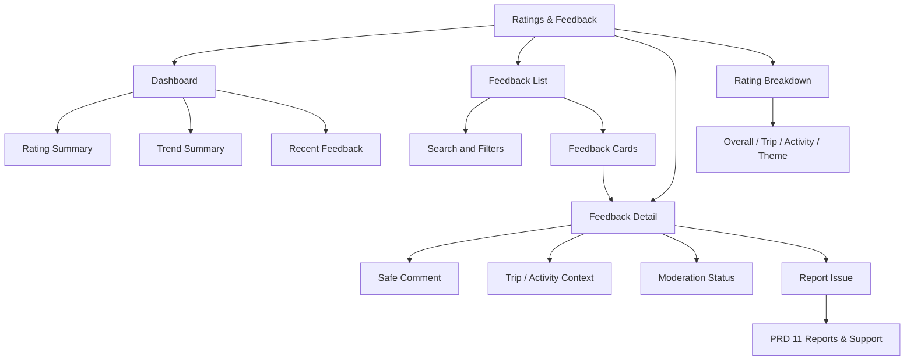
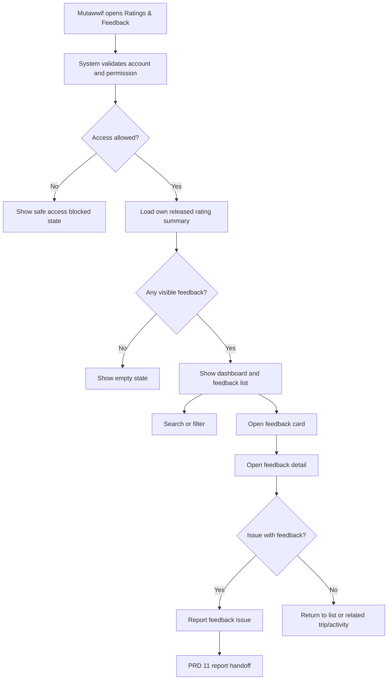
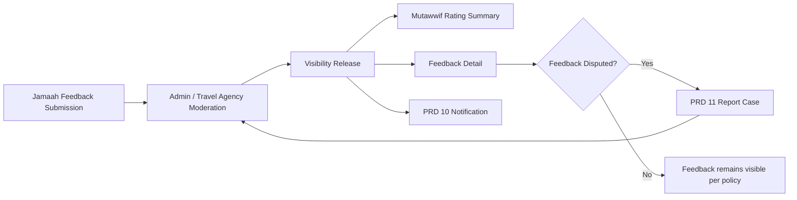

# MV PRD 15 - Ratings & Feedback

Product: UmrahHaji.com Mutawwif View  
Module: Ratings & Feedback  
Scope: Mutawwif Mobile Web App / Own Rating Summary, Moderated Feedback Visibility, Service Quality Signals & Feedback Dispute Handoff  
Platform: Mobile-first Responsive Web Platform  
Status: Draft  
Last Updated: 20 June 2026  

---

## 1. Objective

Ratings & Feedback is the mutawwif-facing service quality visibility module. It allows mutawwif to view their own moderated rating summary, approved feedback excerpts, trip/activity feedback signals, quality trend, and feedback-related notifications without exposing jamaah private identity or internal moderation details.

This module must help mutawwif answer:

1. What is my current visible rating summary?
2. Which feedback has been approved for me to see?
3. Which trip, activity, or service area influenced my rating?
4. Which comments are private, anonymous, moderated, or hidden?
5. Did any recent low rating require my attention or reflection?
6. Can I report feedback that is abusive, inaccurate, or violates policy?
7. Which feedback is used for assignment readiness or performance review?
8. What is hidden from me because of jamaah privacy, moderation, or internal review?

This module is not a public testimonial publishing tool, not a moderation console, not a way for mutawwif to delete negative reviews, not a disciplinary workflow, and not a payment/tip module. Admin Panel and Travel Agency Portal own feedback collection, moderation, response, escalation, and analytics. Mutawwif View receives a safe, scoped, moderated projection.

---

## 2. Relationship With Mutawwif View Master Scope

This module follows the Mutawwif View mobile web app scope:

1. Mutawwif can view only their own rating summary and feedback records released to them.
2. Mutawwif cannot view feedback for other mutawwif.
3. Mutawwif cannot reveal anonymous jamaah identity.
4. Mutawwif cannot edit, delete, approve, hide, publish, or moderate feedback.
5. Mutawwif can report unfair, abusive, unrelated, or privacy-violating feedback through PRD 11 Reports & Support.
6. Mutawwif can open related trip/activity context only if the trip/activity remains within their data scope.
7. Comments and media are shown only after moderation and visibility release.
8. Ratings should not automatically create punishment, payout change, or assignment block unless Admin/TA policy explicitly uses them through separate governance.

Ratings & Feedback is P2 for MVP if ratings are informational only. It becomes P1 if mutawwif rating affects assignment readiness, marketplace trust, quality scoring, or Travel Agency selection at launch.

---

## 3. Relationship With Admin, Travel Agency, Jamaah, and Mutawwif PRDs

| Source Module | Relationship |
| --- | --- |
| Admin Testimonial Management | Source of moderated feedback, rating approval, visibility, public display consent, archive, and audit |
| Admin Mutawwif Management | Consumes rating/performance summary for mutawwif profile, eligibility, and quality review |
| Admin Group Trip Management | Source of trip/activity context and completed trip references |
| Admin Report Management | Destination for unfair/abusive feedback reports or escalated low-rating issues |
| Travel Agency Testimonials | Source of agency-scoped trip, activity, mutawwif, and service feedback |
| Travel Agency Mutawwif Assignment | May consume rating/performance summary for assignment decisions if policy enables |
| Travel Agency Group Trip Management | Source of completed trip/activity context |
| Jamaah Testimonials & Feedback | Source of jamaah end-of-trip feedback, daily activity feedback, rating, comments, media, and consent |
| Jamaah My Group Trip | Feedback request is triggered from jamaah trip completion/activity completion |
| MV PRD 05 - My Group Trip & Trip Details | Provides trip context for feedback summary and trip-level feedback detail |
| MV PRD 06 - Activity Guidance | Provides activity context for daily/activity feedback signals |
| MV PRD 10 - Notifications & Announcements | Sends new visible feedback, rating summary, moderation release, or dispute update notifications |
| MV PRD 11 - Reports & Support | Destination for feedback dispute, abusive feedback report, or privacy concern |
| MV PRD 14 - Finance Activity & Statements | Tip/gratuity remains separate from rating and feedback |

### 3.1 Key Sync Rule

Ratings & Feedback is a moderated visibility surface, not the source of feedback truth.

Jamaah Feedback Submission -> Admin/Travel Agency Moderation -> Visibility Release -> Mutawwif Rating Summary / Feedback Detail -> Report Issue if needed.

If moderation status changes, the mutawwif-facing record must update or become unavailable. Mutawwif View must not display raw unmoderated comments, media, submitter identity, or internal moderation remarks.

### 3.2 Cross-Role Boundary

| Role / Surface | Owns | Can Mutawwif View Display? | PRD 15 Rule |
| --- | --- | --- | --- |
| Admin Testimonial Management | Moderation, public consent, rating governance, archive, analytics | Yes, only released feedback and summary | Do not expose moderation internals |
| Travel Agency Testimonials | Agency-scoped feedback, response, escalation, analytics | Yes, only feedback released to mutawwif | Enforce agency/trip/assignment scope |
| Jamaah/User View | Feedback submission and public consent | Yes, safe rating/comment only | Hide private identity by default |
| Admin Mutawwif Management | Performance/quality usage | Yes, as safe summary if policy allows | Do not expose internal scoring logic |
| Reports & Support | Dispute/escalation handling | Yes, as report status link | Dispute does not delete feedback automatically |
| Mutawwif View | Own rating visibility and dispute handoff | Yes | Read-only, own records |

### 3.3 Boundary With Tips, Reports, and Testimonials

| Area | Ratings & Feedback | Reports & Support | Allowance/Tip |
| --- | --- | --- | --- |
| User rating/comment | Owns visible display | Can escalate issue | No |
| Public testimonial consent | Display only if released | No | No |
| Complaint/incident | Link/escalate | Owns case handling | No |
| Tip/gratuity | Show no payment linkage | No | Owns finance/tip status |
| Mutawwif response | Phase 2 only if policy allows | Public support reply only | No |
| Abuse/unfair feedback | Report issue handoff | Owns dispute case | No |

Rules:

1. Tip/gratuity must not be tied to positive feedback.
2. Low rating should not automatically become a penalty.
3. Feedback with complaint content can create or link to PRD 11 case.
4. Public testimonial use requires jamaah consent and moderation, but PRD 15 is not the public publishing module.

---

## 4. Research Notes and Product Decisions

Ratings and feedback affect trust, assignment confidence, and service quality. Product decisions:

1. Mutawwif should see feedback only after moderation and visibility release.
2. Anonymous feedback should remain anonymous to mutawwif unless policy explicitly reveals identity through authorized Admin/TA surfaces.
3. Rating summaries must be based on verified trip/activity participation, not arbitrary public submissions.
4. Public testimonial eligibility requires consent and moderation, but mutawwif-facing visibility can be separate from public display.
5. Incentives, tips, allowance, or payout must not be conditioned on positive ratings.
6. Feedback should be separated into Overall Trip, Travel Agency, Mutawwif, Activity, and Service themes where source supports it.
7. Mutawwif should be able to report abusive, unrelated, privacy-violating, or factually disputed feedback.
8. Disputing feedback does not immediately hide it unless policy or moderation decides.
9. Rating changes and dispute status updates should be accessible and visible through PRD 10 notifications where needed.
10. Feedback should support learning and service improvement without exposing private jamaah data or internal scoring logic.

Reference sources used as product direction:

1. FTC - Consumer Reviews and Testimonials guidance: https://www.ftc.gov/business-guidance/advertising-marketing/consumer-reviews
2. W3C WCAG 2.2 - Status Messages: https://www.w3.org/WAI/WCAG22/Understanding/status-messages.html
3. W3C WCAG 2.2 - Target Size Minimum: https://www.w3.org/WAI/WCAG22/Understanding/target-size-minimum.html
4. Personal Data Protection Act 2010, Laws of Malaysia Act 709: https://lom.agc.gov.my/act-detail.php?type=principal&lang=BI&act=709

### 4.1 Research Validation Notes

| Research Area | Product Interpretation | Impact on This PRD |
| --- | --- | --- |
| Review integrity | Reviews should reflect genuine experience and should not be manipulated | Use verified trip/activity source and moderation release |
| Feedback privacy | Feedback can contain personal experience, identity, media, and sensitive comments | Hide jamaah identity and media unless safely released |
| Status messages | Rating/dispute updates should be perceivable | Use accessible status updates and notification deep links |
| Target size | Mobile actions should be easy to tap | Filter, feedback card, report issue, and trend controls need comfortable targets |
| Personal data protection | Feedback may include personal and trip data | Minimum necessary display, masking, data scope, and audit |

### 4.2 Review Integrity Rule

Ratings shown to mutawwif must come from verified trip/activity feedback or Admin/TA-approved records. The module must not include unverified public comments, incentivized review manipulation, or rating data not tied to a real service relationship.

### 4.3 Privacy Safety Rule

The default display should answer "what feedback can help me improve?" without exposing "who exactly said it and what private details were inside their trip experience?"

---

## 5. Scope

### 5.1 In Scope for Phase 1

1. Ratings & Feedback dashboard.
2. Own rating summary.
3. Rating breakdown by source: overall mutawwif, trip, activity, service theme.
4. Feedback list with moderated visible feedback only.
5. Feedback detail page.
6. Safe trip/activity context.
7. Anonymous/hidden identity handling.
8. Feedback status labels: Visible, Pending Moderation, Hidden, Flagged, Disputed, Archived.
9. Low rating alert where released.
10. Trend summary by time period.
11. Public-safe comment excerpt.
12. Media visibility only if moderated/released.
13. Report unfair/abusive feedback handoff to PRD 11.
14. Deep links from PRD 05, PRD 06, PRD 10, and PRD 11.
15. Empty, loading, error, unavailable, and offline read-only states.
16. Audit logs for sensitive feedback detail views.
17. Mobile-first responsive behavior.

### 5.2 In Scope for Phase 2

1. Mutawwif response to feedback if policy allows.
2. Quality improvement tips linked to PRD 12 Guidance Library.
3. Advanced rating trend chart.
4. Sentiment/theme summary if approved.
5. Feedback coaching checklist.
6. Lead mutawwif team-level feedback if policy allows.
7. Appeal workflow inside module, instead of PRD 11 handoff.
8. Public profile rating preview.
9. Assignment readiness impact explanation.
10. Rating export for mutawwif personal record if policy allows.

### 5.3 Out of Scope

1. Feedback submission by jamaah.
2. Feedback request creation.
3. Moderation queue.
4. Public testimonial publishing.
5. Editing customer feedback.
6. Deleting negative feedback.
7. Revealing anonymous identity.
8. Travel Agency response workflow.
9. Admin internal notes.
10. Tip/gratuity processing.
11. Automatic payout or assignment change based on rating.
12. AI sentiment decisioning for launch.
13. Marketing testimonial campaign management.
14. Exporting all feedback/media in P1.

---

## 6. User Roles and Access

| Role | Access Behavior |
| --- | --- |
| Pending mutawwif | No ratings access unless account policy allows onboarding preview |
| Invited mutawwif | No ratings access until activated |
| Active mutawwif | Can view own released rating summary if feature enabled |
| Verified mutawwif | Can view full own released feedback and rating summary |
| Lead mutawwif | Own feedback only; team feedback only in future policy |
| Assistant mutawwif | Own feedback only |
| Suspended mutawwif | Historical view may remain read-only; dispute/report may be limited |
| Replaced mutawwif | Can view own historical feedback if policy allows |
| Admin | Moderates and manages feedback from Admin Panel, not this module |
| Travel Agency staff | Views/responds/escalates agency feedback from TA Portal, not this module |

### 6.1 Visibility Rules

Mutawwif can see:

1. Own rating summary.
2. Own released feedback comments.
3. Own feedback source label.
4. Safe trip/activity label.
5. Anonymous label where identity is hidden.
6. Moderation/release status visible to mutawwif.
7. Report issue/dispute status if linked.
8. Public-safe theme/category.

Mutawwif must not see:

1. Other mutawwif feedback.
2. Jamaah private identity by default.
3. Anonymous submitter identity.
4. Internal moderation notes.
5. Travel Agency internal notes.
6. Admin internal scoring logic.
7. Unmoderated raw comments/media.
8. Private media attachments.
9. Feedback removed for privacy/safety reason.
10. Tip/payment details linked to feedback.

### 6.2 Access State Rules

| Account State | Rating Summary | Feedback Detail | Report Feedback | Media |
| --- | --- | --- | --- | --- |
| Active | Yes, if released | Yes, own released only | Yes | Released only |
| Verified | Yes | Yes | Yes | Released only |
| Pending | Limited/no | No | No | No |
| Suspended | Read-only/limited | Limited | Limited | No |
| Replaced | Historical only if policy allows | Historical only | Limited | Released only |
| Deactivated | No access | No | No | No |

---

## 7. Information Architecture

```text
Ratings & Feedback
+-- Dashboard
|   +-- Rating Summary
|   +-- Trend Summary
|   +-- Recent Feedback
|   +-- Low Rating Alert
+-- Feedback List
|   +-- Search
|   +-- Filters
|   +-- Feedback Cards
+-- Feedback Detail
|   +-- Rating
|   +-- Public-safe Comment
|   +-- Trip / Activity Context
|   +-- Moderation Status
|   +-- Media if Released
|   +-- Report Issue
+-- Rating Breakdown
|   +-- Overall
|   +-- Trip
|   +-- Activity
|   +-- Service Theme
+-- Linked Modules
    +-- My Group Trip
    +-- Activity Guidance
    +-- Notifications
    +-- Reports & Support
```



### 7.1 Navigation Entry Points

| Entry Point | Behavior |
| --- | --- |
| Profile rating card | Opens Ratings & Feedback dashboard |
| PRD 05 completed trip | Opens trip-related feedback summary |
| PRD 06 completed activity | Opens activity feedback where visible |
| PRD 10 notification | Opens feedback detail after permission revalidation |
| PRD 11 support case | Opens linked feedback if permitted |
| Admin/TA released feedback event | Creates visible item and optional notification |

---

## 8. Feedback and Rating Model

### 8.1 Feedback Types

| Type | Description | Mutawwif Visibility |
| --- | --- | --- |
| End-of-Trip Mutawwif Feedback | Jamaah rating/comment about assigned mutawwif after trip completion | Visible if moderated/released |
| Daily Activity Feedback | Feedback tied to activity/day | Visible if moderated/released and relevant |
| Service Theme Feedback | Feedback tagged to guidance, communication, punctuality, care, safety, etc. | Aggregated or detail based on policy |
| Travel Agency Feedback | Feedback about agency service | Not shown unless mutawwif-relevant summary is released |
| Public Testimonial | Feedback with public consent and moderation | May appear as approved excerpt |
| Complaint Feedback | Feedback containing issue/incident | May be hidden and escalated to PRD 11 |

### 8.2 Rating Dimensions

| Dimension | Meaning |
| --- | --- |
| Overall Mutawwif Rating | Aggregate approved rating for mutawwif service |
| Trip Rating | Feedback tied to a specific completed trip |
| Activity Rating | Feedback tied to a daily activity |
| Communication | Clarity, responsiveness, language support |
| Guidance Quality | Ritual/travel/service guidance quality |
| Punctuality | Timeliness and meeting point reliability |
| Care & Assistance | Helpfulness, elderly/family support, empathy |
| Safety Handling | Safety awareness and escalation behavior |

### 8.3 Feedback Status Model

| Status | Mutawwif Meaning |
| --- | --- |
| Pending Moderation | Submitted but not visible to mutawwif yet |
| Visible | Released to mutawwif |
| Hidden | Hidden by moderation/policy |
| Flagged | Under review due to policy/privacy concern |
| Disputed | Mutawwif submitted report/dispute |
| Resolved | Dispute/review has outcome |
| Archived | Retained but hidden from default list |

Rules:

1. Mutawwif sees only statuses released for their account.
2. Pending Moderation counts may be hidden unless Admin/TA policy shows them.
3. Hidden/flagged content should not expose raw comment.
4. Disputed status does not automatically change rating until moderation decides.

---

## 9. User Flows



### 9.0 Feedback Sync Flow



### 9.1 Flow: View Rating Summary

1. Mutawwif opens Ratings & Feedback.
2. System validates account, role, and permission.
3. System loads own rating summary only.
4. Mutawwif sees overall rating, rating count, trend, and latest visible feedback.
5. Mutawwif can filter by trip, activity, time period, or rating range.

### 9.2 Flow: Open Feedback Detail

1. Mutawwif taps feedback card.
2. System re-checks permission and visibility.
3. Feedback detail opens with rating, safe comment, trip/activity label, source, and moderation status.
4. If media is released, it appears with safe preview.
5. If feedback is no longer visible, system shows unavailable state.

### 9.3 Flow: Report Unfair or Abusive Feedback

1. Mutawwif opens visible feedback.
2. Mutawwif taps Report Feedback.
3. System asks for reason.
4. PRD 11 opens report form with feedback context token.
5. Admin/TA reviews case in Report/Testimonial workflow.
6. PRD 10 notifies mutawwif when case status changes if policy requires.

---

## 10. Screens and Components

### 10.1 Ratings Dashboard

Purpose: Show own rating summary and recent visible feedback.

Components:

1. Overall rating.
2. Rating count.
3. Trend indicator.
4. Rating distribution.
5. Recent feedback.
6. Low rating alert if released.
7. Filter shortcut.
8. Empty state.
9. Last updated timestamp.

### 10.2 Feedback List

Purpose: Let mutawwif browse visible feedback.

Filters:

1. Rating.
2. Date range.
3. Trip.
4. Activity.
5. Feedback type.
6. Status.
7. Theme.

Card fields:

1. Rating.
2. Feedback type.
3. Safe excerpt.
4. Trip/activity label.
5. Anonymous/verified label.
6. Moderation status.
7. Date.

### 10.3 Feedback Detail

Purpose: Show one safe feedback record.

Components:

1. Rating.
2. Feedback type.
3. Public-safe comment.
4. Trip/activity context.
5. Theme tags.
6. Anonymous label.
7. Moderation status.
8. Media if released.
9. Report Feedback action.
10. Related trip/activity action.

### 10.4 Rating Breakdown

Purpose: Help mutawwif understand rating composition.

Breakdown:

1. Overall.
2. By trip.
3. By activity.
4. By dimension/theme.
5. By time period.
6. By source: end-of-trip or daily feedback.

---

## 11. Data and Field Requirements

### 11.1 MutawwifRatingSummary

| Field | Type | Required | Notes |
| --- | --- | --- | --- |
| rating_summary_id | UUID | Yes | Primary identifier |
| mutawwif_id | UUID | Yes | Owner |
| average_rating | Decimal | Yes | Visible aggregate |
| rating_count | Number | Yes | Count included in visible aggregate |
| visible_feedback_count | Number | Yes | Released feedback count |
| low_rating_count | Number | Optional | Released count only |
| trend_direction | Enum | Optional | up, down, stable, not_enough_data |
| last_feedback_at | DateTime | Optional | Last visible feedback |
| calculated_at | DateTime | Yes | Summary calculation time |
| source_policy_version | String | Optional | Rating policy version |

### 11.2 MutawwifFeedbackRecord

| Field | Type | Required | Notes |
| --- | --- | --- | --- |
| feedback_id | UUID | Yes | Primary identifier |
| mutawwif_id | UUID | Yes | Feedback target |
| source_feedback_id | UUID/String | Yes | Admin/TA source |
| feedback_type | Enum | Yes | end_trip, daily_activity, service_theme, testimonial, complaint_related |
| rating | Decimal | Optional | Rating value if released |
| comment_excerpt | Text | Optional | Safe excerpt only |
| full_comment_visible | Boolean | Yes | Whether full comment is released |
| theme_tags | Array | Optional | Communication, guidance, care, punctuality, etc. |
| group_trip_id | UUID | Optional | Trip context |
| activity_id | UUID | Optional | Activity context |
| agency_id | UUID | Optional | Agency context |
| submitter_display_mode | Enum | Yes | anonymous, hidden, generic_jamaah, family_group, named_if_allowed |
| moderation_status | Enum | Yes | pending, visible, hidden, flagged, archived |
| mutawwif_visibility_status | Enum | Yes | visible, unavailable, disputed, resolved |
| public_display_consent | Boolean | Optional | Public testimonial consent, not required for mutawwif internal view |
| media_released | Boolean | Yes | Whether media can be shown |
| created_at | DateTime | Yes | Feedback timestamp |
| released_to_mutawwif_at | DateTime | Optional | Release timestamp |
| updated_at | DateTime | Yes | Update timestamp |

### 11.3 FeedbackDispute

| Field | Type | Required | Notes |
| --- | --- | --- | --- |
| dispute_id | UUID | Yes | Primary identifier |
| feedback_id | UUID | Yes | Related feedback |
| mutawwif_id | UUID | Yes | Reporter |
| report_id | UUID | Optional | PRD 11 case |
| reason | Enum | Yes | abusive, unrelated, inaccurate, privacy, duplicate, other |
| description | Text | Optional | Mutawwif explanation |
| status | Enum | Yes | submitted, in_review, accepted, rejected, resolved |
| created_at | DateTime | Yes | Timestamp |
| updated_at | DateTime | Yes | Timestamp |

### 11.4 RatingAuditEvent

| Field | Type | Required | Notes |
| --- | --- | --- | --- |
| audit_id | UUID | Yes | Primary identifier |
| user_id | UUID | Yes | Actor |
| mutawwif_id | UUID | Yes | Owner |
| action | Enum | Yes | view_summary, view_feedback, search, filter, report_feedback, open_trip, open_activity |
| feedback_id | UUID | Optional | Feedback record |
| data_scope | JSON | Yes | Scope at action time |
| created_at | DateTime | Yes | Timestamp |

---

## 12. Permission Logic

### 12.1 Permission Chain

Ratings & Feedback must follow the existing permission chain:

Portal Access -> Role -> Permission Group -> Module Permission -> Action Permission -> Data Scope.

### 12.2 Permission Keys

| Permission Key | Description |
| --- | --- |
| mutawwif.ratings.view | View Ratings & Feedback module |
| mutawwif.ratings.summary.view | View own rating summary |
| mutawwif.feedback.list.view | View own visible feedback list |
| mutawwif.feedback.detail.view | View own visible feedback detail |
| mutawwif.feedback.media.view | View released feedback media |
| mutawwif.feedback.report_issue | Report unfair/abusive feedback |
| mutawwif.feedback.context.open | Open related trip/activity context |
| mutawwif.feedback.trend.view | View rating trend |

### 12.3 Data Scope Rules

| Scope | Rule |
| --- | --- |
| Own mutawwif profile | Required for all ratings/feedback access |
| Own user | Required for authenticated access |
| Assigned historical trip | Required to open trip feedback context |
| Assigned activity | Required to open activity feedback context |
| Released feedback | Required to show comment/detail |
| Released media | Required to show media |
| Dispute scope | Own feedback only |

### 12.4 Identity and Privacy Rules

| Data | Mutawwif Visibility |
| --- | --- |
| Jamaah name | Hidden by default |
| Anonymous submitter identity | Never shown |
| Family/group label | Optional if safely released |
| Written comment | Only moderated/released version |
| Raw unmoderated comment | Never shown |
| Internal moderation notes | Never shown |
| Media attachment | Only if moderated/released |
| Tip/payment data | Not shown |

---

## 13. Functional Requirements

### 13.1 Dashboard and Summary

| ID | Requirement | Priority |
| --- | --- | --- |
| MV-RFB-001 | System must display Ratings & Feedback entry for mutawwif with permission | P1/P2 |
| MV-RFB-002 | System must show only own rating summary | P1/P2 |
| MV-RFB-003 | System must show rating count, average, trend, and last updated timestamp | P1/P2 |
| MV-RFB-004 | System must show empty state when no visible feedback exists | P1/P2 |
| MV-RFB-005 | System must not include hidden/unreleased feedback in visible detail | P1 |

### 13.2 Feedback List and Detail

| ID | Requirement | Priority |
| --- | --- | --- |
| MV-RFB-006 | System must show only feedback released to mutawwif | P1 |
| MV-RFB-007 | System must support filters by rating, date, trip, activity, type, status, and theme | P2 |
| MV-RFB-008 | System must show safe trip/activity context where allowed | P1 |
| MV-RFB-009 | System must hide jamaah private identity by default | P1 |
| MV-RFB-010 | System must show media only if moderated and released | P1 |
| MV-RFB-011 | System must show unavailable state if feedback visibility is revoked | P1 |

### 13.3 Dispute and Reporting

| ID | Requirement | Priority |
| --- | --- | --- |
| MV-RFB-012 | System must allow mutawwif to report feedback issue if permission allows | P1 |
| MV-RFB-013 | Report handoff must pass safe feedback context token to PRD 11 | P1 |
| MV-RFB-014 | System must show dispute status if linked to PRD 11 and released to mutawwif | P2 |
| MV-RFB-015 | Dispute submission must not automatically delete or hide feedback | P1 |

### 13.4 Notifications and Integrations

| ID | Requirement | Priority |
| --- | --- | --- |
| MV-RFB-016 | PRD 10 must open feedback detail after permission revalidation | P1 |
| MV-RFB-017 | PRD 05 must open trip-related feedback summary if available | P2 |
| MV-RFB-018 | PRD 06 must open activity feedback summary if available | P2 |
| MV-RFB-019 | PRD 11 must link feedback dispute/report status back to PRD 15 | P2 |
| MV-RFB-020 | Admin/TA moderation changes must update mutawwif visibility | P1 |

---

## 14. Business Rules

1. Mutawwif can view only own released rating and feedback.
2. Admin/TA moderation owns visibility and release state.
3. Anonymous feedback remains anonymous.
4. Low rating does not automatically create penalty, payout change, or assignment block.
5. Tip/gratuity must not be tied to positive rating.
6. Public testimonial use requires jamaah consent and moderation, but mutawwif-facing release can be governed separately.
7. Disputing feedback does not automatically hide it.
8. Feedback containing private, abusive, or incident content may be hidden and escalated.
9. Media must be moderated before mutawwif can view it.
10. Internal moderation notes are never shown.
11. Rating summary must be calculated from policy-approved records only.
12. If moderation status changes, PRD 15 must update list/detail visibility.
13. Direct links must re-check permission and visibility.

---

## 15. API and Integration Expectations

### 15.1 API Endpoints

Exact endpoint naming may follow backend standards, but expected capabilities are:

| Capability | Expected Behavior |
| --- | --- |
| Get rating summary | Returns own visible rating summary |
| List feedback | Returns own released feedback records |
| Search/filter feedback | Searches own released feedback only |
| Get feedback detail | Returns safe detail after permission check |
| Get rating breakdown | Returns allowed aggregate breakdown |
| Report feedback issue | Creates PRD 11 handoff/context |
| Get dispute status | Returns own linked dispute status where allowed |

### 15.2 Integration Events

| Event | Producer | Consumer |
| --- | --- | --- |
| feedback.released_to_mutawwif | Admin/TA Testimonial system | PRD 15, PRD 10 |
| feedback.visibility_revoked | Admin/TA Testimonial system | PRD 15 |
| rating.summary_updated | Admin/TA Testimonial system | PRD 15, PRD 10 if policy requires |
| feedback.dispute_created | PRD 15/PRD 11 | Admin/TA Report/Testimonial workflow |
| feedback.dispute_updated | PRD 11/Admin/TA | PRD 15, PRD 10 |

### 15.3 Source Mapping

| Source | PRD 15 Display |
| --- | --- |
| Admin Testimonial Management | Moderated visible feedback and rating summary |
| TA Testimonials | Agency-scoped trip/activity feedback |
| Jamaah Feedback | Rating/comment/media after moderation |
| PRD 05 Trip | Safe trip context |
| PRD 06 Activity | Safe activity context |
| PRD 11 Report | Dispute/report status |

---

## 16. UI State Requirements

### 16.1 Empty States

| Screen | Empty State |
| --- | --- |
| Ratings dashboard | No visible rating yet |
| Feedback list | No feedback released to you yet |
| Search result | No feedback matches this filter |
| Feedback detail | Feedback is no longer available |
| Dispute status | No report submitted for this feedback |

### 16.2 Loading States

1. Rating summary skeleton.
2. Feedback list loading.
3. Feedback detail loading.
4. Filter/search loading.
5. Report handoff loading.

### 16.3 Error States

| Error | UX Behavior |
| --- | --- |
| Permission denied | Show safe message and no feedback data |
| Feedback revoked | Show unavailable state |
| Related trip unavailable | Disable trip CTA |
| Related activity unavailable | Disable activity CTA |
| Report handoff failed | Keep feedback detail open and allow retry |
| Offline | Show cached read-only summary if available |

### 16.4 Accessibility States

1. Rating values must be text-readable, not only stars.
2. Trend changes must include text, not color only.
3. Search result count should be clear.
4. Report issue success/failure must be announced.
5. Filter controls must have clear labels.
6. Tap targets must be large enough.

---

## 17. Security, Privacy, and Compliance

### 17.1 Security Requirements

1. All APIs require authentication.
2. Every request must verify own-mutawwif scope.
3. Feedback detail must verify release/visibility status.
4. Media access must verify release and permission.
5. Raw unmoderated content must not be returned.
6. Anonymous identity must not be returned.
7. Internal moderation notes must be excluded at query/serializer layer.
8. Direct links from notifications must re-check permission.

### 17.2 Privacy Requirements

1. Hide jamaah identity by default.
2. Show minimum necessary trip/activity context.
3. Mask or omit sensitive comments.
4. Do not expose media unless released.
5. Do not expose feedback from other mutawwif.
6. Use safe notification previews.
7. Retain feedback according to moderation/legal policy.

### 17.3 Review Integrity Requirements

1. Ratings should come from verified trip/activity participation.
2. Incentivized positive review patterns must not be encouraged.
3. Public display consent is separate from mutawwif internal visibility.
4. Low rating should trigger review/escalation, not automatic penalty.
5. Feedback disputes must be reviewable and auditable.

---

## 18. Analytics and Monitoring

### 18.1 Product Analytics

| Metric | Purpose |
| --- | --- |
| Rating dashboard views | Understand mutawwif use |
| Feedback detail opens | Measure feedback engagement |
| Filter/search usage | Improve discoverability |
| Report feedback clicks | Identify fairness/privacy issues |
| Low-rating open rate | See whether critical feedback is reviewed |
| Unavailable feedback opens | Monitor revoked/stale links |
| Guidance link clicks | Future coaching improvement |

### 18.2 Operational Monitoring

1. Rating summary sync delay.
2. Feedback visibility mismatch.
3. Permission denied spikes.
4. Anonymous identity leakage tests.
5. Internal note leakage tests.
6. Notification deep-link failures.
7. Media access failures.
8. Dispute handoff failures.

---

## 19. Acceptance Criteria

### 19.1 Rating Summary

1. Given mutawwif has released rating summary, when dashboard opens, then own average rating and count appear.
2. Given no visible feedback exists, when dashboard opens, then empty state appears.
3. Given rating summary changes, when PRD 10 notification opens, then PRD 15 displays updated summary after permission check.

### 19.2 Feedback List and Detail

1. Given feedback is released to mutawwif, when list opens, then feedback appears.
2. Given feedback is pending moderation, when list opens, then raw feedback does not appear.
3. Given feedback is anonymous, when detail opens, then jamaah identity remains hidden.
4. Given media is not released, when detail opens, then media is not visible.
5. Given feedback visibility is revoked, when direct link opens, then unavailable state appears.

### 19.3 Report Feedback

1. Given visible feedback appears abusive or inaccurate, when mutawwif reports it, then PRD 11 opens with safe context.
2. Given dispute is submitted, when detail refreshes, then disputed status appears if policy allows.
3. Given dispute is resolved, when PRD 10 notification opens, then linked dispute status appears.
4. Given mutawwif reports feedback, then feedback is not automatically removed unless moderation changes it.

### 19.4 Security and Privacy

1. Given mutawwif requests another mutawwif feedback, then access is denied.
2. Given feedback includes internal moderation note, then note is not returned.
3. Given anonymous feedback has submitter ID, then submitter ID is not returned to Mutawwif View.
4. Given feedback media is private, then media URL is not returned.

---

## 20. Dependencies

1. Authentication and session management.
2. Role and permission engine.
3. Admin Testimonial Management.
4. Travel Agency Testimonials.
5. Jamaah feedback submission modules.
6. Admin Mutawwif Management.
7. Travel Agency Mutawwif Assignment.
8. Group Trip and Activity source context.
9. PRD 10 Notifications.
10. PRD 11 Reports & Support.
11. Audit logging service.
12. Data masking and identity privacy utilities.
13. Mobile design system components.

---

## 21. Risks and Mitigations

| Risk | Impact | Mitigation |
| --- | --- | --- |
| Jamaah identity leaks | Privacy issue | Anonymous/generic display and serializer-level exclusion |
| Mutawwif sees unmoderated abusive content | Harm and conflict | Show only released content |
| Negative feedback is treated as automatic punishment | Unfair operations | Separate visibility from Admin/TA performance policy |
| Mutawwif deletes/edits negative feedback | Trust issue | Read-only module; dispute via PRD 11 |
| Tip linked to positive rating | Integrity issue | Keep tips in finance module and no rating conditioning |
| Internal moderation notes leak | Operational/privacy issue | Exclude internal notes and test explicitly |
| Rating summary misunderstood | User confusion | Show count, source, status, and updated date |
| Fake/ineligible feedback enters summary | Trust issue | Use verified trip/activity and moderation source only |

---

## 22. Release Plan

### 22.1 Phase 1 Release

1. Ratings & Feedback entry.
2. Own rating summary.
3. Feedback list.
4. Feedback detail.
5. Safe trip/activity context.
6. Anonymous identity handling.
7. Moderation status display.
8. Report Feedback handoff to PRD 11.
9. PRD 10 notification deep link.
10. Permission and privacy enforcement.
11. Mobile responsive behavior.

### 22.2 Phase 1 Rollout Checks

1. Own rating visible.
2. Other mutawwif feedback blocked.
3. Pending moderation feedback hidden.
4. Anonymous identity hidden.
5. Internal notes hidden.
6. Private media hidden.
7. Report handoff works.
8. Direct links re-check permission.

### 22.3 Phase 2 Candidate Enhancements

1. Mutawwif response.
2. Quality coaching links.
3. Advanced trend chart.
4. Theme/sentiment summary.
5. Public profile rating preview.
6. Team feedback for lead mutawwif.
7. Built-in appeal workflow.

---

## 23. QA Checklist

### 23.1 Functional QA

1. Open Ratings dashboard.
2. View rating summary.
3. Open feedback list.
4. Filter by rating.
5. Filter by trip.
6. Open feedback detail.
7. Open related trip.
8. Open related activity.
9. Report feedback issue.
10. Open notification deep link.
11. View empty state.
12. View unavailable state.

### 23.2 Permission QA

1. Active mutawwif own feedback.
2. Verified mutawwif full own feedback.
3. Suspended mutawwif read-only behavior.
4. Replaced mutawwif historical behavior.
5. Other mutawwif feedback blocked.
6. Anonymous identity hidden.
7. Internal note hidden.
8. Private media hidden.
9. Unreleased feedback hidden.
10. Direct link permission rechecked.

### 23.3 Integration QA

1. Admin released feedback appears.
2. TA released feedback appears for matching assignment.
3. Revoked feedback becomes unavailable.
4. PRD 05 trip context opens if permitted.
5. PRD 06 activity context opens if permitted.
6. PRD 10 notification opens feedback detail.
7. PRD 11 dispute report receives feedback context.
8. Dispute status syncs back if policy allows.

### 23.4 Accessibility QA

1. Rating value has text equivalent.
2. Stars are not the only rating indicator.
3. Trend uses text, not color only.
4. Filter controls are labelled.
5. Report action has clear label.
6. Status update is announced.
7. Tap targets are large enough.
8. Error states are readable.

---

## 24. Open Questions

1. Should Ratings & Feedback be P1 if rating affects assignment readiness at launch?
2. Should mutawwif see exact comments or only excerpts in Phase 1?
3. Should lead mutawwif see team-level feedback for assistant mutawwif?
4. Should mutawwif be allowed to respond publicly to feedback in Phase 2?
5. Which rating dimensions should be visible: overall only, or communication/guidance/care/punctuality?
6. Should low ratings automatically suggest PRD 12 coaching guidance?
7. What moderation status should be visible to mutawwif?
8. Should disputed feedback be temporarily hidden while under review?

---

## 25. Final Product Decision

Ratings & Feedback must be implemented as a read-only, own-record quality visibility module for mutawwif, synchronized with Admin Testimonial Management, Travel Agency Testimonials, Jamaah feedback submission, Admin Mutawwif Management, PRD 05 Trip Details, PRD 06 Activity Guidance, PRD 10 Notifications, and PRD 11 Reports & Support.

The product direction is:

1. Show only moderated and released feedback.
2. Keep anonymous/private jamaah identity hidden by default.
3. Show rating summary, safe comments, source context, and trend without exposing internal moderation.
4. Keep tips, allowance, and payout separate from ratings.
5. Let mutawwif report unfair or abusive feedback through PRD 11.
6. Do not allow mutawwif to edit, delete, hide, or publish feedback.
7. Do not apply automatic penalty from a single rating without Admin/TA governance.

This gives mutawwif useful service quality insight while preserving privacy, review integrity, and moderation ownership.
