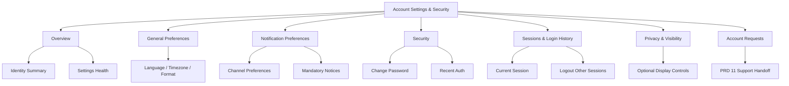
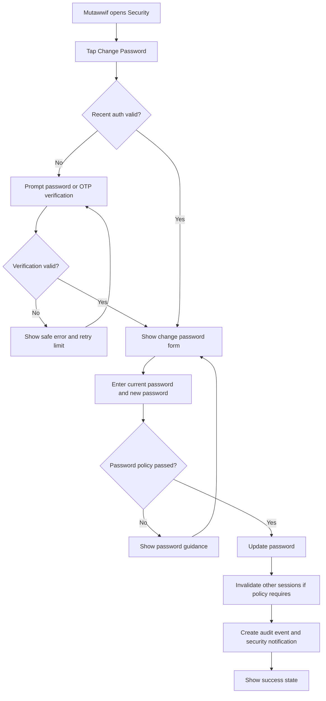
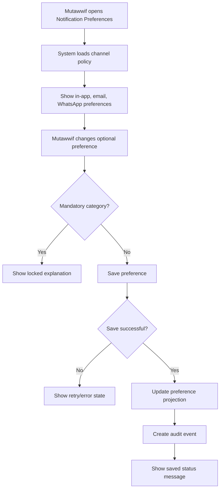
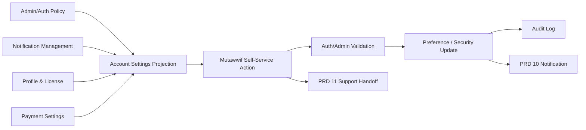

# MV PRD 16 - Account Settings & Security

Product: UmrahHaji.com Mutawwif View  
Module: Account Settings & Security  
Scope: Mutawwif Mobile Web App / Personal Preferences, Security Controls, Session Visibility, Privacy Preferences & Account Request Handoff  
Platform: Mobile-first Responsive Web Platform  
Status: Draft  
Last Updated: 20 June 2026  

---

## 1. Objective

Account Settings & Security is the mutawwif-facing personal account control center. It allows mutawwif to manage account-level preferences, security actions, notification channel preferences, language/time display preferences, privacy display preferences, active session visibility, and account deactivation request handoff without becoming an Admin settings module.

This module must help mutawwif answer:

1. Which email, phone, and login identity are connected to my account?
2. What language, timezone, date/time format, and channel preferences are used in my portal?
3. Which notifications should reach me through in-app, email, or WhatsApp where policy allows?
4. Can I change password or secure my account after suspicious activity?
5. Which sessions or devices are currently active or recently used?
6. Can I logout from other sessions?
7. What privacy options control how my mutawwif profile appears to Travel Agency, Jamaah, or public surfaces?
8. How do I request account deactivation or data-related support if policy allows?

This module is not Admin User Management, not platform settings, not role management, not payment settings, and not mutawwif profile verification. Admin Panel remains the owner of portal access, role/permission, account lock/suspension, security policy, and audit governance. Mutawwif View only exposes safe self-service controls for the signed-in mutawwif.

---

## 2. Relationship With Mutawwif View Master Scope

This module follows the Mutawwif View mobile web app scope:

1. Mutawwif can view and manage only their own account settings.
2. Account Settings is P1 because notification, security, language, and session basics are required across the Mutawwif View app.
3. Mutawwif cannot grant themselves roles, portal access, assignment eligibility, approval status, finance permission, or Admin privileges.
4. Security-sensitive changes require recent authentication, OTP, password confirmation, or policy-defined step-up verification.
5. Settings must never expose raw secrets, password hashes, full OTP, provider tokens, internal risk score, or Admin security notes.
6. Settings can deep-link to Profile, Payment Settings, Notifications, Reports & Support, and future Assignment modules, but must not duplicate their source data.
7. If the account is suspended, locked, or under review, settings may be read-only or limited based on Admin User Management policy.
8. Every sensitive view/change action must produce an audit event.

---

## 3. Relationship With Admin, Travel Agency, Jamaah, and Mutawwif PRDs

| Source Module | Relationship |
| --- | --- |
| Admin User Management | Source of user account, portal access, role, permission, account status, password reset, session revoke, login history, and security audit |
| Admin Settings / Roles & Permissions | Defines security policy, MFA policy, session timeout, channel availability, and access governance |
| Admin Mutawwif Management | Source of mutawwif operational profile, verification status, public/assignment-safe visibility, and suspension signals |
| Admin Announcement / Notification Management | Source of platform notification channels, delivery rules, templates, and audience policy |
| Travel Agency Settings | Provides agency-level defaults where mutawwif belongs to an agency-controlled operational context |
| Travel Agency Mutawwif Assignment | Consumes mutawwif availability, contactability, and assignment-safe profile settings, but does not own account security |
| Jamaah/User View Authentication | Provides shared login, OTP, password reset, invitation, and session behavior patterns |
| Jamaah/User View Profile & Personal Data | Provides shared account hub and personal preference patterns while keeping mutawwif data separate |
| MV PRD 02 - Register & Invitation Acceptance | Source of account activation, login, password reset, OTP, and invitation acceptance rules |
| MV PRD 03 - Profile, License & Verification | Owns mutawwif personal/professional profile fields and verification status |
| MV PRD 09 - Payment Settings | Owns payout destination, receipt preference, and finance notification settings only |
| MV PRD 10 - Notifications & Announcements | Owns in-app inbox, announcement read state, acknowledgement, archive, and deep links |
| MV PRD 11 - Reports & Support | Destination for account access issue, suspicious activity report, deactivation request, or privacy request |
| MV PRD 15 - Ratings & Feedback | Reads privacy-safe identity display preferences only where policy allows |

### 3.1 Key Sync Rule

Account Settings is a self-service projection of account-level controls, not the source of system authority.

Admin User Management / Auth Policy -> Account Settings & Security -> Mutawwif Self-Service Action -> Auth/Admin Validation -> Audit Event / Notification.

Mutawwif View can request or update allowed settings, but Admin/Auth remains the source of truth for account status, permission, session validity, security policy, and final deactivation.

### 3.2 Cross-Role Boundary

| Role / Surface | Owns | Can Mutawwif View Display? | PRD 16 Rule |
| --- | --- | --- | --- |
| Admin User Management | Account, portal access, sessions, role, permission, password reset, lock/suspend | Yes, safe account/security status | Do not expose internal security notes or risk score |
| Admin Settings | Global auth/session/channel/security policy | Yes, as read-only policy labels | Mutawwif cannot override platform requirements |
| Travel Agency Settings | Agency workspace defaults and allowed channels | Limited if related to assigned agency | Agency policy can restrict options but not expose agency admin settings |
| Notification Management | Channel availability and delivery rules | Yes, as available channel preferences | In-app record remains authoritative |
| Profile & License | Mutawwif identity, document, visibility, readiness | Link/summary only | Do not edit profile fields here |
| Payment Settings | Payout destination and finance receipt preferences | Link/summary only | Do not edit bank/e-wallet here |
| Reports & Support | Account/privacy/security requests | Yes, as handoff/case link | Sensitive account requests become support/admin cases |

### 3.3 Boundary With Related Mutawwif Modules

| Area | Account Settings & Security | Related Module |
| --- | --- | --- |
| Login identity summary | Shows masked email/phone and verification status | PRD 02 Auth owns verification flow |
| Full name, photo, professional profile | Links only | PRD 03 Profile owns edit/review |
| Payout destination | Links only | PRD 09 Payment Settings owns finance fields |
| Notification inbox | Links only | PRD 10 owns inbox, read state, acknowledgement |
| Notification channel preference | Owns global/account-level preference | PRD 10 and source modules consume preference |
| Report suspicious activity | Opens report handoff | PRD 11 owns case workflow |
| Rating identity display | Provides preference if policy allows | PRD 15 consumes released preference |
| Assignment readiness | No direct control | PRD 03/17 and Admin/TA own readiness |

---

## 4. Research Notes and Product Decisions

Account settings combines usability and security. Product decisions:

1. Security-sensitive actions require recent authentication or step-up challenge.
2. Password changes must support long passphrases, avoid arbitrary complexity friction, and block weak/common credentials.
3. Login, password, OTP, and security messages must avoid account enumeration and should not reveal whether another account exists.
4. Sessions need both automatic expiration and user-facing logout/revoke controls.
5. MFA or passkey setup can be Phase 2 unless platform policy requires it at launch.
6. Notification preference changes must never suppress mandatory safety, security, compliance, or urgent operational notices.
7. In-app notifications remain the account communication record even if WhatsApp/email is disabled or delivery fails.
8. Privacy preferences can reduce public/assignment-safe display where policy allows, but cannot hide required operational identity from Admin/TA.
9. Account deactivation/deletion is a request workflow, not an immediate destructive action in Mutawwif View.
10. Authentication must remain accessible; users should not be forced into memory-only tasks without an alternative supported method.

Reference sources used as product direction:

1. NIST SP 800-63B Digital Identity Guidelines: https://pages.nist.gov/800-63-4/sp800-63b.html
2. OWASP Authentication Cheat Sheet: https://cheatsheetseries.owasp.org/cheatsheets/Authentication_Cheat_Sheet.html
3. OWASP Session Management Cheat Sheet: https://cheatsheetseries.owasp.org/cheatsheets/Session_Management_Cheat_Sheet.html
4. W3C WCAG 2.2 - Accessible Authentication: https://www.w3.org/WAI/WCAG22/Understanding/accessible-authentication-minimum.html
5. W3C WCAG 2.2 - Status Messages: https://www.w3.org/WAI/WCAG22/Understanding/status-messages.html
6. W3C WCAG 2.2 - Target Size Minimum: https://www.w3.org/WAI/WCAG22/Understanding/target-size-minimum.html
7. Personal Data Protection Act 2010, Laws of Malaysia Act 709: https://lom.agc.gov.my/act-detail.php?type=principal&lang=BI&act=709

### 4.1 Research Validation Notes

| Research Area | Product Interpretation | Impact on This PRD |
| --- | --- | --- |
| Authentication assurance | Higher-risk account actions may require stronger or recent authentication | Password change, channel change, session revoke, and deactivation request require confirmation |
| Reauthentication | Sensitive features should re-check identity after risk events | Recent auth window and OTP/password confirmation are required |
| Session management | Sessions need idle/absolute timeout and manual logout controls | Show session list, current session, and logout other sessions where enabled |
| Accessible authentication | Authentication should not rely only on cognitive burden | Avoid CAPTCHA-only or memory-only recovery path where possible |
| Status messages | Dynamic setting updates need perceivable feedback | Save, failure, verification, and revoked-session states should be announced |
| Target size | Mobile account controls must be comfortable and safe to tap | Security toggles and destructive actions require clear spacing and confirmation |
| Personal data protection | Account preferences and login metadata are personal data | Mask identifiers, minimize exposure, scope access, and log sensitive changes |

### 4.2 Security Product Rule

Account Settings must make the account safer without giving mutawwif platform authority. A mutawwif can update allowed personal preferences and request security actions, but cannot override Admin security policy, unlock a locked account, grant portal access, change role, or bypass verification.

### 4.3 Notification Preference Rule

Mutawwif can choose optional delivery channels where allowed, but the system can still send mandatory in-app safety, security, compliance, assignment-critical, finance-critical, and trip-critical notifications.

### 4.4 Privacy Preference Rule

Privacy preferences affect optional display only. They cannot hide mutawwif identity from Admin, authorized Travel Agency operation, assigned trip coordination, legal/compliance review, finance audit, or support investigation.

---

## 5. Scope

### 5.1 In Scope for Phase 1

1. Account Settings overview.
2. Login identity summary: masked email, masked phone, verification status.
3. Language preference.
4. Timezone preference.
5. Date/time format preference.
6. Notification channel preference for optional categories.
7. Mandatory notification explanation.
8. Change password.
9. Recent authentication prompt for sensitive changes.
10. Security notification when password/channel/security preference changes.
11. Active/current session summary.
12. Logout current session.
13. Logout other sessions where Auth service supports it.
14. Login history summary with masked device/location metadata.
15. Privacy display preference for optional mutawwif profile exposure where policy allows.
16. Account access issue and suspicious activity report handoff to PRD 11.
17. Deactivation request entry if policy enables it.
18. Empty/loading/error/offline states.
19. Audit logs for sensitive settings actions.
20. Mobile-first responsive behavior.

### 5.2 In Scope for Phase 2

1. MFA setup and recovery codes.
2. Passkey/passwordless setup.
3. Trusted device management.
4. Advanced session/device detail.
5. Risk-based challenge history.
6. Quiet hours and notification digest preferences.
7. Advanced privacy controls for public profile if public mutawwif profile launches.
8. Data export request.
9. Account deletion request with compliance/legal retention explanation.
10. Security center recommendation score.

### 5.3 Out of Scope

1. Admin role and permission management.
2. Admin account unlock/suspend/reactivate decision.
3. Platform auth policy configuration.
4. Travel Agency workspace settings.
5. Mutawwif profile verification decision.
6. Editing license, certification, passport, identity, or professional profile fields.
7. Payout destination or bank/e-wallet editing.
8. In-app notification inbox read/archive/acknowledgement behavior.
9. Creating support cases beyond request handoff.
10. Public profile publishing workflow.
11. Native biometric unlock.
12. SSO/enterprise identity provider setup.

---

## 6. User Roles and Access

| Role | Access Behavior |
| --- | --- |
| Invited mutawwif | Limited settings only after invitation is accepted and account is activated |
| Pending mutawwif | Can manage account preferences and security; operational settings may be hidden |
| Active mutawwif | Full own Account Settings access based on permissions |
| Verified mutawwif | Full own Account Settings access based on permissions |
| Suspended mutawwif | Can view limited security/status and contact support if policy allows |
| Locked account user | Cannot access settings until unlock/recovery flow succeeds |
| Replaced mutawwif | Can manage own account if still active, regardless of assignment history |
| Admin | Manages account, security, role, permission, and session from Admin Panel |
| Travel Agency staff | Does not manage mutawwif account security from this module |
| Support staff | Handles access/security/privacy cases from Admin/Support tools |

### 6.1 Visibility Rules

Mutawwif can see:

1. Own masked login identity.
2. Own verification status for email/phone.
3. Own preference values.
4. Own current/recent sessions.
5. Own login history summary.
6. Own security action history summary where released.
7. Own privacy preference status.

Mutawwif cannot see:

1. Other users' account settings.
2. Other mutawwif sessions.
3. Internal security notes.
4. Fraud/risk score.
5. Admin-only reason codes if restricted.
6. Password hash, token, OTP, provider secret, or session secret.
7. Full IP/geolocation if policy masks it.
8. Role/permission matrix beyond own readable permission summary.

---

## 7. Entry Points

| Entry Point | Behavior |
| --- | --- |
| Profile menu settings item | Opens Account Settings overview |
| Top navbar account menu | Opens Account Settings or quick logout |
| Security notification deep link | Opens related security setting or login history |
| PRD 10 notification preference link | Opens notification channel preferences |
| PRD 09 payment notification note | Links to Account Settings for general channel preference |
| Suspicious login alert | Opens login history and report action |
| Password reset success | Opens security summary after login |
| PRD 11 support case | Opens related account request status if permitted |

---

## 8. Information Architecture

```text
Account Settings & Security
+-- Overview
|   +-- Account Identity Summary
|   +-- Preference Summary
|   +-- Security Summary
|   +-- Linked Modules
+-- General Preferences
|   +-- Language
|   +-- Timezone
|   +-- Date Format
|   +-- Time Format
+-- Notification Preferences
|   +-- Channel Availability
|   +-- Optional Category Preferences
|   +-- Mandatory Notification Explanation
|   +-- Delivery Failure Note
+-- Security
|   +-- Change Password
|   +-- Recent Authentication
|   +-- Login Alerts
|   +-- MFA / Passkey Placeholder
+-- Sessions & Login History
|   +-- Current Session
|   +-- Other Active Sessions
|   +-- Recent Login History
|   +-- Logout Other Sessions
+-- Privacy & Visibility
|   +-- Assignment-Safe Display Note
|   +-- Optional Public Display Preference
|   +-- Rating/Feedback Identity Preference
+-- Account Requests
    +-- Report Suspicious Activity
    +-- Account Access Issue
    +-- Deactivation Request
    +-- Data/Privacy Request Handoff
```



### 8.1 Navigation Entry Points

| Entry Point | Behavior |
| --- | --- |
| Account Settings overview | Shows grouped sections and status summary |
| Security card | Opens password, recent authentication, session controls |
| Notification card | Opens channel/category preference list |
| Privacy card | Opens optional display preferences |
| Login history card | Opens recent login/session list |
| Account request card | Opens PRD 11 handoff options |

---

## 9. User Flows

### 9.1 Change Password Flow



### 9.2 Notification Preference Flow



### 9.3 Account Settings Sync Flow



---

## 10. Screen and Component Requirements

### 10.1 Account Settings Overview

Purpose:
Show account status, setting groups, security health, and linked modules.

Content:

1. Account identity summary.
2. Email/phone verification status.
3. Language/timezone summary.
4. Notification preference summary.
5. Security summary.
6. Active session summary.
7. Privacy preference summary.
8. Linked modules: Profile, Payment Settings, Notifications, Reports & Support.

Rules:

1. Use grouped list rows or compact cards on mobile.
2. Show locked/read-only reason when policy prevents editing.
3. Do not show full email/phone if masking policy requires masking.
4. Do not show admin-only account notes.

### 10.2 General Preferences

Purpose:
Allow mutawwif to control personal display and localization preferences.

Fields:

| Field | Type | Required | Notes |
| --- | --- | --- | --- |
| language | Select | Yes | Malay, Indonesian, English based on platform support |
| timezone | Select | Yes | Default from assigned region/profile country |
| date_format | Select | Yes | Example DD MMM YYYY |
| time_format | Select | Yes | 12-hour or 24-hour |
| first_day_of_week | Select | Optional | Useful for calendar display |

Rules:

1. Timezone affects display of schedule, activity, notification, and finance timestamps.
2. Source timestamps remain stored in system canonical time.
3. Changing display preference must not change trip schedule truth.

### 10.3 Notification Preferences

Purpose:
Allow mutawwif to manage optional delivery preferences by channel and category.

Categories:

| Category | Preference Allowed | Notes |
| --- | --- | --- |
| Security | No | Mandatory in-app/email/phone based on policy |
| Assignment | Limited | Critical assignment updates cannot be disabled |
| Trip / Activity | Limited | Safety and schedule-critical updates remain mandatory |
| Finance / Payout | Limited | Critical payout/security events remain mandatory |
| Referral | Yes | Optional status/digest where policy allows |
| Ratings & Feedback | Yes | Optional release/trend alerts where policy allows |
| Knowledge Base | Yes | Optional guidance/content reminders |
| Marketing / Tips | Yes | Off by default unless consent policy allows |

Rules:

1. In-app inbox record is always created for eligible system notifications.
2. Email/WhatsApp can be disabled only for optional categories.
3. Mandatory notifications show a lock indicator and reason.
4. Channel preference must respect verified email/phone status.
5. Delivery failure belongs to Notification Management, not Settings.

### 10.4 Security

Purpose:
Allow mutawwif to change password and view security state.

Actions:

1. Change password.
2. Confirm recent authentication.
3. View MFA status placeholder if not enabled.
4. View passkey/passwordless placeholder if not enabled.
5. Open suspicious activity report.

Rules:

1. Current password or OTP/recent auth is required before password change.
2. Password must not be sent through email or WhatsApp.
3. Password field must support password manager and paste behavior.
4. Failed change attempts must be rate-limited.
5. Success triggers security notification and audit log.

### 10.5 Sessions & Login History

Purpose:
Let mutawwif understand recent account access and revoke sessions where allowed.

Fields shown per session:

| Field | Display Rule |
| --- | --- |
| session_id | Hidden from UI |
| device_label | Safe label, e.g. Mobile Safari |
| browser | Safe label |
| operating_system | Safe label |
| last_active_at | Display in user timezone |
| login_at | Display in user timezone |
| location_hint | Coarse/masked if available |
| ip_hint | Masked or hidden based on policy |
| current_session | Label current device |

Actions:

1. Logout current session.
2. Logout other sessions.
3. Report suspicious session.

Rules:

1. Current session must be clearly labeled.
2. Logout other sessions requires confirmation.
3. If session revoke fails, show retry and support handoff.
4. Login history must not expose exact sensitive network data if policy masks it.

### 10.6 Privacy & Visibility

Purpose:
Show and control optional display preferences where policy allows.

Settings:

| Preference | Editable | Notes |
| --- | --- | --- |
| Show profile photo to assigned jamaah | Policy-dependent | Only if jamaah-facing mutawwif profile exists |
| Show preferred display name | Yes if profile allows | Legal name still used by Admin/TA where required |
| Show languages/specialization | Policy-dependent | Assignment-safe profile fields |
| Show rating summary publicly | Phase 2 / policy-dependent | PRD 15 consumes if public profile launches |
| Hide phone from jamaah | Policy-dependent | Operational contact routing may still show agency/PIC contact |

Rules:

1. Admin and authorized TA operational access cannot be hidden by mutawwif preference.
2. Public or jamaah-facing profile must use released fields only.
3. Sensitive identity, finance, passport, and document data are never exposed through privacy preference.

### 10.7 Account Requests

Purpose:
Provide safe handoff for sensitive account-related requests.

Request types:

1. Report suspicious activity.
2. Cannot access account.
3. Request account deactivation.
4. Request data/privacy support.
5. Request channel/contact issue review.

Rules:

1. Requests create or deep-link to PRD 11 Reports & Support.
2. Deactivation is not immediate if active assignments, finance payout, reports, legal retention, or compliance holds exist.
3. Request status should be visible through PRD 11 if permission allows.

---

## 11. Data Model

### 11.1 AccountSettings

| Field | Type | Required | Notes |
| --- | --- | --- | --- |
| settings_id | UUID | Yes | Primary identifier |
| user_id | UUID | Yes | Owner user account |
| mutawwif_id | UUID | Yes | Linked mutawwif profile |
| language | Enum | Yes | ms, id, en or supported locale |
| timezone | String | Yes | IANA timezone |
| date_format | Enum | Yes | Display preference |
| time_format | Enum | Yes | 12h/24h |
| first_day_of_week | Enum | Optional | Calendar display |
| privacy_profile_visibility | Enum | Yes | platform_default, limited, public_if_allowed |
| security_alert_enabled | Boolean | Yes | Mandatory true if policy requires |
| created_at | DateTime | Yes | Timestamp |
| updated_at | DateTime | Yes | Timestamp |

### 11.2 NotificationPreference

| Field | Type | Required | Notes |
| --- | --- | --- | --- |
| preference_id | UUID | Yes | Primary identifier |
| user_id | UUID | Yes | Owner user |
| category | Enum | Yes | security, assignment, trip, finance, referral, ratings, guidance, marketing |
| channel | Enum | Yes | in_app, email, whatsapp |
| enabled | Boolean | Yes | False only if optional |
| locked_by_policy | Boolean | Yes | True for mandatory categories |
| policy_reason | String | Optional | Safe explanation |
| updated_at | DateTime | Yes | Timestamp |

### 11.3 SecurityPreference

| Field | Type | Required | Notes |
| --- | --- | --- | --- |
| user_id | UUID | Yes | Owner user |
| password_last_changed_at | DateTime | Optional | Display safe relative timestamp |
| mfa_status | Enum | Yes | not_available, optional, enabled, required |
| passkey_status | Enum | Yes | not_available, available, enabled |
| login_alerts_enabled | Boolean | Yes | Mandatory true if policy requires |
| recent_auth_until | DateTime | Optional | Server-side only; UI can infer |
| updated_at | DateTime | Yes | Timestamp |

### 11.4 SessionSummary

| Field | Type | Required | Notes |
| --- | --- | --- | --- |
| session_id | UUID | Yes | Hidden or opaque |
| user_id | UUID | Yes | Owner user |
| device_label | String | Optional | Safe display |
| browser | String | Optional | Safe display |
| operating_system | String | Optional | Safe display |
| ip_hint | String | Optional | Masked |
| location_hint | String | Optional | Coarse location only |
| login_at | DateTime | Yes | Timestamp |
| last_active_at | DateTime | Yes | Timestamp |
| current_session | Boolean | Yes | Current browser/device |
| revocable | Boolean | Yes | Whether user can revoke |

### 11.5 AccountRequest

| Field | Type | Required | Notes |
| --- | --- | --- | --- |
| request_id | UUID | Yes | Primary identifier |
| user_id | UUID | Yes | Requester |
| mutawwif_id | UUID | Optional | Linked profile |
| report_id | UUID | Optional | PRD 11 support case |
| request_type | Enum | Yes | suspicious_activity, access_issue, deactivation, privacy_request, contact_issue |
| status | Enum | Yes | submitted, in_review, resolved, rejected, cancelled |
| description | Text | Optional | User-provided explanation |
| created_at | DateTime | Yes | Timestamp |
| updated_at | DateTime | Yes | Timestamp |

### 11.6 SecurityAuditEvent

| Field | Type | Required | Notes |
| --- | --- | --- | --- |
| audit_id | UUID | Yes | Primary identifier |
| user_id | UUID | Yes | Actor |
| mutawwif_id | UUID | Optional | Context |
| action | Enum | Yes | view_settings, update_preference, change_password, revoke_session, report_activity, request_deactivation |
| target_type | Enum | Yes | settings, notification_preference, session, password, account_request |
| target_id | UUID | Optional | Related record |
| result | Enum | Yes | success, failed, blocked |
| reason_code | String | Optional | Safe code only |
| created_at | DateTime | Yes | Timestamp |

---

## 12. Permission Logic

### 12.1 Permission Chain

Account Settings & Security must follow the existing permission chain:

Portal Access -> Role -> Permission Group -> Module Permission -> Action Permission -> Data Scope.

### 12.2 Permission Keys

| Permission Key | Description |
| --- | --- |
| mutawwif.account_settings.view | View Account Settings module |
| mutawwif.account_settings.preferences.update | Update own general preferences |
| mutawwif.account_settings.notifications.update | Update own optional channel preferences |
| mutawwif.account_settings.security.view | View own security summary |
| mutawwif.account_settings.password.change | Change own password |
| mutawwif.account_settings.sessions.view | View own session summary |
| mutawwif.account_settings.sessions.revoke | Revoke own sessions |
| mutawwif.account_settings.privacy.update | Update own optional privacy preferences |
| mutawwif.account_settings.request.create | Create account/security/privacy request |
| mutawwif.account_settings.audit.view_own | View safe own settings/security history where enabled |

### 12.3 Data Scope Rules

| Scope | Rule |
| --- | --- |
| Own account | Mutawwif can only access settings tied to own `user_id` and linked `mutawwif_id` |
| Own session | Mutawwif can only view/revoke sessions belonging to own account |
| Own preference | Mutawwif can only update allowed own preferences |
| Admin policy | Platform-controlled settings are read-only |
| Suspended/locked state | Actions may be blocked or reduced based on account status |
| Assignment context | Settings cannot change assignment truth or eligibility |
| Finance context | Settings cannot change payout destination or finance status |

### 12.4 Blocked Actions

Mutawwif cannot:

1. Change role or permission.
2. Grant portal access.
3. Unlock, unsuspend, or reactivate their account.
4. Delete audit logs.
5. Disable mandatory security notifications.
6. Disable urgent/safety/trip-critical notifications.
7. View other users' sessions.
8. Edit payment destination in Account Settings.
9. Edit profile verification fields in Account Settings.
10. Self-approve deactivation if pending assignment, payout, report, or compliance hold exists.

---

## 13. Functional Requirements

| ID | Requirement | Priority |
| --- | --- | --- |
| MV-ASEC-001 | System shall provide Account Settings overview for signed-in mutawwif. | P1 |
| MV-ASEC-002 | System shall show masked login identity and verification status. | P1 |
| MV-ASEC-003 | System shall allow mutawwif to update language preference. | P1 |
| MV-ASEC-004 | System shall allow mutawwif to update timezone and display format preferences. | P1 |
| MV-ASEC-005 | System shall allow mutawwif to update optional notification channel preferences. | P1 |
| MV-ASEC-006 | System shall lock mandatory security, safety, compliance, and urgent operational notifications. | P1 |
| MV-ASEC-007 | System shall require recent authentication for sensitive setting actions. | P1 |
| MV-ASEC-008 | System shall allow password change based on Auth policy. | P1 |
| MV-ASEC-009 | System shall send security notification after password or sensitive security change. | P1 |
| MV-ASEC-010 | System shall show current session summary. | P1 |
| MV-ASEC-011 | System shall show recent login/session history with safe masked metadata. | P1 |
| MV-ASEC-012 | System shall allow logout current session. | P1 |
| MV-ASEC-013 | System shall allow logout other sessions where Auth service supports session revoke. | P1 |
| MV-ASEC-014 | System shall allow suspicious activity report handoff to PRD 11. | P1 |
| MV-ASEC-015 | System shall show privacy and visibility preferences where policy allows. | P1 |
| MV-ASEC-016 | System shall block user attempts to edit platform-controlled settings. | P1 |
| MV-ASEC-017 | System shall create audit event for sensitive settings actions. | P1 |
| MV-ASEC-018 | System shall show empty/loading/error/offline states. | P1 |
| MV-ASEC-019 | System shall prevent access to other users' settings or sessions. | P1 |
| MV-ASEC-020 | System shall support account deactivation request entry if policy enables it. | P1/P2 |
| MV-ASEC-021 | System shall support MFA setup if platform policy enables MFA. | P2 |
| MV-ASEC-022 | System shall support passkey/passwordless setup if approved. | P2 |
| MV-ASEC-023 | System shall support trusted device management. | P2 |
| MV-ASEC-024 | System shall support quiet hours and notification digest preferences. | P2 |
| MV-ASEC-025 | System shall support data export/deletion request workflow if compliance roadmap enables it. | P2 |

---

## 14. Business Rules

### 14.1 Account Settings Rules

1. Settings are scoped to the signed-in mutawwif user.
2. Account settings cannot change operational profile verification status.
3. Account settings cannot make mutawwif assignment-ready.
4. Platform-locked settings must show a clear reason.
5. Failed sensitive actions must use safe errors and rate limits.

### 14.2 Password and Authentication Rules

1. Password change requires current password or recent authenticated session plus step-up challenge when required.
2. Passwords must support long passphrases and password manager use.
3. Passwords must not be sent over email/WhatsApp.
4. Password update must create security audit and notification events.
5. After password change, the platform may revoke other sessions based on policy.

### 14.3 Session Rules

1. Current session must be labeled.
2. Logout other sessions must not revoke the current session unless explicitly requested.
3. Revoked sessions must not regain access through cached client state.
4. Session history is informational and may be limited by retention policy.

### 14.4 Notification Rules

1. In-app record must remain enabled for required system events.
2. Optional external channels can be disabled only if category allows it.
3. Security and account recovery notifications cannot be disabled.
4. Channel preference applies only after save and does not rewrite old delivery records.

### 14.5 Deactivation / Privacy Request Rules

1. Deactivation request may be blocked, delayed, or routed for review if there are active assignments, pending payouts, unresolved support cases, compliance holds, or legal retention requirements.
2. Mutawwif cannot self-delete operational records in P1.
3. The request must be traceable through PRD 11 and Admin tools.

---

## 15. API and Event Requirements

### 15.1 API Endpoints

| Method | Endpoint | Purpose |
| --- | --- | --- |
| GET | /mutawwif/account-settings | Load account settings overview |
| PATCH | /mutawwif/account-settings/preferences | Update language/timezone/display preferences |
| GET | /mutawwif/account-settings/notification-preferences | Load channel/category preferences |
| PATCH | /mutawwif/account-settings/notification-preferences | Update optional channel preferences |
| POST | /mutawwif/account-settings/recent-auth | Start recent authentication/step-up |
| POST | /mutawwif/account-settings/change-password | Change password |
| GET | /mutawwif/account-settings/sessions | Load own session summary |
| POST | /mutawwif/account-settings/sessions/revoke | Revoke own selected/other sessions |
| GET | /mutawwif/account-settings/login-history | Load safe login history |
| PATCH | /mutawwif/account-settings/privacy | Update optional privacy preferences |
| POST | /mutawwif/account-settings/account-requests | Create account/security/privacy request |

### 15.2 Event Triggers

| Event | Trigger | Recipient |
| --- | --- | --- |
| account_settings.updated | Preference update succeeds | Audit, Notification if needed |
| notification_preference.updated | Channel/category preference changes | Audit |
| password.changed | Password update succeeds | User, Audit, Auth service |
| session.revoked | User revokes session | User, Audit, Auth service |
| suspicious_activity.reported | User reports suspicious session/login | PRD 11, Support/Admin |
| account_deactivation.requested | User submits deactivation request | PRD 11, Admin/Support |
| security_policy.blocked_action | User attempts blocked sensitive action | Audit, optional support |

### 15.3 Deep Link Requirements

| Source | Target |
| --- | --- |
| PRD 02 password reset success | Account Settings > Security |
| PRD 10 security notification | Account Settings > Security or Login History |
| PRD 10 channel preference link | Account Settings > Notification Preferences |
| PRD 09 finance notification preference note | Account Settings > Notification Preferences |
| PRD 11 account issue report | Account Settings > Account Requests |
| PRD 15 rating visibility note | Account Settings > Privacy & Visibility |

---

## 16. UI States

| State | Behavior |
| --- | --- |
| Loading | Show skeleton rows and section placeholders |
| Empty | Show default preferences and explain no session history yet |
| Read-only | Show locked state and policy reason |
| Save success | Show accessible success status message |
| Save failed | Show retry option and safe error |
| Offline | Allow cached read-only view; disable sensitive changes |
| Recent auth required | Show verification prompt before sensitive action |
| Rate limited | Show temporary block and retry-after guidance |
| Suspended | Show limited settings and support handoff |
| Session revoke failed | Keep session visible and show retry/support option |
| Deactivation unavailable | Explain policy blocker and open support option |

---

## 17. Security, Privacy, and Compliance

1. All Account Settings pages require authenticated mutawwif session.
2. Sensitive actions require recent authentication or step-up challenge.
3. Full email/phone/IP/location may be masked based on policy.
4. Password, OTP, session token, provider token, and secret values must never be displayed.
5. Settings updates must use CSRF protection where applicable.
6. Session revoke must invalidate server-side session state.
7. Security events must be audit logged.
8. Notification preference changes must not disable mandatory security/safety notices.
9. Personal data collection must be minimum necessary.
10. Deactivation/deletion requests must respect legal, finance, support, and compliance retention.
11. User-facing errors must avoid account enumeration.
12. Privacy settings must not hide required operational identity from authorized Admin/TA users.

---

## 18. Analytics and Audit

### 18.1 Analytics Events

| Event | Properties |
| --- | --- |
| account_settings_opened | user_id, mutawwif_id, source |
| preference_updated | preference_type, result |
| notification_preference_updated | category, channel, enabled, locked_by_policy |
| password_change_started | source |
| password_change_completed | result |
| session_list_opened | session_count |
| session_revoked | target_type, result |
| suspicious_activity_report_started | source |
| account_request_submitted | request_type, result |

### 18.2 Audit Requirements

Audit events are required for:

1. Viewing security/session detail.
2. Updating language/timezone/display preferences.
3. Updating notification preferences.
4. Changing password.
5. Revoking sessions.
6. Updating privacy preferences.
7. Reporting suspicious activity.
8. Requesting deactivation/privacy support.
9. Blocked attempts to access another account/session.

Audit must include actor, account, target type, result, timestamp, and safe reason code. Do not store raw password, OTP, session token, or secrets in audit payload.

---

## 19. Acceptance Criteria

1. Mutawwif can open Account Settings from profile/account menu.
2. Mutawwif sees masked account identity and verification status.
3. Mutawwif can update language/timezone/date/time format and see saved status.
4. Mandatory notification categories cannot be disabled.
5. Optional notification preferences save correctly and reflect policy locks.
6. Password change requires recent authentication or policy-defined verification.
7. Password change success creates security notification and audit event.
8. Mutawwif can view current session and recent login history with safe metadata.
9. Mutawwif can logout other sessions where backend supports session revoke.
10. Mutawwif cannot view or revoke another user's session.
11. Suspicious session report opens PRD 11 handoff with context.
12. Privacy preferences are shown only where platform policy allows editing.
13. Account deactivation request does not immediately delete account and routes to PRD 11/Admin review.
14. Suspended or locked account states follow Admin User Management policy.
15. Offline mode prevents sensitive setting changes.
16. All sensitive actions create audit events.
17. All deep links re-check permission and data scope.
18. Mobile layout has readable rows, comfortable tap targets, and no overlapping controls.

---

## 20. Dependencies

1. Admin User Management.
2. Auth/session service.
3. Notification Management.
4. Admin Settings / security policy.
5. MV PRD 02 Register & Invitation Acceptance.
6. MV PRD 03 Profile, License & Verification.
7. MV PRD 09 Payment Settings.
8. MV PRD 10 Notifications & Announcements.
9. MV PRD 11 Reports & Support.
10. MV PRD 15 Ratings & Feedback.

---

## 21. Risks and Mitigations

| Risk | Mitigation |
| --- | --- |
| Settings becomes a catch-all module | Define ownership registry and deep-link to source modules |
| User disables critical notifications | Lock mandatory categories and explain reason |
| Sensitive metadata exposure | Mask identifiers, limit login history, and avoid internal notes |
| Password flow creates friction | Support password manager, paste, clear guidance, and accessible recovery |
| Session revoke breaks current work | Clearly separate current session from other sessions |
| Deactivation request creates operational risk | Route to PRD 11/Admin review with active assignment/payout checks |
| Privacy preference hides operational identity | Restrict preferences to optional display only |
| Duplicate notification settings with PRD 10 | PRD 16 owns channel preference; PRD 10 owns inbox state |

---

## 22. Release Plan

### Phase 1A

1. Account Settings overview.
2. General preferences.
3. Notification channel preferences.
4. Security summary.
5. Change password.

### Phase 1B

1. Session summary.
2. Login history.
3. Logout other sessions.
4. Suspicious activity report handoff.
5. Privacy preference basics.

### Phase 2

1. MFA setup.
2. Passkey/passwordless.
3. Trusted devices.
4. Quiet hours/digest.
5. Advanced privacy/public profile controls.
6. Data export/deletion workflows.

---

## 23. QA and Test Coverage

Functional tests:

1. Load settings for active mutawwif.
2. Update language/timezone/display preference.
3. Attempt to disable mandatory notification.
4. Update optional channel preference.
5. Change password with valid recent auth.
6. Change password with invalid current password.
7. View session list.
8. Revoke other sessions.
9. Attempt to revoke another user's session.
10. Submit suspicious activity request.
11. Submit deactivation request when policy enabled.

Permission tests:

1. Pending mutawwif limited state.
2. Suspended mutawwif limited state.
3. Locked account blocked state.
4. Missing permission hidden/disabled sections.
5. Deep link revalidation.

Security tests:

1. CSRF protection for mutations.
2. Rate limit for password and step-up attempts.
3. Session invalidation after revoke.
4. Masked metadata in UI.
5. No secrets in audit logs.

Responsive tests:

1. Mobile account overview.
2. Mobile notification preference list.
3. Mobile change password form.
4. Mobile session list.
5. Tablet/desktop settings layout.

---

## 24. Open Questions

1. Is MFA required for mutawwif at launch or optional Phase 2?
2. Should password change automatically revoke all other sessions?
3. Which notification categories are mandatory by platform policy?
4. Should WhatsApp preference be available only after phone verification?
5. Should mutawwif see exact login location, coarse region, or no location?
6. Is account deactivation request part of P1 or deferred to support-only workflow?
7. Which privacy options are relevant before public mutawwif profile exists?
8. Does Travel Agency have any agency-specific channel preference override for assigned mutawwif?

---

## 25. Final Product Decision

Account Settings & Security must be implemented as a personal, own-account settings module for mutawwif, synchronized with Admin User Management, Auth/session policy, Notification Management, Travel Agency Settings, Jamaah authentication/profile patterns, MV PRD 02 Authentication, MV PRD 03 Profile, MV PRD 09 Payment Settings, MV PRD 10 Notifications, MV PRD 11 Reports & Support, and MV PRD 15 Ratings & Feedback.

The product direction is:

1. Provide mutawwif with practical self-service controls for preferences, notification channels, security, sessions, and privacy.
2. Keep Admin/Auth as the authority for account status, role, permission, policy, and session validity.
3. Keep module-specific data in its own PRD: profile in PRD 03, payout in PRD 09, inbox in PRD 10, reports in PRD 11.
4. Require recent authentication and audit logging for sensitive settings.
5. Treat deactivation/data/privacy requests as reviewed support/admin workflows, not instant destructive actions.

This gives mutawwif enough control to operate safely and comfortably while preserving platform governance, security, auditability, and role boundaries.
