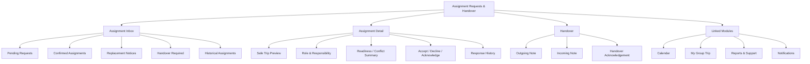
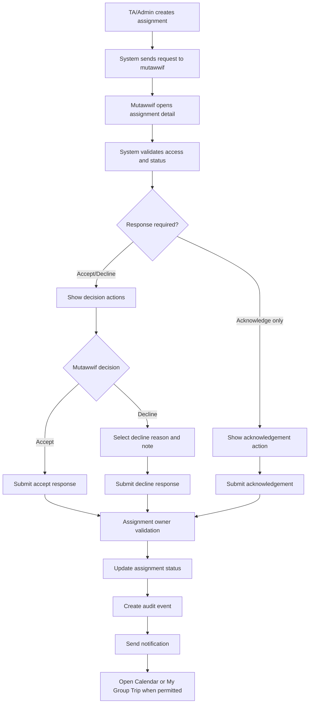
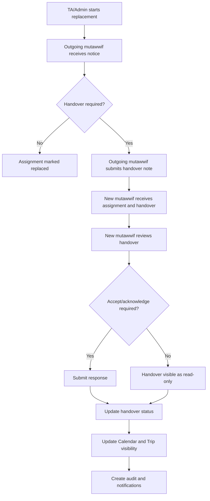
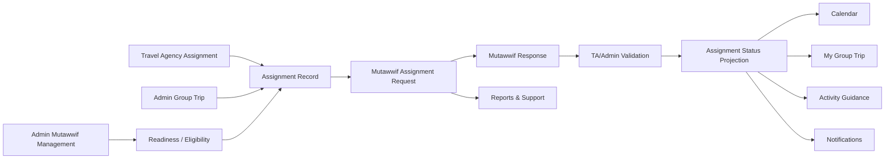

# MV PRD 17 - Assignment Requests & Handover

Product: UmrahHaji.com Mutawwif View  
Module: Assignment Requests & Handover  
Scope: Mutawwif Mobile Web App / Assignment Offer, Confirmation, Decline, Replacement Notice, Role Acknowledgement & Handover Notes  
Platform: Mobile-first Responsive Web Platform  
Status: Draft  
Last Updated: 20 June 2026  

---

## 1. Objective

Assignment Requests & Handover is the mutawwif-facing workflow for receiving, reviewing, confirming, declining, acknowledging, and handing over group trip assignments. It gives mutawwif a clear view of pending assignment offers, confirmed role, lead/assistant responsibility, replacement notices, cancellation notices, and handover notes without giving mutawwif control over Travel Agency or Admin assignment authority.

This module must help mutawwif answer:

1. Am I being offered or assigned to a new group trip?
2. Do I need to accept, decline, or only acknowledge this assignment?
3. What role am I assigned as: lead mutawwif, assistant mutawwif, replacement, or standby?
4. What trip dates, destination, agency, jamaah count, and responsibility summary should I review before confirming?
5. Is there a schedule conflict, readiness issue, or missing profile/payment setup that affects this assignment?
6. Has my assignment been changed, cancelled, or replaced?
7. What handover notes must I read or submit when a replacement happens?
8. Which confirmed assignments should appear in Calendar and My Group Trip?

This module is not the assignment creation workspace, not a mutawwif marketplace, not an availability calendar, not an in-app chat, and not a replacement approval console. Admin Panel and Travel Agency Portal own assignment creation, replacement, removal, conflict override, and final assignment status. Mutawwif View receives the assignment workflow and sends scoped responses.

---

## 2. Relationship With Mutawwif View Master Scope

This module follows the Mutawwif View mobile web app scope:

1. Mutawwif can access only assignment requests and handover records tied to their own account or assigned trip.
2. Mutawwif can accept, decline, or acknowledge an assignment only if the assignment policy enables mutawwif response.
3. Mutawwif cannot self-assign, replace another mutawwif, remove another mutawwif, override conflicts, or edit group trip master data.
4. Confirmed assignment controls when the related trip appears in PRD 04 Calendar and PRD 05 My Group Trip, based on policy.
5. Replacement and handover must preserve historical assignment records for audit, allowance, feedback, and support context.
6. Handover notes must be scoped to the trip and visible only to authorized old/new mutawwif, Admin, and Travel Agency staff.
7. Assignment notifications must go through PRD 10 and deep-link back to this module or the related trip.
8. Assignment issues, inability to attend, dispute, unsafe replacement, or missing information can be escalated to PRD 11 Reports & Support.

---

## 3. Relationship With Admin, Travel Agency, Jamaah, and Mutawwif PRDs

| Source Module | Relationship |
| --- | --- |
| Admin Group Trip Management | Platform-level source for group trip assignment, assignment snapshot, status, schedule, and audit |
| Admin Mutawwif Management | Source of mutawwif verification, status, readiness, availability, profile summary, and assignment eligibility |
| Admin User Management | Controls portal access, role, permission, account status, session, and security policy |
| Admin Report Management | Destination for assignment issue, dispute, no-show, safety, or replacement escalation |
| Travel Agency Mutawwif Assignment | Main source of assignment offer, role, confirmation policy, replacement, removal, conflict warning, and assignment history |
| Travel Agency Group Trip Management | Source of trip details, itinerary, members count, departure status, PIC contact, and operational updates |
| Travel Agency Reports / Support | Receives agency-scoped assignment issues, decline reasons, and replacement coordination cases |
| Travel Agency Finance Management | May consume completed assignment reference for allowance/payout readiness but does not own mutawwif response |
| Jamaah My Group Trip | Displays assigned mutawwif only after assignment reaches the release status configured by Admin/TA |
| Jamaah Notifications | May receive assigned mutawwif update if agency policy releases replacement notice to jamaah |
| MV PRD 03 - Profile, License & Verification | Source of assignment readiness, profile completeness, verification, license, and availability status |
| MV PRD 04 - Calendar & Schedule | Shows schedule after assignment is accepted/confirmed/active based on policy |
| MV PRD 05 - My Group Trip & Trip Details | Shows trip details after assignment status permits operational access |
| MV PRD 06 - Activity Guidance | Shows activity guidance after assignment becomes active or activity-scoped |
| MV PRD 08 - Allowance & Tip | May consume completed assignment reference for allowance/tip eligibility if enabled |
| MV PRD 09 - Payment Settings | Provides payout readiness warning if assignment requires payout setup |
| MV PRD 10 - Notifications & Announcements | Sends assignment request, accepted, declined, cancelled, replaced, and handover notifications |
| MV PRD 11 - Reports & Support | Destination for assignment issue, replacement concern, inability to attend, or handover dispute |
| MV PRD 16 - Account Settings & Security | Provides channel preference and security controls for assignment notifications |

### 3.1 Key Sync Rule

Assignment Requests & Handover is the mutawwif response surface, not the assignment authority.

Travel Agency / Admin Assignment Created -> Mutawwif Assignment Request -> Mutawwif Response / Acknowledgement -> Admin/TA Validation -> Assignment Status Projection -> Calendar / My Group Trip / Notifications.

If Admin or Travel Agency changes the assignment after mutawwif response, Mutawwif View must show the latest assignment status, preserve response history, and require acknowledgement where configured.

### 3.2 Cross-Role Boundary

| Role / Surface | Owns | Can Mutawwif View Display? | PRD 17 Rule |
| --- | --- | --- | --- |
| Travel Agency Mutawwif Assignment | Assign, replace, remove, status, conflict override, assignment notes | Yes, only records related to logged-in mutawwif | Mutawwif cannot assign or replace themselves |
| Admin Group Trip Management | Platform-level group trip assignment snapshot and audit | Yes, as safe trip/assignment context | Do not expose Admin internal notes |
| Admin Mutawwif Management | Readiness, verification, availability, profile status | Yes, own readiness summary | Mutawwif cannot self-approve readiness |
| Travel Agency Group Trip | Trip schedule, role need, trip PIC, operational details | Yes, safe assignment preview and trip context | Full trip detail opens only when status permits |
| PRD 04 Calendar | Schedule projection | Yes after accepted/confirmed/active status | Pending offer may show as tentative only if policy allows |
| PRD 05 My Group Trip | Trip workspace | Yes after status permits access | Pending/declined assignment must not expose full trip data |
| PRD 10 Notifications | Assignment communication | Yes as inbox/deep link | Inbox does not own assignment truth |
| PRD 11 Reports | Issues and disputes | Yes as handoff/status | Report does not automatically change assignment |

### 3.3 Boundary With PRD 04, PRD 05, and PRD 06

| Area | PRD 17 Responsibility | PRD 04 Responsibility | PRD 05 Responsibility | PRD 06 Responsibility |
| --- | --- | --- | --- | --- |
| Assignment offer | Owns mutawwif response UI | No | No | No |
| Assignment status | Shows own assignment lifecycle | Reads active schedule eligibility | Reads trip visibility eligibility | Reads activity visibility eligibility |
| Pending assignment | Shows preview and decision | May show tentative block if enabled | No full trip detail unless policy allows | No activity detail |
| Confirmed assignment | Triggers visibility | Shows schedule | Shows trip detail | Shows activity guidance |
| Replacement | Shows notice and handover | Updates schedule ownership | Updates assignment banner | Updates activity role/context |
| Handover notes | Owns handover view/submit | No | Can link from trip detail | Can link from activity if relevant |

---

## 4. Research Notes and Product Decisions

Assignment workflows are operationally sensitive because they control who is expected to guide jamaah in the field. Product decisions:

1. Assignment confirmation should be explicit if the business needs proof that mutawwif accepts responsibility before trip operations start.
2. If Travel Agency policy treats assignment as compulsory/internal, mutawwif may only acknowledge, not accept/decline.
3. Pending assignments should show enough safe detail for decision-making without exposing full jamaah/private trip data.
4. Decline requires reason and optional note so Travel Agency/Admin can coordinate replacement.
5. Replacement must preserve the original assignment record and handover trail instead of overwriting history.
6. Lead and assistant mutawwif roles require different visibility and responsibility summaries.
7. Assignment status changes should be visible through PRD 10 notifications and should be accessible as status messages.
8. During travel, handover must be concise, mobile-first, and connected to trip/activity context.
9. Mutawwif should be able to report unsafe, impossible, or unclear assignment conditions without silently changing assignment state.
10. Personal data and jamaah details must be minimized until assignment is confirmed and operational access is justified.

Reference sources used as product direction:

1. Nusuk pilgrimage platform: https://www.nusuk.sa/
2. Ministry of Hajj and Umrah official site: https://haj.gov.sa/en
3. W3C WCAG 2.2 - Status Messages: https://www.w3.org/WAI/WCAG22/Understanding/status-messages.html
4. W3C WCAG 2.2 - Target Size Minimum: https://www.w3.org/WAI/WCAG22/Understanding/target-size-minimum.html
5. Personal Data Protection Act 2010, Laws of Malaysia Act 709: https://lom.agc.gov.my/act-detail.php?type=principal&lang=BI&act=709

### 4.1 Research Validation Notes

| Research Area | Product Interpretation | Impact on This PRD |
| --- | --- | --- |
| Pilgrimage service operations | Assignment clarity affects field coordination and service continuity | Assignment offer must show role, schedule, agency, and responsibility summary |
| Digital pilgrimage service | Operational platforms should reduce uncertainty and support coordinated service delivery | Status, confirmation, handover, and notifications are required |
| Status messages | Dynamic status changes should be programmatically determinable | Accept/decline/save/replacement/handover states need accessible feedback |
| Target size | Mobile decisions may happen while moving or coordinating | Accept, decline, acknowledge, report, and handover actions need comfortable tap targets |
| Personal data protection | Assignment preview may contain trip and jamaah-sensitive context | Show minimum necessary preview until assignment is confirmed |

### 4.2 Assignment Authority Rule

Mutawwif response is an input to assignment status, not the source of assignment authority. Travel Agency/Admin policy decides whether a mutawwif response confirms the assignment immediately, moves it to pending agency review, or only records acknowledgement.

### 4.3 Handover Integrity Rule

Replacement must not delete the previous assignment. The system must keep old mutawwif, new mutawwif, reason, effective time, handover note, attachments if allowed, acknowledgement, and audit trail.

### 4.4 Data Minimization Rule

Pending assignment preview should show only decision-relevant details: agency, trip name/code, destination/city, date range, role, expected pax count, responsibility summary, conflict/readiness warnings, and contact/handoff channel. Full member detail, documents, finance, and private operational notes remain hidden until status permits access.

---

## 5. Scope

### 5.1 In Scope for Phase 1

1. Assignment Requests list.
2. Assignment request detail.
3. Assignment preview with safe trip summary.
4. Role summary: lead, assistant, replacement, standby.
5. Assignment status display.
6. Accept assignment where policy allows.
7. Decline assignment where policy allows.
8. Assignment acknowledgement where accept/decline is not required.
9. Decline reason and note.
10. Readiness/conflict warning summary.
11. Replacement notice.
12. Handover note view.
13. Handover note submit when mutawwif is being replaced and policy requires it.
14. Handover acknowledgement by incoming mutawwif.
15. Link to PRD 04 Calendar after accepted/confirmed status.
16. Link to PRD 05 My Group Trip after visibility status permits.
17. Link to PRD 11 Reports & Support for assignment issue.
18. PRD 10 notification integration.
19. Empty/loading/error/offline states.
20. Audit logs for view, accept, decline, acknowledge, handover view/submit.
21. Mobile-first responsive behavior.

### 5.2 In Scope for Phase 2

1. Availability counter-offer or proposed alternative dates.
2. Assignment negotiation with agency review.
3. Lead mutawwif task delegation to assistant.
4. Handover attachment upload.
5. Voice note handover.
6. Team handover checklist.
7. Standby assignment workflow.
8. Bulk acknowledgement for recurring assignments.
9. Assignment confirmation deadline reminders.
10. Calendar tentative hold while pending.
11. Advanced conflict explanation.
12. Assignment completion sign-off.

### 5.3 Out of Scope

1. Creating assignments.
2. Searching/selecting mutawwif for a trip.
3. Replacing another mutawwif.
4. Removing assignment.
5. Conflict override.
6. Editing group trip master data.
7. Editing itinerary, hotel, flight, transport, package, or jamaah members.
8. Viewing unrelated assignment candidates.
9. Full availability calendar management.
10. Chat between agency and mutawwif.
11. Payout execution.
12. Jamaah-facing mutawwif replacement notice content creation.
13. Admin/TA assignment analytics.

---

## 6. User Roles and Access

| Role | Access Behavior |
| --- | --- |
| Invited mutawwif | Can see assignment request only after account activation or invitation acceptance policy allows |
| Pending mutawwif | Can view limited assignment readiness prompt if assignment exists; full access depends on verification policy |
| Active mutawwif | Can view and respond to own assignment requests |
| Verified mutawwif | Can accept/decline/acknowledge assignment based on policy |
| Lead mutawwif | Can view lead role responsibility and handover from/to assistant where assigned |
| Assistant mutawwif | Can view assistant role assignment and scoped handover |
| Replacement mutawwif | Can view replacement context and acknowledge handover |
| Replaced mutawwif | Can view historical assignment and submit handover where required |
| Suspended mutawwif | Cannot accept new assignment; may view limited status/support handoff |
| Admin | Manages assignment authority from Admin Panel |
| Travel Agency staff | Creates, replaces, cancels, and monitors assignment from TA Portal |

### 6.1 Visibility Rules

Mutawwif can see:

1. Own assignment request.
2. Safe trip preview for pending assignment.
3. Own assignment role and expected responsibility.
4. Own conflict/readiness warning summary.
5. Own assignment response history.
6. Handover notes where they are outgoing or incoming mutawwif.
7. Safe Travel Agency PIC contact if released.

Mutawwif cannot see:

1. Assignment requests for other mutawwif.
2. Candidate list or matching score.
3. Internal Admin/TA selection notes.
4. Internal conflict override reason if restricted.
5. Full jamaah data before assignment visibility status permits.
6. Payout/billing data.
7. Other mutawwif private availability or decline reason.

---

## 7. Entry Points

| Entry Point | Behavior |
| --- | --- |
| Home assignment card | Opens pending assignment request or latest assignment update |
| Profile readiness banner | Opens assignment blocked/readiness explanation if assignment is waiting |
| PRD 10 notification | Opens assignment request, replacement notice, or handover detail |
| Calendar tentative item | Opens assignment detail if tentative hold is enabled |
| My Group Trip assignment banner | Opens assignment detail or handover note |
| Reports & Support case | Opens assignment context if case is linked |
| Account menu / Work queue | Opens Assignment Requests list |

---

## 8. Information Architecture

```text
Assignment Requests & Handover
+-- Assignment Inbox
|   +-- Pending Requests
|   +-- Confirmed Assignments
|   +-- Replacement Notices
|   +-- Handover Required
|   +-- Historical Assignments
+-- Assignment Detail
|   +-- Safe Trip Preview
|   +-- Role & Responsibility
|   +-- Dates & Destination
|   +-- Readiness / Conflict Summary
|   +-- Decision Actions
|   +-- Response History
+-- Handover
|   +-- Incoming Handover Note
|   +-- Outgoing Handover Note
|   +-- Handover Checklist
|   +-- Acknowledgement
+-- Linked Modules
    +-- Calendar
    +-- My Group Trip
    +-- Activity Guidance
    +-- Reports & Support
    +-- Notifications
```



### 8.1 Navigation Entry Points

| Entry Point | Behavior |
| --- | --- |
| Assignment Inbox | Shows all own assignment items grouped by attention |
| Pending Requests | Shows assignments awaiting response |
| Replacement Notices | Shows assignment changed/replaced state |
| Handover Required | Shows notes to submit or acknowledge |
| Historical Assignments | Shows read-only past assignment response/history |

---

## 9. Assignment Lifecycle

### 9.1 Assignment Status Model

| Status | Mutawwif Meaning |
| --- | --- |
| Draft | Not visible to mutawwif |
| Offered | Assignment request sent to mutawwif |
| Pending Response | Waiting for accept/decline/acknowledgement |
| Accepted | Mutawwif accepted; may require TA/Admin validation |
| Declined | Mutawwif declined with reason |
| Acknowledged | Mutawwif acknowledged assignment without accept/decline |
| Confirmed | Assignment is approved/confirmed by assignment owner |
| Active | Assignment is active for trip operation |
| Replacement Requested | Replacement is being processed |
| Replaced | Mutawwif has been replaced |
| Cancelled | Assignment cancelled |
| Completed | Trip/assignment completed |
| Expired | Response window expired |

### 9.2 Handover Status Model

| Status | Meaning |
| --- | --- |
| Not Required | No handover needed |
| Required | Outgoing or incoming mutawwif must act |
| Submitted | Outgoing handover note submitted |
| Acknowledged | Incoming mutawwif acknowledged note |
| Waived | Admin/TA waived handover |
| Overdue | Required handover not completed by deadline |

---

## 10. User Flows

### 10.1 Assignment Request Response Flow



### 10.2 Replacement and Handover Flow



### 10.3 Assignment Sync Flow



---

## 11. Screen and Component Requirements

### 11.1 Assignment Inbox

Purpose:
Show assignment-related items requiring attention.

Sections:

1. Pending Requests.
2. Confirmed / Upcoming Assignments.
3. Replacement Notices.
4. Handover Required.
5. Historical Assignments.

Card fields:

| Field | Display Rule |
| --- | --- |
| trip_name | Visible if released |
| trip_code | Visible if released |
| agency_name | Visible |
| date_range | Visible |
| destination_summary | Visible |
| role | Visible |
| status | Visible |
| response_deadline | Visible if configured |
| readiness_warning | Summary only |
| next_action | Accept, Decline, Acknowledge, View Handover, Open Trip |

Rules:

1. Sort attention items first.
2. Expired/declined/cancelled items move to history.
3. Cards must use safe preview only while pending.
4. Empty state should explain that assignments appear after Admin/TA sends them.

### 11.2 Assignment Detail

Purpose:
Allow mutawwif to review enough information to respond safely.

Content:

1. Assignment status banner.
2. Trip summary.
3. Role and responsibility summary.
4. Date range and timezone.
5. Destination/city summary.
6. Agency PIC contact if released.
7. Expected pax count.
8. Readiness/conflict warnings.
9. Response deadline.
10. Decision actions.
11. Response history.

Rules:

1. Pending assignment must not expose full member list.
2. Accept/decline buttons are hidden if policy is acknowledge-only.
3. Decline requires reason.
4. Accept may show confirmation dialog and responsibility summary.
5. Every response revalidates assignment status before submit.

### 11.3 Decision Actions

| Action | Availability | Required Data |
| --- | --- | --- |
| Accept | If response policy allows | Confirmation |
| Decline | If response policy allows | Reason, optional note |
| Acknowledge | If acknowledgement policy allows | Confirmation |
| Report Issue | Always if assignment visible and support enabled | Prefilled assignment context |
| Open Calendar | After status permits schedule access | None |
| Open Trip | After status permits trip access | None |

### 11.4 Decline Reasons

| Reason | Notes |
| --- | --- |
| schedule_conflict | Mutawwif has conflict |
| unavailable | Mutawwif is unavailable |
| health_or_emergency | Personal emergency or health issue |
| role_mismatch | Assigned role does not match capability |
| insufficient_information | Need more details before accepting |
| travel_constraint | Cannot travel to departure/destination |
| other | Requires note |

Rules:

1. Decline reason is visible to authorized Admin/TA.
2. Decline reason is not visible to jamaah.
3. Decline does not delete assignment history.
4. Decline can create replacement-required status in TA/Admin.

### 11.5 Replacement Notice

Purpose:
Inform mutawwif that assignment has changed.

Content:

1. Previous assignment role/status.
2. Effective replacement time.
3. Replacement reason category if released.
4. Required action: acknowledge, submit handover, or view history.
5. Calendar/trip visibility impact.

Rules:

1. Replacement notice must preserve old assignment record.
2. If the mutawwif is outgoing, active trip access can be removed or reduced based on policy.
3. If the mutawwif is incoming, access opens after confirmed/active status.

### 11.6 Handover Detail

Purpose:
Allow continuity when assignment is transferred.

Content:

1. Trip and role context.
2. Outgoing mutawwif safe identity.
3. Incoming mutawwif safe identity.
4. Handover note.
5. Outstanding items.
6. Important contacts.
7. Activity/member context summary if allowed.
8. Acknowledgement status.

Rules:

1. Handover note must not include sensitive jamaah data beyond permission.
2. Handover note is visible to outgoing/incoming mutawwif, Admin, and authorized TA.
3. Attachment upload is Phase 2 unless policy enables it earlier.
4. Handover acknowledgement does not imply full assignment acceptance unless configured.

---

## 12. Data Model

### 12.1 AssignmentRequest

| Field | Type | Required | Notes |
| --- | --- | --- | --- |
| assignment_request_id | UUID | Yes | Primary identifier |
| assignment_id | UUID | Yes | Source assignment record |
| group_trip_id | UUID | Yes | Related trip |
| mutawwif_id | UUID | Yes | Target mutawwif |
| user_id | UUID | Yes | Target account |
| agency_id | UUID | Yes | Assignment owner agency |
| role | Enum | Yes | lead, assistant, replacement, standby |
| status | Enum | Yes | offered, pending_response, accepted, declined, acknowledged, confirmed, active, replaced, cancelled, completed, expired |
| response_policy | Enum | Yes | accept_decline, acknowledge_only, no_response_required |
| safe_trip_snapshot | JSON | Yes | Minimum preview data |
| response_deadline_at | DateTime | Optional | Deadline |
| visibility_level | Enum | Yes | preview, trip_summary, full_assigned |
| created_at | DateTime | Yes | Timestamp |
| updated_at | DateTime | Yes | Timestamp |

### 12.2 AssignmentResponse

| Field | Type | Required | Notes |
| --- | --- | --- | --- |
| response_id | UUID | Yes | Primary identifier |
| assignment_request_id | UUID | Yes | Related request |
| mutawwif_id | UUID | Yes | Actor |
| response_type | Enum | Yes | accept, decline, acknowledge |
| decline_reason | Enum | Conditional | Required for decline |
| note | Text | Optional | Mutawwif note |
| status_after_response | Enum | Yes | Resulting status |
| created_at | DateTime | Yes | Timestamp |

### 12.3 AssignmentHandover

| Field | Type | Required | Notes |
| --- | --- | --- | --- |
| handover_id | UUID | Yes | Primary identifier |
| group_trip_id | UUID | Yes | Related trip |
| old_assignment_id | UUID | Yes | Outgoing assignment |
| new_assignment_id | UUID | Optional | Incoming assignment |
| outgoing_mutawwif_id | UUID | Yes | Previous mutawwif |
| incoming_mutawwif_id | UUID | Optional | Replacement mutawwif |
| handover_status | Enum | Yes | not_required, required, submitted, acknowledged, waived, overdue |
| note | Text | Optional | Safe handover note |
| outstanding_items | JSON | Optional | Checklist items |
| due_at | DateTime | Optional | Deadline |
| submitted_at | DateTime | Optional | Timestamp |
| acknowledged_at | DateTime | Optional | Timestamp |
| created_at | DateTime | Yes | Timestamp |
| updated_at | DateTime | Yes | Timestamp |

### 12.4 AssignmentReadinessSnapshot

| Field | Type | Required | Notes |
| --- | --- | --- | --- |
| snapshot_id | UUID | Yes | Primary identifier |
| assignment_request_id | UUID | Yes | Related request |
| profile_status | Enum | Yes | complete, incomplete, under_review, rejected |
| verification_status | Enum | Yes | verified, pending, suspended, expired |
| availability_status | Enum | Yes | available, conflict, unavailable, unknown |
| payment_setup_status | Enum | Optional | ready, missing, pending, not_required |
| conflict_summary | Text | Optional | Safe summary |
| blocking_flags | JSON | Optional | Safe flags |
| created_at | DateTime | Yes | Timestamp |

### 12.5 AssignmentAuditEvent

| Field | Type | Required | Notes |
| --- | --- | --- | --- |
| audit_id | UUID | Yes | Primary identifier |
| user_id | UUID | Yes | Actor |
| mutawwif_id | UUID | Optional | Actor profile |
| assignment_id | UUID | Optional | Related assignment |
| action | Enum | Yes | view_request, accept, decline, acknowledge, view_handover, submit_handover, report_issue, open_trip |
| result | Enum | Yes | success, failed, blocked |
| reason_code | String | Optional | Safe code |
| created_at | DateTime | Yes | Timestamp |

---

## 13. Permission Logic

### 13.1 Permission Chain

Assignment Requests & Handover must follow the existing permission chain:

Portal Access -> Role -> Permission Group -> Module Permission -> Action Permission -> Data Scope.

### 13.2 Permission Keys

| Permission Key | Description |
| --- | --- |
| mutawwif.assignments.view | View own assignment requests and assignment history |
| mutawwif.assignments.detail.view | View own assignment detail |
| mutawwif.assignments.accept | Accept own assignment when policy allows |
| mutawwif.assignments.decline | Decline own assignment when policy allows |
| mutawwif.assignments.acknowledge | Acknowledge own assignment when policy requires |
| mutawwif.assignments.handover.view | View own incoming/outgoing handover |
| mutawwif.assignments.handover.submit | Submit outgoing handover note |
| mutawwif.assignments.handover.acknowledge | Acknowledge incoming handover |
| mutawwif.assignments.report_issue | Report assignment issue through PRD 11 |
| mutawwif.assignments.history.view | View safe own assignment history |

### 13.3 Data Scope Rules

| Scope | Rule |
| --- | --- |
| Own assignment | Mutawwif can access only assignments where `mutawwif_id` or `user_id` matches own account |
| Own handover | Mutawwif can access handover only if outgoing or incoming participant |
| Pending preview | Only safe trip snapshot visible |
| Confirmed/active | Calendar and trip detail visibility follows assignment status and policy |
| Replaced/cancelled | Historical view only, unless support/handover requires limited access |
| Suspended account | New response actions blocked; limited status/support may remain |
| Agency scope | Assignment belongs to source agency; mutawwif cannot browse agency assignment workspace |

### 13.4 Blocked Actions

Mutawwif cannot:

1. Create assignment.
2. Assign themselves to a trip.
3. Replace another mutawwif.
4. Remove assignment.
5. Override conflict warning.
6. Approve their own verification or readiness.
7. Edit group trip, itinerary, hotel, flight, transport, package, or member list.
8. View candidate list or matching notes.
9. View other mutawwif decline reason unless policy explicitly shares safe status.
10. Delete assignment or handover history.

---

## 14. Functional Requirements

| ID | Requirement | Priority |
| --- | --- | --- |
| MV-AH-001 | System shall show Assignment Requests list for signed-in mutawwif. | P1 |
| MV-AH-002 | System shall show assignment request detail with safe trip preview. | P1 |
| MV-AH-003 | System shall show assignment role and responsibility summary. | P1 |
| MV-AH-004 | System shall show assignment status and response deadline where configured. | P1 |
| MV-AH-005 | System shall show readiness/conflict summary before response. | P1 |
| MV-AH-006 | System shall allow accept response when policy allows. | P1 |
| MV-AH-007 | System shall allow decline response with reason when policy allows. | P1 |
| MV-AH-008 | System shall allow assignment acknowledgement when policy requires. | P1 |
| MV-AH-009 | System shall block response after deadline or invalid status. | P1 |
| MV-AH-010 | System shall notify Admin/TA after mutawwif response. | P1 |
| MV-AH-011 | System shall update Calendar visibility after assignment status permits. | P1 |
| MV-AH-012 | System shall update My Group Trip visibility after assignment status permits. | P1 |
| MV-AH-013 | System shall show replacement notice when assignment changes. | P1 |
| MV-AH-014 | System shall support handover note view for incoming/outgoing mutawwif. | P1 |
| MV-AH-015 | System shall support outgoing handover note submission where required. | P1 |
| MV-AH-016 | System shall support incoming handover acknowledgement where required. | P1 |
| MV-AH-017 | System shall route assignment issue to PRD 11 Reports & Support. | P1 |
| MV-AH-018 | System shall create PRD 10 notifications for assignment status changes. | P1 |
| MV-AH-019 | System shall create audit events for view/response/handover actions. | P1 |
| MV-AH-020 | System shall prevent access to other mutawwif assignments. | P1 |
| MV-AH-021 | System shall support empty/loading/error/offline states. | P1 |
| MV-AH-022 | System shall support tentative calendar hold for pending assignment if policy enables it. | P2 |
| MV-AH-023 | System shall support availability counter-offer if policy enables it. | P2 |
| MV-AH-024 | System shall support handover attachment upload if storage/security policy enables it. | P2 |
| MV-AH-025 | System shall support assignment completion sign-off if allowance/operation roadmap enables it. | P2 |

---

## 15. Business Rules

### 15.1 Assignment Response Rules

1. Assignment request must be tied to one mutawwif account.
2. Mutawwif response must revalidate assignment status before save.
3. Accept response does not always mean final confirmed assignment; policy controls whether Admin/TA validation is needed.
4. Decline requires a reason.
5. Expired assignment cannot be accepted or declined unless Admin/TA reopens it.
6. Assignment response creates immutable history.
7. Pending assignment exposes preview only.

### 15.2 Readiness and Conflict Rules

1. Profile verification, suspension, availability, and schedule conflict can block accept action based on policy.
2. Missing payout setup should not block assignment unless finance policy explicitly requires it.
3. Calendar conflict is warning or blocker based on TA/Admin rules.
4. Mutawwif cannot override conflict.

### 15.3 Replacement Rules

1. Replacement must create a new assignment record or status transition, not overwrite old history.
2. Outgoing mutawwif access is reduced based on effective replacement status.
3. Incoming mutawwif access starts based on confirmed/active status.
4. Replacement can require handover note before old assignment closes.
5. Replacement notice must be sent through PRD 10.

### 15.4 Handover Rules

1. Handover note must be safe, scoped, and auditable.
2. Handover should not contain payment, bank, full identity, or private document data.
3. Incoming mutawwif acknowledgement does not automatically accept assignment unless policy says so.
4. Overdue handover should notify Admin/TA and mutawwif.

### 15.5 Trip Visibility Rules

1. Calendar and My Group Trip access depend on assignment visibility status.
2. Declined, expired, cancelled, and replaced assignments should not open active trip workspace unless historical access is allowed.
3. Full member and activity details remain hidden until assignment is confirmed/active or policy explicitly permits earlier access.

---

## 16. API and Event Requirements

### 16.1 API Endpoints

| Method | Endpoint | Purpose |
| --- | --- | --- |
| GET | /mutawwif/assignment-requests | Load own assignment list |
| GET | /mutawwif/assignment-requests/{id} | Load own assignment detail |
| POST | /mutawwif/assignment-requests/{id}/accept | Accept assignment |
| POST | /mutawwif/assignment-requests/{id}/decline | Decline assignment |
| POST | /mutawwif/assignment-requests/{id}/acknowledge | Acknowledge assignment |
| GET | /mutawwif/assignments/history | Load safe own assignment history |
| GET | /mutawwif/assignments/{id}/handover | Load handover detail |
| POST | /mutawwif/assignments/{id}/handover | Submit handover note |
| POST | /mutawwif/assignments/{id}/handover/acknowledge | Acknowledge incoming handover |
| POST | /mutawwif/assignment-requests/{id}/report-issue | Create PRD 11 handoff |

### 16.2 Event Triggers

| Event | Trigger | Recipient |
| --- | --- | --- |
| assignment_request.created | TA/Admin creates request | Mutawwif, PRD 10 |
| assignment_request.accepted | Mutawwif accepts | TA/Admin, audit, notification |
| assignment_request.declined | Mutawwif declines | TA/Admin, audit, notification |
| assignment_request.acknowledged | Mutawwif acknowledges | TA/Admin, audit |
| assignment.confirmed | TA/Admin confirms assignment | Mutawwif, Calendar, My Group Trip |
| assignment.cancelled | TA/Admin cancels assignment | Mutawwif, Calendar, My Group Trip |
| assignment.replaced | TA/Admin replaces mutawwif | Outgoing/incoming mutawwif, Calendar, My Group Trip |
| handover.required | Replacement requires handover | Outgoing/incoming mutawwif |
| handover.submitted | Outgoing mutawwif submits handover | Incoming mutawwif, TA/Admin |
| handover.acknowledged | Incoming mutawwif acknowledges | TA/Admin, audit |
| assignment.issue_reported | Mutawwif reports issue | PRD 11, TA/Admin |

### 16.3 Deep Link Requirements

| Source | Target |
| --- | --- |
| PRD 10 assignment request notification | Assignment request detail |
| PRD 10 replacement notification | Replacement notice / handover detail |
| PRD 04 tentative calendar item | Assignment detail |
| PRD 05 assignment banner | Assignment detail or handover |
| PRD 11 assignment issue case | Assignment detail if permitted |
| PRD 03 readiness warning | Profile readiness or assignment detail |
| PRD 09 payout warning | Payment Settings if payout readiness affects assignment |

---

## 17. UI States

| State | Behavior |
| --- | --- |
| Loading | Show skeleton cards and detail placeholders |
| Empty | Explain no assignment requests yet |
| Pending response | Show response deadline and available actions |
| Accepted pending validation | Show waiting for TA/Admin confirmation |
| Declined | Show decline summary and history |
| Acknowledged | Show acknowledgement success and next step |
| Confirmed | Show links to Calendar and My Group Trip |
| Replaced | Show replacement notice and history |
| Handover required | Show handover action and due date |
| Handover submitted | Show submitted status |
| Expired | Disable response and show contact/report action |
| Offline | Allow cached read-only view; disable response submit |
| Error | Show retry and support handoff |
| Blocked | Show policy reason and next action |

---

## 18. Security, Privacy, and Compliance

1. All assignment request pages require authenticated mutawwif session.
2. Assignment detail must re-check user, mutawwif, assignment, and trip scope.
3. Pending preview must minimize trip and jamaah data.
4. Full trip/member/activity data is visible only after assignment status permits.
5. Handover note must be permission-scoped.
6. Decline reason is visible only to authorized Admin/TA and not jamaah by default.
7. Audit logs are mandatory for response and handover actions.
8. Assignment history must be retained for operational, support, allowance, feedback, and audit purposes.
9. Report issue handoff must not expose more source data than mutawwif can access.
10. Notification previews must use safe summaries.

---

## 19. Analytics and Audit

### 19.1 Analytics Events

| Event | Properties |
| --- | --- |
| assignment_requests_opened | user_id, mutawwif_id, status_filter |
| assignment_detail_opened | assignment_request_id, status, role |
| assignment_accept_started | assignment_request_id, role |
| assignment_accepted | assignment_request_id, result |
| assignment_declined | assignment_request_id, decline_reason, result |
| assignment_acknowledged | assignment_request_id, result |
| replacement_notice_opened | assignment_id, role |
| handover_opened | handover_id, direction |
| handover_submitted | handover_id, result |
| handover_acknowledged | handover_id, result |
| assignment_issue_report_started | assignment_request_id, source |

### 19.2 Audit Requirements

Audit events are required for:

1. Viewing assignment request detail.
2. Accepting assignment.
3. Declining assignment.
4. Acknowledging assignment.
5. Viewing handover detail.
6. Submitting handover note.
7. Acknowledging handover.
8. Opening trip/calendar from assignment.
9. Reporting assignment issue.
10. Blocked attempt to access another assignment.

Audit must include actor, user, mutawwif, assignment, trip, action, result, timestamp, and safe reason code.

---

## 20. Acceptance Criteria

1. Mutawwif can open Assignment Requests list from Home, notification, or account/work queue.
2. Pending assignment shows safe trip preview, role, dates, agency, and next action.
3. Mutawwif can accept assignment when response policy allows.
4. Mutawwif can decline assignment with required reason when policy allows.
5. Mutawwif can acknowledge assignment when policy is acknowledgement-only.
6. Response submit revalidates assignment status and deadline.
7. Declined assignment does not appear as active trip in Calendar/My Group Trip.
8. Confirmed assignment can open Calendar and My Group Trip when policy permits.
9. Replacement notice appears for outgoing and incoming mutawwif.
10. Handover required state shows correct action and deadline.
11. Outgoing mutawwif can submit handover note when required.
12. Incoming mutawwif can acknowledge handover when required.
13. Mutawwif cannot view another mutawwif assignment request.
14. Mutawwif cannot create, replace, remove, or override assignment.
15. Assignment issue opens PRD 11 with assignment context prefilled.
16. Assignment status changes create PRD 10 notification.
17. Sensitive data remains hidden in pending preview.
18. All response and handover actions create audit events.
19. Offline mode allows read-only cached view and blocks response submit.
20. Mobile layout has no overlapping controls and primary actions are easy to tap.

---

## 21. Dependencies

1. Travel Agency Mutawwif Assignment.
2. Travel Agency Group Trip Management.
3. Admin Group Trip Management.
4. Admin Mutawwif Management.
5. Admin User Management.
6. MV PRD 03 Profile, License & Verification.
7. MV PRD 04 Calendar & Schedule.
8. MV PRD 05 My Group Trip & Trip Details.
9. MV PRD 06 Activity Guidance.
10. MV PRD 09 Payment Settings.
11. MV PRD 10 Notifications & Announcements.
12. MV PRD 11 Reports & Support.
13. MV PRD 16 Account Settings & Security.

---

## 22. Risks and Mitigations

| Risk | Mitigation |
| --- | --- |
| Mutawwif thinks accept means final approval | Show policy-specific status: accepted pending validation vs confirmed |
| Pending preview exposes too much trip data | Use safe preview until assignment is confirmed |
| Decline disrupts operations | Require reason, notify TA/Admin, preserve replacement workflow |
| Replacement overwrites old assignment | Use immutable assignment history and handover record |
| Handover note includes sensitive data | Use guidance, validation, visibility rules, and audit |
| Calendar shows unconfirmed trip as active | Gate visibility by assignment status and policy |
| Duplicate notifications confuse users | PRD 10 uses source event and deep link; avoid duplicate announcement unless needed |
| Mutawwif cannot respond due to poor network | Allow cached read-only view and clear retry; Phase 2 offline queue if needed |

---

## 23. Release Plan

### Phase 1A

1. Assignment Requests list.
2. Assignment detail.
3. Accept/decline/acknowledge.
4. Decline reason.
5. PRD 10 notification integration.
6. Calendar/My Group Trip visibility gating.

### Phase 1B

1. Replacement notice.
2. Handover view.
3. Handover submit/acknowledge.
4. Assignment issue report handoff.
5. Assignment history.

### Phase 2

1. Counter-offer.
2. Tentative calendar hold.
3. Handover attachments.
4. Standby workflow.
5. Completion sign-off.
6. Advanced conflict explanation.

---

## 24. QA and Test Coverage

Functional tests:

1. Load assignment list.
2. Open pending assignment detail.
3. Accept assignment.
4. Decline assignment with reason.
5. Acknowledge assignment.
6. Attempt response after deadline.
7. Show confirmed assignment Calendar link.
8. Show confirmed assignment My Group Trip link.
9. Show replacement notice.
10. Submit handover note.
11. Acknowledge incoming handover.
12. Open PRD 11 assignment issue handoff.

Permission tests:

1. Own assignment access.
2. Other assignment blocked.
3. Pending preview limited data.
4. Confirmed assignment expanded visibility.
5. Suspended mutawwif blocked response.
6. Replaced mutawwif historical access.

Security/privacy tests:

1. No full jamaah data in pending preview.
2. No internal Admin/TA notes.
3. Decline reason not visible to jamaah.
4. Handover visible only to authorized parties.
5. Audit event created for each response.

Responsive tests:

1. Mobile assignment card list.
2. Mobile assignment detail.
3. Mobile decision confirmation.
4. Mobile handover note.
5. Tablet/desktop layout.

---

## 25. Open Questions

1. Is mutawwif accept/decline mandatory for all assignments, or only selected agencies/trips?
2. Does accepting assignment immediately confirm it, or must TA/Admin validate after response?
3. How long is the default assignment response window?
4. Should pending assignment create a tentative Calendar block?
5. Which decline reasons should be mandatory in P1?
6. Is handover mandatory for every replacement or only active/in-progress trips?
7. Should outgoing mutawwif keep read-only trip access after replacement?
8. Should jamaah receive replacement notice automatically or only after TA/Admin release?
9. Should assignment completion sign-off feed PRD 08 allowance eligibility in P1 or Phase 2?

---

## 26. Final Product Decision

Assignment Requests & Handover should be implemented as the mutawwif-facing response and continuity module for assignment lifecycle events, synchronized with Travel Agency Mutawwif Assignment, Admin Group Trip Management, Admin Mutawwif Management, MV PRD 03 Profile, MV PRD 04 Calendar, MV PRD 05 My Group Trip, MV PRD 06 Activity Guidance, MV PRD 10 Notifications, MV PRD 11 Reports & Support, and MV PRD 16 Account Settings.

The product direction is:

1. Let mutawwif clearly review and respond to assignment requests when policy requires it.
2. Keep Travel Agency/Admin as the assignment authority.
3. Gate Calendar and My Group Trip visibility by assignment status and policy.
4. Preserve assignment, replacement, and handover history for audit and service continuity.
5. Keep pending previews privacy-safe and hide full jamaah/trip details until assignment access is justified.
6. Route assignment issues through Reports & Support rather than letting mutawwif silently alter assignment truth.

This gives mutawwif operational clarity and accountability while preserving assignment governance, role boundaries, privacy, and cross-module sync.
