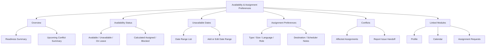
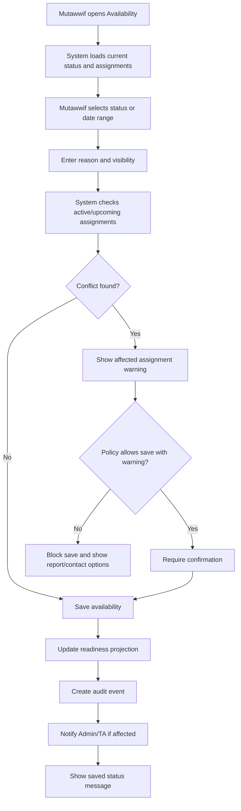
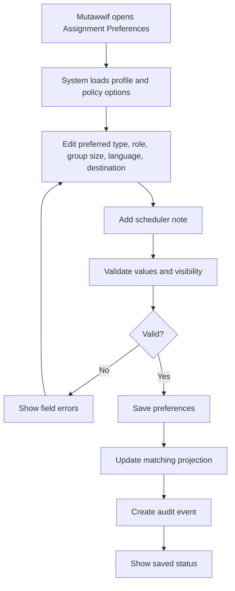
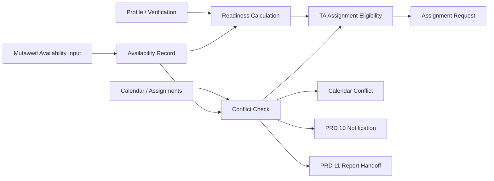

# MV PRD 18 - Availability & Assignment Preferences

Product: UmrahHaji.com Mutawwif View  
Module: Availability & Assignment Preferences  
Scope: Mutawwif Mobile Web App / Availability Status, Unavailable Dates, Assignment Preferences, Conflict Signals & Readiness Projection  
Platform: Mobile-first Responsive Web Platform  
Status: Draft  
Last Updated: 20 June 2026  

---

## 1. Objective

Availability & Assignment Preferences is the mutawwif-facing control surface for setting availability status, unavailable/on-leave date ranges, assignment preferences, and scheduler notes that support assignment matching and conflict prevention.

This module must help mutawwif answer:

1. Am I currently marked available, unavailable, on leave, assigned, or blocked?
2. Which future dates have I marked as unavailable?
3. Will changing availability affect an upcoming or active assignment?
4. Which assignment types, group sizes, languages, destinations, or roles do I prefer?
5. Which preferences are visible to Admin and Travel Agency schedulers?
6. Which readiness blockers prevent me from being considered for assignments?
7. Which conflicts came from my availability versus an existing trip assignment?
8. Where do I go if availability or assignment conflict needs manual review?

This module is not an assignment creation workspace, not a full Calendar editor, not a leave approval HR system, and not a way for mutawwif to bypass verification. Admin Panel and Travel Agency Portal remain the assignment authority. Mutawwif View provides self-service availability inputs and a safe readiness projection.

---

## 2. Relationship With Mutawwif View Master Scope

This module follows the Mutawwif View mobile web app scope:

1. Mutawwif can view and update only their own availability and assignment preferences.
2. Availability directly affects assignment readiness but does not override account status, profile verification, certification validity, suspension, or Admin/TA assignment rules.
3. Mutawwif cannot force themselves into Ready for Assignment if other readiness conditions are not met.
4. Mutawwif cannot override assignment conflict warnings or approve their own assignment eligibility.
5. Availability changes that affect active/upcoming assignments must warn the mutawwif and notify Admin/TA where policy requires.
6. Calendar and Assignment Requests consume availability and conflict signals but do not own availability source data.
7. Assignment preferences guide matching and scheduler decisions but do not guarantee assignment.
8. Every availability/status/preference change must be audit logged.

---

## 3. Relationship With Admin, Travel Agency, Jamaah, and Mutawwif PRDs

| Source Module | Relationship |
| --- | --- |
| Admin Mutawwif Management | Source of global mutawwif readiness, verification, availability governance, conflict override, and assignment eligibility |
| Admin Group Trip Management | Consumes availability/conflict when platform-level trip assignment is created or changed |
| Admin User Management | Controls portal access, account status, permission, and suspension |
| Travel Agency Mutawwif Assignment | Consumes availability status, unavailable dates, assignment preferences, and conflict signals for matching/assignment |
| Travel Agency Group Trip Management | Provides trip dates, schedule, and assignment context used for conflict calculation |
| Travel Agency Settings | May define agency-specific assignment policies, required response window, or availability lead time |
| Admin Report Management | Destination for availability dispute, conflict issue, or assignment readiness support |
| MV PRD 03 - Profile, License & Verification | Original profile module that owns broader mutawwif identity, verification, license, and readiness calculation |
| MV PRD 04 - Calendar & Schedule | Displays assignment conflicts and unavailable date warnings in schedule context |
| MV PRD 05 - My Group Trip & Trip Details | Shows assignment role/status and trip access after assignment is confirmed/active |
| MV PRD 10 - Notifications & Announcements | Sends availability changed, conflict detected, readiness changed, and scheduler review notifications |
| MV PRD 11 - Reports & Support | Destination for availability conflict/report issue handoff |
| MV PRD 17 - Assignment Requests & Handover | Consumes availability and preference data during assignment request, accept/decline, replacement, and handover |

### 3.1 Key Sync Rule

Availability & Assignment Preferences is the mutawwif-owned input surface, not the final eligibility authority.

Mutawwif Availability Input -> Readiness / Conflict Calculation -> Admin/TA Assignment Eligibility -> Assignment Request / Calendar Projection -> Notifications / Reports.

If availability changes conflict with existing assignments, the system must preserve the existing assignment truth, create a conflict signal, notify relevant parties where required, and route resolution to Admin/TA or PRD 11. Mutawwif cannot silently reassign themselves by changing availability.

### 3.2 Cross-Role Boundary

| Role / Surface | Owns | Can Mutawwif View Display? | PRD 18 Rule |
| --- | --- | --- | --- |
| Admin Mutawwif Management | Verification, global readiness, override, suspension, availability governance | Yes, safe own readiness summary | Mutawwif cannot self-approve readiness |
| Travel Agency Mutawwif Assignment | Matching, assignment, replacement, conflict handling | Yes, own conflict/preference usage summary | Mutawwif cannot assign or override conflict |
| Calendar & Schedule | Assigned activity schedule and conflict display | Yes, own affected dates | Calendar reads availability; PRD 18 owns availability input |
| Profile & License | Personal/professional profile and readiness | Yes, linked readiness blockers | Do not duplicate full profile editing |
| Reports & Support | Issue escalation | Yes, handoff link | Report does not automatically change availability |
| Notifications | Communication | Yes, deep links/status updates | Notification does not own availability truth |

### 3.3 Boundary With PRD 03 and PRD 17

| Area | PRD 03 Profile | PRD 17 Assignment Requests | PRD 18 Availability |
| --- | --- | --- | --- |
| Verification | Owns profile/license/document readiness | Reads readiness when assignment offered | Displays blocker summary only |
| Availability status | Defines as part of profile readiness | Reads for assignment warning | Owns direct update and date ranges |
| Assignment preference | Basic profile preference | Consumes during offer/role preview | Owns detailed preference shortcut |
| Assignment response | No | Owns accept/decline/acknowledge | No |
| Conflict display | Summary only | Shows assignment-specific conflict | Owns availability-origin conflict source |
| Admin override | Admin-only | Reads result | Not available to mutawwif |

---

## 4. Research Notes and Product Decisions

Availability drives service continuity and assignment quality. Product decisions:

1. Mutawwif needs quick access to availability because assignment matching depends on verified, active, and available status.
2. Availability should be simple enough for mobile field use: status, date range, reason, and preferences.
3. Unavailable/on-leave changes that overlap active or upcoming assignment must create warnings and notify assignment owners where policy requires.
4. Preferences should support better matching but should not be treated as hard constraints unless Admin/TA policy marks them as required.
5. Assignment preferences must not expose private personal reasons to Travel Agency unless mutawwif or platform policy allows it.
6. System should distinguish between availability status, assignment status, and readiness status.
7. Calendar conflict should show the affected date range and source but should not let mutawwif self-reassign.
8. Availability changes should use accessible status messages and large mobile controls.
9. Timezone and date interpretation must be clear because departure country and Saudi destination schedules may differ.
10. Privacy rules require minimum necessary display of availability reasons and scheduler notes.

Reference sources used as product direction:

1. Nusuk pilgrimage platform: https://www.nusuk.sa/
2. Ministry of Hajj and Umrah official site: https://haj.gov.sa/en
3. W3C WCAG 2.2 - Status Messages: https://www.w3.org/WAI/WCAG22/Understanding/status-messages.html
4. W3C WCAG 2.2 - Target Size Minimum: https://www.w3.org/WAI/WCAG22/Understanding/target-size-minimum.html
5. Personal Data Protection Act 2010, Laws of Malaysia Act 709: https://lom.agc.gov.my/act-detail.php?type=principal&lang=BI&act=709

### 4.1 Research Validation Notes

| Research Area | Product Interpretation | Impact on This PRD |
| --- | --- | --- |
| Pilgrimage operations | Guide availability affects service continuity and safe coordination | Availability must feed assignment readiness and conflict alerts |
| Digital service facilitation | Operational clarity reduces assignment uncertainty | Show readiness blockers, affected dates, and next action |
| Status messages | Dynamic save/conflict/readiness updates should be perceivable | Availability saved, conflict detected, and blocked state need accessible feedback |
| Target size | Mobile users may update availability quickly in the field | Date range, status, save, report, and preference controls need comfortable tap targets |
| Personal data protection | Availability reasons may reveal personal/private data | Hide private reason by default and limit TA/Admin visibility by policy |

### 4.2 Availability Authority Rule

Mutawwif can declare availability inputs, but system eligibility is calculated from account status, profile verification, license/certification validity, availability, assignment conflicts, suspension, and Admin/TA policies.

### 4.3 Preference Matching Rule

Assignment preferences improve matching and scheduler awareness. They are not guarantees, contractual limits, or automatic assignment filters unless Admin/TA explicitly configures them as hard constraints.

### 4.4 Conflict Safety Rule

Changing availability never cancels, replaces, or reassigns an existing assignment by itself. It creates a conflict signal and handoff path for Admin/TA resolution.

---

## 5. Scope

### 5.1 In Scope for Phase 1

1. Availability overview.
2. Quick availability status update.
3. Unavailable/on-leave date range management.
4. Availability reason.
5. Private vs scheduler-visible note behavior.
6. Assignment preference editing.
7. Preferred assignment type.
8. Preferred group size.
9. Preferred language group.
10. Preferred role: lead, assistant, standby, no preference.
11. Preferred destination/city or region where policy supports it.
12. Readiness summary.
13. Conflict warning for overlapping assignments/date ranges.
14. Affected assignment summary.
15. Save confirmation and blocked state.
16. PRD 10 notification integration.
17. PRD 11 report issue handoff.
18. Deep link from Home, Profile, Calendar, and Assignment Requests.
19. Empty/loading/error/offline states.
20. Audit logs for availability and preference changes.
21. Mobile-first responsive behavior.

### 5.2 In Scope for Phase 2

1. Full availability calendar.
2. Recurring unavailable rules.
3. Partial-day/time-slot availability.
4. Travel buffer days before/after assignment.
5. Availability import/export with external calendar.
6. Preferred working days/time windows.
7. Capacity limits per month or season.
8. Agency-specific preference visibility.
9. Availability approval workflow if required by agency/admin.
10. Smart conflict suggestions.
11. Auto-reminder before unavailable period starts.
12. Bulk availability update.

### 5.3 Out of Scope

1. Creating assignments.
2. Accepting/declining assignment requests.
3. Replacing mutawwif.
4. Conflict override.
5. Full group trip schedule editing.
6. Calendar activity editing.
7. Profile/license verification approval.
8. Travel Agency candidate search.
9. Admin assignment analytics.
10. HR leave payroll processing.
11. Payout or allowance calculation.
12. Native device calendar sync in P1.

---

## 6. User Roles and Access

| Role | Access Behavior |
| --- | --- |
| Invited mutawwif | No full availability editing until account activation unless onboarding policy allows |
| Pending mutawwif | Can update availability/preferences if profile onboarding allows; not assignment-ready until verified |
| Active mutawwif | Can update own availability and preferences |
| Verified mutawwif | Availability affects assignment readiness and matching |
| Lead mutawwif | Same own availability access; no team availability access in P1 |
| Assistant mutawwif | Same own availability access |
| Suspended mutawwif | Availability edit may be disabled; support handoff shown |
| Replaced mutawwif | Can update future availability; historical assignment conflict remains read-only |
| Admin | Manages/overrides availability in Admin Panel based on permission |
| Travel Agency staff | Consumes availability/preference during assignment; cannot edit mutawwif availability in Mutawwif View |

### 6.1 Visibility Rules

Mutawwif can see:

1. Own availability status.
2. Own unavailable/on-leave date ranges.
3. Own preference values.
4. Own readiness blockers.
5. Own assignment conflicts.
6. Safe affected assignment summary.

Mutawwif cannot see:

1. Other mutawwif availability.
2. Admin conflict override controls.
3. Travel Agency candidate list.
4. Internal matching score.
5. Other mutawwif preference notes.
6. Internal Admin/TA scheduler notes.
7. Full trip/member data for unconfirmed assignments.

---

## 7. Entry Points

| Entry Point | Behavior |
| --- | --- |
| Home readiness widget | Opens availability overview or conflict detail |
| Profile availability row | Opens availability and assignment preferences |
| Calendar conflict banner | Opens affected availability conflict |
| Assignment request warning | Opens availability detail or readiness blocker |
| PRD 10 notification | Opens availability changed/conflict detail |
| PRD 17 assignment detail | Opens availability/preference if conflict affects response |
| Reports & Support case | Opens related availability conflict if permitted |

---

## 8. Information Architecture

```text
Availability & Assignment Preferences
+-- Overview
|   +-- Availability Status
|   +-- Readiness Summary
|   +-- Upcoming Conflict Summary
|   +-- Quick Actions
+-- Availability Status
|   +-- Available
|   +-- Unavailable
|   +-- On Leave
|   +-- Assigned / Calculated
|   +-- Blocked / Calculated
+-- Unavailable Dates
|   +-- Date Range List
|   +-- Add Date Range
|   +-- Edit Date Range
|   +-- Reason and Visibility
+-- Assignment Preferences
|   +-- Assignment Type
|   +-- Group Size
|   +-- Language Groups
|   +-- Preferred Role
|   +-- Destination / Region
|   +-- Scheduler Notes
+-- Conflicts
|   +-- Affected Assignments
|   +-- Conflict Severity
|   +-- Notify / Report Handoff
+-- Linked Modules
    +-- Profile
    +-- Calendar
    +-- Assignment Requests
    +-- Reports & Support
```



### 8.1 Navigation Entry Points

| Entry Point | Behavior |
| --- | --- |
| Availability overview | Shows current status, readiness, and conflicts |
| Add unavailable date | Opens date range form |
| Assignment preferences | Opens preference editing |
| Conflict detail | Opens affected assignment/readiness explanation |
| Report issue | Opens PRD 11 with availability context |

---

## 9. Availability Status Model

| Status | Meaning | Editable by Mutawwif |
| --- | --- | --- |
| Available | Mutawwif is generally available for assignment | Yes |
| Unavailable | Mutawwif temporarily unavailable | Yes |
| On Leave | Mutawwif unavailable for date range/reason | Yes |
| Assigned | Calculated from active/upcoming assignment | No |
| Conflict | Calculated from overlap/unavailable date | No |
| Blocked | Calculated from account/profile/suspension/verification rule | No |
| Unknown | Data not available or sync issue | No |

Rules:

1. Assigned, Conflict, and Blocked are calculated states.
2. Mutawwif can update declared availability but cannot directly set calculated readiness.
3. Availability status may be combined with date ranges. Example: Available overall, unavailable 1-3 August.
4. If global status is Unavailable, new assignment requests may be blocked or warned based on policy.

---

## 10. User Flows

### 10.1 Update Availability Flow



### 10.2 Assignment Preference Flow



### 10.3 Availability Sync Flow



---

## 11. Screen and Component Requirements

### 11.1 Availability Overview

Purpose:
Show current availability, readiness, conflicts, and shortcuts.

Content:

1. Current availability status.
2. Assignment readiness badge.
3. Next unavailable date range.
4. Upcoming assignment conflicts.
5. Last updated timestamp.
6. Shortcut to update status.
7. Shortcut to add unavailable dates.
8. Shortcut to assignment preferences.
9. Links to Profile, Calendar, Assignment Requests, Reports & Support.

Rules:

1. Calculated states must be visually separate from user-editable availability.
2. Readiness blockers must show source module.
3. If the user is suspended/locked, show limited read-only state.

### 11.2 Availability Status Update

Fields:

| Field | Type | Required | Notes |
| --- | --- | --- | --- |
| availability_status | Select | Yes | available, unavailable, on_leave |
| start_date | Date | Conditional | Required for date-limited unavailable/on_leave |
| end_date | Date | Conditional | Must be >= start date |
| reason | Textarea | Optional/Conditional | May be required by policy |
| reason_visibility | Select | Yes | private_to_admin, scheduler_visible, hidden_summary |
| confirm_conflict | Checkbox | Conditional | Required if saving with affected assignment warning |

Rules:

1. Date range uses user's timezone but conflict check must consider trip timezone.
2. End date cannot be before start date.
3. Reason max length should be controlled by API.
4. Scheduler-visible reason must show warning before save.
5. Global unavailable state should show assignment impact.

### 11.3 Unavailable Date List

Purpose:
Show future/past unavailable ranges.

Columns/card fields:

1. Date range.
2. Status type.
3. Reason label.
4. Visibility.
5. Conflict count.
6. Last updated.
7. Edit/cancel action where allowed.

Rules:

1. Past ranges are read-only unless correction policy allows.
2. Ranges overlapping confirmed assignments require warning.
3. Deleting a range creates audit event.

### 11.4 Assignment Preferences

Fields:

| Field | Type | Required | Notes |
| --- | --- | --- | --- |
| preferred_assignment_types | Multi-select | Optional | Umrah, Hajj, Ziarah, Airport, Manasik, Family, Senior Group |
| preferred_group_size | Select | Optional | small, medium, large, no_preference |
| preferred_language_groups | Multi-select | Optional | From verified language list where possible |
| preferred_role | Multi-select | Optional | lead, assistant, standby, no_preference |
| preferred_destination_region | Multi-select | Optional | Policy-controlled list |
| minimum_notice_days | Number | Optional | Warn-only unless policy enforces |
| scheduler_note | Textarea | Optional | Visibility controlled |

Rules:

1. Preferences must not override assignment eligibility.
2. Preferences are visible to Admin/TA only according to visibility policy.
3. Language preference should align with verified language profile where possible.
4. Scheduler note must not collect sensitive health/medical details unless a dedicated privacy flow exists.

### 11.5 Conflict Detail

Purpose:
Explain why availability conflicts with assignment or schedule.

Content:

1. Conflict type.
2. Affected date range.
3. Affected assignment/trip summary.
4. Severity.
5. Source: availability, assignment overlap, verification, suspension, schedule change.
6. Recommended next action.
7. Contact/report action.

Rules:

1. Conflict detail must not expose full trip/member data unless assignment access permits.
2. High severity conflict should show PRD 11 report handoff.
3. Admin/TA conflict override is not available here.

---

## 12. Data Model

### 12.1 AvailabilityProfile

| Field | Type | Required | Notes |
| --- | --- | --- | --- |
| availability_profile_id | UUID | Yes | Primary identifier |
| user_id | UUID | Yes | Owner account |
| mutawwif_id | UUID | Yes | Owner mutawwif profile |
| global_status | Enum | Yes | available, unavailable, on_leave |
| calculated_status | Enum | Yes | available, assigned, conflict, blocked, unknown |
| readiness_status | Enum | Yes | ready, not_ready, warning |
| last_updated_at | DateTime | Yes | Timestamp |
| updated_by | UUID | Yes | Actor |

### 12.2 AvailabilityRange

| Field | Type | Required | Notes |
| --- | --- | --- | --- |
| range_id | UUID | Yes | Primary identifier |
| mutawwif_id | UUID | Yes | Owner |
| start_date | Date | Yes | Start date |
| end_date | Date | Yes | End date |
| status_type | Enum | Yes | unavailable, on_leave |
| reason | Text | Optional | User note |
| reason_visibility | Enum | Yes | private_to_admin, scheduler_visible, hidden_summary |
| conflict_count | Integer | Yes | Calculated |
| active | Boolean | Yes | Active/cancelled |
| created_at | DateTime | Yes | Timestamp |
| updated_at | DateTime | Yes | Timestamp |

### 12.3 AssignmentPreference

| Field | Type | Required | Notes |
| --- | --- | --- | --- |
| preference_id | UUID | Yes | Primary identifier |
| mutawwif_id | UUID | Yes | Owner |
| preferred_assignment_types | JSON | Optional | Multi-select values |
| preferred_group_size | Enum | Optional | small, medium, large, no_preference |
| preferred_language_groups | JSON | Optional | Language IDs/codes |
| preferred_role | JSON | Optional | lead, assistant, standby, no_preference |
| preferred_destination_region | JSON | Optional | Region/city IDs |
| minimum_notice_days | Integer | Optional | Warning/matching only |
| scheduler_note | Text | Optional | Visibility controlled |
| note_visibility | Enum | Yes | private_to_admin, scheduler_visible |
| updated_at | DateTime | Yes | Timestamp |

### 12.4 AvailabilityConflict

| Field | Type | Required | Notes |
| --- | --- | --- | --- |
| conflict_id | UUID | Yes | Primary identifier |
| mutawwif_id | UUID | Yes | Owner |
| source_type | Enum | Yes | availability_range, assignment_overlap, verification_block, suspension, schedule_change |
| source_id | UUID | Optional | Related source |
| group_trip_id | UUID | Optional | Related trip |
| assignment_id | UUID | Optional | Related assignment |
| severity | Enum | Yes | low, medium, high |
| status | Enum | Yes | open, acknowledged, resolved, waived |
| safe_summary | Text | Yes | User-facing summary |
| created_at | DateTime | Yes | Timestamp |
| resolved_at | DateTime | Optional | Timestamp |

### 12.5 AvailabilityAuditEvent

| Field | Type | Required | Notes |
| --- | --- | --- | --- |
| audit_id | UUID | Yes | Primary identifier |
| user_id | UUID | Yes | Actor |
| mutawwif_id | UUID | Yes | Owner |
| action | Enum | Yes | view, update_status, add_range, edit_range, cancel_range, update_preferences, view_conflict, report_issue |
| target_type | Enum | Yes | availability_profile, availability_range, preference, conflict |
| target_id | UUID | Optional | Related record |
| result | Enum | Yes | success, failed, blocked |
| reason_code | String | Optional | Safe reason |
| created_at | DateTime | Yes | Timestamp |

---

## 13. Permission Logic

### 13.1 Permission Chain

Availability & Assignment Preferences must follow the existing permission chain:

Portal Access -> Role -> Permission Group -> Module Permission -> Action Permission -> Data Scope.

### 13.2 Permission Keys

| Permission Key | Description |
| --- | --- |
| mutawwif.availability.view | View own availability overview |
| mutawwif.availability.status.update | Update own availability status |
| mutawwif.availability.range.view | View own unavailable/on-leave ranges |
| mutawwif.availability.range.manage | Add/edit/cancel own ranges |
| mutawwif.availability.preferences.view | View own assignment preferences |
| mutawwif.availability.preferences.update | Update own assignment preferences |
| mutawwif.availability.conflicts.view | View own availability conflict summary |
| mutawwif.availability.report_issue | Report availability conflict through PRD 11 |
| mutawwif.availability.audit.view_own | View safe own availability history where enabled |

### 13.3 Data Scope Rules

| Scope | Rule |
| --- | --- |
| Own availability | User can access only records tied to own `user_id` and `mutawwif_id` |
| Own date range | User can manage only own unavailable/on-leave ranges |
| Own preferences | User can update only own assignment preferences |
| Own conflict | User can view only conflicts involving own profile/assignment |
| Admin policy | Override, force-ready, and verification authority remain Admin/TA-owned |
| Assignment access | Full trip data appears only if assignment access permits |
| Suspended account | Availability edit may be blocked or read-only |

### 13.4 Blocked Actions

Mutawwif cannot:

1. Mark themselves verified.
2. Mark themselves ready if readiness blockers exist.
3. Override conflicts.
4. Edit assignment records.
5. Cancel or replace assignment through availability.
6. Update another mutawwif availability.
7. View scheduler notes for other mutawwif.
8. Hide availability conflicts from Admin/TA where operationally required.
9. Delete audit history.

---

## 14. Functional Requirements

| ID | Requirement | Priority |
| --- | --- | --- |
| MV-AVP-001 | System shall show Availability overview for signed-in mutawwif. | P1 |
| MV-AVP-002 | System shall show current declared availability status. | P1 |
| MV-AVP-003 | System shall show calculated readiness status and blocker summary. | P1 |
| MV-AVP-004 | System shall allow mutawwif to update own availability status. | P1 |
| MV-AVP-005 | System shall allow mutawwif to add unavailable/on-leave date range. | P1 |
| MV-AVP-006 | System shall validate date range start/end dates. | P1 |
| MV-AVP-007 | System shall show warning when availability affects active/upcoming assignment. | P1 |
| MV-AVP-008 | System shall block or require confirmation based on conflict policy. | P1 |
| MV-AVP-009 | System shall notify Admin/TA when availability change affects assignment where policy requires. | P1 |
| MV-AVP-010 | System shall show own unavailable/on-leave range list. | P1 |
| MV-AVP-011 | System shall allow edit/cancel of own future availability range where allowed. | P1 |
| MV-AVP-012 | System shall allow update of own assignment preferences. | P1 |
| MV-AVP-013 | System shall show preference visibility policy. | P1 |
| MV-AVP-014 | System shall feed availability into PRD 17 assignment readiness/conflict summary. | P1 |
| MV-AVP-015 | System shall feed availability conflicts into PRD 04 Calendar. | P1 |
| MV-AVP-016 | System shall create PRD 10 notification for high-severity availability conflict. | P1 |
| MV-AVP-017 | System shall provide PRD 11 handoff for availability conflict issue. | P1 |
| MV-AVP-018 | System shall prevent access to other mutawwif availability. | P1 |
| MV-AVP-019 | System shall create audit event for availability/preference changes. | P1 |
| MV-AVP-020 | System shall support empty/loading/error/offline states. | P1 |
| MV-AVP-021 | System shall support recurring unavailable rules if roadmap enables it. | P2 |
| MV-AVP-022 | System shall support partial-day availability if assignment policy enables it. | P2 |
| MV-AVP-023 | System shall support travel buffer preferences if roadmap enables it. | P2 |
| MV-AVP-024 | System shall support external calendar import/export if approved. | P2 |
| MV-AVP-025 | System shall support agency-specific preference visibility if policy enables it. | P2 |

---

## 15. Business Rules

### 15.1 Availability Rules

1. Availability can be declared by mutawwif but readiness is system-calculated.
2. Available status does not guarantee assignment.
3. Unavailable/on-leave date range can block or warn assignment based on Admin/TA policy.
4. Changing availability during confirmed assignment creates conflict signal.
5. Availability changes must not modify existing group trip schedule.
6. Past availability ranges are read-only unless correction policy allows.

### 15.2 Conflict Rules

1. Assignment overlap and unavailable date overlap are high severity by default.
2. High severity conflict must appear in Home, Calendar, PRD 17 assignment request, and PRD 10 notification where relevant.
3. Mutawwif cannot override conflicts.
4. Admin/TA can resolve or waive conflicts in their own surfaces based on permission.
5. Conflict resolution must be audited.

### 15.3 Preference Rules

1. Preferences guide matching and do not guarantee assignment.
2. Preferred language groups should be limited to languages in profile when possible.
3. Scheduler notes must not contain sensitive private or medical information unless a consented/private workflow exists.
4. Visibility labels must clearly show whether Admin only or Admin/TA can see a note.

### 15.4 Notification Rules

1. Availability changed notification is sent to mutawwif as confirmation.
2. Admin/TA notification is sent only when assignment/readiness is affected or policy requires it.
3. Notification preview must not expose private reason unless configured.
4. In-app notification record remains source of communication history.

---

## 16. API and Event Requirements

### 16.1 API Endpoints

| Method | Endpoint | Purpose |
| --- | --- | --- |
| GET | /mutawwif/availability | Load availability overview |
| PATCH | /mutawwif/availability/status | Update availability status |
| GET | /mutawwif/availability/ranges | Load unavailable/on-leave ranges |
| POST | /mutawwif/availability/ranges | Create availability range |
| PATCH | /mutawwif/availability/ranges/{id} | Edit availability range |
| DELETE | /mutawwif/availability/ranges/{id} | Cancel availability range |
| GET | /mutawwif/availability/preferences | Load assignment preferences |
| PATCH | /mutawwif/availability/preferences | Update assignment preferences |
| GET | /mutawwif/availability/conflicts | Load own availability conflicts |
| POST | /mutawwif/availability/conflicts/{id}/report | Create PRD 11 report handoff |

### 16.2 Event Triggers

| Event | Trigger | Recipient |
| --- | --- | --- |
| availability.status_updated | User updates global status | Mutawwif, audit |
| availability.range_created | User adds unavailable/on-leave range | Audit, conflict check |
| availability.range_updated | User edits range | Audit, conflict check |
| availability.range_cancelled | User cancels range | Audit, conflict check |
| availability.preference_updated | User updates preferences | Audit, TA/Admin projection if allowed |
| availability.conflict_detected | Conflict calculation finds issue | Mutawwif, Admin/TA if required |
| availability.conflict_resolved | Conflict resolved/waived | Mutawwif, Admin/TA |
| availability.issue_reported | User reports conflict | PRD 11, Admin/TA |

### 16.3 Deep Link Requirements

| Source | Target |
| --- | --- |
| Home readiness widget | Availability overview or conflict detail |
| Profile availability row | Availability overview |
| PRD 04 conflict banner | Conflict detail |
| PRD 10 availability notification | Availability detail/conflict |
| PRD 17 assignment readiness warning | Availability overview/conflict |
| PRD 11 support case | Availability conflict if permitted |

---

## 17. UI States

| State | Behavior |
| --- | --- |
| Loading | Show skeleton status card, range list, preference sections |
| Empty | Show default available state and no unavailable dates |
| Saved | Show accessible success status message |
| Conflict warning | Show affected assignment summary and next action |
| Blocked | Explain policy/blocker and show report/contact option |
| Read-only | Show locked reason for suspended/blocked account |
| Offline | Show cached read-only data; disable save |
| Validation error | Show field-level error for date/reason/preference |
| Sync error | Show retry and safe technical reference |
| Privacy warning | Show when note/reason will be scheduler-visible |

---

## 18. Security, Privacy, and Compliance

1. Availability pages require authenticated mutawwif session.
2. API must enforce own-user and own-mutawwif data scope.
3. Availability reason and scheduler note may contain personal data and must be scoped.
4. Private reasons should not be exposed to Travel Agency unless policy or user visibility selection allows it.
5. Availability updates must create audit events.
6. Conflict records must not expose full trip/member data unless assignment access permits.
7. High severity conflict notification must use safe summary.
8. Availability changes must not delete assignment history.
9. Personal data collection must be minimum necessary.
10. Offline cached availability data should avoid exposing sensitive reason text if device risk policy restricts it.

---

## 19. Analytics and Audit

### 19.1 Analytics Events

| Event | Properties |
| --- | --- |
| availability_opened | user_id, mutawwif_id, source |
| availability_status_changed | old_status, new_status, result |
| availability_range_created | date_length, conflict_detected, result |
| availability_range_updated | conflict_detected, result |
| availability_range_cancelled | result |
| assignment_preferences_updated | fields_changed, result |
| availability_conflict_opened | conflict_type, severity |
| availability_issue_report_started | conflict_id, source |

### 19.2 Audit Requirements

Audit events are required for:

1. Viewing availability conflict detail.
2. Updating availability status.
3. Adding/editing/cancelling unavailable date range.
4. Updating assignment preferences.
5. Viewing scheduler-visible note.
6. Reporting availability issue.
7. Blocked attempt to access another mutawwif availability.

Audit must include actor, mutawwif, action, target, result, timestamp, and safe reason code.

---

## 20. Acceptance Criteria

1. Mutawwif can open Availability from Home, Profile, Calendar conflict, or Assignment Request warning.
2. Availability overview shows declared status, calculated status, and readiness summary.
3. Mutawwif can update global availability status.
4. Mutawwif can create an unavailable/on-leave date range.
5. Date range validation prevents invalid dates.
6. System warns when date range overlaps active/upcoming assignment.
7. System blocks or requires confirmation based on conflict policy.
8. High-severity availability conflict appears in Calendar and Notifications.
9. Mutawwif can update assignment preferences.
10. Preference visibility policy is shown before saving scheduler note.
11. Availability changes feed PRD 17 assignment readiness/conflict summary.
12. Mutawwif cannot view or edit another mutawwif availability.
13. Mutawwif cannot override conflicts from this module.
14. PRD 11 handoff opens with availability/conflict context.
15. Offline mode is read-only.
16. All availability/preference changes create audit events.
17. Mobile layout works without overlapping text or controls.

---

## 21. Dependencies

1. Admin Mutawwif Management.
2. Admin Group Trip Management.
3. Travel Agency Mutawwif Assignment.
4. Travel Agency Group Trip Management.
5. MV PRD 03 Profile, License & Verification.
6. MV PRD 04 Calendar & Schedule.
7. MV PRD 10 Notifications & Announcements.
8. MV PRD 11 Reports & Support.
9. MV PRD 17 Assignment Requests & Handover.
10. Auth/User Management permission model.

---

## 22. Risks and Mitigations

| Risk | Mitigation |
| --- | --- |
| Mutawwif thinks Available guarantees assignment | Show preference/readiness disclaimer and matching rule |
| Availability change disrupts confirmed trip | Warn, notify Admin/TA, and preserve assignment truth |
| Preferences become hard constraints accidentally | Separate preference from eligibility in data model and UI copy |
| Private reason exposed to agency | Add visibility selector and safe summary |
| Calendar conflict duplicates assignment conflict | Use source IDs and shared conflict record |
| Mutawwif uses availability to avoid active assignment without notice | Notify Admin/TA and route issue to Reports if affected |
| Advanced calendar scope grows too large | Keep Phase 1 to shortcut/status/ranges; move recurring/time-slot rules to Phase 2 |

---

## 23. Release Plan

### Phase 1A

1. Availability overview.
2. Global availability status update.
3. Unavailable/on-leave date range.
4. Readiness summary.
5. Basic conflict warning.

### Phase 1B

1. Assignment preferences.
2. Conflict detail.
3. PRD 10 notification integration.
4. PRD 11 report issue handoff.
5. Home/Profile/Calendar/PRD17 deep links.

### Phase 2

1. Recurring rules.
2. Partial-day/time-slot availability.
3. Travel buffer.
4. External calendar import/export.
5. Agency-specific visibility.
6. Smart conflict suggestions.

---

## 24. QA and Test Coverage

Functional tests:

1. Load availability overview.
2. Update status to Available.
3. Update status to Unavailable.
4. Add unavailable date range.
5. Edit future unavailable range.
6. Cancel future unavailable range.
7. Attempt invalid date range.
8. Update assignment preferences.
9. Trigger assignment overlap conflict.
10. Open conflict detail.
11. Open report issue handoff.

Permission tests:

1. Own availability access.
2. Other mutawwif availability blocked.
3. Suspended mutawwif read-only state.
4. Pending mutawwif limited state.
5. Conflict detail limited by assignment visibility.

Security/privacy tests:

1. Private reason hidden from TA projection.
2. Scheduler-visible note warning appears.
3. No full trip/member data in conflict preview without assignment access.
4. Audit created for every mutation.
5. Offline state blocks save.

Responsive tests:

1. Mobile overview.
2. Mobile date range form.
3. Mobile preference form.
4. Mobile conflict detail.
5. Tablet/desktop layout.

---

## 25. Open Questions

1. Should unavailable/on-leave reason be required in P1?
2. Can Travel Agency see scheduler notes by default, or only Admin?
3. Should availability change during active assignment be blocked or allowed with warning?
4. Should assignment preferences be visible to all agencies or only assigned/eligible agency contexts?
5. Should partial-day availability be Phase 2 or required for airport/briefing assignments?
6. Should minimum notice days become a hard rule for assignment offers?
7. Should recurring unavailable days be included in P1 for mutawwif with weekly constraints?
8. Which destination/region taxonomy should preferences use?

---

## 26. Final Product Decision

Availability & Assignment Preferences should be implemented as a focused mutawwif self-service module that expands the shortcut originally defined inside PRD 03 Profile. It should be synchronized with Admin Mutawwif Management, Travel Agency Mutawwif Assignment, MV PRD 04 Calendar, MV PRD 10 Notifications, MV PRD 11 Reports & Support, and MV PRD 17 Assignment Requests & Handover.

The product direction is:

1. Let mutawwif quickly declare availability and unavailable dates.
2. Keep assignment readiness system-calculated and Admin/TA-governed.
3. Treat assignment preferences as matching signals, not assignment guarantees.
4. Warn and notify when availability changes affect assignments.
5. Preserve privacy of personal availability reasons.
6. Route conflict resolution to Admin/TA or PRD 11 instead of allowing mutawwif to override assignment truth.

This gives mutawwif practical control over availability while preserving assignment governance, readiness integrity, privacy, and cross-module sync.
